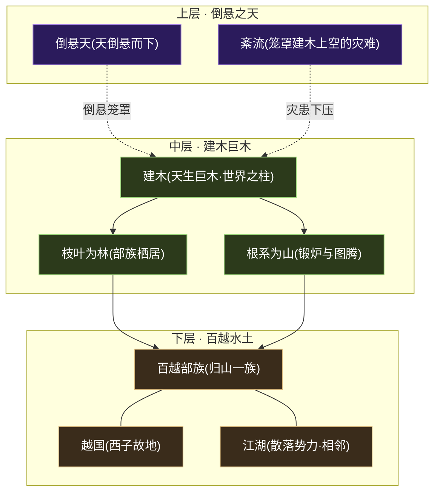
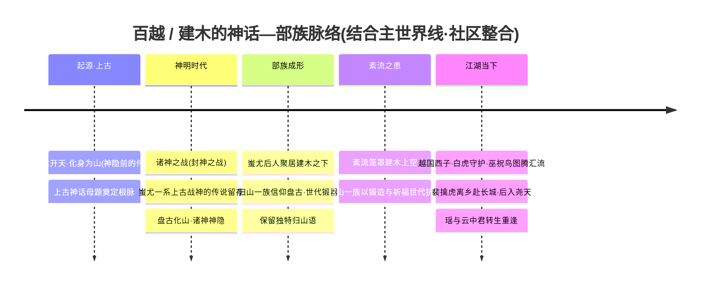
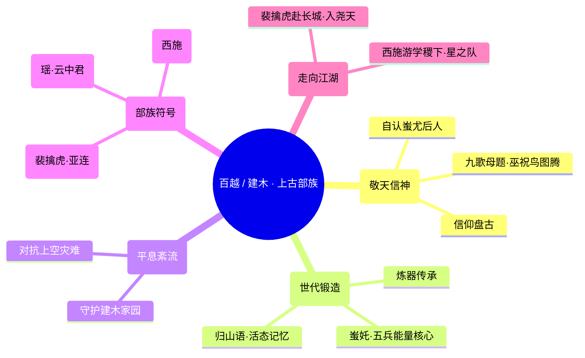
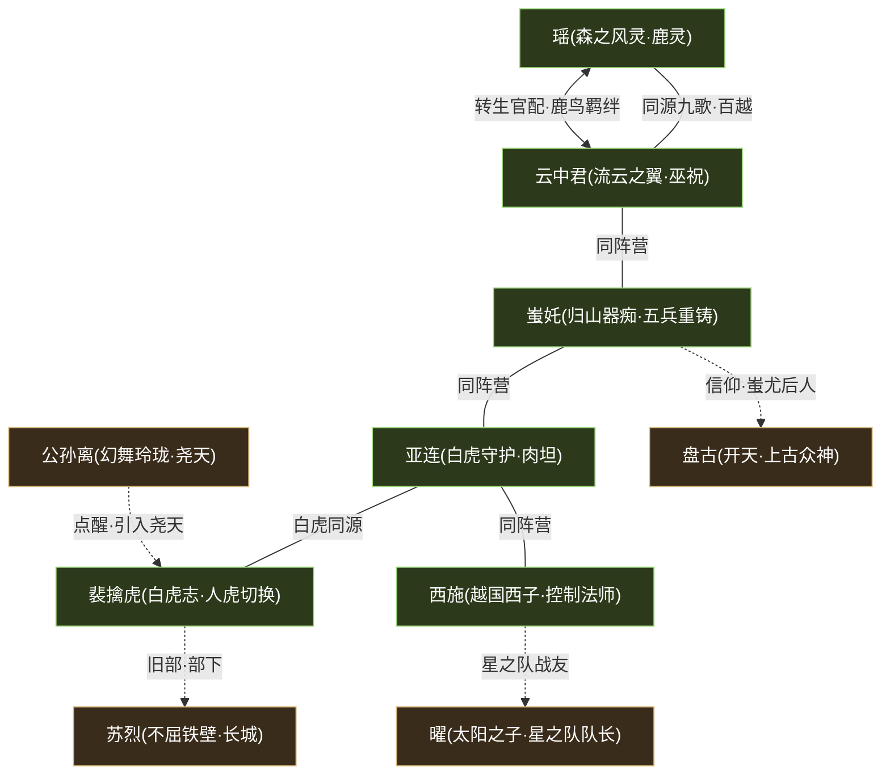
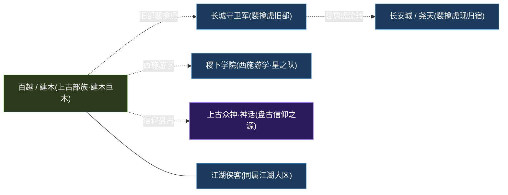

# 百越 / 建木

江湖 · 百越上古部族盘古蚩尤信仰锻造炼器

> **天生巨木拔地的边远部族 · 盘古与蚩尤信仰的活态传承 · 与「紊流」灾难抗争千年的归山一族** —— 在一棵自成山川水土的太古巨木「建木」之下，蚩尤的后人世代锻器、巫祝以鸟鲲驭风、鹿灵随风附身——这是远离帝国中枢、把上古神话当作日常的最后一片部落净土。

---

!!! abstract "阵营概述"
    **百越 / 建木**（亦称「建木地区」「归山一族」）是《王者荣耀》世界观中，以[盘古](../heroes/shanggu-shenhua.md#盘古)、**蚩尤**等上古神话为根脉的**边远部族势力**，隶属「**江湖 · 百越**」大区。它的地理核心「**建木**」，并非寻常山林，而是一棵**天生巨木拔地而起、自成山川水土**的奇异区域——巨木撑起一方天地，根系盘错为山，枝叶舒展为林，与世界观中「**倒悬天**」概念相关联（考据推测：建木上接倒悬之天，下连部族水土，构成一座垂直的世界之柱）。

    生活在建木之下的**归山一族**，相传为**蚩尤的后人**。他们**信仰[盘古](../heroes/shanggu-shenhua.md#盘古)**、世代传承**锻造之术**，把祖先的兵器与神话熔铸进日常的炉火与图腾。他们最重要的使命，是**平息笼罩建木上空的「紊流」灾难**——一种危及整片部族家园的、源于上古的天象/能量异变（考据推测：紊流或与上古十二奇迹、源能失衡的余波相关）。为守护这份记忆，他们还保留着一门外人难懂的独特语言——「**归山语**」。

    然而「百越 / 建木」并非铁板一块的单一部族，而是江湖大区里**多支上古/部落题材势力的合流**：除归山一族外，这里还汇聚了**白虎守护**的图腾传承（[裴擒虎](../heroes/baiyue.md#裴擒虎)、[亚连](../heroes/baiyue.md#亚连)）、**越国**的家国情仇（[西施](../heroes/baiyue.md#西施)）、以及取材自《九歌》的**巫祝鸟图腾**与**鹿灵转生**之恋（[云中君](../heroes/baiyue.md#云中君)×[瑶](../heroes/baiyue.md#瑶)）。它没有森严的军团建制，也没有单一的最高统帅，而是以**血脉、信仰、图腾与水土**为纽带，把六位风格迥异的英雄系于同一片「上古江湖」之下。

## 阵营档案

| 档案项 | 内容 |
| :--- | :--- |
| **阵营名** | 百越 / 建木（facId: `baiyue`） |
| **别称** | 建木地区 / 归山一族 |
| **地理位置** | 建木——天生巨木拔地而起、自成山川水土的边远区域（与[倒悬天](../worldview/map.md)关联） |
| **所属大区** | 江湖 · 百越 |
| **主题风格** | 上古部落 + 盘古蚩尤信仰 + 锻造炼器 |
| **核心领袖** | **归山一族**（蚩尤后人，以血脉与信仰为纽带的部族集体，无单一统帅；详见下文「核心人物」） |
| **成员数** | 6 名英雄（[裴擒虎](../heroes/baiyue.md#裴擒虎)、[云中君](../heroes/baiyue.md#云中君)、[西施](../heroes/baiyue.md#西施)、[瑶](../heroes/baiyue.md#瑶)、[亚连](../heroes/baiyue.md#亚连)、[蚩奼](../heroes/baiyue.md#蚩奼)） |
| **关键词** | 建木巨木 · 倒悬天 · 归山一族 · 蚩尤后人 · 信仰盘古 · 锻造炼器 · 平息紊流 · 归山语 · 白虎守护 · 巫祝鸟图腾 · 鹿鸟转生 · 越国 |

---

## 地理与环境

百越 / 建木的一切，都从那棵「**建木**」长出来。它不是阵营脚下的一处地标，而是阵营本身的**骨架与天空**——巨木拔地而起，自己撑起一方山川水土，部族就栖居在它的根、干、枝、叶之间。

!!! info "建木 · 一棵自成天地的巨木"
    据[世界观地图](../worldview/map.md)，**建木**是「天生巨木拔地而起、自成山川水土」的区域，并与「**倒悬天**」相关联。这意味着建木在世界观里至少承担三重身份：

    - **世界之柱**：一棵贯通上下的巨木，把「倒悬之天」与「部族水土」连成一根垂直轴线（考据推测）。
    - **部族家园**：归山一族栖居其上，炉火、图腾、村寨皆依附于巨木的根干枝叶。
    - **灾患前沿**：它的上空笼罩着名为「**紊流**」的灾难，平息紊流是归山一族世代不息的使命。

!!! warning "紊流 · 笼罩建木上空的灾难"
    **紊流**是悬于建木上空、危及整片部族家园的灾难性异变。其确切性质官方着墨不多——本页据世界观惯例推断（**考据推测**）：紊流可能是上古「十二奇迹 / 日之塔抽取源能」所引发的[源能失衡](../worldview/eras.md)在边远地区的余波，或是「倒悬天」自身的天象紊乱。无论成因如何，**平息紊流**都是归山一族信仰与锻造的现实落点——他们锻器、祈福、传承，归根结底是为了守住头顶这片随时可能倾覆的天。

| 地理 / 环境要素 | 性质 | 关联 |
| :--- | :--- | :--- |
| 建木（巨木本体） | 天生巨木 · 自成山川水土的世界之柱 | 归山一族全员的栖居之所 |
| 倒悬天 | 与建木关联的「天倒悬而下」奇观 | [世界观地图](../worldview/map.md)（考据推测） |
| 紊流 | 笼罩建木上空的灾难性异变 | 归山一族世代抗争的对象 |
| 越国故地 | 百越水土中的家国题材区域 | [西施](../heroes/baiyue.md#西施)（越国西子） |
| 相邻江湖 | 散落于帝国与学院之外的江湖圈层 | [江湖侠客](../factions/jianghu-xiake.md)（同属「江湖 · 百越」大区） |
| 上古神话根脉 | 盘古、蚩尤、《九歌》母题 | [上古众神·神话](../factions/shanggu-shenhua.md)、[镐京·封神](../factions/haojing-fengshen.md) |

---

## 历史沿革

百越 / 建木没有帝国式的「建制—改制」编年，它的历史是一条**从上古神话直贯到当下江湖**的血脉与信仰长河。把它放进[纪元编年](../worldview/eras.md)的主世界线里，可以看清这片部族的来路。

### 神话根脉 · 盘古与蚩尤

归山一族的精神世界，深植于[上古神话](../factions/shanggu-shenhua.md)。他们**信仰[盘古](../heroes/shanggu-shenhua.md#盘古)**——这位在[神明时代](../worldview/eras.md)「化身为山」、随诸神神隐而沉睡的开天之神；他们又自认是**蚩尤的后人**——蚩尤是上古神话中与战争、兵器、不屈意志紧密相连的传奇形象。一「开天」、一「战神」，构成了这支部族「**敬天而尚武、信神而锻器**」的双重底色。

!!! quote "归山一族 · 信仰"
    「盘古化山，山即是天；蚩尤铸兵，兵即是魂。」（考据推测的部族信条，呼应「信仰盘古、自认蚩尤后人、世代锻造」的设定。）

### 部族成形 · 归山一族聚居建木

诸神神隐、人类时代渐启之后，蚩尤的后人聚居于**建木之下**，逐渐形成「**归山一族**」。他们把祖先的神话与技艺凝成两样最重要的传承：

- **锻造之术**：世代相传的炼器手艺，是部族安身立命之本，也是对抗紊流的实际手段。
- **归山语**：一门外人难懂的独特语言，是部族身份与记忆的活态封存。

### 紊流之患 · 世代抗争

部族的命运，被头顶的「**紊流**」牢牢牵系。这场笼罩建木上空的灾难，让归山一族的锻造与信仰有了明确的现实指向——**平息紊流、守护家园**。器痴少女[蚩奼](../heroes/baiyue.md#蚩奼)正是这条主线最鲜明的载体：她以祖先遗留的**五兵能量核心**重铸武器，本质上正是把「祖先之力」转化为「对抗紊流之力」的尝试。

### 江湖当下 · 群像离合

到了[人类时代](../worldview/eras.md)的当下，「百越 / 建木」已不只是一个封闭部族，而成了多支上古题材势力的合流之地，群像各自走向不同的远方：

- 白虎少年[裴擒虎](../heroes/baiyue.md#裴擒虎)**离乡远行**——先成为[长城守卫军](../factions/changcheng.md)([苏烈](../heroes/changcheng.md#苏烈)部下),后赴长安、被[公孙离](../heroes/changan.md#公孙离)点醒而**加入尧天**探寻真相。
- 巫祝[云中君](../heroes/baiyue.md#云中君)与鹿灵[瑶](../heroes/baiyue.md#瑶)，以「鹿与孤鸟」的前世为引，**殉情转生、重逢相守**——把《九歌》的古老悲剧改写成圆满。
- 越国西子[西施](../heroes/baiyue.md#西施)则一度游学[稷下](../factions/jixia.md)，成为「**星之队**」的一员，把百越的身影带进了学院的赛场。

---

## 组织 / 理念 / 特色

如果说[长城守卫军](../factions/changcheng.md)是「以建制凝聚的军团」，那么百越 / 建木就是「**以血脉、信仰与图腾凝聚的部族**」——它没有金字塔式的统属，而是一张靠「**祖先记忆**」织成的网。

!!! note "理念一 · 信神而锻器的双重底色"
    归山一族「**信仰盘古、自认蚩尤后人**」，把「敬天」与「尚武」熔于一炉。盘古给了他们「山即是天」的敬畏，蚩尤给了他们「以兵铸魂」的刚烈。这种双重底色，使百越的英雄既有[云中君](../heroes/baiyue.md#云中君)、[瑶](../heroes/baiyue.md#瑶)那样**通灵、巫祝、与自然共生**的柔性面，也有[蚩奼](../heroes/baiyue.md#蚩奼)、[亚连](../heroes/baiyue.md#亚连)那样**锻器、搏杀、硬抗灾难**的刚性面。

!!! tip "理念二 · 把祖先之力锻成现世之器"
    与单纯「祭祀缅怀」不同，归山一族对祖先的传承是**实用而具身**的。最典型的是[蚩奼](../heroes/baiyue.md#蚩奼)——她的**武器匣**由祖先「**殳、矛、戈、戟、弓**」五兵的能量核心**重铸**而成。这意味着百越的「锻造」不是工艺展示，而是把上古之力**收纳进可随身携带、可即时战斗的器物**里，去回应「平息紊流」的现实使命。

!!! info "理念三 · 图腾即身份 · 通灵即战力"
    百越英雄的战斗方式，几乎都与「图腾 / 通灵」直接挂钩，这是它区别于其他阵营最鲜明的标签：

    - **白虎图腾**：[裴擒虎](../heroes/baiyue.md#裴擒虎)可在「**人 / 虎**」双形态间切换，[亚连](../heroes/baiyue.md#亚连)则以「**白虎守护**」之名持霸体硬抗。
    - **鸟鲲通灵**：[云中君](../heroes/baiyue.md#云中君)化身鲲/鸟飞行，背负部族巫祝信仰。
    - **鹿灵附身**：[瑶](../heroes/baiyue.md#瑶)化作鹿形附身队友，提供护盾与免控的贴身守护。

| 特色维度 | 百越 / 建木的呈现 |
| :--- | :--- |
| **组织形态** | 无单一统帅的**部族集体**，以血脉（蚩尤后人）、信仰（盘古）、语言（归山语）与图腾为纽带 |
| **题材构成** | 「归山锻造」为核心，并合流**白虎守护**、**越国**、**九歌巫祝/鹿鸟转生**三条上古题材线 |
| **战斗母题** | 形态切换（人虎/鸟鲲/鹿灵）、通灵附身、五兵重铸——「图腾即战力」 |
| **职业生态** | 职业极散：刺客×2（裴擒虎、云中君）、法师、辅助、战士/坦克、战士各1，几乎覆盖全位置 |
| **对外联系** | 通过[裴擒虎](../heroes/baiyue.md#裴擒虎)（长城→尧天）与[西施](../heroes/baiyue.md#西施)（稷下星之队）两条线，向[长城](../factions/changcheng.md)、[长安](../factions/changan.md)、[稷下](../factions/jixia.md)广泛辐射 |

---

## 核心人物

百越 / 建木**没有单一最高统帅**，其「领袖」即「**归山一族**」这一蚩尤后人的部族集体。下文先述部族整体，再以小传形式介绍最能代表本阵营各题材线的关键人物。

### 归山一族 · 部族领袖（集体）

蚩尤后人锻造世家

**归山一族**是百越 / 建木名义上的「核心领袖」——它不是某一个人，而是一支**蚩尤后人**组成的部族集体。他们**信仰[盘古](../heroes/shanggu-shenhua.md#盘古)**、世代传承**锻造术**、保留**归山语**，并以「**平息建木上空的紊流灾难**」为代代相承的使命。在本阵营的英雄中，器痴少女[蚩奼](../heroes/baiyue.md#蚩奼)是归山一族最直接、最纯正的化身。

### 蚩奼 · 归山器痴

战士

[蚩奼](../heroes/baiyue.md#蚩奼)（归山器痴），**蚩尤后人、归山一族的器痴少女**，是本阵营「锻造炼器」主题最核心的代言人。她痴迷于器物锻造，其**武器匣由祖先「殳、矛、戈、戟、弓」五兵的能量核心重铸而成**——把上古五兵之力收进一只可随身携带的匣中。在对局中，她以打野定位登场、技能近似刺客，灵动而爆发。她身上凝结了归山一族的全部理念：**敬祖、锻器、对抗紊流**。

### 裴擒虎 · 白虎志

刺客

[裴擒虎](../heroes/baiyue.md#裴擒虎)（白虎志），可**化身白虎**的少年，能在「**人 / 虎**」双形态间切换，是百越「白虎图腾」一线的代表。他的故事是本阵营**对外辐射最广**的一条：他原为[长城守卫军](../factions/changcheng.md)一员、是**不屈铁壁[苏烈](../heroes/changcheng.md#苏烈)的部下**；后离开北疆赴长安，被[公孙离](../heroes/changan.md#公孙离)点醒后**加入尧天**，活跃于长安暗处探寻真相。他像一条线，把百越的图腾血脉一路缝到了长城与长安。

### 云中君 · 流云之翼

刺客

[云中君](../heroes/baiyue.md#云中君)（流云之翼），可**化身鲲 / 鸟飞行**的**百越巫祝**，背负部族的信仰，是「九歌巫祝鸟图腾」一线的核心。他与鹿灵[瑶](../heroes/baiyue.md#瑶)的**转生官配**之恋，是全游戏最受认证的爱情线之一——原型同出《九歌》，前世为森林中相依的鹿与孤鸟，殉情后转生：阿瑶成鹿灵，孤鸟则化作「**云中神君**」守护着她。

### 瑶 · 森之风灵

辅助

[瑶](../heroes/baiyue.md#瑶)（森之风灵），可**化作鹿形附身队友**、提供护盾与免控的贴身保护辅助，是百越「鹿灵」一线的化身。她与[云中君](../heroes/baiyue.md#云中君)互为转生官配——「鹿鸟羁绊」被动、同框原画与大量互动台词，共同坐实了这段从《九歌》古老悲剧改写而来的圆满之恋。

!!! quote "瑶 × 云中君 · 鹿鸟之约"
    「前世你是林中孤鸟，我是涧边幼鹿；今生风起，我便循着风，再找到你。」（呼应瑶与云中君「鹿与孤鸟·殉情转生·重逢相守」的官配设定。）

### 西施 · 越国西子

法师

[西施](../heroes/baiyue.md#西施)（越国西子），**越国佳人**，是百越「越国」家国题材一线的代表。在对局中，她是以「**拉扯回拽**」机制著称的**控制型法师**。她还一度游学[稷下学院](../factions/jixia.md)、加入由[曜](../heroes/changan.md#曜)组建的「**星之队**」，参加[庄周](../heroes/penglai-donghai.md#庄周)主办的归虚梦演大赛——把百越的身影带进了学院的竞演舞台。

### 亚连 · 白虎守护

战士坦克

[亚连](../heroes/baiyue.md#亚连)（白虎守护），与[裴擒虎](../heroes/baiyue.md#裴擒虎)同属「白虎」一线，是本阵营的肉坦型对抗路强者。其机制以**霸体、回血、不可选中**为标志，硬朗而难缠，恰如「白虎守护」之名——一头守护部族的猛虎，把图腾的力量化作了战场上岿然不动的肉身屏障。

---

## 成员花名册

百越 / 建木的六名英雄，是江湖大区里**职业最散、题材最杂**的一支：从化虎潜杀的刺客到拉扯控场的法师，从鹿灵护盾到白虎肉坦，几乎填满了每一个位置。把他们系在一起的，不是同一支军队，而是**同一片建木水土与同一脉上古神话**。

刺客法师辅助战士坦克/防御

| 英雄 | 称号 | 定位 | 一句话身份 |
| :--- | :--- | :--- | :--- |
| [裴擒虎](../heroes/baiyue.md#裴擒虎) | 白虎志 | 刺客 | 可化身白虎、人虎双形态切换的少年，原为[长城守卫军](../factions/changcheng.md)、[苏烈](../heroes/changcheng.md#苏烈)部下，后赴长安加入尧天探寻真相。 |
| [云中君](../heroes/baiyue.md#云中君) | 流云之翼 | 刺客 | 可化身鲲/鸟飞行的百越巫祝，背负部族信仰，与[瑶](../heroes/baiyue.md#瑶)为转生官配恋人。 |
| [西施](../heroes/baiyue.md#西施) | 越国西子 | 法师 | 越国佳人，以「拉扯回拽」著称的控制型法师，曾游学稷下、加入星之队。 |
| [瑶](../heroes/baiyue.md#瑶) | 森之风灵 | 辅助 | 化作鹿形附身队友、提供护盾与免控的贴身保护辅助，与[云中君](../heroes/baiyue.md#云中君)转生官配。 |
| [亚连](../heroes/baiyue.md#亚连) | 白虎守护 | 战士/坦克 | 拥有霸体、回血、不可选中机制的对抗路强势肉坦战士，「白虎」一线的守护者。 |
| [蚩奼](../heroes/baiyue.md#蚩奼) | 归山器痴 | 战士 | 蚩尤后人、归山一族器痴少女，武器匣由祖先殳矛戈戟弓五兵能量核心重铸（打野，技能近似刺客）。 |

!!! tip "花名册速读 · 三条题材线"
    - **归山锻造线**：[蚩奼](../heroes/baiyue.md#蚩奼)（五兵重铸·器痴少女）——归山一族最纯正的化身。
    - **白虎图腾线**：[裴擒虎](../heroes/baiyue.md#裴擒虎)（人虎切换·赴长城入尧天）、[亚连](../heroes/baiyue.md#亚连)（白虎守护·霸体肉坦）。
    - **九歌巫祝 / 越国线**：[云中君](../heroes/baiyue.md#云中君)（鸟鲲飞行·巫祝）×[瑶](../heroes/baiyue.md#瑶)（鹿灵附身）的转生之恋，以及[西施](../heroes/baiyue.md#西施)（越国西子·控制法师）。

!!! note "考据 · 名册边界与「合流」性质"
    本表收录英雄目录中 facId 明确为 `baiyue` 的 6 名成员。需说明：「百越 / 建木」更近似一个**题材聚合的归属区**，而非紧密协作的同一组织——成员之间的实际「同框」很少（最强联系是[瑶](../heroes/baiyue.md#瑶)×[云中君](../heroes/baiyue.md#云中君)的转生官配），更多英雄各自有**跨阵营的故事归宿**（[裴擒虎](../heroes/baiyue.md#裴擒虎)→长城/尧天、[西施](../heroes/baiyue.md#西施)→稷下星之队）。详见下文「阵营关系」。

---

## 阵营关系

百越 / 建木的关系网，呈现出鲜明的「**内疏外密**」特征：阵营**内部**最强的连结是[瑶](../heroes/baiyue.md#瑶)×[云中君](../heroes/baiyue.md#云中君)的转生官配；而真正密集的线索，几乎全部**指向阵营之外**——[裴擒虎](../heroes/baiyue.md#裴擒虎)联通[长城](../factions/changcheng.md)与[尧天·长安](../factions/changan.md)，[西施](../heroes/baiyue.md#西施)联通[稷下](../factions/jixia.md)的星之队。

### 关系总览表

| 关系类型 | 关联人物 | 性质 | 说明 |
| :--- | :--- | :--- | :--- |
| 恋人（强官配 · 转生） | [瑶](../heroes/baiyue.md#瑶) × [云中君](../heroes/baiyue.md#云中君) | 阵营内 · 官配 | 原型同出《九歌》。前世为森林中相依的鹿与孤鸟，殉情后转生为阿瑶（鹿灵）与云中君（孤鸟成云中神君守护阿瑶）。同框原画、鹿鸟羁绊被动、大量互动台词，官方背景+游戏机制双重认证。 |
| 同阵营战友（长城守卫军） | [裴擒虎](../heroes/baiyue.md#裴擒虎) · [苏烈](../heroes/changcheng.md#苏烈) · [李信](../heroes/changan.md#李信) · [花木兰](../heroes/changan.md#花木兰) · [铠](../heroes/changan.md#铠) · [百里守约](../heroes/changcheng.md#百里守约) · [百里玄策](../heroes/changcheng.md#百里玄策) · [伽罗](../heroes/changcheng.md#伽罗) · [盾山](../heroes/changcheng.md#盾山) · [戈娅](../heroes/changcheng.md#戈娅) | 跨阵营 · 旧同袍 | 裴擒虎曾为长城守卫军、[苏烈](../heroes/changcheng.md#苏烈)部下，守护边境长城、抵御大漠魔种。 |
| 同阵营战友（尧天 · 长安） | [裴擒虎](../heroes/baiyue.md#裴擒虎) · [明世隐](changan.md) · [公孙离](../heroes/changan.md#公孙离) · [弈星](../heroes/jixia.md#弈星) · [杨玉环](../heroes/changan.md#杨玉环) | 跨阵营 · 同盟 | 以牡丹方士、尧天首领[明世隐](changan.md)为核心，借占卜谋略活跃长安暗处；公孙离敬仰前辈[杨玉环](../heroes/changan.md#杨玉环)、视[弈星](../heroes/jixia.md#弈星)如弟，裴擒虎被[公孙离](../heroes/changan.md#公孙离)点醒后加入尧天探寻真相。 |
| 战友 / 搭档（星之队） | [西施](../heroes/baiyue.md#西施) · [曜](../heroes/changan.md#曜) · [蒙犽](../heroes/yunzhong-modi.md#蒙犽) · [孙膑](../heroes/jixia.md#孙膑) · [鲁班大师](../heroes/mojia-jiguan.md#鲁班大师) | 跨阵营 · 同盟（战友） | 曜以[李白](../heroes/changan.md#李白)为偶像，于[稷下](../factions/jixia.md)组建星之队参加[庄周](../heroes/penglai-donghai.md#庄周)主办的归虚梦演大赛，于赛中收获友谊、能量与自我认知；[西施](../heroes/baiyue.md#西施)为队中法术核心。 |
| 师承（曾游学稷下三贤者） | [西施](../heroes/baiyue.md#西施) · [老夫子](../heroes/jixia.md#老夫子) · [庄周](../heroes/penglai-donghai.md#庄周) · [墨子](../heroes/mojia-jiguan.md#墨子) · [孙膑](../heroes/jixia.md#孙膑) · [钟无艳](../heroes/jixia.md#钟无艳) 等 | 跨阵营 · 师承 | 稷下三贤者有教无类广收弟子；西施曾在稷下学习，但其阵营归属仍为百越。 |
| 信仰对象 | [盘古](../heroes/shanggu-shenhua.md#盘古) · 归山一族 | 跨纪元 · 信仰 | 归山一族（蚩尤后人）信仰开天之神盘古，奉其神话为部族根脉。 |

### 关系网络图

!!! info "图例说明"
    绿色节点为**百越 / 建木本阵营**英雄，土黄色节点为**跨阵营 / 跨纪元关联**对象。实线表示阵营内关系（官配、同源、同阵营），虚线表示跨阵营或跨纪元的张力性关系（旧部、引入、星之队战友、信仰）。可见：阵营内部最强连结为[瑶](../heroes/baiyue.md#瑶)×[云中君](../heroes/baiyue.md#云中君)，而[裴擒虎](../heroes/baiyue.md#裴擒虎)、[西施](../heroes/baiyue.md#西施)的关键线索均指向阵营之外。

### 阵营间格局

!!! note "考据 · 「同阵营」标签的边界"
    资料中「同阵营战友（长城守卫军）」「同阵营战友（尧天·长安）」两组名单，是**以[裴擒虎](../heroes/baiyue.md#裴擒虎)为节点**辐射出的关系——它们记录的是裴擒虎在长城、尧天两段经历中的同袍，而非「百越 / 建木」整体与这两个阵营结盟。同理，「星之队」「师承」两组是**以[西施](../heroes/baiyue.md#西施)为节点**的外联。本页据此把它们一律标注为「跨阵营」，以免误读为阵营级同盟。

---

## 相关剧情

百越 / 建木的故事，散落在「转生之恋」「图腾流转」「锻造抗灾」三条主线里，每一条都自成一段动人的篇章。

- :material-deer: **鹿与孤鸟 · 转生重逢**

    [瑶](../heroes/baiyue.md#瑶)与[云中君](../heroes/baiyue.md#云中君)原型同出《九歌》。前世为森林中相依的**鹿与孤鸟**，殉情后转生：阿瑶成鹿灵，孤鸟化作「云中神君」守护着她。这段以「鹿鸟羁绊」被动、同框原画与大量互动台词坐实的官配之恋，是全游戏最受认证的爱情线之一。详见 [关系 · 恋人与CP](../relationships/lovers.md)。

- :material-cat: **白虎志 · 离乡的少年**

    [裴擒虎](../heroes/baiyue.md#裴擒虎)是百越「白虎」一线的化身。他从建木走向[长城](../factions/changcheng.md)、成为[苏烈](../heroes/changcheng.md#苏烈)的部下，又赴长安、被[公孙离](../heroes/changan.md#公孙离)点醒而**加入尧天探寻真相**——一条把上古图腾血脉缝进帝国边境与暗处的流浪之路。详见 [关系 · 战友与团体](../relationships/squad.md)。

- :material-hammer-wrench: **归山器痴 · 五兵重铸**

    蚩尤后人[蚩奼](../heroes/baiyue.md#蚩奼)，以祖先「殳、矛、戈、戟、弓」**五兵的能量核心重铸武器匣**——把上古之力收进随身之器，去回应归山一族「**平息建木上空紊流**」的世代使命。她是「锻造炼器」主题最纯正的代言。

- :material-flower: **越国西子 · 学院的身影**

    [西施](../heroes/baiyue.md#西施)以越国佳人之姿，一度游学[稷下学院](../factions/jixia.md)、加入[曜](../heroes/changan.md#曜)组建的「**星之队**」参加[庄周](../heroes/penglai-donghai.md#庄周)的归虚梦演大赛——把百越的身影，带进了学院竞演的舞台。详见 [关系 · 师徒与团体](../relationships/mentor.md)。

!!! example "剧情焦点 · 一棵巨木下的散与聚"
    百越 / 建木最耐人寻味之处，在于它把「**最古老的根**」与「**最自由的枝**」长在了同一棵树上：根，是归山一族对盘古的信仰、对蚩尤的追认、对紊流的世代抗争——这是「**聚**」；枝，是裴擒虎远赴边塞与长安、西施游学稷下、瑶与云中君跨越生死的重逢——这是「**散**」。它不像军团那样讲究铁的纪律，而像一片真正的「**上古江湖**」：每个人都从同一棵建木出发，却各自走向了自己的天涯，又在某个风起的时刻，循着血脉与惦念，再度找到彼此。

---

## 延伸阅读

- :material-account-star: **百越 / 建木英雄图鉴**

    本阵营全体英雄（裴擒虎、云中君、西施、瑶、亚连、蚩奼）的档案、背景与台词，见 [百越 / 建木英雄页](../heroes/baiyue.md)。

- :material-map: **王者大陆地图 · 建木**

    建木巨木、倒悬天与江湖大区的地理格局，见 [地图 · 边远部族与江湖](../worldview/map.md)。

- :material-timeline-clock: **纪元编年**

    盘古化山、诸神神隐与上古神话母题的来龙去脉，见 [纪元编年](../worldview/eras.md)。

- :material-heart: **专题 · 恋人与CP**

    瑶×云中君「鹿与孤鸟·转生重逢」的严谨度与全游戏官配谱系，见 [关系 · 恋人与CP](../relationships/lovers.md)。

- :material-account-group: **关系 · 战友与团体**

    裴擒虎的长城/尧天流转、西施的星之队，见 [战友与团体](../relationships/squad.md)。

- :material-shield-sword: **相邻阵营 · 长城守卫军**

    裴擒虎旧部、抵御大漠魔种的北疆铁壁，见 [长城守卫军](../factions/changcheng.md)。

- :material-city: **关联阵营 · 长安城（尧天）**

    裴擒虎的现归宿、尧天暗势力的中枢，见 [长安城](../factions/changan.md)。

- :material-pine-tree: **同大区 · 江湖侠客**

    同属「江湖 · 百越」、游离于帝国与学院之外的散落势力，见 [江湖侠客](../factions/jianghu-xiake.md)。

- :material-creation: **信仰之源 · 上古众神·神话**

    归山一族所信仰的开天之神盘古所在阵营，见 [上古众神·神话](../factions/shanggu-shenhua.md)。

!!! quote "结语 · 风起时，再找到你"
    它是一棵自成天地的巨木，是蚩尤后人世代不息的炉火，是头顶那片随时可能倾覆、却被一锤一锤守住的天。在这片远离帝国与学院的上古江湖里，有化虎的少年、驭鸟的巫祝、附身的鹿灵、重铸五兵的器痴——他们信着同一位开天之神，说着同一门归山之语，从同一棵建木出发，走向各自的天涯。而当风再度吹过建木的枝叶时，人们会记得：**百越守护的，从来不只是一片水土，而是「无论走多远，都循着风再找到你」的那份古老的惦念。**
