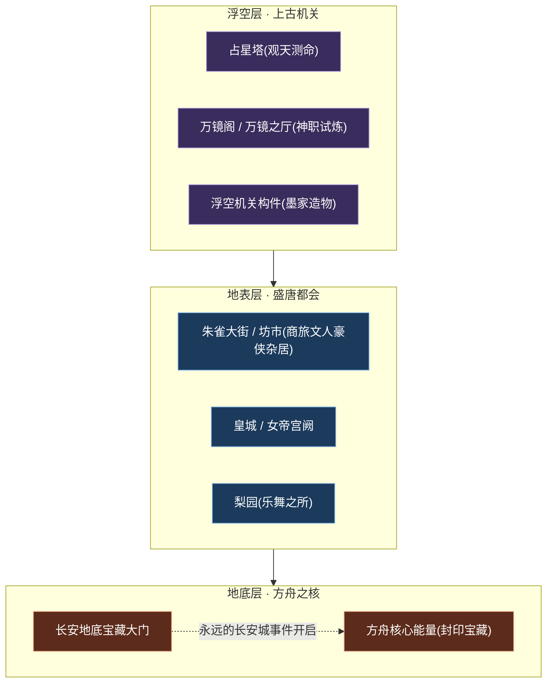
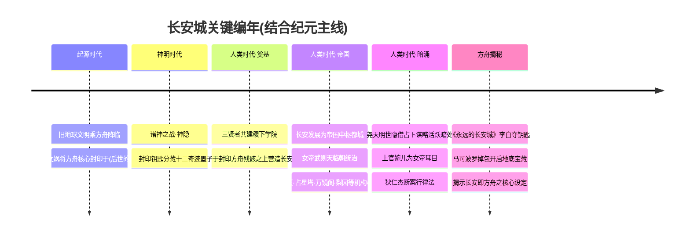
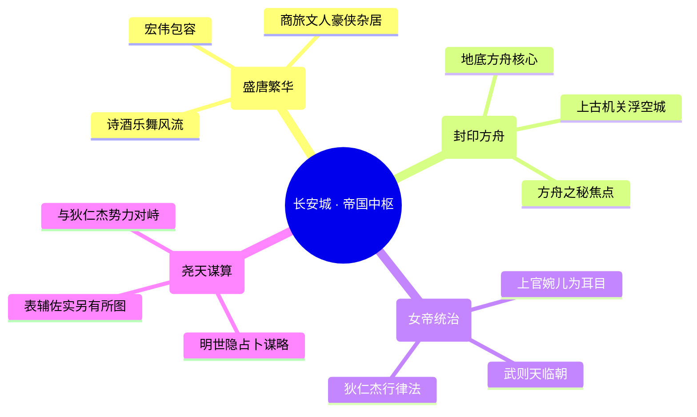
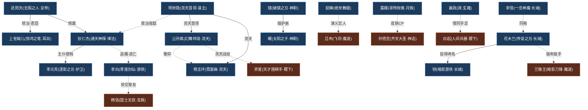

# 长安城

中枢 · 长安帝国都城封印方舟

> **大陆第一雄城 · 帝国中枢 · 方舟之秘的焦点** —— 由稷下三贤者之一墨子亲手营造的盛唐雄城，繁华表象之下，封印着足以颠覆世界的方舟核心。

---

::: info 阵营概述
**长安城**（亦称「大陆第一雄城」「河洛」）坐落于河洛地区东南、王者大陆的几何中心，是[人类时代](../worldview/eras.md#人类时代--英雄逐鹿时代)当之无愧的帝国中枢。它的真身，是起源时代被[女娲](../heroes/shanggu-shenhua.md#女娲)封印于此、由机关大师[墨子](../heroes/mojia-jiguan.md#墨子)在其残骸之上亲手建造的——**一艘封印的方舟**。城市的地底，封存着[方舟核心](../worldview/concepts.md#方舟核心宇宙之心)的庞大能量；城市的地表，则是一座盛唐气象的繁华都会与上古机关浮空城的奇妙结合体。

长安宏伟而包容：商旅、文人、豪侠、异族、机关造物在此和谐聚居，街市鳞次栉比，诗酒风流与机括锋芒并存。一代女皇[武则天](../heroes/changan.md#武则天)君临此城，下辖神秘组织**尧天**（[明世隐](#明世隐--尧天首领)创立）、**占星塔**、**万镜阁**、**梨园**等机构，明面维护盛世太平，暗处则各怀机心。这里既是律法与诗意交织的人间天堂，也是围绕「方舟之秘」明争暗斗的漩涡中心——一座城，便是一个时代的缩影。
:::

## 阵营档案

| 档案项 | 内容 |
| :--- | :--- |
| **阵营名** | 长安城（facId: `changan`） |
| **别称** | 大陆第一雄城 / 河洛 |
| **地理位置** | 河洛地区东南、王者大陆中心 |
| **所属大区** | 中枢 · 长安 |
| **主题风格** | 盛唐都市 + 上古机关浮空城 + 方舟之秘 |
| **核心领袖** | [武则天](../heroes/changan.md#武则天)（无瑕之人 · 统治者）、[墨子](../heroes/mojia-jiguan.md#墨子)（建城者）、[明世隐](#明世隐--尧天首领)（尧天首领） |
| **成员数** | 26 名英雄（本阵营名册收录） |
| **关键词** | 封印方舟 · 帝国中枢 · 盛唐繁华 · 女帝统治 · 尧天暗影 · 律法与诗意 |

---

## 地理与环境

长安城雄踞于**河洛地区东南**，恰处王者大陆地理中心——这并非偶然，而是「天命所归」的世界观必然：它的脚下，封存着整个文明的能量源头。

::: info 三层垂直空间
长安城的空间结构可粗分为三层：

- **浮空层（上古机关）**：占星塔、万镜阁等机关建筑悬浮其上，是墨家机关术与上古方舟遗构的结合，承担观星、试炼、能量调控等功能。
- **地表层（盛唐都会）**：朱雀大街、坊市、皇城、梨园构成繁华人间，是商旅、文人、豪侠、异族聚居的烟火舞台。
- **地底层（方舟之核）**：封存方舟核心能量的「宝藏」深藏地底，由历代守护者（如[钟馗](../heroes/changan.md#钟馗)）看守，直到《永远的长安城》事件被揭开。
:::

::: tip 盛唐 × 机关 × 方舟的美学三重奏
长安的视觉母题是「盛唐气象」与「上古机关浮空城」的叠合：飞檐斗拱、丝竹歌舞、诗酒繁华是它的「皮相」；而齿轮、浮空机括、能量管道则是它「方舟」本质的暗示。这种「繁华都市包裹着封印巨构」的反差，正是长安城最迷人的设定张力。
:::

| 地标 | 性质 | 关联 |
| :--- | :--- | :--- |
| 皇城 / 女帝宫阙 | 帝国权力中枢 | [武则天](../heroes/changan.md#武则天)、[上官婉儿](../heroes/changan.md#上官婉儿) |
| 占星塔 | 观天测命的机关高塔 | 尧天体系、星象推演 |
| 万镜阁 / 万镜之厅 | 神职家族的试炼之所 | [镜](../heroes/changan.md#镜)在此获力 |
| 梨园 | 盛唐乐舞之所 | [杨玉环](../heroes/changan.md#杨玉环)、[公孙离](../heroes/changan.md#公孙离)（考据推测） |
| 地底宝藏 | 封印的方舟核心能量 | [钟馗](../heroes/changan.md#钟馗)守护、[李白](../heroes/changan.md#李白)夺钥 |

---

## 历史沿革

长安城的历史，几乎就是整部王者世界观的「纵贯线」——从起源时代的封印，到人类时代的繁华，再到方舟之秘的揭露，它始终是命运的焦点。

### 起源 · 封印之始

据[纪元编年](../worldview/eras.md#起源时代太古时代)，**起源时代末期**，神明中的[女娲](../heroes/shanggu-shenhua.md#女娲)将创世引擎——**[方舟核心](../worldview/concepts.md#方舟核心宇宙之心)（宇宙之心）**——封印于一处地底，并将解封钥匙分藏于横贯大陆的[十二奇迹](../worldview/concepts.md#十二奇迹)之中。这处封印之地，正是后世长安城的所在。换言之，长安的「城」尚未诞生，长安的「秘」便已埋下。

::: warning 核心秘密 · 长安城即封印的方舟
长安城的本质，并非一座普通帝都，而是起源时代**被封印的方舟本身**！其地底封存着方舟核心的能量，繁华的城市只是包裹封印的「外壳」。这一设定使长安天然成为后世群雄争夺的终极焦点——得长安者，得方舟之核，得世界之能量总枢纽。
:::

### 营造 · 墨子建城

进入[人类时代](../worldview/eras.md#人类时代--英雄逐鹿时代)，[稷下学院](../factions/jixia.md)的三贤者之一、机关大师[墨子](../heroes/mojia-jiguan.md#墨子)，在封印方舟的残骸之上**亲手营造了长安城**。以墨家机关之术，他将上古浮空构件与盛唐都市熔铸为一体，造就了「大陆第一雄城」。墨子因此被尊为长安的**建城者**，虽其阵营归属仍在[墨家机关城·天工坊](../factions/mojia-jiguan.md)，但长安的「骨血」里，流淌着墨家的智慧。

### 兴盛 · 女帝临朝

长安与**玄雍**（[嬴政](../heroes/changan.md#嬴政)所据的帝王疆域）并称人类时代的两大帝国中枢（考据推测，「玄雍」之名见于[白起](../heroes/jixia.md#白起)、嬴政背景一脉的设定）。一代女皇[武则天](../heroes/changan.md#武则天)君临此城，建立起以女帝为核心的统治秩序。城中机构林立：

<a class="hok-card" href="../heroes/changan#李元芳">女帝势力以为核心，为耳目密探、书世间万象，与以律法神探护持秩序。</a>
<a class="hok-card" href="#明世隐--尧天首领">尧天（暗处）牡丹方士创立，表面辅佐女帝维护盛世，实则另有所图，借占卜谋略活跃于长安暗处。</a>
<a class="hok-card" href="../heroes/changan#镜">占星塔 / 万镜阁占星塔观天测命；万镜阁（万镜之厅）是神职家族的试炼之所，在此获得破镜之力。</a>
<a class="hok-card" href="../heroes/changan#公孙离">梨园盛唐乐舞之所，孕育出、等以乐舞入世的英雄（考据推测）。</a>

### 揭秘 · 永远的长安城

::: quote 李白 · 青莲剑仙
「十步杀一人，千里不留行。事了拂衣去，深藏身与名。」
:::

人类时代的高潮事件**《永远的长安城》**，将长安的终极秘密推到台前：游侠剑客[李白](../heroes/changan.md#李白)击杀地底宝藏的守护者[钟馗](../heroes/changan.md#钟馗)、夺取宝藏钥匙，途中遭遇[李元芳](../heroes/changan.md#李元芳)与[狄仁杰](../heroes/changan.md#狄仁杰)；混战之中，钥匙被江湖游商[马可波罗](../heroes/jianghu-xiake.md#马可波罗)掉包，马可波罗开启了长安地底宝藏的大门——**「长安城即方舟、地底宝藏即方舟能量」的核心设定，由此正式揭开**。这一事件，是连接「人类时代」与「破晓事件」的关键枢纽。

---

## 组织 / 理念 / 特色

长安城的精神内核，可以浓缩为一组看似矛盾、却浑然一体的对照：**繁华与封印、律法与诗意、盛世与暗涌**。

::: info 理念一 · 宏伟包容，万族汇流
长安最鲜明的气质是「包容」。它不拘出身、不问族裔——汉末佳人[貂蝉](../heroes/changan.md#貂蝉)、狐族血脉的剑仙[李白](../heroes/changan.md#李白)、出塞和亲的使者[王昭君](../heroes/changan.md#王昭君)、灵山弟子[金蝉](../heroes/changan.md#金蝉)、月之家族的[露娜](../heroes/changan.md#露娜)、神职家族的姐弟[镜](../heroes/changan.md#镜)与[曜](../heroes/changan.md#曜)……皆能在此立足。这种「五湖四海，皆为长安人」的气度，正是盛唐母题的内核。
:::

::: info 理念二 · 律法与诗意的双轨
长安既有[狄仁杰](../heroes/changan.md#狄仁杰)「断案如神、以律法行正义」的秩序之轨，也有[李白](../heroes/changan.md#李白)「十步杀一人、事了拂衣去」的诗酒游侠之轨。神探追捕剑客（狄仁杰—李白的追捕逃亡线），恰是这座城「秩序」与「自由」永恒张力的缩影。
:::

::: warning 理念三 · 盛世表象下的暗涌
长安的繁华之下，是各方势力的暗中角力。**尧天**表面辅佐女帝、维护盛世，实则另有所图，与[狄仁杰](../heroes/changan.md#狄仁杰)为首的势力暗中对峙；女帝武则天则以[上官婉儿](../heroes/changan.md#上官婉儿)为耳目，洞察世间万象。这座城，从来不只是太平人间。
:::

| 特色维度 | 长安城的呈现 |
| :--- | :--- |
| **职业生态** | 法师阵容空前庞大（武则天、嬴政、芈月、王昭君、张良、貂蝉、钟馗等），堪称「法师之都」 |
| **英雄来源** | 原创（云缨）、历史（武则天、狄仁杰）、神话西游（金蝉）、神职家族（曜、镜）兼容并蓄 |
| **机构网络** | 女帝势力 / 尧天 / 占星塔 / 万镜阁 / 梨园多线并行 |
| **跨阵营纽带** | 与[长城守卫军](../factions/changcheng.md)（李信、花木兰、铠）、[稷下学院](../factions/jixia.md)（明世隐、师承网络）深度交织 |

---

## 核心人物

长安城的权力与传奇，系于三位关键人物——明面的女帝、奠基的建城者、暗处的谋主。

### 武则天 · 无瑕之人

法师

[武则天](../heroes/changan.md#武则天)，一代女皇，长安城的最高统治者。在世界观叙事中，她君临帝国中枢，建立起以自身为核心的女帝势力网络——[上官婉儿](../heroes/changan.md#上官婉儿)为她的耳目密探、代陛下书写世间万象，[狄仁杰](../heroes/changan.md#狄仁杰)、[李元芳](../heroes/changan.md#李元芳)则以律法神探之姿护持秩序。在对局中，她是「全图控场」的超模史诗级法师，一手覆盖全场的能量场域，恰如其「无瑕」之名所暗示的、对长安无远弗届的掌控。她是长安城「秩序」一面的化身。

### 墨子 · 建城者

战士/法师

[墨子](../heroes/mojia-jiguan.md#墨子)（和平守望），[稷下学院](../factions/jixia.md)三贤者之一、机关大师。他在封印方舟的残骸之上**亲手营造了长安城**，以墨家机关之术将上古浮空构件与盛唐都会熔铸为「大陆第一雄城」。虽然他的阵营归属在[墨家机关城·天工坊](../factions/mojia-jiguan.md)，但长安城的存在本身，便是他智慧与理念的丰碑。没有墨子，便没有长安。

### 明世隐 · 尧天首领

幕后谋主

**明世隐**，牡丹方士，神秘组织**尧天**的创立者与核心。尧天表面辅佐女帝[武则天](../heroes/changan.md#武则天)维护盛世，实则另有所图，借占卜谋略活跃于长安暗处，与[狄仁杰](../heroes/changan.md#狄仁杰)为首的势力暗中对峙。他门下汇聚了[弈星](../heroes/jixia.md#弈星)（亲传弟子）、[杨玉环](../heroes/changan.md#杨玉环)、[公孙离](../heroes/changan.md#公孙离)、[裴擒虎](../heroes/baiyue.md#裴擒虎)等成员，是一张隐于盛世繁华背后、运筹于无形的情报与谋略之网。他更是[破晓事件](../worldview/eras.md#破晓事件--破晓宇宙)的幕后推手——正是在他的谋划下，[花木兰](../heroes/changan.md#花木兰)砍碎了上古奇迹宝石[破晓之心](../worldview/concepts.md#破晓之心)。明世隐是长安城「暗涌」一面的灵魂人物。

::: info 考据 · 明世隐的英雄归属
明世隐作为可玩英雄，在世界观骨架中以尧天首领、长安暗处的谋主身份登场，目前尚无独立的英雄词条页（无独立 facId）。本页将其作为长安城的核心领袖之一记述；其作为「破晓事件」推手的角色，另见 [纪元编年 · 破晓事件](../worldview/eras.md#破晓事件--破晓宇宙) 与 [平行世界专题](../topics/parallel-worlds.md)。
:::

---

## 成员花名册

长安城是英雄数量最为庞大、职业生态最为丰富的阵营之一——尤以「法师」阵容蔚为大观，亦不乏战士、刺客、射手与辅助，可谓「百业咸集，群星璀璨」。

坦克/防御战士刺客法师射手辅助

| 英雄 | 称号 | 定位 | 一句话身份 |
| :--- | :--- | :--- | :--- |
| [亚瑟](../heroes/changan.md#亚瑟) | 圣骑士之王 | 战士/坦克 | 失忆的破败王城骑士王，新手最易上手的均衡型战士。 |
| [铠](../heroes/changan.md#铠) | 暗影游侠 | 战士/坦克 | 从日落海漂流而来、被花木兰拾得命名，持暗影之剑可化身狂暴姿态的龙域守护者（亦关联长城守卫军）。 |
| [狂铁](../heroes/changan.md#狂铁) | 百炼成钢 | 战士 | 残臂铁拳战士，靠仇恨值叠加机械义肢爆发的近战战士。 |
| [李信](../heroes/changan.md#李信) | 一念神魔 | 战士 | 长城守卫军前统帅，可在光信/暗信两形态切换，光为坦克型、暗为爆发刺杀型。 |
| [李白](../heroes/changan.md#李白) | 青莲剑仙 | 刺客 | 浪迹江湖的剑客诗人、十步杀一人，长安最负盛名的游侠，狐族血脉。 |
| [上官婉儿](../heroes/changan.md#上官婉儿) | 惊鸿之笔 | 法师/刺客 | 以笔为剑的盛唐才女法刺，女帝耳目密探，连招华丽、操作上限极高。 |
| [武则天](../heroes/changan.md#武则天) | 无瑕之人 | 法师 | 一代女皇，全图控场的超模史诗级法师，长安统治者。 |
| [嬴政](../heroes/changan.md#嬴政) | 政 | 法师 | 召唤剑域、远程消耗的帝王法师（始皇/玄雍之主于长安体系登场）。 |
| [芈月](../heroes/changan.md#芈月) | 惑国妖姬 | 法师 | 吸血续航的血怒法师/法坦。 |
| [王昭君](../heroes/changan.md#王昭君) | 冰雪之华 | 法师 | 操控冰霜的范围控制法师，出塞和亲使者。 |
| [张良](../heroes/changan.md#张良) | 谋圣 | 法师 | 强单体禁锢控制法师，汉初谋臣。 |
| [貂蝉](../heroes/changan.md#貂蝉) | 绝世舞姬 | 法师 | 灵动飘逸、续航强的法刺/法师，汉末佳人。 |
| [钟馗](../heroes/changan.md#钟馗) | 地府判官 | 法师 | 钩控起手的半肉控制法师，地府捉鬼天师，长安宝藏守护者。 |
| [杨玉环](../heroes/changan.md#杨玉环) | 霓裳曲 | 辅助/法师 | 盛唐贵妃，远程音波治疗+群体回血的音波辅助型法师，尧天成员。 |
| [司空震](../heroes/changan.md#司空震) | 雷霆之王 | 战士/法师 | 操控风雷的长安股肱重臣，中边两路皆强的爆发战士法师。 |
| [金蝉](../heroes/changan.md#金蝉) | 圣愿 | 法师/辅助 | 灵山弟子、玄奘转世，兼具护盾辅助的法师（早期带辅助标签，现主定位法师）。 |
| [曜](../heroes/changan.md#曜) | 太阳之子 | 战士/刺客 | 出身神职者家族、镜之弟，持武器逐、靠星位机制位移连招，组建星之队。 |
| [云缨](../heroes/changan.md#云缨) | 红缨枪魂 | 战士/刺客 | 长安原创战刺女枪兵，靠枪诀连招层数爆发的高操作英雄。 |
| [花木兰](../heroes/changan.md#花木兰) | 传说之刃 | 战士/刺客 | 长城守卫军女将、长城小队队长，可切换长剑/双剑双形态，替父从军（亦关联长城守卫军）。 |
| [露娜](../heroes/changan.md#露娜) | 哥特玫瑰 | 战士/法师 | 月之祭司、月之家族成员，靠月下无限连刷新技能的高操作法刺。 |
| [程咬金](../heroes/changan.md#程咬金) | 热烈之斧 | 坦克/战士 | 自带回血、越战越勇的莽夫型坦克，长安福将（瓦岗出身）。 |
| [狄仁杰](../heroes/changan.md#狄仁杰) | 通天神探 | 射手 | 大唐神探，断案如神，以左轮短枪行使律法正义。 |
| [李元芳](../heroes/changan.md#李元芳) | 逐影之刃 | 射手 | 狄仁杰的护卫与得力助手，身手矫健的弩手刺客型射手。 |
| [公孙离](../heroes/changan.md#公孙离) | 幻舞玲珑 | 射手 | 油纸伞舞姬，身姿翩跹的伞舞射手，尧天成员，敬仰杨玉环、视弈星如弟。 |
| [达摩](../heroes/changan.md#达摩) | 破碎黎明 | 战士 | 拳僧，高机动突进+击飞的近战战士，长安护法。 |
| [镜](../heroes/changan.md#镜) | 破镜之刃 | 刺客 | 操纵破碎魔镜的女刺客、曜之姐，出身古老神职家族，经万镜之厅试炼获力（亦关联玄雍/暗影情报）。 |

::: tip 花名册速读 · 长安的三股力量
- **女帝秩序线**：武则天、上官婉儿、狄仁杰、李元芳——明面的统治与律法。
- **尧天暗影线**：明世隐（首领）、杨玉环、公孙离——暗处的占卜与谋算。
- **游侠 / 异族 / 神职线**：李白、镜、曜、露娜、金蝉、貂蝉、王昭君——五湖四海汇流长安的多元血脉。
:::

---

## 阵营关系

长安城的关系网，横跨女帝势力、尧天、长城守卫军、神职家族、稷下师承等多条线索，既有内部羁绊，也有跨阵营的同盟与宿敌。

### 关系总览表

| 关系类型 | 关联人物 | 性质 | 说明 |
| :--- | :--- | :--- | :--- |
| 主仆 / 君臣式羁绊 | [武则天](../heroes/changan.md#武则天)·[上官婉儿](../heroes/changan.md#上官婉儿)·[狄仁杰](../heroes/changan.md#狄仁杰)·[李元芳](../heroes/changan.md#李元芳) | 同阵营 · 统属 | 女帝统治长安；婉儿为耳目密探，因祖父牵连谋反案沦为奴婢后凭书道获重用。 |
| 追捕—逃亡 | [狄仁杰](../heroes/changan.md#狄仁杰)·[李白](../heroes/changan.md#李白) | 同阵营 · 张力 | 城内李白为狄仁杰的追捕对象，因女帝串联李白—狄仁杰—武则天—婉儿。 |
| 对立阵营 / 政治宿敌 | [明世隐](#明世隐--尧天首领)·[狄仁杰](../heroes/changan.md#狄仁杰) | 同城 · 对峙 | 尧天表面辅佐女帝、实则另有所图，与狄仁杰为首的势力对峙。 |
| 同阵营战友（尧天） | [明世隐](#明世隐--尧天首领)·[公孙离](../heroes/changan.md#公孙离)·[弈星](../heroes/jixia.md#弈星)·[杨玉环](../heroes/changan.md#杨玉环)·[裴擒虎](../heroes/baiyue.md#裴擒虎) | 跨阵营 · 同盟 | 以牡丹方士明世隐为核心，借占卜谋略活跃暗处；公孙离敬仰杨玉环、视弈星如弟，裴擒虎被公孙离点醒后加入尧天探寻身世真相。 |
| 同阵营战友（长城） | [苏烈](../heroes/changcheng.md#苏烈)·[李信](../heroes/changan.md#李信)·[花木兰](../heroes/changan.md#花木兰)·[铠](../heroes/changan.md#铠) 等 | 跨阵营 · 同盟 | 守护边境长城、抵御大漠魔种；苏烈接纳教导李信，李信后接任指挥官。 |
| 姐弟 / 兄妹（神职家族） | [镜](../heroes/changan.md#镜)·[曜](../heroes/changan.md#曜) | 同阵营 · 血亲 | 出身古老神职家族，父母失踪；镜带曜抹去身份流浪，镜对曜有护持之责。 |
| 战友 / 搭档（星之队） | [曜](../heroes/changan.md#曜)·[蒙犽](../heroes/yunzhong-modi.md#蒙犽)·[孙膑](../heroes/jixia.md#孙膑)·[西施](../heroes/baiyue.md#西施)·[鲁班大师](../heroes/mojia-jiguan.md#鲁班大师) | 跨阵营 · 同盟 | 曜以李白为偶像，于稷下组建星之队参加归虚梦演大赛。 |
| 君臣 / 情同手足 | [嬴政](../heroes/changan.md#嬴政)·[白起](../heroes/jixia.md#白起) | 跨阵营 · 羁绊 | 表为玄雍君臣、实情同手足；白起护嬴政受伤感染血族之力，数十年共生。 |
| 世交挚友 | [李白](../heroes/changan.md#李白)·[韩信](../heroes/jianghu-xiake.md#韩信) | 跨阵营 · 挚友 | 李白属狐族、韩信属龙族，两族世代为友，自幼相识共修（信白CP，官方更近世交挚友）。 |
| 宿命 / 敌手（恋人色彩） | [花木兰](../heroes/changan.md#花木兰)·[兰陵王](../heroes/modao-shadow-abyss.md#兰陵王) | 跨阵营 · 宿敌 | 双兰组合，花木兰常与潜入长城的兰陵王交锋，生出不一样的感情。 |
| 恋人（演义 + CP活动） | [吕布](../heroes/modao-shadow-abyss.md#吕布)·[貂蝉](../heroes/changan.md#貂蝉) | 跨阵营 · 恋人 | 演义关联，吕布台词常念貂蝉，官方CP活动认证。 |
| 皮肤CP（主线未相遇） | [孙悟空](../heroes/shanggu-shenhua.md#孙悟空)·[露娜](../heroes/changan.md#露娜) | 跨阵营 · 皮肤CP | 灵感取自《大话西游》；主线中二人从未相遇，属皮肤钦定CP。 |
| 皮肤CP（仰慕向 · 存争议） | [亚瑟](../heroes/changan.md#亚瑟)·[安琪拉](../heroes/jixia.md#安琪拉) | 跨阵营 · 皮肤CP | 安琪拉对亚瑟有倾慕，官方多套CP皮肤；有说法亚瑟剧情向CP是艾琳，存争议。 |
| 师承（三贤者→弟子） | [墨子](../heroes/mojia-jiguan.md#墨子)·[曜](../heroes/changan.md#曜)·[镜](../heroes/changan.md#镜) 等 | 跨阵营 · 师承 | 稷下三贤者有教无类；曜、镜等曾在稷下学习。 |

::: info 考据 · 「曾在稷下学习」≠「稷下阵营」
据世界观骨架，师承网络中诸多英雄曾在[稷下学院](../factions/jixia.md)求学，但其阵营归属未必属稷下。长安体系中的[曜](../heroes/changan.md#曜)、[镜](../heroes/changan.md#镜)即属此类——他们师从三贤者、组建星之队，阵营却归长安城。
:::

### 关系网络图

::: info 图例说明
深蓝节点为**长安城本阵营**人物，棕色节点为**跨阵营关联**人物。实线表示阵营内统属 / 血亲 / 搭档，虚线表示跨阵营或张力性关系（追捕、宿敌、恋人、CP、挚友等）。明世隐作为尧天首领，以英雄身份出现于关系网中。
:::

---

## 相关剧情

长安城是众多重要剧情的舞台与焦点，以下为与本阵营最紧密的几条故事线。

<a class="hok-card" href="../worldview/eras#永远的长安城揭示方舟之秘">《永远的长安城》夺钥、守护、与追缉、掉包开门——长安即方舟、方舟能量即地底宝藏的核心秘密就此揭开。详见 。</a>
<a class="hok-card" href="../worldview/eras#破晓事件--破晓宇宙">尧天的暗中谋算率、、、借占卜谋略活跃暗处，与势力对峙，更是的幕后推手。</a>
<a class="hok-card" href="../factions/changcheng">长城与长安的交织、、同时关联，守护边境、抵御大漠魔种，构成长安与北疆的纽带。</a>
<a class="hok-card" href="../factions/jixia">万镜之厅与星之队神职姐弟与的羁绊，镜经万镜之厅试炼获力、曜组建星之队参加归虚梦演大赛。</a>

::: info 剧情焦点 · 一城牵动天下
长安城的剧情之所以举足轻重，在于它同时承载了三重张力：**纵向**上，它连接起源时代的封印与人类时代的揭秘（方舟之秘）；**横向**上，它牵动长城、稷下、魔道、神话等多个阵营（关系网枢纽）；**内部**上，它上演女帝秩序与尧天暗影的明暗对峙（政治博弈）。一城之事，便是天下之事。
:::

---

## 延伸阅读

<a class="hok-card" href="../heroes/changan">长安城英雄图鉴本阵营全体英雄的档案、背景与台词，见 。</a>
<a class="hok-card" href="../worldview/eras">纪元编年长安的封印、营造与揭秘，置于完整纪元脉络之中，见 。</a>
<a class="hok-card" href="../worldview/overview">世界观总览方舟、方舟核心、十二奇迹、等级金字塔的底层骨架，见 。</a>
<a class="hok-card" href="../topics/parallel-worlds">平行世界专题破晓事件、破晓宇宙与长安英雄的关联，见 。</a>
<a class="hok-card" href="../factions/changcheng">相邻阵营 · 长城守卫军与长安深度交织的北疆军团，见 。</a>
<a class="hok-card" href="../factions/jixia">相邻阵营 · 稷下学院三贤者师承与星之队的渊源地，见 。</a>
<a class="hok-card" href="../factions/mojia-jiguan">建城渊源 · 墨家机关城长安建城者墨子的所属阵营，见 。</a>
<a class="hok-card" href="../relationships/index">人物关系总览以关系网读懂长安群英的恩怨情仇，见 。</a>

::: quote 结语 · 长安一梦
它是盛唐的繁华，是诗酒的风流，是律法的森严，是暗影的谋算——而在这一切之下，它是一艘封印了世界命运的方舟。当李白的剑光划破长安的夜，当地底宝藏的大门缓缓开启，人们才惊觉：原来这座大陆第一雄城，从来就不只是一座城。**长安城，即是那艘永远沉睡、又终将苏醒的方舟。**
:::