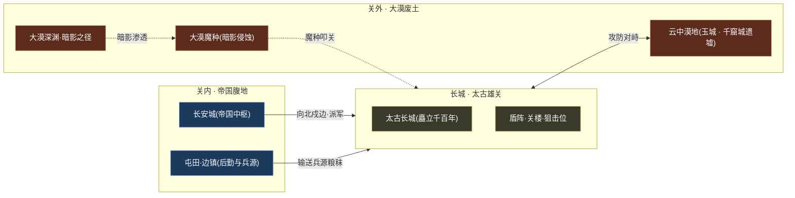
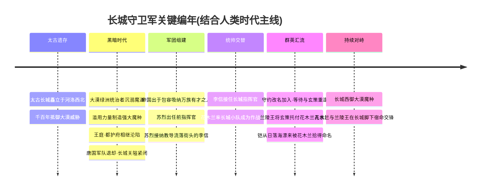
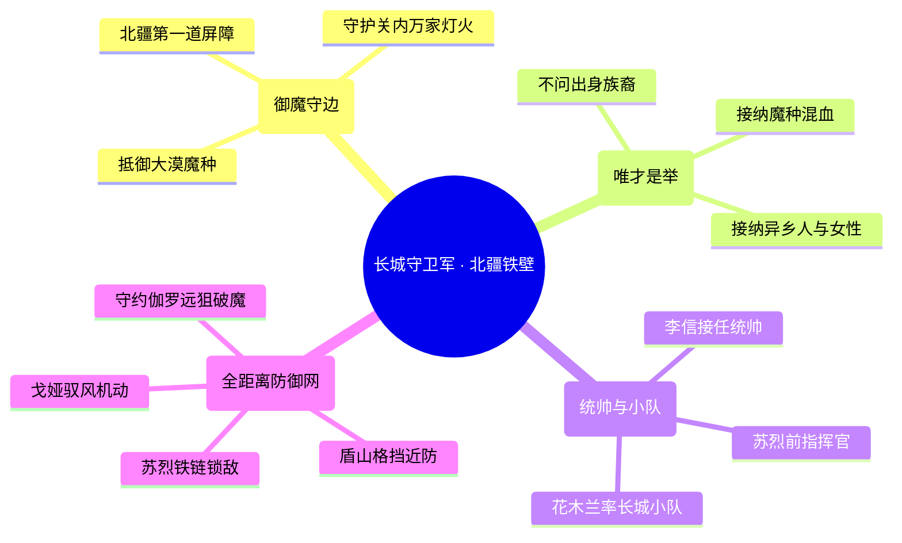
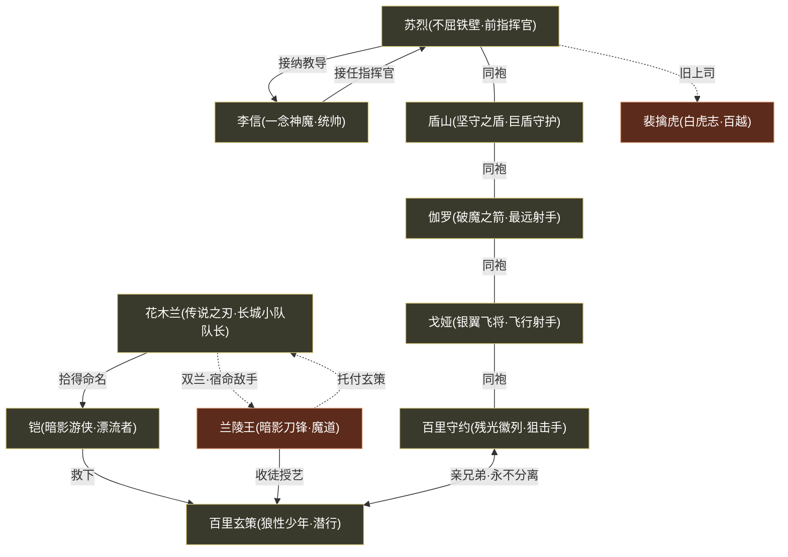
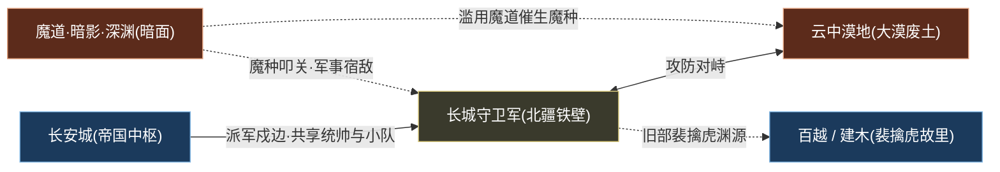

# 长城守卫军

北疆 · 边陲边塞军团多元包容

> **北疆第一道屏障 · 不问出身的破魔铁壁 · 太古长城的最后守望者** —— 矗立千百年的太古长城之上，一支吸纳了魔种混血、异乡人、屯田后裔乃至女子的多元军团，以盾、链、长狙与破魔之箭，独抗来自大漠的暗影魔种。

---

::: info 阵营概述
**长城守卫军**（亦称「长城军团」）是镇守[王者大陆](../worldview/overview.md)北疆、抵御来自[云中漠地](../factions/yunzhong-modi.md)大漠魔种威胁的边塞军团。它驻守的**长城**，是一道矗立千百年、横亘于**河洛西北**的[太古遗留建筑](../worldview/map.md)——城墙之外，是曾为丝路明珠、今已沦为魔种废土的大漠；城墙之内，是包容万族、唯才是举的帝国边军。

在[人类时代](../worldview/eras.md)的「黑暗时代」转折点上，大漠绿洲的统治者经不住**魔道力量**的诱惑，滥用力量制造强大魔种，致使王庭、都护府相继沦陷，唐国军队退却、**长城关隘紧闭**。正是在这道紧闭的雄关之上，长城守卫军应运而生。因帝国的**包容**，它打破了等级金字塔森严的出身桎梏，吸纳了**魔种混血**（[百里玄策](../heroes/changcheng.md#百里玄策)）、**异乡漂流者**（[铠](../heroes/changan.md#铠)）、**屯田军后裔**乃至**女性**（[花木兰](../heroes/changan.md#花木兰)、[戈娅](../heroes/changcheng.md#戈娅)）等一切有才之人，成为大陆**最多元、最包容**的兵团。

其历任统帅为**不屈铁壁**[苏烈](../heroes/changcheng.md#苏烈)与**一念神魔**[李信](../heroes/changan.md#李信)，作战核心则是由[花木兰](../heroes/changan.md#花木兰)率领的**长城小队**。在这里，没有人在意你来自哪里、流着谁的血——能否在大漠的风沙与魔影中守住身后的万家灯火，才是唯一的勋章。
:::

## 阵营档案

| 档案项 | 内容 |
| :--- | :--- |
| **阵营名** | 长城守卫军（facId: `changcheng`） |
| **别称** | 长城军团 / 长城守军 |
| **地理位置** | 河洛西北、长城（西邻[云中漠地](../factions/yunzhong-modi.md)大漠） |
| **所属大区** | 北疆 · 边陲 |
| **主题风格** | 边塞军旅 + 对抗暗影魔种 + 多元包容 |
| **核心领袖** | [苏烈](../heroes/changcheng.md#苏烈)（不屈铁壁 · 前指挥官）、[李信](../heroes/changan.md#李信)（一念神魔 · 历任统帅）、[花木兰](../heroes/changan.md#花木兰)（传说之刃 · 长城小队队长） |
| **成员数** | 6 名英雄（本阵营名册收录）；连同兼属长安体系的统帅与战友，实际编制更广 |
| **关键词** | 太古长城 · 破魔御敌 · 唯才是举 · 多元包容 · 边塞铁壁 · 抵御大漠魔种 |

---

## 地理与环境

长城守卫军的命运，与它脚下那道**矗立千百年的太古长城**血肉相连。长城位于**河洛西北**，是文明与荒蛮、秩序与污染交锋的**最前线**——它向东背靠[长安城](../factions/changan.md)所代表的帝国腹地，向西直面[云中漠地](../factions/yunzhong-modi.md)那片由盛而衰的大漠废土。

::: info 太古长城 · 一道建筑，三重身份
据[地图](../worldview/map.md)与[纪元编年](../worldview/eras.md)，长城并非寻常人力所筑的边墙，而是**太古遗留的巨型建筑**，矗立千百年而不倒。它在世界观中至少承载三重身份：

- **军事屏障**：抵御来自[云中漠地](../factions/yunzhong-modi.md)大漠魔种入侵的**第一道防线**。
- **文明界碑**：划开关内「秩序与包容」与关外「污染与衰败」的分水岭。
- **暗面前沿**：与[魔道·暗影·深渊](../factions/modao-shadow-abyss.md)处于直接军事对峙——暗面通过「边境层」冲击长城（大漠魔种入侵），使这里成为暗影渗入现世的裂缝之一。
:::

::: warning 关外即废土 · 云中漠地的悲剧
长城西邻的[云中漠地](../factions/yunzhong-modi.md)，曾是**丝路绿洲明珠**，孕育出玉城、千窟城、都护府、金庭城等繁华城市。但随着大漠统治者沉溺魔道、滥用力量制造魔种，王庭与都护府相继沦陷，长城关隘被迫紧闭，大漠就此衰败为风沙废墟。对长城守卫军而言，关外的每一寸沙海，都既是战场，也是一座座文明陨落的墓碑。
:::

| 地理要素 | 性质 | 关联 |
| :--- | :--- | :--- |
| 太古长城 | 千百年不倒的太古遗构 / 北疆屏障 | 长城守卫军全员 |
| 关外 · 云中漠地 | 衰败的丝路绿洲废土 | [云中漠地·边陲](../factions/yunzhong-modi.md)（[暃](../heroes/yunzhong-modi.md#暃)、[蒙恬](../heroes/yunzhong-modi.md#蒙恬)） |
| 大漠魔种 / 暗影 | 滥用魔道催生的污染兵锋 | [魔道·暗影·深渊](../factions/modao-shadow-abyss.md)（[兰陵王](../heroes/modao-shadow-abyss.md#兰陵王)） |
| 长城畔小镇 | 守约、玄策兄弟的故乡（原创设定） | [百里守约](../heroes/changcheng.md#百里守约)、[百里玄策](../heroes/changcheng.md#百里玄策) |
| 关内 · 帝国腹地 | 兵源、统帅与后勤来源 | [长安城](../factions/changan.md)（[李信](../heroes/changan.md#李信)、[花木兰](../heroes/changan.md#花木兰)、[铠](../heroes/changan.md#铠)） |

---

## 历史沿革

长城守卫军的历史，深植于[人类时代](../worldview/eras.md)的「**北疆黑暗**」主线之中。它不是承平盛世的仪仗，而是一支在**文明退却的废墟上、临危受命**的边军。

### 太古之基 · 长城矗立

据[纪元编年](../worldview/eras.md)与[世界观总览](../worldview/overview.md)，长城是**太古遗留**的巨型建筑，矗立千百年。在它建成的漫长岁月里，它始终承担着抵御北疆大漠威胁的职责。这道墙先于「长城守卫军」这一建制而存在——墙是太古的，军团却是人类时代的产物。

### 黑暗时代 · 魔种叩关

::: warning 转折点 · 大漠沦陷与长城紧闭
[人类时代](../worldview/eras.md)的一个黑暗转折点：[云中漠地](../factions/yunzhong-modi.md)大漠绿洲的统治者，经不住**魔道**的诱惑，**滥用力量制造强大魔种**。其后果是灾难性的——**王庭、都护府相继沦陷**，驻守的唐国军队被迫退却，**长城关隘紧闭**。曾经丝路繁华的北疆，自此沦为人魔交锋的最前线。

这一事件，正是长城守卫军登场的历史背景：当帝国的正规边军退却、关隘紧闭，守住这道墙的重任，便落到了一支**不拘出身、临危募集**的新军团肩上。
:::

### 包容立军 · 唯才是举

面对魔种的压力，帝国做出了一个在等级森严的世界里极为难得的抉择——**包容**。长城守卫军不再以出身、族裔、血脉乃至性别为门槛，而是吸纳**一切有才之人**：

- **魔种混血**：带狼基因的人魔混血少年[百里玄策](../heroes/changcheng.md#百里玄策)。
- **异乡漂流者**：从日落海漂来、失去记忆的[铠](../heroes/changan.md#铠)。
- **屯田军后裔**与边镇子弟。
- **女性**：替父从军的[花木兰](../heroes/changan.md#花木兰)、驭风飞行的[戈娅](../heroes/changcheng.md#戈娅)。

这种「五湖四海、万族汇流」的气度，使长城守卫军成为整个大陆**最多元包容**的兵团，与暗面那条「因身份被弃绝」的等级金字塔，构成了鲜明对照。

### 统帅交替 · 铁壁与神魔

::: quote 苏烈 · 不屈铁壁
「身后即是万家灯火，我退一步，他们便无路可退。」（呼应苏烈以盾与铁链坚守不退、寸土不让的「铁壁」形象。）
:::

长城守卫军的指挥权，经历了由[苏烈](../heroes/changcheng.md#苏烈)到[李信](../heroes/changan.md#李信)的交替。**前指挥官苏烈**曾是科举状元，弃笔从戎、以盾与铁链坚守边关；他更**接纳并教导了流落街头的李信**，李信后来接任指挥官，成为「一念神魔」的长城统帅。而日常的作战核心，则是由[花木兰](../heroes/changan.md#花木兰)率领的**长城小队**——这支精锐小队，是长城群英汇聚的纽带。

### 群英汇流 · 故事在墙上交织

长城是众多英雄命运的交汇点：

- [百里守约](../heroes/changcheng.md#百里守约)因未能守住与弟弟的约定，**改名「守约」**、加入长城守卫军，以期在此等待与失散的[百里玄策](../heroes/changcheng.md#百里玄策)重逢。
- [百里玄策](../heroes/changcheng.md#百里玄策)被[铠](../heroes/changan.md#铠)所救、由[兰陵王](../heroes/modao-shadow-abyss.md#兰陵王)收为徒授其潜行与杀戮之术，最终被**托付给[花木兰](../heroes/changan.md#花木兰)**，由此踏入长城。
- [铠](../heroes/changan.md#铠)从**日落海**漂流而来，被[花木兰](../heroes/changan.md#花木兰)拾得并命名，加入长城。

而长城脚下，还上演着最富张力的一幕——长城小队队长[花木兰](../heroes/changan.md#花木兰)，常与潜入长城的暗影刀锋[兰陵王](../heroes/modao-shadow-abyss.md#兰陵王)交锋，「双兰」的宿命对决，正发生在这道太古之墙的阴影里。

---

## 组织 / 理念 / 特色

长城守卫军的精神内核，可以浓缩为一句话：**这是一道用「被排斥者」筑成的墙，去抵御「排斥」本身所催生的灾难。**

::: info 理念一 · 不问出身的包容
在「神明—神职者—人类—魔道—魔种」的[等级金字塔](../worldview/overview.md)中，出身几乎决定一切。长城守卫军却反其道而行——它以「能否守墙」为唯一标准，把魔种混血、异乡人、屯田后裔与女性都纳入麾下。这种包容并非天真的善意，而是边境绝境下「唯才是举」的现实选择，更是帝国对暗面「弃绝逻辑」的一种回应。
:::

::: info 理念二 · 守而不退的铁壁精神
从[苏烈](../heroes/changcheng.md#苏烈)以盾与铁链「坚守不退」，到[盾山](../heroes/changcheng.md#盾山)以巨盾「格挡一切」，长城守卫军的气质是**防御性**的——它不主动征服关外，而是寸土不让地守住身后的文明。这条墙的意义，从来是「守」而非「攻」。
:::

::: tip 理念三 · 破魔与净化
与单纯的「物理御敌」不同，长城守卫军还肩负**破魔**职责。[伽罗](../heroes/changcheng.md#伽罗)的箭矢可「破魔净化」，是专门针对暗影魔种污染而生的力量。面对的既然是**滥用魔道催生的魔种**，守军便也需要相应的「净化」手段——这使长城之战，超越了寻常的攻防，带上了「驱散污染、廓清暗影」的色彩。
:::

| 特色维度 | 长城守卫军的呈现 |
| :--- | :--- |
| **战术生态** | 以「全距离防御网」著称：盾山近防格挡、苏烈铁链控场、守约与伽罗远程精确狙杀、戈娅驭风高机动——射手阵容（守约、伽罗、戈娅）尤为突出 |
| **英雄来源** | 原创（百里兄弟、戈娅、盾山、伽罗）与跨阵营汇流（统帅李信、队长花木兰、战友铠兼属长安体系）并存 |
| **身份谱系** | 魔种混血、异乡人、屯田后裔、女性、改名者、师承魔道者——堪称「身份最杂」的军团 |
| **跨阵营纽带** | 与[长安城](../factions/changan.md)（统帅与小队多兼属）、[魔道·暗影·深渊](../factions/modao-shadow-abyss.md)（宿敌兰陵王、师承玄策）、[云中漠地](../factions/yunzhong-modi.md)（攻防对峙的关外）深度交织 |

::: info 考据 · 「长城小队」与「长城守卫军」
依据本阵营资料，**长城守卫军**是镇守长城的整体军团，历任指挥官为[苏烈](../heroes/changcheng.md#苏烈)、[李信](../heroes/changan.md#李信)；**长城小队**则是由[花木兰](../heroes/changan.md#花木兰)率领的作战核心精锐。本页将二者分别记述——前者为建制，后者为其中坚力量。需注意：花木兰、李信、铠的英雄主条目归属[长安城](../factions/changan.md)，但其叙事身份深植长城，本页以「兼属」处理。
:::

### 战术生态 · 一道墙的攻防分工（考据推测）

长城守卫军的成员配置，几乎是一座**完整城防体系**的人格化——从城下的肉搏，到城头的格挡，再到城楼的远狙与空中的游弋，每一个职业都对应着守城链条上的一环。下表以「守城分工」为视角，梳理本阵营成员的战术定位（结合各英雄已知设定与定位的考据推测）。

| 守城环节 | 担纲者 | 定位 | 战术职能 |
| :--- | :--- | :--- | :--- |
| **第一线 · 城下抗压** | [苏烈](../heroes/changcheng.md#苏烈) | 坦克 | 以巨盾与铁链立于阵前，钩拽冲阵的魔种、为身后争取阵型，是「寸土不让」的人形关楼 |
| **格挡线 · 城墙护盾** | [盾山](../heroes/changcheng.md#盾山) | 辅助 | 张开机关巨盾格挡一切远程飞行物，把队友护在盾后，是会移动的「城垛」 |
| **狙击线 · 城头精确打击** | [百里守约](../heroes/changcheng.md#百里守约) | 射手 | 凭精准长狙锁定远处单体目标，于城头点名斩首，是「一击致命」的眼睛 |
| **净化线 · 破魔火力** | [伽罗](../heroes/changcheng.md#伽罗) | 射手 | 射程最远，箭矢可「破魔净化」，专克被魔道污染的魔种，是火力网的最外缘 |
| **空域线 · 驭风游弋** | [戈娅](../heroes/changcheng.md#戈娅) | 射手 | 背负机械翼装驭风飞行，补足地面阵线难及的空中与机动盲区 |
| **游击线 · 深入敌阵** | [百里玄策](../heroes/changcheng.md#百里玄策) | 刺客 | 以兰陵王所授的暗影潜行与钩镰术深入敌后，反向猎杀，是出墙的尖刀 |
| **指挥线 · 攻守一念** | [李信](../heroes/changan.md#李信)·[花木兰](../heroes/changan.md#花木兰) | 战士刺客 | 统帅与小队长居中策应，可在坚守（光/长剑）与突击（暗/双剑）形态间切换，统御全局 |

---

## 核心人物

长城守卫军的脊梁，系于三位关键人物——奠基的前指挥官、接任的统帅、率队作战的小队长。

### 苏烈 · 不屈铁壁

坦克

[苏烈](../heroes/changcheng.md#苏烈)，长城守卫军的**前指挥官**。他本是**科举状元**，却毅然弃笔从戎，以一面巨盾与一条铁链坚守边关、寸步不退，得「不屈铁壁」之名。在叙事中，他不仅是御敌的坚盾，更是**军团包容精神的源头**——正是他**接纳并教导了流落街头的[李信](../heroes/changan.md#李信)**，将这名后来的统帅一手带出；他也是[裴擒虎](../heroes/baiyue.md#裴擒虎)的旧上司。苏烈是长城「守而不退」与「不问出身」两种理念的人格化身。

### 李信 · 一念神魔（历任统帅）

战士

[李信](../heroes/changan.md#李信)（一念神魔），长城守卫军的**历任统帅**之一。他曾流落街头，被[苏烈](../heroes/changcheng.md#苏烈)接纳教导，后**接任长城指挥官**。在对局与叙事中，他可在「光信 / 暗信」两种形态间切换——光为坚守的坦克型、暗为爆发的刺杀型，恰如其「一念神魔」之名所喻：一念向光则护城，一念入暗则杀伐。他的英雄主条目归属[长安城](../factions/changan.md)，但作为接任苏烈的长城统帅，他是这道墙不可分割的一部分。

### 花木兰 · 传说之刃（长城小队队长）

战士/刺客

[花木兰](../heroes/changan.md#花木兰)（传说之刃），**长城小队队长**、长城守卫军的作战核心。她**替父从军**，是军团「接纳女性」这一包容理念最耀眼的象征。她可切换「长剑 / 双剑」双形态，攻守自如。她更是长城群英的**汇聚纽带**——[铠](../heroes/changan.md#铠)由她拾得命名、[百里玄策](../heroes/changcheng.md#百里玄策)由[兰陵王](../heroes/modao-shadow-abyss.md#兰陵王)托付给她。而她与[兰陵王](../heroes/modao-shadow-abyss.md#兰陵王)在长城脚下的「双兰」宿命交锋，更为这位女将平添了一抹复杂而动人的色彩。其英雄主条目归属[长安城](../factions/changan.md)。

::: quote 花木兰 · 传说之刃
「谁说女子不如男？这道墙，我守得住。」（呼应花木兰替父从军、率长城小队镇守北疆的传说意象。）
:::

---

## 成员花名册

长城守卫军虽建制不大，却**职业齐整、各司一方**——尤以「射手」阵容（守约、伽罗、戈娅）的远程火力网最为出彩，辅以苏烈的铁壁、盾山的巨盾、玄策的潜行，构成一张从近防到远狙、从地面到天空的**全距离防御网**。

坦克/防御刺客射手辅助

| 英雄 | 称号 | 定位 | 一句话身份 |
| :--- | :--- | :--- | :--- |
| [苏烈](../heroes/changcheng.md#苏烈) | 不屈铁壁 | 坦克 | 科举状元弃笔从戎、以盾与铁链坚守不退的铁壁战士，长城守卫军前指挥官，[裴擒虎](../heroes/baiyue.md#裴擒虎)旧上司。 |
| [百里守约](../heroes/changcheng.md#百里守约) | 残光徽列 | 射手 | 长城守卫军狙击手、[百里玄策](../heroes/changcheng.md#百里玄策)之兄，与弟失散后改名守约、以精准长狙制敌。 |
| [百里玄策](../heroes/changcheng.md#百里玄策) | 狼性少年 | 刺客 | 带狼基因的人魔混血少年、[百里守约](../heroes/changcheng.md#百里守约)之弟，由[兰陵王](../heroes/modao-shadow-abyss.md#兰陵王)教其潜行与钩镰杀戮后入长城。 |
| [伽罗](../heroes/changcheng.md#伽罗) | 破魔之箭 | 射手 | 长城守卫军成员，射程最远的射手，箭矢可破魔净化。 |
| [戈娅](../heroes/changcheng.md#戈娅) | 银翼飞将 | 射手 | 驭风而行的飞行射手，背负机械翼装、来去如风。 |
| [盾山](../heroes/changcheng.md#盾山) | 坚守之盾 | 辅助/坦克 | 手持巨盾、可格挡一切远程飞行物的长城守卫军机关守护者。 |

::: tip 花名册速读 · 三类骨干
- **铁壁防御线**：[苏烈](../heroes/changcheng.md#苏烈)（盾与铁链）、[盾山](../heroes/changcheng.md#盾山)（巨盾格挡）——撑起长城近身防御的两面盾。
- **远程破魔线**：[百里守约](../heroes/changcheng.md#百里守约)（精准长狙）、[伽罗](../heroes/changcheng.md#伽罗)（最远射程·破魔净化）、[戈娅](../heroes/changcheng.md#戈娅)（驭风飞射）——覆盖地空全域的火力网。
- **潜行游击线**：[百里玄策](../heroes/changcheng.md#百里玄策)（狼性少年·钩镰潜杀）——深入敌阵的尖刀。
:::

::: info 考据 · 名册边界与「兼属」成员
本表仅收录英雄目录中 facId 明确为 `changcheng` 的 6 名成员。此外，叙事身份深植长城、英雄主条目却归[长安城](../factions/changan.md)的[苏烈](../heroes/changcheng.md#苏烈)直属上下级与战友——统帅[李信](../heroes/changan.md#李信)、小队长[花木兰](../heroes/changan.md#花木兰)、漂流者[铠](../heroes/changan.md#铠)——构成军团实际编制的重要部分，详见上文「核心人物」与下文「阵营关系」。
:::

---

## 阵营关系

长城守卫军的关系网，以「**同阵营战友**」为骨干，向外辐射出**亲兄弟、师徒、宿敌、跨阵营对峙**等多条线索，是一张「血缘、师承与立场交织」的密网。

### 关系总览表

| 关系类型 | 关联人物 | 性质 | 说明 |
| :--- | :--- | :--- | :--- |
| 同阵营战友（长城守卫军） | [苏烈](../heroes/changcheng.md#苏烈)·[李信](../heroes/changan.md#李信)·[花木兰](../heroes/changan.md#花木兰)·[铠](../heroes/changan.md#铠)·[百里守约](../heroes/changcheng.md#百里守约)·[百里玄策](../heroes/changcheng.md#百里玄策)·[裴擒虎](../heroes/baiyue.md#裴擒虎)·[伽罗](../heroes/changcheng.md#伽罗)·[盾山](../heroes/changcheng.md#盾山)·[戈娅](../heroes/changcheng.md#戈娅) | 同阵营 · 同袍 | 守护边境长城、抵御大漠魔种。苏烈接纳教导流落街头的李信，李信后接任指挥官；铠从日落海来被花木兰拾得命名加入长城。 |
| 师承 / 提携 | [苏烈](../heroes/changcheng.md#苏烈)·[李信](../heroes/changan.md#李信) | 同阵营 · 上下级 | 苏烈接纳并教导流落街头的李信，李信后接任长城指挥官（亦为统帅交替的关键）。 |
| 旧上司 / 下属 | [苏烈](../heroes/changcheng.md#苏烈)·[裴擒虎](../heroes/baiyue.md#裴擒虎) | 跨阵营 · 旧识 | 苏烈是裴擒虎的旧上司。 |
| 亲兄弟 | [百里守约](../heroes/changcheng.md#百里守约)·[百里玄策](../heroes/changcheng.md#百里玄策) | 同阵营 · 血亲 | 原创设定，无父无母、住长城畔小镇，约定永不分离；玄策被马贼掳走，守约自责未守约定遂改名守约、加入长城等待重逢。守约是暖男哥哥，玄策调皮唯把哥哥视为例外。 |
| 师徒 | [兰陵王](../heroes/modao-shadow-abyss.md#兰陵王)·[百里玄策](../heroes/changcheng.md#百里玄策) | 跨阵营 · 师承 | 兰陵王收留被铠所救的玄策、收为徒，教其暗影潜行、钩镰与杀戮；后将玄策托付花木兰，玄策由此入长城守卫军。 |
| 拾得 / 命名 | [花木兰](../heroes/changan.md#花木兰)·[铠](../heroes/changan.md#铠) | 同阵营 · 恩义 | 铠从日落海漂来、失忆，被花木兰拾得并命名后加入长城。 |
| 援救 | [铠](../heroes/changan.md#铠)·[百里玄策](../heroes/changcheng.md#百里玄策) | 同阵营 · 恩义 | 玄策曾被铠所救，后被兰陵王收留为徒。 |
| 宿命 / 敌手（恋人色彩） | [花木兰](../heroes/changan.md#花木兰)·[兰陵王](../heroes/modao-shadow-abyss.md#兰陵王) | 跨阵营 · 宿敌 | 「双兰」组合，花木兰常与潜入长城的兰陵王交锋，生出不一样的感情。 |
| 阵营对峙 | 长城守卫军·[云中漠地](../factions/yunzhong-modi.md) | 跨阵营 · 攻防 | 长城西邻大漠，互为攻防对峙的两端，长城是抵御大漠魔种的第一道屏障。 |
| 阵营对峙 | 长城守卫军·[魔道·暗影·深渊](../factions/modao-shadow-abyss.md) | 跨阵营 · 军事宿敌 | 暗面在「边境层」冲击长城（大漠魔种入侵），双方处于直接军事对峙。 |

### 关系网络图

::: info 图例说明
土金色节点为**长城守卫军本阵营 / 兼属**人物，棕色节点为**跨阵营关联**人物。实线表示阵营内统属 / 血亲 / 同袍 / 恩义，虚线表示跨阵营或张力性关系（师徒、托付、宿敌、旧上司等）。注意：[李信](../heroes/changan.md#李信)、[花木兰](../heroes/changan.md#花木兰)、[铠](../heroes/changan.md#铠)英雄主条目归[长安城](../factions/changan.md)，但叙事身份深植长城，故纳入本图。
:::

---

## 相关剧情

长城守卫军承载了数条牵动人心的故事线，以下为与本阵营最紧密的几条。

<a class="hok-card" href="../relationships/kinship">百里兄弟 · 守约与重逢与本是住在长城畔小镇、约定「永不分离」的亲兄弟。玄策被马贼掳走后，守约因自责「未守住约定」而改名「守约」、加入长城守卫军，以期在这道墙上等待与弟弟重逢。详见 。</a>
<a class="hok-card" href="../relationships/mentor">狼性少年 · 从暗影到长城被所救，又被收为徒、授以暗影潜行与钩镰杀戮；最终兰陵王将他**托付给**，玄策由此踏入长城——一段「魔道授艺、铁壁收容」的奇特因缘。详见 。</a>
<a class="hok-card" href="../relationships/rivalry">双兰 · 墙下的宿命交锋长城小队队长，常与潜入长城的暗影刀锋交锋。这场发生在太古之墙阴影里的「双兰」对决，是立场与情感交织的宿命之战。详见 。</a>
<a class="hok-card" href="../heroes/changan#李信">铁壁与神魔 · 统帅的传承接纳并教导流落街头的，李信后接任长城指挥官——从「不屈铁壁」到「一念神魔」，是长城守卫军统帅交替与「以人传人」包容精神的缩影。</a>

::: info 剧情焦点 · 一墙之上，万族同袍
长城守卫军剧情的动人之处，在于它把「最不被接纳的人」聚到了「最需要坚守的地方」：改名等弟的哥哥、魔道授艺的狼少年、漂流失忆的异乡人、替父从军的女将、驭风的飞将、巨盾的守护者……他们各自背负着被排斥或被撕裂的过往，却在同一道太古之墙上，结成了生死同袍。**墙外是滥用魔道催生的灾难，墙上是被灾难逻辑所弃绝、却选择守护的人——这正是长城守卫军最深的悲悯与力量。**
:::

---

## 延伸阅读

<a class="hok-card" href="../heroes/changcheng">长城守卫军英雄图鉴本阵营全体英雄的档案、背景与台词，见 。</a>
<a class="hok-card" href="../worldview/eras">纪元编年长城关闭、魔种叩关与北疆黑暗时代的来龙去脉，见 。</a>
<a class="hok-card" href="../worldview/map">王者大陆地图长城、云中漠地与北疆地理格局的全貌，见 。</a>
<a class="hok-card" href="../worldview/overview">世界观总览等级金字塔、魔道与魔种、源能污染的底层骨架，见 。</a>
<a class="hok-card" href="../factions/yunzhong-modi">相邻阵营 · 云中漠地长城西邻、攻防对峙的衰败大漠，见 。</a>
<a class="hok-card" href="../factions/modao-shadow-abyss">对峙阵营 · 魔道·暗影·深渊催生大漠魔种的暗面源头，见 。</a>
<a class="hok-card" href="../factions/changan">关联阵营 · 长安城共享统帅与小队、向北戍边的帝国中枢，见 。</a>
<a class="hok-card" href="../relationships/index">人物关系总览以关系网读懂长城群英的血缘、师承与宿命，见 。</a>

::: quote 结语 · 墙在，灯火便在
它是太古遗留的千年雄关，是大漠风沙里的最后屏障，是「不问出身」的万族同袍，是「守而不退」的一身铁壁。当大漠的魔影一次次扑向这道墙，当花木兰的剑光在墙下迎击兰陵王的暗影——人们会记得：长城守卫军守护的，从来不只是一道墙，而是墙后那一片**不该因出身而被弃绝的、温暖的万家灯火**。
:::