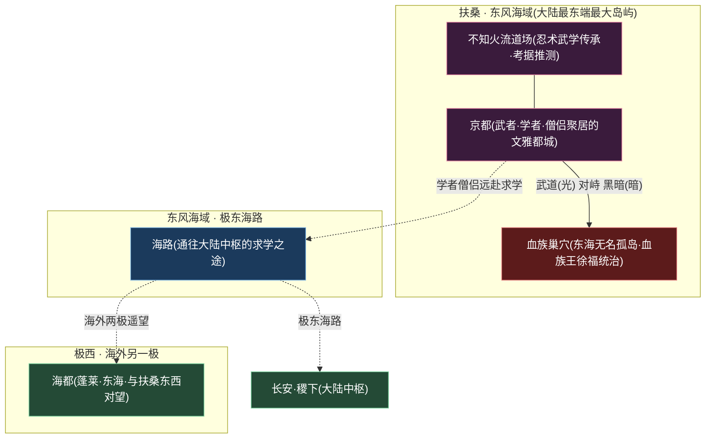
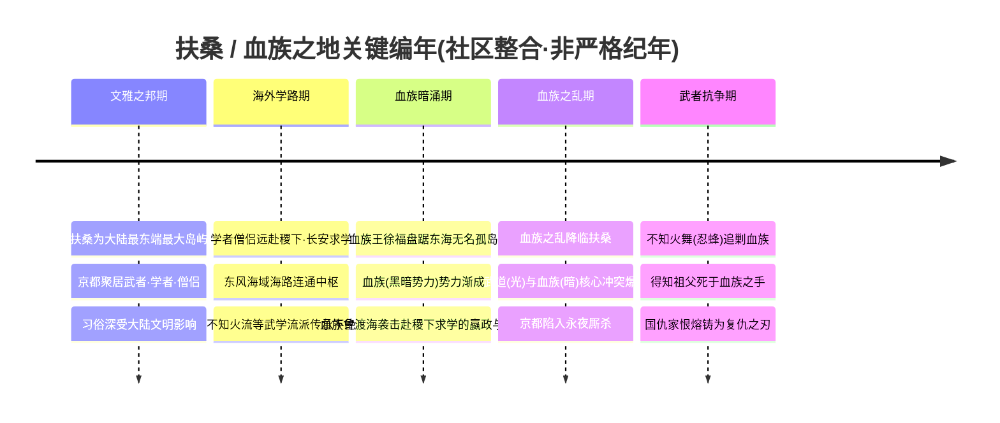
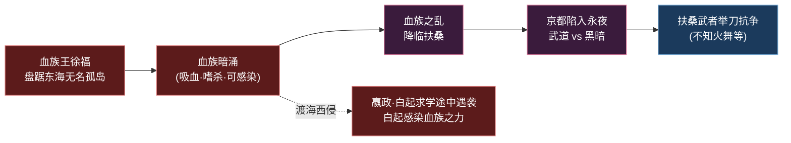
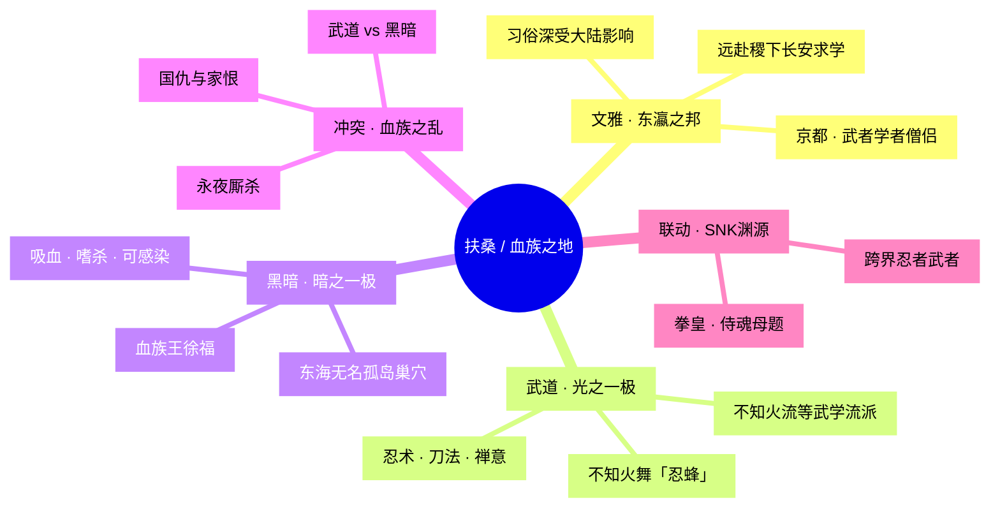

# 扶桑 / 血族之地

<span class="hok-tags"><span class="tag warrior">海外 · 远东</span><span class="tag assassin">东瀛武士道</span><span class="tag mage">血族恐怖</span></span>

> **东风海域上的武者孤岛 · 武道与血族永夜的对峙之地 · 大陆最东端「奇迹之力 + 诅咒」母题的极东回响** —— 它是王者大陆最东端最大的岛屿，京都的钟磬与樱雨之下，曾是学者僧侣远赴中原求学的文雅之邦；却在「血族之乱」降临后，被东海无名岛上血族王[徐福](#核心人物)所统御的永夜阴影笼罩，化作扶桑武者以刀与忍术对抗黑暗的修罗场。

---

!!! abstract "阵营概述"
    **扶桑 / 血族之地**（亦称「**东风海域**」「**京都与血族巢穴**」）坐落于王者大陆**最东端的最大岛屿**之上，与极西的[蓬莱·东海 / 海都](../factions/penglai-donghai.md)遥相对望，同属「**海外 · 远东**」大区。它的版图由两座性格截然相反的主城构成：一是**京都**——扶桑武者、学者与僧侣聚居的文雅都城；二是**血族巢穴**——东海上一座由**血族王徐福**统治的无名孤岛，是这片土地最深的黑暗之源。

    在血族之乱降临以前，扶桑是一处**深受大陆文明熏陶的「东瀛风」之邦**。它的习俗、礼制与学术深受中原影响，无数扶桑学者与僧侣不远千里、跨越东风海域，远赴[稷下学院](../factions/jixia.md)与[长安城](../factions/changan.md)求学问道——这条「**学路**」，是扶桑与大陆中枢之间最温柔的纽带。彼时的京都，是樱雨纷飞、刀光与禅意并存的武道圣地，孕育出诸如「不知火流」这般传承不绝的忍术与武学流派。

    然而，**「血族之乱」**终结了这份宁静。盘踞于血族巢穴的[徐福](#核心人物)率领血族（一支吸血、嗜杀、可感染他人的**黑暗势力**）席卷扶桑，将岛屿拖入了武道（光）与血族（暗）你死我活的核心冲突。扶桑武者举刀而起，以血肉之躯对抗永夜——其中最耀眼的，便是「不知火流」唯一传人、代号「忍蜂」的[不知火舞](#成员花名册)。她在血族之乱中追剿血族，更在追猎中得知**祖父正是死于血族之手**，由此将国仇与家恨熔铸成一柄复仇之刃。

    需要特别说明的是，**血族并非只是扶桑一岛的祸患**。在更广阔的世界观里，血族曾远渡海域、潜入大陆腹地：少年[嬴政](../heroes/changan.md#嬴政)与[白起](../heroes/jixia.md#白起)结伴赴[稷下](../factions/jixia.md)求学途中即遭血族伏击，白起为护主而身受重伤、**感染血族之力**，此力后由[庄周](../heroes/penglai-donghai.md#庄周)封印（详见 [师徒同袍 · 嬴政与白起](../relationships/squad.md)）。由此可见，扶桑/血族之地不仅是一座武道孤岛，更是整个王者大陆「**血族恐怖**」母题的策源地与最前线。

## 阵营档案

| 档案项 | 内容 |
| :--- | :--- |
| **阵营名** | 扶桑 / 血族之地（facId: `fusang-xuezu`） |
| **别称** | 东风海域 / 京都与血族巢穴 |
| **地理位置** | 王者大陆最东端最大岛屿（东风海域），含京都与血族巢穴两城 |
| **所属大区** | 海外 · 远东 |
| **主题风格** | 东瀛武士道 + 血族恐怖 + 海域秘辛 |
| **核心领袖** | 血族王[徐福](#核心人物)（血族巢穴之主，黑暗势力首领） |
| **成员数** | 1 名英雄（本阵营名册收录：[不知火舞](#成员花名册)） |
| **关键词** | 东风海域 · 京都 · 血族巢穴 · 血族王徐福 · 血族之乱 · 武道 vs 黑暗 · 不知火流 · 忍蜂 · SNK 联动 · 海外学路 |

---

## 地理与环境

扶桑不是大陆的一隅，而是一座**孤悬于王者大陆最东端的最大岛屿**。据[世界观地图](../worldview/map.md)，它位于「**东风海域**」之上，与极西、深海之畔的[海都（蓬莱·东海）](../factions/penglai-donghai.md)东西对望，是整个「海外远东」大区的「日出之极」。从[长安城](../factions/changan.md)出发，须经**极东海域**的漫长海路方能抵达——这道海路，既是文雅学子的求学之途，也是血族阴影向大陆渗透的暗道。



!!! info "地理定位 · 日出之极的孤岛"
    据[世界观地图](../worldview/map.md)，扶桑是「**王者大陆最东端的最大岛屿**」，位于「**东风海域**」。地图编者注明：官方地图历经多次重划，地名存在迁移与合并，「**东风海域**」与「**扶桑**」即为同一片东方海域文明的不同叫法。从[长安城](../factions/changan.md)向**极东海域**远航，便是面对扶桑；它与向**极西海路**通达的[海都](../factions/penglai-donghai.md)，恰好构成王者大陆海外文明的「东西两极」。

!!! tip "两城对照 · 文雅都城与永夜孤岛"
    扶桑的版图由两座气质截然相反的主城拼合而成，它们之间的张力，正是本阵营全部叙事的地理底色：

    | 城 / 地标 | 性质 | 关联人物 / 母题 |
    | :--- | :--- | :--- |
    | **京都** | 扶桑武者、学者与僧侣聚居的**文雅都城**，习俗深受大陆影响 | [不知火舞](#成员花名册)等武者的故乡；学者僧侣赴稷下、长安求学的起点 |
    | **血族巢穴** | 东海一座**无名孤岛**，由**血族王徐福**统治的黑暗据点 | [徐福](#核心人物)的巢穴；血族之乱的策源地，永夜与恐怖之源 |
    | **不知火流道场** | 忍术与武学的传承之所（考据推测） | 「不知火流」唯一传人[不知火舞](#成员花名册)所承之衣钵 |

!!! warning "环境基调 · 樱雨之下的修罗场"
    血族之乱降临后，扶桑的环境基调由「**樱雨与禅意**」骤变为「**永夜与杀伐**」。京都的钟磬声里掺进了血族的低嚎，文雅之邦沦为武道与黑暗厮杀的修罗场。这种「**唯美东瀛 + 哥特血族恐怖**」的强烈反差美学，是扶桑区别于其他阵营最鲜明的视觉与气氛标签（考据推测，依据 `theme` 设定推演）。

---

## 历史沿革

扶桑的历史，是一条由「**文雅求学**」滑向「**血族永夜**」的下坠曲线。它的叙事重心，并非如三分之地那般的群雄逐鹿，而是一座岛屿在黑暗骤临时，武道之光如何举刀不退。



### 一、文雅之邦 · 东瀛风的黄金时代

在血族之乱以前，扶桑是一处**深受大陆文明熏陶的东瀛风之邦**。据本阵营骨架，其「居民习俗深受大陆影响」——礼制、文字、学术乃至武道，皆与中原一脉相承又自成一格。京都作为都城，是**武者、学者与僧侣**和睦聚居之地：武者修刀习忍，学者治经问道，僧侣参禅悟法。樱雨纷飞的街巷里，刀光与禅意并存，孕育出「**不知火流**」这般代代相传的忍术武学流派。这是扶桑的黄金时代，也是它日后悲剧的文雅底色。

### 二、海外学路 · 跨海求学的纽带

!!! info "考据 · 扶桑与中枢的「学路」"
    据[世界观地图 · 海外与中枢的关系](../worldview/map.md)，扶桑虽僻处大陆最东端，却通过**海路与学路**与中枢相连：**扶桑的学者僧侣远赴[稷下学院](../factions/jixia.md)、[长安城](../factions/changan.md)求学**。这条横跨东风海域的求学之途，是扶桑文明吸纳大陆养分的主动脉——它让扶桑既保有东瀛武道的独特气质，又深植于王者大陆共同的文明根系之中。

值得玩味的是：这条文雅的「学路」，日后竟与血族的暗道重叠。当血族渡海西侵，赴稷下求学的少年[嬴政](../heroes/changan.md#嬴政)与[白起](../heroes/jixia.md#白起)便在途中遭血族伏击——同一条海路，承载了求学的光与血族的暗。

### 三、血族暗涌 · 永夜孤岛上的王者

!!! warning "血族 · 一支可感染的黑暗势力"
    据本阵营骨架与[相关关系](../relationships/squad.md)，**血族**是一支**吸血、嗜杀、并能将「血族之力」感染他人的黑暗势力**，其王者[徐福](#核心人物)盘踞于东海一座**无名孤岛**（即「血族巢穴」）。血族之祸并不限于扶桑一岛——它曾远渡海域、潜入大陆腹地：白起为护嬴政而**感染血族之力**、被庄周封印的往事，便是血族西侵的直接铁证（详见 [师徒同袍 · 求学路上的血族之劫](../relationships/squad.md)）。

### 四、血族之乱 · 武道与黑暗的核心冲突

血族暗涌已久，终在某一刻汇成滔天巨浪——**「血族之乱」**降临扶桑。据本阵营骨架，自此「**扶桑武者（武道）与血族（黑暗势力）**」成为核心冲突。京都的文雅秩序被永夜撕裂，武者们举刀而起，以血肉之躯对抗血族的吞噬。这是扶桑历史上最惨烈、也最定义其阵营性格的一页：它不再只是一处求学的文雅之邦，而成为「**光对抗暗、刀对抗獠牙**」的武道修罗场。



### 五、武者抗争 · 国仇与家恨的交汇

血族之乱中，最耀眼的抗争者是「不知火流」唯一传人、代号「忍蜂」的[不知火舞](#成员花名册)。她投身于追剿血族的洪流，更在追猎途中得知一个令她痛彻心扉的真相——**祖父正是死于血族之手**。自此，对抗血族于她而言，既是守护扶桑的「国仇」，也是为至亲复仇的「家恨」。国与家、道义与私情，在她的刀锋上熔铸为一。

!!! quote "血族之乱 · 武者的誓言"
    「樱花落处，刀锋不退。血族夺走的，我必以火与刃，一寸一寸讨还。」
    （依据[不知火舞](#成员花名册)「血族之乱中追剿血族、为祖父复仇」的设定意译，非官方逐字原文。）

---

## 组织 / 理念 / 特色

扶桑/血族之地并非一个统一意志的政治实体，而是一片由「**两股对立力量**」撕扯的战场场域：一极是以京都武者为代表的「**武道之光**」，另一极是以血族巢穴为据点、血族王徐福统御的「**黑暗势力**」。它的「理念」不在治理，而在「**对抗**」——光与暗、刀与獠牙、文明与吞噬。



!!! note "特色一 · 武道与血族的「光暗二元」"
    扶桑最核心的设定张力，是一组**清晰锐利的「光暗二元对立」**：武道（光）对黑暗（暗）。这种不掺杂灰度的正邪对峙，使扶桑在世界观中成为「**纯粹的武道抗争舞台**」——它不像[云中漠地](../factions/yunzhong-modi.md)那般「自食恶果」的复杂，也不像[三分之地](../factions/sanfen-shu.md)那般的群雄博弈，而是干净利落地把「英雄持刀对抗永夜」的母题推向极致。

!!! warning "特色二 · 血族 —— 跨阵营的「可感染」恐怖"
    血族是扶桑独有、却**辐射全大陆**的恐怖设定。它最骇人之处在于「**可感染性**」：血族之力能侵入他人体内、改变其本质（如[白起](../heroes/jixia.md#白起)即因感染而成为半人半「兵器」的存在）。这使血族之祸具备了「**病毒式扩散**」的世界观威胁——它不止于扶桑一岛，而是一道悬在整个王者大陆头顶的暗影。这也是扶桑作为「血族之地」在世界观中的独特分量（详见 [师徒同袍 · 嬴政与白起](../relationships/squad.md)）。

!!! tip "特色三 · 东瀛美学与 SNK 联动血脉"
    扶桑是王者大陆「**东瀛武士道 + 哥特血族恐怖**」美学最集中的阵营。其唯一收录英雄[不知火舞](#成员花名册)源自 **SNK《拳皇 / 侍魂》联动**，自带浓厚的「忍者 / 格斗」跨界血统。在更广的远东武道圈层中，与之气质呼应的还有归属[联动英雄](../factions/liandong-snk.md)阵营的 SNK 群像——[娜可露露](../heroes/liandong-snk.md#娜可露露)、[橘右京](../heroes/liandong-snk.md#橘右京)、[弗洛伦](../heroes/liandong-snk.md#弗洛伦)，以及归东海武道圈的剑圣[宫本武藏](../heroes/penglai-donghai.md#宫本武藏)（考据推测：上述联动/武道角色与扶桑分属不同阵营骨架，此处仅作母题层面的气质呼应，非同一组织）。

| 特色维度 | 扶桑 / 血族之地的呈现 |
| :--- | :--- |
| **设定地位** | 王者大陆最东端孤岛、「血族恐怖」母题的策源地与最前线 |
| **组织形态** | 无统一政体；分裂为「京都武道」与「血族巢穴」两股对立力量 |
| **核心冲突** | 武道（光）vs 血族（黑暗势力），光暗二元 |
| **职业生态** | 本阵营名册仅收录法师/刺客 1 人（[不知火舞](#成员花名册)）；岛上武者群像多见于联动与设定层 |
| **英雄来源** | SNK《拳皇 / 侍魂》联动（不知火舞）；血族王徐福取材中国史传方士母题 |
| **核心母题** | 东瀛武道、血族永夜、国仇家恨、海外学路、奇迹之力+诅咒的远方回响 |

---

## 核心人物

扶桑的「领袖」并非一位仁君或贤臣，而是这片土地最深的黑暗本身——盘踞东海无名孤岛、统御血族的**血族王徐福**。而站在他对立面、代表武道之光的，则是「不知火流」唯一传人、忍蜂[不知火舞](#成员花名册)。一暗一光，构成扶桑全部叙事的两极。

### 徐福 · 血族王（暗之极）

!!! info "考据 · 「血族王徐福」的来历"
    据本阵营骨架，扶桑/血族之地的领袖（`leadership`）为「**血族王 徐福（血族巢穴）**」。他统治着东海一座**无名孤岛**（即血族巢穴），是血族这支黑暗势力的首领与「血族之乱」的源头。其名取自中国史传中**为秦始皇东渡求仙药的方士徐福**——传说中徐福率童男童女远航东海、最终未归（民间附会其抵达「扶桑」）。《王者荣耀》借此「东渡不归」的母题，将徐福重塑为盘踞东海、统御血族的永夜之王，可谓对历史传说的一次黑暗化改写（考据推测：徐福作为血族王的具体剧情与形象官方仍在丰富中，本页不强行钩连其与秦史的硬设定）。

徐福作为「集体黑暗的化身」，是扶桑一切苦难的源头：是他率领血族掀起血族之乱，将文雅的京都拖入永夜；是他统御的血族渡海西侵，间接酿成白起感染血族之力的悲剧。他不是一个「有血有肉的可玩英雄」，而是一座**笼罩全岛、辐射全陆的恐怖阴影**——扶桑武者举起的每一柄刀，最终都指向他的巢穴。

!!! quote "血族王 · 永夜的低语"
    「东渡之人不曾归来——因为他们成了夜本身。这片海，从此姓徐。」
    （依据徐福「血族王·统治血族巢穴」的设定意译，非官方逐字原文。）

### 不知火舞 · 忍蜂（光之极 / 情感主角）

<span class="hok-tags"><span class="tag mage">法师</span><span class="tag assassin">刺客</span></span>

若说徐福是扶桑的「暗」，那么[不知火舞](#成员花名册)便是它的「**光**」与情感主角。作为「**不知火流唯一传人**」、代号「**忍蜂**」，她是一名**以忍术与火焰作战的法师 / 刺客**——身姿轻盈如蜂，攻势凌厉如火。在血族之乱中，她毅然投身追剿血族的征途；而当她得知**祖父正是死于血族之手**时，这场战斗便从守护扶桑的道义，升华为为至亲复仇的执念。她把国仇与家恨熔铸成一柄复仇之刃，成为扶桑武道之光最人格化的象征。

!!! note "考据 · 不知火舞与 SNK 联动"
    [不知火舞](#成员花名册)是《王者荣耀》与 **SNK《拳皇（The King of Fighters）/ 侍魂》系列**联动引入的英雄。在原作中，不知火舞是知名的「忍者格斗家」，使用「不知火流忍术」。《王者荣耀》将其本地化嵌入扶桑/血族之地的叙事框架，赋予其「血族之乱中追剿血族、为祖父复仇」的本世界线剧情。需注意：作为联动角色，其与 SNK 其他联动英雄（[娜可露露](../heroes/liandong-snk.md#娜可露露)、[橘右京](../heroes/liandong-snk.md#橘右京)、[弗洛伦](../heroes/liandong-snk.md#弗洛伦)）在阵营骨架上分属不同归类，本页以骨架 `facId` 为准。

---

## 成员花名册

扶桑 / 血族之地阵营在本名册中收录 **1 名英雄**——「不知火流」唯一传人、忍蜂[不知火舞](#成员花名册)。她以一己之身，扛起了扶桑「武道对抗黑暗」的全部分量；岛上的血族王徐福、京都武者群像等，则以「设定层 / 领袖 / 联动呼应」的形式存在于叙事背景中。职业上，本阵营名册覆盖**法师 / 刺客**双定位。

<span class="hok-tags"><span class="tag mage">法师</span><span class="tag assassin">刺客</span></span>

| 英雄 | 称号 | 定位 | 一句话身份 |
| :--- | :--- | :--- | :--- |
| [不知火舞](../heroes/fusang-xuezu.md#不知火舞) | 忍蜂 | 法师/刺客 | 不知火流唯一传人，血族之乱中追剿血族、为死于血族之手的祖父复仇（SNK《拳皇/侍魂》联动）。 |

!!! tip "花名册速读 · 一岛一刃"
    - **武道之光**：[不知火舞](#成员花名册)（忍蜂）——不知火流唯一传人，以忍术与火焰追剿血族，是扶桑唯一收录的可玩英雄，也是「武道对抗黑暗」母题的人格化身。
    - **国仇 × 家恨**：她的复仇有双重底色——守护扶桑（国仇）与为祖父复仇（家恨），二者在血族之乱中交汇成刃。
    - **联动血脉**：源自 SNK《拳皇 / 侍魂》，自带「忍者格斗家」的跨界气质，是扶桑「东瀛武士道」标签最直接的代言人。

!!! warning "考据 · 名册之外的扶桑群像"
    扶桑作为「武者聚居之岛」，理应不止一名武者；血族巢穴也理应不止血族王徐福一名成员。但据本阵营骨架，**目前明确归属 `fusang-xuezu` 的可玩英雄仅[不知火舞](#成员花名册)一人**。其余与远东武道气质呼应的角色（如归[联动英雄](../factions/liandong-snk.md)的[娜可露露](../heroes/liandong-snk.md#娜可露露)、[橘右京](../heroes/liandong-snk.md#橘右京)、[弗洛伦](../heroes/liandong-snk.md#弗洛伦)，归[海都](../factions/penglai-donghai.md)东海武道圈的[宫本武藏](../heroes/penglai-donghai.md#宫本武藏)）均**另属他营**，本页不擅自并入扶桑名册，仅在「阵营关系」中作母题呼应（考据推测）。

---

## 阵营关系

本阵营骨架的 `relatedRelationships` 为空，扶桑没有被官方明确标注的「阵营级同盟 / 冲突」条目。但顺着世界观的暗线梳理，扶桑实则牵连着数条跨阵营脉络：**血族之祸**经海路西侵、波及[稷下](../factions/jixia.md)与[长安](../factions/changan.md)的英雄；**海外学路**把扶桑与中枢学府相连；**东瀛武道母题**则在远东各阵营间遥相呼应。以下关系，均依据世界观地图、纪元编年与相关关系页推演整理，性质标注力求审慎。

### 关系总览表

| 关系类型 | 关联人物 / 阵营 | 性质 | 说明 |
| :--- | :--- | :--- | :--- |
| 阵营内核心冲突 | 京都武道 ⇄ 血族巢穴（[徐福](#核心人物)） | 阵营内 · 对立 | 武道（光）与血族（黑暗势力）的你死我活，是扶桑的核心冲突。 |
| 血族之祸（跨阵营辐射） | 血族 → [白起](../heroes/jixia.md#白起)·[嬴政](../heroes/changan.md#嬴政) | 跨阵营 · 加害 | 血族渡海西侵，伏击赴稷下求学的嬴政与白起，白起为护主感染血族之力。 |
| 血族之力封印 | [庄周](../heroes/penglai-donghai.md#庄周) → [白起](../heroes/jixia.md#白起) | 跨阵营 · 化解 | 南华真仙庄周封印白起体内的血族之力，使其维持人形与神志。 |
| 海外学路 | 扶桑学者僧侣 → [稷下学院](../factions/jixia.md)·[长安城](../factions/changan.md) | 跨阵营 · 文化纽带 | 扶桑居民习俗深受大陆影响，学者僧侣远赴稷下、长安求学。 |
| 海外两极对望 | 扶桑 — [蓬莱·东海 / 海都](../factions/penglai-donghai.md) | 跨阵营 · 地理对应 | 极东扶桑与极西海都，构成海外远东大区的东西两极。 |
| 东瀛武道母题呼应 | [不知火舞](#成员花名册) ⋯ [娜可露露](../heroes/liandong-snk.md#娜可露露)·[橘右京](../heroes/liandong-snk.md#橘右京)·[弗洛伦](../heroes/liandong-snk.md#弗洛伦)·[宫本武藏](../heroes/penglai-donghai.md#宫本武藏) | 母题 · 气质呼应（非同营） | SNK 联动与东海武道角色虽分属他营，与扶桑共享「忍者/武士/格斗」母题（考据推测）。 |

!!! warning "关系主轴 · 血族之祸的跨海辐射"
    扶桑最具世界观意义的关系，不是它与某个阵营的同盟或对峙，而是**血族之祸如何越过东风海域、辐射整个大陆**。其铁证便是[嬴政](../heroes/changan.md#嬴政)与[白起](../heroes/jixia.md#白起)的往事：二人少年时同赴[稷下](../factions/jixia.md)求学，途中遭血族伏击，白起为护主而面部受伤、**感染血族之力**，自此成为半人半「兵器」的存在；此力后由[庄周](../heroes/penglai-donghai.md#庄周)封印（详见 [师徒同袍 · 求学路上的血族之劫](../relationships/squad.md)）。这条线证明：源于扶桑「血族之地」的恐怖，是一道悬在全大陆头顶的暗影，而非孤岛上的局部灾祸。

!!! info "考据 · 「海外两极」的镜像结构"
    扶桑与[海都（蓬莱·东海）](../factions/penglai-donghai.md)在世界观中构成一对**地理与母题的镜像**：极东 vs 极西、武道孤岛 vs 鲛人海城、血族恐怖 vs 奥秘家族斗争。但二者都呼应着「**奇迹之力 + 诅咒**」的母题（血族之力的诅咒 / 奥秘家族夺取奇迹之力却遭诅咒），是大陆同一母题在东西两极的远方回响（详见 [世界观地图 · 海外远东](../worldview/map.md)）。

### 关系网络图

```mermaid
graph TD
    subgraph FS["扶桑 · 血族之地"]
        WAM["不知火舞(忍蜂·武道之光)"]
        XUFU["徐福(血族王·黑暗之源)"]
        WUZHE["京都武者群像(武道)"]
    end

    BAIQI["白起(人间兵器·稷下)"]
    YINGZHENG["嬴政(政·长安)"]
    ZHUANGZI["庄周(南华真仙·海都)"]
    JIXIA["稷下学院(求学之所)"]
    CHANGAN["长安城(求学之所)"]
    HAIDU["海都(蓬莱·东海·海外另一极)"]
    SNK["SNK联动·东海武道(娜可露露·橘右京·宫本武藏等)"]

    XUFU -- 血族之乱 --> WUZHE
    WAM -- 武道对抗黑暗/为祖父复仇 --> XUFU
    XUFU -. 血族渡海西侵 .-> YINGZHENG
    YINGZHENG == 同往稷下求学 == BAIQI
    XUFU -- 感染血族之力 --> BAIQI
    ZHUANGZI -- 封印血族之力 --> BAIQI
    WUZHE -. 学者僧侣远赴求学 .-> JIXIA
    WUZHE -. 学者僧侣远赴求学 .-> CHANGAN
    FS -. 海外两极对望 .-> HAIDU
    WAM -. 东瀛武道母题呼应 .-> SNK

    classDef fs fill:#3a1b3c,stroke:#e07da0,color:#fff;
    classDef abyss fill:#5c1b1b,stroke:#e07d7d,color:#fff;
    classDef out fill:#244a36,stroke:#7dd3a0,color:#fff;
    classDef sea fill:#1b3a5c,stroke:#7db3e0,color:#fff;
    class WAM,WUZHE fs;
    class XUFU abyss;
    class BAIQI,YINGZHENG,ZHUANGZI,JIXIA,CHANGAN out;
    class HAIDU,SNK sea;
```

!!! info "图例说明"
    粉紫色节点为**扶桑武道**力量（不知火舞、京都武者），暗红色节点为**血族黑暗势力**（血族王徐福），绿色节点为**因血族之祸牵连的中枢英雄与学府**（白起、嬴政、庄周、稷下、长安），蓝色节点为**海外另一极与武道母题呼应对象**（海都、SNK 联动）。实线表示直接的冲突 / 因果，双线表示同窗共赴，虚线表示渡海辐射、求学纽带、地理对望与母题呼应。其中[白起](../heroes/jixia.md#白起)归[稷下学院](../factions/jixia.md)，[嬴政](../heroes/changan.md#嬴政)归[长安城](../factions/changan.md)，[庄周](../heroes/penglai-donghai.md#庄周)归[海都（蓬莱·东海）](../factions/penglai-donghai.md)。

---

## 相关剧情

扶桑虽僻处大陆最东端、收录英雄仅一人，却以「血族」为引线，牵动着数条贯穿世界观的关键剧情。以下为与本阵营最紧密的几条故事线。

<div class="grid cards" markdown>

- :material-sword-cross: **血族之乱与武道抗争**

    血族王[徐福](#核心人物)率黑暗势力掀起「血族之乱」，将文雅的京都拖入永夜；扶桑武者举刀而起，以武道（光）对抗血族（暗）。忍蜂[不知火舞](../heroes/fusang-xuezu.md#不知火舞)是这场抗争最耀眼的身影。详见 [扶桑英雄页](../heroes/fusang-xuezu.md)。

- :material-water-alert: **求学路上的血族之劫**

    少年[嬴政](../heroes/changan.md#嬴政)与[白起](../heroes/jixia.md#白起)同赴[稷下](../factions/jixia.md)求学，途中遭血族伏击；白起以身护主、感染血族之力，后由[庄周](../heroes/penglai-donghai.md#庄周)封印。这是血族之祸跨海西侵、波及中枢的关键事件。详见 [师徒同袍 · 嬴政与白起](../relationships/squad.md)。

- :material-ninja: **忍蜂的国仇与家恨**

    [不知火舞](../heroes/fusang-xuezu.md#不知火舞)在追剿血族的征途中，得知祖父正是死于血族之手，自此将守护扶桑的「国仇」与为至亲复仇的「家恨」熔铸为一柄复仇之刃。这是本阵营最私人也最炽烈的情感线。

- :material-compass-rose: **海外两极与奇迹之力的诅咒**

    极东扶桑（血族之力的诅咒）与极西[海都](../factions/penglai-donghai.md)（奥秘家族夺取奇迹之力却遭诅咒），构成「奇迹之力 + 诅咒」母题在大陆东西两极的镜像回响。详见 [世界观地图 · 海外远东](../worldview/map.md)。

</div>

!!! example "剧情焦点 · 一座孤岛，照见全陆的暗影"
    扶桑最深刻的剧情意义，在于它把「**血族**」这一恐怖母题，从一座东方孤岛投射到了整个王者大陆。血族之力的「可感染性」，让它具备了病毒式扩散的威胁——白起的伤疤、庄周的封印、嬴政的悲悯，都是这道暗影留在中枢英雄身上的印记。换言之，扶桑/血族之地虽小，却是理解王者大陆「**黑暗如何越境**」的一把钥匙：永夜从不止步于它诞生的海岛。

---

## 延伸阅读

<div class="grid cards" markdown>

- :material-account-star: **扶桑英雄图鉴**

    本阵营英雄（不知火舞）的档案、背景与台词，见 [扶桑 / 血族之地英雄页](../heroes/fusang-xuezu.md)。

- :material-waves: **海外另一极 · 蓬莱·东海 / 海都**

    与扶桑东西对望的海洋都市，鲛人歌谣与奥秘家族斗争之地，亦是庄周、宫本武藏的归属，见 [蓬莱·东海 / 海都](../factions/penglai-donghai.md)。

- :material-school: **学路彼端 · 稷下学院**

    扶桑学者僧侣远赴求学的智慧学府，也是白起感染血族之力的求学终点，见 [稷下学院](../factions/jixia.md)。

- :material-city: **学路彼端 · 长安城**

    扶桑学子求学的另一中枢都城，嬴政（玄雍之主）的所在，见 [长安城](../factions/changan.md)。

- :material-controller-classic: **气质呼应 · 联动英雄**

    与不知火舞共享 SNK 武道血脉的娜可露露、橘右京、弗洛伦等联动角色，见 [联动英雄](../factions/liandong-snk.md)。

- :material-account-supervisor: **专题 · 师徒同袍**

    嬴政与白起「君臣之名下的生死共生」及求学路上的血族之劫，见 [师徒同袍关系](../relationships/squad.md)。

- :material-timeline-clock: **纪元编年**

    扶桑、血族之乱在人类时代世界观中的定位，见 [纪元编年](../worldview/eras.md)。

- :material-map: **世界观地图**

    东风海域、京都、血族巢穴的地理关系，见 [世界观地图 · 海外远东](../worldview/map.md)。

</div>

!!! quote "结语 · 永夜不止于海岛"
    它曾是日出之极最文雅的一座岛——樱雨纷飞，钟磬悠扬，武者修刀、学者问道、僧侣参禅，连远渡重洋的求学之路，都铺满了向往中枢文明的虔诚。直到东海无名孤岛上的血族王，把吞噬的獠牙伸向京都，把文雅碾作永夜。如今，不知火舞仍举着不知火流的火焰，在血族的暗影里追寻祖父的仇与故乡的光。而那道源自扶桑的暗影，早已越过海域，化作白起脸上的伤、庄周掌中的封印——**永夜，从不止步于它诞生的海岛。**
