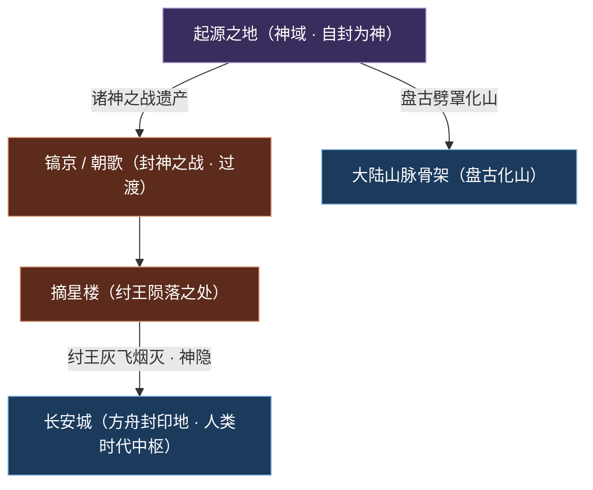
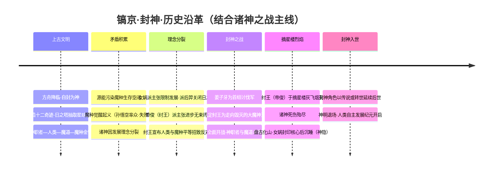
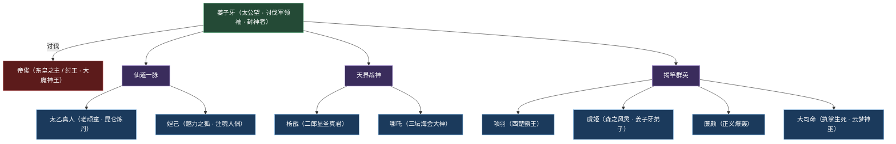
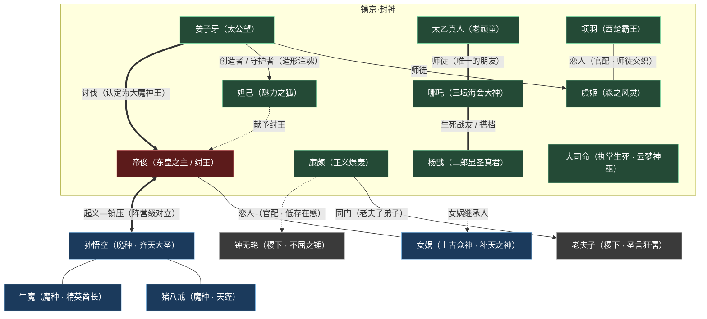

# 镐京·封神

封神神话天界战神神职魔道
**大区：封神 · 众神** — 以《封神演义》为原型、横亘于「神明时代」向「人类时代」过渡之际的封神之战体系；摘星楼的烈焰里，反派天帝灰飞烟灭，炼丹仙人、天界战神与揭竿霸王在此交织，是诸神之战在人间最具象、最炽烈的一帧。

!!! abstract "概述"
    **镐京·封神**（别称「**封神之战体系**」）并非一座单纯的城邦，而是《王者荣耀》世界观中**神明时代向人类时代过渡的关键纪元舞台**。它以《封神演义》为原型，把抽象的「[诸神之战](../worldview/timeline.md)」（神明集团因发展理念分裂而爆发的全面战争）**具象化**为我们熟悉的封神故事——舞台设在**镐京 / 朝歌**，主角是纣王、太公望、九尾狐、二郎神与莲花化身的少年。

    这场战争的导火索，是**纣王（帝辛 / [帝俊](../heroes/haojing-fengshen.md#帝俊)体系）宣布人类与魔种平等**——在森严的「神明—神职者—人类—魔道—魔种」金字塔面前，这一主张被视为对秩序的颠覆，招致诸方反对。以「太公望」[姜子牙](../heroes/haojing-fengshen.md#姜子牙)为首的**讨伐军**认定纣王已是「**走向毁灭的大魔神王**」，遂奉天讨伐；最终**纣王于摘星楼的烈焰中灰飞烟灭**，诸神死伤殆尽，神明就此退场（神隐），为人类自主发展的纪元腾出了舞台。

    镐京·封神阵营，正是这段「神职者与魔道斗争」的英雄群像集合：既有昆仑炼丹的仙道（[姜子牙](../heroes/haojing-fengshen.md#姜子牙)、[太乙真人](../heroes/haojing-fengshen.md#太乙真人)），有三只眼的天界战神（[杨戬](../heroes/haojing-fengshen.md#杨戬)）与莲花重生的逆骨少年（[哪吒](../heroes/haojing-fengshen.md#哪吒)），有姜子牙以机关术造形、魔法注魂的九尾狐人偶（[妲己](../heroes/haojing-fengshen.md#妲己)），也有不信天命、揭竿而起的西楚霸王（[项羽](../heroes/haojing-fengshen.md#项羽)）与森之风灵（[虞姬](../heroes/haojing-fengshen.md#虞姬)）。它把「仙—魔—人」三道熔于一炉，是封神 · 众神大区里张力最强、叙事母题最浓的一阵。

---

## 阵营档案

| 档案项 | 内容 |
| :--- | :--- |
| **阵营名** | 镐京·封神 |
| **阵营 ID** | `haojing-fengshen` |
| **大区 / 导航组** | 封神 · 众神 |
| **别称** | 封神之战体系 |
| **地理位置** | **镐京 / 朝歌**（神明—人类过渡时代的关键战场，封神之战发生地、纣王陨落之处） |
| **主题风格** | 封神神话 + 神职者与魔道斗争 |
| **核心领袖** | [姜子牙](../heroes/haojing-fengshen.md#姜子牙)（太公望 · 正道讨伐军领袖、封神者） |
| **核心反派** | [帝俊](../heroes/haojing-fengshen.md#帝俊)（东皇之主 / 纣王 · 帝辛体系，被讨伐军认定的「大魔神王」） |
| **成员数（本阵营英雄）** | **10 位** |
| **关键词** | 镐京 · 朝歌 · 摘星楼 · 封神之战 · 诸神之战 · 太公望 · 九尾狐 · 神隐 |

!!! note "「阵营」二字一辨 · 时代层而非纯地理板块"
    镐京·封神与「益城」「武都」等割据城邦不同，它是一个**叠加在大陆之上的「时代层」**——封神之战是 [神明时代 / 封神时代](../worldview/eras.md) 的具象叙事。镐京 / 朝歌虽有明确的地理落点（封神之战战场），但本阵营的英雄横跨「仙道炼丹」「天界战神」「战国揭竿」乃至「云梦神巫」等多重母题，并非同一地缘共同体。它与同区的 [上古众神·神话](../factions/shanggu-shenhua.md)（女娲、盘古、孙悟空等）共同撑起「封神 · 众神」大区的神话半壁。

---

## 地理与环境

镐京·封神的核心舞台是**镐京 / 朝歌**——一处坐落于「**神明—人类过渡时代**」的关键战场。在 [王者大陆地图](../worldview/map.md) 中，它被归入「神域与暗面 · 时代层」一组：不是现世可达的寻常地理板块，而是承载封神之战记忆的**历史舞台与时代切面**。

!!! info "镐京 / 朝歌 · 时代层定位对照"
    与封神同属「时代层 / 界外空间」的，还有诸神之战之前的「起源之地（神域）」与战后演化出的「倒悬天之外 / 深渊」。三者共同构成大陆的「源头与底色」。

    | 时代层 | 时代定位 | 主题 | 关联阵营 |
    | :--- | :--- | :--- | :--- |
    | 起源之地（神域） | 神明时代之初 | 方舟降临 · 自封为神 | [上古众神·神话](../factions/shanggu-shenhua.md) |
    | **镐京 / 朝歌** | **神明—人类过渡** | **封神之战 · 纣王陨落** | **镐京·封神** |
    | 倒悬天之外 / 深渊 | 神明—后世延续 | 魔道 · 暗影 · 弃血脉 | [魔道·暗影·深渊](../factions/modao-shadow-abyss.md) |

镐京 / 朝歌的环境主调，是「**封神神话 + 神职者与魔道斗争**」交织而成的肃杀战场：一边是昆仑山炼丹道人布下的仙术阵法，一边是被讨伐军视作「魔神王」的纣王所盘踞的朝歌宫阙。其最具标志性的地标，是纣王陨落之处——**摘星楼**。封神之战的高潮，正是纣王在摘星楼的烈焰中灰飞烟灭，诸神死伤殆尽，神明就此退场。

!!! tip "摘星楼 · 封神之战的「句点」"
    摘星楼之火，是整个封神之战体系的视觉与叙事「句点」。纣王（帝俊 / 帝辛）于此焚身陨落，标志着以「进步无束缚」为旗的主战派领袖陨落、诸神之战落幕、神明集体退场（神隐）。此后约三千年（考据推测），王者大陆进入无神的「[人类时代](../worldview/eras.md)」——[长安城](../factions/changan.md) 的玄雍帝国与 [三分之地](../factions/sanfen-shu.md) 的群雄逐鹿，都是在这片「无神的大陆」上展开的。

值得一提的是，封神阵营的英雄并不全数发生在镐京一隅：[太乙真人](../heroes/haojing-fengshen.md#太乙真人) 出自**昆仑山**炼丹，[大司命](../heroes/haojing-fengshen.md#大司命) 来自**云梦泽**九大神巫体系，[项羽](../heroes/haojing-fengshen.md#项羽)、[虞姬](../heroes/haojing-fengshen.md#虞姬)、[廉颇](../heroes/haojing-fengshen.md#廉颇) 则带着浓重的**战国**色彩。这种「以封神之战为内核、广纳多重神话与历史母题」的特征，正是镐京·封神「时代层」属性的体现。

---

## 历史沿革

镐京·封神的历史，深植于主世界线最剧烈的转折点——**[神明时代 / 封神时代](../worldview/eras.md)**。这是积累已久的矛盾总爆发、神明集体退场的关键纪元。结合 [纪元编年](../worldview/eras.md) 与 [大事年表](../worldview/timeline.md) 中与本阵营相关的事件，可梳理为如下脉络。

### 一、金字塔与积怨 · 战争的远因

在 [上古文明 / 神明时代](../worldview/eras.md) 之初，「方舟」降临、降临者以核心能量**自封为神**，创造人类、建造 [十二奇迹](../worldview/concepts.md)、奴役 [魔种](../worldview/concepts.md) 修建奇迹，构建起「**神明—神职者—人类—魔道—魔种**」的森严金字塔。其中 [日之塔](../worldview/concepts.md) 昼夜不息地抽取地底的 [源能（星球之血）](../worldview/concepts.md)——这种「竭泽而渔」式的开采，从一开始就埋下了星球反噬的祸根，也成了诸神之战的远因。

!!! warning "源能污染与魔种起义 · 封神之战的前奏"
    诸神之战并非凭空爆发。在它之前，受星球之血 / 源能感染的 [魔种](../factions/shanggu-shenhua.md) 觉醒了自我意识，在 [孙悟空](../heroes/shanggu-shenhua.md#孙悟空) 带领下，偕 [牛魔](../heroes/shanggu-shenhua.md#牛魔)、[猪八戒](../heroes/shanggu-shenhua.md#猪八戒) 等发动**魔种起义**反抗神明；然而因牛魔出卖等内部背叛，神明以「元气炮」轰营，悟空被擒，起义失败。这场失败的起义，是封神之战的直接前奏——它暴露了金字塔体系的裂痕，也为纣王日后「宣布人类与魔种平等」的主张埋下伏笔。

### 二、理念分裂与战争爆发

随着星球反噬之兆显现，神明集团因**发展理念**而彻底分裂为两派——这正是封神之战的核心矛盾。

| 派别 | 主张 | 代表 | 立场 |
| :--- | :--- | :--- | :--- |
| 限制派 | 限制超出星球承载力的发展 | [女娲](../heroes/shanggu-shenhua.md#女娲)（派 [后羿](../heroes/shanggu-shenhua.md#后羿) 关闭 / 摧毁日之塔） | 守护星球、堵住源能泄漏 |
| 进步派 | 进步不应受任何束缚 | **[帝俊](../heroes/haojing-fengshen.md#帝俊)**（帝辛 / 纣王体系） | 全面对抗限制派 |

!!! quote "封神之战的导火索 · 纣王的「平等宣言」"
    据 [世界观地图 · 镐京 / 朝歌](../worldview/map.md) 一节：战争源于**纣王（帝辛 / 帝俊体系）宣布人类与魔种平等**，招致反对。在「神明—神职者—人类—魔道—魔种」的森严等级面前，这一主张被视为对秩序根基的颠覆。以 [姜子牙](../heroes/haojing-fengshen.md#姜子牙) 为首的讨伐军，遂认定纣王为「**走向毁灭的大魔神王**」并发动讨伐。

当后羿奉女娲之命关闭日之塔，进步派与限制派的全面战争就此引爆。这便是**诸神之战**——其在人间的具象叙事，即以纣王、姜子牙、[妲己](../heroes/haojing-fengshen.md#妲己)、[杨戬](../heroes/haojing-fengshen.md#杨戬)、[哪吒](../heroes/haojing-fengshen.md#哪吒) 为核心、以《封神演义》为原型的**封神之战**。

### 三、摘星楼烈焰与神隐

封神之战的高潮与终局，集中于**摘星楼**之火。

!!! warning "重大转折 · 诸神之战的结局"
    - **纣王（[帝俊](../heroes/haojing-fengshen.md#帝俊)）于摘星楼烈焰中灰飞烟灭**，主战派领袖陨落，诸神死伤殆尽。
    - [盘古](../heroes/shanggu-shenhua.md#盘古) 对人类生情，**劈开束缚人类的保护罩**赋予自由，随后化为山脉（即大陆山脉骨架）。
    - [女娲](../heroes/shanggu-shenhua.md#女娲) 以最后的力量**封印方舟核心**，将解封钥匙分藏于十二奇迹之中，而后沉睡。

    这便是「**神隐**」——神明从历史舞台集体退场。此后约三千年（考据推测），王者大陆进入无神的「人类时代」。封神之战，正是这扇「神退人进」之门的关键转轴。

### 四、封神入世 · 余响绵长

封神时代的诸神 / 英雄，部分以**传说或转世形式**延续至后世叙事，这也是镐京·封神阵营的英雄能与战国、三国等人类时代母题并置的原因。更深远的是，帝俊 / 帝辛体系并未在历史中真正终结——

!!! info "封神的「回声」 · 《王者荣耀世界》灭世之战"
    在分支叙事《王者荣耀世界》（2026 年 4 月公测）中，反派领袖 **帝辛**（呼应主线的帝俊 / 纣王体系）再度发起一场席卷诸界的**灭世之战**；原时间线中抵抗联军战败、世界濒临毁灭，一股神秘力量令 [元流之子](../heroes/yuanchu-shenhua-misc.md#元流之子) 回溯到战争爆发前以扭转历史。可见「帝辛 = 帝俊」这条母题，是从神明时代封神之战一路贯穿到当下的核心暗线。详见 [纪元编年](../worldview/eras.md) 与 [大事年表](../worldview/timeline.md)。

!!! note "考据存疑 · 帝俊与帝辛 / 纣王的关系（考据推测）"
    各来源对「帝俊」与「纣王 / 帝辛」的关系表述不一（同一神祇的不同名相 vs 不同角色）。本骨架按 **帝俊 = 帝辛 = 纣王体系** 处理，作为封神反派天帝。另需注意：游戏中 [东皇太一](../heroes/jixia.md#东皇太一) 为独立可玩英雄（归 [稷下学院](../factions/jixia.md)），虽有「东皇太一是否为帝俊化身」之说，但按独立角色处理。

---

## 组织 · 理念 · 特色

### 「讨伐军 vs 大魔神王」的二元结构

与依靠地缘或血缘凝聚的常规阵营不同，镐京·封神的内在结构是一组**对立的二元**——以姜子牙为首的「**正道讨伐军**」与被认定为「大魔神王」的纣王（帝俊）。封神之战的全部张力，都源自这道对立。

### 核心理念：天命、逆骨与「进步无束缚」的三重诘问

!!! quote "封神之道 · 三重诘问"
    其一，**天命与讨伐**——姜子牙一脉「替天行道」，以「封神者」之姿讨伐被认定为走向毁灭的纣王，代表的是「秩序」与「天命」的一方。

    其二，**逆骨与自由**——[哪吒](../heroes/haojing-fengshen.md#哪吒) 以莲花重生、脚踏风火轮，是「逆骨少年」的象征；[项羽](../heroes/haojing-fengshen.md#项羽)「不信天命、揭竿而起」，[虞姬](../heroes/haojing-fengshen.md#虞姬) 反抗阴阳家暴政——他们代表的是「反抗」与「自由意志」的一方。

    其三，**进步无束缚**——纣王（帝俊）「宣布人类与魔种平等」「进步不应受任何束缚」，看似是反派，其主张却暗含对森严金字塔的颠覆。封神之战因此不是简单的「正邪对决」，而是「秩序 vs 进步、天命 vs 逆骨」的复杂诘问。

这种「**反派未必全错、正道未必无瑕**」的灰度，是镐京·封神区别于其他阵营的精神底色：纣王的「平等」理念与女娲的「限制发展」理念，本是星球存续这道难题的两种答案，却以最惨烈的方式相互毁灭。

### 阵营特色：仙—魔—人三道熔于一炉

- :material-fire: **封神之战的具象舞台**

    把抽象的「诸神之战」转译为《封神演义》故事，是神明时代向人类时代过渡的关键纪元，张力最强的一阵。

- :material-yin-yang: **仙—魔—人三道并存**

    昆仑炼丹的仙道、三只眼的天界战神、九尾狐人偶、揭竿而起的战国群英、云梦泽神巫——多重母题熔于一炉。

- :material-account-supervisor: **创造与师承的密网**

    姜子牙既造妲己、又收虞姬为徒；太乙真人为哪吒师父；师徒、创造者、生死搭档构成绵密的羁绊网。

- :material-crown-outline: **灰度最浓的反派天帝**

    帝俊 / 纣王「主张平等与进步」，是被讨伐的「大魔神王」，却也是世界观里立场最复杂、争议最大的反派之一。

!!! info "定位分布 · 一阵十职"
    镐京·封神 10 位英雄的职业定位横跨全部分路与职责，仙道辅助、天界战士、莲花战将、揭竿坦克、风灵射手、神巫打野一应俱全：

    | 职业 | 英雄 |
    | :--- | :--- |
    | 辅助 / 法师 | [姜子牙](../heroes/haojing-fengshen.md#姜子牙) |
    | 辅助 / 坦克 | [太乙真人](../heroes/haojing-fengshen.md#太乙真人) |
    | 法师 | [妲己](../heroes/haojing-fengshen.md#妲己) |
    | 战士 | [杨戬](../heroes/haojing-fengshen.md#杨戬)、[哪吒](../heroes/haojing-fengshen.md#哪吒)、[帝俊](../heroes/haojing-fengshen.md#帝俊) |
    | 坦克 / 战士 | [项羽](../heroes/haojing-fengshen.md#项羽) |
    | 坦克 / 法师 | [廉颇](../heroes/haojing-fengshen.md#廉颇) |
    | 射手 | [虞姬](../heroes/haojing-fengshen.md#虞姬) |
    | 刺客 / 战士 | [大司命](../heroes/haojing-fengshen.md#大司命) |

---

## 核心人物 · 领袖小传

镐京·封神由「太公望」**姜子牙**统领正道讨伐军。他既是认定纣王为「大魔神王」并发动讨伐的领袖，也是「封神者」——为陨落的英灵敕封神位之人。与此同时，他还是 [虞姬](../heroes/haojing-fengshen.md#虞姬) 之师、[妲己](../heroes/haojing-fengshen.md#妲己) 的创造者，是整个阵营羁绊网的中心枢纽。

!!! example "阵营领袖 · [姜子牙](../heroes/haojing-fengshen.md#姜子牙)（太公望）"
    辅助法师
    封神之战中**正道讨伐军的领袖**，号「太公望」。他认定纣王（[帝俊](../heroes/haojing-fengshen.md#帝俊)）为「走向毁灭的大魔神王」，奉天发动讨伐，并在战后作为「封神者」为英灵敕封神位——这一身份，使他成为衔接「诸神之战」与「神隐」两端的关键人物。

    在战场上，姜子牙是一名**双形态的辅助法师**：可在为队友提供经验加成的「辅助形态」与施放减速控制的「输出形态」间切换，攻守皆宜，恰如其「运筹封神」的智者气质。他的羁绊更是阵营的密网核心：他以**机关术造形、魔法注魂**创造了九尾狐人偶 [妲己](../heroes/haojing-fengshen.md#妲己)，后将其献予纣王（注意版本演变）；又广收门徒，森之风灵 [虞姬](../heroes/haojing-fengshen.md#虞姬) 即其弟子。一杖封神、一术造狐、一脉传徒——这便是太公望的全部底色。

!!! warning "反派天帝 · [帝俊](../heroes/haojing-fengshen.md#帝俊)（东皇之主 / 纣王）"
    战士
    与姜子牙正面对立的，是「东皇之主」**帝俊**——即纣王 / 帝辛体系。他是远古天帝，诸神之战中主张「**进步不应受任何束缚**」、宣布「人类与魔种平等」的一派领袖，被讨伐军认定为「大魔神王」。在游戏中，帝俊是一名**强机制的重装 / 法系战士**。他虽以「反派」身份陨落于摘星楼烈焰，其理念却是世界观里最具争议、最耐人寻味的一笔——他既是封神之战的「反派」，也是这场悲剧诘问的另一面。

---

## 成员花名册

辅助坦克/防御战士刺客法师射手

镐京·封神的 10 位英雄，把仙道、战神、揭竿群英、云梦神巫熔于一炉，职业定位几乎覆盖全部职责，恰是「封神之战体系」群像最生动的注脚。下表覆盖 `faction.heroes` 全部成员（点击英雄名跳转英雄页锚点）。

| 英雄 | 称号 | 定位 | 一句话身份 |
| :--- | :--- | :--- | :--- |
| [姜子牙](../heroes/haojing-fengshen.md#姜子牙) | 太公望 | 辅助 / 法师 | 正道讨伐军领袖、封神者，提供经验加成与减速的双形态辅助法师，虞姬之师、妲己创造者。 |
| [妲己](../heroes/haojing-fengshen.md#妲己) | 魅力之狐 | 法师 | 姜子牙以机关术造形、魔法注魂后献予纣王的九尾狐妖人偶，最经典的新手法师。 |
| [杨戬](../heroes/haojing-fengshen.md#杨戬) | 二郎显圣真君 | 战士 | 玉鼎真人之徒、姜子牙麾下大将、女娲继承人，三只眼的天界战神，与哪吒为生死搭档。 |
| [哪吒](../heroes/haojing-fengshen.md#哪吒) | 三坛海会大神 | 战士 | 脚踏风火轮、以莲花重生的逆骨少年，太乙真人之徒，全图大招突进的强开团战士。 |
| [太乙真人](../heroes/haojing-fengshen.md#太乙真人) | 老顽童 | 辅助 / 坦克 | 昆仑山炼丹道人，以自身心脏为代价复活哪吒，可复活队友、变身增益的工具型辅助。 |
| [项羽](../heroes/haojing-fengshen.md#项羽) | 西楚霸王 | 坦克 / 战士 | 不信天命、揭竿而起的霸王，与虞姬相恋，护盾流团战坦克。 |
| [虞姬](../heroes/haojing-fengshen.md#虞姬) | 森之风灵 | 射手 | 姜子牙弟子，与自然为伍、反抗阴阳家暴政，与项羽相恋的射手。 |
| [廉颇](../heroes/haojing-fengshen.md#廉颇) | 正义爆轰 | 坦克 / 法师 | 战国赵国名将、老夫子弟子、钟无艳官配，以巨拳与岩石之力守护前排的硬核坦克。 |
| [帝俊](../heroes/haojing-fengshen.md#帝俊) | 东皇之主 | 战士 | 远古天帝（纣王 / 帝辛体系），诸神之战中主张进步不应受束缚的反派天帝，强机制重装 / 法系战士。 |
| [大司命](../heroes/haojing-fengshen.md#大司命) | 执掌生死 | 刺客 / 战士 | 云梦泽九大神巫之一，主管人间寿夭，持神戈、带穿刺与斩杀处决机制的打野神巫（亦常作法师 / 法刺）。 |

!!! note "花名册速读 · 四脉群英"
    - **仙道炼丹脉**：[姜子牙](../heroes/haojing-fengshen.md#姜子牙)（太公望）、[太乙真人](../heroes/haojing-fengshen.md#太乙真人)（老顽童）——封神与炼丹，正道一方的智者核心。
    - **天界战神脉**：[杨戬](../heroes/haojing-fengshen.md#杨戬)（二郎显圣真君）、[哪吒](../heroes/haojing-fengshen.md#哪吒)（三坛海会大神）——三只眼与莲花身，姜子牙麾下的征伐双璧、生死搭档。
    - **揭竿群英脉**：[项羽](../heroes/haojing-fengshen.md#项羽)（西楚霸王）、[虞姬](../heroes/haojing-fengshen.md#虞姬)（森之风灵）、[廉颇](../heroes/haojing-fengshen.md#廉颇)（正义爆轰）、[大司命](../heroes/haojing-fengshen.md#大司命)（执掌生死）——战国与神巫母题，封神时代张力最强的一组。
    - **反派 / 造物脉**：[帝俊](../heroes/haojing-fengshen.md#帝俊)（东皇之主 / 纣王）、[妲己](../heroes/haojing-fengshen.md#妲己)（魅力之狐 · 注魂人偶）——大魔神王与他身侧的狐妖人偶。

!!! warning "成员辨析 · 几处易混点"
    - **妲己的「来历」版本演变**：现行世界观中妲己为 [姜子牙](../heroes/haojing-fengshen.md#姜子牙) 以机关术造形、以魔法注魂的**人偶**，后献予纣王——这与传统《封神演义》「狐妖附体」的设定不同，属版本演变，引用时宜注明。
    - **帝俊 = 纣王 = 帝辛？**：本骨架按「帝俊 = 帝辛 = 纣王体系」处理（考据推测）；游戏中 [东皇太一](../heroes/jixia.md#东皇太一)（归 [稷下学院](../factions/jixia.md)）虽有「是否为帝俊化身」之说，但按独立角色处理。
    - **战国群英的「时代壳」**：项羽、虞姬、廉颇、大司命带有浓重的战国 / 神巫色彩，被纳入「封神之战体系」是因封神时代广纳多重母题——「归入封神阵营」≠「与纣王同代征战」。
    - **杨戬的「女娲继承人」身份**：杨戬被设定为 [女娲](../heroes/shanggu-shenhua.md#女娲) 的继承人（限制派一脉），却在封神叙事中位列姜子牙麾下，是连接「[上古众神·神话](../factions/shanggu-shenhua.md)」与「镐京·封神」两阵营的纽带之一。

---

## 阵营关系

镐京·封神的羁绊网，以**师徒、创造、生死搭档**为内核，向外则延伸出与 [上古众神·神话](../factions/shanggu-shenhua.md)（魔种起义—镇压）、[稷下学院](../factions/jixia.md)（师承）等阵营的跨阵营连线。基于 `relatedRelationships`，可分为「**封神内部**」与「**跨阵营连线**」两大类。需特别注意：跨阵营人物（如钟无艳、孙悟空、女娲等）的英雄页位于各自阵营目录之下。

### 关系总览图

!!! note "图注 · 大司命的「独行」"
    [大司命](../heroes/haojing-fengshen.md#大司命)（执掌生死 · 云梦泽九大神巫之一）在 `relatedRelationships` 中未与本阵营其余英雄建立显性羁绊连线，故在关系图中以**孤立节点**呈现——这正契合其「主管人间寿夭、超然生死之外」的神巫定位。她被纳入封神阵营，体现的是「封神之战体系广纳云梦神巫母题」的「时代层」属性，而非与纣王同代并肩征战。

### 关系明细表

| 关系类型 | 关联双方 | 性质 | 说明 |
| :--- | :--- | :--- | :--- |
| 起义—镇压（阵营级对立） | [帝俊](../heroes/haojing-fengshen.md#帝俊) · [女娲](../heroes/shanggu-shenhua.md#女娲) — [孙悟空](../heroes/shanggu-shenhua.md#孙悟空) · [牛魔](../heroes/shanggu-shenhua.md#牛魔) · [猪八戒](../heroes/shanggu-shenhua.md#猪八戒) | 冲突（跨阵营 · 神 vs 魔种） | 诸神过度采集能量污染劳力者生存空间，孙悟空率魔种起义；牛魔因惧神明武器出卖众人致起义溃败，神明以元气炮轰营，悟空被擒，八戒独闯倒悬天寻友。 |
| 创造者 / 守护者 | [姜子牙](../heroes/haojing-fengshen.md#姜子牙) — [妲己](../heroes/haojing-fengshen.md#妲己) | 同盟（造物 · 注意版本演变） | 现行世界观中妲己为姜子牙以机关术造形、以魔法注魂的人偶，后献予纣王。姜子牙是妲己的创造者与守护者。 |
| 师徒 | [姜子牙](../heroes/haojing-fengshen.md#姜子牙) — [虞姬](../heroes/haojing-fengshen.md#虞姬) | 同盟（师徒） | 虞姬为姜子牙弟子。官方背景故事。 |
| 师徒 | [太乙真人](../heroes/haojing-fengshen.md#太乙真人) — [哪吒](../heroes/haojing-fengshen.md#哪吒) | 同盟（师徒 · 挚友） | 太乙是哪吒师父也是其唯一的朋友。太乙将奇迹钥匙换入濒死哪吒心脏，陈塘关覆灭后以自己心脏为代价用炼金术使哪吒凭莲花重生。 |
| 生死战友 / 搭档 | [哪吒](../heroes/haojing-fengshen.md#哪吒) — [杨戬](../heroes/haojing-fengshen.md#杨戬) | 同盟（从对手到搭档） | 由以拳头交往的对手，因哪吒救流浪狗、杨戬拎回而生默契渐成知心朋友；牧野巡视遇伏，哪吒为杨戬挡致命一击。非兄弟 / 师徒，而是从对手到生死搭档。 |
| 恋人（官配 + 师徒交织） | [项羽](../heroes/haojing-fengshen.md#项羽) — [虞姬](../heroes/haojing-fengshen.md#虞姬) | 同盟（恋人 · 官配） | 虞姬为姜子牙弟子，反抗阴阳家暴政中与西楚霸王项羽相爱；后因师兄幻术圈套虞姬之箭误对项羽。官配皮肤「霸王别姬」。 |
| 恋人（官配 · 低存在感） | [廉颇](../heroes/haojing-fengshen.md#廉颇) — [钟无艳](../heroes/jixia.md#钟无艳) | 同盟（恋人 · 跨阵营） | 二人皆老夫子弟子；战场上廉颇首个对手即手执大锤的钟无艳，于稷下以盟友身份重逢。官方微博认证官配，但因双方冷门存在感极低。 |
| 师承（创院三贤者→众弟子） | [老夫子](../heroes/jixia.md#老夫子) · [庄周](../heroes/penglai-donghai.md#庄周) · [墨子](../heroes/mojia-jiguan.md#墨子) → [廉颇](../heroes/haojing-fengshen.md#廉颇) 等 | 同盟（师徒 · 跨阵营） | 稷下三贤者有教无类广收弟子。廉颇为老夫子弟子；曾在稷下学习 ≠ 稷下阵营英雄。 |

!!! warning "羁绊辨析 · 跨阵营的几条暗线"
    - **「起义—镇压」是阵营级对立**：这条关系横跨 [镐京·封神](../factions/haojing-fengshen.md)（帝俊一方）与 [上古众神·神话](../factions/shanggu-shenhua.md)（女娲、孙悟空等）。它是封神之战的**前奏**——魔种起义失败后，神明集团才因理念分裂而爆发诸神之战。
    - **廉颇—钟无艳的官配是跨阵营**：廉颇归镐京·封神，钟无艳归 [稷下学院](../factions/jixia.md)；二人皆 [老夫子](../heroes/jixia.md#老夫子) 弟子。这段「官方认证却存在感极低」的官配，其女方英雄页位于稷下目录之下。
    - **项羽—虞姬的「师兄幻术」暗线**：虞姬为姜子牙弟子，其与项羽的悲剧（误箭对项羽）源于**师兄的幻术圈套**——这层「师徒交织」让这对官配比寻常恋人多了一层宿命感。
    - **杨戬的双阵营纽带**：杨戬既是姜子牙麾下大将（封神），又是女娲继承人（上古众神），是连接两阵营的人物之一。

---

## 相关剧情

- **诸神之战（封神之战）**：神明集团因发展理念分裂而爆发的全面战争——女娲派主张限制发展、派后羿关闭日之塔，[帝俊](../heroes/haojing-fengshen.md#帝俊)（纣王）派主张「进步无束缚」。其在人间的具象叙事即以《封神演义》为原型的封神之战。详见 [纪元编年 · 神明 / 封神时代](../worldview/eras.md) 与 [大事年表](../worldview/timeline.md)。
- **纣王宣布人类与魔种平等**：封神之战的导火索。纣王（帝辛 / 帝俊体系）的「平等宣言」招致反对，[姜子牙](../heroes/haojing-fengshen.md#姜子牙) 为首的讨伐军认定其为「走向毁灭的大魔神王」并发动讨伐。详见 [世界观地图 · 镐京 / 朝歌](../worldview/map.md)。
- **摘星楼烈焰 · 神隐**：纣王（帝俊）于摘星楼灰飞烟灭，诸神死伤殆尽，盘古化山、女娲封印核心后沉睡——神明集体退场，人类时代由此开启。详见 [纪元编年](../worldview/eras.md)。
- **魔种起义与镇压**：封神之战的前奏。[孙悟空](../heroes/shanggu-shenhua.md#孙悟空) 率魔种反抗神明，因 [牛魔](../heroes/shanggu-shenhua.md#牛魔) 出卖而溃败，悟空被擒。详见 [上古众神·神话](../factions/shanggu-shenhua.md)。
- **哪吒莲花重生**：[太乙真人](../heroes/haojing-fengshen.md#太乙真人) 以自身心脏为代价、用炼金术使陈塘关覆灭后濒死的 [哪吒](../heroes/haojing-fengshen.md#哪吒) 凭莲花重生——师徒情谊的高光篇章。
- **霸王别姬**：[项羽](../heroes/haojing-fengshen.md#项羽) 与 [虞姬](../heroes/haojing-fengshen.md#虞姬) 的官配悲剧，因师兄幻术圈套，虞姬之箭误对项羽。官配皮肤「霸王别姬」。
- **帝辛灭世之战（分支）**：分支叙事《王者荣耀世界》中，帝辛（呼应帝俊 / 纣王体系）再发灭世之战，[元流之子](../heroes/yuanchu-shenhua-misc.md#元流之子) 回溯改写历史——封神母题的当下回声。详见 [大事年表](../worldview/timeline.md) 与 [专题 · 平行宇宙](../topics/parallel-worlds.md)。

!!! tip "专题导航 · 三篇深读"
    本阵营的母题，在以下专题中有更系统的展开，建议配合阅读：

    - **[专题 · 封神演义在王者](../topics/fengshen.md)**——把《封神演义》原典如何被「转译」进世界观（封神榜、姜子牙封神、妲己版本演变等）讲深讲透。
    - **[专题 · 神魔之争](../topics/gods-vs-demons.md)**——「神明—神职者—人类—魔道—魔种」金字塔、魔种起义、诸神之战的总论，封神之战的「上位框架」。
    - **[专题 · 神兵 · 名剑 · 信物](../topics/artifacts.md)**——封神英雄的标志性兵器与法宝（打神鞭、风火轮、三尖两刃刀、莲花化身等）的考据汇编。

---

## 延伸阅读

- :material-account-star: **镐京·封神英雄图鉴**

    本阵营 10 位英雄的完整档案、背景与定位，见 [镐京·封神英雄页](../heroes/haojing-fengshen.md)。

- :material-account-group: **同区 · 上古众神·神话**

    女娲、盘古、孙悟空、后羿等上古众神，「起义—镇压」与「女娲继承人」连线的另一端，见 [上古众神·神话](../factions/shanggu-shenhua.md)。

- :material-school: **关联 · 稷下学院**

    廉颇与钟无艳的官配、老夫子三贤者师承的舞台，见 [稷下学院](../factions/jixia.md)。

- :material-timeline-clock: **纪元编年 · 神明 / 封神时代**

    诸神之战、封神之战、摘星楼神隐等事件的世界观坐标，见 [纪元编年](../worldview/eras.md)。

- :material-calendar-text: **大事年表**

    封神之战与帝辛灭世之战在主世界线上的位置，见 [大事年表](../worldview/timeline.md)。

- :material-book-open-variant: **核心概念**

    方舟核心、源能、魔种、神职者、金字塔体系等设定释义，见 [世界观核心概念](../worldview/concepts.md)。

- :material-map: **王者大陆地图**

    镐京 / 朝歌作为「时代层」在大陆上的定位，见 [地图 · 神域与暗面](../worldview/map.md)。

- :material-flag: **阵营总览**

    全大陆各大势力的来历与立场对照，见 [阵营总览](../factions/index.md)。

- :material-sword-cross: **专题 · 封神演义在王者**

    封神榜、姜子牙封神、妲己「人偶化」版本演变的母题考据，见 [封神演义在王者](../topics/fengshen.md)。

- :material-yin-yang: **专题 · 神魔之争**

    金字塔体系、魔种起义、诸神之战的总论框架，见 [神魔之争](../topics/gods-vs-demons.md)。

!!! quote "结语"
    「摘星楼的火，烧尽了诸神，也照亮了人间。」——镐京·封神不是一座城，而是一道「神退人进」的门槛。门内，是太公望封神、二郎神持枪、莲花化身的少年逆骨而行；门外，是纣王「人魔平等」的呐喊在烈焰中熄灭。它把仙、魔、人三道熔于一炉，把「天命与逆骨、秩序与进步」的诘问推到极致。当神明集体退场、盘古化山、女娲沉睡，留给后世的，不只是十二奇迹里的封印钥匙，更是这样一个未竟之问：**当进步以毁灭为代价，我们究竟该束缚它，还是放任它？** ——这，才是封神之战最深的回响。
