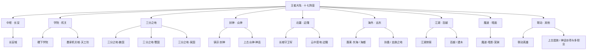
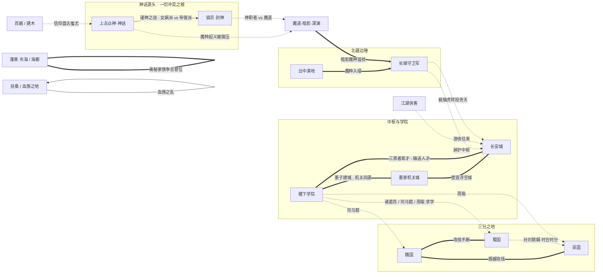

# 阵营势力 · 总览

王者大陆并非铁板一块。从起源时代乘方舟降临、自封为神的超智慧生命体，到神明陨落后群雄并起的人类时代，再到边塞的烽烟、海外的鲛歌与江湖的恩怨——一部王者世界史，本质上就是一部「势力消长史」。神明—神职者—人类—魔道—魔种的森严金字塔在诸神之战中崩塌，碎裂的权力与能量沿着大陆的山川走向四散，最终凝结成今日的十七个阵营势力。

本页是这十七个阵营的总入口。我们按「大区」将它们归拢成九个叙事板块：**中枢 · 长安**（帝国心脏与方舟之秘）、**学院 · 机关**（智慧与造物的殿堂）、**三分之地**（魏蜀吴的逐鹿）、**封神 · 众神**（神话与诸神之战的具象）、**北疆 · 边陲**（长城内外的攻防）、**海外 · 远东**（深海与扶桑的秘辛）、**江湖 · 百越**（散落的浪客与上古部族）、**魔道 · 暗面**（被弃血脉与深渊侵蚀），以及世界观之外独立成组的**联动 · 其他**。

::: info 阅读指引
- 想知道这些阵营在历史长河中如何诞生与瓦解，请回到 [世界观 · 编年纪元](../worldview/timeline.md) 与 [世界观 · 宇宙设定](../worldview/overview.md)。
- 想看跨阵营的羁绊、CP、宿敌全图，请前往 [关系网 · 总览](../relationships/index.md)。
- 点击下表或卡片中的阵营名，即可进入各阵营的专属档案页。
:::

::: warning 关于「阵营」的口径
《王者荣耀》官方阵营划分长期边填坑边修订（旧版 12 阵营 → 重划 12 阵营 → 精简为 10 大阵营 + 9 大地理区域），地名亦有迁移合并（如东风海域与扶桑、日落海与勇士之地）。本百科采用「兼顾世界观叙事与英雄归属」的实用划分，共 **17 个阵营**。部分英雄因双定位、跨阵营活动而存在归属争议，已在各阵营页与本页脚注中说明。**(考据推测)** 标注处为社区整合或合理推断，非官方硬设定。
:::

---

## 大区分组总图

下图按九大区展示十七个阵营的归属关系。

下表把九大区拆解为「叙事母题 + 旗下阵营 + 英雄密度」三栏，便于横向比较各区在世界观中的分量。

| 大区 | 旗下阵营 | 英雄数 | 叙事母题 |
|---|---|:---:|---|
| 中枢 · 长安 | 长安城 | 26 | 帝国心脏与方舟之秘，英雄密度全大陆第一 |
| 学院 · 机关 | 稷下学院、墨家机关城·天工坊 | 15 | 智慧、师承与造物的双子殿堂 |
| 三分之地 | 魏国、蜀国、吴国 | 20 | 神隐之后的群雄逐鹿，三种风骨碰撞 |
| 封神 · 众神 | 镐京·封神、上古众神·神话 | 21 | 创世神话与诸神之战，一切冲突之根 |
| 北疆 · 边陲 | 长城守卫军、云中漠地·边陲 | 11 | 长城内外的攻防与魔种侵蚀 |
| 海外 · 远东 | 蓬莱·东海 / 海都、扶桑 / 血族之地 | 8 | 深海鲛歌与扶桑武道的异域秘辛 |
| 江湖 · 百越 | 江湖侠客、百越 / 建木 | 11 | 帝国之外的浪客武林与上古部族 |
| 魔道 · 暗面 | 魔道·暗影·深渊 | 2 | 被弃血脉与深渊力量的世界阴面 |
| 联动 · 其他 | 联动英雄、上古遗族 / 神话杂项与多职业 | 6 | 跨 IP 客座与玩家化身等特殊存在 |

::: info 如何读这张速览表
九大区合计 **120 名**英雄（与下方阵营总表口径一致）。可以看到「封神 · 众神」（21）与「三分之地」（20）在英雄数上仅次于独占鳌头的长安（26）——这正呼应了世界观的两大重心：**神话源头**与**人类逐鹿**。「魔道 · 暗面」虽仅 2 名可玩英雄，其设定却贯穿所有阵营的冲突线，是「以少御多」的关键阴面。
:::

---

## 阵营总表

下表汇总全部十七个阵营的核心档案。「英雄数」按本百科归类口径统计（双定位英雄按主阵营计一次），合计 **120 名**（含元流之子等多职业自选英雄）。

| 阵营 | 所在大区 | 方位 | 主题 | 核心人物 | 英雄数 | 一句话 |
|---|---|---|---|---|:---:|---|
| [长安城](../factions/changan.md) | 中枢 · 长安 | 河洛东南 · 大陆中心 | 盛唐都市 + 上古机关浮空城 + 方舟之秘 | [武则天](../heroes/changan.md#武则天)、[墨子](../heroes/mojia-jiguan.md#墨子)、明世隐 | 26 | 大陆第一雄城，本质却是封印的方舟。 |
| [稷下学院](../factions/jixia.md) | 学院 · 机关 | 大陆中部逐鹿地区 | 学术殿堂 + 上古遗迹科技 + 魔法武道并存 | [老夫子](../heroes/jixia.md#老夫子)、[庄周](../heroes/penglai-donghai.md#庄周)、[墨子](../heroes/mojia-jiguan.md#墨子) | 11 | 三贤者共建的最高学堂，有教无类。 |
| [墨家机关城·天工坊](../factions/mojia-jiguan.md) | 学院 · 机关 | 稷下学院内 | 机关术 + 古代科技 + 防御工事 | [墨子](../heroes/mojia-jiguan.md#墨子) | 4 | 太古能量驱动的机关道，长安浮空城的技术根基。 |
| [三分之地·魏国](../factions/sanfen-wei.md) | 三分之地 | 三分之地 · 武都 | 三国争霸 + 尚武枭雄 | [曹操](../heroes/sanfen-wei.md#曹操) | 6 | 灰墙石柱、兵强马壮的尚武枭雄之邦。 |
| [三分之地·蜀国](../factions/sanfen-shu.md) | 三分之地 | 三分之地 · 益城 | 三国争霸 + 侠义桃源 | [刘备](../heroes/sanfen-shu.md#刘备) | 9 | 桃花世外、侠肝义胆，三国中英雄最多的阵营。 |
| [三分之地·吴国](../factions/sanfen-wu.md) | 三分之地 | 三分之地 · 江郡 | 三国争霸 + 江南水乡 | [孙策](../heroes/sanfen-wu.md#孙策)、孙权 | 5 | 江南水乡、富庶园林，姻亲网交织的东吴。 |
| [镐京·封神](../factions/haojing-fengshen.md) | 封神 · 众神 | 镐京 / 朝歌 | 封神神话 + 神职者与魔道斗争 | [姜子牙](../heroes/haojing-fengshen.md#姜子牙) | 10 | 《封神演义》的具象战场，神话向人类时代的过渡。 |
| [上古众神·神话](../factions/shanggu-shenhua.md) | 封神 · 众神 | 起源之地 | 创世神话 + 科幻方舟双重外壳 | [女娲](../heroes/shanggu-shenhua.md#女娲) | 11 | 自封之神分裂为女娲派与帝俊派，一切冲突之源。 |
| [长城守卫军](../factions/changcheng.md) | 北疆 · 边陲 | 河洛西北 · 长城 | 边塞军旅 + 对抗暗影魔种 + 多元包容 | [苏烈](../heroes/changcheng.md#苏烈)、[李信](../heroes/changan.md#李信)、[花木兰](../heroes/changan.md#花木兰) | 6 | 太古长城的守望者，吸纳魔种混血的多元军团。 |
| [云中漠地·边陲](../factions/yunzhong-modi.md) | 北疆 · 边陲 | 长城以西 · 中西部高原 | 丝路绿洲 → 魔种侵蚀的沙漠废土 | 云中沙之盟 | 5 | 昔日丝路明珠，今日魔种横行的沙漠废土。 |
| [蓬莱·东海 / 海都](../factions/penglai-donghai.md) | 海外 · 远东 | 大陆极西 · 深海之畔 | 海洋文明 + 鲛人歌谣 + 奥秘家族阴谋 | 塔之家族（海都总督） | 7 | 鲛人歌谣守护的海洋都市，奥秘家族暗潮涌动。 |
| [扶桑 / 血族之地](../factions/fusang-xuezu.md) | 海外 · 远东 | 大陆最东端最大岛屿 | 东瀛武士道 + 血族恐怖 + 海域秘辛 | 血族王 徐福 | 1 | 武士道之岛，潜伏着血族王统治的恐怖巢穴。 |
| [江湖侠客](../factions/jianghu-xiake.md) | 江湖 · 百越 | 散布大陆 / 勇士之地 | 武林恩怨 + 刺客世家 + 浪客游侠 | 荆氏一族 / 诸浪客 | 5 | 游离于帝国与学院之外的武林与刺客世家。 |
| [百越 / 建木](../factions/baiyue.md) | 江湖 · 百越 | 建木（天生巨木区域） | 上古部落 + 盘古蚩尤信仰 + 锻造炼器 | 归山一族 | 6 | 信仰盘古蚩尤的边远部族，世代传承锻造术。 |
| [魔道·暗影·深渊](../factions/modao-shadow-abyss.md) | 魔道 · 暗面 | 倒悬天之外 / 大漠深渊 / 暗影之径 | 黑暗魔法 + 被奴役者反抗 + 深渊侵蚀 | （无统一首领） | 2 | 被弃血脉与深渊力量，世界的阴面。 |
| [联动英雄](../factions/liandong-snk.md) | 联动 · 其他 | 跨 IP 联动 | 跨 IP 客座 | （客座，无主线首领） | 3 | 跨 IP 入驻的客座英雄，独立于主线之外。 |
| [上古遗族 / 神话杂项与多职业](../factions/yuanchu-shenhua-misc.md) | 联动 · 其他 | 鸣沙之谷 / 上古遗迹 / 王者世界主线 | 上古遗族 + 多职业自选 + 玩家化身 | [元流之子](../heroes/yuanchu-shenhua-misc.md#元流之子) | 3 | 神话遗族与玩家化身，连接所有阵营的特殊存在。 |

::: info 统计口径说明
- **120 名**为本百科归类下的去重总数（含元流之子）。本作官方约 120+ 名英雄，差额主要源于：部分双定位英雄按主定位归一处；以及史实吴国群将（黄盖、周泰、太史慈、甘宁）信息极少、未单列条目。
- 跨阵营双定位英雄的归属决策（如花木兰、铠、廉颇、东皇太一、元歌等）详见各阵营页与文末脚注。
:::

---

## 中枢 · 长安

王者大陆的地理与政治心脏。盛唐繁华叠合上古机关浮空城，地底却封存着方舟核心——长安城本身就是被封印的方舟。女帝武则天统治于此，尧天、占星塔、万镜阁、梨园诸势力暗流交错，是全大陆英雄密度最高的舞台。

<a class="hok-card" href="../factions/changan">长安城墨子亲手营造的大陆第一雄城。盛唐都市与上古机关浮空城合一，地底封存方舟核心能量；女帝武则天主政，尧天、万镜阁、梨园群雄汇聚。</a>

---

## 学院 · 机关

智慧与造物的双子殿堂。稷下学院由三贤者创立，分武道、魔道、机关三派，环绕通天塔而立；墨家机关城（天工坊）则是其中机关一脉的技术内核，太古能量驱动的机关术延伸出长安浮空城与无数机关造物。

<a class="hok-card" href="../factions/jixia">稷下学院原型为齐国稷下学宫，三贤者（老夫子 / 庄周 / 墨子）创立的学术中立殿堂，有教无类。诸葛亮、司马懿、周瑜、元歌「稷下 F4」皆出于此。</a>
<a class="hok-card" href="../factions/mojia-jiguan">墨家机关城·天工坊墨子复兴的机关术流派，依赖太古能量核心运作。墨家机关与公输般（鲁班）工巧的经典对照，是浮空城与机关人的技术根基。</a>

---

## 三分之地

神明退场后，魏、蜀、吴在三分之地割据攻伐，是「群雄逐鹿」最具张力的篇章。魏都尚武、益城侠义、江郡富庶，三种截然不同的风骨在同一片土地上碰撞。

<a class="hok-card" href="../factions/sanfen-wei">三分之地·魏国以魏都为核心，民风彪悍尚武、富侵略野心。枭雄曹操统领，灰墙石柱、兵强马壮。</a>
<a class="hok-card" href="../factions/sanfen-shu">三分之地·蜀国以益城为核心，山清水秀、桃花绚烂的侠义桃源。仁德枭雄刘备统领，桃园结义与五虎将羁绊交织，是三国中英雄最多的阵营（9 名）。</a>
<a class="hok-card" href="../factions/sanfen-wu">三分之地·吴国以江郡为核心，江南水乡、私家园林造景。孙策、孙权统领，孙周大乔小乔的姻亲网维系其中。</a>

---

## 封神 · 众神

世界观最古老、张力最强的两个板块。镐京·封神以《封神演义》为骨架，铺陈神职者与魔道的厮杀；上古众神·神话则追溯至起源之地——自封之神分裂为女娲派与帝俊派，诸神之战在此爆发，成为后世一切冲突的真正源头。

<a class="hok-card" href="../factions/haojing-fengshen">镐京·封神以《封神演义》为原型的封神之战体系。姜子牙领讨伐军征讨纣王（帝辛 / 帝俊），是神明时代向人类时代过渡的关键。</a>
<a class="hok-card" href="../factions/shanggu-shenhua">上古众神·神话起源之地的自封之神与上古众神。创世神话与科幻方舟的双重外壳，女娲派与帝俊派的分裂在此奠定，孙悟空的魔种起义亦由此而起。</a>

---

## 北疆 · 边陲

长城内外的攻与防。长城守卫军以太古长城为屏障，吸纳魔种混血与异乡人，抵御来自云中漠地的魔种威胁；而云中漠地本身，正是这股威胁的来源——昔日丝路绿洲明珠，因魔道滥用沦为魔种横行的废土。

<a class="hok-card" href="../factions/changcheng">长城守卫军守护边境长城、抵御大漠魔种的多元军团。历任统帅苏烈、李信，核心为花木兰带领的长城小队，包容魔种混血、屯田后裔与女性英才。</a>
<a class="hok-card" href="../factions/yunzhong-modi">云中漠地·边陲长城以西的高原沙漠，代表势力云中沙之盟。曾是丝路绿洲、贸易繁荣，后因魔种入侵与魔道滥用衰败为废土，是长城守卫军主要的防御对象来源。</a>

---

## 海外 · 远东

大陆边缘的两片异域海土。极西的海都是鲛人歌谣守护的海洋文明，却被诅咒的奥秘家族争权所撕裂；极东的扶桑则是武士道之岛，暗藏血族王统治的恐怖巢穴。

<a class="hok-card" href="../factions/penglai-donghai">蓬莱·东海 / 海都极西深海之畔的海洋都市。鲛人族以歌谣守护海洋千年，反叛的十一奥秘家族夺取奇迹之力遭诅咒，月之家族与塔之家族围绕总督之位长期斗争。</a>
<a class="hok-card" href="../factions/fusang-xuezu">扶桑 / 血族之地大陆最东端最大岛屿，含京都与血族巢穴两城。学者僧侣远赴稷下、长安求学，后血族之乱降临，武者与血族的核心冲突就此点燃。</a>

---

## 江湖 · 百越

帝国与学院之外的两股「野」势力。江湖侠客是散落大陆的武林恩怨与刺客世家，浪客游侠在勇士之地的武道大会中较量；百越 / 建木则是以盘古、蚩尤上古神话为根脉的边远部族，世代守护建木、传承锻造术。

<a class="hok-card" href="../factions/jianghu-xiake">江湖侠客游离于帝国与学院之外的散落势力。荆氏一族世代为刺客，圣枪游侠、西部牛仔、非遗彩戏师等异乡浪客亦归此圈层。</a>
<a class="hok-card" href="../factions/baiyue">百越 / 建木以盘古、蚩尤上古神话为根脉的边远部族。建木为天生巨木拔地而起、自成山川，归山一族信仰盘古、传承锻造，致力平息建木上空的紊流灾难。</a>

---

## 魔道 · 暗面

世界的阴面，由被神明改造失败而抛弃的魔道家族、被奴役反抗的魔种、大漠魔道滥用催生的暗影魔种，以及象征毁灭堕落的深渊共同构成。它们掌握由世界本源知识法则驱动的魔道学问，与神明、长城守卫军、云中漠地全面对立。

<a class="hok-card" href="../factions/modao-shadow-abyss">魔道·暗影·深渊被弃血脉与深渊力量的集合。魔道家族因罪而得力量、魔种因压迫而反抗、深渊因失衡而侵蚀，构成与创造 / 光明对立的一极。</a>

---

## 联动 · 其他

世界观主线之外的两组特殊存在。联动英雄是跨 IP 入驻的客座角色（SNK《侍魂》《拳皇》及 AOV / Garena 等），独立成组；上古遗族 / 神话杂项与多职业则收纳不易归入单一阵营的神话遗族，以及作为玩家化身、连接所有阵营的元流之子。

<a class="hok-card" href="../factions/liandong-snk">联动英雄跨 IP 联动入驻的客座英雄分组。世界观上不属于主线阵营，独立成组（不知火舞因血族叙事已归扶桑阵营）。</a>
<a class="hok-card" href="../factions/yuanchu-shenhua-misc">上古遗族 / 神话杂项与多职业承载孙悟空宿敌六耳、鸣沙族桑启等神话遗族，以及王者首位多职业自选英雄元流之子——玩家的化身、回溯灭世之战的扭转者。</a>

---

## 阵营矛盾与同盟关系图

阵营之间并非孤立。下图勾勒主要的矛盾（红/对立）与同盟、师承、归属（蓝/协作）关系。请注意：神话层的起义—镇压、女娲派与帝俊派的分裂，是后世一切矛盾的总源头。

::: tip 关系图例
- 实线箭头 / 双实线（`==>` `===`）表示强烈对立或紧密协作；虚线箭头（`-.->`）表示松散、间接或时合时分的关系。
- 自指箭头（如海都、扶桑指向自身）表示阵营**内部**的斗争——奥秘家族的总督之争、血族之乱皆是「内忧」。
- 更细颗粒度的人物级羁绊（CP、师徒、宿敌、兄弟），请见 [关系网 · 总览](../relationships/index.md)。
:::

::: quote 题献
「众生皆苦，唯有自渡。」——王者大陆的每一个阵营，都在为各自所信的「秩序」与「自由」而战。神明如此，凡人亦如此。
:::

---

### 延伸阅读

<a class="hok-card" href="../worldview/overview">世界观 · 总览王者大陆的宇宙设定、方舟核心、源能体系与编年纪元。</a>
<a class="hok-card" href="../heroes/index">英雄 · 总览全部一百二十名英雄的定位、阵营与档案索引。</a>
<a class="hok-card" href="../relationships/index">关系网 · 总览跨阵营的 CP、师徒、宿敌、兄弟羁绊全图。</a>

::: details 脚注 · 跨阵营归属与口径争议（考据）
本页若干归属判定与官方某些版本可能不完全一致，特此说明 **(考据推测)**：

- **花木兰 / 铠**：二者世界观上深度关联长城守卫军，但长居长安体系活动，主条目置于 [长安城](../factions/changan.md)，长城守卫军条目通过关系网体现其战友身份。
- **廉颇 / 东皇太一**：廉颇为赵国名将兼老夫子弟子，因封神时代张力最强（与项羽、虞姬同框）归 [镐京·封神](../factions/haojing-fengshen.md)；东皇太一在稷下 / 封神 / 上古众神间摇摆，因神巫题材与稷下关联更具体，归 [稷下学院](../factions/jixia.md)。
- **元歌**：原型蜀国军师庞统，虽于长安以傀儡师活动，阵营归 [蜀国](../factions/sanfen-shu.md)。
- **嬴政 / 白起**：玄雍（秦地原型）势力英雄稀少，未单建阵营，嬴政归 [长安城](../factions/changan.md)、白起归 [稷下学院](../factions/jixia.md)，玄雍背景于编年与关系网中保留。
- **庄周**：三贤者之一，世界观活动延伸至海都，主条目置于 [蓬莱·东海](../factions/penglai-donghai.md)（关联稷下魔道学院）。
- **不知火舞**：因明确的血族之乱叙事归 [扶桑 / 血族之地](../factions/fusang-xuezu.md)，不计入联动组；娜可露露、橘右京、弗洛伦等无主线归属的联动英雄归 [联动英雄](../factions/liandong-snk.md)。
- **吴国群将**：黄盖、周泰、太史慈、甘宁等史实武将信息极少、未单列条目，若计入吴国可补足总数至约 123。
- 称号字段部分取自荣耀王者专属称号或主题词（已去前缀），与官方世界观称号可能存在差异，建议以官方世界观体验站逐个核对。
:::