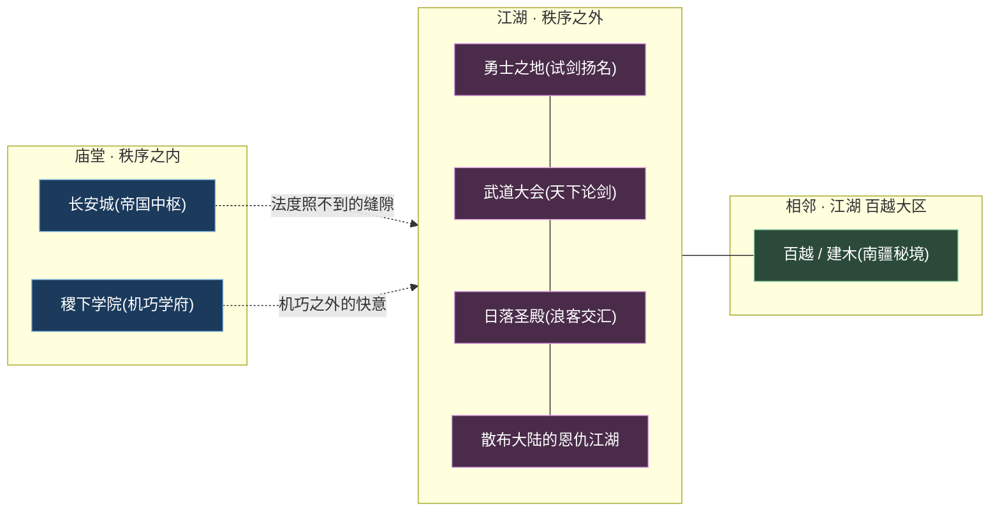
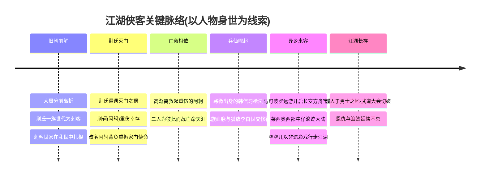
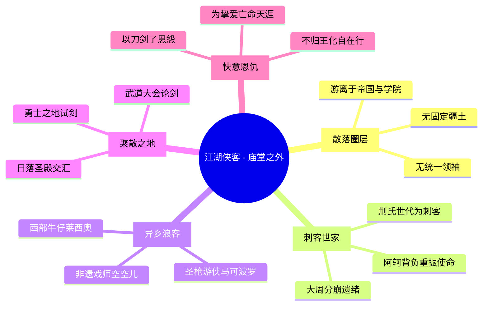
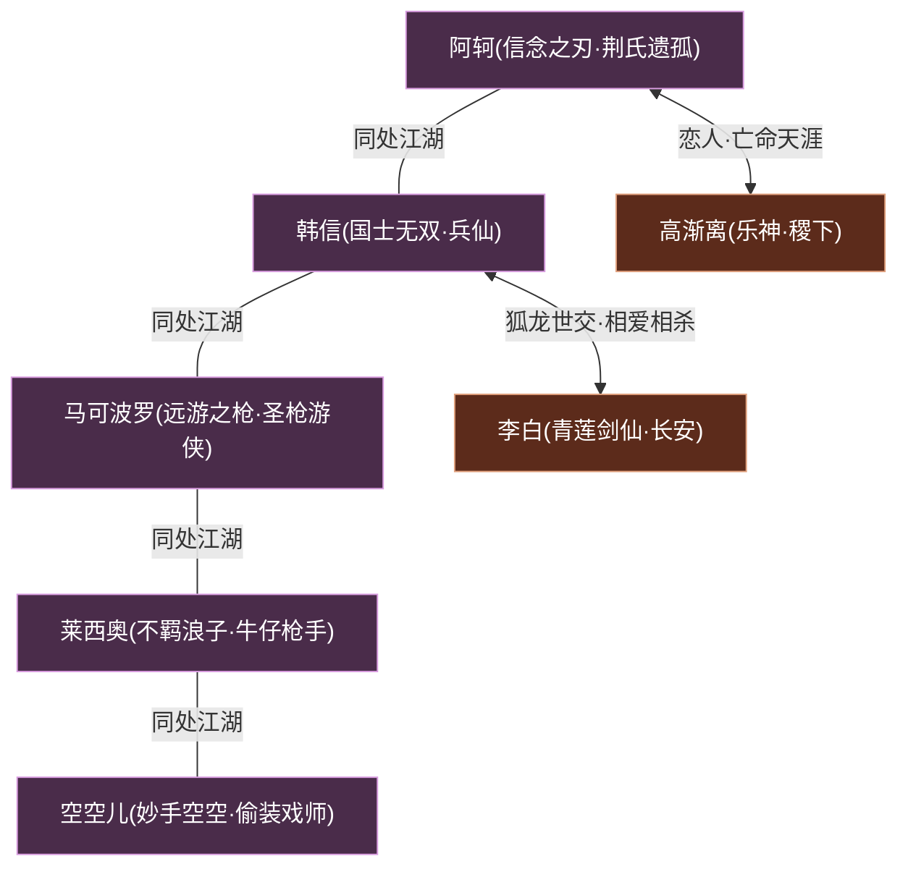
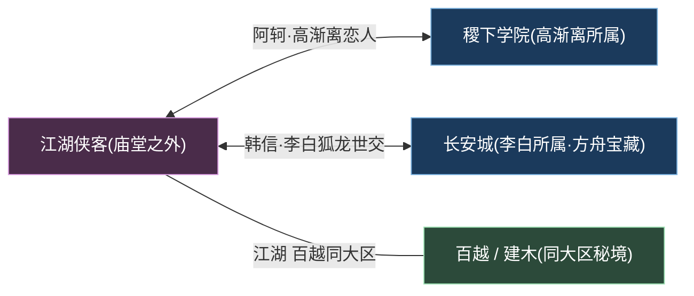

# 江湖侠客

江湖 · 百越武林浪客游侠刺客

> **庙堂之外的快意恩仇 · 刺客世家的血脉宿命 · 异乡浪客的漂泊江湖** —— 在帝国的法度与学院的机巧都照不到的角落，散落着一群不归王化、各凭刀剑枪戏立身的人：灭门刺客的遗孤、寒微出身的兵仙、远渡而来的圣枪游侠、西部牛仔与非遗戏法师……他们彼此并无统属，却共用同一片名为「江湖」的天地。

---

!!! abstract "阵营概述"
    **江湖侠客**（亦称「江湖 / 武林 / 勇士之地」）并非一个有城有主、有册有令的正规阵营，而是一处**游离于[长安帝国](../factions/changan.md)与[稷下学院](../factions/jixia.md)体系之外的散落圈层**。它由武林恩怨、刺客世家与异乡浪客交织而成——这里没有统一的旗帜，没有共同的君王，维系众人的只有一套不成文的「江湖规矩」与各自背负的恩仇宿命。

    在[王者大陆](../worldview/overview.md)的版图上，「江湖」更像一种**生存状态**而非一块固定疆土。它的人物常在[勇士之地](../worldview/map.md)、**武道大会**、**日落圣殿**等场景交汇切磋——勇士之地是浪客试剑、刺客扬名之所；武道大会是天下高手论剑的擂台；这些场景把本无隶属的散人们暂时聚到一处。

    本圈层的精神原点，是**荆氏一族**的覆灭。大周分崩之后，荆氏世代为刺客，「**信念之刃**」[阿轲](../heroes/jianghu-xiake.md#阿轲)正是这门刺客世家硕果仅存的少女——她背负重振荆氏的使命，与乐师[高渐离](../heroes/jixia.md#高渐离)亡命天涯。除了根植中原的刺客世系，江湖里还漂荡着诸多**异乡浪客**：远游开启长安方舟宝藏的圣枪游侠[马可波罗](../heroes/jianghu-xiake.md#马可波罗)、潇洒不羁的西部牛仔[莱西奥](../heroes/jianghu-xiake.md#莱西奥)、以非遗戏法行偷天换日之术的[空空儿](../heroes/jianghu-xiake.md#空空儿)，以及与[李白](../heroes/changan.md#李白)为狐龙世交的兵仙[韩信](../heroes/jianghu-xiake.md#韩信)。剑圣、游侠、戏师、刺客——这便是江湖。

## 阵营档案

| 档案项 | 内容 |
| :--- | :--- |
| **阵营名** | 江湖侠客（facId: `jianghu-xiake`） |
| **别称** | 江湖 / 武林 / 勇士之地 |
| **地理位置** | 散布[王者大陆](../worldview/overview.md) / [勇士之地](../worldview/map.md)（无固定疆界） |
| **所属大区** | 江湖 · 百越 |
| **主题风格** | 武林恩怨 + 刺客世家 + 浪客游侠 |
| **核心领袖** | 无统一领袖（散落圈层）；以[阿轲](../heroes/jianghu-xiake.md#阿轲)（荆氏遗孤）、[韩信](../heroes/jianghu-xiake.md#韩信)（兵仙）为叙事核心 |
| **成员数** | 5 名英雄（本阵营名册收录） |
| **关键词** | 快意恩仇 · 刺客世家 · 荆氏血脉 · 异乡浪客 · 勇士之地 · 武道大会 · 不归王化 |

---

## 地理与环境

与那些「以城立国、以墙划界」的阵营不同，江湖侠客**没有固定的疆土**。它的版图，是一张由「场景」而非「领地」织成的网——浪客走到哪里，江湖就延伸到哪里。要理解它的地理，须先理解它存在于帝国秩序的**缝隙**之中。

!!! info "三处江湖交汇地（考据推测）"
    依据本阵营资料，江湖侠客的人物「常与勇士之地、武道大会、日落圣殿等场景交汇」。这三处并非阵营所辖的「领地」，而是江湖人聚散切磋的**公共舞台**：

    - **勇士之地**：浪客试剑、刺客扬名、强者论高下的所在，是「江湖」最具象的落脚点。
    - **武道大会**：天下高手论剑较技的擂台，把本无隶属的散人暂时聚拢。
    - **日落圣殿**：异乡浪客交汇、漂泊者歇脚之地（考据推测为江湖人往来的节点）。

    它们共同的特征是——**人来人往、聚散无常**，恰如江湖本身。

!!! note "「江湖」是一种状态，而非一块地"
    在等级森严的[王者大陆](../worldview/overview.md)，多数人被「神明—神职者—人类—魔道—魔种」的[金字塔](../worldview/overview.md)框定身份。江湖侠客的独特之处，在于他们**主动或被动地脱离了这套框架**：阿轲是被灭门后无家可归的遗孤，韩信是出身寒微的弃儿，马可波罗与莱西奥是远道而来的异乡人。江湖，正是这些「不在格子里的人」给自己找的安身之处。

| 地理 / 场景要素 | 性质 | 关联 |
| :--- | :--- | :--- |
| 勇士之地 | 试剑扬名的江湖舞台 | 全体浪客刺客 |
| 武道大会 | 天下论剑的擂台 | 剑客、游侠切磋之所 |
| 日落圣殿 | 异乡浪客交汇地（考据推测） | [马可波罗](../heroes/jianghu-xiake.md#马可波罗)、[莱西奥](../heroes/jianghu-xiake.md#莱西奥) |
| 荆氏故地（大周遗绪） | 刺客世家的血脉源头 | [阿轲](../heroes/jianghu-xiake.md#阿轲) |
| 长安方舟宝藏 | 远游游侠开启之门 | [马可波罗](../heroes/jianghu-xiake.md#马可波罗) |
| 相邻 · 百越 / 建木 | 同属「江湖 · 百越」大区的南疆秘境 | [百越 / 建木](../factions/baiyue.md) |

---

## 历史沿革

江湖侠客没有一部统一的「编年史」——它是由一桩桩**恩怨**、一个个**漂泊的身世**拼合而成的。但若要为这片散落圈层找一条主线，那便是**大周分崩之后，旧秩序的碎片如何沉淀为江湖**。

### 旧朝崩解 · 刺客世家的根

据本阵营资料，**大周分崩**之后，**荆氏一族世代为刺客**。这是江湖侠客最深的一条根——刺客世家并非凭空而生，而是旧朝秩序崩解、乱世人各求生的产物。当庙堂的法度失去约束力，「以刀剑了结恩怨」便成了江湖通行的逻辑，而荆氏，正是这套逻辑的世代传承者。

!!! quote "阿轲 · 信念之刃"
    「我的名字叫阿轲，是荆氏一族……仅剩的最后一人。」（呼应阿轲原名荆轲、灭门后改名、背负重振家门使命的设定。）

### 荆氏灭门 · 遗孤的诞生

!!! warning "转折点 · 荆氏覆灭与阿轲改名"
    江湖侠客叙事的核心悲剧，是**荆氏一族的灭门**。这门世代为刺客的家族遭遇灭顶之灾，唯有少女**荆轲**重伤幸存。她**改名为「阿轲」**，从此背负起**重振荆氏**的沉重使命——既是家族最后的血脉，也是家族最后的刀锋。这场灭门，把一个本可安居的少女，彻底抛进了江湖。

### 亡命相依 · 阿轲与高渐离

荆氏灭门后，重伤的[阿轲](../heroes/jianghu-xiake.md#阿轲)被乐师[高渐离](../heroes/jixia.md#高渐离)所救。自此，一名刺客与一名乐师**为彼此而战、亡命天涯**——这是官方背景故事中最动人的一笔。值得注意的是，高渐离的英雄主条目归属[稷下学院](../factions/jixia.md)体系，但他与阿轲的命运，已深深缠进江湖这条线。

### 兵仙崛起 · 寒微与龙血

与刺客世家平行的，是**兵仙[韩信](../heroes/jianghu-xiake.md#韩信)**的崛起。他**出身寒微**，却身负**龙族血脉**，以枪法位移见长，成为收割型刺客。在皮肤剧情中，他与[李白](../heroes/changan.md#李白)为**狐龙世交**——李白属狐族、韩信属龙族，两族世代为友，二人自幼相识、一同修行（详见下文「阵营关系」）。韩信的故事，为江湖添上了「寒门崛起、剑指苍穹」的另一种底色。

### 异乡来客 · 江湖不分疆界

江湖的魅力，还在于它**容得下天南海北的异乡人**：

- **圣枪游侠[马可波罗](../heroes/jianghu-xiake.md#马可波罗)**：远游而来，手持双枪行走大陆，开启了**长安方舟宝藏之门**。
- **不羁浪子[莱西奥](../heroes/jianghu-xiake.md#莱西奥)**：潇洒不羁的西部牛仔浪客枪手，以灵活走位与射击连段闻名。
- **妙手[空空儿](../heroes/jianghu-xiake.md#空空儿)**：以**非遗彩戏（戏法）**为设计原型、能在战斗中夺取敌方装备的「偷装神辅」。

他们与中原的刺客世家本无渊源，却同样被江湖收纳——这正说明，「江湖」从不以血脉或故土论亲疏，只问你是否有一身可在勇士之地立足的本事。

---

## 组织 / 理念 / 特色

江湖侠客的「组织」，恰恰在于它**没有组织**。它没有君王、没有册令、没有统一指挥——它靠的是一套不成文的**江湖逻辑**：恩仇自了、强者为尊、各凭本事、来去自由。

!!! note "理念一 · 不归王化的自由"
    江湖侠客最鲜明的标签，是「**游离于帝国与学院之外**」。当[长安城](../factions/changan.md)以法度治世、[稷下学院](../factions/jixia.md)以机巧名世，江湖人选择了**第三条路**——既不效忠君王，也不皓首穷经，而是凭一身武艺浪迹天涯。这份「不归王化」，是自由，也是漂泊。

!!! note "理念二 · 恩仇自了的逻辑"
    在江湖，恩怨多以**刀剑了结**而非诉诸律法。荆氏世代为刺客、阿轲背负灭门之仇、刺客世家彼此倾轧——这套「恩仇自了」的逻辑，构成了江湖最底层的运行规则。它残酷，却也催生出阿轲与高渐离「为彼此而战」那样的至情。

!!! tip "理念三 · 各凭本事的多元"
    江湖不问出身、不问族裔。刺客（阿轲、韩信）、圣枪游侠（马可波罗）、牛仔枪手（莱西奥）、非遗戏师（空空儿）——职业五花八门、风格天差地别，却都能在勇士之地占一席之地。**唯一的通行证，是本事。**

| 特色维度 | 江湖侠客的呈现 |
| :--- | :--- |
| **组织形态** | 散落圈层，无君王、无册令、无统一指挥——靠不成文的江湖规矩维系 |
| **职业生态** | 刺客世家（阿轲背刺暴击隐身、韩信枪法位移收割）+ 游侠射手（马可波罗双枪、莱西奥连段）+ 偷装神辅（空空儿夺装）——刺客与游侠双核 |
| **英雄来源** | 中原刺客世系（阿轲、韩信）与异乡浪客（马可波罗、莱西奥、空空儿）并存 |
| **跨阵营纽带** | 与[稷下学院](../factions/jixia.md)（高渐离救阿轲）、[长安城](../factions/changan.md)（李白与韩信狐龙世交、方舟宝藏）深度交织 |
| **文化母题** | 灭门复仇、亡命天涯、寒门崛起、异乡漂泊、非遗戏法——浓郁的「武侠 + 浪客」气质 |

!!! info "考据 · 「江湖侠客」是分类，更是气质"
    需说明：江湖侠客作为阵营，更接近一种**编目上的归类**与**叙事气质的聚合**，而非世界观里实存的「组织」。它把那些不便归入帝国、学院、三国、封神等体系的「散人」收拢一处。本页所述「领袖」「成员」，皆以此理解为宜——他们彼此未必相识，却共享同一片江湖天地。

---

## 核心人物

江湖侠客没有统一的领袖，但有两位足以撑起整片江湖叙事的核心人物：一位是背负灭门血仇的**刺客世家遗孤**，一位是出身寒微、剑指苍穹的**兵仙**。

### 阿轲 · 信念之刃

刺客

[阿轲](../heroes/jianghu-xiake.md#阿轲)（信念之刃），**荆氏一族仅存的少女**。她原名**荆轲**，在家族遭遇灭门之祸后重伤幸存、改名为「阿轲」，从此背负起**重振荆氏**的使命。作为刺客世家的最后传人，她的战斗风格也极具刺客本色——**背刺必定暴击、可隐身潜行**，是典型的收割型刺客。荆氏灭门后，她被乐师[高渐离](../heroes/jixia.md#高渐离)所救，二人**为彼此而战、亡命天涯**，是江湖里最广为流传的一段悲情。阿轲是「江湖侠客」刺客世家这条根脉的人格化身。

!!! quote "阿轲 · 信念之刃"
    「只要心中信念不灭，刀，就还握得住。」（呼应阿轲「信念之刃」称号、灭门后以信念支撑、背负重振家门使命的设定。）

### 韩信 · 国士无双

刺客

[韩信](../heroes/jianghu-xiake.md#韩信)（国士无双），**出身寒微的兵仙**，身负**龙族血脉**。他以**枪法与位移**见长，是机动性极强的收割型刺客——能在战场上往来穿梭、一击致命。在皮肤剧情中，他与[李白](../heroes/changan.md#李白)为**狐龙世交**：李白属狐族、韩信属龙族，两族世代为友，二人自幼相识、一同修行（「凤求凰 / 白龙吟」两款皮肤正是这段渊源的呼应）。从寒门弃子到「国士无双」，韩信代表了江湖「寒门凭本事崛起」的另一极。

---

## 成员花名册

江湖侠客虽是散落圈层，成员却**风格鲜明、各成一派**——以刺客（阿轲、韩信）的世家血脉与位移收割为骨，辅以游侠射手（马可波罗、莱西奥）的双枪连段、戏师（空空儿）的偷装奇术，凑成一桌「刀剑枪戏、各显神通」的江湖盛宴。

刺客射手辅助战士

| 英雄 | 称号 | 定位 | 一句话身份 |
| :--- | :--- | :--- | :--- |
| [阿轲](../heroes/jianghu-xiake.md#阿轲) | 信念之刃 | 刺客 | 荆氏一族仅存少女（原名荆轲后改名），背刺必暴击、可隐身，与[高渐离](../heroes/jixia.md#高渐离)亡命天涯，背负重振荆氏使命。 |
| [韩信](../heroes/jianghu-xiake.md#韩信) | 国士无双 | 刺客 | 出身寒微的兵仙、龙族血脉，以枪法位移见长的收割型刺客，与[李白](../heroes/changan.md#李白)为狐龙世交。 |
| [马可波罗](../heroes/jianghu-xiake.md#马可波罗) | 远游之枪 | 射手 | 异乡远游的圣枪游侠，手持双枪行走王者大陆，开启长安方舟宝藏之门。 |
| [莱西奥](../heroes/jianghu-xiake.md#莱西奥) | 不羁浪子 | 射手 | 潇洒不羁的西部牛仔浪客枪手，主打灵活走位与射击连段。 |
| [空空儿](../heroes/jianghu-xiake.md#空空儿) | 妙手空空 | 辅助/战士 | 以非遗彩戏（戏法）为设计、能夺取敌方装备的偷装神辅。 |

!!! tip "花名册速读 · 三类江湖人"
    - **刺客世系**：[阿轲](../heroes/jianghu-xiake.md#阿轲)（荆氏遗孤·背刺暴击隐身）、[韩信](../heroes/jianghu-xiake.md#韩信)（兵仙龙血·枪法位移）——江湖的「刀锋」。
    - **游侠枪手**：[马可波罗](../heroes/jianghu-xiake.md#马可波罗)（圣枪双枪·开方舟宝藏）、[莱西奥](../heroes/jianghu-xiake.md#莱西奥)（西部牛仔·走位连段）——江湖的「远游者」。
    - **奇术戏师**：[空空儿](../heroes/jianghu-xiake.md#空空儿)（非遗彩戏·夺装偷天）——江湖的「妙手」。

!!! note "考据 · 名册边界与「兼属」人物"
    本表仅收录英雄目录中 facId 明确为 `jianghu-xiake` 的 5 名成员。需注意：与阿轲亡命天涯的[高渐离](../heroes/jixia.md#高渐离)英雄主条目归[稷下学院](../factions/jixia.md)，与韩信狐龙世交的[李白](../heroes/changan.md#李白)归[长安城](../factions/changan.md)——二人虽叙事上与江湖深度绑定，却不计入本阵营名册，详见下文「阵营关系」。

---

## 阵营关系

江湖侠客的关系网，最突出的特征是「**向外辐射**」——本阵营内部成员彼此关联较松散（多为「同处江湖」的并列关系），真正牵动人心的牵绊，反而是**跨向其他阵营**的两条线：阿轲与高渐离的生死恋情、韩信与李白的狐龙世交。

### 关系总览表

| 关系类型 | 关联人物 | 性质 | 说明 |
| :--- | :--- | :--- | :--- |
| 恋人（官方背景） | [阿轲](../heroes/jianghu-xiake.md#阿轲)·[高渐离](../heroes/jixia.md#高渐离) | 跨阵营 · 生死相依 | 荆氏灭门后阿轲重伤被高渐离所救，二人为彼此而战、亡命天涯（官方背景故事）。高渐离主条目归[稷下学院](../factions/jixia.md)。 |
| 世交挚友（恋人定性未坐实） | [韩信](../heroes/jianghu-xiake.md#韩信)·[李白](../heroes/changan.md#李白) | 跨阵营 · 狐龙世交 | 皮肤剧情：李白属狐族、韩信属龙族，两族世代为友，二人自幼相识、一同修行、互用彼此之物（凤求凰 / 白龙吟皮肤呼应）。玩家常视作 CP，官方更接近世交挚友 / 相爱相杀。李白主条目归[长安城](../factions/changan.md)。 |
| 同处江湖（并列） | [阿轲](../heroes/jianghu-xiake.md#阿轲)·[韩信](../heroes/jianghu-xiake.md#韩信)·[马可波罗](../heroes/jianghu-xiake.md#马可波罗)·[莱西奥](../heroes/jianghu-xiake.md#莱西奥)·[空空儿](../heroes/jianghu-xiake.md#空空儿) | 同阵营 · 散人圈层 | 同属「江湖侠客」散落圈层，彼此未必相识，共享勇士之地、武道大会等江湖舞台。 |
| 相邻同区 | 江湖侠客·[百越 / 建木](../factions/baiyue.md) | 跨阵营 · 同大区 | 同属「江湖 · 百越」大区，江湖浪客与百越秘境在地理与编目上相邻。 |

### 关系网络图

!!! info "图例说明"
    紫色节点为**江湖侠客本阵营**人物，棕色节点为**跨阵营关联**人物。实线表示阵营内「同处江湖」的并列关系，双向粗连表示跨阵营的核心牵绊（恋人 / 世交）。注意：[高渐离](../heroes/jixia.md#高渐离)主条目归[稷下学院](../factions/jixia.md)、[李白](../heroes/changan.md#李白)主条目归[长安城](../factions/changan.md)，但其情感线深植江湖，故纳入本图。

!!! tip "关系特征 · 散人之间，情牵庙堂"
    江湖侠客的关系图清晰地揭示了一个有趣现象：**本阵营成员彼此是「弱连接」（同处江湖），最强的两条「强连接」却都跨向了庙堂体系**——阿轲牵着稷下的高渐离，韩信牵着长安的李白。这恰恰印证了江湖的本质：它收纳散人，但散人的牵挂，往往散落在江湖之外。

---

## 相关剧情

江湖侠客承载了数条极具张力的故事线，以下为与本阵营最紧密的几条。

- :material-knife: **荆氏遗孤 · 灭门与重振**

    [阿轲](../heroes/jianghu-xiake.md#阿轲)原名荆轲，是世代为刺客的荆氏一族仅存的少女。家族灭门后她重伤幸存、改名「阿轲」，从此背负重振荆氏的使命，背刺暴击、隐身潜行，行走于刀光剑影的江湖。

- :material-heart-broken: **信念之刃 · 亡命天涯的恋人**

    荆氏灭门后，重伤的[阿轲](../heroes/jianghu-xiake.md#阿轲)被乐师[高渐离](../heroes/jixia.md#高渐离)所救。一名刺客、一名乐师，自此为彼此而战、亡命天涯——这是官方背景里最动人的生死恋。详见 [人物关系 · 恋人](../relationships/lovers.md)。

- :material-yin-yang: **狐龙世交 · 信白之谊**

    [韩信](../heroes/jianghu-xiake.md#韩信)属龙族、[李白](../heroes/changan.md#李白)属狐族，两族世代为友。二人自幼相识、一同修行、互用彼此之物（凤求凰 / 白龙吟皮肤呼应），是江湖与长安之间一段相爱相杀的世交。详见 [人物关系 · 恋人](../relationships/lovers.md)。

- :material-treasure-chest: **远游之枪 · 方舟宝藏之门**

    圣枪游侠[马可波罗](../heroes/jianghu-xiake.md#马可波罗)远游而来，手持双枪行走王者大陆，开启了长安方舟宝藏之门——一段「异乡来客撬动中枢秘藏」的奇遇。

!!! example "剧情焦点 · 江湖路远，各有牵挂"
    江湖侠客剧情的动人之处，在于它写尽了「**漂泊者的牵挂**」：阿轲背着灭门血仇，却在高渐离身边找到了值得为之而战的人；韩信从寒门弃子走到国士无双，身后始终有李白这位狐龙世交；马可波罗、莱西奥从异乡远道而来，把江湖走成了自己的归途……他们没有城、没有国、没有王，却各自怀揣着一份比城国更重的情义与执念。**江湖之大，容得下刀剑，更容得下这些无处安放的牵挂。**

---

## 延伸阅读

- :material-account-star: **江湖侠客英雄图鉴**

    本阵营全体英雄（阿轲、韩信、马可波罗、莱西奥、空空儿）的档案、背景与台词，见 [江湖侠客英雄页](../heroes/jianghu-xiake.md)。

- :material-heart: **专题 · 恋人与情牵**

    阿轲与高渐离、韩信与李白等情感线的全景，见 [人物关系 · 恋人](../relationships/lovers.md)。

- :material-graph: **人物关系总览**

    以关系网读懂江湖群英的恩仇、世交与牵挂，见 [人物关系](../relationships/index.md)。

- :material-map: **王者大陆地图**

    勇士之地、江湖与百越大区的地理格局，见 [地图](../worldview/map.md)。

- :material-book-open-variant: **世界观总览**

    等级金字塔、帝国与学院体系——理解江湖「庙堂之外」处境的底图，见 [世界观总览](../worldview/overview.md)。

- :material-timeline-clock: **纪元编年**

    大周分崩等旧朝崩解事件的来龙去脉，见 [纪元编年](../worldview/eras.md)。

- :material-pine-tree: **相邻阵营 · 百越 / 建木**

    同属「江湖 · 百越」大区的南疆秘境，见 [百越 / 建木](../factions/baiyue.md)。

- :material-school: **关联阵营 · 稷下学院**

    救起阿轲的乐神高渐离所属的学府，见 [稷下学院](../factions/jixia.md)。

- :material-city: **关联阵营 · 长安城**

    韩信狐龙世交李白所属、方舟宝藏所在的帝国中枢，见 [长安城](../factions/changan.md)。

!!! quote "结语 · 江湖一刀，恩仇两忘"
    它没有城墙，没有君王，没有族谱——它只有一片名为「江湖」的天地，和一群把刀剑、枪戏、恩仇背在身上的人。荆氏的最后一刃在暗夜里寻找暴击，兵仙的长枪在战场上往来如龙，圣枪游侠的双枪打开了尘封的宝藏，西部牛仔与非遗戏师把异乡的风带进了中原……当庙堂以法度丈量众生，江湖却只问一句：**你这一身本事，敢不敢在勇士之地，亮出来？**
