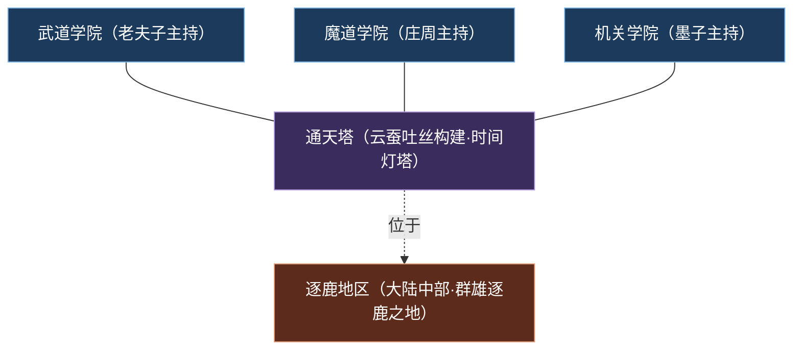
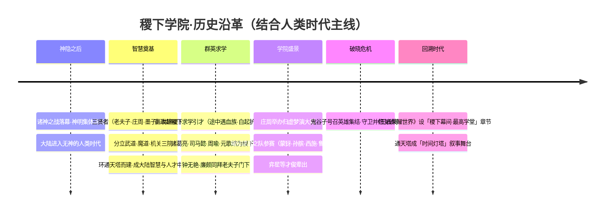
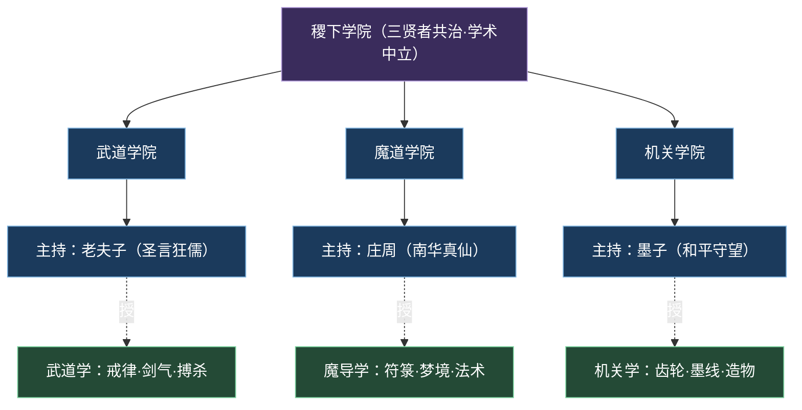
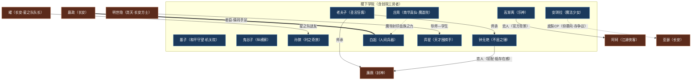

# 稷下学院

学术殿堂武道机关
**大区：学院 · 机关** — 矗立于逐鹿大地、环绕通天塔而建的最高学堂，有教无类、武道魔导机关并存的中立智慧之巅。

::: info 概述
**稷下学院**（别称「最高学堂」「逐鹿」）原型取自战国时期齐国的**稷下学宫**——那座「不治而议论」、百家争鸣的天下学府。在《王者荣耀》世界观中，它坐落于王者大陆中部的**逐鹿地区**，由大陆德高望重的**三贤者**——[老夫子](../heroes/jixia.md#老夫子)、[庄周](../heroes/penglai-donghai.md#庄周)、[墨子](../heroes/mojia-jiguan.md#墨子)——共同创立。三人各执一道，开**武道学院**（老夫子授武道学）、**魔道学院**（庄周授魔导学）、**机关学院**（墨子授机关学）三派，三院如众星拱月般环绕着大陆奇迹**通天塔**而建。

稷下不属于任何邦国，是一座**学术中立的殿堂**：它**有教无类**、向各邦各族敞开大门，无论你出身玄雍王室、神职家族，还是魔种混血、海外异乡，只要怀求知之心，皆可登堂入室。正因如此，稷下成为整个英雄逐鹿时代**师徒、同窗、君臣、恋人关系最密集的交汇枢纽**——少年[嬴政](../heroes/changan.md#嬴政)与[白起](../heroes/jixia.md#白起)结伴求学于此，「稷下F4」[诸葛亮](../heroes/sanfen-shu.md#诸葛亮)、[司马懿](../heroes/sanfen-wei.md#司马懿)、[周瑜](../heroes/sanfen-wu.md#周瑜)、[元歌](../heroes/sanfen-shu.md#元歌)在此结下纠葛，后来割据天下的诸侯，许多人都曾在这片书声琅琅之地共度青春。在开放世界《王者荣耀世界》中，稷下顶部的通天塔更被赋予「时间灯塔」的隐喻，成为「稷下幕间·最高学堂」章节的叙事舞台。
:::

---

## 阵营档案

| 档案项 | 内容 |
| :--- | :--- |
| **阵营名** | 稷下学院 |
| **阵营 ID** | `jixia` |
| **大区 / 导航组** | 学院 · 机关 |
| **别称** | 最高学堂 / 逐鹿 |
| **地理位置** | 王者大陆中部·逐鹿地区（通天塔所在地） |
| **主题风格** | 学术殿堂 + 上古遗迹科技 + 魔法武道并存 |
| **核心领袖** | [老夫子](../heroes/jixia.md#老夫子)（三贤者之首）、[庄周](../heroes/penglai-donghai.md#庄周)、[墨子](../heroes/mojia-jiguan.md#墨子) |
| **三大学院** | 武道学院（老夫子）· 魔道学院（庄周）· 机关学院（墨子） |
| **标志建筑** | 通天塔（云蚕吐丝构建·「时间灯塔」隐喻） |
| **成员数（本阵营英雄）** | 11 位 |
| **关键词** | 有教无类 · 学术中立 · 三贤者 · 通天塔 · 师徒同窗 · 稷下F4 |

::: info 「稷下学院」与「曾在稷下求学」之辨
稷下是一座学府而非一个固化的政治集团，因此「**稷下阵营英雄**」与「**曾在稷下学习的英雄**」是两个不同概念，务必区分：

- **归属稷下阵营**（本页花名册收录）：老夫子、鬼谷子、孙膑、安琪拉、干将莫邪、高渐离、扁鹊、弈星、东皇太一、钟无艳、白起，共 11 位。
- **曾在稷下求学、但阵营另属他处**：诸葛亮 / 元歌（蜀）、司马懿（魏）、周瑜（吴）、嬴政（长安）、廉颇（封神）、西施（百越）等。他们是稷下「关系网」的延伸，却不计入本阵营花名册。
:::

---

## 地理与环境

稷下学院坐落于王者大陆**中部的逐鹿地区**——「逐鹿」二字既是地名，也暗合「群雄逐鹿」的时代母题：天下英才汇聚于此问道求知，而他们日后将奔赴四方，把学到的武道、魔导与机关之术带进各邦的纷争之中。

::: info 选址·为何在逐鹿
逐鹿位居大陆几何中心，恰好处在中枢[长安城](../factions/changan.md)、[三分之地](../factions/sanfen-shu.md)、北疆[云中漠地](../factions/yunzhong-modi.md)等势力的辐辏之处。一座**中立**的最高学堂选址于此，意味着无论来自哪一方的学子，赴学的路途都相对均等——这正是「有教无类、向各邦各族开放」的地理保障（考据推测：中立选址利于学术不偏不倚）。
:::

学院最显著的环境特征，是它**环绕大陆奇迹「通天塔」而建**的同心格局。通天塔由稷下特有的奇迹**云蚕吐丝**构建而成，建筑语言融合东方幻想与徽派意趣；武道、魔道、机关三大学院如三瓣花萼，环抱通天塔而立。

::: tip 标志建筑·通天塔与「时间灯塔」
据世界观骨架，开放世界《王者荣耀世界》将通天塔置于稷下顶部，并在象征意义上赋予其「**时间灯塔**」的隐喻——这与该作「时空回溯·改写历史」的主题形成精妙互文。通天塔上承起源时代「十二奇迹 / 日之塔」的能量母题，下启「学子授业之所」的人文光辉，是稷下「上古遗迹科技 + 学术殿堂」双重气质的集中体现。其与方舟核心、十二奇迹同属大陆「创世级器物」谱系，详见 [专题·神兵名剑信物](../topics/artifacts.md) 与 [纪元编年·《王者荣耀世界》主线](../worldview/eras.md)。
:::

整体而言，稷下的环境氛围是「**书声、剑鸣、机括与符咒并存**」：武道学院里戒尺与剑气相激，魔道学院中符箓流光、梦境流转，机关学院则齿轮咬合、墨线纵横。三种截然不同的求道方式在同一片屋檐下共生，构成了稷下独一无二的「兼容并蓄」气场。

---

## 历史沿革

稷下学院的历史，深植于「**人类时代 / 英雄逐鹿时代**」的开端，是神明退场、人类自主发展之后，文明重建的第一块智慧基石。结合 [纪元编年](../worldview/eras.md) 中与本阵营相关的事件，可梳理为如下脉络。

### 一、神隐之后的智慧奠基

在 [神明时代](../worldview/eras.md) 的诸神之战中，[盘古](../heroes/shanggu-shenhua.md#盘古)劈开束缚人类的保护罩、化为山脉，[女娲](../heroes/shanggu-shenhua.md#女娲)封印方舟核心后沉睡——史称「**神隐**」。神明集体退场，人类获得了自主发展文明的自由。

正是在这片「**无神而待启蒙**」的大陆上，三位德行与智慧冠绝当世的大师挺身而出：

- [老夫子](../heroes/jixia.md#老夫子)——「圣言狂儒」，三贤者之首，**大陆第一智慧长者**，据骨架记载曾为上古文明的**神职者**，主授武道学。
- [庄周](../heroes/penglai-donghai.md#庄周)——「南华真仙」，逍遥物外的梦境与魔导大师，主授魔导学。
- [墨子](../heroes/mojia-jiguan.md#墨子)——「和平守望」，机关造物的宗师，主授机关学。

三人于逐鹿地区共建稷下学院，分立三院、环通天塔而建，使其迅速成为大陆**智慧与人才的中心**。这一「三贤者共建稷下」的事件，与「墨子营造长安城（本质为封印的方舟）」并列，构成人类时代「智慧奠基」主线的两大支柱。

### 二、群英求学的黄金时代

学院落成后，迎来了它最辉煌的「群英求学」期：

::: quote 嬴政·赴稷下求学的代价
少年君主[嬴政](../heroes/changan.md#嬴政)为强国引才，与挚友[白起](../heroes/jixia.md#白起)结伴赴稷下求学。途中二人遭遇血族袭击，白起为护嬴政而**面部受伤、感染血族之力**，这股力量后由庄周以魔导之术**封印**。数十年的共生关系，塑造了嬴政日后对他人之苦的深切共情——这段「同往稷下」的青春旅程，是玄雍帝国崛起的精神起点。
:::

与此同时，[诸葛亮](../heroes/sanfen-shu.md#诸葛亮)、[司马懿](../heroes/sanfen-wei.md#司马懿)、[周瑜](../heroes/sanfen-wu.md#周瑜)、[元歌](../heroes/sanfen-shu.md#元歌)四位青年才俊在稷下结为同窗，后世并称「**稷下F4**」。他们日后分赴蜀、魏、吴各邦，将昔日同窗之谊与暗中较劲，延续进三分之地的漫天烽烟。女将[钟无艳](../heroes/jixia.md#钟无艳)与[廉颇](../heroes/haojing-fengshen.md#廉颇)亦同拜于老夫子门下，二人的官配缘分便始于这段同门情谊。

### 三、归虚梦演与学院盛景

学术之外，稷下也是才情竞演的舞台。[庄周](../heroes/penglai-donghai.md#庄周)主办的「**归虚梦演大赛**」，是学院盛景的代表：以李白为偶像的[曜](../heroes/changan.md#曜)在稷下组建「**星之队**」（成员含[蒙犽](../heroes/yunzhong-modi.md#蒙犽)、[孙膑](../heroes/jixia.md#孙膑)、[西施](../heroes/baiyue.md#西施)、[鲁班大师](../heroes/mojia-jiguan.md#鲁班大师)）参赛，于赛事中收获友谊、能量与自我认知。同一时期，天才围棋手[弈星](../heroes/jixia.md#弈星)等才俊辈出，稷下的「兼容并蓄」由此结出累累硕果。

### 四、破晓危机与回溯时代

到了 [破晓事件](../worldview/eras.md) 中，当[花木兰](../heroes/changan.md#花木兰)砍碎破晓之心、原初之息汹涌溢出之时，正是稷下的[鬼谷子](../heroes/jixia.md#鬼谷子)挺身**号召英雄集结，守卫峡谷并修复破晓之心**——稷下的智慧与谋略，在危机时刻成为大陆的中流砥柱。

而在开放世界《王者荣耀世界》中，稷下更被设为「**稷下幕间·最高学堂**」章节的舞台，其顶部的通天塔化作「时间灯塔」，与「时空回溯」主题交相辉映，让这座古老学府在新的纪元里再度焕发光芒。

---

## 组织 · 理念 · 特色

### 三院鼎立的组织架构

稷下以「三贤者—三学院」为骨架，是一座**学派联合体**而非单一权力机构：

| 学院 | 主持贤者 | 所授之学 | 气质底色 |
| :--- | :--- | :--- | :--- |
| **武道学院** | [老夫子](../heroes/jixia.md#老夫子) | 武道学（戒律、搏杀、心性磨砺） | 刚正、规矩、以理服人 |
| **魔道学院** | [庄周](../heroes/penglai-donghai.md#庄周) | 魔导学（符箓、梦境、法术） | 逍遥、玄奥、物我两忘 |
| **机关学院** | [墨子](../heroes/mojia-jiguan.md#墨子) | 机关学（齿轮、墨线、造物） | 务实、精巧、兼爱非攻 |

### 核心理念：有教无类·学术中立

稷下最根本的精神，凝结为两条原则：

::: quote 稷下之道
其一，**有教无类**——不问出身、不分邦族，凡有求知之心者皆可入学；玄雍王室、神职家族、魔种混血、海外异乡，同窗一堂。

其二，**学术中立**——学院不依附任何邦国、不卷入诸侯争霸，以「问道」而非「问鼎」为志。正因中立，它才能成为各方势力共同信赖的交汇之地。
:::

这套理念，与战国稷下学宫「不治而议论、百家争鸣」的历史原型一脉相承，也使稷下成为整个王者大陆**关系网最密集**的节点：师徒、同窗、君臣、恋人……无数因缘都在此结下、又从此向四方铺展。

### 阵营特色：三气合流的「人才出口」

有教无类的中立学府不问出身、向各邦各族开放，是大陆唯一真正「中立」的智慧殿堂，故能成为多方关系的枢纽。

关系网的总交汇点稷下F4（诸葛亮·司马懿·周瑜·元歌）、嬴政与白起、钟无艳与廉颇、星之队……众多师徒同窗恋人关系皆源于此。

通天塔与上古科技顶部矗立由云蚕吐丝构建的通天塔，承「十二奇迹」能量母题，兼具「时间灯塔」隐喻，是学术与上古遗迹科技的交汇。

武·魔·机三气并存武道、魔导、机关三学同堂，刚柔虚实兼备，造就了从禁锢战士到爆发法师、再到肉盾兵器的多元英雄谱。

---

## 核心人物 · 三贤者小传

稷下由三位贤者共同执掌，其中**老夫子**为本阵营英雄，庄周、墨子则因游戏阵营归属另列他处（庄周归[蓬莱·东海](../factions/penglai-donghai.md)、墨子归[墨家机关城·天工坊](../factions/mojia-jiguan.md)），但三人同为创院元勋，故并叙于此。

::: info 三贤者之首 · [老夫子](../heroes/jixia.md#老夫子)（圣言狂儒）
战士
三贤者之首、**大陆第一智慧长者**，据骨架记载曾为上古文明的神职者。他手持**戒尺与书卷**，主持武道学院，以「圣言」感化、以戒律服人。在战场上，他是一名**单体禁锢控制型战士**——大招以戒尺将敌人围困、禁锢于书卷阵中，是稷下「以理服人、以礼制乱」精神的具象化身。作为众多弟子（钟无艳、廉颇等）的恩师，他是稷下师承谱系的源头。
:::

::: info 魔道学院主持 · [庄周](../heroes/penglai-donghai.md#庄周)（南华真仙）
辅助
逍遥物外的梦境大师，主持魔道学院、传授魔导学。他主办的「归虚梦演大赛」是稷下盛景之一，也曾以魔导之术为白起**封印血族之力**。庄周身具「南华真仙」之号，物我两忘、解脱免控，是稷下「玄奥逍遥」一脉的代表。其英雄阵营归于 [蓬莱·东海](../factions/penglai-donghai.md)。
:::

::: info 机关学院主持 · [墨子](../heroes/mojia-jiguan.md#墨子)（和平守望）
战士法师
机关造物的一代宗师，主持机关学院、传授机关学。他不仅是稷下三贤之一，更是**长安城的营造者**（而长安城的本质，正是被封印的方舟）。墨子秉持「兼爱非攻、和平守望」之志，是稷下「务实精巧」一脉的旗帜。其英雄阵营归于 [墨家机关城·天工坊](../factions/mojia-jiguan.md)。
:::

---

## 成员花名册

战士辅助法师坦克/防御

稷下学院的 11 位英雄，覆盖了从禁锢战士、强控辅助到范围法师、肉盾兵器的全套定位，恰是「武·魔·机三气合流」的活注脚。下表覆盖 `faction.heroes` 全部成员（点击英雄名跳转英雄页锚点）。

| 英雄 | 称号 | 定位 | 一句话身份 |
| :--- | :--- | :--- | :--- |
| [老夫子](../heroes/jixia.md#老夫子) | 圣言狂儒 | 战士 | 三贤者之首、大陆第一智慧长者，持戒尺书卷的单体禁锢控制型战士。 |
| [鬼谷子](../heroes/jixia.md#鬼谷子) | 纵横家 | 辅助 | 纵横家鼻祖、谋圣，研究转生之术，强控制开团辅助，大招群体禁锢。 |
| [孙膑](../heroes/jixia.md#孙膑) | 时之奇旅 | 辅助 / 法师 | 来自未来的时间旅行者，能加速队友并提供护盾免伤，星之队成员。 |
| [安琪拉](../heroes/jixia.md#安琪拉) | 魔法少女 | 法师 | 体内寄宿魔法师梅林、手持魔导书的火焰法术少女。 |
| [干将莫邪](../heroes/jixia.md#干将莫邪) | 一念神魔 | 法师 | 以身祭剑、一分为二的铸剑师夫妇，干将化剑、莫邪化魂的远程范围爆发法师。 |
| [高渐离](../heroes/jixia.md#高渐离) | 乐神 | 法师 | 以音律为武器的范围爆发法师，阿轲的救命恩人与恋人。 |
| [扁鹊](../heroes/jixia.md#扁鹊) | 疫·杀医 | 法师 | 以毒续伤的中毒消耗法师。 |
| [弈星](../heroes/jixia.md#弈星) | 天才围棋手 | 法师 | 落子布局、不动如山的范围消耗法师，尧天成员、明世隐弟子。 |
| [东皇太一](../heroes/jixia.md#东皇太一) | 噬灭日蚀 | 坦克 / 辅助 | 吞噬奇迹之力进化半神的全知者神巫，大招缠绕单挑的换血型坦克辅助。 |
| [钟无艳](../heroes/jixia.md#钟无艳) | 不屈之锤 | 战士 / 坦克 | 持锤齐国女将，老夫子弟子、廉颇官配，肉系突进控制战士。 |
| [白起](../heroes/jixia.md#白起) | 人间兵器 | 坦克 | 被改造成不死之躯的战争兵器，与嬴政情同手足，大招嘲讽锁敌的先手坦克。 |

::: info 花名册速读·三气分布
- **武道一脉（刚）**：老夫子（禁锢战士）、钟无艳（突进控制）、白起（嘲讽先手坦克）——以肉度与控制立身。
- **魔道一脉（虚）**：安琪拉、干将莫邪、高渐离、扁鹊、弈星（范围 / 消耗 / 爆发法师），以及东皇太一（神巫半神）——以法术与玄学制敌。
- **谋略 / 时空（智）**：鬼谷子（纵横家·群控开团）、孙膑（来自未来·加速护盾）——以智略与时间为器。
:::

---

## 阵营关系

稷下既是学府，也是大陆关系网的总枢纽。基于 `relatedRelationships`，其关系可分为「**院内师承 / 战友**」与「**跨阵营情缘 / 羁绊**」两大类。需特别注意：跨阵营人物（如阿轲、廉颇、嬴政、亚瑟、明世隐等）的英雄页位于各自阵营目录之下。

### 关系总览图

### 关系明细表

| 关系类型 | 关联双方 | 性质 | 说明 |
| :--- | :--- | :--- | :--- |
| 师承（创院三贤者→众弟子） | [老夫子](../heroes/jixia.md#老夫子)·[庄周](../heroes/penglai-donghai.md#庄周)·[墨子](../heroes/mojia-jiguan.md#墨子) → 诸葛亮·司马懿·周瑜·元歌·孙膑·钟无艳·廉颇·西施·曜·蒙犽·鲁班大师·镜 | 同盟 / 师徒 | 三贤者有教无类广收弟子。注意：诸葛亮 / 司马懿 / 周瑜虽在稷下求学，阵营仍归蜀 / 魏 / 吴。 |
| 君臣 / 情同手足 | [嬴政](../heroes/changan.md#嬴政) — [白起](../heroes/jixia.md#白起) | 同盟（深厚羁绊） | 表为君臣，实情同手足。少年同往稷下途中遇血族，白起护主受伤、感染血族之力（由庄周封印），数十年共生塑造了嬴政的共情。 |
| 恋人（官方背景） | [高渐离](../heroes/jixia.md#高渐离) — [阿轲](../heroes/jianghu-xiake.md#阿轲) | 同盟（恋人） | 荆氏灭门后阿轲重伤被高渐离所救，二人为彼此而战、亡命天涯。官方背景故事。 |
| 恋人（官配·低存在感） | [钟无艳](../heroes/jixia.md#钟无艳) — [廉颇](../heroes/haojing-fengshen.md#廉颇) | 同盟（恋人） | 二人皆老夫子弟子；战场上廉颇首个对手即手执大锤的钟无艳，于稷下以盟友身份重逢。官方微博认证官配，因双方冷门存在感极低。 |
| 皮肤CP（仰慕向·存争议） | [安琪拉](../heroes/jixia.md#安琪拉) — [亚瑟](../heroes/changan.md#亚瑟) | 仰慕（存争议） | 安琪拉（体内寄宿魔法师梅林）对亚瑟有倾慕，官方多套CP皮肤认证；剧情更近仰慕者—被仰慕者，另有说法亚瑟剧情向CP为艾琳，存争议。 |
| 导师—学生 | [明世隐](../factions/changan.md) — [弈星](../heroes/jixia.md#弈星) | 同盟（师徒） | 尧天组织中明世隐既是众人首领，也是弈星的导师 / 师父。 |
| 战友 / 搭档（星之队） | [曜](../heroes/changan.md#曜)·[孙膑](../heroes/jixia.md#孙膑)·[蒙犽](../heroes/yunzhong-modi.md#蒙犽)·[西施](../heroes/baiyue.md#西施)·[鲁班大师](../heroes/mojia-jiguan.md#鲁班大师) | 同盟（战友） | 曜以李白为偶像，于稷下组建星之队参加庄周归虚梦演大赛，获友谊、能量与自我认知。 |
| 同阵营战友（尧天·长安） | [明世隐](../factions/changan.md)·[弈星](../heroes/jixia.md#弈星)·[公孙离](../heroes/changan.md#公孙离)·[杨玉环](../heroes/changan.md#杨玉环)·[裴擒虎](../heroes/baiyue.md#裴擒虎) | 同盟（组织） | 以牡丹方士明世隐为核心，借占卜谋略活跃长安暗处；弈星为其麾下成员之一。公孙离敬仰前辈杨玉环、视弈星如弟、被明世隐收留；裴擒虎被公孙离点醒后加入尧天探寻真相。 |

::: warning 羁绊辨析·几处易混点
- **稷下F4 ≠ 稷下阵营**：诸葛亮、司马懿、周瑜、元歌是稷下「同窗关系」的代表，但游戏阵营分属蜀 / 魏 / 吴，不在本阵营花名册内。
- **弈星的双重身份**：弈星既归稷下学院阵营（法师），又是长安「尧天」组织成员、明世隐弟子——前者是学派归属，后者是组织羁绊。
- **白起的封印线索**：白起所感染的血族之力，由稷下魔道学院的庄周封印——这是稷下「魔导学」直接介入英雄命运的范例。
:::

::: tip 深挖关系网
稷下是大陆师徒、同窗、战友关系最密集的枢纽，专题页对其有更系统的梳理：三贤者门下的「百家讲堂」与稷下F4详见 [关系·师徒与同窗](../relationships/mentor.md)；星之队、尧天等团体羁绊详见 [关系·战友与团体](../relationships/squad.md)；高渐离与阿轲、钟无艳与廉颇等情缘详见 [关系·恋人](../relationships/lovers.md)。
:::

---

## 相关剧情

- **三贤者共建稷下**：人类时代「智慧奠基」主线的核心事件，与「墨子营造长安城」并列。详见 [纪元编年·人类时代](../worldview/eras.md)。
- **嬴政与白起的稷下之旅**：少年君主与挚友同往求学、途遇血族、白起护主受伤的命运转折，是玄雍崛起的精神起点。
- **归虚梦演大赛与星之队**：庄周主办的赛事舞台上，曜组建星之队收获成长——稷下「兼容并蓄、教学相长」的生动注脚。
- **破晓事件·鬼谷子号召集结**：花木兰砍碎破晓之心后，鬼谷子号召英雄守卫并修复破晓之心。详见 [纪元编年·破晓事件](../worldview/eras.md)。
- **《王者荣耀世界》·稷下幕间**：开放世界主线设「稷下幕间·最高学堂」章节，通天塔化作「时间灯塔」。详见 [纪元编年·《王者荣耀世界》主线](../worldview/eras.md)。

---

## 延伸阅读

<a class="hok-card" href="../heroes/jixia">稷下英雄图鉴本阵营 11 位英雄的完整档案、背景与定位，见 。</a>
<a class="hok-card" href="../factions/mojia-jiguan">同区·墨家机关城机关学院主持墨子所属阵营，与稷下同处「学院 · 机关」大区，见 。</a>
<a class="hok-card" href="../factions/changan">中枢·长安城嬴政、亚瑟、曜、明世隐等稷下关系网延伸人物的归属地，见 。</a>
<a class="hok-card" href="../worldview/eras">纪元编年稷下创院、嬴政求学、破晓集结、稷下幕间等事件的世界观坐标，见 。</a>
<a class="hok-card" href="../worldview/overview">世界观总览方舟、十二奇迹、通天塔、神隐等底层设定的入门导览，见 。</a>
<a class="hok-card" href="../relationships/mentor">师徒与同窗三贤者门下「百家讲堂」与稷下F4的完整梳理，见 。</a>
<a class="hok-card" href="../topics/artifacts">专题·神兵名剑信物通天塔、方舟核心、十二奇迹、干将莫邪双剑等器物谱系，见 。</a>
<a class="hok-card" href="../factions/index">阵营总览全大陆各大势力的来历与立场对照，见 。</a>

::: quote 结语
「有教无类，问道不问鼎。」——在群雄逐鹿、烽烟四起的人类时代，稷下学院像逐鹿大地上一盏长明的灯。它不曾问鼎天下，却孕育了搅动天下的所有人；它环抱着象征时间的通天塔，把武道的刚、魔导的虚、机关的实熔于一炉。当少年们各奔前程、化作蜀魏吴的星辰，他们行囊里装着的，仍是稷下书声里那一句最朴素的训诫：**先学会做人，再去逐鹿。**
:::