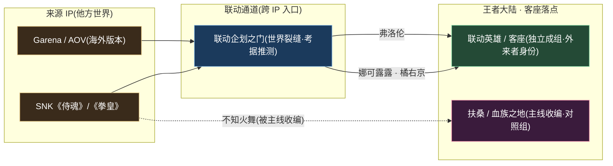
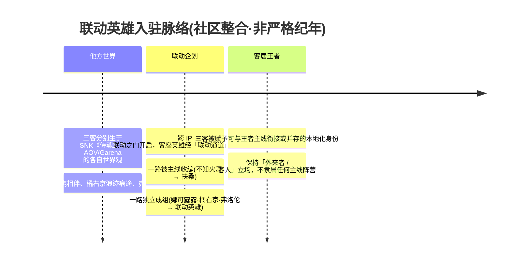
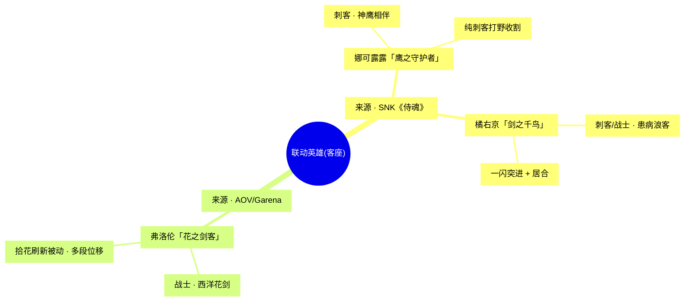
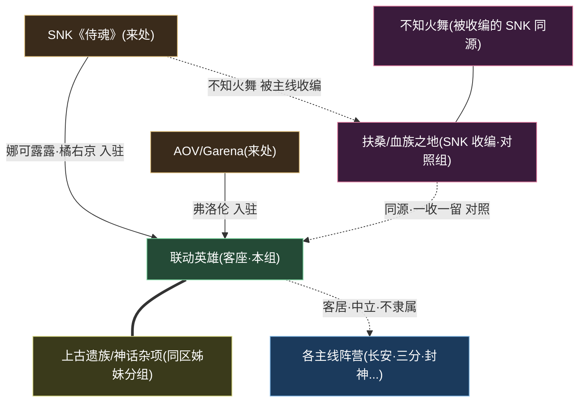

# 联动英雄

联动 · 其他跨 IP 客座外来剑客

> **不生于王者大陆史册、却确确实实踏上其土地的「客人」 · 跨越 IP 边界而来的客座剑客 · 王者世界观里一道「来自别处」的剑光** —— 他们或与神鹰并肩、或以居合一闪、或借花剑翩跹，原本属于《侍魂》《拳皇》乃至海外 AOV/Garena 的另一片天地。当联动企划的大门开启，这些异乡之客便踏过世界的裂缝，落脚于王者大陆，成为一支不隶属任何主线阵营、独立成组的「**客座英雄**」队伍。

---

::: info 阵营概述
**联动英雄**（亦称「**客座英雄**」，facId: `liandong-snk`）并非王者大陆地理版图上的一块实土，而是一个**编者层面的「客座分组」**——它收纳那些经由**跨 IP 联动**（Crossover）入驻《王者荣耀》、却**没有被明确编入任何主线阵营**的外来角色。它隶属于「**联动 · 其他**」大区，与同区的[上古遗族 / 神话杂项与多职业](../factions/yuanchu-shenhua-misc.md)并列，是整套世界观体系中最特殊的两个「非主线收纳格」之一。

跨 IP 联动英雄在世界观处理上素来分为两路：**一路被主线收编**——经由专门的本地化叙事融入既有阵营，最典型的便是 SNK 的[不知火舞](../heroes/fusang-xuezu.md#不知火舞)，她因「血族之乱」的故事线被纳入[扶桑 / 血族之地](../factions/fusang-xuezu.md)，世界观上已是一名「东风海域的本土忍者」；**另一路则独立成组**——没有明确主线阵营归属，单独归入本组，世界观上始终保持「**外来者 / 客人**」的身份。本页所收录的 [娜可露露](#成员花名册)、[橘右京](#成员花名册)、[弗洛伦](#成员花名册) 即属后者。

他们的「来处」各不相同：娜可露露与橘右京来自 **SNK 的《侍魂》**——一个刀光、和风与自然神灵交织的格斗世界；弗洛伦则来自 **Garena / AOV（海外版本）**——一片以高机动剑术与花之美学见长的别样大陆。当他们踏入王者峡谷，便被赋予了一段能与王者主线**衔接或并存**的本地化身份：神鹰的守护者、患病的浪客、拾花的剑客。需要特别说明的是，本组所言「联动」专指**跨越作品 IP 的联动**，与游戏内王者英雄之间的「皮肤联动 / 主题活动」并非同一概念。

因此，理解「联动英雄」最贴切的方式，不是把它当作一座城、一个国，而是把它当作王者大陆边缘的一处「**驿馆**」——异乡之客在此落脚，留下他们的剑、他们的故事，却不必更名换姓地成为这片土地的子民。
:::

## 阵营档案

| 档案项 | 内容 |
| :--- | :--- |
| **阵营名** | 联动英雄（facId: `liandong-snk`） |
| **别称** | 客座英雄 / 跨 IP 联动客座 |
| **地理位置** | 跨 IP 联动（无固定主线地理实土；落点散见于王者大陆各处） |
| **所属大区** | 联动 · 其他 |
| **主题风格** | 跨 IP 客座 · 外来剑客 · 「来自别处」的剑光 |
| **核心领袖** | 无明确领袖（独立成组的客座分组，群体无统一统御者；详见[核心人物](#核心人物)） |
| **成员数** | 3 名英雄（[娜可露露](#成员花名册) · [橘右京](#成员花名册) · [弗洛伦](#成员花名册)） |
| **关键词** | 跨 IP 联动 · 客座英雄 · SNK《侍魂》 · AOV/Garena · 神鹰 · 居合一闪 · 西洋花剑 · 外来者 · 非主线阵营 · 独立成组 |

::: info 档案说明 · 为什么没有「领袖」与「地理」
`liandong-snk.json` 的 `leadership` 字段为空数组，`location` 标注为「跨 IP 联动」、`theme` 为「跨 IP 客座」。这意味着本组**不是**一个有疆界、有君主、有都城的传统阵营，而是一个**功能性的收纳分组**。下文「地理与环境」「核心人物」等章节将据此作「客座视角」的特殊处理，凡涉及主线衔接的具体设定均以「（考据推测）」标注。
:::

---

## 地理与环境

「联动英雄」最特殊之处，就在于它**没有专属的地理实土**。它不是大陆东端的孤岛，也不是北疆的边陲，而是一条**横跨作品边界的「联动通道」**：起点在别处的 IP 世界，终点散落于王者大陆各个角落。

::: info 地理定位 · 一座大陆边缘的「驿馆」
严格意义上，联动英雄在[世界观地图](../worldview/map.md)上**找不到一块对应的色块**。若一定要为他们安一处「家」，最贴切的比喻是大陆边缘的一座「**驿馆**」——外来之客在此落脚，却不必融入任何一国的版图。他们的「故乡」始终在别处的 IP 世界，「客居」则在王者大陆。
:::

::: tip 三客之乡 · 来处与气质对照
本组三位成员的「来处」与气质各不相同，构成一组奇妙的客座群像：

| 英雄 | 来源 IP | 故乡气质 | 落脚后的母题 |
| :--- | :--- | :--- | :--- |
| [娜可露露](#成员花名册) | SNK《侍魂》 | 与自然神灵相通的和风秘境，神鹰为伴 | 守护自然、与鹰同行的女剑士 |
| [橘右京](#成员花名册) | SNK《侍魂》 | 樱花纷飞的东瀛浪途，病体与孤剑 | 患病浪客、以一闪居合追逐刹那之美 |
| [弗洛伦](#成员花名册) | AOV / Garena | 以花与剑为礼仪的西洋骑士风土 | 拾花起舞、高机动多段位移的花之剑客 |
:::

::: warning 环境基调 · 「混搭」即是底色
与扶桑的「樱雨修罗场」、长城的「黄沙边塞」不同，联动英雄没有一种统一的环境基调——它的「环境」恰恰是**多种异质美学的并置**：东瀛的刀与神鹰、西洋的花与花剑，被同一道联动之门并排迎入。这种「**混搭即底色**」的特质，正是「客座分组」区别于一切主线阵营的根本气质（考据推测，依据 `theme = 跨 IP 客座` 推演）。
:::

---

## 历史沿革

「联动英雄」的「历史」不是一部国族兴亡史，而是一部**入驻史**——它记录的是这些客座剑客「**何时、自何处、如何**」踏上王者大陆。这条线索与[纪元编年](../worldview/eras.md)中的主世界线并非严格承接，而更接近一条平行的「**外来者到访时间轴**」。

::: info 与世界观纪元的关系 · 一条「并存」的支线
[纪元编年](../worldview/eras.md)将王者世界观分为「主世界线」（起源 → 上古 → 神明/封神 → 人类/逐鹿 → 峡谷文明）与「平行时空」两类。联动英雄既不属于任何一个主世界纪元，也不同于「破晓宇宙」「琥珀纪元」这类内部平行时空——它是一条由**作品外部**注入的「**联动支线**」。官方对其世界观位置的处理一向克制：被收编者（如[不知火舞](../heroes/fusang-xuezu.md#不知火舞)）获得完整的本地叙事，独立成组者则更多保留「客人」的留白。凡涉及这些客座角色与主线纪元的精确衔接，本页一律以「（考据推测）」标注，不编造与官方相矛盾的硬设定。
:::

::: quote 对照 · 收编与客居的两条路
> 「当神鹰的振翅声穿过京都的樱雨，当一柄西洋花剑划过东风海域的浪尖——这些来自『别处』的剑客，并非生于王者大陆的史册，却又确确实实地踏上了它的土地。」

同样来自 SNK，[不知火舞](../heroes/fusang-xuezu.md#不知火舞) 走的是「**被主线收编**」之路，在[扶桑 / 血族之地](../factions/fusang-xuezu.md)成了本土忍者；而[娜可露露](#成员花名册)、[橘右京](#成员花名册)走的是「**独立客居**」之路，始终以客人身份停留在本组。这「**一收一留**」，正是整套联动世界观处理逻辑的缩影（详见[专题 · 联动宇宙](../topics/crossover.md)）。
:::

---

## 组织 / 理念 / 特色

作为一个「客座分组」，联动英雄没有森严的组织架构、没有效忠对象、没有共同纲领。把它们维系在一起的，不是同盟誓约，而是一个**共同的身份标签**：「来自别处的客人」。

客座分组不是国、不是城、不是教团，而是一个**收纳格**——专门安置跨 IP 联动而来、却未被主线收编的外来英雄。

剑客底色三位成员清一色是「**剑客**」：娜可露露的短刀与神鹰、橘右京的居合长刀、弗洛伦的西洋花剑。冷兵器与近身搏杀，是他们共同的语言。

混搭美学东瀛和风 × 西洋骑士风并置一处，没有统一的视觉基调，「**混搭即底色**」本身就是本组的特色。

外来者立场世界观上保持「客人」身份，不隶属任何主线阵营，也不卷入大陆的国族纷争——他们是峡谷里**最纯粹的「过客」**。

::: info 理念辨析 · 三种「为何而战」
本组成员各自携带着来自原 IP 的战斗信念，落到王者大陆后各成一格：

| 英雄 | 原生信念（来自 IP） | 落脚后的母题表达 |
| :--- | :--- | :--- |
| [娜可露露](#成员花名册) | 守护自然、与神鹰相通 | 「鹰之守护者」——人与自然之灵并肩而战 |
| [橘右京](#成员花名册) | 在病体的倒计时里追逐剑道极致 | 「剑之千鸟」——一闪居合，刹那即永恒 |
| [弗洛伦](#成员花名册) | 以花为礼、以剑为仪的优雅 | 「花之剑客」——拾花翩跹、剑舞不息 |
:::

::: info 机制特色 · 客座英雄的「招牌玩法」
联动英雄虽不构成统一的玩法体系，但每位都以鲜明的**机制招牌**著称：

- **娜可露露**：纯刺客打野收割，依托神鹰进行突进与收割（SNK《侍魂》联动）。
- **橘右京**：一闪突进 + 居合机制，多走边路 / 打野，主打瞬间爆发与位移（SNK《侍魂》联动）。
- **弗洛伦**：对抗路高机动西洋剑术战士，靠**拾取花束刷新被动**，从而获得**多段位移**（AOV/Garena 联动）。
:::

---

## 核心人物

`leadership` 为空——本组**没有统一的领袖**。这本身就是「客座分组」最忠实的写照：客人之间彼此独立，没有谁统御谁。因此，本节以「**群像式领袖小传**」的方式，分别为三位客座剑客立传；他们各自就是自己故事的主角。

### 娜可露露 · 鹰之守护者

刺客

来自 **SNK《侍魂》** 的女剑士，代号「**鹰之守护者**」。她与一只神鹰相伴而行，人与鹰心意相通、并肩作战——这正是她身份的核心意象。在王者峡谷，她被定位为**纯刺客打野**，依托神鹰的突进与配合完成切入与收割。她的母题，是「守护自然、与自然之灵同行」，在一众以国族、权谋为主线的王者英雄中，显得格外清澈而异质。详见英雄页 [娜可露露](../heroes/liandong-snk.md#娜可露露)。

### 橘右京 · 剑之千鸟

刺客战士

同样出自 **SNK《侍魂》** 的浪客剑客，代号「**剑之千鸟**」。他身患重病，生命被无形地按下倒计时，却也因此把全部生命燃烧在剑道极致的追逐里——以「**一闪突进 + 居合**」的机制，在刹那的拔刀间定生死。在王者峡谷，他多走**边路 / 打野**，是「刹那爆发」的代名词。病体与孤剑、唯美与决绝的反差，是他最动人的底色。详见英雄页 [橘右京](../heroes/liandong-snk.md#橘右京)。

### 弗洛伦 · 花之剑客

战士

来自 **AOV / Garena（海外版本）** 联动的西洋剑术战士，代号「**花之剑客**」。他以一柄西洋花剑征战，战斗风格优雅而灵动——招牌机制是**拾取花束以刷新被动**，从而连续触发**多段位移**，在对抗路上展现极高的机动性。他把「花」与「剑」、礼仪与杀伐融为一体，是本组中唯一一位非东瀛系的客座，也为这支队伍添上一抹西洋骑士的色彩。详见英雄页 [弗洛伦](../heroes/liandong-snk.md#弗洛伦)。

::: tip 群像而非领袖 · 三客并立
若要为本组找一位「代表人物」，娜可露露因人气与辨识度最高，常被视作联动客座的「门面」（考据推测）。但严格按设定，三人之间是**平行并立**的客人关系，并无统御与被统御之分。
:::

::: details 原作小考 · 三客在「别处」的来历（IP 背景 · 考据）
以下为三位客座剑客在其**原作 IP** 中的背景梗概，可帮助理解他们落脚王者大陆后所携带的母题。此节描述的是原作设定，与王者主线并不直接挂钩，故整体置于「考据」之列：

- **娜可露露（Nakoruru）**：出自 SNK 格斗名作《侍魂 / 侍魂 SAMURAI SHODOWN》系列，是一位与大自然之灵相通的少女剑士，惯用短刀「千鸟」（チチウシ），并与神鹰「**玛玛哈哈**」（Mamahaha，考据推测沿用原作设定）并肩作战。守护自然、为受伤的山林与生灵而战，是她贯穿原作的核心母题，这也被原样带入了王者峡谷的「鹰之守护者」形象。
- **橘右京（Tachibana Ukyo）**：同样出自《侍魂》系列，是一位身患重病（原作设定为肺病 / 咳血之症，考据推测）的浪客剑客。他追逐心上人「お雪」，更以**居合**（拔刀术）将生命尽数倾注于一刀之间，所谓「**燕返**」式的一闪斩，正是他剑道美学的化身。病躯与极致剑技的反差，构成他「剑之千鸟」的悲情底色。
- **弗洛伦（Florentino）**：出自 Garena 旗下 MOBA《Arena of Valor / 传说对决》（AOV，《王者荣耀》海外发行体系下的同源作品），是一位以**西洋花剑（rapier）**征战的优雅剑客。其招牌设计是战斗中拾取「花束」以刷新技能，从而连续位移、缠斗不休——「花之剑客」之名由此而来。
:::

---

## 成员花名册

刺客 ×2战士 ×2

本组现收录 **3 名英雄**，全部为「独立成组」的跨 IP 客座剑客。下表覆盖 `faction.heroes` 全部成员（点击英雄名跳转其英雄页）：

| 英雄 | 称号 | 定位 | 一句话身份 |
| :--- | :--- | :--- | :--- |
| [娜可露露](../heroes/liandong-snk.md#娜可露露) | 鹰之守护者 | 刺客 | 与神鹰并肩作战的女剑士，纯刺客打野收割（SNK《侍魂》联动） |
| [橘右京](../heroes/liandong-snk.md#橘右京) | 剑之千鸟 | 刺客战士 | 患病浪客剑客，一闪突进 + 居合机制，多作边路 / 打野（SNK《侍魂》联动） |
| [弗洛伦](../heroes/liandong-snk.md#弗洛伦) | 花之剑客 | 战士 | 对抗路高机动西洋剑术战士，靠拾取花束刷新被动多段位移（AOV/Garena 联动） |

::: info 花名册口径 · 谁在册、谁不在册
本册仅收录「**独立成组、无明确主线阵营归属**」的联动英雄。需要划清的两条边界：

- **不收[不知火舞](../heroes/fusang-xuezu.md#不知火舞)**：她虽同为 SNK 联动，但已因扶桑 / 血族叙事被收编进[扶桑 / 血族之地](../factions/fusang-xuezu.md)，世界观上是「东风海域本土忍者」。
- **不收同属「联动 · 其他」大区的另一组**：[元流之子](../heroes/yuanchu-shenhua-misc.md#元流之子)、[六耳](../heroes/yuanchu-shenhua-misc.md#六耳)、[桑启](../heroes/yuanchu-shenhua-misc.md#桑启) 归入[上古遗族 / 神话杂项与多职业](../factions/yuanchu-shenhua-misc.md)，与本组同区但不同册。
:::

---

## 阵营关系

`relatedRelationships` 为**空数组**——这恰恰是「客座分组」设定的必然结果：作为「外来者 / 客人」，本组成员**不卷入王者大陆的国族同盟与仇雠**，也没有官方记载的跨阵营羁绊。他们的「关系」更多是**结构性**的，而非剧情性的。

下表与下图，呈现的便是这种「结构性关系」——它们说明本组在整套阵营体系中**如何被定位、与谁相邻、与谁对照**，而非传统意义上的同盟与冲突。

| 关系对象 | 关系类型 | 说明 |
| :--- | :--- | :--- |
| [上古遗族 / 神话杂项与多职业](../factions/yuanchu-shenhua-misc.md) | 同区并列（非剧情同盟） | 同属「联动 · 其他」大区的另一个「非主线收纳格」，结构上互为姊妹分组 |
| [扶桑 / 血族之地](../factions/fusang-xuezu.md) | 同源对照（SNK 收编 vs 客居） | 收纳了走「主线收编」之路的 SNK 同源角色[不知火舞](../heroes/fusang-xuezu.md#不知火舞)，与本组「独立客居」形成对照 |
| 各主线阵营 | 客居 / 中立 | 客座英雄落脚于王者大陆，但不隶属、不效忠任何主线阵营，保持外来者立场 |
| 来源 IP（SNK / AOV-Garena） | 来处 / 归属（作品外） | 三客的真正「故乡」在原作世界观，经联动通道入驻王者大陆 |

::: warning 关系留白 · 「无关系」也是一种设定
本组 `relatedRelationships` 为空，并非数据缺失，而是**忠于「客座 / 外来者」定位的刻意留白**。客人不结盟、不树敌，他们只是停留。若未来官方为某位客座英雄补充本地化羁绊（例如与某主线英雄的互动剧情），其归属可能随之调整——但截至目前，本组与主线之间的「关系」仍以「**客居中立**」为准（考据推测）。
:::

---

## 相关剧情

::: quote 一闪 · 樱雨 · 花剑
> 病体的浪客在樱雨里拔刀，神鹰的羽翼掠过峡谷的清晨，西洋花剑挑起一束盛放的花——这三道剑光，原本属于三个互不相干的世界，却在王者大陆的同一片天空下短暂交汇。
:::

- **「一收一留」的联动处理**：同样来自 SNK，[不知火舞](../heroes/fusang-xuezu.md#不知火舞)被主线收编进[扶桑 / 血族之地](../factions/fusang-xuezu.md)，而本组三客独立客居——这「一收一留」是理解整套联动叙事的钥匙，[专题 · 联动宇宙](../topics/crossover.md)对此有完整梳理。
- **客座英雄的本地化身份**：娜可露露的「神鹰相伴」、橘右京的「病体追剑」、弗洛伦的「拾花起舞」，都是各自从原 IP 带入、并被赋予能与王者主线「衔接或并存」的本地化母题（详见各英雄页）。
- **与主世界纪元的关系**：联动英雄不属于[纪元编年](../worldview/eras.md)的任何主世界纪元，而是一条由作品外部注入的「联动支线」，与主线**平行并存**。

---

## 延伸阅读

<a class="hok-card" href="../heroes/liandong-snk">英雄合集—— 娜可露露、橘右京、弗洛伦三位客座剑客的完整档案与机制详解。</a>
<a class="hok-card" href="../topics/crossover">联动专题—— 跨 IP 客座英雄的总览，「一收一留」处理逻辑，及联动与主世界线的关系辨析。</a>
<a class="hok-card" href="../heroes/fusang-xuezu#不知火舞">同源对照阵营—— 收编了 SNK 同源角色的主线阵营，是本组「客居」之路最好的对照。</a>
<a class="hok-card" href="../factions/yuanchu-shenhua-misc">同区姊妹分组—— 同属「联动 · 其他」大区的另一个非主线收纳格。</a>
<a class="hok-card" href="../worldview/map">世界观地图—— 看清王者大陆的版图全貌，理解为何「客座分组」在地图上找不到对应实土。</a>
<a class="hok-card" href="../worldview/eras">纪元编年—— 王者世界观的主世界线与平行时空脉络，联动支线在其中的「平行并存」位置。</a>
<a class="hok-card" href="../factions/index">阵营总览—— 全部阵营与大区的导航总目。</a>

::: info 编者按 · 关于「客座」的考据立场
本页所述设定，凡涉及联动英雄与王者主线的精确衔接（如地理落点、与主线人物的羁绊、入驻纪元等），多为「客座」处理下的留白地带，已尽量以「（考据推测）」标注，并以 `liandong-snk.json` 的官方字段（`leadership` 为空、`location = 跨 IP 联动`、`theme = 跨 IP 客座`、`relatedRelationships` 为空）为底。本页不编造与官方明显矛盾的硬设定；如官方后续补充本地化叙事，本组归属与关系可能随之更新。
:::