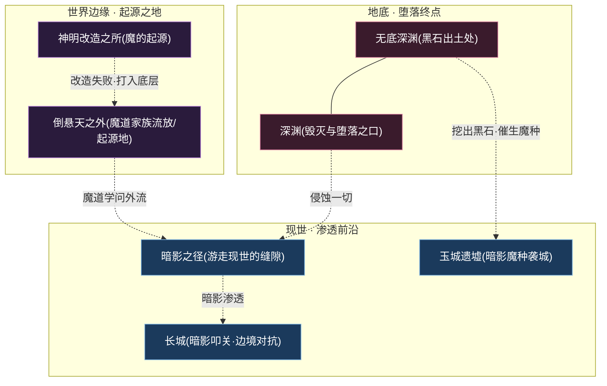
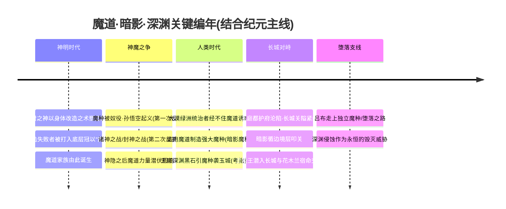
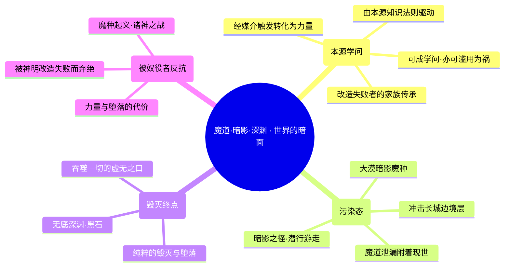
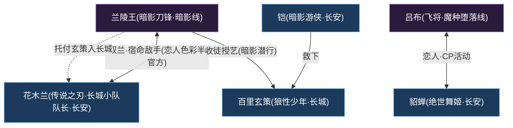
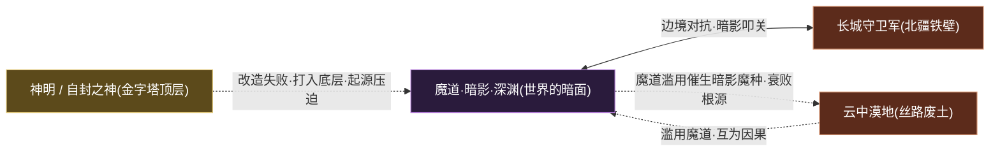

# 魔道·暗影·深渊

魔道 · 暗面黑暗魔法深渊侵蚀

> **倒悬天之外的弃绝者 · 被神明改造失败的魔道血脉 · 由世界本源法则驱动的黑暗学问 · 大漠魔种与深渊堕落的总源头** —— 它不是一座城、一支军，而是一整套横亘世界「暗面」的黑暗势力体系：被神明改造失败而沦为「魔」的家族、被奴役又奋起反抗的魔种、大漠魔道滥用所催生的暗影魔种，以及代表毁灭与堕落终点的「深渊」。它与[长城守卫军](../factions/changcheng.md)在边境对抗、与[神明](../worldview/concepts.md#神明--自封之神)在起源上对立、与[云中漠地](../factions/yunzhong-modi.md)在衰败根源上纠缠——是整个王者大陆最深、最暗的一道阴影。

---

::: info 阵营概述
**魔道·暗影·深渊**（facId: `modao-shadow-abyss`，简称「**魔道家族 / 暗影 / 深渊**」）并非一个有统一意志的政治实体，而是世界观「**暗面**」诸般黑暗力量的总称与汇流。它的疆域横跨[倒悬天](../worldview/concepts.md#倒悬天)之外的边缘地带、大漠深处的[无底深渊](../factions/yunzhong-modi.md)，以及游走于现世缝隙间的「**暗影之径**」。

在世界观的底层骨架——「神明—神职者—人类—魔道—魔种」的[等级金字塔](../worldview/overview.md)中，「**魔**」从来不是一个客观的物种描述，而是一个**由胜利者写下的蔑称**。据[核心概念](../worldview/concepts.md#魔道魔道家族)与[专题 · 神魔之争](../topics/gods-vs-demons.md)，**魔道家族**是被[神明](../worldview/concepts.md#神明--自封之神)以身体改造之术「**改造失败**」的一脉——他们没能登上神坛，却也不再是纯粹的人，被打入金字塔的底层，冠以「魔」名。他们所掌握的「**魔道**」，本质是一门**由定义世界本源的知识与法则所驱动、经媒介触发而转化为力量**的神秘学问，既能成就[稷下学院](../factions/jixia.md)的魔导一脉，也可能被野心者滥用以制造灾祸。

在「魔道」之下，「**暗影**（Shadow）」与「**深渊**（Abyss）」是两条递进的堕落支线：暗影是魔道力量泄漏、附着于现世所形成的污染态——[云中漠地](../factions/yunzhong-modi.md)大漠统治者滥用魔道催生的「**暗影魔种**」即属此类；而**深渊**则是这条道路的终点，代表纯粹的**毁灭与堕落**，是吞噬一切的虚无之口。本阵营收录的两位英雄——潜行暗影、戴鬼面的杀戮者[兰陵王](#成员花名册)，与持方天画戟、踏上独立魔种 / 堕落线的霸体肉战[吕布](#成员花名册)——分别是「暗影」与「魔种堕落」两条母题最具人格化的代言人。
:::

## 阵营档案

| 档案项 | 内容 |
| :--- | :--- |
| **阵营名** | 魔道·暗影·深渊（facId: `modao-shadow-abyss`） |
| **别称** | 魔道家族 / 暗影 / 深渊 |
| **地理位置** | [倒悬天](../worldview/concepts.md#倒悬天)之外 / 大漠深渊（[无底深渊](../factions/yunzhong-modi.md)）/ 暗影之径 |
| **所属大区** | 魔道 · 暗面 |
| **主题风格** | 黑暗魔法 + 被奴役者反抗 + 深渊侵蚀 |
| **核心领袖** | 无单一统帅（去中心化的黑暗体系）；[兰陵王](#成员花名册)为暗影线的标志性人格，[吕布](#成员花名册)为独立魔种 / 堕落线的代表 |
| **成员数** | 2 名英雄（本阵营名册收录）；其衍生的「大漠魔种」「暗影魔种」「深渊造物」为不可玩的体系性力量 |
| **关键词** | 魔道学问 · 本源法则 · 改造失败 · 被奴役者反抗 · 暗影污染 · 大漠魔种 · 无底深渊黑石 · 毁灭堕落 · 长城宿敌 |

---

## 地理与环境

魔道·暗影·深渊没有一座属于自己的「都城」。它的「领土」是一连串散布于世界**边缘、地底与缝隙**中的暗面空间——它存在于一切光照不到的地方。

::: info 三重空间 · 起源 · 渗透 · 终点
依据[核心概念](../worldview/concepts.md#魔道魔道家族)与本阵营骨架，魔道·暗影·深渊的「地理」可拆为三层递进的空间：

- **起源层 · [倒悬天](../worldview/concepts.md#倒悬天)之外**：魔道家族被[神明](../worldview/concepts.md#神明--自封之神)改造失败后流放、栖身的世界边缘。这里是「魔」之名诞生的地方，也是被奴役者反抗火种的源头。
- **渗透层 · 暗影之径与边境**：暗影是魔道泄漏、附着现世的污染态。它经由「暗影之径」游走于现世缝隙，并集中冲击[长城](../factions/changcheng.md)——这是暗面渗入现世最主要的裂缝。
- **终点层 · 大漠深渊**：[无底深渊](../factions/yunzhong-modi.md)是「深渊」在现世的具象出口。传说正是这里挖出的**黑石**，引动了暗影魔种对玉城的袭击（考据推测）。
:::

::: warning 暗影之径 · 现世的裂缝
「**暗影之径**」是本阵营最具神秘色彩的地理意象（考据推测）：它并非一条实在的道路，而是暗影力量在现世撕开的、可供潜行者隐匿往来的阴影通道。戴鬼面、可全隐身的[兰陵王](#成员花名册)正是借此潜入[长城](../factions/changcheng.md)、与守军交锋——他的存在本身，就是「暗影之径」最生动的注脚。
:::

| 地理要素 | 性质 | 关联 |
| :--- | :--- | :--- |
| 倒悬天之外 | 魔道家族流放 / 起源的世界边缘 | [魔道家族](../worldview/concepts.md#魔道家族) |
| 暗影之径 | 游走现世的阴影缝隙（潜行通道） | [兰陵王](#成员花名册)（暗影刀锋） |
| 长城（关外一侧） | 暗影叩关、边境对抗的最前线 | [长城守卫军](../factions/changcheng.md)（[花木兰](../heroes/changan.md#花木兰)、[百里玄策](../heroes/changcheng.md#百里玄策)） |
| 大漠 · 无底深渊 | 黑石出土处、深渊在现世的出口 | [云中漠地](../factions/yunzhong-modi.md)（[暃](../heroes/yunzhong-modi.md#暃)） |
| 深渊（Abyss） | 毁灭与堕落的终点、虚无之口 | 体系性力量（不可玩） |

---

## 历史沿革

魔道·暗影·深渊的「历史」，几乎就是一部**从世界第一次「以神之名行改造之实」开始、贯穿整个[纪元编年](../worldview/eras.md)的「暗面史」**。它不是某一时刻被建立的组织，而是随每一次「改造、奴役、滥用」而不断壮大的阴影。

### 一、神明时代 · 「魔」之名的诞生

据[专题 · 神魔之争](../topics/gods-vs-demons.md)与[纪元编年 · 神明时代](../worldview/eras.md)，魔道·暗影·深渊的「原罪」并不在魔，而在神。[自封之神](../worldview/concepts.md#神明--自封之神)以**身体改造之术**塑造了「神明—神职者—人类—魔种」的金字塔；而那些**被改造却未能成功**的血脉，既上不了神坛、又回不到纯粹的人，便被胜利者打入底层、冠以「**魔**」这一蔑称。

::: quote 「魔」字考
据[专题 · 神魔之争](../topics/gods-vs-demons.md)，「魔」并非一个客观物种，而是**金字塔顶层为底层写下的标签**。魔道家族之「魔」，源于神明的改造失败——他们是被自己的造物主弃绝的一群。这层「被弃绝」的底色，正是本阵营「被奴役者反抗」母题的最初源头。
:::

### 二、神魔之争 · 两次反抗与潜伏

被打入底层的魔种与魔道血脉，并未甘于被奴役。据[专题 · 神魔之争](../topics/gods-vs-demons.md)，世界经历了两次大规模反抗：

- **第一次 · 魔种起义**（[孙悟空](../heroes/shanggu-shenhua.md#孙悟空)起义）——被奴役的魔种揭竿而起，却因背叛而溃败。
- **第二次 · 诸神之战 / 封神之战**——神明阵营内部就「该不该给进步装上刹车」分裂，最终以「神隐」收场。

神隐之后，神明的强权退场，但**魔道的力量并未消失，而是潜伏、回响**（详见[专题 · 魔道的回响](../topics/gods-vs-demons.md)）。这股潜伏的暗流，为人类时代的魔道滥用埋下了伏笔。

### 三、人类时代 · 大漠魔道滥用

::: warning 黑暗时代的转折 · 暗影魔种的诞生
据[纪元编年 · 大漠魔道滥用](../worldview/eras.md)，进入人类时代的「黑暗时代」，[云中漠地](../factions/yunzhong-modi.md)大漠绿洲的统治者**经不住魔道力量的诱惑，滥用魔道、制造强大的魔种**。这批由魔道催生的污染兵锋，即所谓「**暗影魔种**」。

后果是灾难性的：**王庭、都护府相继沦陷**，唐国军队节节退却，最终不得不**紧闭长城关隘**，将魔种之祸阻于关外。传说中，正是[无底深渊](../factions/yunzhong-modi.md)挖出的**黑石**，引动了魔种对玉城的袭击（考据推测）。这一节，是「魔道」从「学问」滑向「灾祸」、从「边缘潜伏」喷涌为「现世威胁」的关键转折——它既是云中漠地由盛而衰的根源，也是魔道·暗影·深渊在现世掀起的最大一次浪潮。
:::

### 四、长城对峙 · 暗影叩关

长城关隘紧闭之后，暗面便循「**边境层**」持续冲击[长城](../factions/changcheng.md)，使这道太古雄关成为「暗影渗入现世的裂缝之一」。而暗影最具人格化的化身——戴鬼面、可全隐身的[兰陵王](#成员花名册)——则一次次潜入长城，与长城小队队长[花木兰](../heroes/changan.md#花木兰)在墙下展开「**双兰**」的宿命交锋。这场发生在太古之墙阴影里的对决，是「暗面渗透」与「铁壁守望」最直接的碰撞。

### 五、堕落支线 · 飞将的魔种之路

与兰陵王所代表的「暗影潜行」不同，**飞将**[吕布](#成员花名册)走的是一条**独立的魔种 / 堕落线**：他以方天画戟、霸体肉战之姿，沿着「力量—堕落」的轨迹独行。而在所有支线之上，「**深渊**」始终作为一种**永恒的毁灭背景**存在——它是这条黑暗道路的终点，是吞噬一切的虚无之口，提醒着每一个踏上魔道的人：力量的尽头，可能是彻底的毁灭。

---

## 组织 / 理念 / 特色

魔道·暗影·深渊的「组织」，恰恰在于它**没有传统意义上的组织**。它是一个**去中心化、由共同的「黑暗属性」而非共同的「政治意志」维系的体系**。理解它，要抓住「魔道—暗影—深渊」三个递进的层次。

::: info 层次一 · 魔道 —— 一门被污名化的学问
据[核心概念 · 魔道](../worldview/concepts.md#魔道魔道家族)，**魔道**的本质是「**由定义世界本源的知识与法则所驱动、经媒介触发转化为力量**」的神秘学问。它在道德上是**中性**的——同样一门学问，在[稷下学院](../factions/jixia.md)可成「魔导学」一脉的智慧结晶，在大漠统治者手中却沦为制造魔种的凶器。「魔道」之所以可怕，不在学问本身，而在**掌握它的人是否被欲望吞噬**。这正是本阵营「魔道双刃性」的核心命题（详见[云中漠地](../factions/yunzhong-modi.md)的「自食恶果」叙事）。
:::

::: warning 层次二 · 暗影 —— 力量泄漏的污染
据[核心概念 · 暗影](../worldview/concepts.md#暗影shadow)，**暗影**是魔道力量泄漏、附着于现世所形成的**污染态**。它比纯粹的「魔道学问」更具侵蚀性与攻击性——大漠的「暗影魔种」即是暗影的产物，而[兰陵王](#成员花名册)「潜行暗影中的杀戮者」形象，则是暗影「隐匿、致命」气质的人格化。
:::

::: danger 层次三 · 深渊 —— 毁灭与堕落的终点
据[核心概念 · 深渊](../worldview/concepts.md#深渊abyss)，**深渊**代表这条黑暗道路的**终点**——纯粹的**毁灭与堕落**，是吞噬一切的虚无之口。它不再是「可被使用的力量」，而是「使用力量者最终的归宿」。深渊的存在，为整个体系蒙上了一层「**力量即代价**」的悲剧宿命。
:::

| 特色维度 | 魔道·暗影·深渊的呈现 |
| :--- | :--- |
| **设定地位** | 世界观的「暗面」总称、一切黑暗力量（大漠魔种、暗影、深渊）的源头 |
| **组织形态** | 去中心化、无单一统帅；以「黑暗属性」而非「政治意志」维系的松散体系 |
| **核心母题** | 被神明改造失败而弃绝、被奴役者反抗、力量与堕落的代价、魔道的双刃 |
| **职业生态** | 收录刺客（兰陵王）与战士 / 坦克（吕布）；衍生的魔种 / 深渊造物为不可玩的体系力量 |
| **跨阵营关系** | 与[长城守卫军](../factions/changcheng.md)边境对抗、与[神明](../worldview/concepts.md#神明--自封之神)起源对立、与[云中漠地](../factions/yunzhong-modi.md)衰败根源纠缠（全面冲突） |

::: info 考据 · 「无单一领袖」的去中心化体系
本阵营骨架的 `leadership` 为空——这并非疏漏，而是设定使然。魔道·暗影·深渊不是一个「有共主的国度」，而是一套「**没有王的暗面**」：它没有皇帝、没有教主，只有一个个被弃绝、被诱惑、被堕落吞噬的个体，以及他们身后那片永远饥渴的深渊。本页因此不强行指定「统帅」，而将[兰陵王](#成员花名册)、[吕布](#成员花名册)分别作为「暗影」与「魔种堕落」两条母题的**标志性人格**记述。
:::

---

## 核心人物

魔道·暗影·深渊没有「神王」式的单一领袖。它的两位可玩英雄，分别站在「暗影」与「魔种堕落」两条母题的最前端，各自以截然不同的方式诠释着「魔」的含义。

### 兰陵王 · 暗影刀锋（暗影线代言）

刺客

[兰陵王](#成员花名册)（暗影刀锋），是本阵营「**暗影**」母题最完整的人格化身。他戴着一张**鬼面**，是一名可**全程隐身**、潜行于暗影中的杀戮者——在战场上，他是无声无息、骤然致命的尖刀。

但兰陵王远不只是一个冷血杀手。在叙事中，他扮演了一个意味深长的「**暗影摆渡人**」角色：

- 他**收留并教导了被[铠](../heroes/changan.md#铠)所救的[百里玄策](../heroes/changcheng.md#百里玄策)**，授其暗影潜行、钩镰与杀戮之术——这是一段「魔道授艺」的奇特师徒缘。
- 而他最终又将玄策**托付给[花木兰](../heroes/changan.md#花木兰)**，亲手把这名弟子送入了[长城守卫军](../factions/changcheng.md)——亲手将一个本可成为「暗影」的少年，推向了「铁壁」的光明一侧。
- 他与花木兰在长城脚下的「**双兰**」交锋，是宿命与暧昧情感交织的传奇——官方更多以「宿命 / 敌手」定位（恋人色彩半官方，曾辟谣次元武士情侣皮肤）。

::: quote 兰陵王 · 暗影刀锋
「黑暗，是最好的藏身之所；也是，最孤独的归途。」
（依据兰陵王「戴鬼面、全隐身、潜行暗影中的杀戮者」设定意译，非官方逐字原文。）
:::

### 吕布 · 飞将（独立魔种 / 堕落线代言）

战士/坦克

[吕布](#成员花名册)（飞将），代表本阵营**另一条迥异的支线**——**独立魔种 / 堕落线**。与潜行隐匿的兰陵王相反，吕布是**正面碾压的暴力本身**：他手持**方天画戟**，是一名**靠最大生命值提升伤害、霸体硬抗的肉搏战士 / 坦克**——越是血厚，越是凶悍。

在叙事层面，吕布走的是一条「**力量—堕落**」的孤独之路，与[貂蝉](../heroes/changan.md#貂蝉)的「**爱与正义 / 天魔缭乱**」CP 线相互呼应（演义关联，吕布台词常念貂蝉，亦有官方 CP 活动）。他的「堕落」不同于大漠统治者「主动作恶」的滥用，更像是一种被力量与命运裹挟的悲剧——他是「飞将」，是天下无双的猛将，却也是行走在魔种与堕落边缘的孤魂。

::: quote 吕布 · 飞将
「人中吕布，马中赤兔。这天下，谁人能挡我一戟？」
（呼应吕布「方天画戟、霸体肉战、天下无双」的飞将意象，非官方逐字原文。）
:::

---

## 成员花名册

魔道·暗影·深渊本阵营名册收录 **2 名**可玩英雄——他们恰好站在「暗影潜行」与「魔种堕落」两条母题的两端，一隐一显、一刺客一肉战，共同勾勒出「魔」的两副面孔。此外，由本阵营衍生的「**大漠魔种 / 暗影魔种 / 深渊造物**」是不可玩的**体系性力量**，散见于[云中漠地](../factions/yunzhong-modi.md)与[长城](../factions/changcheng.md)的叙事之中。

刺客战士坦克

| 英雄 | 称号 | 定位 | 一句话身份 |
| :--- | :--- | :--- | :--- |
| [兰陵王](../heroes/modao-shadow-abyss.md#兰陵王) | 暗影刀锋 | 刺客 | 戴鬼面的全隐身刺客，潜行暗影中的杀戮者，曾收[百里玄策](../heroes/changcheng.md#百里玄策)为徒教其潜行，与[花木兰](../heroes/changan.md#花木兰)长城下宿命交锋。 |
| [吕布](../heroes/modao-shadow-abyss.md#吕布) | 飞将 | 战士/坦克 | 持方天画戟、靠最大生命提升伤害的霸体肉战，[貂蝉](../heroes/changan.md#貂蝉)之 CP，独立魔种 / 堕落线。 |

::: tip 花名册速读 · 「魔」的两副面孔
- **暗影 · 隐**：[兰陵王](../heroes/modao-shadow-abyss.md#兰陵王)（暗影刀锋）——全隐身、潜行致命的刺客，「暗影」母题的代言人，亦是连接长城与暗面的「暗影摆渡人」。
- **堕落 · 显**：[吕布](../heroes/modao-shadow-abyss.md#吕布)（飞将）——血厚则凶、霸体硬抗的肉战，「独立魔种 / 堕落线」的代言人，与貂蝉 CP 相互呼应。
:::

::: info 考据 · 名册边界与「体系性力量」
本表仅收录英雄目录中 facId 明确为 `modao-shadow-abyss` 的 2 名可玩英雄。需特别说明：魔道·暗影·深渊更主要的「力量」并非这两名英雄，而是**不可玩的体系性存在**——大漠暗影魔种、深渊造物、暗影污染等。这些力量虽无独立英雄条目，却深刻影响着[云中漠地](../factions/yunzhong-modi.md)的崩解、[长城守卫军](../factions/changcheng.md)的守御乃至整个[人类时代](../worldview/eras.md)「黑暗时代」的走向。换言之，本阵营是一个「**英雄少、影响大**」的特殊势力。
:::

---

## 阵营关系

魔道·暗影·深渊的关系网，呈现出鲜明的「**对外全面冲突、内部各自孤行、个体牵出情缘**」三层结构。它与三大势力构成「全面冲突」（长城边境对抗、神明起源对立、云中漠地衰败根源），而它的两位英雄又各自牵出一条动人的情感 / 师承线索——尤其是兰陵王，几乎把暗面与[长城守卫军](../factions/changcheng.md)的命运缝在了一起。

### 关系总览表

| 关系类型 | 关联人物 / 阵营 | 性质 | 说明 |
| :--- | :--- | :--- | :--- |
| 恋人（演义 + CP 活动） | [吕布](../heroes/modao-shadow-abyss.md#吕布) · [貂蝉](../heroes/changan.md#貂蝉) | 跨阵营 · 恋人 | 演义关联，吕布台词常念貂蝉，「爱与正义 / 天魔缭乱」等皮肤呼应；官方 CP 活动。 |
| 宿命 / 敌手（恋人色彩半官方） | [花木兰](../heroes/changan.md#花木兰) · [兰陵王](../heroes/modao-shadow-abyss.md#兰陵王) | 跨阵营 · 宿敌 | 「双兰」组合。官方关系图标注宿命：成为队长前花木兰常与潜入长城的兰陵王在长城下对战，长期交锋生出不一样的感情。官方更多以宿命 / 敌手定位，恋人色彩暧昧、半官方，曾辟谣次元武士情侣皮肤。 |
| 师徒 | [兰陵王](../heroes/modao-shadow-abyss.md#兰陵王) · [百里玄策](../heroes/changcheng.md#百里玄策) | 跨阵营 · 师承 | 兰陵王收留被[铠](../heroes/changan.md#铠)所救的玄策、收为徒，教其暗影潜行、钩镰与杀戮；后将玄策托付花木兰，玄策由此入[长城守卫军](../factions/changcheng.md)。 |
| 边境对抗（阵营级） | 魔道·暗影·深渊 ⇄ [长城守卫军](../factions/changcheng.md) | 跨阵营 · 军事宿敌 | 暗面循「边境层」冲击长城（大漠 / 暗影魔种叩关），双方处于直接军事对峙；兰陵王潜入长城与花木兰交锋。 |
| 起源对立（阵营级） | 魔道·暗影·深渊 ⇄ [神明 / 自封之神](../worldview/concepts.md#神明--自封之神) | 跨阵营 · 起源压迫 | 魔道家族系神明改造失败者，被打入底层冠以「魔」名；魔种起义、诸神之战即被奴役者对神明的反抗。 |
| 衰败根源（阵营级） | 魔道·暗影·深渊 ⇄ [云中漠地](../factions/yunzhong-modi.md) | 跨阵营 · 因果纠缠 | 大漠统治者滥用魔道催生暗影魔种，致云中漠地家园崩解；无底深渊黑石引魔种袭玉城（考据推测）。 |

::: warning 阵营级主轴 · 全面冲突的三条战线
本阵营骨架明确指出，魔道·暗影·深渊与三大势力「**全面冲突**」，三条战线各有侧重：

1. **边境对抗** —— 与[长城守卫军](../factions/changcheng.md)在「关外—关内」的物理边境上直接军事对峙，是「正在进行的战争」。
2. **起源压迫** —— 与[神明](../worldview/concepts.md#神明--自封之神)的冲突是「**结构性的、起源性的**」：魔之所以为魔，正是神明改造失败、强权弃绝的结果（详见[专题 · 神魔之争](../topics/gods-vs-demons.md)）。
3. **衰败根源** —— 与[云中漠地](../factions/yunzhong-modi.md)的关系是「**因果纠缠**」：魔道是大漠崩解的根源，而大漠又是魔道滥用、暗影魔种诞生的温床，二者互为因果。
:::

::: tip 考据 · 兰陵王 —— 缝合暗面与铁壁的「摆渡人」
在「全面冲突」的大背景下，[兰陵王](../heroes/modao-shadow-abyss.md#兰陵王)是一个极富张力的「**例外**」：他属于暗面，却把弟子[百里玄策](../heroes/changcheng.md#百里玄策)托付给了宿敌阵营的[花木兰](../heroes/changan.md#花木兰)；他与花木兰在长城下兵戎相见，却又生出「不一样的感情」。他既是「暗影叩关」的执行者，又是「将暗影少年送往光明」的引路人——一个人，同时站在冲突的两端。这使他成为本阵营叙事中**最复杂、最人性化**的人物。
:::

### 关系网络图

::: info 图例说明（人物级）
紫色节点为**魔道·暗影·深渊本阵营**英雄（[兰陵王](../heroes/modao-shadow-abyss.md#兰陵王)、[吕布](../heroes/modao-shadow-abyss.md#吕布)），蓝色节点为**跨阵营关联**人物——其中[貂蝉](../heroes/changan.md#貂蝉)、[花木兰](../heroes/changan.md#花木兰)、[铠](../heroes/changan.md#铠)归[长安城](../factions/changan.md)，[百里玄策](../heroes/changcheng.md#百里玄策)归[长城守卫军](../factions/changcheng.md)。实线表示恋人 / 宿敌 / 师承 / 恩义等强关联，虚线表示「托付」这类张力性、转折性关系。
:::

::: info 图例说明（阵营级）
紫色节点为**魔道·暗影·深渊**自身，棕色节点为**直接冲突 / 因果纠缠**的阵营（[长城守卫军](../factions/changcheng.md)、[云中漠地](../factions/yunzhong-modi.md)），土金色节点为**起源压迫**的[神明](../worldview/concepts.md#神明--自封之神)。双向箭头表示阵营级边境对抗，虚线表示起源性、因果性的张力关系。三条战线共同构成本阵营「全面冲突」的格局。
:::

---

## 相关剧情

魔道·暗影·深渊虽只有两名英雄，却牵出了世界观中数条最富张力的故事线——从「魔道授艺」的奇缘，到「双兰」的宿命，再到「飞将与舞姬」的乱世情缘。

<a class="hok-card" href="../relationships/mentor">暗影摆渡 · 从魔道到铁壁收留被所救的，授其暗影潜行、钩镰与杀戮，最终却将弟子**托付给**，把一个本可堕入暗影的少年送进了。一段「魔道授艺、铁壁收容」的奇缘，详见 。</a>
<a class="hok-card" href="../relationships/rivalry">双兰 · 墙下的宿命交锋成为队长前，常与潜入长城的在长城下交锋，长期对战中生出「不一样的感情」。官方以宿命 / 敌手定位（恋人色彩半官方），是立场与情感交织的宿命之战，详见 。</a>
<a class="hok-card" href="../relationships/lovers">飞将与舞姬 · 乱世情缘与的演义 CP——吕布台词常念貂蝉，「爱与正义 / 天魔缭乱」等皮肤相互呼应，官方亦有 CP 活动。在「独立魔种 / 堕落线」的孤独底色上，这段情缘格外令人唏嘘，详见 。</a>
<a class="hok-card" href="../worldview/eras">黑石与暗影魔种 · 大漠的崩解大漠统治者滥用魔道、制造暗影魔种，致王庭沦陷、长城紧闭；传说挖出的黑石，引动了魔种对玉城的袭击（考据推测）。这是魔道·暗影·深渊在现世掀起的最大浪潮，详见 。</a>

::: info 剧情焦点 · 「魔」从来不是答案，而是问题
魔道·暗影·深渊剧情最深刻之处，在于它不断追问：**「魔」究竟是什么？** 是神明改造失败后写下的蔑称，是被奴役者愤而反抗的旗号，是大漠统治者经不住诱惑滥用的力量，还是吕布身上那条无法回头的堕落之路？答案或许藏在兰陵王身上——他属于暗影，却亲手把弟子送向光明；他与花木兰为敌，却生出不一样的感情。**真正的黑暗，从来不是某个阵营，而是每一个个体内心「向光」还是「沉沦」的抉择**——这正是本阵营与「一念神魔」母题（详见[专题 · 神魔之争](../topics/gods-vs-demons.md)）最深的共鸣。
:::

---

## 延伸阅读

<a class="hok-card" href="../heroes/modao-shadow-abyss">魔道·暗影·深渊英雄图鉴本阵营全体英雄（兰陵王、吕布）的档案、背景与台词，见 。</a>
<a class="hok-card" href="../factions/changcheng">对峙阵营 · 长城守卫军在边境与暗面直接军事对峙、抵御大漠魔种的多元铁壁，见 。</a>
<a class="hok-card" href="../factions/yunzhong-modi">纠缠阵营 · 云中漠地·边陲魔道滥用、暗影魔种诞生的温床与受害地，见 。</a>
<a class="hok-card" href="../topics/gods-vs-demons">专题 · 神魔之争「魔」之名的由来、魔种起义、诸神之战与「一念神魔」母题，见 。</a>
<a class="hok-card" href="../worldview/concepts#魔道魔道家族">核心概念 · 魔道 / 暗影 / 深渊魔道的本质与双刃性、暗影的污染态、深渊的毁灭终点，见 。</a>
<a class="hok-card" href="../worldview/eras">纪元编年神明时代「魔」之诞生、人类时代大漠魔道滥用与长城关闭的完整脉络，见 。</a>
<a class="hok-card" href="../worldview/overview">世界观总览「神明—神职者—人类—魔道—魔种」等级金字塔的底层骨架，见 。</a>
<a class="hok-card" href="../relationships/index">人物关系总览以关系网读懂双兰宿命、魔道师承与飞将情缘，见 。</a>

::: quote 结语 · 光照不到的地方
它没有都城，没有君王，没有旗帜——它只存在于光照不到的地方。它是神明改造失败后被弃绝的血脉，是被奴役者愤然反抗的火种，是大漠统治者经不住诱惑伸出的那只手，是飞将走向堕落的孤独背影，是无底深渊里永远饥渴的虚无之口。然而，即便在最深的黑暗里，兰陵王仍会把一个少年托付给光明，吕布仍会在乱世中念着貂蝉的名字。**或许这正是「魔」最残酷也最温柔的真相——黑暗从不是终点，沉沦还是向光，永远是一念之间的抉择。**
:::