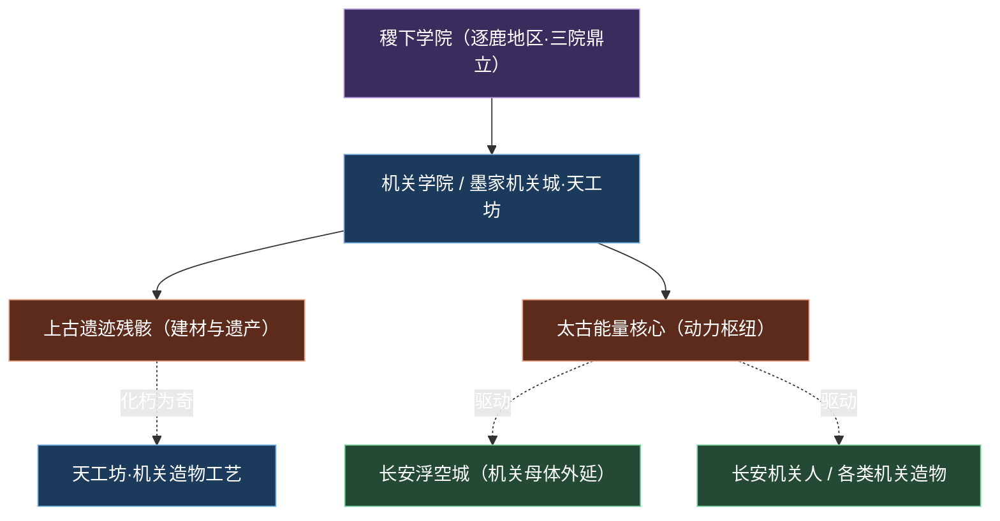
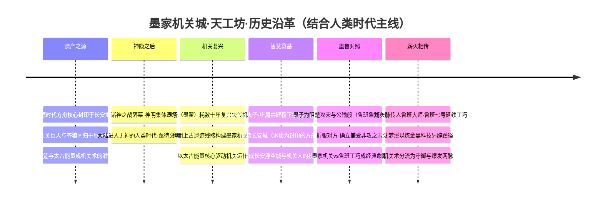
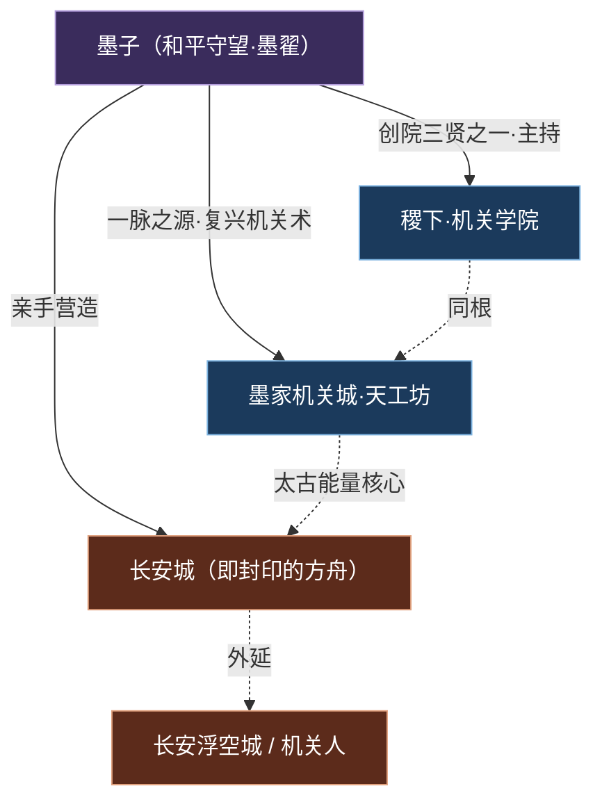
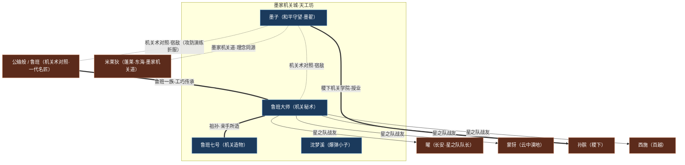

# 墨家机关城·天工坊

机关古代科技工巧
**大区：学院 · 机关** — 隐于稷下学院之内、由墨翟以上古遗迹残骸复兴而成的机关术圣地，以「兼爱非攻、和平守望」为志的古代科技工匠学派。

::: info 概述
**墨家机关城·天工坊**（别称「墨家机关道」「机关学派」）是王者大陆上**机关术 / 古代科技流派**的发源地与技术母体。它并非一座独立的城邦，而是**坐落于[稷下学院](../factions/jixia.md)之内**的机关学派据点——稷下三贤者之一、机关学院的主持者[墨子](../heroes/mojia-jiguan.md#墨子)（本名墨翟）耗尽数十年光阴，于此**利用上古遗迹的残骸**复兴失传的机关术，使齿轮、墨线与太古能量重新咬合运转。

墨家机关的运作命脉，系于一枚枚**太古能量核心**——这股源自起源时代「方舟核心」血脉的能量，正是后世**长安浮空城**、**长安机关人**乃至各类机关造物得以诞生的技术根基。换言之，「天工坊」是机关工匠文化的泛称：上至墨子营造的[长安城](../factions/changan.md)（其本质为封印的方舟），下至民间炼金黑科技、机关小子与爆弹奇术，皆可溯源至这一脉。墨家以**「兼爱、非攻」**立教——墨子曾为阻止楚国攻宋，与一代名匠**公输般（鲁班）**进行九次攻防演练并折服对方，由此构成了贯穿世界观的经典命题：**「墨家机关 vs 鲁班工巧」**。这一对照，最终在鲁班一脉的传人（[鲁班大师](../heroes/mojia-jiguan.md#鲁班大师)、[鲁班七号](../heroes/mojia-jiguan.md#鲁班七号)）与墨子之间延续，使天工坊既是创造之坊，也是「以守御止杀伐」理念的活态传承。
:::

---

## 阵营档案

| 档案项 | 内容 |
| :--- | :--- |
| **阵营名** | 墨家机关城·天工坊 |
| **阵营 ID** | `mojia-jiguan` |
| **大区 / 导航组** | 学院 · 机关 |
| **别称** | 墨家机关道 / 机关学派 |
| **地理位置** | [稷下学院](../factions/jixia.md)内（由上古遗迹残骸构建） |
| **主题风格** | 机关术 + 古代科技 + 防御工事 |
| **核心领袖** | [墨子](../heroes/mojia-jiguan.md#墨子)（本名墨翟·和平守望·机关学派创立者） |
| **能量根基** | 太古能量核心（源自方舟核心血脉） |
| **技术外延** | 长安浮空城 · 长安机关人 · 各类机关造物 |
| **成员数（本阵营英雄）** | 4 位 |
| **关键词** | 兼爱非攻 · 机关术 · 古代科技 · 防御工事 · 墨家vs鲁班 · 天工坊 |

::: info 「天工坊」的三重含义
「天工坊」一词在世界观中并非单指一处工棚，而是一个**机关工匠文化的泛称**，可从三个层面理解：

- **学派层面**：稷下机关学院的延伸，是墨子复兴机关术、传授「机关学」的学问体系。
- **技术层面**：以太古能量核心驱动的造物工艺，是长安浮空城、机关人等高阶造物的「技术母体」。
- **理念层面**：以「兼爱非攻」为旗的工匠精神——造机关不为攻伐，而为守御与和平。
:::

---

## 地理与环境

墨家机关城在地理上有一个极易被忽略的特点：**它并不是一座孤立于大陆某处的城池，而是嵌套在[稷下学院](../factions/jixia.md)之内的机关据点**。稷下三院鼎立——武道学院、魔道学院、机关学院——而墨家机关城正是「**机关学院**」在物理与文化上的具象延伸。墨子既是稷下创院三贤者之一，又是墨家一脉之源，这双重身份决定了天工坊「学府之中藏匠坊」的独特格局。

::: info 选址·为何以「上古遗迹残骸」构建
据世界观骨架，墨家机关城由墨子**利用上古遗迹的残骸构建**而成，其机关运作**依赖太古能量核心**。这意味着天工坊的选址与稷下逐鹿地区「上古遗迹科技」的环境底色一脉相承——稷下顶部的**通天塔**承「十二奇迹」能量母题，而机关城则承接遗迹残骸中残留的太古之力，将冰冷的废墟重新点燃为咬合运转的机括（考据推测：以遗迹残骸为材，既是资源所限，也呼应「化朽为奇」的工匠哲学）。
:::

环境氛围上，天工坊是稷下「书声、剑鸣、机括、符咒并存」气场中**最「金属质感」的一隅**：齿轮咬合、墨线纵横、火光与蒸汽交织，机关炮的轰鸣与炼金黑科技的爆响此起彼伏。它与魔道学院的符箓流光、武道学院的剑气相激形成鲜明对照——这里的力量不靠天赋符咒，而靠**精密计算与反复演练**。

::: tip 技术母体·从天工坊到长安浮空城
天工坊最深远的环境意义，在于它是**长安浮空城与机关人的技术母体**。墨子本人正是[长安城](../factions/changan.md)的营造者——而长安城的真面目，竟是起源时代被女娲封印的**方舟**。这条线索把「机关术」与「方舟核心能量」直接焊在了一起：墨家机关之所以能驱动浮空城、复活机关人，根本在于它掌握了对**太古能量核心**的运用之道。详见 [纪元编年·长安城建立](../worldview/eras.md) 与 [世界观地图](../worldview/map.md)。
:::

---

## 历史沿革

墨家机关城的历史，与「**人类时代 / 英雄逐鹿时代**」的「智慧奠基」主线深度绑定。神明退场、人类自主发展文明之后，墨子以一己之力复兴机关术，并将这股力量浇筑进稷下学院与长安城两座丰碑之中。结合 [纪元编年](../worldview/eras.md) 与 [世界观时间线](../worldview/timeline.md) 中与本阵营相关的事件，可梳理为如下脉络。

### 一、遗产之源：太古能量与上古残骸

墨家机关术并非凭空而来，它的物质与能量根基，深埋在更古老的纪元里：

- **起源时代**：超智慧体乘[方舟](../topics/parallel-worlds.md)降临，以**方舟核心（宇宙之心）**作无限能源；起源末期，[女娲](../heroes/shanggu-shenhua.md#女娲)将核心封印于（后世的）长安地底。这股**太古能量**，正是日后机关运作所依赖的能量血脉。
- **先民 / 峡谷时代**：诸神以方舟核心的**蓝色创造能量**打造**机关巨人**以镇压苍狼，最终二者同归于尽，残骸孕育出能量水晶与遗迹。这些**上古遗迹的残骸**，后来成了墨子构建机关城的建材。

::: quote 机关之源·遗产说
机关巨人是「以蓝色创造能量打造的造物」，墨家机关则是「以遗迹残骸为材、以太古能量为动力的造物」——前者是神明之手笔，后者是人类之巧思。从神明的机关巨人，到墨子的机关城，机关术在世界观中完成了一次「**从神到人**」的传承（考据推测：机关术的精神血脉，可上溯至先民时代的机关巨人）。
:::

### 二、机关复兴与智慧奠基

在神明退场、文明待启的人类时代，机关大师**墨子（本名墨翟）**挺身而出，耗费数十年光阴**复兴失传的机关术**，并以上古遗迹残骸构建起墨家机关城。这一复兴，与两座世界观丰碑紧密相连：

::: info 丰碑其一·共建稷下
墨子与[老夫子](../heroes/jixia.md#老夫子)（曾为神职者、三贤者之首、大陆第一智慧长者）、[庄周](../heroes/penglai-donghai.md#庄周)于逐鹿地区**共建[稷下学院](../factions/jixia.md)**，墨子主持**机关学院**，传授「机关学」。墨家机关城即是这一机关学院在物理与文化上的延伸。
:::

::: info 丰碑其二·营造长安
墨子**营造了[长安城](../factions/changan.md)**——而长安城的本质，竟是起源时代被封印的**方舟**！其地底封存着方舟核心的能量。这意味着，墨家机关术的最高成就，恰恰是把一艘封印的方舟，伪装成了一座盛世雄城。天工坊由此成为「长安浮空城与机关人」的技术母体。详见 [纪元编年·长安城建立](../worldview/eras.md)。
:::

### 三、墨鲁对照：兼爱非攻的立教之战

天工坊的精神内核，凝结于一场没有血流成河的「战争」：

::: quote 止戈为武·墨子折服公输般
据世界观骨架，墨子曾为**阻止楚国攻宋**，与一代名匠**公输般（鲁班）**进行**九次攻防演练**：公输般九设攻城之机变，墨子九距之而有余。最终墨子以「守御之术胜攻伐之器」折服对方，成功劝退了对宋国的进攻。这一「**墨家机关 vs 鲁班工巧**」的经典对照，奠定了墨家「**兼爱、非攻**」的立教之志——造机关不为攻城略地，而为护民止杀（考据推测：此情节取材自先秦「公输」典故，世界观中细节较弱，重在确立理念对照）。
:::

这场「攻」与「守」之辩，是贯穿天工坊世界观的双璧母题。两条机关路线的气质对照，可一表概之：

| 对照维度 | 墨家机关（墨子一脉） | 鲁班工巧（公输般 / 鲁班大师一脉） |
| :--- | :--- | :--- |
| 立意 | 兼爱·非攻，造机关以**守御止杀** | 工巧·灵动，以尺规榫卯造**能行能动**之器 |
| 典型造物 | 护盾、连弩、防御工事、长安浮空城 | 攻城之械、机关钩爪、机关小子（[鲁班七号](../heroes/mojia-jiguan.md#鲁班七号)） |
| 战场气质 | 远程消耗 + 护盾控场（半肉法系战士） | 钩拉弹射、位移接应（巧术辅助） |
| 精神底色 | 「以守换和平」——最强的机关是让战争打不起来 | 「以巧驭物」——把人与物精确地连接、调度 |
| 后世传承 | 长安城与机关人的技术母体 | 鲁班一族「祖造孙、孙征战」的造物谱系 |

::: info 对照而非死敌
需强调：「墨家机关 vs 鲁班工巧」是**理念之争而非血仇**。墨子折服公输般，是「以守御折服攻伐」；及至后世，鲁班一脉的传人（[鲁班大师](../heroes/mojia-jiguan.md#鲁班大师)、[鲁班七号](../heroes/mojia-jiguan.md#鲁班七号)）更与墨子同列于天工坊的机关谱系（同阵营花名册），两脉合流为「守御 — 工巧」并立的工匠双璧（考据推测：本作将历史「公输」典故内化为机关流派的理念对照）。
:::

### 四、薪火相传：守御与爆发的分流

墨子之后，机关一脉并未断绝，而是分流为风格迥异的几支：

- **鲁班一脉的工巧**：[鲁班大师](../heroes/mojia-jiguan.md#鲁班大师)作为墨子的机关术对照者，延续公输般的「工巧」传统；其所造的机关小子[鲁班七号](../heroes/mojia-jiguan.md#鲁班七号)则以机关炮与火箭飞弹征战沙场。
- **炼金黑科技的另辟蹊径**：[沈梦溪](../heroes/mojia-jiguan.md#沈梦溪)以投掷炸弹的「爆弹」奇术，为古代科技注入了「炼金黑科技」的爆破色彩，是机关术从「守御工事」向「范围爆发」延展的代表。

至此，天工坊一脉形成了「**墨子的守望 — 鲁班的工巧 — 沈梦溪的爆破**」三种气质并存的机关谱系。

---

## 组织 · 理念 · 特色

### 学派归属：稷下机关学院的延伸

墨家机关城在组织上并非独立邦国，而是**稷下学院机关学院的派生与延伸**。其与稷下、长安的三角关系，可一图概之：

### 核心理念：兼爱·非攻·和平守望

墨家的精神纲领，凝结为三个层层递进的关键词：

::: quote 墨家之道
其一，**兼爱**——不分亲疏远近，平等地爱护天下众生，反对以强凌弱。

其二，**非攻**——反对一切侵略战争；造机关并非为攻城略地，而是为**守御止杀**。墨子折服公输般、劝退楚国攻宋，正是「非攻」最响亮的注脚。

其三，**和平守望**——这正是墨子的英雄称号。他以机关之力守望和平，把工匠的精巧锻造成「**以守御换和平**」的盾。
:::

这套理念，使墨家机关与「攻伐之器」划清了界限：在墨家眼中，**最强大的机关，是让战争打不起来的机关**。

### 阵营特色：四大支柱

机关术 + 古代科技以齿轮、墨线与太古能量核心为骨，将上古遗迹残骸化朽为奇——大陆机关造物文化的总源头。

防御工事的母题「非攻」化作战场上的护盾、工事与守御之术，机关术的底色是「守」而非「攻」。

长安浮空城的技术母体长安浮空城、长安机关人乃至各类机关造物，皆以天工坊的工艺与太古能量为根基。

墨家 vs 鲁班的经典对照墨子的「机关守御」与公输般 / 鲁班一脉的「工巧造物」相映成趣，构成贯穿世界观的工匠双璧。

---

## 核心人物 · 领袖小传

墨家机关城由**墨子**一人开宗立派，他既是机关学派的创立者，也是稷下三贤者之一、长安城的营造者，是整条机关脉络当之无愧的源头。

::: info 机关学派创立者 · [墨子](../heroes/mojia-jiguan.md#墨子)（和平守望）
战士法师
**本名墨翟**，机关造物的一代宗师、**稷下三贤者之一**（主持机关学院），更是**长安城的营造者**（而长安城的本质，正是被封印的方舟）。他耗数十年光阴复兴失传的机关术，以上古遗迹残骸构建墨家机关城，以太古能量核心驱动万千机括。

其立教之志为「**兼爱非攻**」——他曾为阻止楚国攻宋，与名匠公输般（鲁班）九次攻防演练并折服对方，确立了「以守御止杀伐」的墨家精神。在战场上，墨子是一名**远程消耗 + 护盾的半肉控制法系战士**：以机关之力远程压制、为己方撑起护盾，是「和平守望」理念的具象化身——攻击是手段，守望才是目的。作为机关一脉之源，他与鲁班一脉的工巧传承，共同构成了天工坊的双生命题。
:::

---

## 成员花名册

战士法师射手辅助

墨家机关城的 4 位英雄，恰好覆盖了机关术「守御控制（墨子）—远程火力（鲁班七号）—位移工巧（鲁班大师）—范围爆破（沈梦溪）」的完整光谱，是「机关术 + 古代科技」气质的活注脚。下表覆盖 `faction.heroes` 全部成员（点击英雄名跳转英雄页锚点）。

| 英雄 | 称号 | 定位 | 一句话身份 |
| :--- | :--- | :--- | :--- |
| [墨子](../heroes/mojia-jiguan.md#墨子) | 和平守望 | 战士 / 法师 | 稷下三贤者之一、机关学派创立者、长安城建造者，远程消耗 + 护盾的半肉控制法系战士。 |
| [鲁班七号](../heroes/mojia-jiguan.md#鲁班七号) | 机关造物 | 射手 | 鲁班大师所造的机关小子，会用机关炮与火箭飞弹作战。 |
| [鲁班大师](../heroes/mojia-jiguan.md#鲁班大师) | 机关秘术 | 辅助 | 鲁班七号的爷爷、墨子的机关术对照者，钩拉 / 弹射位移的机关术辅助，星之队成员。 |
| [沈梦溪](../heroes/mojia-jiguan.md#沈梦溪) | 爆弹小子 | 法师 | 炼金黑科技、投掷炸弹的范围爆发法师。 |

::: info 花名册速读·机关四脉
- **守御控制脉（墨子）**：远程消耗 + 护盾的半肉控制，体现「非攻守望」。
- **远程火力脉（鲁班七号）**：机关炮与火箭飞弹，是机关造物「攻击型小子」的代表。
- **位移工巧脉（鲁班大师）**：钩拉 / 弹射位移的辅助，承公输般「工巧」一脉。
- **范围爆破脉（沈梦溪）**：炼金黑科技投弹，机关术向「黑科技爆发」的延展。
:::

::: info 祖孙工匠·鲁班一脉
花名册中的[鲁班大师](../heroes/mojia-jiguan.md#鲁班大师)与[鲁班七号](../heroes/mojia-jiguan.md#鲁班七号)是一对**祖孙工匠**：鲁班大师是七号的爷爷，七号则是大师亲手所造的机关小子。这条「祖造孙、孙征战」的线索，正是墨家「造物—传承」精神最具温度的体现。
:::

---

## 阵营关系

墨家机关城虽为小阵营，却因墨子的「三贤者 / 长安营造者」身份与鲁班一脉的「工匠对照」，牵起了一张横跨稷下、长安、海都的关系网。基于 `relatedRelationships`，其关系可分为「**师承（创院三贤者→众弟子）**」「**星之队战友**」与「**机关术对照 / 宿敌**」三类。需特别注意：跨阵营人物（如曜、蒙犽、孙膑、西施、米莱狄等）的英雄页位于各自阵营目录之下。

### 关系总览图

### 关系明细表

| 关系类型 | 关联双方 | 性质 | 说明 |
| :--- | :--- | :--- | :--- |
| 祖孙 / 造物 | [鲁班大师](../heroes/mojia-jiguan.md#鲁班大师) — [鲁班七号](../heroes/mojia-jiguan.md#鲁班七号) | 同盟（祖孙·造物） | 鲁班大师是七号的爷爷，七号是大师亲手所造的机关小子。墨家「造物—传承」精神的代表。 |
| 机关术对照 / 宿敌 | [墨子](../heroes/mojia-jiguan.md#墨子) — 公输般（鲁班） / [鲁班大师](../heroes/mojia-jiguan.md#鲁班大师) | 对照（亦敌亦友） | 墨子为阻楚攻宋与名匠公输般九次攻防演练并折服对方，构成「墨家机关 vs 鲁班工巧」的经典对照（细节较弱）。鲁班一脉（鲁班大师 / 七号）即承公输般之工巧；据 `relatedRelationships`，世界观把这层「机关术对照 / 宿敌」直接系于墨子与鲁班大师之间（考据推测：鲁班大师承「公输般」之名号与典故，墨子页羁绊径以「即名匠公输般」相称）。 |
| 师承（创院三贤者→众弟子） | [墨子](../heroes/mojia-jiguan.md#墨子)（与[老夫子](../heroes/jixia.md#老夫子)·[庄周](../heroes/penglai-donghai.md#庄周)同列） → [孙膑](../heroes/jixia.md#孙膑)·[西施](../heroes/baiyue.md#西施)·[蒙犽](../heroes/yunzhong-modi.md#蒙犽)·[鲁班大师](../heroes/mojia-jiguan.md#鲁班大师)·[镜](../heroes/changan.md#镜)·[曜](../heroes/changan.md#曜)·[钟无艳](../heroes/jixia.md#钟无艳)·[廉颇](../heroes/haojing-fengshen.md#廉颇)·[元歌](../heroes/sanfen-shu.md#元歌)等 | 同盟 / 师徒 | 稷下三贤者有教无类广收弟子（`relatedRelationships` 师承名册尚含老夫子、庄周自身与诸葛亮 / 司马懿 / 周瑜）。注意区分：[诸葛亮](../heroes/sanfen-shu.md#诸葛亮) / [司马懿](../heroes/sanfen-wei.md#司马懿) / [周瑜](../heroes/sanfen-wu.md#周瑜) 虽在稷下求学，阵营仍归蜀 / 魏 / 吴。 |
| 战友 / 搭档（星之队） | [鲁班大师](../heroes/mojia-jiguan.md#鲁班大师) · [曜](../heroes/changan.md#曜) · [蒙犽](../heroes/yunzhong-modi.md#蒙犽) · [孙膑](../heroes/jixia.md#孙膑) · [西施](../heroes/baiyue.md#西施) | 同盟（战友） | 曜以李白为偶像，于稷下组建星之队参加庄周归虚梦演大赛，获友谊、能量与自我认知；鲁班大师为队中机关担当。 |
| 理念同源（机关道） | [墨子](../heroes/mojia-jiguan.md#墨子) — [米莱狄](../heroes/penglai-donghai.md#米莱狄) | 旁系（理念同源） | 海都总督米莱狄称号即「墨家机关道」，是机关术理念在海外的另一支映照（考据推测：二者同属机关流派的精神谱系，叙事中无直接交集）。 |

::: warning 羁绊辨析·几处易混点
- **墨子的多重身份**：墨子既是墨家机关城阵营的领袖，又是稷下创院三贤者之一、长安城的营造者——前者是机关学派归属，后者是世界观奠基者的角色。
- **「墨家 vs 鲁班」是对照而非死敌**：墨子折服公输般，是「以守御折服攻伐」的理念之争，而非血仇；鲁班一脉的传人后来更与墨子共属机关谱系（同阵营花名册）。
- **鲁班大师的双重战线**：鲁班大师既归墨家机关城阵营（辅助），又是稷下「星之队」成员——前者是学派归属，后者是赛事羁绊。
- **米莱狄归属辨**：米莱狄虽称号为「墨家机关道」，但其阵营归属为 [蓬莱·东海 / 海都](../factions/penglai-donghai.md)，不计入本阵营花名册，仅作理念同源的旁系关联。
:::

---

## 相关剧情

- **墨子复兴机关术**：人类时代「机关复兴」的核心事件——墨子耗数十年、以上古遗迹残骸构建墨家机关城，以太古能量核心驱动机关运作。详见 [世界观地图·墨家机关城](../worldview/map.md)。
- **三贤者共建稷下**：墨子与老夫子、庄周共建[稷下学院](../factions/jixia.md)、主持机关学院，是人类时代「智慧奠基」主线的核心事件。详见 [纪元编年·人类时代](../worldview/eras.md)。
- **墨子营造长安城**：机关术的最高成就——把封印的方舟伪装成盛世雄城。天工坊由此成为长安浮空城与机关人的技术母体。详见 [纪元编年·长安城建立](../worldview/eras.md)。
- **墨子折服公输般（鲁班）**：为阻楚攻宋的九次攻防演练，奠定「兼爱非攻」之志，确立「墨家机关 vs 鲁班工巧」的经典对照。详见 [世界观地图·墨家与鲁班的经典对照](../worldview/map.md)。
- **归虚梦演大赛与星之队**：鲁班大师作为机关担当加入曜组建的星之队，于庄周主办的赛事中并肩成长。详见 [稷下学院·归虚梦演](../factions/jixia.md)。

---

## 延伸阅读

<a class="hok-card" href="../heroes/mojia-jiguan">墨家机关英雄图鉴本阵营 4 位英雄（墨子、鲁班七号、鲁班大师、沈梦溪）的完整档案、背景与定位，见 。</a>
<a class="hok-card" href="../factions/jixia">母体·稷下学院墨子主持机关学院的中立学府，与本阵营同处「学院 · 机关」大区，见 。</a>
<a class="hok-card" href="../factions/changan">外延·长安城墨子亲手营造、本质为封印方舟的雄城，是天工坊机关术的最高成就与技术外延，见 。</a>
<a class="hok-card" href="../worldview/map">世界观地图墨家机关城的地理坐标、与稷下 / 长安的表里关系，见 。</a>
<a class="hok-card" href="../worldview/eras">纪元编年机关复兴、共建稷下、营造长安、墨鲁对照等事件的世界观坐标，见 。</a>
<a class="hok-card" href="../worldview/overview">世界观总览方舟核心、太古能量、机关巨人、上古遗迹等底层设定的入门导览，见 。</a>

::: quote 结语
「兼爱非攻，止戈为武。」——在群雄逐鹿、机括轰鸣的人类时代，墨家机关城像稷下书声里一缕冷静的金属余响。墨子复兴的不只是失传的机关术，更是一种「**以守御换和平**」的信念：他造出的最伟大机关，是一座把战争封印在地底的城；他打赢的最重要一仗，是一场不曾流血的攻防。从遗迹的残骸到浮空的雄城，从神明的机关巨人到孩童般的机关小子——天工坊用齿轮与墨线写下的，始终是同一句话：**真正的巧思，是让人不必再造杀伐之器。**
:::