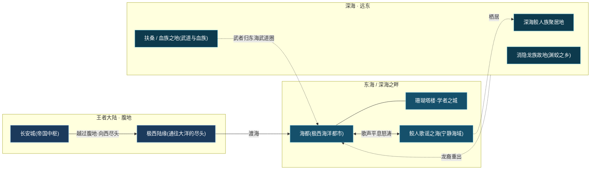
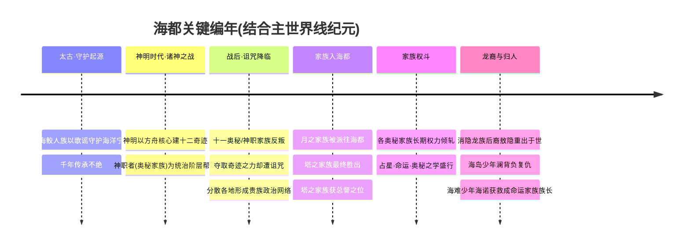
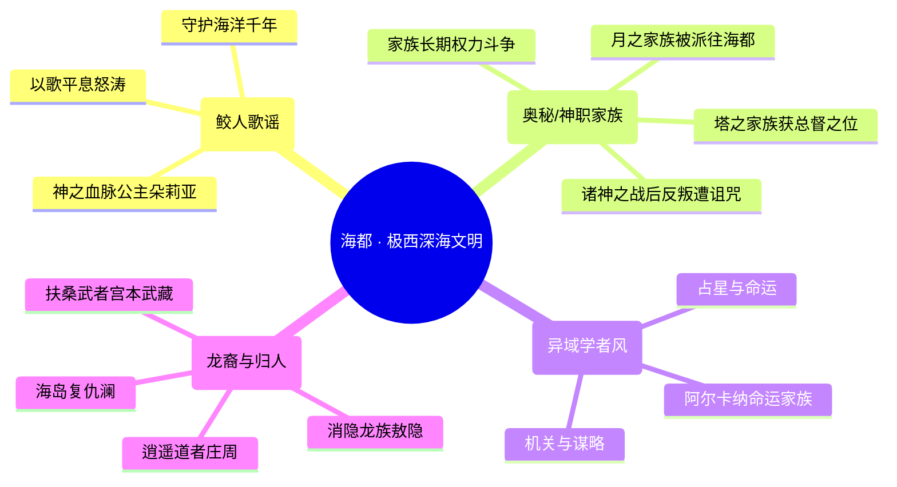
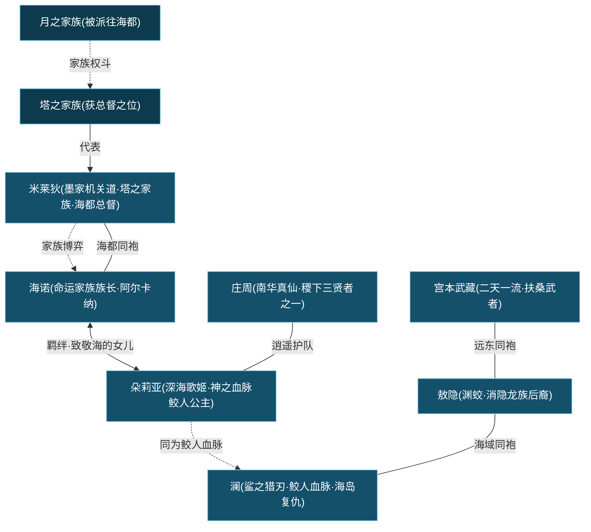
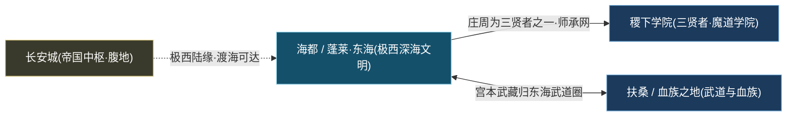

# 蓬莱·东海 / 海都

海外 · 远东鲛人歌谣奥秘家族

> **王者大陆极西的深海文明 · 鲛人千年守护的歌谣之海 · 奥秘家族权斗的潮汐都市** —— 一座漂浮在深海之畔的异域学者之城，蓝白色调的塔楼与海浪共生。鲛人族以歌声平息怒涛，遭诅咒的奥秘/神职家族却在这片碧波下，演着一出绵延千年的命运与阴谋之剧。

---

!!! abstract "阵营概述"
    **蓬莱·东海 / 海都**（亦称「**海都**」「极西之地海洋文明」）是矗立于[王者大陆](../worldview/overview.md)**极西、深海之畔**的海洋文明，是大陆地理坐标上离[长安城](../factions/changan.md)所代表的中枢最遥远的一隅。它的核心，是一座建在海上的**极西海洋都市——海都**：蓝白相间的塔楼如珊瑚般层叠生长，街巷间流淌着海水与歌谣，学者、占星师、家族成员与深海鲛人在此共处，构成王者世界里最具「异域学者风」的奇境。

    这片海域的**第一守护者，是深海鲛人族**。千年以来，鲛人以独有的**歌谣**安抚怒海、平息风暴，守护着海洋的宁静——[朵莉亚](../heroes/penglai-donghai.md#朵莉亚)所代表的「深海歌姬」血脉，正是这一守护传统的化身。

    然而海都的另一重底色，是**奥秘家族的诅咒与权斗**。据[世界观设定](../worldview/concepts.md)，[诸神之战](../worldview/eras.md)之后，反叛的**十一个奥秘 / 神职家族**夺取了[十二奇迹](../worldview/concepts.md)之力，却因背叛而**遭受诅咒**，分散各地形成贵族政治网络。其中，**月之家族**被派往海都，而**塔之家族**最终在家族博弈中胜出、**夺得海都总督之位**——「墨家机关道」[米莱狄](../heroes/penglai-donghai.md#米莱狄)正是塔之家族成员、现任海都总督。家族之间长期的权力倾轧，与鲛人歌谣的宁静形成了尖锐对照。

    海都还接纳了来自远东的来客与归人：道家智者[庄周](../heroes/penglai-donghai.md#庄周)、鲛人血脉的复仇少年[澜](../heroes/penglai-donghai.md#澜)、消隐龙族的后裔[敖隐](../heroes/penglai-donghai.md#敖隐)、海难获救的命运家族族长[海诺](../heroes/penglai-donghai.md#海诺)，以及斩血族无数的扶桑武者[宫本武藏](../heroes/penglai-donghai.md#宫本武藏)——在这片大区「海外 · 远东」之下，他们共同织就了海都「歌谣、龙裔、家族、武道」交汇的多元图景。

## 阵营档案

| 档案项 | 内容 |
| :--- | :--- |
| **阵营名** | 蓬莱·东海 / 海都（facId: `penglai-donghai`） |
| **别称** | 海都 / 极西之地海洋文明 |
| **地理位置** | 王者大陆**极西、深海之畔**（海都为极西海洋都市） |
| **所属大区** | 海外 · 远东 |
| **主题风格** | 海洋文明 + 鲛人歌谣 + 奥秘家族阴谋（蓝白色调 · 异域学者风 · 海浪鲛人元素） |
| **核心领袖** | **塔之家族**（海都总督）—— [米莱狄](../heroes/penglai-donghai.md#米莱狄)（墨家机关道 · 塔之家族成员 · 海都总督） |
| **成员数** | 7 名英雄（本阵营名册收录） |
| **关键词** | 极西深海 · 鲛人歌谣 · 神之血脉 · 奥秘/神职家族 · 月之家族 · 塔之家族 · 总督之争 · 龙族遗裔 · 蓝白异域 |

---

## 地理与环境

海都的存在，本身就是一则关于「**边缘**」的寓言。它坐落于[王者大陆](../worldview/overview.md)的**极西尽头、深海之畔**——当[长安城](../factions/changan.md)是中枢、[长城](../factions/changcheng.md)是北疆屏障时，海都则是大陆向着茫茫大洋伸出的最后一座灯塔。这里没有大漠的风沙，也没有腹地的城阙，只有无垠的碧波、终年的潮声，以及一座**漂浮在海上的蓝白之城**。

!!! info "海都 · 一座城，三重风景"
    海都并非寻常的港口城邦，而是**学者、家族与鲛人共生**的海上都市。结合[世界观总览](../worldview/overview.md)与本阵营资料，它至少呈现三重风景：

    - **学者之城**：蓝白色调、塔楼林立，弥漫着占星、命运、奥秘之学的「异域学者风」——这是[海诺](../heroes/penglai-donghai.md#海诺)的「阿尔卡纳命运家族」、[米莱狄](../heroes/penglai-donghai.md#米莱狄)的「塔之家族」等奥秘家族盘踞之所。
    - **歌谣之海**：环抱海都的深海，是**鲛人族千年守护**的宁静海域。鲛人以歌声平息怒涛，使这片本应凶险的极西大洋，成为可供文明栖居的所在。
    - **龙裔与武道的远东**：更深的海域与远东海岛，关联着消隐的**龙族**（[敖隐](../heroes/penglai-donghai.md#敖隐)）、复仇的**海岛少年**（[澜](../heroes/penglai-donghai.md#澜)），以及归入「东海武道圈层」的**扶桑武者**（[宫本武藏](../heroes/penglai-donghai.md#宫本武藏)）。

!!! tip "蓝白异域 · 美学与设定的统一"
    海都的视觉关键词是「**蓝白色调 · 异域学者风 · 海浪鲛人元素**」。这套美学并非单纯的画面风格，而与设定深度咬合：蓝白对应**海与歌**的纯净，异域学者风对应**奥秘家族的占星与命运之学**，海浪鲛人元素则对应**鲛人守护**的母题。读海都，亦是在读一幅会唱歌的蓝白长卷。

| 地理 / 环境要素 | 性质 | 关联人物 / 阵营 |
| :--- | :--- | :--- |
| 海都（极西海洋都市） | 蓝白色调的海上学者之城 / 奥秘家族据点 | [米莱狄](../heroes/penglai-donghai.md#米莱狄)、[海诺](../heroes/penglai-donghai.md#海诺) |
| 鲛人歌谣之海 | 鲛人千年守护的宁静海域 | [朵莉亚](../heroes/penglai-donghai.md#朵莉亚)、[澜](../heroes/penglai-donghai.md#澜)（鲛人血脉） |
| 消隐龙族故地 | 倾覆后隐没的龙族遗迹 | [敖隐](../heroes/penglai-donghai.md#敖隐)（渊蛟 · 龙裔后人） |
| 海岛 | 澜背负血海深仇的故乡 | [澜](../heroes/penglai-donghai.md#澜) |
| 扶桑 / 血族之地 | 归入东海武道圈层的远东之地 | [宫本武藏](../heroes/penglai-donghai.md#宫本武藏)、[不知火舞](../heroes/fusang-xuezu.md#不知火舞)（[扶桑 / 血族之地](../factions/fusang-xuezu.md)） |
| 极西陆缘 | 大陆通往大洋的尽头 | 连接[长安城](../factions/changan.md)所在腹地 |

---

## 历史沿革

海都的历史，是**两条线索的缠绕**：一条是鲛人**自太古以来的守护**，悠远而宁静；另一条是奥秘家族**自诸神之战以降的诅咒与权斗**，幽深而血腥。两条线索在这座蓝白之城里交汇，谱成海都独有的潮汐史诗。

### 太古之根 · 鲛人的歌谣守护

海都的故事，要从一群不属于陆地的存在讲起。**深海鲛人族**自久远的过去便栖居于极西大洋，他们拥有**安抚海洋的歌谣**——以歌声平息怒涛、止息风暴，**守护海洋的宁静长达千年**。这份守护，是海都得以在凶险大洋之畔立足的前提；也正因如此，鲛人才被视为这片海域真正的「**第一守护者**」。

!!! quote "鲛人歌谣（意象）"
    「当浪要吞没星辰，便有歌声从深海升起——它不与风暴搏斗，只是温柔地，让海重新睡去。」
    （呼应深海鲛人族以歌谣守护海洋宁静千年的设定。）

拥有**神之血脉**的鲛人公主[朵莉亚](../heroes/penglai-donghai.md#朵莉亚)，正是这一歌谣传统最耀眼的继承者——她在对局中「治疗与控制兼备、可刷新队友技能冷却」，恰是「歌谣抚慰、唤醒同伴」这一守护母题的机制化呈现。

### 神明时代 · 神职者的原罪

海都的第二条历史线索，深植于[神明时代 / 诸神之战](../worldview/eras.md)。据[世界观概念](../worldview/concepts.md)，**神职者（奥秘家族）**是神明从人类中选拔、身体改造「成功」的强者——他们力量超群、位居众人之上、为神明效力，是**统治阶层的帮凶**，背负着压迫人类与魔种的「原罪」。

!!! warning "转折点 · 反叛与诅咒"
    [诸神之战](../worldview/eras.md)之后，发生了海都命运的关键转折：**反叛的十一个奥秘 / 神职家族**夺取了[十二奇迹](../worldview/concepts.md)之力，却**因背叛而遭受诅咒**。受诅咒的家族分散各地，演化为分布大陆各处的「**奥秘家族 / 神职家族**」，结成贵族政治的网络。

    海都，正是这一网络在极西海域的落点。据设定，**月之家族被派往海都**，而在随后的家族角力中，**塔之家族最终胜出，夺得海都总督之位**。（考据推测：各资料对具体家族与地名的映射略有出入，本页按「月之家族 → 海都、塔之家族 → 海都总督」处理。）

这意味着海都不只是一座宁静的歌谣之城——它的统治者，是一群**身负诅咒、彼此倾轧的神职后裔**。鲛人的歌谣守护着海面，奥秘家族的阴谋则在塔楼深处涌动，二者一表一里，构成海都最深的张力。

### 家族纪元 · 总督之争与权斗

获得总督之位的**塔之家族**，其成员[米莱狄](../heroes/penglai-donghai.md#米莱狄)即「墨家机关道」、现任**海都总督**。在她召唤分身机关、推线带线的战斗风格背后，是海都「以机关与谋略治理城邦」的家族政治缩影。而**月之家族**与其他奥秘家族，则在总督之位的争夺中长期博弈——海都的政治史，便是一部**家族权力斗争史**。

与此同时，**阿尔卡纳命运家族**的故事也在此展开：海难获救的少年[海诺](../heroes/penglai-donghai.md#海诺)，成为这一**命运家族的族长**，其设定致敬《海的女儿》，并与鲛人公主[朵莉亚](../heroes/penglai-donghai.md#朵莉亚)结下深刻羁绊（CP）。「命运」二字，恰是海都奥秘家族「占星 · 命运 · 阿尔卡纳」学问传统的题眼。

### 龙裔与归人 · 远东的汇流

海都所属的「海外 · 远东」大区，还汇聚着数段沉浮的命运：

- **消隐龙族的后裔**[敖隐](../heroes/penglai-donghai.md#敖隐)（渊蛟），在经历**族群倾覆**之后**重出于世**，以独特机制的射手身份现身海域。
- **鲛人血脉的少年**[澜](../heroes/penglai-donghai.md#澜)（鲨之猎刃），背负着**海岛复仇**的血仇，以鲨刃与位移连招行走于海。
- **扶桑武者**[宫本武藏](../heroes/penglai-donghai.md#宫本武藏)（二天一流），双刀剑圣、武道大会冠军，斩杀无数血族，因其武道渊源**归入东海武道圈层**——他与[扶桑 / 血族之地](../factions/fusang-xuezu.md)的[不知火舞](../heroes/fusang-xuezu.md#不知火舞)同属远东武者谱系。

此外，道家智者[庄周](../heroes/penglai-donghai.md#庄周)——稷下三贤者之一——亦被收录于本阵营「海外 · 远东」之下，其「梦蝶逍遥」的逍遥气质，为这片喧嚣的潮汐之城，添了一抹出世的清音。

---

## 组织 / 理念 / 特色

海都的精神内核，可以浓缩为一句话：**在鲛人歌谣的宁静海面之下，是奥秘家族被诅咒的、永不停歇的命运博弈。**

!!! note "理念一 · 守护：歌谣高于刀剑"
    海都最古老的理念，来自鲛人——**守护，未必靠征服**。鲛人不与风暴搏斗，而以**歌谣**让海重归宁静。这种「以柔克刚、以抚代战」的守护哲学，在[朵莉亚](../heroes/penglai-donghai.md#朵莉亚)（治疗、控制、刷新冷却）与[庄周](../heroes/penglai-donghai.md#庄周)（群体解控免伤、梦蝶逍遥）身上得到双重印证——他们都是「**护人而非杀人**」的代表。

!!! warning "理念二 · 诅咒：力量是带血的遗产"
    与鲛人的纯净相对，奥秘家族的底色是**原罪与诅咒**。他们因背叛神明而夺得奇迹之力，却也因此世代受诅。这股「**因罪而得力**」的悲情，使海都的统治阶层始终笼罩在阴影里——总督之争、家族倾轧，皆是这份带血遗产的延续。

!!! tip "理念三 · 命运：占星之城的母题"
    「**命运**」是海都奥秘学问的核心母题。[海诺](../heroes/penglai-donghai.md#海诺)所领的「**阿尔卡纳命运家族**」（阿尔卡纳 / Arcana，即塔罗牌大秘仪），把占星、命运与塔罗的意象织入这座城。在这里，权力不只用刀剑争夺，也用「命运」来言说——这正是「异域学者风」最深的注脚。

| 特色维度 | 海都的呈现 |
| :--- | :--- |
| **统治结构** | 奥秘 / 神职家族贵族政治；塔之家族出任海都总督，月之家族等家族长期角力 |
| **守护传统** | 深海鲛人族以歌谣守护海洋千年，神之血脉延续于朵莉亚一脉 |
| **学问气质** | 占星 · 命运 · 阿尔卡纳 · 机关谋略，构成「异域学者风」 |
| **战术生态** | 职业齐全且各具机制：法师推线（米莱狄）、辅助护队（庄周、朵莉亚）、刺客突进（澜）、射手机制流（敖隐）、远近切换（海诺）、高机动游击（宫本武藏） |
| **美学母题** | 蓝白色调 · 海浪鲛人元素 · 塔楼珊瑚之城 |
| **跨阵营纽带** | 与[扶桑 / 血族之地](../factions/fusang-xuezu.md)（东海武道圈层）、[稷下学院](../factions/jixia.md)（庄周为三贤者之一）深度关联 |

!!! info "考据 · 「蓬莱·东海」与「海都」的命名"
    本阵营名「蓬莱·东海 / 海都」，融合了东方神话「**蓬莱仙岛 / 东海**」的海外仙境意象，与游戏原创的「**海都**」海洋都市设定。蓬莱、东海在中华神话中本就是「海上仙山、龙宫所在」之地，与「鲛人」「龙族」「歌谣」等元素天然契合；而「海都」则是这一意象在王者世界观中的**具象城邦**。读「蓬莱·东海」，宜将其理解为「神话海外仙境」与「奥秘家族都市」的叠合。

---

## 核心人物

海都的领导核心，系于「**塔之家族 → 海都总督**」这一权力主线。下文先记其领袖小传，再延及鲛人守护与命运家族两条关键人物线。

### 米莱狄 · 墨家机关道（海都总督）

法师

[米莱狄](../heroes/penglai-donghai.md#米莱狄)（墨家机关道），是海都的**核心领袖**——**塔之家族成员、现任海都总督**。在[诸神之战](../worldview/eras.md)后奥秘家族的总督之争中，正是**塔之家族最终胜出、夺得总督之位**，米莱狄即其代表。她精于机关之道，在对局中以**召唤分身机关、推线带线**著称，是典型的「推塔型」法师——这一战斗风格，恰与「塔之家族」之名、与海都「以机关与谋略治理城邦」的家族政治，形成了意味深长的呼应。作为海都的统治者，她既是这座蓝白之城的当权者，也是奥秘家族「因罪得力、世代相争」这一宿命的承载者。

!!! quote "米莱狄 · 墨家机关道"
    「机关算尽，方知棋局之外仍有棋局——海都的总督之位，从来不是终点。」
    （呼应米莱狄塔之家族总督身份与「召唤机关、推线带线」的谋略形象。）

### 朵莉亚 · 深海歌姬（鲛人守护的化身）

辅助/法师

[朵莉亚](../heroes/penglai-donghai.md#朵莉亚)（深海歌姬），是**拥有神之血脉的鲛人公主**，是「鲛人以歌谣守护海洋千年」这一守护传统的人格化身。她在对局中**治疗与控制兼备、可刷新队友技能冷却**——以「歌谣抚慰、唤醒同伴」诠释鲛人守护的母题。她与海难获救的命运家族族长[海诺](../heroes/penglai-donghai.md#海诺)结为**羁绊（CP）**，二人的故事致敬安徒生《海的女儿》，是海都「歌谣线」与「命运线」交汇的情感纽带。

### 海诺 · 命运家族族长（阿尔卡纳之主）

法师/战士

[海诺](../heroes/penglai-donghai.md#海诺)（命运家族族长），是**海难获救的少年**，后成为海都**阿尔卡纳命运家族的族长**。他的设定**致敬《海的女儿》**，与鲛人公主[朵莉亚](../heroes/penglai-donghai.md#朵莉亚)结下深刻**羁绊（CP）**。在对局中，他可在**远近形态间切换**，攻守兼备。作为「命运家族」的领袖，他是海都「占星 · 命运 · 阿尔卡纳」学问传统的代表，与塔之家族的米莱狄共同构成海都奥秘家族的两大门面。

---

## 成员花名册

海都的成员谱系，横跨「**家族当权者、鲛人守护者、龙族遗裔、武道游侠、逍遥智者**」五类——职业齐整、机制各异，是「海外 · 远东」大区里色彩最斑斓的一组。

法师辅助刺客射手战士

| 英雄 | 称号 | 定位 | 一句话身份 |
| :--- | :--- | :--- | :--- |
| [庄周](../heroes/penglai-donghai.md#庄周) | 南华真仙 | 辅助 | 梦蝶逍遥的道家智者、稷下三贤者之一，大招为队友群体解控免伤（关联[稷下](../factions/jixia.md)魔道学院）。 |
| [米莱狄](../heroes/penglai-donghai.md#米莱狄) | 墨家机关道 | 法师 | 塔之家族成员、海都总督，召唤分身机关的推线 / 带线法师。 |
| [澜](../heroes/penglai-donghai.md#澜) | 鲨之猎刃 | 刺客 | 鲛人血脉的少年刺客，以鲨刃与位移连招著称，背负海岛复仇。 |
| [敖隐](../heroes/penglai-donghai.md#敖隐) | 渊蛟 | 射手 | 消隐龙族的少年后裔，经历族群倾覆后重出于世，机制独特的射手。 |
| [海诺](../heroes/penglai-donghai.md#海诺) | 命运家族族长 | 法师/战士 | 海难获救少年、海都阿尔卡纳命运家族族长，与[朵莉亚](../heroes/penglai-donghai.md#朵莉亚)羁绊，致敬《海的女儿》，远近形态切换。 |
| [朵莉亚](../heroes/penglai-donghai.md#朵莉亚) | 深海歌姬 | 辅助/法师 | 拥有神之血脉的鲛人公主，治疗与控制兼备、可刷新队友技能冷却，与[海诺](../heroes/penglai-donghai.md#海诺) CP。 |
| [宫本武藏](../heroes/penglai-donghai.md#宫本武藏) | 二天一流 | 战士/刺客 | 双刀剑圣、武道大会冠军，斩杀无数血族的高机动突进游击战士（扶桑武者，归东海武道圈层）。 |

!!! tip "花名册速读 · 五类骨干"
    - **家族当权者**：[米莱狄](../heroes/penglai-donghai.md#米莱狄)（塔之家族 · 总督）、[海诺](../heroes/penglai-donghai.md#海诺)（阿尔卡纳命运家族族长）——海都奥秘家族政治的两大门面。
    - **鲛人守护者**：[朵莉亚](../heroes/penglai-donghai.md#朵莉亚)（神之血脉公主 · 歌谣守护）——千年守护传统的化身。
    - **龙族遗裔**：[敖隐](../heroes/penglai-donghai.md#敖隐)（渊蛟 · 消隐龙族后人）——族群倾覆后的重出之裔。
    - **武道游侠**：[澜](../heroes/penglai-donghai.md#澜)（鲛人血脉 · 海岛复仇）、[宫本武藏](../heroes/penglai-donghai.md#宫本武藏)（二天一流 · 东海武道圈）——刀刃与游击的远东武者。
    - **逍遥智者**：[庄周](../heroes/penglai-donghai.md#庄周)（南华真仙 · 稷下三贤者之一）——出世的护队道者。

!!! note "考据 · 名册边界与跨圈层成员"
    本表收录英雄目录中 facId 明确为 `penglai-donghai` 的 7 名成员。需特别说明两类「跨圈层」情况：

    - [庄周](../heroes/penglai-donghai.md#庄周)身为**稷下三贤者之一**，与[稷下学院](../factions/jixia.md)（魔道学院）渊源极深；本阵营按「海外 · 远东」收录，其师承线另见下文「阵营关系」。
    - [宫本武藏](../heroes/penglai-donghai.md#宫本武藏)本是**扶桑武者**，因武道渊源**归入东海武道圈层**，与[扶桑 / 血族之地](../factions/fusang-xuezu.md)的[不知火舞](../heroes/fusang-xuezu.md#不知火舞)同属远东武者谱系。

---

## 阵营关系

海都的关系网，以「**奥秘家族内部的总督之争**」为权力骨干，以「**鲛人守护 / 命运羁绊**」为情感纽带，向外辐射出**师承（稷下三贤者）、武道圈层（扶桑）**等跨阵营线索。

### 关系总览表

| 关系类型 | 关联人物 / 阵营 | 性质 | 说明 |
| :--- | :--- | :--- | :--- |
| 家族权斗（海都内部） | 塔之家族（[米莱狄](../heroes/penglai-donghai.md#米莱狄)）· 月之家族 · 各奥秘家族 | 同阵营 · 政治倾轧 | 诸神之战后奥秘家族反叛遭诅咒；月之家族被派往海都，塔之家族最终胜出获总督之位，家族间长期权力斗争。 |
| 情感羁绊（CP） | [海诺](../heroes/penglai-donghai.md#海诺) · [朵莉亚](../heroes/penglai-donghai.md#朵莉亚) | 同阵营 · 恋人 | 海难获救的命运家族族长海诺，与神之血脉鲛人公主朵莉亚结羁绊，致敬《海的女儿》。 |
| 守护传统 | [朵莉亚](../heroes/penglai-donghai.md#朵莉亚) · 深海鲛人族 | 同阵营 · 血脉 | 朵莉亚为神之血脉鲛人公主，承袭鲛人以歌谣守护海洋千年的传统；澜亦为鲛人血脉。 |
| 同阵营同袍 | [庄周](../heroes/penglai-donghai.md#庄周)·[米莱狄](../heroes/penglai-donghai.md#米莱狄)·[澜](../heroes/penglai-donghai.md#澜)·[敖隐](../heroes/penglai-donghai.md#敖隐)·[海诺](../heroes/penglai-donghai.md#海诺)·[朵莉亚](../heroes/penglai-donghai.md#朵莉亚)·[宫本武藏](../heroes/penglai-donghai.md#宫本武藏) | 同阵营 · 同处一城/海 | 同归「海外 · 远东」大区，共处海都及其周边海域。 |
| 师承（创院三贤者 → 众弟子） | [庄周](../heroes/penglai-donghai.md#庄周)·[老夫子](../heroes/jixia.md#老夫子)·[墨子](../heroes/mojia-jiguan.md#墨子)·[孙膑](../heroes/jixia.md#孙膑)·[钟无艳](../heroes/jixia.md#钟无艳)·[元歌](../heroes/sanfen-shu.md#元歌)·[廉颇](../heroes/haojing-fengshen.md#廉颇)·[西施](../heroes/baiyue.md#西施)·[曜](../heroes/changan.md#曜)·[蒙犽](../heroes/yunzhong-modi.md#蒙犽)·[鲁班大师](../heroes/mojia-jiguan.md#鲁班大师)·[镜](../heroes/changan.md#镜) | 跨阵营 · 师承 | 庄周为[稷下](../factions/jixia.md)三贤者之一，有教无类广收弟子。注：诸葛亮/司马懿/周瑜虽曾在稷下求学，其阵营归属仍为蜀/魏/吴。 |
| 武道圈层 | [宫本武藏](../heroes/penglai-donghai.md#宫本武藏) · [不知火舞](../heroes/fusang-xuezu.md#不知火舞)（[扶桑 / 血族之地](../factions/fusang-xuezu.md)） | 跨阵营 · 远东武者谱系 | 宫本武藏为扶桑武者，斩杀无数血族，归入东海武道圈层。 |
| 龙裔渊源 | [敖隐](../heroes/penglai-donghai.md#敖隐) · 消隐龙族 | 同阵营 · 遗族 | 敖隐为消隐龙族后裔，经族群倾覆后重出于世。 |

### 海都内部关系网络图

!!! info "图例说明"
    深蓝节点为**海都本阵营**人物，墨蓝节点为**奥秘家族（组织）**。实线表示阵营内同袍 / 羁绊 / 守护，虚线表示家族权斗、博弈与血脉渊源等张力性关系。

### 跨阵营关系图

!!! note "考据 · 庄周与稷下的双重归属"
    [庄周](../heroes/penglai-donghai.md#庄周)在英雄目录中 facId 为 `penglai-donghai`（归「海外 · 远东」），但其叙事身份为**稷下三贤者之一**，与[稷下学院](../factions/jixia.md)的师承网络深度绑定。本页据此将「师承（创院三贤者 → 众弟子）」关系完整呈现，但其弟子群体（曜、镜、孙膑、钟无艳等）的英雄主条目分属各自阵营，请以链接所示 facId 为准。

---

## 相关剧情

海都承载着数条交织「**守护、诅咒、命运、复仇**」的故事线，以下为与本阵营最紧密的几条。

- :material-music-note: **歌谣之海 · 鲛人千年守护**

    深海鲛人族以**歌谣**平息怒涛，守护海洋宁静长达千年。神之血脉的鲛人公主[朵莉亚](../heroes/penglai-donghai.md#朵莉亚)，以「治疗、控制、刷新冷却」延续这份「护人而非杀人」的守护传统——海都得以在凶险大洋之畔立足，皆赖此歌。

- :material-cards-playing: **总督之争 · 奥秘家族的诅咒**

    [诸神之战](../worldview/eras.md)后，十一奥秘 / 神职家族反叛、夺取奇迹之力却**遭诅咒**。月之家族被派往海都，塔之家族最终胜出、由[米莱狄](../heroes/penglai-donghai.md#米莱狄)出任**海都总督**。家族间的长期权斗，是海都政治史的主线。详见[世界观概念 · 神职者（奥秘家族）](../worldview/concepts.md)。

- :material-heart: **海的女儿 · 海诺与朵莉亚**

    海难获救的少年[海诺](../heroes/penglai-donghai.md#海诺)，成为阿尔卡纳**命运家族族长**，与鲛人公主[朵莉亚](../heroes/penglai-donghai.md#朵莉亚)结下**羁绊（CP）**——这段致敬《海的女儿》的故事，是海都「命运线」与「歌谣线」最动人的交汇。详见[人物关系 · 眷侣](../relationships/lovers.md)。

- :material-sword: **鲨刃复仇 · 海岛少年澜**

    鲛人血脉的少年[澜](../heroes/penglai-donghai.md#澜)，背负**海岛复仇**的血仇，以鲨刃与位移连招行走于海。他与朵莉亚同为鲛人血脉，却走上了与「歌谣守护」截然不同的「猎刃」之路。

- :material-dragon: **渊蛟重出 · 消隐龙族的后裔**

    消隐龙族的少年后裔[敖隐](../heroes/penglai-donghai.md#敖隐)（渊蛟），在**族群倾覆**之后**重出于世**，以独特机制的射手身份现身海域——一段「遗族归来」的余韵悠长之事。

!!! example "剧情焦点 · 歌谣之下，诅咒涌动"
    海都剧情最迷人的张力，在于它把「**最纯净的守护**」与「**最幽深的诅咒**」叠合在同一片海上：海面之上，是鲛人千年不绝的歌谣，是海诺与朵莉亚致敬《海的女儿》的爱恋，是庄周梦蝶般的逍遥；海面之下，是奥秘家族被诅咒的血脉、塔之与月之家族无休止的总督之争、澜背负的海岛血仇、敖隐族群倾覆的余痛。**当朵莉亚的歌声抚平怒涛，米莱狄的机关却在塔楼深处推演权谋——这一表一里，正是海都最深的迷人之处。**

---

## 延伸阅读

- :material-account-star: **海都英雄图鉴**

    本阵营全体英雄的档案、背景与台词，见 [蓬莱·东海 / 海都英雄页](../heroes/penglai-donghai.md)。

- :material-cards-playing-outline: **世界观概念 · 神职者（奥秘家族）**

    奥秘 / 神职家族的来历、诅咒与「月之家族 → 海都、塔之家族 → 总督」的设定，见 [世界观概念](../worldview/concepts.md)。

- :material-timeline-clock: **纪元编年 · 诸神之战**

    奥秘家族反叛遭诅咒的源头——神明时代 / 诸神之战的来龙去脉，见 [纪元编年](../worldview/eras.md)。

- :material-book-open-variant: **世界观总览**

    等级金字塔、十二奇迹、神职者与魔道家族的底层骨架，见 [世界观总览](../worldview/overview.md)。

- :material-map: **王者大陆地图**

    极西、深海之畔与海外 · 远东的地理格局，见 [地图](../worldview/map.md)。

- :material-sword-cross: **相邻阵营 · 扶桑 / 血族之地**

    与海都共享「东海武道圈层」的远东之地，见 [扶桑 / 血族之地](../factions/fusang-xuezu.md)。

- :material-school: **关联阵营 · 稷下学院**

    庄周所属三贤者的师承之源，见 [稷下学院](../factions/jixia.md)。

- :material-graph: **人物关系总览**

    以关系网读懂海都群英的家族、守护与羁绊，见 [人物关系](../relationships/index.md)。

- :material-bookshelf: **专题总览**

    跨阵营、跨纪元的主题式深读，见 [专题总览](../topics/index.md)。

!!! quote "结语 · 歌在，海便安宁"
    它是大陆极西的最后一座灯塔，是蓝白塔楼层叠的学者之城，是鲛人千年不息的歌谣，也是奥秘家族被诅咒的、永不停歇的命运博弈。当朵莉亚的歌声让怒海重新睡去，当米莱狄的机关在塔楼深处缓缓转动——人们会记得：在这片名为「蓬莱·东海」的海上，最温柔的守护与最幽深的阴谋，本就生长在同一片潮汐里。
