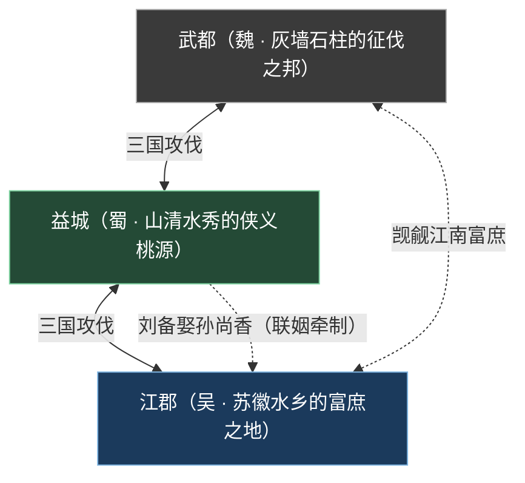
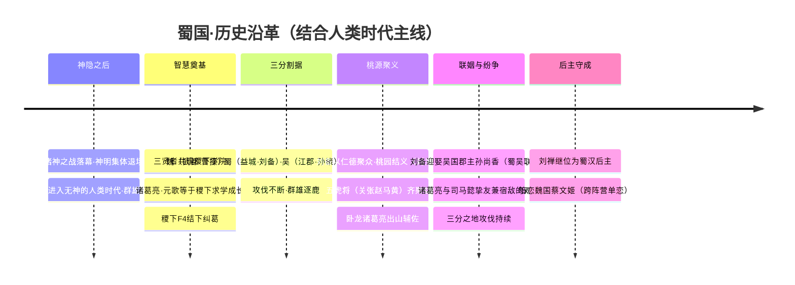
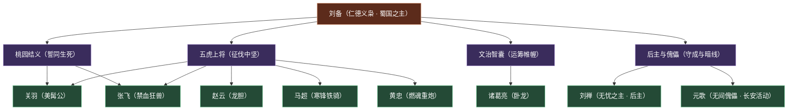
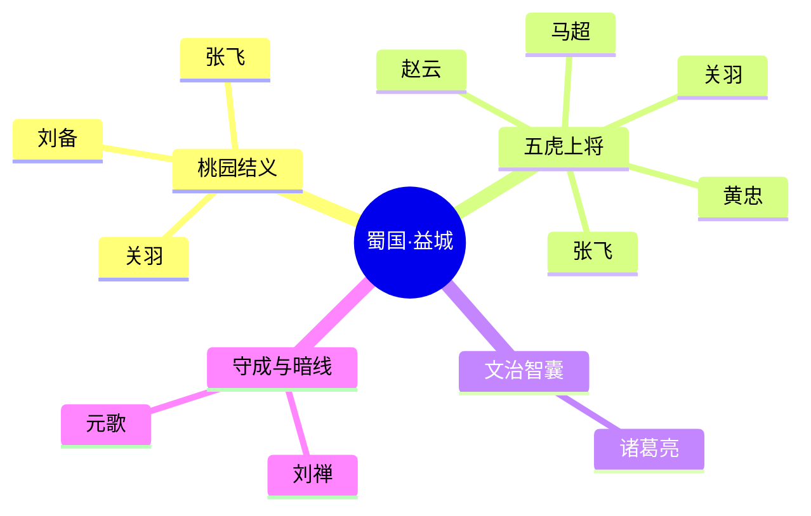
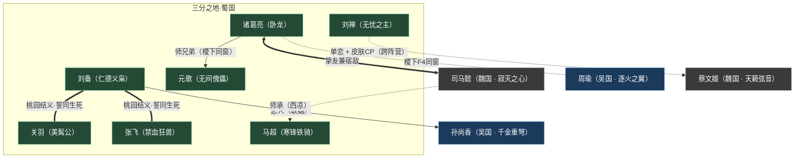

# 三分之地·蜀国

侠义桃源仁德枭雄神秘传奇
**大区：三分之地** — 以益城为核心、山清水秀桃花绚烂的世外桃源，一座由仁德义枭统御、侠肝义胆的群英之邦，是全王者大陆**英雄数量最多**的阵营。

::: info 概述
**三分之地·蜀国**（别称「蜀」「蜀汉」）是人类时代「**魏蜀吴三分之地纷争**」中，以**益城**为核心的割据势力之一。它的视觉与气质底色，是一片「**山清水秀、桃花绚烂**」的世外桃源——区别于魏国的灰墙石柱、兵强马壮，也不同于吴国的苏徽水乡、私园林立；蜀国走的是「**侠义桃源 + 神秘传奇**」的路子：竹影桃林、青山碧水之间，却暗藏侠肝义胆的豪情与一缕难以言说的神秘感。

蜀国由「仁德义枭」[刘备](../heroes/sanfen-shu.md#刘备)统领，是以「**桃园结义**」之情与「**五虎将**」之勇凝聚而成的群英集团。桃园之中，刘、关、张三人焚香结拜、誓同生死；麾下五虎上将——[关羽](../heroes/sanfen-shu.md#关羽)、[张飞](../heroes/sanfen-shu.md#张飞)、[赵云](../heroes/sanfen-shu.md#赵云)、[马超](../heroes/sanfen-shu.md#马超)、[黄忠](../heroes/sanfen-shu.md#黄忠)各擅其能，文有「卧龙」[诸葛亮](../heroes/sanfen-shu.md#诸葛亮)运筹帷幄，后有「无忧之主」[刘禅](../heroes/sanfen-shu.md#刘禅)守成，更有自长安活动、操线弄偶的「无间傀儡」[元歌](../heroes/sanfen-shu.md#元歌)。在《王者荣耀》的英雄归类中，**蜀国是收录英雄最多的单一阵营**，几乎以一己之力撑起「三分之地」三国群像的半壁江山。

蜀国的羁绊网亦最为绵密：对外，刘备迎娶吴国郡主[孙尚香](../heroes/sanfen-wu.md#孙尚香)，是蜀吴联姻的纽带；后主刘禅暗恋魏国的[蔡文姬](../heroes/sanfen-wei.md#蔡文姬)，牵起一段跨阵营的单恋情缘；对内，诸葛亮与元歌是稷下同窗师兄弟，而诸葛亮与魏国[司马懿](../heroes/sanfen-wei.md#司马懿)则是名动天下的「挚友兼宿敌」。一桃源、一结义、五虎将、一卧龙——这便是蜀国的全部底色。
:::

---

## 阵营档案

| 档案项 | 内容 |
| :--- | :--- |
| **阵营名** | 三分之地·蜀国 |
| **阵营 ID** | `sanfen-shu` |
| **大区 / 导航组** | 三分之地 |
| **别称** | 蜀 / 蜀汉 |
| **地理位置** | 三分之地·**益城**（大陆中部偏西南，考据推测） |
| **主题风格** | 三国争霸 + 侠义桃源（山清水秀、桃花绚烂的世外桃源风，带神秘感） |
| **核心领袖** | [刘备](../heroes/sanfen-shu.md#刘备)（仁德义枭） |
| **核心羁绊** | 桃园结义（刘·关·张）· 五虎将（关·张·赵·马·黄） |
| **成员数（本阵营英雄）** | **9 位**（全大陆英雄最多的阵营） |
| **关键词** | 益城 · 桃源 · 侠义 · 仁德 · 桃园结义 · 五虎将 · 卧龙 |

::: info 「英雄最多的阵营」一辨
在本骨架的归类中，[蜀国](../factions/sanfen-shu.md) 是英雄数量最多的阵营，收录 9 位英雄。需注意：史实中蜀国麾下名将更多，而魏、吴亦各有未建条目的史实武将（如吴国黄盖、周泰、太史慈、甘宁等在三国系列中存在，但报告未给出称号 / 背景，故未单建条目）。因此「英雄最多」指的是**当前有完整条目的英雄数**，详见 [大事年表](../worldview/timeline.md)。
:::

---

## 地理与环境

蜀国坐落于**三分之地**之内，以**益城**为核心，方位大致在王者大陆**中部偏西南**（考据推测）。它与魏国（武都）、吴国（江郡）互为犄角，三国割据「三分之地」、攻伐不断，共同构成人类时代「群雄逐鹿」的重要篇章。

::: info 三分之地·三城气质对照
同处「三分之地」一区，魏、蜀、吴三城的地貌与气质却泾渭分明——这正是该区「一地三色」的魅力所在。

| 国 | 核心城 | 之主 | 气质底色 | 城貌特征 |
| :--- | :--- | :--- | :--- | :--- |
| [魏](../factions/sanfen-wei.md) | 武都 | [曹操](../heroes/sanfen-wei.md#曹操)（魏武挥鞭） | 尚武枭雄、富侵略野心 | 灰色城墙、石柱与天桥，兵强马壮 |
| **蜀** | **益城** | **[刘备](../heroes/sanfen-shu.md#刘备)（仁德义枭）** | **侠义桃源、带神秘感** | **山清水秀、桃花绚烂的世外桃源** |
| [吴](../factions/sanfen-wu.md) | 江郡 | [孙策](../heroes/sanfen-wu.md#孙策)（江东少主） | 江南水乡、富庶 | 苏派 + 徽派合璧、私家园林造景 |
:::

益城的环境主调，是一片「**世外桃源**」式的灵秀山水：山清水秀、碧波竹影，桃花在春日里绚烂铺展，宛如远离烽烟的避世仙境。然而这份秀美之下，又笼着一缕「**神秘感**」——它不只是田园牧歌的安乐乡，更是孕育侠义豪情、藏龙卧虎之地。「桃源」与「侠义」在此交织：桃林之中既有结义焚香的兄弟情，也有提刀跨马的征伐志。

::: tip 桃源·桃林·桃园结义
「桃花绚烂」不仅是益城的环境标签，更与蜀国最核心的羁绊——「**桃园结义**」形成意象上的呼应。刘、关、张于桃园中焚香结拜、誓同生死，桃花便成了这段兄弟情谊的视觉符号。可以说，蜀国的「桃源」气质，既是一处地理风光，也是一种**精神底色**：以情义为根、以侠气为骨。
:::

整体而言，益城的氛围是「**青山藏剑、桃林结义**」：表面是远离尘嚣的世外仙境，内里却是侠肝义胆、群英荟萃的逐鹿之邦。山水的灵秀与豪情的炽烈在此并存，构成了蜀国独一无二的「侠义桃源」气场。

---

## 历史沿革

蜀国的历史，深植于「**人类时代 / 英雄逐鹿时代**」。这是神明退场、人类自主发展文明的纪元，其历史壳层融合了战国、隋唐、三国等多重母题，而魏蜀吴的三分割据，正是其中以「三国」为壳的重头戏。结合 [纪元编年](../worldview/eras.md) 与 [大事年表](../worldview/timeline.md) 中与本阵营相关的事件，可梳理为如下脉络。

### 一、神隐之后的群雄逐鹿

在 [神明时代](../worldview/eras.md) 的诸神之战中，[盘古](../heroes/shanggu-shenhua.md#盘古)劈开束缚人类的保护罩、化为山脉，[女娲](../heroes/shanggu-shenhua.md#女娲)封印方舟核心后沉睡——史称「**神隐**」。神明集体退场，人类摆脱束缚，进入「**自主发展文明、群雄并起**」的纪元。这是 MOBA 主体英雄登场、各方势力激烈角力的「当下」舞台。

正是在这片无神的大陆上，[长安城](../factions/changan.md)的玄雍帝国崛起为中枢；而在帝国侧翼，**魏、蜀、吴三国割据「三分之地」**，攻伐不断——蜀国的故事，便在这「三分纷争」的大背景下展开。

### 二、三分割据·益城立邦

::: quote 三分之地·三国并立
[魏国](../factions/sanfen-wei.md)（武都 / [曹操](../heroes/sanfen-wei.md#曹操)）、**蜀国**（益城 / [刘备](../heroes/sanfen-shu.md#刘备)）、[吴国](../factions/sanfen-wu.md)（江郡 / [孙策](../heroes/sanfen-wu.md#孙策)）三国割据**三分之地**、攻伐不断，构成群雄逐鹿的重要篇章。其中**蜀国是英雄数量最多的阵营**。
:::

蜀国以**益城**为根基，由「仁德义枭」[刘备](../heroes/sanfen-shu.md#刘备)统御。与魏国的尚武扩张、吴国的富庶守成不同，蜀国走的是「**以仁德聚众、以侠义立邦**」的路线：刘备不以兵强马壮称雄，而以「仁德」之名招揽群英，使桃源益城成为侠肝义胆者的归处。

### 三、桃园结义与五虎齐聚

蜀国凝聚力的核心，是两段流传千古的羁绊：

- **桃园结义**：刘备、[关羽](../heroes/sanfen-shu.md#关羽)、[张飞](../heroes/sanfen-shu.md#张飞)于桃园焚香结拜，誓同生死。这是蜀国「以情义为根」精神的源头，桃花绚烂的益城风光也由此被赋予了兄弟情的象征意味。
- **五虎将齐聚**：[关羽](../heroes/sanfen-shu.md#关羽)（美髯公）、[张飞](../heroes/sanfen-shu.md#张飞)（禁血狂兽）、[赵云](../heroes/sanfen-shu.md#赵云)（龙胆）、[马超](../heroes/sanfen-shu.md#马超)（寒锋铁骑）、[黄忠](../heroes/sanfen-shu.md#黄忠)（燃魂重炮）五位猛将齐聚益城，成为蜀国征伐天下的中坚武力。

文治一脉，则以「卧龙」[诸葛亮](../heroes/sanfen-shu.md#诸葛亮)为代表。诸葛亮出身稷下、运筹帷幄，是蜀国的智囊核心；他与魏国[司马懿](../heroes/sanfen-wei.md#司马懿)的「挚友兼宿敌」之争，更是贯穿三分之地的一条暗线。

### 四、联姻、宿敌与后主守成

::: info 蜀吴联姻·刘备娶孙尚香
蜀国[刘备](../heroes/sanfen-shu.md#刘备)迎娶吴国郡主[孙尚香](../heroes/sanfen-wu.md#孙尚香)，使蜀吴间多了一层**联姻牵制**。这段历史联姻为游戏沿用，并衍生出「520 天鹅之梦」等 CP 皮肤，是三分之地「攻伐与联姻交织」的代表案例。
:::

与此同时，诸葛亮与司马懿的对峙、马超「寒锋铁骑」的西凉渊源（其师为司马懿，亦是「红色琥珀」相关人物之一，详见 [纪元编年](../worldview/eras.md)）等，让蜀国的羁绊网向魏国延伸。到了后主时代，「无忧之主」[刘禅](../heroes/sanfen-shu.md#刘禅)继承蜀汉基业，操控机关车守成一方，并对魏国的[蔡文姬](../heroes/sanfen-wei.md#蔡文姬)怀有一段跨阵营的单恋——为这段三国群像添上一抹温柔而怅然的注脚。

::: info 稷下渊源·诸葛亮与元歌
蜀国的两位「智」系英雄——[诸葛亮](../heroes/sanfen-shu.md#诸葛亮) 与 [元歌](../heroes/sanfen-shu.md#元歌)，皆与 [稷下学院](../factions/jixia.md) 渊源深厚。诸葛亮是「稷下F4」之一，元歌则是其稷下同窗师弟。**「曾在稷下求学」≠「稷下阵营英雄」**：诸葛亮、元歌虽在稷下成长，阵营归属仍为蜀国。详见 [稷下学院](../factions/jixia.md)。
:::

---

## 组织 · 理念 · 特色

### 「仁德义枭」统御下的群英集团

蜀国并非靠严刑峻法或兵威立国，而是一个以**情义与仁德**凝聚起来的群英集团。其组织结构可概括为「**一主、两义、五虎、一龙**」：

### 核心理念：仁德为本、侠义为骨

::: quote 蜀国之道
其一，**仁德为本**——蜀国以刘备的「仁德」之名立邦，不以兵威服人，而以情义聚众，使群英心甘情愿归附。

其二，**侠义为骨**——桃园结义、誓同生死的兄弟情，五虎将的忠勇豪情，构成了蜀国「侠肝义胆」的精神骨架。这份侠气，与益城「世外桃源」的灵秀山水相映成趣，刚柔并济。
:::

这套「仁德 + 侠义」的理念，使蜀国在三分之地的群雄中独树一帜：魏尚武、吴务实，而蜀重情义。也正因如此，蜀国能成为**英雄数量最多**的阵营——它像一面旗帜，吸引着天下侠义之士前来聚义。

### 阵营特色：定位最全的「群英之邦」

侠义桃源的世外仙境益城山清水秀、桃花绚烂，是带神秘感的「世外桃源」，桃林既是风光，也是「桃园结义」的精神符号。

英雄最多的群英集团收录 9 位英雄，是全大陆英雄数量最多的单一阵营，几乎撑起三分之地三国群像的半壁江山。

五虎齐备·定位最全桃园结义 + 五虎将，从远射战士、骑战、战刺、肉盾辅助到法师、射手、刺客，几乎覆盖全部职业定位。

羁绊网最绵密对外有蜀吴联姻、刘禅单恋蔡文姬的跨阵营情缘；对内有诸葛亮与元歌的稷下同窗、与司马懿的挚友兼宿敌。

::: info 定位分布·一邦九职
蜀国 9 位英雄的职业定位几乎覆盖了 MOBA 全部分路与职责，堪称「定位最全的阵营」：

| 职业 | 英雄 |
| :--- | :--- |
| 战士 | [刘备](../heroes/sanfen-shu.md#刘备)、[关羽](../heroes/sanfen-shu.md#关羽) |
| 战士 / 刺客 | [赵云](../heroes/sanfen-shu.md#赵云)、[马超](../heroes/sanfen-shu.md#马超) |
| 坦克 / 辅助 | [张飞](../heroes/sanfen-shu.md#张飞)、[刘禅](../heroes/sanfen-shu.md#刘禅) |
| 法师 | [诸葛亮](../heroes/sanfen-shu.md#诸葛亮) |
| 射手 | [黄忠](../heroes/sanfen-shu.md#黄忠) |
| 刺客 | [元歌](../heroes/sanfen-shu.md#元歌) |
:::

---

## 核心人物 · 领袖小传

蜀国由「仁德义枭」**刘备**统领。他既是桃园结义的兄长，也是五虎将与卧龙归附的旗帜，是整个群英集团的精神核心。

::: info 蜀国之主 · [刘备](../heroes/sanfen-shu.md#刘备)（仁德义枭）
战士
蜀国的统御者，号「**仁德义枭**」。他并非以兵威称雄的莽夫，而是以「仁德」之名招揽群英、凝聚人心的枭雄——「枭」言其雄略与隐忍，「义」言其情义与号召力，二者合一，恰是蜀国「仁德为本、侠义为骨」精神的化身。

在战场上，刘备是一名**持双枪的远近结合射击型战士**：他能以双枪进行远程射击消耗，又能切入近身搏杀，攻守兼备、进退自如——这与他「能屈能伸、刚柔并济」的枭雄气质暗合。作为桃园结义的兄长，他与[关羽](../heroes/sanfen-shu.md#关羽)、[张飞](../heroes/sanfen-shu.md#张飞)誓同生死；作为蜀吴联姻的纽带，他迎娶吴国郡主[孙尚香](../heroes/sanfen-wu.md#孙尚香)，留下「520 天鹅之梦」等 CP 佳话。一桃园、一双枪、一仁德——这便是蜀国之主的全部底色。
:::

### 文武两脉·四类群英速览

蜀国九雄虽各擅其能，却可循「情义—征伐—智略—特殊」四脉归位。下面这张思维导图，把四脉与其代表英雄一并呈现，便于一眼看清蜀国的人物骨架。

---

## 成员花名册

战士刺客坦克/防御辅助法师射手

蜀国的 9 位英雄，是全大陆英雄数量最多的阵营，职业定位几乎覆盖全部职责，恰是「群英之邦、定位最全」的活注脚。下表覆盖 `faction.heroes` 全部成员（点击英雄名跳转英雄页锚点）。

| 英雄 | 称号 | 定位 | 一句话身份 |
| :--- | :--- | :--- | :--- |
| [刘备](../heroes/sanfen-shu.md#刘备) | 仁德义枭 | 战士 | 持双枪的枭雄、蜀国之主，远近结合的射击型战士，桃园结义兄长、孙尚香之夫。 |
| [关羽](../heroes/sanfen-shu.md#关羽) | 美髯公 | 战士 | 骑赤兔、提青龙偃月刀，靠加速冲撞的骑战战士，桃园结义二弟、五虎之首。 |
| [赵云](../heroes/sanfen-shu.md#赵云) | 龙胆 | 战士 / 刺客 | 常山赵子龙、五虎上将，高机动位移 + 护盾连招的战士。 |
| [马超](../heroes/sanfen-shu.md#马超) | 寒锋铁骑 | 战士 / 刺客 | 西凉锦马超、五虎上将，掷枪 + 拾枪机制的高机动战刺，师从司马懿。 |
| [张飞](../heroes/sanfen-shu.md#张飞) | 禁血狂兽 | 坦克 / 辅助 | 蜀汉猛将、桃园结义三弟，大招强化变身、加盾护团的肉盾辅助。 |
| [诸葛亮](../heroes/sanfen-shu.md#诸葛亮) | 卧龙 | 法师 | 运筹帷幄、稷下出身的法术爆发法刺，司马懿宿敌兼挚友、元歌师兄。 |
| [黄忠](../heroes/sanfen-shu.md#黄忠) | 燃魂重炮 | 射手 | 蜀汉老将军、五虎上将，操纵巨型重炮、越战越勇的老当益壮。 |
| [刘禅](../heroes/sanfen-shu.md#刘禅) | 无忧之主 | 坦克 / 辅助 | 操控机关车的蜀汉后主，团控加盾的机关坦辅，暗恋蔡文姬。 |
| [元歌](../heroes/sanfen-shu.md#元歌) | 无间傀儡 | 刺客 | 幼年失语入稷下、由师兄诸葛亮启发以傀儡代喉舌的提线刺客（原型蜀国军师庞统，于长安活动）。 |

::: info 五虎上将·战法机制对照（考据·依官方人设概括）
五虎将虽同列「征伐中坚」，战场分工却泾渭分明：从骑战冲撞到远程重炮，几乎构成一支可独立运转的攻坚梯队。

| 五虎将 | 称号 | 核心定位 | 战斗印象（特征关键词） |
| :--- | :--- | :--- | :--- |
| [关羽](../heroes/sanfen-shu.md#关羽) | 美髯公 | 战士（骑战） | 骑赤兔、提青龙偃月刀，靠加速冲撞建立威慑的「冲锋型骑将」 |
| [张飞](../heroes/sanfen-shu.md#张飞) | 禁血狂兽 | 坦克 / 辅助 | 大招强化变身、加盾护团，是站前排扛伤护后排的「肉盾兽」 |
| [赵云](../heroes/sanfen-shu.md#赵云) | 龙胆 | 战士 / 刺客 | 常山赵子龙，高机动位移 + 护盾连招，攻守一体的「全能游战」 |
| [马超](../heroes/sanfen-shu.md#马超) | 寒锋铁骑 | 战士 / 刺客 | 西凉锦马超，掷枪 + 拾枪机制、来去如风的「高机动战刺」 |
| [黄忠](../heroes/sanfen-shu.md#黄忠) | 燃魂重炮 | 射手 | 蜀汉老将军，操纵巨型重炮、越战越勇的「老当益壮远火」 |
:::

::: info 花名册速读·四脉群英
- **桃园结义（情义脉）**：刘备（仁德义枭）、关羽（美髯公）、张飞（禁血狂兽）——焚香结拜、誓同生死的兄弟核心。
- **五虎上将（征伐脉）**：关羽、张飞、赵云（龙胆）、马超（寒锋铁骑）、黄忠（燃魂重炮）——蜀国征伐天下的中坚武力。
- **文治智囊（智略脉）**：诸葛亮（卧龙）——稷下出身、运筹帷幄的法术核心，与司马懿宿敌兼挚友。
- **守成与暗线（特殊脉）**：刘禅（无忧之主·后主）、元歌（无间傀儡·长安活动）——一守成、一暗行，为蜀国群像添补特殊定位。
:::

::: warning 成员辨析·几处易混点
- **元歌的活动范围**：元歌虽归蜀国阵营（原型为蜀国军师庞统），但其叙事主要**在长安活动**——阵营归属与活动地点不必一致。
- **马超的西凉与师承**：马超号「西凉锦马超」，其师为魏国的 [司马懿](../heroes/sanfen-wei.md#司马懿)；他亦是「红色琥珀」相关人物之一，与 [伽罗](../heroes/changcheng.md#伽罗)、[铠](../heroes/changan.md#铠) 同列于「琥珀」线索之中（详见 [纪元编年](../worldview/eras.md)）。
- **诸葛亮、元歌的稷下身份**：二人虽出身 [稷下学院](../factions/jixia.md)（诸葛亮更是「稷下F4」一员），阵营归属仍是蜀国，而非稷下。
:::

---

## 阵营关系

蜀国是三分之地羁绊网最绵密的阵营。基于 `relatedRelationships`，其关系可分为「**蜀国内部 / 同盟**」与「**跨阵营情缘 / 宿敌**」两大类。需特别注意：跨阵营人物（如孙尚香、蔡文姬、司马懿等）的英雄页位于各自阵营目录之下。

### 关系总览图

### 关系明细表

| 关系类型 | 关联双方 | 性质 | 说明 |
| :--- | :--- | :--- | :--- |
| 桃园结义 | [刘备](../heroes/sanfen-shu.md#刘备) — [关羽](../heroes/sanfen-shu.md#关羽) — [张飞](../heroes/sanfen-shu.md#张飞) | 同盟（义结金兰） | 三人于桃园焚香结拜、誓同生死，是蜀国「以情义为根」精神的源头。 |
| 恋人（联姻） | [刘备](../heroes/sanfen-shu.md#刘备) — [孙尚香](../heroes/sanfen-wu.md#孙尚香) | 同盟（跨阵营·联姻） | 历史联姻，游戏沿用；蜀吴间多一层联姻牵制，有「520 天鹅之梦」等 CP 皮肤。 |
| 单恋 + 皮肤CP（跨阵营） | [刘禅](../heroes/sanfen-shu.md#刘禅) — [蔡文姬](../heroes/sanfen-wei.md#蔡文姬) | 单恋（跨阵营） | 刘禅（蜀）自始暗恋蔡文姬（魏），有足球主题情侣皮肤与共有台词，属单恋 + 皮肤CP。 |
| 师兄弟（稷下同窗） | [诸葛亮](../heroes/sanfen-shu.md#诸葛亮) — [元歌](../heroes/sanfen-shu.md#元歌) | 同盟（同门师兄弟） | 元歌幼年受惊失语、孤儿入稷下，被博学师兄诸葛亮鼓励以机关傀儡代喉舌与世界交流，从此专研傀儡。 |
| 挚友兼宿敌 | [诸葛亮](../heroes/sanfen-shu.md#诸葛亮) — [司马懿](../heroes/sanfen-wei.md#司马懿) | 冲突（跨阵营·亦敌亦友） | 青年同在稷下相识、因才华彼此欣赏共寻天书碎片；司马懿发现真相却不愿恨挚友遂离开稷下。既是稷下同窗挚友，又是官方明确的宿敌（司马懿宣传即「诸葛亮的宿敌来了」）。 |
| 同窗团体（稷下F4） | [诸葛亮](../heroes/sanfen-shu.md#诸葛亮) · [周瑜](../heroes/sanfen-wu.md#周瑜) · [元歌](../heroes/sanfen-shu.md#元歌) · [司马懿](../heroes/sanfen-wei.md#司马懿) | 同盟（同窗·跨阵营） | 稷下学院最富盛名的学生团体；四人日后分赴蜀 / 吴 / 魏，将同窗之谊延续进三分之地的烽烟。 |
| 师承（创院三贤者→众弟子） | [老夫子](../heroes/jixia.md#老夫子) · [庄周](../heroes/penglai-donghai.md#庄周) · [墨子](../heroes/mojia-jiguan.md#墨子) → [诸葛亮](../heroes/sanfen-shu.md#诸葛亮) · [元歌](../heroes/sanfen-shu.md#元歌) 等 | 同盟（师徒·跨阵营） | 稷下三贤者有教无类广收弟子；诸葛亮、元歌虽在稷下求学，阵营归属仍为蜀。 |
| 师承（西凉） | [司马懿](../heroes/sanfen-wei.md#司马懿) → [马超](../heroes/sanfen-shu.md#马超) | 同盟 / 跨阵营（师徒） | 司马懿曾为马超之师；马超号「西凉锦马超」，亦是「红色琥珀」相关人物之一。 |

::: warning 羁绊辨析·跨阵营的几条暗线
- **蜀吴联姻 vs 蜀魏宿敌**：蜀国对吴国是「联姻牵制」（刘备娶孙尚香），对魏国则更多是「宿敌对峙」（诸葛亮 vs 司马懿）——一柔一刚，构成蜀国对外关系的两条主线。
- **稷下同窗的阵营分裂**：稷下F4（诸葛亮 / 周瑜 / 元歌 / 司马懿）中，蜀占其二（诸葛亮、元歌），吴占周瑜、魏占司马懿。昔日同窗，日后分属三国，把书声里的情谊与较劲延续进了战场。
- **刘禅单恋的跨阵营性质**：刘禅（蜀）暗恋蔡文姬（魏），是「单恋 + 皮肤CP」，属跨阵营情缘——蔡文姬的英雄页位于 [魏国](../heroes/sanfen-wei.md#蔡文姬) 目录之下。
:::

---

## 相关剧情

- **魏蜀吴三分之地纷争**：人类时代「群雄逐鹿」的重头戏，魏（武都 / [曹操](../heroes/sanfen-wei.md#曹操)）、蜀（益城 / [刘备](../heroes/sanfen-shu.md#刘备)）、吴（江郡 / [孙策](../heroes/sanfen-wu.md#孙策)）三国割据攻伐。详见 [纪元编年](../worldview/eras.md) 与 [大事年表](../worldview/timeline.md)。
- **桃园结义与五虎聚义**：刘、关、张焚香结拜，五虎将齐聚益城——蜀国「以情义为根、以侠义为骨」精神的生动注脚。
- **蜀吴联姻·刘备娶孙尚香**：历史联姻为游戏沿用，衍生「520 天鹅之梦」CP 皮肤，是三分之地「攻伐与联姻交织」的代表。详见 [纪元编年](../worldview/eras.md)。
- **诸葛亮与司马懿·挚友兼宿敌**：稷下同窗的青春情谊，演为三分之地名动天下的「宿敌之争」——一条贯穿蜀魏的暗线。
- **刘禅暗恋蔡文姬**：蜀国后主对魏国天籁的跨阵营单恋，足球主题情侣皮肤与共有台词为这段三国群像添上温柔注脚。
- **马超与「红色琥珀」**：西凉锦马超是「琥珀」线索相关人物之一，与 [伽罗](../heroes/changcheng.md#伽罗)、[铠](../heroes/changan.md#铠) 同列。详见 [纪元编年](../worldview/eras.md)。

---

## 延伸阅读

<a class="hok-card" href="../heroes/sanfen-shu">蜀国英雄图鉴本阵营 9 位英雄的完整档案、背景与定位，见 。</a>
<a class="hok-card" href="../factions/sanfen-wei">同区·三分之地·魏国蜀国的主要宿敌，诸葛亮 vs 司马懿、刘禅暗恋蔡文姬的关系另一端，见 。</a>
<a class="hok-card" href="../factions/sanfen-wu">同区·三分之地·吴国蜀吴联姻的另一端，孙尚香的归属地，见 。</a>
<a class="hok-card" href="../factions/jixia">关联·稷下学院诸葛亮、元歌的求学之地，「稷下F4」结缘的舞台，见 。</a>
<a class="hok-card" href="../worldview/map">王者大陆地图三分之地与益城在大陆上的方位与势力边界，见 。</a>
<a class="hok-card" href="../worldview/eras">纪元编年三分纷争、蜀吴联姻、稷下渊源等事件的世界观坐标，见 。</a>
<a class="hok-card" href="../worldview/timeline">大事年表魏蜀吴纷争在人类时代时间线上的位置，见 。</a>
<a class="hok-card" href="../factions/index">阵营总览全大陆各大势力的来历与立场对照，见 。</a>

::: quote 结语
「桃园一拜，誓同生死；仁德所至，群英归心。」——在魏尚武、吴务实的三分之地间，蜀国走的是一条「以情义聚天下」的路。它把益城的桃花绚烂，化作兄弟结义的精神符号；把山清水秀的世外桃源，化作侠肝义胆者的归处。五虎将的忠勇、卧龙的智略、后主的守成、傀儡师的暗行……九位群英各擅其能，却共守同一句最朴素的信念：**仁德为本，侠义为骨——情义，才是这片桃源最坚固的城墙。**
:::