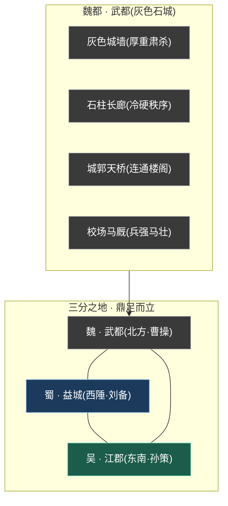
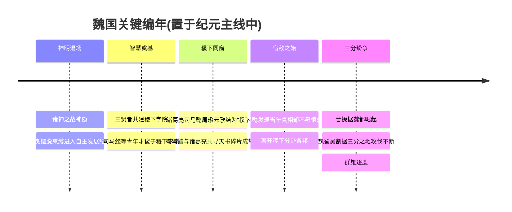
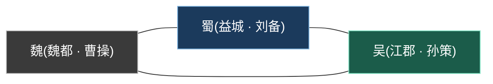
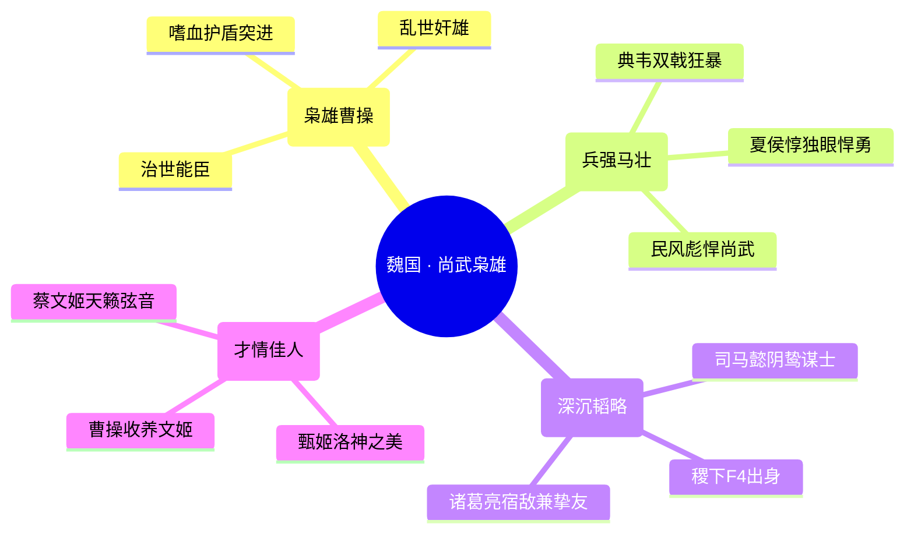
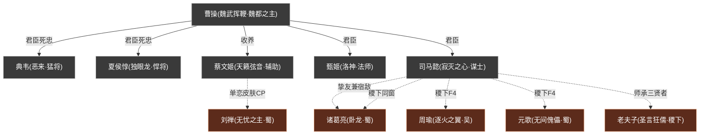

# 三分之地·魏国

三分之地尚武枭雄争霸权谋

> **三国之首 · 兵强马壮 · 枭雄霸业** —— 三分之地中以魏都为核心的尚武强权，灰墙石柱、铁马金戈，由「宁教我负天下人」的枭雄[曹操](../heroes/sanfen-wei.md#曹操)统御，是逐鹿乱世中野心最炽、武力最盛的一方。

---

!!! abstract "阵营概述"
    **魏国**（亦称「魏」「曹魏」），是[人类时代](../worldview/eras.md)「英雄逐鹿」纪元中，割据**三分之地**的三大势力之一，以雄踞北方的**魏都·武都**为核心。在魏、蜀、吴三足鼎立的版图上，魏国是疆域最广、兵甲最盛、侵略野心最炽的一方——它的城池是一片**灰色的石头世界**：厚重的灰墙、林立的石柱、横跨城郭的天桥，处处透着冷硬、肃杀与铁血秩序。

    这里民风彪悍、崇尚武力，「兵强马壮」是它最直白的名片。统御这片土地的，是被时人毁誉参半的枭雄——**「魏武挥鞭」[曹操](../heroes/sanfen-wei.md#曹操)**。他既有「治世之能臣」的雄才大略，也有「乱世之奸雄」的嗜血狠厉，麾下网罗了悍将[典韦](../heroes/sanfen-wei.md#典韦)、[夏侯惇](../heroes/sanfen-wei.md#夏侯惇)的赤胆死忠，深沉谋士[司马懿](../heroes/sanfen-wei.md#司马懿)的阴鸷韬略，以及[甄姬](../heroes/sanfen-wei.md#甄姬)、[蔡文姬](../heroes/sanfen-wei.md#蔡文姬)两位才情绝代的女子。武将的铁血、谋士的深沉、佳人的风雅，在魏都的灰墙之下交织成一幅「枭雄霸业」的乱世长卷。它不是最「仁」的一方，却几乎是最「强」的一方——这，正是魏国的底色。

## 阵营档案

| 档案项 | 内容 |
| :--- | :--- |
| **阵营名** | 三分之地·魏国（facId: `sanfen-wei`） |
| **别称** | 魏 / 曹魏 |
| **地理位置** | 三分之地·武都（魏都） |
| **所属大区** | 三分之地 |
| **主题风格** | 三国争霸 + 尚武枭雄 |
| **核心领袖** | [曹操](../heroes/sanfen-wei.md#曹操)（魏武挥鞭 · 魏都之主） |
| **成员数** | 6 名英雄（本阵营名册收录） |
| **一句概述** | 民风彪悍尚武、富侵略野心，灰色城墙石柱天桥、兵强马壮，由枭雄曹操统领。 |
| **关键词** | 三国争霸 · 尚武彪悍 · 枭雄野心 · 灰墙石柱 · 兵强马壮 · 武将谋士佳人 |

---

## 地理与环境

魏国坐落于**三分之地的北方**，以都城**武都（魏都）**为核心。与蜀国的益城（山川险塞、易守难攻）、吴国的江郡（水网纵横、舟楫之利）相比，魏都呈现的是一派**北地雄关、铁血都会**的肃杀气象。

!!! info "魏都的视觉母题 · 一座灰色的石头之城"
    魏国最鲜明的环境特征，是它**「灰色城墙、石柱、天桥」**的建筑语言。不同于长安的盛唐繁华、蜀地的青山秀水，魏都是一座**冷硬、厚重、棱角分明的石城**：高耸的灰墙象征着防御与威压，林立的石柱透着森严的秩序感，横跨城郭的天桥则将一座座楼阁连为铁血整体。整座城仿佛一具披甲的战争机器，处处昭示着「尚武」与「侵略」的气质。

!!! tip "尚武彪悍 · 兵强马壮的边塞气象"
    魏国「**民风彪悍尚武、富侵略野心、兵强马壮**」。这片土地上的人崇尚武力、悍勇好战，校场的马蹄声与兵器的撞击声是它的日常背景音。在三国鼎立的格局中，魏国凭借最广的疆域与最盛的兵甲，始终是攻势最猛、野心最炽的一方——「逐鹿天下」于它而言，从来不是守成，而是进取。

| 地标/要素 | 性质 | 关联 |
| :--- | :--- | :--- |
| 武都（魏都） | 魏国核心都城、权力中枢 | [曹操](../heroes/sanfen-wei.md#曹操)君临 |
| 灰色城墙 / 石柱 | 冷硬肃杀的防御与秩序象征 | 魏国「尚武」母题的具象 |
| 城郭天桥 | 连通楼阁的铁血都会景观 | 魏都建筑语言 |
| 校场 / 马厩 | 兵强马壮的练兵之所 | [典韦](../heroes/sanfen-wei.md#典韦)、[夏侯惇](../heroes/sanfen-wei.md#夏侯惇)等武将 |
| 洛水（考据推测） | [甄姬](../heroes/sanfen-wei.md#甄姬)「洛神」意象的水域来源 | 甄姬化身洛水之神 |

### 三国并立 · 魏蜀吴速览对照

为便于读者把握魏国在「三分之地」中的坐标，下表将三国的核心要素并列对照（蜀、吴的英雄数与气质参见各自阵营页）。

| 维度 | [魏](../factions/sanfen-wei.md) | [蜀](../factions/sanfen-shu.md) | [吴](../factions/sanfen-wu.md) |
| :--- | :--- | :--- | :--- |
| 都城 | 武都（魏都·北方） | 益城（西陲山塞） | 江郡（东南水乡） |
| 君主 | [曹操](../heroes/sanfen-wei.md#曹操)（魏武挥鞭） | [刘备](../heroes/sanfen-shu.md#刘备)（仁德义枭） | [孙策](../heroes/sanfen-wu.md#孙策)（江东少主） |
| 立身之本 | 力（尚武彪悍·兵强马壮） | 义（仁德聚人） | 业（江东基业·舟楫之利） |
| 气质底色 | 枭雄野心、铁血进取 | 仁义守正、汉室正统 | 守土固本、少年锐气 |
| 收录英雄数 | 6 名 | 12 名 | 5 名 |
| 稷下F4代表 | [司马懿](../heroes/sanfen-wei.md#司马懿) | [诸葛亮](../heroes/sanfen-shu.md#诸葛亮)、[元歌](../heroes/sanfen-shu.md#元歌) | [周瑜](../heroes/sanfen-wu.md#周瑜) |

---

## 历史沿革

魏国的故事，是[人类时代](../worldview/eras.md)「英雄逐鹿」纪元中，最为读者熟悉的一段割据史的核心篇章。在神明退场、人类自主发展的时代，群雄并起，最终演为魏、蜀、吴三分天下的格局。

### 渊源 · 神明退场后的逐鹿乱世

据[纪元编年](../worldview/eras.md)，神明在「诸神之战·神隐」后退出历史舞台，人类摆脱束缚，进入**自主发展文明、群雄并起**的纪元。这一「英雄逐鹿」时代的历史壳层，融合了战国、隋唐、三国等多重母题，而魏、蜀、吴三分之地的纷争，正是其中最具代表性的三国篇章。魏国，便诞生于这片群雄角力的乱世舞台。

### 求学 · 稷下同窗与谋士之路

在三分纷争正式拉开帷幕之前，魏国未来的谋主[司马懿](../heroes/sanfen-wei.md#司马懿)，曾有一段决定他一生的青春岁月——他**出身[稷下学院](../factions/jixia.md)**，与[诸葛亮](../heroes/sanfen-shu.md#诸葛亮)、[周瑜](../heroes/sanfen-wu.md#周瑜)、[元歌](../heroes/sanfen-shu.md#元歌)同为「**稷下F4**」，是这座学府最负盛名的学生团体之一。

!!! quote "司马懿 · 寂灭之心"
    「我，从不站在弱者那一边。」

青年时代的司马懿与诸葛亮同在稷下相识，因彼此的才华惊艳而互相欣赏，结为挚友，并曾共同寻找**天书碎片**。然而，司马懿在追寻中**发现了当年的真相**——尽管真相令人痛苦，他却**不愿因此去恨这位挚友**，遂选择悄然离开稷下。这段经历，将「挚友」与「宿敌」两重身份，永远地刻进了他与诸葛亮的命运里。

!!! note "考据 · 「曾在稷下求学」≠「稷下阵营」"
    据世界观骨架，[司马懿](../heroes/sanfen-wei.md#司马懿)虽出身稷下、是「稷下F4」一员，但其**阵营归属仍为魏国**。同理，诸葛亮 / 元歌归蜀、周瑜归吴。稷下是他们「关系网」的渊源，却不改其各自的邦国立场——这正是「同窗各为其主」的乱世写照。稷下三贤者（[老夫子](../heroes/jixia.md#老夫子)、[庄周](../heroes/penglai-donghai.md#庄周)、[墨子](../heroes/mojia-jiguan.md#墨子)）有教无类，门下弟子众多（诸葛亮、司马懿、周瑜、元歌、孙膑、钟无艳、廉颇、西施、曜、蒙犽、鲁班大师、镜等皆在其列），司马懿即是其中负笈而来、又终归魏都的一人。

### 鼎立 · 魏蜀吴三分之地纷争

进入「英雄逐鹿」的高潮，**[魏](../factions/sanfen-wei.md)（魏都/[曹操](../heroes/sanfen-wei.md#曹操)）、[蜀](../factions/sanfen-shu.md)（益城/[刘备](../heroes/sanfen-shu.md#刘备)）、[吴](../factions/sanfen-wu.md)（江郡/[孙策](../heroes/sanfen-wu.md#孙策)）** 三国割据「三分之地」，攻伐不断，构成群雄逐鹿的重要篇章。

在三分格局中，魏国凭借最广的疆域、最盛的兵甲，是**攻势最猛、野心最炽的一方**。曹操据魏都崛起，麾下猛将谋士云集，与西陲的蜀、东南的吴展开漫长的角力。这场逐鹿，既是邦国之间的攻伐，也延续着昔日稷下同窗（如司马懿与诸葛亮）的暗中较劲——「天下三分」的烽烟里，藏着多少青春旧谊与权谋宿命。

!!! info "考据 · 三国阵营的英雄分布"
    在本骨架的归类中，[蜀国](../factions/sanfen-shu.md)是英雄数量最多的阵营（12 名）；魏国收录 6 名、吴国 5 名。史实魏国群将（如张辽、许褚、郭嘉等）在三国题材中虽广为人知，但世界观骨架未给出对应英雄条目，故本阵营花名册以游戏现有英雄为准。(考据备注)

---

## 组织 / 理念 / 特色

魏国的精神内核，可以浓缩为一组关键词：**枭雄、尚武、权谋、铁血**。它是一个以「强」立身的势力——强在武力，强在野心，强在不择手段的进取。

!!! note "理念一 · 枭雄之道，宁负天下"
    魏国的灵魂，是其君主[曹操](../heroes/sanfen-wei.md#曹操)身上那股**「枭雄」气质**——他是「治世之能臣，乱世之奸雄」的矛盾统一体。雄才大略与嗜血狠厉并存，进取野心与多疑寡恩同在。这种「成大事不拘小节、为霸业不惜手段」的枭雄之道，正是魏国区别于「仁德」蜀国、「江东基业」吴国的精神标识。

!!! tip "理念二 · 尚武彪悍，以力服人"
    若说蜀以「义」聚人、吴以「业」守土，魏则以「力」称雄。「**民风彪悍尚武、兵强马壮**」是它的立身之本。从持双戟狂暴近身的[典韦](../heroes/sanfen-wei.md#典韦)，到独眼仍悍勇冲阵的[夏侯惇](../heroes/sanfen-wei.md#夏侯惇)，魏国的武将群像无不彰显着「以力服人、以武立国」的崇武传统。

!!! warning "理念三 · 权谋深沉，暗流汹涌"
    魏国不只有铁血武力，更有深沉权谋。谋士[司马懿](../heroes/sanfen-wei.md#司马懿)「阴鸷深沉」，是「寂灭之心」般冷静狠辣的谋算者——他出身稷下、与诸葛亮亦敌亦友，最早的「法刺收割型中单」设定，正暗合其在权力棋局中「于无声处取人性命」的谋主气质。武将的明刀与谋士的暗箭，共同构成魏国「内外兼修」的强权底色。

!!! quote "理念四 · 铁血中的风雅一隅"
    肃杀的魏都，并非全无柔情。[甄姬](../heroes/sanfen-wei.md#甄姬)化身**洛水之神**，是冰冷石城里一抹凄美的传说；[蔡文姬](../heroes/sanfen-wei.md#蔡文姬)以**音律治愈队友**，是乱世兵戈中一缕温柔的天籁。两位才情绝代的女子，为这座以「武」「谋」立身的灰墙之城，添上了不可或缺的风雅与人性温度。

| 特色维度 | 魏国的呈现 |
| :--- | :--- |
| **职业生态** | 战士为骨干（曹操、典韦、夏侯惇），辅以法刺谋士（司马懿）、法师（甄姬）、辅助（蔡文姬），攻坚能力极强 |
| **君主气质** | 枭雄型——能臣与奸雄并存，野心与谋略兼备 |
| **立国之本** | 尚武彪悍、兵强马壮、富侵略野心 |
| **跨阵营纽带** | 与[蜀国](../factions/sanfen-shu.md)（司马懿—诸葛亮宿敌、刘禅—蔡文姬单恋CP）、[稷下学院](../factions/jixia.md)（稷下F4师承）深度交织 |

---

## 核心人物

魏国的霸业，系于一位枭雄之君与他麾下文武佳人。以下为本阵营的灵魂人物小传。

- :material-crown: **[曹操](../heroes/sanfen-wei.md#曹操) · 魏武挥鞭**

    战士

    嗜血枭雄、魏都之主，靠护盾与突进的吸血型战士。魏国「铁血·尚武·野心」三重精神的总和。

- :material-brain: **[司马懿](../heroes/sanfen-wei.md#司马懿) · 寂灭之心**

    法师/刺客

    阴鸷深沉的魏国谋主、稷下F4出身、诸葛亮宿敌兼挚友，最早的法刺收割型中单。

- :material-sword: **[典韦](../heroes/sanfen-wei.md#典韦) · 恶来**

    战士

    持双戟的魏国猛将，狂暴近身输出型战士，尚武彪悍的极致。

- :material-eye-off: **[夏侯惇](../heroes/sanfen-wei.md#夏侯惇) · 独眼龙**

    战士

    独眼悍将，带控带突进的肉系战士，伤痕累累却愈战愈勇。

- :material-water: **[甄姬](../heroes/sanfen-wei.md#甄姬) · 洛神**

    法师

    化身洛水之神的冰冷美人，以控制与法球封锁战局。

- :material-music: **[蔡文姬](../heroes/sanfen-wei.md#蔡文姬) · 天籁弦音**

    辅助

    蔡邕之女、被曹操收养，操控音律治愈队友的奶妈型辅助。

### 曹操 · 魏武挥鞭

战士

[曹操](../heroes/sanfen-wei.md#曹操)，魏国的最高统御者，三分之地北方的霸主。他是世界观中典型的**「枭雄」化身**——既有治世之能臣的雄才大略，也有乱世之奸雄的嗜血狠厉。在他的统御下，魏国网罗群雄、兵强马壮，成为逐鹿乱世中野心最炽、攻势最猛的一方。

在对局中，他是一名**「嗜血枭雄」式的吸血型战士**：依靠护盾抵御伤害、以突进切入战场，在血与火的厮杀中越战越强——这「靠护盾与突进吸血」的机制，恰是其「枭雄」气质的战斗具象：贪婪、强韧、永不退场。他是魏国「铁血」「尚武」「野心」三重精神的总和。

### 司马懿 · 寂灭之心

法师/刺客

[司马懿](../heroes/sanfen-wei.md#司马懿)，魏国阴鸷深沉的谋士，是这片铁血强权背后的「头脑」。他**出身[稷下学院](../factions/jixia.md)**，与[诸葛亮](../heroes/sanfen-shu.md#诸葛亮)、[周瑜](../heroes/sanfen-wu.md#周瑜)、[元歌](../heroes/sanfen-shu.md#元歌)并称「稷下F4」。青年时他与诸葛亮因才华相互欣赏、结为挚友，共寻天书碎片；却在发现当年真相后，不愿去恨挚友而黯然离开稷下。自此，他与诸葛亮成为**官方明确的「宿敌兼挚友」**——「诸葛亮的宿敌来了」正是其英雄宣传语。

在对局中，他是**最早的「法刺收割型中单」**：以阴狠的连招收割残血、于乱战中无声取命，机制与其「寂灭之心」「阴鸷深沉」的谋主性格高度契合。他是魏国「权谋」一面的灵魂。

### 典韦 · 恶来

战士

[典韦](../heroes/sanfen-wei.md#典韦)，号「恶来」，魏国的猛将，曹操麾下最具代表性的悍勇死忠。他持**双戟**冲锋陷阵，是一名「狂暴近身输出」型战士——勇猛、刚烈、视死如归。「恶来」之号本喻其勇力惊人，正是魏国「尚武彪悍、以力服人」武将精神的极致体现。

### 夏侯惇 · 独眼龙

战士

[夏侯惇](../heroes/sanfen-wei.md#夏侯惇)，号「独眼龙」，魏国独眼悍将。虽失一目，悍勇不减，是一名「带控带突进」的肉系战士——能扛能冲、控场切入。他的「独眼」形象，是魏国铁血武将群像中最具辨识度的一员，象征着伤痕累累却愈战愈勇的崇武精神。

### 甄姬 · 洛神

法师

[甄姬](../heroes/sanfen-wei.md#甄姬)，号「洛神」，魏都灰墙之城里一抹凄美的风雅。她化身**洛水之神**，是一位冰冷而绝美的法师，以**控制与法球**见长。在对局中，她以法球封锁敌人走位、以控制锁定战局，灵动而致命。「洛神」之名取自洛水神话意象（考据推测其与曹魏「洛神赋」的文学渊源相呼应），为肃杀的魏国添上一笔诗性的凄美。

### 蔡文姬 · 天籁弦音

辅助

[蔡文姬](../heroes/sanfen-wei.md#蔡文姬)，号「天籁弦音」，魏国的「奶妈型辅助」。她是名士蔡邕之女，**被[曹操](../heroes/sanfen-wei.md#曹操)收养**，自幼习得音律之才。在对局中，她**操控音律治愈队友**，是团队不可或缺的续航核心——温柔的弦音，是乱世兵戈中难得的慰藉。她还与蜀国的[刘禅](../heroes/sanfen-shu.md#刘禅)有一段跨阵营的「单恋+皮肤CP」（足球主题情侣皮肤），为铁血魏国增添了一缕浪漫色彩。

---

## 成员花名册

魏国是一个「武将为骨、谋士为脑、佳人为韵」的均衡阵营——既有冲锋陷阵的悍将，也有运筹帷幄的谋主，更有才情绝代的女子，共同撑起了三分之地北方的霸业。

战士刺客法师辅助

| 英雄 | 称号 | 定位 | 一句话身份 |
| :--- | :--- | :--- | :--- |
| [曹操](../heroes/sanfen-wei.md#曹操) | 魏武挥鞭 | 战士 | 嗜血枭雄，魏都之主，靠护盾与突进的吸血型战士。 |
| [典韦](../heroes/sanfen-wei.md#典韦) | 恶来 | 战士 | 持双戟的魏国猛将，狂暴近身输出战士。 |
| [夏侯惇](../heroes/sanfen-wei.md#夏侯惇) | 独眼龙 | 战士 | 独眼悍将，带控带突进的肉系战士。 |
| [司马懿](../heroes/sanfen-wei.md#司马懿) | 寂灭之心 | 法师/刺客 | 阴鸷深沉的魏国谋士、稷下出身、诸葛亮宿敌兼挚友，最早的法刺收割型中单。 |
| [甄姬](../heroes/sanfen-wei.md#甄姬) | 洛神 | 法师 | 化身洛水之神的冰冷美人，以控制与法球见长。 |
| [蔡文姬](../heroes/sanfen-wei.md#蔡文姬) | 天籁弦音 | 辅助 | 蔡邕之女、被曹操收养，操控音律治愈队友的奶妈型辅助。 |

!!! tip "花名册速读 · 魏国的三股力量"
    - **铁血武将线**：曹操（君主战士）、典韦（双戟猛将）、夏侯惇（独眼悍将）——尚武彪悍、以力称雄。
    - **深沉权谋线**：司马懿（稷下谋士、法刺收割）——以智取胜、于无声处取命。
    - **才情佳人线**：甄姬（洛神法师）、蔡文姬（天籁辅助）——为铁血石城添风雅与温度。

??? note "职业分布速查（按定位）"
    | 定位 | 英雄 | 数量 |
    | :--- | :--- | :---: |
    | 战士 | 曹操、典韦、夏侯惇 | 3 |
    | 法师/刺客 | 司马懿 | 1 |
    | 法师 | 甄姬 | 1 |
    | 辅助 | 蔡文姬 | 1 |

    魏国阵容以战士为绝对骨干（半数），辅以一名兼具收割能力的法刺谋士、一名控制法师与一名续航辅助——这套「前排硬、收割狠、续航稳」的搭配，恰好对应「尚武 + 权谋 + 风雅」三重精神。

---

## 阵营关系

魏国的关系网，既有阵营内部的君臣死忠，更有横跨蜀、稷下等阵营的师承、宿敌与情缘羁绊。以下基于世界观 `relatedRelationships` 梳理。

### 关系总览表

| 关系类型 | 关联人物 | 性质 | 说明 |
| :--- | :--- | :--- | :--- |
| 君臣 / 收养 | [曹操](../heroes/sanfen-wei.md#曹操)·[蔡文姬](../heroes/sanfen-wei.md#蔡文姬) | 同阵营 · 恩养 | 蔡文姬为名士蔡邕之女，被曹操收养，养育之恩使其归于魏国。 |
| 君臣 / 死忠 | [曹操](../heroes/sanfen-wei.md#曹操)·[典韦](../heroes/sanfen-wei.md#典韦)·[夏侯惇](../heroes/sanfen-wei.md#夏侯惇) | 同阵营 · 统属 | 典韦、夏侯惇为曹操麾下悍将死忠，是魏国「兵强马壮」的武力支柱。(考据推测其君臣纽带) |
| 挚友兼宿敌 | [司马懿](../heroes/sanfen-wei.md#司马懿)·[诸葛亮](../heroes/sanfen-shu.md#诸葛亮) | 跨阵营 · 宿敌 | 青年同在稷下相识、共寻天书碎片成挚友；司马懿发现真相却不愿恨挚友遂离开。官方明确宿敌（「诸葛亮的宿敌来了」）。 |
| 同窗团体（稷下F4） | [诸葛亮](../heroes/sanfen-shu.md#诸葛亮)·[周瑜](../heroes/sanfen-wu.md#周瑜)·[元歌](../heroes/sanfen-shu.md#元歌)·[司马懿](../heroes/sanfen-wei.md#司马懿) | 跨阵营 · 同窗 | 稷下学院最负盛名的学生团体，日后分赴蜀、魏、吴各为其主。 |
| 师承（三贤者→弟子） | [老夫子](../heroes/jixia.md#老夫子)·[庄周](../heroes/penglai-donghai.md#庄周)·[墨子](../heroes/mojia-jiguan.md#墨子) → [司马懿](../heroes/sanfen-wei.md#司马懿) 等 | 跨阵营 · 师徒 | 稷下三贤者有教无类广收弟子；司马懿虽出身稷下，阵营仍归魏国。 |
| 单恋 + 皮肤CP | [刘禅](../heroes/sanfen-shu.md#刘禅)·[蔡文姬](../heroes/sanfen-wei.md#蔡文姬) | 跨阵营 · 单恋CP | 刘禅（蜀国）自始暗恋蔡文姬（魏国），有足球主题情侣皮肤与共有台词，属单恋+皮肤CP。 |

!!! note "考据 · 「稷下F4」各为其主"
    [司马懿](../heroes/sanfen-wei.md#司马懿)是「稷下F4」中归属魏国的一员；同团体的[诸葛亮](../heroes/sanfen-shu.md#诸葛亮)、[元歌](../heroes/sanfen-shu.md#元歌)归蜀，[周瑜](../heroes/sanfen-wu.md#周瑜)归吴。昔日的同窗之谊，在三分之地的烽烟中化作各为其主的对峙与较劲——尤以司马懿与诸葛亮的「挚友兼宿敌」最为经典。

### 关系网络图

!!! info "图例说明"
    深灰节点为**魏国本阵营**人物，棕色节点为**跨阵营关联**人物。实线表示阵营内君臣 / 收养等统属关系，虚线表示跨阵营羁绊（宿敌、同窗、师承、单恋CP 等）。跨阵营人物的英雄页位于各自阵营目录之下（如诸葛亮、元歌、刘禅在 `../heroes/sanfen-shu.md`，周瑜在 `../heroes/sanfen-wu.md`，老夫子在 `../heroes/jixia.md`）。

---

## 相关剧情

魏国是「英雄逐鹿」时代最重要的故事舞台之一，以下为与本阵营最紧密的几条故事线。

- :material-sword-cross: **魏蜀吴三分之地纷争**

    [曹操](../heroes/sanfen-wei.md#曹操)据魏都崛起，与[蜀](../factions/sanfen-shu.md)（[刘备](../heroes/sanfen-shu.md#刘备)）、[吴](../factions/sanfen-wu.md)（[孙策](../heroes/sanfen-wu.md#孙策)）割据三分之地、攻伐不断，是群雄逐鹿的核心篇章。详见 [纪元编年](../worldview/eras.md)。

- :material-account-switch: **稷下F4 · 各为其主**

    [司马懿](../heroes/sanfen-wei.md#司马懿)与[诸葛亮](../heroes/sanfen-shu.md#诸葛亮)、[周瑜](../heroes/sanfen-wu.md#周瑜)、[元歌](../heroes/sanfen-shu.md#元歌)同为「稷下F4」，自[稷下学院](../factions/jixia.md)毕业后分赴蜀魏吴，将同窗情谊化作三分之地的对峙。

- :material-yin-yang: **挚友兼宿敌 · 司马懿与诸葛亮**

    青年共寻天书碎片的挚友，因「当年真相」走向永恒的宿敌之路——司马懿不愿恨挚友而离开稷下，却终成「诸葛亮的宿敌」。

- :material-soccer: **跨阵营单恋 · 刘禅暗恋蔡文姬**

    蜀国的[刘禅](../heroes/sanfen-shu.md#刘禅)自始暗恋魏国的[蔡文姬](../heroes/sanfen-wei.md#蔡文姬)，足球主题情侣皮肤与共有台词，是三国阵营壁垒间一抹温柔的浪漫。

!!! example "剧情焦点 · 同窗各为主，宿敌亦知音"
    魏国剧情最动人的张力，不在邦国攻伐的明面，而在「稷下旧谊」与「三分立场」的撕扯：昔日同窗，今为敌国谋主；曾经挚友，终成毕生宿敌。司马懿与诸葛亮「挚友兼宿敌」的命运，将「乱世」二字的残酷与深情，演绎得淋漓尽致——天下三分，分的不只是疆土，更是一段段无法两全的旧情。

---

## 延伸阅读

- :material-account-star: **魏国英雄图鉴**

    本阵营全体英雄的档案、背景与台词，见 [魏国英雄页](../heroes/sanfen-wei.md)。

- :material-flag: **相邻阵营 · 蜀国**

    司马懿—诸葛亮宿敌、刘禅—蔡文姬单恋CP 所系的对手之邦，见 [三分之地·蜀国](../factions/sanfen-shu.md)。

- :material-flag-variant: **相邻阵营 · 吴国**

    稷下F4 中周瑜所归的江东势力，见 [三分之地·吴国](../factions/sanfen-wu.md)。

- :material-school: **渊源之地 · 稷下学院**

    司马懿出身、「稷下F4」结缘的学府，见 [稷下学院](../factions/jixia.md)。

- :material-timeline-clock: **纪元编年**

    三分之地纷争置于完整纪元脉络之中，见 [纪元编年](../worldview/eras.md)。

- :material-clock-time-four: **世界观时间线**

    人类时代「英雄逐鹿」的事件序列，见 [世界观时间线](../worldview/timeline.md)。

- :material-map: **王者大陆地图**

    三分之地在大陆版图中的位置，见 [世界观地图](../worldview/map.md)。

- :material-vector-difference: **平行世界专题**

    破晓宇宙与各阵营英雄的平行投射，见 [平行世界](../topics/parallel-worlds.md)。

!!! quote "结语 · 魏武挥鞭，逐鹿三分"
    它是灰墙石柱的肃杀，是兵强马壮的彪悍，是枭雄野心的滚烫，是谋士暗箭的森冷——而在这一切铁血之下，是甄姬一缕凄美的洛水传说，是蔡文姬一段温柔的天籁弦音，是司马懿与诸葛亮一生剪不断的「挚友兼宿敌」。**魏国，从来不是最「仁」的一方，却是这逐鹿乱世中，野心最炽、武力最盛、也最让人又惧又叹的一方枭雄之国。**
