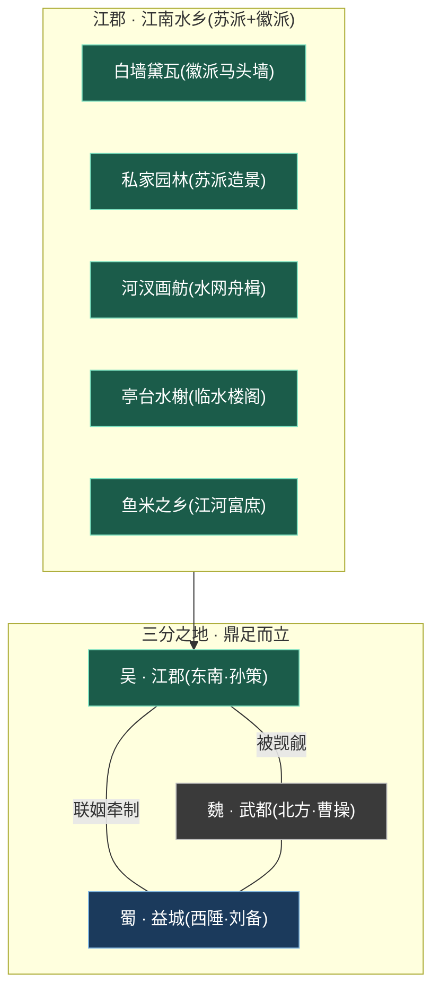
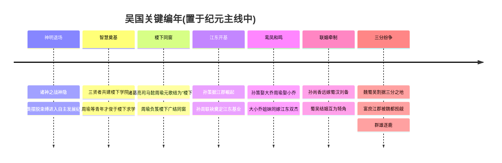
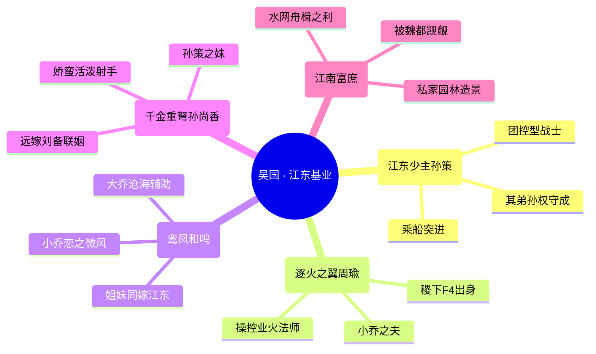
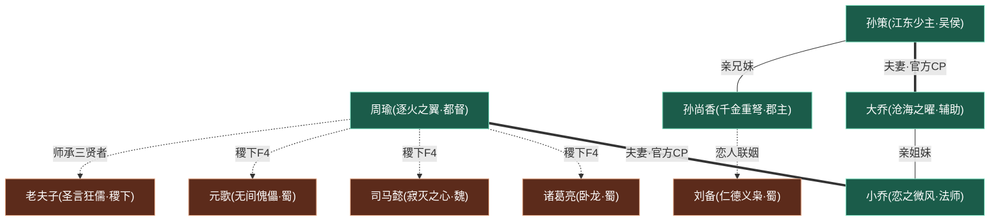

# 三分之地·吴国

三分之地江南水乡姻亲基业

> **江东基业 · 水网纵横 · 鸾凤和鸣** —— 三分之地中以江郡为核心的江南富庶之邦，小桥流水、舟楫帆影、私家园林，由「江东少主」[孙策](../heroes/sanfen-wu.md#孙策)与孙权兄弟统御，是三国鼎立里最以「家」立国、姻亲缠绵、却也最被北地枭雄觊觎的一方。

---

!!! abstract "阵营概述"
    **吴国**（亦称「吴」「东吴」），是[人类时代](../worldview/eras.md)「英雄逐鹿」纪元中，割据**三分之地**东南一隅的三大势力之一，以雄踞江南水乡的**江郡**为核心。在魏、蜀、吴三足鼎立的版图上，吴国是地貌最为温润、气质最为旖旎的一方——它不是灰墙石柱的肃杀魏都，也不是桃源侠义的山川蜀地，而是一片**水网纵横、舟楫往来、富庶得令人垂涎的江南**：白墙黛瓦的徽派马头墙与精巧雅致的苏派园林在此交融，画舫穿行于河汊之间，亭台水榭倒映在碧波之上，处处透着「上有天堂、下有江郡」的繁华与闲雅。

    然而，富庶是吴国的底气，也是它的原罪——正因「江河富庶」，北方的[魏都](../factions/sanfen-wei.md)始终对这片膏腴之地虎视眈眈、垂涎觊觎。统御这片土地的，是少年英气的**「江东少主」[孙策](../heroes/sanfen-wu.md#孙策)**与其弟孙权兄弟。与魏的「以力称雄」、蜀的「以义聚人」不同，吴国是一个**以「家」与「姻亲」立国**的势力：孙策娶[大乔](../heroes/sanfen-wu.md#大乔)、[周瑜](../heroes/sanfen-wu.md#周瑜)娶[小乔](../heroes/sanfen-wu.md#小乔)，大小乔为亲姐妹；孙策之妹[孙尚香](../heroes/sanfen-wu.md#孙尚香)又远嫁蜀国[刘备](../heroes/sanfen-shu.md#刘备)——一张由「孙、周、乔、刘」交织而成的姻亲之网，将这片江南水乡的命运牢牢系在一处。武有少主突进、文有逐火都督、内有沧海辅佐、外有重弩郡主，铁血与柔情、基业与情缘，在江郡的碧水画舫之间织成一卷「鸾凤和鸣、各守江东」的乱世情史。它不是最「强」的一方，却几乎是最「美」、最「缠绵」的一方。

## 阵营档案

| 档案项 | 内容 |
| :--- | :--- |
| **阵营名** | 三分之地·吴国（facId: `sanfen-wu`） |
| **别称** | 吴 / 东吴 |
| **地理位置** | 三分之地·江郡（江南水乡） |
| **所属大区** | 三分之地（navGroup：三分之地） |
| **主题风格** | 三国争霸 + 江南水乡 |
| **核心领袖** | [孙策](../heroes/sanfen-wu.md#孙策)（江东少主）· 孙权（其弟，幕后掌国）|
| **成员数** | 5 名英雄（本阵营名册收录） |
| **关键词** | 三国争霸 · 江南水乡 · 苏派徽派 · 江河富庶 · 私家园林 · 姻亲网 · 鸾凤和鸣 |

!!! info "一句话定位"
    以江郡为核心、江南水乡（苏派 + 徽派结合）、江河富庶、私家园林造景、被魏都觊觎的一方；由孙策 / 孙权统领，内含「孙—周—大乔—小乔」的姻亲网。（据 `sanfen-wu.json` 阵营摘要）

---

## 地理与环境

吴国坐落于**三分之地的东南方**，以都城**江郡**为核心。与魏国的武都（灰墙石柱、北地雄关）、蜀国的益城（山川险塞、世外桃源）相比，江郡呈现的是一派**水网纵横、舟楫帆影、私家园林**的温润江南气象——这里没有刀光剑影的肃杀，只有桨声灯影里的富庶与旖旎。

!!! info "江郡的视觉母题 · 一座水做的江南之城"
    吴国最鲜明的环境特征，是它**「苏派 + 徽派结合」**的江南建筑语言。徽派的**白墙黛瓦、马头墙**勾勒出错落有致的天际线，苏派的**私家园林、叠石理水**则在城中铺陈出无数精巧雅致的造景空间。江郡是一座**水做的城**：河汊纵横如脉络，画舫穿行其间，小桥连接两岸人家，亭台水榭临水而建，碧波倒映着粉墙花窗——整座城仿佛一幅会流动的江南水墨，处处昭示着「富庶」「闲雅」与「灵秀」的气质。它与魏都灰冷的石头世界恰成两极。

!!! tip "江河富庶 · 鱼米之乡的膏腴与隐忧"
    吴国「**江河富庶、私家园林造景精巧**」，是三分之地里最为殷实的鱼米之乡。纵横的水网既是舟楫之利、灌溉之源，也带来了富甲一方的繁华。然而这份富庶亦是隐忧之源——正因江南膏腴，雄踞北方、野心最炽的[魏都](../factions/sanfen-wei.md)始终对它**虎视眈眈、垂涎觊觎**。守护这份基业、不教富庶沦为他人案上鱼肉，正是吴国一代少主肩上的重担。

| 地标/要素 | 性质 | 关联 |
| :--- | :--- | :--- |
| 江郡 | 吴国核心都城、江南水乡中枢 | [孙策](../heroes/sanfen-wu.md#孙策)、孙权兄弟统御 |
| 白墙黛瓦 / 马头墙 | 徽派建筑母题、错落天际线 | 江郡视觉名片 |
| 私家园林 | 苏派造景、叠石理水的精巧雅境 | 「江河富庶」的具象 |
| 河汊画舫 | 水网舟楫、桨声灯影 | 江东「舟楫之利」 |
| 亭台水榭 | 临水楼阁、风雅胜景 | 大小乔等佳人意象之所(考据推测) |
| 鱼米之乡 | 富庶膏腴的经济根基 | 被魏都觊觎的根源 |

??? quote "环境闲笔 · 桨声灯影里的江郡(沉浸式叙事)"
    傍晚的江郡，最是动人。夕照沉入西边的河汊，画舫次第点起灯火，桨声欸乃，从一座小桥摇到另一座小桥。白墙黛瓦在暮色里化作一层淡墨，马头墙的轮廓被晚风吹得柔软。私家园林的叠石后传来隐约的弦歌——那或许是大乔在亭中抚琴，或许是小乔追着一阵微风跑过水榭。北地的铁骑离这里还很远，可所有人都知道，正因这片水乡太富、太美，它注定要被人惦记。守住这份「上有天堂、下有江郡」的安宁，便是江东少主与他的都督、他的佳人们，毕生要做的事。

---

## 历史沿革

吴国的故事，是[人类时代](../worldview/eras.md)「英雄逐鹿」纪元中，魏蜀吴三分天下篇章里东南一翼的核心叙事。在神明退场、人类自主发展的时代，群雄并起，最终演为魏、蜀、吴鼎足而立的格局，而吴国，正是凭「江东基业」与「姻亲之网」立身的一方。

### 渊源 · 神明退场后的逐鹿乱世

据[纪元编年](../worldview/eras.md)，神明在「诸神之战·神隐」后退出历史舞台，人类摆脱束缚，进入**自主发展文明、群雄并起**的纪元。这一「英雄逐鹿」时代的历史壳层，融合了战国、隋唐、三国等多重母题，而魏、蜀、吴三分之地的纷争，正是其中最具代表性的三国篇章。吴国，便诞生于这片群雄角力的江南舞台之上。

### 求学 · 稷下同窗与都督之路

在江东基业奠定之前，吴国未来的水军都督[周瑜](../heroes/sanfen-wu.md#周瑜)，曾有一段塑造其才学的青春岁月——他**出身[稷下学院](../factions/jixia.md)**，与[诸葛亮](../heroes/sanfen-shu.md#诸葛亮)、[司马懿](../heroes/sanfen-wei.md#司马懿)、[元歌](../heroes/sanfen-shu.md#元歌)同为「**稷下F4**」，是这座学府最负盛名的学生团体之一。

!!! quote "周瑜 · 逐火之翼"
    「业火燎原，焚尽来犯之敌。」

负笈稷下的求学经历，为周瑜日后成为吴国「逐火之翼」般的智将打下根基。他与诸葛亮、司马懿、元歌的同窗之谊，是日后三分之地烽烟中「各为其主」的伏笔之一——昔日同窗，今分属吴、蜀、魏三邦，于乱世中各展所学、隔江相搏。

!!! note "考据 · 「曾在稷下求学」≠「稷下阵营」"
    据世界观骨架，[周瑜](../heroes/sanfen-wu.md#周瑜)虽出身稷下、是「稷下F4」一员，但其**阵营归属仍为吴国**。同理，诸葛亮 / 元歌归蜀、司马懿归魏。稷下是他们「关系网」的渊源，却不改其各自的邦国立场——这正是「同窗各为其主」的乱世写照。

### 开基 · 孙周联袂，奠定江东

进入「英雄逐鹿」的主线，**[孙策](../heroes/sanfen-wu.md#孙策)据江郡崛起**，与挚交[周瑜](../heroes/sanfen-wu.md#周瑜)联袂，奠定了江东基业。少主之武勇与都督之智略相得益彰，使这片富庶的江南水乡在三分格局中站稳脚跟。孙策之弟**孙权**则继其后掌国——世界观将吴国领袖明确列为「孙策 / 孙权」兄弟二人，前者英气勃发立基业，后者沉稳守成续江东(考据：孙权暂无对应游戏英雄条目，以幕后领袖身份载入)。

### 联姻 · 鸾凤和鸣的姻亲之网

吴国最独特的立国底色，是一张缜密的**姻亲之网**。江东双杰各娶名门姐妹：**孙策娶[大乔](../heroes/sanfen-wu.md#大乔)、周瑜娶[小乔](../heroes/sanfen-wu.md#小乔)**，而大乔、小乔本是亲姐妹——一桩「双杰娶姐妹」的佳话，将君主与都督的命运缔结得密不可分。与此同时，孙策之妹[孙尚香](../heroes/sanfen-wu.md#孙尚香)**远嫁蜀国的[刘备](../heroes/sanfen-shu.md#刘备)**，又在吴、蜀之间架起一道联姻的桥梁，使两国互为犄角、彼此牵制。这张「孙—周—乔—刘」交织的关系网，既是吴国最温情的内核，也是它在三国博弈中最微妙的外交筹码。

### 鼎立 · 富庶江郡，魏都觊觎

进入三分鼎立的高潮，**[魏](../factions/sanfen-wei.md)（武都/[曹操](../heroes/sanfen-wei.md#曹操)）、[蜀](../factions/sanfen-shu.md)（益城/[刘备](../heroes/sanfen-shu.md#刘备)）、[吴](../factions/sanfen-wu.md)（江郡/[孙策](../heroes/sanfen-wu.md#孙策)）** 三国割据「三分之地」，攻伐与联姻交织。

在三分格局中，吴国凭借**江南水乡的富庶与舟楫之利**自成一极。它对北方野心最炽的魏国采取防御与周旋，对西陲的蜀国则以**孙尚香—刘备的联姻**互为奥援、彼此牵制。这场逐鹿，于吴国而言更像是一场「守土护家」的持久博弈——既要抵御魏都对膏腴江南的觊觎，又要在蜀吴联姻的微妙平衡中守住江东基业。

!!! info "考据 · 三国阵营的英雄分布"
    在本骨架的归类中，[蜀国](../factions/sanfen-shu.md)是英雄数量最多的阵营（12 名）；[魏国](../factions/sanfen-wei.md)收录 6 名、吴国 5 名。史实东吴群臣（如黄盖、甘宁、太史慈、孙权之武将等）在三国题材中虽广为人知，但世界观骨架未给出对应英雄条目，故本阵营花名册以游戏现有英雄为准；孙权以幕后领袖身份载入。(考据备注)

---

## 组织 / 理念 / 特色

吴国的精神内核，可以浓缩为一组关键词：**江东、基业、姻亲、富庶、柔韧**。它是一个以「家」立身的势力——以血缘与姻亲为纽带凝聚人心，以富庶江南为根基守土自保，刚柔并济、各守其位。

!!! note "理念一 · 江东基业，以家立国"
    吴国的灵魂，不在「力」也不在「义」，而在「**家**」。它以血缘与姻亲为最深的纽带：[孙策](../heroes/sanfen-wu.md#孙策)与孙权是兄弟，孙策与[孙尚香](../heroes/sanfen-wu.md#孙尚香)是兄妹，孙策娶[大乔](../heroes/sanfen-wu.md#大乔)、周瑜娶[小乔](../heroes/sanfen-wu.md#小乔)而大小乔为姐妹——整个阵营几乎就是一张由亲情、爱情、姻亲编织而成的「大家庭」。守护这份基业，于他们而言便是守护「家」。这种「以家立国」的气质，正是吴国区别于尚武魏国、仁义蜀国的精神标识。

!!! tip "理念二 · 富庶柔韧，守土周旋"
    若说魏以「力」称雄、蜀以「义」聚人，吴则以「**富**」立身、以「**韧**」守土。江南水乡的富庶是它的底气，舟楫之利与园林之雅是它的风骨。面对北方魏都的觊觎，吴国不以硬碰硬，而以防御、周旋与联姻化解危局——[孙尚香](../heroes/sanfen-wu.md#孙尚香)远嫁[刘备](../heroes/sanfen-shu.md#刘备)，正是这种「以柔克刚、借势牵制」的外交智慧的体现。

!!! warning "理念三 · 智略锋锐，业火逐敌"
    温润的江南，并非全无锋芒。水军都督[周瑜](../heroes/sanfen-wu.md#周瑜)「逐火之翼」，**操控业火、范围灼烧**，是吴国军事智略的锋锐化身。他出身稷下、位列「稷下F4」，以学府所授之才辅佐少主、抵御外侮。江东的柔与周瑜的烈、水乡的静与业火的炽，共同构成吴国「外柔内刚」的攻守底色。

!!! quote "理念四 · 鸾凤和鸣，情系江东"
    在乱世兵戈之间，吴国保有三分之地里最缠绵的柔情。孙策与大乔、周瑜与小乔，是两对「**官方CP + 情侣皮肤**」的鸾凤佳偶；大乔为队友设传送门、群体回城，更将「守护」从战场延伸到「带大家回家」的温情隐喻。这份「情系江东」的浪漫，让以「家」立国的吴国，成为三国阵营中情感色彩最为浓郁的一方。

| 特色维度 | 吴国的呈现 |
| :--- | :--- |
| **职业生态** | 战士少主（孙策）+ 双法师（周瑜、小乔）+ 战略辅助（大乔）+ 射手郡主（孙尚香），攻防均衡、机动灵活 |
| **君主气质** | 少主型——英气勃发、乘船突进，弟孙权沉稳守成 |
| **立国之本** | 江南富庶、舟楫之利、姻亲网凝聚、守土周旋 |
| **跨阵营纽带** | 与[蜀国](../factions/sanfen-shu.md)（孙尚香—刘备联姻）、[稷下学院](../factions/jixia.md)（周瑜「稷下F4」师承）深度交织 |

??? info "横向对照 · 三分之地三邦气质表(考据梳理)"
    | 维度 | [魏 · 武都](../factions/sanfen-wei.md) | [蜀 · 益城](../factions/sanfen-shu.md) | 吴 · 江郡 |
    | :--- | :--- | :--- | :--- |
    | 立国关键字 | 力（以力称雄） | 义（以义聚人） | 富 / 韧（以家立国） |
    | 视觉母题 | 灰墙石柱、北地雄关 | 山川险塞、世外桃源 | 白墙黛瓦、苏派园林、河汊画舫 |
    | 君主 | [曹操](../heroes/sanfen-wei.md#曹操)（魏武挥鞭） | [刘备](../heroes/sanfen-shu.md#刘备)（仁德义枭） | [孙策](../heroes/sanfen-wu.md#孙策)（江东少主）/ 孙权 |
    | 收录英雄数 | 6 名 | 12 名 | 5 名 |
    | 对吴态度 | 觊觎江南富庶、虎视眈眈 | 孙尚香—刘备联姻、互为犄角 | —— |

    注：三邦气质对照为基于世界观摘要的考据梳理，旨在凸显吴国在「力—义—富」三角中的独特定位。

---

## 核心人物

吴国的基业，系于一位少年君主与他身边的都督、佳人、郡主。以下为本阵营的灵魂人物小传。

### 孙策 · 江东少主

战士

[孙策](../heroes/sanfen-wu.md#孙策)，吴国的最高统御者，三分之地东南的少年霸主，世称「江东少主」「吴侯」。他英气勃发、武勇过人，与挚交[周瑜](../heroes/sanfen-wu.md#周瑜)联袂奠定江东基业，是这片富庶水乡的守护者。他是[大乔](../heroes/sanfen-wu.md#大乔)之夫、[孙尚香](../heroes/sanfen-wu.md#孙尚香)之兄——整张吴国姻亲网的核心枢纽。

在对局中，他是一名**「乘船突进」的团控型战士**：以战船切入战场、一锅端式团控敌方阵型，机制鲜明地呼应着「江东」「舟楫」的水乡母题与少主冲锋陷阵的英气。他是吴国「武力」与「基业」的化身。

### 周瑜 · 逐火之翼

法师

[周瑜](../heroes/sanfen-wu.md#周瑜)，吴国的水军都督，江东智略的锋锐化身，世称「逐火之翼」。他**出身[稷下学院](../factions/jixia.md)**，与[诸葛亮](../heroes/sanfen-shu.md#诸葛亮)、[司马懿](../heroes/sanfen-wei.md#司马懿)、[元歌](../heroes/sanfen-shu.md#元歌)并称「稷下F4」。学成归吴后，他辅佐少主孙策、抵御外侮，是吴国军事与谋略的双重支柱。他亦是[小乔](../heroes/sanfen-wu.md#小乔)之夫——其冷峻的性情，被小乔的天真烂漫所打动。

在对局中，他是一名**操控业火的范围灼烧法师**：以连绵的火焰持续灼烧敌阵，机制与「逐火之翼」的炽烈意象高度契合。他是吴国「外柔内刚」中那一抹最锋利的烈焰。

### 大乔 · 沧海之曜

辅助

[大乔](../heroes/sanfen-wu.md#大乔)，吴国的战略辅助，世称「沧海之曜」。她是[孙策](../heroes/sanfen-wu.md#孙策)之妻、[小乔](../heroes/sanfen-wu.md#小乔)之姐，江东姻亲网中温柔而关键的一环。她与孙策是史实夫妻、游戏沿用的官方CP，更有 520 情侣皮肤的浪漫见证。

在对局中，她是一位极具战略价值的辅助：能为队友**设置传送门、实现群体回城**——这一「带大家回家」的机制，正是其「守护江东」「情系家国」的温情隐喻。她将吴国「以家立国」的内核，演绎为战场上最实在的庇护。

### 小乔 · 恋之微风

法师

[小乔](../heroes/sanfen-wu.md#小乔)，吴国灵动的风系远程法师，世称「恋之微风」。她是[周瑜](../heroes/sanfen-wu.md#周瑜)之妻、[大乔](../heroes/sanfen-wu.md#大乔)之妹，性情天真烂漫——正是她的纯真，打动了冷峻的逐火都督周瑜。二人是史实夫妻、游戏官方CP，亦有情侣皮肤相伴。

在对局中，她是一名**灵动的风系远程法师**：以飘逸的风系技能游走输出，轻盈而致命，与「恋之微风」的清新意象相得益彰。她是吴国柔情底色里最明媚的一缕风。

### 孙尚香 · 千金重弩

射手

[孙尚香](../heroes/sanfen-wu.md#孙尚香)，吴国的郡主，世称「千金重弩」。她是[孙策](../heroes/sanfen-wu.md#孙策)之妹，娇蛮活泼、英姿飒爽，手持千金重弩冲锋陷阵。她**后远嫁蜀国的[刘备](../heroes/sanfen-shu.md#刘备)**——这桩史实联姻被游戏沿用，并有「天鹅之梦」等 520 CP 皮肤——由此在吴、蜀之间架起一道联姻的桥梁，成为三分之地姻亲网中最具外交分量的一环。

在对局中，她是一名**手持千金重弩冲锋的射手**：以娇蛮活泼的姿态强势输出、灵动走位。她既是吴国的郡主，也是蜀汉的夫人——一身系两国，是三国壁垒间难得的「跨阵营纽带」。

---

## 成员花名册

吴国是一个「少主为骨、都督为锋、佳人为韵、郡主为桥」的精巧阵营——五名英雄各司其职，又以姻亲血缘紧密相连，共同撑起三分之地东南的江东基业。

战士法师辅助射手

| 英雄 | 称号 | 定位 | 一句话身份 |
| :--- | :--- | :--- | :--- |
| [孙策](../heroes/sanfen-wu.md#孙策) | 江东少主 | 战士 | 与大乔CP的吴侯、孙尚香之兄，乘船突进的团控型战士。 |
| [周瑜](../heroes/sanfen-wu.md#周瑜) | 逐火之翼 | 法师 | 操控业火的范围灼烧法师、稷下F4出身，小乔之夫。 |
| [小乔](../heroes/sanfen-wu.md#小乔) | 恋之微风 | 法师 | 周瑜之妻、大乔之妹，灵动的风系远程法师。 |
| [大乔](../heroes/sanfen-wu.md#大乔) | 沧海之曜 | 辅助 | 孙策之妻、小乔之姐，能设传送门、群体回城的战略辅助。 |
| [孙尚香](../heroes/sanfen-wu.md#孙尚香) | 千金重弩 | 射手 | 吴国郡主、孙策之妹、后嫁刘备，娇蛮活泼手持千金重弩冲锋。 |

!!! tip "花名册速读 · 吴国的四股力量"
    - **江东武力线**：孙策（少主战士，乘船突进团控）——立基业、守江东。
    - **军事锋锐线**：周瑜（逐火都督，范围业火法师）——稷下F4，智略御敌。
    - **柔情守护线**：大乔（沧海辅助，传送回城）、小乔（恋之微风，风系法师）——鸾凤和鸣、情系江东。
    - **联姻外交线**：孙尚香（千金重弩，娇蛮射手）——嫁刘备，架起蜀吴之桥。

!!! note "阵容结构 · 一队成军的「全家桶」(考据观察)"
    五名英雄恰好覆盖战士、法师、辅助、射手四大职业（双法师配置），是一支天然可以「一队成军」的阵容：孙策开团、周瑜与小乔输出、大乔保护与回城、孙尚香持续输出。更妙的是，这五人之间几乎全是夫妻、姐妹、兄妹的关系——一支队伍，便是一个「家」。

---

## 阵营关系

吴国的关系网，是三分之地里最为缠绵缜密的一张——它几乎全由「夫妻」「姐妹」「兄妹」「联姻」等血缘与姻亲纽带织成，又借周瑜的稷下渊源向外延伸。以下基于世界观 `relatedRelationships` 梳理。

### 关系总览表

| 关系类型 | 关联人物 | 性质 | 说明 |
| :--- | :--- | :--- | :--- |
| 夫妻（官方CP） | [孙策](../heroes/sanfen-wu.md#孙策)·[大乔](../heroes/sanfen-wu.md#大乔) | 同阵营 · 情缘 | 历史夫妻，游戏沿用，有 520 情侣皮肤。 |
| 夫妻（官方CP） | [周瑜](../heroes/sanfen-wu.md#周瑜)·[小乔](../heroes/sanfen-wu.md#小乔) | 同阵营 · 情缘 | 历史夫妻；小乔以天真打动冷峻的周瑜，官方CP + 情侣皮肤。 |
| 亲姐妹 | [大乔](../heroes/sanfen-wu.md#大乔)·[小乔](../heroes/sanfen-wu.md#小乔) | 同阵营 · 血缘 | 史实姐妹，大乔嫁孙策、小乔嫁周瑜。 |
| 亲兄妹 | [孙策](../heroes/sanfen-wu.md#孙策)·[孙尚香](../heroes/sanfen-wu.md#孙尚香) | 同阵营 · 血缘 | 史实兄妹；孙尚香后嫁刘备，由此牵出整张姻亲网。 |
| 恋人（联姻） | [刘备](../heroes/sanfen-shu.md#刘备)·[孙尚香](../heroes/sanfen-wu.md#孙尚香) | 跨阵营 · 联姻 | 历史联姻，游戏沿用，有「天鹅之梦」等 520 CP 皮肤。 |
| 同窗团体（稷下F4） | [周瑜](../heroes/sanfen-wu.md#周瑜)·[诸葛亮](../heroes/sanfen-shu.md#诸葛亮)·[司马懿](../heroes/sanfen-wei.md#司马懿)·[元歌](../heroes/sanfen-shu.md#元歌) | 跨阵营 · 同窗 | 稷下学院最负盛名的学生团体，日后分赴吴、蜀、魏各为其主。 |
| 师承（创院三贤者→众弟子） | [老夫子](../heroes/jixia.md#老夫子)·[庄周](../heroes/penglai-donghai.md#庄周)·[墨子](../heroes/mojia-jiguan.md#墨子) → [周瑜](../heroes/sanfen-wu.md#周瑜) 等 | 跨阵营 · 师徒 | 稷下创院三贤者有教无类广收弟子；周瑜虽出身稷下，阵营仍归吴国。 |

!!! note "考据 · 「稷下F4」各为其主"
    [周瑜](../heroes/sanfen-wu.md#周瑜)是「稷下F4」中归属吴国的一员；同团体的[诸葛亮](../heroes/sanfen-shu.md#诸葛亮)、[元歌](../heroes/sanfen-shu.md#元歌)归蜀，[司马懿](../heroes/sanfen-wei.md#司马懿)（寂灭之心，法师/刺客）归魏。昔日的同窗之谊，在三分之地的烽烟中化作各为其主的对峙——周瑜以业火御敌、隔江相搏，正是这「同窗变敌国」的乱世注脚。

??? info "考据 · 稷下三贤者的庞大弟子谱(背景延伸)"
    据世界观 `relatedRelationships`，[老夫子](../heroes/jixia.md#老夫子)、[庄周](../heroes/penglai-donghai.md#庄周)、[墨子](../heroes/mojia-jiguan.md#墨子)三位稷下创院贤者「有教无类、广收弟子」，门下英才遍布列国——除周瑜外，尚有[诸葛亮](../heroes/sanfen-shu.md#诸葛亮)、[司马懿](../heroes/sanfen-wei.md#司马懿)、[元歌](../heroes/sanfen-shu.md#元歌)、[孙膑](../heroes/jixia.md#孙膑)、[钟无艳](../heroes/jixia.md#钟无艳)、[廉颇](../heroes/haojing-fengshen.md#廉颇)、[西施](../heroes/baiyue.md#西施)、[曜](../heroes/changan.md#曜)、[蒙犽](../heroes/yunzhong-modi.md#蒙犽)、[鲁班大师](../heroes/mojia-jiguan.md#鲁班大师)、[镜](../heroes/changan.md#镜)等。须注意：**「曾在稷下求学」不等于「稷下阵营英雄」**——周瑜阵营归吴，诸葛亮 / 元歌归蜀，司马懿归魏，各弟子最终散入各邦，稷下只是他们共同的渊源之地。

!!! quote "情缘焦点 · 江东双璧 · 二乔佳偶"
    吴国最为人称道的，是「双杰娶姐妹」的鸾凤佳话：孙策娶大乔、周瑜娶小乔，江东双璧与二乔佳人两两相配，史实与游戏皆成经典CP。这两段情缘不仅是吴国柔情的内核，更将君主与都督的命运缔结为一体——「家」与「国」，在江东从来不分彼此。

### 关系网络图

!!! info "图例说明"
    青绿节点为**吴国本阵营**人物，棕色节点为**跨阵营关联**人物。粗实线（`===`）表示阵营内夫妻/官方CP，细实线（`---`）表示阵营内血缘（姐妹/兄妹），虚线（`-.->`）表示跨阵营羁绊（联姻、同窗、师承）。跨阵营人物的英雄页位于各自阵营目录之下（如刘备、诸葛亮、元歌在 `../heroes/sanfen-shu.md`，司马懿在 `../heroes/sanfen-wei.md`，老夫子在 `../heroes/jixia.md`）。

---

## 相关剧情

吴国是「英雄逐鹿」时代东南舞台的核心，以下为与本阵营最紧密的几条故事线。

- :material-sword-cross: **魏蜀吴三分之地纷争**

    [孙策](../heroes/sanfen-wu.md#孙策)据江郡崛起，与[魏](../factions/sanfen-wei.md)（[曹操](../heroes/sanfen-wei.md#曹操)）、[蜀](../factions/sanfen-shu.md)（[刘备](../heroes/sanfen-shu.md#刘备)）割据三分之地。富庶江南被魏都觊觎，是群雄逐鹿的核心篇章。详见 [纪元编年](../worldview/eras.md)。

- :material-heart-multiple: **江东双璧 · 二乔佳偶**

    孙策娶[大乔](../heroes/sanfen-wu.md#大乔)、[周瑜](../heroes/sanfen-wu.md#周瑜)娶[小乔](../heroes/sanfen-wu.md#小乔)，江东双杰与二乔姐妹两两相配，是史实与游戏皆为经典的官方CP + 情侣皮肤。

- :material-ring: **跨阵营联姻 · 孙尚香嫁刘备**

    吴国郡主[孙尚香](../heroes/sanfen-wu.md#孙尚香)远嫁蜀国[刘备](../heroes/sanfen-shu.md#刘备)，「天鹅之梦」520 CP 皮肤，使蜀吴互为犄角、彼此牵制，是三分之地最重要的姻亲纽带。

- :material-account-switch: **稷下F4 · 各为其主**

    [周瑜](../heroes/sanfen-wu.md#周瑜)与[诸葛亮](../heroes/sanfen-shu.md#诸葛亮)、[司马懿](../heroes/sanfen-wei.md#司马懿)、[元歌](../heroes/sanfen-shu.md#元歌)同为「稷下F4」，自[稷下学院](../factions/jixia.md)毕业后分赴吴蜀魏，将同窗情谊化作三分之地的隔江对峙。

!!! example "剧情焦点 · 守土护家，柔中带烈"
    吴国剧情最动人的张力，不在攻城略地的雄心，而在「守土护家」的执着与「鸾凤和鸣」的柔情：少主乘船突进守江东，都督业火逐敌御外侮，大乔为队友开启回家的传送门，孙尚香以一桩联姻系起两国——而这一切的底色，是孙周二人与二乔佳人「双杰娶姐妹」的缠绵情史。天下三分，分的是疆土，吴国守的，却始终是一个「家」。

---

## 延伸阅读

- :material-account-star: **吴国英雄图鉴**

    本阵营全体英雄的档案、背景与台词，见 [吴国英雄页](../heroes/sanfen-wu.md)。

- :material-flag: **相邻阵营 · 蜀国**

    孙尚香—刘备联姻所系的姻亲之邦，见 [三分之地·蜀国](../factions/sanfen-shu.md)。

- :material-flag-variant: **相邻阵营 · 魏国**

    觊觎江南富庶的北方枭雄、周瑜稷下同窗司马懿所归之邦，见 [三分之地·魏国](../factions/sanfen-wei.md)。

- :material-school: **渊源之地 · 稷下学院**

    周瑜出身、「稷下F4」结缘的学府，见 [稷下学院](../factions/jixia.md)。

- :material-timeline-clock: **纪元编年**

    三分之地纷争置于完整纪元脉络之中，见 [纪元编年](../worldview/eras.md)。

- :material-clock-time-four: **世界观时间线**

    人类时代「英雄逐鹿」的事件序列，见 [世界观时间线](../worldview/timeline.md)。

- :material-map: **王者大陆地图**

    江郡与三分之地在大陆版图中的位置，见 [世界观地图](../worldview/map.md)。

- :material-vector-difference: **平行世界专题**

    破晓宇宙与各阵营英雄的平行投射，见 [平行世界](../topics/parallel-worlds.md)。

!!! quote "结语 · 江东少主，鸾凤守土"
    它是白墙黛瓦的温润，是私家园林的雅致，是江河富庶的膏腴，是舟楫画舫的灵秀——而在这一切江南柔情之下，是孙策乘船突进的少主英气，是周瑜业火逐敌的都督锋芒，是大乔为队友点亮的回家之门，是孙尚香一身系两国的联姻之重，更是「江东双璧、二乔佳偶」剪不断的缠绵情缘。**吴国，从来不是最「强」的一方，却是这逐鹿乱世中，最以「家」立国、最缠绵旖旎、也最让人想要去守护的一方江东之邦。**
