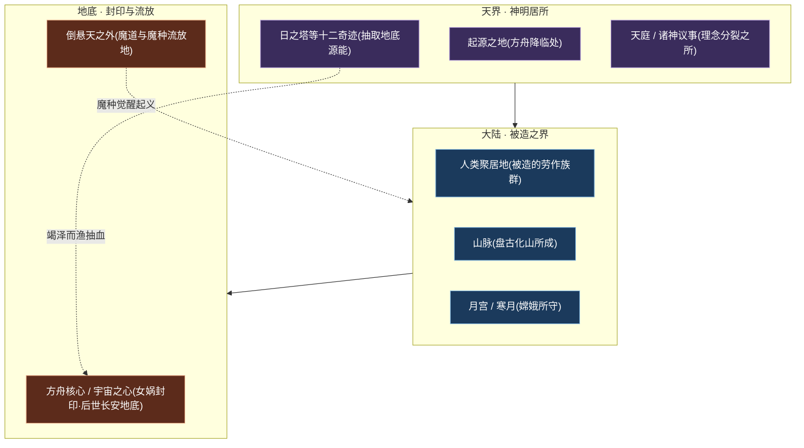
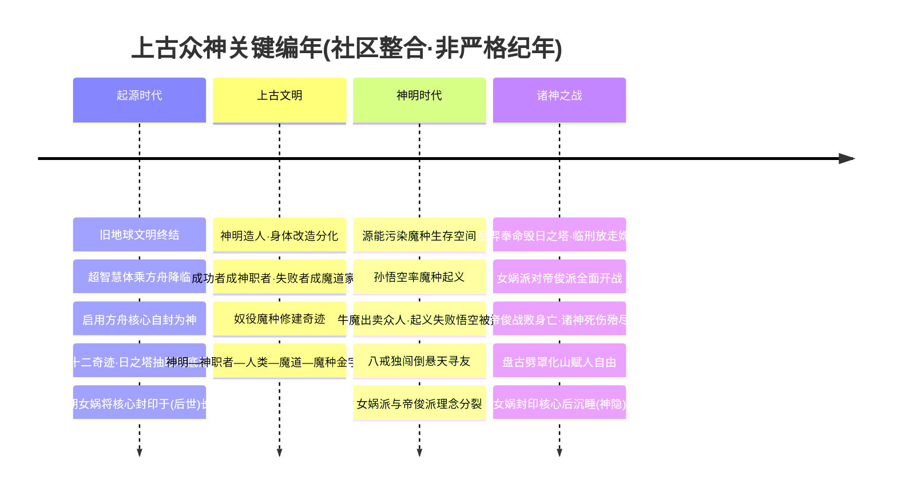
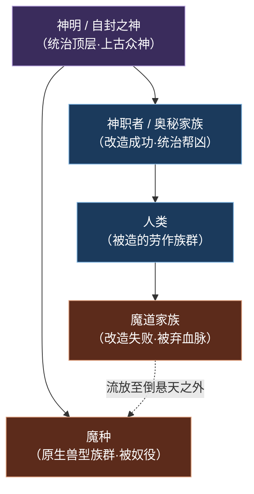
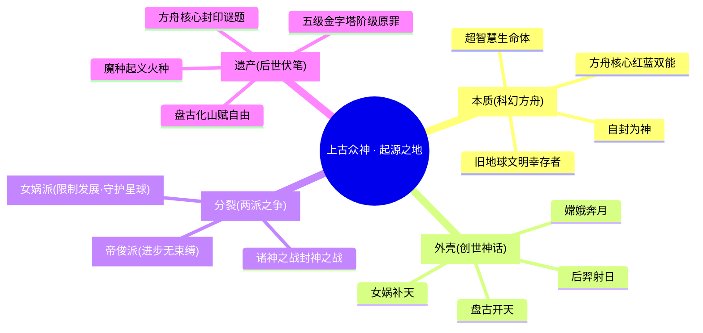
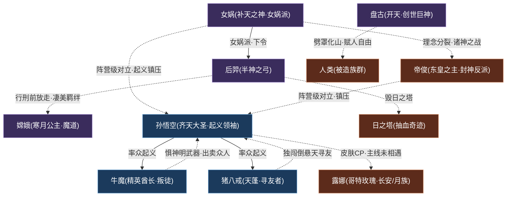

# 上古众神·神话

封神 · 众神创世神话科幻方舟

> **起源之地的降临者 · 创世神话与科幻方舟的双重外壳 · 后世一切冲突的源头** —— 他们并非天生的神，而是乘方舟而来、以方舟核心之力「自封为神」的超智慧生命体；他们的傲慢、分裂与抉择，写下了王者大陆最初也最终的史诗。

---

::: info 阵营概述
**上古众神·神话**（亦称「起源之地」「神明」）是王者大陆一切叙事的**源头**与**底层骨架**。其设定具有罕见的「**双重外壳**」：表层是我们熟悉的东方创世神话——女娲补天、盘古开天、后羿射日、嫦娥奔月；里层则是一套硬核科幻——遥远未来毁灭的**旧地球文明**，幸存者进化为**超智慧生命体**，乘巨型移民载具[方舟（Ark）](../worldview/overview.md)穿越深空，降临于蔚蓝的王者大陆，凭借远超原住民的力量**自封为神**，并启用方舟的动力枢纽**方舟核心（宇宙之心）**作为无限能源创世造物。

这群「神」并非铁板一块。围绕「**进步是否应受星球承载力的束缚**」这一根本分歧，上古众神分裂为两大阵营：以[女娲](#成员花名册)为首、主张限制发展、守护星球的**女娲派**，与以**帝俊**为首、主张「进步不应受任何束缚」的**帝俊派**（其封神具象叙事集中于[镐京·封神](../factions/haojing-fengshen.md)阵营）。这场分裂最终演为席卷诸神的**诸神之战（封神之战）**，结局是帝俊战败、诸神死伤殆尽、[盘古](#成员花名册)化山赋人以自由、[女娲](#成员花名册)封印方舟核心后沉睡——史称「**神隐**」。

本阵营聚居着**上古十大正神序列**与创世神、自然之灵、魔界君主等神话角色，亦收录了由神明压迫所催生的**魔种起义军**（孙悟空、牛魔、猪八戒）。可以说，从能量体系（红蓝双能）、社会结构（神明—神职者—人类—魔道—魔种五级金字塔）到核心谜题（方舟核心的封印与解封钥匙），后世数千年的恩怨情仇，皆可在「起源之地」找到第一颗种子。
:::

## 阵营档案

| 档案项 | 内容 |
| :--- | :--- |
| **阵营名** | 上古众神·神话（facId: `shanggu-shenhua`） |
| **别称** | 起源之地 / 神明 |
| **地理位置** | 起源之地（方舟降临处 · 世界观最底层的太古舞台） |
| **所属大区** | 封神 · 众神 |
| **主题风格** | 创世神话 + 科幻方舟双重外壳 |
| **核心领袖** | [女娲](#成员花名册)（补天之神 · 创世神明之首 · 封印方舟核心者） |
| **成员数** | 11 名英雄（本阵营名册收录） |
| **关键词** | 起源之地 · 方舟降临 · 自封为神 · 女娲派 vs 帝俊派 · 诸神之战 · 神隐 · 魔种起义 · 上古十大正神 |

---

## 地理与环境

「上古众神·神话」并不是一块可以在地图上标定经纬的疆域，而是一个**时间—空间双重意义上的「起源」**。它既指方舟降临、诸神立国的**起源之地**，也指那段神明君临、金字塔森严的**太古纪元**。它的地理，是后世一切地理的「母版」。

::: info 起源之地 · 创世的舞台
据[纪元编年](../worldview/eras.md)，**起源时代**，超智慧体乘方舟降临于一颗蔚蓝星球（王者大陆），以方舟核心创世造物，并建造起横贯大陆的**十二奇迹**，其中以**日之塔**为代表。日之塔昼夜不息地抽取王者大陆的**地底源能（星球之血）**为新文明供能——这种「竭泽而渔」式的开采，从一开始就埋下了星球反噬的祸根。起源之地，便是这一切的零点。
:::

::: tip 神话外壳下的科幻地标
上古众神的诸多「神话场景」，在双重外壳设定下都有科幻对位的暗示：

- **天庭 / 神明居所** ↔ 方舟降临者的统治中枢；
- **十二奇迹 / 日之塔** ↔ 抽取星球能量的巨型工程设施；
- **月宫 / 寒月** ↔ [嫦娥](#成员花名册)所守的月亮与寒月公主的归宿；
- **盘古所化的山脉** ↔ 创世神以己身重塑大陆地貌的具象；
- **倒悬天之外** ↔ 改造失败的魔道家族与原生魔种的流放之地。
:::

| 地标 / 空间 | 性质 | 关联人物 / 事件 |
| :--- | :--- | :--- |
| 起源之地 | 方舟降临、诸神立国的零点 | 全体上古众神 |
| 日之塔（十二奇迹） | 抽取地底源能的能量奇迹 | [后羿](#成员花名册)奉命毁日之塔 |
| 方舟核心 / 宇宙之心 | 红蓝双能的创世引擎 | [女娲](#成员花名册)封印于（后世）长安地底 |
| 盘古所化山脉 | 创世神化身的地貌 | [盘古](#成员花名册)劈罩化山 |
| 月宫 / 寒月、沉海 | 月之守护与归宿 | [嫦娥](#成员花名册)随月光沉海 |
| 倒悬天之外 | 魔道 / 魔种的流放混居地 | [孙悟空](#成员花名册)、[牛魔](#成员花名册)、[猪八戒](#成员花名册) |

---

## 历史沿革

上古众神的历史，几乎就是[纪元编年](../worldview/eras.md)前三个纪元（起源时代 → 上古文明 → 神明 / 封神时代）的浓缩。它从「降临立国」起笔，经「金字塔鼎盛」，终于「诸神之战与神隐」——一部由傲慢走向毁灭、又在毁灭中孕育自由的史诗。

### 起源 · 降临与封印

据[纪元编年](../worldview/eras.md)，遥远未来的**旧地球文明**因科技失控而毁灭，少数幸存者进化为**超智慧生命体**，携带人类基因与文明能量，乘方舟穿越深空，降临王者大陆。他们凭力量**自封为神**，启用**方舟核心（宇宙之心）**——内蕴**红色能量（毁灭）**与**蓝色能量（创造）**的创世引擎——作无限能源，创造生命、建造十二奇迹。这是上古众神的「立国之始」。

::: warning 原罪伏笔 · 日之塔抽血
十二奇迹之首的**日之塔**，昼夜不息地抽取王者大陆的**地底源能（星球之血）**。这种竭泽而渔的能量开采，是后世星球反噬、诸神相残乃至「永恒黑夜」危机的**根本因果链起点**。神明的繁荣，自始便建立在透支星球的原罪之上。
:::

### 鼎盛 · 金字塔成型

进入**上古文明 / 起源鼎盛期**，诸神以方舟核心创造**人类**，并从人类中选拔进行**身体改造**：

改造成功者升为**神职者（奥秘家族）**，成为神明的统治帮凶；改造失败者沦为**魔道家族**，被弃血脉、流放至倒悬天之外；原生兽型的**魔种**——王者大陆真正的原住民——则被蔑为「低贱者」，以武力奴役、强迫修建奇迹。**神明—神职者—人类—魔道—魔种**的五级金字塔由此固化。辉煌之下，矛盾正在日之塔的阴影里悄然积累。

### 总爆发 · 两场大战

神明 / 封神时代是主世界线最剧烈的转折，由两场因果递进的大战构成：

::: info 第一场 · 魔种起义
受星球之血 / 源能感染的魔种觉醒了自我意识。诸神过度采集能量、污染了劳力者的生存空间，[孙悟空](#成员花名册)遂率众起义，[猪八戒](#成员花名册)、[牛魔](#成员花名册)等魔种响应。然而[牛魔](#成员花名册)因惧怕神明的武器而**出卖众人**，致起义溃败；神明以**元气炮**轰营，[孙悟空](#成员花名册)被擒，[猪八戒](#成员花名册)独闯**倒悬天**寻友。这是被压迫者第一次、也是失败的一次觉醒。
:::

::: info 第二场 · 诸神之战（封神之战）
[女娲](#成员花名册)目睹星球反噬之兆，主张限制超出星球承载力的发展，派[后羿](#成员花名册)关闭 / 摧毁受污染的**日之塔**；而以**帝俊**为首的一派则主张「进步不应受任何束缚」。理念之争升级为全面战争。这场战争在游戏叙事中以《封神演义》为原型**具象化**，其核心角色集中于[镐京·封神](../factions/haojing-fengshen.md)阵营（[帝俊](../heroes/haojing-fengshen.md#帝俊)、[妲己](../heroes/haojing-fengshen.md#妲己)、[姜子牙](../heroes/haojing-fengshen.md#姜子牙)、[杨戬](../heroes/haojing-fengshen.md#杨戬)、[哪吒](../heroes/haojing-fengshen.md#哪吒)等）。
:::

### 终局 · 神隐

::: quote 女娲 · 补天之神
「我看见星球的伤口，在日之塔下汩汩流血。若进步以毁灭为代价，那我宁愿封印这一切，沉睡千年。」
:::

诸神之战的结局，是上古众神时代的落幕：

- **帝俊战败身亡**，诸神死伤殆尽；
- [盘古](#成员花名册)对人类生情，**劈开束缚人类的保护罩**赋予自由，随后**化为山脉**；
- [女娲](#成员花名册)以最后的力量**封印方舟核心**，将解封钥匙分藏于十二奇迹之中，而后沉睡。

这便是「**神隐**」——神明从历史舞台集体退场。此后约三千年（考据推测），王者大陆进入无神的[人类时代](../worldview/eras.md)。上古众神虽退场，却把「方舟核心的封印谜题」「红蓝能量母题」「五级金字塔的阶级原罪」一并留给了后世，成为[长安城](../factions/changan.md)方舟之秘、魔道血脉悲歌、峡谷文明能量等一切故事的伏笔。

---

## 组织 / 理念 / 特色

上古众神的「组织」，本质上是一场关于**力量、进步与代价**的理念辩论。它最深刻的特色，是「**双重外壳**」——把硬核科幻包裹进人人熟知的东方神话之中。

::: info 理念一 · 双重外壳，神话即科幻
本阵营最大的设定魅力，在于「**创世神话 + 科幻方舟**」的叠合：女娲不只是抟土造人的创世女神，更是封印方舟核心、限制发展的「补天之神」；盘古不只是开天辟地的巨神，更是劈开束缚人类的保护罩、赋人以自由的解放者；后羿射日，射的其实是抽取星球之血的「日之塔」。**每一则神话，都是一段科幻史的诗意转译。**
:::

::: warning 理念二 · 女娲派 vs 帝俊派——进步的边界之争
上古众神的核心分裂，是一场关于「**进步是否应受束缚**」的路线斗争：

| 派系 | 领袖 | 主张 | 结局 |
| :--- | :--- | :--- | :--- |
| **女娲派** | [女娲](#成员花名册) | 星球承载力有限，应限制超出极限的发展、关闭日之塔 | 惨胜后封印核心、神隐沉睡 |
| **帝俊派** | [帝俊](../heroes/haojing-fengshen.md#帝俊) | 进步不应受任何束缚 | 帝俊战败身亡，诸神死伤殆尽 |

这场辩论没有真正的赢家——它以诸神的集体毁灭收场，却也以盘古化山、赋人自由的方式，为「人类时代」腾出了舞台。
:::

::: tip 理念三 · 压迫与觉醒——魔种起义的火种
上古众神既是创世者，也是压迫者。五级金字塔顶端的诸神，奴役底层魔种修建奇迹、污染其生存空间，终于点燃了[孙悟空](#成员花名册)率领的**魔种起义**。这是王者世界观中「被造者反抗造物主」母题的源头——尽管首次起义因[牛魔](#成员花名册)的背叛而失败，但「反抗」的火种从此再未熄灭。
:::

| 特色维度 | 上古众神的呈现 |
| :--- | :--- |
| **设定地位** | 后世一切冲突的源头、世界观最底层骨架 |
| **职业生态** | 横跨全部六大定位（坦克 / 战士 / 刺客 / 法师 / 射手 / 辅助），是「神话英雄」的集散地 |
| **英雄来源** | 创世神话（女娲、盘古、后羿、嫦娥）、西游 / 魔种（孙悟空、牛魔、猪八戒）、希腊神话（雅典娜）、自然 / 姻缘之灵（艾琳、少司缘）兼容并蓄 |
| **跨外壳张力** | 神话角色与科幻设定共生，神职者后裔网络延伸至海都、长安等后世阵营 |
| **核心遗产** | 方舟核心封印、红蓝能量、阶级金字塔、十二奇迹钥匙——后世争夺的终极焦点 |

---

## 核心人物

上古众神的传奇，系于创世神明之首——**女娲**。她既是创世者，也是封印者；既是诸神之战的胜方，也是「神隐」的发起者。她的抉择，定义了整个阵营的命运基调。

### 女娲 · 补天之神

法师

[女娲](#成员花名册)，**创世神明之首**、女娲派领袖、**方舟核心的封印者**。在双重外壳的设定中，她既是东方神话里抟土造人、炼石补天的创世女神，更是这套科幻史诗中**守护星球、限制发展**的关键人物。当她目睹日之塔抽血、星球反噬之兆，她毅然主张关闭日之塔、限制超出承载力的发展，由此与主张「进步无束缚」的帝俊派决裂，引爆诸神之战。战后，她以最后的力量**封印方舟核心（宇宙之心）**，将解封钥匙分藏于十二奇迹之中，而后沉睡——这一封印，要到数千年后的《永远的长安城》事件才被层层揭开：原来后世繁华的[长安城](../factions/changan.md)，其真身正是当年被她封印的那艘方舟。

在对局中，[女娲](#成员花名册)是一名**切换法术形态的多段消耗法师**，可在不同形态间转换以适应战局，恰如其「补天」之名所暗示的、修补与塑造世界秩序的伟力。她是上古众神「守护与节制」一面的化身，也是连接「起源时代」与「人类时代」的命运之锚。

::: info 考据 · 女娲与「上古十大正神」
据世界观骨架，本阵营聚居着「上古十大正神序列」与创世神、自然之灵、魔界君主等神话角色，女娲位居创世神明之首。由于官方对「十大正神」的完整名单与序列长期边填坑边修订，本页不强行列举其全序列，仅以可玩英雄为骨干记述（其余序列归属属「(考据推测)」范畴）。
:::

::: quote 盘古 · 开天
「天地玄黄，宇宙洪荒——我以一斧，劈开混沌。」
（盘古「开天」的称号，呼应其劈开束缚人类的保护罩、赋人以自由、随后化为山脉的创世与解放意象。）
:::

---

## 成员花名册

上古众神·神话阵营，是「神话英雄」最为集中的舞台——创世神、半神、魔种起义者、希腊战神、自然与姻缘之灵济济一堂，几乎横跨了全部六大定位。

坦克/防御战士刺客法师射手辅助

| 英雄 | 称号 | 定位 | 一句话身份 |
| :--- | :--- | :--- | :--- |
| [女娲](../heroes/shanggu-shenhua.md#女娲) | 补天之神 | 法师 | 创世神明之首、封印方舟核心者，切换法术形态的多段消耗法师。 |
| [盘古](../heroes/shanggu-shenhua.md#盘古) | 开天 | 战士 | 开天辟地、劈开束缚人类的保护罩后化为山脉的巨神，持斧大范围团控的坦克型战士。 |
| [后羿](../heroes/shanggu-shenhua.md#后羿) | 半神之弓 | 射手 | 背负射日宿命的半神之弓手，奉女娲命毁日之塔、临刑放走嫦娥。 |
| [嫦娥](../heroes/shanggu-shenhua.md#嫦娥) | 寒月公主 | 法师 | 守护月亮、被后羿放走沉海的魔道公主，法力护盾流核心法师。 |
| [雅典娜](../heroes/shanggu-shenhua.md#雅典娜) | 智慧女神 | 战士/法师 | 圣骑士团女骑士，于遗迹中击败远古神明雅典娜残魂获其认可成为继承者，可全图复活突进的战神。 |
| [孙悟空](../heroes/shanggu-shenhua.md#孙悟空) | 齐天大圣 | 刺客/战士 | 魔种起义领袖，持金箍棒、可分身的爆发型刺客战士，永远冲在最前方。 |
| [牛魔](../heroes/shanggu-shenhua.md#牛魔) | 精英酋长 | 坦克/辅助 | 牛魔王，起义中因惧神明武器而出卖众人，开团顶飞、护盾保护后排的守护型坦辅。 |
| [猪八戒](../heroes/shanggu-shenhua.md#猪八戒) | 天蓬 | 坦克 | 魔种起义军一员，技能全程吸血、独闯倒悬天寻友的回血型坦克。 |
| [梦奇](../heroes/shanggu-shenhua.md#梦奇) | 食梦貘 | 坦克/战士 | 来自梦境、越胖越肉、以体重压制敌人、技能均可回血的奶肉坦克（关联帝俊背景）。 |
| [少司缘](../heroes/shanggu-shenhua.md#少司缘) | 赤诚月老 | 辅助 | 掌管姻缘的红线之神，兼具治疗、控制、位移的强力辅助。 |
| [艾琳](../heroes/shanggu-shenhua.md#艾琳) | 圣灵之弓 | 射手 | 自然之灵守护者，主打法术伤害的特殊射手（光环箭矢）。 |

::: tip 花名册速读 · 上古众神的四股血脉
- **创世 / 半神线**：[女娲](#成员花名册)、[盘古](#成员花名册)、[后羿](#成员花名册)、[嫦娥](#成员花名册)——女娲补天、盘古开天、后羿射日、嫦娥奔月的「四大母题」。
- **魔种起义线**：[孙悟空](#成员花名册)、[牛魔](#成员花名册)、[猪八戒](#成员花名册)——被压迫者的觉醒、背叛与寻友，西游母题的源头。
- **异域神话线**：[雅典娜](#成员花名册)——希腊战神残魂的继承者，跨文化神话的并入。
- **自然 / 姻缘之灵线**：[艾琳](#成员花名册)（自然之灵）、[少司缘](#成员花名册)（姻缘红线之神）、[梦奇](#成员花名册)（梦境食梦貘，关联帝俊）——掌管自然、姻缘、梦境的灵性存在。
:::

::: info 考据 · 梦奇的「帝俊背景」
[梦奇](#成员花名册)作为「来自梦境的食梦貘」，其背景设定关联帝俊（封神反派天帝）。由于本阵营骨架将其收录于「上古众神·神话」名册，故在此记述；其与[帝俊](../heroes/haojing-fengshen.md#帝俊)及[镐京·封神](../factions/haojing-fengshen.md)阵营的具体关联线，属「(考据推测)」范畴，详情以官方剧情为准。
:::

---

## 阵营关系

上古众神的关系网，最鲜明的特征是「**世界观级别的对立**」——魔种起义军对神明的反抗，构成了一条贯穿数个纪元的「起义—镇压」主轴。此外，本阵营也拥有数对脍炙人口、却往往「主线未相守」的皮肤 CP。

### 关系总览表

| 关系类型 | 关联人物 | 性质 | 说明 |
| :--- | :--- | :--- | :--- |
| 起义—镇压（阵营级对立） | [孙悟空](#成员花名册)·[牛魔](#成员花名册)·[猪八戒](#成员花名册)·[帝俊](../heroes/haojing-fengshen.md#帝俊)·[女娲](#成员花名册) | 阵营级 · 对立 | 诸神过度采集能量污染劳力者生存空间，孙悟空率魔种起义；牛魔因惧神明武器出卖众人致起义溃败，神明以元气炮轰营，悟空被擒，八戒独闯倒悬天寻友。 |
| 皮肤 CP（剧情时间错位） | [后羿](#成员花名册)·[嫦娥](#成员花名册) | 同阵营 · 凄美羁绊 | 神职者后羿奉命处决魔道公主嫦娥，行刑前放走她，濒死嫦娥随月光沉海。情人节皮肤浪漫化，但主线多为前世羁绊 / 梦中邂逅，并非在世相守。 |
| 皮肤 CP（主线未相遇） | [孙悟空](#成员花名册)·[露娜](../heroes/changan.md#露娜) | 跨阵营 · 皮肤钦定 | 灵感取自《大话西游》（至尊宝×紫霞），有两套情侣皮肤；但主线中悟空起义失败被镇压千年、西行取经，露娜一直寻兄，二人从未相遇、无直接感情线——属皮肤钦定 CP 而非剧情 CP。 |

::: warning 阵营级主轴 · 起义—镇压
「起义—镇压」并非两个英雄之间的私人恩怨，而是**被压迫者与统治者**之间的阶级对立，横跨[孙悟空](#成员花名册)、[牛魔](#成员花名册)、[猪八戒](#成员花名册)（魔种起义军）与[女娲](#成员花名册)、[帝俊](../heroes/haojing-fengshen.md#帝俊)（神明阵营）两端。它是王者世界观「被造者反抗造物主」母题的源头，其失败（因牛魔背叛）也为后世埋下了更深的怨结。
:::

::: info 考据 · 两对皮肤 CP 的「错位」本质
本阵营的两对著名 CP，都存在「**情感设定 ≠ 主线相守**」的错位：

- **后羿×嫦娥**：行刑—放走—沉海的凄美底色，被情人节皮肤浪漫化，但主线多为前世羁绊或梦中邂逅；
- **孙悟空×露娜**：取材《大话西游》的「钦定 CP」，主线中二人从未相遇（悟空被镇压千年、露娜一直寻兄）。

阅读时宜区分「皮肤层」的浪漫与「主线层」的实情。
:::

### 关系网络图

::: info 图例说明
紫色节点为**创世 / 神明**人物，深蓝节点为**魔种起义军**人物，棕色节点为**跨阵营关联**或**关键事物**（帝俊、露娜、日之塔等）。实线表示阵营内统属 / 率领关系，虚线表示对立、背叛、放走、CP 等张力性关系。其中[帝俊](../heroes/haojing-fengshen.md#帝俊)归[镐京·封神](../factions/haojing-fengshen.md)，[露娜](../heroes/changan.md#露娜)归[长安城](../factions/changan.md)。
:::

---

## 相关剧情

上古众神是世界观最底层的剧情舞台，以下为与本阵营最紧密的几条故事线。

<a class="hok-card" href="../worldview/eras">创世四母题女娲补天、开天、射日、奔月——四则东方神话母题，在「双重外壳」下被转译为方舟降临、劈罩赋自由、毁日之塔、守月沉海的科幻史诗。详见 。</a>
<a class="hok-card" href="../factions/haojing-fengshen">诸神之战 / 神隐派与派围绕「进步是否应受束缚」全面开战，帝俊战败、诸神死伤殆尽，盘古化山、女娲封印核心后沉睡，史称「神隐」。其封神具象叙事详见 。</a>
<a class="hok-card" href="../heroes/shanggu-shenhua#猪八戒">魔种起义率、等魔种反抗神明压迫，因牛魔出卖而溃败，悟空被擒、八戒独闯倒悬天寻友——「被造者反抗造物主」母题的源头。</a>
<a class="hok-card" href="../worldview/overview">方舟核心的封印谜题将方舟核心封印于（后世）地底、钥匙分藏十二奇迹，这一谜题在《永远的长安城》事件中被揭开。详见 。</a>

::: info 剧情焦点 · 源头即终点
上古众神之所以是「后世一切冲突的源头」，在于它一次性埋下了**三大核心伏笔**：能量上的**红蓝双能与日之塔原罪**、社会上的**五级金字塔阶级压迫**、谜题上的**方舟核心封印与钥匙散落**。数千年后，[长安城](../factions/changan.md)的方舟之秘、[魔道·暗影·深渊](../factions/modao-shadow-abyss.md)的悲情血脉、王者峡谷的能量文明，乃至《王者荣耀世界》的灭世之战，无一不在回应起源之地的第一声惊雷。**起源，即是终点的预言。**
:::

---

## 延伸阅读

<a class="hok-card" href="../heroes/shanggu-shenhua">上古众神英雄图鉴本阵营全体英雄的档案、背景与台词，见 。</a>
<a class="hok-card" href="../worldview/eras">纪元编年起源时代、上古文明、神明 / 封神时代的完整脉络，见 。</a>
<a class="hok-card" href="../worldview/overview">世界观总览方舟、方舟核心、十二奇迹、红蓝能量、五级金字塔的底层骨架，见 。</a>
<a class="hok-card" href="../worldview/concepts">核心概念源能、原初之息、神职者、魔种等关键设定释义，见 。</a>
<a class="hok-card" href="../factions/haojing-fengshen">相邻阵营 · 镐京·封神诸神之战的封神具象舞台（帝俊派核心），见 。</a>
<a class="hok-card" href="../factions/changan">下游焦点 · 长安城女娲封印方舟核心、神隐之后崛起的帝国中枢，见 。</a>
<a class="hok-card" href="../relationships/lovers">专题 · 恋人羁绊后羿×嫦娥、孙悟空×露娜等 CP 的考据，见 。</a>
<a class="hok-card" href="../relationships/index">人物关系总览以关系网读懂神话群英的恩怨情仇，见 。</a>

::: quote 结语 · 神隐之后
他们曾以为自己是神。乘方舟而来，以宇宙之心创世，以日之塔抽血，以金字塔压迫——直到星球流血、魔种起义、诸神相残。盘古劈开了束缚人类的保护罩，把自由留给了大地；女娲封印了那枚毁灭与创造交织的核心，把谜题留给了千年之后。当最后一位神明沉睡，「神隐」降临，人类的纪元才真正开始。**而起源之地埋下的每一颗种子，仍在峡谷的风里，等待破土。**
:::