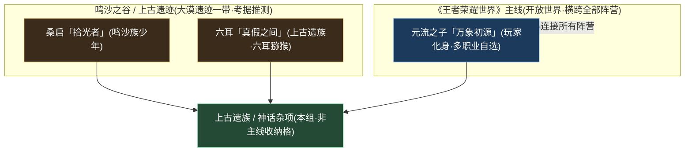
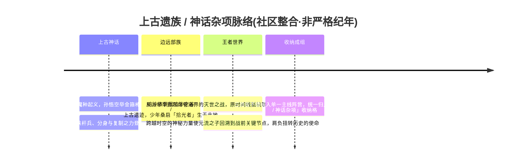
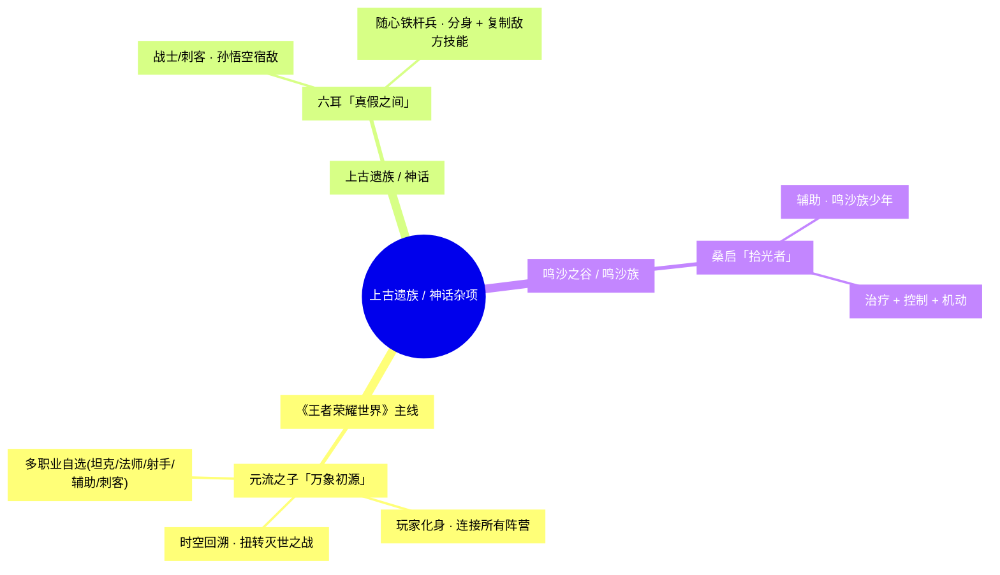
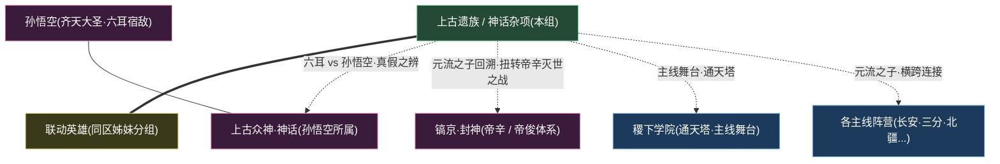

# 上古遗族 / 神话杂项与多职业

联动 · 其他上古遗族多职业自选玩家化身

> **不属于任何一座城、一个国、一支军，却又横跨全部疆界的「特殊收纳格」 · 这里站着王者首位多职业自选英雄、孙悟空的真假宿敌、鸣沙之谷的拾光少年** —— 当一名角色既非长安臣属、亦非三分诸侯，既不奉镐京神谕、又不投江湖侠义，世界观便为他们留出了一格「**杂项**」。本组所收，正是这些不易归入单一主线阵营的神话 / 上古遗族角色；而它最特殊的一员——**元流之子**，则是玩家自身的化身，是连接所有阵营、回溯灭世之战的那一道「初源之光」。

---

::: info 阵营概述
**上古遗族 / 神话杂项与多职业**（facId: `yuanchu-shenhua-misc`，亦称「**神话遗族 / 玩家化身**」组）并非王者大陆地图上的一块整土，而是一个**编者层面的「神话杂项收纳格」**。它隶属「**联动 · 其他**」大区，与同区的[联动英雄](../factions/liandong-snk.md)（客座英雄）并列，是整套世界观体系中最特殊的两个「非主线收纳格」之一。

与「联动英雄」那种「**来自别处**」的客座定位不同，本组成员并非跨 IP 而来，而是**确确实实生于王者世界观、却不便编入任何单一主线阵营**的角色：他们或是上古神话的遗族（孙悟空的宿敌[六耳](../heroes/yuanchu-shenhua-misc.md#六耳)），或是边远部族的少年（鸣沙之谷的[桑启](../heroes/yuanchu-shenhua-misc.md#桑启)），或是横跨全部阵营、不归属任何一方的「玩家化身」（首位多职业自选英雄[元流之子](../heroes/yuanchu-shenhua-misc.md#元流之子)）。

本组在地理上对应**鸣沙之谷 / 上古遗迹**一带，主题落在「**上古遗族 + 多职业自选 + 玩家化身**」三个关键词上。其中最核心的一员元流之子，是开放世界游戏《王者荣耀世界》（2026 年 4 月公测）的主人公——他站在「主线」与「平行」的交汇点上，以「时空回溯」之力回到灭世之战爆发之前，肩负扭转历史的使命。也正因如此，本组虽小，却是**连接整张世界观地图的一个枢纽节点**。

理解本组最贴切的方式，不是把它当作一座有疆界、有君主的城邦，而是把它当作鸣沙之谷里一处「**上古遗迹**」——风沙之下，埋着真假之辨的猴王宿命、拾光少年的少年心事，以及那个属于「你」、能改写世界结局的初源化身。
:::

## 阵营档案

| 档案项 | 内容 |
| :--- | :--- |
| **阵营名** | 上古遗族 / 神话杂项与多职业（facId: `yuanchu-shenhua-misc`） |
| **别称** | 神话遗族 / 玩家化身 |
| **地理位置** | 鸣沙之谷 / 上古遗迹 / 王者世界主线 |
| **所属大区** | 联动 · 其他 |
| **主题风格** | 上古遗族 + 多职业自选 + 玩家化身 |
| **核心领袖** | 无明确领袖（`leadership` 为空数组；本组为非主线收纳分组，群体无统一统御者，详见[核心人物](#核心人物)） |
| **成员数** | 3 名英雄（[元流之子](#成员花名册) · [六耳](#成员花名册) · [桑启](#成员花名册)） |
| **关键词** | 上古遗族 · 鸣沙之谷 · 多职业自选 · 玩家化身 · 元流之子 · 时空回溯 · 灭世之战 · 万象初源 · 六耳猕猴 · 真假美猴王 · 随心铁杆兵 · 鸣沙族 · 拾光者 · 非主线阵营 |

::: info 档案说明 · 为什么是「杂项」而非「阵营」
`yuanchu-shenhua-misc.json` 的 `leadership` 与 `relatedRelationships` 字段均为空数组，`location` 标注为「鸣沙之谷 / 上古遗迹 / 王者世界主线」，`theme` 为「上古遗族 + 多职业自选 + 玩家化身」。这意味着本组**不是**一个有君主、有都城、有军制的传统阵营，而是一个**功能性的收纳分组**——专门安置那些「生于王者、却不便归入单一主线阵营」的角色。下文「核心人物」「阵营关系」等章节将据此作「杂项视角」的特殊处理，凡涉及具体主线衔接的设定均以「（考据推测）」标注。
:::

---

## 地理与环境

本组在地理上有一处相对明确的落点——**鸣沙之谷 / 上古遗迹**，但它同时又延伸到一个「无处不在」的维度：开放世界主线《王者荣耀世界》。前者是鸣沙族少年[桑启](#成员花名册)的故土与[六耳](#成员花名册)所属的上古遗族背景，后者则是[元流之子](#成员花名册)作为玩家化身横跨全部阵营的活动舞台。

::: info 地理定位 · 鸣沙之谷 / 上古遗迹
据[世界观地图](../worldview/map.md)，**鸣沙之谷**是鸣沙族的故土，位于**大漠遗迹一带**（考据推测），承载着不易归入单一主线阵营的神话 / 上古遗族角色。它与[云中漠地](../factions/yunzhong-modi.md)、[长城守卫军](../factions/changcheng.md)所处的北疆—大漠地带相邻，是大陆边远部族圈层的一部分。需要说明的是，本组的「地理」并不像长安、三分那样是一块界限分明的国土，而更像一处散落在大漠与遗迹间的「遗族聚居地 + 主线舞台」的叠加态。
:::

::: tip 三员之乡 · 来处与气质对照
本组三位成员的「来处」与气质各不相同，却共享「**不入主线编制**」的底色：

| 英雄 | 所属背景 | 故乡 / 舞台气质 | 落脚后的母题 |
| :--- | :--- | :--- | :--- |
| [元流之子](#成员花名册) | 《王者荣耀世界》主线 | 横跨全部阵营的开放世界，初源与回溯 | 玩家化身、扭转灭世之战的「万象初源」 |
| [六耳](#成员花名册) | 上古遗族 / 神话 | 真假难辨的猴王宿命，与齐天大圣互为镜像 | 复制与分身、真假之辨的「假美猴王」 |
| [桑启](#成员花名册) | 鸣沙之谷 / 鸣沙族 | 风沙之谷里的少年心事，拾取流光 | 治疗、控制与机动兼备的「拾光者」少年 |
:::

::: warning 环境基调 · 「杂」即是底色
与长安的「中枢宫城」、三分的「群雄逐鹿」不同，本组没有一种统一的环境基调——它的「环境」恰恰是**多种异质背景的并置**：大漠遗迹的风沙、上古神话的真假之争、开放世界主线的宏大叙事，被同一个「杂项格」并排收纳。这种「**杂即底色**」的特质，正是「神话杂项收纳格」区别于一切主线阵营的根本气质（考据推测，依据 `theme = 上古遗族 + 多职业自选 + 玩家化身` 推演）。
:::

---

## 历史沿革

本组的「历史」不是一部国族兴亡史，而是一部**收纳史 + 主线史**的叠合——它记录的是这些角色「**从何而来、为何入此格、又如何牵动整张世界观**」。其中元流之子一支，更直接承接了贯穿王者世界观三千年的「神魔之争」母题。

::: info 与世界观纪元的关系 · 一个「枢纽」而非「断代」
[纪元编年](../worldview/eras.md)将王者世界观分为「主世界线」（起源 → 上古 → 神明/封神 → 人类/逐鹿 → 峡谷文明）与「平行 / 回溯」两类。本组成员**横跨多个时代层**：[六耳](#成员花名册)的真假之争根植于上古神话的「魔种起义」语境，[桑启](#成员花名册)属边远部族的当代叙事，而[元流之子](#成员花名册)则站在「主线」与「平行 / 回溯」的交汇点——《王者荣耀世界》既深植于主世界线的核心设定（方舟核心、魔种入侵、帝辛 / 帝俊体系），又通过「时空回溯」内嵌了「原时间线 vs 被改写时间线」的分叉结构，因而被归入平行 / 回溯类（详见[专题 · 平行时空](../topics/parallel-worlds.md)）。
:::

::: quote 对照 · 真假之辨与初源之光
> 「一棒打碎神明的天梯，一杆复刻对手的招式——金箍棒与随心铁杆兵的相击，是『谁才是真的』这一千古之问的具象。而当帝辛的灭世之火吞没了原来的结局，一道初源之光逆着时间回溯而来：这一次，由『你』来决定世界是否还要毁灭。」

[六耳](#成员花名册)与[孙悟空](../heroes/shanggu-shenhua.md#孙悟空)的「真假美猴王」是上古神话的回响；[元流之子](#成员花名册)的「时空回溯」则把贯穿三千年的[神魔之争](../topics/gods-vs-demons.md)母题，带向一个尚未写定的新结局。这「一旧一新」，正是本组在世界观叙事中的双重分量。
:::

---

## 组织 / 理念 / 特色

作为一个「神话杂项收纳格」，本组没有森严的组织架构、没有效忠对象、没有共同纲领。把它们维系在一起的，不是同盟誓约，而是一个**共同的结构标签**：「不便归入单一主线阵营的神话 / 遗族角色」。

杂项收纳格不是国、不是城、不是教团，而是一个**收纳格**——专门安置生于王者世界观、却不便编入任何单一主线阵营的神话 / 上古遗族角色。

<a class="hok-card" href="#成员花名册">多职业自选本组拥有王者**首位多职业自选英雄**：可在坦克 / 法师 / 射手 / 辅助 / 刺客之间切换形态，是「一人一队」的特殊存在。</a>
<a class="hok-card" href="../heroes/shanggu-shenhua#孙悟空">真假之辨以分身与「复制敌方技能」作战，与齐天大圣互为镜像，把「真假美猴王」的神话母题带入峡谷。</a>

玩家化身元流之子代表「玩家自身」进入开放世界，是**连接所有阵营**的特殊存在——他不属于任何一方，却能站在每一方身旁。

::: info 理念辨析 · 三种「为何而战」
本组成员各自携带着不同的战斗信念，落到峡谷后各成一格：

| 英雄 | 核心信念 | 落脚后的母题表达 |
| :--- | :--- | :--- |
| [元流之子](#成员花名册) | 以玩家之手扭转注定毁灭的时间线 | 「万象初源」——多职业可塑，回溯改写命运 |
| [六耳](#成员花名册) | 在真假之间证明「我」的存在 | 「真假之间」——分身与复制，镜像猴王 |
| [桑启](#成员花名册) | 拾起被遗落的流光，护住身边人（考据推测） | 「拾光者」——治疗、控制与机动兼备的辅助 |
:::

::: info 机制特色 · 三员的「招牌玩法」
本组虽不构成统一玩法体系，但每位都以鲜明的**机制招牌**著称：

- **元流之子**：王者首位**多职业自选英雄**，可在坦克 / 法师 / 射手 / 辅助 / 刺客形态间切换（法师与坦克形态于 2024.6 上线，射手形态另有上线时点）。在本百科中单列于本组，**不重复计入各定位的英雄统计**。
- **六耳**：战士 / 刺客，持**随心铁杆兵**，靠**分身**与**复制敌方技能**作战的国风新英雄，是孙悟空的宿敌。
- **桑启**：辅助，鸣沙族少年，**兼具治疗、控制与机动**的辅助（详细机制以官方为准）。
:::

---

## 核心人物

`leadership` 为空——本组**没有统一的领袖**。这本身就是「神话杂项收纳格」最忠实的写照：三员各自独立，没有谁统御谁。因此，本节以「**群像式小传**」的方式，分别为三位角色立传；他们各自就是自己故事的主角。

### 元流之子 · 万象初源

坦克法师射手辅助刺客

开放世界游戏《王者荣耀世界》的**主人公**，也是《王者荣耀》**首位「多职业自选英雄」**，称号「**万象初源**」。玩家可在坦克 / 法师 / 射手 / 辅助 / 刺客等职业形态间自由切换——这一「万象」的可塑性，正呼应了「**元 / 初源**」的世界观母题。

玩家以元流之子的身份进入开放世界，直面「原初之息奔涌、永恒黑夜降临峡谷」的新危机。在主线序章**灭世之战**中，反派领袖**帝辛**发起席卷诸界的灭世之战，**原时间线**中抵抗联军战败、世界濒临毁灭；一股**跨越时空的神秘力量**，使元流之子**回溯到战争爆发的关键节点之前**，肩负通过关键抉择**扭转历史、拯救世界**的使命。他是整套世界观里**连接所有阵营的特殊存在**——既不属于长安，也不属于三分或封神，却能站在每一方身旁，亲历这场宏大叙事。详见英雄页 [元流之子](../heroes/yuanchu-shenhua-misc.md#元流之子)。

::: info 元流之子 · 玩家的化身
元流之子是「**玩家自身**」在王者世界观中的投影：他没有被预先写定的性格底稿，而是随玩家的每一个抉择而成形。这也是为什么他被单列于本组而非任一主线阵营——把他塞进任何一座城、一个国，都会破坏「他代表的是你」这一最核心的设定（考据推测）。
:::

### 六耳 · 真假之间

战士刺客

**六耳猕猴**，[孙悟空](../heroes/shanggu-shenhua.md#孙悟空)的**宿敌**，称号「**真假之间**」。他手持**随心铁杆兵**——一件可随心变形的拟态兵器，靠**分身**与**复制敌方技能**作战，是一名国风新英雄。在神话母题里，「六耳猕猴」与「齐天大圣」难辨真假，构成著名的「**真假美猴王**」公案；在峡谷里，这一母题被落实为器物与机制的镜像：一边是孙悟空的[如意金箍棒](../topics/artifacts.md)（可大小如意、分身爆发、反抗神明的图腾），另一边是六耳的随心铁杆兵（随心变形、复制对手招式）。一真一假、一棒一杆，把「谁才是真的」这一千古之问，化作了两件兵器的相击。详见英雄页 [六耳](../heroes/yuanchu-shenhua-misc.md#六耳)。

::: quote 真假之争 · 随心铁杆兵
> 「他能变成你的模样，使出你的招式，连你自己都要迟疑——那么，站在场上的两个你，究竟哪一个，才是真的？」

随心铁杆兵是「真假美猴王」母题在**器物层面**的镜像。它不像金箍棒那样是「反抗的图腾」，而是一面「**复制的镜子**」——这正是六耳之于孙悟空的本质：不是另一个英雄，而是另一个「你」。
:::

### 桑启 · 拾光者

辅助

**鸣沙之谷**的**鸣沙族少年**，称号「**拾光者**」。他是一名**辅助**，兼具**治疗、控制与机动**三种能力——既能为队友回血续航，又能以控制限制敌人，还保有不俗的机动性，是一名功能全面的少年辅助。作为边远部族鸣沙族的一员，他生于大漠遗迹一带的风沙之谷，把这片上古遗迹的气息带入峡谷。详见英雄页 [桑启](../heroes/yuanchu-shenhua-misc.md#桑启)。

::: tip 拾光者 · 少年与流光
「拾光者」的称号，意象上指向「**拾起被遗落的光**」——既可理解为字面意义上拾取战场流光（机制层面），也可理解为这位少年「为他人收拾、护持希望之光」的辅助底色（考据推测）。其具体技能与背景故事以官方资料为准，本页对未明设定一律以「（考据推测）」标注。
:::

::: info 群像而非领袖 · 三员并立
若要为本组找一位「代表人物」，[元流之子](#成员花名册)因「主人公 / 玩家化身」的身份与最高辨识度，常被视作本组的「门面」（考据推测）。但严格按设定，三人之间是**平行并立**的关系，并无统御与被统御之分——本组的 `leadership` 之所以为空，正是这一点的官方注脚。
:::

---

## 成员花名册

多职业 ×1战士/刺客 ×1辅助 ×1

本组现收录 **3 名英雄**，全部为「不便归入单一主线阵营」的神话 / 上古遗族角色。下表覆盖 `faction.heroes` 全部成员（点击英雄名跳转其英雄页）：

| 英雄 | 称号 | 定位 | 一句话身份 |
| :--- | :--- | :--- | :--- |
| [元流之子](../heroes/yuanchu-shenhua-misc.md#元流之子) | 万象初源 | 坦克法师射手辅助刺客 | 《王者荣耀世界》主人公、王者首位多职业自选英雄，代表玩家自身、回溯灭世之战扭转历史 |
| [六耳](../heroes/yuanchu-shenhua-misc.md#六耳) | 真假之间 | 战士刺客 | 六耳猕猴、孙悟空宿敌，持随心铁杆兵，靠分身与复制敌方技能作战的国风新英雄 |
| [桑启](../heroes/yuanchu-shenhua-misc.md#桑启) | 拾光者 | 辅助 | 鸣沙之谷鸣沙族少年，兼具治疗、控制与机动的辅助 |

::: info 花名册口径 · 谁在册、谁不在册
本册仅收录「**不便归入单一主线阵营**」的神话 / 遗族角色。需要划清的两条边界：

- **不收上古众神主线角色**：同属上古神话语境的[孙悟空](../heroes/shanggu-shenhua.md#孙悟空)、[女娲](../heroes/shanggu-shenhua.md#女娲)、[盘古](../heroes/shanggu-shenhua.md#盘古)等，已明确编入[上古众神·神话](../factions/shanggu-shenhua.md)，不在本组；本组只收其「宿敌」[六耳](#成员花名册)这类游离于主线编制之外者。
- **不收同区另一组**：同属「联动 · 其他」大区的[联动英雄](../factions/liandong-snk.md)（[娜可露露](../heroes/liandong-snk.md#娜可露露)、[橘右京](../heroes/liandong-snk.md#橘右京)、[弗洛伦](../heroes/liandong-snk.md#弗洛伦)）是「跨 IP 客座」，与本组同区但不同册。
:::

---

## 阵营关系

`relatedRelationships` 为**空数组**——这与「神话杂项收纳格」的定位相符：本组并非一个有同盟、有仇雠的剧情实体，三员之间也无统一的剧情羁绊。但与「联动英雄」那种纯粹的「客居中立」不同，本组成员各自**与主线有深浅不一的牵连**：[元流之子](#成员花名册)横跨全部阵营，[六耳](#成员花名册)与[孙悟空](../heroes/shanggu-shenhua.md#孙悟空)互为宿敌，[桑启](#成员花名册)则牵系鸣沙族与北疆—大漠地带。

下表与下图，呈现的便是这种「结构性 + 牵连性」的关系——它们说明本组在整套阵营体系中**如何被定位、与谁相邻、与谁牵连**。

| 关系对象 | 关系类型 | 说明 |
| :--- | :--- | :--- |
| [联动英雄](../factions/liandong-snk.md) | 同区并列（非剧情同盟） | 同属「联动 · 其他」大区的另一个「非主线收纳格」，结构上互为姊妹分组 |
| [上古众神·神话](../factions/shanggu-shenhua.md) | 宿敌牵连（六耳 vs 孙悟空） | 本组[六耳](#成员花名册)是上古众神组[孙悟空](../heroes/shanggu-shenhua.md#孙悟空)的宿敌，构成「真假美猴王」镜像 |
| [镐京·封神](../factions/haojing-fengshen.md) | 主线反派牵连（元流之子 vs 帝辛） | 《王者荣耀世界》灭世之战的反派帝辛，呼应封神体系的[帝俊](../heroes/haojing-fengshen.md#帝俊) / 纣王，是元流之子回溯所要扭转的对象 |
| [稷下学院](../factions/jixia.md) | 主线舞台 | 《王者荣耀世界》核心建筑「通天塔」位于稷下学院顶部，是主线重要舞台 |
| 各主线阵营 | 横跨 / 连接 | 元流之子作为玩家化身横跨全部阵营，是「连接所有阵营的特殊存在」 |

::: warning 关系留白 · 「空数组」的两面性
本组 `relatedRelationships` 为空，并非否认上述牵连，而是表示**本组层面没有被官方登记为「阵营级」的关系条目**。上表所列的牵连，多发生在**个体英雄层面**（六耳—孙悟空的宿敌、元流之子—帝辛的回溯对抗），而非「上古遗族 / 神话杂项」作为一个整体与某阵营结盟或交恶。凡涉及精确衔接，本页一律以「（考据推测）」标注，不编造与官方明显矛盾的硬设定。
:::

---

## 相关剧情

::: quote 初源 · 真假 · 拾光
> 一道逆着时间回溯而来的初源之光，要改写一场注定毁灭的战争；一杆能复刻万招的随心铁杆兵，要逼问「谁才是真的」；一名风沙里长大的少年，把拾起的流光递向身旁的人——三段故事，原本散落在主线、神话与大漠的不同角落，却被同一个「杂项格」收在了一起。
:::

- **《王者荣耀世界》主线 · 灭世之战**：反派领袖**帝辛**发起席卷诸界的灭世之战，原时间线抵抗联军战败、世界濒临毁灭；跨时空力量使[元流之子](#成员花名册)回溯到战前关键节点，以关键抉择扭转历史。这条主线深植于方舟核心、魔种入侵等主世界线核心设定，是设定的「集大成」舞台，详见[专题 · 平行时空](../topics/parallel-worlds.md)与[纪元编年](../worldview/eras.md)。
- **「真假美猴王」的器物镜像**：[六耳](#成员花名册)的随心铁杆兵与[孙悟空](../heroes/shanggu-shenhua.md#孙悟空)的[如意金箍棒](../topics/artifacts.md)构成「一真一假、一棒一杆」的镜像，把上古神话的「真假之辨」带入峡谷，详见[专题 · 神兵奇物](../topics/artifacts.md)。
- **神魔之争的新结局**：元流之子的回溯，把贯穿三千年的[神魔之争](../topics/gods-vs-demons.md)母题带向一个尚未写定的结局——「这一次，由谁来定义『神』与『魔』」（详见[专题 · 诸神与魔种](../topics/gods-vs-demons.md)）。
- **鸣沙族与大漠**：[桑启](#成员花名册)作为鸣沙之谷的少年，牵系着[世界观地图](../worldview/map.md)上北疆—大漠遗迹一带的边远部族叙事。

---

## 延伸阅读

<a class="hok-card" href="../heroes/yuanchu-shenhua-misc">英雄合集—— 元流之子、六耳、桑启三位角色的完整档案与机制详解。</a>
<a class="hok-card" href="../topics/parallel-worlds">开放世界主线 · 平行时空—— 《王者荣耀世界》主线、时空回溯机制，以及元流之子「回溯灭世之战」的完整脉络。</a>
<a class="hok-card" href="../topics/gods-vs-demons">神魔之争—— 贯穿三千年的神魔母题，及帝辛灭世之战、元流之子改写结局的位置。</a>
<a class="hok-card" href="../topics/artifacts">神兵奇物—— 随心铁杆兵与如意金箍棒的「真假之争」器物镜像。</a>
<a class="hok-card" href="../factions/liandong-snk">同区姊妹分组—— 同属「联动 · 其他」大区的另一个非主线收纳格（跨 IP 客座英雄）。</a>
<a class="hok-card" href="../factions/shanggu-shenhua">同源对照阵营—— 收录六耳宿敌孙悟空的上古神话主线阵营。</a>
<a class="hok-card" href="../worldview/map">世界观地图—— 鸣沙之谷 / 上古遗迹的地理定位与大漠—北疆圈层。</a>
<a class="hok-card" href="../worldview/concepts">核心概念词典—— 元流之子、通天塔、方舟核心、源能等关键术语索引。</a>
<a class="hok-card" href="../factions/index">阵营总览—— 全部阵营与大区的导航总目。</a>

::: info 编者按 · 关于「杂项」的考据立场
本页所述设定，凡涉及本组与王者主线的精确衔接（如鸣沙之谷的具体地理、桑启的完整技能与背景、元流之子各形态上线时点等），多为「杂项 / 在更新中」的留白地带，已尽量以「（考据推测）」标注，并以 `yuanchu-shenhua-misc.json` 的官方字段（`leadership` 为空、`relatedRelationships` 为空、`location = 鸣沙之谷 / 上古遗迹 / 王者世界主线`、`theme = 上古遗族 + 多职业自选 + 玩家化身`）为底。写作日期 2026-05-29，已处《王者荣耀世界》公测之后，但主线剧情仍在持续展开；本页不编造与官方明显矛盾的硬设定，如官方后续补充叙事，本组归属与关系可能随之更新。
:::