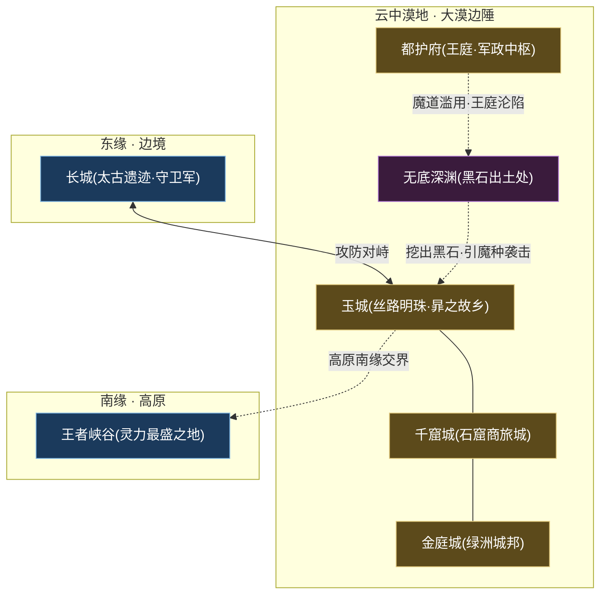
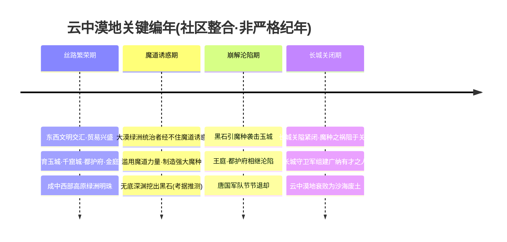
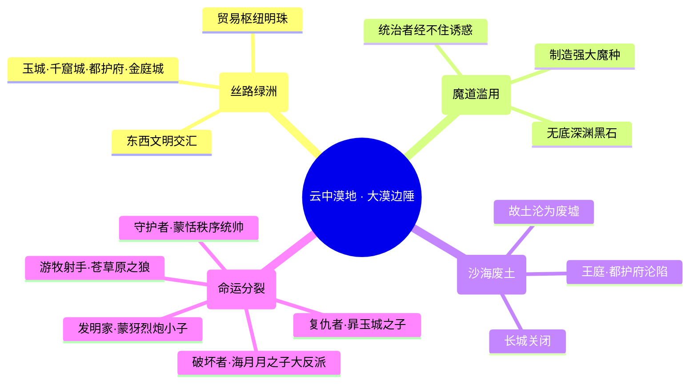
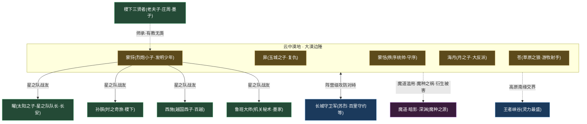

# 云中漠地·边陲

北疆 · 边陲丝路绿洲魔种废土

> **丝路明珠的黄昏 · 由绿洲文明滑向魔种废土的大漠悲歌 · 长城以西、人类时代「黑暗时代」的策源地** —— 它曾是驼铃悠扬、商旅辐辏的丝路绿洲明珠，孕育玉城、千窟城、都护府、金庭城等繁华城邦；却因统治者经不住魔道诱惑、滥用力量制造魔种，而在一夜之间崩解为漫天黄沙下的断壁残垣。它是[长城守卫军](../factions/changcheng.md)所要守御的「关外之祸」的来源地，也是无数英雄背负的故乡之痛。

---

::: info 阵营概述
**云中漠地·边陲**（亦称「**云中沙之盟**」「**大漠边陲**」）坐落于[长城](../factions/changcheng.md)以西、王者大陆**中西部高原**的广袤沙漠地带，势力代表为松散的部族联合体「**云中沙之盟**」。它的历史是一部教科书式的**由盛而衰的文明悲剧**：在繁荣的顶点，它曾是**丝绸之路上的绿洲明珠**——东西方文明在此交汇、商队驼铃昼夜不息，催生出**玉城、千窟城、都护府、金庭城**等璀璨城邦，是大陆中西部最富庶、最多元的贸易枢纽之一。

然而繁荣之下暗藏深渊。据[纪元编年](../worldview/eras.md)，进入人类时代的「**黑暗时代**」，大漠绿洲的统治者经不住[魔道](../worldview/concepts.md#魔道魔道家族)力量的诱惑，**滥用魔道、制造强大魔种**；失控的恶果是灾难性的——**王庭、都护府相继沦陷**，唐国军队节节退却，最终不得不**紧闭长城关隘**，将魔种之祸阻于关外。曾经的丝路明珠，就此衰败为漫天风沙下的**沙海废土**。传说中，正是**无底深渊**里挖出的**黑石**，引发了魔种对玉城的袭击，为这片土地的没落写下最惨烈的一笔（考据推测）。

因此，云中漠地在世界观中扮演着双重角色：它既是承载[暃](#成员花名册)、[蒙犽](#成员花名册)等英雄乡愁与抗争的**故土**，也是[长城守卫军](../factions/changcheng.md)矢志守御、[魔道·暗影·深渊](../factions/modao-shadow-abyss.md)力量向现世渗透的**前沿废墟**。它的南缘高原与「勇士之地」交界处，更埋藏着大陆灵力最盛的**王者峡谷**。一片被诅咒的土地，却也是群英辈出、命运纠缠的舞台。
:::

## 阵营档案

| 档案项 | 内容 |
| :--- | :--- |
| **阵营名** | 云中漠地·边陲（facId: `yunzhong-modi`） |
| **别称** | 云中沙之盟 / 大漠边陲 |
| **地理位置** | 长城以西、大陆中西部高原的沙漠区域 |
| **所属大区** | 北疆 · 边陲 |
| **主题风格** | 丝路绿洲 → 魔种侵蚀的沙漠废土 |
| **核心领袖** | [云中沙之盟](#核心人物)（部族联合体，无单一统帅；秩序统帅[蒙恬](#成员花名册)为军事代表） |
| **成员数** | 5 名英雄（本阵营名册收录） |
| **关键词** | 丝路绿洲 · 玉城 · 千窟城 · 都护府 · 金庭城 · 魔道滥用 · 魔种入侵 · 无底深渊黑石 · 沙海废土 · 长城防御对象来源 |

---

## 地理与环境

云中漠地不是一座城、一道关，而是一整片**横亘长城以西的高原沙漠**。它的地理坐标，可以用三句话锚定：**东接长城**（与[长城守卫军](../factions/changcheng.md)互为攻防的两端）、**南缘与勇士之地交界**（埋藏[王者峡谷](../worldview/map.md)）、**全域散布昔日丝路城邦的废墟**。

::: info 地理定位 · 长城以西的高原沙海
据[世界观地图](../worldview/map.md)，云中漠地位于**长城以西、大陆中西部高原**，是一片广袤的沙漠区域。它与东侧的[长城](../factions/changcheng.md)互为「攻防对峙的两端」——长城是抵御大漠魔种的第一道屏障，而墙外便是这片衰败的废土。其高原南缘与「勇士之地」交界处，正是浸润于苍狼与机关巨人遗迹上古能量、号称「大陆灵力最盛之地」的**王者峡谷**所在（详见 [纪元编年 · 峡谷文明](../worldview/eras.md)、[专题 · 王者峡谷的由来](../topics/canyon.md)）。换言之，这片废土在地理上同时毗邻「**最危险的关隘**」（长城）与「**最丰沛的灵力**」（峡谷），荒芜与神圣在此一墙之隔。
:::

::: tip 昔日绿洲 · 丝路上的城邦群落
在魔种侵蚀之前，云中漠地是**丝绸之路上的绿洲明珠**，东西方文明在此交汇、贸易繁荣，孕育出一连串璀璨的城邦：

| 城邦 / 地标 | 性质 | 关联人物 / 事件 |
| :--- | :--- | :--- |
| **玉城** | 丝路明珠之城，富庶繁华 | [暃](#成员花名册)（玉城之子）之故乡；无底深渊黑石引魔种袭城 |
| **千窟城** | 石窟林立的商旅之城 | 丝路文明交汇的代表性城邦（考据推测） |
| **都护府 / 王庭** | 大漠军政中枢 | 魔道滥用后**沦陷**，唐国军队退却 |
| **金庭城** | 绿洲城邦 | 大漠繁华时期的城市之一（考据推测） |
| **无底深渊** | 地下深坑 | 挖出**黑石**，引发魔种袭击玉城（考据推测） |
:::

::: warning 今日废土 · 黄沙下的断壁
随着统治者滥用魔道、魔种泛滥，王庭与都护府沦陷、长城紧闭，昔日的绿洲城邦悉数倾颓。今日的云中漠地，是一片**黄沙吞没文明、断壁残垣相望**的废土——驼铃喑哑、商路断绝，唯有风沙在玉城的废墟间呜咽。它从「**丝路明珠**」到「**沙海废墟**」的坠落，是人类时代「黑暗时代」最触目的注脚。
:::

---

## 历史沿革

云中漠地的兴衰，是[纪元编年](../worldview/eras.md)中**人类时代「黑暗时代」**的核心情节。它从「丝路繁荣」起笔，经「魔道诱惑」转折，终于「魔种泛滥、长城关闭」——一部由富庶滑向荒芜、由开放走向封闭的边陲史诗。

### 一、丝路繁荣 · 绿洲明珠的黄金时代

在魔种侵蚀之前，云中漠地是**丝绸之路上的绿洲明珠**。据[世界观地图](../worldview/map.md)记载，这里「文明交汇、贸易繁荣」，东西方的商队在此往来不绝，催生出**玉城、千窟城、都护府、金庭城**等繁华城邦。彼时的大漠，是中西部高原上最富庶、最开放、最多元的贸易枢纽之一——这是云中漠地的黄金时代，也是它日后悲剧的反衬底色。

### 二、魔道诱惑 · 原罪的种子

::: warning 黑暗时代 · 魔道滥用的转折点
据[纪元编年](../worldview/eras.md)与[时间线](../worldview/timeline.md)，进入人类时代的「**黑暗时代**」，**大漠绿洲的统治者经不住[魔道](../worldview/concepts.md#魔道魔道家族)力量的诱惑，滥用力量、制造强大的魔种**。这正是云中漠地由盛转衰的「原罪种子」。
:::

魔道，是一门「由定义世界本源的知识与法则所驱动、经媒介触发转化为力量」的神秘学问（详见 [核心概念 · 魔道](../worldview/concepts.md#魔道魔道家族)）。它既能成就[稷下学院](../factions/jixia.md)的「魔导学」一脉，也可能被野心者**滥用以制造灾祸**——大漠统治者正是后者的典型。当他们以魔道之力批量造出强大魔种作为利器，便亲手打开了通往深渊的门。传说中，正是**无底深渊**中挖出的**黑石**，成为引动魔种袭击玉城的导火索（考据推测）。

### 三、崩解沦陷 · 王庭倾覆

魔道滥用的后果是灾难性的、且不可逆的：

失控的魔种反噬其主——**王庭、都护府相继沦陷**，唐国军队节节退却。曾经守护绿洲的军政中枢，在自己制造的魔种洪流中崩塌。富庶的城邦群落一座座陷落，文明的灯火在黄沙中次第熄灭。

### 四、长城关闭 · 由明珠到废土

::: quote 玉城之殇
「玉城曾是丝路上最亮的一颗明珠。直到那些被欲望豢养的魔种破墙而入，把繁华碾成黄沙——我的家，从此只剩下风。」
（依据[暃](#成员花名册)「背负玉城没落之痛」的设定意译，非官方逐字原文。）
:::

为阻止魔种之祸向中原蔓延，帝国最终不得不**紧闭长城关隘**。这道太古长城，从此成为隔绝「关外废土」与「关内文明」的生死之墙。而云中漠地——这片曾经的丝路明珠——则在魔种与黄沙的双重侵蚀下，彻底**衰败为沙海废土**。

值得一提的是，帝国并未因恐惧而走向封闭：出于包容，[长城守卫军](../factions/changcheng.md)广纳天下有才之人，包括魔种混血、异乡人、屯田军后裔乃至女性（详见 [纪元编年 · 大漠魔道滥用](../worldview/eras.md)）。据[纪元编年](../worldview/eras.md)，这支「不问出身、唯才是举」的边陲军团，历任统帅可考者有[苏烈](../heroes/changcheng.md#苏烈)、[李信](../heroes/changan.md#李信)等人。云中漠地的崩解，因此也间接催生了大陆**最多元包容的边陲军团**——这是黑暗时代里一抹微光。

::: info 辨析 · 「魔道滥用」与「魔道家族」并非一事
需要厘清一组易混概念：云中漠地的悲剧源于大漠**统治者主动滥用魔道、制造魔种**，是一种「**因贪欲而招祸**」的行为选择；而[魔道·暗影·深渊](../factions/modao-shadow-abyss.md)所指的「**魔道家族**」，是上古神明改造失败后被弃于倒悬天之外的**血脉族群**（如[吕布](../heroes/modao-shadow-abyss.md#吕布)、[兰陵王](../heroes/modao-shadow-abyss.md#兰陵王)），是一种「**因罪而得力量**」的身世背负（详见 [纪元编年 · 等级金字塔](../worldview/eras.md)、[核心概念 · 魔道](../worldview/concepts.md#魔道魔道家族)）。云中漠地的「魔道之祸」，是前者对「魔道」这门危险学问的滥用，与后者的血脉宿命属于不同层面——切勿混为一谈。
:::

---

## 组织 / 理念 / 特色

云中漠地不是一个**有统一意志的政治实体**，而是一片由共同地理与共同命运维系的**松散场域**。它的「组织」是部族联合体「云中沙之盟」，它的「理念」是**对故土的眷恋与对魔道滥用之祸的复杂态度**，它的「特色」则是**强烈的内部分裂**——同一片废土，孕育了守护者与破坏者、复仇者与发明家。

::: info 特色一 · 由盛而衰的「废土叙事」
在王者大陆的诸多阵营中，云中漠地是**「废土美学」最浓重**的一个。它的核心张力不在于「正在发生的战争」，而在于「**已经失去的繁华**」——黄沙之下掩埋的玉城瓦砾、断绝的丝路驼铃、沦陷的王庭旌旗。这种「明珠坠落」的悲剧底色，赋予了本阵营英雄（尤其是[暃](#成员花名册)）浓郁的**乡愁与复仇**气质。
:::

::: warning 特色二 · 魔道的双刃 —— 既是受害者，也是加害者
云中漠地与[魔道·暗影·深渊](../factions/modao-shadow-abyss.md)的关系极为暧昧。它**既是魔种之祸的受害者**（家园被自己制造的魔种摧毁），**也是魔道滥用的加害者**（统治者主动制造魔种）。这种「自食恶果」的悲剧逻辑，使它成为世界观中对「魔道双刃性」诠释得最透彻的舞台之一——魔道既是知识与力量，也是诱惑与代价（详见 [核心概念 · 魔道的双刃性](../worldview/concepts.md#魔道魔道家族)）。
:::

::: tip 特色三 · 强烈的内部分裂
本阵营英雄的立场跨度极大，几乎不存在统一阵线：

- **秩序的维护者**：[蒙恬](#成员花名册)（秩序统帅）以大秦边军之姿，召唤军团旗、镇守边陲；
- **故土的复仇者**：[暃](#成员花名册)（玉城之子）背负家园没落之痛，操控暗影傀儡游走；
- **少年的发明家**：[蒙犽](#成员花名册)（烈炮小子）骑着自造的机关炮车横冲直撞，是少有的「明亮」存在；
- **明确的大反派**：[海月](#成员花名册)（月之子）是「云中漠地大反派」，操控蝶群远程消耗；
- **游牧的射手**：[苍](#成员花名册)（草原之狼）继承超远射程的草原弓骑。
:::

| 特色维度 | 云中漠地的呈现 |
| :--- | :--- |
| **设定地位** | 人类时代「黑暗时代」的策源地、[长城](../factions/changcheng.md)防御对象的来源地 |
| **组织形态** | 松散部族联合体「云中沙之盟」，无单一中央集权统帅 |
| **职业生态** | 覆盖刺客 / 战士 / 射手 / 法师四大定位（缺纯坦克与纯辅助） |
| **英雄来源** | 原创（暃、海月、蒙犽）、历史改编（蒙恬、由成吉思汗重做而来的苍）兼容 |
| **核心母题** | 丝路绿洲的陨落、魔道的双刃、故土的乡愁、正邪并存的废土群像 |

---

## 核心人物

云中漠地没有「上古众神」式的单一神王，也没有「长安城」式的帝王中枢。它的「领袖」是松散的部族联合体——「**云中沙之盟**」；而在可玩英雄中，最具「统帅」气质、代表大漠秩序与军事力量的，是大秦边军指挥官——**蒙恬**。

### 云中沙之盟 · 大漠的松散共主

::: info 考据 · 「云中沙之盟」的领袖性质
据本阵营骨架，云中漠地的势力代表为「**云中沙之盟**」（`leadership`）。它并非某一位君主，而是大漠诸城邦 / 部族的**联合体**。在繁荣期，它维系着玉城、千窟城、都护府、金庭城等城邦之间的贸易与守望；在魔道滥用、王庭沦陷后，这一联盟也随城邦的陷落而瓦解。本页将其作为「集体领袖」记述，而非具象化为单一英雄。
:::

### 蒙恬 · 秩序统帅

战士

[蒙恬](#成员花名册)，**秩序统帅**、大漠边军的军事化身。在历史原型中，蒙恬是大秦镇守北疆、修筑长城的名将；在《王者荣耀》世界观里，他被塑造为一名**持矛召唤军团旗的指挥型战士**——以长矛近战搏杀，以军团旗远程支援，远近结合、攻守兼备。他象征着云中漠地（乃至整个北疆边陲）对「**秩序**」的渴求：在一片因魔道滥用而陷入混乱与崩解的废土上，他是少数仍以「军纪与秩序」对抗荒蛮的存在。

::: quote 蒙恬 · 秩序统帅
「旗帜所至，即是防线。秩序不在城墙之内，而在每一个不肯溃散的士卒心中。」
（依据蒙恬「持矛召唤军团旗」的指挥型战士设定意译，非官方逐字原文。）
:::

### 暃 · 玉城之子（情感主角）

刺客战士

若说蒙恬是云中漠地的「军事代表」，那么[暃](#成员花名册)便是它的「**情感主角**」。作为「**玉城之子**」，他**背负着玉城没落之痛**——亲眼目睹丝路明珠在魔种洪流中倾覆为废墟。他是一名**操控暗影傀儡、可在墙体上行走的高机动刺客 / 战士**，幽灵般穿行于废墟的断壁残垣之间。暃的存在，把云中漠地「由盛而衰」的宏大叙事，凝聚成了一个少年对故土的私人哀悼与抗争——他是这片废土最具人格化的伤口。

---

## 成员花名册

云中漠地·边陲阵营收录 5 名英雄，立场跨度极大——从守序的边军统帅到明确的大反派，从背负乡愁的复仇刺客到横冲直撞的发明少年，恰好折射出这片废土「正邪并存、命运分裂」的群像底色。职业上覆盖**刺客 / 战士 / 射手 / 法师**四大定位。

刺客战士射手法师

| 英雄 | 称号 | 定位 | 一句话身份 |
| :--- | :--- | :--- | :--- |
| [暃](../heroes/yunzhong-modi.md#暃) | 玉城之子 | 刺客/战士 | 操控暗影傀儡、可在墙体行走的高机动刺客，背负玉城没落之痛。 |
| [蒙恬](../heroes/yunzhong-modi.md#蒙恬) | 秩序统帅 | 战士 | 持矛召唤军团旗的大秦边军指挥型战士，远近结合、攻守兼备。 |
| [蒙犽](../heroes/yunzhong-modi.md#蒙犽) | 烈炮小子 | 射手 | 云中漠地的发明少年，骑机关炮车横冲直撞，[稷下](../factions/jixia.md)星之队成员。 |
| [海月](../heroes/yunzhong-modi.md#海月) | 月之子 | 法师 | 云中漠地大反派，操控蝶群、远程消耗与拉扯的法师。 |
| [苍](../heroes/yunzhong-modi.md#苍) | 草原之狼 | 射手 | 由成吉思汗重做更名而来，继承超远射程的草原弓骑射手。 |

::: tip 花名册速读 · 废土上的四种命运
- **守序线**：[蒙恬](#成员花名册)（秩序统帅）——以军纪与军团旗对抗荒蛮，大漠边陲的秩序象征。
- **复仇线**：[暃](#成员花名册)（玉城之子）——背负玉城没落之痛、操控暗影傀儡的情感主角。
- **明亮线**：[蒙犽](#成员花名册)（烈炮小子）——废土上少有的阳光少年，机关发明家，更跨界成为[稷下](../factions/jixia.md)星之队的一员。
- **反派线**：[海月](#成员花名册)（月之子）——被明确标注为「云中漠地大反派」，操控蝶群的拉扯型法师。
- **游牧线**：[苍](#成员花名册)（草原之狼）——由成吉思汗重做更名而来，超远射程的草原弓骑，其「狼」意象或与峡谷「苍狼」母题遥相呼应（考据推测）。
:::

::: info 考据 · 「苍」的来历与「狼」意象
据本阵营骨架，[苍](#成员花名册)「由成吉思汗重做更名而来，继承超远射程的草原弓骑」。这是《王者荣耀》对历史人物英雄进行**重做与重新包装**的典型案例。其称号「草原之狼」与[纪元编年 · 峡谷文明](../worldview/eras.md)中「**苍狼**」（上古能量造物，与机关巨人同归于尽孕育王者峡谷）的母题，是否存在叙事呼应，官方未明示，属「(考据推测)」范畴。
:::

::: warning 考据 · 「海月」与「月之子」的反派定位
[海月](#成员花名册)在本阵营骨架中被明确标注为「**云中漠地大反派**」，称号「月之子」，是一名「操控蝶群、远程消耗与拉扯」的法师。其与大漠魔道滥用、魔种之祸之间的具体剧情关联，官方叙事仍在丰富中，本页不强行钩连，以避免与官方设定相矛盾。
:::

---

## 阵营关系

云中漠地的关系网呈现出鲜明的「**对外冲突、对内分裂、个体外联**」三层结构：对外，它与[长城守卫军](../factions/changcheng.md)构成阵营级的「攻防对峙」，并与[魔道·暗影·深渊](../factions/modao-shadow-abyss.md)有「衍生—被害」的暧昧纠缠；对内，正邪立场割裂；而[蒙犽](#成员花名册)一人，则凭「**稷下师承**」与「**星之队战友**」两条线，把这片偏远废土与大陆中枢的[稷下学院](../factions/jixia.md)连接了起来。

### 关系总览表

| 关系类型 | 关联人物 / 阵营 | 性质 | 说明 |
| :--- | :--- | :--- | :--- |
| 攻防对峙（阵营级） | 云中漠地 ⇄ [长城守卫军](../factions/changcheng.md) | 跨阵营 · 对立 | 长城是抵御大漠魔种的第一道屏障，云中漠地是长城主要防御对象的来源地；二者互为攻防对峙的两端。 |
| 衍生—被害（阵营级） | 云中漠地 ⇄ [魔道·暗影·深渊](../factions/modao-shadow-abyss.md) | 跨阵营 · 因果纠缠 | 统治者滥用魔道制造魔种致家园崩解；云中漠地既是魔道滥用的加害源，也是魔种之祸的受害地。 |
| 地理相邻 | 云中漠地 — [王者峡谷](../worldview/map.md) | 区域 · 相邻 | 大漠高原南缘与勇士之地交界，正是灵力最盛的王者峡谷所在。 |
| 师承（三贤者→弟子） | [蒙犽](#成员花名册) ← [稷下](../factions/jixia.md)三贤者 | 跨阵营 · 师承 | 稷下三贤者有教无类、广收弟子，蒙犽曾在稷下求学，阵营仍归云中漠地。 |
| 战友 / 搭档（星之队） | [蒙犽](#成员花名册)·[曜](../heroes/changan.md#曜)·[孙膑](../heroes/jixia.md#孙膑)·[西施](../heroes/baiyue.md#西施)·[鲁班大师](../heroes/mojia-jiguan.md#鲁班大师) | 跨阵营 · 同盟（战友） | 曜以李白为偶像，于稷下组建星之队参加[庄周](../heroes/penglai-donghai.md#庄周)归虚梦演大赛，蒙犽为队中射手（详见 [战友与团体 · 星之队](../relationships/squad.md#星之队)）。 |

::: warning 阵营级主轴 · 长城内外的攻防对峙
云中漠地与[长城守卫军](../factions/changcheng.md)的关系，是本阵营**最核心、最具世界观意义**的对立轴。据[世界观地图](../worldview/map.md)，二者「互为攻防对峙的两端」：墙外是衰败、魔种泛滥的云中漠地，墙内是包容、唯才是举的长城守卫军。换言之，**云中漠地正是「长城主要防御对象的来源地」**——这道横亘北疆的太古长城，正是为了把这片废土的祸患阻隔在外而紧闭的。它与长城守卫军（[苏烈](../heroes/changcheng.md#苏烈)、[百里守约](../heroes/changcheng.md#百里守约)、[百里玄策](../heroes/changcheng.md#百里玄策)、[伽罗](../heroes/changcheng.md#伽罗)、[戈娅](../heroes/changcheng.md#戈娅)、[盾山](../heroes/changcheng.md#盾山)等）的对峙，是人类时代「以包容对抗黑暗」精神的最前线。
:::

::: info 考据 · 蒙犽跨阵营的「稷下渊源」
[蒙犽](#成员花名册)是云中漠地英雄中**对外联系最广**的一位。他虽阵营归属云中漠地（其「发明少年」「机关炮车」的特质，与大漠工匠传统相合），却通过两条线深度嵌入[稷下学院](../factions/jixia.md)体系：其一，作为「师承（三贤者→众弟子）」名单中的一员，他曾在稷下求学；其二，作为「**星之队**」的射手，他与队长[曜](../heroes/changan.md#曜)及[孙膑](../heroes/jixia.md#孙膑)、[西施](../heroes/baiyue.md#西施)、[鲁班大师](../heroes/mojia-jiguan.md#鲁班大师)并肩参加了[庄周](../heroes/penglai-donghai.md#庄周)主办的「归虚梦演大赛」。需注意：**曾在稷下学习 ≠ 阵营归属稷下**——蒙犽的阵营始终是云中漠地（详见 [师徒关系](../relationships/mentor.md)）。
:::

### 关系网络图

::: info 图例说明
土黄色节点为**云中漠地本阵营**英雄，蓝色节点为**相邻区域 / 对峙阵营**（长城守卫军、王者峡谷），紫色节点为**魔道·暗影·深渊**（魔种之源），绿色节点为**蒙犽的稷下外联网络**（星之队战友与三贤者）。实线表示同盟 / 战友关系，双向箭头表示阵营级攻防对峙，虚线表示因果纠缠、师承、地理相邻等张力性关系。其中[曜](../heroes/changan.md#曜)归[长安城](../factions/changan.md)，[孙膑](../heroes/jixia.md#孙膑)归[稷下学院](../factions/jixia.md)，[西施](../heroes/baiyue.md#西施)归[百越 / 建木](../factions/baiyue.md)，[鲁班大师](../heroes/mojia-jiguan.md#鲁班大师)归[墨家机关城](../factions/mojia-jiguan.md)。
:::

---

## 相关剧情

云中漠地虽是偏远废土，却牵动着数条贯穿世界观的关键剧情线。以下为与本阵营最紧密的几条故事线。

<a class="hok-card" href="../worldview/eras">丝路明珠的陨落云中漠地由「玉城、千窟城、都护府、金庭城」组成的绿洲城邦群落，因统治者滥用魔道、制造魔种而崩解，最终衰败为沙海废土。这是人类时代「黑暗时代」的核心情节，详见 。</a>
<a class="hok-card" href="../worldview/timeline">长城关闭与守卫军组建为阻魔种之祸，帝国紧闭关隘，并出于包容组建，广纳魔种混血、异乡人、屯田军后裔乃至女性。云中漠地的崩解，间接催生了大陆最多元的边陲军团。详见 。</a>
<a class="hok-card" href="../factions/jixia">归虚梦演大赛与星之队云中漠地的发明少年，跨界加入由在组建的「星之队」，参加主办的归虚梦演大赛，于赛事中收获友谊、能量与自我认知。详见 。</a>
<a class="hok-card" href="../worldview/concepts#魔道魔道家族">无底深渊与黑石之祸传说无底深渊中挖出的黑石，引发了魔种对玉城的袭击，为玉城之子的乡愁与复仇写下源头（考据推测）。其与的深层关联，详见 。</a>

::: info 剧情焦点 · 一片废土，两种文明的镜像
云中漠地最深刻的剧情意义，在于它与[长城守卫军](../factions/changcheng.md)构成了一对**精神镜像**：墙外的云中漠地，是「统治者以等级与欲望滥用魔道、自食恶果」的反面教材；墙内的长城守卫军，则是「帝国以包容与唯才是举对抗黑暗」的正面注脚。一道长城，分隔的不只是关内关外，更是「**封闭—堕落**」与「**开放—守望**」两种文明路径。云中漠地的废墟，因此成为整个人类时代「黑暗时代」最沉重的警钟。
:::

---

## 延伸阅读

<a class="hok-card" href="../heroes/yunzhong-modi">云中漠地英雄图鉴本阵营全体英雄（暃、蒙恬、蒙犽、海月、苍）的档案、背景与台词，见 。</a>
<a class="hok-card" href="../factions/changcheng">相邻阵营 · 长城守卫军与云中漠地攻防对峙、抵御大漠魔种的多元边陲军团，见 。</a>
<a class="hok-card" href="../factions/modao-shadow-abyss">关联阵营 · 魔道·暗影·深渊云中漠地魔道滥用、魔种之祸的力量源头与衍生地，见 。</a>
<a class="hok-card" href="../factions/jixia">外联枢纽 · 稷下学院蒙犽求学、组建星之队的智慧学府，见 。</a>
<a class="hok-card" href="../worldview/eras">纪元编年人类时代「黑暗时代」——大漠魔道滥用、王庭沦陷、长城关闭的完整脉络，见 。</a>
<a class="hok-card" href="../worldview/map">世界观地图长城、云中漠地、王者峡谷的地理关系，见 。</a>
<a class="hok-card" href="../worldview/concepts#魔道魔道家族">核心概念 · 魔道与魔种魔道的双刃性、魔种的来历等关键设定释义，见 。</a>
<a class="hok-card" href="../relationships/mentor">专题 · 师徒关系蒙犽与稷下三贤者、星之队的师承与同窗网络，见 。</a>
<a class="hok-card" href="../relationships/squad#星之队">专题 · 战友与团体蒙犽所属「星之队」的成员构成、归虚梦演大赛始末，见 。</a>
<a class="hok-card" href="../topics/canyon">专题 · 王者峡谷的由来大漠高原南缘交界处、苍狼与机关巨人遗骸所化的灵力圣地，见 。</a>

::: quote 结语 · 黄沙下的明珠
它曾是丝路上最亮的明珠——驼铃悠扬，商旅如织，玉城、千窟、都护、金庭，灯火彻夜。直到统治者向魔道伸出了手，亲手豢养出吞噬家园的魔种。王庭倾覆，长城紧闭，繁华碾作黄沙。如今，蒙恬仍举着不肯溃散的军团旗，暃仍在废墟的墙壁上追寻故土的影子，蒙犽则把炮车开向了远方更明亮的赛场。**一片被欲望诅咒的废土，却始终有人不肯让最后一缕文明的微光，彻底熄灭在风里。**
:::