# 百越 / 建木 · 英雄图鉴

> 阵营设定见 [百越 / 建木 阵营页](../factions/baiyue.md)。本页收录该阵营 **6** 位英雄的深度小传。

!!! abstract "本页英雄名册"
    | 英雄 | 称号 | 定位 | |
    | --- | --- | --- | --- |
    | [裴擒虎](#裴擒虎) | 白虎志 | 刺客 | |
    | [云中君](#云中君) | 流云之翼 | 刺客 | |
    | [西施](#西施) | 越国西子 | 法师 | |
    | [瑶](#瑶) | 森之风灵 | 辅助 | |
    | [亚连](#亚连) | 白虎守护 | 战士/坦克 | |
    | [蚩奼](#蚩奼) | 归山器痴 | 战士 | |

---

## 裴擒虎

刺客

**白虎志 · 可化身白虎的少年，在人形与虎身之间自由切换的边塞守护者**

| 档案项 | 内容 |
| --- | --- |
| 称号 | 白虎志 |
| 定位 | 刺客（打野 / 切入收割） |
| 所属 | [百越 / 建木](../factions/baiyue.md) |
| 身份 | 长城守卫军戍卒、苏烈部下；后赴长安加入尧天探寻真相 |
| 别称 | 白虎少年、小虎（考据推测） |
| 关系 | [苏烈](changcheng.md#苏烈)（恩师 / 长官）、[公孙离](changan.md#公孙离)（点醒之人）、[亚连](#亚连)（同源白虎意象，考据推测）、[李信](changan.md#李信)·[花木兰](changan.md#花木兰)（长城战友） |
| 登场作品 | 长城守卫军系列背景、尧天系列背景设定 |

### 背景故事

裴擒虎是一个身世成谜的少年。在他还记事之前，关于「他从哪里来」「父母是谁」的线索便已断绝，唯一确凿的，是流淌在他血脉里的那股不属于常人的力量——他能在人形与一头白虎之间自由切换。这股力量并非诅咒，也并非他主动习得的武艺，而是与生俱来、刻在骨血中的天赋。每当情绪激荡或战意被点燃，他周身便会涌起白色的兽息，少年的轮廓在一瞬间崩解、重塑为一头矫健的白虎；而当他收敛心神，又能重新立回人形。这种「人虎双形」的本领让他在很小的时候便显得与众不同，也让他在懵懂的岁月里背负了不被理解的孤独。

白虎，自上古以来便是西方的守护之兽，是镇压、是守望、是边塞的象征。裴擒虎的力量与建木一带流传的「白虎守护」信仰隐隐相通（考据推测）——在以盘古、蚩尤为根脉、归山一族世代传承锻造与守护的[百越 / 建木](../factions/baiyue.md)地域，白虎并不只是神兽，更是一种被部族世代供奉的护佑之力。这也解释了为何这名少年会被归入百越 / 建木的脉络：他身上承载的，正是这片土地古老信仰的余响。

少年时代的裴擒虎流落到了北疆，被卷入边境最残酷的现实——长城。在那道横亘于人类世界与大漠之间的巨墙之下，[长城守卫军](../factions/changcheng.md)世代戍守，抵御着自荒漠深处涌来的魔种。一身蛮力却无处安放的裴擒虎，在这里遇见了改变他一生的人:不屈铁壁[苏烈](changcheng.md#苏烈)。苏烈看出了这个野性难驯的少年并非凶兽，而是一块尚未被打磨的璞玉。他没有畏惧裴擒虎的虎形，反而以长者的胸怀将他收入麾下，教他纪律、教他何为「守护」、教他将那股桀骜的力量约束成保护他人的刀锋。在苏烈与一众战友的浸染下，裴擒虎从一个只知凭本能厮杀的野孩子，逐渐成长为一名真正的戍卒。长城的烽火、并肩的同袍，是他生命里第一次拥有的「归处」。

然而，少年的心中始终盘踞着一个无法回避的疑问:**我究竟是谁?** 这股力量从何而来?那头白虎为何寄居在他体内?守护长城固然让他找到了价值，却无法回答他对自身来历的追问。命运的转折发生在他与幻舞玲珑[公孙离](changan.md#公孙离)的相遇——这位活跃于长安暗处、隶属尧天的舞者，一语点醒了迷惘中的裴擒虎:答案不在边塞的城墙之下，而在繁华与暗流交织的[长安](../factions/changan.md)。被点醒的少年作出了离开长城、奔赴长安的决定。他加入了以牡丹方士明世隐为核心、隶属[长安](../factions/changan.md)的神秘组织「尧天」，在这座帝国的中枢里，借由占卜、谋略与暗中的查访，一步步揭开笼罩在自己身世之上的迷雾，去追寻那个关于「白虎」与「自我」的真相。

从北疆的长城到长安的灯火，裴擒虎的旅途始终围绕着两个主题:**守护**与**求真**。他守护过边境的安宁，也终将守护他所珍视的真相。而那头白虎，既是他力量的来源，也是他必须直面、必须理解、最终必须与之和解的另一个自己。

### 性格与形象

裴擒虎的性格里有一股鲜明的「少年气」——直率、热血、不加修饰。他不善于伪装心绪，喜怒形于色，面对强敌会越战越勇，面对不公会按捺不住怒火。这份冲动既是他的弱点，也是他最珍贵的本真:在尔虞我诈的长安暗局中，他那份未被磨蚀的赤诚反而显得格外难得。

同时，长城的岁月在他身上烙下了「守护者」的底色。苏烈的教诲让他懂得了责任的分量，那股野性的力量自此有了方向——不是为了征服，而是为了护持。他对身世的执着追问，则透出他性格中倔强、不肯认命的一面:既然命运给了他一个谜，他便要亲手把谜底挖出来。

外形上，人形态的裴擒虎是一名身形精悍的少年，眉宇间带着虎一般的锐气与不驯，身手轻捷如猎兽。虎形态则是一头通体雪白、双目灼灼的白虎，奔行如电、扑击凶猛，浑身散发着上古守护神兽的威压。**白虎**这一核心意象贯穿他的全部——既是西方守护之兽的象征，是力量与勇毅的化身，也暗合建木地域古老的白虎信仰，将这名身世成谜的少年与上古部族的根脉悄然系在一起。

### 战斗风格与能力（设定向）

裴擒虎的战斗本领完全建立在他「人虎双形」的天赋之上，这是他区别于一切凡俗武者的根本。他无需借助外物兵刃——他自身就是武器。

- **人形态**:以拳脚近身搏杀，身法灵巧、攻势凌厉，善于贴身缠斗与连击压制，是切入与骚扰的姿态。
- **虎形态**:化身白虎后爆发力、机动性与扑杀能力大幅跃升，可凭借兽身的迅捷扑向目标、咬合撕咬，是收割与追击的姿态。

他的核心战法，在于**人形与虎形之间的自由切换**:以人形开战、骚扰、消耗，在关键时刻化身白虎扑出致命一击，再视战况收回人形——攻守、远近、消耗与爆发，皆在两种形态的转换间流转。这种双形态的节奏掌控，正是他作为刺客最致命的特质，也让他在追击与逃脱之间游刃有余。

这股力量并非后天习得，而是与生俱来、源自血脉的白虎之力（考据推测其与建木「白虎守护」信仰同源）。苏烈在长城对他的教导，则是为这股天赋之力套上了「纪律」与「守护」的缰绳，让本能的凶蛮升华为可以驾驭的战技。

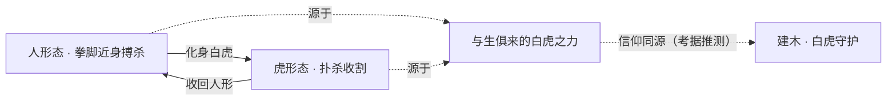

### 重要事件 / 剧情参与

- **流落北疆、被苏烈收入麾下**:身世成谜的少年在长城脚下遇见[苏烈](changcheng.md#苏烈)，被接纳、教导，成为[长城守卫军](../factions/changcheng.md)的一员，找到第一处归处。
- **戍守长城、抵御魔种**:与[李信](changan.md#李信)、[花木兰](changan.md#花木兰)、[铠](changan.md#铠)、[百里玄策](changcheng.md#百里玄策)等同袍并肩，守护边境、抗击自大漠涌来的魔种。
- **被公孙离点醒**:幻舞玲珑[公孙离](changan.md#公孙离)的一席话，让迷惘于身世的裴擒虎意识到答案在长安，促使他作出离开长城的决定。
- **赴长安、加入尧天探寻真相**:进入帝国中枢，加入以明世隐为核心的尧天，借占卜与谋略在暗处查访，追寻关于自身「白虎」血脉的真相。

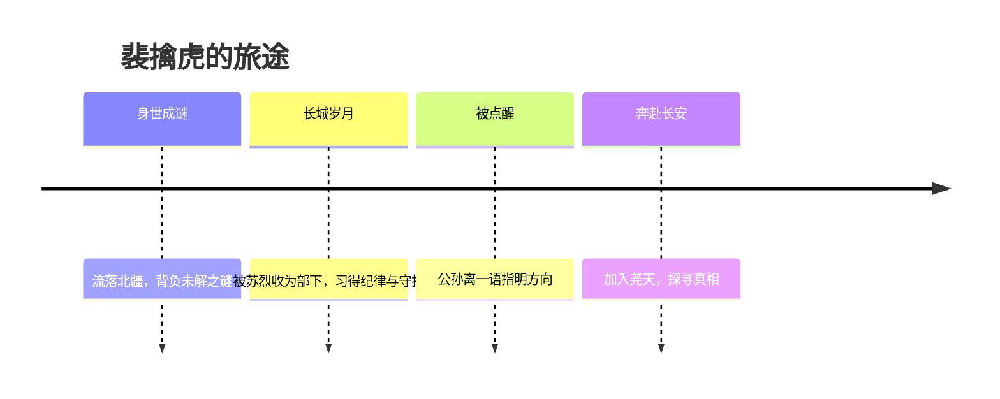

### 羁绊关系

| 对象 | 关系 | 说明 |
| --- | --- | --- |
| [苏烈](changcheng.md#苏烈) | 恩师 / 长官 | 在长城收留、教导流落的裴擒虎，是引他走上守护之路的关键人物。 |
| [公孙离](changan.md#公孙离) | 点醒之人 | 一语点醒迷惘的裴擒虎，使其下定决心赴长安加入尧天探寻真相。 |
| [李信](changan.md#李信) | 长城战友 | 同属长城守卫军，并肩戍守边境、抵御魔种；李信后接任指挥官。 |
| [花木兰](changan.md#花木兰) | 长城战友 | 长城守卫军同袍，共御大漠之敌。 |
| [铠](changan.md#铠) | 长城战友 | 长城守卫军同袍，由花木兰拾得命名加入长城。 |
| [百里玄策](changcheng.md#百里玄策) | 长城战友 | 长城守卫军同袍，同为边塞少年。 |
| [百里守约](changcheng.md#百里守约) | 长城战友 | 长城守卫军同袍。 |
| [伽罗](changcheng.md#伽罗)、[盾山](changcheng.md#盾山)、[戈娅](changcheng.md#戈娅) | 长城战友 | 同属长城守卫军，共守边境长城。 |
| [杨玉环](changan.md#杨玉环)、[弈星](jixia.md#弈星) | 尧天同袍 | 同属以明世隐为核心的尧天，于长安暗处活动。 |
| [亚连](#亚连) | 白虎意象同源（考据推测） | 同属建木 / 百越脉络，皆与「白虎守护」的信仰意象相关。 |

### 经典台词

!!! quote "裴擒虎 · 语录"
    "我究竟是谁?这个答案，我一定要亲手找到。"（考据推测）

    "苏烈将军教会我的，不只是怎么战斗，还有为什么而战。"（考据推测）

    "化身白虎，不是为了撕碎谁——是为了守住该守的东西。"（考据推测）

---

## 云中君

刺客

**流云之翼 · 御风化鲲、为守护而生的百越巫祝**

| 项目 | 内容 |
| --- | --- |
| 称号 | 流云之翼 |
| 定位 | 刺客 |
| 所属 | [百越 / 建木](../factions/baiyue.md) |
| 身份 | 百越部族巫祝 / 鸟图腾化身 / 守护之神「云中君」 |
| 别称 | 云中神君、孤鸟（前世）、流云之翼 |
| 关系 | [瑶](#瑶)（恋人·转生官配）、[西施](#西施)（同阵营）、[裴擒虎](#裴擒虎)（同阵营）、[蚩奼](#蚩奼)（同阵营） |
| 登场作品 | 《王者荣耀》英雄背景设定；与瑶系列同框原画、互动语音 |

### 背景故事

云中君之名，源自上古祭歌《九歌》。在那一阕古老的祝辞里，「云中君」是被巫者吟唱、被部族迎送的云之神祇——他乘风而降、披云而行，是连接苍天与大地、神明与凡人的使者。在《王者荣耀》的世界观中，这一意象被安放进了以盘古、蚩尤上古神话为根脉的百越/[建木](../factions/baiyue.md)之地：那是一片天生巨木拔地参天、自成山川水土的边远区域，部族世代以巫祝沟通天地、以鸟图腾敬奉神灵。云中君，便是这片土地最忠诚的守望者。

关于他的来历，最为玩家所熟知、也是官方反复以原画与语音强调的，是他与[瑶](#瑶)之间跨越生死的「转生」之缘。相传在很久很久以前的森林深处，有一只温顺的鹿与一只孤独的飞鸟相依为命——鹿不能飞，鸟不忍离，他们以最朴素的方式厮守彼此。然而世事无常，离别与死亡终究降临，他们在森林中殉情而逝。这一段「鹿与孤鸟」的前世，为他们日后的命运埋下了伏笔。（考据推测：此前世设定与《九歌》中「云中君」「山鬼」等篇章意象互文，官方在背景与游戏机制中均予以呼应。）

死亡并非终点，而是另一段守护的开端。森林中的鹿，转生为灵秀的鹿灵少女阿瑶，也就是后来的[瑶](#瑶)；而那只曾在她身旁盘旋不去的孤鸟，则没有选择转生为一个普通的生命，而是化作了云之上的神君——云中君。他记得前世的所有遗憾，记得那只无力守护爱人的飞鸟，于是这一世，他以神的姿态归来，只为不再让她孤身一人。他御风、化鲲、踏云而行，将整片天空都化作守护她的羽翼。也正因如此，他的称号被定为「流云之翼」——流云是他往来的路，翼是他守护的形。

作为百越的巫祝，云中君并非只属于一个人的神。他背负着整个部族的信仰：在那片被上古神话浸透的土地上，巫祝是人神之间的桥梁，以歌、以舞、以血脉中流淌的图腾之力，向苍天祈雨、向云海问途、为族人祛除笼罩在头顶的灾厄。建木上空时常被紊流灾难所困扰，而能化身鲲鸟、自由穿行于云霄之间的云中君，自然成为部族抵御天灾、守望平安的中流砥柱。他既是部族的守护，也是阿瑶的守护——这两重身份在他身上从不冲突，因为对他而言，守护本身就是他存在的全部意义。（考据推测：建木「紊流灾难」属百越阵营总体设定，云中君与之的具体关联在不同文本中表述有别。）

他的故事因此始终笼罩着一层悲与暖交织的色彩：悲在于前世的殉情与无力，暖在于今生以神之身重新归来、终于得偿所愿地守在爱人身旁。在百越群英之中，他不是最锋锐的刀，也不是最炽烈的火，却是那个永远在风中、永远在云端、随时准备俯冲而下挡在所爱之前的身影。

### 性格与形象

云中君性情沉静、深情而坚定。他不善喧哗，话语不多，却字字落在守护二字之上——他的温柔并非软弱，而是一种历经生死轮回后沉淀下来的、近乎执拗的忠贞。对[瑶](#瑶)，他是无微不至、寸步不离的恋人；对部族，他是沉默可靠、有求必应的神祇。

在外形上，云中君以「鸟」与「云」为核心象征意象。他身披羽饰与云纹，眉宇间带着巫祝的神性与飞禽的灵气；最具标志性的，是他能挣脱人形、化身为巨大的鲲鸟（鲲/鸟双重意象），振翅腾空、自由翱翔于云霄。羽翼、流云、长空，构成了他全部的视觉母题——他属于天空，正如阿瑶属于森林，一上一下、一飞一栖，却由命运的红线牢牢相系。这种「鹿与鸟」的对照美学，也是官方原画反复呈现的羁绊符号。

### 战斗风格与能力（设定向）

云中君的力量根植于百越巫祝的图腾信仰与鸟图腾化身之术。他最核心的能力，是在人形与鲲鸟形态之间自由切换：以人之身行走于地，以鸟之身翱翔于天。化身飞行赋予他极强的机动与突袭能力，使他能够轻盈地越过地形、自高空俯冲而下，正合「刺客」的定位——来去如风、击杀果决。

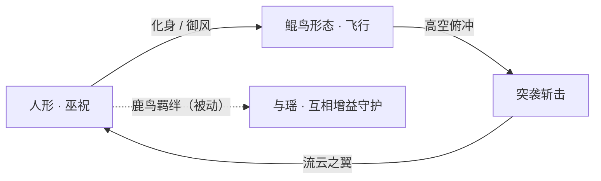

他的战斗哲学并非单纯的猎杀，而是「以攻代守」——他的每一次出击，往往都是为了把威胁从所守护之人身旁清除。与[瑶](#瑶)同场时，二人之间存在专属的「鹿鸟羁绊」机制（被动）：鸟为鹿挡风遮雨、鹿为鸟提供归处，背景设定与游戏机制在此处双重呼应、相互印证。（考据推测：以上为基于背景与公开机制的设定向描述，不涉及具体游戏数值。）

### 重要事件 / 剧情参与

- **前世殉情（鹿与孤鸟）**：森林中相依的鹿与孤鸟殉情而逝，奠定二人转生羁绊的源头。
- **转生归来（云中神君）**：孤鸟转生为云之神君，阿瑶转生为鹿灵，命运再度交汇，开启今生守护。
- **百越巫祝的守望**：作为部族巫祝，参与抵御建木上空紊流灾难、守护族人的长期使命。
- **与瑶的同框叙事**：官方多次以同框原画、互动语音、专属羁绊呈现二人「鹿鸟」之缘，是该 CP 的核心叙事载体。

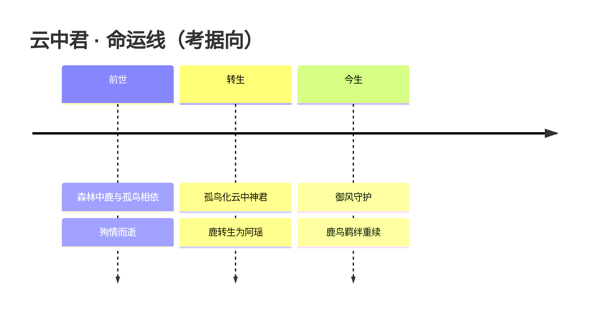

### 羁绊关系

| 对象 | 关系 | 说明 |
| --- | --- | --- |
| [瑶](#瑶) | 恋人（强官配 · 转生） | 原型同出《九歌》。前世为森林中相依的鹿与孤鸟，殉情后转生为阿瑶（鹿灵）与云中君（孤鸟成云中神君守护阿瑶）；同框原画、鹿鸟羁绊被动、大量互动台词，官方背景与游戏机制双重认证。 |
| [西施](#西施) | 同阵营（百越 / 建木） | 同属百越群英，西施为越国佳人、控制型法师，与云中君同处建木叙事框架之下。 |
| [裴擒虎](#裴擒虎) | 同阵营（百越 / 建木） | 同为百越阵营刺客，裴擒虎可化身白虎、云中君可化身鲲鸟，皆带「兽形/化身」母题。 |
| [蚩奼](#蚩奼) | 同阵营（百越 / 建木） | 同属归山一族所在的百越阵营，承上古盘古蚩尤信仰之脉。 |

### 经典台词

!!! quote "云中君"
    "流云为路，长空为家——我只为守护你而来。"（考据推测）

    "鹿在林间，鸟在云端，纵隔天地，亦不相离。"（考据推测）

    "御风而行，便是我向你奔赴的方式。"（考据推测）

### 皮肤故事亮点

云中君的代表皮肤多围绕「鹿鸟羁绊」展开，常与[瑶](#瑶)的对应皮肤成套推出、同框联动，以延续二人转生守护的浪漫叙事。其皮肤设计普遍强化「流云」「羽翼」「飞翔」的视觉母题，将守护与自由这两重主题落在云端意象之上。（考据推测：具体皮肤命名与剧情以官方版本为准。）

---

## 西施

法师控制

**越国西子 · 拉扯回拽、聚散由心的控制型法师**

| 档案项 | 内容 |
| --- | --- |
| 称号 | 越国西子 |
| 定位 | 法师（强控、消耗、回拽位移型） |
| 所属 | [百越 / 建木](../factions/baiyue.md) |
| 身份 | 越国佳人 · 浣纱女 · 稷下学院门生（考据推测） · 星之队成员 |
| 别称 | 西子、沉鱼、浣纱女 |
| 关系 | [云中君](#云中君)、[瑶](#瑶)、[曜](changan.md#曜)、[孙膑](jixia.md#孙膑)、[蒙犽](yunzhong-modi.md#蒙犽)、[鲁班大师](mojia-jiguan.md#鲁班大师)、[老夫子](jixia.md#老夫子) |
| 登场作品 | 《王者荣耀》本传；归虚梦演大赛「星之队」相关剧情 |

### 背景故事

西施之名，源出春秋末年越国苎萝山下的浣纱女。她生于溪畔人家，自幼在若耶溪边浣纱，溪水清澈如镜，倒映出她无双的容颜——传说她临水浣纱，水中游鱼见其美而忘记摆尾，沉入水底，故有「沉鱼」之喻。「西子」一称，则取自后世「欲把西湖比西子，淡妆浓抹总相宜」之意，将她定格为东方审美中最具代表性的佳人符号。在《王者荣耀》的世界里，她被冠以「越国西子」之号，归入百越一脉，是连结上古部族与吴越烟水的一缕柔丽线索。

在历史的底色中，西施的命运并非只是「美」。越国为吴国所败，越王勾践卧薪尝胆，谋臣范蠡于民间访得西施，将这位浣纱女献入吴宫。她以倾国之姿动摇吴王心志，于歌舞宴乐、笙箫管弦之间消磨一国之锐气，最终成为越国复仇大业里最隐秘、也最沉重的一枚棋子。她的力量从不在刀兵，而在「人心」——能聚拢、能牵引、能在不经意间将众人的注意力收束于一处，再悄然放散。这种「聚」与「散」的张力，正是她在峡谷中化为技能的根源（考据推测）。

在游戏的叙事框架内，西施被纳入百越 / 建木的疆域版图。建木是天生巨木拔地而起、自成山川水土的边远区域，归山一族世代信奉盘古与蚩尤，以锻造与古老巫祝维系着部族的呼吸。西施虽以吴越烟雨为出身底色，却与这片苍莽古土相系——她代表的是百越大地上「水」与「柔」的一面：不似归山锻造的火与铁，而如若耶溪水般缠绕、回环、收放自如。她的存在，为这个以上古战争与器械为主调的阵营，添上了一抹临水照花的柔光。

她亦曾踏入学问的门庭。在稷下学院广纳门生的叙事中，西施位列三贤者「有教无类」所收的众弟子之间（考据推测）。在那座以辩难、机巧与求知为风骨的学院里，这位以容貌闻名于世的女子，得以在容颜之外，被另一重目光所看见——被当作一个会思、会学、会选择自己道路的人。也正是在与同窗的相处之中，她结识了日后并肩的伙伴，走出了「红颜」二字所框定的窠臼。

后来，她加入了由 [曜](changan.md#曜) 召集的「星之队」，参加 [庄周](penglai-donghai.md#庄周) 主持的归虚梦演大赛。在那场以梦为舞台、以心象为对手的竞演里，西施不再是被人献出、被人摆布的棋子，而是主动落子的一员。她与队友彼此扶持，在梦境的潮起潮落间寻得友谊、能量与对自我的重新认知——这或许是她在所有叙事线索中，最接近「为自己而战」的一段时光。

### 性格与形象

西施的形象核心，是一种「柔中藏锋」的东方美。她外表温婉，举止从容，似一汪静水，却在静水之下藏着收放人心的力量。她不张扬、不锋利，却总能让喧闹的局面在她出现时安静下来，又在她离去时重新涣散——这份「场」的掌控，是她区别于刀光剑影的独有气质。

在配色与意象上，她的形象多取青、白、月华之色，呼应若耶溪的清波与浣纱的素练。飘带、纱衣、水波纹样是她反复出现的视觉母题，象征她「以柔制刚、以静驭动」的本质。她手中的法器并非利刃，而更近于纱、绳、丝缕一类可缠可拽之物（考据推测），将「牵引」这一动作具象成了她的战斗语言。

她的内核，则是一段从「被选择」走向「自己选择」的弧线。历史上的西施承载了太多他人加诸的命运，而在峡谷的叙事里，她逐渐学会以自己的方式立于人前——温柔，但不柔弱；被注目，却不被定义。

### 战斗风格与能力（设定向）

西施在峡谷中的战斗哲学，可以凝练为四个字：**聚、拽、缠、散**。她不以爆发取胜，而以对敌人位置与节奏的「掌控」编织杀机——先以柔力牵引、聚拢敌人，再将其回拽到对自己有利的位置，配合队友收割。这套「拉扯回拽」的控制，正是其法师定位中最鲜明的标识。

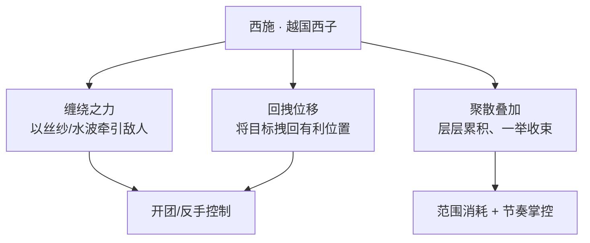

- **缠绕之力**：她的攻击并非斩切，而是「缠」与「绕」，以柔韧之力束缚敌人行动，呼应其浣纱缠丝的出身意象。
- **回拽**：她最具辨识度的能力，是将目标牵引、回拽至自己身边或队友火力之内——把战场的「位置」变成自己手中的棋。这与历史上「以人心牵引一国」的隐喻一脉相承（考据推测）。
- **聚散叠加**：通过持续作用累积某种「牵引」标记，待时机成熟一举触发，将散落的敌人收束于一处，制造团控良机。

她的力量来源不在火与铁，而在「水」的哲学——上善若水，至柔克刚。这使她在以锻造、巫祝、上古战伐为主调的百越阵营里，成为独一份的「柔系」掌控者。

### 重要事件 / 剧情参与

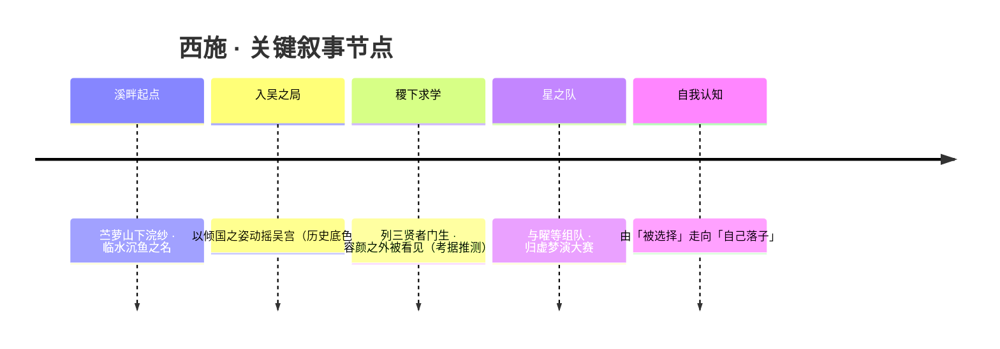

- 历史底色：作为越国复仇大业中的关键人物，以美与歌舞动摇吴国（叙事背景，非游戏剧情硬设定）。
- 稷下门生线：位列稷下三贤者「有教无类」所收众弟子之中（考据推测；与诸葛亮、周瑜等「曾求学但阵营另属」者并列于此名单）。
- 星之队 / 归虚梦演大赛：与 [曜](changan.md#曜)、[孙膑](jixia.md#孙膑)、[蒙犽](yunzhong-modi.md#蒙犽)、[鲁班大师](mojia-jiguan.md#鲁班大师) 组成「星之队」，参与 [庄周](penglai-donghai.md#庄周) 主持的梦境竞演，于其中收获友谊与自我认知。

### 羁绊关系

| 对象 | 关系 | 说明 |
| --- | --- | --- |
| [曜](changan.md#曜) | 战友 / 星之队 | 由曜召集组建星之队，参加归虚梦演大赛，并肩竞演。 |
| [孙膑](jixia.md#孙膑) | 战友 / 星之队 | 同属星之队成员，梦演大赛中的队友。 |
| [蒙犽](yunzhong-modi.md#蒙犽) | 战友 / 星之队 | 同属星之队成员，并肩作战。 |
| [鲁班大师](mojia-jiguan.md#鲁班大师) | 战友 / 星之队 | 同属星之队成员，机关与柔力相辅。 |
| [老夫子](jixia.md#老夫子) | 师承（稷下） | 稷下三贤者之一，西施列于其广收的众弟子之中（考据推测）。 |
| [庄周](penglai-donghai.md#庄周) | 师承（稷下）/ 梦演主持 | 稷下贤者，归虚梦演大赛的主持者，西施于其梦境中竞演。 |
| [墨子](mojia-jiguan.md#墨子) | 师承（稷下） | 稷下三贤者之一，名义上的授业者之一（考据推测）。 |
| [云中君](#云中君) | 同阵营 | 同属百越 / 建木，皆为这片古土上的灵秀人物。 |
| [瑶](#瑶) | 同阵营 | 同属百越 / 建木，森之风灵与越国西子同沐建木水土。 |

### 经典台词

!!! quote "西施 · 语录"
    「君心似我心，奈何不相知。」（考据推测）

    「一笑倾城，再笑……便由不得你了。」（考据推测）

    「水能载舟，亦能覆舟；人心，亦如是。」（考据推测）

---

## 瑶

辅助百越 / 建木

**森之风灵 · 化鹿附身、以护盾与免控贴身守护队友的森林精灵**

| 项目 | 内容 |
| --- | --- |
| 称号 | 森之风灵 |
| 定位 | 辅助（强保护型辅助） |
| 所属 | [百越 / 建木](../factions/baiyue.md) |
| 身份 | 森林中的鹿之精灵 / 自然之灵（鹿灵「阿瑶」） |
| 别称 | 阿瑶、小鹿、鹿灵（考据推测） |
| 关系 | [云中君](#云中君)（转生官配恋人）、[西施](#西施)（同阵营）、[曜](changan.md#曜)·[孙膑](jixia.md#孙膑)·[蒙犽](yunzhong-modi.md#蒙犽)·[鲁班大师](mojia-jiguan.md#鲁班大师)（星之队战友，考据推测） |
| 登场作品 | 《王者荣耀》英雄；与云中君系列原画、鹿鸟羁绊互动 |

### 背景故事

瑶是栖息于森林深处的鹿之精灵，是自然在万物生发之中孕育出的「风灵」。她的原型可上溯至屈原《九歌》的山林之神意象，与同阵营的[云中君](#云中君)同出一脉——二者本是《九歌》篇章里被拟人化的自然与神祇，在《王者荣耀》的世界观里，被重新书写为一段跨越生死、横亘转世的羁绊。

依据官方背景设定，瑶与云中君的故事始于「前世」。彼时的他们并非神灵，而是森林中相依为命的两个生灵：一头温柔的鹿，与一只失群的孤鸟。鹿与鸟相伴于林间，在四季流转、风雨晦明里彼此守望，结下了超越物种的深情。然而这段相依终究敌不过无常——传说中，二者在一场变故里殉情而亡。死亡并未终结他们的联系，反而成为转生的起点：那头鹿转世为森林精灵「阿瑶」，承袭了森林的风与生机；那只孤鸟则化作翱翔于云海之上的「云中神君」，背负起守护阿瑶的使命，世世代代寻她、护她。这便是「鹿灵」与「云中君」官配恋人的由来，也是百越 / 建木阵营中最为人称道的浪漫篇章。

作为森林的孩子，瑶与[百越 / 建木](../factions/baiyue.md)那片以盘古、蚩尤上古神话为根脉、由天生巨木「建木」拔地撑起的山川水土天然相连。建木区域草木葱茏、灵气氤氲，孕育出无数自然之灵，瑶便是其中最为纯净、也最贴近「守护」之本意的一个。她不掌锋刃，不持兵戈，却以自然赋予的庇佑之力，成为同行者最坚实的依靠。

在另一条与「稷下学院」相关的叙事线中，瑶也曾出现于学院世界（考据推测，多见于活动与赛事剧情）。她以森之风灵的姿态，与一群怀抱梦想的年轻人结伴同行，把森林的温柔带进了那个充满竞争与成长的舞台。无论身处何方，她始终如一：以柔软之躯，立于他人之前，把伤害与束缚替队友一肩承下。

### 性格与形象

瑶的性格如其形象一般温润、纯善而带着一丝灵动的俏皮。她体贴、依恋、善解人意，习惯把注意力放在所守护之人身上，言语间满是关切与暖意。她并不张扬，也不擅争抢，却在最需要的时刻挺身而出，用自己的方式给予最坚定的保护——这正是「辅助」之德的化身。

外形上，瑶是一位与鹿相融的少女精灵：头戴鹿角般的装饰，发色与衣饰多取森林的青绿、苔色与花叶之意，举手投足间带着鹿的轻盈与灵秀。她最具辨识度的能力，是能够化作一头「鹿形」之灵，轻盈地跃向、附身于同伴身畔。鹿，是她的本相，也是她「前世为鹿」的回响；风与森林，则是她象征意象的核心——生机、庇护、流动而不息的守望。

### 战斗风格与能力（设定向）

瑶不以攻伐见长，她的全部力量都倾注于「守护」二字。基于其森林精灵、鹿之化身的设定，她的招式与能力大致呈现为以下脉络（以下为基于背景设定的描述，非游戏数值）：

- **化鹿附身**：瑶可将自身化为一头轻盈的鹿灵，跃向并依附于队友身侧。被她附身、跟随的同伴，会获得森林精灵的庇佑——这是她「贴身保护」风格的核心。
- **风灵护盾**：作为「森之风灵」，她能召唤自然之力为同伴罩上一层护盾，抵御外来伤害；当危机临近，她亦能为所护之人解除束缚、带来「免控」般的庇护，使其在乱战中得以从容进退。
- **生机与庇佑**：森林孕育生命，瑶的力量也带着生生不息的温柔，让被守护者更难被击倒。她以治愈与减伤之意，把森林的恩泽分给身边的伙伴。

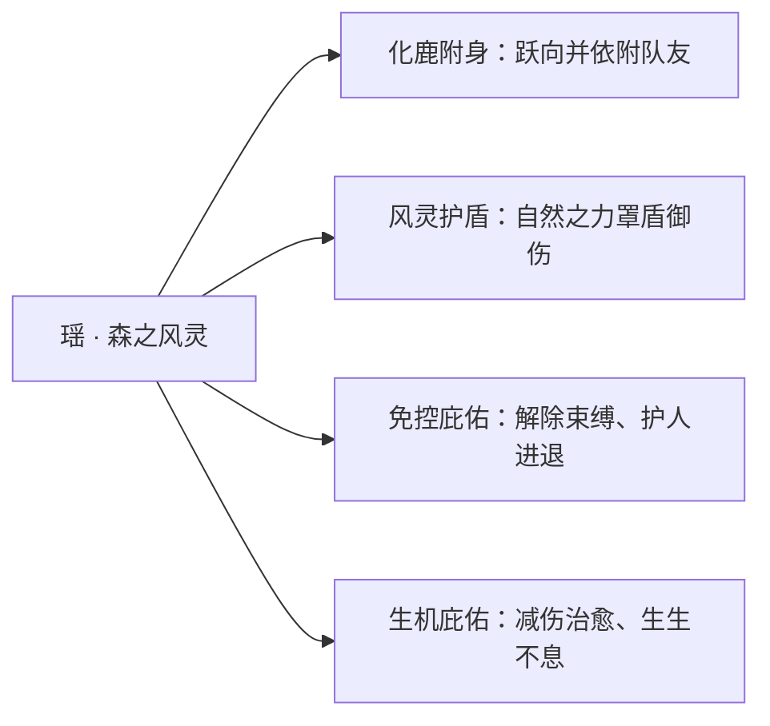

总体而言，瑶是一位极致的「贴身保护型辅助」：她几乎没有主动进攻的手段，却能把一名核心队友的生存能力推向极限——这与她「前世为鹿、以身相护」的叙事底色高度契合。

### 重要事件 / 剧情参与

- **鹿鸟前世今生**：与[云中君](#云中君)的「鹿与孤鸟—殉情—转生」故事，是瑶最核心的剧情线，亦是百越 / 建木阵营浪漫叙事的代表。
- **鹿鸟羁绊（游戏机制认证）**：瑶与云中君之间存在专属的「羁绊」互动——同框原画、鹿鸟主题的羁绊被动与大量互动台词，官方以「背景设定 + 游戏机制」双重方式坐实了二人的官配关系。
- **星之队 / 学院世界（考据推测）**：瑶曾以森之风灵之姿参与到与稷下学院、星之队相关的活动剧情中，与[曜](changan.md#曜)、[蒙犽](yunzhong-modi.md#蒙犽)、[孙膑](jixia.md#孙膑)、[西施](#西施)、[鲁班大师](mojia-jiguan.md#鲁班大师)等年轻人并肩同行（具体归属以官方为准）。

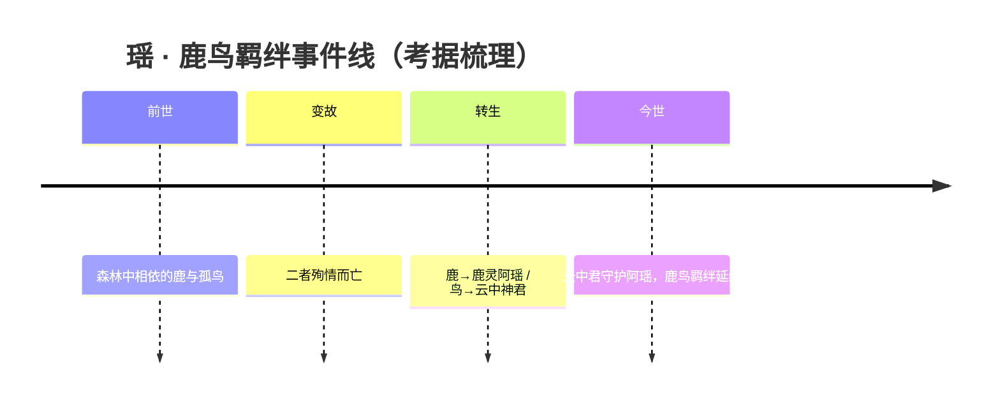

### 羁绊关系

| 对象 | 关系 | 说明 |
| --- | --- | --- |
| [云中君](#云中君) | 恋人（强官配 · 转生） | 原型同出《九歌》；前世为森林中相依的鹿与孤鸟，殉情后转生为鹿灵阿瑶与守护她的云中神君。同框原画、鹿鸟羁绊被动与互动台词，官方背景 + 游戏机制双重认证。 |
| [西施](#西施) | 同阵营 | 同属百越 / 建木一域的英雄，背景同源于越国与百越题材。 |
| [曜](changan.md#曜) | 星之队战友（考据推测） | 曜于学院世界组建星之队参赛，瑶以森之风灵之姿参与其中（具体以官方为准）。 |
| [蒙犽](yunzhong-modi.md#蒙犽) | 星之队战友（考据推测） | 同上，学院 / 赛事相关剧情中的同行者。 |
| [孙膑](jixia.md#孙膑) | 星之队战友（考据推测） | 同上，学院世界的伙伴。 |
| [鲁班大师](mojia-jiguan.md#鲁班大师) | 星之队战友（考据推测） | 同上，学院世界的伙伴。 |

### 经典台词

!!! quote "瑶 · 台词"
    「我会一直陪着你的。」（考据推测）

    「跟我走吧，让我来守护你。」（考据推测）

    「鹿与鸟的故事，会一直讲下去。」（考据推测，呼应鹿鸟羁绊）

### 皮肤故事亮点

瑶的多款皮肤延续了她「森林 · 鹿 · 守护」的核心意象，并以与[云中君](#云中君)的鹿鸟羁绊为情感主线展开：在相关系列原画中，鹿灵阿瑶与化鸟的云中君同框出现，以「前世今生、相守不离」的画面呼应官方设定中的转生爱情，被玩家视作百越 / 建木阵营最具代表性的浪漫符号（具体皮肤设定以官方为准）。

---

## 亚连

战士坦克

**白虎守护 · 以双剑封印心魔、于遗忘中坚守初心的失忆剑客**

| 档案项 | 内容 |
| --- | --- |
| 称号 | 白虎守护 |
| 定位 | 战士 / 坦克 |
| 所属 | [百越 / 建木](../factions/baiyue.md) |
| 身份 | 失忆双剑剑客、守护者 |
| 别称 | 双剑剑客、白虎守护（考据推测：本作以「白虎」母题将其与同阵营 [裴擒虎](#裴擒虎) 并置归档） |
| 关系 | [裴擒虎](#裴擒虎)、[蚩奼](#蚩奼)、[瑶](#瑶)、[云中君](#云中君)、[西施](#西施) |
| 登场作品 | 《王者荣耀》对抗路战士英雄（与《传说对决 / Arena of Valor》联动登场，2023 年上线）（考据推测：联动来源） |

### 背景故事

亚连是一位带着「空白过去」行走世间的剑客。他失去了几乎全部记忆——故乡何在、师从何人、为何握剑，皆如被人从脑海里抹去。唯独那对双剑，仍像血脉一般与他相连：每一次拔剑、每一次挥斩，剑身与掌心之间都会泛起一阵难以言喻的共鸣，仿佛灵魂深处仍残留着一段未曾断绝的誓言。正因如此，纵使前尘尽忘，他也从不曾放下手中的剑。

他随身携带的两柄佩剑各有其名、各有其性。一柄名为「守心」，剑势刚健沉厚，承载着「守护」二字的执念，挥出时是实打实的物理锋芒；另一柄名为「赤影」，剑身泛着妖异的赤色光晕，落下时化作灼心的法术之力。两剑一刚一诡、一守一攻，亚连在战斗中不断地在二者之间切换，正如他在「想要记起」与「学会放下」之间反复徘徊的心境。（考据推测：双剑名「守心」「赤影」及物理/法术双形态取自其招式设定）

关于他与建木的渊源，本作将他归入以盘古、蚩尤神话为根脉的 [百越 / 建木](../factions/baiyue.md) 一脉，并冠以「白虎守护」之名，与同样身负白虎血脉、可化身白虎的少年 [裴擒虎](#裴擒虎) 遥相呼应（考据推测：白虎母题的归档关联）。在建木那片由天生巨木拔地而起、自成山川水土的土地上，归山一族世代以锻造与守望为业，致力平息笼罩巨木上空的紊流之灾。一个忘却了来路、却本能地以剑护人的旅人，与「守护」这一阵营底色天然契合——亚连之于建木，恰如一柄不知出身却始终向着光的剑。

失忆没有让他陷入颓丧。相反，每当有人受难、有人哭泣，他都会毫不犹豫地横剑挡在最前。他相信，纵使遗忘了过往的一切，剑所指向的方向却从未改变；总有一天，他会用「守心」与「赤影」守护他所珍视的一切，也终将在守护的途中，重新拼凑出那个被岁月遗落的自己。

### 性格与形象

亚连性情乐观而单纯，是那种「记不清来路、却始终笑着往前走」的人。失忆本应是沉重的诅咒，他却把它过成了一种轻装上阵的坦然——没有旧日的包袱，便把全部心力都倾注在眼前值得守护的人和事上。他待人赤诚、行动果决，遇到不平之事从不犹豫，是天然的「挡在最前面」的那一个。

形象上，他是一名一袭利落剑装、左右各悬一柄佩剑的青年剑客。双剑「守心」与「赤影」是他最鲜明的符号：一柄端正沉稳、一柄赤光妖冶，象征他「守护」与「锋芒」、「记得」与「放下」并存的内在两面。战斗时他身形矫健、攻守俱备，既能如坦克般硬扛于前，又能如战士般连斩突进，整体气质阳光而坚韧。

### 战斗风格与能力（设定向）

亚连的战斗核心，是围绕一对双剑展开的「双形态切换」。

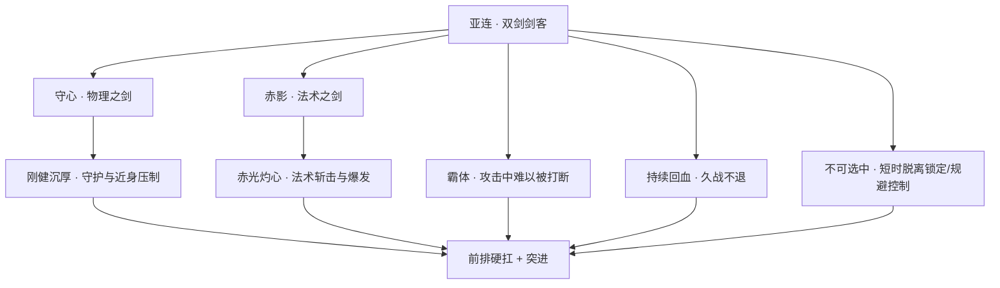

- **双剑双形态**：挥动「守心」时造成物理伤害，挥动「赤影」时造成法术伤害；他在战斗中自如切换两剑，使输出难以被针对性削减。（考据推测：物理/法术双形态来自其技能设定）
- **霸体**：施展关键剑招时进入霸体状态，攻击不易被打断，得以稳定地完成连斩与压制。
- **持续回血**：战斗中具备自我恢复能力，使其能长时间钉在前排消耗、换血而不轻易倒下，奠定其「肉坦战士」的对抗路定位。
- **不可选中**：拥有短时「不可被选中 / 脱离锁定」的机制，可借此规避集火与控制、切入或脱身，是其作为对抗路强势英雄的标志性手段。

综合而言，亚连是一名兼具坦度（回血、霸体）、机动与规避（不可选中）以及双形态输出（守心/赤影）的对抗路肉坦战士，能扛、能缠、能切，长于在前线持续作战。（说明：以上为设定向描述，不涉及具体游戏数值）

### 重要事件 / 剧情参与

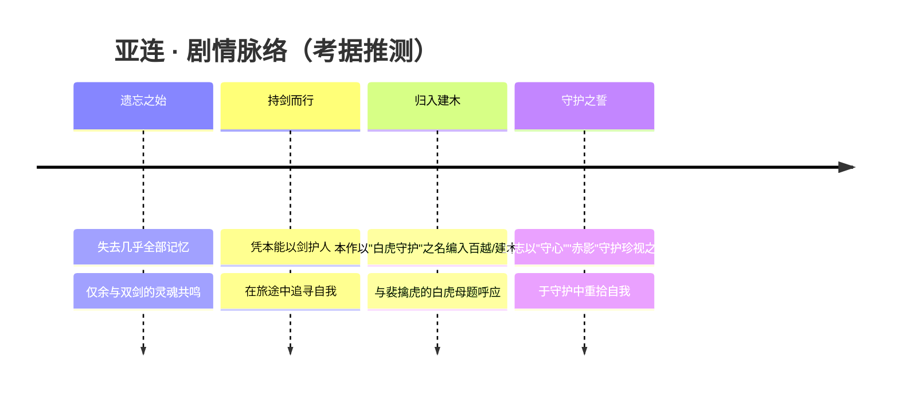

- 以**失忆剑客**的身份登场，其个人剧情主线围绕「遗忘—守护—寻回自我」展开。
- 作为**联动英雄**加入《王者荣耀》英雄阵容（考据推测：来自《传说对决 / Arena of Valor》联动，2023 年上线）。
- 在本作设定中被纳入 [百越 / 建木](../factions/baiyue.md) 阵营，担「白虎守护」之名（考据推测：阵营归档与白虎母题关联）。

### 羁绊关系

| 对象 | 关系 | 说明 |
| --- | --- | --- |
| [裴擒虎](#裴擒虎) | 白虎母题呼应 | 二者皆与「白虎」相关——裴擒虎可化身白虎（白虎志），亚连号「白虎守护」，本作以此母题并置归档（考据推测） |
| [蚩奼](#蚩奼) | 同阵营 · 锻造之缘 | 同属建木归山一族题材；蚩奼为器痴、重铸五兵能量核心，与亚连「人剑共鸣」的双剑设定在「器与人」的主题上相映（考据推测） |
| [瑶](#瑶) | 同阵营战友 | 同为建木 / 百越一脉的守护取向角色，皆以护佑同伴为念 |
| [云中君](#云中君) | 同阵营战友 | 百越巫祝，背负部族信仰；与亚连同属建木地区题材 |
| [西施](#西施) | 同阵营 | 越国佳人，同列百越 / 建木阵营 |

### 经典台词

!!! quote "亚连 · 语音 / 设定台词（考据推测）"
    「就算忘记了一切，剑所指的方向也不会变。」（考据推测）

    「守心，赤影——这两柄剑，早就是我身体的一部分了。」（考据推测）

    「记不起过去？那就守护好现在吧。」（考据推测）

    「总有一天，我会用这双剑，守护我所珍视的一切。」（考据推测）

---

## 蚩奼

战士打野 · 近刺客形态

**归山器痴 · 以五兵能量重铸武器匣的痴执少女**

| 项目 | 内容 |
| --- | --- |
| 称号 | 归山器痴 |
| 定位 | 战士（打野位，技能机制近似刺客） |
| 所属 | [百越 / 建木](../factions/baiyue.md) · 归山一族 |
| 身份 | 蚩尤后人、归山一族器痴少女、紊流灾难下的锻造／炼器者 |
| 别称 | 器痴（族中绰号，考据推测） |
| 关系 | [亚连](#亚连)、[裴擒虎](#裴擒虎)、[云中君](#云中君)、[瑶](#瑶)、[西施](#西施)、[盘古](shanggu-shenhua.md#盘古) |
| 登场作品 | 《王者荣耀》英雄（百越 / 建木 · 归山一族系列，考据推测） |

### 背景故事

蚩奼出身于建木地区的归山一族。建木并非寻常山林，而是一株自天地之初便拔地而起的"天生巨木"，它的根须撑开了一方自成山川水土的疆域，与上古神话里"倒悬天"的概念相关联。在这片巨木之下，归山一族世代繁衍，自承为上古战神蚩尤的后裔。他们信仰开天辟地的[盘古](shanggu-shenhua.md#盘古)，把锻造与炼器视为族群血脉里最神圣的传承——因为建木的上空，长年笼罩着一种被称为"紊流"的灾难。

紊流是建木之上无形而狂暴的能量乱流，它扭曲器物、侵蚀血脉、令天地秩序错位。归山一族世世代代的使命，便是以祖传的锻造之术平息这场灾难。也正因如此，"器"在归山语里不只是工具，而是承载着祖先意志、能与天地能量共鸣的存在。族人保留着独特的归山语，将炼器的口诀、纹样、心法藏于其中，外人难解。

蚩奼是这一族中天赋异禀、却也"痴"得出名的少女。她对"器"的痴迷近乎执念——别的孩子学锻造是为了承袭使命，她学锻造却是因为忍不住要去懂得每一件器物的脾性、来历与极限。族中长辈给了她"器痴"的名号，半是赞许，半是无奈（考据推测）。这份痴执，最终把她引向了一项祖先留下的禁制级遗产：蚩尤当年所执的"五兵"。

所谓五兵，即殳、矛、戈、戟、弓——上古战神驱驰沙场的五类兵器。在归山一族的传说里，这五件兵器并非凡铁，而是各自封存着一枚能量核心，是蚩尤之力的余烬。它们被分散供奉、不许轻动，因为单一一件已足够危险，五者合一更被视为既是大成、也是大祸的禁忌（考据推测）。蚩奼不甘于让祖先的力量只作供品般沉睡，她以一身器痴之能，将殳、矛、戈、戟、弓五兵的能量核心抽取、调和、重铸，封入一具随身的"武器匣"之中。

这具武器匣，便是蚩奼直面紊流、踏出建木的底气。她背负着归山一族平息灾难的世代之愿，也背负着重铸祖先之力所必须承担的反噬与质疑。对她而言，"懂得一件器，就要敢于驾驭它"——哪怕那件器，是足以毁掉自己的战神遗物。

### 性格与形象

蚩奼最鲜明的标签是"痴"。这份痴不是呆，而是一种近乎偏执的专注：见到精妙的器物会两眼放光，谈起锻造与五兵会滔滔不绝，遇到一时参不透的机关纹样会废寝忘食。她对力量没有占有的贪欲，却有近乎本能的好奇与征服欲——她想把每一件"器"都吃透，把每一份能量都驯服。

在族群使命之外，她带着少女的莽撞与赤诚。重铸五兵这样的举动，既显出她的胆识，也透着不计后果的冲动。她身上同时有匠人的沉静与战士的锋锐：沉静在面对器物时，锋锐在握起武器匣时。

形象上，她是手持／背负武器匣的器痴少女，以建木归山一族的服饰纹样为底色，象征意象集中在"五兵"与"匣"——殳、矛、戈、戟、弓五形于一身，匣开则兵显、匣合则力藏，正对应她"集祖先之力于一器、收放在一念之间"的设定（外形细节为考据推测）。

### 战斗风格与能力（设定向）

蚩奼的战斗核心，是那具由殳、矛、戈、戟、弓五兵能量核心重铸而成的武器匣。她不固守单一兵器，而是依战况调动匣中不同兵形的能量——这正契合她在游戏中作为战士、却以打野位见长、技能机制近似刺客的定位：游走、切入、爆发、收割。

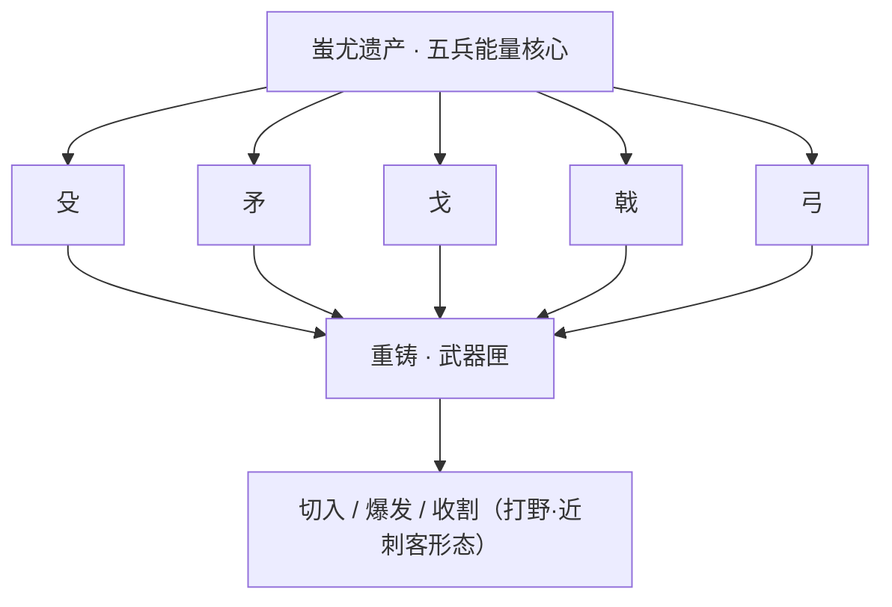

从设定推演，她的招式来历皆系于"五兵"：殳与矛偏重突进与穿刺，戈与戟兼顾横扫与勾连，弓则补足远程牵制（具体技能形态为考据推测）。她驾驭的不是寻常铁器，而是被紊流环境淬炼、又被她亲手调和的祖先之力，因此每一次出手都带着"器与人共鸣"的色彩——力量越凶险，越显她器痴本色。

### 重要事件 / 剧情参与

- 习得归山一族祖传锻造／炼器之术，被族中冠以"器痴"之名。
- 寻得并抽取殳、矛、戈、戟、弓五兵的能量核心，将其重铸封入随身武器匣（关键个人事件）。
- 背负归山一族平息建木上空"紊流"灾难的世代使命，以重铸之器直面乱流。

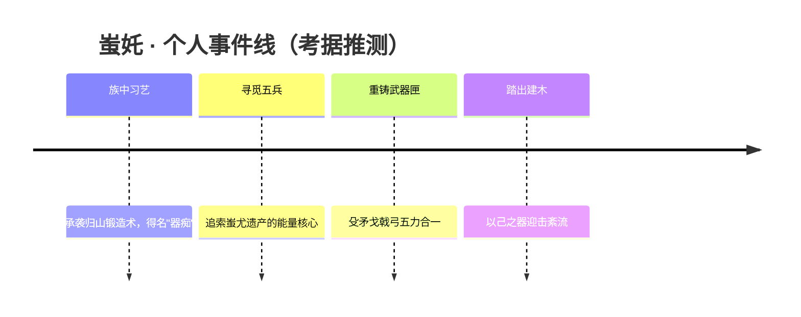

> 注：以上事件线依据已知背景设定整理，细节顺序为考据推测。

### 羁绊关系

| 对象 | 关系 | 说明 |
| --- | --- | --- |
| [亚连](#亚连) | 同阵营 · 白虎守护 | 同属百越 / 建木，建木区域与白虎守护题材相关联，二者皆为守护这片天生巨木疆域而战。 |
| [盘古](shanggu-shenhua.md#盘古) | 信仰 · 开天之神 | 归山一族世代信奉开天辟地的盘古，蚩奼的炼器传承根植于这一信仰。 |
| [裴擒虎](#裴擒虎) | 同阵营 · 归山／百越 | 同出百越体系，裴擒虎为可化身白虎的少年，与归山一族的白虎守护题材同根。 |
| [云中君](#云中君) | 同阵营 · 百越巫祝 | 同属百越，云中君为背负部族信仰的巫祝，与归山一族同处建木边远部族的世界观下。 |
| [瑶](#瑶) | 同阵营 · 森之风灵 | 同属百越，瑶以鹿灵之姿守护部族，与归山题材共享建木山林的根脉。 |
| [西施](#西施) | 同阵营 · 越国西子 | 同属百越体系（越国题材），同为这一阵营下的女性英雄。 |

> 关系条目均据 baiyue 阵营设定与 relatedRelationships 整理；归山一族内部具体人物羁绊若官方未明示，则标注为同阵营／同题材关联（考据推测）。

### 经典台词

!!! quote "蚩奼 · 台词（考据推测）"
    "器无善恶，看你敢不敢握住它。"

    "殳、矛、戈、戟、弓——祖先的五兵，如今由我执掌。"

    "紊流再乱，也乱不过我对一件好器的痴心。"

    "盘古开天，归山炼器，这条路我走定了。"

> 以上台词均为依据人物设定撰写的（考据推测），非官方原文。

!!! tip "继续探索"
    返回 [百越 / 建木 阵营页](../factions/baiyue.md) · 浏览 [全英雄图鉴](index.md) · 查看 [人物关系网](../relationships/index.md)