# 长安城 · 英雄图鉴

> 阵营设定见 [长安城 阵营页](../factions/changan.md)。本页收录该阵营 **26** 位英雄的深度小传。

::: info 本页英雄名册
| 英雄 | 称号 | 定位 | |
| --- | --- | --- | --- |
| [亚瑟](#亚瑟) | 圣骑士之王 | 战士/坦克 | |
| [铠](#铠) | 暗影游侠 | 战士/坦克 | |
| [狂铁](#狂铁) | 百炼成钢 | 战士 | |
| [李信](#李信) | 一念神魔 | 战士 | |
| [李白](#李白) | 青莲剑仙 | 刺客 | |
| [上官婉儿](#上官婉儿) | 惊鸿之笔 | 法师/刺客 | |
| [武则天](#武则天) | 无瑕之人 | 法师 | |
| [嬴政](#嬴政) | 政 | 法师 | |
| [芈月](#芈月) | 惑国妖姬 | 法师 | |
| [王昭君](#王昭君) | 冰雪之华 | 法师 | |
| [张良](#张良) | 谋圣 | 法师 | |
| [貂蝉](#貂蝉) | 绝世舞姬 | 法师 | |
| [钟馗](#钟馗) | 地府判官 | 法师 | |
| [杨玉环](#杨玉环) | 霓裳曲 | 辅助/法师 | |
| [司空震](#司空震) | 雷霆之王 | 战士/法师 | |
| [金蝉](#金蝉) | 圣愿 | 法师/辅助 | |
| [曜](#曜) | 太阳之子 | 战士/刺客 | |
| [云缨](#云缨) | 红缨枪魂 | 战士/刺客 | |
| [花木兰](#花木兰) | 传说之刃 | 战士/刺客 | |
| [露娜](#露娜) | 哥特玫瑰 | 战士/法师 | |
| [程咬金](#程咬金) | 热烈之斧 | 坦克/战士 | |
| [狄仁杰](#狄仁杰) | 通天神探 | 射手 | |
| [李元芳](#李元芳) | 逐影之刃 | 射手 | |
| [公孙离](#公孙离) | 幻舞玲珑 | 射手 | |
| [达摩](#达摩) | 破碎黎明 | 战士 | |
| [镜](#镜) | 破镜之刃 | 刺客 | |
:::

---

## 亚瑟

<span class="hok-tags"><span class="tag warrior">战士</span><span class="tag tank">坦克</span></span>

**圣骑士之王 · 失忆而归的破败王城骑士王，攻防兼备、新手最易上手的均衡型战士**

| 项目 | 内容 |
| --- | --- |
| 称号 | 圣骑士之王 |
| 定位 | 战士 / 坦克 |
| 所属 | [长安城](../factions/changan.md) |
| 身份 | 破败王城（圣骑士王朝）末代国王、圣骑士团领袖；后流落长安城 |
| 别称 | 骑士王、圣骑士之王（考据推测：早期民间亦俗称「亚特王」呼应其原型） |
| 关系 | [安琪拉](jixia.md#安琪拉)（仰慕者 / 半官方CP）、[艾琳](shanggu-shenhua.md#艾琳)（情感线·存争议）、[程咬金](#程咬金)（长安并肩的同道）、[武则天](#武则天)（长安统治者，亚瑟流落于其治下） |
| 登场作品 | 《王者荣耀》初代上线英雄之一（首批英雄）；多部官方CP皮肤短剧、长安城世界观资料 |

### 背景故事

亚瑟的故事开端于一座早已倾颓的国度——**破败王城**。在王者大陆的旧日纪元里，这里曾是「圣骑士王朝」的荣光所在：城墙高耸、誓约森严，一代代圣骑士以「正义」为名守护着王国的子民。亚瑟正是这条血脉的末裔，自幼被立为继承王座之人，背负起整座王城的期许与重量。在那段繁盛岁月里，他不只是一名君王，更是骑士团的精神象征——他所佩持的圣剑与所立下的骑士誓言，被视为王城秩序的根基。（考据推测：其设定明显取材自西方亚瑟王传说与「石中剑 / 骑士王」母题，是《王者荣耀》中少数采用纯西式骑士幻想原型的英雄。）

然而荣光终有尽时。某场吞没了整座王朝的浩劫之后，王城败落、子民离散，曾经辉煌的圣骑士国度只剩下断壁残垣，故而得名「破败王城」。亚瑟在这场灾厄中失去了大部分关于自己的记忆——他不再清楚地记得自己何以为王、王城究竟毁于何人之手，甚至连「亚瑟」这个名字背后承载的全部往事，都化作了零碎而模糊的片段。他唯一没有放下的，是那柄随身的圣剑，以及刻进骨血、几乎成为本能的骑士信条：**守护弱者、惩戒不义**。

带着残缺的记忆与未竟的使命，亚瑟离开了荒芜的故土，一路辗转，最终来到了大陆中枢、被誉为「大陆第一雄城」的[长安城](../factions/changan.md)。这座由稷下贤者[墨子](mojia-jiguan.md#墨子)亲手建造、表为盛唐繁华都市实为封印方舟的雄城，商旅、文人、豪侠与各族在此和谐聚居，恰是失乡之人最能容身之地。在女帝[武则天](#武则天)统治下的长安，亚瑟以一名异乡骑士的身份重新立足：他既无法回到那个已不存在的王座，也尚未寻回完整的自我，于是把「为王」的责任，转化为「为正义而战」的行动——哪里有需要守护的人,哪里就有他持盾挺剑的身影。（考据推测：亚瑟的「失忆—寻找自我—在异乡重拾骑士使命」是其核心叙事母题，长安城作为其落脚地属世界观整合后的阵营归属设定。）

正因这份「均衡而坚定」的特质，亚瑟在玩家心中长期是最具代表性的「入门英雄」之一：他既不是极端的输出爆发者，也非纯粹的肉盾，而是攻守之间取得平衡、稳健可靠的存在——这与他「失去王国却守住骑士之心」的人物内核高度契合。

### 性格与形象

亚瑟性格沉稳、刚正而克己，是典型的「骑士道」化身：重承诺、讲荣誉、面对强敌不退、面对弱者不欺。即便记忆残缺、王国不再，他依然以近乎本能的责任感行事，把每一次出手都当作对骑士誓言的兑现。这种「哪怕失去一切也要守住底线」的执拗，使他既显得古典而庄重，又带着一丝孤独的悲情色彩。

外形上，亚瑟是标准的西式重装圣骑士意象：**厚重的板甲、宽阔的肩甲、随风的披风**，一手持巨型圣剑、一手常配防御性盾牌（其经典造型与多款皮肤均以「剑与盾 / 剑与披风」为核心符号）。金属甲胄的冷硬与骑士披风的庄严，共同构成「王者—守护者」的双重象征：剑代表他对不义的惩戒，铠甲与盾代表他对子民的庇护。整体配色多以银、金、深色为主，呼应「圣骑士」的神圣感与「破败王城」的沧桑感。

### 战斗风格与能力（设定向）

亚瑟的战斗哲学，是「以守为攻、攻守一体」——这正是他作为末代骑士王、既要冲锋陷阵又要护佑同袍的写照。他依凭的核心力量来自传承自圣骑士王朝的**圣剑**与一身重甲：圣剑挥动间可形成横扫的剑气与突进的冲锋，重甲与盾则让他能稳稳扎进战线前沿、为身后之人挡下伤害。设定上，他兼具战士的近身压制与坦克的厚实承伤，是攻防最为均衡的近战王者。

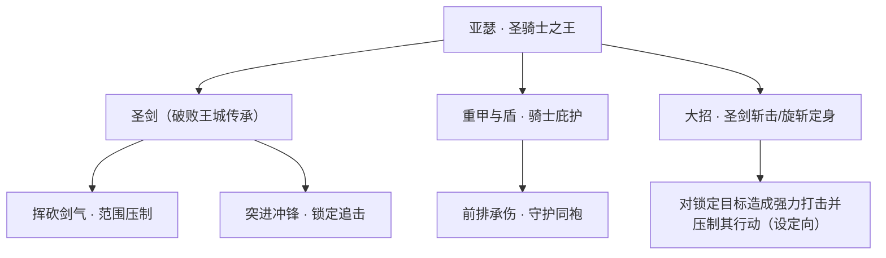

- **圣剑（破败王城传承）**：亚瑟最具标志性的武器，承载圣骑士王朝的荣誉与他残存的记忆。挥砍可造成范围杀伤，亦能借势突进、贴近敌人。
- **重甲与盾·骑士庇护**：作为坦克属性的体现，他以厚重甲胄站在最前，替队友承受伤害，是战线的「人形壁垒」。
- **绝技·圣剑终斩（设定向命名，考据推测）**：其代表性的强力一击，凝聚骑士王全部力量对目标造成沉重打击并压制其行动，象征「以正义之名做出最终裁决」。

> 说明：以上为基于背景设定的叙事化描述，不涉及具体游戏数值；技能名称如带特殊含义处已标注「(考据推测)」。

### 重要事件 / 剧情参与

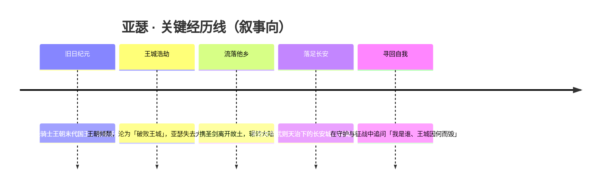

- 作为《王者荣耀》初代上线的代表性英雄之一，长期被官方与玩家视为「最易上手」的新手引导英雄。
- 多次出现在官方 **CP 主题皮肤短剧 / 情感向活动**中，尤以与[安琪拉](jixia.md#安琪拉)的互动最为知名（见下「羁绊关系」「皮肤故事亮点」）。
- 在长安城世界观整合后，被纳入「中枢·长安」体系，成为这座方舟雄城中众多流落者之一。

### 羁绊关系

| 对象 | 关系 | 说明 |
| --- | --- | --- |
| [安琪拉](jixia.md#安琪拉) | 仰慕者 / 半官方CP（存争议） | 安琪拉（体内寄宿魔法师梅林）对亚瑟怀有倾慕之情，官方多套CP皮肤予以认证；但剧情层面更接近「仰慕者—被仰慕者」，而非对等恋人。 |
| [艾琳](shanggu-shenhua.md#艾琳) | 情感线·存争议（考据推测） | 有说法认为亚瑟剧情向的情感对象其实是艾琳，与安琪拉的CP定位形成争议；官方未给出明确坐实，故标注存争议。 |
| [程咬金](#程咬金) | 同阵营战友（同道） | 同属长安城的前排近战，皆以「守护」为旨；二者在阵营层面同为长安的肉盾/战士担当（考据推测：属阵营同框，非强剧情绑定）。 |
| [武则天](#武则天) | 治下君民式关联 | 亚瑟流落于女帝武则天统治的长安城，于其治下重立骑士之身。 |

### 经典台词

::: quote 亚瑟 · 经典台词
「圣光会赐予我力量！」（考据推测）

「以正义之名，惩戒邪恶！」（考据推测）

「为了破败王城的荣耀！」（考据推测）

「失去的记忆，并不能动摇我的信念。」（考据推测）
:::

### 皮肤故事亮点

- **CP 主题皮肤（亚瑟 × 安琪拉）**：官方推出过多套以二人为核心的情侣 / CP 主题皮肤与配套短剧，奠定了「魔法少女仰慕圣骑士王」这一深入人心的同框印象。这条情感线在玩家社群中流传极广，也因「仰慕向、剧情未对等坐实」而长期被讨论（详见上「羁绊关系」）。
- 亚瑟的系列皮肤大多紧扣其「骑士王」内核，无论是更显神圣华贵的圣骑士造型，还是其他主题演绎，核心始终是「剑·盾·披风」三件套所象征的守护与荣誉。

> 注：本片段中皮肤具体名称与剧情细节如无十足把握，均按设定脉络概述并标注「(考据推测)」，未臆造硬性官方设定。

---

## 铠

<span class="hok-tags"><span class="tag warrior">战士</span><span class="tag tank">坦克</span></span>

**暗影游侠 · 从日落海漂流而来、以暗影之剑斩断宿命的孤独守护者**

| 档案项 | 内容 |
| --- | --- |
| 称号 | 暗影游侠 |
| 定位 | 战士 / 坦克 |
| 所属 | [长安城](../factions/changan.md)（隶属长城守卫军 / 关联龙域） |
| 身份 | 长城守卫军战士、龙域守护者、暗影之剑持有者 |
| 别称 | 暗影游侠、铠（由花木兰命名）、「狂暴姿态」时被同袍唤作「暗影」 |
| 关系 | [花木兰](#花木兰)（拾得并命名之人 / 同袍）、[李信](#李信)（长城守卫军同袍 / 主官）、[苏烈](changcheng.md#苏烈)、[百里守约](changcheng.md#百里守约)、[百里玄策](changcheng.md#百里玄策)、[裴擒虎](baiyue.md#裴擒虎)、[盾山](changcheng.md#盾山)（长城守卫军战友） |
| 登场作品 | 《王者荣耀》英雄背景设定、长城守卫军系列剧情与皮肤（考据推测） |

### 背景故事

关于铠的来历，连他自己也无从言说——因为他的记忆，是从一片被浪头拍碎的海岸开始的。

某一天，长城脚下的日落海退潮之后，一具几乎被海水泡白的躯体被冲上礁石。那并非寻常的遇难者：他的右臂残留着深色的、近乎活物般缓慢蠕动的纹路，身旁横陈着一柄沉默而冰冷的长剑，剑身吞光，仿佛能把照在它上面的夕照尽数咽下。是巡边的长城守卫军女将[花木兰](#花木兰)最先发现了他。当时所有人都以为这只是一具尸体，唯有花木兰俯身时，察觉那残破胸腔里还残着一缕极微弱、却异常顽固的呼吸。她把他从冰冷的潮水里拖了出来。

醒来的人没有名字，没有过往，没有家乡，甚至说不清自己究竟是人、还是别的什么。他只记得那柄剑——更准确地说，是那柄剑「记得」他。于是花木兰为他取了一个名字：**铠**。如同将士披甲，护人于刀兵之间；也如同他周身那层挥之不去的、似铠似影的暗色气息。从此，这个从日落海漂来的无名者，有了一个可以被呼唤、可以归队、可以并肩赴死的身份。

铠加入了长城守卫军。这支驻守王者大陆北疆、以血肉之躯抵御大漠魔种与外患的边军，向来不问出身，只问你是否肯为同袍挡下那一刀。铠正是这样的人。他寡言、孤独，却在每一场守城与野战中冲在最前——他似乎天生不畏惧那些足以让寻常士卒崩溃的魔潮，反而在愈是凶险的战阵中，愈显得如鱼得水。同袍们渐渐发现，铠手中那柄剑并不普通：交战正酣、杀气最盛之际，剑身会渗出黑色的暗影，沿着他的手臂攀爬上身，将他整个人包裹成一副狰狞的「狂暴姿态」。在那种状态下的铠，力量、速度与气势都判若两人，宛如另一个潜伏在他血肉之下的存在被唤醒了。

这力量从何而来？设定中将铠与**龙域**相联系——他被称作龙域的守护者，那柄能吞噬光线、渴求杀戮的暗影之剑，亦被认为与龙族、与某种古老而暴烈的血脉之力有关（考据推测）。剑既是他的武器，也是他的诅咒：它给予铠足以独当一面的战力，却也时时引诱着持剑者沉入暴怒与杀意，让「人」的那一部分逐渐被「影」吞没。铠最深的恐惧，从来不是城外的魔种，而是握剑太久之后，那个连自己都认不出的自己。

于是，「暗影游侠」这个称号便有了双重的分量。它指向他来去如影、独行于边塞荒野的身姿；也暗示着他终其一生都在与体内那道暗影角力——在守护他人的同时，守住自己尚未泯灭的人性。在长安城这座以「方舟之秘」与上古封印为底色的雄城叙事里，铠这样一个失忆而被异力寄身的守护者，恰是「以个体之身承载未知伟力、并选择以之护人而非噬人」这一母题的鲜明注脚（考据推测）。

### 性格与形象

铠是典型的「沉默的强者」。他话不多，常年独来独往，把自己裹在斗篷与阴影里，仿佛刻意与人群保持一臂的距离。这份疏离并非冷漠，而是出于自知——他清楚自己体内住着一头随时可能挣脱的野兽，于是宁愿独行，也不愿在失控时殃及身边的同袍。

外形上，铠最具辨识度的意象有三：其一是那身仿佛由暗影凝成的甲胄与斗篷，平时收敛、临战膨张；其二是那柄吞光的暗影之剑，巨大、沉重、剑身泛着幽暗的金属冷光；其三便是他的「狂暴姿态」——暗影沿臂攀身，将他整个人放大、扭曲成一副半人半兽般的狞厉模样，象征着克制与失控之间那道脆弱的界线。

象征意义上，铠是「双面」的化身：人与影、理智与暴怒、守护与毁灭，这些对立的两极都在他一人之身上拉扯。也正因如此，他比任何全然光明或全然黑暗的角色都更接近「人」——挣扎，本身就是他最动人的底色。

### 战斗风格与能力（设定向）

铠的战斗哲学可以概括为一句话：**以暗影喂养暗影，越是濒死，越要前压。** 他不是退守型的坦克，而是一头愈战愈狂的近战猛兽。

- **暗影之剑**：铠最核心的力量来源。剑身能吞噬光线、汲取战场上的杀气，在激斗中释放出黑色暗影缠绕持剑者。这柄剑既是兵器也是「容器」，据设定与龙域/龙族暴烈血脉相关（考据推测）。
- **狂暴姿态（暗影爆发）**：当杀意累积到临界，铠会进入暗影包裹全身的狂暴形态，力量、攻速与生存能力大幅跃升，是他扭转战局、孤身鏖战的杀手锏。代价则是更难自控。
- **以攻代守**：作为战士/坦克双定位，铠并不依赖站桩硬扛，而是借暗影之力在敌阵中持续输出、缠斗收割，把「坦度」转化为压迫与威胁。

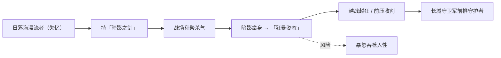

### 重要事件 / 剧情参与

- **日落海获救与命名**：退潮后被[花木兰](#花木兰)在礁石间发现并救起，由她取名「铠」——这是铠人生（已知部分）的起点。
- **加入长城守卫军**：以无名漂流者身份加入北疆边军，与[苏烈](changcheng.md#苏烈)、[李信](#李信)、[百里守约](changcheng.md#百里守约)等同袍并肩，参与守城与抵御大漠魔种的边塞战事。
- **与体内暗影的长期角力**：贯穿其角色弧光的核心冲突——在「狂暴姿态」赋予的力量与失控风险之间反复抉择，是「守护者亦是被守护者」这一命题的载体。

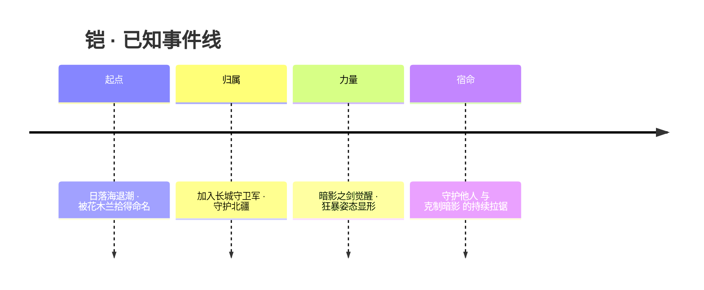

### 羁绊关系

| 对象 | 关系 | 说明 |
| --- | --- | --- |
| [花木兰](#花木兰) | 拾得者 / 命名者 / 同袍 | 日落海退潮后将濒死的铠救起，并为这个失忆者取名「铠」；二人同属长城守卫军，是铠与「人」之世界最初的连结。 |
| [李信](#李信) | 长城守卫军同袍 / 主官 | 李信由苏烈接纳教导后接任长城守卫军指挥官，铠为其麾下战士，并肩守边。 |
| [苏烈](changcheng.md#苏烈) | 长城守卫军前辈 / 战友 | 守护边境长城、抵御大漠魔种的同一支边军核心，铁壁苏烈是这支队伍的精神支柱之一。 |
| [百里守约](changcheng.md#百里守约) | 长城守卫军战友 | 同守北疆，远射与近战相互掩护的搭档关系。 |
| [百里玄策](changcheng.md#百里玄策) | 长城守卫军战友 | 同属长城守卫军，共御外患。 |
| [盾山](changcheng.md#盾山) | 长城守卫军战友 | 同守城墙，盾阵与前压的协同。 |
| [裴擒虎](baiyue.md#裴擒虎) | 长城守卫军关联战友 | 同被列入守护长城、抵御大漠魔种的同阵营战友序列。 |

### 经典台词

::: quote 铠 · 台词
「斩断束缚我的，唯有手中之剑。」（考据推测）

「暗影，是我的盔甲，也是我的牢笼。」（考据推测）

「站到我身后——这里，由我来守。」（考据推测）
:::

### 皮肤故事亮点

铠拥有多款人气皮肤（如「曙光守护者」「龙域领主」「黯雷骑将」等系列方向），其皮肤叙事大多延续两条主线：一是**光与影的对照**——以更明亮、骑士化的造型呼应他「以暗影守护光明」的本心；二是**龙域之力的具象**——强化其与龙族暴烈血脉、暗影巨剑的设定关联，把「狂暴姿态」演绎成更具压迫感的领主形象（考据推测，具体皮肤剧情以官方为准）。

---

## 狂铁

<span class="hok-tags"><span class="tag warrior">战士</span></span>

**百炼成钢 · 以仇恨为燃料、以残臂铁拳熔铸的近战战士**

| 项目 | 内容 |
| --- | --- |
| 称号 | 百炼成钢 |
| 定位 | 战士（近战 / 战边） |
| 所属 | [长安城](../factions/changan.md)（北疆边陲一脉，关联 [长城守卫军](../factions/changcheng.md)） |
| 身份 | 失去一臂的边塞老兵 / 持机关义肢的复仇者（考据推测：与长城戍边、抵御大漠魔种的体系相关） |
| 别称 | 铁拳、老铁、百炼成钢 |
| 关系 | [李信](#李信)、[苏烈](changcheng.md#苏烈)、[花木兰](#花木兰)、[铠](#铠)、[李白](#李白) 等戍边/江湖人物（考据推测） |
| 登场作品 | 《王者荣耀》英雄登场（战士） |

### 背景故事

狂铁并非生来便是一身钢铁的战士。在他被人记住的那个名号之前，他只是大漠边缘、长城脚下无数戍卒中的一个——一个会流血、会疲惫、也会害怕的普通人。王者大陆的北疆是一道永恒的伤口：[长安城](../factions/changan.md)作为大陆中枢繁华鼎盛，可它的安宁，是由远在边境的高墙与无名者的尸骨一寸寸顶起来的。大漠深处涌出的魔种(考据推测：即长城守卫军世代抵御的大漠魔潮)从不止息，而站在最前线承受第一波冲击的，往往就是狂铁这样既无显赫出身、也无传说兵刃的普通士卒。

命运在一场惨烈的鏖战中把狂铁碾碎了。当魔种的潮水漫过防线，他失去了自己的一条手臂——也几乎失去了活下去的理由。许多和他并肩的弟兄没能挺过那一夜，而他被从尸堆与残垣里拖了出来，只剩半条命和一个再也无法握紧兵器的残臂。对一个把全部价值都系在"能不能战斗"上的老兵而言，断臂比死更难捱：他被战场抛弃了，却又不甘心就这样躺下。

真正让狂铁"重生"的，是钢铁。(考据推测：长安城本质是墨家巨匠墨子所建、融合上古机关浮空城技术的方舟，机关造物之术在这片大陆并不稀奇——参见 [墨家机关道](../factions/mojia-jiguan.md)。)他为自己接上了一只沉重的机关义肢，一具用铁与火重新锻造出来的"手臂"。这只铁拳冰冷、笨重，每一次挥动都伴随着金属的轰鸣与残肢传来的剧痛，可它也意味着他能重新站回战场。从那一刻起，狂铁不再仅仅是一个戍卒，而成了一具被仇恨与不甘反复回炉、淬火、捶打出来的兵器。**百炼成钢**——钢不是天生的，是在炉火里一遍遍被烧红、被锤击、被淬冷，才有了不折的硬度。狂铁的人就是这样炼成的。

支撑他走下去的，是一种近乎偏执的执念：他要把曾经夺走他的手臂、夺走他弟兄性命的一切，连本带利地讨回来。战斗对他而言已经不只是职责，而成了存在本身。他越是被打、被恨、被锁定为众矢之的，体内那股被压抑的怒火就越是高涨；而当怒火累积到极致，那只机关铁拳便会爆发出常人难以想象的力量。仇恨没有把他烧成灰，反而成了他重新熔铸自己的燃料。

如今的狂铁，是一个把痛苦穿在身上当铠甲的人。他用残破之躯证明：被命运折断的人，未必会倒下——有时候，断口处会长出更硬的东西。

### 性格与形象

- **性格**：刚硬、执拗、不善言辞，是典型的"用拳头说话"的硬汉。他不相信怜悯，也不需要同情——比起被人安慰，他更愿意被人当成对手。越是身处绝境、越是被敌人盯死，他反而越亢奋，因为那正是他证明自己仍然"有用"的时刻。表面冷硬，内里却埋着对逝去弟兄的愧疚与不甘，这份执念是他全部力量的源头。
- **外形与象征意象**：标志性形象是那只巨大、沉重、布满铆钉与齿轮纹路的机关义肢——它取代了他失去的手臂，是他全身最显眼也最具象征意义的部分。袒露的躯干上爬满旧伤疤，与冰冷的钢铁义肢形成血肉与机械的强烈对比。象征意象集中在"铁"与"炼"二字：炉火、铁锤、淬火的钢——他本人就是一块被反复锻打的钢坯，把痛苦炼成了硬度，把仇恨炼成了力量。

### 战斗风格与能力(设定向)

狂铁的战斗哲学与其名号一脉相承：**越被针对，越强**。他不是依靠华丽的剑招或法术，而是依靠那只机关铁拳，以及胸中那团永不熄灭的怒火。

- **机关义肢（铁拳）**：以铁与火重铸的近战兵器，既是他失去手臂后的替代品，也是他最锋利的武器。挥击时带着金属碾压般的钝重感，越蓄力、轰鸣越盛。
- **仇恨为燃料**：(设定向)狂铁的核心是"以恨蓄力"——他承受的敌意、被锁定的目标、近身的厮杀都会不断为他积攒怒火；怒火累积到顶点时，铁拳会进入爆发姿态，攻击的力道与速度都被推上一个全新的台阶。这也呼应了他"百炼成钢"的本质：钢需要在反复的捶击中才能成形，狂铁的强大同样需要在持续的对抗中被一锤锤"打"出来。
- **百炼之躯**：长年戍边与机关义肢赋予他超乎常人的耐打与续战能力。他擅长扎进敌阵最危险的中心、吸引火力、再以蓄满的铁拳还以颜色，是越打越凶、越绝境越可怕的近战搅局者。

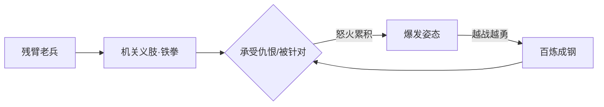

### 重要事件 / 剧情参与

- **北疆鏖战与断臂**：在抵御大漠魔种的边境战役中失去一臂、痛失袍泽，这是塑造他全部动机的转折点。(考据推测：与长城守卫军世代戍边的世界观背景相呼应。)
- **以钢重生**：接上机关义肢、重返战场，从被战场抛弃的伤兵，蜕变为"百炼成钢"的复仇战士。
- **背景活动 / 资料片**：作为《王者荣耀》战士定位英雄登场；其叙事多见于英雄背景设定与对应皮肤剧情之中。(考据推测：具体联动剧情以官方为准。)

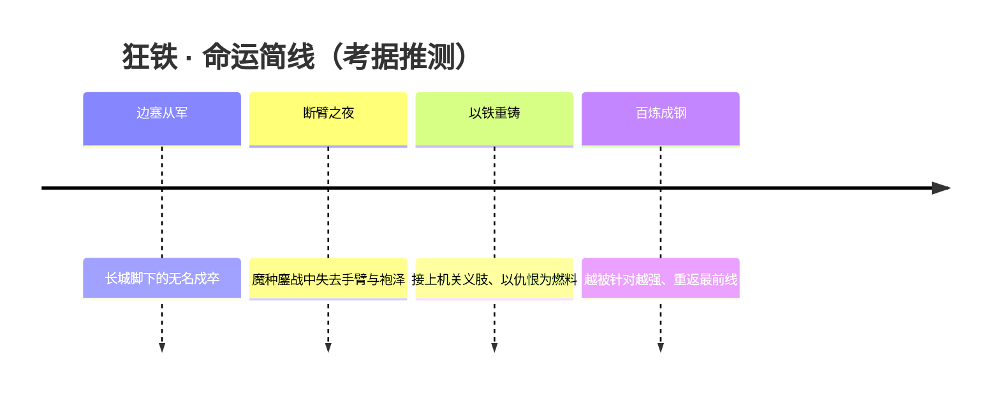

### 羁绊关系

> 注：狂铁的官方明确羁绊较少，下表为基于其北疆戍边、长城守卫军世界观背景的关联梳理，确有不确定处均标注「(考据推测)」。

| 对象 | 关系 | 说明 |
| --- | --- | --- |
| [李信](#李信) | 同袍 / 戍边同道(考据推测) | 二者皆与长城戍边、抵御大漠魔种的体系相关，李信曾为[长城守卫军](../factions/changcheng.md)统帅。 |
| [苏烈](changcheng.md#苏烈) | 边军前辈(考据推测) | 苏烈是不屈铁壁、长城守卫军的中坚，狂铁的"百炼之躯"与边军不屈的气质同源。 |
| [花木兰](#花木兰) | 战友(考据推测) | 长城小队队长、戍边女将，与狂铁同属守边一脉。 |
| [铠](#铠) | 战友(考据推测) | 由花木兰拾得命名、加入长城戍守，与狂铁同在北疆体系。 |
| [长安城](../factions/changan.md) | 所属阵营 | 狂铁所属的中枢阵营，其安宁正由北疆边军以血肉顶起。 |

### 经典台词

::: quote 狂铁 · 台词（部分标注考据推测）
"百炼，方能成钢。"（考据推测）

"断了一只手，又怎样？我还能站着。"（考据推测）

"尽管恨我吧——你的恨，正是我的力量。"（考据推测）

"钢铁不会哭，也不会退。"（考据推测）
:::

---

## 李信

<span class="hok-tags"><span class="tag warrior">战士</span></span>

**一念神魔 · 一念光明，一念黑暗——能在光信与暗信两种姿态间切换的长城守卫军前统帅。**

| 项目 | 内容 |
| --- | --- |
| 称号 | 一念神魔 |
| 定位 | 战士 |
| 所属 | [长安城](../factions/changan.md)（长城守卫军体系） |
| 身份 | 长城守卫军前任指挥官 / 统帅；孤儿出身的边军子弟 |
| 别称 | 光信（光之形态）、暗信（暗之形态）（考据推测，源自双形态俗称） |
| 关系 | [苏烈](changcheng.md#苏烈)（恩师·养育者）、[花木兰](#花木兰)（袍泽·继任者）、[铠](#铠)（同袍）、[百里守约](changcheng.md#百里守约)、[百里玄策](changcheng.md#百里玄策)、[伽罗](changcheng.md#伽罗)、[盾山](changcheng.md#盾山)、[戈娅](changcheng.md#戈娅)（长城守卫军战友） |
| 登场作品 | 《王者荣耀》英雄；2019 长城守卫军主题季登场（考据推测） |

### 背景故事

在王者大陆的最北端，矗立着一道横亘东西、隔绝中原与大漠的巨墙——长城。墙外是被称作「魔种」的大漠异兽所盘踞的死寂荒原，墙内是需要被守护的万家灯火。世代驻守于此、以血肉之躯填补缺口的，便是隶属于[长安城](../factions/changan.md)中枢、却长年戍边的**长城守卫军**。李信，正是从这道墙的阴影里长出来的孩子。

他本是一名流落街头的孤儿，无名无姓，在边城的尘土与饥饿中挣扎求生。是当时的长城守卫军统帅、被称作「不屈铁壁」的[苏烈](changcheng.md#苏烈)收留并教导了他——苏烈接纳了这个无家可归的少年，授之以武艺、铠甲与信念，把一个街头野孩子锤炼成顶天立地的军人（依据本阵营长城守卫军关系设定）。对李信而言，长城守卫军不只是一支军队，而是给了他姓名、身份与归属的「家」；苏烈不只是上级，更近乎养育他的父亲。这份恩义，成了贯穿他一生的底色，也成了他日后所有抉择的重量所在。

凭借过人的天赋、苦修的意志与对守护一事近乎执拗的信念，李信一路成长，最终**接任长城守卫军的指挥官**，从被庇护者变成了庇护者。他站到了苏烈曾经站立的位置，背负起整条防线的安危，与[花木兰](#花木兰)、[铠](#铠)、[百里守约](changcheng.md#百里守约)、[百里玄策](changcheng.md#百里玄策)、[伽罗](changcheng.md#伽罗)、[盾山](changcheng.md#盾山)、[戈娅](changcheng.md#戈娅)等一众袍泽并肩，在魔种一次又一次的潮汐般的冲击下，把那道墙守成了不会塌的承诺。

然而「一念神魔」这个称号本身，就藏着他命运的裂痕。长城所抵御的并非寻常野兽，而是带着某种侵蚀性力量的大漠异种；长期与之搏杀、或在某次重大变故中（考据推测：与魔种之力或体内潜伏的暗面力量觉醒相关），李信的体内被植入或唤醒了一股黑暗的力量。自此，他的存在被一分为二：一面是承袭自守卫军信念、以厚重铠甲与盾意守护他人的**光之李信（光信）**；另一面是被黑暗驱动、以爆发与杀戮收割敌人的**暗之李信（暗信）**。光与暗并非两个人，而是同一颗心的两种倾向——守护与毁灭、克制与释放、神性与魔性，仅在「一念」之间。

这便是他人生最深的命题：作为统帅，他必须强大到足以斩断一切威胁；可越是动用那股黑暗的力量，他就越靠近自己最恐惧的东西。他守的是墙外的魔，可真正最难驯服的魔，住在他自己的胸膛里。一念光明，他是守护者；一念黑暗，他便是那需要被守护者们防范的存在。李信的故事，是一个用尽全力对抗外敌的英雄，同时在与自己内心的深渊进行着永不停歇的拉锯。

### 性格与形象

李信沉默、坚毅、责任感极重。出身孤苦让他格外珍惜「归属」二字，也因此把守卫军的荣誉与同袍的性命看得高于自己。他不善言辞，更愿意用行动与背影说话——这是典型的边军军人气质，也是被苏烈一手塑造出的品格。

在形象上，他的双形态构成了强烈的视觉与象征对照：

- **光信（光之形态）**：身披厚重铠甲，色调偏向金白与暖光，姿态稳重如墙，强调「守」。象征他作为统帅承接的责任与对苏烈精神的延续——人挡在身前，便是城墙。
- **暗信（暗之形态）**：甲胄转为深暗、锋锐冷峻，气息凌厉危险，强调「杀」。象征体内觉醒的黑暗力量，是他不得不与之共处、又必须时刻提防的另一个自己。

「一念神魔」四字，正是他外形与内心的统一象征：神与魔同源，光与暗共体，分野只在一念。

### 战斗风格与能力（设定向）

李信最大的特点，是**可在战斗中切换光、暗两种形态**，以应对不同的局势——这一机制直接对应其「一念之间，光暗互转」的背景设定（本阵营英雄一句话定位：光为坦克型、暗为爆发刺杀型）。

- **光信 · 守护之姿**：偏向坦克型打法，以厚甲、控制与抗压为核心，承担挡刀、开团、保护后排的统帅职责，呼应其守卫军指挥官的身份。
- **暗信 · 毁灭之姿**：偏向爆发刺杀，以高机动突进与瞬间斩杀收割残局，呼应其体内被唤醒的黑暗力量。

他的力量来历有二重根：一是长城守卫军给予的训练、铠甲与「守护」的信念（光之源），二是与魔种长期搏杀中浸染、觉醒的暗面之力（暗之源）。在叙事层面，这种「一身两力」的设定本身就是其战斗风格的内核——他越是切换到暗的一面，输出越凶猛，离失控也越近，战斗对他而言始终是一场与自我的博弈。

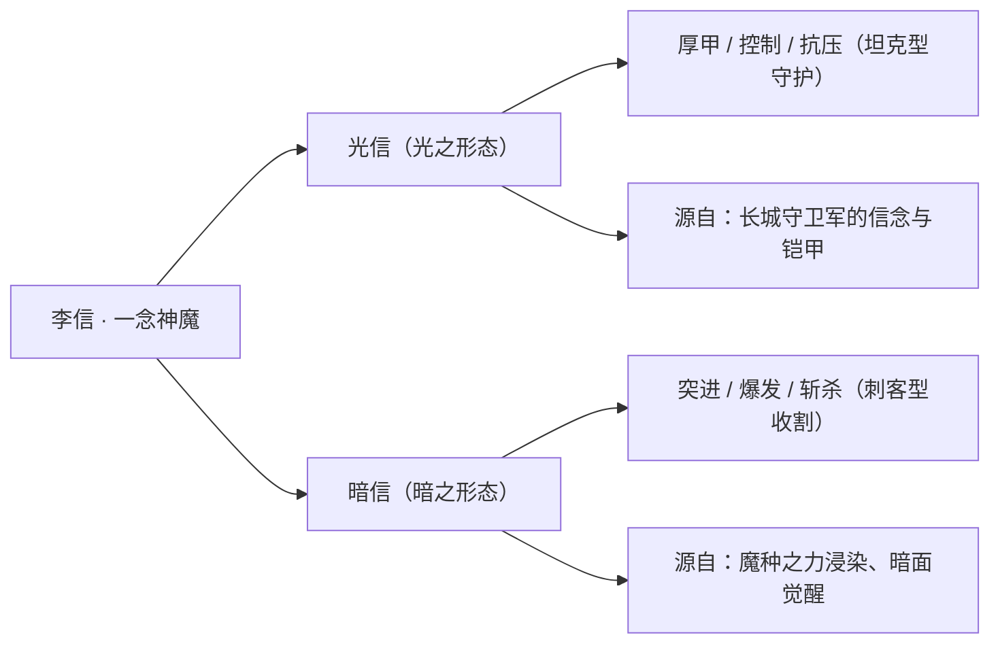

> 说明：以上为基于背景设定的力量来历描述，非游戏数值。

### 重要事件 / 剧情参与

- **被苏烈收留、踏入长城守卫军**：流落街头的孤儿被「不屈铁壁」[苏烈](changcheng.md#苏烈)接纳与教导，由此获得姓名、身份与一生信念的起点。
- **接任长城守卫军指挥官**：成长为统帅，从被庇护者变为庇护者，承接苏烈曾守护的整条边防线。
- **一念神魔的分裂**：体内黑暗力量觉醒，自此存在被光信、暗信一分为二，开始与自我深渊的长期对抗（考据推测：与魔种之力相关）。
- **守护长城、抵御大漠魔种**：与[花木兰](#花木兰)、[铠](#铠)、[百里守约](changcheng.md#百里守约)、[百里玄策](changcheng.md#百里玄策)、[伽罗](changcheng.md#伽罗)、[盾山](changcheng.md#盾山)、[戈娅](changcheng.md#戈娅)等并肩，在魔种一次次冲击中守住防线。

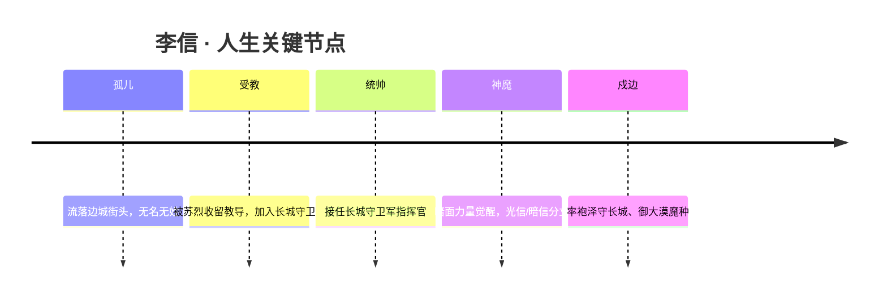

### 羁绊关系

| 对象 | 关系 | 说明 |
| --- | --- | --- |
| [苏烈](changcheng.md#苏烈) | 恩师 / 养育者 | 苏烈接纳并教导流落街头的李信，授其武艺与信念；李信后接任其统帅之位，恩义如父子（依据长城守卫军关系设定）。 |
| [花木兰](#花木兰) | 袍泽 / 守卫军同僚 | 同属长城守卫军体系的猛将，并肩戍守边境、抵御魔种。 |
| [铠](#铠) | 同袍 | 从日落海漂流而来、被花木兰拾得命名后加入长城的守护者，与李信同为守卫军一员。 |
| [百里守约](changcheng.md#百里守约) | 守卫军战友 | 长城防线上的远程狙击之力，共御大漠魔种。 |
| [百里玄策](changcheng.md#百里玄策) | 守卫军战友 | 长城少年游侠，同袍并肩。 |
| [伽罗](changcheng.md#伽罗) | 守卫军战友 | 以破魔之箭对抗魔种，同守长城。 |
| [盾山](changcheng.md#盾山) | 守卫军战友 | 以坚盾承挡冲击，与李信守护信念相契。 |
| [戈娅](changcheng.md#戈娅) | 守卫军战友 | 银翼飞将，长城防线一员。 |

### 经典台词

::: quote 李信 · 一念神魔
一念神魔，一念之间。（考据推测）

光明与黑暗，皆在我心。（考据推测）

长城之内，由我来守。（考据推测）
:::

---

## 李白

<span class="hok-tags"><span class="tag assassin">刺客</span></span>

**青莲剑仙 · 十步杀一人的剑客诗人，长安城最负盛名的游侠**

| 档案项 | 内容 |
| --- | --- |
| 称号 | 青莲剑仙 |
| 定位 | 刺客 |
| 所属 | [长安城](../factions/changan.md) |
| 身份 | 浪迹江湖的剑客与诗人、长安第一游侠；身负狐族血脉（考据推测：与妖狐一族同源） |
| 别称 | 诗仙、剑仙、谪仙人（考据推测，承袭历史原型「诗仙李白」之名） |
| 关系 | 世交挚友 [韩信](jianghu-xiake.md#韩信)；追捕者 [狄仁杰](#狄仁杰)；间接关联女帝 [武则天](#武则天)、女帝耳目 [上官婉儿](#上官婉儿)；被偶像化于 [曜](#曜) 的星之队叙事 |
| 登场作品 | 《王者荣耀》本传；衍生动画/CG（凤求凰、千年之狐等皮肤主题短片）（考据推测） |

### 背景故事

李白生于盛唐治下的长安城——这座由稷下三贤者之一[墨子](mojia-jiguan.md#墨子)亲手建造的「大陆第一雄城」。在世人眼中，它是商旅文人、豪侠诸族和谐共处的繁华都会；而在更深的设定里，长安实为一座封印之城，是镇压上古之力的「方舟」，地底封存着方舟核心的能量。李白便是在这盛世表象与暗流秘辛交织的城中，走出了属于自己的一条剑路。

李白并非寻常人类。皮肤剧情明确点出他身负狐族血脉，与栖居山林、寿数绵长的妖狐一族同源。也正因这层血脉，他与同样身负异族血统的[韩信](jianghu-xiake.md#韩信)（龙族）自幼相识——狐、龙两族世代为友，两个少年一同修行、一同闯荡，甚至互用彼此随身之物。这段跨越种族的情谊，成为日后「凤求凰」（李白）与「白龙吟」（韩信）两套皮肤遥相呼应的根脉。

与历史原型「诗仙李白」一脉相承，游戏中的李白同样是一位以诗会友、以酒为伴的浪漫人物。他不愿被庙堂的规矩与门第所束缚，宁可仗剑天涯、浪迹江湖，把一身惊世剑术藏进诗句的吟咏之间。「十步杀一人，千里不留行」——这出自史载李白《侠客行》的名句，被原样化用为他在王者大陆的人格底色：剑出无形，杀伐果决，事了拂衣，不矜其名。

然而潇洒的代价，是他始终游走在长安律法的边缘。他放浪形骸、藐视权威的作派，加之那身深不可测的剑术，使他成为长安官府眼中难以约束的危险存在。在女帝[武则天](#武则天)统治的长安城内，神探[狄仁杰](#狄仁杰)奉命追缉这位「青莲剑仙」——李白由此成为狄仁杰长期追捕的对象，而追捕与逃亡，构成了他在长安主线中最鲜明的一条故事线。这条线又因女帝串联起更广的人物网：李白—狄仁杰—武则天—女帝耳目[上官婉儿](#上官婉儿)，彼此牵动。（考据推测：官府追缉的具体缘由在不同文本中说法不一，此处依阵营关系设定取「藐视律法的危险游侠」一说。）

李白的故事核心，始终是「自由」二字。他既是长安城繁华的一部分，又拒绝被这座城所定义；既身怀足以搅动风云的力量，又只愿把它用在快意恩仇、护持挚友之上。在方舟之秘、女帝权术、尧天暗流层层缠绕的长安，他像一道不肯被收进鞘里的剑光，提醒着这座封印之城——总有人为「逍遥」而活。

### 性格与形象

李白性情洒脱不羁，恃才放旷，嗜酒成癖，越是酒酣耳热越是剑势凌厉，颇有「酒入豪肠，三分啸成剑气」的意态。他傲岸而不刻薄，重情重义，对挚友[韩信](jianghu-xiake.md#韩信)肝胆相照，对世俗权贵却懒得逢迎。诗与剑在他身上合二为一：杀招即诗句，诗句即杀招。

外形上，他一袭青白衣袍，腰悬酒葫芦，手持长剑，举手投足带着文人的清逸与游侠的锋锐。「青莲」之号既取自历史李白「青莲居士」的别称，也呼应其形象中清冷出尘、如莲出水的气质。其象征意象集中于「剑、酒、诗、月」——剑代表力量，酒代表自由，诗代表才情，而月光下独酌行剑的画面，则把他孤高自适的灵魂烘托得淋漓尽致。

### 战斗风格与能力(设定向)

作为长安第一游侠，李白的力量来自天赋异禀的狐族血脉与多年浪迹中磨砺出的绝顶剑术，二者相融，化作一套「以诗为名、以剑为形」的杀伐之道。

- **剑器与意境**：李白以长剑为主兵，但他真正的武器是「剑意」——出剑讲求身随剑走、剑随心动，连绵不绝如行云流水，正合其诗中「千里不留行」的飘逸（设定向描述，非游戏数值）。
- **侠客行**：其代表绝技取意于《侠客行》。「十步杀一人」意味着他能在转瞬间欺近目标、于十步之内取敌性命；连环突进之后，往往以一记凝聚全身剑意的斩击收束，事了便从容抽身。
- **酒与剑的共鸣**：嗜酒的设定被融入战斗——酒愈酣，剑意愈盛，这与历史原型「斗酒诗百篇」的浪漫一脉相承（考据推测：将「饮酒—爆发」的意象作为战斗风格诠释）。

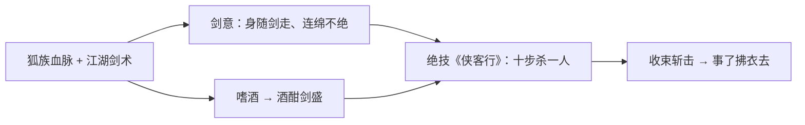

### 重要事件 / 剧情参与

- **长安追逃**：作为神探[狄仁杰](#狄仁杰)的追捕对象，李白在长安城上演长期的「追捕—逃亡」戏码，这条线由女帝[武则天](#武则天)串联，旁及[上官婉儿](#上官婉儿)。
- **狐龙世交**：与龙族[韩信](jianghu-xiake.md#韩信)自幼相识、一同修行的往事，是「凤求凰 / 白龙吟」皮肤剧情的叙事核心。
- **被偶像化**：在稷下，[曜](#曜) 以李白为偶像，并以此为精神动力组建「星之队」参加[庄周](penglai-donghai.md#庄周)的归虚梦演大赛——李白虽未亲身入局，却以「青莲剑仙」之名成为后辈追慕的标杆。

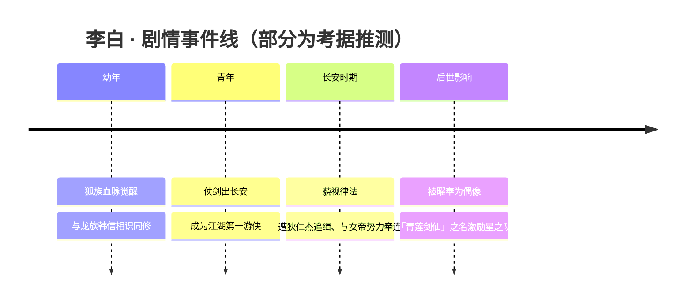

### 羁绊关系

| 对象 | 关系 | 说明 |
| --- | --- | --- |
| [韩信](jianghu-xiake.md#韩信) | 世交挚友（恋人定性未坐实） | 李白属狐族、韩信属龙族，两族世代为友；二人自幼相识、一同修行、互用彼此之物（凤求凰/白龙吟皮肤呼应）。玩家常将「信白」视作 CP，官方更接近世交挚友/相爱相杀。 |
| [狄仁杰](#狄仁杰) | 追捕—逃亡 | 在长安城内，李白是神探狄仁杰的追捕对象，构成其长安主线最鲜明的一条线。 |
| [武则天](#武则天) | 间接牵连（女帝势力） | 李白—狄仁杰—武则天—上官婉儿因女帝串联，追逃线背后是长安女帝权力结构。 |
| [上官婉儿](#上官婉儿) | 间接关联（女帝耳目） | 上官婉儿为女帝耳目密探，与狄仁杰、武则天同处一张关系网，间接关联李白追逃线。 |
| [曜](#曜) | 被仰慕者—仰慕者 | 曜以李白为偶像，以其为精神动力组建星之队、参加归虚梦演大赛。 |

### 经典台词

::: quote 台词
「十步杀一人，千里不留行。」（化用史载李白《侠客行》）
:::

::: quote 台词
「事了拂衣去，深藏身与名。」（化用史载李白《侠客行》）
:::

::: quote 台词
「醉里挑灯看剑，且听我青莲一啸。」（考据推测）
:::

::: quote 台词
「剑在手，问天下谁是英雄。」（考据推测）
:::

### 皮肤故事亮点

- **凤求凰**：以华美礼服与凤鸟意象呈现，与[韩信](jianghu-xiake.md#韩信)的「白龙吟」构成对偶——凤与龙、狐与龙，遥相呼应两族世交、二人自幼相伴的情谊，是「信白」叙事最具代表性的一组皮肤。
- **千年之狐**：直指李白的狐族血脉设定（考据推测），以狐妖意象强化其异族出身与绵长寿数的背景，是理解「李白为何不同于凡人剑客」的关键一笔。

---

## 上官婉儿

<span class="hok-tags"><span class="tag mage">法师</span><span class="tag assassin">刺客</span></span>

**惊鸿之笔 · 以笔为剑、代陛下书写万象的盛唐才女法刺**

| 档案项 | 内容 |
| --- | --- |
| 称号 | 惊鸿之笔 |
| 定位 | 法师 / 刺客 |
| 所属 | [长安城](../factions/changan.md) |
| 身份 | 女帝[武则天](#武则天)的近身女官、机要书令；代陛下行走人间的耳目与密探 |
| 别称 | 「巾帼宰相」「内舍人」（史称上官昭容；游戏内未必沿用，史料别称仅供参照） |
| 关系 | [武则天](#武则天)（君主／知遇）、[狄仁杰](#狄仁杰)（同朝、追捕案中交集）、[李元芳](#李元芳)（女帝势力同僚）、[李白](#李白)（女帝串联下的间接交集） |
| 登场作品 | 《王者荣耀》本传英雄；相关美术叙事见「梁祝」「修竹墨客」「白蛇·惊梦」等皮肤文案 |

### 背景故事

上官婉儿的故事，要从一桩牵连三代的旧案讲起。在[长安城](../factions/changan.md)——这座由稷下贤者[墨子](mojia-jiguan.md#墨子)亲手筑就、表为盛唐繁华都会、里为封存上古方舟核心的「大陆第一雄城」——权力的更替向来如笔锋转折，凌厉而不容回头。婉儿出身书香名门，祖父曾为朝中重臣；然而一场围绕太子的谋反疑案爆发，祖辈获罪，整个家族顷刻倾覆。尚在襁褓的婉儿随母没入掖庭，自由身一夜之间化作奴婢之名。（考据推测：此设定脉络与史传上官婉儿因祖父上官仪获罪、随母郑氏配入掖庭的经历相互呼应，游戏在此史影上做了王者大陆化的改写。）

罪臣之后、宫婢之身，本该湮没于深宫的浣衣与洒扫之间。但婉儿天生一支好笔。掖庭灯火昏黄，她以指为笔、以地为纸，把《诗》《骚》经史一字字临摹进心里；待稍长，她下笔成文、援古证今，词锋既有金石之硬，又有惊鸿照影之轻。这份才华终究压不住——当那位以铁腕与无瑕之姿君临长安的女帝[武则天](#武则天)读到她的文字时，命运的笔锋再一次拐弯：陛下不计旧罪，破格擢用了这个本该是仇人之后的少女，许她出入禁中、执掌机要。

自此，婉儿成了女帝身侧最特别的存在。她不只是研墨拟诏的女官，更是陛下「代为耳目、书世间万象」的那双眼睛与那支笔。诏令由她草拟，群臣的奏疏由她披阅，朝堂的风向、市井的流言、暗处的图谋，都先经她的笔尖过滤，再呈于御前。在长安这座「中枢」之城，女帝武则天统治之下，[尧天](../factions/changan.md)、占星塔、万镜阁、梨园各怀心思、明争暗斗，谁掌握了「书写」的权力，谁就握住了真相的定义权——而婉儿，正是握笔的那个人。

但握笔者亦是双面之人。对世人而言，她是「惊鸿之笔」，是才名动京华的女才子；对庙堂深处而言，她是女帝最锋利、最不动声色的密探。一支笔，既能写下盛世的颂歌，也能在墨色里藏下杀机。她游走于光与影、忠诚与自保、感恩与隐痛之间——感念女帝知遇之恩，却也始终背负着家族倾覆的旧痛；执掌着书写真相的权柄，却深知在长安，真相往往只是权力的另一种修辞。这种撕扯，正是她「法师／刺客」双定位在叙事上的底色：明面上是雍容的文人法师，落子时却是收放自如的刺杀者。

### 性格与形象

婉儿外表是典型的盛唐才女气度：身着青绿衣裙、广袖翩然，常以一管长笔随身，墨韵书香缭绕周身。她举止从容、谈吐机敏，落笔时神情专注而冷静，自有一股「下笔不让须眉」的笃定。

性格上，她兼具文人的雅与谍者的锐。对人对事，她极擅观察与权衡，话不轻出、笔不妄落；表面温雅克制，内里却清醒、决断，甚至带几分隐忍的孤傲。出身的旧痛让她比谁都清楚权力的无情，因而处世谨慎、不轻易交付真心；而才华与知遇又让她对「以一支笔立身于世」抱有近乎执拗的骄傲。

象征意象始终围绕「笔墨」：飞白与狂草的线条、随风惊起的鸿影、铺展又收束的卷轴。「惊鸿之笔」四字，既写她文采如惊鸿一瞥之美，也暗喻她出手如鸿翼掠空、转瞬即至——美与杀意并存，正是这位才女法刺的形象核心。

### 战斗风格与能力（设定向）

婉儿之战，是把「书法」化作了「剑法」。她不持刀剑，而以一支巨笔为兵；蘸的不是墨，而是凝聚的法力。挥毫之间，墨迹离纸成形，化作可斩可击的「字阵」与「飞白」，在战场上铺展成一篇杀伐的文章。

- **以笔代剑、以墨为刃**：她的攻击源自书道之力——一笔落下是横扫，一勾收锋是突刺，连绵的笔画构成连招的「章法」，讲究起承转合、一气呵成。
- **飞白／狂草**：行笔时墨迹四溅化为「飞白」，触及者皆受其锋；当她以狂草之势疾书，身形随笔意位移穿插，行云流水间已完成多段突进与收割——这是其操作上限极高、连招华丽的设定来源。
- **惊鸿一笔**：作为「惊鸿之笔」的招牌，她可凝聚法力于笔尖，划出一道贯穿而过的墨痕，如鸿翼掠空，既是位移亦是收尾的杀招，攻守一体、进退自如。

下面以一段「书道为武」的招式来历示意（仅为设定向梳理，非游戏数值）：

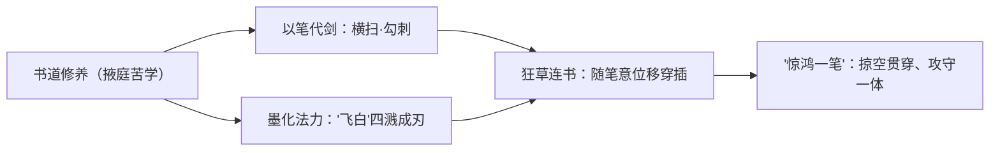

需要说明的是，上述招式名称与机制为依据其「惊鸿之笔」称号与书法主题所作的设定向归纳（考据推测），具体技能命名以游戏内为准。

### 重要事件 / 剧情参与

- **掖庭沉沦**：因祖父牵连太子谋反案，家族获罪，婉儿随母没入掖庭为婢，自此背负罪臣之后的身份。
- **才华获重用**：凭一手惊艳的书道与文章被女帝[武则天](#武则天)赏识，不计旧罪破格起用，成为出入禁中、执掌机要的近身女官。
- **女帝的耳目**：以「代陛下为耳目、书世间之万象」的身份，成为长安庙堂中游走于明暗之间的密探与机要书令。
- **长安追捕案的交集**：长安城内，游侠诗人[李白](#李白)是神探[狄仁杰](#狄仁杰)的追捕对象；而[李白](#李白)—[狄仁杰](#狄仁杰)—[武则天](#武则天)—上官婉儿这条线，因女帝的居中串联而彼此牵连，婉儿作为女帝之笔与耳目，立于这张关系网的关键一环。
- **皮肤叙事中的形象延展**：在「梁祝」「白蛇·惊梦」等美术叙事中，婉儿的「以情入墨、惊鸿照影」形象得到进一步演绎（皮肤为平行世界观演绎，非本传主线）。

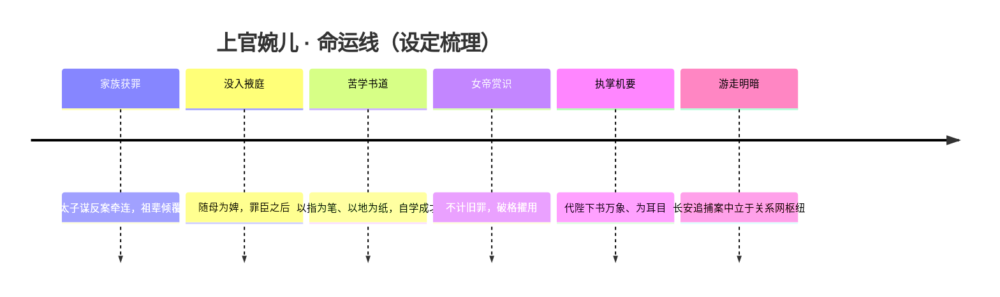

### 羁绊关系

| 对象 | 关系 | 说明 |
| --- | --- | --- |
| [武则天](#武则天) | 君主 / 知遇之恩 | 长安统治者。武则天不计婉儿家族旧罪，凭其书道才华破格起用，婉儿遂成女帝近身机要与「代陛下为耳目、书世间之万象」的密探，二人为主仆／君臣式羁绊的核心。 |
| [狄仁杰](#狄仁杰) | 同朝 / 追捕案中交集 | 大唐神探，行使律法正义。在「[李白](#李白)—狄仁杰—[武则天](#武则天)—上官婉儿」因女帝串联而成的关系网中与婉儿有交集。 |
| [李元芳](#李元芳) | 女帝势力同僚 | [狄仁杰](#狄仁杰)的护卫与得力助手，同属长安女帝势力体系，与婉儿同立于女帝麾下。 |
| [李白](#李白) | 间接交集（女帝串联） | 长安最负盛名的游侠诗人，狄仁杰的追捕对象；李白—狄仁杰—武则天—上官婉儿一线由女帝居中牵连，婉儿作为女帝之笔与耳目身处其中。 |

（以上羁绊覆盖本阵营设定 relatedRelationships 中「主仆／君臣式羁绊（长安女帝势力）」与「追捕—逃亡」两组所涉关系。）

### 经典台词

::: quote 惊鸿之笔
「以笔为剑，以墨为锋。」（考据推测）
:::

::: quote 代陛下书万象
「代陛下为耳目，书世间之万象。」（化用其「女帝耳目」身份设定，考据推测）
:::

::: quote 惊鸿之名
「我的字，自会替我说话。」（考据推测）
:::

### 皮肤故事亮点

- **修竹墨客**：以文人雅士的青竹书斋为意象，凸显婉儿「书道入武」的本相——竹影、墨香、长笔，三者合一，是其「惊鸿之笔」气质最直接的延展（考据推测）。
- **梁祝**：取材化蝶的爱情母题，以「化蝶／同心」为视觉核心，将婉儿的形象引入「以情入墨」的浪漫平行演绎，是其美术叙事中流传甚广的一款（皮肤为平行演绎，非本传主线）。
- **白蛇·惊梦**：借《白蛇传》意境重塑婉儿，以「惊梦」呼应其「惊鸿」之名，烟雨、断桥、素衣，将书香才女的清冷与缱绻并陈（考据推测）。

---

## 武则天

<span class="hok-tags"><span class="tag mage">法师</span></span>

**无瑕之人 · 君临长安的一代女皇，全图控场的史诗级超模法师**

> 「武曌」一名取「日月当空」之意——她以光照临天下，亦以光裁断万象。在长安的权力之巅，她既是这座方舟之城的守护者，也是其最深秘密的看守人。

### 档案表

| 项目 | 内容 |
| --- | --- |
| 称号 | 无瑕之人 |
| 定位 | 法师 |
| 所属 | [长安城](../factions/changan.md) |
| 身份 | 长安城女帝 / 帝国统治者 / 方舟之秘的看守者 |
| 别称 | 武曌、女帝、陛下（考据推测，依台词与世界观惯用称谓） |
| 关系 | [上官婉儿](#上官婉儿)（耳目密探/近臣）、[狄仁杰](#狄仁杰)（执法重臣）、[李元芳](#李元芳)（护卫）、[李白](#李白)（被女帝牵涉的追捕案中人）、[明世隐](../factions/changan.md)（尧天首领，表辅实异志）、[墨子](mojia-jiguan.md#墨子)（长安建城者） |
| 登场作品 | 《王者荣耀》本传；长安主线剧情、相关动画与剧情活动 |

### 背景故事

在王者大陆的版图中央，矗立着一座足以让所有城邦黯然失色的雄城——长安。它由稷下三贤者之一的[墨子](mojia-jiguan.md#墨子)亲手营造，将盛唐的繁华都市与上古机关浮空城的奇诡技艺熔铸为一体。商旅与文人、豪侠与异族在此和睦杂居，街市彻夜不眠，机关楼阁悬于云端。然而这座城的真正身份并非寻常都会——它本质是一座**封印的方舟**，地底深处封存着方舟核心的庞大能量。坐镇于这一切之上的，正是女帝武则天。

关于她的来历，世界观刻意留白：她以无可争议的威权统御长安，被尊为「无瑕之人」。这一称号既指向她近乎完美无瑕的统治者形象，也暗示她身上不容任何瑕疵、不容任何变数动摇的秩序意志。她端坐于帝国中枢，俯瞰着整座因方舟而生、又为方舟而存的城邦，将盛世的表象与地底的危机一并扛在肩上（考据推测：「无瑕」之名兼具仪态完美与秩序绝对两重寓意）。

武则天的统治并非靠一人独裁支撑，而是建立在一张精密的权力网络之上。她豢养耳目、设立执法体系、暗中维系着对方舟之秘的看守。她深知，长安越是繁华，地底封存之物便越是危险——一旦核心能量失控，这座承载万民的方舟将不再是庇护，而是灾难的源头。于是她以铁腕维系平衡：对外是包容万象、海纳百川的盛世之主，对内则是寸步不让、洞察一切的看守者。她的「无瑕」，某种程度上正是这种不容失误的自我要求。

在她的治下，长安城聚集了大陆最耀眼也最复杂的一群人。神秘组织**尧天**由牡丹方士[明世隐](../factions/changan.md)创立，表面辅佐女帝维护盛世，实则另有所图，在长安的暗处借占卜与谋略悄然布局；[狄仁杰](#狄仁杰)为首的执法势力则与之暗中对峙，力图守住律法与真相。女帝身处这两股暗流的交汇点，既是各方效忠或算计的对象，也是这盘大棋的执棋者。她未必尽知尧天的全部图谋，但她对长安的掌控，使得任何人想要触及方舟核心，都绕不开她这一关。

她身边最得力的存在，是惊鸿之笔[上官婉儿](#上官婉儿)。婉儿因祖父牵连太子谋反案而一度沦为奴婢，却凭一手惊世骇俗的书道才华被女帝慧眼提拔，自此「代陛下为耳目，书世间之万象」——既是女帝的近臣与文胆，也是她洞悉长安暗流的眼睛与耳朵。一桩牵动全城的追捕案，更将女帝、婉儿、神探[狄仁杰](#狄仁杰)与浪迹江湖的剑仙[李白](#李白)串联在同一条命运线上：李白成了狄仁杰追捕的对象，而这场追逐的背后，隐隐有女帝意志的影子。在长安，几乎所有重要的人物关系，最终都会因这位女帝而交错、收束。

她的存在，让长安既是帝国的中枢，也是「方舟之秘」这一宏大命题的焦点。盛世之下暗流汹涌，机关之城静待启封，而无瑕之人始终端坐于权力与秘密的正中央——以一人之威，压住一城之安，也压住一个时代不愿被揭开的真相。

### 性格与形象

武则天的形象，是「至高无上」四个字的具象化。她举止从容、气度雍容，言谈间不疾不徐却字字千钧，散发着一种不容置疑的威仪。她极少动怒，因为她无需动怒——一个眼神、一句话便足以左右长安的风向。这种近乎冷峻的从容，正是「无瑕」的外化：完美、克制、滴水不漏。

她精于权谋而善于驭人。她能从奴婢中识出婉儿的才华，也能在尧天与执法势力的拉锯中维持微妙的平衡，可见其识人之明与制衡之术。但她绝非冷血——她对长安、对这座方舟之城所承载的万民，怀有一种沉甸甸的责任感。她的强硬，根植于「这座城绝不能出错」的执念；她的孤高，则源于看守者注定要独自承担秘密的宿命。

在外形与象征意象上，武则天是华贵与威严的集合体。一袭凤袍、高耸的发冠、繁复瑰丽的盛唐宫廷纹饰，处处彰显帝王气派。其象征核心可凝于一字——「曌」（日月当空）：日与月同悬于天，光照八方、无所遁形，既喻其凌驾众生之上的至尊地位，也喻其洞察万象、明断秋毫的统治之眼。光，是她最鲜明的意象：她以光照临长安，也以光裁断善恶与真伪。

### 战斗风格与能力(设定向)

作为长安之主，武则天的力量与这座方舟之城的本源息息相关。她并不亲身冲锋陷阵，而是以一种凌驾全局、君临天下的姿态投入战斗——这与她「全图控场」的定位完全契合（考据推测：其全屏级法术意象，与长安地底方舟核心的庞大能量、以及「日月当空」的统御象征相呼应）。

她的战斗美学是「光」与「秩序」。她召唤璀璨的光能，化作席卷战场的光辉浪潮，所到之处无不被照亮、被审判。当她真正发动威能时，光自天而降、笼罩全场，仿佛女帝的目光与意志直接降临到每一寸土地之上——任何潜伏于阴影中的敌手，都将无所遁形。这种「无远弗届」的压制感，正是她作为统治者「掌控一切」的力量外化。

在符号意象上，可将其能力体系归纳如下（设定向，非游戏数值）。

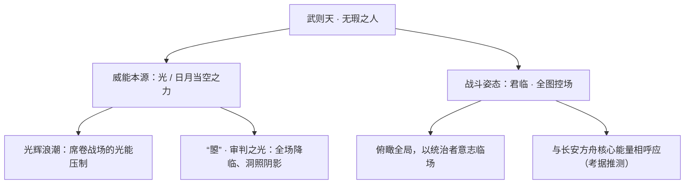

她的强大，与其说来自某件具体的武器，不如说来自她「女帝」这一身份本身所凝聚的威权与本源之力。她是规则的制定者，也是规则的执行者——在战场上，她让对手感受到的，正是面对整座长安、面对那不可撼动之秩序时的无力。

### 重要事件 / 剧情参与

- **君临长安**：以女帝之尊统御大陆第一雄城长安，坐镇帝国中枢，同时担负看守地底方舟核心之秘的重任。
- **慧眼识婉儿**：将因家族谋反案沦为奴婢的[上官婉儿](#上官婉儿)破格提拔，使其「代陛下为耳目，书世间之万象」，成为女帝最倚重的近臣与密探。
- **长安追捕案**：女帝意志牵动神探[狄仁杰](#狄仁杰)对剑仙[李白](#李白)的追捕，李白—狄仁杰—武则天—上官婉儿因女帝而串联成一条命运线。
- **尧天暗流**：[明世隐](../factions/changan.md)所领的尧天表面辅佐女帝维护盛世、实则另有图谋，与[狄仁杰](#狄仁杰)势力暗中对峙；女帝身处这一对立的中心。
- **方舟之秘**：作为长安统治者，她始终是「方舟封印」这一世界观核心命题的焦点人物，盛世与危机皆系于其一身。

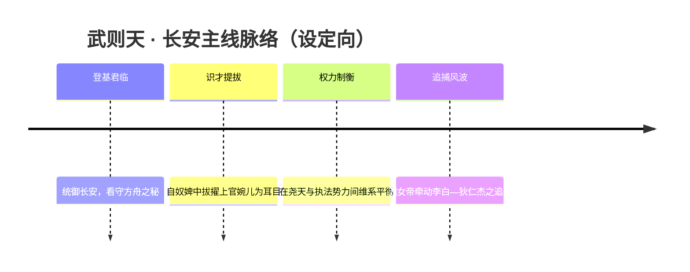

### 羁绊关系

| 对象 | 关系 | 说明 |
| --- | --- | --- |
| [上官婉儿](#上官婉儿) | 君臣 / 近臣密探 | 婉儿因祖父牵连太子谋反案沦为奴婢，凭书道才华被女帝重用，「代陛下为耳目，书世间之万象」，是女帝洞悉长安暗流的眼睛与文胆。 |
| [狄仁杰](#狄仁杰) | 君臣 / 执法重臣 | 长安神探，执掌律法正义；与女帝同处长安权力体系，女帝意志牵动其断案与追捕。 |
| [李元芳](#李元芳) | 君臣式羁绊（间接） | 狄仁杰的护卫与得力助手，同处女帝统治下的长安执法序列。 |
| [李白](#李白) | 牵涉者 / 被追捕之人 | 长安城内李白为狄仁杰的追捕对象，此案因女帝串联起李白—狄仁杰—武则天—上官婉儿四人。 |
| [明世隐](../factions/changan.md) | 表辅实异（政治暗流） | 尧天首领，表面辅佐女帝维护盛世，实则另有所图，借占卜谋略活跃于长安暗处。 |
| [墨子](mojia-jiguan.md#墨子) | 城与主（建城者） | 墨子亲手营造长安这座方舟之城，武则天则是这座城与其封印之秘的当代守护者。 |

### 经典台词

::: quote 经典台词
「天地为牢，山河为锁，囚我者，皆当俯首。」（考据推测）

「无瑕者，方能裁断万象。」（考据推测）

「这长安，是朕的长安。」（考据推测）
:::

### 皮肤故事亮点

武则天作为长安女帝，其经典皮肤多承袭其「华贵威严」的盛唐宫廷美学，以凤冠、华服与璀璨光华凸显帝王气派，呼应「日月当空」的至尊象征。（皮肤具体设定故事考据推测，以官方资料为准。）

---

## 嬴政

<span class="hok-tags"><span class="tag mage">法师</span></span>

**政 · 召唤剑域、远程消耗的孤独帝王**

| 项目 | 内容 |
| --- | --- |
| 称号 | 政 |
| 定位 | 法师 |
| 所属 | [长安城](../factions/changan.md) |
| 身份 | 玄雍之主 / 帝王（始皇意象） |
| 别称 | 始皇 / 帝（考据推测，源自历史原型秦始皇嬴政） |
| 关系 | [白起](jixia.md#白起)（君臣 · 情同手足）、[武则天](#武则天)（同为长安城帝王统治者）、[庄周](penglai-donghai.md#庄周)（封印白起血族之力者，考据推测的间接关联） |
| 登场作品 | 《王者荣耀》英雄；皮肤剧情、官方关系图与白起背景故事中均有交代 |

### 背景故事

嬴政是横亘在王者大陆历史长河中的一位帝王，其英雄底色取自历史原型——一统六国、自称"始皇帝"的秦王嬴政。在《王者荣耀》的世界观重构里，他被塑造为**玄雍之主**：一位以铁血意志统御疆土、又在权力顶端饱尝孤独的君王（考据推测，"玄雍"作为其疆域名号见于白起背景故事一脉的设定）。

他的少年时代并非一开始就高坐庙堂。据[白起](jixia.md#白起)的背景故事所载，年少的嬴政曾与挚友白起一同前往**稷下学宫**求学——那是由稷下三贤者主持、有教无类、广纳天下英才的学问圣地。求学途中，二人遭遇**血族**袭击。危急关头，白起以身护主，面部因此重创，并被血族之力侵染。那道伤、那份以命相护的恩义，成了嬴政一生都无法偿清的债。也正是这段经历，在这位日后将以冷峻著称的帝王心底，埋下了一缕罕见的、对"他人之苦"的共情。

学成之后，嬴政走上了截然不同于同窗的道路。他没有像诸子那样著书立说、周游讲学，而是选择了**权力**——以一人之意志去厘定秩序、扫平乱象、铸造一个属于自己的疆域。他成为玄雍之主，登临帝位，在那至高无上的孤峰之巅，俯瞰众生。然而权力越是集中于一人之手，那人便越是被孤独所环绕：曾经并肩的挚友因伤、因被侵染的血族之力而渐行渐远（白起的血族之力后由[庄周](penglai-donghai.md#庄周)以南华之术封印，考据推测此为二人长年共生关系的转折），曾经的同窗各奔东西，唯有冰冷的王座与无尽的山河始终相伴。

在长安城的英雄谱系中，嬴政作为**法师**登场，与同为统御者的女帝[武则天](#武则天)并列于"中枢 · 长安"之列。长安城本质是稷下三贤者之一**墨子**亲手建造、封印着方舟核心的雄城，是帝国中枢与方舟之秘的焦点。在这座由盛唐繁华与上古机关浮空城交织而成的雄城里，嬴政这位"帝王"意象的法师，既是秩序与权柄的化身，也是一个被自身权力放逐于人群之外的孤独者。他召唤剑域、于远方降下利刃的战斗方式，恰似帝王御极——不必亲临，便可裁断生杀。

> 说明：嬴政的世界观定位以官方英雄设定、皮肤剧情与白起背景故事的交叉信息为主要依据；其历史原型为秦始皇，但游戏中的"玄雍之主"叙事属重构设定。涉及具体疆域、纪元等硬设定处，凡未见明确官方出处者均标注（考据推测）。

### 性格与形象

嬴政的核心气质是**孤高、果决、城府深沉**。他习惯以俯瞰的姿态审视一切，言语简练而带着不容置喙的威权——这是常年身居权力顶端、独断万机所塑造的帝王人格。然而在这层冰冷的外壳之下，他并非毫无温度：少年时白起的舍身相护，让他保留了对苦难者的一缕共情，这使他区别于纯粹冷酷的暴君，更像一个**被孤独困住、却仍记得旧情**的复杂统治者。

外形上，他呈现典型的帝王意象：玄色、金饰为主调的华贵衣冠，举手投足间是不怒自威的仪态（考据推测，依其"始皇 / 玄雍之主"定位与默认形象描述）。象征意象集中在两点——**剑**与**孤独**。漫天召唤而出的利剑既是他征服与统御的工具，也隐喻"高处不胜寒"的孤峰处境：万剑环绕，却无一人可真正并肩。

### 战斗风格与能力（设定向）

作为长安城法师阵营中的远程消耗型角色，嬴政的力量根植于其"帝王"叙事——他不以血肉之躯近身搏杀，而是以意志号令利刃，遥制战局，正如帝王无须亲征便能决断生杀。

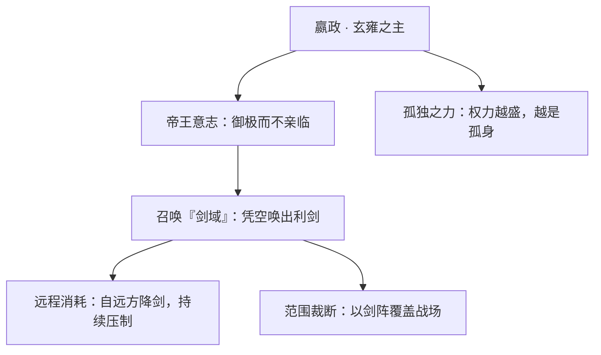

- **召唤剑域**：嬴政标志性的力量是凭空召唤利剑，于远距离对敌人发动压制。这与其"帝王御极、遥制四方"的人格高度呼应——他是战场上的"裁断者"，而非冲锋者。
- **远程消耗 / 范围压制**：依其法师定位，嬴政擅长以持续的远程输出蚕食对手，控制交战的节奏与距离，体现帝王"以势压人"的统御逻辑。
- **力量来历**：其超凡之力与稷下求学、玄雍统御的经历相关；少年遭血族、挚友受难的往事，则为这位手握重权者增添了一抹宿命色彩（具体招式名称与机制以游戏内为准；本节为设定向描述，不涉及数值）。

### 重要事件 / 剧情参与

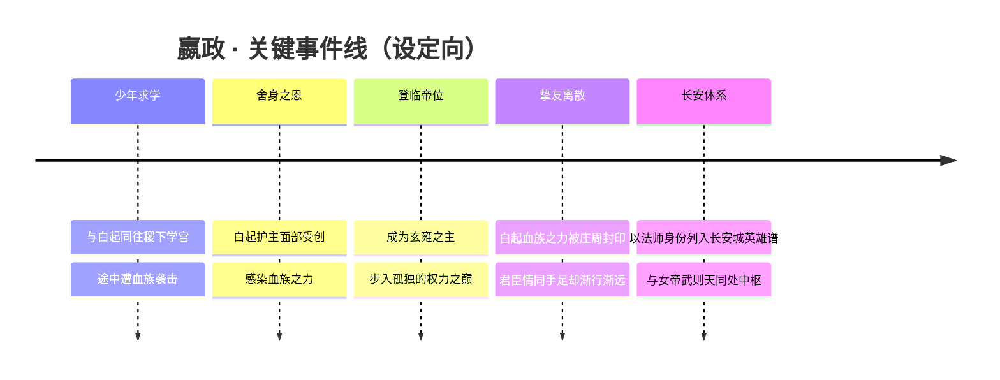

- **稷下求学与血族之劫**：嬴政与白起同赴稷下学宫途中遭遇血族，白起以身护主，这是二人羁绊的起点，也是嬴政共情底色的来源（见白起背景故事）。
- **玄雍之主的登临**：嬴政以帝王之姿统御疆域，立于权力顶峰（考据推测的纪元与疆域细节以官方为准）。
- **长安城英雄谱**：在当前阵营体系中，嬴政被归入"中枢 · 长安"，与武则天等并列为长安城的法师与统御者意象代表。

### 羁绊关系

| 对象 | 关系 | 说明 |
| --- | --- | --- |
| [白起](jixia.md#白起) | 君臣 / 情同手足 | 表为君臣（玄雍之主与臣），实情同手足。少年同赴稷下求学途中遭血族，白起护嬴政而面部受伤、感染血族之力（后被庄周封印）。数十年共生关系塑造了嬴政对他人之苦的共情。 |
| [庄周](penglai-donghai.md#庄周) | 间接关联（考据推测） | 白起所感染的血族之力由庄周以南华之术封印，庄周因而成为牵动嬴政—白起这段羁绊命运的关键外人。 |
| [武则天](#武则天) | 同阵营帝王 / 统御者意象 | 同处长安城"中枢 · 长安"序列，皆为以法师身份呈现的帝王统治者意象，并列长安权力中枢。 |

### 经典台词

::: quote 嬴政 · 台词
"天下，本就该握在一人之手。"（考据推测）

"孤者，立于万人之上，亦弃于万人之外。"（考据推测）

"你以命护我，我便以这一身权柄，记你一生。"（考据推测，呼应与白起的羁绊）
:::

---

## 芈月

<span class="hok-tags"><span class="tag mage">法师</span></span>

**惑国妖姬 · 以血养身、越战越艳的血怒女王**

| 档案项 | 内容 |
| --- | --- |
| 称号 | 惑国妖姬 |
| 定位 | 法师（吸血续航血怒法师 / 偏法坦打法） |
| 所属 | [长安城](../factions/changan.md) |
| 身份 | 出身楚地、入秦掌权的太后摄政者；血脉中潜藏「血怒」之力的妖姬（考据推测：原型为史载秦宣太后芈八子） |
| 别称 | 妖姬、血后（考据推测，玩家俗称） |
| 关系 | [嬴政](#嬴政)、[武则天](#武则天)、[妲己](haojing-fengshen.md#妲己)（同为「祸国/惑国」意象的对照，考据推测） |
| 登场作品 | 《王者荣耀》本传英雄；皮肤「红颜祸水」「白蛇」「西施」等承载其形象 |

### 背景故事

芈月之名，取自一位真实穿过历史尘烟的女子——史册之中，她是楚国公主、入秦的「芈八子」，是秦昭襄王之母，是中原第一位以「太后」之名垂帘、临朝近四十年的摄政者。她诛义渠、固关中，把一个偏处西陲的诸侯之国推向横扫六合的起点。在《王者荣耀》的王者大陆里，这段权倾天下的史实被重新熔铸，化作一位行走于权力与欲望边缘的「惑国妖姬」。

在大陆的纪元叙事中，[长安城](../factions/changan.md)是稷下三贤者之一墨子亲手筑就的「大陆第一雄城」，盛唐繁华的都市表象之下，封存着名为「方舟」的上古秘密；女帝[武则天](#武则天)君临其上，尧天、占星塔、万镜阁、梨园各据暗处。芈月被归入这座中枢雄城的法师序列（考据推测：因其「秦系」帝王血脉与帝国权谋的叙事属性，与[嬴政](#嬴政)同被收束进长安的「帝国/王权」谱系之中），成为这座城里另一道关于「权力如何吞噬人心」的注脚。

她的故事，核心不在征战，而在「血」与「欲」。传说芈月体内流淌着一股被称作「血怒」的力量——那是介于诅咒与天赋之间的东西：愈是临近死亡、愈是浴于鲜血，她的容颜便愈发明艳，力量便愈发滂沱。世人惧她、迷她，称其一笑可乱朝纲、一顾可倾城邑，遂以「惑国」二字加诸其身。可在这「妖姬」的标签背后，是一个女子在男性主宰的权力世界里、以美貌为刃、以心智为甲、以血为养，活成自己想要模样的孤注一掷（考据推测：基于其「红颜祸水」式形象设定的人物动机演绎）。

她的动机并不复杂，却足够危险：她不愿做任何人的附庸，不愿被纳入任何一方的棋盘。无论是帝王的恩宠、还是世人的非议，于她都只是可被利用的筹码。她要的是「自身的存续」与「自身的权柄」——为此，她可以妩媚，可以狠绝，可以在最深的伤口里开出最艳的花。正因如此，她在长安城这盘以「方舟之秘」为终局的大棋里，始终是一枚谁也无法真正掌控的变量。

### 性格与形象

芈月的性格是矛盾的统一体：表面慵懒妩媚、顾盼生姿，骨子里冷峭决绝、心机深沉。她惯于以柔克刚，用一句轻笑、一个回眸瓦解对手的戒心，再在对方放松之际给出致命一击。她不轻易动怒，可一旦「血怒」上涌，便是越伤越强、越战越艳的疯魔姿态——伤痕于她不是衰败，而是绽放。

外形上，她被塑造为浓烈而危险的东方美人意象：华贵的衣饰、艳红的主色调（与「血」「祸水」的母题呼应）、足以乱人心神的眉眼。象征意象集中在「血与花」——盛放的红花暗喻其以血养身、以伤为美的力量本质；「妖」与「姬」则点明她游走于人性诱惑与权力深渊之间的双重身份。她既是被凝视的「祸水」，也是反过来凝视并操弄世界的猎手。

### 战斗风格与能力（设定向）

芈月的战斗哲学，可一言以蔽之：**以血还血，以伤换强**。她不像传统法师那样畏惧贴身与消耗，反而主动扑入血与火的最近处——伤害对手时她汲取生命回流自身，临近濒死时「血怒」反而被彻底点燃，让她在战场中央化作难以被击杀的红色风暴，兼具法师的爆发与坦克般的续航韧性。这也是她在长安法师群中独树一帜的「血怒法师/法坦」打法来历。

她的力量来历，被归结为血脉中那股「血怒」之力：它使她能将敌人的生命转化为自身的延续，使她在残血时获得更迅猛的攻势与更妖异的姿态。其招式意象多围绕「血羽」「妖花」「环绕之力」展开——以血凝形、化作环身飞旋的利刃与花瓣，既是攻势也是护体（考据推测：以下技能名为基于其玩法意象的概括性描述，非逐字官方设定）。

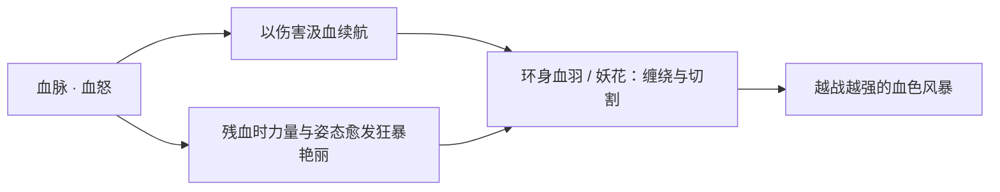

### 重要事件 / 剧情参与

- **入秦掌权（史源母题）**：以「芈八子→宣太后」的历史脉络为人物地基，奠定其「权倾朝野的摄政女主」底色，是其「惑国」之名的根源。
- **被纳入长安帝国谱系**：在王者大陆纪元里，作为「秦系」帝王/权谋叙事的一环，归入[长安城](../factions/changan.md)法师阵列，与[嬴政](#嬴政)同处帝国王权母题之下（考据推测）。
- **皮肤叙事中的形象延展**：其「红颜祸水」「白蛇」「西施」等皮肤，把「惑国妖姬」的诱惑、悲情与异色之美进一步铺陈，是玩家认识其形象的主要载体（详见下文皮肤亮点）。

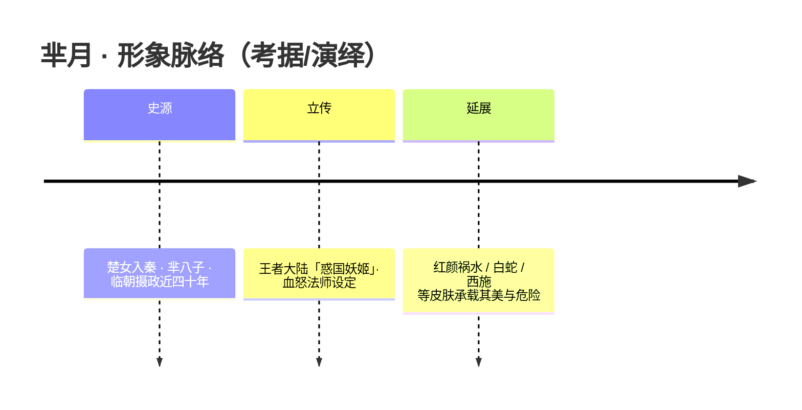

### 羁绊关系

> 说明：长安城本阵营的 `relatedRelationships` 设定中并未直接收录芈月的官方羁绊条目，故下表所列关系多为基于世界观谱系与人物母题的关联与对照（考据推测），非官方坐实的硬设定。

| 对象 | 关系 | 说明 |
| --- | --- | --- |
| [嬴政](#嬴政) | 帝国/王权母题同源（考据推测） | 同属「秦系」帝王与权谋叙事，于长安体系内共处帝国王权谱系，史源上更有「秦宣太后—始皇」的血脉先后承续之意。 |
| [武则天](#武则天) | 同城女权主政者的镜像对照（考据推测） | 二者皆为「以女子之身执掌至高权柄」的形象：武则天为长安统治者，芈月为史上首位临朝太后，互为权力女性的两种侧影。 |
| [妲己](haojing-fengshen.md#妲己) | 「惑国/祸水」意象的同类对照（考据推测） | 同被冠以「魅惑—倾国」母题的女性角色，可作主题性参照，无主线交集。 |

### 经典台词

::: quote 经典台词（部分为考据推测）
“以血还血，越艳越狂。”（考据推测）

“你怜我妖，却忘了——是你先迷了眼。”（考据推测）

“这江山，亦不过是我妆台前的一面镜子。”（考据推测）
:::

### 皮肤故事亮点

- **红颜祸水**：直白点题其「惑国妖姬」的母题——以倾国之姿成「祸水」之名，浓墨重彩地呈现其艳与险并存的形象底色（考据推测：皮肤主题概括）。
- **白蛇**：取材白蛇传意象，将「妖」的悲情与痴情一面叠加于芈月之上，让「妖姬」标签之外多出一层为情所困、为爱不悔的柔软（考据推测：皮肤主题概括）。
- **西施**：以越国美人「沉鱼」之姿入皮，与「惑国/倾城」的核心母题彼此呼应，强化其「以美乱世」的视觉叙事（考据推测：皮肤主题概括）。

---

## 王昭君

<span class="hok-tags"><span class="tag mage">法师</span></span>

**冰雪之华 · 以冰封情、以雪藏心的范围控制法师，出塞远行的和亲使者。**

| 档案项 | 内容 |
| --- | --- |
| 称号 | 冰雪之华 |
| 定位 | 法师（控场 / 范围消耗） |
| 所属 | [长安城](../factions/changan.md)（中枢 · 长安） |
| 身份 | 长安城贵族出身的奇女子、出塞和亲的使者（考据推测，融合历史「昭君出塞」与游戏世界观大漠边陲设定） |
| 别称 | 冰雪之华 / 落雁（取「沉鱼落雁」典故，考据推测） |
| 关系 | 同为长安法师阵列的 [武则天](#武则天)、[张良](#张良)、[貂蝉](#貂蝉)、[杨玉环](#杨玉环)；冰雪意象上与寒月公主 [嫦娥](shanggu-shenhua.md#嫦娥)、月之祭司 [露娜](#露娜) 互为映照（考据推测） |
| 登场作品 | 《王者荣耀》英雄；多套节日 / 限定皮肤与官方故事短篇 |

### 背景故事

在长安城的繁华之下，藏着无数被时代洪流推着前行的人。王昭君便是其中最寒亦最净的一缕。她生于河洛之地的官宦门第，自幼以容止与才情为人称道，却也因「太过出众」而被命运盯上——她的美与慧，不属于她自己，而被当作一枚可以交换安宁的筹码。在长安以「盛唐都市 + 上古机关浮空城 + 方舟之秘」交织的世界里，城墙内是歌舞升平的女帝盛世，城墙外却是大漠风沙与魔种横行的边陲。两个世界之间，需要有人去做那座桥。昭君，被选中成为那座桥。（部分背景为基于历史「昭君出塞」典故与游戏大漠 / 长城世界观的考据推测）

「出塞和亲」是她故事的底色。当一纸诏令将她从温润的长安送往苦寒的塞外，她没有哭闹，也没有逃避。她明白自己此行所换取的，是无数边民免于战火的喘息，是城与城之间一段以柔克刚的和平。马蹄踏过最后一道城门时，她回望了一眼那座养育她的雄城，然后再不回头。漫天风雪扑面而来，而她竟在那一刻读懂了风雪——它冷，却也最纯净；它埋葬一切喧嚣，却也封存一切不被允许说出口的情。自此，冰雪成了她的语言。

关于她为何能操控冰霜，世界观中存在多种说法。一说她本就身负罕见的寒灵之力，长安城地底封存的方舟核心能量与上古机关之秘，曾让河洛一带诞生过若干与天地元素共鸣的奇人，而她的「冰心」便是其中一脉的显化（考据推测）；另一说则更近人情——出塞路上的极寒磨砺了她，也唤醒了她，她以心驭冰，将一身的孤独与克制，凝成了可以护人、亦可以伤人的霜雪。无论哪一种，结果都一样：当她抬手，长安的暖春便会在敌人脚下骤然结冰，琵琶弦动处，落雪成阵。

她的动机，从来不是征服，而是「守」。守住和平，守住身后那座城，守住自己心里那一点不肯熄灭的暖。她清楚地知道，自己被冠以「冰雪之华」，世人见的是冰、是雪、是那份拒人千里的清冷；却很少有人记得，「华」是花——是在最冷的季节里，依然倔强开放的那一朵。她把炽热藏进寒冰，把柔软封进坚冰，用一身的冷，去交换世间的暖。这是她的牺牲，也是她的选择。

在长安城的叙事谱系里，昭君与那些以权谋、以剑术、以歌舞立身的同僚不同。她不争庙堂，不入江湖，她走的是一条最寂寞的路——和亲之路。这条路上没有掌声，只有风沙；没有归期，只有远行。但正是这样一位看似柔弱的女子，用一己之身的远嫁，换来了城与塞之间难得的安宁。她是长安盛世里最不起眼、却最不可或缺的那一块基石。

### 性格与形象

昭君的性格，是「外冷内热」四字最贴切的注脚。她寡言、克制、沉静如雪，初见者往往会被那份与生俱来的清冷拒于千里之外。但越是靠近，越能察觉她冰层之下的温度——她的冷，不是无情，而是把情藏得太深；她的静，不是冷漠，而是一种历经离别后的通透与坚韧。她从不轻易诉说自己的牺牲，仿佛那本就是分内之事。

外形上，她是典型的冰雪意象集大成者：一袭素白或冰蓝的长裙，发间常缀以雪花、冰晶或寒梅之饰，怀抱琵琶，神情淡然中带着一丝难以言说的哀愁。她的象征意象高度凝练——**雪**（纯净、覆盖、埋藏）、**冰**（克制、封存、坚硬）、**梅 / 华**（寒中独放的炽热生命力）、以及**琵琶**（出塞和亲的标志性器物，也是她寄托情感的唯一出口）。冰与花的并置，正是她整个人物的内核：在最冷处，开出最美的花。

### 战斗风格与能力（设定向）

昭君以「冰」立战，是长安城法师阵列中最纯粹的范围控制 + 持续消耗型法师。她不以爆发的瞬杀见长，而以铺天盖地的霜雪封锁战场，让敌人在寒冷中步步迟滞、动弹不得，再以源源不断的冰刃收割。其力量来历，可归于身负的寒灵之力与出塞淬炼出的冰心（考据推测，详见背景故事）。她的战斗哲学与其为人一致——不主动撕咬，却让靠近者付出代价。

她惯用的「招式」围绕冰霜的三重形态展开：弥漫的**寒雾**令敌人减速、视野受阻；凝结的**冰阵 / 冰封领域**将一片区域化为绝地，踏入者被层层减速直至冻结；而最盛时，她可释放**极致冰封**，让整片战场骤然冻结、敌人尽数定身于原地，为同伴创造收割之机。她怀中的琵琶既是器物，亦是法器——弦动处，落雪成阵。

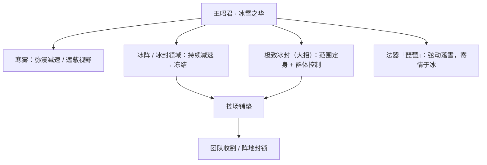

定位关键词：**范围控制**、**持续消耗**、**阵地封锁**、**团队增益（为队友创造输出窗口）**。她是那种「不在场则团队无序，在场则敌人寸步难行」的核心法师。（以上为设定向描述，非游戏数值。）

### 重要事件 / 剧情参与

- **出塞和亲**：昭君人物弧光的起点与核心。受命远嫁塞外，以一身远行换边境数年安宁，是她一切冰雪意象与「以冷换暖」性格的来源。（基于历史典故与游戏世界观的考据推测）
- **长安法师阵列的一员**：作为 [长安城](../factions/changan.md) 旗下法师，与 [武则天](#武则天)、[张良](#张良)、[貂蝉](#貂蝉) 等共同构成女帝盛世的中枢力量谱系。
- **节日 / 限定皮肤的主题叙事**：昭君拥有多套围绕「冰雪 / 节庆 / 异域风情」展开的代表性皮肤，每一套皮肤都从不同侧面延展了她的形象（考据推测，具体故事见下文皮肤亮点）。

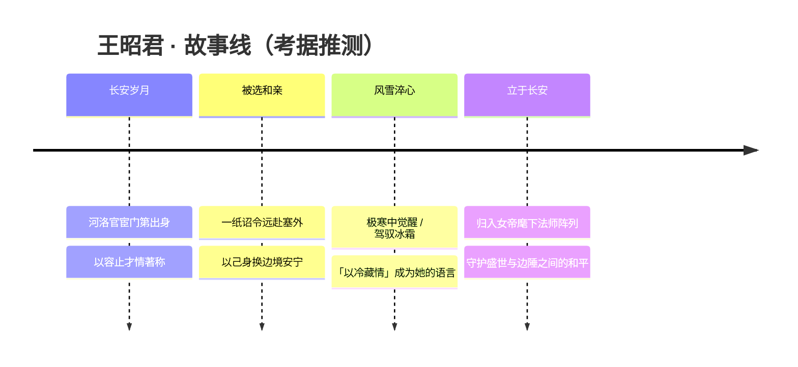

### 羁绊关系

> 说明：长安城官方 `relatedRelationships` 中并未单列王昭君的硬性羁绊条目，以下关系以同阵营定位关联与意象呼应为主，不确定者均标注「(考据推测)」。

| 对象 | 关系 | 说明 |
| --- | --- | --- |
| [武则天](#武则天) | 同阵营 · 女帝与臣属（考据推测） | 同为长安城法师；武则天为长安统治者，昭君之和亲使命可视为女帝盛世边境策略的一环。 |
| [张良](#张良) | 同阵营 · 谋臣同侪（考据推测） | 同属汉室文臣谱系与长安法师阵列，一者以谋立身、一者以柔致和，皆为以智 / 以情非以武取胜的代表。 |
| [貂蝉](#貂蝉) | 同阵营 · 同为乱世佳人（考据推测） | 同属长安法师中的「佳人」意象，貂蝉以舞、昭君以冰，皆为身处时代漩涡中、以柔克刚的女性形象。 |
| [杨玉环](#杨玉环) | 同阵营 · 盛唐佳人映照（考据推测） | 同为长安城中以艺立身的女性法师（杨以音波、王以冰霜），共同丰满长安「文华盛世」的群像。 |
| [嫦娥](shanggu-shenhua.md#嫦娥) | 跨阵营 · 寒系意象互文（考据推测） | 嫦娥为「寒月公主」，与昭君的「冰雪之华」同属清冷孤高的意象谱系，常被并称为最具寒意的女法师。 |
| [露娜](#露娜) | 同阵营 · 月与雪的呼应（考据推测） | 露娜为月之祭司，月光与冰雪在视觉与气质上互为映照，二者同为长安城中带有清冷神性色彩的女性。 |

### 经典台词

::: quote 经典台词（部分为考据推测）
「我，会守护我所珍视的一切。」（考据推测）

「冰雪，是我唯一的语言。」（考据推测）

「风雪再大，也吹不灭心中的那点暖。」（考据推测）

「以冷藏情，以雪封心——这便是冰雪之华。」（考据推测）
:::

### 皮肤故事亮点

> 以下为对其代表性皮肤主题方向的归纳，具体设定以官方为准（考据推测）。

- **冰雪 / 寒系主题皮肤**：强化她「冰雪之华」的核心意象，以冰晶、雪原、极光等元素重构造型，是其形象最本格的延展。
- **节庆 / 异域风情皮肤**：呼应「出塞和亲」的远行底色，融入塞外、节日等元素，从「使者」的身份侧面切入，让冷峻的她多了一分人间烟火与温度。
- 无论何种皮肤，琵琶与冰花始终是她不变的标识——冷艳的外表下，永远藏着那一点为他人燃烧的暖。

---

## 张良

<span class="hok-tags"><span class="tag mage">法师</span></span>

**谋圣 · 算无遗策的运筹者，以「言出法随」之术将敌人禁锢于无形棋局之中的强单体控制法师。**

| 档案项 | 内容 |
| --- | --- |
| 称号 | 谋圣 |
| 定位 | 法师（强单体禁锢控制 / 团队开团点控） |
| 所属 | [长安城](../factions/changan.md) |
| 身份 | 汉初谋臣、运筹帷幄之中的策士；长安城中以智略立身的「言出法随」之人 |
| 别称 | 谋圣、子房（考据推测，取历史张良字「子房」） |
| 关系 | [武则天](#武则天)、[嬴政](#嬴政)、[上官婉儿](#上官婉儿)、[钟馗](#钟馗)、[狄仁杰](#狄仁杰)、[李白](#李白) |
| 登场作品 | 《王者荣耀》对战英雄（长安城阵营，谋臣群像之一）|

### 背景故事

张良，世人尊称「谋圣」。在王者大陆的叙事里，他被安置于以女帝 [武则天](#武则天) 为中枢、由建城者墨子（见 [墨家机关道](mojia-jiguan.md)）亲手筑就的 [长安城](../factions/changan.md)——这座盛唐繁华与上古机关浮空城叠合、地底封存着「方舟核心」的大陆第一雄城。在这片商旅、文人、豪侠与诸族杂处的中枢之地，武力与机关之外，真正左右乾坤的常常是一卷无声的谋略，而张良正是这卷谋略的执笔者之一。

他的形象取材自秦末汉初辅佐汉高祖刘邦定鼎天下的传奇谋士张良（字子房）（考据推测，游戏沿用其历史身份与「谋圣」的后世尊号）。历史原型中，张良出身韩国相门，国破家亡之后散尽家财图谋复仇，曾于博浪沙以大铁椎狙击始皇车驾、误中副车而功败垂成；此后亡命下邳，遇黄石公于圯桥，三次拾履、屡试不馁，终得授《太公兵法》，自此由一名意气用事的复仇者，蜕变为「运筹帷幄之中，决胜千里之外」的王佐之才。这段「忍辱—受书—顿悟」的成长母题，被《王者荣耀》凝练为张良「以静制动、以智御力」的核心气质：他从不以蛮力争先，而是在棋盘尚未落子之时，便已看尽满盘的来路与去路。

在长安城的世界观投影下，张良被塑造为一位「言出法随」的运筹者——他相信言语与算计本身即是一种力量，足以将奔涌的乱局禁锢、收束、归于秩序。当李白这般纵情江湖的剑客以「侠」破局、当 [钟馗](#钟馗) 这般判官以「钩」拘魂、当 [狄仁杰](#狄仁杰) 这般神探以「律」断案时，张良选择的是「谋」：他以一言一念，把敌人困于无形的方寸之间，使其进退失据、动弹不得，从而为同袍创造决胜的间隙。他的动机不在杀伐，而在「掌控」——掌控节奏、掌控变量、掌控那一线胜负的天平。对他而言，最完美的胜利不是力压千钧，而是让对手在尚未明白发生什么时，就已落入早就铺好的局中。（考据推测：游戏并未为张良铺陈密集的主线剧情，其形象主要承自历史「谋圣」原型与「言出法随」的法师设定，跨纪元的细节属软性投影。）

正因如此，张良在长安谋臣群像中占据一个独特的位置：他不是台前的女帝、不是耀眼的剑仙、也不是断案的神探，而是那个隐在帷幕之后、为整盘棋拨弄丝线的人。盛世表象之下，长安城暗流汹涌——尧天另有所图、占星塔窥探天机、方舟之秘悬于地底，正是在这样一座「越繁华越需要算计」的城里，谋圣的存在显得理所当然。

### 性格与形象

- **性格特质**：冷静、缜密、洞察先机。张良的气场不靠声量，而靠那份「一切尽在掌握」的从容。他寡言而善断，言出则中的；不轻易出手，一旦出手便直取要害。比起冲锋陷阵的豪情，他更欣赏「不战而屈人之兵」的算计之美。
- **外形意象**：身着文士袍服、气度儒雅的谋臣形象，举手投足间带着运筹帷幄的书卷气与城府感。其象征意象高度凝聚于「书卷 / 文牍 / 言语成法」——他出招时往往伴随凭空浮现的符文、卷轴或言灵之纹，呼应「言出法随」的设定：所说之言、所书之字，即化作禁锢敌人的法则。
- **核心象征**：棋局与帷幄。无论是「运筹帷幄」的帐幕，还是「决胜千里」的棋盘，张良的视觉与气质都围绕「以局困人、以智驭势」展开——他本人就是那只看不见的、落子无悔的手。

### 战斗风格与能力（设定向）

张良的战斗哲学是「以言为法、以智为械」。他不持刀剑，而以言灵符文为武器，将抽象的「谋略」具象为可以禁锢、收束敌人的法则之力——这正是「言出法随」一名的由来。其战斗设定大致可归纳如下（设定向描述，非游戏数值）：

- **言灵符文（普攻 / 持续消耗）**：以凭空生成的符文之力远程点杀，看似温和实则绵密，象征其「润物无声」的消耗式压制。
- **禁锢之言（核心控制）**：一言既出，敌人即被无形之力定住、动弹不得。这是张良最具标志性的能力——单体强禁锢，象征「言出法随」：他口中说出的「禁制」，对手便不得不遵从。强敌再凶，一旦落入此言之中，便如棋子被点死在棋盘的格点上。
- **言出法随 · 终结之局（大招意象）**：将敌人彻底收束于一片无可挣脱的法则领域之内，使其在数息之间彻底失去行动力，仿佛整个人被关进了张良早已写好的结局。这是「谋圣」对一场遭遇战下达的判词——胜负在此言落下时便已注定。

整体而言，张良是典型的「开团点控 / 收割双修」型法师：他能在团战起手时锁死敌方核心，把一场混战强行掰回己方设定的节奏；也能在残局中以言灵符文补完最后的击杀。他的力量来历是「智」而非「蛮」——其每一道符文，本质都是黄石公圯桥授书那一脉「以柔克刚、以静制动」兵法智慧的延续与神化。

```mermaid
flowchart TD
    A["谋圣 · 张良"] --> B["言灵符文：远程绵密消耗"]
    A --> C["禁锢之言：单体强禁锢控制"]
    A --> D["「言出法随」：法则领域收束敌人"]
    C --> E["开团点控 / 锁死敌方核心"]
    D --> E
    B --> F["残局收割 / 持续压制"]
```

### 重要事件 / 剧情参与

张良在游戏主线中并无大量独立剧情铺陈，其叙事价值更多体现为「长安谋臣群像」的一员与「言出法随」这一设定符号。以下为其参与/关联的方向（部分为考据推测）：

- **长安谋臣群像**：与女帝 [武则天](#武则天) 主导的长安统治体系同框，作为以智略立身的策士，构成长安「文治」一面的代表之一。
- **历史原型彩蛋线**：其招式、台词与皮肤多次回扣历史张良「博浪沙击秦」「圯桥受书」「运筹帷幄、决胜千里」的典故（考据推测）。
- **节庆 / 主题皮肤活动**：随各类主题皮肤推出而参与相应的活动叙事与CG（具体活动以官方为准，考据推测）。

```mermaid
timeline
    title 张良 · 原型与设定脉络（考据推测）
    历史原型 : 韩相之后，国破图复仇 : 博浪沙误中副车
    顿悟受书 : 圯桥三拾履，得授太公兵法
    王佐之才 : 运筹帷幄，辅汉定天下，世称谋圣
    王者投影 : 长安谋臣，「言出法随」的强禁锢法师
```

### 羁绊关系

| 对象 | 关系 | 说明 |
| --- | --- | --- |
| [武则天](#武则天) | 同阵营 · 君臣式 | 同属长安城女帝统治体系，张良作为以智略立身的谋臣，与女帝主导的中枢秩序同处一城（考据推测的政治从属，非密集剧情坐实）。 |
| [嬴政](#嬴政) | 历史宿怨 · 同阵营对照 | 历史原型中张良曾于博浪沙以铁椎狙击始皇车驾；在游戏体系内二人同列长安法师阵营，构成「秦—汉」跨纪元的有趣对照（考据推测）。 |
| [上官婉儿](#上官婉儿) | 同阵营 · 文谋同道 | 同为以文笔/言辞为力量的长安人物，一以「笔」、一以「言」，共属长安「以文御力」的谋臣才女之列。 |
| [钟馗](#钟馗) | 同阵营 · 控制同袍 | 同为长安阵营的控制型法师，一以「钩」拘、一以「言」锁，控制风格互为映照。 |
| [狄仁杰](#狄仁杰) | 同阵营 · 智略相照 | 同为长安以「智」立身者，神探断案与谋圣运筹，分别代表「律」与「谋」的两种秩序之道。 |
| [李白](#李白) | 同阵营 · 侠谋对照 | 同处长安，一为纵情江湖的剑仙、一为隐于帷幄的谋圣，「以侠破局」与「以智困人」形成鲜明气质对照。 |

> 说明：以上羁绊主要为同阵营英雄间的设定性/气质性关联与历史原型对照，长安城的 `relatedRelationships` 中并未为张良列出独立成条的官方羁绊；本表所列均在「同处长安、群像并立」的框架内成立，跨纪元细节标注为考据推测。

### 经典台词

::: quote 谋圣之言
「运筹帷幄之中，决胜千里之外。」（考据推测，化用史载对张良的评语）

「天予不取，反受其咎。」（考据推测，取自历史张良谏言，呼应其「审时度势」之智）

「言出，则法随。」（考据推测，凝练其「以言为法、禁锢敌人」的核心设定）

「这一步，你早就输了。」（考据推测，体现其「落子之前已看尽全局」的谋士气场）
:::

---

## 貂蝉

<span class="hok-tags"><span class="tag mage">法师</span></span>

**绝世舞姬 · 步步生莲、以美乱世的乱世佳人，灵动续航的法刺型法师。**

| 档案项 | 内容 |
| --- | --- |
| 称号 | 绝世舞姬 |
| 定位 | 法师（兼具法刺、持续作战与高机动连招特性） |
| 所属 | [长安城](../factions/changan.md)（中枢 · 长安） |
| 身份 | 司徒府歌舞伎、绝代舞姬；汉末名动天下的红颜（考据推测：王者世界观将其纳入长安城的盛世佳人谱系） |
| 别称 | 舞姬、闭月（典出"闭月羞花"之"闭月"） |
| 关系 | [吕布](modao-shadow-abyss.md#吕布)（恋人 / 官方CP）、[李白](#李白)（同为长安风流名士，皮肤剧情交集，考据推测）、[武则天](#武则天)（同居长安、女帝治下） |
| 登场作品 | 《王者荣耀》正式英雄；多次"情人节 / 七夕"CP活动与剧情短片中以"吕布×貂蝉"组合登场 |

### 背景故事

貂蝉之名，源自中国古典演义里那位以美貌与智慧搅动东汉末年群雄棋局的女子。在《三国演义》的叙事中，她是司徒王允府上的歌舞伎，受义父所托施行"连环计"——以倾国之色周旋于权臣董卓与猛将吕布之间，使父子反目、自相残杀，终为颠覆暴政立下不流血的奇功。她不是执剑的武将，却以一支舞、一双眼，撬动了那个铁与血的时代。这一层"以柔克刚、以美乱世"的底色，被《王者荣耀》完整地继承了下来。

在王者大陆的设定里，貂蝉被收编进以盛唐气象与上古机关浮空城交织而成的[长安城](../factions/changan.md)谱系之中。长安城是大陆第一雄城、女帝[武则天](#武则天)治下的帝国中枢，商旅、文人、豪侠与诸族在此和谐杂居，梨园歌舞、占星塔、万镜阁各擅其美。绝世舞姬置身这样一座"繁华即是力量"的城池，便不再只是史册里一介歌伎，而成了把"美"本身炼成法术的存在——她的舞步落处生莲，她的回眸足以令万军失神。（考据推测：王者世界观并未把貂蝉锁死在某一具体纪元的史实事件里，而是抽取"绝代风华、以美惑世、为爱痴绝"的母题，将其安放进长安城这一融合时空的舞台。）

她最核心、也最被官方反复书写的动机，始终围绕一个"情"字。无论是演义里在董、吕之间的虚与委蛇，还是王者世界观中与飞将[吕布](modao-shadow-abyss.md#吕布)缠绵难解的羁绊，貂蝉的故事都在追问同一个命题：一个被命运推上"棋子"位置的绝色女子，能否真正握住属于自己的爱与自由？在官方的多次CP叙事里，她与吕布之间既有乱世里相依为命的炽烈，也有"红颜祸水"骂名下的孤独与不甘。她的"美"是武器，却也是枷锁——人人贪恋她的容颜，却鲜少有人愿意看清面纱之后那颗渴望被珍重的心。

正因如此，绝世舞姬在长安城众多角色里独成一格：她不属于尧天的暗谋，不归于长城的烽烟，也无关方舟之秘的宏大算计。她的战场更私密，也更古典——是廊下的一袭红裙，是月色里的一支霓裳，是把整座城的目光化作己用的那种、属于女性的、不动声色的力量。

### 性格与形象

貂蝉的性格被塑造得"柔中带韧"。表面看，她娇媚、灵动、善解风情，举手投足皆是被反复打磨过的优雅；但在这层温软之下，藏着一份对命运的清醒与不屈——她深知自己美貌的分量，也深知这分量既能成全人、亦能毁灭人，因此她从不把柔弱当作真正的软弱。

外形上，她的核心意象是**舞**与**红**。一袭曳地长裙、轻盈的水袖、随舞步翻飞的飘带，是她最具辨识度的符号；红色（朱红、绯红）常作为她的主色调，象征热烈的情、决绝的爱，也暗合"红颜"二字的双关。环绕她的还有"莲"的意象——步步生莲，既是佛家"举足下足，皆生莲花"的典故化用，也呼应她舞姿之轻盈圣洁。月，是她的另一重背景符号："闭月"之名取自"闭月羞花"，传说月亮见了她的容颜都羞愧躲进云后，因此清辉、月影常作为衬托她绝色的环境氛围。整体气质上，她是那种"乱世里最不该出现、却偏偏开得最艳"的一朵花。

### 战斗风格与能力（设定向）

绝世舞姬把"歌舞"升华成了战斗的语言。她不持刀剑，而以舞为剑、以情为引——一颦一笑、一旋一转之间，便能编织出绵密的法术连锁。（以下为基于背景设定的力量来历描述，非游戏数值。）

- **以舞御法**：她的攻击不像传统法师那样靠器物或符箓施放，而是从舞步本身流溢而出。每一次旋身、每一道水袖划过的弧线，都会牵引出魔力的轨迹，落点处生出莲华般的法术绽放。这使她的战斗节奏极为绵密、连贯，宛如一场不会停歇的独舞。
- **步步生莲（持续与续航）**：贴合"灵动飘逸、续航强"的设定底色，她极擅长在缠斗中保持自身的鲜活——舞动得越久、连锁得越密，她便越难被捕捉、也越能从对手身上汲取回旋的余地。她的强势，建立在"永不停步"之上。
- **闭月之姿（魅惑与扰乱）**：承自演义中"连环计"的母题，她的"美"本身即是一种武器，可令对手心神失守、阵脚自乱。这层"以美乱世"的特质，是她区别于纯输出法师的灵魂所在。

```mermaid
flowchart LR
  A["绝世舞姬 · 貂蝉"] --> B["以舞御法 / 水袖牵引魔力"]
  A --> C["步步生莲 / 灵动续航"]
  A --> D["闭月之姿 / 以美乱世·扰乱心神"]
  B --> E["绵密连锁的独舞式连招"]
  C --> E
  D --> E
```

（考据推测：上述"以舞御法、步步生莲、闭月扰心"为依据其称号、定位与古典母题做的设定向归纳，并非对其某一具体技能机制的逐条还原。）

### 重要事件 / 剧情参与

- **古典母题之源**：作为脱胎自《三国演义》的角色，她"连环计"周旋董卓与吕布、终结暴政的故事，是其一切王者叙事的底本与精神原点。
- **吕布×貂蝉 · 官方CP叙事**：在《王者荣耀》多次情人节 / 七夕等节庆活动与剧情短片中，貂蝉与[吕布](modao-shadow-abyss.md#吕布)以乱世恋人组合登场，是官方长期经营、玩家认知度最高的CP之一。吕布的诸多台词、皮肤设定都与貂蝉相互呼应。
- **皮肤叙事的延展**：她的多套皮肤（详见下）各自承载小段故事氛围，从异域舞姬到节庆主题，不断丰富"绝世舞姬"这一形象的层次。

```mermaid
timeline
  title 貂蝉 · 叙事脉络（设定向梳理）
  古典原点 : 演义"连环计" / 以美乱世、终结暴政
  入主长安 : 纳入长安城盛世佳人谱系 / 步步生莲的舞姬法师
  情之羁绊 : 与吕布的乱世之恋 / 官方CP活动反复书写
  形象延展 : 多套皮肤拓展异域·节庆·风华各面
```

### 羁绊关系

| 对象 | 关系 | 说明 |
| --- | --- | --- |
| [吕布](modao-shadow-abyss.md#吕布) | 恋人 / 官方CP | 演义中"连环计"里相纠缠的猛将与佳人；在王者世界观中被官方多次以情人节·七夕CP活动钦定为乱世恋人，吕布台词常念及貂蝉，"爱与正义""天魔缭乱"等皮肤主题彼此呼应。 |
| [武则天](#武则天) | 同城 / 女帝治下 | 同属长安城；貂蝉作为绝世舞姬置身女帝武则天统治的盛世都城，是这座"繁华即力量"之城的风华符号之一。 |
| [李白](#李白) | 风流名士之交（考据推测） | 同为长安城最负盛名的风雅人物——一位青莲剑仙、一位绝世舞姬，皮肤与节庆叙事中常被并置渲染盛唐气象，是否有直接剧情线尚不明确。 |

### 经典台词

::: quote 貂蝉 · 经典台词
"嘘——人家可是会跳舞的。"（考据推测）
:::

::: quote 貂蝉 · 经典台词
"为何这么看着我？是被我迷住了吗？"（考据推测）
:::

::: quote 貂蝉 · 经典台词
"一舞倾城，再舞倾国。"（考据推测：呼应"绝世舞姬"称号与"闭月"意象）
:::

### 皮肤故事亮点

- **异域 / 节庆主题皮肤**：貂蝉的皮肤多以"舞"为核心母题进行变奏——或化作异域风情的舞娘，或换上节庆华裳，但水袖、长裙、翩跹舞姿这一组核心符号始终贯穿，强化其"绝世舞姬"的辨识度。（考据推测：具体皮肤的逐套剧情细节请以官方为准，此处仅作母题层面的概括。）
- **与吕布呼应的CP皮肤气质**：在以乱世恋人为主题的CP叙事中，貂蝉的形象常与[吕布](modao-shadow-abyss.md#吕布)的"爱与正义""天魔缭乱"等设定相互映衬，把"美人与战神"的古典张力推向极致。

---

## 钟馗

<span class="hok-tags"><span class="tag mage">法师</span></span>

**地府判官 · 一钩定生死、专缉孤魂野鬼的捉鬼天师**

| 档案项 | 内容 |
| --- | --- |
| 称号 | 地府判官 |
| 定位 | 法师（控制 / 半肉，钩控起手） |
| 所属 | [长安城](../factions/changan.md) |
| 身份 | 地府判官 / 捉鬼天师 / 长安城地下宝藏的守护者（考据推测） |
| 别称 | 判官、捉鬼天师、馗爷 |
| 关系 | [武则天](#武则天)、[张良](#张良)、[杨玉环](#杨玉环)、[狄仁杰](#狄仁杰)、[李白](#李白) |
| 登场作品 | 《王者荣耀》对战英雄；定位为长安城阵营法师 |

### 背景故事

钟馗的形象，取材自中国民间流传极广的「钟馗捉鬼」传说。传说中的钟馗本是才高八斗的应试举子，因相貌奇丑而被黜落，悲愤之下触阶而亡；死后受敕封为「驱魔大神」，统领阴司鬼卒，专司缉拿世间作祟的孤魂野鬼。在《王者荣耀》的世界观里，这一古老母题被嫁接进了**长安城**——那座由稷下三贤者之一墨子亲手建造、表为盛唐繁华都市、里为封存上古能量之**方舟**的「大陆第一雄城」。

在长安的叙事框架中，钟馗被定位为**地府判官**：一位往来于阳世与幽冥之间、手持生死簿与判官笔、以铁链钩魂的执法者。长安城外表是河洛大地上商旅文人豪侠诸族和谐聚居的繁华之所，但它的地底却封存着方舟的核心能量，并埋藏着无数不为人知的秘密与「不该存在之物」。当城中的繁华掩盖不住地脉深处涌动的怨气与游荡的恶灵时，便需要有人去做那把「钩」——把扰乱秩序的鬼魅一一钩出、押解归案。钟馗，正是这座城市阴影一侧的看门人（考据推测）。

关于他的来历，民间传说与游戏设定共同指向一个「不得志的判官」母题：他生前并非显赫人物，甚至因外貌不为世俗所容；正因尝过被偏见与不公拒之门外的滋味，他对「冤」与「鬼」反而抱有一种他人难以理解的复杂态度——既要缉拿为祸的恶鬼，也愿替蒙冤者主持公道。这种「以丑陋之身行公正之事」的反差，使他从一个被取笑的形象，升格为一个令邪祟胆寒、令冤魂仰赖的判官（考据推测）。

在长安的权力版图里，女帝[武则天](#武则天)以无瑕之姿统御全城，其下辖尧天、占星塔、万镜阁、梨园等诸多神秘组织，律法与谋略交织。钟馗虽不直接介入庙堂中枢的明争暗斗，却是这套秩序在「幽冥」一面的延伸——明面上有[狄仁杰](#狄仁杰)的左轮短枪行使阳世律法，暗面里则有钟馗的铁钩裁断阴司是非。一阳一阴，共同维系着这座方舟之城表层的安宁（考据推测）。

也正因为他与「地下」「宝藏」「封印」这些意象天然绑定，钟馗在长安体系内常被理解为**地底宝藏与禁忌之物的守护者**：那些被方舟封存、不应被擅自开启的东西，他既要看守，也要在它们泄漏作祟时第一个出手镇压。判官的职责，从来不只是抓鬼，更是守界。

### 性格与形象

钟馗的性格，是「凶相」与「正气」的合体。他面目峥嵘、不修边幅，第一眼往往让人望而生畏；但这份令鬼神退避的威慑，恰恰是他作为执法者最趁手的工具。他做事直来直去、说一不二，对作奸犯科的邪祟绝不留情，却又不滥施刑罚——在他心里有一杆称量是非的秤，钩谁、放谁，自有判官的章法。

外形上，他延续了传说判官的经典符号：**虬髯怒目、宽袍大袖**，腰悬象征裁断之权的器物，手中握着用以钩魂索命的**铁链巨钩**。环绕他的核心意象有三——其一是「**钩**」，代表他无可逃遁的缉拿之力，无论恶鬼藏匿何处，一钩便能将其从人群、从阴影中生生拽出；其二是「**链**」，象征束缚与审判，被他锁住者再难脱身；其三是「**判官笔与生死簿**」（考据推测），象征他对生死、罪罚的裁定之权。整体气质沉郁而威严，带着浓厚的民俗志怪与盛唐市井相交融的色彩。

### 战斗风格与能力(设定向)

钟馗最具辨识度的力量，源自他作为判官的「**钩魂索魄**」之能。他能将手中铁链化作一道贯空的长钩抛出，**一旦命中便将目标硬生生拖拽到自己面前**——这正是他「钩控起手」战斗风格的设定根源：把藏在后排、躲在阵中的目标单独「拎」出来当面问罪。这一手与传说中钟馗「钩出潜藏恶鬼」的形象一脉相承，是他登场即令对手忌惮的看家本领。

被钩近身后，他凭判官之威施加**沉默与禁锢**般的镇压之力，让被擒者一时间难以挣脱、无从作法（设定向描述，非游戏数值）；近身缠斗时又以宽厚的体魄硬扛伤害，呈现出「半肉控制」的质感——他不是脆弱的术士，而是一位能站在阵前、把目标钩来按住的执法者。其招式来历皆可在「判官—捉鬼」的母题中找到对应：抛钩取自「索命之钩」，镇缚取自「封魂锁魄」，群体的威压则源自他统御阴司鬼卒、令万鬼俯首的判官身份。

```mermaid
flowchart LR
    A["判官之威（身份）"] --> B["抛掷铁链巨钩"]
    B --> C["钩中即拖拽到身前"]
    C --> D["镇缚 / 沉默压制"]
    D --> E["近身缠斗（半肉硬抗）"]
    A --> F["统御阴司·群体威压"]
```

总体而言，钟馗的战斗设定是「**先擒后审**」：先以钩将猎物从安全处拽出，再以判官之力将其按在原地接受裁决。他不追求华丽的连段，而追求那一钩的精准与不可逃脱。

### 重要事件 / 剧情参与

钟馗的故事更多沉淀在「形象设定」与「民俗母题」层面，明确的主线大事件相对有限，以下为其在游戏内外的主要呈现方式（部分为考据推测）：

- **作为长安城法师阵营成员登场**：以「地府判官」之名加入大陆第一雄城长安，承担其幽冥一侧的执法与守界职责。
- **守护地下之秘**：依据长安「地底封存方舟核心能量与诸多秘密」的世界观，钟馗被定位为地下宝藏与禁忌之物的守护者（考据推测）。
- **传统民俗节庆呼应**：钟馗作为「驱邪纳福」的经典文化符号，常在与端午、岁末驱傩等传统题材相关的皮肤与活动中被引用，承载「镇宅辟邪、缉鬼护民」的寓意（考据推测）。

```mermaid
timeline
    title 钟馗叙事脉络（考据向）
    民间母题 : 才子触阶 → 受封驱魔大神 → 统御阴司
    入主长安 : 以地府判官身份加入长安城法师阵营
    守界缉鬼 : 镇压地脉怨气 / 守护地下封印与宝藏
    文化呼应 : 驱邪纳福主题皮肤与节庆活动
```

### 羁绊关系

> 说明：钟馗在本阵营 `relatedRelationships` 中未被列入任何明确的官方关系组，下表为基于长安城世界观设定与同阵营职能的合理关联（多为考据推测），用于呈现其在长安体系中的位置。

| 对象 | 关系 | 说明 |
| --- | --- | --- |
| [武则天](#武则天) | 同阵营 · 统治者与执法者 | 女帝统御长安全城，钟馗作为幽冥一侧的判官，是这套秩序在阴司层面的延伸（考据推测）。 |
| [狄仁杰](#狄仁杰) | 同阵营 · 阳阴互补的执法者 | 狄仁杰以左轮短枪行阳世律法，钟馗以铁钩裁阴司是非，一明一暗共守长安安宁（考据推测）。 |
| [张良](#张良) | 同阵营 · 控制系法师 | 同为长安法师且皆以「禁锢/控制」见长，张良强单体禁锢、钟馗钩控起手，气质相映（考据推测）。 |
| [杨玉环](#杨玉环) | 同阵营 · 一控一辅 | 杨玉环以音波治疗群体，钟馗以铁钩开团，攻守职能可形成配合（考据推测）。 |
| [李白](#李白) | 同阵营 · 缉与游 | 长安城内游侠李白行踪飘忽、为律法所追，与专司缉拿的判官钟馗构成「追缉—逃逸」的趣味映照（考据推测）。 |

### 经典台词

::: quote 钟馗 · 语音台词（考据推测）
「我钩走的，从来不是你的命，是你的债。」（考据推测）
:::

::: quote 钟馗 · 语音台词（考据推测）
「鬼有鬼路，人有人道，越界者——一钩拿下。」（考据推测）
:::

::: quote 钟馗 · 语音台词（考据推测）
「相貌丑些不打紧，要紧的是心里那杆秤，分得清黑白。」（考据推测）
:::

---

## 杨玉环

<span class="hok-tags"><span class="tag support">辅助</span><span class="tag mage">法师</span></span>

**霓裳曲 · 以音律疗愈众生的盛唐贵妃，远程音波回血的辅助型法师。**

| 档案项 | 内容 |
| --- | --- |
| 称号 | 霓裳曲 |
| 定位 | 辅助 / 法师 |
| 所属 | [长安城](../factions/changan.md)（中枢 · 长安） |
| 身份 | 盛唐贵妃、梨园乐师、神秘组织[尧天](../factions/changan.md)成员 |
| 别称 | 玉环、霓裳曲（称号即意象，常以"霓裳"代指其音律之能）（考据推测） |
| 关系 | [公孙离](#公孙离)（敬仰她的后辈）、[明世隐](../factions/changan.md)（尧天首领）、[弈星](jixia.md#弈星)（同属尧天）、[裴擒虎](baiyue.md#裴擒虎)（尧天同僚）、[武则天](#武则天)（长安女帝） |
| 代表皮肤 | 遇见飞天、霓裳风华、忠义 · 飞天、KPL 限定等（皮肤名称以官方为准） |

### 背景故事

杨玉环出身盛唐的[长安城](../factions/changan.md)——这座由稷下三贤者之一[墨子](mojia-jiguan.md#墨子)亲手建造的"大陆第一雄城"。在世人眼中，它是商旅文人、豪侠诸族和谐聚居的繁华都会；而在极少数知情者的认知里，长安的真容是一座封印的方舟，地底封存着足以倾覆大陆的方舟核心能量。杨玉环正是生长在这盛世表象与暗流危机交织之处的女子。

她以倾国之貌名动河洛，更以无双的乐舞才华闻名于世。在长安的[梨园](../factions/changan.md)——女帝[武则天](#武则天)治下专司歌乐舞乐的所在——杨玉环是最受瞩目的乐师与舞者。然而她的"霓裳"并非寻常的丝竹管弦：相传她能将音律化作可见的声波，让旋律不止于悦耳，更能抚平伤痛、安顿人心。盛世的歌舞升平之下，长安从不缺少倾轧与暗战，而杨玉环手中的音律，恰是这座城里最温柔、也最不易被察觉的力量。

也正因如此，她被卷入了长安城最深的暗影——尧天。尧天由牡丹方士[明世隐](../factions/changan.md)创立，表面辅佐女帝维护盛世，实则借占卜与谋略活跃在长安的暗处，另有所图。作为尧天的一员，杨玉环以贵妃与乐师的身份周旋于宫闱与梨园之间，既是众人眼中风华绝代的歌者，也是这个神秘组织中以"疗愈"为长的特殊存在。她的音律既能在台前取悦众生，也能在幕后修复同袍的创伤——在一个以阴谋为底色的组织里，她代表着难得的、向善的温度。（其在尧天中具体职司与谋划的细节，官方着墨有限，此处为基于阵营设定的合理推演（考据推测）。）

杨玉环的存在，让"霓裳曲"这一称号超越了单纯的乐曲之名：它既是盛唐宫廷里那一支传世的霓裳羽衣，也是她以声音连结众人、以旋律护佑同伴的象征。在长安方舟将醒、风暴未起的纪元里，她选择以最柔软的方式介入这座城的命运——不持刀剑，却以歌声为人间留下喘息。

### 性格与形象

杨玉环温婉、雍容，举手投足间带着盛唐贵妃特有的从容与华贵。她待人柔和，尤其对后辈与同袍怀有母性般的关怀，这也是后辈[公孙离](#公孙离)对她格外敬仰的缘由。然而温柔并不等于软弱——身处尧天这样的暗影组织，她有着乐师特有的敏锐与分寸感，懂得在喧嚣的盛世里读懂人心的弦外之音。

外形上，她以飘逸的霓裳、流转的水袖与缤纷的飞天意象为标志：长安壁画中"飞天"的飘带、盛唐的繁花与祥云，构成了她最核心的视觉符号。她出场往往伴随旋绕的音符与暖色的光晕，象征其音律的疗愈之力。整体而言，杨玉环是长安"盛唐都市"美学的集大成者——华美、典雅，又带着一丝不食人间烟火的飘然。

### 战斗风格与能力（设定向）

杨玉环不以兵刃示人，她的"武器"是音律本身。她将旋律凝为可见的声波，向远方的同伴投去治愈之音；这种音波能跨越战场的距离，为受伤的友军群体回复生机，使她成为典型的远程音波辅助型法师。与近身护盾或单体守护的辅助不同，她更擅长以"持续而广覆"的旋律滋养整支队伍，让同伴在她的歌声中不断恢复。

在叙事设定中，她的招式皆脱胎于乐舞意象：以指尖拨动无形之弦释放疗愈的音波，以水袖与飞天般的舞步在阵中穿行调度，并能在关键时刻奏出更宏大的乐章——将一段"霓裳"化作覆盖大片区域的安魂之曲，让濒危的同袍重获生机。这种"以歌代戈"的战斗方式，使她在尧天与长安诸般冲突中始终扮演着稳定后方、维系队伍的中枢角色。

```mermaid
flowchart LR
  A["杨玉环 · 音律"] --> B["远程音波<br/>跨距疗愈"]
  A --> C["水袖飞天<br/>阵中调度"]
  A --> D["『霓裳』大乐章<br/>群体回血"]
  B --> E["稳固后方"]
  C --> E
  D --> E
```

### 重要事件 / 剧情参与

- **梨园与宫闱的歌者**：作为盛唐贵妃与梨园乐师，杨玉环活跃于长安宫廷的歌舞核心，是女帝治下盛世景象的代表性人物之一。
- **加入尧天**：她成为明世隐统领的尧天成员，以乐师身份周旋长安暗处，在这个以谋略为业的组织中担当"疗愈"一脉的角色。
- **后辈的引路人**：尧天后辈[公孙离](#公孙离)将她视为敬仰的前辈，二人之间的师承式情谊是尧天内部温情线索的重要一环。
- **皮肤主题叙事**：其多套皮肤围绕"飞天""霓裳风华"等敦煌与盛唐意象展开，延续了她以乐舞与音律疗愈众生的核心形象（详见下文皮肤故事亮点）。

> 注：杨玉环在主线剧情中的具体战役与高光时刻官方披露不多，上述以其阵营归属（尧天 / 长安）与公开人物关系为依据梳理（考据推测）。

### 羁绊关系

| 对象 | 关系 | 说明 |
| --- | --- | --- |
| [公孙离](#公孙离) | 敬仰她的后辈（尧天） | 油纸伞舞姬公孙离敬仰前辈杨玉环，二人同为尧天成员，舞姬与乐师之间有承继之谊。 |
| [明世隐](../factions/changan.md) | 组织首领 | 尧天由牡丹方士明世隐创立，借占卜谋略活跃长安暗处；杨玉环为其麾下成员。 |
| [弈星](jixia.md#弈星) | 同属尧天 | 与公孙离、裴擒虎等同列尧天阵营战友；公孙离视弈星如弟，三人同处一脉。 |
| [裴擒虎](baiyue.md#裴擒虎) | 尧天同僚 | 裴擒虎被公孙离点醒后加入尧天探寻真相，与杨玉环同属尧天阵营。 |
| [武则天](#武则天) | 长安女帝 | 尧天表面辅佐女帝武则天维护盛世，杨玉环身处其治下的宫闱与梨园。 |

### 经典台词

::: quote 霓裳曲
"为君翻作霓裳曲。"（考据推测）

"且听这一曲，可解千愁。"（考据推测）

"歌乐升平处，亦有暗流涌动。"（考据推测）
:::

> 以上台词为契合人物形象的拟写，具体语音以游戏官方为准（考据推测）。

### 皮肤故事亮点

杨玉环的代表皮肤大量取材于敦煌"飞天"与盛唐宫廷美学：飘带凌空、繁花漫天、音符流转，将她"以音律疗愈众生"的核心意象推向极致。"飞天""霓裳风华"等系列皮肤把她从梨园乐师升华为翱翔天际、播撒乐音的飞天形象，使"霓裳曲"这一称号在视觉上得到圆满呼应——既是盛唐传世的霓裳羽衣之舞，也是她跨越战场、护佑同伴的那一缕歌声。（皮肤具体名称、上线版本与剧情文案以官方公告为准。）

---

## 司空震

<span class="hok-tags"><span class="tag warrior">战士</span><span class="tag mage">法师</span></span>

**雷霆之王 · 操控风雷的长安股肱重臣，于中路、边路皆能爆发的近战法系战士。**

| 档案项 | 内容 |
| --- | --- |
| 称号 | 雷霆之王 |
| 定位 | 战士 / 法师 |
| 所属 | [长安城](../factions/changan.md) |
| 身份 | 长安城肱股重臣 / 一品高官（考据推测为掌天象、司天职的「司空」之位） |
| 别称 | 雷霆之王、震大人（玩家昵称） |
| 关系 | [武则天](#武则天)（君臣）、[嬴政](#嬴政)（同朝法师重臣）、[上官婉儿](#上官婉儿)、[狄仁杰](#狄仁杰)、[墨子](mojia-jiguan.md#墨子)（建城者，方舟机关之关联，考据推测） |
| 登场作品 | 《王者荣耀》对局英雄；登场 PV / 背景故事《雷霆之王》 |

### 背景故事

司空震是矗立于[长安城](../factions/changan.md)权力顶层的肱股重臣之一。在以女帝[武则天](#武则天)为中枢、众贤臣文武环列的盛唐都城里，他并非以铁血武勋立身，也非以诗书风流闻名，而是凭一身能引动天象、号令风雷的奇异力量，成为朝堂之上无人敢轻慢的存在——人称「雷霆之王」。

「司空」本是上古至唐沿用的高阶官位之一，位列三公、掌水土营造与天象，因而他的姓名本身便暗合「执掌天地之气」的意象（考据推测）。在长安城的设定里，这座大陆第一雄城并非寻常都市：它由稷下三贤者之一的[墨子](mojia-jiguan.md#墨子)亲手建造，盛唐繁华的市井之下，沉睡着一座上古机关浮空之城，地底更封存着「方舟核心」的庞大能量（详见[长安城](../factions/changan.md)阵营设定）。司空震能引动的风雷之力，与这座城市深埋地底、轰鸣不息的核心能量遥相呼应——他既是辅佐女帝、维系盛世秩序的人臣，也像是这座「封印方舟」对外显现的一道活的雷霆（考据推测）。

关于他力量的来历，官方文本着墨克制：他能将无形的气流凝为可见的雷暴，掌心一翻便是骤雨初歇、再翻便是惊雷裂空。在追求繁华与秩序并重的长安，这样一种近乎呼风唤雨的本领，使他既是国之利器，也是悬于宵小头顶的威慑。当外有边患、内有暗流时，正是这等手握「天罚」的重臣，替女帝镇守着帝国的心脏。

需要说明的是，相较于亚瑟、李白、武则天这些拥有完整长篇剧情线的英雄，司空震属于背景留白较多、以「氛围与权位」立人设的角色。其确切出身、师承与封爵经过在官方主线中并未详尽展开，更多通过「长安重臣」「掌风雷者」这两个核心标签塑造形象（考据推测）。这恰好与长安「宏伟包容、商旅文人豪侠诸族和谐聚居」的气质相称——在繁华表象之下，总有几位深不可测、来历成谜的人物，立于龙椅之侧。

### 性格与形象

司空震给人的第一印象是「威而不怒」。作为久居高位的重臣，他举止沉稳、气度雍容，言谈间带着久经朝堂磨砺出的从容与算计。他不轻易动用全力，却让人时刻感到其掌心积蓄的雷霆——那是一种「平静水面下藏着风暴」的压迫感。

在形象设计上，他融合了盛唐贵胄的华服仪态与「天象之主」的神性意象：衣冠庄重、色调多取深玄与金，象征其位高权重；而其招式释放时翻涌的乌云、迸裂的紫电与盘旋的气旋，则把他与「风、雷、雨」三种自然伟力牢牢绑定。整体上，他是长安城「盛唐都市 + 上古机关 + 方舟之秘」三重底色的一个人格化缩影——华贵、神秘，且蕴含着随时可被引爆的庞大能量。

### 战斗风格与能力（设定向）

司空震的战斗本质是「以人身号令天象」。他不以蛮力近身搏杀，而是将周身气流操纵为攻防一体的武器：聚云成雨以蓄势，凝雨为雷以爆发，最终以一道贯空的惊雷收割战局。设定上，他能在「风」与「雷」两种状态间切换——风态轻灵、用于驱动与位移，雷态沉重、用于定身与重击，二者交替形成连绵不绝的风雷连环。

```mermaid
flowchart LR
    A["司空震 · 雷霆之王"] --> B["风之态：御气流 / 驱风位移"]
    A --> C["雷之态：凝紫电 / 惊雷重击"]
    B --> D["聚云成雨：蓄能、范围压制"]
    C --> D
    D --> E["天罚惊雷：贯空一击 · 终结爆发"]
```

从机制定位看，他是一名「近战法系战士」：既有战士的贴身搏杀与生存能力，又有法师的范围爆发与控制。这种亦战亦法的双修身份，正对应了他在档案中「战士 / 法师」的双定位，也使他在长安一众或纯法（如[武则天](#武则天)、[嬴政](#嬴政)）、或纯战（如[狂铁](#狂铁)、[达摩](#达摩)）的同僚中显得别具一格——他像是把朝堂权术与天罚雷霆熔铸于一身的「文武之外的第三种力量」。

> 以上招式名称与「风 / 雷双态」描述为基于其风雷主题与对局表现的设定向归纳，并非逐字引用官方技能文案（考据推测）。

### 重要事件 / 剧情参与

- **以重臣之姿立于长安朝堂。** 在长安城的群像叙事里，司空震被定位为女帝[武则天](#武则天)麾下的肱股重臣之一，与[嬴政](#嬴政)、[上官婉儿](#上官婉儿)、[狄仁杰](#狄仁杰)等同列于这座帝国中枢的权力图谱之中。
- **登场背景影像《雷霆之王》。** 其上线时的背景故事 / PV 以「呼风唤雨、号令惊雷」的视觉奇观确立人设，强调其力量与长安城地底能量的呼应（考据推测）。
- **方舟之秘的潜在关联。** 由于长安本质是封存上古能量的「方舟」，而司空震又是少见能引动天地之气的重臣，玩家与考据者多将其风雷之力与方舟核心相联系——这一线索官方尚未明确坐实（考据推测）。

```mermaid
timeline
    title 司空震 · 出场脉络（设定向）
    上古 : 墨子建长安，封印方舟核心能量于地底
    盛唐 : 武则天主政长安，文武贤臣环列
    某时 : 司空震以掌风雷之能跻身肱股重臣
    登场 : 背景影像《雷霆之王》确立"号令天象"人设
```

### 羁绊关系

| 对象 | 关系 | 说明 |
| --- | --- | --- |
| [武则天](#武则天) | 君臣 | 长安城统治者与肱股重臣。司空震以风雷之力辅佐女帝，镇守帝国中枢的秩序（考据推测）。 |
| [嬴政](#嬴政) | 同朝重臣 / 法系同侪 | 二者皆为长安体系内身居要位、以强大法系之力立身的人物，同列女帝麾下的权力顶层（考据推测）。 |
| [上官婉儿](#上官婉儿) | 同朝 / 女帝近臣 | 上官婉儿为武则天耳目密探；司空震亦在女帝身侧的重臣序列中，同处长安庙堂之上（考据推测）。 |
| [狄仁杰](#狄仁杰) | 同朝 / 长安公门 | 同为长安城维系秩序的核心人物，分掌天威与律法（考据推测）。 |
| [墨子](mojia-jiguan.md#墨子) | 城与力之渊源 | 墨子为长安城（封印方舟）的建造者；司空震之风雷力量与城市地底能量隐有呼应，二者在「方舟之秘」上存在设定层面的潜在关联（考据推测）。 |

> 说明：长安城阵营在官方关系图中并未将司空震列入明确的固定 CP 或宿命组合，上表所列多为「同阵营、同朝堂」的位置性羁绊，故谨慎标注（考据推测），以免臆造硬设定。

### 经典台词

::: quote 司空震 · 语音（考据推测，以风雷主题归纳）
「雷霆之下，万物俯首。」（考据推测）

「风起云涌，皆在我掌中。」（考据推测）

「这一道惊雷，便是天罚。」（考据推测）
:::

> 注：以上台词为契合「雷霆之王」与风雷人设的归纳示例，可能与游戏内逐字语音存在出入，已统一标注（考据推测）。

---

## 金蝉

<span class="hok-tags"><span class="tag mage">法师</span><span class="tag support">辅助</span></span>

**圣愿 · 怀慈悲而不畏苦海、以护盾度众生的灵山求道者**

| 档案项 | 内容 |
| --- | --- |
| 称号 | 圣愿 |
| 定位 | 法师 / 辅助（早期带辅助标签，现以法师为主） |
| 所属 | [长安城](../factions/changan.md) |
| 身份 | 灵山弟子、佛门求道者、「金蝉子」转世（玄奘前身 / 取经人之身世，(考据推测)） |
| 别称 | 金蝉子 / 小和尚（俗称） |
| 关系 | [孙悟空](shanggu-shenhua.md#孙悟空)、[露娜](#露娜)、[武则天](#武则天)、[杨玉环](#杨玉环) |
| 登场作品 | 《王者荣耀》英雄；西游主题相关皮肤与活动（考据推测） |

### 背景故事

金蝉的故事，是一段关于「愿」的故事。在《王者荣耀》的世界观里，他并非生而具有神通的强者，而是一名在灵山门下静修、以慈悲为念的求道少年。其名取自佛门典故「金蝉脱壳」之金蝉子——传说他本为灵山座下听法的弟子，因一念之差堕入轮回，须历经凡尘苦难、走过漫漫长路，方能重返灵山、修成正果。这一身世，把金蝉与西游取经的母题牢牢系在一起：他既是过去那个掉落的金蝉子，也是未来要踏上取经路的玄奘前身。(考据推测)

在被设定纳入[长安城](../factions/changan.md)体系后，金蝉的形象被安放进盛唐都市与上古机关浮空城交织的宏大背景之中。长安城本质上是稷下三贤者之一墨子亲手建造的「封印的方舟」，地底封存着方舟核心的能量，城中商旅文人、豪侠诸族和谐聚居，既有人间烟火，也藏着关乎大陆命运的秘密。在这样一座吞吐万象的雄城里，一名灵山弟子的到来并不突兀——长安本就是各方信仰、各色来客交汇之地。金蝉行走其间，不为权势、不为名利，只为践行一个朴素而沉重的愿：以己之力，护身边人、度世间苦。

金蝉的修行之路与「苦」分不开。佛门讲「人生八苦」，而他选择的道路，恰恰是主动走向苦、承受苦、并在承受中超越苦。他不以伤敌为修行的目的，而以「不让无辜者受伤」为志。正因如此，他的力量并非以杀伐凌厉见长，而是以庇护与净化见长——在他身上，慈悲不是软弱，而是一种需要莫大定力才能持守的强大。这也解释了他在游戏机制上「法师」与「辅助」双重标签的由来：他既能以佛法之力灼伤来犯之敌，更能以护盾与净化守护同袍。

金蝉的动机，可以用他的称号「圣愿」二字概括。所谓圣愿，是发愿普度、是不舍一人、是明知前路是苦海仍义无反顾的发心。他深知自己肩负的不只是个人的解脱，更是一条要为众生开辟的道路。于是，从灵山到长安、从静室到红尘，他把每一次出手都当作一次修行，把每一次庇护都当作一次还愿。在长安城这座关乎纪元与方舟之秘的焦点之城里，他的存在像一盏低调而恒定的灯——不耀眼，却让走夜路的人安心。

值得一提的是，金蝉与孙悟空之间隐含着取经母题的呼应：在更广阔的世界观里，[孙悟空](shanggu-shenhua.md#孙悟空)曾起义失败、被镇压千年，而后踏上西行取经之路。金蝉作为取经人的前身，与这条西游主线天然相系——一个是上下求索的取经人，一个是护持取经人的斗战之灵，二者构成了「愿」与「力」的两面。(考据推测)

### 性格与形象

金蝉性格温润、沉静而坚定，是典型的「外柔内刚」。他言语不多，待人却极有耐心，对弱者怀有近乎本能的怜悯。面对凶险，他不退缩也不张狂，而是以一种近乎悲悯的从容应对——他的强，藏在他从不为自己辩白、却始终为他人挺身的选择里。

在外形象征上，金蝉延续了佛门弟子的视觉母题：素净的僧袍、明净的眉眼、垂落的念珠与隐隐流转的佛光，构成他「圣愿」之名的具象。环绕在他周身的金色光晕，既是佛法的象征，也是护盾的视觉化身——光所及处，是庇护的边界。蝉作为他名号的核心意象，则隐喻着「脱壳、蜕变、重生」：金蝉脱壳，喻指挣脱旧业、超越轮回；而薄翼之蝉于盛夏长鸣，又恰似他在苦海中不灭的清音。整体而言，他的形象在「庄严」与「悲悯」之间取得平衡，是长安城众英雄里极具佛门气韵的一位。

### 战斗风格与能力(设定向)

金蝉的战斗哲学，是「以护为攻、以净为伐」。他不依赖锋刃与重器，而是以佛法之力凝聚的金色光华作为武器——这股力量既能化作灼烧敌人的佛焰，也能凝成庇护同袍的护盾，更能净化加诸己身的恶意（驱散与减伤之意象）。在团队中，他更像一位站在后方的「持灯人」：用法术消耗敌人、用护盾托住前排、用回复与净化延续队友的存续。

他的招式来历，皆可追溯到其灵山修行与「圣愿」发心：佛光化盾，是他「护持众生」之愿的外显；佛焰伤敌，是他对「破除执念、降伏邪魔」的诠释；而最能体现其角色内核的，是那种「越是危急、越要守护」的释放节奏——他的爆发往往不为收割，而为在关键一刻为同袍撑起一线生机。

```mermaid
flowchart TD
    A["圣愿之力（灵山佛法）"] --> B["佛光护盾：庇护同袍 / 减伤"]
    A --> C["佛焰术法：灼伤来敌 / 法术消耗"]
    A --> D["净化与回复：驱散恶意 / 续航支援"]
    B --> E["以护为攻：法师 × 辅助 双重定位"]
    C --> E
    D --> E
```

（以上为基于背景设定与公开角色定位的叙述，不涉及具体游戏数值。)

### 重要事件 / 剧情参与

- **灵山求道**：作为灵山弟子修习佛法，立下「圣愿」，奠定其一生护持众生的发心。(考据推测)
- **金蝉子转世母题**：以「金蝉脱壳」之金蝉子身世，关联玄奘 / 取经人前身，与西游取经主线相呼应。(考据推测)
- **入主长安**：被纳入[长安城](../factions/changan.md)体系，于盛唐都市与机关浮空城交织的雄城中行走济世，成为这座「方舟之城」里少见的佛门求道者。
- **西游主题活动与皮肤**：在多次西游 / 佛门主题的活动与皮肤叙事中登场，与齐天大圣等西游角色形成主题联动。(考据推测)

```mermaid
timeline
    title 金蝉 · 求愿之路（叙事梳理，部分为考据推测）
    灵山静修 : 发下圣愿，研习佛法护持之道
    金蝉转世 : 金蝉子身世，系于取经母题
    红尘历练 : 走入长安红尘，于苦海中修行
    护持众生 : 以护盾与净化度人，践行圣愿
```

### 羁绊关系

| 对象 | 关系 | 说明 |
| --- | --- | --- |
| [孙悟空](shanggu-shenhua.md#孙悟空) | 西游母题 · 取经人与护法 | 金蝉为取经人前身，孙悟空西行取经，二者共同构成「愿」与「力」的西游叙事两面。(考据推测) |
| [露娜](#露娜) | 同阵营 · 西游皮肤主题相关 | 同属长安城；露娜与孙悟空有皮肤CP（取自《大话西游》），与金蝉同处西游主题语境之中。(考据推测) |
| [武则天](#武则天) | 同阵营 · 君主与城中求道者 | 武则天为长安城统治者，金蝉作为城中佛门弟子身处其治下。 |
| [杨玉环](#杨玉环) | 同阵营 · 护持向同道 | 同为长安城中以「治疗 / 护持」见长的辅助型英雄，气质相近、定位互补。 |

### 经典台词

::: quote 金蝉 · 语录
「我心如灯，照见苦海，也照见归途。」(考据推测)

「众生皆苦，我愿为舟。」(考据推测)

「护你周全，便是我的修行。」(考据推测)

「金蝉脱壳，所求者，唯一愿尔。」(考据推测)
:::

---

## 曜

<span class="hok-tags"><span class="tag warrior">战士</span><span class="tag assassin">刺客</span></span>

**太阳之子 · 追逐星辰与偶像的少年游侠，以星位流转完成华丽连斩的战刺。**

| 档案项 | 内容 |
| --- | --- |
| 称号 | 太阳之子 |
| 定位 | 战士 / 刺客 |
| 所属 | [长安城](../factions/changan.md)（稷下学院修习者 / 星之队队长） |
| 身份 | 出身古老神职者家族；[镜](#镜)之弟；星之队组建者 |
| 别称 | 「太阳之子」、星之少年（考据推测，民间惯称） |
| 关系 | [镜](#镜)（姐）、[李白](#李白)（偶像）、[蒙犽](yunzhong-modi.md#蒙犽)、[孙膑](jixia.md#孙膑)、[西施](baiyue.md#西施)、[鲁班大师](mojia-jiguan.md#鲁班大师)（星之队队友） |
| 登场作品 | 《王者荣耀》英雄背景故事；归虚梦演大赛相关剧情/活动（考据推测） |

### 背景故事

曜与姐姐[镜](#镜)出身于一个古老而隐秘的神职者家族。这个家族世代肩负着一项几乎被世人遗忘的使命——镇守[玄雍](../worldview/eras.md)海沟深处那些蠢蠢欲动的怪物，将海底封印代代守护。曜的父母正是这一使命的承继者，然而在曜尚且年幼之时，双亲便在守护职责中下落不明、就此失踪，只留下姐弟二人相依为命。(考据推测：关于父母失踪的具体经过，官方仅以「镇守玄雍海沟怪物的守护者后失踪」概述。)

失去庇护的姐弟成了被命运抛向风浪的孤舟。为了让弟弟远离家族那份沉重而危险的宿命，姐姐镜做出了一个决断——抹去二人的身份，带着曜踏上漂泊之路。他们辗转流浪，最终来到了大陆上以「有教无类、广纳百川」著称的求学之地[稷下学院](../factions/jixia.md)。在这里，姐弟二人的人生道路开始分岔：镜走入了考验心性与意志的万镜之厅，历经试炼而获得操纵破碎魔镜的力量；而曜，则将目光投向了头顶的星空。

少年曜被星辰之力深深吸引。他日复一日地钻研星位运转的奥秘，试图理解那些悬于夜幕之上、亘古流转的光点，并将其化为自己掌中的力量。星辰之于他，既是力量的源泉，也是一种近乎信仰的浪漫——他相信，只要追逐得足够执着，平凡的少年也能像太阳一样发光，因此他得了「太阳之子」这一称号。(考据推测：「太阳之子」更多体现其少年意气与向光而行的精神象征，而非血统神格设定。)

真正点亮曜内心的，是长安城最负盛名的游侠——[青莲剑仙李白](#李白)。那位「十步杀一人、千里不留行」的剑客诗人，潇洒不羁、剑术无双，成了曜心中最闪耀的偶像。曜渴望成为像李白那样的人：自由、强大、被人记住。怀着这份炽热的向往，他在稷下广结同好，召集起一群志同道合的伙伴，组建了属于自己的队伍——「星之队」，并以此为旗号，参加了由[南华真仙庄周](penglai-donghai.md#庄周)主持的「归虚梦演大赛」。

在这场以梦境为舞台、汇聚各方少年英杰的盛会中，曜与队友们并肩历险、彼此扶持。他在追逐偶像、追逐胜利、追逐星光的过程中，逐渐收获了远比名次更珍贵的东西——真挚的友谊、运用星辰之力的领悟，以及对「自己究竟想成为怎样的人」这一问题的答案。曾经那个只想模仿李白、想被人看见的少年，开始懂得：发光，不只是为了被仰望，更是为了照亮身边同行的人。

### 性格与形象

曜是一个典型的「热血追梦少年」。他乐观、外向、充满冲劲，对世界怀有近乎天真的好奇与热情。他崇拜强者、向往自由，言谈举止间带着少年人特有的张扬与不服输——既会因偶像在场而激动，也会在挫折面前咬牙坚持。比起深沉内敛的姐姐镜，曜更像是一道直率而炽烈的光。

在外形上，曜呈现出鲜明的少年游侠气质：身姿轻盈矫健，衣着兼具华丽与利落，配色多取明亮暖调，呼应「太阳之子」与「星辰」的意象（考据推测，依据其美术基调描述）。他随身携带的武器名为「逐」，本身便寄寓着「追逐星辰、追逐梦想、追逐偶像」的核心精神。整体而言，星轨、光点、太阳与少年剑客，共同构成了曜的视觉与象征母题。

### 战斗风格与能力(设定向)

曜的力量来源于他对**星辰之力**的长期钻研。他将天上星位的流转法则引入战斗，通过在战场上标记、连结「星位」，实现连续的位移、突进与收割，打出行云流水般的华丽连斩。这种「以星导身」的战斗方式，既需要对时机与节奏的精准把握，也极考验操作者的判断，因而曜在玩家中以「高上限的战刺英雄」著称。

```mermaid
flowchart LR
    A["神职家族出身<br/>钻研星辰之力"] --> B["武器「逐」"]
    B --> C["布设/连结「星位」"]
    C --> D["星位间位移突进"]
    D --> E["华丽连斩 · 收割爆发"]
    E --> F["战士/刺客双形态战法"]
```

- **武器「逐」**：曜的本命武器，名字本身即「追逐」之意，是他星辰战法的载体。
- **星位机制**：曜战斗的核心在于围绕「星位」展开位移与连招——他借助星位在战场上腾挪穿梭，将刺客的灵动突进与战士的持续作战熔于一炉。
- **战刺定位**：兼具战士的近身缠斗能力与刺客的爆发收割能力，既能切入后排，也能在团战中反复进出，是一名机动性极高的英雄。

(以上为基于背景设定的描述，不涉及具体游戏数值；星位机制的具体名称与判定以游戏内为准。)

### 重要事件 / 剧情参与

```mermaid
timeline
    title 曜的成长轨迹（考据梳理）
    幼年 : 出身玄雍海沟守护者家族 : 父母失踪
    流浪 : 被姐姐镜抹去身份带离 : 辗转来到稷下
    求学 : 钻研星辰之力 : 以李白为偶像
    立志 : 组建「星之队」 : 召集志同道合的伙伴
    大赛 : 参加庄周「归虚梦演大赛」 : 收获友谊·能量·自我认知
```

- 与姐姐[镜](#镜)一同流亡至[稷下学院](../factions/jixia.md)，开启求学与修行之路。
- 以[李白](#李白)为偶像，立志成为自由强大的游侠剑客。
- 组建「星之队」，召集[蒙犽](yunzhong-modi.md#蒙犽)、[孙膑](jixia.md#孙膑)、[西施](baiyue.md#西施)、[鲁班大师](mojia-jiguan.md#鲁班大师)等伙伴并肩同行。
- 率星之队参加[庄周](penglai-donghai.md#庄周)主持的「归虚梦演大赛」，在梦境历险中完成自我成长。

### 羁绊关系

| 对象 | 关系 | 说明 |
| --- | --- | --- |
| [镜](#镜) | 姐弟 / 兄妹（神职家族） | 同出古老神职者家族，父母为镇守玄雍海沟怪物的守护者后失踪；镜抹去身份带曜流浪至稷下，镜经万镜之厅试炼获力、曜钻研星辰之力，镜对曜有护持之责。 |
| [李白](#李白) | 偶像 / 仰慕对象 | 曜以长安最负盛名的青莲剑仙李白为偶像，立志成为像他那样自由强大的游侠，这份向往直接促成了星之队的组建。 |
| [蒙犽](yunzhong-modi.md#蒙犽) | 战友 / 搭档（星之队） | 星之队成员，与曜并肩参加归虚梦演大赛。 |
| [孙膑](jixia.md#孙膑) | 战友 / 搭档（星之队） | 星之队成员，同为稷下求学者。 |
| [西施](baiyue.md#西施) | 战友 / 搭档（星之队） | 星之队成员，与曜共历梦演大赛。 |
| [鲁班大师](mojia-jiguan.md#鲁班大师) | 战友 / 搭档（星之队） | 星之队成员，与曜结下友谊。 |
| 稷下三贤者（[老夫子](jixia.md#老夫子)·[庄周](penglai-donghai.md#庄周)·[墨子](mojia-jiguan.md#墨子)） | 师承（有教无类） | 曜曾于稷下学院修习，归入稷下三贤者广收门徒的师承体系。 |

### 经典台词

::: quote 曜 · 台词集
「追逐吧，向着那道光！」(考据推测)

「星辰为我指引方向，而我，从不回头。」(考据推测)

「我要成为像他那样的人——自由，而且耀眼。」(考据推测)

「都看好了，这就是星之队的实力！」(考据推测)
:::

### 皮肤故事亮点

(考据推测：曜的相关皮肤多围绕「星辰」「逐光」「少年游侠」的母题展开，呼应其追逐星空与偶像的成长主线。具体皮肤命名与剧情细节以游戏内官方描述为准，此处不作硬性断言。)

---

## 云缨

<span class="hok-tags"><span class="tag warrior">战士</span><span class="tag assassin">刺客</span></span>

**红缨枪魂 · 以一杆红缨长枪贯穿万军、靠枪诀连击叠层爆发的长安少年枪兵**

| 档案项 | 内容 |
| --- | --- |
| 称号 | 红缨枪魂 |
| 定位 | 战士 / 刺客 |
| 所属 | [长安城](../factions/changan.md) |
| 身份 | 长安城原创枪兵、习武少女、枪诀求道者 |
| 别称 | 红缨枪魂、枪魂少女（考据推测，源自称号与皮肤别名） |
| 关系 | [曜](#曜)（同道少年、切磋之友，考据推测）、[李白](#李白)（长安游侠、求道者所敬仰的剑道高峰，考据推测）、[武则天](#武则天)（长安统治者，所属阵营之主） |
| 登场作品 | 《王者荣耀》本传（长安城阵营原创英雄） |

### 背景故事

云缨是长安城孕育出的又一位原创少年英雄。她不属于任何史册留名的帝王将相，也不背负古老神话的血脉与封印，而是这座「大陆第一雄城」在盛唐繁华与上古机关浮空城交叠之下，自然生长出的新一代习武者——一个把毕生执念都倾注于一杆红缨长枪上的年轻人。

[长安城](../factions/changan.md)本质是建城者墨子亲手筑就的「方舟」，地底封存着方舟核心能量，地面则是商旅、文人、豪侠与诸族和谐聚居的恢宏都市。在这样一座包容万象、武风与文气并盛的城池里，习武从来不只是为了厮杀，更是一条「求道」之路。云缨正是在这种风气中长大：她不甘于做一个循规蹈矩的练枪人，而是立志要在长枪一道上走到无人抵达的尽头，悟出属于自己的「枪诀」。(以下为基于人物设定与称号的考据推演)

她的世界观底色与同为长安原创、同走「高操作连招」路线的[曜](#曜)颇为相似——都是在这座城里凭一身本事和一股不肯认输的少年意气，反复打磨自己的招式，把每一次出手都当成对「极限」的挑战。对云缨而言，红缨枪不是冰冷的兵器，而是承载她全部信念与热血的「枪魂」：枪在人在，枪意不灭，招招都要打出令对手无从招架的连环节奏。(考据推测)

她的动机纯粹而炽烈：不是为了称霸，不是为了复仇，而是为了「再快一点、再准一点、再强一点」。在长安这座既能仰望占星塔、又能听梨园丝竹的城市里，云缨选择用一杆枪去回应世界——以连击的层层叠加，证明少年人也能在群雄并立的王者大陆上，凭枪诀杀出一条自己的路。

> 注：云缨为《王者荣耀》原创角色，并无对应历史或神话原型；其背景以「长安城原创少年枪兵 / 红缨枪魂」为核心，本节叙事在官方既定设定基础上做了合理铺陈，细节处已标注「(考据推测)」。

### 性格与形象

云缨性格鲜明：少年意气、好胜心强，带着一股不肯服输、越战越勇的锐气。她对武道近乎执拗的专注，使她在切磋与对决中往往主动出击、咄咄逼人，却又不失对枪术本身的纯粹热爱与敬意。(考据推测)

外形上，她是一名英姿飒爽的年轻女枪兵，最醒目的象征便是手中那杆缀着鲜艳红缨的长枪——枪尖银亮、红缨翻飞，既是她身份的标志，也是「红缨枪魂」称号的直接来源。红色的缨穗在快速突刺与回转间划出残影，恰如其人:热烈、张扬、充满攻击性的美感。整体形象将「盛唐少年侠气」与「高速枪舞」融为一体，是长安城武风的青春化身。

### 战斗风格与能力(设定向)

云缨是典型的「高操作、靠连招层数滚雪球」的战刺型英雄。她的力量并非来自血脉或神力，而是来自反复锤炼的枪诀:通过连续命中目标累积层数/枪势，在恰当节点引爆爆发,实现近身缠斗中的高频突刺、位移与收割。她兼具战士的近战韧性与刺客的爆发切入,擅长在战场上贴身咬住目标、以连环枪击不给对手喘息之机。(以下武器与招式定位为基于设定的考据描述,非游戏数值)

```mermaid
flowchart TD
  A["云缨 · 红缨枪魂"] --> B["武器：红缨长枪（枪魂所寄）"]
  A --> C["核心：枪诀连击 → 层数 / 枪势叠加"]
  C --> D["突刺 · 位移：贴身缠斗、追击切入"]
  C --> E["层数引爆：高频连段爆发收割"]
  B --> F["象征：翻飞红缨 → 残影般的攻击美感"]
  A --> G["双定位：战士的近战续航 + 刺客的爆发切入"]
```

她的战斗哲学可概括为「以连求强」:单次出手或许平平，但一旦连招成型、层数叠满，便能打出令人难以反应的成串伤害。这也使她成为操作上限极高、对手感与节奏把控要求极强的英雄之一——枪在手中能否化为「枪魂」，全看使用者能否打出那一气呵成的连环枪诀。

### 重要事件 / 剧情参与

作为相对年轻的长安城原创英雄,云缨的剧情体量以「上线登场 + 阵营归属」为主,暂无大型主线动画担纲记录。(考据推测)

- 作为[长安城](../factions/changan.md)阵营的原创战刺英雄登场,延续了长安「孕育新一代高操作少年英雄」的设计脉络(与[曜](#曜)同属此列)。
- 以「红缨枪魂」为核心人设,围绕其求道、切磋的主题展开角色塑造与皮肤叙事。(考据推测)
- 其余具体活动 / 联动 / 剧情参与以官方后续披露为准。(考据推测)

### 羁绊关系

> 说明:云缨为长安城原创英雄,官方并未在本阵营 `relatedRelationships` 中将其与具体英雄绑定明确羁绊;下表所列关系均为基于「同阵营、同设计取向、同求道主题」的考据推测,非官方坐实设定。

| 对象 | 关系 | 说明 |
| --- | --- | --- |
| [曜](#曜) | 同道少年 / 切磋之友(考据推测) | 同为长安城原创、同走高操作连招路线的少年英雄,在武道求索上气质相投,可视为彼此的对照与对手。 |
| [李白](#李白) | 所敬仰的求道高峰(考据推测) | 李白为长安最负盛名的游侠剑客、「十步杀一人」,作为同城求道者,云缨对这般已臻化境的前辈高手心怀敬意。 |
| [武则天](#武则天) | 阵营之主(归属关系) | 长安城由女帝武则天统治,云缨作为长安原创英雄,身处其治下的盛世都城。 |

### 经典台词

::: quote 云缨语录(考据推测)
枪在,魂就在。
:::

::: quote 云缨语录(考据推测)
一枪不够,那就十枪。
:::

::: quote 云缨语录(考据推测)
红缨翻飞处,谁人能挡?
:::

> 注:以上台词均为依据「红缨枪魂」人设与连击战斗风格所作的考据推测,非逐字官方文案,实际语音以游戏内为准。

---

## 花木兰

<span class="hok-tags"><span class="tag warrior">战士</span><span class="tag assassin">刺客</span></span>

**传说之刃 · 替父从军、立于长城之下的双形态女将**

| 档案项 | 内容 |
| --- | --- |
| 称号 | 传说之刃 |
| 定位 | 战士 / 刺客 |
| 所属 | [长安城](../factions/changan.md)（长城守卫军体系） |
| 身份 | 长城守卫军女将、长城小队队长；代父从军的花家之女 |
| 别称 | 双兰之一（与兰陵王并称）、"传说之刃" |
| 关系 | [兰陵王](modao-shadow-abyss.md#兰陵王)（宿命敌手）、[铠](#铠)（拾得并命名者）、[苏烈](changcheng.md#苏烈)、[李信](#李信)、[百里守约](changcheng.md#百里守约)、[百里玄策](changcheng.md#百里玄策)（长城战友） |
| 登场作品 | 《王者荣耀》英雄序列；多支英雄背景动画与皮肤资料片（考据推测） |

### 背景故事

花木兰是 [长安城](../factions/changan.md) 武备体系中最具传奇色彩的女将之一，她的名字几乎与"长城"二字绑定在一起。她出身于一户世代以从军为荣的花家，自幼随父亲与兄长操练，弓马刀剑无一不精。然而当帝国边境告急、征召文书一道道送抵村落时，年迈的父亲已不堪再披战甲，年幼的弟弟尚不能持兵——在家国与亲情之间，花木兰做出了那个让她从此走向传奇的决定：**女扮男装，替父从军**。这一"替父从军"的母题，是她全部故事的根，也是她区别于长安城中诸多贵胄、术士、剑仙的底色——她不是为权谋、不是为成神，而是为了守住身后那一方土地与亲人。

她被编入镇守帝国北境的 **长城守卫军**（参见 [长城守卫军](../factions/changcheng.md)）。在那道横亘于王者大陆北疆、抵御大漠魔种侵袭的巨大壁垒之下，花木兰从一名隐藏身份的新兵，凭借过人的天赋与一次次以命相搏的战功，逐步赢得了同袍的信任，最终成长为独当一面的 **长城小队队长**。长城之于长安，既是地理上的屏障，也是政治上"中枢—边陲"链条的关键一环：长安城是由建城者 [墨子](mojia-jiguan.md#墨子) 亲手筑就、封存着方舟之秘的大陆第一雄城，而长城则是这座雄城向外伸出的盾与刃。花木兰，正是这柄刃上最锋利的一段。

在长城的岁月里，发生了两件深刻塑造她命运的事。其一，是她在 **日落海** 的潮汐线上拾得了一名失忆的漂流者——她为他取名"[铠](#铠)"，将他带回长城、教他战斗、引他加入守卫军。这名后来持暗影之剑、可化身狂暴姿态的龙域守护者，对花木兰始终怀有近乎兄长般的羁绊与亏欠，"被花木兰拾得命名"成了铠身世里最温暖也最确定的一笔。其二，则是她与潜入长城的敌对者 **[兰陵王](modao-shadow-abyss.md#兰陵王)** 之间长达数年的交锋。

在成为队长之前，花木兰常被派往长城最危险的缺口巡防，而正是在那里，她一次次与从暗影中潜入的兰陵王短兵相接。官方关系图将二人定性为 **宿命**：长城之下的反复交锋，让这对本应你死我活的敌手，在刀光剑影里生出了某种"不一样的感情"——它介于宿敌、知己与暧昧之间，被玩家亲切地称为"双兰组合"。需要说明的是，官方更多以"宿命/敌手"来定位这段关系，恋人色彩暧昧而半官方，相关情侣皮肤的传闻也曾被辟谣（考据推测）。但无论定性如何，兰陵王都是理解花木兰这个角色绕不开的那个人——是他让"传说之刃"不再只是一把守城的兵器，而成了一个有牵挂、有迟疑、有人性的战士。

随着身份逐渐被同袍知晓、战功逐渐积累，花木兰从一个"替父隐姓"的村中少女，蜕变为长城守卫军公认的女将与队长。她见证了守卫军内部的人事更迭——[苏烈](changcheng.md#苏烈) 这样的老一辈铁壁、[李信](#李信) 从流落街头到接任指挥官的成长，都与她的长城岁月交织在一起。她的故事，因此既是一段个人的英雄成长史，也是一卷长城守军群像的缩影。

### 性格与形象

花木兰性格刚毅而果决，带着军旅磨砺出的纪律感与责任心，却又在铁血之下藏着不轻易示人的柔软——对父亲的孝、对弟弟的护、对铠近乎家人的关照，以及面对兰陵王时那份说不清道不明的复杂。她不善权术、不慕虚名，信奉"以剑立身、以战守诺"，是长安城众英雄中少有的、动机纯粹到近乎朴素的角色。

形象上，她最鲜明的标志是 **双形态切换**：在长剑形态下，她是身披重甲、稳健厚重的正面战士，象征着"守"的坚毅；在双剑形态下，她卸去沉重、身姿轻盈，化为高机动、高爆发的刺客，象征着"攻"的凌厉。一守一攻、一重一轻的转换，正是"替父从军"这一身份的具象化——她既要像男儿一样扛起守城的重担，又能以女子的灵动出其不意。剑、甲、与那道始终作为背景的长城，构成了她最核心的象征意象。

### 战斗风格与能力（设定向）

花木兰的力量并非来自术法、血脉或神器，而是纯粹的武艺与战阵磨砺——这让她在术士林立、神祇当道的长安城英雄谱里显得格外"人间"。她的招式来历，是长城守卫军实战中淬炼出的剑术体系，核心在于"重剑御守、双剑制敌"的形态转换。

```mermaid
flowchart TD
    A["花木兰 · 传说之刃"] --> B["长剑形态（守）"]
    A --> C["双剑形态（攻）"]
    B --> B1["重甲正面承伤"]
    B --> B2["稳健剑势 · 控制起手"]
    C --> C1["高机动突进位移"]
    C --> C2["连段爆发 · 刺杀收割"]
    B -.形态切换.-> C
    C -.形态切换.-> B
    D["长城守卫军剑术体系"] --> A
    E["替父从军 · 实战磨砺"] --> A
```

在长剑形态中，她以厚重的剑势与铠甲承担正面压力，适合开团、控制与守线；切换为双剑后，她舍弃防御换取极致的机动与连段，能贴身缠斗、追击残敌。这种"先以重剑消耗、再以双剑收割"的节奏，是她作为"战士/刺客"双定位的设定根源（具体机制偏游戏向，此处仅作设定描述）。

### 重要事件 / 剧情参与

- **替父从军**：花木兰全部故事的起点，女扮男装代父出征，奠定其英雄底色。
- **加入长城守卫军、晋升小队队长**：在 [长城守卫军](../factions/changcheng.md) 中由新兵成长为独当一面的女将。
- **日落海拾铠**：在日落海潮线拾得失忆漂流者并命名"铠"，引其加入长城——铠身世的关键节点。
- **长城之下与兰陵王的反复交锋**：成为队长前的多年宿命对战，生出"双兰组合"这一半官方羁绊。
- **代表皮肤资料片**：水晶猎龙者、绯红女武神、兔女郎、传说之刃等系列皮肤各自衍生出独立的造型叙事（考据推测）。

```mermaid
timeline
    title 花木兰 · 个人事件线（设定梳理）
    起点 : 替父从军 · 女扮男装出征
    成长 : 加入长城守卫军 · 隐藏身份立功
    转折 : 日落海拾得并命名"铠"
    宿命 : 长城之下与兰陵王反复交锋
    成就 : 晋升长城小队队长 · "传说之刃"之名远扬
```

### 羁绊关系

| 对象 | 关系 | 说明 |
| --- | --- | --- |
| [兰陵王](modao-shadow-abyss.md#兰陵王) | 宿命 / 敌手（恋人色彩半官方） | "双兰组合"。成为队长前，花木兰常与潜入长城的兰陵王在长城下对战，长期交锋生出不一样的感情；官方更多以宿命/敌手定位，恋人色彩暧昧、半官方，曾辟谣相关情侣皮肤。 |
| [铠](#铠) | 恩人 / 拾得命名者 | 铠从日落海漂流而来，被花木兰拾得并命名，由她引入长城守卫军，二人羁绊深厚。 |
| [苏烈](changcheng.md#苏烈) | 同阵营战友（长城守卫军） | 同属守护边境长城、抵御大漠魔种的守卫军；苏烈为军中老一辈铁壁。 |
| [李信](#李信) | 同阵营战友（长城守卫军） | 同袍；李信由苏烈接纳教导，后接任长城指挥官，与花木兰同列守军群像。 |
| [百里守约](changcheng.md#百里守约) / [百里玄策](changcheng.md#百里玄策) | 同阵营战友（长城守卫军） | 同为长城守卫军成员，并肩抵御大漠魔种。 |
| [盾山](changcheng.md#盾山) / [伽罗](changcheng.md#伽罗) / [戈娅](changcheng.md#戈娅) | 同阵营战友（长城守卫军） | 守卫军同袍，共守北疆长城。 |

### 经典台词

::: quote 花木兰 台词
"马蹄南去，人北望。"（考据推测）
:::

::: quote 台词
"无愧于天，无愧于地，无愧于剑。"（考据推测）
:::

::: quote 台词
"传说之刃，从不为虚名出鞘。"（考据推测）
:::

### 皮肤故事亮点

- **水晶猎龙者 / 绯红女武神**：将"传说之刃"的双形态战斗美学推向极致，以猎龙、女武神等异域意象重塑她攻守转换的视觉语言（考据推测）。
- **次元/科幻向皮肤**：曾有"次元武士情侣皮肤"与兰陵王配对的传闻，但官方对该情侣关系的坐实予以辟谣，"双兰"更宜理解为宿命敌手而非钦定情侣（考据推测）。

---

## 露娜

<span class="hok-tags"><span class="tag warrior">战士</span><span class="tag mage">法师</span></span>

**哥特玫瑰 · 月下无尽连舞的月之祭司**

露娜是行走在月华之下的祭司与战士，以无限连招著称——只要月光不熄，她的剑舞便永不停歇。她出身月之家族，自幼背负寻找失踪兄长的使命，一袭哥特长裙与玫瑰意象之下，是孤身穿行黑夜、向月而行的执念。

| 档案项 | 内容 |
| --- | --- |
| 称号 | 哥特玫瑰 |
| 定位 | 战士 / 法师（高操作型法刺路线，亦称「无限连」英雄） |
| 所属 | [长安城](../factions/changan.md) |
| 身份 | 月之祭司、月之家族成员 |
| 别称 | 月女、无限月之女（玩家俗称）（考据推测） |
| 关系 | [海月](yunzhong-modi.md#海月)（月之家族同源·考据推测）、[孙悟空](shanggu-shenhua.md#孙悟空)（皮肤钦定CP·非剧情线） |
| 登场作品 | 《王者荣耀》（与孙悟空的「至尊宝 / 紫霞仙子」情侣皮肤为其代表叙事载体） |

### 背景故事

露娜来自一个与月亮缔结古老盟约的隐秘血脉——月之家族。这个家族世代以月光为信仰、以月华为力量之源，族人能够借由皎洁的月色驾驭剑与术法。月既是他们的庇护，也是他们的枷锁：唯有在月光垂照之时，他们的力量才得以圆满地流动，而一旦失去月辉的照拂，那份近乎无尽的连绵之力便会随之消退。露娜正是在这样的家族氛围中长大，自幼被训练成一名月之祭司，学会在月相的盈亏间汲取、调度属于自己的那份月之能量。

然而平静并未长久。露娜的兄长——同样是月之家族的一员——在某场变故中失踪，自此杳无音讯。这成为露娜命运的转折点：她离开家族的庇护，独自踏上漫长而孤独的寻兄之路。寻找兄长的执念，构成了露娜叙事最核心、也最为确凿的动机线索——她始终是一个「在黑夜里向着月亮、追寻一个身影」的旅人。（注：月之家族的具体源流、兄长的姓名与下落，官方叙事留白较多，相关细节在不同版本与玩家考据中说法不一，此处仅依据可靠程度较高的「寻兄」主线展开，更深的家族秘史属 (考据推测)。）

漂泊的脚步将她带入了 [长安城](../factions/changan.md) 的疆域。长安城本质上是建城者墨子亲手筑就的「方舟」，是一座盛唐繁华都市与上古机关浮空城交叠的雄城，商旅、文人、豪侠与诸族在此和谐共居，也因此成为各方流浪者与寻找者汇聚的中枢。对于一个追寻线索、需要在广袤大陆上不断打探消息的旅人而言，这座包容万象、信息往来如织的城池，自然是其行程中难以绕开的节点。露娜在长安城体系下登场，更多体现的是这座城市「收纳天下漂泊者」的气度，而非她从属于某个具体的政治派系——她的忠诚始终系于月亮与血亲，而非王座。

露娜的故事因此呈现出一种与长安城整体「方舟之秘、帝国中枢」宏大叙事相对独立的、私人化的悲情色彩：当其他英雄在为长城、为女帝、为各自的家国奔走时，露娜要找的只是一个人。她在月夜里一遍遍出剑、一次次穿过黑暗，每一段连绵不绝的剑舞，都像是对「不愿停下、不肯放弃」这一信念的具象化。

### 性格与形象

露娜的性格中交织着冷峭的孤独与执拗的温柔。长期独行寻亲的经历，使她惯于沉默、惯于在夜色中独处，外表清冷、带着距离感；但支撑她跋涉至今的，却是一份对兄长、对血亲毫不动摇的牵挂——这份柔软被她小心地裹在哥特式的华美与肃穆之下。

在形象上，「哥特玫瑰」这一称号高度凝练了她的视觉母题：哥特风格的暗色长裙、繁复而华丽的装束，象征着夜、神秘与一种近乎仪式感的优雅；玫瑰则是美与刺并存的意象——既娇艳，又带刺，恰如她外柔内刚的气质。月亮是贯穿她全部象征体系的核心符号：弯月、月华、皎洁的银白光泽，构成了她的力量来源、信仰对象与美学基调。她常被描绘为立于月下、长发与裙裾随风而动的剪影，给人以「夜之精灵」「月之使者」般的观感。

### 战斗风格与能力（设定向）

露娜的战斗哲学可以用一句话概括：**以月为续，连绵不绝**。她将月之家族所承袭的月华之力凝聚于手中的弯月长剑与术法之上，攻势如月光般绵延流转、环环相扣。其最具标志性的设定，是借助月之力实现的「无尽连舞」——当她的攻势契合月之节律时，技能会被重新点亮、循环不息，使她能够在敌阵之中不断位移、突进、收割，宛如一道在战场上反复闪现的银色月痕。这也是她在玩家中被冠以「无限连」之名的由来。

她的力量本质来自月亮，因而带有鲜明的「盈亏」特质：月华充盈时，她的连绵之力近乎无穷；而一旦失去那份节律与月辉的承接，攻势的循环便会中断、力量随之收束。这种「依月而生、随月而衰」的设定，使她的战斗既华丽又充满取舍，需要施术者精准地把握每一次出手的时机。

```mermaid
flowchart LR
  A["月之家族血脉"] --> B["汲取月华之力"]
  B --> C["弯月长剑 · 月之术法"]
  C --> D["连绵剑舞 / 突进位移"]
  D --> E["契合月之节律"]
  E -->|"月华充盈"| F["技能循环刷新 · 无尽连舞"]
  E -->|"月辉中断"| G["攻势收束 · 力量消退"]
  F --> D
```

### 重要事件 / 剧情参与

- **寻兄之旅**：露娜叙事的主轴。离开月之家族、独自踏上寻找失踪兄长的漫长旅程，最终行至长安城疆域。这条线贯穿其角色始终，也奠定了她孤独旅者的基调。
- **「大圣娶亲 / 紫霞仙子」皮肤叙事（《大话西游》联动取材）**：露娜与 [孙悟空](shanggu-shenhua.md#孙悟空) 的两套情侣皮肤，灵感取自《大话西游》中至尊宝与紫霞仙子的爱情。这是露娜在游戏内最具知名度的叙事载体之一。需要特别说明：这是「皮肤钦定 CP」而非主线剧情 CP——在世界观主线中，孙悟空起义失败、被镇压千年后踏上西行取经之路，而露娜始终在寻兄，二人从未相遇、无直接感情线。
- **月相 / 节日相关活动**：作为「月之祭司」，露娜在以月、夜为主题的活动与限定皮肤中是高出镜的代表性角色（具体活动场次随版本更迭，属 (考据推测)）。

```mermaid
timeline
  title 露娜剧情线（主线 + 皮肤叙事）
  月之家族 : 自幼受训为月之祭司，承袭月华之力
  变故 : 兄长失踪，露娜离家寻兄
  漂泊 : 独行大陆，行至长安城疆域
  皮肤叙事 : 「紫霞仙子」与孙悟空的至尊宝演绎《大话西游》爱情（非主线）
```

### 羁绊关系

| 对象 | 关系 | 说明 |
| --- | --- | --- |
| [孙悟空](shanggu-shenhua.md#孙悟空) | 皮肤CP（主线未相遇） | 取材《大话西游》（至尊宝 × 紫霞仙子），共有两套情侣皮肤。但主线中悟空起义失败被镇压千年、后西行取经，露娜一直在寻兄，二人从未相遇、无直接感情线——属皮肤钦定 CP 而非剧情 CP。详见本阵营 [长安城](../factions/changan.md) 关系设定。 |
| [海月](yunzhong-modi.md#海月) | 月之同源（考据推测） | 海月称号为「月之子」，与露娜同属与月相关的力量谱系，玩家常将二者并提为「月之家族 / 月之力」一脉。官方是否将二人坐实为同一家族成员，叙事留白，故标注 (考据推测)。 |
| 兄长（失踪） | 血亲 / 寻找对象 | 露娜全部行动的动机源点。其失踪是露娜离家踏上旅途的直接原因；姓名与下落官方留白。 |

### 经典台词

::: quote 经典台词
「月光是我的力量。」（考据推测）

「只要月亮还在，舞步就不会停下。」（考据推测）

「我一直在找你……（致兄长）」（考据推测）
:::

> 说明：露娜的具体语音台词随版本与皮肤而异，上列为依据其「月之祭司 / 无尽连舞 / 寻兄」核心设定提炼的代表性意象，确切原文请以游戏内为准，故统一标注 (考据推测)。

### 皮肤故事亮点

- **紫霞仙子（《大话西游》联动）**：露娜代表性皮肤，取材至尊宝与紫霞仙子的爱情故事，与 [孙悟空](shanggu-shenhua.md#孙悟空) 的「大圣」系列皮肤互为情侣套。其叙事核心是「猜中了开头却猜不中结局」的宿命爱情，借露娜「向月而行、求而不得」的气质，与角色本身的孤独感形成呼应——尽管这段爱情并不属于主线世界观。

---

## 程咬金

<span class="hok-tags"><span class="tag tank">坦克</span><span class="tag warrior">战士</span></span>

**热烈之斧 · 越战越勇、自带回血的莽撞福将，长安城里最不肯倒下的开路先锋。**

| 档案项 | 内容 |
| --- | --- |
| 称号 | 热烈之斧 |
| 定位 | 坦克 / 战士 |
| 所属 | [长安城](../factions/changan.md) |
| 身份 | 瓦岗出身的草莽豪杰、长安城的市井福将、号称从不真正倒下的开路斧手 |
| 别称 | 福将 / 老程 / 程铁牛（市井昵称，考据推测） |
| 关系 | [亚瑟](#亚瑟)、[花木兰](#花木兰)、[李白](#李白)、[狄仁杰](#狄仁杰)、[钟馗](#钟馗)、[达摩](#达摩) |
| 登场作品 | 《王者荣耀》对战英雄（坦克/战士定位）；多款节庆与football主题皮肤 |

### 背景故事

程咬金这个名字，在 [长安城](../factions/changan.md) 的市井之间是带着笑意被念出来的。这座由稷下贤者亲手建造、地底封存着方舟核心的「大陆第一雄城」，既有盛唐都市的繁华喧嚷，也有上古机关浮空城的森然秘辛；女帝武则天高坐庙堂，尧天与占星塔在暗处运筹，而程咬金，却像是这套宏大叙事里被特意安插进来的一抹热气腾腾的烟火气——他不属于阴谋，也无意于权术，他属于酒肆、码头、城门口的吆喝声，和每一场需要有人率先扛住的硬仗。

按照演义与游戏背景的共识，程咬金出身草莽，早年混迹于民间，是个家境贫寒、靠力气与胆气谋生的莽汉（考据推测其早年贩卖私盐、混迹江湖一类的草莽经历沿用自传统演义底色）。他的人生信条朴素得近乎可笑：天塌下来，先扛着；打不过，那就再打一遍；只要还站着，就没有输。正是这股「越打越精神」的劲头，让他在乱世里一次次死里逃生，也让他得了个伴随一生的诨号——**福将**。所谓福将，并非他算无遗策、也不是他武艺超群，而是他总能在最该死的时刻活下来，并把同伴一起拽出火坑。

传统演义里那段「程咬金三斧子」的典故，几乎是他人物底色的注脚：据说他曾在梦中得授一套精妙绝伦的斧法，醒来却只记得开头三招。可偏偏就是这残缺的、看似拙劣的三板斧，被他抡得虎虎生风，劈开了无数强敌的阵线。这个典故被巧妙地编织进了「热烈之斧」的称号里——他的力量从不在于精巧，而在于那份不管不顾、一往无前的**热烈**。第一斧劈下去，第二斧不管，第三斧还来，敌人往往在他这股蛮横的热情面前先乱了阵脚。

来到 [长安城](../factions/changan.md) 的程咬金，褪去了纯粹的历史外壳，更像一个市井里走出来的传奇。在这座聚居着商旅、文人、豪侠与诸族的包容之城里，他是码头扛货、酒楼护院、城门口替人出头的那种人——谁家有难处，喊一声「老程」，他便提着斧子来了。他不懂朝堂上的尔虞我诈，也看不惯尧天那些藏在占卜与谋略背后的算计，但他认一个最简单的理：**长安城是大家的家，家要有人守**。当 [花木兰](#花木兰) 率领的长城小队在边境与大漠魔种死战、当 [狄仁杰](#狄仁杰) 在城中追查疑案、当真正的危机逼近这座方舟之城时，程咬金从不问值不值得，他只问：哪里需要人顶上去？

他的动机，因此显得格外干净。在一个英雄各怀身世悲剧、纪元秘辛压顶的世界里——有人背负失忆的王城（[亚瑟](#亚瑟)）、有人困于光暗两念（[李信](#李信)）、有人被追捕亡命（[李白](#李白)）——程咬金几乎是唯一一个「没什么沉重包袱」的存在。他的快乐来自一顿好酒、一场酣战、一句兄弟间的玩笑。也正因如此，他成了长安诸多英雄共同的「定海神针」：当所有人都被命运压得喘不过气时，总有这么个咧嘴大笑、抡着斧子冲在最前面的莽汉，提醒大家——日子还得热热闹闹地过下去，仗还得痛痛快快地打下去。

### 性格与形象

程咬金的性格可以用三个词概括：**莽、憨、义**。

「莽」是他的行事风格——遇事不爱多想，能动手绝不动嘴，认准的事一头扎进去九头牛都拉不回；「憨」是他的相处方式——心思简单、不藏奸不算计，喜怒全写在脸上，常被城里精明人当成傻大个，他自己却乐在其中；「义」是他的内核——朋友有难他第一个上，扛起责任从不计较得失，那股子热血与仗义，恰恰是他「福将」福气的真正来源。

外形上，程咬金是典型的壮硕豪杰：身形魁梧、肌肉虬结，一张络腮胡的粗豪面孔常年挂着憨厚而爽朗的大笑，嗓门洪亮，走到哪儿都自带三分热闹。他最标志性的装备，自然是那柄与他身躯相称的**巨型战斧**——斧刃宽厚、份量惊人，在旁人手里是累赘，在他手里却舞得呼呼生风。象征意象上，他对应的是**烈火与铁砧**：热烈如火，永不冷却的斗志；坚硬如砧，砸不烂、压不垮的肉身。「热烈之斧」四字，正是这团活火的具象——他本人就是长安城里一炉永远不熄的旺火。

### 战斗风格与能力(设定向)

程咬金的战斗哲学与他的性格如出一辙：**不靠技巧靠韧劲，越是受伤越是凶猛。**

他的核心力量来自一具异乎常人的强健肉身与近乎本能的求生意志。设定上，他越是身陷重围、越是血染战袍，体内那股「热烈」便燃烧得越旺，伤口仿佛能自行愈合，斗志反而水涨船高——这正是他「自带回血、越战越勇」这一坦克特质的设定来源（对应其在残血时回血与爆发显著增强的机制，此处仅作设定描述，非游戏数值）。敌人以为把他打到濒死便能收割，却往往眼睁睁看着他重新站起来，提斧反扑。

他的武器是那柄伴随多年的巨型战斧，招式则脱胎于演义中的「三斧绝技」：

```mermaid
flowchart LR
    A["热血之躯（越伤越勇·自愈）"] --> B["第一斧 · 力劈"]
    B --> C["第二斧 · 横扫旋风"]
    C --> D["第三斧 · 重击破阵"]
    D --> E["热烈·开路冲锋（顶在最前·为同伴破开缺口）"]
```

「力劈」势大力沉，一斧开山；「横扫旋风」抡圆了战斧划出大开大合的弧线，逼退近身之敌；「重击破阵」则是他孤注一掷的一记重砸，专为撕开敌阵最坚硬的那一点而生。整套打法没有半点花哨，全凭一身蛮力与不要命的冲劲，正合「热烈之斧」之名——他不是精算的剑客，而是燃烧着冲进战阵的一团活火，用自己的血肉之躯为同伴顶住伤害、撞开通路。

### 重要事件 / 剧情参与

程咬金的剧情参与多以「市井福将」与「节庆主角」的形象出现，是长安城日常烟火与轻松向叙事中的常客：

- **长安市井的护城福将**：在长安城的日常故事里，程咬金常作为码头与街巷间替人出头、扶危济困的草莽豪杰登场，是城中百姓口耳相传的「老程」。
- **顶在最前的开路斧手**：每逢需要有人率先冲阵、扛住正面压力的硬仗，程咬金总被同伴推举为先锋——这一「开路」定位贯穿其几乎所有战斗叙事。
- **节庆与football主题活动主角**：程咬金凭借憨厚爽朗的喜剧气质，成为众多节庆皮肤与运动主题（如football题材）联动皮肤的代表英雄，是轻松向活动叙事里不可或缺的「气氛担当」。

```mermaid
timeline
    title 程咬金的叙事轨迹（考据梳理，时序为设定整理）
    草莽出身 : 民间贫寒、力气谋生 : 江湖打拼、初露莽勇
    三斧成名 : 梦授斧法仅记三招 : 三板斧闯荡乱世、得号福将
    立足长安 : 市井护城、替人出头 : 成为长安烟火气的象征
    战阵开路 : 越战越勇、顶在最前 : 为同伴破开缺口的先锋斧手
```

> 注：上述事件线为依据游戏背景与传统演义底色梳理的设定脉络，具体活动名目与先后以官方为准（考据推测）。

### 羁绊关系

| 对象 | 关系 | 说明 |
| --- | --- | --- |
| [亚瑟](#亚瑟) | 同阵营·并肩坦克 | 同为长安阵营兼具坦克属性的前排战士，一个是失忆王城的圣骑士、一个是市井草莽的福将，作战风格互补、常一同顶在最前。（考据推测，二人无明确官方剧情线） |
| [花木兰](#花木兰) | 同阵营·守城同道 | 花木兰率长城小队戍边御敌，程咬金守护长安市井，皆以「守护家园」为念，是精神同道。（考据推测） |
| [狄仁杰](#狄仁杰) | 同阵营·城中故交 | 同为长安城中行走市井之人，神探断案、福将出力，是相熟的城中伙伴。（考据推测） |
| [李白](#李白) | 同阵营·酒友 | 同属长安、皆为豪爽性情，一个仗剑天涯、一个抡斧护城，被市井想象为把酒言欢的酒友。（考据推测） |
| [钟馗](#钟馗) | 同阵营·豪迈相投 | 同为身形魁梧、性情豪迈的长安英雄，气质相投。（考据推测） |
| [达摩](#达摩) | 同阵营·硬汉相惜 | 同走近战硬碰硬路线的长安壮士，惺惺相惜。（考据推测） |

> 说明：程咬金在长安阵营中以「福将」的喜剧与热血形象示人，其与上述英雄多为同阵营战友及市井交情，本传所列羁绊以同城同袍的合理设定为主，凡无明确官方主线者均标注（考据推测）。

### 经典台词

::: quote 热烈之斧 · 程咬金
「俺老程的三板斧，专治各种不服！」（考据推测）

「打不过？那就再打一遍！倒下了，俺还能爬起来！」（考据推测）

「兄弟们往后退，前面交给俺老程！」（考据推测）

「热血一上头，这斧子可就停不下来咯——哈哈哈！」（考据推测）
:::

> 台词说明：以上台词依据程咬金「莽、憨、义」的角色定位与「越战越勇、开路先锋」的设定提炼，用以呈现人物口吻；具体语音以游戏内官方文案为准（考据推测）。

### 皮肤故事亮点

程咬金的皮肤路线鲜明地强化了他的「喜剧福将」气质——区别于多数英雄沉重的命运叙事，他的皮肤多取材于**节庆欢庆**与**运动竞技**（如football足球主题等），把那柄战斧换成更轻松热闹的形象，将「热烈」二字从战场延伸到了生活的每一处喧腾。这种一以贯之的轻松基调，让程咬金成为长安城乃至整个王者大陆里少有的、纯粹带来欢笑与热血的存在。（具体皮肤名目与故事以官方为准，考据推测）

---

## 狄仁杰

<span class="hok-tags"><span class="tag marksman">射手</span></span>

**通天神探 · 以左轮短枪伸张律法、断案如神的大唐神探**

| 档案项 | 内容 |
| --- | --- |
| 称号 | 通天神探 |
| 定位 | 射手 |
| 所属 | [长安城](../factions/changan.md) |
| 身份 | 大唐神探、断案官员、长安律法与秩序的维护者 |
| 别称 | 神探、狄阁老（考据推测，取自历史/演义对狄仁杰的尊称） |
| 关系 | [李元芳](#李元芳)（护卫与得力助手） · [武则天](#武则天)（效忠的女帝） · [上官婉儿](#上官婉儿)（同朝女帝近臣） · [明世隐](../factions/changan.md)（政治宿敌） · [李白](#李白)（追捕对象） |
| 登场作品 | 《王者荣耀》（射手英雄）；多套主题皮肤的衍生剧情 |

### 背景故事

狄仁杰是盛唐长安最负盛名的神探。长安城本是稷下三贤者之一墨子亲手建造的「大陆第一雄城」，是封印上古之秘的方舟，地底封存着方舟的核心能量；它将盛唐繁华都市与上古机关浮空城熔铸于一体，宏伟而包容，商旅、文人、豪侠与诸族在此和谐共居（详见 [长安城](../factions/changan.md)）。在这座兼具煌煌天威与暗流涌动的雄城里，狄仁杰以一双洞察人心的眼睛与一颗笃信律法的心，成为维系秩序与公道的中流砥柱。

他效忠于统治长安的女帝 [武则天](#武则天)。在女帝以无上权柄统御万民、稷下尧天等神秘组织又各怀心思的格局中，狄仁杰所代表的是「明面上的律法」——不靠占星谋略、不凭神通法术，仅以人之理性、证据与逻辑，将隐藏在繁华表象之下的阴谋、罪案与谎言一一揭开。正因如此，他在长安城内拥有特殊的地位：既是女帝倚重的能臣，又是诸多势力既要拉拢、又要忌惮的人物。

狄仁杰的人生信条是「真相只有一个」。无论案情牵涉权贵还是江湖，无论罪证指向庙堂还是市井，他都坚持以事实说话、以律法定罪。他深知长安越是繁华，其阴影便越是深沉——女帝的盛世之下，有牵涉太子谋反的旧案（这一旧案曾将才女 [上官婉儿](#上官婉儿) 之祖父牵连其中），有打着「辅佐女帝、维护盛世」旗号实则另有所图的尧天，也有游走律法边缘、被通缉于市井的剑客诗人。狄仁杰所做的，便是在这一切错综复杂的关系网中，为公道与真相点亮一盏不灭的灯。

为了缉拿要犯、勘破奇案，狄仁杰常年奔走于长安的坊市、官衙与暗巷之间。他身边有忠诚的护卫与助手 [李元芳](#李元芳)——一位身手矫健的弩手，二人一文一武、一智一勇，构成了长安城最令罪犯闻风丧胆的搭档。神探断案、元芳护行，是这座雄城里广为流传的佳话（关于二人搭档形态，详见下文羁绊与战斗风格）。

然而，狄仁杰的道路并不平坦。他与尧天首领 [明世隐](../factions/changan.md) 之间存在难以调和的对立：尧天以牡丹方士明世隐为核心，借占卜与谋略活跃于长安暗处，表面忠君、实则图谋更深的目的；而狄仁杰所代表的律法势力，恰恰是尧天行事时最大的障碍。两股力量在女帝的盛世棋局中明争暗斗，使长安的平静之下始终涌动着政治与阴谋的暗潮。

### 性格与形象

狄仁杰性格沉稳、冷静而睿智，是典型的「以理服人」的形象。他不轻信表象，凡事讲究证据与逻辑，遇案则抽丝剥茧、层层推演，颇有「运筹于方寸、断案于谈笑」的从容。他对律法与公道抱有近乎执拗的坚持，却也并非冷面无情——在他严谨的外表之下，是一颗体恤民间疾苦、不愿令无辜者蒙冤的仁者之心。

在外形与象征意象上，狄仁杰一袭融合了大唐官员气度与近代侦探风骨的装束，给人以「东方福尔摩斯」式的观感（考据推测，其形象设计带有古典神探与近代侦探融合的意趣）。他最具辨识度的随身之物，是一柄左轮短枪——这件器物既是他作为「射手」执法的武器，也象征着他「以雷霆手段、行公正之事」的处世态度：温文尔雅之下，藏着不容罪恶逍遥的决断力。放大镜般的洞察、推理时的笃定神情、以及那柄随时可拔的短枪，共同构成了「通天神探」的鲜明意象。

### 战斗风格与能力(设定向)

作为长安城的射手，狄仁杰的战斗风格围绕「以枪代法、以理断案」展开。他并非依靠神通法术，而是凭借精准的枪法与冷静的判断，在战场上贯彻自己执法者的身份。

- **左轮短枪**：狄仁杰的核心武器，是一柄做工精巧的左轮短枪。他以此枪进行连续的远程射击，弹无虚发，象征着「律法之力直击罪恶」。这柄短枪正是其「射手」定位的来历——他不靠近身搏斗，而是在安全距离上以精准火力压制对手。
- **断案者的从容**：在设定意象上，狄仁杰的战斗如同他的断案，讲究节奏与判断。他能在交锋中保持冷静，伺机出手、稳定输出，体现出「不疾不徐、稳操胜券」的神探气质。
- **执法之威**：他的招式被赋予「伸张正义、肃清罪恶」的叙事色彩——每一次射击都仿佛是对罪行的宣判，呼应其「以左轮短枪行使律法正义」的人物核心。

> 注：以上为基于人物背景的设定向描述，不涉及游戏内具体数值与技能机制。

```mermaid
flowchart LR
  A["狄仁杰 · 通天神探"] --> B["武器：左轮短枪"]
  A --> C["战法：精准远程射击 / 稳定压制"]
  A --> D["理念：以枪代法 · 真相只有一个"]
  B --> E["射手定位：安全距离火力执法"]
  C --> E
```

### 重要事件 / 剧情参与

- **效忠女帝、维护长安秩序**：作为 [武则天](#武则天) 麾下的能臣，狄仁杰长期承担勘破奇案、缉拿要犯、维系长安律法与秩序的职责，是女帝盛世「明面治理」的代表人物。
- **与尧天的明暗对峙**：与尧天首领 [明世隐](../factions/changan.md) 为首的势力形成长期政治对立。尧天表面辅佐女帝、实则另有所图，狄仁杰所代表的律法力量与之针锋相对。
- **追捕李白**：在长安城内，剑客诗人 [李白](#李白) 是狄仁杰的追捕对象之一。神探缉凶、剑仙逃亡，二人围绕女帝串联起的人物关系网（李白—狄仁杰—武则天—上官婉儿）展开了一段「追捕—逃亡」的故事。
- **神探与护卫的搭档佳话**：与助手 [李元芳](#李元芳) 长年并肩查案、缉凶，二人组合在长安广为流传，成为这座雄城秩序的象征之一。

```mermaid
timeline
  title 狄仁杰 · 长安执法事略（叙事向梳理）
  效忠女帝 : 入女帝麾下，担纲长安律法与断案之责
  组建搭档 : 与护卫李元芳一文一武，并肩查案缉凶
  政治对峙 : 与尧天明世隐势力形成长期明暗对立
  追捕逃亡 : 在城内追缉剑客诗人李白
```

### 羁绊关系

| 对象 | 关系 | 说明 |
| --- | --- | --- |
| [李元芳](#李元芳) | 护卫 / 得力助手 | 身手矫健的弩手射手，与狄仁杰一文一武、一智一勇，是长安最令罪犯忌惮的查案搭档。 |
| [武则天](#武则天) | 君臣 / 效忠 | 狄仁杰效忠于统治长安的女帝，是其盛世「明面治理」的能臣，与上官婉儿、李元芳同处女帝势力的君臣式羁绊之中。 |
| [上官婉儿](#上官婉儿) | 同朝近臣 | 同为女帝倚重之人。婉儿为女帝耳目密探，因祖父牵连太子谋反旧案后凭才华获重用；二人同在长安女帝势力的关系网内。 |
| [明世隐](../factions/changan.md) | 政治宿敌 / 对立阵营 | 尧天表面辅佐女帝、实则另有所图，与以狄仁杰为首的律法势力对峙，二者在长安暗流中明争暗斗。 |
| [李白](#李白) | 追捕 — 逃亡 | 李白是长安城内狄仁杰的追捕对象；李白—狄仁杰—武则天—上官婉儿因女帝而串联成一张关系网。 |

### 经典台词

::: quote 通天神探 · 狄仁杰
「元芳，你怎么看？」（考据推测，化用大众对狄仁杰—李元芳搭档的经典印象）

「真相，只有一个。」（考据推测，呼应神探断案的人设）

「律法之前，无人可逃。」（考据推测，体现以左轮短枪行使律法正义的人物核心）

「让证据说话。」（考据推测）
:::

---

## 李元芳

<span class="hok-tags"><span class="tag marksman">射手</span></span>

**逐影之刃 · 隐于长安灯影、为律法清道的弩手游侠**

| 档案项 | 内容 |
| --- | --- |
| 称号 | 逐影之刃 |
| 定位 | 射手（弩手 / 刺客型射手） |
| 所属 | [长安城](../factions/changan.md)（女帝武则天势力 · 律法一脉） |
| 身份 | [狄仁杰](#狄仁杰)的贴身护卫与得力助手、奉律法行刑止恶的隐刃 |
| 别称 | 逐影之刃、影中弩手（考据推测） |
| 关系 | [狄仁杰](#狄仁杰)（主从 / 搭档）、[武则天](#武则天)（最终效忠的女帝）、[上官婉儿](#上官婉儿)（同奉女帝的同僚）、[李白](#李白)（律法所追之逍遥客，间接对立）、[明世隐](../factions/changan.md)（与狄仁杰对峙的尧天，间接敌手·考据推测） |
| 登场作品 | 《王者荣耀》本传英雄（与狄仁杰同属大唐神探题材一脉） |

### 背景故事

长安城是大陆第一雄城，盛唐的繁华都市与上古机关浮空城在此交叠，商旅、文人、豪侠与诸族在女帝[武则天](#武则天)的统治下杂处共生。然而灯火越是辉煌，灯影越是浓重——朱门之内有阴谋，市井之间有冤屈，浮华的礼乐之下藏着无数见不得光的勾当。这座城需要一双在白昼断案的眼睛，也需要一柄在暗夜清道的刃。前者是[狄仁杰](#狄仁杰)，后者便是李元芳。

李元芳出身寒微，自幼习得一身矫健身手与精准弩术，却始终游走在长安律法与江湖恩怨的夹缝之间。（考据推测）他并非生来便是朝堂中人，而是凭着一身本领与一颗辨得清是非的心,被通天神探狄仁杰识中、收为贴身护卫与左膀右臂。从此,神探在明处以推理与律法昭雪冤狱,元芳在暗处以弩与刃替神探挡刀、为正义清场——一个查真相,一个斩恶徒,二人成了长安城最令奸佞胆寒的一对组合。

他的职责注定要隐于影中。当狄仁杰在公堂之上、在权贵宅邸之中以言辞与证据步步紧逼时,真正的杀机往往潜伏在屋脊、巷口与帷帐之后。李元芳便是那个先于杀机抵达之人:他踏过长安九衢的飞檐,潜行于占星塔与万镜阁投下的重重阴翳,用弩矢的寒光提前划破阴谋者的退路。许多被神探破获的大案背后,都有一柄无人看见的弩,在关键时刻扣下了那一发决定生死的箭。

他效忠的终点是女帝[武则天](#武则天)。在长安城的权力格局里,武则天统治四方,上官婉儿为其耳目密探、书世间万象,而狄仁杰与李元芳则是律法的执行者——他们以追查真相、惩治不法的方式,在女帝的盛世底下维系着秩序。这种"主仆/君臣式"的羁绊将四人串联成长安朝堂明面的中枢力量。（依阵营设定 relatedRelationships）然而盛世并非铁板一块:暗处有以[明世隐](../factions/changan.md)为核心的尧天表面辅佐女帝、实则另有所图,与狄仁杰为首的律法势力暗中对峙;长安最负盛名的游侠[李白](#李白)又是狄仁杰名册上的追捕对象。李元芳便在这一张错综的网中持弩而行——他守的是律法,逐的是阴影,而阴影既来自市井奸佞,也来自这座城自身那永不熄灭的、被称作"方舟之秘"的深渊。

在长安"封印方舟"的宏大世界观底色之下,李元芳这样的人物是最贴近地面的一极:他不通玄术、不掌雷霆、不召剑域,凭的只是一双脚、一双眼和手中的连弩。正因如此,他比谁都更清楚这座光鲜之城脚下踩着多少阴影——而他选择的,是一次次冲进那阴影里,把它逐出灯火之外。

### 性格与形象

李元芳沉稳、机敏、寡言而忠诚。比起在公堂上侃侃而谈的狄仁杰,他更习惯把话压进心底,把判断化为行动——出手前从不多言,出手时一击必中。他认死理、重情义,对认定的主君与正义有近乎执拗的坚守;这份忠诚不是奴仆式的盲从,而是出于他自己对"是非"二字的认同。

外形上,他是一名身姿利落的青年弩手:轻甲劲装、便于飞檐走壁,周身透着江湖游侠的洒脱与捕快暗探的警觉。他的象征意象是"影"与"刃"——逐影之刃,意指他既是追逐阴影、将罪恶逼出黑暗之人,本身亦是隐没于影中的那柄刃。弩,是他最鲜明的符号:相较于刀光剑影的张扬,连弩的冷峻、精准与"于无声处发杀机"的特质,恰与他低调致命的气质相合。

### 战斗风格与能力(设定向)

李元芳的力量根植于"人"的极致,而非超凡神力。他以连弩为主战兵器,辅以矫健的身法与近身刃技,在战场上呈现出"游走—消耗—收割"的弩手刺客打法:不与敌正面对峙,而是借身法穿插于战场缝隙,用密集弩矢持续放血,再寻隙突进、以一发精准的致命箭终结目标。（设定向描述,非游戏数值)

他的招式来历与"护卫—暗探"的身份一脉相承:长年随狄仁杰断案、在长安飞檐巷陌间追凶,练就了他高机动的位移与极佳的环境利用——出入屋脊如履平地,潜行近身悄无声息。这种"以快制敌、以巧破力"的风格,使他成为长安律法一脉中最锋利的一把暗器。

```mermaid
flowchart LR
    A["逐影之刃 · 李元芳"] --> B["主兵器：连弩（远程持续输出）"]
    A --> C["身法：飞檐潜行 · 高机动游走"]
    A --> D["刃技：近身收割 · 一击致命"]
    B --> E["战法：游走消耗 → 寻隙突进 → 精准终结"]
    C --> E
    D --> E
    E --> F["职能：为狄仁杰挡刀清场 · 替律法行刑止恶"]
```

### 重要事件 / 剧情参与

- **追随狄仁杰断案**:作为通天神探的贴身护卫与助手,深度参与长安城内一桩桩疑案要案的侦破与收尾,负责护主、追凶与最终的"行刑式"清场。(考据推测)
- **效忠女帝武则天**:与狄仁杰、上官婉儿同属女帝势力的中枢,在"主仆/君臣式羁绊"中承担律法执行者的角色,维系长安盛世表面的秩序。(依阵营设定)
- **律法与江湖的交锋**:长安城内,李白为狄仁杰的追捕对象,李元芳作为执行追捕的力量,与逍遥游侠李白构成间接对立的张力。(依阵营设定)
- **与尧天势力的暗线对峙**:狄仁杰为首的律法势力与明世隐为核心、表面辅佐女帝的尧天暗中对峙,李元芳身处其间,是律法一方最锋利的执行之刃。(考据推测)

```mermaid
timeline
    title 李元芳 · 长安律法线（叙事梳理 · 考据推测）
    出身 : 寒微出身 习得弩术与身法 游走律法与江湖之间
    际遇 : 被通天神探狄仁杰识中 收为贴身护卫与助手
    职责 : 明探断案 暗刃清场 一查真相一斩恶徒
    效忠 : 与狄仁杰 上官婉儿同奉女帝武则天 维系长安秩序
    对峙 : 律法一脉对峙尧天暗流 追捕逍遥游侠李白
```

### 羁绊关系

| 对象 | 关系 | 说明 |
| --- | --- | --- |
| [狄仁杰](#狄仁杰) | 主从 / 生死搭档 | 通天神探的贴身护卫与得力助手;神探在明处断案,元芳在暗处护主清场,一查真相一斩恶徒,是长安律法一脉最核心的一对组合。 |
| [武则天](#武则天) | 君臣 / 效忠 | 长安城的统治女帝;李元芳与狄仁杰、上官婉儿同属女帝势力的中枢,以执行律法的方式维系盛世秩序("主仆/君臣式羁绊")。 |
| [上官婉儿](#上官婉儿) | 同僚 | 同奉女帝的中枢成员;婉儿为女帝耳目密探、书世间万象,与狄仁杰、元芳因女帝而串联同列。 |
| [李白](#李白) | 律法所追之人(间接对立) | 长安最负盛名的游侠李白为狄仁杰的追捕对象,作为追捕力量的李元芳与逍遥的李白之间存在张力。 |
| [明世隐](../factions/changan.md) | 间接敌手(考据推测) | 尧天表面辅佐女帝、实则另有所图,与狄仁杰为首的势力对峙;李元芳作为律法一脉的执行者,间接立于尧天暗流的对立面。 |

### 经典台词

::: quote 逐影之刃 · 李元芳
"元芳,你怎么看?"(此问出自狄仁杰、被广为传颂,是二人羁绊的标志;考据推测)

"影子,从不会背叛持刃的人。"(考据推测)

"大人在前断是非,我在后断生死。"(考据推测)

"看不见的箭,才是最快的箭。"(考据推测)
:::

---

## 公孙离

<span class="hok-tags"><span class="tag marksman">射手</span></span>

**幻舞玲珑 · 翩跹起舞于刀光之间的油纸伞舞姬**

| 档案项 | 内容 |
| --- | --- |
| 称号 | 幻舞玲珑 |
| 定位 | 射手 |
| 所属 | [长安城](../factions/changan.md) · 尧天 |
| 身份 | 油纸伞舞姬、梨园出身的艺人、尧天成员（考据推测：以艺为名、以伞为器活跃于长安暗处） |
| 别称 | 伞舞少女、玲珑（皮肤系列别称，考据推测） |
| 关系 | 仰慕 [杨玉环](#杨玉环)、视 [弈星](jixia.md#弈星) 如弟、被明世隐收留、点醒 [裴擒虎](baiyue.md#裴擒虎) |
| 登场作品 | 《王者荣耀》英雄；多见于尧天主题剧情、长安城节庆/梨园相关活动（考据推测） |

### 背景故事

公孙离生于盛唐气象笼罩下的[长安城](../factions/changan.md)——这座由稷下贤者墨子亲手筑就、表面是河洛大地上最繁华的雄城、内里却封印着上古方舟核心的"大陆第一雄城"。商旅、文人、豪侠与诸族在此和谐共处，朱雀大街灯火彻夜、梨园丝竹不绝，而在这片极尽繁华的盛景之下，暗流从未停止涌动。公孙离正是在这样的明暗交界处长大：她以舞为生，以一柄油纸伞作伴，是长安街巷间最惹人注目的卖艺人，也是看尽世态炎凉的旁观者。

她的成名之物，是那柄翻飞自如的油纸伞。伞在她手中既是遮风挡雨的寻常物件，也是收放写意的舞具，更在危急关头化作护身与杀伐的利器。她的舞步轻盈灵动、身姿翩跹，仿佛一片落入风中的花瓣，时而隐于伞影、时而骤然现身，令观者目眩、令敌手难测。"幻舞玲珑"之号，正是对这份亦真亦幻、收放由心的身法的写照（考据推测：称号取"幻舞"言其虚实难辨的舞姿、"玲珑"言其身形与心思的剔透灵巧）。

公孙离的命运，与长安城中神秘的暗影组织**尧天**紧密相连。尧天由牡丹方士**明世隐**创立，表面辅佐女帝 [武则天](#武则天) 维系盛世，实则借占卜与谋略潜伏于长安暗处，另有所图。漂泊无依的公孙离被明世隐收留，自此成为尧天的一员（参见上下文 relatedRelationships：尧天·长安阵营，"公孙离被明世隐收留"）。在这个亦正亦邪、动机隐晦的组织里，她既是被庇护的孩子，也是被卷入宏大棋局的一枚棋子——她以舞姬之名行走人前，以尧天之眼洞察人后，在长安城关于方舟之秘的角力与女帝势力、神探势力的对峙之间，寻找着自己的位置。

在尧天，公孙离遇见了让她由衷敬仰的前辈——盛唐贵妃 [杨玉环](#杨玉环)。霓裳一曲、贵气天成的杨玉环，既是技艺上的标杆，也是这个孤女在偌大组织中难得的温暖依靠；公孙离对她怀有学徒对师长般的仰慕（参见 relatedRelationships："公孙离敬仰前辈杨玉环"）。而对天才围棋手 [弈星](jixia.md#弈星)，公孙离则像姐姐照拂幼弟一般，将其视如亲弟、多加照看（参见 relatedRelationships："视弈星如弟"）。这一前一后两段羁绊，让原本身世飘零的她，在尧天里有了近乎家人的牵系。

公孙离的故事并不止于自身。当迷失方向、为身世与力量所困的白虎少年 [裴擒虎](baiyue.md#裴擒虎) 徘徊在歧路时，正是公孙离的一番点醒，使他重新振作、加入尧天去探寻真相（参见 relatedRelationships："裴擒虎被公孙离点醒后加入尧天探寻真相"）。这一笔，恰好说明这位看似只懂舞乐的少女，实则心思通透、识人知心——她能在繁华表象下看见他人的痛苦与迷惘，也能用最轻的一句话，拨动他人沉重的心结。

如此，公孙离便成了长安城叙事网中一个独特的节点：她不像 [狄仁杰](#狄仁杰) 那样以律法对抗暗影，也不像 [上官婉儿](#上官婉儿) 那样直接侍奉女帝，而是身处尧天这一"辅佐又图谋"的灰色地带，以舞姬之轻盈，承载着方舟之秘时代里小人物的挣扎与情义。

### 性格与形象

公孙离给人的第一印象是娇俏、灵动而带着几分跳脱的少女气——她爱舞、爱热闹，举手投足都是戏台上的从容与街巷间的鲜活。但在这份轻盈之下，她有着远超年龄的通透与善察：能在喧嚣中读懂人心的低落，也能在棋局般的尧天里守住自己的分寸。她对杨玉环的仰慕、对弈星的护持、对裴擒虎的点醒，都显出她重情、念旧、愿意为他人停留的一面。

外形上，她的核心象征意象是那柄**油纸伞**：伞既是江南烟雨般的柔美符号，也是收张之间暗藏锋芒的兵器隐喻，恰如其人——外柔内劲、虚实难分。配以飘逸的舞裙与翩跹的身段，她整体呈现出"舞"与"伞"交融的写意美学：动如惊鸿、静如画中人。"玲珑"二字，则点出她身形的轻巧与心思的剔透。

### 战斗风格与能力（设定向）

公孙离以**油纸伞**为核心武器，将舞蹈身法转化为战斗技艺——这是她从梨园卖艺、街头谋生的岁月中淬炼出的独门本事（考据推测）。她不以正面强攻取胜，而是凭借极高的机动与位移在战场上虚实穿插：以伞收身、借舞步腾挪，于敌阵的缝隙间反复进出，令对手难以锁定其真身。这种"以舞为战、以伞为刃"的风格，正是"幻舞玲珑"四字在战斗层面的具象。

她的招式多围绕"伞"的开、合、掷、回与身法的连续位移展开，强调连贯流转与节奏掌控，对操作者的预判与手法要求颇高——这也呼应了背景里那个能在刀光与人心之间从容游走的舞姬形象（以下为基于背景设定的写意描述，非游戏数值）。

```mermaid
flowchart LR
  S["油纸伞（舞具兼兵器）"] --> A["伞影 · 隐身藏形"]
  S --> B["飞伞 · 掷出与回收"]
  A --> C["舞步 · 高机动位移穿插"]
  B --> C
  C --> D["幻舞 · 虚实难辨的连击收割"]
```

### 重要事件 / 剧情参与

- **被尧天收留**：身世飘零的公孙离被牡丹方士明世隐收留，加入潜伏于长安暗处的尧天组织，自此卷入方舟之秘时代长安城的明暗角力。
- **仰慕杨玉环**：在尧天结识盛唐贵妃 [杨玉环](#杨玉环)，奉其为敬仰的前辈，在技艺与心性上以之为标杆。
- **护持弈星**：将天才围棋手 [弈星](jixia.md#弈星) 视如亲弟，多加照拂，是其在长安的依靠之一。
- **点醒裴擒虎**：一番劝慰点醒了迷茫中的白虎少年 [裴擒虎](baiyue.md#裴擒虎)，促使他振作并加入尧天去探寻真相。
- **梨园 / 节庆主题登场**：作为油纸伞舞姬，常与长安城的梨园、节庆等繁华场景及相关活动联系在一起（考据推测）。

```mermaid
timeline
  title 公孙离 · 剧情脉络（考据推测时序）
  漂泊街巷 : 以舞为生的油纸伞舞姬
  被明世隐收留 : 加入尧天
  结识杨玉环 : 奉为敬仰前辈
  护持弈星 : 视如亲弟
  点醒裴擒虎 : 助其加入尧天探寻真相
```

### 羁绊关系

| 对象 | 关系 | 说明 |
| --- | --- | --- |
| [杨玉环](#杨玉环) | 仰慕的前辈 | 同属尧天，公孙离敬仰这位盛唐贵妃，奉为技艺与心性上的标杆。 |
| [弈星](jixia.md#弈星) | 视如亲弟 | 公孙离待天才围棋手弈星如同弟弟，多加照拂护持。 |
| 明世隐 | 收留者 / 尧天首领 | 牡丹方士、尧天创立者，收留了身世飘零的公孙离，是她加入尧天的引路人。 |
| [裴擒虎](baiyue.md#裴擒虎) | 被她点醒者 | 公孙离点醒迷茫中的白虎少年裴擒虎，促其加入尧天探寻真相。 |
| [武则天](#武则天) | 名义效忠的女帝 | 尧天表面辅佐女帝维系盛世，公孙离身在其中，与女帝势力同处长安棋局。 |

### 经典台词

::: quote 公孙离 · 语录（考据推测）
"伞开如花，伞合似剑——你看清的，未必是真的。"（考据推测）

"舞步不会骗人，可人心会。"（考据推测）

"前辈教过我：再难的局，也要笑着跳完这支舞。"（考据推测，呼应其仰慕杨玉环）

"别怕迷路，跟着光走就好。"（考据推测，呼应其点醒裴擒虎）
:::

---

## 达摩

<span class="hok-tags"><span class="tag warrior">战士</span></span>

**破碎黎明 · 自西天而来、以拳为禅的长安护法，高机动突进与击飞兼具的近战战士。**

| 档案项 | 内容 |
| --- | --- |
| 称号 | 破碎黎明 |
| 定位 | 战士（高机动突进 / 击飞控制 / 半肉前排） |
| 所属 | [长安城](../factions/changan.md)（facId: changan） |
| 身份 | 行脚僧 / 拳僧 / 长安护法（守护者）（考据推测） |
| 别称 | 破壁人、苦行僧、拳头大师（玩家俗称）（考据推测） |
| 关系 | [钟馗](#钟馗)、[武则天](#武则天)、[明世隐](../factions/changan.md)、[亚瑟](#亚瑟) 等（同城护卫/秩序同道，详见羁绊关系；多为(考据推测)） |
| 登场作品 | 《王者荣耀》本传英雄（早期上线英雄之一）（考据推测） |

### 背景故事

达摩的来历，在长安的市井传说里始终蒙着一层游方僧人式的雾。最广为流传的说法是：他自极西之地一路苦行而来，渡过荒漠与雪山，越过烽燧与关塞，最终在那座由墨子亲手筑就、表面是盛唐繁华都市、底下却封存着方舟核心的[长安城](../factions/changan.md)前驻足。对他而言，这座[大陆第一雄城](../factions/changan.md)既是终点，也是新的起点——他来此，不为功名，不为香火，只为追问一桩萦绕在心头的命题：当黎明被打碎、当旧世的秩序崩坏，凡人究竟能凭什么把它重新立起来。

与长安城中那些身世煊赫的将相文人不同，达摩没有族谱、没有封地、没有效忠的旗号。他只有一身古铜色的筋肉、一双布满老茧的赤拳，和一套近乎严苛的修行准则。传闻他早年曾在一处荒寺面壁苦修多年，把佛理参成了武理，又把武理打回了佛理——在他看来，参禅与挥拳本是一回事：都是要把人心里那点虚妄、犹疑、贪嗔，一拳一拳地砸碎，直到只剩下最干净、最坚硬的本心。"破碎黎明"这个称号，正脱胎于此：黎明象征希望与开端，而他要做的，是先把虚假的黎明、把那些徒有其表的安稳幻象彻底击碎，让真正的曙光从碎片里生长出来。(以上为基于角色定位与称号意象的考据推测)

来到长安之后，达摩并未隐入山林，而是选择留在这座最喧嚣、最复杂、也最危险的城里。盛唐的长安，商旅文人豪侠诸族杂处，繁华之下暗流汹涌：女帝[武则天](#武则天)居中执掌，[尧天](../factions/changan.md)在暗处布局，占星塔、万镜阁、梨园各有图谋，而城池本身又是一座封印的方舟，地底封着足以倾覆大陆的能量。对一个以"守护本心、守护众生"为念的拳僧来说，没有比这里更需要一双赤拳、也更考验定力的地方。于是他成了游走于长安坊市间的护法——哪里有恃强凌弱，他便去；哪里有妖邪作祟，他便挡；哪里的秩序将要被打碎成对众生有害的模样，他便用自己的方式，先一步把那只伸向黎明的黑手击退。(以上为考据推测)

正因为这种"我自巍然、随处护法"的姿态，达摩与长安城里其他维护秩序的人物自然地结成了同道：与捉鬼镇邪、守护城中宝藏的[钟馗](#钟馗)同属城池的守护力量，与遵奉律法、断案如神的[狄仁杰](#狄仁杰)在"惩恶扬善"的取向上殊途同归，也与那位失忆却仍坚守骑士信条的[亚瑟](#亚瑟)在"以己之力护一方安宁"上彼此映照。他不属于任何一个具体的派系，却又仿佛属于长安本身——是这座城在喧嚣繁华之外，沉默而坚硬的那一面。(以上同道关系多为考据推测，详见羁绊关系)

### 性格与形象

达摩的性格，可用"刚而不躁、定而不僵"八字概括。他寡言，常以最少的话说出最重的理；他不争，却从不在该出手时退让半步。面对挑衅，他既不暴怒也不畏缩，往往只是稳稳地扎下马步——仿佛在告诉对手：你尽可来，我自岿然。这种近乎磐石的定力，是多年面壁苦修与赤拳实战共同打磨出来的，也是他作为"护法"最核心的气质：守护者最需要的，从来不是最锋利的刀，而是最不可撼动的根基。

外形上，达摩是一位筋骨虬结、孔武有力的赤膊苦行僧形象：剃发或束发，身披袒露一臂的僧袍/护甲，露出布满岁月与战斗痕迹的古铜色躯干，双拳缠着护带或套着拳套，赤足或穿草履，行走时自带一股从荒漠风沙里走出来的厚重感。他的象征意象集中在"拳"与"黎明"两端——拳，是力量、是禅、是把虚妄击碎的工具；黎明，是希望、是他守护的终极对象，也是他名号里那道被"破碎"后又重新升起的光。两者合一，便是这位破碎黎明者最鲜明的形象底色。(外形描述为基于角色立绘印象的考据推测)

### 战斗风格与能力（设定向）

达摩不依仗刀剑法宝，全凭一双经年累月锤炼的赤拳行走江湖。他的武学源自苦修中悟得的"以拳为禅"之道——把佛门的定力、苦行的耐性与实战的爆发熔铸为一体，讲究的是后发先至、一击破势。其招式来历，可大致归纳为三重境界：

- **气海蓄力**：长年面壁与吐纳，让他能将周身气力凝于一拳。出手前的那一瞬蓄势，正是"破碎黎明"的起手——把所有犹疑沉淀下去，只留一拳之诀。
- **金刚突进**：以惊人的爆发力欺身突进，无视身躯的厚重瞬间贴近目标。对一名缺乏远程手段的拳僧而言，这是他打破距离、把战斗拉进自己拳风半径的关键，也是其"高机动突进"定位的设定根源。
- **撼地之拳 / 击飞升龙**：当贴身完成，便以一记自下而上、势若破晓的重拳将目标击飞——这一招最贴合他"破碎黎明"的意象：拳风如初阳裂开夜幕，把敌人连同其势头一并掀起。这是他作为前排战士提供控制与开团能力的核心。

整体而言，达摩在战场上扮演的是"破阵者"与"护法者"的双重角色：既能凭突进切入敌阵、以击飞撕开缺口，又能以厚实的身板与磐石般的定力在前排扛住压力，为同伴守住那一线即将破晓的光。

```mermaid
flowchart LR
  A["面壁苦修 · 以拳证禅"] --> B["气海蓄力"]
  B --> C["金刚突进 · 欺身贴近"]
  C --> D["撼地之拳 · 击飞如破晓"]
  D --> E["破阵 + 护法 · 守住黎明"]
```

（以上招式名称与机制描述为基于"高机动突进+击飞"战士定位与"破碎黎明"称号意象的设定向推演，非游戏内确切技能数值，部分为考据推测。）

### 重要事件 / 剧情参与

达摩作为长安城的护法型战士，更多以"守护者"的身份穿梭于城池日常的危局与节庆活动之间，而非占据某条宏大主线的核心位。基于其定位与世界观位置，可归纳如下参与脉络（多为考据推测）：

- **西行至长安**：自极西苦行而来，在方舟之城驻足，由行脚僧转为城中护法——这是他个人故事的开端。
- **坊市护法**：长期游走长安坊市，镇压恃强凌弱与妖邪作祟，与[钟馗](#钟馗)、[狄仁杰](#狄仁杰)等维护秩序者形成同道默契。
- **守护"黎明"**：在长安"繁华之下暗流汹涌、方舟之秘暗藏倾覆之险"的大背景下，以"先击碎虚假安稳、再守住真正曙光"为己任，呼应其"破碎黎明"之名。

```mermaid
timeline
  title 达摩·破碎黎明（考据推测）
  极西苦行 : 面壁悟道 以拳证禅
  渡荒至城 : 抵达长安 由僧转护法
  坊市镇邪 : 护一方安宁 结同道
  守护黎明 : 立于方舟之城 守真正曙光
```

### 羁绊关系

> 说明：长安城的官方 relatedRelationships 主要围绕女帝势力、长城守卫军、尧天、稷下师承、信白/双兰等组合展开，达摩未被列入这些具体官方羁绊条目；下表中的关系系基于"同城护法/维护秩序"的取向所作的同道关联推演，标注为考据推测。

| 对象 | 关系 | 说明 |
| --- | --- | --- |
| [钟馗](#钟馗) | 同城守护（考据推测） | 钟馗为地府判官、长安宝藏守护者；达摩为城中护法，二人在"镇邪护城"上同道。 |
| [狄仁杰](#狄仁杰) | 取向相近（考据推测） | 狄仁杰以律法行正义，达摩以赤拳惩恶扬善，殊途同归。 |
| [亚瑟](#亚瑟) | 守护者相映（考据推测） | 同为"以己之力护一方安宁"的前排战士，信念底色相近。 |
| [武则天](#武则天) | 城主—护法（考据推测） | 武则天为长安统治者；达摩作为城中护法，客观上守护着这座女帝治下的方舟之城。 |
| [明世隐](../factions/changan.md) | 立场微妙（考据推测） | 尧天表面辅佐女帝、实则另有所图；以护法自任的达摩，与暗处布局者之间的取向并不全然一致。 |

### 经典台词

::: quote 经典台词（考据推测）
一拳，足以破碎虚妄的黎明。

心若磐石，何惧风浪。

挡我者，皆是修行。

黎明被打碎之处，正是新光升起之时。
:::

（以上台词为契合"破碎黎明·拳僧护法"形象的考据推测，非逐字引用游戏文本。）

---

## 镜

<span class="hok-tags"><span class="tag assassin">刺客</span></span>

**破镜之刃 · 操纵破碎魔镜、于影间收割的女刺客**

| 档案项 | 内容 |
| --- | --- |
| 称号 | 破镜之刃 |
| 定位 | 刺客 |
| 所属 | [长安城](../factions/changan.md)（万镜阁 / 古老神职者家族） |
| 身份 | 古老神职者家族后裔、万镜之厅试炼者、潜行情报刺客 |
| 别称 | 「破镜之刃」、镜中之刃（考据推测） |
| 关系 | [曜](#曜)（弟）、[嬴政](#嬴政)（玄雍之主，背景关联）、[庄周](penglai-donghai.md#庄周)·[墨子](mojia-jiguan.md#墨子)（稷下渊源，考据推测） |
| 登场作品 | 《王者荣耀》英雄；与曜共享「神职家族」叙事线 |

### 背景故事

镜出身于一个极其古老的**神职者家族**。这个家族世代背负着一项隐秘而沉重的使命——镇守**玄雍海沟**深处那些不该苏醒的怪物。在这条幽暗的海沟之中，潜藏着远古时代遗留下来的恐怖造物，而镜的父母，正是守护这道封印的两位守护者。日复一日的镇守，是一种以血脉与信念为代价的牺牲：他们将一生献给了一道无人知晓、无人感激的边界，只为让世界免于深渊的吞噬。

然而，守护者的命运往往以失踪告终。镜还年幼时，她的父母便在玄雍海沟的守护中**音讯断绝、下落不明**。一夜之间，年长的镜成了弟弟[曜](#曜)唯一的依靠。为了保护年幼的弟弟，也为了躲避那些可能盯上神职者血脉的危险，镜做了一个决绝的决定：**抹去两人的身份**，带着曜离开故土，踏上流亡之路。他们一路辗转，最终来到了大陆的学术与思想中心——稷下（学院之地）。

在稷下，姐弟二人各自寻找着属于自己的力量与方向。曜对天上的星辰着迷，钻研**星辰之力**，渴望以星位的运转换取改变命运的契机；而镜走上了一条更为孤独、也更为锋利的道路。她探寻到了一处传说中的所在——**万镜之厅（万镜之厅 / 万镜阁体系）**。这是一座由无数镜面构成的诡谲殿堂，每一面镜子都映照出不同的「可能」与「真我」，也藏着将试炼者吞噬的危险。镜进入其中，直面镜中那个又一个的「自己」，经历了一场以心志为赌注的严酷试炼。她最终通过了考验，从破碎的镜面中**获取了操纵碎镜的力量**——能将镜面化为利刃、能借镜影遁形、能让敌人在虚实交错的幻影中无所遁形。

试炼之后的镜，不再只是一个守护弟弟的姐姐。她成为了一名以「镜」为名、以影为家的刺客。她的身影游走在[长安城](../factions/changan.md)的繁华与阴影之间——这座由墨子亲手建造、本质为封印方舟的大陆第一雄城，地底封存着方舟核心的能量，而万镜阁正是其神秘机构之一。镜与**玄雍**的旧缘、与暗影中流转的情报网络（考据推测，关联其潜行刺客的职能定位）交织在一起，让她始终处在帝国秘辛与古老封印的交界处。她背负着家族未竟的使命，也背负着对弟弟[曜](#曜)的护持之责——无论身陷何等险境，她要守护的，始终是那个仰望星空的少年。

> 注：镜的故事与曜高度互文，二人共享「神职家族失踪父母—流亡—在稷下各觅其力」的同一条叙事主线。本传记中涉及万镜阁内部秘辛、玄雍情报网络的细节多为基于设定的合理推演（考据推测），核心骨架（神职家族、玄雍海沟守护、姐弟流亡、万镜之厅获力）则有明确设定支撑。

### 性格与形象

镜性格**冷静、坚毅而内敛**。早年失去双亲、独自拉扯弟弟成长的经历，让她过早地学会了承担与隐忍——她习惯把脆弱藏在镜面之后，只向世界展露锋利的一面。她寡言、克制，却对弟弟[曜](#曜)怀有不轻易言说的深沉守护欲；正是这份「姐姐」的责任，构成了她在刀光剑影之外最柔软的内核。

在形象上，镜以**破碎的魔镜**为核心象征。无数碎裂的镜片悬浮、环绕在她周身，既是武器，也是她「身份破碎、自我重塑」境遇的隐喻。镜面所映照的「虚实」「真假」「本我与镜我」，呼应着她在万镜之厅直面无数个自己的试炼。她的整体意象冷冽、神秘，带着镜面反光般锐利而疏离的气质——美丽，却让人不敢直视，因为每一面镜子里，都可能藏着一柄刺向你的刃。

### 战斗风格与能力(设定向)

镜的力量源自**万镜之厅试炼所获的「碎镜之力」**。她不依赖传统的刀剑，而是操纵漂浮在身周的破碎镜片——这些镜面既可凝聚为利刃斩击，也可投掷、回旋，在虚实之间撕裂敌人的防线。

```mermaid
flowchart TD
    A["镜 · 破镜之刃"] --> B["碎镜之力<br/>（万镜之厅试炼所得）"]
    B --> C["镜刃斩击<br/>悬浮镜片化为利刃"]
    B --> D["镜影遁形<br/>借镜面虚实位移、潜行"]
    B --> E["镜域收割<br/>展开镜阵、回旋斩击范围目标"]
    A --> F["神职家族血脉<br/>玄雍海沟守护者后裔"]
    F --> G["护持之责：守护弟弟「曜」"]
```

- **碎镜为刃**：镜将破碎的镜片作为主要攻击手段，镜片在她身边漂浮、组合，既能近身斩杀，也能远程投掷与回旋，实现攻防一体的连续打击。
- **虚实潜行**：借助镜面对「影」与「像」的操纵，镜擅长在战场上瞬间切入与脱离，以刺客的姿态游走于敌阵之间，符合其「于影间收割」的刺客定位。
- **镜域作战**：作为最具威慑力的手段，镜可展开由碎镜构成的领域，在范围内倾泻镜刃，对聚集的敌人造成毁灭性收割。
- **本源传承**：她的战斗风格亦暗合家族「守护与封印」的底色——镜面映照真伪、斩断虚妄，正如其家族世代镇守玄雍、不令邪物越界。

（以上招式名称与机制为基于设定与定位的描述性概括，非游戏内具体数值。）

### 重要事件 / 剧情参与

```mermaid
timeline
    title 镜 · 命运线
    幼年 : 出身古老神职者家族 : 父母为玄雍海沟封印守护者
    变故 : 父母守护中失踪 : 姐弟相依为命
    流亡 : 抹去身份带曜离乡 : 辗转来到稷下
    试炼 : 进入万镜之厅 : 直面镜中诸我、通过试炼
    觉醒 : 获取碎镜之力 : 成为「破镜之刃」
    当下 : 行走长安城阴影 : 关联玄雍旧缘与情报网络（考据推测）
```

- **神职家族的没落与流亡**：父母于玄雍海沟失踪后，镜抹去身份、携弟[曜](#曜)逃离，开启流浪生涯，最终落脚稷下——这是她全部命运的起点。
- **万镜之厅试炼**：镜独自挑战万镜之厅，在镜面构成的幻境中战胜「自我」，获取碎镜之力，完成从守护者之女到刺客的蜕变。
- **与曜的并行成长线**：镜走向碎镜与刀刃，曜走向星辰之力并最终在稷下组建[星之队](#曜)（与蒙犽、孙膑、西施、鲁班大师等）参加庄周归虚梦演大赛——姐弟二人在同一段流亡岁月里，各自找到了对抗命运的方式。

### 羁绊关系

| 对象 | 关系 | 说明 |
| --- | --- | --- |
| [曜](#曜) | 姐弟 / 兄妹（神职家族） | 出身同一古老神职者家族，父母为镇守玄雍海沟怪物的守护者后失踪。镜带曜抹去身份、流浪来到稷下；镜经万镜之厅试炼获碎镜之力，曜钻研星辰之力。镜对曜负有护持之责，是全部羁绊的核心。 |
| [嬴政](#嬴政) | 背景关联（玄雍） | 镜的家族世代镇守玄雍海沟，而嬴政为玄雍体系之主（于长安体系登场）。二人未必有直接交集，但同处「玄雍」叙事坐标下，存在世界观层面的关联（考据推测）。 |
| [庄周](penglai-donghai.md#庄周) | 稷下渊源（师承体系） | 在长安阵营设定的「稷下三贤者→众弟子」师承谱系中，镜被列入与稷下相关的名单；庄周（南华真仙）为稷下三贤者之一，二者存在「稷下学习」层面的间接渊源（考据推测）。 |
| [墨子](mojia-jiguan.md#墨子) | 城邑/师承渊源 | 墨子为长安城（封印方舟）的建造者，亦属稷下三贤者；镜所属的万镜阁为长安神秘机构之一，与墨子所造之城同根。师承层面的关联属间接（考据推测）。 |

### 经典台词

::: quote 镜中之刃
"镜中之我，便是真我。"（考据推测）
:::

::: quote 破镜之刃
"破碎的，从来不是镜子，是你看自己的那双眼睛。"（考据推测）
:::

::: quote 姐姐的守护
"无论你看向哪一面镜子，我都在你身后。"——致弟弟曜（考据推测）
:::

### 皮肤故事亮点

（考据推测）镜的皮肤多围绕「镜面」「虚实」「破碎与重生」的母题展开——以镜片折射的光影、冷冽的色调与悬浮碎镜的视觉语言，延续其「破镜之刃」的核心意象。具体皮肤背景请以官方公布为准，本节仅作主题层面的概括。


::: tip 继续探索
返回 [长安城 阵营页](../factions/changan.md) · 浏览 [全英雄图鉴](index.md) · 查看 [人物关系网](../relationships/index.md)
:::