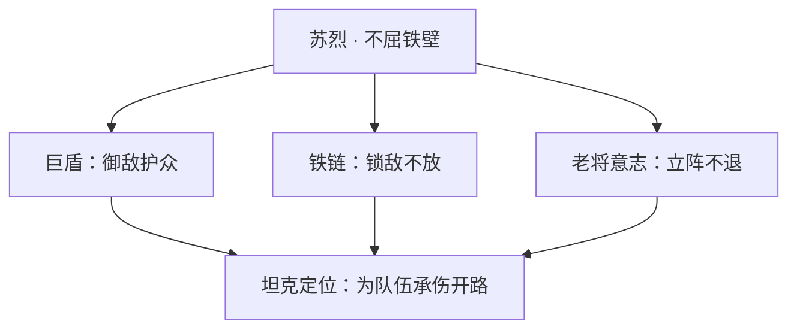
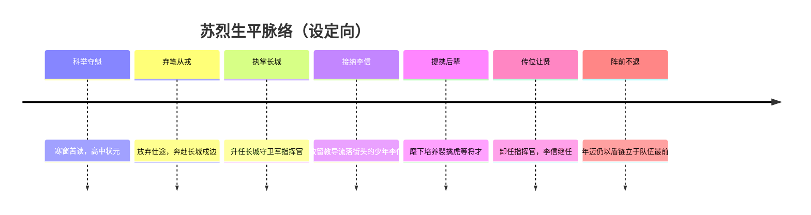
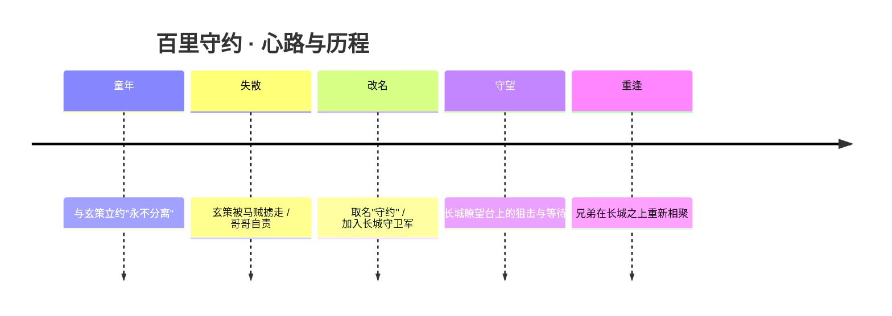
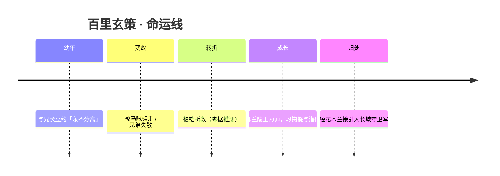
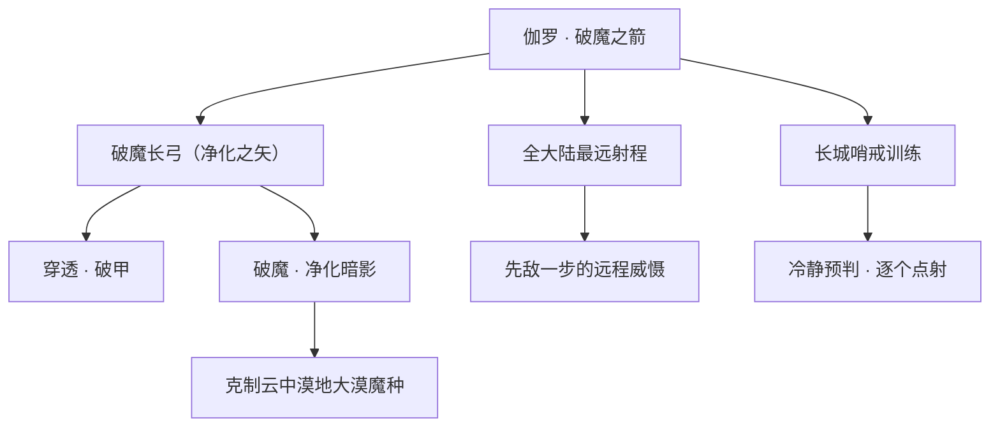
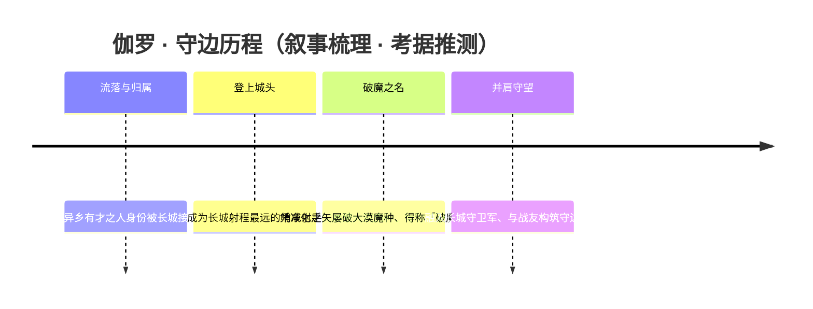
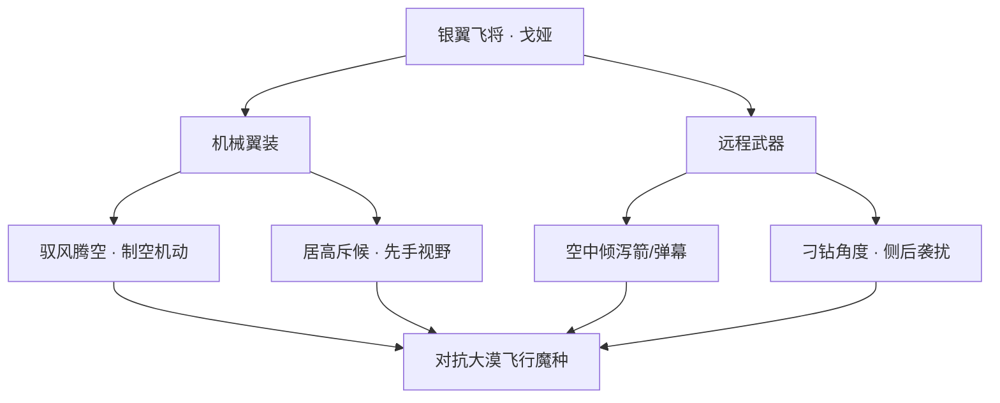
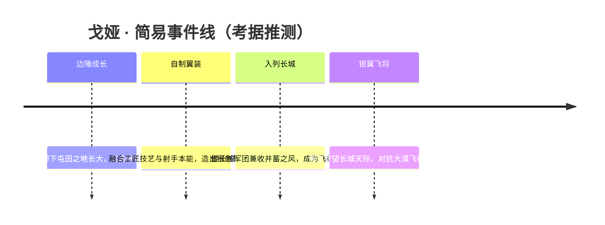
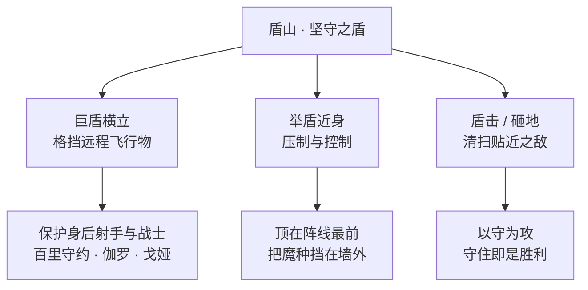
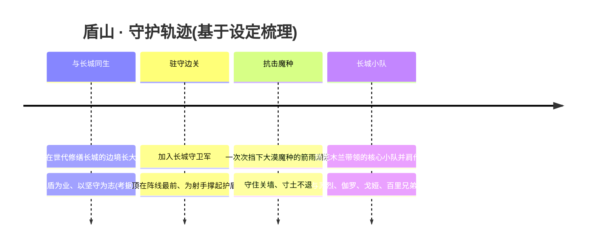

# 长城守卫军 · 英雄图鉴

> 阵营设定见 [长城守卫军 阵营页](../factions/changcheng.md)。本页收录该阵营 **6** 位英雄的深度小传。

!!! abstract "本页英雄名册"
    | 英雄 | 称号 | 定位 |
    | --- | --- | --- |
    | [苏烈](#苏烈) | 不屈铁壁 | 坦克 |
    | [百里守约](#百里守约) | 残光徽列 | 射手 |
    | [百里玄策](#百里玄策) | 狼性少年 | 刺客 |
    | [伽罗](#伽罗) | 破魔之箭 | 射手 |
    | [戈娅](#戈娅) | 银翼飞将 | 射手 |
    | [盾山](#盾山) | 坚守之盾 | 辅助/坦克 |

---

## 苏烈

坦克

**不屈铁壁 · 弃笔从戎、以盾与铁链立于阵前永不后退的长城铁壁。**

| 项目 | 内容 |
| --- | --- |
| 称号 | 不屈铁壁 |
| 定位 | 坦克 |
| 所属 | [长城守卫军](../factions/changcheng.md) |
| 身份 | 长城守卫军前任指挥官、戍边老将；曾为科举状元 |
| 别称 | 「铁壁」「苏老」（考据推测，源于阵前称号与资历） |
| 关系 | [李信](changan.md#李信)（提携之恩、继任者）、[裴擒虎](baiyue.md#裴擒虎)（旧部下属）、[花木兰](changan.md#花木兰)（长城同袍）、[盾山](#盾山)·[伽罗](#伽罗)·[百里守约](#百里守约)（同阵营战友） |
| 登场作品 | 《王者荣耀》长城守卫军系列设定、相关边塞主题剧情与活动 |

### 背景故事

苏烈的故事，是一个「读书人」如何成为「铁壁」的故事。

在帝国仍以科举取士、以文章定前程的年代，苏烈本是寒窗苦读、一举夺魁的科举状元。按常理，金榜题名意味着锦绣前程——入朝为官、执笔安邦，是无数书生终其一生所求。然而苏烈偏偏弃笔从戎，把本可执掌庙堂的双手，换成了握住巨盾与铁链的双手。这一选择，奠定了他此后一生的底色：他不是被命运推到边境的人，而是主动走向边境、主动站在最危险位置的人。（关于其弃文从武的具体缘由，官方未给出唯一定论，常见解读为其目睹边患、不愿空谈文章而选择以身御敌——此处为考据推测。）

他奔赴的，是王者大陆最北、最荒、最凶险的所在——[长城](../factions/changcheng.md)。这座长城并非寻常的城墙，而是太古遗留、矗立千百年的庞然建筑，横亘在帝国与西邻[云中漠地](../factions/yunzhong-modi.md)大漠之间。城墙之外，是被称作「魔种」的暗影威胁，自大漠深处一次次涌来，企图越过长城、踏入河洛腹地。守长城者，守的不是一段砖石，而是整个帝国身后亿万生民的安宁。

苏烈在这里，从一名戍卒一路走到了长城守卫军的指挥官。与帝国其他军团不同，长城守卫军因帝国的包容而格外「驳杂」——魔种混血、异乡人、屯田军后裔、乃至在那个时代少有从军的女性，凡有才者皆可入列。能统御这样一支成分复杂、来历各异的队伍，靠的不是出身门第，而是真正的服众之德。苏烈正是凭着身先士卒、永不后退的姿态，成为这群边陲之人共同信任的脊梁。

他最为人称道的事迹，是「接纳」与「成全」。当年流落街头、无依无靠的少年[李信](changan.md#李信)，正是被苏烈接纳、教导，一步步培养成才；日后李信接任长城守卫军指挥官，承的便是苏烈一手传下的衣钵。同样，少年时代的[裴擒虎](baiyue.md#裴擒虎)也曾是苏烈麾下的部下——苏烈之于这些后辈，既是上司，更像是那个在风雪长城上为他们撑起一片屋檐的长辈。可以说，长城守卫军后来的将才谱系里，处处有苏烈早年播下的种子。（李信、裴擒虎与苏烈的师承提携关系，为长城阵营设定的核心脉络。）

到了苏烈年事渐高、卸下指挥官重担之时，长城并未因他的退位而失去他。年迈的苏烈依旧选择留在阵前——不再发号施令，却仍以一面巨盾、一身铁链立于队伍最前。新一代的长城小队由[花木兰](changan.md#花木兰)带领，他这位前辈则甘当那道「最后的墙」。这种「老将不下火线」的形象，正是「不屈铁壁」称号最厚重的注脚：城墙会老，但只要苏烈还站着，长城就一寸不退。

### 性格与形象

苏烈的性格，可以用「沉、稳、韧」三字概括。

作为读书人出身的武将，他不同于一味逞勇的莽夫——他有谋略、有定力，懂得在喧嚣的战场上保持那份书生般的冷静。但他更鲜明的，是一种近乎执拗的坚韧：认定了要守的东西，便绝不松手；选定了要站的位置，便绝不退后。这份「不屈」不是热血上头的冲动，而是历经岁月打磨、沉淀成习惯的意志。

外形上，他是一位身披重甲、面容沧桑的老将。象征意象高度统一于一个「壁」字——**盾是他的牌面，链是他的延伸**。巨盾代表「守」，是他护住身后所有人的承诺；铁链代表「不放」，是他把敌人牢牢锁在身前、不让其越雷池一步的执念。岁月在他脸上刻下风霜，却没能让他的脊背弯下半分，反而让「铁壁」二字更显厚重。

### 战斗风格与能力（设定向）

苏烈是长城守卫军最典型的「坦克」——他的价值不在杀伤，而在「立得住、挡得下、退不动」。

- **巨盾（壁）**：苏烈的核心武装是一面厚重巨盾。设定上，这面盾既是抵御魔种冲击的物理屏障，也是他「以一人之身为众人挡刀」精神的具象化。立盾防御、以盾御敌，是他最标志性的姿态。
- **铁链（锁）**：与巨盾相配的，是他用以「锁敌」的铁链。链可甩出、可缠拽，用来将试图突破或逃脱的敌人强行拖回、牢牢钉在原地——对应了他「永不放敌人过墙」的战场定位。
- **不退的根基**：作为前指挥官与戍边老将，他的「能力来历」并非天赋异禀的法力，而是几十年阵前淬炼出的经验、纪律与意志。他的强大，是「人」的强大——是一名老兵把自己活成一座城墙的强大。

（以上为基于人物背景设定与坦克定位的叙事化描述，不涉及具体游戏数值。）

### 重要事件 / 剧情参与

- 长城守卫军戍边与对抗[云中漠地](../factions/yunzhong-modi.md)大漠魔种的长期防线中，苏烈是早期的核心支柱与指挥者。
- 培养与传承：接纳[李信](changan.md#李信)、统御[裴擒虎](baiyue.md#裴擒虎)等后辈，是长城将才谱系的奠基者之一。
- 边塞主题的剧情与活动中，苏烈常以「老将坐镇」「铁壁不退」的形象出现（具体活动以官方为准）。

### 羁绊关系

| 对象 | 关系 | 说明 |
| --- | --- | --- |
| [李信](changan.md#李信) | 提携 / 继任 | 苏烈接纳教导流落街头的李信，李信后接任长城守卫军指挥官，承其衣钵。 |
| [裴擒虎](baiyue.md#裴擒虎) | 旧上司 / 部下 | 裴擒虎曾为苏烈麾下下属，是苏烈早年提携的后辈之一。 |
| [花木兰](changan.md#花木兰) | 长城同袍 | 苏烈卸任后，长城小队由花木兰带领，二人同属长城守卫军，前后辈共守边境。 |
| [盾山](#盾山) | 同阵营战友 | 同为长城守卫军以「盾」御敌的守护者，理念相承，皆司「坚守」之职。 |
| [伽罗](#伽罗)·[百里守约](#百里守约)·[百里玄策](#百里玄策)·[戈娅](#戈娅) | 同阵营战友 | 同属长城守卫军，并肩守护边境长城、抵御大漠魔种。 |
| [铠](changan.md#铠) | 同阵营战友 | 铠从日落海漂流而来、被花木兰拾得命名并加入长城，与苏烈同列守军。 |
| [兰陵王](modao-shadow-abyss.md#兰陵王) | 间接关联 | 兰陵王曾收留教导百里玄策并将其托付花木兰，使玄策入长城，与苏烈所属阵营产生交集。 |

### 经典台词

!!! quote
    「城在人在，城破——人亦不退。」（考据推测）

!!! quote
    「盾，是为了护住身后的人。」（考据推测）

!!! quote
    「书生也好，老兵也罢，站在这里，就一步都不能退。」（考据推测）

（苏烈台词以官方游戏内语音为准，上述为依据其「不屈铁壁」人设的叙事化推测。）

---

## 百里守约

射手长城守卫军狙击

**残光徽列 · 在残光散尽之前，恪守那个永不分离的约定**

| 档案 | 内容 |
| --- | --- |
| 称号 | 残光徽列（「残虹」「孤鹰」等多为皮肤名或玩家俗称，非英雄称号·考据推测） |
| 定位 | 射手（远程狙击型） |
| 所属 | [长城守卫军](../factions/changcheng.md) |
| 身份 | 长城守卫军狙击手、瞭望哨上的孤独枪手 |
| 别称 | 守约、约约（玩家昵称）、"长城的眼睛"（考据推测） |
| 关系 | 弟弟 [百里玄策](#百里玄策)；战友 [苏烈](#苏烈)、[伽罗](#伽罗)、[盾山](#盾山)、[戈娅](#戈娅)；长城统帅 [花木兰](changan.md#花木兰)、[李信](changan.md#李信)；弟弟的恩师 [兰陵王](modao-shadow-abyss.md#兰陵王) |
| 登场作品 | 《王者荣耀》英雄背景故事；联动企划及英雄短片（如百里兄弟相关主题动画·考据推测） |

### 背景故事

在王者大陆的最北端，太古遗留的长城像一道被时间刻进大地的脊骨，绵延横亘于河洛西北的荒原之上。它的西侧，是终年风沙呼啸、潜藏暗影魔种的云中漠地；它的东侧，则是帝国愿意以包容之心庇护的万千生民。百里守约，就出身在这条边境线脚下、一座并不起眼的长城畔小镇。

按照原创设定，守约与弟弟[百里玄策](#百里玄策)无父无母，是相依为命的孤儿。哥哥温和、沉稳、心思细腻，弟弟则带着与生俱来的野性与不安分——后来人们才知道，玄策的身体里流淌着狼的基因，是人与魔种的混血。但在那段贫寒却温暖的童年里，这一切都还不重要。重要的是兄弟二人立下的那个约定：**无论发生什么，永远不分离**。对当时的守约而言，守住弟弟、守住这个家，便是他全部的世界。

平静被一场突如其来的劫掠击碎。马贼洗劫了边镇，年幼的玄策在混乱中被掳走，从此下落不明。守约没能护住弟弟，也没能守住那个"永不分离"的约定——这份自责像一根永远拔不出的刺，扎进了他此后的人生。他改名为"**守约**"，把那个未能兑现的承诺当作名字日日背负：他要变强，要等到与弟弟重逢的那一天，要亲口对玄策说一句迟来的"对不起"，再也不让他离开自己的视线。

为了寻找弟弟、也为了一份能让自己变强的力量，守约加入了[长城守卫军](../factions/changcheng.md)。这支驻守边境的军团有着帝国少见的胸怀：它不问出身，吸纳魔种混血、异乡人、屯田军的后裔，乃至在别处常被轻视的女性，只要有才、有志，长城便给他们一处安身立命的瞭望台。守约在这里成了一名狙击手——一个习惯于沉默、习惯于在高处独自等待的角色。他把对弟弟的牵挂收进枪膛，把所有的耐心都倾注进十字准星之后那一段漫长的呼吸里。在他看来，狙击不是杀戮的技艺，而是一种"守望"：守望边境的安宁，也守望着某一天，那个被风沙带走的少年会沿着长城走回来。

命运最终给了这对兄弟一线转机。被掳走的玄策几经辗转，曾被[铠](changan.md#铠)所救，后被暗影中的刀锋[兰陵王](modao-shadow-abyss.md#兰陵王)收留并收为徒,习得潜行、钩镰与杀戮之术；兰陵王最终将这个少年托付给长城小队的队长[花木兰](changan.md#花木兰),玄策由此走进了长城守卫军。当哥哥与弟弟在长城之上重逢——一个是恪守约定多年、温柔而坚定的狙击手，一个是被命运磨出狼牙、却唯独把哥哥视作例外的少年——那个曾被风沙吹散的约定，终于在边境的城墙上重新被两个人共同握紧。守约依旧站在高处，为冲锋在前的弟弟看护视野；玄策则在阴影里穿梭，替哥哥扫清近身的威胁。一远一近，一静一动，这一次，他们真的"不再分离"。

### 性格与形象

守约是典型的"暖男哥哥"。在长城守卫军这样一个充满了沙场气息与魔种威胁的环境里，他是少有的温柔底色——说话不疾不徐，照顾战友细致入微，连脾气最难驯的弟弟玄策，也唯独把他这个哥哥当作所有规则之外的"例外"。这份温柔并非软弱，而是一种被巨大愧疚反复淬炼后的克制：他把激烈的情绪压在心底，转化成了狙击手所必需的极致冷静与耐心。

外形上，守约是长城瞭望台上那个孤独的身影：风衣或军装猎猎，肩负一支远超寻常弓弩射程的长狙，眉宇间总有一缕散不去的沉郁。他的象征意象始终与"光"与"距离"相关——称号"残光徽列"中的"残光"，既像狙击手在暮色与残阳里独自据守的孤影，也隐喻着那个被时间磨损、却始终不肯熄灭的约定之光。一束穿过准星的微光、一道横过荒原的弹道，构成了这个角色最鲜明的视觉签名。

### 战斗风格与能力(设定向)

作为长城守卫军的狙击手，守约的战斗哲学是"一击即定"。他不依赖密集的近距离火力，而是凭借超远的射程与对节奏的精准把握，在敌人尚未察觉时就锁定要害。他的武器是一支专为长距离精确打击而生的长狙，配合稳定的呼吸与对风、距、势的判断，使每一发都成为决定胜负的"那一枪"。在设定向的理解中，他的能力可拆解为：架枪蓄力的瞄准、远程穿透的致命一击，以及在阵地战中为队友提供视野与火力压制的"看门人"角色——这与他"守望"的性格内核完全一致。

需要说明的是，以上为基于背景设定与角色定位的描述，并非游戏内技能数值；具体招式名称与机制以官方为准（考据推测）。

### 重要事件 / 剧情参与

- **童年立约与失散**：与弟弟[百里玄策](#百里玄策)立下"永不分离"的约定；玄策被马贼掳走，成为守约一生的转折与心结。
- **改名与从军**：因自责未能守约，改名"守约"，加入[长城守卫军](../factions/changcheng.md)，成为狙击手，在边境守望并寻找弟弟。
- **兄弟重逢**：玄策经[铠](changan.md#铠)相救、由[兰陵王](modao-shadow-abyss.md#兰陵王)收为徒，最终被托付给[花木兰](changan.md#花木兰)而入长城，兄弟在长城之上重聚。
- **长城防线作战**：作为长城小队的远程火力，参与抵御来自云中漠地的暗影魔种威胁，与[苏烈](#苏烈)、[伽罗](#伽罗)、[盾山](#盾山)、[戈娅](#戈娅)等并肩据守边境（考据推测）。

### 羁绊关系

| 对象 | 关系 | 说明 |
| --- | --- | --- |
| [百里玄策](#百里玄策) | 亲兄弟 | 无父无母、同住长城畔小镇，约定永不分离；玄策被掳后守约改名守约、入长城等待重逢。守约是暖男哥哥，调皮的玄策唯把他视作例外。 |
| [兰陵王](modao-shadow-abyss.md#兰陵王) | 弟弟的恩师 | 兰陵王收留被铠所救的玄策、收为徒，教其暗影潜行、钩镰与杀戮，后将玄策托付花木兰，间接促成兄弟重逢。 |
| [花木兰](changan.md#花木兰) | 长城小队队长 | 长城守卫军核心、长城小队队长；接收兰陵王托付的玄策，使百里兄弟得以同入长城。 |
| [李信](changan.md#李信) | 历任统帅 | 长城守卫军历任指挥官之一，守约麾下从军、共守边境的统帅。 |
| [苏烈](#苏烈) | 同阵营战友 | 长城守卫军前指挥官、不屈铁壁，与守约同属守护边境的核心战力。 |
| [伽罗](#伽罗) | 同阵营战友 | 长城守卫军射程最远的射手，与守约同为远程火力，箭矢可破魔净化。 |
| [盾山](#盾山) | 同阵营战友 | 手持巨盾、可格挡远程飞行物的机关守护者，常为狙击与冲锋者构筑防线。 |
| [戈娅](#戈娅) | 同阵营战友 | 驭风而行的飞行射手，与守约同列长城守卫军远程序列。 |
| [铠](changan.md#铠) | 同阵营关联 | 自日落海而来、被花木兰拾得命名加入长城；曾出手相救流落的玄策。 |
| [裴擒虎](baiyue.md#裴擒虎) | 同阵营关联 | 苏烈旧部，长城守卫军关联人物，同在边境抗魔的战友谱系中。 |

### 经典台词

!!! quote "百里守约 · 语录"
    "我会守住约定。"（考据推测）

    "在残光散尽之前，一切尽在掌握。"（考据推测）

    "弟弟，这一次，我不会再让你离开我的视线。"（考据推测·情境台词）

    "瞄准，呼吸，然后——只需要一发。"（考据推测）

### 皮肤故事亮点

围绕百里兄弟"失散与重逢"的核心叙事，守约的多款皮肤延续了"光"与"狙击守望"的意象（如系列主题、节庆与机甲风格造型等）。这些皮肤多以孤鹰、残虹、长狙剪影为视觉母题，呼应"残光徽列"中那束永不熄灭的约定之光（具体皮肤名称、上线时间与剧情文案以官方为准·考据推测）。

---

## 百里玄策

刺客

**狼性少年 · 带狼血的人魔混血少年刺客，以钩镰与潜行在长城之上猎杀魔种。**

| 档案项 | 内容 |
| --- | --- |
| 称号 | 狼性少年 |
| 定位 | 刺客 |
| 所属 | [长城守卫军](../factions/changcheng.md) |
| 身份 | 人魔混血少年、长城守卫军刺客、兰陵王亲传弟子 |
| 别称 | 玄策、野狼崽子（戏称，考据推测） |
| 关系 | [百里守约](#百里守约)（兄长）、[兰陵王](modao-shadow-abyss.md#兰陵王)（师父）、[花木兰](changan.md#花木兰)（接引人/上司）、[铠](changan.md#铠)（恩人，考据推测） |
| 登场作品 | 长城守卫军系列背景剧情、官方英雄小传 |

### 背景故事

百里玄策与兄长[百里守约](#百里守约)同根而生，是这片大陆上极为罕见的人魔混血。在王者大陆的世界观里，长城以西邻接[云中漠地](../factions/yunzhong-modi.md)的茫茫大漠，那里是「暗影魔种」滋生繁衍之地；而百里兄弟的血脉中，正流淌着来自魔种、却又最近于野兽的「狼」之基因。这份与生俱来的异质，让他们既不完全属于人类，也不属于魔种，成了夹在两个世界之间的孩子。

兄弟二人本无父无母，自小相依为命，住在长城脚下的一座边陲小镇。哥哥守约性子温和、心思缜密，像个把一切都揽在自己肩上的暖男；弟弟玄策则天生一股野性，调皮、不羁、桀骜难驯，唯独把哥哥当作自己唯一愿意听话的例外。彼时的他们立下过一个孩童式的约定——无论发生什么，都永远不分离。这个约定，后来成了贯穿这对兄弟一生的执念。

命运的裂口出现在玄策被一伙马贼掳走的那一天。年幼的他被掠出小镇、辗转流落于大漠与荒野之间，与哥哥就此天各一方。守约因未能守住「永不分离」的约定而深深自责，索性以「守约」为名，加入了[长城守卫军](../factions/changcheng.md)，把守望与重逢当作余生的目标——他相信，只要站在这道连接人间与漠地的长城之上，总有一天能再见到弟弟。（兄弟二人的此段身世为官方原创设定。）

被掳走的玄策，则在血与刀的世界里挣扎求生。据设定，他曾被[铠](changan.md#铠)所救（考据推测此为其脱离绝境的关键转折），其后被「暗影刀锋」[兰陵王](modao-shadow-abyss.md#兰陵王)收留，并被收为徒。兰陵王看中的，正是玄策身上那股近乎本能的、属于猎食者的「狼性」——潜行、隐忍、一击致命。在师父的调教下，这个曾经只会撒野的少年，逐渐被打磨成了一名以暗影为衣、以钩镰为爪的刺客。

学成之后，兰陵王并未把玄策留在魔道的阴影里，而是将他托付给了长城小队队长[花木兰](changan.md#花木兰)。由此，玄策辗转进入[长城守卫军](../factions/changcheng.md)——这是一支因帝国的包容而吸纳了魔种混血、异乡人、屯田军后裔乃至女性等各路有才之人的队伍。对玄策而言，这不仅是一个能让他名正言顺挥刀的归宿，更冥冥之中把他推向了那道他曾被掳离的长城，推向了那个一直在城头等他的哥哥。狼崽子，终于要回家了。

### 性格与形象

玄策是典型的「狼性少年」：野、痞、轻狂，带着少年人特有的张扬与不服管教。他笑起来满不在乎，打起来却凶狠果决，眉眼间藏着野兽般的机敏与警觉。他不轻易亲近任何人，对世界保有一份猎食者的戒备，唯独在面对哥哥守约时，会卸下那身尖刺，露出孩子气的一面——哥哥是他全部柔软的来处。

在象征意象上，「狼」是他最核心的符号：孤狼般的独行、群狼般对同伴的护短、以及永远朝向猎物的尖锐獠牙。他的人魔混血身份，也让他成为长城守卫军「多元包容」主题的鲜活注脚——一个本该被排斥的异种，却在长城上找到了归属。

### 战斗风格与能力（设定向）

玄策的战斗承袭自师父[兰陵王](modao-shadow-abyss.md#兰陵王)的暗影一脉，核心是**潜行突袭**与**钩控连斩**。他师从兰陵王习得的，正是「暗影潜行、钩镰与杀戮」三门本事：以隐匿之术贴近猎物，以钩镰勾连、拉拽、撕咬，再以狼一般的爆发完成致命一击。

- **狼性本能**：流淌的狼基因赋予他超乎常人的敏捷、嗅觉与近战直觉，使其行动如野兽般迅捷难测。
- **暗影潜行**：师承魔道暗面的隐匿身法，能潜近目标而不被察觉，是其作为刺客最致命的开场。
- **钩镰之术**：以钩镰类武器勾挂敌人、拉近距离，将「控制—位移—斩杀」串成一套连贯的猎杀节奏。

> 注：以上为基于背景设定的招式来历描述，非游戏内技能数值。

### 重要事件 / 剧情参与

- **幼年被掳**：被马贼自长城脚下的小镇掳走，与兄长百里守约就此失散，成为兄弟二人命运的分水岭。
- **绝境获救**：据设定被[铠](changan.md#铠)所救而脱离险境（考据推测）。
- **拜入兰陵王门下**：被[兰陵王](modao-shadow-abyss.md#兰陵王)收为徒，习得暗影潜行、钩镰与杀戮之术。
- **入主长城守卫军**：经兰陵王托付给[花木兰](changan.md#花木兰)，正式加入[长城守卫军](../factions/changcheng.md)，与失散多年的兄长重新走向同一阵营。

### 羁绊关系

| 对象 | 关系 | 说明 |
| --- | --- | --- |
| [百里守约](#百里守约) | 亲兄弟 | 无父无母、同住长城畔小镇，约定永不分离；玄策被掳后守约改名「守约」加入长城等待重逢。守约是暖男哥哥，调皮的玄策唯把哥哥视为例外。 |
| [兰陵王](modao-shadow-abyss.md#兰陵王) | 师徒 | 兰陵王收留被铠所救的玄策、收为徒，教其暗影潜行、钩镰与杀戮；后将玄策托付花木兰，玄策由此入长城守卫军。 |
| [花木兰](changan.md#花木兰) | 接引人 / 上司 | 长城小队队长，受兰陵王所托接纳玄策，是其进入长城守卫军的引路人。 |
| [铠](changan.md#铠) | 恩人（考据推测） | 据设定曾相救流落中的玄策，使其得以被兰陵王收留。 |
| [苏烈](#苏烈) · [伽罗](#伽罗) · [盾山](#盾山) · [戈娅](#戈娅) | 同阵营战友 | 同属[长城守卫军](../factions/changcheng.md)，共同守护边境长城、抵御大漠魔种。 |

### 经典台词

!!! quote "狼性少年 · 百里玄策"
    "哥，我回来了。"（考据推测）

    "想抓住我？先问问我的钩子答不答应。"（考据推测）

    "狼，从来不会两次掉进同一个陷阱。"（考据推测）

---

## 伽罗

射手

**破魔之箭 · 立于长城之巅、以净化之矢射穿黑暗的远程守望者。**

| 项目 | 内容 |
| --- | --- |
| 称号 | 破魔之箭 |
| 定位 | 射手 |
| 所属 | [长城守卫军](../factions/changcheng.md) |
| 身份 | 长城守卫军成员、长城之巅的远程哨戒射手 |
| 别称 | 「破魔之箭」（称号）、长城上射程最远的弓手（设定描述） |
| 关系 | [百里守约](#百里守约)、[戈娅](#戈娅)、[盾山](#盾山)、[苏烈](#苏烈)、[花木兰](changan.md#花木兰)（同阵营战友） |
| 登场作品 | 《王者荣耀》英雄上线背景设定（考据推测：长城守卫军主题英雄之一） |

### 背景故事

在王者大陆的最北端，矗立着一道太古遗留、绵延千百年的庞然建筑——长城。它的西面，便是终年风沙蔽日的[云中漠地](../factions/yunzhong-modi.md)，那是大漠魔种与暗影之力滋生蔓延的危险疆域。长城之上，常年驻守着一支与帝国主流军队气质迥异的队伍：他们之中有魔种混血、有异乡流人、有屯田军的后裔，也有在别处不被见容的女性勇者。帝国以其少见的包容，让这些「不合时宜」的有才之人在边塞找到了归属。伽罗，正是这道城墙之上一道沉默而锐利的身影。

伽罗是长城守卫军中**射程最远的射手**。当大漠的风暴在地平线上翻涌、当魔种的潮水还在视野尽头蠕动时，她已经能在城堞之间张弓搭箭，于敌人尚未抵达射界之前，将第一支箭送入它们的核心。对长城守卫军而言，「最远的射程」不仅是一种战术优势，更是一种象征——她代表着这支军队望向黑暗的目光，比黑暗本身更早一步。（考据推测：游戏设定中伽罗以「射程为全英雄之最」「普攻可叠加破甲」等特性著称，背景叙事多由此引申。）

她最为人所知的，是手中那张能够**「破魔」**的弓。在长城对抗大漠魔种的漫长战争里，寻常的钢铁箭矢往往只能伤其皮肉，却奈何不了缠绕在魔种躯体上的暗影之力。而伽罗之箭不同——她的箭锋之上凝结着某种能够穿透、撕裂乃至净化暗影的力量，魔种最深处那团污浊的黑雾，会在箭矢贯穿的刹那被生生破开。正因如此，长城上下都称她为「破魔之箭」：她射出的不只是箭，更是穿透绝望的一线光。（考据推测：关于「净化魔种」的具体来历，官方未给出完整硬设定，此处为基于称号与定位的合理引申。）

加入长城守卫军，对伽罗而言既是归宿，也是战场。在这片被主流世界视为蛮荒、危险、藏污纳垢的边陲，恰恰汇聚了王者大陆最坚硬的意志。她与[苏烈](#苏烈)的不屈铁壁、[盾山](#盾山)的机关巨盾、[百里守约](#百里守约)的精准长狙、[戈娅](#戈娅)的银翼飞掠彼此呼应——盾在前，箭在后，飞将巡天，狙手潜伏，构成一张严密而互补的守边之网。她的箭，是这张网射向暗影最远、也最决绝的那一端。

支撑她日复一日站在城头的，并非仇恨，而是一种近乎信仰的「守望」。大漠的黑暗从不停歇，能够将它阻挡在城墙之外的，唯有那些愿意把目光、把臂力、把整个生命都钉在这道千年城墙上的人。伽罗选择成为其中之一。她明白，只要她的弦还能拉满、她的眼还能望远，城墙之内的灯火与人间，就还能再亮一夜。

### 性格与形象

伽罗给人的第一印象是**冷静、专注而疏离**。作为射程最远的射手，她的战斗哲学是「在被卷入混乱之前解决威胁」，这种习惯也渗进了她的性格——她惯于在远处观察、权衡、瞄准，话不多，却往往一击中的。她不像[戈娅](#戈娅)那样张扬如风，也不似边塞老兵那般沧桑健谈，而是带着哨戒者特有的克制与警觉。

但疏离并不等于冷漠。她之所以选择留在长城这片「容得下异类」的土地上，恰恰因为内心深处对「守护」与「被接纳」有着强烈的认同。她明白长城守卫军是一群被别处拒之门外的人凭借共同的信念聚成的队伍，因此她对身边的战友抱有一种沉默而坚定的忠诚。

外形上，她的核心象征意象是**弓与箭、远望与光**。最具辨识度的便是那张能破魔净化的长弓——它既是武器，也是她身份的图腾。围绕她的视觉语言往往强调「远」与「净」：极远的射界、贯穿黑暗的箭轨、以及箭尖那一抹足以撕裂暗影的微光。站在长城高耸的城堞之上、迎着大漠的风沙拉满弓弦，是属于「破魔之箭」最经典的剪影。（外形细节为基于称号与定位的考据描述。）

### 战斗风格与能力（设定向）

伽罗的战斗风格，可以用四个字概括：**远、准、破、净**。

- **远**：她是长城守卫军、乃至整片大陆中射程最远的射手。她从不与敌人正面纠缠，而是在所有人都还来不及反应的距离上，率先建立起致命的威慑。对她而言，最好的防御就是让敌人永远走不进她的「死亡半径」。
- **准**：远射程的意义，建立在百发百中的精度之上。她的每一箭都经过冷静的预判与瞄准，越是混乱的战场，越能凸显她从容点射、逐个击破的价值。
- **破**：她的箭矢被设定为擅长穿透与破甲。面对披甲的敌人或缠绕硬化外壳的魔种，连续的箭击会层层削穿它们的防护，让看似坚不可摧的目标在一连串精准打击下崩解。（考据推测：与游戏内「普攻叠加破甲」的机制相呼应。）
- **净**：这是「破魔之箭」最独特之处。她的箭不仅能造成物理上的贯穿，更能**破开、净化暗影之力**，对来自大漠的魔种有着天然的克制。寻常武器只能伤其形，她的箭却能伤其「魔」。

下面用一张图概括她的能力来历与构成（武器名含特殊语义，已加引号）。

### 重要事件 / 剧情参与

- **驻守长城、抵御大漠魔种**：作为长城守卫军的远程主力，伽罗长期参与长城对[云中漠地](../factions/yunzhong-modi.md)暗影魔种的防御战，是城墙之上「望得最远、射得最远」的那道防线。
- **与长城小队的协同作战**：在以[花木兰](changan.md#花木兰)为队长、由[苏烈](#苏烈)、[盾山](#盾山)、[百里守约](#百里守约)、[戈娅](#戈娅)等人组成的多元守边阵列中担任远程输出与净化职责（考据推测：基于阵营「长城小队」设定的合理推演）。

> 注：以上事件线为依据阵营设定与英雄定位整理的叙事框架，《王者荣耀》并未为伽罗发布大型独立剧情动画，具体官方剧情以游戏内为准。

### 羁绊关系

| 对象 | 关系 | 说明 |
| --- | --- | --- |
| [百里守约](#百里守约) | 同阵营战友（长城守卫军） | 同为长城守卫军射手，一者最远、一者最准，远程火力彼此呼应，是城墙之上的双重「眼睛」。 |
| [戈娅](#戈娅) | 同阵营战友（长城守卫军） | 同属射手序列，一者驭风飞掠、一者远射定点，机动与远程互补。 |
| [盾山](#盾山) | 同阵营战友（长城守卫军） | 盾山以巨盾格挡远程飞行物在前，伽罗在盾后远程倾泻箭雨，典型的「盾在前、箭在后」组合。 |
| [苏烈](#苏烈) | 同阵营战友（长城守卫军） | 苏烈为长城守卫军前指挥官、以铁壁之姿坚守，伽罗为其麾下守边阵列的远程一环。 |
| [花木兰](changan.md#花木兰) | 同阵营战友（长城小队） | 花木兰为长城小队队长，伽罗为小队的远程输出与净化力量（考据推测）。 |

> 说明：以上羁绊覆盖长城守卫军 relatedRelationships 中「同阵营战友」一项所涉及、与伽罗直接相关的成员。其余如百里兄弟亲情、兰陵王与玄策师徒等关系，主要围绕其他成员展开，伽罗作为同袍间接关联。

### 经典台词

!!! quote "破魔之箭 · 语录（考据推测）"
    「我的箭，能射穿黑暗。」（考据推测）

    「站在长城之上，再远的敌人也逃不过我的视线。」（考据推测）

    「魔，终将被净化。」（考据推测）

---

## 戈娅

射手长城守卫军

**银翼飞将 · 驭风而行的飞行射手，背负机械翼装、来去如风。**

| 项目 | 内容 |
| --- | --- |
| 称号 | 银翼飞将 |
| 定位 | 射手 |
| 所属 | [长城守卫军](../factions/changcheng.md) |
| 身份 | 长城守卫军飞行斥候 / 翼装射手（考据推测） |
| 别称 | 银翼飞将、飞将（与「飞将」吕布称号巧合，二者并无关联，考据推测） |
| 关系 | [伽罗](#伽罗)、[百里守约](#百里守约)、[盾山](#盾山)、[苏烈](#苏烈)、[花木兰](changan.md#花木兰)、[李信](changan.md#李信) |
| 登场作品 | 王者荣耀本传（长城守卫军主题）（考据推测） |

### 背景故事

戈娅出身于长城脚下的边陲屯田之地。王者大陆的北疆，横亘着一道太古遗留的雄关——长城。它矗立千百年，把繁华的河洛腹地与西邻的[云中漠地](../factions/yunzhong-modi.md)大漠隔开，将那些自漠地深处涌出的暗影魔种，一次又一次地挡在墙外。守在这道墙上的，便是包容了魔种混血、异乡人、屯田军后裔乃至女性等一切有才之人的[长城守卫军](../factions/changcheng.md)。戈娅，正是在这样一支「不问出身、只看本事」的队伍里，找到了属于自己的天空。（考据推测）

她的童年与长城一同长大。城墙之上，狙击手的远射、盾卫的格挡、骑兵的冲锋各有所长，唯独「天空」长久地空着——魔种之中不乏盘旋俯冲的飞行种，而长城军团的目光始终被钉在地面与垛口之间。戈娅从小就盯着那片无人占据的高处：若能有人飞起来，居高临下，便能在魔种自天而降之前先一步看见它、先一步射穿它。这个念头，后来变成了她背上那对银色的机械之翼。（考据推测）

借着长城军团兼收并蓄、网罗能工巧匠的传统，戈娅得以接触到军团里那些维系机关守护与器械防线的造物技艺。她将工匠的精巧与射手的本能合而为一，造出了一副可以让人真正离地的翼装——不是滑翔，而是驭风、是飞翔。从此，长城的天空有了第一位守望者。她不再只是站在墙头向外张望的斥候，而是能够腾空而起、绕到魔种侧后、在最刁钻的角度倾泻箭雨的「银翼飞将」。（考据推测）

她的动机干净而坚定：长城之内，是她想守护的人间烟火；长城之外，是必须被拦下的黑暗。作为长城守卫军中少有的「制空」力量，她把自己当成全队的眼睛和最灵活的那一杆枪——哪里告急，风就把她带到哪里。在以「边塞军旅、对抗暗影魔种、多元包容」为底色的长城叙事里，戈娅代表的是这支队伍永不停步的进取与创造：当旧的防线不足以应对新的威胁时，总有人愿意挣脱地心引力，去开辟一条前人没有走过的航线。（考据推测）

### 性格与形象

戈娅性格爽朗、果决，带着飞行者特有的洒脱与一往无前。她讨厌被束缚，无论是被城墙圈住的视野，还是被规矩限定的打法——对她而言，天空就是答案，飞起来，问题往往就解决了一半。她话不多，行动却极快，习惯用速度和角度替自己说话。（考据推测）

形象上，她最醒目的标志是那一对银色的机械之翼，张开时如银翼破空，收拢时贴身利落。整体造型偏向轻甲与机械结合的「飞行斥候」风格，强调流线、轻量与机动，与长城守卫军那种粗粝的边塞铁血气质形成对照——别人是钉在地上的盾与墙，她是掠过墙头的一道银光。其象征意象集中在「翼」「风」「居高临下的视野」三者：翼，是挣脱与守望；风，是来去如风的速度；高处，是先于黑暗看见黑暗的责任。（考据推测）

### 战斗风格与能力（设定向）

戈娅的力量来源，是她背上那副自制的机械翼装与配套的远程武器。翼装赋予她长城军团其他成员所没有的维度——制空与机动；远程武器则让她得以在空中保持射手的本职：远、准、连绵不绝。（考据推测）

她的打法核心可以概括为「以翼为腿、以高为势」：先用翼装抢占高度与角度，把战场看穿；再借速度绕到敌人侧后或上方，从最难防御的方位发起远程压制；一旦局势不利，又能凭借飞行迅速脱离纠缠，重新拉开身位。这套来去如风的节奏，使她在长城的防线上扮演着「灵活的火力点」与「全队之眼」的双重角色——尤其擅长应对那些自漠地天空俯冲而来、令地面射手鞭长莫及的飞行魔种。（考据推测；以上为基于背景设定的描述，不涉及游戏数值）

### 重要事件 / 剧情参与

- 作为[长城守卫军](../factions/changcheng.md)的一员，长期参与北疆长城防线对[云中漠地](../factions/yunzhong-modi.md)方向暗影魔种的持续防御与边境斥候任务。（考据推测）
- 以「制空」之力补全长城军团长期欠缺的空中视野与机动火力，与地面的盾、墙、远狙形成立体防线。（考据推测）

> 注：戈娅的具体登场剧情与官方动画/活动归属，公开资料有限，以上事件线为依据其设定与长城叙事所作的合理梳理（考据推测）。

### 羁绊关系

| 对象 | 关系 | 说明 |
| --- | --- | --- |
| [伽罗](#伽罗) | 同阵营战友（长城守卫军） | 同为长城守卫军射手，一者破魔之箭射程最远、一者银翼制空，远近高低彼此补位。（考据推测） |
| [百里守约](#百里守约) | 同阵营战友（长城守卫军） | 长城狙击手以静制远、定点猎杀，戈娅以动制高、空中袭扰，构成「静狙＋动翼」的火力配合。（考据推测） |
| [盾山](#盾山) | 同阵营战友（长城守卫军） | 盾山以巨盾格挡一切远程飞行物坚守正面，戈娅则从空中绕后，一守一袭。（考据推测） |
| [苏烈](#苏烈) | 同阵营战友（长城守卫军） | 长城前指挥官、铁壁坦克，戈娅在其所守的防线上担任空中之眼。（考据推测） |
| [花木兰](changan.md#花木兰) | 同阵营战友（长城小队） | 花木兰为长城小队队长，戈娅作为军团成员同属这条守护边境的战线。（考据推测） |
| [李信](changan.md#李信) | 同阵营战友（长城守卫军） | 李信为长城历任统帅之一，戈娅在其统辖的长城防务体系中作战。（考据推测） |

### 经典台词

!!! quote "戈娅 · 经典台词（考据推测）"
    「天空，就交给我吧。」（考据推测）

    「飞起来，你们就追不上我了。」（考据推测）

    「长城之上，风从不止息——我也是。」（考据推测）

---

## 盾山

辅助坦克

**坚守之盾 · 手持巨盾、可格挡一切远程飞行物的长城守卫军机关守护者**

| 项目 | 内容 |
| --- | --- |
| 称号 | 坚守之盾 |
| 定位 | 辅助 / 坦克 |
| 所属 | [长城守卫军](../factions/changcheng.md) |
| 身份 | 长城烽燧与关墙的机关守护者、阵线护盾手 |
| 别称 | 盾山(谐"顿珊");"行走的城墙""人形关隘"(考据推测，源自玩家与队友昵称) |
| 关系 | [苏烈](#苏烈)、[伽罗](#伽罗)、[戈娅](#戈娅)、[百里守约](#百里守约)、[百里玄策](#百里玄策)、[花木兰](changan.md#花木兰) |
| 登场作品 | 《王者荣耀》英雄上线背景及长城守卫军系列剧情 |

### 背景故事

盾山是矗立在王者大陆西北边境、那道太古长城上最沉默也最坚韧的一道身影。长城本身并非寻常的夯土城墙，而是一座横亘千百年、由失落工艺与古老机关共同构筑的太古遗留建筑；它将河洛西北的农耕沃土与西邻[云中漠地](../factions/yunzhong-modi.md)的大漠风沙隔开，也将温暖人间与盘踞漠外的暗影魔种隔开。长城守卫军世代驻守于此，而盾山，便是为"守住这道墙"而生的人。

关于盾山的确切出身，官方设定着墨克制(考据推测)。可以确知的是，他并非天生的将才或剑客，而是与长城本身血脉相连的"守护者"——一名熟谙关墙机关、烽燧器械与防御工事的匠人与战士。在帝国边境，长城守卫军因帝国的包容而吸纳了魔种混血、异乡人、屯田军后裔乃至女性等一切有才之人；盾山正是这片"多元包容"土壤中长出的果实。他或许出身于世代修缮长城的屯田工匠之家，自幼在巨石、铁索、绞盘与箭垛之间长大，把一面比常人还高大的巨盾，背成了自己身体的一部分(考据推测)。

边境的日子从来不太平。大漠的另一侧，魔种从不曾停止试探这道墙的缝隙——它们或借风沙掩护悄然逼近，或在夜色里以成片的飞射之物倾泻而下。城墙之上，[百里守约](#百里守约)以长狙锁定远处的目标，[伽罗](#伽罗)以破魔之箭净化逼近的污秽，[戈娅](#戈娅)驭风巡弋于天际；而在他们身前、在最容易被远程火力压制的阵线最前沿，需要有一个人，把那些射向同袍的箭矢、弩矢与一切飞来之物，统统挡下。盾山选择了这个位置——不是冲锋陷阵的位置，而是"挡在所有人前面"的位置。

他信奉一条朴素到近乎固执的信条：墙不会主动出击，但墙永远不能后退。在一次次魔种的潮涌中，盾山学会了如何用一面盾去对抗整片箭雨，如何在队友的火力之间为他们撑出一道喘息的缝隙，如何把"坚守"这两个字，从口号变成可以被身体反复兑现的承诺。他的名字"盾山"，本身就是一则隐喻——盾如山岳，立则不动，挡则无隙；当他张开巨盾横在阵前，那一刻他不再是一个人，而是长城向前延伸的一段活的城墙。

在长城守卫军的谱系里，他与前指挥官[苏烈](#苏烈)同属"以盾立身、以守为攻"的坚守者一脉。苏烈以盾与铁链坚守不退，被称为"不屈铁壁"；盾山则把这份"不退"推向了极致的专注——他不求伤敌，只求挡住，让身后的射手与战士能够安心地把箭与刀，送到该送的地方。在队长[花木兰](changan.md#花木兰)带领的长城小队里，他是那块最不起眼、却谁也离不开的基石。

### 性格与形象

盾山的性格，几乎可以用他的兵器来概括：沉稳、笨拙、可靠，话不多却从不食言。他不是机敏善辩之人，遇事第一反应往往是"挡在前面"而非"想个巧办法"；正因如此，队友会拿他的迟钝开玩笑，却从不怀疑他的忠诚。在嬉笑怒骂的长城小队里，他常是那个被调侃、被依赖、也被默默信任的存在(考据推测)。

外形上，盾山以一面远超常人尺寸的巨盾为核心意象——那面盾几乎挡住了他大半个身躯，使他看上去更像一座移动的小型堡垒，而非一名士兵。厚重的护甲、低垂稳实的重心、以及那面盾后探出的、专注盯着前方的目光，构成了他最鲜明的形象。象征意义上，他是"墙"的人格化：山之沉、盾之坚、墙之久，三者合一。当箭雨倾泻而下，别人看到的是危险，他看到的是一面"需要被挡住"的天空。

### 战斗风格与能力(设定向)

盾山的全部战斗哲学，都建立在那面巨盾之上。它既是防具，也是器械，更是他与长城机关一脉相承的造物——并非单纯的金属铁板，而是一件可以举、可以立、可以拍、可以变形的多用途机关盾(考据推测)。

- **巨盾格挡**：盾山最核心、也最具辨识度的能力，是用巨盾正面格挡一切远程飞行物——无论是魔种倾泻的飞射之物，还是敌方射手与法师投来的远程攻击，都能被他这面"墙"硬生生挡下。这让他成为天然的护盾位与开团肉盾。
- **举盾前压**：他可以举盾向前推进，把贴近的敌人顶开、压制在墙与盾之间，为身后的同袍创造安全的输出空间。
- **盾身近战**：当敌人冲到近身，巨盾本身就是钝击的武器；他以盾砸地、以盾撞敌，把"防具"反过来当作攻坚的器械使用。
- **守护者的定位**：盾山的设计初衷不是杀敌，而是"让队友活下来"。他的价值不写在击杀数里，而写在那些被他替队友挡下的伤害里——这正是长城守卫军"坚守"精神最直接的具象。

### 重要事件 / 剧情参与

- 作为长城守卫军成员，长期参与守护边境长城、抵御来自云中漠地大漠魔种威胁的战事。
- 在阵线最前沿承担护盾与开团职责，是长城小队火力体系中不可或缺的防御核心。
- 与队内射手([百里守约](#百里守约)、[伽罗](#伽罗)、[戈娅](#戈娅))形成"前盾后箭"的经典配合：他挡，他们射。

### 羁绊关系

| 对象 | 关系 | 说明 |
| --- | --- | --- |
| [苏烈](#苏烈) | 同阵营战友 · 守护者前辈 | 同属长城守卫军以盾立身一脉；苏烈以盾与铁链坚守不退，盾山承其"不退"之志(考据推测)。 |
| [花木兰](changan.md#花木兰) | 队长与队员 | 花木兰带领长城小队，盾山为小队中的防御基石。 |
| [百里守约](#百里守约) | 同阵营战友 | 前盾后箭：盾山挡下飞向阵线的远程攻击，守约自后方以长狙精准制敌。 |
| [百里玄策](#百里玄策) | 同阵营战友 | 同为长城小队成员；玄策潜行突袭，盾山正面坚守，攻守互补(考据推测)。 |
| [伽罗](#伽罗) | 同阵营战友 | 伽罗以破魔之箭净化逼近之敌，盾山为其撑起前排护盾。 |
| [戈娅](#戈娅) | 同阵营战友 | 戈娅驭风高飞、来去如风，盾山则稳立地面、把守阵线，一动一静相成。 |

### 经典台词

!!! quote "盾山 · 语录"
    "我的盾，挡得住一切飞来的东西。"(考据推测)

    "墙不会后退，我也不会。"(考据推测)

    "站在我身后，没事。"(考据推测)

!!! tip "继续探索"
    返回 [长城守卫军 阵营页](../factions/changcheng.md) · 浏览 [全英雄图鉴](index.md) · 查看 [人物关系网](../relationships/index.md)