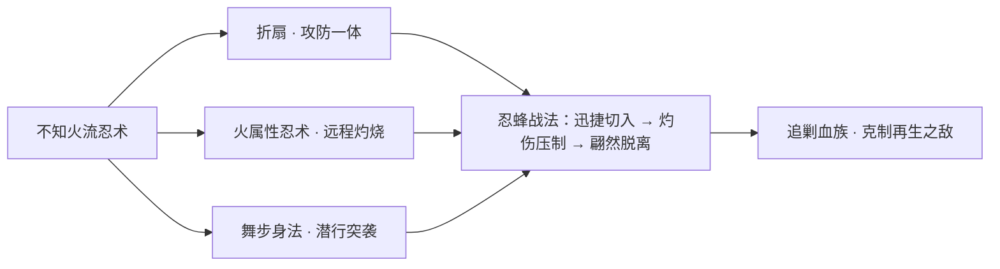
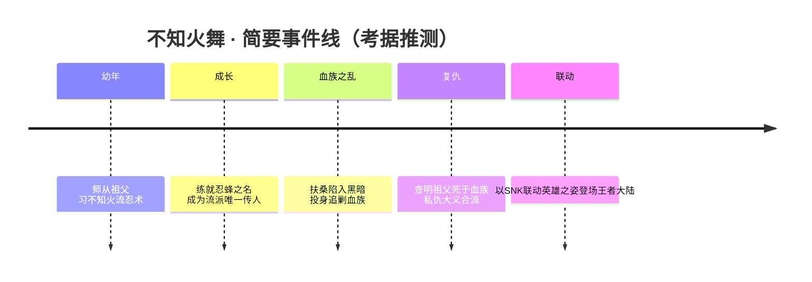

# 扶桑 / 血族之地 · 英雄图鉴

> 阵营设定见 [扶桑 / 血族之地 阵营页](../factions/fusang-xuezu.md)。本页收录该阵营 **1** 位英雄的深度小传。

::: info 本页英雄名册
| 英雄 | 称号 | 定位 | |
| --- | --- | --- | --- |
| [不知火舞](#不知火舞) | 忍蜂 | 法师/刺客 | |
:::

---

## 不知火舞

法师刺客

**忍蜂 · 不知火流唯一传人，以扇与火舞蹈于刺杀之间的乱世忍者**

| 项目 | 内容 |
| --- | --- |
| 称号 | 忍蜂 |
| 定位 | 法师 / 刺客 |
| 所属 | [扶桑 / 血族之地](../factions/fusang-xuezu.md) |
| 身份 | 不知火流忍术唯一传人、追剿血族的女忍者 |
| 别称 | 「忍蜂」、不知火流当代继承者 |
| 关系 | [宫本武藏](penglai-donghai.md#宫本武藏)、[橘右京](liandong-snk.md#橘右京)、[娜可露露](liandong-snk.md#娜可露露)、[弗洛伦](liandong-snk.md#弗洛伦)、血族王 徐福（敌） |
| 登场作品 | 《王者荣耀》× SNK 联动（源自《拳皇 KOF》/《饿狼传说》系列，世界观上与《侍魂》一脉相系）（考据推测） |

### 背景故事

不知火舞自幼生长于扶桑——王者大陆最东端、东风海域之上那座最大的岛屿。岛上京都繁华、僧侣学者远赴稷下与长安求学，海风裹挟着大陆的礼俗与远东独有的武道气息。在这片以武士道为骨、以海域秘辛为血的土地上，世代流传着各家忍术与剑流，而「不知火流」便是其中以火焰与扇技闻名的一支古老忍道。

她是不知火流忍术的**唯一传人**。这「唯一」二字，既是荣耀，也是孤绝——它意味着整条流派的存续，都系于她一人之身。自记事起，她便在祖父的严苛教导下研习忍法：足尖踏过晨露未干的木廊，腰肢在火光中翻转腾挪，一柄折扇既是舞具，也是杀器。她将忍者的隐匿、舞者的柔美与火属性忍术的酷烈熔于一身，渐渐练就「忍蜂」之名——如蜂般灵动、迅捷，蛰人于不备，蜇后又翩然远遁。（关于「忍蜂」一名的具体由来，为考据推测）

然而扶桑的安宁并未长久。**血族之乱**自东海一座无名岛屿蔓延而来——那里盘踞着自称不死的血族，由血族王**徐福**统治。血族以汲取生者血气为生，潮水般涌入京都与乡野，将武道之邦拖入黑暗与恐怖的漩涡。扶桑的武者们被迫拿起刀、扇、剑，与这股不死的暗潮殊死相抗。不知火舞也在这场浩劫中走出闺阁与道场，以忍者之身投入追剿血族的战斗。

战乱之中，她背负起一桩沉痛的私仇——她查明，将自己一手带大、亲授忍术的**祖父，正是死于血族之手**。师恩与血亲在同一人身上重叠，他的逝去几乎抽空了她半生的来路。自此，追剿血族对她而言不再只是守护故土的大义，更是一场不容退却的复仇。火舞翩跹的扇影里，从此燃着一缕只属于她自己的执念。（祖父被血族所害的设定取自联动剧情线索，为考据推测）

作为外来联动而入主王者大陆叙事的英雄，不知火舞被安放进「扶桑 / 血族之地」这一以东瀛武士道、血族恐怖与海域秘辛为主题的阵营之中。她的故事既呼应了扶桑武者群体与血族黑暗势力的核心冲突，也为这片远东岛屿增添了一抹兼具柔美与杀伐的身影。

### 性格与形象

不知火舞性格爽朗、自信而热烈，骨子里带着一股不肯服输的傲气。她不掩饰自己对美与强的追求，举手投足间是舞者的张扬，也是忍者的笃定。面对血族那般令人胆寒的敌人，她少有怯意，更多的是迎难而上的锋芒——这份明媚与她所处的黑暗乱世形成强烈反差，仿佛一团在暗夜里执意燃烧的火。

形象上，她以醒目的红色忍装与束起的长发为标志，腰侧别着折扇，行动如风。**扇、火、舞**是她最核心的象征意象：扇代表她兼容攻防、收放自如的忍术,火象征她炽烈不灭的意志与不知火流的招牌属性，舞则是她将杀招化作艺术的独门哲学。蜂的意象（「忍蜂」）则点明她迅捷、轻盈而致命的战斗风格。整体上，她是「柔中藏刚、艳里含杀」的典型——越是看似翩然起舞，越是杀机已至。

### 战斗风格与能力（设定向）

不知火舞的力量根植于**不知火流忍术**，以折扇为主兵、以火焰为媒介，将忍者的潜行突袭与舞者的连绵身法结合。

- **折扇（主兵器）**：既是引火、御风、格挡的法器，也是近身切割的利刃。她以扇代刃，开合之间幻出残影，令对手难辨虚实。
- **火属性忍术**：不知火流的看家本领。她能凝火成形、掷火破阵，远可压制、近可灼伤，是其「法师」一面的来源。
- **舞步身法与潜行突袭**：她身形轻盈、位移飘忽，善于在战场缝隙间穿插切入、取敌要害后迅速脱离——这正是其「刺客」定位的体现，也契合「忍蜂」蛰而后遁的意象。

在追剿血族的战斗中，这套以速度、灼烧与突袭为核心的技法，恰好克制血族倚仗的肉身与再生：火能净化、快能制敌于回血之前。

（以上为基于背景设定的力量描述，不涉及游戏内具体数值与技能名。具体招式来历多为考据推测。）

### 重要事件 / 剧情参与

- **血族之乱 · 投身追剿**：扶桑遭血族之乱席卷，她以不知火流传人之身加入猎杀血族的行列，与血族王徐福麾下的黑暗势力为敌。
- **得知祖父死于血族**：在追查中查明祖父被血族所害，私仇与大义合流，成为她持续战斗的核心动机。（考据推测）
- **SNK 联动登场**：作为《王者荣耀》与 SNK 的联动英雄进入王者大陆叙事，源出《拳皇》/《饿狼传说》系列，被纳入「扶桑 / 血族之地」阵营。

### 羁绊关系

| 对象 | 关系 | 说明 |
| --- | --- | --- |
| 血族王 徐福 | 死敌 | 血族之乱的根源，统治东海无名岛的血族之王；不知火舞追剿血族的最终矛头所向。 |
| 祖父（不知火流） | 至亲 · 恩师（已故） | 自幼授其忍术之人，后死于血族之手，是她复仇的直接缘由。（考据推测） |
| [宫本武藏](penglai-donghai.md#宫本武藏) | 远东同源 · 武道同道 | 同属远东武道谱系的剑客，世界观上与扶桑武士道一脉相系，可视为并肩面对乱世的同道。（考据推测） |
| [橘右京](liandong-snk.md#橘右京) | SNK 联动同源 | 同为 SNK 联动登场的远东剑客，源出同一系列谱系。（考据推测） |
| [娜可露露](liandong-snk.md#娜可露露) | SNK 联动同源 | 同为 SNK 联动英雄，皆带远东忍/巫色彩。（考据推测） |
| [弗洛伦](liandong-snk.md#弗洛伦) | SNK 联动同源 | 同批 SNK 联动剑客，世界观渊源相近。（考据推测） |

### 经典台词

::: quote 不知火舞 · 语音（考据推测）
「忍法·绝命忍蜂！」（考据推测）
:::

::: quote 不知火舞 · 语音（考据推测）
「华丽地，给你致命一击。」（考据推测）
:::

::: quote 不知火舞 · 语音（考据推测）
「血族，休想在扶桑撒野。」（考据推测）
:::

::: tip 继续探索
返回 [扶桑 / 血族之地 阵营页](../factions/fusang-xuezu.md) · 浏览 [全英雄图鉴](index.md) · 查看 [人物关系网](../relationships/index.md)
:::