# 镐京·封神 · 英雄图鉴

> 阵营设定见 [镐京·封神 阵营页](../factions/haojing-fengshen.md)。本页收录该阵营 **10** 位英雄的深度小传。

::: info 本页英雄名册
| 英雄 | 称号 | 定位 | |
| --- | --- | --- | --- |
| [姜子牙](#姜子牙) | 太公望 | 辅助/法师 | |
| [妲己](#妲己) | 魅力之狐 | 法师 | |
| [杨戬](#杨戬) | 二郎显圣真君 | 战士 | |
| [哪吒](#哪吒) | 三坛海会大神 | 战士 | |
| [太乙真人](#太乙真人) | 老顽童 | 辅助/坦克 | |
| [项羽](#项羽) | 西楚霸王 | 坦克/战士 | |
| [虞姬](#虞姬) | 森之风灵 | 射手 | |
| [廉颇](#廉颇) | 正义爆轰 | 坦克/法师 | |
| [帝俊](#帝俊) | 东皇之主 | 战士 | |
| [大司命](#大司命) | 执掌生死 | 刺客/战士 | |
:::

---

## 姜子牙

辅助法师

**太公望 · 执掌封神榜的正道讨伐军领袖，以经验为赠、以减速为缚的双形态术者。**

| 档案 | 内容 |
| --- | --- |
| 称号 | 太公望 |
| 定位 | 辅助 / 法师 |
| 所属 | [镐京·封神](../factions/haojing-fengshen.md) |
| 身份 | 正道讨伐军（伐纣联军）领袖、封神者、昆仑修道之士 |
| 别称 | 太公望、姜尚、吕尚（考据推测，源自《封神演义》原型） |
| 关系 | [虞姬](#虞姬)（弟子）· [妲己](#妲己)（其所造人偶）· [杨戬](#杨戬) / [哪吒](#哪吒) / [太乙真人](#太乙真人)（麾下与同道）· [帝俊](#帝俊)（讨伐对象/纣王体系）· [女娲](shanggu-shenhua.md#女娲)（封神缘起，考据推测）|
| 登场作品 | 《王者荣耀》封神之战体系背景故事；多次封神主题版本活动 |

### 背景故事

姜子牙的故事，是「神明时代」向「人类时代」过渡这一宏大纪元交替的轴心。他出身昆仑修道一脉，是位精通天数、术法与机关之学的修行者——既能仰观星象、推演气运，也能以机巧之术为枯木注入魂魄。漫长的修行让他比同代任何人都更早窥见一个令人不安的征兆：旧的秩序正在崩坏，而崩坏的源头，恰恰来自那座本应统御万方的王座。

在封神之战的世界观里，居于王座之上的，是宣称「人类与魔种应当平等」的纣王（帝辛 / [帝俊](#帝俊)体系）。在许多生灵看来，这本是慈悲；但在姜子牙的推演中，这道诏令将抹去神明、人类与魔种之间最后一道防线，把世界推向不可逆的混沌。他认定，那位高居摘星楼上的君王，并非仁君，而是一尊正在觉醒、终将吞噬世界的「大魔神王」。于是，这位本可避世清修的术者，选择走下昆仑，站到了历史最尖锐的断面上——他要做那个挽起天命、亲手为旧世收场的人。

姜子牙集结起以他为首的**正道讨伐军（伐纣联军）**。在他麾下，聚拢了形形色色的同道与战将：三只眼的天界战神[杨戬](#杨戬)、脚踏风火轮以莲花重生的逆骨少年[哪吒](#哪吒)、以炼丹之术起死回生的昆仑道人[太乙真人](#太乙真人)。他不仅是统帅，更是这场战争的**思想与意志**——别人挥剑，他执榜；别人征战疆场，他丈量天命。这场讨伐的终点，是朝歌摘星楼上的一场烈焰：纣王在熊熊大火中灰飞烟灭，神明的时代随之落幕，人类的时代由此开启。

然而姜子牙的形象之所以复杂而迷人，正在于他并非一尘不染的圣人。在现行世界观的设定中，那个日后倾覆王朝、被传颂为「祸国妖姬」的九尾狐妖[妲己](#妲己)，并非天生的妖孽，而是**姜子牙亲手所造**——他以机关术为其塑形，以魔法为其注魂，再将这具完美的人偶献入王宫。换言之，那枚埋入敌人心脏、最终从内部瓦解王朝的棋子，本就出自讨伐者之手。这让他既是「封神者」，又是「造妖者」；既是守护旧世防线的卫道之人，又是亲手布下倾覆之局的弈者。正义与权谋、慈悲与算计，在他身上拧成一股难以拆解的张力。

姜子牙手中所执的，是传说中的**封神榜**——一卷决定生灵在新秩序中归位、敕封诸神职司的天命名册。战争的胜负固然由刀兵决出，但谁能在新纪元里被「封」、谁将被「除」，最终由他笔下的这卷名录写定。他不只是赢得了战争，更是为崩坏之后的世界**重新划定秩序**的那只手。也正因如此，他在战场上的姿态从不是冲锋陷阵的莽勇，而是站在阵后，将气运分予后辈、将迟滞加诸敌人——一如他在历史中所做的：以一人之算，调度万众之命。

### 性格与形象

姜子牙的性格，是「老谋」与「赤诚」的合体。他城府极深、谋略过人，凡事先观天数、再落子局，连最亲近的弟子也未必能尽窥其全盘布局；但支撑这份算计的，却是一份近乎执拗的信念——他真心相信自己是在为世界挡住毁灭，哪怕为此要背负「造妖」的污名，也在所不惜。这是一位**愿意把自己也算进棋局里**的人。

外形上，他是典型的得道修士意象：长须、道袍、手持法卷与法器，眉宇间是阅尽气运的沉静与疲惫。环绕他的核心象征意象有三：其一是**封神榜**，代表他对天命与秩序的执掌；其二是**机关与魂术**，呼应他「造物者」的另一重身份；其三是**经验与气运的流转**——他从不与人争一时之锋，而是把力量「赠予」他人，让后辈在他的庇护下成长壮大。这种「成就他人」的气质，使他在牌面上虽为术者，气场却更像一位运筹帷幄的智囊与长者。

### 战斗风格与能力（设定向）

姜子牙的战斗哲学，根植于他「执掌天命、调度众生」的身份，因此他的力量并不指向个人的杀伐，而指向**对全局的赋能与压制**。这与他在牌面定位上的「双形态辅助法师」一脉相承——他可在两种状态之间切换，一面以气运滋养队友，一面以术法迟滞强敌。

- **气运赠予（经验之赋）**：源自他执掌封神榜、能为生灵「敕封职司、点拨气数」的设定。在战场上化作为同伴注入成长之力的能力——受其庇护者，修为与战力的积累远超常人，这正是「他从不亲征，却让麾下战将各个超拔」的力量化形。
- **天命迟滞（减速之缚）**：作为推演天数者，他能看穿对手的去向并预先「截断」其气运，化为束缚与减速之术，让强敌如陷泥沼、举步维艰，从而为讨伐军创造合围之机。
- **造物与注魂（机关魂术）**：他既能以机关术为枯物塑形、以魔法为之注魂——其最著名的「作品」便是九尾狐妖[妲己](#妲己)。这是一种介于工巧与仙术之间的造物之力，也是他区别于纯粹术者的独门所长。

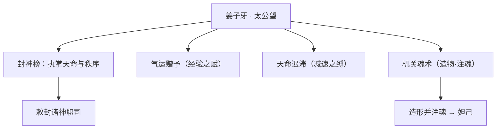

### 重要事件 / 剧情参与

- **集结伐纣联军**：以正道讨伐军领袖之名，召集[杨戬](#杨戬)、[哪吒](#哪吒)、[太乙真人](#太乙真人)等同道，发动对纣王（[帝俊](#帝俊)体系）的讨伐，成为神明时代向人类时代转折的推手。
- **造妲己、献王宫**：以机关术造形、以魔法注魂，创造九尾狐妖[妲己](#妲己)并将其献入王宫，埋下从内部倾覆王朝的伏笔（注意版本演变）。
- **收徒虞姬**：将术法与信念传予弟子[虞姬](#虞姬)，后者在反抗暴政的征途中独立成长。
- **摘星楼之焚**：讨伐军攻入朝歌，纣王于摘星楼烈焰中灰飞烟灭，旧秩序崩解。
- **执榜封神**：战后以封神榜为崩坏之世重定秩序、敕封职司，开启人类的时代。

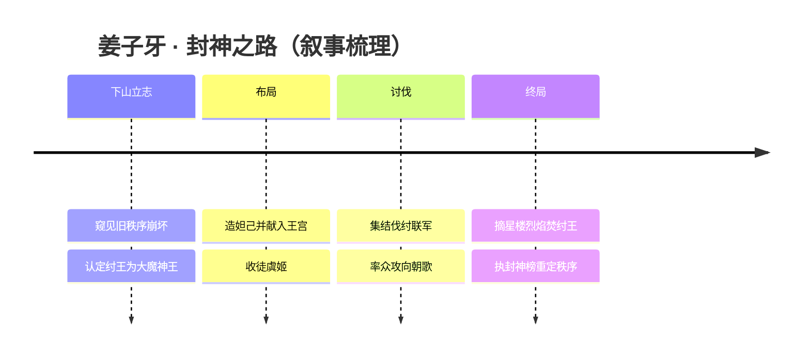

### 羁绊关系

| 对象 | 关系 | 说明 |
| --- | --- | --- |
| [虞姬](#虞姬) | 师徒 | 虞姬为姜子牙弟子，承其衣钵后投身反抗暴政的征途（官方背景故事）。 |
| [妲己](#妲己) | 创造者 / 守护者 | 现行世界观中，妲己为姜子牙以机关术造形、以魔法注魂的人偶，后献予纣王（注意版本演变）。 |
| [杨戬](#杨戬) | 麾下大将 / 同道 | 三只眼的天界战神，于讨伐军中并肩作战。 |
| [哪吒](#哪吒) | 麾下战将 / 同道 | 以莲花重生的逆骨少年，伐纣联军中的强开团战将。 |
| [太乙真人](#太乙真人) | 同道道友 | 昆仑炼丹道人，与姜子牙同属修道一脉、并肩讨伐。 |
| [帝俊](#帝俊) | 讨伐对象 | 纣王 / 帝辛体系；姜子牙认定其为走向毁灭的大魔神王并发动讨伐。 |
| [女娲](shanggu-shenhua.md#女娲) | 封神缘起（考据推测） | 封神之战与上古神话体系相连，姜子牙之封神大业承接更古的诸神秩序（考据推测）。 |

### 经典台词

::: quote 台词
「天命，从来不是用来等的，而是用来执的。」（考据推测）
:::

::: quote 台词
「我能赠你气运，却替不了你前行的路。」（考据推测）
:::

::: quote 台词
「执榜在手，何人可封、何人当除，自在我笔下。」（考据推测）
:::

---

## 妲己

法师

**魅力之狐 · 被造而生、寻爱而醒的九尾狐妖人偶**

| 档案项 | 内容 |
| --- | --- |
| 称号 | 魅力之狐 |
| 定位 | 法师 |
| 所属 | [镐京·封神](../factions/haojing-fengshen.md) |
| 身份 | 姜子牙以机关术造形、以魔法注魂的九尾狐妖人偶；后被献予纣王（帝辛/[帝俊](#帝俊)体系）的「祸国妖姬」 |
| 别称 | 九尾妖狐、狐妖（民间称「祸国妖姬」「亡国之祸」） |
| 关系 | [姜子牙](#姜子牙)（创造者/守护者）、[帝俊](#帝俊)（被献予之君主，纣王/帝辛体系）、[女娲](shanggu-shenhua.md#女娲)（传说渊源·考据推测）、[安琪拉](jixia.md#安琪拉)（同为「最经典新手法师」的题材呼应·考据推测） |
| 登场作品 | 王者荣耀本传；多款主题皮肤（如「女仆咖啡」「魅力之狐」「仙境爱丽丝」「少女狙击手」「热情桑巴」等） |

### 背景故事

妲己是《王者荣耀》世界里最广为人知、也最容易被误解的一个名字。在《封神演义》原典中，「妲己」是有苏氏进献给商纣王的绝世美人，被九尾狐附身、媚惑纣王、构陷忠良，最终成为商朝倾覆的象征。但在王者荣耀现行世界观里，这个名字背后被改写出了一段截然不同、却更为凄美的来历——她并非天生的妖、也并非有意为之的祸，而是一具被「造」出来、又被迫「活」过来的人偶。

按现行设定（注意此设定历经多次版本演变·考据推测），妲己最初并不存在。是讨伐军领袖、封神之人[姜子牙](#姜子牙)，以其精湛的机关术为她塑造形骸，又以魔法为这具躯壳注入了灵魂。换言之，妲己是姜子牙亲手造就的造物——她有九条尾巴、狐之妖躯，却拥有近乎人的心智与情感。她从睁开眼的第一刻起，便带着「被创造者」的烙印：她渴望被需要、渴望被认可、渴望有人告诉她「你是谁、你为何而存在」。这种近乎本能的依附与求爱，构成了她日后所有行为的底色。

姜子牙造出妲己之后，将她献予了纣王（帝辛，即东皇之主[帝俊](#帝俊)体系的人间化身·考据推测）。在那个神明时代正向人类时代过渡的关键纪元里，纣王宣布「人类与魔种平等」，此举招致天界与神职者的强烈反对，以姜子牙为首的讨伐军将其定性为终将走向毁灭的「大魔神王」，并发动了那场决定世界走向的封神之战。妲己便是被投入这场漩涡中心的一枚棋子——她依偎在纣王身侧，以魅惑之力侍奉君王，在世人眼中，她正是那个「以美色乱国、引商亡天下」的祸水。

然而妲己自己并不真正明白这一切的分量。她像一个永远长不大的孩子，用撒娇、用甜腻、用不谙世事的天真去面对这个早已为她写好剧本的残酷世界。她口中那句招牌的「来呀，来玩呀」，听上去轻佻无害，却恰恰暴露了她对自身命运的全然无知——她不懂战争，不懂兴亡，不懂自己被设计成「祸国」的工具，她只知道有人对她笑，她便回以笑；有人逗她玩，她便陪着玩。这种「无辜的恶」，正是她这一角色最令人唏嘘之处：真正的恶，或许从来不在那具被造的狐躯，而在造她、用她、弃她的那些手。

最终，纣王于摘星楼的烈焰中灰飞烟灭，封神之战以讨伐军的胜利告终，神明时代的余晖随之黯淡。而作为「祸国妖姬」的妲己，则被永远地钉在了「亡国之祸」的耻辱柱上。但若回溯她的源头——她不过是一具被人造出、又被人推上风口浪尖的人偶。她的悲剧，是被赋予了情感却不被允许真正去爱，是被创造出来却从未被真正承认。在魅惑的笑靥之下，藏着一个从未被回答的问题：「我，到底是谁的呢？」

### 性格与形象

妲己的性格被刻画为娇憨、黏人、带着几分孩子气的妖媚。她说话甜腻、爱撒娇、爱玩闹，常以「妲己，一直爱主人」之类的话语表达依附与渴求；她对「主人」有着近乎本能的忠诚与依恋，这种依恋既是她身为「被造之物」的天性，也是她全部安全感的来源。她不工于心计，甚至可以说天真到近乎残忍——她从不真正理解自己所参与的兴亡大事，只沉浸在被人逗弄、被人疼爱的当下。

外形上，妲己是经典的九尾狐妖意象：身后摇曳着柔美的尾羽，狐耳灵动，眼波流转间带着勾人魂魄的媚。她的整体形象偏向「萝莉系」的娇小可爱，而非冷艳成熟，这与她「孩童般的心智」高度契合——她是一只外表妩媚、内心却始终停留在初生时刻的小狐狸。狐、媚、魅、惑，是缠绕在她身上的核心象征；而「人偶」「被造物」「无主之魂」则是她叙事层面的深层意象，暗示着美丽表象下的空洞与渴求。

### 战斗风格与能力（设定向）

妲己的力量源自其妖狐血脉与姜子牙注入的魔法之魂。作为法师，她以精神层面的「魅惑」与爆发性的「灼伤」作为战斗核心——她并非以蛮力取胜，而是以心智操控与魔力轰击玩弄对手于股掌。

- **魅惑之力**：妲己能以妖术眩惑敌人心神，令其在短暂瞬间失去自我、僵立原地任其宰割。这正对应她「魅力之狐」称号的来历——她的「美」本身就是武器，是足以乱人心智、定人生死的力量。
- **灼炎魔法 / 法球轰击**：她可凝聚魔法能量化作灼烧的法球向敌人投掷，造成法术伤害；这股力量被设定为其妖狐之火与魔魂的具象化。
- **狐尾连击**：她身后的九条狐尾既是装饰，也是攻击的延伸，可在魅惑命中后接续爆发，形成「定身—连招—击杀」的经典法师收割节奏。

她被官方定位为「最经典的新手法师」——技能直白、连招简明、爆发清晰，是无数玩家初识法师的启蒙角色。这种「易上手」的定位，恰与她叙事中「单纯天真」的性格形成了奇妙的互文。

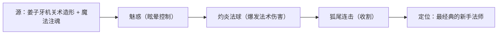

### 重要事件 / 剧情参与

- **被造与受献**：由[姜子牙](#姜子牙)以机关术与魔法创造，随后被献予纣王（[帝俊](#帝俊)/帝辛体系），成为封神之战漩涡中的关键人物（现行世界观·考据推测）。
- **封神之战中的「祸国妖姬」**：在人类与魔种是否平等的纪元之争中，妲己作为纣王身侧的妖姬，被讨伐军与世人视为乱国之源，参与并见证了神明时代向人类时代过渡的转折。
- **摘星楼之终**：纣王于摘星楼烈焰中灰飞烟灭，封神之战落幕，妲己「祸国」的污名就此被历史定格。

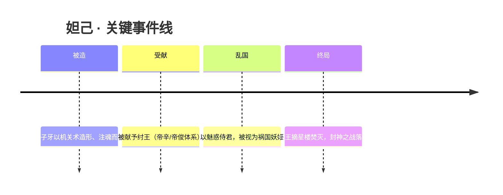

### 羁绊关系

| 对象 | 关系 | 说明 |
| --- | --- | --- |
| [姜子牙](#姜子牙) | 创造者 / 守护者 | 现行世界观中，妲己为姜子牙以机关术造形、以魔法注魂的人偶；姜子牙既是她的创造者，也被设定为她的守护者（注意版本演变·考据推测）。 |
| [帝俊](#帝俊) | 被献予之君主 | 妲己被姜子牙献予纣王（帝辛，对应帝俊/东皇之主体系），成为其身侧的妖姬，并被卷入封神之战（考据推测）。 |
| [女娲](shanggu-shenhua.md#女娲) | 传说渊源 | 在《封神演义》原典中，女娲降旨令妖狐入宫祸商以应天数；此为题材渊源而非游戏现行硬设定（考据推测）。 |
| [安琪拉](jixia.md#安琪拉) | 题材呼应 | 二者皆为游戏中极具代表性的「新手向法师」，常被并提，属玩法层面的呼应而非剧情羁绊（考据推测）。 |

### 经典台词

::: quote 妲己语录
「来呀，来玩呀～」

「妲己，一直爱主人的。」（考据推测）

「请尽情吩咐妲己，主人。」（考据推测）

「不可以小看妲己哦！」（考据推测）
:::

### 皮肤故事亮点

妲己拥有题材跨度极大的一系列主题皮肤，多数皮肤更偏向「换装舞台」式的形象演绎而非线性剧情：「女仆咖啡」将她置入温馨甜美的咖啡馆场景，强化其娇憨黏人的「侍奉」意象；「仙境爱丽丝」「少女狙击手」「热情桑巴」等则分别以童话、特工、桑巴舞者等设定重构她的形象，凸显这只「被造小狐狸」千变万化、却始终带着孩童式天真的内核。这些皮肤共同构成了妲己「以美与娇憨为核心」的角色魅力（具体皮肤剧情以官方为准·考据推测）。

---

## 杨戬

战士

**二郎显圣真君 · 三只眼的天界战神，玉鼎门下、女娲血脉的继承者**

| 档案项 | 内容 |
| --- | --- |
| 称号 | 二郎显圣真君 |
| 定位 | 战士 |
| 所属 | [镐京·封神](../factions/haojing-fengshen.md) |
| 身份 | 玉鼎真人之徒、姜子牙麾下大将、天界战神、女娲继承人 |
| 别称 | 二郎神、显圣真君（民间俗称三眼神将）（考据推测） |
| 关系 | [姜子牙](#姜子牙)（上将/统帅）· [哪吒](#哪吒)（生死搭档）· [女娲](shanggu-shenhua.md#女娲)（血脉/传承）· [太乙真人](#太乙真人)（同门道脉，考据推测） |
| 登场作品 | 《王者荣耀》本传；英雄背景故事、相关战役动画与活动 PV（考据推测） |

### 背景故事

杨戬出身于神明时代向人类时代过渡的关键纪元——在镐京与朝歌之间那场撕裂诸神的封神之战中，他是站在天界一侧、真正能以一己之力扭转战局的少数存在之一。世间称他为「二郎显圣真君」，更多人记住的，却是他眉心那一只能洞穿伪饰、看破因果的天眼。

关于他的来历，最被认可的一条脉络是：他乃昆仑玉鼎真人门下高徒，自幼随师修习仙家术法与战阵之道，习得七十二般变化与移山倒海的神通。然而真正让他区别于寻常仙将的，是他身上流淌的更古老的血——他被视为补天之神 [女娲](shanggu-shenhua.md#女娲) 的继承人。当上古神话的余晖渐渐隐没、神明逐一退场，女娲所代表的「造化与守护」之力，需要一个能在新纪元继续执掌它的人，而杨戬正是承接这份重量的那一个。这也解释了他何以拥有超越同辈的神性根基：他不只是一位修行者，更是一段神话血脉在凡世延续的容器。（其与女娲的「继承」关系为本世界观设定脉络，具体细节考据推测）

封神之战爆发的导火索，是天帝 [帝俊](#帝俊)（即纣王/帝辛体系）宣布人类与魔种平等、主张进步不该受任何束缚——这一宣告在诸神之间掀起轩然大波。以 [姜子牙](#姜子牙) 为首的讨伐军认定帝俊已沦为将世界推向毁灭的大魔神王，遂举起封神的旗号发动征讨。杨戬在这场战争中归入姜子牙麾下，成为讨伐军最锋利的一柄战刀。对他而言，参战的动机并非单纯的服从军令：作为承接女娲守护之责的人，他要守的从来不是某一座神座，而是这片正在天人交替、秩序崩坏的天地本身。眉心那只天眼让他比任何人都更清楚地看见——一旦失序蔓延，最先被碾碎的，永远是没有神力庇护的苍生。

战争把这位高傲的天界战神，推向了一段他自己都未曾预料的旅程。在牧野一带巡视、镇压与谈判之间，他遇见了那个同样不肯向天命低头的逆骨少年 [哪吒](#哪吒)。两人最初以拳头相认，谁也不服谁；却又在一只流浪狗、一次次并肩涉险中，从势均力敌的对手磨成了可以把后背交给彼此的生死搭档。也正是在这段并肩岁月里，杨戬眉间那点神将的冷硬，被一点一点焐出了人的温度。

随着封神之战走向终局，帝俊最终于摘星楼的烈焰中灰飞烟灭，神明时代落下帷幕，人类时代的序章被血与火写就。杨戬亲历了这场天翻地覆——他是旧神谱写就的最后一笔，也是新世界睁开的那只眼。当诸神或陨落、或退隐、或被重新封号，唯有他带着女娲的血脉、玉鼎的道统与一身战火淬过的伤痕，留在了人间，继续扮演着「守望者」的角色。（封神战役归属与摘星楼结局依据本阵营设定，杨戬的具体战功为考据推测）

### 性格与形象

杨戬身上始终有一股天界战神特有的孤峭与傲气：他寡言、克己，待敌冷峻如刀，眼神里那股「看穿一切」的笃定让人不敢轻易直视。但这份高傲并非自负，而是源于他对自身责任的清醒——他知道自己站在新旧纪元的接缝处，知道女娲的传承容不得他后退半步。

而与 [哪吒](#哪吒) 的羁绊，则磨出了他不轻易示人的另一面：仗义、念旧、外冷内热。他会为一只流浪狗与人较真，会在战友身陷险境时不计代价地折返。

外形上，他最具辨识度的象征便是眉心那只竖立的天眼——洞察、审判与看破伪饰的化身。一身银甲战袍，背负长兵，举手投足间皆是临阵不乱的将帅之风。天眼为「明察」，玉甲为「守护」，长兵为「征伐」——三者合一，正是他「以洞察行守护、以征伐止失序」的人格写照。（外形描述综合其神将定位，细节考据推测）

### 战斗风格与能力（设定向）

作为玉鼎真人门下、又承女娲血脉的天界战神，杨戬的力量根植于仙家神通与上古神性的叠加。

- **第三只眼（天眼）**：眉心天眼是他最核心的象征与能力来源，可洞穿幻术、看破伪装与因果，使他在以谋略和魔法见长的封神战场上极难被欺瞒——面对 [妲己](#妲己) 这类以魅惑、机关与魔法立身的对手，天眼正是他的天然克制。
- **变化与神通**：传承自师门的七十二般变化与移山之力，让他能在战阵中灵活切换姿态、长驱直入。
- **长兵与近战压制**：作为战士定位，他以长柄重兵贴身搏杀，攻防一体，既能扛在最前承受冲击，又能在关键处给出致命一击——这与「天界战神」的硬核形象一致。
- **女娲之力的底蕴**：作为继承人，他身上的守护与造化之力是其神性根基的来源（具体招式表现考据推测）。

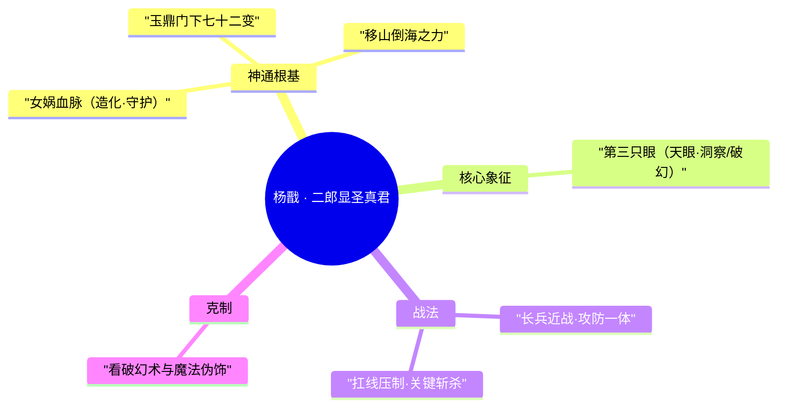

（以上为基于背景设定的力量描述，非游戏内技能数值；招式来历部分考据推测）

### 重要事件 / 剧情参与

- **承接女娲传承**：作为女娲继承人，于神明时代余晖中接过上古守护之力，奠定其神性根基。（考据推测）
- **加入讨伐军**：封神之战中归入 [姜子牙](#姜子牙) 麾下，成为天界讨伐军的核心战将，参与对 [帝俊](#帝俊) 体系的征伐。
- **牧野结识哪吒**：由以拳头相认的对手，因哪吒救流浪狗、杨戬拎回而生默契，渐成知心朋友。
- **牧野遇伏**：巡视途中遭遇埋伏，哪吒为杨戬挡下致命一击——这一战成为二人「生死搭档」羁绊的定锚事件。
- **见证摘星楼终局**：亲历帝俊于烈焰中灰飞烟灭、神明时代落幕、人类时代开启的历史转折。

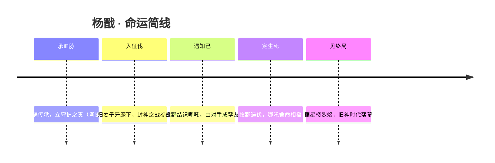

### 羁绊关系

| 对象 | 关系 | 说明 |
| --- | --- | --- |
| [哪吒](#哪吒) | 生死战友 / 搭档 | 由以拳头交往的对手，因哪吒救流浪狗、杨戬拎回而生默契渐成知心朋友；牧野巡视遇伏，哪吒为杨戬挡下致命一击。非兄弟亦非师徒，而是从对手到生死搭档。 |
| [姜子牙](#姜子牙) | 统帅 / 上将 | 封神之战中杨戬归于讨伐军领袖姜子牙麾下，是其麾下最锋利的战将。 |
| [女娲](shanggu-shenhua.md#女娲) | 血脉 / 传承 | 杨戬被视为补天之神女娲的继承人，承接其守护与造化之力，构成其神性根基。（设定脉络，细节考据推测） |
| [帝俊](#帝俊) | 阵营级对立 | 帝俊（纣王/帝辛体系）为讨伐军征讨的对象，杨戬作为天界战将与之处于战争两端。 |
| [妲己](#妲己) | 战场克制（设定向） | 妲己以魅惑、机关与魔法立身，杨戬的天眼可破幻识伪，是其天然克星。（考据推测） |
| [太乙真人](#太乙真人) | 同门道脉 | 同属昆仑仙家一系（玉鼎真人与太乙真人皆出昆仑），且同为哪吒身边的重要存在。（考据推测） |

### 经典台词

::: quote 杨戬 · 语音
「我的眼睛，看得见你藏起来的东西。」（考据推测）
:::

::: quote 杨戬 · 语音
「天命又如何？我守的是这片天地，不是哪一座神座。」（考据推测）
:::

::: quote 杨戬 · 与哪吒
「把后背交给我，剩下的，我替你看着。」（考据推测）
:::

---

## 哪吒

战士

**三坛海会大神 · 脚踏风火轮、以莲花重生的逆骨少年**

| 项目 | 内容 |
| --- | --- |
| 称号 | 三坛海会大神 |
| 定位 | 战士 |
| 所属 | [镐京·封神](../factions/haojing-fengshen.md) |
| 身份 | 陈塘关遗孤 · 太乙真人之徒 · 莲花化身的战神少年 · 姜子牙讨伐军一员 |
| 别称 | 逆骨少年、莲花童子（考据推测） |
| 关系 | [太乙真人](#太乙真人)（师父/唯一的朋友）、[杨戬](#杨戬)（生死搭档）、[姜子牙](#姜子牙)（麾下统帅）、[女娲](shanggu-shenhua.md#女娲)（造物/神格渊源，考据推测） |
| 登场作品 | 《王者荣耀》本传背景故事；衍生动画与剧情活动（考据推测） |

### 背景故事

哪吒是封神之战体系中最锋利、也最孤独的一道光。他出身于陈塘关——这座坐落在镐京与朝歌之间、神明时代余晖下的边关小城。当神明仍高居倒悬天、俯瞰众生如蝼蚁之时，陈塘关只是这盘大棋上一枚随时可以被抹去的卒子。哪吒就在这样的夹缝里降生：一个被命运早早判定为"异类"的孩子，骨子里天生带着一股不肯低头的逆气，世人称他为"逆骨少年"。

少年时代的哪吒并不被周遭所容。他生性顽劣、桀骜不驯，凡事都要问一句"凭什么"，凡是套在他身上的规矩与天命，他都要亲手扯断看看。也正因如此，他几乎没有朋友——直到昆仑山的炼丹道人[太乙真人](#太乙真人)出现在他的生命里。太乙既是他的师父，也是这世上唯一真正把他当作"人"而非"祸患"来对待的存在。师徒二人一个老顽童、一个小逆骨，性子竟意外地合拍：太乙教他道法、炼丹与战技，也教他在这冷硬的世道里如何握紧自己的脾气与本心。

然而平静从不属于神明时代的边关。一场浩劫降临陈塘关，城破人亡，哪吒在那场灾厄中身受致命之伤，气息几近断绝。是太乙真人不忍这唯一的弟子、唯一的朋友就此殒命——在哪吒濒死之际，他将一枚足以扭转生死的"奇迹钥匙"换入哪吒的心脏。然而即便如此，陈塘关的覆灭仍夺去了哪吒的肉身。为了让弟子真正"活过来"，太乙真人以自己的心脏为代价，施展炼金之术，用一朵莲花重塑了哪吒的躯体——哪吒由此**以莲花重生**，成为一个与凡人、与旧日的自己都不再相同的存在。（此重生设定为《王者荣耀》对"莲花化身"古典传说的世界观改写；细节随版本演变，部分为考据推测。）

莲花重生后的哪吒，从此背负着双重的重量：一是太乙以心脏换来的、他不能辜负的第二次生命；二是脚下那对风火轮所代表的、永不停歇的去向。当封神之战的烽烟点燃，神明时代向人类时代轰然崩塌，[姜子牙](#姜子牙)以正道讨伐军之名，向自称众生平等、却被认定为大魔神王的纣王（[帝俊](#帝俊)体系）发起讨伐。哪吒投身其中，成为讨伐军里最锋锐的一把尖刀——他突进、他开团、他撞碎敌阵的最前线，把那股"凭什么认命"的逆气，化作了搅动整个战场的力量。

也正是在这条征途上，哪吒遇见了那个日后与他生死与共的人——天界战神[杨戬](#杨戬)。两个同样骄傲、同样不肯服输的少年，从拳头相向的对手，一路走成了彼此唯一能托付后背的搭档。这段从对立到生死相托的羁绊，连同太乙真人以命换命的师徒情，构成了哪吒这朵"莲花"最柔软、也最坚硬的内核。

### 性格与形象

哪吒的性格底色是**叛逆**与**赤诚**的奇异融合。他天生反骨、嘴硬心热，最讨厌一切高高在上的命令与不容置疑的"天命"；可一旦认定了谁，他便会用整条命去护住对方。表面上他是个爱逞强、爱挑衅、停不下来的刺头少年，内里却藏着对孤独的敏感与对朋友近乎执拗的忠诚——毕竟，他曾经几乎一无所有，是太乙的接纳与杨戬的并肩，才让他懂得"被需要"的分量。

外形上，哪吒被塑造为一名英气逼人的少年战士：身形矫健而轻盈，脚踏一对熊熊燃烧的**风火轮**，行动间风驰电掣、来去如火。火焰是他最核心的象征意象——既是风火轮燃起的烈焰，也是他骨血里那团烧不尽的逆气。而**莲花**则是他另一重身份图腾：纯净、再生、自污泥与死亡中重新绽放，恰如他"以莲花重生"的命运。火与莲，一刚烈一清净，共同勾勒出这个少年既炽热又孤洁的双面剪影。

### 战斗风格与能力（设定向）

哪吒在战场上的定位是一名**强开团的突进型战士**。他最为人称道的，是那种"全图视野内锁定目标、自天而降"的压迫性切入方式——这与他脚踏风火轮、来去无踪的设定一脉相承。

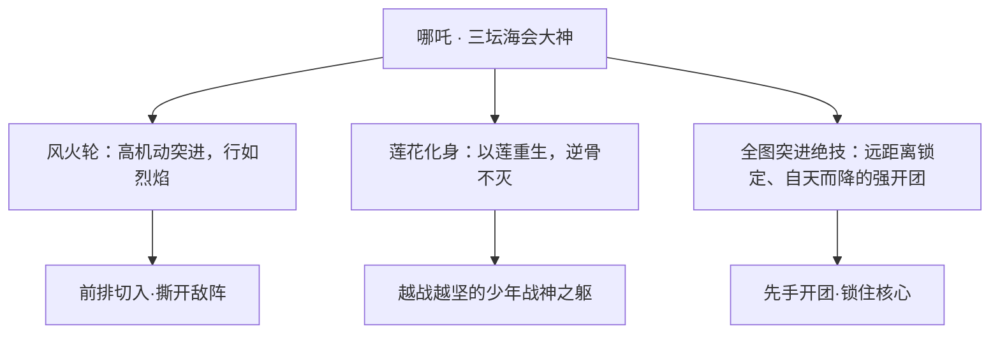

- **风火轮**：哪吒最具辨识度的装备，赋予他超凡的机动与突进能力，使他能在战场上快速贯穿、抢占先手。
- **莲花之躯**：经太乙真人以心脏为代价、用炼金术重塑的躯体。这具身体本身即是他"逆天改命"的象征，也是他敢于一次次冲在最前的底气。
- **全图突进绝技**：哪吒可越过遥远距离锁定目标、长驱直入，在团战中扮演"撕口子"的开团者角色。这一战斗风格与他不肯停步、永远向前的性格高度统一。

（以上为基于背景设定与定位的叙事化描述，不涉及具体游戏数值。）

### 重要事件 / 剧情参与

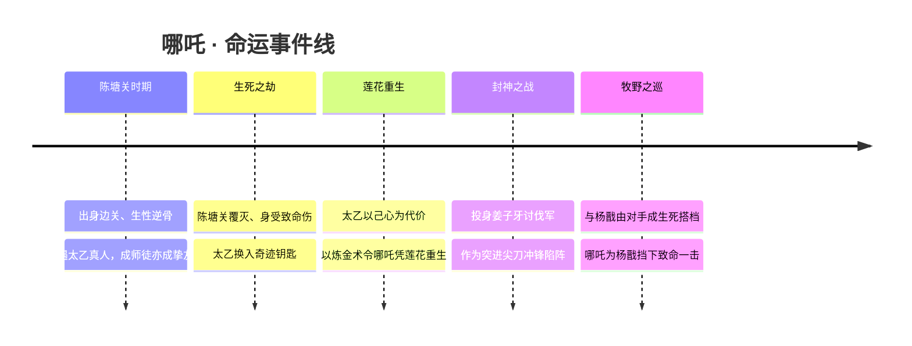

- **陈塘关覆灭与莲花重生**：哪吒人生最关键的转折，奠定其"逆天改命、以死换生"的母题。
- **封神之战 / 讨伐纣王**：作为[姜子牙](#姜子牙)讨伐军一员，参与神明时代向人类时代过渡的核心战争。
- **与杨戬的羁绊养成**：从以拳头交往的对手，到因一只流浪狗而生默契、终成生死搭档；牧野巡视遇伏时，哪吒为[杨戬](#杨戬)挡下致命一击，是二人羁绊的高光节点。

### 羁绊关系

| 对象 | 关系 | 说明 |
| --- | --- | --- |
| [太乙真人](#太乙真人) | 师徒 / 唯一的朋友 | 太乙是哪吒的师父，也是其唯一的朋友。太乙将奇迹钥匙换入濒死的哪吒心脏；陈塘关覆灭后，更以自己的心脏为代价，用炼金术使哪吒凭莲花重生。 |
| [杨戬](#杨戬) | 生死战友 / 搭档 | 由以拳头交往的对手起步，因哪吒救流浪狗、杨戬拎回而生默契，渐成知心朋友；牧野巡视遇伏，哪吒为杨戬挡下致命一击。非兄弟、非师徒，而是从对手走到生死相托的搭档。 |
| [姜子牙](#姜子牙) | 统帅 / 麾下 | 哪吒投身姜子牙领导的正道讨伐军，于封神之战中充当突进尖刀。 |
| [帝俊](#帝俊) | 阵营级对立 | 讨伐军讨伐的对象——被认定为大魔神王的纣王（帝俊体系），是哪吒所投身战争的反派核心。 |
| [女娲](shanggu-shenhua.md#女娲) | 造物 / 神格渊源（考据推测） | 在更宏大的封神 · 众神谱系中，女娲为补天造物之神；哪吒"莲花化身"的神性渊源或与上古神话脉络相牵连（考据推测）。 |

### 经典台词

::: quote 哪吒 · 语录
"我命由我，不由天！"（考据推测）

"风火轮一转，谁也别想拦我。"（考据推测）

"师父用命换我重活一次——这条命，我替你们好好烧着。"（考据推测）

"搭档，背后交给我。"（考据推测）
:::

---

## 太乙真人

辅助坦克

**老顽童 · 以自身心脏为代价复活哪吒的昆仑炼丹道人，能复活队友、变身增益的工具型辅助。**

| 档案项 | 内容 |
| --- | --- |
| 称号 | 老顽童 |
| 定位 | 辅助 / 坦克 |
| 所属 | [镐京·封神](../factions/haojing-fengshen.md) |
| 身份 | 昆仑山炼丹道人、炼金术师 / 哪吒之师 |
| 别称 | 老顽童、太乙、炼丹老仙（考据推测） |
| 关系 | [哪吒](#哪吒)（徒弟、唯一的朋友）、[姜子牙](#姜子牙)（同出昆仑的同门道友，考据推测）、[杨戬](#杨戬)（弟子之生死搭档） |
| 登场作品 | 《王者荣耀》英雄叙事；封神之战体系背景故事 |

### 背景故事

太乙真人是栖居于昆仑山的炼丹道人。在「神明时代向人类时代过渡」的封神纪元里，昆仑是道法与炼丹术的源头之一——这里的修行者既研习呼风唤雨的仙术，也钻研以丹炉、金石、草木重塑生命的炼金之道。太乙正是后者中走得最远、也最离经叛道的一位：别的真人讲究清规戒律、闭关清修，他却整日抱着丹炉东奔西走，把高深的炼丹术玩成了孩童手里的把戏，因此得了「老顽童」的诨号。在外人眼里，他是个不着调、爱胡闹、动辄哈哈大笑的怪老头；可只有少数人知道，这副顽童面孔之下，藏着昆仑最执拗、也最温柔的一颗心。

他人生中最重要的际遇，是收下了陈塘关那个生而带「逆骨」的少年——[哪吒](#哪吒)。哪吒天生反骨、桀骜难驯，是世人眼中的祸患胚子，却被太乙一眼相中，收为徒弟。在太乙身边，哪吒第一次被人当作「人」而非「灾星」对待。太乙不只是哪吒的师父，更是这个孤僻少年在世上唯一的朋友——师徒二人嬉笑打闹、亦师亦友，构成了哪吒短暂而炽烈一生中最暖的底色。

然而封神之战的烽火不会饶过任何人。陈塘关在动荡中覆灭，哪吒身受重创、命悬一线。为了把徒弟从死亡线上拉回来，太乙做了第一次「逆天」的尝试——他将一柄「奇迹钥匙」换入濒死哪吒的心脏，强行续住了那口将断的气。可这只是开始：当哪吒最终还是迎来肉身的尽头，太乙真人选择了炼丹术师所能想象的最极端的代价——**他以自己的心脏为引、以炼金之术为火，让哪吒凭借一具莲花之身重新降世**。莲花化身、藕节为骨，正是封神神话中哪吒「莲花重生」的母题；而在这一版叙事里，点燃这场重生的，是师父甘愿剜出的那颗心。

也正因这段以命换命的因果，太乙真人的形象远不止「插科打诨的老顽童」。他是这场神魔过渡之战里少有的、把「复活」与「重生」当作毕生信念去践行的人——别的神明在为「人类是否该与魔种平等」「进步是否应受束缚」而互相讨伐，太乙却固执地相信：再绝望的死局，也总该留一条把人救回来的路。这份执念，最终凝结成了他在战场上的标志性力量——让倒下的同伴重新站起。(考据推测：太乙与同出道门的[姜子牙](#姜子牙)同属昆仑一脉的修行体系，二人皆为封神之战中的「神职炼术」一方，但现行背景未明确二人直接交集，故此处仅作同门道友的合理推断。)

### 性格与形象

太乙真人最鲜明的标签就是「老顽童」三个字。他外表是个上了年纪的道人，却毫无老者的暮气：爱笑、爱闹、爱占小便宜、动不动就哈哈大笑，常把严肃的修行、危险的战局当成游戏来对待，活脱脱一个返老还童的顽皮老头。这种「顽」既是性格的保护色，也是他面对沉重命运的方式——他用嬉皮笑脸消解死亡的阴影，用孩子气的乐观对抗封神之战的血腥。

但顽童的另一面，是深不见底的温柔与决绝。对哪吒，他可以付出心脏；对倒下的同伴，他从不轻言放弃。象征意象上，他与「丹炉」「炼金」「莲花」「心脏」紧紧相连：丹炉是他随身的玩具，也是他造物复生的法器；莲花是他亲手以炼金术点亮的重生之花；而那颗换给哪吒、又为哪吒燃尽的心脏，则是他全部叙事的情感内核。一个看似最不正经的老顽童，偏偏背负着最沉重的「以命续命」之誓——这种反差，正是太乙真人这一角色最动人的张力。

### 战斗风格与能力（设定向）

太乙真人的战斗哲学不在「杀」，而在「救」与「续」。作为辅助/坦克，他把昆仑炼丹术从「炼制丹药」延伸到了「重塑生命与肉身」的层面，是封神体系中极为特殊的「工具型」神职者。

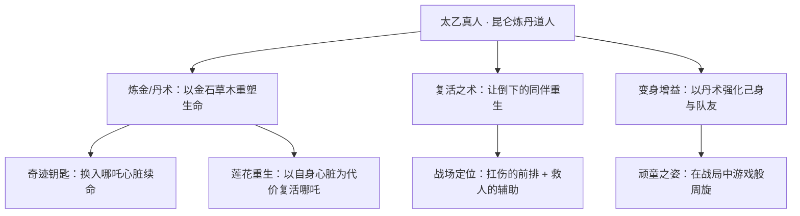

- **炼金复生**：太乙最核心、也最为人称道的能力，是「复活」——他能将炼丹术施于濒死或已倒下的同伴，使其重新站起。这一招式直接脱胎于他为哪吒续命、以心换生的背景设定，是「以命续命」信念在战场上的直接投影。
- **变身增益**：作为工具型辅助，他善于以丹术强化自身与队友的状态，在前排扛下伤害的同时为团队提供增益，兼具坦克的承伤与辅助的赋能。
- **奇迹钥匙与莲花之火**：背景中两件标志性「法器」——换入哪吒心脏的「奇迹钥匙」，以及点燃莲花重生的、来自他自身的心脏之火——共同构成了他「炼术复活」力量的来历。它们不是用于杀伤的武器，而是用于「把人从死亡边缘拽回来」的造物之器。

### 重要事件 / 剧情参与

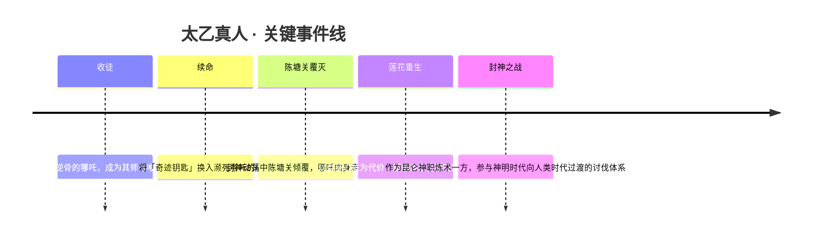

- **收哪吒为徒**：在世人皆视哪吒为灾星时，太乙真人独排众议将其收入门下，成就了封神体系中最深的一段师徒情。
- **以心换命的两次抉择**：先以「奇迹钥匙」换入哪吒心脏续命，后在陈塘关覆灭、哪吒命数已尽之际，以自身心脏为代价、用炼金术令哪吒凭莲花重生——这是太乙整段叙事的高潮，也是「莲花重生」母题在本世界观下的核心演绎。
- **参与封神之战体系**：作为昆仑炼丹一脉的修行者，他身处「神明时代向人类时代过渡」的封神纪元，与[姜子牙](#姜子牙)讨伐军、[帝俊](#帝俊)（纣王/帝辛体系）阵营等共同构成了这场神魔之战的背景版图。

### 羁绊关系

| 对象 | 关系 | 说明 |
| --- | --- | --- |
| [哪吒](#哪吒) | 师徒 / 唯一的朋友 | 太乙是哪吒的师父，也是其在世上唯一的朋友。他先将「奇迹钥匙」换入濒死哪吒的心脏续命；陈塘关覆灭后，更以自己的心脏为代价、用炼金术使哪吒凭莲花重生。 |
| [杨戬](#杨戬) | 徒弟之生死搭档 | 杨戬与哪吒由对手成为生死搭档（牧野巡视遇伏，哪吒为杨戬挡下致命一击）。作为哪吒之师，太乙与这段战友情有着间接的羁绊。 |
| [姜子牙](#姜子牙) | 同门道友（考据推测） | 二人同属昆仑一脉的「神职炼术」修行体系、共处封神之战正道一方。现行背景未明确二者直接交集，此处仅作合理推断。 |

### 经典台词

::: quote 太乙真人语录
「来玩呀，小哪吒——师父我可还没玩够呢！」（考据推测）

「倒下了？那就再站起来一次嘛。」（考据推测）

「这颗心，换你一条命，值得。」（考据推测，呼应其以心换命之背景）
:::

---

## 项羽

坦克战士

**西楚霸王 · 不信天命、揭竿而起，以双臂为壁立于阵前的破阵之王。**

| 档案 | 信息 |
| --- | --- |
| 称号 | 西楚霸王 |
| 定位 | 坦克 / 战士 |
| 所属 | [镐京·封神](../factions/haojing-fengshen.md) |
| 身份 | 起义军首领、霸王 |
| 别称 | 霸王、楚霸王 |
| 关系 | [虞姬](#虞姬)（恋人）、[姜子牙](#姜子牙)（虞姬之师，间接关联）、阴阳家（敌对，参见 [大司命](#大司命) 一系神巫体系） |
| 登场作品 | 官方背景故事、情侣皮肤「霸王别姬」 |

### 背景故事

项羽出身于一个被天命碾压、被神权与权术层层盘剥的乱世。在镐京·封神所代表的「神明时代向人类时代过渡」的大纪元里，天界与魔道的争斗、神巫对人间寿夭的执掌、阴阳家对世间秩序的操弄，都将凡人视作可以随意拨弄的棋子。芸芸众生被告知：尊卑早已写定，命数不可更改，反抗即是逆天。项羽偏偏是那个不肯低头的人——他从不相信所谓「天命」，更不相信凡人活着只是为了被神明与权贵差遣。

他天生神力，体魄雄健，力可扛鼎，在乱世中以一身蛮勇与一腔不平之气逐渐聚拢起追随者。当阴阳家以神鬼之术行暴政、以「天意」之名行压迫之实时，项羽不再隐忍，而是公然揭竿而起，举起反抗的大旗。他要做的不是取代一个旧的统治者去当新的暴君，而是要砸碎那套用「天命」绑住所有人的枷锁，让被踩在脚下的人也能挺直脊梁。

正是在这场反抗阴阳家暴政的征途上，他遇见了与自然为伍、同样不肯向暴政低头的女子——[虞姬](#虞姬)。虞姬是封神正道领袖[姜子牙](#姜子牙)的弟子，一身箭术出神入化，却选择站在与压迫者对立的一侧。两个同样桀骜、同样不信命的人在烽火中相识、并肩、相恋，成为彼此乱世里唯一的暖意。项羽护她于身前，虞姬以箭为他开路，「霸王」与「风灵」的名字渐渐被连在一起传颂。

然而乱世从不肯成全痴情。阴阳家与敌对一方深谙人心，最致命的武器从来不是刀兵，而是幻术与离间。据官方背景与情侣皮肤「霸王别姬」所述（考据推测：具体桥段在不同文案版本间略有出入），虞姬曾因师兄设下的幻术圈套堕入迷局，那一箭本应射向敌人，却在幻象的误导下偏偏对准了她最爱的人。霸王别姬的悲怆由此而生——纵有拔山之力、盖世之勇，项羽也无法用蛮力斩破那张由人心织成的网。这一段「英雄末路、美人垂泪」的意象，正是他作为「西楚霸王」最深的底色：他可以扛起天命的重压，却终究难逃命运为有情人布下的残局。

在封神之战的大背景下，项羽并非神明、也非仙人，而是「人类时代」即将登场的先声。当神明因过度索取、因彼此倾轧而走向衰落，正是这些不信天命、敢于揭竿的凡人，用自己的血肉撑起了一个属于人的纪元。项羽的反抗，象征着凡人意志对神权秩序的第一声怒吼。

### 性格与形象

项羽性情刚烈、重情重义，外表是顶天立地的猛汉，内里却藏着对虞姬近乎温柔的痴守。他骄傲而不阴鸷，争的是一口不平之气，而非权位野心；他可以为信念赴死，却无法对所爱之人狠下心肠——这份「英雄气」与「儿女情」的撕扯，构成了他最动人的张力。

外形上，他是典型的重甲战将：身披厚重铠甲，体格魁伟，肩臂宽阔如山。其核心象征意象是「壁」与「盾」——他常以双臂交叉护于身前，将自身化作队友的城墙；战场上他立在最前，把伤害与压迫尽数揽在自己身上。这一「以身为壁」的形象，与他「护虞姬于身前」「护众生于天命之下」的内核完全一致。沉郁的铠甲、紧握的拳、向前压去的身姿，都在诉说同一个词：守护。

### 战斗风格与能力（设定向）

项羽的力量根植于他超凡的天生神力与不肯退后半步的意志。他不以灵巧取胜，而以「扛」与「冲」立威——扛下最重的伤害，冲散最密的阵线。

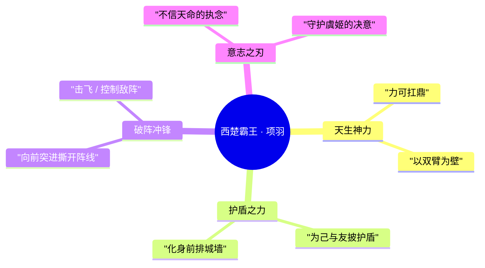

- **以身为壁的护盾流**：项羽最鲜明的设定意象是「护盾」。他能为自己乃至并肩作战者罩上守护，把队伍的安危一肩担起，是名副其实的开团与抗压前排。这与其背景中「护虞姬于身前」的母题一脉相承。
- **破阵冲锋**：凭借盖世神力，他能逆着敌阵正面压上，撕开缺口、扰乱队形，为后排（如善射的虞姬）创造输出空间。
- **意志即武器**：他真正的「绝技」并非某件神兵，而是那股「天命又如何」的执念。正因不信命，他敢于第一个冲进最凶险的地方。

（说明：以上为基于背景设定的力量与风格描述，不涉及游戏内具体数值与技能名。涉及具体招式名称处以官方为准。）

### 重要事件 / 剧情参与

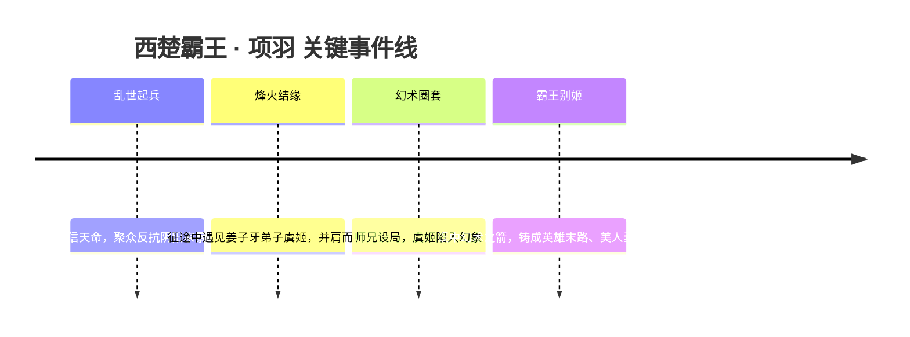

- 参与「反抗阴阳家暴政」的起义主线，是凡人对抗神权秩序的代表性人物。
- 官方背景故事中与[虞姬](#虞姬)结为恋人，二人故事凝结于情侣皮肤「霸王别姬」。
- 在封神之战的世界观脉络里，作为「人类时代先声」的象征性角色出现。

### 羁绊关系

| 对象 | 关系 | 说明 |
| --- | --- | --- |
| [虞姬](#虞姬) | 恋人（官配，师徒交织） | 虞姬为[姜子牙](#姜子牙)弟子，反抗阴阳家暴政中与霸王相爱；后因师兄幻术圈套，虞姬之箭误对项羽。官配皮肤「霸王别姬」，官方背景故事与情侣皮肤双重认证。 |
| [姜子牙](#姜子牙) | 间接关联（恋人之师） | 姜子牙是虞姬之师、封神正道讨伐军领袖；项羽虽非其门下，却通过虞姬与封神正道一脉产生牵连。 |
| 阴阳家 / 神巫一系 | 敌对 | 项羽起义所反抗的暴政势力；该体系可参见执掌人间寿夭的云梦泽神巫 [大司命](#大司命)，同处神权操弄人间命数的语境。（考据推测：阴阳家与具体神巫的从属关系以官方设定为准） |

### 经典台词

::: quote
「天命？我项羽从不信什么天命！」（考据推测）
:::

::: quote
「站在我身后，剩下的交给我。」（考据推测）
:::

::: quote
「纵有拔山盖世之力，也护不住一个虞姬么……」（考据推测）
:::

### 皮肤故事亮点

- **霸王别姬（项羽 × 虞姬 情侣皮肤）**：以「英雄末路、美人垂泪」的古典悲剧母题为核心，定格霸王与风灵在乱世中相守又相失的瞬间。皮肤以二人羁绊为叙事中心，是该对官配最具代表性的故事载体——拔山之力可撼天命，却拗不过人心织就的幻局，悲怆而隽永。（皮肤具体演出细节以官方为准）

---

## 虞姬

射手

**森之风灵 · 与林木同息、为反抗暴政而引弓的姜门女弟子**

| 档案项 | 内容 |
| --- | --- |
| 称号 | 森之风灵 |
| 定位 | 射手（远程持续输出 / 走A风筝） |
| 所属 | [镐京·封神](../factions/haojing-fengshen.md) |
| 身份 | 姜子牙弟子、与自然为伍的林间神射手、反抗阴阳家暴政的义军一员 |
| 别称 | 风灵、虞美人（考据推测，源自历史原型「虞美人」之称） |
| 关系 | 师从 [姜子牙](#姜子牙)；与 [项羽](#项羽) 相恋（官配「霸王别姬」）；与同门 [妲己](#妲己)、[杨戬](#杨戬)、[哪吒](#哪吒) 同属封神体系 |
| 登场作品 | 官方背景故事；情侣皮肤「霸王别姬」；地图/动画相关剧情（考据推测） |

### 背景故事

虞姬出身于一片被阴阳家势力长期盘踞、却仍残存生机的林野。在神明时代走向人类时代过渡的封神之战大背景下，这里既不属于摘星楼上权倾天下的纣王（[帝俊](#帝俊)）体系，也并非姜子牙讨伐军的核心战场，而是一处被强权遗忘、又被强权觊觎的边缘地带。少年时的虞姬亲历了阴阳家以「秩序」「天命」为名对这片土地的盘剥——他们以阴阳术数操弄人心，假借星象与生死之说役使百姓，把鲜活的山林与村落变成榨取气力的牧场。这段经历在她心里种下了对一切「以高位之名行压迫之实」的强烈憎恶，也让她比同龄人更早地把目光投向自然本身：当人间的秩序腐坏，唯有风、林木与飞鸟仍诚实地回应她。

她与自然为伍，在林间习得了惊人的箭术。传说她的弓不只是一件武器，更像是她与森林之间的契约——风替她送箭，林木替她藏身，飞鸟替她传讯。她因此得了「森之风灵」之名：不是凌驾于自然之上的猎手，而是被自然所接纳、与之同呼吸的灵物（考据推测，结合其称号与「与自然为伍」的官方定位）。

命运的转折来自姜子牙。作为正道讨伐军的领袖、封神者「太公望」，姜子牙四方奔走、广纳贤才以充实讨伐纣王的力量。他在这片饱受阴阳家荼毒的林野中发现了虞姬，看出她身上那股既贴近天地、又不肯向强权低头的锋芒，遂收其为徒。师从姜子牙后，虞姬不再只是一个孤身护林的射手，而成为一名有了方向的反抗者——她把对阴阳家暴政的私仇，汇入了更宏大的「不让世界走向毁灭」的封神之战洪流之中（考据推测：官方明确其为姜子牙弟子、反抗阴阳家暴政，余者为合理串联）。

也正是在反抗阴阳家暴政的颠沛途中，她遇见了那个同样不信天命、揭竿而起的人——西楚霸王 [项羽](#项羽)。两个本不相干的灵魂，因共同的「反抗」而彼此映照：项羽以血肉之躯硬撼天命，虞姬以一张弓守护身后的林野与众生。他们相爱了。这段感情后来被官方定格为最负盛名的官配之一「霸王别姬」。然而封神之战的残酷不曾因爱意而稍减——据相关关系记载，虞姬曾因师兄设下的幻术圈套，使本应射向敌人的箭误向项羽而去。这一箭，把「霸王别姬」从一个浪漫的名字，拉回了它在历史与传说中本就沉痛的底色（参见 [项羽](#项羽) 词条与情侣剧情）。

### 性格与形象

虞姬性格清冷而坚定，带着久居山林之人特有的疏离与警觉，却并非冷漠——她的冷，是对虚伪秩序的冷；她的热，则全数留给了她所守护的自然与所爱之人。她不善于在人群与权谋中周旋，更习惯以一支箭、一阵风来表达立场：该出手时绝不迟疑，该退守时如风消散。

外形上，她的意象始终围绕「森林」「风」「弓」三者展开：身姿轻盈如临风的林梢，行动间常有飞鸟、落叶、流风相伴的视觉象征；她的弓与箭被塑造成与草木同源的存在，仿佛拉满的弓弦上震动的是整片森林的呼吸。「森之风灵」这一称号，正是她形象的凝练——既是自然的精灵，也是穿林而过、无可捉摸的那一缕风。

### 战斗风格与能力（设定向）

从设定来源看，虞姬的力量并非来自神职封号或炼丹仙术，而是来自她与自然之间近乎共生的联系，以及姜门所授的射艺。她不靠近身缠斗，而是以「风筝」之术——借助风与林木的掩护不断走位、保持距离，用连绵不绝的箭矢消磨对手。她的战斗哲学与她的处世一致：不正面硬撼强权，而以耐心、距离与精准，将看似不可撼动的庞然大物一点点瓦解。

她的弓被设定为与自然同息的灵兵：箭出如风，疾而无形；据其森林意象，箭矢可借风势加速、可循林影潜行（考据推测，基于「森之风灵」称号与「与自然为伍」官方定位）。在封神之战中，这样一位能在中远距离持续施压、又极擅脱身的射手，恰好弥补了讨伐军在持久消耗与机动牵制上的需求。

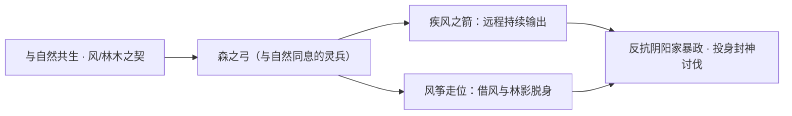

### 重要事件 / 剧情参与

- **反抗阴阳家暴政**：自幼目睹阴阳家以术数压迫林野百姓，成年后投身反抗，是其行动与动机的源起。
- **拜入姜门**：被封神者 [姜子牙](#姜子牙) 收为弟子，从孤身护林者成长为有方向的反抗军一员，正式接入封神之战体系。
- **与项羽相恋**：在反抗途中与西楚霸王 [项羽](#项羽) 相爱，成就官配「霸王别姬」。
- **误箭之痛**：因师兄设下的幻术圈套，虞姬之箭误对项羽——「霸王别姬」自此带上悲剧底色（见 relatedRelationships）。

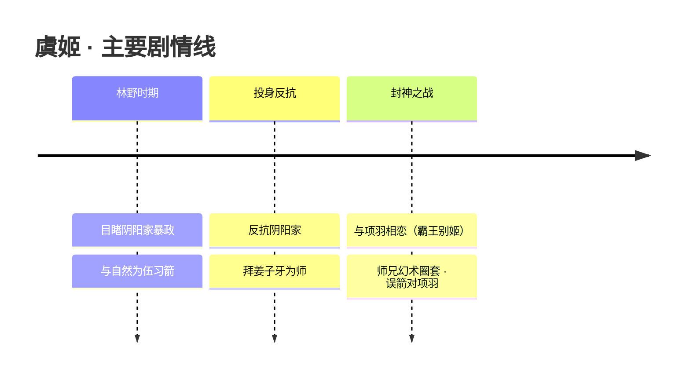

### 羁绊关系

| 对象 | 关系 | 说明 |
| --- | --- | --- |
| [项羽](#项羽) | 恋人（官配 · 师徒交织背景） | 虞姬为姜子牙弟子，反抗阴阳家暴政中与西楚霸王项羽相爱；后因师兄幻术圈套，虞姬之箭误对项羽。官配皮肤「霸王别姬」，有官方背景故事与情侣皮肤。 |
| [姜子牙](#姜子牙) | 师徒 | 虞姬为姜子牙弟子，源自官方背景故事；其拜师是接入封神讨伐体系的关键节点。 |
| 师兄（未具名） | 同门 · 加害 | 师兄以幻术布下圈套，致使虞姬误射项羽，是「霸王别姬」悲剧的直接推手（考据推测：身份在现行设定中未明确点名）。 |

### 经典台词

::: quote 虞姬 · 语音台词（部分为考据推测）
「风替我送箭，林木为我藏身。」（考据推测）

「我所守护的，不止是这片森林。」（考据推测）

「以天命之名行压迫之实者，皆是我的敌人。」（考据推测）
:::

### 皮肤故事亮点

- **霸王别姬（情侣皮肤）**：与 [项羽](#项羽) 的官配主题皮肤，取材自历史与传说中「霸王别姬」的经典意象。在封神世界观下，它既是二人相爱的浪漫见证，也呼应了那一箭误中所带来的离别与悲怆——把千古传唱的诀别，重新讲述为一段反抗者之间的爱与命运（皮肤主题取自官方，具体剧情细节为考据推测）。

---

## 廉颇

坦克法师

**正义爆轰 · 以巨拳与岩石之力凿开战阵的硬核前排守护者**

| 项目 | 内容 |
| --- | --- |
| 称号 | 正义爆轰 |
| 定位 | 坦克 / 法师 |
| 所属 | [镐京·封神](../factions/haojing-fengshen.md) |
| 身份 | 战国赵国名将、稷下学院（老夫子门下）弟子、前排团战开团者 |
| 别称 | 老廉、固若金汤的肉盾（玩家俗称，考据推测） |
| 关系 | 师父 [老夫子](jixia.md#老夫子)；官配 [钟无艳](jixia.md#钟无艳)；同袍 [项羽](#项羽)、[虞姬](#虞姬)、[姜子牙](#姜子牙) |
| 登场作品 | 《王者荣耀》本体英雄 |

### 背景故事

廉颇的原型取自战国时代赵国的名将廉颇——那位以「负荆请罪」「将相和」典故传世、以攻坚与持重著称的老将。在《王者荣耀》的世界观里，这份历史的厚重被转译为一种更具象的力量：他不再只是史册上指挥千军的统帅，而是一名亲身立于阵前、以血肉之躯承受冲击的「正义爆轰」。他是稷下学院创院三贤者之一——[老夫子](jixia.md#老夫子)——门下的弟子之一。稷下三贤者有教无类、广收门徒，廉颇便是在这座汇聚百家、铸造机关与思辨的学府中，淬炼出自己关于「守护」的信条（依据本阵营 relatedRelationships 师承设定）。

与许多追逐攻伐、争夺先手的同门不同，廉颇所信奉的并非「击溃」，而是「不破」。他相信真正的强大不在于自己能击倒多少敌人，而在于自己身后的人能否安然无恙。这份近乎执拗的信念，让他选择了一条最不讨巧的路——把自己变成阵线本身。他将岩石与重击纳入修行，把整片大地的沉稳压进自己的拳头，使每一次出拳都像是一座山岳的崩落，又像是一次「爆轰」般在敌阵中央炸开缺口。称号中的「爆轰」二字，正是这种将「至重」与「至烈」合于一身的写照：他是最沉的盾，也是最响的锤。

在镐京·封神这一从神明时代向人类时代过渡的恢宏体系中，廉颇并非天界战神，也非炼丹仙人，而是一名「人」——一名愿意为同袍把命押在最前面的凡人将领。当姜子牙率领的讨伐军与摘星楼的烈焰、与诸神博弈的洪流交织在一起时，正是像廉颇这样的前排，用自己的身躯为后排的法术、箭矢与谋略撑出一方喘息之地（人物在封神体系中的具体战役定位为考据推测，世界观背景依据阵营设定）。他不曾妄想成神，他要的只是「守得住」三个字。

廉颇人生中一段被反复提及的际遇，是他与一柄大锤的相逢。传说他踏入战场后所迎来的第一个对手，正是手执巨锤、刚烈不屈的 [钟无艳](jixia.md#钟无艳)——同为老夫子门下、同样把「硬碰硬」刻进骨子里的同门。拳与锤的初次相撞，竟成了二人此后纠葛的起点；后来在稷下，他们以盟友、乃至更亲近的身份重逢（据本阵营 relatedRelationships 官配设定）。对于这位习惯了沉默扛事、不善言辞的老将而言，这或许是他坚硬铠甲之下，最柔软的一处裂缝。

### 性格与形象

廉颇的性格如同他所驾驭的岩石——沉、稳、轴。他不擅辞令，更不屑于花哨的算计，凡事认死理、讲究一个「正」字，这与他「正义爆轰」的称号一脉相承。他把责任看得比性命重，常年默默站在最前，宁可自己伤痕累累，也要替身后的同伴挡下最凶险的一击。这种「老黄牛」式的担当，让他在一众或张扬、或机巧的英雄中显得格外朴拙，却也格外可靠。

外形上，廉颇是一位身形魁伟、肌肉虬结的壮年武者，最醒目的标志是套在双手之上、形如山石的巨型护拳/铁拳。当他蓄力时，拳上与脚下会泛起岩石碎裂、地脉震荡般的意象，象征他从大地汲取的伟力。他的整体气质带着戍边老将特有的风霜与厚重——不是锋芒毕露的利刃，而是岿然不动的城墙。岩石、巨拳、震地、长城般的守势，构成了他最核心的象征意象（外形描述综合其原画与技能表现，部分为考据推测）。

### 战斗风格与能力（设定向）

廉颇的战斗哲学可以浓缩为一句话：**先扛住，再炸开**。作为坦克与法师的复合定位，他既能用厚重的血量与护甲承受成吨伤害，又能借岩石之力打出可观的法术爆发，是典型「以肉换控、以控反伤」的前排。

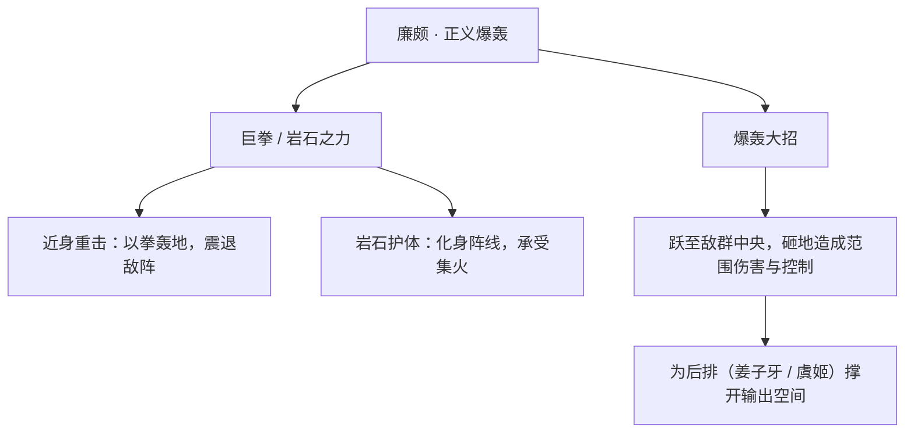

- **巨拳与岩石之力**：他的力量源自对大地的修炼，每一拳都凝聚岩石的至重，落点处如同小型「爆轰」，既能造成范围法术伤害，又能将敌人击退、击飞，破坏敌方阵型（招式机制为设定向描述，非游戏数值）。
- **以身为盾**：廉颇擅长主动迎着敌方先手扑上去，用自身的高韧性吸收伤害，把战场的焦点引到自己身上，从而保全后排的脆弱输出者。
- **爆轰开团**：作为一名开团型前排，他往往是团战的「第一声号角」——纵身跃入敌群、重拳砸地，以一次范围控制为同袍创造合围与收割的窗口。

### 重要事件 / 剧情参与

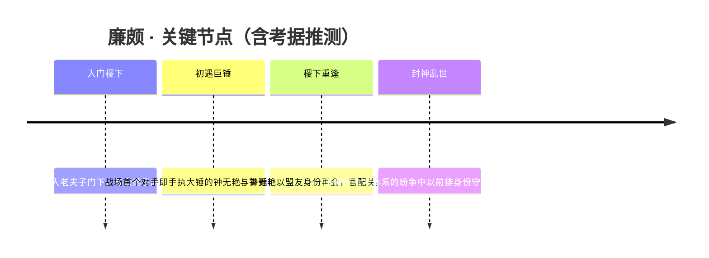

- **师承稷下**：作为老夫子门下弟子之一，参与稷下学院「有教无类、广收门徒」的师承脉络（本阵营 relatedRelationships 明确）。
- **拳锤之缘**：与钟无艳的初战与重逢，是其个人故事线中最被官方与玩家关注的一段（本阵营 relatedRelationships 明确）。
- **封神之战中的前排**：在神明时代向人类时代过渡的封神乱世里，承担正面承伤与开团的角色（具体战役参与为考据推测）。

### 羁绊关系

| 对象 | 关系 | 说明 |
| --- | --- | --- |
| [钟无艳](jixia.md#钟无艳) | 恋人（官配） | 二人皆老夫子弟子；廉颇战场上的第一个对手便是手执大锤的钟无艳，后于稷下以盟友身份重逢。官方微博认证官配，但因双方较为冷门，存在感极低。 |
| [老夫子](jixia.md#老夫子) | 师徒 | 稷下创院三贤者之一，廉颇为其门下弟子之一，传授其学识与信念根基。 |
| [姜子牙](#姜子牙) | 同阵营 / 同袍 | 镐京·封神讨伐军领袖与封神者，廉颇作为前排为其主导的战局承伤、撑场（同阵营协作，考据推测）。 |
| [项羽](#项羽) | 同阵营 / 前排同道 | 同为封神体系中的坦克型前排，一护盾、一岩拳，皆以血肉之躯立于阵首（同阵营定位关联，考据推测）。 |
| [虞姬](#虞姬) | 同阵营 / 受其守护 | 作为后排射手，常需前排为其拉开输出空间，廉颇的开团与承伤正是这类后排的依仗（同阵营协作，考据推测）。 |

### 经典台词

::: quote 廉颇 · 经典台词
「固若金汤！」（考据推测）

「敌军还有三十秒到达战场，全军出击！」（系游戏内通用语音，非廉颇专属，考据推测）

「我的拳头，会替我说话。」（考据推测）

「躲在我身后，没人能伤到你。」（考据推测）
:::

---

## 帝俊

战士

**东皇之主 · 自诩「进步不应受束缚」的远古天帝，与创世对立的堕世之神。**

| 项目 | 内容 |
| --- | --- |
| 称号 | 东皇之主 |
| 定位 | 战士（强机制·重装/法系战士） |
| 所属 | [镐京·封神](../factions/haojing-fengshen.md) |
| 身份 | 远古天帝、诸神之战的发起者；在封神体系中与帝辛（纣王）形象互文（考据推测） |
| 别称 | 帝辛 / 帝俊天帝 / 堕世之神（民间与考据通称） |
| 关系 | [女娲](shanggu-shenhua.md#女娲)（创世—堕世的宿敌）、[孙悟空](shanggu-shenhua.md#孙悟空)·[牛魔](shanggu-shenhua.md#牛魔)·[猪八戒](shanggu-shenhua.md#猪八戒)（起义—镇压的对立面）、[姜子牙](#姜子牙)·[妲己](#妲己)（封神之战的对手与傀儡，考据推测） |
| 登场作品 | 英雄背景故事；「诸神之战」「神明纪元」相关世界观叙事 |

### 背景故事

帝俊是王者大陆最古老的存在之一，一位真正意义上的「天帝」。在盘古开天、众神并立的神明纪元里，他立于诸神之巅，掌握着足以改写大陆规则的权柄。与以补天造物著称的[女娲](shanggu-shenhua.md#女娲)恰成两极——若说女娲是孕育万物、修补世界的「创世之神」，那么帝俊便被后世铭记为意图倾覆这一切的「堕世之神」。两人地位相当、理念相悖，自神明纪元伊始便是命定的宿敌。

帝俊的信条只有一句：进步不应受任何束缚。在他眼中，力量是衡量一切的唯一尺度，世界的秩序理应交由最强者书写。为了攫取更磅礴的力量，诸神开始疯狂采集大陆深处的能量；而过度的采掘使能量发生异变，污染了「劳力者」们赖以生存的土地。面对哀鸿，帝俊不以为意——在通往更高文明的道路上，他认为牺牲在所难免。正是这份「为求力量在所不惜」的傲慢，点燃了那场暗无天日的**诸神之战**：为争夺话语权与世界的归属，众神彼此相残。

战争旷日持久，最终以帝俊的战败陨落收场。神明们死伤殆尽，连女娲也奄奄一息，辉煌的神明纪元就此落幕，大陆被迫迈向新的时代。然而帝俊并未真正消失——大战之前，他曾在「方舟」之上悄悄藏下了一小块方舟核心。凭着这点火种，他的意识在漫长的岁月后悄然苏醒，却只余神识、无法行动，亟需重新汇聚方舟核心来重塑躯体、重返世间。（以上为现行「神明纪元 / 诸神之战」叙事；其与镐京·封神体系的对接见下。）

在 [镐京·封神](../factions/haojing-fengshen.md) 这一脉的叙事里，帝俊的形象与殷商之主**帝辛（纣王）**彼此互文：那位宣布「人类与魔种应当平等」、却被以[姜子牙](#姜子牙)为首的讨伐军认定为「走向毁灭的大魔神王」、最终于摘星楼烈焰中灰飞烟灭的天帝（考据推测）。两套叙述都指向同一种悲剧母题——一位以「先进」「平等」「进步」为名行事的至高存在，在旁人眼中却是必须被讨伐的堕落与僭越。无论是诸神之战的元气炮火，还是摘星楼的冲天烈焰，帝俊都是那个被时代联手扑灭、却始终拒绝认错的「东皇之主」。

### 性格与形象

帝俊的性格是彻底的「强者本位」：冷峻、傲然、不容置疑。他并非脸谱化的嗜杀者，而是坚信自己站在文明与历史的正确一侧——为了所谓的更高目标，他可以心安理得地碾过无数生灵。这种「以进步之名」的冷酷，比单纯的暴虐更令人胆寒，也正是他与女娲分歧的根源：一个要修补与守护，一个要打碎与重塑。

在形象上，帝俊往往被刻画为庄严而压迫感十足的天帝之姿——华贵繁复的远古帝袍、象征日月与天极的冠饰，举手投足间带着俯瞰众生的神性威仪。「东皇」二字本就是上古对至高天神的尊称，其意象常与太阳、星辰、苍穹相系（考据推测）。重塑后的躯体则糅入「方舟」科技感的造物意味，使他兼具远古神祇的肃穆与机械造物的冰冷，呼应其「以力量与造物重写世界」的执念。

### 战斗风格与能力（设定向）

作为强机制的重装/法系战士，帝俊的力量并非寻常的血肉之勇，而是源自天帝神权与方舟核心的造物之力。

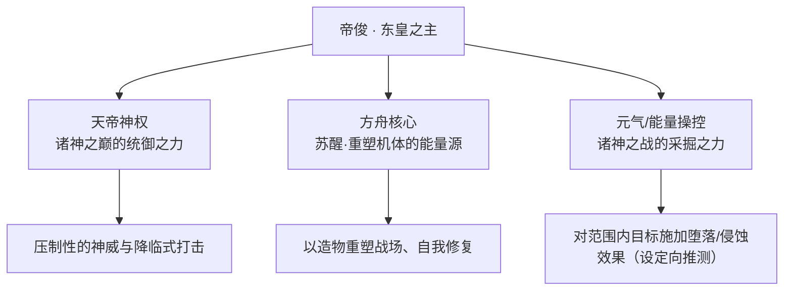

- **天帝神权**：作为远古天帝，帝俊的招式多带有「降临」「俯瞰」式的威压，以神之姿态强行介入战场，呼应其凌驾众生的设定。
- **方舟核心之力**：苏醒后的帝俊依赖方舟核心重塑机体，因此其能力被赋予「造物 / 重塑 / 自我修复」的意象——既能再造躯体，也能将这股力量化作攻防机制。
- **元气侵蚀**：诸神之战中神明以过度采集的能量相互倾轧，帝俊的攻击常被描述为带有「污染 / 堕落」气息的能量打击（设定向推测，非游戏数值）。

> 注：以上为基于背景设定的力量来历描述，不涉及具体技能数值与连招。

### 重要事件 / 剧情参与

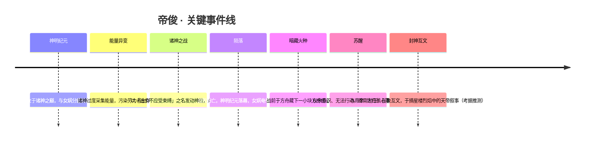

- **诸神之战的发起者**：帝俊是这场决定大陆走向的神战的核心点火者，其战败标志着神明时代向后续纪元的过渡。
- **与魔种起义的对立**：在诸神过度采集、污染劳力者生存空间的背景下，[孙悟空](shanggu-shenhua.md#孙悟空)率魔种揭竿而起；帝俊与女娲所代表的神明阵营对这场起义施以镇压，神明以元气炮轰营，悟空被擒（详见 [镐京·封神](../factions/haojing-fengshen.md) 阵营级对立）。
- **重塑机体的追寻**：苏醒后的帝俊以收集方舟核心、重返世间为现行剧情主线；据传 [海月](yunzhong-modi.md#海月) 等英雄曾不惜代价介入其复活进程（考据推测）。

### 羁绊关系

| 对象 | 关系 | 说明 |
| --- | --- | --- |
| [女娲](shanggu-shenhua.md#女娲) | 创世—堕世的宿敌 | 女娲为修补守护的创世之神，帝俊为意图倾覆的堕世之神，地位相当、理念相悖，是世界观中的两极对立。 |
| [孙悟空](shanggu-shenhua.md#孙悟空) | 起义—镇压（阵营级对立） | 诸神过度采集能量污染劳力者生存空间，孙悟空率魔种起义；帝俊所在的神明阵营以元气炮轰营镇压。 |
| [牛魔](shanggu-shenhua.md#牛魔) | 起义—镇压（阵营级对立） | 同属魔种起义一方；牛魔因惧神明武器出卖众人，致起义溃败，间接成全了神明的镇压。 |
| [猪八戒](shanggu-shenhua.md#猪八戒) | 起义—镇压（阵营级对立） | 魔种起义溃败后独闯倒悬天寻友，与帝俊代表的镇压方处于对立结构。 |
| [姜子牙](#姜子牙) | 封神之战的讨伐对象 | 在封神互文中，帝俊（帝辛/纣王）被以姜子牙为首的讨伐军认定为大魔神王而遭讨伐（考据推测）。 |
| [妲己](#妲己) | 被献予的傀儡 | 封神叙事中妲己为姜子牙造形注魂、后献予纣王（帝俊互文身份）的人偶（考据推测）。 |

### 经典台词

::: quote 帝俊语录
「进步，不应受任何束缚。」（考据推测）

「力量，才是衡量一切的尺度。」（考据推测）

「世界的规则，理应由最强者书写。」（考据推测）

「神明纪元落幕了，但我，从未真正离去。」（考据推测）
:::

---

## 大司命

刺客战士

**执掌生死 · 云梦泽九大神巫之一，持神戈丈量人间寿夭、于穿刺与斩首之间执行天命的死亡裁决者。**

| 档案项 | 内容 |
| --- | --- |
| 称号 | 执掌生死 |
| 定位 | 刺客 / 战士（亦常按法师 / 法刺路线使用，野区与中路皆可见）(考据推测) |
| 所属 | [镐京·封神](../factions/haojing-fengshen.md) |
| 身份 | 云梦泽九大神巫之一 · 主掌人间寿夭生死的神巫 |
| 别称 | 大司命、司命神巫、执掌生死者 |
| 关系 | [少司缘](shanggu-shenhua.md#少司缘)（"司命"同源的另一神职意象，对应《九歌》中与"大司命"并列的"少司命"）(考据推测)、[帝俊](#帝俊)（封神之战中以天界 / 神职秩序为背景的天帝）、[姜子牙](#姜子牙)（封神体系中的封神者与神职秩序象征） |
| 登场作品 | 《王者荣耀》英雄序列（封神 / 众神体系英雄）；以"云梦泽神巫"为母题的相关活动与背景文案(考据推测) |

### 背景故事

在镐京与朝歌之外、烟波浩渺的**云梦泽**深处，传说有九位不食人间烟火的**神巫**。她们不属于讨伐军，也不附庸于摘星楼上的天帝，而是更古老的一脉——以巫祝沟通天人、以仪轨执掌自然法度的"司"者。**大司命**，正是这九大神巫中地位最隆、也最令世人畏惧的一位：她所"司"的，是人间最不可违逆的两件事——**寿与夭、生与死**。

她的名号并非凭空而来。在更早的诗篇里，"大司命"本就是主管人之寿命长短的神祇，与主管子嗣、爱怜的"少司命"两两相对，一者掌"夭寿"，一者掌"生育"，合称司命之神。(考据推测) 王者世界观将这一上古神职意象收束于云梦泽神巫的体系之中：大司命不再只是被祭祀的虚名，而是真正握着**生死簿一般的权柄**、会亲自下场行使裁决的存在。她不创造生命，也不轻易夺取生命；她做的，是在命数已尽之处，**准时到场，执行那一笔早已写定的勾销**。

云梦泽的水汽常年不散，神巫们在雾中行走，外人难辨其形。大司命行于其间，足不沾尘、衣不沾水，所到之处草木噤声、飞鸟坠地——并非她有意杀伐，而是凡有大限将至的生灵，会本能地感知到"司命"的临近。久而久之，云梦泽周边的部族奉她为最高的神巫，既向她乞求长寿，也因惧怕她的"点名"而不敢妄动。她对这些祈求始终冷淡：在她眼中，**寿夭本有定数，乞求改变命数，本身就是对天命的僭越**。

封神之战的烽火由镐京烧向四方，天帝（帝俊 / 帝辛体系）宣称"人类与魔种平等"、以神明之力推动一场剧烈的秩序变革，姜子牙率讨伐军以"走向毁灭的大魔神王"之名兴师问罪，神明时代正从顶端崩塌、向人类时代过渡。(参见 [镐京·封神](../factions/haojing-fengshen.md)) 在这样一场关乎"谁有资格决定众生命运"的大战中，掌管生死的大司命，无论站不站队，都注定被卷入风暴的中心——因为这场战争的本质，正是**对"生死与命运由谁书写"这一权柄的争夺**。神明以元气炮轰平叛军、纣王于烈焰中灰飞烟灭，无数生灵的"大限"被强行提前；当太多人的命数被战争一笔抹去、当生死簿被战火烧得面目全非时，执掌生死的神巫，便不得不离开云梦泽的雾，踏入人间的火。(考据推测)

也正因如此，大司命的动机始终与寻常英雄不同。她不为家国、不为爱憎、不为复仇——她为的是**"秩序"本身**：让该终的终、让该续的续，让生死回到它本应有的轨道上。当有人试图凭神力或魔力肆意篡改众生命数时，无论那是天帝还是讨伐军，她都会以神戈作笔，**亲自为这场失控的纪元，补上一道"裁决"**。

### 性格与形象

大司命给人的第一印象是**极致的冷峻与疏离**。她话不多，语调平稳，从不为任何人的哀求或威胁所动；在她面前，王侯与蝼蚁并无分别，因为在"大限"这件事上，众生本就平等。她不残忍，却也绝不慈悲——她将自己视为天命的**执行者而非裁量者**，"该死之人"的判定不由她的喜好决定，她只负责让结果如期到来。这种"非善非恶、只问命数"的立场，使她在封神乱世中显得格外孤高，也格外危险。

外形上，她带有浓郁的**楚地巫祝**色彩：长而曳地的衣袂、繁复的巫纹与垂坠的饰物，举手投足间是仪轨般的肃穆；常以面纱、垂幕或低垂的眼帘示人，仿佛在世人与"她所代表的死亡"之间，始终隔着一层不可逾越的薄幕。(考据推测) 她最核心的象征意象有三：**戈**（执行裁决之器）、**雾水**（云梦泽与无常）、以及环绕周身的**生死之气**——一侧主"生"、一侧主"死"，如阴阳二色在她身侧流转。她出场时往往伴随着压抑而仪式化的氛围：不是杀气腾腾的冲锋，而是**"宣判"般的从容降临**。

### 战斗风格与能力（设定向）

大司命的战斗哲学，与她"执掌生死"的神职高度一致——**先锁定大限，再准时收割**。她兵器是一柄象征司命权柄的**神戈**（戈，长柄横刃之器，可刺可勾可斩），既能远距离穿刺标记目标，也能在近身时如刺客般贴脸处决。(考据推测) 她的招式来历皆可回溯到"生死"母题：以神戈洞穿目标、为其烙下"将死"的印记（**穿刺**）；当目标命数已濒临尽头（残血）时，她能直接行使裁决、提前勾销其生命（**斩杀 / 处决机制**），正如司命在生死簿上落下最后一笔。这也对应了她作为打野神巫时那种"标记—突进—处决"的强收割节奏。(基于公开定位的考据推测，非游戏数值)

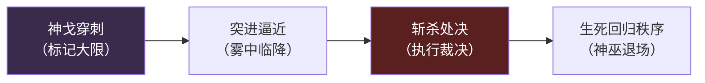

与纯粹依赖蛮力的战士不同，她的"战士"属性更多体现为**持戈近战的耐战与处决能力**，而"刺客"属性则体现为**对残局的瞬间收割**；两种定位在她身上并不矛盾，反而共同服务于同一个目的——让"该死之人"无可逃脱。这也是她为何常被同时归类为刺客 / 战士、并被玩家以法刺路线开发的原因。(考据推测)

### 重要事件 / 剧情参与

- **云梦泽九大神巫的确立**：作为九大神巫之首席意象，大司命所"司"的生死，是九巫体系中最具威慑力的一支；她长居云梦泽雾中，少与外界往来。(考据推测)
- **封神之战的波及**：镐京 / 朝歌的封神之战使无数生灵命数被战火强行改写，掌生死的神巫不得不介入这场关乎"命运书写权"的大战。(参见 [镐京·封神](../factions/haojing-fengshen.md))(考据推测)
- **"司命"母题的呼应**：与同属众神体系、承载"少司命 / 月老"意象的 [少司缘](shanggu-shenhua.md#少司缘) 形成"大司命—少司命"的古老对照——一者掌生死寿夭，一者牵姻缘生育。(考据推测)

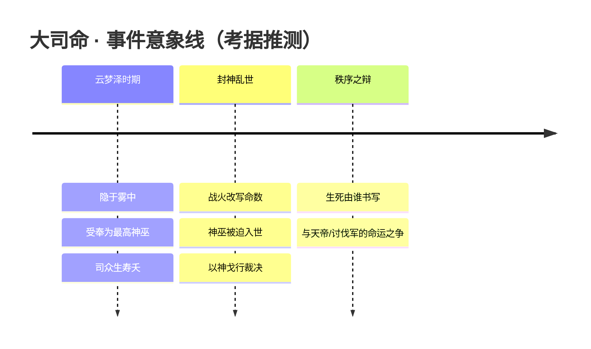

> 以上事件线为基于公开背景母题的合理串联，具体官方文案以游戏内为准。

### 羁绊关系

| 对象 | 关系 | 说明 |
| --- | --- | --- |
| [少司缘](shanggu-shenhua.md#少司缘) | "司命"同源意象 | 取《九歌》"大司命—少司命"之对照：大司命主寿夭生死，少司命（对应"赤诚月老"少司缘的牵缘意象）主姻缘生育，二者构成古老的司命双神母题。(考据推测) |
| [帝俊](#帝俊) | 同体系 · 命运之争 | 东皇之主以神明之力推动剧变、强行改写众生秩序；执掌生死的神巫与"由天帝书写命运"的立场天然存在张力。(考据推测) |
| [姜子牙](#姜子牙) | 同体系 · 封神秩序 | 封神之战的封神者与神职秩序象征；在"谁有资格定夺生死与封号"这一议题上，与司命神职处于同一叙事场域。(考据推测) |

> 本表覆盖大司命在封神 / 众神体系中可考的关系母题；除"大司命—少司命"的古典同源对照外，其余多为基于阵营叙事的背景关联，硬性官配 / 师徒关系暂无公开实证，故标注（考据推测）。

### 经典台词

::: quote 执掌生死
"寿夭有数，生死有命——而我，便是那笔勾销。"（考据推测）
:::

::: quote 无可乞求
"向我祈求长生，无异于向天命僭越。"（考据推测）
:::

::: quote 裁决临降
"你的大限，已到。"（考据推测）
:::

> 以上台词依据角色"执掌生死"的神职定位与楚地神巫气质推演，仅供叙事参考，准确语音以游戏内为准。

::: tip 继续探索
返回 [镐京·封神 阵营页](../factions/haojing-fengshen.md) · 浏览 [全英雄图鉴](index.md) · 查看 [人物关系网](../relationships/index.md)
:::