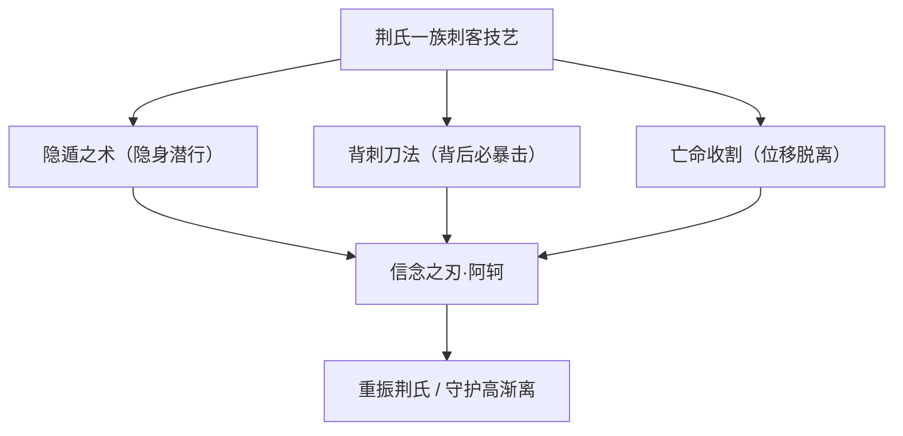
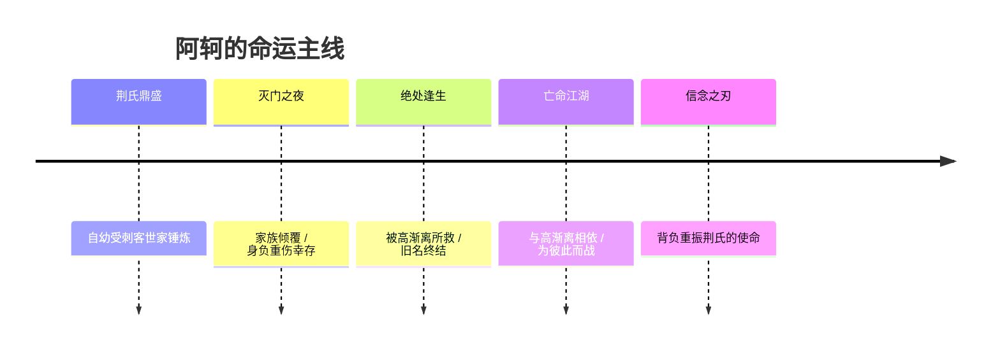
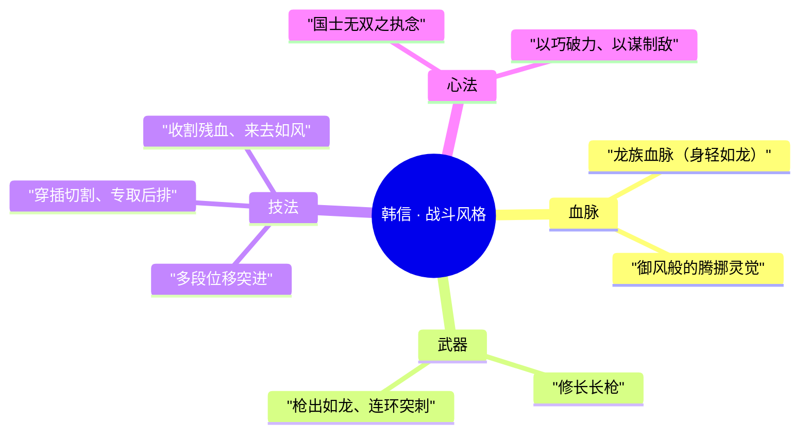
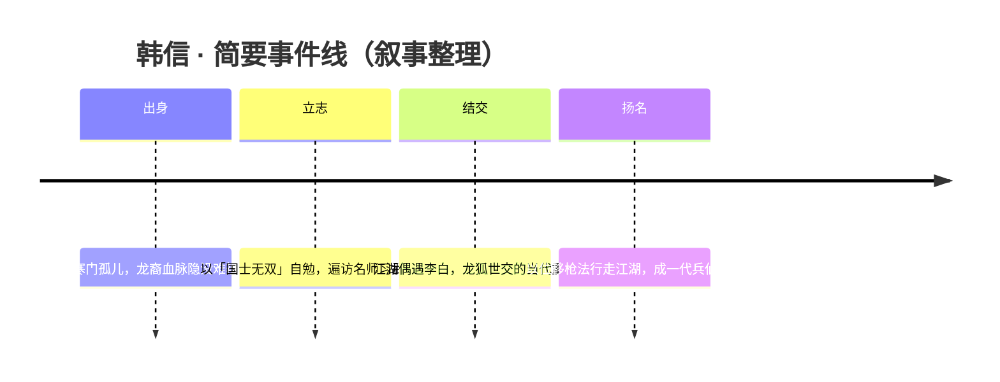
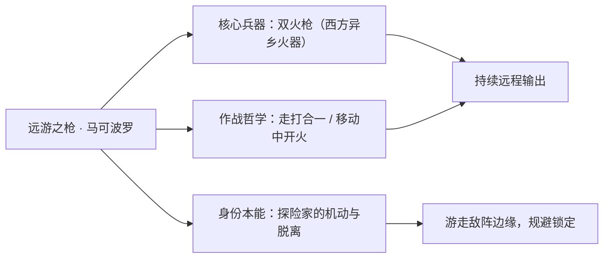
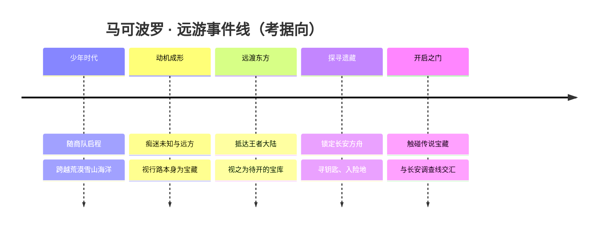
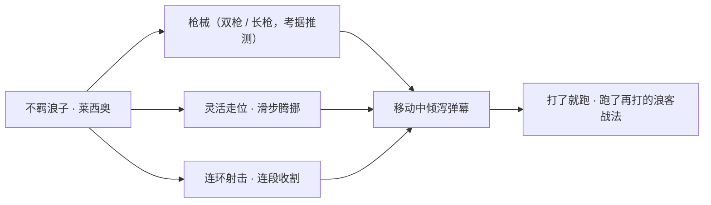
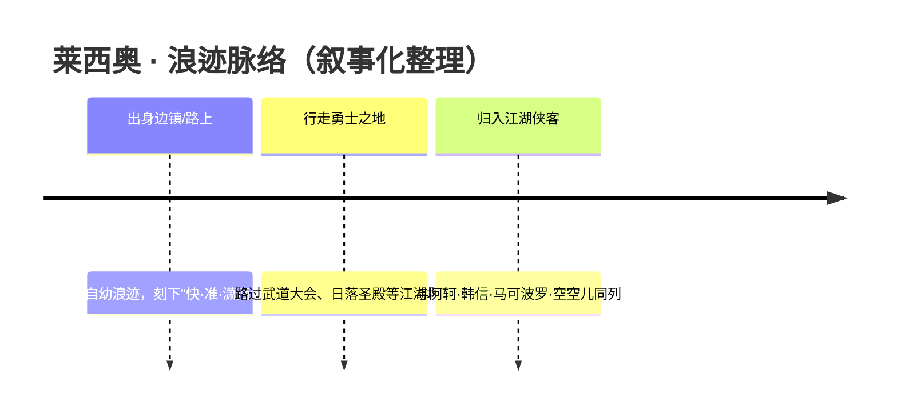
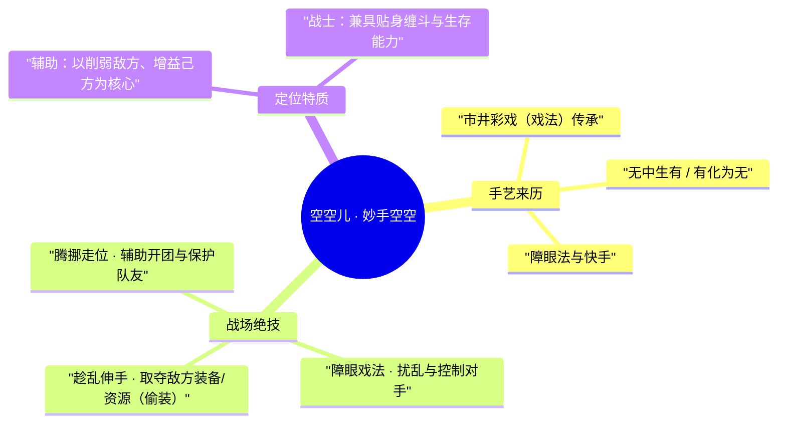
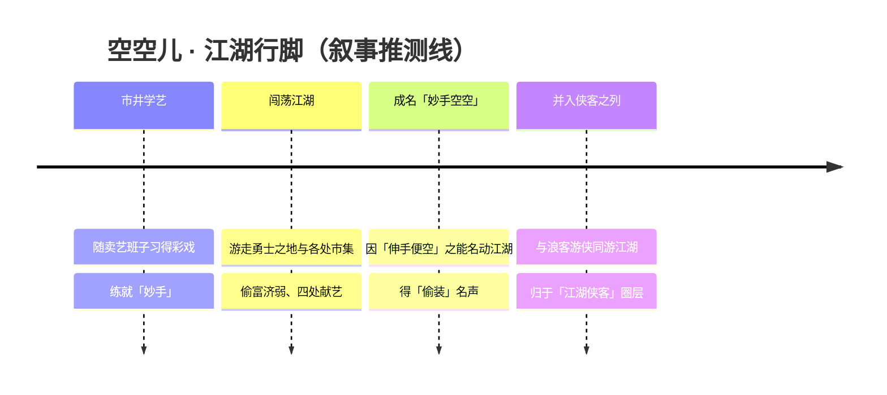

# 江湖侠客 · 英雄图鉴

> 阵营设定见 [江湖侠客 阵营页](../factions/jianghu-xiake.md)。本页收录该阵营 **5** 位英雄的深度小传。

::: info 本页英雄名册
| 英雄 | 称号 | 定位 | |
| --- | --- | --- | --- |
| [阿轲](#阿轲) | 信念之刃 | 刺客 | |
| [韩信](#韩信) | 国士无双 | 刺客 | |
| [马可波罗](#马可波罗) | 远游之枪 | 射手 | |
| [莱西奥](#莱西奥) | 不羁浪子 | 射手 | |
| [空空儿](#空空儿) | 妙手空空 | 辅助/战士 | |
:::

---

## 阿轲

刺客

**信念之刃 · 荆氏一族仅存的少女，以背刺与隐遁为生的亡命刺客**

| 档案项 | 内容 |
| --- | --- |
| 称号 | 信念之刃 |
| 定位 | 刺客 |
| 所属 | [江湖侠客](../factions/jianghu-xiake.md) |
| 身份 | 荆氏刺客世家的最后传人 / 隐遁江湖的亡命刺客 |
| 别称 | 信念之刃；据官方背景，本名「荆轲」，荆氏灭门后改唤「阿轲」 |
| 关系 | [高渐离](jixia.md#高渐离)（恋人 · 救命之人）、[韩信](#韩信)（同阵营江湖刺客）；与 [李白](changan.md#李白) 同为游走江湖的剑（刀）客，关系更近江湖故人（考据推测） |
| 登场作品 | 《王者荣耀》正式上线英雄；多部官方背景故事与皮肤剧情 |

### 背景故事

阿轲出身于王者大陆上声名隐晦却令人闻之色变的刺客世家——**荆氏一族**。在江湖侠客这一游离于帝国与稷下学院之外的圈层里，荆氏并非寻常的武林门派，而是世代以「刺杀」为业、把杀人之技打磨成信仰的家族。据本阵营设定，荆氏一族在「大周分崩」之后流散于世，他们不再侍奉某个王朝，而是带着祖传的刀法、隐遁之术与一套近乎偏执的家族信念，在乱世的缝隙中存活下来。阿轲，正是这条血脉走到尽头时仍然活着的那一个人。

她原本不叫阿轲。在被命运彻底改写之前，她本名「荆轲」（据官方背景，灭门之后她才改唤「阿轲」），是家族中被寄予厚望、自幼便被以刺客之道严苛锤炼的少女。荆氏的孩子没有寻常少年的童年——他们学的是如何无声地接近、如何在敌人毫无防备的背后给出致命的一击、如何在杀戮完成的刹那从所有人的视线中消失。刀，是她从小到大唯一不离身的玩伴；而「家族」与「使命」，是被反复灌进她血液里的两个字。

然而，刺客世家所招致的，往往不只是声名，还有仇恨。**荆氏一族遭遇了灭门之祸**。一夜之间，她所熟悉的一切——师长、亲族、那座承载着家族秘密的居所——尽数倾覆。阿轲在那场灾难中身负重伤，几乎与整个荆氏一同消失在血泊之中。她从被严密保护的「世家少女」，骤然跌成了无家可归、命悬一线的孤身幸存者。这一夜，既是她旧名的终结，也是「阿轲」这一身份的起点。

将她从死亡边缘拉回来的，是**[高渐离](jixia.md#高渐离)**。据官方背景故事，荆氏灭门后，重伤垂危的阿轲为高渐离所救。这位以乐为名、看似与刺杀世界格格不入的男子，给了她活下去的理由。自此，两人不再是各自孤立的个体，而是**为彼此而战、亡命天涯的伴侣**：一个执刃，一个奏乐，在追杀与逃亡的夹缝里相互依存。阿轲活下来的意义，从「完成家族交付的杀戮」，悄然转向了一个更私人的命题——既要替倾覆的荆氏讨回公道、不让这条血脉的信念彻底湮灭，又要守住眼前这个把她从死亡里捞回来的人。

也正因如此，她的称号被定为「**信念之刃**」。这把刀所承载的，不再只是冰冷的家族技艺，而是劫后余生者对「重振荆氏」之使命的执念，以及对救命之人的承诺。她游走在江湖最幽暗的角落，既背着过去的血债，也护着尚存的羁绊——这是属于江湖侠客阵营典型的「武林恩怨 + 刺客世家 + 浪客亡命」的底色，而阿轲，是其中把「信念」二字背得最重的那一柄刃。

### 性格与形象

阿轲的性格中并存着两种看似矛盾的特质：**冷峻与执拗**。作为自幼受刺客之道磨砺的世家传人，她惯于沉默、果决、出手不留余地——这是刺客的职业本能；但在「重振荆氏」与守护高渐离这两件事上，她又表现出近乎倔强的执着，这份执念让她区别于纯粹为利而杀的亡命之徒。她杀人，是因为「信念」，而非单纯的仇恨或金钱。

在外形与象征意象上，阿轲被塑造成一名利落的女性刺客：以刀（短刃）为核心武器，行动讲究无声、迅捷、致命；她擅长隐去身形，从敌人最薄弱的背后给出一击。这种「背后袭杀、随即遁去」的形象，正是她最鲜明的视觉与玩法符号。整体而言，她是「孤刃 + 暗影 + 信念」三者的结合体——一柄从灭门血夜里幸存下来、仍执意要把家族信念续写下去的刀。

### 战斗风格与能力（设定向）

阿轲的战斗方式完全脱胎于荆氏一族世代相传的刺客技艺，核心可概括为**「隐遁—接近—背刺—收割」**的杀招循环：

- **隐遁之术**：她能够隐去身形、悄然潜行，在敌人毫无察觉时贴近目标。这是荆氏作为刺客世家最看重的本领，也是她屡屡死里逃生的依凭。
- **背刺重击**：荆氏刀法的精髓在于「从背后取命」——攻击敌人背侧时威力倍增，能造成致命的暴击。这正对应了她「背刺必暴击」的设定标志，是其作为刺客最具杀伤力的招式。
- **灵巧位移与收割**：作为收割型刺客，她善于在战局中寻找残血目标、一击毙命后迅速脱离，强调「来去如风、绝不恋战」的刺客哲学。

下图以设定向方式梳理其武学谱系（非游戏数值）：

需要说明的是，以上为基于背景设定与公开形象的描述，具体技能名称、数值与机制以游戏内为准（考据推测）。

### 重要事件 / 剧情参与

- **荆氏灭门之夜**：家族遭遇灭门，阿轲身负重伤侥幸生还——这是她整个人生与「阿轲」身份的转折原点。
- **被高渐离所救**：劫后余生的她为高渐离救下，二人就此结伴，走上为彼此而战、亡命天涯之路（官方背景故事）。
- **背负重振荆氏的使命**：作为荆氏仅存之人，她以「信念之刃」之名行走江湖，既要追索灭门真相，也要让家族信念不至断绝。

### 羁绊关系

| 对象 | 关系 | 说明 |
| --- | --- | --- |
| [高渐离](jixia.md#高渐离) | 恋人 · 救命之人 | 荆氏灭门后，重伤的阿轲为高渐离所救；二人为彼此而战、亡命天涯，是官方背景故事中明确的恋人关系。 |
| [李白](changan.md#李白) | 江湖故人（未坐实） | 同属游走江湖、剑（刀）走偏锋的人物；二人并无官方坐实的直接羁绊，仅作江湖故人式的群像关联（考据推测）。 |
| [江湖侠客](../factions/jianghu-xiake.md) | 所属阵营 | 与韩信、马可波罗、莱西奥、空空儿等同列「武林恩怨 + 刺客世家 + 浪客游侠」圈层，是该阵营中刺客世家一脉的代表。 |

### 经典台词

::: quote 阿轲 · 经典台词
「死亡如风，常伴吾身。」

「无形之刃，最为致命。」

「为了重振荆氏一族……」（考据推测）

「只要你还在，我就有理由活下去。」（考据推测，呼应其与高渐离的羁绊）
:::

### 皮肤故事亮点

阿轲拥有多款人气皮肤，其中与节庆、潮流主题相关的造型在玩家中流传甚广。这些皮肤往往在保留她「冷峻女刺客 + 利刃」核心意象的同时，赋予其更鲜明的色彩与个性；部分皮肤剧情亦延续了她「亡命江湖、心有所守」的叙事基调（具体皮肤故事以官方文案为准，考据推测）。

---

## 韩信

刺客

**国士无双 · 出身寒微的兵仙，以枪法位移连环收割的龙裔浪客**

| 项目 | 内容 |
| --- | --- |
| 称号 | 国士无双 |
| 定位 | 刺客（打野收割型） |
| 所属 | [江湖侠客](../factions/jianghu-xiake.md) |
| 身份 | 龙族血脉的少年枪客 · 江湖游侠 · 自封「兵仙」 |
| 别称 | 兵仙、白龙裔（考据推测，呼应「白龙吟」皮肤） |
| 关系 | [李白](changan.md#李白)（狐龙世交挚友）、[高渐离](jixia.md#高渐离)（江湖旧识，考据推测） |
| 登场作品 | 王者荣耀本传英雄 · 皮肤剧情《白龙吟》《街头霸王》《教廷特使》等 |

### 背景故事

韩信出身寒微，是王者大陆江湖中一名几乎没有来历可考的少年。他自幼父母双亡，寄人篱下，靠着街头的残羹冷炙与旁人的白眼长大。世人只当他是个佩着一柄长枪、整日游手好闲的市井无赖，却不知这副落魄皮囊下，流淌着早已稀薄难辨的**龙族血脉**。

在王者大陆的古老传说里，龙族曾是与狐族并立的灵族，二者世代交好、互不相犯。漫长的纪元流逝后，灵族血统在凡人之间不断稀释、隐没，多数后裔已与常人无异，连自己身上那一线非人的渊源也浑然不觉。韩信便是这样一位被时间遗忘的龙裔——他不知自己为何天生力大、身轻如龙、在刀光剑影间总有几分超乎常理的灵觉，只把这一切当作上天赐予寒门孤儿赖以活命的唯一本钱。（关于龙族血脉的具体设定，主要见于「白龙吟」皮肤的剧情呼应，属皮肤叙事层面，正传背景对其出身着墨较少——考据推测。）

少年韩信不甘于一辈子做被人踩在脚下的蝼蚁。他坚信，纵使出身再低，只要手中有枪、胸中有谋，便能在这乱世里挣出一个名字来。于是他遍访江湖名师、苦研兵法武艺，把「**国士无双**」四个字刻进了骨子里——那既是他对自己的期许，也是一句近乎狂妄的自我加冕：他要让所有曾轻视他的人，记住这个从泥泞里爬出来的名字。

在闯荡江湖的途中，韩信结识了一位与他同样桀骜不羁的少年——青莲剑仙[李白](changan.md#李白)。命运在此处埋下了一段跨越纪元的伏笔：李白属狐族，韩信属龙族，而**龙狐两族本就世代为友**。两个看似萍水相逢的少年，实则承袭着两族延续了无数岁月的情谊。他们一同修行、一同行走江湖，论剑斗枪、彼此砥砺，甚至互换随身之物以为信物——这段渊源在「凤求凰」（李白）与「白龙吟」（韩信）两款情侣对位皮肤中得到了浪漫的呼应。（信、白之间的关系在玩家社群中常被视作官方CP，但就官方背景而言，更接近**世交挚友、相爱相杀**的定性，恋人关系并未被正式坐实——考据推测。）

成年后的韩信，已是江湖上以枪法位移、来去如风著称的浪客。他游离于长安帝国、稷下学院等庞大势力之外，不入朝堂、不拜师门，只信奉手中那柄长枪与自己的本事。无论是市井恩怨还是江湖大事，只要价钱合适、合乎他心中那杆秤，他便提枪而往——刺客是他谋生的行当，「国士无双」则是他始终不肯放下的执念。这位从最低处起家的兵仙，正用一场又一场漂亮的厮杀，一步步证明着：英雄不问出处。

### 性格与形象

韩信性格中最鲜明的，是一股**少年人的傲气与不羁**。他出身卑微却从不自轻，言谈间常带几分玩世不恭的轻佻，骨子里却藏着对「证明自己」近乎偏执的渴望。他洒脱、自信，甚至有些自负，那句「国士无双」既是他的招牌，也是他对世界毫不掩饰的宣战。

外形上，韩信被塑造为一名身姿矫健、眉目清俊的少年枪客。他常着轻便的劲装以便腾挪闪转，手持一柄修长的长枪，整个人透着一股御风而行的飘逸。其象征意象与「龙」紧密相连——身轻如龙、出枪如龙、位移如龙游云间，「白龙吟」皮肤更将这一意象具象为腾云驾雾、白龙缠身的形象，把他血脉中那一线被遗忘的龙裔渊源，化作了战场上最张扬的注脚。

### 战斗风格与能力(设定向)

韩信的武学核心，是将龙族血脉赋予的轻灵身法与一身精研的枪法熔于一炉，形成一套**极重位移与机动的收割型杀法**。他不正面硬撼，而是借连续的腾挪突进切入战团，于敌阵之中往来穿梭，专取要害、收割残局——这正契合他「刺客」的定位与「兵仙」的自诩：以巧破力，以谋制敌。

需要说明的是，以上为依据背景设定与人物意象所作的叙事化描述，并非游戏内具体技能数值。韩信「以枪法位移见长的收割型刺客」这一定位，是其武学风格在世界观层面的提炼。

### 重要事件 / 剧情参与

- **与李白的少年同行**：龙狐两族世交的当代延续，二人自幼相识、一同修行行走江湖，互换信物，是「白龙吟 / 凤求凰」皮肤剧情的叙事主线。
- **「国士无双」之路**：从寒微孤儿到名震江湖的兵仙，韩信以一身枪法与谋略在江湖侠客的圈层中立名。
- **皮肤衍生形象**：除「白龙吟」外，韩信还以联动皮肤（如《街头霸王》主题）、「教廷特使」等多元形象登场，拓展了其在不同主题世界中的演绎（具体剧情以各皮肤官方描述为准）。

### 羁绊关系

| 对象 | 关系 | 说明 |
| --- | --- | --- |
| [李白](changan.md#李白) | 世交挚友（恋人定性未坐实） | 李白属狐族、韩信属龙族，龙狐两族世代为友；二人自幼相识、一同修行、互换信物，「白龙吟 / 凤求凰」皮肤相互呼应。玩家常视为CP，官方更近世交挚友/相爱相杀（考据推测）。 |
| [高渐离](jixia.md#高渐离) | 江湖旧识 | 同为游离于帝国与学院之外、辗转于江湖与勇士之地的浪客层级人物，可能于江湖中有所交集（考据推测）。 |
| [阿轲](#阿轲) | 同阵营刺客 | 同属江湖侠客的刺客世家/浪客圈层，皆为游离于主流势力之外的江湖客。 |

### 经典台词

::: quote 韩信 · 经典台词
「国士无双！」

「我，会成为顶天立地的大英雄！」（考据推测）

「以正合，以奇胜。」（考据推测，呼应其兵法谋略意象）
:::

### 皮肤故事亮点

- **白龙吟**：韩信的代表皮肤之一。以其龙族血脉为核心意象，将少年枪客化为腾云白龙之姿，与李白「凤求凰」皮肤构成一对呼应的对位作品——一龙一狐、一枪一剑，把龙狐两族世代为友、二人自幼同行的渊源演绎得淋漓尽致。这也是「信白」这段关系在皮肤叙事层面最重要的载体。（细节以官方皮肤剧情为准——考据推测。）

---

## 马可波罗

射手江湖侠客远游浪客

**远游之枪 · 手持双火枪、为宝藏与远方而走遍王者大陆的异乡圣枪游侠**

| 档案 | 内容 |
| --- | --- |
| 称号 | 远游之枪 |
| 定位 | 射手（远程持续输出 / 灵活走位型） |
| 所属 | [江湖侠客](../factions/jianghu-xiake.md) |
| 身份 | 来自西方异乡的旅行家、探险家、宝藏猎人；圣枪游侠 |
| 别称 | 「波罗」「远游之枪」「双枪旅人」（考据推测） |
| 关系 | 与同道枪手 [莱西奥](#莱西奥) 同属江湖游侠之列；与 [狄仁杰](changan.md#狄仁杰)、[李元芳](changan.md#李元芳) 等长安神探在「长安方舟」相关剧情中有所交汇（考据推测） |
| 登场作品 | 《王者荣耀》对局英雄；相关皮肤「黄金面具」「激情逐梦」「乘风破浪」等 |

### 背景故事

在王者大陆的诸多势力——盘踞中枢的长安、坐镇学宫的稷下、世代恩怨的江湖武林——之外，总有一些不属于任何旗号的身影，从大陆的边界之外走来，又向更远的地平线走去。马可波罗便是其中最负盛名的一位：他来自遥远的西方异乡，是天生的旅行家、商队的同行者、地图边缘的探险家，更是一名永远在追逐「下一个传说」的宝藏猎人。

与本土英雄不同，马可波罗的故事起点并不在王者大陆，而在万里之外。少年时代，他便随长辈的商队启程，穿越荒漠、雪山与海洋，把异乡的见闻一程程刻进行囊。对他而言，财富从来不只是金币，而是「亲眼见过、亲脚走过」本身——每一段未知的路途、每一处地图上的空白，都是比黄金更诱人的宝藏。正是这份对「远方」近乎执拗的渴望，把他一路引向了传说中物产丰饶、奇迹遍地的东方，引向了王者大陆。

王者大陆对这个异乡人而言，是一座尚未被翻开的巨大宝库。这里有长安城下深埋的古老机关，有稷下学宫记载的失落典籍，有江湖中口耳相传的隐世秘藏，更有无数与「纪元更替」相关的远古遗物（考据推测）。在诸多传说之中，最让马可波罗心驰神往的，是关于「长安方舟」的宝藏——据说那是一处需要特定钥匙、需要冒险者亲自踏入才能开启的巨大遗藏。手持双枪、视困难为乐趣的他，自然不会放过这扇通往传说的大门。

为了抵达那些被本地人视作禁地的所在，马可波罗以异乡客的身份周旋于各方势力之间：他既能与长安的神探们打交道，借助官方的线索查证遗迹；也能混迹于江湖侠客的圈层，从浪客、刺客与器痴口中换取地图与传闻。他不站队、不效忠，唯一的「阵营」就是路途本身。因此，他被归入游离于帝国与学院之外的 **[江湖侠客](../factions/jianghu-xiake.md)**——那一群与勇士之地、武道大会、日落圣殿等场景反复交汇的散落浪客：圣枪游侠、剑客、异乡戏法师，皆是此圈层中各行其道的自由人。

与江湖中那些背负血仇的刺客世家（如荆氏一族的 [阿轲](#阿轲)）不同，马可波罗身上没有沉重的宿命枷锁。他的动机简单而炽热：为了见所未见，为了打开那扇没人打开过的门。也正因如此，当别人在恩怨情仇里挣扎时，这位远游之枪总是带着轻快的步伐、上膛的火枪和满地图的好奇，奔向下一个传说的尽头。

### 性格与形象

马可波罗的性格底色是 **乐观、洒脱、永不知足的好奇心**。他不被仇恨与权谋驱动，而是被「未知」点燃；面对险境，他更像是在赴一场期待已久的探险，而非应付一桩苦差。这种「把冒险当享受」的气质，让他在沉重的江湖叙事中显得格外明亮，也与同为浪客的 [莱西奥](#莱西奥)（不羁浪子）形成呼应——一个向往远方的旅人，一个潇洒不羁的枪客，都是江湖中难得的「轻盈」存在。

外形上，他被塑造为典型的 **异乡探险家／旅行家形象**：束发或卷发、深色风尘外袍、随身的行囊与地图、以及最具辨识度的——一双随时上膛的火枪。火枪是他「来自西方」「不属于本土兵器谱系」的最直接象征：在以刀剑枪戟、机关术法为主的王者大陆上，双枪的硝烟与火光，本身就标记着「远方来客」的身份。

象征意象上，马可波罗代表着 **「行路」与「探索」** 本身：地图、罗盘、宝藏、未被命名的疆域。他的称号「远游之枪」，正是把「远游（旅行者）」与「枪（武器）」合二为一——既点明出身，又点明手段。

### 战斗风格与能力（设定向）

作为射手，马可波罗的战斗方式与他「西方异乡来客」的设定高度契合：他不依赖本土的内力与法术，而是 **以一双火枪为核心**，用密集的射击与灵巧的步法压制对手。其作战哲学可以概括为「边走边打、走打合一」——像一名在险境中穿行的探险者，永远不会站定挨打，而是在不断的位移中持续倾泻火力。

- **双火枪（异乡兵器）**：来自西方的火器，是其全部输出的来源，也是「远方来客」身份的兵器化象征。区别于本土弓弩，火枪意味着更快的节奏与更近身的缠斗（考据推测：其设计灵感取自旅行者随身护卫的火器）。
- **走位与射击的连段**：他的招式强调「移动中开火」，在腾挪、翻滚的同时不中断射击，使他既是远程消耗者，也是难以被锁定的滑溜目标。这种风格与其探险家「在险地中求生」的设定相呼应。
- **远游者的机动**：作为常年跋涉的旅人，他拥有出色的机动与脱离能力，擅长在敌阵边缘游走、寻找开火的最佳角度，而非硬碰硬。

### 重要事件 / 剧情参与

马可波罗的剧情大多围绕「探索」与「宝藏」展开，而非阵营战争。

- **远渡东方，抵达王者大陆**：以异乡旅行家的身份踏上这片传说之地，开始他的宝藏寻访之旅。
- **「长安方舟」宝藏之门**：在江湖传闻与长安线索的指引下，寻得并尝试开启传说中的「长安方舟」遗藏（与本阵营设定一行所述「开启长安方舟宝藏之门」相呼应）。这一探险使他与长安城的神探群体（[狄仁杰](changan.md#狄仁杰)、[李元芳](changan.md#李元芳)）的调查线产生交汇（考据推测）。
- **行走各势力之间**：作为不站队的自由人，他穿梭于长安、稷下、江湖之间，以情报与地图换取通往禁地的门票。

### 羁绊关系

| 对象 | 关系 | 说明 |
| --- | --- | --- |
| [莱西奥](#莱西奥) | 同道浪客 | 同属江湖游侠之列的枪客，一为远游旅人、一为不羁牛仔，气质相映成趣（考据推测） |
| [阿轲](#阿轲) | 江湖同侪（境遇相反） | 同属江湖侠客圈层，但阿轲背负荆氏灭门血仇，马可波罗则是无包袱的自由旅人，对照鲜明 |
| [韩信](#韩信) | 江湖同侪 | 同列江湖，皆以「枪」闻名（韩信枪法、波罗火枪），风格各异 |
| [空空儿](#空空儿) | 江湖同侪 | 同为异乡／非主流圈层的浪客，戏法与火枪皆是「外来奇技」 |
| [狄仁杰](changan.md#狄仁杰) | 跨阵营交汇 | 长安神探，与马可波罗在「长安方舟」相关探查线索上可能交汇（考据推测） |
| [李元芳](changan.md#李元芳) | 跨阵营交汇 | 长安护卫／神探，同上（考据推测） |

### 经典台词

::: quote 远游之枪 · 马可波罗
"为了宝藏，再远的路也值得！"（考据推测）

"新的地图，新的传说——出发吧。"（考据推测）

"枪在手，世界就在脚下。"（考据推测）
:::

### 皮肤故事亮点

- **黄金面具**：以华丽的黄金面具与异域宝藏为主题，将马可波罗「宝藏猎人」的身份推向极致——面具既是探险伪装，也是他对「黄金传说」迷恋的具象。（考据推测）
- **激情逐梦 / 乘风破浪**：以热血运动、扬帆远航等意象，呼应其「永远在路上、为梦想而奔」的旅行者精神。（考据推测）

---

## 莱西奥

射手游走 / 收割

**不羁浪子 · 浪迹天涯的西部枪客，以行云流水的走位与连环射击为信条的潇洒射手**

| 档案项 | 内容 |
| --- | --- |
| 称号 | 不羁浪子 |
| 定位 | 射手（兼具游走收割特质） |
| 所属 | [江湖侠客](../factions/jianghu-xiake.md) |
| 身份 | 浪迹勇士之地的枪客 / 异乡远游的旅人（考据推测） |
| 别称 | 浪子、枪客、牛仔（玩家俗称） |
| 关系 | [马可波罗](#马可波罗)（同为远游持枪的异乡浪客，考据推测）、[空空儿](#空空儿)、[阿轲](#阿轲)、[韩信](#韩信)（同列江湖侠客圈层） |
| 登场作品 | 《王者荣耀》英雄（射手定位） |

> 说明：莱西奥的官方背景文本相对简略，本篇在「江湖侠客」阵营框架下做合理叙事化整理，凡涉及具体身世、纪元归属等未经官方坐实之处均标注「(考据推测)」，以求考据严谨。

### 背景故事

在王者大陆的版图上，有一片被称作「勇士之地」的辽阔区域——那里没有长安的森严宫墙，也没有稷下的清谈学风，只有一望无际的荒原、被风沙打磨得发亮的石道，以及无数为求一战、为求一名而来去匆匆的浪客。江湖侠客，便是这群游离于帝国与学院秩序之外、以武论交、以恩怨相系的散落势力。莱西奥，就是行走在这片荒原上的一道身影。(考据推测：莱西奥的形象设定明显取材自西部牛仔/枪客这一异域意象，故其常被理解为「异乡远游者」，与同阵营的[马可波罗](#马可波罗)同属漂泊王者大陆的外来浪客一类。)

关于莱西奥的来处，江湖中众说纷纭。有人说他生在风沙弥漫的边镇，自幼听惯了赏金客与亡命徒的故事，把「快、准、潇洒」三个字刻进了骨头里；也有人说他根本无所谓「家乡」二字，因为他从记事起就在路上，一座城镇待腻了便策马（或徒步）而去，留给身后的只有一缕烟尘与几声未散的枪响。(考据推测)无论哪种说法，所有人都同意一点：这浪子从不为谁停留，也从不为任何门派、任何旗号而战。

驱使他四处游荡的，并非仇恨，也并非功名，而是一种近乎本能的「不羁」——对约束的厌倦，对刺激的渴望，以及对「下一处风景」永不餍足的好奇。在他看来，江湖最迷人的地方不在于谁能称王称霸，而在于那种「枪在手、路在前、明日不可知」的自由滋味。也正因如此，他与崇尚秩序的帝国格格不入，却恰恰契合了「江湖」二字的精髓：来去自如，恩怨分明，潇洒一生。

勇士之地、武道大会、日落圣殿……这些江湖侠客们交汇的场景，莱西奥几乎都路过。他偶尔会在武道擂台上露一手，把围观者震得目瞪口呆，转头却又不领奖、不留名，扬长而去；他也会在某个荒原小镇的酒馆里坐上一夜，听旁人讲起[阿轲](#阿轲)重振荆氏的传说、[韩信](#韩信)持枪纵横的事迹，听完只是笑笑，举杯一饮而尽——别人的命，是别人的；他的命，只为他自己活。(考据推测：以上经历为依据阵营设定所作的叙事化补全。)

### 性格与形象

莱西奥的性格，一言以蔽之，便是「不羁」。他玩世不恭，言谈间总带着三分调侃、七分自信，仿佛天底下没有什么事值得他真正皱眉。他重视的不是输赢，而是「过程够不够精彩」；他在意的不是名声，而是「这一枪打得够不够漂亮」。这种近乎纨绔的洒脱背后，是一种历经漂泊后练就的从容——见过太多生死与离合，便对一切都看得很淡，唯独对「自由」二字看得极重。

外形上，莱西奥被塑造为典型的浪子枪客形象：风衣或皮装随风扬起，宽檐帽压低眉眼，腰间或手中常备枪械，举手投足都透着随性慵懒。他的象征意象集中在「枪」「风沙」「荒原孤影」之上——那是一个无根之人在天地间独行的写照。无论站在何处，他似乎都只是「路过」，留下的永远是一个即将转身离去的背影。

### 战斗风格与能力（设定向）

作为「江湖侠客」阵营中少有的纯射手（与[马可波罗](#马可波罗)同列），莱西奥的战斗哲学与传统的「站桩输出」截然相反——他信奉的是**移动中的暴力美学**。他不会立定脚跟与人对轰，而是凭着灵巧到近乎舞蹈的走位，在闪转腾挪之间倾泻弹幕，把「打了就跑、跑了再打」演绎到极致。(以下为基于其射手定位与浪子设定的能力描述，非游戏数值。)

他的看家本领，是**连环射击与位移衔接**：一套动作下来，开枪、滑步、再开枪如行云流水，让追击者抓不住影子，让被追者无从喘息。这种边走边打、连段收割的风格，恰是「浪子」二字在战斗中的具象化——永远在移动，永远不被困住。

总体而言，莱西奥的力量来自「速度」与「节奏」，而非纯粹的火力堆叠。他像一阵掠过荒原的风——你能感受到它的存在，却抓不住它的形迹。

### 重要事件 / 剧情参与

莱西奥的叙事比重以「轻量浪客」为主，官方未围绕他展开重大主线剧情（考据推测），其登场更多体现在英雄定位与皮肤设定层面。以下为可归纳的参与脉络：

- **加入「江湖侠客」圈层**：作为漂泊于勇士之地的枪客，与[阿轲](#阿轲)、[韩信](#韩信)、[马可波罗](#马可波罗)、[空空儿](#空空儿)同属游离于帝国与学院之外的散落势力。
- **射手定位的差异化呈现**：以「灵活走位 + 连环射击」的玩法标签，成为江湖侠客中区别于传统站桩射手的浪客型枪客代表。

### 羁绊关系

| 对象 | 关系 | 说明 |
| --- | --- | --- |
| [马可波罗](#马可波罗) | 同道浪客（考据推测） | 同为「江湖侠客」阵营中持枪远游的异乡浪客型射手，气质相近、皆以漂泊为常。 |
| [阿轲](#阿轲) | 同阵营江湖人 | 同列江湖侠客圈层；阿轲背负荆氏使命亡命天涯，与莱西奥同处「游离于帝国之外」的散落势力。 |
| [韩信](#韩信) | 同阵营江湖人 | 同为江湖侠客阵营成员，韩信以枪法位移见长，与莱西奥同属持械的灵动型作战者。 |
| [空空儿](#空空儿) | 同阵营江湖人 | 同列江湖侠客；空空儿以非遗彩戏戏法为设计，与莱西奥共构这一散落势力的多元面貌。 |

> 注：本阵营官方坐实的羁绊（恋人）为[高渐离](jixia.md#高渐离)与[阿轲](#阿轲)、世交挚友为[李白](changan.md#李白)与[韩信](#韩信)；莱西奥本人未见与上述关系直接绑定，故此处仅列其同阵营关联（考据推测）。

### 经典台词

::: quote 不羁浪子语录（部分为考据推测）
「路在脚下，枪在手里——其余的，与我何干？」(考据推测)

「站着不动可不是我的风格。」(考据推测)

「快一点，再快一点……漂亮。」(考据推测)

「后会无期——或者，江湖再见。」(考据推测)
:::

---

## 空空儿

辅助战士

**妙手空空 · 一手戏法走天下、伸手便摸走对手家底的江湖偷儿**

| 档案 | 内容 |
| --- | --- |
| 称号 | 妙手空空 |
| 定位 | 辅助 / 战士 |
| 所属 | [江湖侠客](../factions/jianghu-xiake.md) |
| 身份 | 行走江湖的彩戏（戏法）艺人、神出鬼没的「偷儿」 |
| 别称 | 空空、妙手、偷装贼（玩家俗称，考据推测） |
| 关系 | 同闯江湖的浪客 [马可波罗](#马可波罗)、[莱西奥](#莱西奥)；江湖前辈刺客 [阿轲](#阿轲)、[韩信](#韩信) |
| 设计来源 | 中国传统戏法「非物质文化遗产」联动元素（考据推测，以官方公布为准） |

### 背景故事

空空儿出身市井，是一名在勾栏瓦舍、庙会码头间讨生活的彩戏艺人——所谓「彩戏」，便是国人千百年来口耳相传的戏法：一只空碗能变出活鱼，三尺红绸里能掏出整桌酒菜，看客眼睛一眨，台上的物件便凭空挪了位置。他自幼跟着江湖卖艺的班子学手艺，练就了一双让人捉摸不透的「妙手」：手起手落之间，台下喝彩雷动，钱袋却往往也跟着「凭空消失」了。久而久之，他得了个名号——**妙手空空**，取「空空儿，伸手便空了你的兜」之意。

王者大陆的格局，向来由长安帝国的庙堂与稷下学院的机关之术所主宰，可在帝国与学院的光照不到的角落，还散落着一群不愿被收编、也不愿被规训的人——他们被统称为**江湖侠客**：荆氏血脉飘零的刺客、异乡远游的圣枪游侠、放浪不羁的牛仔枪手……空空儿便是这江湖里最不起眼、却也最难防的一个。他没有显赫的师承，没有名门的剑法，凭的全是一身「无中生有、有化为无」的戏法本事，在勇士之地与各路市集间游走，今日在此地献艺，明日便已远去他乡。

世人多以为他是个偷鸡摸狗的市井小贼，可空空儿自有一套江湖人的「道理」：他偷富不偷贫，专挑那些恃强凌弱、家底厚实的恶霸下手；台上是替众人解颐的艺人，台下是替弱者「平账」的快手。在他看来，所谓宝物器械，不过是身外之物，今日在你手、明日在我手，本就该「物尽其用、人尽其欢」。这份近乎顽童式的洒脱，让他既不像正经的侠客，也算不得彻头彻尾的恶人，而是恰恰活在了**江湖灰色地带**里的一抹妙趣。（其确切出身、师承与生平细节，官方背景着墨有限，此处依设定方向合理演绎，属考据推测。）

也正因这「妙手空空」的本事，他与帝国、学院那一套讲秩序、讲名分的世界格格不入，却与江湖这片**武林恩怨 + 浪客游侠**交织的天地一拍即合。在这里，没有人问你师出何门，只问你手上有没有真功夫；而空空儿的真功夫，便是让对手在不知不觉间，被掏空了底牌。

### 性格与形象

空空儿性子跳脱、嬉皮笑脸，像个长不大的江湖顽童。他爱凑热闹、爱戏弄人，对什么都抱着「玩一票」的心态，越是危急关头越是吊儿郎当，仿佛刀光剑影也不过是一场更大的戏法。但在这副玩世不恭的皮相之下，他守着自己那条朴素的江湖规矩——不欺老弱、不贪命财，偷来的东西总要花在该花的地方。

外形上，他被塑造成一位**身着彩戏行头的市井艺人**：宽袖长摆便于藏物变戏法，身上常缀着铜钱、绸缎、骰子、纸牌等戏法行当的小道具，举手投足都带着一股戏台上的夸张与诙谐（具体造型以官方立绘为准，此为依设定推测）。他的象征意象凝结于一个「**空**」字——空碗、空袖、空手而来，却能让你的东西凭空易主；这「空」既是戏法「无中生有」的玄机，也是他「视身外之物为空」的江湖处世态度。

### 战斗风格与能力（设定向）

空空儿的战斗，本质上是把**戏法搬上了战场**。他不靠硬桥硬马的兵刃对拼，而是以一双妙手作文章：腾挪、障眼、偷天换日，把对手最依仗的东西在乱战中悄悄「请」到自己这边。

- **核心绝技「偷装」**：空空儿最为人称道（也最招人恨）的本事，是能在交战中**夺取敌方的装备/战力资源**，把对手的「家底」化作自己与队友的助力。这一机制正是「妙手空空——伸手便空了你」的具象化，也奠定了他「偷装神辅」的江湖名声。
- **障眼与扰乱**：承自彩戏「障眼法」，他擅长以戏法般的手段干扰敌人视听、打乱对手节奏，为队友创造可乘之机，是典型的**功能型辅助**。
- **辅助 + 战士的双重定位**：他既能在前排腾挪缠斗、以一身江湖把式自保（战士向的贴身能力），又始终把「削敌、助友」放在第一位（辅助向的团队价值），属于那类「不靠输出数字、却能左右战局」的搅局者。

（以上均为基于角色设定方向的叙事性描述，不涉及具体游戏数值；技能名称与机制细节以官方公布为准。）

### 重要事件 / 剧情参与

空空儿作为偏轻叙事、以玩法机制立身的江湖角色，其「事件」更多体现在融入江湖这片天地的过程，而非宏大主线。

- 归属于**江湖侠客**阵营，与异乡浪客（[马可波罗](#马可波罗)、[莱西奥](#莱西奥)）、刺客世家（[阿轲](#阿轲)、[韩信](#韩信)）同处一个「武林恩怨 + 浪客游侠」的叙事圈层。
- 角色设计承载了对中国传统**彩戏（戏法）这一非物质文化遗产**的呈现意图（考据推测，以官方活动公告为准），让传统戏法的趣味在战场上「活」了过来。

（具体上线版本、参与的限时活动与剧情动画等，建议以官方资料核实；此处不臆造硬性事件。）

### 羁绊关系

| 对象 | 关系 | 说明 |
| --- | --- | --- |
| [马可波罗](#马可波罗) | 同道浪客 | 同属江湖侠客的异乡远游者；一个手持双枪走天下，一个空手却能掏空天下，皆是不受帝国与学院约束的自由人（关系定性为阵营同侪，考据推测）。 |
| [莱西奥](#莱西奥) | 江湖同侪 | 同为放浪不羁的江湖客，作风都带着几分洒脱与玩世，气味相投（考据推测）。 |
| [阿轲](#阿轲) | 江湖前辈 | 同阵营的刺客世家少女，行事一刚一柔——阿轲以刃明志，空空儿以手为戏，皆游离于正统之外。 |
| [韩信](#韩信) | 江湖同侪 | 同出身市井而后名动一方；一个靠枪法位移收割，一个靠妙手腾挪搅局，都是「寒微出身、自闯名号」的江湖路数（考据推测）。 |

### 经典台词

::: quote 妙手空空
「空空儿一来，您这兜啊——可就空喽。」（考据推测）
:::

::: quote 戏法人生
「看好咯，眼睛一眨——东西，可就不在了。」（考据推测）
:::

::: quote 江湖道理
「身外之物嘛，今日在你手，明日在我手，何必当真？」（考据推测）
:::

（以上台词均为依角色设定方向的合理演绎，标注「考据推测」，最终以游戏内官方语音为准。）

::: tip 继续探索
返回 [江湖侠客 阵营页](../factions/jianghu-xiake.md) · 浏览 [全英雄图鉴](index.md) · 查看 [人物关系网](../relationships/index.md)
:::