# 稷下学院 · 英雄图鉴

> 阵营设定见 [稷下学院 阵营页](../factions/jixia.md)。本页收录该阵营 **11** 位英雄的深度小传。

!!! abstract "本页英雄名册"
    | 英雄 | 称号 | 定位 | |
    | --- | --- | --- | --- |
    | [老夫子](#老夫子) | 圣言狂儒 | 战士 | |
    | [鬼谷子](#鬼谷子) | 纵横家 | 辅助 | |
    | [孙膑](#孙膑) | 时之奇旅 | 辅助/法师 | |
    | [安琪拉](#安琪拉) | 魔法少女 | 法师 | |
    | [干将莫邪](#干将莫邪) | 一念神魔 | 法师 | |
    | [高渐离](#高渐离) | 乐神 | 法师 | |
    | [扁鹊](#扁鹊) | 疫·杀医 | 法师 | |
    | [弈星](#弈星) | 天才围棋手 | 法师 | |
    | [东皇太一](#东皇太一) | 噬灭日蚀 | 坦克/辅助 | |
    | [钟无艳](#钟无艳) | 不屈之锤 | 战士/坦克 | |
    | [白起](#白起) | 人间兵器 | 坦克 | |

---

## 老夫子

<span class="hok-tags"><span class="tag warrior">战士</span></span>

**圣言狂儒 · 持戒尺与书卷的单体禁锢长者，稷下三贤者之首、王者大陆第一智慧长者。**

| 档案 | 内容 |
| --- | --- |
| 称号 | 圣言狂儒 |
| 定位 | 战士（单体硬控 / 近战缠斗） |
| 所属 | [稷下学院](../factions/jixia.md)（武道学院；三贤者之首） |
| 身份 | 稷下学院创院三贤者之首、武道学院掌门、天下读书人之表率 |
| 别称 | 老夫子（尊称）、夫子；玩家戏称「绑人鬼才」（考据推测，源于其禁锢机制） |
| 关系 | 同窗共治：[庄周](penglai-donghai.md#庄周)、[墨子](mojia-jiguan.md#墨子)；亲传弟子：[钟无艳](#钟无艳)、[廉颇](haojing-fengshen.md#廉颇)；曾求学于稷下的后辈：[诸葛亮](sanfen-shu.md#诸葛亮)、[司马懿](sanfen-wei.md#司马懿)、[周瑜](sanfen-wu.md#周瑜)、[元歌](sanfen-shu.md#元歌) |
| 登场作品 | 《王者荣耀》本传；稷下学院相关剧情与活动剧情 |

### 背景故事

老夫子是[稷下学院](../factions/jixia.md)的奠基者之一，位列创院三贤者之首。学院坐落于王者大陆中部的逐鹿地区，环绕上古遗存的通天塔而建——这座宏伟的学术殿堂之所以能够立于天地之间、有教无类地向各邦各族敞开大门，正源于老夫子与[庄周](penglai-donghai.md#庄周)、[墨子](mojia-jiguan.md#墨子)三人立下的根本之约：以学问超越邦国之争，以教化抵御乱世之祸。三贤者各掌一脉，老夫子主持**武道学院**，庄周执掌**魔道学院**，墨子统领**机关学院**，三派各成体系而又同根同源，是为大陆上少有的「学术中立」之地。（其原型为战国时齐国的稷下学宫——天下学者聚而论道、不治而议的最高学府，老夫子之形象亦取材自上古「夫子」「儒者」的师者意象。）

在三贤者之中，老夫子代表的是**「言」与「礼」的力量**。他并非以兵戈称雄，而是以圣贤之言、以纲常之理立身。传说他穷尽一生研读典籍、博览天下学问，胸中所藏堪称大陆第一，故被尊为「大陆第一智慧长者」。然而他的称号偏偏是「圣言狂儒」——「圣言」是他对道统的坚守，「狂」却是他面对乱世与曲解时近乎执拗的脾气。当世人将学问当作权谋的工具、将圣贤之道扭曲为争霸之资时，这位本该温文尔雅的老者会一改宽厚，挥起戒尺，以一己之力「执法」于天下，硬要把走偏的后生绑回正道上来。（考据推测：「狂儒」之名，正点出他「外狂内正」、护道而不惜得罪人的性格内核。）

老夫子的动机，归根结底是**传承与匡正**。他深知乱世之中真正稀缺的并非利刃与权术，而是能教人明辨是非、知所进退的师者。于是他广收门徒、有教无类，门下既有持锤的女将[钟无艳](#钟无艳)，也有日后名动天下的[廉颇](haojing-fengshen.md#廉颇)；而诸如[诸葛亮](sanfen-shu.md#诸葛亮)、[司马懿](sanfen-wei.md#司马懿)、[周瑜](sanfen-wu.md#周瑜)、[元歌](sanfen-shu.md#元歌)等后世风云人物，也都曾在稷下的学堂里求学问道。需要厘清的是：曾在稷下求学，并不等于归属稷下阵营——诸葛亮、司马懿、周瑜各自的命运最终系于蜀、魏、吴三分之地，他们只是从这位老者身上汲取过最初的学问与人格底色。可以说，老夫子是大陆知识谱系中一个隐而不显却枝繁叶茂的源头：他不亲自下场争霸，却以一支戒尺、一卷圣书，间接塑造了后来无数搅动天下的英才。

身处「魔法武道并存」的稷下，老夫子坚守的是最朴素也最难守的那一脉——以人的德行与学问为本。在魔道的玄奥与机关的奇巧之间，他始终相信文字与规矩的力量，相信圣贤之言能够穿透混乱、约束狂暴。这份近乎固执的信念，让他成为乱世里一道沉静却不可撼动的脊梁。

### 性格与形象

老夫子在常态下是宽厚、博学、循循善诱的师长，言谈温和、举止有礼，是天下读书人心目中「夫子」的典范。但「狂儒」二字揭示了他的另一面：一旦圣贤之道被亵渎、纲常被践踏，他会瞬间变得严厉、固执甚至「不近人情」，宁可挥起戒尺得罪满堂，也绝不容学问被歪曲为作恶的借口。这种「外圆内方、护道至狂」的反差，正是他最鲜明的性格底色。

在外形上，老夫子被塑造为一位须发皆白、衣冠整肃的年迈儒者。他最具辨识度的两件随身之物——**戒尺**与**书卷**——既是师者教鞭的象征，也是他「以言为兵、以礼为锋」的武器化身。书卷代表他胸中无穷的学问与道统，戒尺则象征师道的威严与「绳之以规」的力量。当他翻开书卷、念出圣言、扬起戒尺之时，那一刻的意象便是「以文教之力，缚住不肯听讲的世道」。

### 战斗风格与能力（设定向）

老夫子的战斗方式与他的身份高度统一：他不是靠刀剑取胜的武夫，而是**以「言」与「礼」为力量、以学问化作束缚的执教者**。在战斗中，他延续了「圣言」与师道的设定——其招式来历皆可追溯到他作为夫子的本职：戒尺用以「惩戒」、书卷用以「立言」，言出而敌伏，是为「圣言」之威。

他最为人熟知的能力，是**对单一目标施加强力禁锢式控制**：将敌人「绑」住、定于原地、令其动弹不得，仿佛被请进课堂、按在座位上听完一整堂训诫。这一机制正是其设定「单体禁锢控制型战士」的具象化——围猎一名核心目标、将其从队友身边孤立并牢牢锁住，是他在战场上的核心价值。

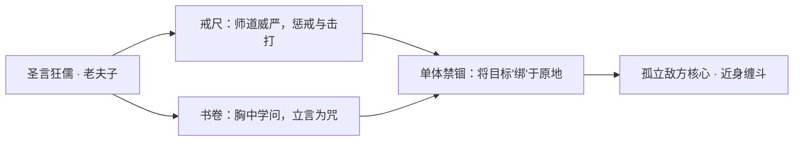

（说明：以上为基于背景设定与公开机制定位的叙事性描述，非游戏内具体数值。）

### 重要事件 / 剧情参与

- **创立稷下学院**：与[庄周](penglai-donghai.md#庄周)、[墨子](mojia-jiguan.md#墨子)共立三贤者之约，于逐鹿通天塔旁创建大陆最高学堂，确立「学术中立、有教无类」的根本宗旨，老夫子位列三贤者之首、主掌武道学院。
- **广收门徒、教化天下**：以师者身份培养了[钟无艳](#钟无艳)、[廉颇](haojing-fengshen.md#廉颇)等亲传弟子；稷下门墙之内，更走出过[诸葛亮](sanfen-shu.md#诸葛亮)、[司马懿](sanfen-wei.md#司马懿)、[周瑜](sanfen-wu.md#周瑜)、[元歌](sanfen-shu.md#元歌)等日后名动大陆的后辈（求学经历，非阵营归属）。
- **稷下日常与同窗共治**：作为三贤者之首，与魔道、机关二脉并立共治，是学院诸多师徒、同窗关系网络的交汇枢纽。

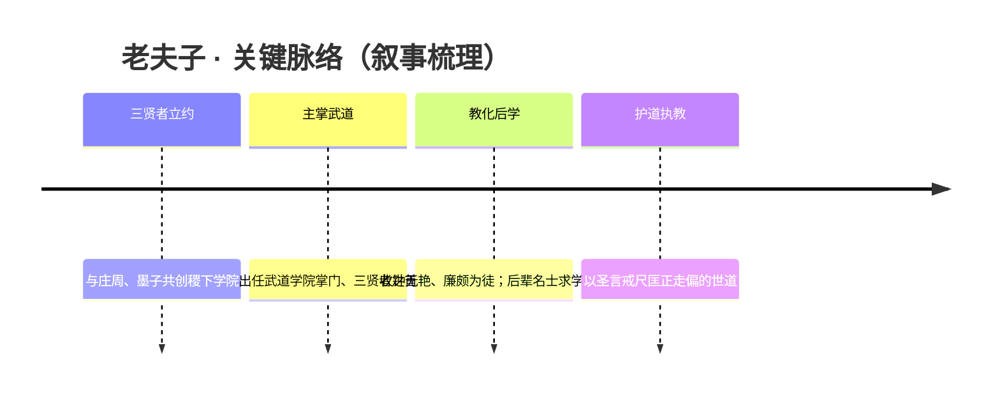

### 羁绊关系

| 对象 | 关系 | 说明 |
| --- | --- | --- |
| [庄周](penglai-donghai.md#庄周) | 创院同窗 / 三贤者之一 | 共立稷下三贤者之约，主掌魔道学院；与老夫子、墨子三派共治学院。 |
| [墨子](mojia-jiguan.md#墨子) | 创院同窗 / 三贤者之一 | 共立三贤者之约，统领机关学院；与老夫子的武道、庄周的魔道并立同源。 |
| [钟无艳](#钟无艳) | 师徒（亲传弟子） | 持锤的齐国女将，老夫子门下弟子；于稷下与同门重逢。 |
| [廉颇](haojing-fengshen.md#廉颇) | 师徒（亲传弟子） | 同为老夫子弟子，与钟无艳互为官配；战场上与钟无艳重逢、于稷下以盟友相聚。 |
| [诸葛亮](sanfen-shu.md#诸葛亮) | 曾求学于稷下 | 蜀地名士，曾在稷下问道；求学经历不改其三分之地的阵营归属。 |
| [司马懿](sanfen-wei.md#司马懿) | 曾求学于稷下 | 魏地枭雄，早年于稷下学习，后归于三分之地·魏。 |
| [周瑜](sanfen-wu.md#周瑜) | 曾求学于稷下 | 吴地俊杰，曾在稷下求学，阵营终系于三分之地·吴。 |
| [元歌](sanfen-shu.md#元歌) | 曾求学于稷下 | 稷下后学之一，后归蜀地阵营。 |

### 经典台词

!!! quote "经典台词"
    "为人师者，当以圣言正天下。"（考据推测）

    "把这道理，给我牢牢记住——绑也要绑回正道上来！"（考据推测）

    "学问之事，岂容尔等亵渎。"（考据推测）

---

## 鬼谷子

<span class="hok-tags"><span class="tag support">辅助</span></span>

**纵横家 · 隐于山谷的谋圣，一言可纵横捭阖、操纵生死流转的开团控制大师。**

| 项目 | 内容 |
| --- | --- |
| 称号 | 纵横家 |
| 定位 | 辅助（强控制 / 开团先手） |
| 所属 | [稷下学院](../factions/jixia.md) |
| 身份 | 纵横家鼻祖、谋略宗师；转生（轮回）之术的研究者 |
| 别称 | 谷子先生、鬼谷先生、谋圣（民间俗称，与 [张良](changan.md#张良) 称号「谋圣」相区分，二者非同一人）(考据推测) |
| 关系 | 三贤者门下同侪/学术同道 [老夫子](#老夫子)、[庄周](penglai-donghai.md#庄周)、[墨子](mojia-jiguan.md#墨子)；稷下学院诸弟子的隔代影响者(考据推测) |
| 登场作品 | 《王者荣耀》本传英雄；多版海报与年节、谋略主题活动 |

### 背景故事

在王者大陆中部的逐鹿地区，[稷下学院](../factions/jixia.md)的高塔与殿宇向四方学子敞开，武道、魔道、机关三派环绕通天塔而立，号称大陆最高学堂。然而真正高明的学问，往往并不悬挂于学宫的牌匾之上，而是隐没在人迹罕至的幽深山谷里。鬼谷子，便是这样一位「隐于谷而名动天下」的人物——纵横家一脉的开山鼻祖，以一张口、一卷书、几枚棋子，便能左右邦国的离合、人心的向背。

「纵横」二字，源自他对世间格局的根本洞见：天下大势如经纬交织，「合纵」可联弱以抗强，「连横」可事强以攻弱，所有的同盟与背叛、信任与算计，皆在他的推演之内。鬼谷子从不亲临沙场厮杀，却被视作比任何统帅都更可怕的存在——因为他改变的不是一场战役的胜负，而是棋盘本身的摆法。在他眼中，列国君主、纵横游士、乃至战阵上的勇将，都不过是局中往来的棋子；而他自己，则是那位坐在山谷阴影里，缓缓落子的执棋人。

鬼谷子最为隐秘、也最令同侪侧目的，是他对「转生之术」（轮回、生死流转之法）的执着钻研(考据推测)。在他看来，一个人的一生太过短促，纵有经天纬地之才，也常常困于肉身的衰朽与一世的局限；唯有勘破生与死的界限，使智慧与谋略在时间的长河里反复回转、不断累积，方能真正穷尽天地之道。他研究魂魄的离合、命数的轮转，试图找到让「局」永不终结、让「执棋人」得以一次次重新入局的方法。正因如此，他的形象始终笼罩着一层介于贤者与方术士之间的暧昧色彩：有人尊他为洞悉天机的圣者，也有人忌惮他玩弄生死、视苍生如棋的冷酷。

他与 [稷下学院](../factions/jixia.md) 的渊源，正建立在这份对「道」的极致追求之上。学院由三贤者——武道学院的 [老夫子](#老夫子)、魔道学院的 [庄周](penglai-donghai.md#庄周)、机关学院的 [墨子](mojia-jiguan.md#墨子)——所共创，标榜有教无类、向各邦各族敞开。鬼谷子身处这片崇尚智识、容纳异说的学术殿堂之中，既是一位令人敬畏的谋略宗师，也是一道与三贤者既呼应又疏离的影子：他不立门户、不收张扬之徒，却以纵横之学的精微，与老夫子的礼法、庄周的逍遥、墨子的兼爱机关，构成了稷下思想光谱中最深沉、最难以揣度的一极(考据推测)。

也因此，鬼谷子的「动机」从来不在于一城一地的得失，甚至不在于辅佐某一位明主登顶。他真正想要看清的，是整片大陆在各个纪元、各方势力此消彼长之间，那条隐藏在乱局深处的「大势之线」。每一次开团、每一次禁锢，对他而言都不只是战术，而是一次对天下棋局的试探与校验——他要在生死往复的推演里，亲眼见证那个最终的、再无人能搅动的「定局」。

### 性格与形象

鬼谷子的性格，是「深」与「静」二字的极致。他极少疾言厉色，言语温缓而意味深长，往往一句看似随意的点拨，背后已藏好三步之后的杀机。他洞察人心如同看一张摊开的棋谱，喜怒哀乐、贪嗔痴念，在他面前几乎无所遁形；正因看得太透，他对世人多了一份近乎悲悯的疏离——既不轻易动怒，也不轻易动心，仿佛永远站在局外，俯瞰众生在他设下的纵横经纬里奔走。

外形上，他被塑造为一位仙风道骨、不辨年岁的隐者形象：身披长袍，须发飘然，眉宇间凝着穿透时光的沉静与睿智。围绕他的核心象征意象有三——**棋局**，喻示他对天下大势的运筹与对人心的摆布；**幽谷**，呼应其「隐于谷而名动天下」的处世姿态，深不可测、藏纳万有；以及**生死轮转**的玄秘气息，与他研究转生之术的设定相互映照，使他在贤者的庄重之外，又笼罩着一层方术士般的诡谲。整体而言，他既有学者的儒雅，又有谋者的冷峻，是稷下群像中最具「智者—术士」双重质感的人物。

### 战斗风格与能力（设定向）

鬼谷子从不以蛮力取胜，他的「战斗」本质上是其纵横之术与生死之学在阵前的具象化。作为 [稷下学院](../factions/jixia.md) 体系下的辅助，他的力量来自**对场面节奏的操纵**而非对单体的斩杀——他是那个决定「战斗在何时、何地、以何种方式开始」的人。

- **纵横捭阖（开团先手）**：呼应「纵横家」之名，他擅长在敌阵立足未稳之际撕开缺口、锁定目标，将原本散乱的对手拽入己方预设的「局」中。这正是其辅助定位的核心——为队友创造确定性的开团时机。
- **群体禁锢（大招意象）**：其最具标志性的能力，是将范围内的多名敌人同时定身、剥夺其行动之力的群体控制(考据推测)。这一招在设定上可视作「执棋人按住棋子」的具象表达——被禁锢者如同被钉死在棋盘格点上，再无腾挪余地，正应了他「一言可定众人生死」的纵横气魄。
- **谋略与转生之力**：其能力底色，与他对轮回、命数的研究一脉相承。无论是对走位的预判、对时机的拿捏，还是那份对「生死流转」的体悟，都让他在阵前如同提前看过整盘棋谱——这并非游戏数值，而是其「谋圣」身份在战斗中的延伸。

```mermaid
mindmap
  root(("鬼谷子 · 纵横家"))
    纵横之术
      "合纵连横（联弱抗强 / 事强攻弱）"
      "开团先手：撕开敌阵缺口"
    群体禁锢
      "范围定身（执棋人按住棋子）"
      "一言定众人进退"
    生死之学
      "转生 / 轮回之术研究"
      "勘破生死、推演命数"
    谋者风范
      "隐于谷而名动天下"
      "视天下为棋局"
```

### 重要事件 / 剧情参与

鬼谷子的「剧情」更多以理念与影响的形式渗透在世界观之中，而非依附于某条线性主线。可考的参与脉络大致如下：

- **纵横家的开宗立派**：作为纵横一脉的鼻祖，他奠定了「合纵连横」之学，使「谋略」本身成为足以与刀兵、魔法、机关并列的「力量」。
- **隐于逐鹿、与稷下学院的呼应**：身处 [稷下学院](../factions/jixia.md) 所在的逐鹿地区，作为谋略宗师与三贤者所代表的武道、魔道、机关三派构成思想上的互文(考据推测)。
- **转生之术的钻研**：贯穿其设定始终的暗线，是对生死轮回的探索，这一动机使他区别于单纯的「军师」型角色，带有方术与玄学色彩。
- **谋略主题活动 / 节庆海报**：在游戏的年节、棋局/谋略主题美术与活动中频繁亮相，强化其「执棋人」「智者」的视觉符号(考据推测)。

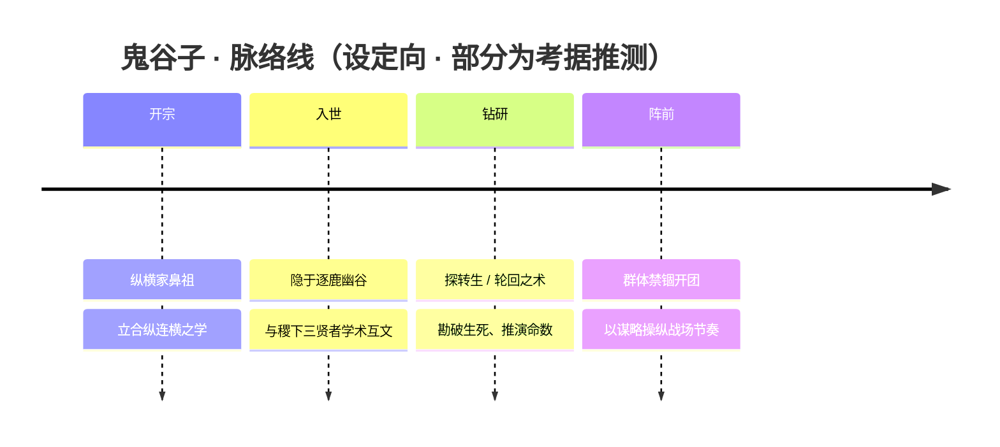

### 羁绊关系

| 对象 | 关系 | 说明 |
| --- | --- | --- |
| [老夫子](#老夫子) | 学术同道 / 同处稷下（考据推测） | 老夫子为三贤者之首、武道学院之主；鬼谷子的纵横谋略与老夫子的礼法之学，同为稷下思想光谱中的重要一极。 |
| [庄周](penglai-donghai.md#庄周) | 学术同道 / 玄理映照（考据推测） | 庄周主魔道学院、主逍遥之道；其超然出世，与鬼谷子隐谷执棋、勘破生死的理念彼此呼应又相异。 |
| [墨子](mojia-jiguan.md#墨子) | 学术同道 / 思想对照（考据推测） | 墨子主机关学院、倡兼爱非攻；与鬼谷子「视天下为棋局」的纵横术，形成「兼爱」与「权谋」的鲜明对照。 |
| [孙膑](#孙膑)、[弈星](#弈星) 等稷下学人 | 隔代影响 / 同阵营（考据推测） | 作为谋略宗师，其纵横、棋局之思在稷下后学（如善布局的弈星、运筹时间的孙膑）身上有遥相呼应的影子。 |

> 注：鬼谷子在官方背景中较少有明确点名的「一对一」羁绊，上述关系多基于其「纵横家鼻祖」「隐于逐鹿、属稷下学院」的设定与同阵营群像作合理勾连，标注「（考据推测）」者请以官方最终设定为准。

### 经典台词

!!! quote "鬼谷子语录（部分为考据推测，以游戏内为准）"
    「合纵连横，皆在我一念之间。」(考据推测)

    「天下，不过是一盘棋；而我，恰好执子。」(考据推测)

    「困住你的，从来不是这方寸之地，而是你看不见的局。」(考据推测)

    「生与死，亦在轮转之中——你以为的终局，或许只是又一次开局。」(考据推测)

---

## 孙膑

<span class="hok-tags"><span class="tag support">辅助</span><span class="tag mage">法师</span></span>

**时之奇旅 · 来自未来的时间旅行者，以加速与护盾守护同伴的星之队成员。**

| 项目 | 内容 |
| --- | --- |
| 称号 | 时之奇旅 |
| 定位 | 辅助 / 法师 |
| 所属 | [稷下学院](../factions/jixia.md) |
| 身份 | 时间旅行者 / 星之队成员 / 稷下学院习者（考据推测） |
| 别称 | 时之旅者、孙先生（考据推测） |
| 关系 | [曜](changan.md#曜)、[西施](baiyue.md#西施)、[蒙犽](yunzhong-modi.md#蒙犽)、[鲁班大师](mojia-jiguan.md#鲁班大师)、[庄周](penglai-donghai.md#庄周) |
| 登场作品 | 星之队系列剧情 / 「归虚梦演大赛」相关活动 |

### 背景故事

孙膑是王者大陆叙事谱系中最特殊的存在之一——他并非从某个固定的纪元、邦国走出来的人物，而是一个不断在时间长河里穿行的旅者。他的称号「时之奇旅」点明了他的本质：奇异的、永无终点的旅程。当其他英雄被牢牢钉在自己的时代——三分之地的战火、长安的繁华、上古的封神——孙膑却以「过客」的姿态游走于一切纪元之间，看尽兴衰，记下因果，却始终不属于其中任何一个当下。

依官方设定，孙膑来自**未来**。他掌握着操纵时间的力量，能够让流速在局部世界里加快或放缓——这并非寻常法术，而是一种近乎本源层面的「时之权能」。正因为见过了未来，他比任何人都清楚：时间的洪流一旦改道，会带来何等不可逆的代价。于是他选择了一条克制而温柔的路——不去改写历史的主干，而是在关键的节点上，给身边奔跑的人多一点速度、多一层护盾，让他们能在自己的时代里走得更远一些。这是一个掌握着巨大力量、却把力量用在「守护」而非「征服」上的旅者。

孙膑与**稷下学院**的渊源，源于这座大陆上「最高学堂」的特殊气质。稷下学院环绕通天塔而立，是有教无类、向各邦各族开放的学术中立殿堂，分武道、魔道、机关三派，由三贤者老夫子、[庄周](penglai-donghai.md#庄周)、[墨子](mojia-jiguan.md#墨子)创立。对一个穿越时空、求索万象的旅者而言，没有哪个地方比这座汇聚了大陆全部智慧与上古遗迹科技的学院更适合驻足。孙膑也因此被归入稷下学院谱系——既是知识的求索者，也是时间这门「学问」的活体范本。（孙膑确切的入学与师承关系，官方着墨不多，此处为考据推测。）

孙膑命运中真正的转折，发生在他遇见**星之队**之时。少年[曜](changan.md#曜)以李白为偶像，在稷下组建了一支队伍，参加[庄周](penglai-donghai.md#庄周)主持的**「归虚梦演大赛」**——一场在梦境与虚境之间展开的盛大演武。这支队伍里有渴望成为英雄的曜、有[西施](baiyue.md#西施)、有[蒙犽](yunzhong-modi.md#蒙犽)、有机关秘术的传人[鲁班大师](mojia-jiguan.md#鲁班大师)，而孙膑，是他们当中最年长、最沉稳、也最懂得「时间意味着什么」的那一位。对一群想要奋力奔跑的年轻人来说，孙膑的存在恰如其分——他不抢风头，只是默默地为同伴加速、为同伴托起护盾，让他们的青春跑得更快、跌倒得更轻。

在星之队的旅途中，孙膑既是辅助者，也是引路人。他见过太多结局，因而格外珍视「过程」本身；他知道这群少年终将各自奔向不同的纪元与命运，却仍愿意陪他们走完这一程，把友谊、能量与自我认知留在每个人心里。某种意义上，孙膑的动机从来不是改变世界，而是**陪伴那些试图改变自己的人**——这正是「时之奇旅」最温柔的注脚。

### 性格与形象

孙膑的性格底色是**沉静、豁达而略带超然**。作为见惯了时间起落的旅者，他很少为眼前的胜负患得患失，言语间常有种看透世事的从容与一点点善意的促狭。他不爱说教，却总在关键时刻递出最恰当的帮助；他像一位永远走在队伍后方、却让所有人安心的长者，又像一个怀揣秘密、含笑不语的旅人。

在外形与象征意象上，孙膑的设计紧扣「**时间**」这一核心母题。他的形象常与**齿轮、时钟、流沙、星轨、漏斗**等元素相关联——这些都是「时间流逝」最直观的视觉符号。其手持的器具被塑造为操控时之权能的法器，加速与减速的法术施放时往往伴随光带、刻度与流转的轨迹。整体气质上，他既有学者的儒雅，又有旅人的洒脱，是一个把「岁月」二字写在身上的角色。（具体外形细节随皮肤而异，此处为意象层面的概括。）

### 战斗风格与能力（设定向）

孙膑的力量本源是**对时间流速的操控**。这并非攻击性的法术，而是一种「调律」——他能让己方的时间走得更快，让同伴的脚步、招式与回复都随之加速；也能在危急关头以时之权能凝结成**护盾与免伤**，把同伴从致命的瞬间里「捞」出来。正因如此，他在战场上的定位是「**辅助 / 法师**」：既能用时之力为队友赋能、提速、保命，也能将凝聚的时之能量化作具有杀伤的法术爆发。

他的战斗哲学完全服务于「守护」——不以一己之力碾压敌阵，而是让身边每一个人都变得更强、更快、更难被击倒。这种「我退一步，让你们冲得更远」的作战方式，与他「时之奇旅」的人生态度高度一致：力量越大，越要克制；越是看过结局，越懂得守护过程。

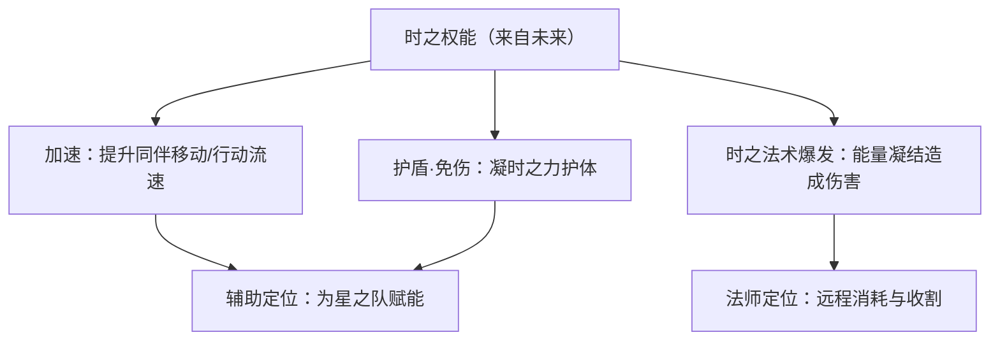

> 说明：以上为基于「时间操控」背景设定的能力描述，非游戏内具体技能数值；招式名称随版本可能调整，故以效果意象呈现。

### 重要事件 / 剧情参与

- **加入星之队**：响应[曜](changan.md#曜)的召集，与[西施](baiyue.md#西施)、[蒙犽](yunzhong-modi.md#蒙犽)、[鲁班大师](mojia-jiguan.md#鲁班大师)组成星之队，担任队伍中沉稳的辅助与引路者。
- **归虚梦演大赛**：参加由[庄周](penglai-donghai.md#庄周)主持、于梦境/虚境展开的演武盛会，与队友共同经历挑战，收获友谊、能量与自我认知。
- **时间长河的过客**：以时间旅行者身份游走于王者大陆的不同纪元，见证而不轻易干预历史，把守护留给身边奔跑的人。

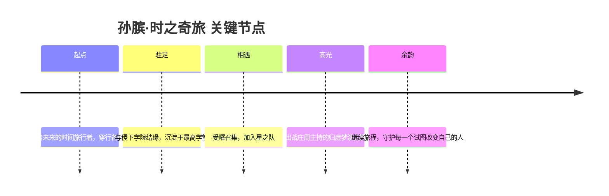

### 羁绊关系

| 对象 | 关系 | 说明 |
| --- | --- | --- |
| [曜](changan.md#曜) | 战友 / 队友（星之队） | 星之队由以李白为偶像的曜召集组建，孙膑是其中最沉稳的辅助与引路人。 |
| [西施](baiyue.md#西施) | 战友 / 队友（星之队） | 同为星之队成员，并肩出战归虚梦演大赛。 |
| [蒙犽](yunzhong-modi.md#蒙犽) | 战友 / 队友（星之队） | 同为星之队成员，孙膑以加速与护盾为其火力护航。 |
| [鲁班大师](mojia-jiguan.md#鲁班大师) | 战友 / 队友（星之队） | 同为星之队成员，机关秘术与时之权能在战场上相互呼应。 |
| [庄周](penglai-donghai.md#庄周) | 赛事主持 / 三贤者之一 | 庄周主持归虚梦演大赛，是孙膑与星之队登场的舞台缔造者，亦为稷下创院三贤者。 |
| [稷下学院](../factions/jixia.md) | 所属 / 求索之地 | 有教无类的最高学堂，是这位时间旅者驻足求索、与星之队结缘的所在。 |

### 经典台词

!!! quote "孙膑 · 语音台词（考据推测）"
    "时间，从不等人——但我可以让你跑得更快。"
    
    "见过太多结局，才更想守护眼前的过程。"
    
    "别急，旅途还长，我陪你们走完这一程。"

> 注：以上台词为贴合「时之奇旅」人设的考据推测式呈现，并非逐字引用官方语音；具体台词以游戏内实际语音为准。

### 皮肤故事亮点

孙膑的皮肤系列大多围绕「时间」与「旅程」做延展——或将其塑造为穿梭于科幻未来的时空旅人，或赋予其与节庆、星辰相关的造型，呼应他「奇旅」的称号。其中作为**星之队**主题角色登场的形象，最能体现他在队伍中「沉稳辅助、温柔守护」的定位。（各皮肤具体故事随版本而异，详情以游戏内描述为准，此处为亮点概述。）

---

## 安琪拉

<span class="hok-tags"><span class="tag mage">法师</span></span>

**魔法少女 · 体内寄宿大魔法师梅林、以魔导书操纵火焰与黑暗之力的少女法师**

| 项目 | 内容 |
| --- | --- |
| 称号 | 魔法少女 |
| 定位 | 法师 |
| 所属 | [稷下学院](../factions/jixia.md)（魔道学院一脉）（考据推测） |
| 身份 | 学习魔法的少女，体内寄宿着大魔法师「梅林」的灵魂与力量 |
| 别称 | 小魔女、火焰少女（民间昵称） |
| 关系 | [亚瑟](changan.md#亚瑟)（仰慕对象 · 皮肤CP）、[嬴政](changan.md#嬴政)（同一世界观下的玄雍/长安人物） |
| 登场作品 | 《王者荣耀》本传；衍生活动剧情、CP皮肤系列 |

### 背景故事

安琪拉是王者大陆上一个对魔法充满憧憬的少女。她出身平凡，却从小展现出对神秘力量的强烈感知与近乎执拗的好学之心——在一个魔法与武道、机关科技并存的世界里，她选择了最难也最危险的一条路：成为一名真正的魔法师。（考据推测：其求学之途与稷下学院魔道一脉的渊源相关，稷下学院由三贤者创立，其中[庄周](penglai-donghai.md#庄周)所主持的魔道学院正是大陆魔法传承的中枢之一。）

安琪拉命运的真正转折，源于一位远古的大魔法师——**梅林（Merlin）**。梅林是传说中曾叱咤一个时代的强大魔导师，其名字本身就承载着「最伟大的魔法」这一象征。当安琪拉因机缘巧合（或因一场危机）与梅林的灵魂/魔力产生联结后，这位古老法师的力量便寄宿于她幼小的身躯之中。自此，安琪拉不再是单纯的学徒——她既是承载者，也是被守护者；梅林的智慧、记忆与魔力在她体内沉睡又苏醒，使她能够驾驭远超年龄的火焰与黑暗法术。

这一「寄宿」的设定，是理解安琪拉一切行为动机的钥匙。她手中那本厚重的**魔导书**，并非寻常法器，而是梅林之力的封印与媒介；书页翻动之间，是两个灵魂跨越纪元的对话。少女稚嫩的外表下，潜藏着一位古老魔法师的全部造诣——这种「童颜与远古之力」的强烈反差，构成了「魔法少女」称号最核心的叙事张力。

在世界观的脉络中，安琪拉与**亚瑟**之间有着一段令人莞尔又略带怅惘的羁绊。寄宿于安琪拉体内的梅林，在传说原型里本就是亚瑟王（圆桌骑士之王）的导师与挚友（考据推测：取材自亚瑟王传说中梅林与亚瑟的经典关系）。在《王者荣耀》的演绎中，安琪拉对[亚瑟](changan.md#亚瑟)怀有深切的倾慕之情，这份情感既可能源于少女本心，也可能掺杂了梅林对那位「王」跨越时空的牵挂。官方为二人推出过多套CP主题皮肤，使「安琪拉仰慕亚瑟」成为玩家社群中广为流传的浪漫线索——尽管这段关系更接近「仰慕者与被仰慕者」，且亚瑟剧情向的另一条CP指向[艾琳](shanggu-shenhua.md#艾琳)，故此线在考据上仍存争议。

总体而言，安琪拉的故事是一则关于「成长」与「传承」的寓言：一个普通少女，因承接了一份远古的、沉重的力量，而被推上了她原本无从想象的命运舞台。她要学会的不只是咒语与火焰，更是如何与体内那个古老灵魂共处，如何在「自己」与「梅林」之间找到平衡，最终成为一名独当一面、名副其实的魔法师。

> 提示：安琪拉是《王者荣耀》早期上线的经典法师之一，官方对其完整线性背景的硬性设定较为简略，本传以「魔法少女 + 梅林寄宿」为核心意象。以上叙事在保留官方既有意象（梅林、魔导书、火焰、对亚瑟的仰慕）的基础上做了合乎世界观的串联，涉及推断之处均已标注「(考据推测)」。

### 性格与形象

安琪拉的性格是「魔法少女」类型的典范——**天真、热忱、努力，又带着一丝倔强与对力量的渴望**。她乐观开朗，对世界与魔法都怀有孩童般的好奇；面对强敌时却毫不退缩，会鼓起勇气挥动魔导书施展全力。这份「外柔内刚」让她在一众或老成、或冷峻的稷下法师之中显得格外鲜活。

在外形上，安琪拉是典型的低龄魔法少女形象：

- **服饰**：尖顶魔法师帽、披风/斗篷、配色明快的法袍，整体造型呼应西方童话里的小巫女意象。
- **魔导书**：随身漂浮或手持的厚重古书，书页常伴有魔法符文与微光，是其身份与力量的最直接标志。
- **象征意象**：火焰（热情与攻击）、星光/魔法阵（咒术）、以及隐约浮现的「梅林之影」——少女与古老法师双重存在的视觉暗示。

她身上凝聚的核心象征，是**「弱小躯壳承载强大力量」**的反差美学：稚气未脱的少女，却能召唤足以焚尽一切的火焰与黑暗，这正是「魔法少女」这一称号最动人的地方。

### 战斗风格与能力（设定向）

安琪拉是一名以**法术爆发**见长的远程法师。她的力量来源并非自身修为，而是**梅林寄宿之力**经由魔导书释放——少女吟唱、古老灵魂赋能，二者合一方能成咒。

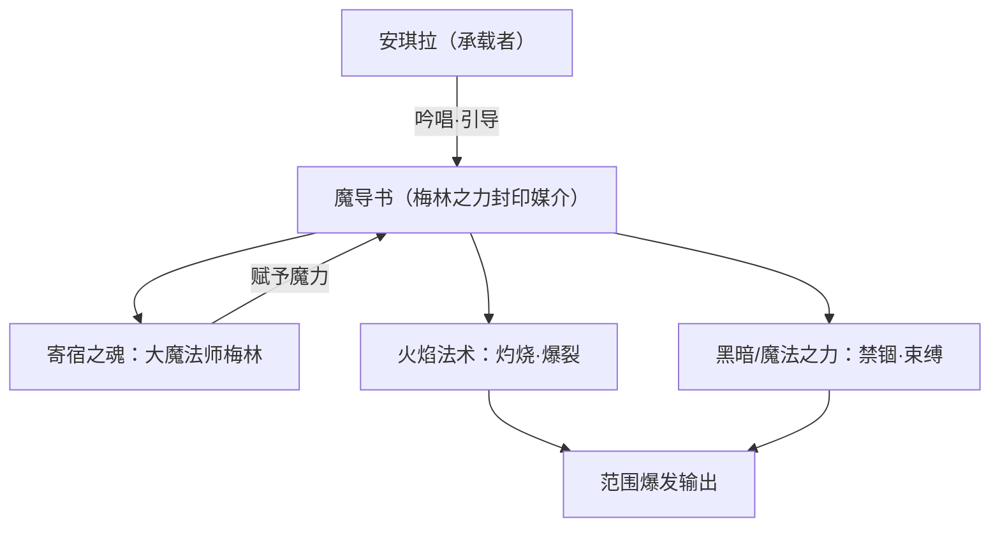

其能力设定与意象大致包括：

- **魔导书引导**：以书为核心施法器，所有法术皆经书页符文催发，象征对梅林之力的「调用」而非「本能」。
- **火焰系法术**：召唤、投掷、引爆火焰，进行持续灼烧与瞬时爆发——火焰是安琪拉最具辨识度的攻击手段（设定向，非游戏数值）。
- **黑暗 / 束缚之力**：以魔法之线或符文束缚敌人，限制其行动，为后续火焰爆发创造机会。
- **梅林之名的绝技**（考据推测）：在力量全开时，少女短暂显现梅林的影子，施展超越常规的强力法术，呼应「最伟大的魔法师」这一原型。

战斗中，她依赖站位与时机：先以束缚锁敌，再以火焰倾泻。她是典型的「后排核心」——脆弱却拥有改变战局的爆发力，正如她本人——柔弱外表下藏着古老而磅礴的魔力。

### 重要事件 / 剧情参与

- **梅林寄宿**：人生转折点，自此承载古老魔法师之力，踏上真正的魔法师之路（核心背景设定）。
- **与亚瑟的羁绊线**：在多套CP主题皮肤与活动叙事中，反复呈现安琪拉对[亚瑟](changan.md#亚瑟)的仰慕，是其情感线的主轴（考据推测·存争议）。
- **CP皮肤系列**：官方围绕「安琪拉 × 亚瑟」推出多套对应主题皮肤，构成玩家熟知的浪漫叙事载体。

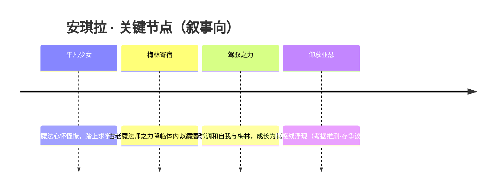

> 说明：安琪拉以「玩法经典、背景写意」著称，官方未给出长篇线性剧情，上述节点为依据既有意象梳理的叙事脉络。

### 羁绊关系

| 对象 | 关系 | 说明 |
| --- | --- | --- |
| [亚瑟](changan.md#亚瑟) | 仰慕 · 皮肤CP（存争议） | 安琪拉对亚瑟怀有倾慕；官方多套CP皮肤认证。剧情更近「仰慕者—被仰慕者」，且亚瑟剧情向CP一说指向艾琳，故存争议。寄宿其体内的梅林，在原型传说中本是亚瑟王的导师与挚友（考据推测）。 |
| 梅林（寄宿之魂） | 共生 · 力量之源 | 大魔法师梅林的灵魂与魔力寄宿于安琪拉体内，既是她力量的来源，也是其「魔法少女」身份的根基。 |
| [庄周](penglai-donghai.md#庄周) | 魔道渊源（间接·推测） | 稷下学院魔道学院由庄周主持，是大陆魔法传承中枢；安琪拉的魔法之路或与这一脉络相关（考据推测）。 |
| [嬴政](changan.md#嬴政) | 同世界观人物 | 同处长安/玄雍世界观线索之下的人物，虽无直接交集，但同属大陆魔法与权势交织的舞台。 |

### 经典台词

!!! quote "安琪拉 · 台词集"
    “要被我的火焰净化吗？”（考据推测）

    “魔法，是最伟大的力量！”（考据推测）

    “亚瑟哥哥，看我的厉害！”（考据推测）

    “梅林，借我一点力量吧。”（考据推测）

### 皮肤故事亮点

- **CP主题皮肤（安琪拉 × 亚瑟）**：官方围绕二人羁绊推出的系列皮肤，以「魔法少女仰慕骑士之王」为情感母题，将安琪拉对亚瑟的倾慕具象化，是其形象在玩家社群中最深入人心的呈现（具体皮肤命名与剧情细节以官方为准）。
- **其余主题皮肤**：安琪拉的皮肤多沿「魔法少女」可爱、梦幻路线发展，强化其「稚气少女 + 古老魔力」的反差美学。

---

## 干将莫邪

<span class="hok-tags"><span class="tag mage">法师</span></span>

**一念神魔 · 以身祭剑、一分为二的铸剑师夫妇——干将化剑、莫邪化魂的远程范围爆发法师。**

| 项目 | 内容 |
| --- | --- |
| 称号 | 一念神魔 |
| 定位 | 法师（远程范围爆发） |
| 所属 | [稷下学院](../factions/jixia.md) |
| 身份 | 铸剑师（夫妇二人合一）／稷下魔道学院相关之器物之灵（考据推测） |
| 别称 | 「双剑」「干将」「莫邪」（一人二名、一念两面） |
| 关系 | [庄周](penglai-donghai.md#庄周)、[墨子](mojia-jiguan.md#墨子)、[老夫子](#老夫子)、[安琪拉](#安琪拉) |
| 登场作品 | 王者荣耀（手游本传，稷下学院系列英雄） |

> 注：「一念神魔」这一称号在《王者荣耀》中亦为长安英雄 [李信](changan.md#李信) 所用。二者称号同名、立意相通（皆为「一念之间，神魔殊途」的二元命题），但角色与背景互不相干，请勿混淆。（考据提示）

### 背景故事

干将莫邪并非两个人，也并非一个人——他是一段以血肉与执念封入剑身的传说，是「以身铸剑」这一古老命题在王者大陆上最极致、也最哀切的回响。

相传，干将与莫邪本是一对铸剑师夫妇。干将以锻造名动天下，莫邪则是他相濡以沫的妻子。在那个诸侯纷争、神兵难求的时代，他们受命铸造一对足以镇国的旷世名剑。然而炉火熊熊、千锤百炼之下，剑胚始终不肯凝合——金铁有灵，唯有以生命献祭，方能令神兵真正「活」过来。莫邪明白了这其中的代价。于是，在那个决定命运的夜晚，她纵身投入了灼热的剑炉，以自身的血肉、心跳与魂魄作为最后一味「剑引」，让干将之名得以在剑刃上永世长鸣。（此即「干将莫邪」典故之核心，源出中国古代铸剑传说。）

自此，干将与莫邪不再是夫与妻，而成为「剑」与「魂」的合体：干将化为剑，莫邪化为附于剑上的执念与温度。两人合而为一，从此再不分离，却也从此再不能以人的形貌相拥。这正是「一念神魔」这一称号的来由——一念之间，是神是魔，是守护是毁灭，是深情还是执妄，全在那挥剑出鞘的一瞬。当他召唤出漫天剑阵、令长剑如雨般倾泻而下时，那既是铸剑师对技艺的极致呈现，也是一个被命运拆散、却又被命运永远焊在一起的灵魂，对世间发出的无声呐喊。（人物内核基于官方设定与典故的叙事化呈现）

在王者大陆的版图中，干将莫邪被归入 [稷下学院](../factions/jixia.md) 一脉。稷下学院坐落于大陆中部的逐鹿地区，环绕通天塔而建，由三贤者——[老夫子](#老夫子)、[庄周](penglai-donghai.md#庄周)、[墨子](mojia-jiguan.md#墨子)——共同创立，下分武道、魔道、机关三派，是一座有教无类、向各邦各族开放的学术殿堂。在这里，武道与魔法并存，上古遗迹的科技与先贤的智慧交相辉映。一对以血肉与执念铸成、游走于「人」与「器」之间的活体神兵，正契合稷下「魔道学院」对灵魂、器物与超凡之力的探究方向（魔道一脉与器灵的关联为考据推测）。无论是作为被研究的奇迹、被守护的遗珍，还是自愿驻足于学堂以求解脱之道的过客，干将莫邪的存在本身，就是稷下「学术中立、包容万象」精神的一道注脚。

而支撑这段传说运转的，是一种近乎执念的「不分离」——莫邪以命换剑，干将以剑承魂；他们失去了凡人的形体与寻常的相守，却换来了另一种意义上的永恒。这份「为爱献祭、合二为一」的母题，让干将莫邪在群星璀璨的王者大陆上，始终散发着一缕区别于权谋与征伐的、属于「情」与「念」的幽光。

### 性格与形象

干将莫邪的「性格」，本身就是一组矛盾而和谐的二重奏。

干将沉稳、专注、近乎偏执地追求剑道的极致；他寡言，却以剑代言——每一道剑光都是他锻造一生的回答。莫邪温柔而决绝，她的牺牲不是冲动，而是深思熟虑后最坚定的深情；化为剑魂之后，她成了那柄冷硬长剑里最温暖的一抹余温，是「神兵」之所以仍有「人心」的全部理由。二者合一，于是有了「一念神魔」——理智与情感、克制与狂放、守护与毁灭，在同一具身躯里彼此撕扯，又彼此成全。

在视觉意象上，干将莫邪的核心符号是「剑」与「剑阵」：以一柄主剑为引，召唤出漫天悬浮的长剑，剑尖齐齐指向大地，于一念之间倾泻而下。这种「万剑归一、又一化为万」的画面，正是「合二为一」的执念在战斗中的具象化。其象征意象包括——熔炉与剑炉（献祭与新生）、双生与一体（夫妻合魂）、悬于半空待落的剑雨（蓄势而发的深情与杀意）。整体气质冷峻、华丽而带着挥之不去的悲剧底色：越是绚烂的剑光，越是映照出那个永不能复原的、关于「人」的缺憾。

### 战斗风格与能力（设定向）

作为一名远程范围爆发法师，干将莫邪的全部力量都源于那段「以身祭剑」的传说本身——他的武器不是别的，正是「他自己」：莫邪之魂寄于干将之剑，二者合一，便能召唤出超越凡铁的剑阵。

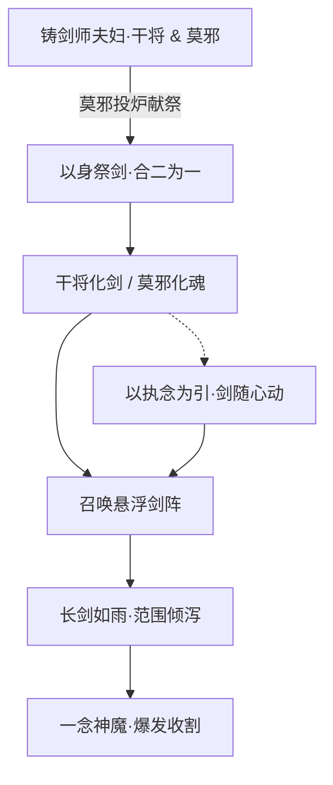

- **以身为兵**：干将莫邪不持外物，剑即是他、他即是剑。莫邪化作的剑魂赋予冷硬长剑以「心」，使其招式既有铸剑技艺的精准，又有情感执念驱动的爆裂。
- **剑阵·万剑齐落**：其标志性的力量是凭空召唤悬浮于半空的长剑群，剑尖指地、蓄势待发，于一念之间齐齐落下，覆盖大片区域。这正是「合二为一」的执念外化——一柄主剑引出漫天分身，再由万剑归于一念。（招式以背景设定与视觉表现描述，非游戏数值）
- **一念之爆**：「神」与「魔」的抉择，体现在出剑的那一瞬：是收，是放，是守护身后之人，还是毁灭眼前之敌。其战斗节奏强调「蓄」与「发」、布阵与收割，是典型的远程范围爆发法师路数。

### 重要事件 / 剧情参与

干将莫邪的叙事重心在于其**铸剑传说本身**，而非具体的征战编年。其关键节点可勾勒如下：

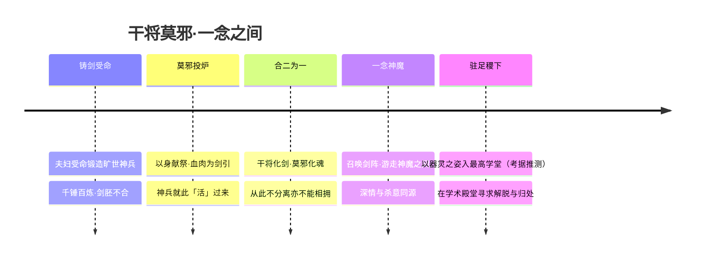

- **铸剑献祭传说**：核心剧情，奠定其「以身祭剑、合二为一」的人物内核（源出中国古代干将莫邪铸剑典故）。
- **稷下学院归属**：作为稷下学院系列英雄，其背景与逐鹿地区的最高学堂、魔道一脉的器灵探究相呼应（具体在校剧情为考据推测）。

> 说明：干将莫邪较少出现在大型联动动画或主线战役的核心叙事中，其魅力主要来自人物设定与典故本身。涉及具体活动、剧情动画的硬性细节若无官方明文，均不臆造。（考据提示）

### 羁绊关系

| 对象 | 关系 | 说明 |
| --- | --- | --- |
| 干将 ⇆ 莫邪 | 夫妻 · 合二为一 | 同一英雄的两面：莫邪投炉献祭，化为剑魂；干将化作长剑承魂。失去凡人形体，换来永不分离——「一念神魔」的全部根源。 |
| [老夫子](#老夫子) | 同阵营 · 创院三贤者之首 | 稷下学院由老夫子等三贤者创立、有教无类，是干将莫邪所属学堂的奠基者。 |
| [庄周](penglai-donghai.md#庄周) | 同源学院 · 魔道学院创立者 | 三贤者之一、魔道学院之主；干将莫邪的器灵属性与魔道一脉的探究方向相契（关联为考据推测）。 |
| [墨子](mojia-jiguan.md#墨子) | 同源学院 · 机关学院创立者 | 三贤者之一；与魔道、武道共构稷下三派，同为干将莫邪所在学堂的支柱。 |
| [安琪拉](#安琪拉) | 同阵营 · 同窗法师 | 同属稷下学院的法师；安琪拉体内寄宿魔法师梅林，二人皆是「人与超凡之力共生」母题的不同演绎。 |
| [李信](changan.md#李信) | 称号同名 · 主题呼应 | 二者共享「一念神魔」之号，皆扣「神魔一念之间」的二元命题，但角色与背景各自独立、互不相干。（考据提示） |

### 经典台词

!!! quote "干将莫邪 · 经典台词"
    「以身铸剑，一念神魔。」（考据推测）

    「干将化剑，莫邪化魂——我们，从此不分离。」（考据推测）

    「神也好，魔也罢，不过是出剑前的一念之差。」（考据推测）

> 台词均依据人物核心设定（以身祭剑、合二为一、一念神魔）作叙事化提炼，凡无法逐字对照官方文本者均标注「(考据推测)」。

---

## 高渐离

<span class="hok-tags"><span class="tag mage">法师</span></span>

**乐神 · 以音律为刃、为爱亡命的范围爆发法师**

| 项目 | 内容 |
| --- | --- |
| 称号 | 乐神 |
| 定位 | 法师 |
| 所属 | [稷下学院](../factions/jixia.md) |
| 身份 | 流亡乐师 / 击筑高手 / 以乐入道的奏乐者 |
| 别称 | 「乐神」「亡命的乐者」（坊间称谓，考据推测） |
| 关系 | [阿轲](jianghu-xiake.md#阿轲)（恋人，官方背景）、[干将莫邪](#干将莫邪)（同窗稷下，考据推测） |
| 登场作品 | 《王者荣耀》本传；稷下学院相关背景设定 |

### 背景故事

高渐离的名字，最初并不与「神」相连。他只是逐鹿地区一名籍籍无名的乐师，怀抱一把名为「筑」的古乐器，行走于市井与酒肆之间，以一曲换一餐，以一夜换一程。在那个邦国林立、刀兵不息的纪元里，乐声是廉价的、易被踩碎的东西——可对高渐离而言，那是他唯一愿意托付一生的语言。他相信，再坚硬的甲胄也挡不住一段直抵人心的旋律，再深的仇恨也能被一支恰到好处的曲子暂时熨平。这种近乎天真的信念，让他在乱世中显得格格不入，也让他后来的转身格外沉重。

改变他一生的，是一场灭门之祸。荆氏一族遭遇血洗，唯一的幸存者——身负重伤、奄奄一息的少女[阿轲](jianghu-xiake.md#阿轲)——倒在了高渐离面前。彼时他本可以像其他人一样转身离去，乐师没有义务卷入豪族的恩怨与刺客的血债。但他没有。他收留了她，为她疗伤，把她从死亡的边缘一点点拉回人间。在那段相依为命的日子里，奏乐者与刺客这两种本不该有交集的命运被缝合在了一起：她以刃为信念，他以乐为信念；她背负着复仇，他背负着她。救命之恩渐渐发酵成更深的羁绊，他们成了彼此的恋人，也成了彼此唯一的退路。（上述为官方背景故事）

然而乱世不会因为一段感情而停下脚步。阿轲身负血海深仇，注定要走上一条不归的路；而高渐离一旦选择与她同行，便也将温和的乐者身份，连同那把本应只用来抚慰人心的筑，一并推向了刀光剑影。他学会了让乐声不再只是抚慰，而是化作武器——音浪能震碎砖石，旋律能撕裂空气，一支曲子奏到极处，足以让逼近的追兵血脉贲张、心神俱裂。从此他不再只是「乐师」，江湖与坊间开始以「乐神」称之：那是对一位将艺术推向极致、又以这极致为爱杀伐的人的敬畏与叹息。

关于他与稷下学院的关联，更多见于阵营层面的归类——逐鹿地区的[稷下学院](../factions/jixia.md)由三贤者所立，是大陆的学术殿堂，有教无类、向各邦各族开放，魔法与武道在此并存。高渐离这般「以乐入道、自成一家」的奇才，被归入稷下这座汇聚百家、不问出身的最高学堂，亦在情理之中（其在稷下的具体经历，目前缺乏明确官方叙述，考据推测）。无论身处何地，他真正的「学院」始终只有一座——那便是阿轲身边。为彼此而战，亡命天涯，是这对恋人共同书写的命运注脚。

### 性格与形象

高渐离的底色是温柔。他本性近乎一个理想主义者，相信音乐能够沟通、能够治愈、能够在最冷的夜里给人一点暖意——这份温柔，正是他当年甘愿救下重伤陌生人的根由。但温柔之下，藏着不容动摇的执拗：一旦认定了要守护的人，他便会把整个自己——连同那把本只为美而生的乐器——毫无保留地押上赌桌。

外形上，他通常以浪迹江湖的乐者形象示人，怀抱古筑，气质介于风流书生与亡命之徒之间。象征意象集中在「乐」与「弦」：跃动的音符、扩散的声波、被旋律具象化的冲击波，构成了他视觉与战斗上的核心母题。当他拨动琴弦时，飞散的不再只是音符，而是足以摧城的力量——这种「至柔之物化为至刚之刃」的反差，正是「乐神」这一称号最动人的张力所在。

### 战斗风格与能力（设定向）

高渐离的全部战斗哲学，都凝结在那把名为「筑」的古乐器上。筑是一种以竹尺击弦发声的古老乐器，在他手中却被赋予了远超乐音的力量——他以乐入武，将旋律与节拍转化为可见、可触、可致命的音波。

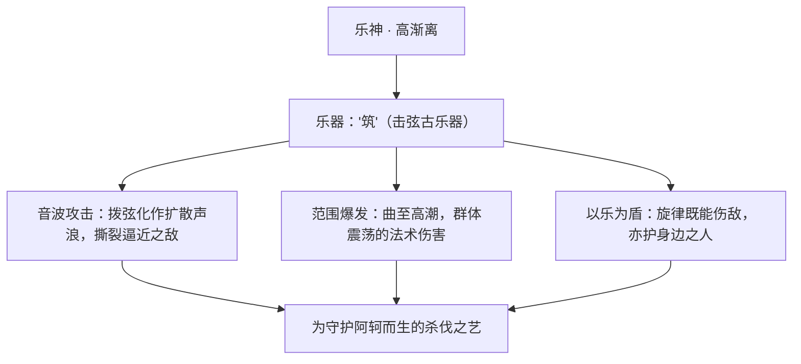

其招式来历，皆可追溯到「乐」这一根本：寻常的拨弦弹奏，被他锤炼为持续输出的音浪攻击；而当乐曲推向最激越的高潮时，积蓄的声波会向四周猛然炸开，形成大范围的爆发伤害。在游戏定位上，他是一名典型的范围爆发法师——以群体音波杀伤为长，越是敌众我寡、越是被层层围困之时，他那「四面楚歌」般的乐声反而越发凌厉（以上为基于背景与定位的设定向描述，非游戏数值）。

值得一提的是，他的力量并非天生神授，而是由一名温和乐师在绝境中「逼」出来的——为了能在阿轲身边活下去、并护她周全，他亲手把自己最珍视的美，磨成了刀锋。这层「不得不」的底色，使他的每一次奏乐都带着悲怆。

### 重要事件 / 剧情参与

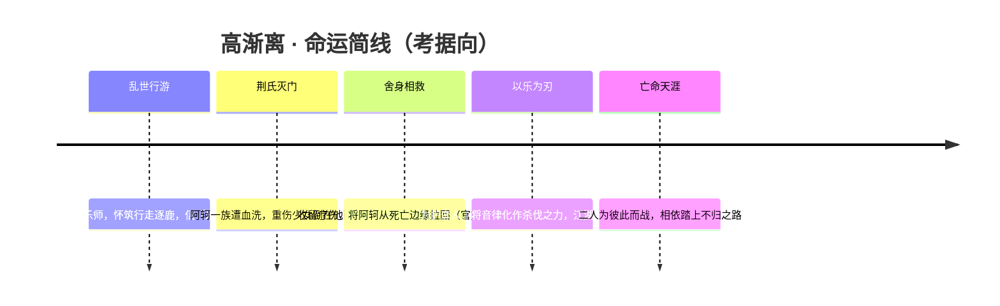

- 核心剧情：与[阿轲](jianghu-xiake.md#阿轲)的相救与相守，是其登场背景的主线，亦是《王者荣耀》中知名的英雄羁绊之一。
- 阵营归属：被纳入[稷下学院](../factions/jixia.md)（学院 · 机关）序列，作为以法术输出见长的法师成员之一。
- （其余具体活动/动画/外传的参与情况，目前缺乏明确公开资料，暂以待考——考据推测）

### 羁绊关系

| 对象 | 关系 | 说明 |
| --- | --- | --- |
| [阿轲](jianghu-xiake.md#阿轲) | 恋人（官方背景） | 荆氏灭门后，阿轲重伤被高渐离所救；二人为彼此而战、亡命天涯，是官方认证的背景故事羁绊。 |
| [干将莫邪](#干将莫邪) | 同窗 / 同阵营法师（考据推测） | 同列稷下学院的法师，皆以「化身为器」「以情入艺」为命运母题，可作并置参照。 |
| [稷下学院](../factions/jixia.md) | 所属阵营 | 逐鹿地区的最高学堂，有教无类、魔武并存，收纳如高渐离这般自成一家的奇才。 |

### 经典台词

!!! quote "高渐离 · 语录"
    「为了你，我可以与全世界为敌。」（考据推测）

    「我的乐声，只为一个人而奏。」（考据推测）

    「听好了——这一曲，是送给你们的葬歌。」（考据推测）

---

## 扁鹊

<span class="hok-tags"><span class="tag mage">法师</span></span>

**疫·杀医 · 以毒续命、以死渡人的瘟疫医师**

| 档案项 | 内容 |
| --- | --- |
| 称号 | 疫·杀医 |
| 定位 | 法师（中毒消耗 / 持续灼烧） |
| 所属 | [稷下学院](../factions/jixia.md)（魔道学院旁支 · 医毒研究，考据推测） |
| 身份 | 游走于王者大陆的瘟疫医师、毒术与生死之学的钻研者 |
| 别称 | 杀医、毒医、瘟医（民间俗称，考据推测） |
| 关系 | [东皇太一](#东皇太一)、[庄周](penglai-donghai.md#庄周)、[孙膑](#孙膑)（同探生死/医道，考据推测） |
| 登场作品 | 《王者荣耀》本传；万圣节"疫·杀医"主题活动皮肤剧情 |

### 背景故事

扁鹊原是一位真心想救人的医者。在那个被战乱、饥荒与瘟疫反复碾过的纪元，他背着药箱走过一座又一座染病的城镇，把脉、施针、煎药，却眼睁睁看着病人一个接一个在他面前咽气。最让他无法忍受的，不是病，而是人——他发现，比瘟疫更致命的是人心：囤药的奸商、弃城而逃的官吏、把垂死之人赶出城门以"保全大局"的权贵。无数次，他治好的人转头就死在了同类的刀下与冷漠里。

久而久之，他对"治病救人"这件事产生了一个近乎癫狂的怀疑：如果一具躯体里住着的灵魂早已腐烂，那么救活这具躯体，究竟是行善，还是延长罪恶？正是从这一念之差开始，扁鹊走上了与传统医道相反的歧路。他不再问"如何让人活",而是开始研究"如何让人以最'干净'的方式死去"——在他扭曲的逻辑里，毒，成了一种最温柔也最公正的"药"。瘟疫不分贵贱、不论善恶地带走所有人，在他看来，这反而是一种残酷的平等。(考据推测：游戏对扁鹊"由医入毒"的黑化设定多见于皮肤主题与社区考据，具体官方正史描述较为简略。)

被毒与疫缠身的扁鹊，渐渐成了一个矛盾的存在：他依旧穿着医者的衣袍、提着医者的药箱、保留着医者的手法，可药箱里装的不再只是救命的良方，还有足以让一座城静默下来的剧毒与病菌。他自称仍在"治病"——只是他要治的，是这个世道本身的病。他游走在大陆各处，哪里有腐败与不公，哪里就会悄然出现一场无声无息的瘟疫，而疫区中央，往往站着那个戴着面具、提着药箱的清瘦身影。

关于扁鹊与[稷下学院](../factions/jixia.md)的渊源，可以从这座"有教无类、向各邦各族开放"的最高学堂说起。稷下学院由老夫子、庄周、墨子三贤者创立，分武道、魔道、机关三派，是研究天地至理与生死奥义的学术殿堂。对一个执着于钻研毒理、疫病与生死边界的医者而言，稷下几乎是大陆上唯一可能容下他这类"危险学问"的地方。(考据推测：扁鹊的稷下归属更多源于游戏阵营划分与其"学者型法师"的设定调性，背景故事中并未浓墨重彩地展开他在稷下的师承经历。)在这里，他得以把毒术上升为一门系统的"学问"，也让他对生死的偏执，有了与[庄周](penglai-donghai.md#庄周)的齐物生死观、[东皇太一](#东皇太一)的吞噬与神巫之力相互映照的位置。

如今的扁鹊，已经分不清自己到底是医者还是杀手。他依然会在深夜里为真正可怜的人留一剂解药，也会在转身之间向整座罪城投下瘟疫。他像是一面镜子，照出了"救人"与"杀人"之间那条被反复擦写的、模糊的界线——而他自己，正一步步走向那条线最深处的阴影里。

### 性格与形象

扁鹊给人的第一印象是冷静、克制、彬彬有礼，像一位真正经验老到的名医：说话不疾不徐，动作精准而有条理。然而这份"医者的温和"之下，藏着一种令人脊背发凉的疏离——他看待生与死，就像看待两种可以随时调换的药剂，没有太多情绪起伏。这种"以治病之名行杀戮之实"的反差，正是这个角色最核心的魅力与恐怖所在。

在形象上，扁鹊被塑造成典型的"瘟疫医师"意象：清瘦颀长的身形，常以面具或口罩遮面（瘟疫医师式的鸟喙长嘴面具是其标志性的视觉符号，考据推测），随身提着一只沉甸甸的药箱。象征意象集中在几组对立元素上——**药与毒、医与杀、白衣与瘴气**。氤氲的绿色毒雾、嗡嗡作响的蚊群、随影飘散的瘴气，是他出场时反复出现的视觉语言；而那只药箱，则同时是他救人的工具与施毒的源头，本身就是"医毒一体"的具象化。

### 战斗风格与能力（设定向）

作为法师，扁鹊在战场上的打法与他的人设高度统一：他不追求一击毙命的爆发，而擅长**下毒、放疫、慢慢消磨**。他像在战场上"行医"一样，把毒素一点点注入敌人体内，让对手在持续的灼痛与衰弱中走向死亡——这正是其"以毒续伤、中毒消耗"定位的来历。

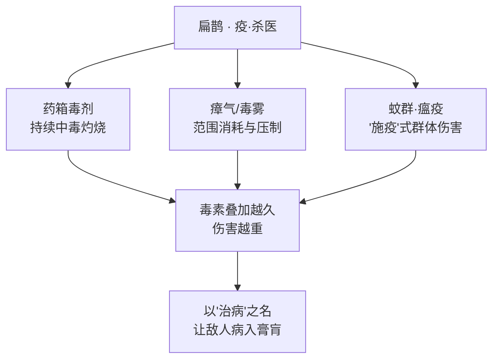

- **药箱与毒剂**：他的核心武器并非刀剑，而是医者的药箱。箱中所盛的剧毒被他当作"药"施放，命中目标后会留下持续性的中毒效果，毒性随时间累积、越拖越致命。
- **瘴气与毒雾**：他能在地面或敌群中布下绿色瘴气与毒雾，形成一片"疫区"，对身处其中的敌人持续造成消耗，并压制其行动空间——如同把一座城封锁进瘟疫之中。
- **施疫之术**：他将瘟疫本身化为武器，以"放疫"的方式对范围内目标施加病症，让敌方在交战中不断被侵蚀。其招式命名与表现多围绕"毒、疫、医"展开（具体技能名称与机制以游戏版本为准，考据推测）。

整体而言，扁鹊的战斗逻辑是"温水煮蛙"式的：单看一瞬伤害并不惊人，但只要让敌人长时间暴露在他的毒与疫之下，再强壮的躯体也会被一点点掏空。这与他背景里"瘟疫无声无息地带走一座城"的意象完全呼应。

### 重要事件 / 剧情参与

- **由医入毒的黑化**：在战乱与瘟疫横行的纪元里，亲历人心之恶后，从救人的医者堕落为"以毒为药"的杀医，是其角色的核心转折。
- **万圣节"疫·杀医"主题**：扁鹊的瘟疫医师形象与其代表性的暗黑主题皮肤，多次出现在游戏万圣节、暗黑系限时活动中，强化了"提着药箱散播瘟疫"的恐怖医师定位。(考据推测：具体活动档期与皮肤版本以官方为准。)
- **稷下学者群像**：作为[稷下学院](../factions/jixia.md)旗下钻研生死与毒理的学者，被纳入学院"研究天地至理"的群像之中，与同院诸多研究生死、时间、奇迹之力的角色形成主题呼应（背景联结为考据推测，正史着墨不多）。

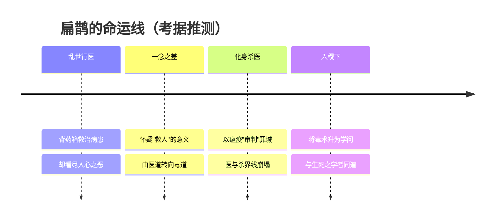

### 羁绊关系

| 对象 | 关系 | 说明 |
| --- | --- | --- |
| [庄周](penglai-donghai.md#庄周) | 同道（生死观映照，考据推测） | 稷下三贤者之一、南华真仙，主张齐物、看淡生死；扁鹊对生死边界的偏执钻研，与庄周的生死观可作主题对照（非官方明确羁绊）。 |
| [东皇太一](#东皇太一) | 同院 · 生死之学呼应（考据推测） | 同属稷下、皆涉生死/吞噬之力的全知神巫；二者在"超越凡人生死"的主题上彼此映照。 |
| [孙膑](#孙膑) | 同院 · 生命与时间（考据推测） | 同为稷下成员，孙膑钻研时间、为队友续命，与扁鹊"以毒续伤、左右生死"恰成正反两面。 |
| [稷下学院](../factions/jixia.md)三贤者 | 学院归属 | 在有教无类的最高学堂中，扁鹊得以将危险的毒疫之学系统化、学问化。 |

### 经典台词

!!! quote "扁鹊 · 疫·杀医"
    "我是医生，专治……不服。"（考据推测）

    "治好你的病，需要一点点……毒。"（考据推测）

    "生与死，不过是一剂药的两面。"（考据推测）

    "别怕，这不过是一场温柔的瘟疫。"（考据推测）

### 皮肤故事亮点

扁鹊的暗黑系主题皮肤强化了其"瘟疫医师"的恐怖美学：鸟喙长嘴面具、缠满绷带或暗纹的医袍、随身散发瘴气的药箱，以及围绕周身的蚊群与绿雾，将"医者"与"瘟神"两种形象残忍地缝合在同一具身影上。皮肤特效里，他施法时仿佛在"问诊""开方"，落点处却腾起致命的毒雾——这种"以行医姿态杀人"的视觉反差，正是该角色最具记忆点的设计语言。(考据推测：具体皮肤名称、上线档期与特效细节以游戏官方为准。)

---

## 弈星

<span class="hok-tags"><span class="tag mage">法师</span></span>

**天才围棋手 · 以一枰黑白经纬天下，落子布局、不动如山的范围消耗法师。**

| 项目 | 内容 |
| --- | --- |
| 称号 | 天才围棋手 |
| 定位 | 法师 |
| 所属 | [稷下学院](../factions/jixia.md) |
| 身份 | 围棋天才少年 / 尧天成员 / 明世隐弟子 |
| 别称 | 棋圣、小棋手、弈（考据推测） |
| 关系 | 明世隐（导师/师父，暂无独立词条）、[公孙离](changan.md#公孙离)、[杨玉环](changan.md#杨玉环)、[裴擒虎](baiyue.md#裴擒虎) |
| 登场作品 | 尧天 / 长安相关剧情与活动 |

### 背景故事

弈星是王者大陆上极为罕见的一类人——他的天赋既不在刀剑，也不在术法的轰鸣，而在一方小小的棋枰之上。称号「天才围棋手」点明了他的本质：一个用黑白二子推演天下大势的少年。在旁人眼里，围棋不过是手谈消遣；而在弈星眼中，纵横十九道的棋盘是一座可以容纳整片大陆兴衰的微缩沙盘——每一颗落下的棋子都是一次取舍，每一处「气」与「眼」的生死都对应着现实里一城一池的得失。他自幼便能在这方寸之间看见旁人看不见的纹理，被称作百年难遇的奕道天才。

弈星的成长与**尧天**这一组织密不可分。尧天以牡丹方士[明世隐](../factions/changan.md)（暂无独立词条，facId 待补）为核心，借占卜、谋略与情报活跃于**长安**的暗处，是一支隐于盛世繁华背后、洞察天机、运筹于无形的力量。明世隐既是尧天众人的首领，也正是弈星的**导师与师父**——他看出了这个少年的天赋远不止于棋盘游戏，遂将其收于门下，教他把「弈」从纸面推向人间。在明世隐的引领下，弈星渐渐明白：真正的棋局不在桌上，而在长安的街巷、朝堂的暗涌与天下的大势之间；他手中的棋子，最终要落在比棋盘宏大得多的地方。

依其与稷下学院的归属脉络（考据推测），弈星之所以被纳入**稷下学院**谱系，源于这座大陆「最高学堂」有教无类、向各邦各族广开门庭的特质。稷下学院环绕通天塔而立，分武道、魔道、机关三派，由三贤者老夫子、[庄周](penglai-donghai.md#庄周)、[墨子](mojia-jiguan.md#墨子)创立，是一座汇聚大陆全部智慧与上古遗迹科技的学术中立殿堂。对一个把「推演」与「博弈」奉为毕生之学的天才少年而言，没有哪个地方比这座最高学堂更适合安放他的「弈道」。在这里，棋枰之术被升华为一门可以与术法、机关并列的学问——观局、布势、弃子、收官，皆是经天纬地的功课。

弈星的动机始终带着少年人的纯粹与一份超越年龄的清醒。他并不沉迷于胜负本身，而是着迷于「**局**」——着迷于在混沌的变数里找出那条唯一通往「活棋」的路。在尧天的耳濡目染下，这份对「局」的执念逐渐与济世的责任相融：他要算的不再是一盘棋的输赢，而是如何在风云诡谲的长安乱局中，为身边的人、为这片大陆争得一隅可以「做活」的生机。于是这个安静落子的少年，悄然成为了尧天棋盘上最从容、也最难被对手读透的一手。

### 性格与形象

弈星的性格底色是**沉静、专注而早慧**。他话不多，习惯在开口之前先把局面在心中推演数手，言语间常带着与年龄不符的笃定与一点点棋手特有的孤高。他对一切「无序」抱有天然的整理欲——越是混乱的局面，他越能安之若素地坐下来，一子一子地把它重新理出脉络。这种「不动如山」的气质，正是他作为消耗型法师在战场上的精神写照：任凭风浪起，我自落子从容。

在外形与象征意象上，弈星的设计紧扣「**围棋**」这一核心母题。他被塑造为衣着清雅的翩翩少年，随身携带棋盒、棋枰与黑白棋子；其周身常浮动着以棋子、棋盘网格、星位（天元）为意象的术法光纹。黑与白的二元对照、纵横交错的棋盘经纬、落子时清脆的「啪」声，构成了他最鲜明的视觉与听觉符号。整体气质上，他既有书生的儒雅，又有棋士的冷峻，是一个把「弈」字写进了举手投足之间的角色。（具体外形细节随皮肤而异，此处为意象层面的概括。）

### 战斗风格与能力（设定向）

弈星的力量本源是**将「弈道」化为术法**——他不挥刀、不掷火，而是把围棋的对弈逻辑投射到战场上，以「落子布局」的方式作战。在他眼中，战场就是一方更大的棋枰：敌人是对手的棋，地形是棋盘的纹理，而他要做的，便是在恰当的位置落下「棋子」，让这些棋子彼此呼应、连成势、织成网，最终把对手围困、消耗于自己布下的棋局之中。

正因如此，他在战场上的定位是**范围消耗型法师**：单子落下未必致命，但当一颗颗「棋子」在场上连点成线、汇线成面，便能形成持续不断的范围压制——如同围棋里「围空」「做势」，看似温吞，实则步步紧逼，让对手在不知不觉间陷入「无气可走」的绝境。他的战斗哲学与其人生态度高度一致：不求一击毙命的痛快，而求**布局周全、收官稳健**的必胜;他赢的从来不是某一手，而是整盘棋。

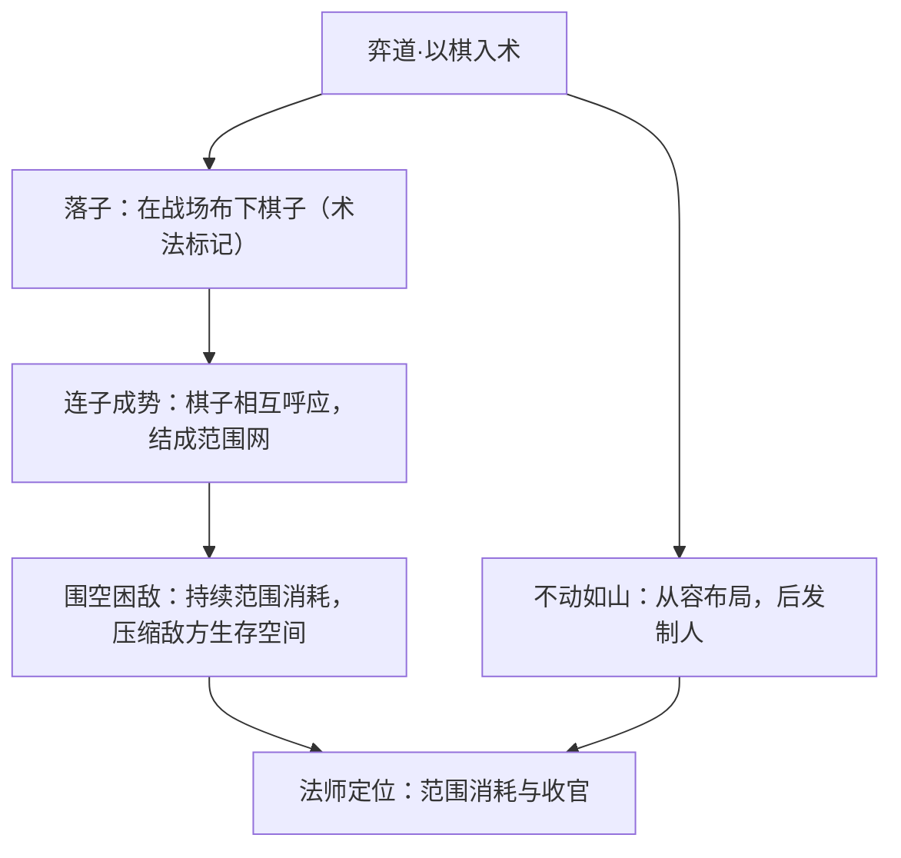

> 说明：以上为基于「围棋 / 落子布局」背景设定的能力描述，非游戏内具体技能数值；招式名称随版本可能调整，故以效果意象呈现。围棋术语（如「气」「眼」「做活」）含特殊语义，已在文中以引号标注。

### 重要事件 / 剧情参与

- **拜入明世隐门下**：天赋异禀的围棋少年被尧天首领、牡丹方士明世隐收为弟子，自此把「弈」从棋枰推向人间大局。
- **加入尧天**：成为活跃于长安暗处的尧天一员，与[公孙离](changan.md#公孙离)、[杨玉环](changan.md#杨玉环)等并肩，借占卜谋略洞察天机、运筹无形。
- **长安棋局**：在尧天介入的长安风云中，以「布局者」的身份参与谋划，扮演那枚从容落下、却往往决定全盘走向的关键棋子。
- **与裴擒虎的交汇**：在尧天探寻真相的过程中，与被[公孙离](changan.md#公孙离)点醒、加入尧天的[裴擒虎](baiyue.md#裴擒虎)产生交集。

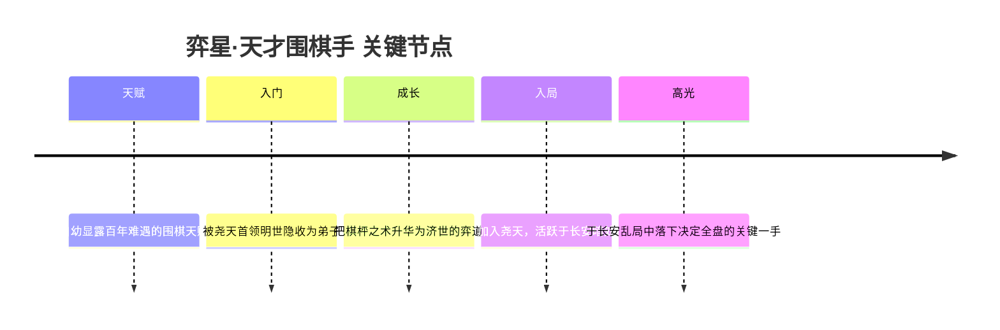

### 羁绊关系

| 对象 | 关系 | 说明 |
| --- | --- | --- |
| [明世隐](../factions/changan.md) | 导师 / 师父 | 尧天组织中，明世隐既是众人首领，也是弈星的导师与师父，引领他把「弈」从棋盘推向天下大局。（明世隐暂无独立词条，facId 待补。） |
| [公孙离](changan.md#公孙离) | 同阵营战友 / 如姐弟 | 同为尧天成员，公孙离视弈星如弟，二人在长安暗处并肩行事。 |
| [杨玉环](changan.md#杨玉环) | 同阵营战友（尧天） | 同属以明世隐为核心的尧天，公孙离敬仰前辈杨玉环，三人同处一线。 |
| [裴擒虎](baiyue.md#裴擒虎) | 同阵营战友（尧天） | 裴擒虎被公孙离点醒后加入尧天探寻真相，与弈星成为同道。 |
| [稷下学院](../factions/jixia.md) | 所属 / 求学之地 | 有教无类的最高学堂，是这位把「弈道」奉为毕生之学的天才少年的归属之所。 |

### 经典台词

!!! quote "弈星 · 语音台词（考据推测）"
    "落子无悔——这一手，我已算到三十步之后。"

    "棋盘虽小，可容天下；棋子虽轻，能定乾坤。"

    "你以为这是死局？不，活路一直都在。"

    "黑白之间，自有胜负——请落子吧。"

> 注：以上台词为贴合「天才围棋手」人设的考据推测式呈现，并非逐字引用官方语音；具体台词以游戏内实际语音为准。

### 皮肤故事亮点

弈星的皮肤系列大多围绕「围棋」「书院」「少年才俊」等意象做延展——或将其塑造为意气风发的青衿棋手，或赋予其与节庆、星辰、神话相关的造型，但黑白棋子、棋盘经纬这一核心符号往往被保留并加以视觉强化。整体上，皮肤设计始终呼应他「以一枰黑白经纬天下」的从容气度。（各皮肤具体故事随版本而异，详情以游戏内描述为准，此处为亮点概述。）

---

## 东皇太一

<span class="hok-tags"><span class="tag tank">坦克</span><span class="tag support">辅助</span></span>

**噬灭日蚀 · 吞噬奇迹之力、以缠绕换血单挑的全知者神巫**

| 档案项 | 内容 |
| --- | --- |
| 称号 | 噬灭日蚀 |
| 定位 | 坦克 / 辅助 |
| 所属 | [稷下学院](../factions/jixia.md) |
| 身份 | 上古神巫、奇迹之力的研究者与吞噬者、自我进化的半神 |
| 别称 | 全知者、噬日者、东皇（与上古「东皇」之名同源）(考据推测) |
| 关系 | [庄周](penglai-donghai.md#庄周)、[帝俊](haojing-fengshen.md#帝俊)、[大司命](haojing-fengshen.md#大司命)、[嬴政](changan.md#嬴政) |
| 登场作品 | 《王者荣耀》本传；上古神话 / 封神纪元相关背景 |

### 背景故事

东皇太一并非自始便是「神」。在王者大陆尚未被三分、稷下学院的通天塔还只是上古遗迹中一截残柱的久远纪元里，他只是一名行走于山川荒原之间的**神巫**——一个以占卜、祭祀、读星象为业，试图在凡人与上古众神之间充当桥梁的人。神巫的世界观里，天地由「奇迹之力」维系：那是一种弥散于日月、潮汐、生死轮回中的本源能量，是上古众神之所以为神、凡人之所以渺小的根由。绝大多数神巫终其一生只敢仰望、祈求、敬畏这股力量；而东皇太一与众不同——他**想要理解它，进而占有它**。

传说中，他在一次罕见的**日全食**中窥见了真相。当白昼被生生吞没、太阳被黑影一口口蚕食的那一刻，他意识到：光与神性并非不可剥夺，连最炽烈的太阳都会被「噬灭」，那么奇迹之力同样可以被夺取、被吞食、被据为己有。「噬灭日蚀」这一称号正源于此——他要做的，就是像那场吞日的天象一样，把神祇与奇迹尽数吞入腹中。于是他不再满足于祭坛前的卑微叩拜，转而踏上一条危险的自我进化之路：**吞噬奇迹之力，以血肉之躯承载本不属于凡人的神格**。

这条路让他付出了沉重代价，也让他获得了超越凡俗的认知。随着吞噬的力量越积越多，他的肉身被神性反复重塑，渐渐脱离了「人」的范畴，成为一具**半人半神的容器**。他开始能够看见常人看不见的因果脉络，听见亡魂与未来的低语，因而被尊为（或被惧称为）**全知者**。但「全知」是把双刃剑：看得越多，他越发现自己只是在用残缺的凡躯模仿真正的神，他所吞下的力量在体内躁动、撕扯，使他始终游走在「成神」与「被力量反噬而崩解」的边缘。他必须不断地吞、不断地夺，才能维系那具早已超载的躯体。（此段为基于其「噬灭」「半神」「全知」设定主题的叙事性铺陈，部分为考据推测）

正因如此，东皇太一与世间几乎所有「正统神祇」都格格不入。他的存在本身，就是对**上古东皇一脉**（以 [帝俊](haojing-fengshen.md#帝俊)、[大司命](haojing-fengshen.md#大司命) 等为代表的众神秩序）的僭越与挑战——一个凡人，竟妄图以吞噬的方式抄近路登上神坛。在更晚近的纪元里，这样一位掌握禁忌之力、又对万物本源抱有近乎偏执求知欲的存在，最终被吸纳进了**稷下学院**这座「有教无类、不问出身」的学术殿堂。在三贤者之一 [庄周](penglai-donghai.md#庄周) 主持的魔道学院体系下，他的吞噬之术与对奇迹之力的研究，被重新归类为一门可被钻研、可被传授的「魔道」学问。对稷下而言，他是危险却无价的活体样本；对东皇太一自己而言，通天塔下汇聚的上古遗迹与万族智慧，恰是他继续吞噬、继续逼近「真正神格」的绝佳猎场。

### 性格与形象

东皇太一最鲜明的气质是**深不可测的沉静**。作为「全知者」，他几乎不被外物所动——胜负、生死、敌友，在能够窥见因果的他眼里都只是早已写定的图景。他说话往往简短、带着审视与轻蔑，语气里既有看透一切的倦怠，也有对凡人挣扎的居高临下。但这份沉静之下，潜藏着一种**永不知足的饥渴**：对力量、对奇迹、对「成为真正的神」的执念，如同他体内那团永远填不满的吞噬之火。

外形上，东皇太一的造型高度凝练了「神巫 + 吞噬 + 日蚀」三重意象：他通体笼罩在厚重的**祭祀长袍与玄色纹饰**之中，面目隐于幽暗，更像一尊会移动的祭坛或图腾，而非一个有血有肉的人——这正暗示他早已不再是「人」。环绕其身的**漂浮符箓、巫纹与诡谲光晕**，象征他驭使的奇迹之力；而最具标志性的，是他所操控的、形如吞噬黑洞或日蚀光环的能量结界，既像一张吞噬一切的巨口，也像被黑影侵蚀的太阳。整体色调偏冷暗、神秘而压抑，与「噬灭日蚀」的称号严丝合缝。（外形描述基于其整体设计意象归纳）

### 战斗风格与能力（设定向）

东皇太一的全部战斗哲学，可以浓缩为一个词：**吞噬**。他不像战士那样以利刃破敌，也不像法师那样以爆发轰击，而是以**自身为牢笼、以奇迹之力为锁链**，将目标拖入与自己同生共死的近身缠斗，在「换血」中一点点消磨对手的存在。

- **奇迹之力（本源能量）**：他毕生吞噬、积蓄的核心力量，既是其神性的来源，也是其所有巫术结界的燃料。能量在体内躁动，使他拥有超越凡躯的坚韧与恢复力，契合其「坦克」的厚血定位。
- **巫纹结界 / 吞噬光环**：东皇太一可在自身周遭张开持续灼烧、吞噬周围之物的能量场，如同将「日蚀吞日」的天象化作随身武器，以范围消耗维系战场压制。
- **缠绕禁锢（招牌绝技）**：他最为人忌惮的，是一手将单一目标死死「**缠绕**」、锁死在身边的禁锢秘术——一旦被他锁定，目标便被强行拖入一对一的换血困局，逃脱无门。此术正是其作为**单挑型坦克辅助**、专精「先手锁人、保护队友、换掉敌方核心」战术的根基。
- **半神之躯**：经年累月的吞噬使他的肉身被神性反复重塑，刀枪难伤、伤而能复，这是他敢于以血肉冲在最前、承受伤害再以缠绕反制的底气。

整体而言，他是一名**以牺牲机动换取极致缠斗与控制**的开团型坦克辅助：用「吞噬」与「缠绕」把一场团战拆解成自己最擅长的一对一，在换血中完成对敌方关键英雄的处决或封锁。（以上为基于背景设定的力量来历描述，非游戏数值）

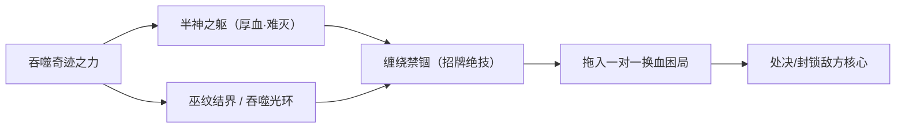

### 重要事件 / 剧情参与

东皇太一在《王者荣耀》主线叙事中属于偏「神话底色、行踪隐晦」的一类角色，其登场更多体现在**世界观背景**与**主题活动 / 皮肤剧情**中，而非高频出现在某条人物剧情主线。可考的脉络包括：

- **吞噬奇迹之力、进化为半神**：其个人史中最核心的转折——从凡人神巫到「噬灭日蚀」的自我神化，是他一切动机与能力的起点。
- **归入稷下学院魔道体系**：作为掌握禁忌吞噬之术的研究者，被纳入 [庄周](penglai-donghai.md#庄周) 一脉的魔道学院，使其与稷下「有教无类」的学术理念产生交集。
- **与上古东皇一脉的张力**：其名「东皇」与上古众神 [帝俊](haojing-fengshen.md#帝俊)（称号「东皇之主」）所代表的神系同源，二者之间存在「神格之争 / 名号渊源」的世界观伏笔。（考据推测）

> 说明：东皇太一缺乏一条公开、明确的长篇官方剧情主线，上述事件线为依据其设定主题与阵营归属整理的脉络梳理，具体情节以官方为准。

### 羁绊关系

| 对象 | 关系 | 说明 |
| --- | --- | --- |
| [庄周](penglai-donghai.md#庄周) | 同阵营 · 魔道学院师承（考据推测） | 稷下三贤者之一、魔道学院执掌者；东皇太一的吞噬之术与奇迹之力研究归于魔道体系之下。 |
| [帝俊](haojing-fengshen.md#帝俊) | 名号同源 · 神系张力（考据推测） | 帝俊称号「东皇之主」，与东皇太一之「东皇」之名同出上古东皇神系，二者间存在神格与名号的渊源 / 对照。 |
| [大司命](haojing-fengshen.md#大司命) | 上古神系 · 同纪元（考据推测） | 同属上古 / 封神纪元执掌生死与本源之力的神祇序列，与东皇太一「吞噬奇迹之力」的命题相互映照。 |
| [嬴政](changan.md#嬴政) | 世界观参照 | 嬴政之「政」与上古众神、奇迹之力的纪元背景同处一个世界框架，可作跨阵营叙事参照。 |
| [稷下学院](../factions/jixia.md) 诸生 | 同窗 / 同阵营 | 与 [老夫子](#老夫子)、[鬼谷子](#鬼谷子)、[白起](#白起) 等同列稷下，共处通天塔下的学术殿堂。 |

### 经典台词

!!! quote "东皇太一 · 语音（考据推测）"
    「奇迹之力……终将归我所有。」

!!! quote "东皇太一 · 语音（考据推测）"
    「连太阳都会被吞没，何况是你。」

!!! quote "东皇太一 · 语音（考据推测）"
    「我看得见你的结局。」

### 皮肤故事亮点

东皇太一拥有数款延续其「神巫 / 暗黑 / 日蚀」基调的皮肤，整体美术多沿用幽暗的祭祀纹样、漂浮符箓与吞噬光环等元素，强化其「半神」与「噬日者」的形象基调。各皮肤的具体故事与设定以官方公告为准，此处不臆造细节。（考据推测）

---

## 钟无艳

<span class="hok-tags"><span class="tag warrior">战士</span><span class="tag tank">坦克</span></span>

**不屈之锤 · 持锤陷阵、以丑容自守的稷下女将**

| 档案项 | 内容 |
| --- | --- |
| 称号 | 不屈之锤 |
| 定位 | 战士 / 坦克 |
| 所属 | [稷下学院](../factions/jixia.md)（武道学院一脉） |
| 身份 | 齐国女将 · [老夫子](#老夫子)门下武道弟子 |
| 别称 | 钟离春 / 无盐（取古典原型，考据推测） |
| 关系 | 师父 [老夫子](#老夫子)；官配恋人 [廉颇](haojing-fengshen.md#廉颇)；同门 [白起](#白起) |
| 登场作品 | 《王者荣耀》英雄本传与稷下学院相关背景设定 |

### 背景故事

钟无艳出身于齐国，是一位以「容貌奇异」而闻名、却以「武勇与忠直」而立身的女将。她的人物原型可上溯至战国时代齐国的钟离春（一名「无盐」），相传其貌甚陋，却敢于直谏君王、陈说国家存亡之要，最终被立为后——这层「以才德胜过容貌」的母题，被《王者荣耀》的世界观沿用并改写为一名手执重锤、镇守一方的女武者形象（考据推测，本传在古典原型基础上有所重构）。

在王者大陆的设定中，钟无艳并非生于学术殿堂，而是从沙场与边陲之间一步步打磨出来的。她自幼便不被以「美」相待，世人对她的目光多半带着惊异、回避乃至嘲弄；正是在这种被反复审视、被反复轻看的处境里，她选择以另一种方式回应世界——不去乞求别人的认可，而是用一柄沉重到旁人难以挥动的巨锤，亲手把「不屈」二字砸进每一场战斗里。她信奉的并非花言巧语，而是「立得住、扛得起、打不垮」的实在之力。

后来，钟无艳进入了大陆中部逐鹿地区的[稷下学院](../factions/jixia.md)。这座由三贤者创立、环绕通天塔而建的最高学堂，分为武道、魔道、机关三派，秉持「有教无类、向各邦各族开放」的中立理念（详见阵营设定）。她入的是武道一脉，拜在三贤者之首[老夫子](#老夫子)门下。对一个长期被以容貌评判的人而言，稷下「不问出身、只问其志」的传统，给了她一个真正被当作「武者」而非「异相」来对待的地方——在这里，重要的不是她长什么样，而是她能扛多重的锤、守多久的阵。

钟无艳的动机由此而生：她要做的，不是被人记住的「丑女」，而是被人依靠的「壁垒」。当队友溃退时第一个顶上去、当强敌压来时第一个挡在前、当所有人都退后她仍然站着——这便是她想用一生去证明的事。她的「不屈」不是一句口号，而是被千百次冲锋与挨打反复锤炼出的姿态。

值得一提的是，钟无艳与同样持重武、走肉系前排路线的[廉颇](haojing-fengshen.md#廉颇)同为[老夫子](#老夫子)门下弟子。据官方背景，二人相识于战场——廉颇在战场上遭遇的第一个对手，正是手执大锤的钟无艳；此后两人又在稷下以同门、盟友的身份重逢（详见羁绊关系）。这段从「对阵」到「并肩」的因缘，构成了她经历中颇具分量的一笔。

### 性格与形象

钟无艳的性格与她的武器一样——硬、沉、直。她不擅长、也不屑于用言辞去修饰自己，习惯把所有的情绪都压进行动里。面对轻视，她不辩解；面对强敌，她不退让；面对需要保护的人，她也很少把「在意」说出口，而是径直挡在对方身前。她外冷而内热，看似拒人千里，实则极重情义，一旦认定要守的人、要担的事，便绝不松手。

在外形上，她最鲜明的象征便是那柄与身形几乎不成比例的巨锤——这是她「以力服人、以坚守自证」的具象化。她不以艳丽示人，整体气质更偏向「沉稳、坚毅、能扛事」的女武者：身姿挺拔如一面立着的盾，眉宇间是常年征战留下的果决。她的「不屈之锤」之称，既指那柄真实的重锤，也指她本人——人即是锤，立在阵前，便是一道砸不烂、推不倒的墙。

### 战斗风格与能力（设定向）

钟无艳的战斗哲学是「以肉之躯，行突进与控制之实」。作为战士与坦克的复合定位，她不依赖灵巧的身法或华丽的连招，而是凭借厚重的体魄与那柄沉重巨锤，强行撕开敌阵、再把对手牢牢钉在原地。

- **不屈之锤（标志武器）**：她的核心是那柄分量惊人的巨锤，常人难以挥动，在她手中却成了破阵开路的利器。挥锤所及，既是伤害，也是震慑——以重击迫使敌人停步，为身后的队友争取空间。
- **突进与镇压**：依设定，她擅长「先手切入、再以重击控住目标」的打法，把自己当作第一个砸进战场的契子。这与她「永远第一个顶上去」的性格一脉相承。
- **以守为攻的坚韧**：作为前排，她最大的本钱是「扛」——把伤害承在自己身上，把队友护在自己身后。她的强，不在于打出多少，而在于在所有人都倒下之前，她还站着。


（以上为基于背景与定位的设定向描述，不涉及游戏内具体数值。）

### 重要事件 / 剧情参与

- **拜入稷下武道学院**：成为三贤者之首[老夫子](#老夫子)的门下弟子，在「有教无类」的最高学堂中以武者身份立足。
- **战场初遇廉颇**：与同门[廉颇](haojing-fengshen.md#廉颇)在战场相对——他遇上的第一个对手，便是执锤的她（官方背景）。
- **稷下重逢**：二人后于稷下学院以同门、盟友身份再会，由对阵转为并肩。

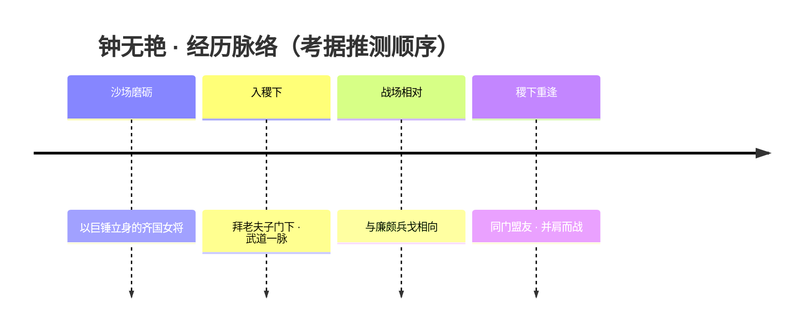

### 羁绊关系

| 对象 | 关系 | 说明 |
| --- | --- | --- |
| [老夫子](#老夫子) | 师承 | 三贤者之首，钟无艳在稷下武道学院的师父；与廉颇同出其门下（见阵营师承设定）。 |
| [廉颇](haojing-fengshen.md#廉颇) | 恋人（官配） | 二人皆老夫子弟子；廉颇在战场上的第一个对手即手执大锤的钟无艳，后于稷下以盟友身份重逢。官方微博认证官配，但因双方较为冷门，存在感偏低（见阵营 relatedRelationships）。 |
| [白起](#白起) | 同门 / 同阵营 | 同属稷下学院体系的前排武者，皆走肉系坦克路线，立场相近（考据推测，二者多为同阵营协同关系）。 |

### 经典台词

!!! quote "钟无艳"
    「以貌取人者，终将败于我锤下。」（考据推测）

!!! quote "钟无艳"
    「这柄锤很重，但我从未想过放下。」（考据推测）

!!! quote "钟无艳"
    「站在最前面的，永远是我。」（考据推测）

---

## 白起

<span class="hok-tags"><span class="tag tank">坦克</span><span class="tag warrior">先手控制</span></span>

**人间兵器 · 以血肉锻成的不死之盾，挡在嬴政与世界之间的那道铁壁**

| 项目 | 内容 |
| --- | --- |
| 称号 | 人间兵器 |
| 定位 | 坦克（先手开团 / 嘲讽锁敌） |
| 所属 | [稷下学院](../factions/jixia.md)（曾求学，后随嬴政归玄雍 / 长安） |
| 身份 | 被改造的战争兵器、嬴政的护卫与挚友、感染血族之力的不死之躯 |
| 别称 | 「人间兵器」「不死的战争机器」（民间）「面具下的怪物」（考据推测） |
| 关系 | [嬴政](changan.md#嬴政)（君臣 / 情同手足）、[庄周](penglai-donghai.md#庄周)（封印血族之力的恩人）、[东皇太一](#东皇太一)、[钟无艳](#钟无艳)（同窗·稷下盟友）、[老夫子](#老夫子)（三贤者之首） |
| 登场作品 | 《王者荣耀》本传；背景动画与「嬴政—白起」联动剧情 |

### 背景故事

白起的故事，是一则关于「为他人而活」的悲剧，也是王者大陆上少数将「忠诚」二字刻进血肉与骨骼的篇章。

他与[嬴政](changan.md#嬴政)的缘分，始于年少。两人原本只是结伴前往中部逐鹿地区——也就是[稷下学院](../factions/jixia.md)所在之地——求学的同行者。稷下三贤者有教无类、向各邦各族敞开门户，对当时尚未掌权的少年嬴政与他身边的白起而言，那是一条通往知识与未来的路。然而求学途中，他们遭遇了血族（吸血鬼一族）的袭击。在那场生死攸关的劫难里，白起以身挡灾，护住了嬴政——代价是面部受到重创，更深的代价是，他的身体被血族之力侵入、感染（考据推测：白起标志性的半边面具，正是用以遮盖与封印那道伤口及其异变）。

若任由血族之力蔓延，白起将不再是白起。是稷下三贤者之一、魔道学院的[庄周](penglai-donghai.md#庄周)出手，将这股蚀骨的力量封印于他体内。封印让白起得以保住神智与人形，却也让他从此与一种「非生非死」的状态共生——他不再像凡人那样会因伤病、因年岁而衰朽。被封印的血族之力，反过来成了他近乎不死的肉身的来源。也正是从这时起，「人间兵器」这个称号开始与他的名字绑定：一具被战争与异力共同锻造、不会倒下、为守护而生的躯壳。

数十年的共生岁月，把这对少年伙伴的关系打磨成了远比「君臣」更深的东西。表面上，嬴政是玄雍之主、是号令一方的王者，白起是他最忠诚的臣属与护卫；但在彼此心里，他们情同手足。白起替嬴政承受过苦痛，嬴政则因白起的牺牲而懂得了「他人之苦」——这份共情，深刻塑造了嬴政日后的性情与抱负。可以说，没有当年那个挡在血族面前的白起，就没有后来那个能体察众生疾苦的嬴政。

白起的余生，几乎都被「守护」二字占满。他甘愿成为一件兵器、一面盾，把所有的攻击、所有的恶意，都引向自己。他冲在最前，承受最多的伤害，只为让身后之人能够安然。这既是他改造后躯体的天职，也是他自己反复确认过的选择。对白起而言，不死之身不是恩赐，而是责任的具象——既然倒不下，那就替别人倒下；既然死不掉，那就替想活的人活着挡在前面。

### 性格与形象

白起沉默、坚毅，是典型的「以行动代替言语」之人。他不擅长、也不屑于辩白，对忠诚与守护抱着近乎本能的执念。长年的不死状态与他人难以理解的处境，让他身上始终笼着一层孤独——他清楚自己已不完全是「人」，却比许多人更想守住「人」该守住的东西。

在外形上，白起最鲜明的符号是覆盖半边面孔的**面具**与一身厚重的**铠甲战装**。面具之下，是当年护主留下的伤痕与被封印的血族异变（考据推测）；它既遮蔽了「怪物」的一面，也象征着他被迫与正常生命隔开的那道界线。整体形象冷硬、压抑、充满钢铁与血色交织的张力——他像一座行走的堡垒，沉默地横亘在战场最危险的位置。

### 战斗风格与能力（设定向）

白起的力量根植于他「被改造的不死之躯」与体内被封印的血族之力。这使他能承受常人无法承受的创伤，并在战斗中不断把敌人的注意力、伤害与杀意吸附到自己身上——这正是一名顶级坦克的核心：替队友扛下一切。

- **不死之躯**：经战争与血族异力双重锻造的肉身，让他在重压之下依旧屹立，是「人间兵器」之名的由来。
- **嘲讽锁敌（招牌绝技）**：白起最为人熟知的能力，是强行夺取敌人的攻击目标、将其牢牢锁向自己。设定上，这是他「以己为盾」的意志的直接体现——把所有刀锋都引向自己一人。
- **先手开团**：凭借厚重躯体与控场手段，他擅长第一个切入战场、撕开缺口，为身后的[嬴政](changan.md#嬴政)等人创造输出空间。
- **血族之力的双刃**：被封印的异力既是他近乎不朽的来源，也是潜伏的隐患——它需要[庄周](penglai-donghai.md#庄周)的封印维系，是他力量与诅咒的同一枚硬币的两面（考据推测）。

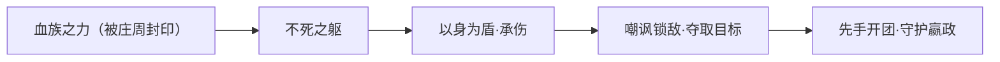

### 重要事件 / 剧情参与

```mermaid
timeline
  title 白起的命运轨迹（依官方背景整理）
  少年期 : 与嬴政结伴前往稷下学院求学
  劫难 : 途中遭血族袭击 / 护主面部重伤 / 感染血族之力
  转折 : 庄周出手封印血族之力 / 成为不死之躯「人间兵器」
  共生 : 数十年随嬴政左右 / 君臣兼挚友 / 塑造嬴政对苍生之共情
  当下 : 作为护卫与战争兵器，挡在嬴政与一切威胁之间
```

- 「嬴政—白起」背景线：二人求学遇袭、护主受伤、庄周封印的完整叙事，是理解嬴政性格成因的关键前史。
- 作为坦克英雄活跃于本传战场，担当先手与守护职责。

### 羁绊关系

| 对象 | 关系 | 说明 |
| --- | --- | --- |
| [嬴政](changan.md#嬴政) | 君臣 / 情同手足 | 少年同往稷下求学途中遭血族，白起护嬴政而面部受伤、感染血族之力；数十年共生关系塑造了嬴政对他人之苦的共情。表为君臣（玄雍之主与臣），实则情同手足。 |
| [庄周](penglai-donghai.md#庄周) | 恩人 / 封印者 | 稷下魔道学院的三贤者之一，将白起体内的血族之力封印，使其得以保住神智与人形（考据推测：封印同时维系着他的不死之躯）。 |
| [钟无艳](#钟无艳) | 同窗 / 稷下盟友 | 同属稷下学院体系的战友（考据推测：以盟友身份并肩）。 |
| [东皇太一](#东皇太一) | 同阵营 | 同列稷下学院的坦克 / 辅助向英雄，战场定位相近。 |
| [老夫子](#老夫子) | 师长（三贤者之首） | 稷下学院创院三贤者之首，白起求学之地的执掌者之一。 |

### 经典台词

!!! quote "人间兵器 · 白起"
    「我的身体，挡得住一切。」（考据推测）

    「为了陛下，我可以是任何东西——包括一件兵器。」（考据推测）

    「躲在我身后吧，剩下的，交给我。」（考据推测）


!!! tip "继续探索"
    返回 [稷下学院 阵营页](../factions/jixia.md) · 浏览 [全英雄图鉴](index.md) · 查看 [人物关系网](../relationships/index.md)