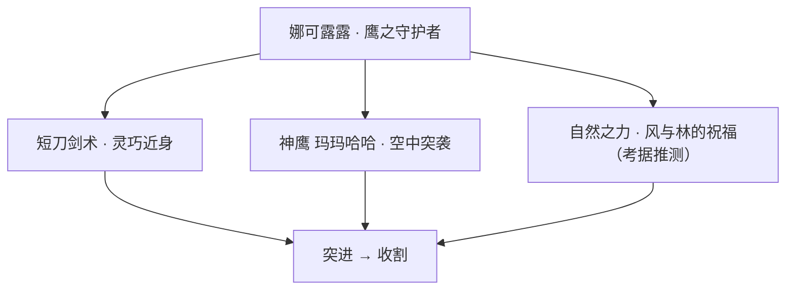
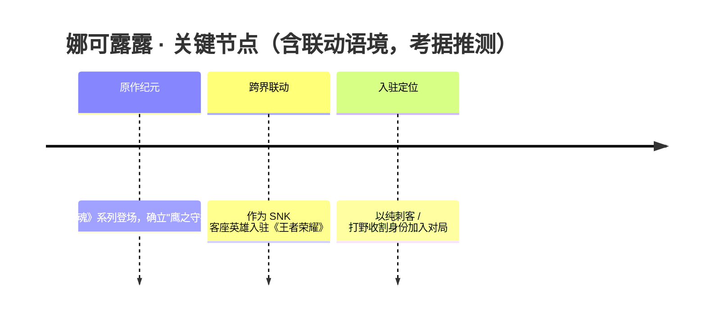
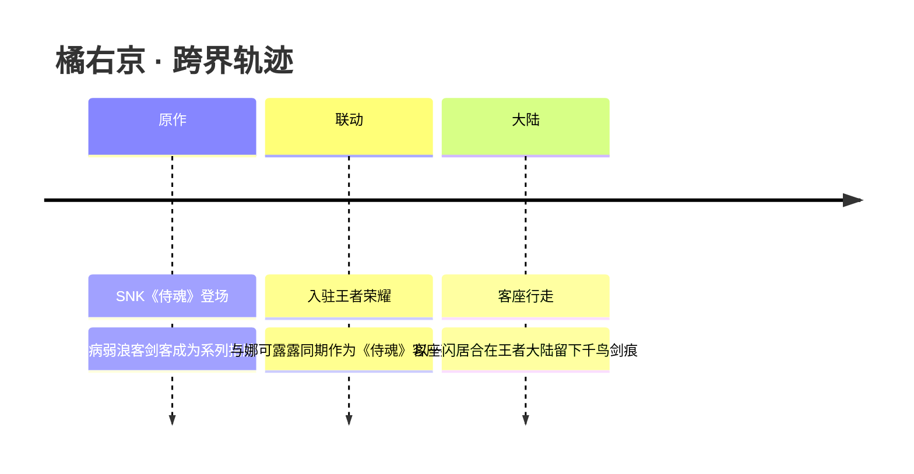

# 联动英雄 · 英雄图鉴

> 阵营设定见 [联动英雄 阵营页](../factions/liandong-snk.md)。本页收录该阵营 **3** 位英雄的深度小传。

!!! abstract "本页英雄名册"
    | 英雄 | 称号 | 定位 | |
    | --- | --- | --- | --- |
    | [娜可露露](#娜可露露) | 鹰之守护者 | 刺客 | |
    | [橘右京](#橘右京) | 剑之千鸟 | 刺客/战士 | |
    | [弗洛伦](#弗洛伦) | 花之剑客 | 战士 | |

---

## 娜可露露

刺客

**鹰之守护者 · 与神鹰并肩奔行的自然之女，纯刺客打野收割者**

| 项目 | 内容 |
| --- | --- |
| 称号 | 鹰之守护者 |
| 定位 | 刺客（打野收割） |
| 所属 | [联动英雄](../factions/liandong-snk.md)（SNK《侍魂》联动客座） |
| 身份 | 守护自然的巫女剑士 / 神鹰的伙伴 |
| 别称 | 鹰之守护者、自然守护者（考据推测） |
| 关系 | [橘右京](#橘右京)（同为《侍魂》客座剑客）、[不知火舞](fusang-xuezu.md#不知火舞)（同源 SNK 联动）、神鹰玛玛哈哈（考据推测） |
| 登场作品 | SNK《侍魂 / SAMURAI SPIRITS（サムライスピリッツ）》系列；联动入驻《王者荣耀》 |

### 背景故事

娜可露露并非诞生于王者大陆的纪元，而是作为 SNK《侍魂》系列的招牌女剑士，以「客座英雄」的身份越过时空与 IP 的边界，落脚在王者大陆的对局之中。在原作的世界观里，她生于江户时代背景下的虾夷（北方）大地，是与自然、与山林、与万物精灵紧密相连的巫女剑客。她信奉「自然之声」，认为人与天地万物本应共生，而她手中之刃从不是为征服而拔出，而是为守护那些不会说话、却同样有生命的草木山川与飞禽走兽。

她最为人熟知的形象，是身畔永远有一只通体雪白、双翼舒展的神鹰相随——这只鹰名为玛玛哈哈（考据推测：原作中神鹰之名）。鹰与人之间没有主仆，只有同伴的默契：娜可露露奔走于林间时，神鹰便是她的眼睛、她的翅膀、她最锋利的爪牙。她「鹰之守护者」的称号，正源于这份人与自然生灵之间近乎神圣的羁绊——她守护神鹰所代表的自然，神鹰也守护着她。

在《侍魂》的叙事里，娜可露露的拔刀往往与「灾厄降临、自然失衡」相系。当邪恶之力企图破坏天地的平衡、玷污山林的洁净时，听见自然哀鸣的她便会挺身而出，以剑止戈，以战护静。她并非好战之人，相反，她渴望的是一个无需拔刀、人与万物相安的世界；但正因为太珍视那份宁静，她才一次次为守护它而走上战场。这份「为和平而战」的矛盾与执着，构成了她全部行动的动机底色。

进入《王者荣耀》后，作为 SNK 联动客座阵营的成员，娜可露露在世界观上独立成组，不归属于王者大陆的任何主线阵营（参见 [联动英雄](../factions/liandong-snk.md) 的设定说明）。她以「跨次元来客」的姿态登场：来自另一个剑与魂的世界，带着她的神鹰、她的自然信仰与她那柄守护之刃，加入这片召唤师们交锋的战场。她在大陆上没有故乡的羁绊，却把对自然的敬畏与对同伴的忠诚一并带了过来——无论身处何方，她依旧是那个听得见风声、辨得出鹰唳、为守护而出鞘的女剑士。

### 性格与形象

娜可露露性情温柔而坚毅。平日里她安静、内敛，对自然万物怀着近乎虔诚的悲悯；可一旦守护之物受到威胁，她便会显露出剑客的果决与凌厉，毫不退缩。她是「以柔守静、以刚护和」的典型——温柔是她的底色，决绝是她的锋刃。

在外形上，她最鲜明的象征意象有三：其一是那只洁白的**神鹰**，雪羽与利爪并存，既是自然纯净的化身，也是她杀伐时的延伸；其二是她的**和风装束**与披散的长发，带着北方山林与古典剑客的气息；其三是她出招间的**自然意象**——风、林、鹰唳、刀光，凡她所至，仿佛带来一阵山野之风。整体而言，她被塑造成「自然」与「守护」的人格化身：洁净、灵动、与天地同息。

### 战斗风格与能力（设定向）

娜可露露的战斗哲学，是「人鹰合一」。她并非单打独斗的剑客，而是与神鹰协同作战的猎手——这一点在《王者荣耀》中被还原为她「刺客 / 打野收割」的定位：身法灵巧、爆发突进、抓住时机一击致命，随后借神鹰之力脱身或追击。

她的力量来源大致可拆为三个面向（设定向描述，非游戏数值）：

- **守护之刃（短刀剑术）**：娜可露露惯用轻巧的短刃而非长剑，剑路讲究贴身、迅捷与连击，配合她敏捷的步法，擅长在乱战中切入、找准目标、瞬间打出爆发。
- **神鹰协同**：神鹰是她最具辨识度的「武器」。原作中她可呼唤神鹰俯冲、撕咬、牵制，化身为可远可近的攻击延伸；在王者大陆，这份「人鹰合一」被诠释为她突进与收割的核心机制（考据推测：与其技能中的鹰击意象对应）。
- **自然之力**：作为巫女剑客，她的招式常裹挟风、林与自然的意象，象征她「借自然之力而战」的本源（考据推测：具体表现以游戏内呈现为准）。

整体打法上，她是典型的「等待—切入—收割—撤离」型刺客：耐心潜行、抓住敌人破绽，一套连招带走目标后借神鹰之力全身而退，把「守护」与「致命」这两种气质熔于一炉。

### 重要事件 / 剧情参与

- **《侍魂》系列正传**：作为系列招牌角色长期登场，奠定其「自然守护者 + 神鹰伙伴」的核心人设。
- **SNK × 王者荣耀 联动**：随《侍魂》IP 联动入驻王者大陆，与同源客座角色 [橘右京](#橘右京) 一同构成 SNK 联动阵容；同源的 [不知火舞](fusang-xuezu.md#不知火舞)（《拳皇 / 不知火流忍术》）亦出自 SNK 联动，但因其叙事被归入扶桑 / 血族阵营（参见 [联动英雄](../factions/liandong-snk.md) 阵营说明）。
- 联动英雄在世界观上**独立成组、不入主线纪元**，其「剧情参与」更多体现在跨 IP 的客座登场与活动联动，而非王者大陆主线编年（考据推测）。

### 羁绊关系

| 对象 | 关系 | 说明 |
| --- | --- | --- |
| [橘右京](#橘右京) | 同源客座 / 同 IP 剑客 | 同为 SNK《侍魂》联动入驻的剑客角色，同属 [联动英雄](../factions/liandong-snk.md) 阵营，二者在原作世界中本就同台。 |
| [不知火舞](fusang-xuezu.md#不知火舞) | 同源 SNK 联动 | 同出自 SNK 联动，但因扶桑 / 血族叙事被归入对应阵营；与娜可露露共享「跨次元客座」的来历。 |
| 神鹰 玛玛哈哈 | 伙伴 / 守护对象（考据推测） | 与她并肩作战的白羽神鹰，既是同伴也是她「鹰之守护者」称号的来源，人鹰合一是其战斗的灵魂。 |

### 经典台词

!!! quote "娜可露露 · 语音（考据推测）"
    「自然之声，绝不容你玷污。」（考据推测）

    「神鹰啊，与我一同战斗吧。」（考据推测）

    「为了守护，我才拔出此刃。」（考据推测）

> 注：以上台词依据其「自然守护者 + 神鹰伙伴」的设定意象提炼，具体官方语音文本以游戏内实际呈现为准（考据推测）。

---

## 橘右京

刺客战士

**剑之千鸟 · 抱病而生、以一闪居合断敌呼吸的浪客剑客**

| 档案项 | 内容 |
| --- | --- |
| 称号 | 剑之千鸟 |
| 定位 | 刺客 / 战士 |
| 所属 | [联动英雄](../factions/liandong-snk.md)（SNK《侍魂》联动客座，独立于主线阵营） |
| 身份 | 浪迹江湖的剑客、居合术高手；原作中曾为某藩家臣（考据推测，源自《侍魂》设定） |
| 别称 | 千鸟剑客、病弱浪人（考据推测） |
| 关系 | [娜可露露](#娜可露露)、[弗洛伦](#弗洛伦)、[宫本武藏](penglai-donghai.md#宫本武藏)、[不知火舞](fusang-xuezu.md#不知火舞) |
| 登场作品 | SNK《侍魂》（Samurai Shodown）系列；2018 年作为联动英雄入驻《王者荣耀》 |

### 背景故事

橘右京并非《王者荣耀》原生世界观中的人物，而是来自 SNK 经典格斗游戏《侍魂》（Samurai Shodown）系列的招牌剑客。2018 年，他与同属《侍魂》的[娜可露露](#娜可露露)一道，作为跨 IP 联动的客座英雄进入王者大陆。也正因为如此，他在叙事上并不隶属任何一条主线阵营，而是被收录于「[联动英雄](../factions/liandong-snk.md)」这一独立成组的客座行列——他的故事，仍以原作《侍魂》为根。

在原作设定中，橘右京是一名身怀绝艺却被宿命缠身的浪客剑客。他自幼习武，剑术天赋出众，却也自年少时便被一种无法痊愈的痼疾所困——肺痨般的病症时时折磨着他，使他频频咯血、体力难以为继。这份病，让他与「健全的强者」之间始终隔着一层薄而冷的距离：他知道自己时日无多，每一次拔刀都可能是最后一次（考据推测，源自《侍魂》系列对其「病弱剑客」形象的塑造）。

正是这份近在咫尺的死亡，淬炼出他独有的剑道。橘右京不追求繁复的招式与漫长的缠斗，因为他的身体不允许他久战；他把全部的生命之力凝缩进一瞬之间，以「一闪」为名的居合斩，在拔刀与还鞘的刹那定下生死。对他而言，剑不是炫技的工具，而是与时间赛跑的方式——在病躯彻底崩坏之前，把对手、把命运，一并斩开。

关于他奔走江湖的动机，原作中常与一位他所思慕、所守护的女性身影相连（考据推测，指向《侍魂》中右京的情感线索）。无论是为了寻人、为了赴一个未竟的约，还是仅仅为了在余生里证明自己的剑曾真实地存在过，橘右京始终是一名独行的浪人：衣衫单薄、面色苍白，却腰悬利刃，步履从不停歇。在王者大陆的联动叙事里，这份「以病弱之身追逐极致一击」的浪客气质被完整保留，使他在一众本土英雄中显得格外孤峭而凛冽。

### 性格与形象

橘右京性格冷峻、寡言而克制，带着一种看淡生死的疏离感。他不喜张扬，独来独往，言辞简短，却在剑出鞘的一刻爆发出与平日判若两人的锋锐。久病之人特有的敏锐与隐忍，让他对「时机」有着近乎本能的把握——他懂得等待，更懂得在唯一的那个瞬间倾注一切。

外形上，他常被塑造为一位身形清瘦、面容俊美而略显病态苍白的浪客：和服披肩，发丝半束，腰间一柄长刀。咯血、掩唇、以及拔刀前那一记沉静的呼吸，构成了他标志性的视觉符号。其称号「**剑之千鸟**」中的「千鸟」，既可指其剑势如群鸟疾飞般迅捷难测，也暗合居合斩瞬息万变、一击即逝的意象——美丽、锐利、转瞬即逝，恰如他自己的生命。

### 战斗风格与能力（设定向）

橘右京是「居合（拔刀术）」的化身。他的战斗哲学建立在「拔刀—斩击—还鞘」的一气呵成之上：刀在鞘中蓄势，出鞘即是胜负。原作中他的代表绝技包括以高速突进收割对手的「**燕返**」、自下而上撩斩的「**飞燕斩**」，以及作为终结技、以一道凌厉刀光决出生死的「**秘奥义·一闪**」（招式名称依《侍魂》原作，考据推测）。

进入《王者荣耀》后，这套居合美学被转译为他独特的机制：以「一闪」式的瞬步突进切入或脱离战场，依靠精准的位移与居合斩在敌阵中来去如风——正与「剑之千鸟」的疾飞意象相合。设计上他兼具刺客的爆发切入与战士的持续作战能力，因而在边路（对抗路）与打野位置间游走，是一名擅长「找时机、抓一波」的机动型剑客。需要强调的是，以上仅为基于背景设定与原作招式的叙事性描述，不涉及游戏内具体数值。

他的力量并不来源于超自然神力，而纯粹来自人之剑技的极致打磨——这一点，使他与王者大陆中诸多依托神话、灵根、机关之力的英雄形成鲜明对照。

### 重要事件 / 剧情参与

- **2018 年 SNK《侍魂》联动**：橘右京与[娜可露露](#娜可露露)作为首批《侍魂》客座英雄登陆《王者荣耀》，是游戏跨 IP 联动史上的标志性事件之一。
- **原作《侍魂》系列正传**：作为系列贯穿多代的招牌角色，橘右京的「病弱剑客 + 居合一闪」形象在原作中已是格斗史上的经典符号，这一形象被联动叙事原样承袭。
- **联动主题活动与限定皮肤上线**：随联动推出对应的限定外观与活动包装，强化其「来自异世界的浪客剑客」客座身份（具体活动细节考据推测）。

### 羁绊关系

| 对象 | 关系 | 说明 |
| --- | --- | --- |
| [娜可露露](#娜可露露) | 同源联动伙伴 | 同属 SNK《侍魂》、同期入驻王者的客座英雄，两人在联动叙事中是天然的「同乡」呼应。 |
| [弗洛伦](#弗洛伦) | 同组客座剑客 | 同列「[联动英雄](../factions/liandong-snk.md)」客座组，皆为以剑/居合见长、独立于主线阵营的外来者。 |
| [宫本武藏](penglai-donghai.md#宫本武藏) | 剑道意象呼应（考据推测） | 同为东瀛剑客意象的代表，二天一流之刀法与居合一闪之剑道遥相对照，气质上互为映衬。 |
| [不知火舞](fusang-xuezu.md#不知火舞) | 同源 SNK 角色（考据推测） | 同样出身 SNK 世界（《拳皇》/《饿狼传说》），在王者大陆里同属由 SNK 跨界而来的客座群体。 |

### 经典台词

!!! quote "橘右京 · 语录"
    「一闪。」（考据推测，源自其代表绝技「一闪」）

    「我的剑，等不及久战。」（考据推测）

    「在凋零之前，让我看清你的剑。」（考据推测）

### 皮肤故事亮点

作为联动客座英雄，橘右京的外观主要承袭并演绎其原作《侍魂》中的经典造型——单薄和服、半束长发、腰悬长刀的病弱浪客形象，是其皮肤包装的核心视觉母题。这些外观共同强化了他「以将逝之躯，追逐一击之极致」的悲情美学（具体皮肤设定与剧情细节考据推测，以官方为准）。

---

## 弗洛伦

战士

**花之剑客 · 以花为礼、以剑为信的高机动西洋剑客**

弗洛伦（Florentino）是经由 [联动英雄](../factions/liandong-snk.md) 组别入驻《王者荣耀》的客座角色，源自 Garena/AOV（《传说对决》/Arena of Valor）体系。他不属于本作主线纪元的任何阵营，而以"客人"的身份现身于战场——一位把决斗当作邀约、把鲜花当作请柬的对抗路高机动剑士。

| 档案 | 内容 |
| --- | --- |
| 称号 | 花之剑客 |
| 定位 | 战士（对抗路 / 边路高机动战士） |
| 所属 | [联动英雄](../factions/liandong-snk.md)（客座英雄 · 跨IP联动，facId: liandong-snk） |
| 身份 | 西洋剑术名家、浪荡贵公子、决斗艺术的信徒 |
| 别称 | 花花公子 / 风流剑客（考据推测，源自其角色气质与玩家俗称） |
| 关系 | 同组客座英雄 [娜可露露](#娜可露露)、[橘右京](#橘右京)；玩法谱系近似的扶桑剑客 [宫本武藏](penglai-donghai.md#宫本武藏)（考据推测，仅为同类剑客联想，无官方剧情绑定） |
| 登场作品 | 源自 Garena/AOV（《传说对决》/Arena of Valor）；以联动英雄身份登场《王者荣耀》 |

### 背景故事

弗洛伦并非诞生于王者大陆主线纪元的人物，而是来自另一片世界的"客人"。在他的原乡设定里（源自 AOV/Garena 体系），他是一位生于显赫家族的贵公子——锦衣华服、谈吐风流，却偏偏不肯把人生耗在宴会与权谋的算计上。对他而言，名门的姓氏既是荣耀，也是束缚：那是一座由礼数、联姻与继承构成的华丽牢笼，而他从年少起就想要逃出去。（考据推测：弗洛伦"贵族出身、厌弃门第约束"的基调来自其 AOV 角色定位，细节随版本叙事而异。）

让他真正着迷的，是剑。不是为了战争，也不是为了复仇，而是为了那种纯粹的、人与人之间以技艺相互试探的"决斗艺术"。在他眼中，一场漂亮的对决并不以谁倒下为终点，而是两柄剑在电光石火间彼此致敬、彼此成全的仪式。于是他离开了家族为他铺好的坦途，带着一柄轻巧的西洋细剑（rapier）浪迹四方，把每一次拔剑都当成一封郑重的邀请函。

他游走于不同的城邦、不同的纪元、不同的战场，所到之处总伴随着花香。弗洛伦有一个为人津津乐道的习惯：在决斗之前，他会先献上一束花。这并非轻佻的调情，而是他对"对手"的最高敬意——把交锋视作一场值得盛装出席的舞会，把鲜花作为开场的礼节。胜负之后，无论结局如何，他都会优雅致意，仿佛刚刚共舞了一曲。也正因如此，江湖上才送了他"花之剑客"的称号。

当王者大陆向异界敞开门扉、迎来诸多客座英雄之际，弗洛伦便循着新的"决斗之约"踏入了这片陌生的土地（参见 [联动英雄](../factions/liandong-snk.md) 阵营设定）。在这里，他遇到了来自《侍魂》一脉的剑者 [娜可露露](#娜可露露) 与 [橘右京](#橘右京)，遇到了无数风格迥异的战士与刺客——对一个把对决奉为信仰的人来说，没有比这更令人心动的舞台了。他不在乎大陆的纷争属于谁、纪元的兴衰指向何方；他只在乎下一个值得他递上花束、拔出细剑的对手会在哪里出现。

### 性格与形象

弗洛伦是典型的"风流而不轻浮"。他言辞华丽、举止潇洒，待人接物带着一种近乎戏剧化的优雅，乍看像个只懂享乐的纨绔公子；可一旦拔剑，那份慵懒的笑意便会瞬间收束为锋利的专注。他对决斗极其虔诚，对胜负却出奇豁达——他追求的是过程的美，而非结果的占有。

外形上，他多以华美的贵族礼服形象示人：剪裁考究的衣装、随风扬起的衣摆、轻巧而修长的西洋细剑，以及那束几乎成为他标志的鲜花。**花**与**剑**是他身上两个最核心的象征意象——花代表礼仪、风度与对对手的尊重，剑代表技艺、信念与不肯被门第磨平的自由意志。两者合一，恰好诠释了"花之剑客"这一称号：以最温柔的方式，行最凌厉的剑。

### 战斗风格与能力（设定向）

弗洛伦的战斗哲学是"以快制胜、以美服人"。他不靠蛮力压制，而是凭借西洋剑术（fencing）特有的精准刺击与灵动步法，在敌阵中穿梭往返、点到即走。

- **武器——西洋细剑（rapier）**：轻、快、刁钻，强调突刺与连续位移，与东方剑客的厚重一刀流形成鲜明对照。
- **核心特质——"以花续战"的多段位移**：弗洛伦最为人熟知的设定，是他在战斗中会撒落 / 拾取**花束**，借由这些"花"刷新自身的突进能力，从而打出令人眼花缭乱的多段连续位移（设定向描述，对应其招式机制，非游戏数值）。在叙事意象上，这正呼应了他"以花为礼、以剑为信"的人物核心——每一朵花都是一次新的邀约，也是一次新的出击。
- **决斗式打法**：他擅长贴身缠斗与无限风筝（设定层面的"周旋"），把战场当成属于自己的舞池，引诱对手随他的节奏起舞，再于对方失衡的瞬间递上致命一击。

### 重要事件 / 剧情参与

- **以 AOV/Garena 联动英雄身份登场《王者荣耀》**：作为跨IP客座角色被收录于 [联动英雄](../factions/liandong-snk.md) 组别，世界观上独立成组，不归属主线阵营。
- **"决斗之约"主题登场叙事**：循着"寻找值得交手的对手"这一动机踏入王者大陆（考据推测，具体活动文案随版本而定）。
- **与同组客座剑者的同台**：与 [娜可露露](#娜可露露)、[橘右京](#橘右京) 同列于联动英雄分组，构成跨IP剑者群像（属同组并置，非确证的官方剧情联动）。

> 注：弗洛伦的具体上线活动、限时剧情与官方动画细节会随版本更新而变化，上述事件以其稳定的人物设定为依据，涉及推测处已标注「(考据推测)」。

### 羁绊关系

| 对象 | 关系 | 说明 |
| --- | --- | --- |
| [娜可露露](#娜可露露) | 同组客座英雄 | 同为 [联动英雄](../factions/liandong-snk.md) 组别的客座剑者，玩法与气质各异，并置于跨IP分组（无确证官方剧情绑定）。 |
| [橘右京](#橘右京) | 同组客座剑客 | 同属联动英雄组的剑术系角色；橘右京为东方居合浪客，弗洛伦为西洋细剑贵公子，恰成"东西剑道"对照（考据推测，仅为设定联想）。 |
| [宫本武藏](penglai-donghai.md#宫本武藏) | 剑道同类（玩法联想） | 同为以剑入战、强调突进与对决美学的剑客；分属不同阵营，无官方剧情关联（考据推测）。 |

> 说明：本组 relatedRelationships 设定为空，弗洛伦未与主线阵营英雄建立官方羁绊；上表关系主要基于"同组客座""同为剑客"的设定联想，确证性内容仅限其归属于 [联动英雄](../factions/liandong-snk.md) 组别。

### 经典台词

!!! quote "弗洛伦 · 台词集"
    "在拔剑之前，请先收下这束花。"（考据推测）

    "决斗，本就该像一场舞会那样优雅。"（考据推测）

    "门第困不住我，但一柄好剑可以让我停留片刻。"（考据推测）

    "这一支花，敬你；这一剑，也敬你。"（考据推测）

!!! tip "继续探索"
    返回 [联动英雄 阵营页](../factions/liandong-snk.md) · 浏览 [全英雄图鉴](index.md) · 查看 [人物关系网](../relationships/index.md)