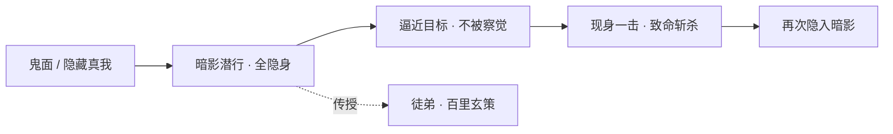
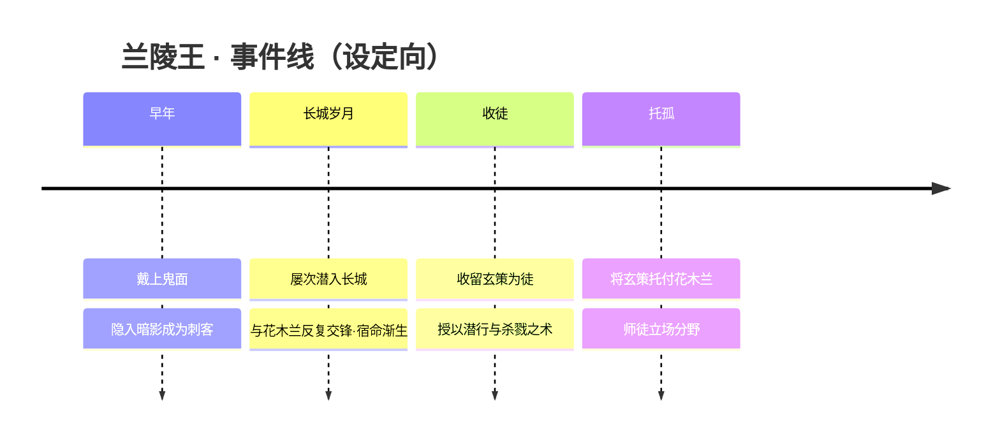
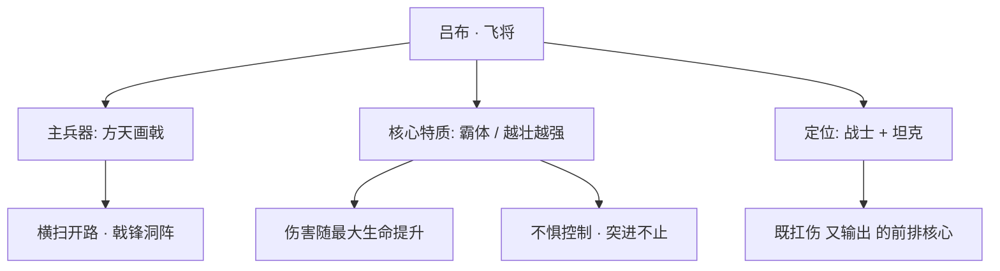
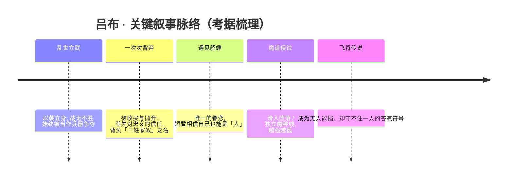

# 魔道·暗影·深渊 · 英雄图鉴

> 阵营设定见 [魔道·暗影·深渊 阵营页](../factions/modao-shadow-abyss.md)。本页收录该阵营 **2** 位英雄的深度小传。

::: info 本页英雄名册
| 英雄 | 称号 | 定位 |
| --- | --- | --- |
| [兰陵王](#兰陵王) | 暗影刀锋 | 刺客 |
| [吕布](#吕布) | 飞将 | 战士/坦克 |
:::

---

## 兰陵王

刺客

**暗影刀锋 · 戴鬼面潜行于暗影之间、悄然取人性命的全隐身杀手**

| 项目 | 内容 |
| --- | --- |
| 称号 | 暗影刀锋 |
| 定位 | 刺客 |
| 所属 | [魔道·暗影·深渊](../factions/modao-shadow-abyss.md) |
| 身份 | 暗影中的刺客 / 潜行杀手 / 师者（曾收徒授艺） |
| 别称 | 双兰组合之「兰」、鬼面刺客（俗称） |
| 关系 | [花木兰](changan.md#花木兰)（宿命·敌手）、[百里玄策](changcheng.md#百里玄策)（徒弟）、[吕布](#吕布)（同属魔道·暗影阵营）、[铠](changan.md#铠)（间接·玄策的救命恩人） |
| 登场作品 | 《王者荣耀》英雄；双兰相关剧情、宿命关系图、百里兄弟背景设定 |

### 背景故事

兰陵王的故事，是一段被光明世界拒之门外、只能在暗影里行走的孤独剪影。他自幼相貌过人，却也因此被命运推向了一条与「容颜」截然相反的道路——为了不让脸上的柔弱泄露杀意、为了在敌阵之中震慑对手，他戴上了一张狰狞的鬼面。这张面具既是武器，也是枷锁：它隐去了他真实的容貌，也一并隐去了他作为「人」被看见、被理解的可能。从此，世人记住的只是那个无声无息、出现即夺命的鬼面刺客，而非面具之下那张属于他自己的脸。（注：兰陵王戴面具的传说源自历史人物高长恭「貌柔心壮」「常著假面以对敌」的典故，游戏在此基础上做了暗影刺客向的再演绎，具体设定细节为「考据推测」。）

在《王者荣耀》以「神明—长城—魔道」为骨架的世界观里，兰陵王被归入魔道·暗影·深渊这一黑暗势力体系。这一阵营汇集了被神明改造失败的魔道家族、被奴役而反抗的魔种、由大漠魔道滥用而生的暗影魔种，以及代表毁灭与堕落的深渊。它们掌握着由世界本源知识与法则驱动的「魔道」学问，与长城守卫军在边境长期对抗，与神明因起源上的压迫而结怨。兰陵王并非这一体系中呼风唤雨的家族首脑，而是行走于「暗影之径」上的执行者——一柄在黑暗中被磨利、被使用、也最终学会自己选择目标的刀。

他的经历，绕不开那道横亘在世界之间的**长城**。在成为长城守卫军队长之前的岁月里，[花木兰](changan.md#花木兰)还只是一名年轻的戍卒，而兰陵王，则是屡屡潜入长城、试图穿越这道屏障的「敌对者」之一。长城脚下，一个是以隐身潜行为生的暗影刺客，一个是以一柄长剑死守关隘的女武者，二人一次又一次地在同一片夜色里短兵相接。本应是你死我活的对峙，却在无数次交锋中，被磨出了某种超越敌我的默契与牵绊——他们彼此是最了解对方刀路的人，也是唯一能在黑暗中认出彼此的人。（官方将二人定位为「宿命/敌手」，并以此构成知名的「双兰组合」；至于这段关系是否带有恋人色彩，官方态度暧昧、属半官方，曾就「次元武士情侣皮肤」一类传闻作出辟谣，故此处恋人成分标注为「(考据推测)」。）

兰陵王的故事里还有一处温度，来自他作为「师者」的一面。北疆的少年[百里玄策](changcheng.md#百里玄策)，曾被[铠](changan.md#铠)所救，而后辗转流落，被兰陵王收留并收为徒弟。兰陵王将自己赖以存活的本事——暗影潜行的身法、钩镰一类近身利器的用法、以及在杀戮中如何让自己活下来的冷酷法则——尽数传授给了这个狼性少年。在那段相依为命的日子里，这个本该只懂取人性命的暗影刺客，难得地承担起了「教与养」的角色。后来，出于某种连他自己也未必言明的考量，兰陵王将玄策托付给了已成长为长城守卫军中坚的花木兰；玄策由此走入了长城守卫军，与兄长[百里守约](changcheng.md#百里守约)（百里兄弟设定）一道，站到了与师父立场相对的那一边。

于是，兰陵王的人生被一条「暗影—长城」的轴线贯穿：他属于黑暗，却把光交到了徒弟手里；他与花木兰是宿敌，却把最珍视的人托付给了她。鬼面之下，是一个用整个人生去丈量「黑暗与光明之间究竟还有多少回旋余地」的孤独者——他始终行走在暗影之径上，却从未真正属于那纯粹的黑暗。

### 性格与形象

兰陵王沉默、冷峻、克制，习惯把一切情绪藏在那张鬼面之后。作为刺客，他信奉「一击毙命、不留痕迹」，行事干净利落，绝不拖泥带水；但在这层职业性的冷酷之下，他对徒弟玄策、对宿敌花木兰，又分明保有着不轻易示人的温度与执念。这种「冷面与柔心」的反差，正是他最核心的人物张力，也呼应了历史原型「貌柔心壮、音容兼美」的经典意象。

形象上，他最鲜明的符号无疑是那张**鬼面具**——狰狞、压迫，遮去真容，是恐惧的具象，也是自我的封印。他通体笼罩在暗色调中，身形隐没于阴影，行动时如鬼魅般无声。整体象征意象可以概括为：**面具（隐藏的真我）、暗影（隐身与潜行）、刀锋（一击致命）**三者的叠加——一个把自己活成了「黑暗本身」的人。

### 战斗风格与能力（设定向）

兰陵王是阵营乃至全游戏中最具代表性的「全隐身刺客」之一。其战斗哲学的核心，是「先消失，再致命」：

- **暗影潜行**：他能将自身彻底隐入暗影，悄无声息地逼近目标。这份本事根植于魔道·暗影体系所掌握的黑暗法则，也是他赖以生存、并传授给徒弟[百里玄策](changcheng.md#百里玄策)的看家本领。在敌人察觉之前，他往往已经站在了致命的距离上。
- **一击斩杀**：从隐身中骤然现身的那一刀，是他全部杀意的凝聚。他追求的从来不是缠斗，而是用最短的时间、最少的破绽，把对手送入永夜。
- **鬼面之威**：那张面具不仅遮容，更是一种心理上的压制——在他现身的一瞬，恐惧本身便成了他的助攻。

（说明：上述为基于背景设定的力量描述，非游戏数值；招式名称与具体机制以官方为准。）

### 重要事件 / 剧情参与

- **长城脚下的宿命交锋**：在成为长城守卫军队长之前，花木兰长期与潜入长城的兰陵王在长城下对战，反复交锋之中生出超越敌我的复杂情感，构成官方知名的「双兰组合」与「宿命/敌手」关系。
- **收徒授艺**：收留被[铠](changan.md#铠)所救、辗转流落的[百里玄策](changcheng.md#百里玄策)并收为徒，教其暗影潜行、钩镰之术与杀戮之道。
- **托孤与立场分野**：将玄策托付给花木兰，玄策由此加入长城守卫军，师徒就此站到了相对的阵营。

### 羁绊关系

| 对象 | 关系 | 说明 |
| --- | --- | --- |
| [花木兰](changan.md#花木兰) | 宿命 / 敌手（恋人色彩半官方） | 「双兰组合」。花木兰成为队长前常与潜入长城的兰陵王在长城下对战，长期交锋生出不一样的感情；官方更多以宿命/敌手定位，恋人色彩暧昧、属半官方，曾辟谣「次元武士情侣皮肤」一类传闻。 |
| [百里玄策](changcheng.md#百里玄策) | 师徒 | 收留被铠所救的玄策并收为徒，教其暗影潜行、钩镰与杀戮；后将玄策托付花木兰，玄策由此入长城守卫军。 |
| [铠](changan.md#铠) | 间接 · 徒弟的救命恩人 | 玄策曾被铠所救，而后才被兰陵王收留，二人因玄策而产生间接关联（(考据推测)：二人无直接交集的官方剧情）。 |
| [吕布](#吕布) | 同阵营 | 同属魔道·暗影·深渊体系，但分属不同剧情线（吕布走独立魔种/堕落线），无直接互动设定。 |

### 经典台词

::: quote 兰陵王 · 台词
「我，就是黑暗。」（考据推测）

「面具之下，是连我自己都不愿再看的脸。」（考据推测）

「你看不见我，便已经输了。」（考据推测）
:::

（说明：以上台词为契合人物形象的考据推测向演绎，具体以游戏内官方语音为准。）

---

## 吕布

战士坦克

**飞将 · 持方天画戟、以躯壳之伟力碾碎一切的霸体肉战**

| 档案 | 信息 |
| --- | --- |
| 称号 | 飞将 |
| 定位 | 战士 / 坦克 |
| 所属 | [魔道·暗影·深渊](../factions/modao-shadow-abyss.md) |
| 身份 | 沦于堕落与诅咒的孤高战将 / 受魔道侵蚀的失控者（考据推测） |
| 别称 | 飞将、人中吕布（演义俗谚「人中吕布，马中赤兔」）、修罗（皮肤意象） |
| 关系 | 恋人 [貂蝉](changan.md#貂蝉)；同阵营 [兰陵王](#兰陵王) |
| 登场作品 | 《王者荣耀》本传；CP 活动、皮肤剧情（爱与正义、天魔缭乱、修罗、御火虓将等） |

### 背景故事

吕布的故事，是一则关于「力量」与「孤独」的悲剧。他被反复传颂为这片大陆上最强的武者之一——演义俗谚里那句「人中吕布，马中赤兔」，几乎成了所有持戟者衡量自身的尺度。然而在《王者荣耀》的世界观叙事中，飞将之名背后并非纯粹的荣光，而是一道始终无法填满的裂口：越是强大，越是无人能与之并肩；越是所向披靡，越是被所有人忌惮、利用、最终背弃。

他出身于乱世征伐之中，自幼以武立身，凭一杆方天画戟与胯下神驹赤兔（考据推测，沿演义意象）纵横沙场，从未尝过败绩。可正因无敌，他始终被当作一件「最锋利的兵器」来对待——被各方势力争抢、收买、驱使，又在功成之后被恐惧他的人弃如敝屣。一次次的背叛把这位战将一点点推向心冷，他逐渐不再相信「主君」「忠义」「同袍」这些字眼，只信奉自己手中那杆戟的重量。世人称他为「三姓家奴」时，他听见的不是道德的指摘，而是又一次被当作器物买卖的回声。

在魔道·暗影·深渊这一黑暗势力体系的脉络里，吕布被归入「独立魔种 / 堕落线」（依本阵营设定）。这片体系汇聚了被神明改造失败的魔道家族、被奴役而反抗的魔种，以及深渊侵蚀下逐渐失控的存在；它们共同的底色，是「被起源所压迫、被世界所弃绝者的反叛」。吕布的轨迹与之暗合——他并非天生的恶徒，而是被无数次背弃磨蚀、被强大本身所诅咒，最终滑向堕落与失控的一员。当对力量的渴求压过了对人世的眷恋，他身上那股近乎不死的霸体之力，便成了将他与人群彻底隔开的深渊（考据推测，结合阵营「深渊侵蚀」主题与皮肤「修罗」意象）。

唯一为这片荒寒透进光的，是貂蝉。在血与铁的间隙里，是她的舞姿、她的温柔，让这位从不为谁停步的飞将第一次甘愿驻足。她让吕布短暂地相信，自己也可以是一个「人」，而非一柄被人挥舞的戟。可乱世从不许诺长久——爱与正义的并肩、天魔缭乱中的相缠，既是他最珍视的羁绊，也是悬在他头顶最沉的枷锁。当世界一次次逼他在力量与所爱之间抉择，飞将的故事便注定走向那种「赢得了天下、却守不住一人」的苍凉。

于是，吕布最终成了大陆传说中一个矛盾的符号：他是无人能挡的飞将，是令千军披靡的战神；也是被所有阵营猜忌、被命运反复出卖、在魔道侵蚀下渐渐独行于暗影深处的孤魂。他的强大，是他唯一的勋章，也是他唯一的牢笼。

### 性格与形象

吕布性情桀骜，孤高自负，对外界的规训与道德评判嗤之以鼻——既然世人只把他当兵器，他便干脆只对力量负责。这份冷硬之下，却埋着一处极脆弱的柔软：他对貂蝉的眷恋，是他全部叛逆与冷漠中唯一的破绽，也是支撑他没有彻底沦为纯粹杀戮机器的最后一根弦。

外形上，他是不折不扣的「重装霸体」意象——魁伟的体魄、玄黑与赤金交织的甲胄、随每一次挥击带起的劲风，处处宣示着压迫性的力量感。他手中的方天画戟既是兵器也是身份的延伸；其代表象征意象常与「修罗」「天魔」「焰火」相连：修罗喻其在杀戮中愈强、愈孤的宿命，天魔与缭乱喻其受魔道侵蚀、与貂蝉相缠的暧昧底色，而焰火则呼应「御火虓将」一类皮肤中那股焚尽一切的暴烈气场。整体而言，他是一个「越强越孤」的悲剧式强者形象。

### 战斗风格与能力（设定向）

吕布的战斗哲学只有一条：以躯壳之伟力，正面碾碎一切。

- **方天画戟**：标志性长柄重兵，戟身宽阔、攻守一体。挥扫时以横扫千军之势开路，突进时则以戟锋洞穿阵列，是他「以一当百」演义形象的具象化（武器名含特殊月牙形戟刃意象）。
- **霸体与「越壮越强」**：吕布最鲜明的设定特质，是他的伤害与威压随自身「最大生命」的提升而水涨船高——躯体越是雄浑，每一击便越是沉重。这把「肉」与「输出」合而为一，使他成为既扛得住又打得动的前排战将，呼应坦克 / 战士的双重定位。
- **不死般的韧性（霸体）**：他能在最猛烈的攻势中维持身姿不乱、突进不止，仿佛痛楚与控制都难以撼动这具被力量（与魔道侵蚀，考据推测）淬炼过的身躯。这种「打不退、压不倒」的存在感，是飞将最令对手胆寒之处。
- **赤兔之疾（考据推测）**：沿演义「马中赤兔」意象，他的机动与突袭常被描绘为如风般迅捷，与「飞将」称号互为表里。

### 重要事件 / 剧情参与

- **演义之名的承袭**：作为「飞将」「人中吕布」的形象母题，吕布是大陆武力传说中绕不开的标尺型人物，其无敌与孤独构成其全部叙事的底色。
- **与貂蝉的官方 CP 线**：吕布与貂蝉是官方确认的情侣 / CP，多次出现于联动皮肤与 CP 活动叙事中；其台词亦常念及貂蝉（详见下文台词与羁绊）。
- **「爱与正义」皮肤剧情**：与貂蝉成对的西式婚礼 / 守护意象皮肤，呈现飞将在乱世中为所爱披甲而立的一面。
- **「天魔缭乱」皮肤剧情**：与貂蝉成对的暗黑天魔意象皮肤，呼应魔道侵蚀与二人相缠的暧昧、堕落底色。
- **「修罗」「御火虓将」等单人皮肤意象**：以修罗、烈焰强化其「越杀越孤、焚尽一切」的悲剧强者形象。

### 羁绊关系

| 对象 | 关系 | 说明 |
| --- | --- | --- |
| [貂蝉](changan.md#貂蝉) | 恋人 / 官方 CP | 演义关联，吕布台词常念貂蝉；「爱与正义」「天魔缭乱」等皮肤成对呼应，官方 CP 活动确认二人情侣关系。是飞将冷硬外壳下唯一的柔软。 |
| [兰陵王](#兰陵王) | 同阵营（魔道·暗影·深渊） | 同列于黑暗势力体系，分属暗影刺杀与堕落肉战两条线，路径迥异而同处暗面（无明确直接交集，归类性关联）。 |

### 经典台词

::: quote 吕布 · 经典台词
「忠义？我从来只信自己手中的戟。」（考据推测）

「貂蝉，为了你，我可以与整个天下为敌。」（考据推测）

「无人能挡我，无人……能与我并肩。」（考据推测）
:::

### 皮肤故事亮点

- **爱与正义 / 天魔缭乱（与貂蝉成对）**：两套对应皮肤分别从「光」与「暗」两端，演绎飞将与舞姬的羁绊——前者是为所爱披甲而立的守护，后者是魔道侵蚀下相缠的暧昧与堕落，恰好对照吕布在「人」与「魔种」之间的撕扯。
- **修罗 / 御火虓将（意象向）**：以修罗的孤绝杀意与烈焰的暴烈气场，强化「越强越孤、焚尽一切」的悲剧强者母题，与其堕落线设定遥相呼应（皮肤剧情细节以游戏内为准，考据推测）。

::: tip 继续探索
返回 [魔道·暗影·深渊 阵营页](../factions/modao-shadow-abyss.md) · 浏览 [全英雄图鉴](index.md) · 查看 [人物关系网](../relationships/index.md)
:::