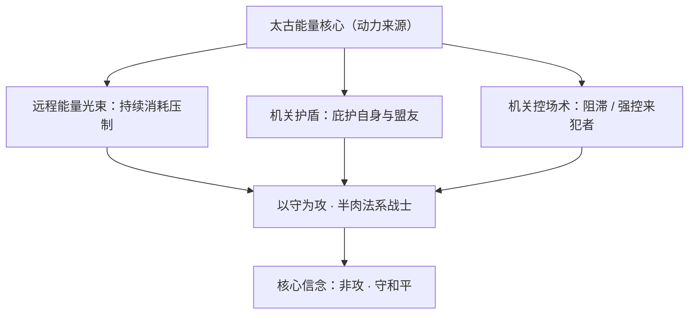
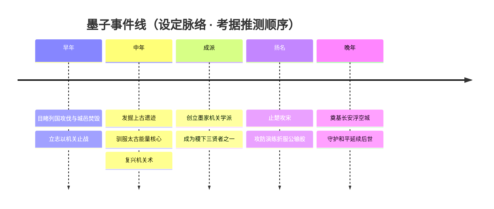
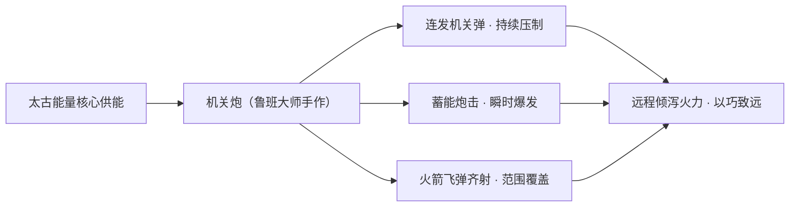
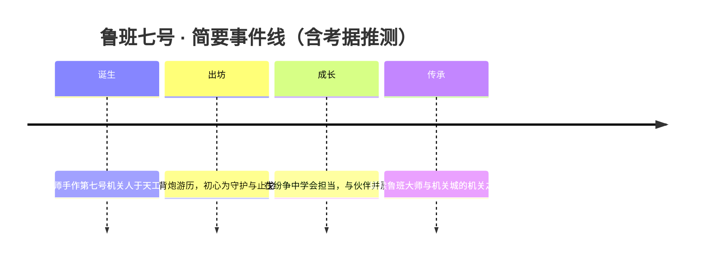
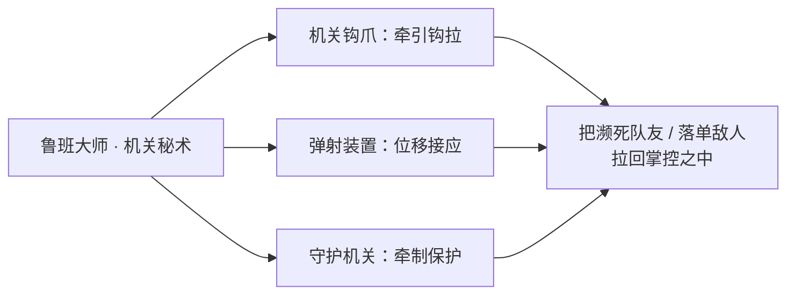
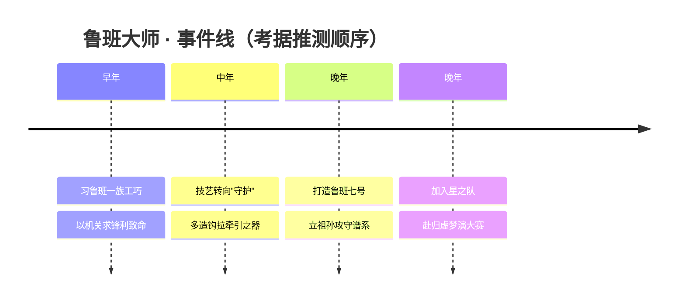
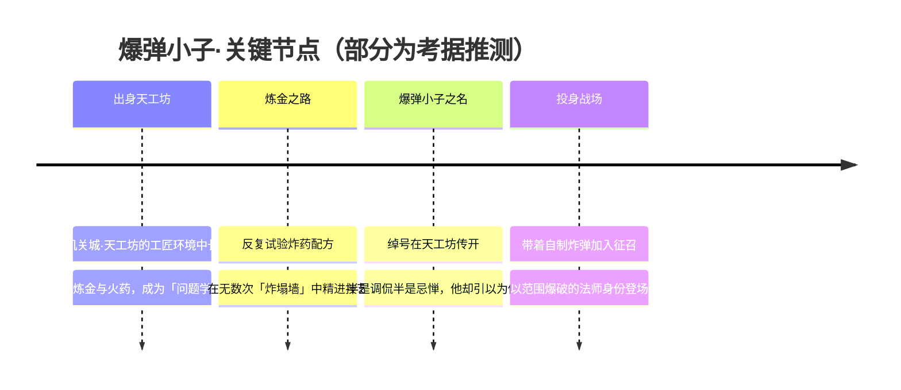

# 墨家机关城·天工坊 · 英雄图鉴

> 阵营设定见 [墨家机关城·天工坊 阵营页](../factions/mojia-jiguan.md)。本页收录该阵营 **4** 位英雄的深度小传。

!!! abstract "本页英雄名册"
    | 英雄 | 称号 | 定位 | |
    | --- | --- | --- | --- |
    | [墨子](#墨子) | 和平守望 | 战士/法师 | |
    | [鲁班七号](#鲁班七号) | 机关造物 | 射手 | |
    | [鲁班大师](#鲁班大师) | 机关秘术 | 辅助 | |
    | [沈梦溪](#沈梦溪) | 爆弹小子 | 法师 | |

---

## 墨子

战士法师

**和平守望 · 以机关守护和平的稷下贤者，远程消耗与护盾兼备的半肉控制法系战士。**

| 项目 | 内容 |
| --- | --- |
| 称号 | 和平守望 |
| 定位 | 战士 / 法师 |
| 所属 | [墨家机关城·天工坊](../factions/mojia-jiguan.md)（稷下学院·机关学派） |
| 身份 | 稷下三贤者之一、机关学派（墨家机关道）创立者、长安浮空城的奠基建造者 |
| 别称 | 本名墨翟；机关学派宗师（考据推测：民间多称「墨子先生」「机关祖师」） |
| 关系 | [鲁班大师](#鲁班大师)、[鲁班七号](#鲁班七号)、[沈梦溪](#沈梦溪)、[老夫子](jixia.md#老夫子)、[庄周](penglai-donghai.md#庄周)、[米莱狄](penglai-donghai.md#米莱狄) |
| 登场作品 | 王者荣耀本传英雄；稷下学院相关世界观叙事 |

### 背景故事

墨子，本名墨翟，是稷下学院公认的「三贤者」之一，与狂放雄辩的[老夫子](jixia.md#老夫子)、逍遥出世的[庄周](penglai-donghai.md#庄周)并立。三人有教无类、广收门徒，使稷下成为整个世界思想与技艺的策源地。然而，与另外两位以言辞和心性闻名的贤者不同，墨子毕生所求并非雄辩或超脱，而是一件极朴素、又极沉重的事——**止战，守和平**。

墨子的出身并不显赫。在他成长的年代，列国相争、攻伐不休，城邑被高耸的云梯与冲车碾过，工匠的智慧被尽数用于制造更精巧的杀戮器械。墨子目睹过太多被战火夷平的家园，也正是在这片废墟之上，他做出了与同代名匠截然相反的抉择：若机关之术终究要造，那便让它去**守城**，而非**屠城**。这一念，成为他往后数十年的全部志业。

为复兴几近失传的上古机关术，墨子耗费了数十年光阴。他在稷下学院之内，凭借自上古遗迹中发掘、辨识、修复的残骸，一砖一卯地构建起属于墨家的机关谱系——这便是后世所称的「墨家机关城·天工坊」（天工坊为机关工匠文化的泛称）。墨家机关并非凭空运转，其动力之源，是深藏遗迹核心的**太古能量核心**；墨子穷尽心力去理解、驯服这股远古之力，让冰冷的金属齿轮重新拥有了「心跳」。可以说，机关学派（墨家机关道）能够立派传世，正是墨子以一人之肩扛起断代技艺的结果。（考据推测：太古能量核心的具体形态在不同叙事中表述不一，此处以阵营设定为准。）

墨子一生最为人传颂的，是他**与名匠公输般（即鲁班）的那场攻防之争**。当楚国欲凭公输般所造的精巧攻城器械倾力攻宋，墨子千里奔走、面陈利害；当言语无法令对方收手，他便以机关对机关，与公输般当场进行了一场不见血的「攻防演练」——公输般九设攻城之械，墨子九次将其化解，演练之末仍有余守。最终他以无可辩驳的守御之能折服了对方，使一场迫在眉睫的灭国之战消弭于无形。这一役，既是墨家机关与鲁班工巧的经典对照，也奠定了「墨子」二字在世人心中的分量：**他不是最锋利的剑，而是最坚固、也最不愿出鞘的盾。**

晚年的墨子，将毕生所学倾注于一件更宏大的造物——**长安浮空城**。这座悬浮于天穹之上的钢铁之城，连同其中往来巡行的机关人，皆以墨家机关与太古能量核心为技术根基。墨子由此从一位「止战的工匠」，升华为一位「为未来奠基的建造者」：他守护的不再只是一城一池，而是一个让无数人得以安居的明天。即便岁月流逝、纪元更迭，长安城的每一处齿轮咬合、每一道能量脉络，都仍在无声地延续着那位老者最初的心愿——**和平守望**。

### 性格与形象

墨子是典型的「以柔克刚」之人。他温和、克制、近乎执拗地坚持「非攻」，却绝非软弱：当言语无力时，他会毫不犹豫地以实力让对方明白「攻不可破」的代价。他兼具工匠的严谨与师者的胸怀——对门徒倾囊相授，对来犯者据理力守，对杀伐之器则始终怀着深深的警惕。

在形象上，墨子多被刻画为一位身披厚重机关装甲、却气度沉静的长者智者。其象征意象集中于**齿轮、护盾与能量光环**：背负或环绕周身的机关构件并非用于进攻的利刃，而是层层叠叠的守御之器；流转其间的太古能量，化作护盾与远程的光束，恰如其人——力量内敛，锋芒向守。（考据推测：具体外观因皮肤而异，此处取其经典「机关守护者」基调。）

### 战斗风格与能力（设定向）

墨子的战斗哲学完全脱胎于他「守而后战」的信念。他以墨家机关与太古能量核心为力量来源，不近身搏杀，而是在中远距离构筑攻防一体的战场：以能量光束持续消耗敌人，以机关护盾庇护自身与盟友，再以机关之力强制控场。设定向地说，他是「半肉的法系战士」——既有战士的厚度去站桩承伤，又有法师的射程去远程压制。

其招式来历皆可追溯至那场「与公输般的攻防演练」：九守九化的守城之术，被他凝练为可随身携带、随取随用的机关绝技。换言之，墨子在战场上施展的每一道护盾、每一次反制，本质上都是当年那座「攻不可破之城」的微缩复现。

### 重要事件 / 剧情参与

- **创立稷下机关学派**：以上古遗迹残骸与太古能量核心为基，耗数十年复兴几近失传的机关术，立「墨家机关道」一派。
- **止楚攻宋·折服公输般**：千里赴宋，以机关对机关，九守九化，使灭国之战消弭，成就墨家机关与鲁班工巧的经典对照。
- **奠基长安浮空城**：将毕生机关之学注入长安城与机关人，成为这座中枢之城与机关人文明的技术根基。
- **稷下三贤者·有教无类**：与[老夫子](jixia.md#老夫子)、[庄周](penglai-donghai.md#庄周)同为创院贤者，广收门徒，桃李遍及诸国。

### 羁绊关系

| 对象 | 关系 | 说明 |
| --- | --- | --- |
| [老夫子](jixia.md#老夫子) | 稷下三贤者 / 同道 | 创院三贤者之一，与墨子、庄周共同有教无类、广收门徒；老夫子重雄辩，墨子重机关与止战。 |
| [庄周](penglai-donghai.md#庄周) | 稷下三贤者 / 同道 | 创院三贤者之一，逍遥出世；与务实造物的墨子构成「出世」与「入世」的鲜明对照。 |
| [鲁班大师](#鲁班大师) | 机关术对照 / 一时之敌 | 即名匠公输般（鲁班），墨子曾与其攻防演练并折服对方，构成墨家机关 vs 鲁班工巧的经典对照（细节较弱）。 |
| [鲁班七号](#鲁班七号) | 后世机关造物（间接） | 鲁班大师所造的机关小子；同属机关一脉，是墨家与鲁班两种机关传承在后世的延续。 |
| [沈梦溪](#沈梦溪) | 同阵营 / 机关后学 | 同属机关学派氛围下的炼金与造物者，理念上承袭「以技造物」的天工坊文化。 |
| [米莱狄](penglai-donghai.md#米莱狄) | 墨家机关道传人（考据推测） | 称号「墨家机关道」，被视为墨家机关之术在后世的继承与发扬者；与墨子同源一脉。 |

### 经典台词

!!! quote "墨子语录"
    「兼相爱，交相利。」（考据推测：化用墨家「兼爱」核心主张）

    「攻无不破？那便让你见识，什么叫守无可攻。」（考据推测）

    「机关之术，本该用来守护，而非杀戮。」（考据推测）

    「和平，需要有人为它筑起高墙。」（考据推测）

---

## 鲁班七号

射手

**机关造物 · 鲁班大师手作的第七号机关小子，以机关炮与火箭飞弹远程倾泻火力的工巧之兵。**

| 项目 | 内容 |
| --- | --- |
| 称号 | 机关造物 |
| 定位 | 射手（远程物理输出） |
| 所属 | [墨家机关城·天工坊](../factions/mojia-jiguan.md) |
| 身份 | 机关人（人造造物）、鲁班大师的"孙辈"造物、天工坊机关传承的活体样本 |
| 别称 | 鲁班、班班、机关小子（考据推测） |
| 关系 | [鲁班大师](#鲁班大师)（造物之祖/"爷爷"）、[墨子](#墨子)（机关学派渊源）、[沈梦溪](#沈梦溪)（同坊机关玩伴，考据推测）、[蒙犽](yunzhong-modi.md#蒙犽)（同为"小子"系火炮射手的形象呼应，考据推测） |
| 登场作品 | 《王者荣耀》本传；多部官方动画短片与皮肤主题 CG（考据推测） |

### 背景故事

在稷下学院的深处，藏着一座由太古遗迹残骸构筑而成的机关之城。这里是墨家机关术的圣地，铜齿与木枢日夜咬合，蒸汽与符纹在管道里低声流转，被后世泛称为"天工坊"的机关工匠文化，正是从这片轰鸣不息的工坊里生长出来的。鲁班七号，就诞生在这样一个被齿轮与火光填满的世界里。

他并非血肉之躯，而是一具机关造物——确切地说，是名匠鲁班（公输般一脉）所造机关人系列中的第七号作品，故而得名"七号"（考据推测：编号"七号"取其为第七件造物，而非严格的"第七代"传承）。在墨家机关与鲁班工巧的古老对照中，前者重守、重工事、重以巧制暴，后者重攻、重器械、重精微之能；而鲁班七号身上，奇妙地融合了这两条脉络：他是用鲁班一系的工巧手艺，在墨家机关城的能量与理念里被点亮的小小生命。机关城的运作依赖一枚太古能量核心，正是这股源自远古的能量，让冰冷的零件第一次有了"心跳"，让一具本应只会执行指令的傀儡，拥有了好奇、贪玩与渴望被认可的"性情"。

对鲁班七号而言，造他的那位长者——人们唤作[鲁班大师](#鲁班大师)的老机关师——既是工匠，也是亲人。在他的认知里，鲁班大师就是"爷爷"。爷爷把毕生所学的机关秘术倾注进这具小小的身躯：把炮口装在他的双臂，把火箭飞弹塞进他的背舱，又把一份不算精密、却足够温暖的"想要保护别人"的执念，焊进了他的核心。于是这个本该被当作工具的造物，偏偏长成了一个会闹脾气、会逞强、也会在危急关头挡在前面的"机关小子"。（鲁班七号被设定为鲁班大师所造的机关造物，与鲁班大师的"祖孙"关系为官方设定基调；更细的诞生过程为考据推测。）

走出工坊后，鲁班七号背着比自己还大的机关炮，闯进了一个远比工坊广阔、也远比工坊危险的世界。墨家以"兼爱""非攻"立学，机关城的本意从来不是为了征伐，而是为了止戈——当年[墨子](#墨子)正是凭一场攻防演练折服了鲁班一脉，挡下了对宋国的攻伐。继承了这份理念的鲁班七号，因此并不把火力当作炫耀的资本，而是把它当作"让坏人不敢欺负弱小"的底气。他四处游历，时而被卷入各方势力的纷争，时而单纯地想找个地方放放炮、交几个朋友。这具机关之躯既见证着古代科技在这片大陆上的复兴，也以最稚气的方式，替它的爷爷、替整个天工坊，回答着一个老问题：机关之力，究竟该指向何方。

### 性格与形象

鲁班七号的性格与他的造物身份形成了有趣的反差——他不像一具理性的机器，反倒像个被宠坏又心地善良的孩子。他贪玩、爱逞强、容易得意忘形，常常一边大喊着豪言一边把炮弹打得到处都是；可一旦伙伴受了欺负，他又会毫不犹豫地把那门巨炮端起来挡在最前面。这份"嘴上不饶人、心里最柔软"的天真，是爷爷留给他最珍贵的"程序漏洞"。

外形上，他是天工坊机关美学的可爱化身：圆滚滚的金属身躯、灵动的机械眼、关节处露出的齿轮与导管，以及那门几乎与他等身、甚至比身体更显眼的机关炮——炮口、火箭巢与各式弹仓，是他全部存在感的来源。他象征着"工巧"被赋予生命后的童真，也象征着冰冷科技里那一点不该被磨灭的温度：力量再大，最终是为了守护，而非毁灭。

### 战斗风格与能力（设定向）

作为射手，鲁班七号的战斗几乎全部建立在那门巨大的机关炮之上。这门炮由鲁班大师亲手打造，融合了鲁班工巧的精密与墨家机关城太古能量核心的供能，使一具小小机关人也能持续吐出惊人的火力。他的招式来历，皆与"机关"二字紧紧相扣：以连发机关弹进行常态压制，以蓄能炮击在交战瞬间倾泻爆发，并在最危急时打开背舱，把成排的火箭飞弹齐射而出，化作一片覆盖战场的钢铁弹雨。（以上为基于设定的描述，不涉及游戏数值。）

他的能力本质上是"以巧致远"——身躯脆弱、机动有限，却能凭借射程与火力在远端建立压制。这种"娇小躯壳 + 超规格武装"的设定，正是天工坊机关造物的精神缩影：把最强的力量，藏进最不起眼的造物里。

### 重要事件 / 剧情参与

- **诞生于天工坊**：作为鲁班大师所造的第七号机关人被点亮，承袭鲁班工巧与墨家机关城的能量与理念。
- **游历世界**：背炮走出工坊，卷入大陆各方纷争，以"非攻止戈"的朴素初心使用火力守护弱小。
- **机关传承的活体见证**：作为鲁班大师与天工坊机关文化的延续，参与官方多部动画短片与节日主题活动（考据推测）。
- **皮肤主题叙事**：随其经典皮肤展开的多线主题故事，常以"梦想登台/化身英雄"的童趣视角呈现（考据推测）。

### 羁绊关系

| 对象 | 关系 | 说明 |
| --- | --- | --- |
| [鲁班大师](#鲁班大师) | 造物之祖 / "爷爷" | 亲手打造鲁班七号的老机关师，将毕生机关秘术与一份守护之心注入其核心；二者构成天工坊机关传承的"祖孙"主线。 |
| [墨子](#墨子) | 机关学派渊源 | 墨家机关城的创立者，曾以攻防演练折服鲁班一脉；鲁班七号继承的"非攻止戈"理念即源自这一脉络。 |
| [沈梦溪](#沈梦溪) | 同坊机关玩伴 | 同属天工坊机关工匠文化的造物/炼金少年，气质相近的"机关孩子"形象（考据推测）。 |
| [蒙犽](yunzhong-modi.md#蒙犽) | 火炮"小子"形象呼应 | 同为以巨炮/火力著称的"小子"系射手，构成跨阵营的形象对照（考据推测）。 |
| [曜](changan.md#曜)、[孙膑](jixia.md#孙膑)、[西施](baiyue.md#西施) | 稷下机关同窗（间接） | 经由鲁班大师与星之队、稷下师承网络相连的同源伙伴群（鲁班七号本人参与为考据推测）。 |

### 经典台词

!!! quote "鲁班七号 · 语音（考据推测）"
    "鲁班，必胜！"

    "看我的机关炮！"

    "爷爷说过，力量是用来保护别人的。"（考据推测）

    "别小看我，我可是天工坊出品的！"（考据推测）

### 皮肤故事亮点

鲁班七号的皮肤主题，大多围绕"一个小机关人想成为大英雄"的童趣愿望展开：或化身踏上梦想舞台的逐梦者，或披上各式职业与节庆装扮，把"娇小躯壳里藏着大大梦想"的反差感发挥到极致。这些主题皮肤共同强化了他作为天工坊机关造物的核心意象——再小的造物，也能用一门巨炮，护住自己想守护的世界。（具体皮肤剧情细节为考据推测。）

---

## 鲁班大师

辅助

**机关秘术 · 钩拉弹射、以巧术守护同袍的机关老匠**

| 档案项 | 内容 |
| --- | --- |
| 称号 | 机关秘术 |
| 定位 | 辅助（钩拉/弹射位移、控制与保护型） |
| 所属 | [墨家机关城·天工坊](../factions/mojia-jiguan.md) |
| 身份 | 鲁班一族的机关老匠、天工坊（机关工匠文化）传人、星之队成员 |
| 别称 | 鲁班爷爷 / 老鲁班（相对于孙辈 [鲁班七号](#鲁班七号)） |
| 关系 | [鲁班七号](#鲁班七号)（孙辈造物者与被造者）、[墨子](#墨子)（机关术对照/宿敌）、[曜](changan.md#曜)·[蒙犽](yunzhong-modi.md#蒙犽)·[孙膑](jixia.md#孙膑)·[西施](baiyue.md#西施)（星之队战友） |
| 登场作品 | 星之队相关活动赛事剧情（庄周归虚梦演大赛线，考据推测） |

### 背景故事

鲁班大师并非一夜成名的天才，而是一位被岁月与齿轮反复打磨过的老匠人。他出自以「巧」闻名于世的鲁班一族——这一脉相传的，是名匠 **公输般（鲁班）** 留下的工巧之道：以木为骨、以机括为筋，用尺规与榫卯造出能行、能动、能守、能攻的器物。在墨家机关城与稷下学院所代表的那个机关术复兴的纪元里，鲁班一族的「工巧」与 [墨子](#墨子) 所复兴的「机关术」恰成两条并行又相互映照的技艺主线：前者重精巧灵动、长于一钩一弹之间的取舍，后者重宏大工事、长于护盾与防御阵列的构筑。（考据推测：王者世界观沿用「墨子与公输般攻防演练、墨子九距其攻械而折服对方」的经典典故，将二者设定为机关道路上的对照与宿敌。）

与许多英雄不同，鲁班大师的故事更像一部「匠人列传」：他大半生都伏在工坊里，与铜环、铁链、滑轮、扳机为伴。年轻时，他追求的是把机关造得更锋利、更致命；上了年纪，他造的东西却越来越「软」——更多的钩、更多的网、更多用来「把人拉回来」而不是「把人推出去」的装置。这种转向，构成了他作为辅助英雄的核心：他手中的机关不再是为了多杀一个敌人，而是为了在千钧一发之际，把濒死的同伴从战线另一端 **钩** 回身边，或把自己 **弹** 到队友需要他的地方。

他最为人称道的，是亲手打造了机关小子 [鲁班七号](#鲁班七号)。在传承的设定里，鲁班七号是鲁班一族机关造物的得意之作，被许多玩家与剧情戏称为这位老匠人的「孙辈」。一个用机关炮与火箭飞弹横冲直撞的莽撞小子，与一个收起锋芒、专心钩拉护佑的老人——祖孙二人一攻一守，恰好把鲁班一族「工巧」的两面都演绎了出来。从这个意义上说，鲁班大师的动机里始终藏着一份「养育者」的温情：他造物，是为了让造出来的东西去守护别人，而不是被别人摧毁。

晚年的他没有把自己锁进作坊。当 [曜](changan.md#曜) 在稷下学院组建起一支名为「星之队」的队伍、要去参加 [庄周](penglai-donghai.md#庄周) 主持的归虚梦演大赛时（考据推测），这位机关老匠也以「老顽童式」的姿态加入其中。在一群年轻人里，他像是带着工具箱来给孩子们修玩具的爷爷——既是后勤、是医疗、是把人从险境拽回来的那双手，也是赛场上最让对手头疼的「机关秘术」。

### 性格与形象

鲁班大师的性格底色是 **慈、稳、巧** 三个字。慈，是他对晚辈与同袍的护佑之心，台词与行为里满是「别怕，有爷爷在」的笃定；稳，是老匠人特有的不慌不忙——天大的战局，在他眼里也不过是又一台需要拆解、校准的机关；巧，则是贯穿一生的职业本能，他看人看物，第一反应总是「这东西怎么造、怎么修、怎么用一根绳子解决」。

在外形象征上（考据推测，基于其辅助机关师的整体定位）：他多被塑造为一位身形佝偻而精神矍铄的老者，须发斑白，背负或手持沉重的机关装置——缠绕的铁链、可伸缩的机械臂、藏着钩爪与弹簧的「百宝匣」是他最鲜明的象征意象。齿轮、链条、滑轮这些「会转动、会牵引」的元件，构成了他视觉上的母题，呼应他「钩拉、弹射、牵引」的能力本质。相较于 [墨子](#墨子) 那种庄重肃穆的工事美学，鲁班大师身上更多一份市井匠人的烟火气与诙谐。

### 战斗风格与能力（设定向）

鲁班大师的战斗哲学，是把鲁班一族的「工巧」从攻击转译为「连接」与「位移」。他不靠硬碰硬，而靠 **一钩、一弹、一拉** 之间的精确操作，改变战场上人与人之间的相对位置——这正是「机关秘术」这一称号的精髓。

- **机关钩爪（牵引/钩拉）**：以机械臂或链条钩爪牵引目标，可将敌人钩拽至身前置于不利境地，亦可作为撤离与切入的连接点。这是他最具标志性的「把人拉过来」的手段。
- **弹射装置（位移/接应）**：借弹簧、滑轮的机巧把自己或队友弹送到指定位置，用来追击、救援或重新摆位，体现「以巧补力」的老匠思路。
- **守护机关（保护/控制）**：布设具有牵制、阻拦或减损效果的机关装置，为同伴争取生机——化攻为守，是他晚年技艺的核心转向。

（说明：以上为基于背景设定与辅助定位的叙事化描述，非游戏技能数值。）

### 重要事件 / 剧情参与

- **打造鲁班七号**：作为鲁班一族机关造物的传承，亲手制作了机关小子 [鲁班七号](#鲁班七号)，奠定「祖孙一攻一守」的造物谱系。
- **机关道路上的对照与折服**：承袭「墨子与公输般攻防演练」的典故，鲁班一族的工巧与 [墨子](#墨子) 复兴的机关术构成经典对照与宿敌关系（考据推测：细节较弱，沿用历史典故框架）。
- **加入星之队、参与归虚梦演大赛**：与 [曜](changan.md#曜)、[蒙犽](yunzhong-modi.md#蒙犽)、[孙膑](jixia.md#孙膑)、[西施](baiyue.md#西施) 组队，在 [庄周](penglai-donghai.md#庄周) 主持的梦境赛事中担当队伍的「钩拉/救援」核心（考据推测）。

### 羁绊关系

| 对象 | 关系 | 说明 |
| --- | --- | --- |
| [鲁班七号](#鲁班七号) | 造物者 / 孙辈 | 鲁班大师亲手打造的机关小子，祖孙一守一攻，共承鲁班一族工巧。 |
| [墨子](#墨子) | 机关术对照 / 宿敌 | 沿用墨子与公输般攻防演练的典故，机关术与工巧构成经典对照（细节较弱，考据推测）。 |
| [曜](changan.md#曜) | 星之队战友 | 曜组建星之队赴归虚梦演大赛，鲁班大师为队中长者与后援。 |
| [蒙犽](yunzhong-modi.md#蒙犽) | 星之队战友 | 同为星之队成员并肩作战。 |
| [孙膑](jixia.md#孙膑) | 星之队战友 / 同门 | 既是星之队队友，亦同属稷下三贤者门下广义师承。 |
| [西施](baiyue.md#西施) | 星之队战友 | 同为星之队成员，配合作战。 |
| [老夫子](jixia.md#老夫子)·[庄周](penglai-donghai.md#庄周) | 同门 / 师承 | 稷下三贤者有教无类，鲁班大师列于其广义弟子谱系之中（考据推测）。 |

### 经典台词

!!! quote "鲁班大师 · 语录（部分为考据推测）"
    “爷爷的机关，专门接你回家。”（考据推测）

    “年轻人冲在前头，老头子在后头给你们兜着。”（考据推测）

    “一钩、一弹、一拉——这就是巧劲儿。”（考据推测）

---

## 沈梦溪

法师

**爆弹小子 · 满脑子炼金黑科技、把炸弹当玩具的范围爆发法师**

| 档案 | 信息 |
| --- | --- |
| 称号 | 爆弹小子 |
| 定位 | 法师（远程范围爆发 / AOE 消耗） |
| 所属 | [墨家机关城·天工坊](../factions/mojia-jiguan.md) |
| 身份 | 痴迷炸药与炼金术的少年发明家、机关与火药一脉的「问题学生」 |
| 别称 | 爆弹小子、炸弹狂热者、行走的火药库（考据推测） |
| 关系 | [墨子](#墨子)（机关学派宗师）、[鲁班大师](#鲁班大师)、[鲁班七号](#鲁班七号)（机关造物同好/对照）、[米莱狄](penglai-donghai.md#米莱狄)（机关机巧一脉的同辈考据推测）、[蒙犽](yunzhong-modi.md#蒙犽)（同为「炮/弹」少年的形象对照考据推测） |
| 登场作品 | 《王者荣耀》本传英雄；与机关城·天工坊相关的活动/动画客串（考据推测） |

### 背景故事

在以稷下学院为中心、由[墨子](#墨子)耗费数十年从上古遗迹残骸中复兴而来的机关术体系里，存在着一条不那么「正统」的旁支——它不追求严丝合缝的齿轮咬合，也不沉迷于护城的连弩与重盾，而是迷恋一种更暴烈、更不可控的力量：**炼金与火药**。沈梦溪，正是从这条旁支里冒出来的少年。

他出身于天工坊一脉的工匠环境（考据推测）。机关城·天工坊本是「机关工匠文化」的泛称，汇聚了无数沉迷于齿轮、火器、太古能量核心的能工巧匠。在那些埋头修补连弩、打磨机关人关节的师兄师姐眼里，沈梦溪是个不折不扣的「问题学生」：别人调试机关追求的是稳定与精确，他调试东西追求的却是「响声够不够大、火光够不够亮、能不能把整张工作台掀翻」。在他的认知里，世界上没有什么问题是一颗炸弹解决不了的——如果有，那就是两颗。

促成他这套行事逻辑的，是他对**炼金术**近乎偏执的痴迷。机关术讲究的是「以巧驭力」，用精密结构把太古能量核心的能量驯服成可控的动力；而沈梦溪走的是相反的路——他要的不是驯服，而是**释放**。他把各种来历不明的矿物、粉末、油脂混在一起，反复试验配比，只为追求那一瞬间最绚烂、最具破坏力的爆炸。这让他在天工坊里既危险又格格不入：他的实验室总是焦黑一片，他的眉毛常常是被自己炸没的，但他乐此不疲，眼睛里永远闪着发现新配方时的光。

支撑这份疯狂的，并不只是恶作剧式的破坏欲。在这个由机关与上古遗迹拼接而成的时代里，旧的秩序在崩塌，新的力量在涌现，每个流派都在用自己的方式回答「人该如何驾驭这些古老而强大的能量」。沈梦溪给出的答案任性而直接：与其小心翼翼地把能量锁进精密的笼子里，不如学会和爆炸做朋友——把它扔出去，看它在该响的地方响起来。在他看来，这不是破坏，而是另一种形式的「创造」：每一次精准的爆破，都是他与火药之间一场心照不宣的对话。

也正因如此，他与机关城里那些循规蹈矩的工匠始终保持着一种微妙的距离。师长们既头疼于他三天两头炸塌一面墙的「战绩」，又不得不承认这小子在炸药配比上的天赋无人能及。久而久之，「爆弹小子」这个名号便在天工坊里传开了——半是调侃，半是忌惮。而沈梦溪本人，倒是把这个绰号当成了最得意的勋章。（以上人物动机与经历细节为基于角色定位与阵营设定的合理演绎，具体官方设定以游戏内为准。）

### 性格与形象

沈梦溪是典型的少年发明家：好奇、跳脱、精力旺盛得让人头疼，骨子里带着一股「先炸了再说」的莽撞冲动。他不太能坐得住，注意力总被下一个新点子拽走；可一旦钻进炸药配方的世界，又能爆发出惊人的专注与耐心。这种「冲动」与「执着」的矛盾，构成了他最鲜明的性格底色。

他乐观、贪玩，把战斗也当成一场盛大的烟火游戏——别人眼中的危险，在他看来更像是一次次「能不能炸得更漂亮」的挑战。形象上，他是个背着各式炸弹、引线缠身的机灵少年（考据推测）：随身的炸药包、自制的引爆装置、被烟熏得有些凌乱的发型，都在无声地宣告他「行走的火药库」的身份。

象征意象上，沈梦溪代表着机关术体系中**不安分的那一面**——相对于墨家「兼爱非攻」的守护精神，他是那股渴望挣脱束缚、把能量尽情释放出去的少年冲劲。火光、引信、轰鸣的爆响，是属于他的视觉与听觉符号。

### 战斗风格与能力（设定向）

沈梦溪的全部本事，都建立在他对**炼金黑科技与火药术**的钻研之上。他不像[墨子](#墨子)那样以机关连弩远程消耗、以护盾守护队友，也不像[鲁班七号](#鲁班七号)那样依赖既成的机关炮持续输出；他的核心是**「投掷」**——把亲手调配、亲手组装的炸弹丢向敌群，用一连串范围爆破制造混乱与高额伤害。

- **投掷炸弹（核心手段）**：作为一名范围爆发法师，他的输出几乎全部来自把炸弹精准地丢到目标位置，依靠爆炸的范围伤害覆盖成片敌人。这让他在清理小兵、骚扰与团战 AOE 上都得心应手。（招式机制为基于法师定位的设定向描述，非游戏数值。）
- **连环爆破**：擅长把多枚炸药编排成有节奏的连锁反应——前一声爆响压制阵型，后一波火光收割残血，是他「把战斗当烟火表演」性格的直接体现（考据推测）。
- **炼金改造**：他随身的炸弹并非千篇一律，而是出自他不断改良的炼金配方。不同的混合比例对应不同的爆炸效果，这也是他作为「发明家」而非单纯「投弹手」的根本区别。

他的强项在于范围与爆发，弱点也同样鲜明：作为脆皮法师，一旦被近身、被切入，缺乏稳定自保的他往往只能靠把对方一起「炸开」来换取生路。

### 重要事件 / 剧情参与

- **机关术体系中的「火药旁支」**：作为依托[墨家机关城·天工坊](../factions/mojia-jiguan.md)设定的英雄，沈梦溪代表了机关/火器一脉中偏向炼金与爆破的方向，与机关城连弩、护盾、机关人等「正统」技术形成有趣对照。
- **客串与活动**：与机关城、机关造物相关的活动或动画中可能出现的客串身影（考据推测，具体以官方内容为准）。

> 注：上述事件多为基于角色定位与阵营设定的合理梳理，王者世界观时间线庞杂且持续更新，沈梦溪的具体官方剧情份量较弱，细节请以游戏内最新设定为准。

### 羁绊关系

| 对象 | 关系 | 说明 |
| --- | --- | --- |
| [墨子](#墨子) | 机关学派宗师 / 同源体系 | 墨子复兴机关术、构建机关城，是沈梦溪所属技术体系的根基；沈梦溪走的是其中偏火药炼金的旁支（考据推测）。 |
| [鲁班大师](#鲁班大师) | 机关秘术前辈 / 工巧对照 | 同属机关城·天工坊的机巧一脉，一个钻研机关弹射，一个痴迷炼金爆破，互为「巧」与「爆」的对照。 |
| [鲁班七号](#鲁班七号) | 机关造物同好 | 同为「会用炮/弹作战的机关小子」形象，气质相近，是天工坊里最能聊到一块去的伙伴（考据推测）。 |
| [米莱狄](penglai-donghai.md#米莱狄) | 机关机巧同辈 | 米莱狄同样自称「墨家机关道」，二人代表机关术的不同发展方向，可视为同一传统下的同辈（考据推测）。 |
| [蒙犽](yunzhong-modi.md#蒙犽) | 「炮 / 弹」少年形象对照 | 蒙犽是「烈炮小子」，沈梦溪是「爆弹小子」，两位少年同以火力与爆响著称，互为镜像式的对照（考据推测）。 |

### 经典台词

!!! quote "爆弹小子语录"
    「没有什么是一颗炸弹解决不了的——如果有，那就再来一颗！」（考据推测）

    「轰隆——你看，这就叫艺术。」（考据推测）

    「别站那么近，我这次的配方……威力有点大。」（考据推测）

> 说明：以上台词为契合「爆弹小子」性格与定位的合理演绎，标注「（考据推测）」者并非逐字引自游戏官方文本，具体语音以游戏内为准。

!!! tip "继续探索"
    返回 [墨家机关城·天工坊 阵营页](../factions/mojia-jiguan.md) · 浏览 [全英雄图鉴](index.md) · 查看 [人物关系网](../relationships/index.md)