# 蓬莱·东海 / 海都 · 英雄图鉴

> 阵营设定见 [蓬莱·东海 / 海都 阵营页](../factions/penglai-donghai.md)。本页收录该阵营 **7** 位英雄的深度小传。

::: info 本页英雄名册
| 英雄 | 称号 | 定位 | |
| --- | --- | --- | --- |
| [庄周](#庄周) | 南华真仙 | 辅助 | |
| [米莱狄](#米莱狄) | 墨家机关道 | 法师 | |
| [澜](#澜) | 鲨之猎刃 | 刺客 | |
| [敖隐](#敖隐) | 渊蛟 | 射手 | |
| [海诺](#海诺) | 命运家族族长 | 法师/战士 | |
| [朵莉亚](#朵莉亚) | 深海歌姬 | 辅助/法师 | |
| [宫本武藏](#宫本武藏) | 二天一流 | 战士/刺客 | |
:::

---

## 庄周

辅助道家智者

**南华真仙 · 梦蝶逍遥的道家贤者，以「无为」之心庇护同袍的稷下守护者**

| 档案项 | 内容 |
| --- | --- |
| 称号 | 南华真仙 |
| 定位 | 辅助（团队保护型 / 解控免伤） |
| 所属 | [蓬莱·东海 / 海都](../factions/penglai-donghai.md) |
| 身份 | 道家学者、稷下学院创院「三贤者」之一、逍遥隐士 |
| 别称 | 南华真人、梦蝶者、漆园吏（考据推测，沿用历史原型） |
| 关系 | [老夫子](jixia.md#老夫子)、[墨子](mojia-jiguan.md#墨子)、[孙膑](jixia.md#孙膑)、[钟无艳](jixia.md#钟无艳)、[鲁班大师](mojia-jiguan.md#鲁班大师)、[镜](changan.md#镜)、[曜](changan.md#曜) |
| 登场作品 | 稷下学院相关剧情 / 学院系列动画与活动（考据推测） |

### 背景故事

庄周，号「南华真仙」，是王者大陆上最难以被定义的一位智者。在以家族阴谋、权力争斗与铁与血著称的诸多文明之间，他像一只翩然掠过水面的蝴蝶，不属于任何一座王座，却又被无数人记挂。设定上，他被列为[稷下学院](../factions/jixia.md)创院「三贤者」之一——与持儒道、守教化的[老夫子](jixia.md#老夫子)，以及主兼爱非攻、精机关之术的[墨子](mojia-jiguan.md#墨子)并立。三人理念迥异，却共同奠定了「有教无类、广纳百家」的稷下传统（考据推测：庄周的道家立场与老夫子的儒、墨子的墨，恰构成学院思想光谱的三极）。

他的出身可追溯到一片远离庙堂的山林水泽。相传他曾任「漆园吏」一类的微末小官（考据推测，沿袭历史原型庄子），却很快厌倦了案牍与权术，转身遁入逍遥。他不求闻达，不慕功名，宁可在濮水之畔垂钓、在梦境与现实的边界游荡，也不愿受困于诸侯的金笼。正因如此，当其他贤者在学院中授业解惑、卷入纪元洪流时，庄周更多以一位「来去无踪的访客」姿态出现：他偶尔现身稷下讲学，留下几句令人参悟半生的譬喻，又在弟子们回过神时悄然离去。

庄周最为人称道的，是那场关于「梦」与「蝶」的诘问——他梦见自己化作蝴蝶，醒来后却分不清，究竟是庄周梦中化蝶，还是蝴蝶梦中化作了庄周。这一「物化」之思，构成了他全部哲学与力量的根基：在他眼中，生与死、得与失、强与弱、敌与我，皆是浮于表象的分别；万物本为一体，唯有放下执念、顺应自然，才能抵达真正的「逍遥」。这种「齐物」「无为」的境界，使他在一个被神战、纪元更迭与诅咒撕裂的世界里，成为一种近乎奇迹的存在：他不与人争，却谁也无法真正伤害他所守护之人。

之所以将他归入[蓬莱·东海 / 海都](../factions/penglai-donghai.md)圈层（「海外·远东」叙事板块），并非因为他生于深海或卷入奥秘家族的斗争，而是因其「逍遥出尘、超然方外」的气质，与这片极西海洋文明所承载的「异域、远方、避世桃源」意象互为呼应（考据推测：此处为本资料库的阵营归类口径，庄周的核心身份始终系于稷下学院的三贤者传统）。在他身上，「南华真仙」之名既是对其道行的尊称，也暗示着他早已半步踏出尘世，行走于人间与方外之间。

无论世道如何翻覆——诸神之战的余烬、纪元的轮转、家族的兴衰——庄周始终以「不争」为争，以「无为」为为。他不夺旗、不攻城，却以一袭看似柔弱的衣袖，为身陷桎梏的同袍解去束缚，替濒危的友人挡下致命一击。他守护的不是某座城邦或某个家族，而是一种更古老、更恒久的东西：让每一个被纪元洪流裹挟的灵魂，都还能保有片刻的逍遥与自在。

### 性格与形象

庄周性情冲淡、超然物外，言谈间常带几分玄机与谐趣。他不喜辩论却最善辩，往往一则寓言、一个反问，便能令咄咄逼人的对手哑然。他视荣辱如浮云，待生死如昼夜更替，因而在战场上显得格外从容——别人争得头破血流，他却仿佛只是路过一场梦境。

外形上，庄周通常以飘逸长者或仙风道骨的隐士形象示人：宽袍广袖，发带随风，周身常伴一只或一群翩跹的蝴蝶。蝴蝶是他最核心的象征意象——既指向「庄周梦蝶」的典故，也隐喻其「物化无界、生死如一」的境界。流水、清风、月华、垂钓之姿，也常作为环绕他的视觉符号，共同烘托出「逍遥游」的气韵。整体形象以青、白、淡彩为主，与海都蓝白色调的异域学者风遥相契合，给人以宁静、出尘、不可捉摸之感。

### 战斗风格与能力（设定向）

庄周的「战斗」，本质上是一场「不战之战」。他不以杀伐立身，而以守护与解脱见长，这与其道家「无为」「齐物」的哲学一脉相承。

- **梦蝶 / 物化之力**：庄周能召唤翩跹的蝴蝶环绕周身，化作梦境般的领域。这些蝴蝶既是他感知世界的延伸，也是施加「迷梦」、扰乱敌人心神的媒介——被卷入梦境者，神思恍惚，难辨虚实（设定向描述）。
- **逍遥护佑（解控免伤）**：作为辅助核心，他最负盛名的能力是为身边的同袍群体解除束缚、并在短时内庇护其免受伤害。设定上这正是「齐物」之思的具象——他将自身「不为外物所困」的境界，短暂地赐予友人，令枷锁、控制与重创都如梦幻泡影般失效。
- **顺水之势**：他常以水、风为意象施展招式，借自然之力推移、迟滞敌人，自身却始终保持着旁观者般的从容步调。

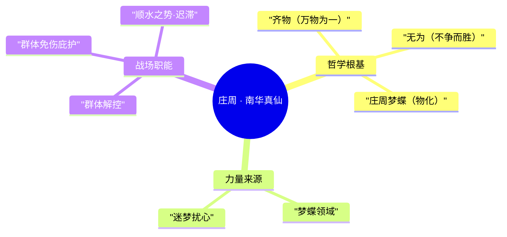

需要强调的是：以上为基于背景与公开设定的「设定向」描述，不涉及具体游戏数值与版本机制。

### 重要事件 / 剧情参与

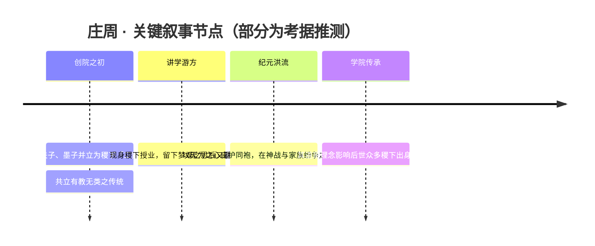

- 作为稷下学院创院「三贤者」之一，参与奠定学院「有教无类、广纳百家」的根基（见本阵营 relatedRelationships：师承「创院三贤者→众弟子」）。
- 在以学院为主题的剧情、动画与活动中，常以智者 / 守护者的角色出现，体现其超然立场（考据推测）。
- 其哲学与形象在游戏众多皮肤、活动与彩蛋中被反复致敬，是「道家逍遥」意象的代表性英雄。

### 羁绊关系

| 对象 | 关系 | 说明 |
| --- | --- | --- |
| [老夫子](jixia.md#老夫子) | 同为稷下创院三贤者 | 儒道相异、立场互补，共同奠定学院教化传统 |
| [墨子](mojia-jiguan.md#墨子) | 同为稷下创院三贤者 | 道与墨各执一端，理念相争却共守学院 |
| [孙膑](jixia.md#孙膑) | 稷下同门 / 后辈 | 同列稷下学院谱系，皆受三贤者传统熏陶 |
| [钟无艳](jixia.md#钟无艳) | 稷下同门 | 同属稷下学院师承网络中的成员 |
| [鲁班大师](mojia-jiguan.md#鲁班大师) | 稷下同门 | 同列稷下学院师承谱系 |
| [镜](changan.md#镜) | 稷下出身的后辈 | 曾受教于稷下，阵营归属已转往长安 |
| [曜](changan.md#曜) | 稷下出身的后辈 | 曾在稷下学习，阵营归属为长安 |
| [米莱狄](#米莱狄)、[澜](#澜)、[敖隐](#敖隐)、[海诺](#海诺)、[朵莉亚](#朵莉亚)、[宫本武藏](#宫本武藏) | 同列「海外·远东」叙事圈层 | 同被归入蓬莱·东海 / 海都板块，叙事意象上的远方同侪（非直接剧情关系） |

> 说明：诸葛亮 / 司马懿 / 周瑜等虽曾在稷下求学、与庄周同属「三贤者→众弟子」的师承脉络，但其阵营归属仍为蜀 / 魏 / 吴（详见本阵营 relatedRelationships 备注）。

### 经典台词

::: quote 南华真仙 · 庄周
「蝴蝶是我，我是蝴蝶。」（考据推测）

「相濡以沫，不如相忘于江湖。」（考据推测，化用其原型典故）

「逍遥，便是无所待。」（考据推测）

「天地与我并生，万物与我为一。」（考据推测，化用《齐物论》）
:::

### 皮肤故事亮点

庄周的代表皮肤大多围绕「梦」「蝶」「逍遥」三大母题展开：或以缤纷蝴蝶与梦境光影渲染「庄周梦蝶」的迷离意境，或以山水、垂钓、清风明月烘托其超然出尘的隐者气韵（考据推测：具体皮肤设定以游戏官方为准）。无论造型如何变换，「以柔守护、与世无争」的内核始终如一——这也正是这位南华真仙最动人的地方：在一个充满争夺的世界里，他选择成为那个让别人得以喘息的梦。

---

## 米莱狄

法师

**墨家机关道 · 端坐于海都之巅、以机关分身覆盖战场的少女总督**

| 档案 | 信息 |
| --- | --- |
| 称号 | 墨家机关道 |
| 定位 | 法师（推线 / 带线 / 召唤分身机关） |
| 所属 | [蓬莱·东海 / 海都](../factions/penglai-donghai.md) |
| 身份 | 塔之家族成员、海都总督；机关造物的设计者与操纵者 |
| 别称 | 海都总督、机关道少女（考据推测，民间常称） |
| 关系 | [庄周](#庄周)、[澜](#澜)、[海诺](#海诺)、[朵莉亚](#朵莉亚) · 跨阵营：[墨子](mojia-jiguan.md#墨子)、[鲁班大师](mojia-jiguan.md#鲁班大师)、[海月](yunzhong-modi.md#海月) |
| 登场作品 | 《王者荣耀》（海都 / 阿尔卡纳世界观系列英雄） |

### 背景故事

米莱狄出身于海都最为显赫的奥秘家族之一——**塔之家族**。在王者大陆极西、深海之畔的海洋都市[海都](../factions/penglai-donghai.md)，自诸神之战后的纪元起，十一个夺取过奇迹之力却因此背负诅咒的奥秘家族（亦称神职家族）便在这座蓝白色调的异域学者之城里彼此倾轧、争夺权柄。月之家族曾被派往海都，而塔之家族在漫长的家族权力斗争中最终胜出，赢得了**海都总督**之位。米莱狄，正是这一胜利谱系中走到台前的继承者。（考据推测：关于塔之家族夺位的细节，依据本阵营设定推演，游戏官方对米莱狄个人世系的明确叙述有限。）

与其他奥秘家族多倚仗血脉中的诅咒之力不同，米莱狄走的是一条迥异的道路——**机关道**。她痴迷于墨家流传下来的机关术与造物之学，将冰冷的齿轮、符文与机括视作可以信赖的伙伴。在一座被歌谣、鲛人与古老诅咒环绕的海洋之城里，这个埋首于图纸与机括的少女显得格外特别：她不靠神血，而靠智慧与工巧，造出能替自己思考、替自己行动的「分身」。这份对机关的执着，也是她与遥远的[墨家机关城](../factions/mojia-jiguan.md)在精神上的隐秘呼应——尽管身处极西海都，她的称号「墨家机关道」恰恰指明了她技艺的源流：[墨子](mojia-jiguan.md#墨子)所代表的机关与兼爱之学，以及[鲁班大师](mojia-jiguan.md#鲁班大师)那一脉机关造物的传承（考据推测：两地机关术的师承关联属设定层面的呼应，非明确的直系师徒）。

身为总督，米莱狄并非只是端坐高位的执政者。在一个家族阴谋盘根错节、权力随时可能因古老诅咒而翻覆的城市里，她以一种近乎冷静到孤独的姿态守护着海都的秩序。她深知，单凭一己之身无法掌控这座庞大的海洋都市，于是她让机关替她延伸——分身遍布城市的每一处角落，如同她意志的投影。这种「以机关覆盖全局」的统御方式，既是她作为法师在战场上的能力来源，也是她作为总督治理海都的政治隐喻：**她无处不在，却又始终隐身于齿轮的轰鸣之后。**

### 性格与形象

米莱狄是一位外表稚气、内里却异常沉静老练的少女。她话语不多，习惯用造物与机关说话；在喧嚣的家族纷争与海浪歌谣之间，她常常显得疏离而专注，仿佛整个世界对她而言都是一张可以拆解、重组的图纸。

在形象上，她契合海都「蓝白色调、异域学者风」的整体美学：浅色调的衣装、精巧的机械配件，以及随身漂浮、可随时展开为分身的机关造物。她的象征意象是**齿轮与分身**——一个少女，身后却跟随着无数个「自己」，既孤独，又强大。这种「一人即一军」的意象，让她在以鲛人、龙族、歌谣为主旋律的海都群像中独树一帜：当别人用血脉与神力时，她用的是智慧、工巧与不知疲倦的机括。

### 战斗风格与能力（设定向）

米莱狄的力量核心是**墨家机关术与召唤造物**。她并不亲自冲锋陷阵，而是以「机关道」操纵一队听命于她的分身机关，让它们替她推进、缠斗、覆盖战场。这与游戏中她「推线 / 带线、召唤分身机关」的法师定位完全一致——她是战场上的「调度者」，而非肉搏者。

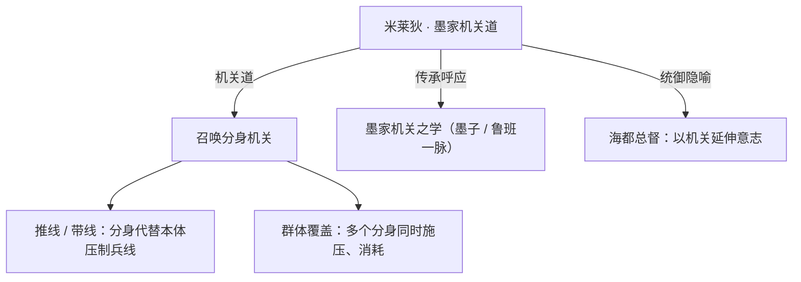

- **机关分身**：她最具标志性的能力。分身既能替她承担推线压力，又能在团战中形成多点打击，把「一个法师」变成「一支机关军团」。
- **造物之学**：基于墨家机关道的设定，她的装备并非魔法神器，而是由齿轮、符文、机括组合而成的精密造物，体现「以工巧胜神力」的理念。
- **战术取向**：偏向运营与全局调度——通过分身的带线与覆盖，逼迫对手疲于奔命，再于关键节点集中机关之力。这正是她「总督式」战斗哲学的延续：不与你正面争一城一池，而是让你在每一处都疲于应对。

（说明：以上为基于背景设定的描述，不涉及具体游戏数值；分身机关的具体机制以游戏内为准。）

### 重要事件 / 剧情参与

- **塔之家族夺位 / 出任海都总督**：作为塔之家族在家族斗争中胜出的成果，米莱狄登上海都总督之位，成为这座极西海洋都市的执政核心（考据推测：基于阵营设定推演）。
- **海都群像剧情**：作为海都 / 阿尔卡纳世界观下的英雄之一，她与[澜](#澜)、[敖隐](#敖隐)、[海诺](#海诺)、[朵莉亚](#朵莉亚)等同处一片海域，共同构成海都「奥秘家族阴谋 + 鲛人歌谣 + 龙族遗裔」的叙事拼图。
- **机关道的源流呼应**：她的技艺与[墨家机关城](../factions/mojia-jiguan.md)遥相呼应，是「机关之学跨越海陆」这一母题的体现。

### 羁绊关系

| 对象 | 关系 | 说明 |
| --- | --- | --- |
| [庄周](#庄周) | 同阵营 · 海外远东 | 同属[蓬莱·东海 / 海都](../factions/penglai-donghai.md)群像；庄周为道家智者，米莱狄为机关执政者，分别代表「道」与「术」的两端。 |
| [澜](#澜) | 同城海都 | 同处海都海域；澜为鲛人血脉的少年刺客，与总督所治理的城市秩序构成「秩序与复仇」的张力（考据推测）。 |
| [海诺](#海诺) | 同城 · 奥秘家族 | 海诺为海都阿尔卡纳命运家族族长，与塔之家族同属海都奥秘家族体系，家族间存在权力交集。 |
| [朵莉亚](#朵莉亚) | 同城海都 | 拥有神之血脉的鲛人公主，与米莱狄分别代表海都「神血」与「机关」两种力量路径的对照。 |
| [墨子](mojia-jiguan.md#墨子) | 机关源流呼应 | 墨家机关与兼爱之学的代表；米莱狄称号「墨家机关道」即指明其技艺源流（考据推测，非直系师承）。 |
| [鲁班大师](mojia-jiguan.md#鲁班大师) | 机关造物呼应 | 同为机关造物一脉，二者在「以工巧造物」上精神相通。 |
| [海月](yunzhong-modi.md#海月) | 月之家族关联 | 海月为「月之子」，与海都设定中「月之家族被派往海都」的线索存在潜在牵连（考据推测）。 |

### 经典台词

::: quote 米莱狄
「机关之道，在于不必亲临，便已无处不在。」（考据推测）
:::

::: quote 米莱狄
「神血会枯竭，诅咒会反噬——可齿轮，永远忠诚。」（考据推测）
:::

::: quote 米莱狄
「海都很大，而我，只需要分出足够多的『自己』。」（考据推测）
:::

---

## 澜

刺客

**鲨之猎刃 · 自深海归来、以复仇为名的鲛人猎刃**

| 项目 | 内容 |
| --- | --- |
| 称号 | 鲨之猎刃 |
| 定位 | 刺客 |
| 所属 | [蓬莱·东海 / 海都](../factions/penglai-donghai.md) |
| 身份 | 拥有鲛人血脉的少年、海岛遗孤、深海游猎者 |
| 别称 | 鲨刃少年、与鲨同行者（考据推测） |
| 关系 | [朵莉亚](#朵莉亚)、[敖隐](#敖隐)、[海诺](#海诺)、[米莱狄](#米莱狄)、[宫本武藏](#宫本武藏)、[阿轲](jianghu-xiake.md#阿轲) |
| 登场作品 | 《王者荣耀》本传英雄 |

### 背景故事

澜出身于王者大陆极西、深海之畔的海洋世界——这是一片由 [蓬莱·东海 / 海都](../factions/penglai-donghai.md) 所统辖的辽阔海域。在这片以鲛人歌谣守护千年宁静的水域之中，散布着无数依海而生的岛屿与渔村，澜便是在这样一座不起眼的海岛上度过了童年。他并非纯粹的人类，其血管之中流淌着鲛人一族的血脉，因而生来便与海洋有着远超常人的亲缘——他能在深水中如鱼般呼吸与潜行，能听懂潮汐与暗流的低语，更能与海中最凶猛的猎食者结下不解之缘。

然而，平静并未长久。海都看似宁谧的表象之下，是 11 个反叛的奥秘家族（神职/秘术家族）为争夺奇迹之力而展开的、绵延数百年的明争暗斗。这场永不停息的权力倾轧并不止于海都城内的厅堂，它的余波随着海流向外蔓延，化作劫掠、征伐与吞并，最终碾过了澜赖以生存的那座小岛。家园在一夜之间倾覆，亲人与同伴消散于血色的浪涛里，少年于废墟与残骸之间幸存下来，从此孤身漂泊于汪洋。（考据推测：澜「背负海岛复仇」的具体仇敌指向，官方留白，此处依阵营「奥秘家族阴谋」基调推演。）

孤儿澜被大海所收留，也被大海所淬炼。在那些无人知晓的岁月里，他与鲨群为伴，向最古老、最沉默的捕食者学习如何潜近、如何等待、如何在猎物毫无察觉之时给出致命的一击。鲛人的血脉让他得以驾驭这些海中利刃，而失去一切的痛楚则将他打磨成一柄更冷、更利的刀。当他终于重返人世，少年的眼神里已不再有渔村孩童的天真，取而代之的是猎手的沉静与复仇者的执拗。他循着那场灾难残留的线索，一路追向海都权力斗争的漩涡中心——对他而言，找出倾覆故乡的元凶、了结这段宿怨，就是支撑他游过整片黑暗深海的唯一信念。

也正因如此，澜的命运与同处东海一隅的诸多少年纠缠在了一起：同样背负族群倾覆之痛、消隐龙族的后裔 [敖隐](#敖隐)；以歌谣治愈与守护海洋的鲛人公主 [朵莉亚](#朵莉亚)；以及自海难中获救、被卷入命运家族纷争的少年 [海诺](#海诺)。他们各自怀着不同的伤痕，却共同身处同一片被阴谋与诅咒笼罩的海域。

### 性格与形象

澜是典型的"少年外壳、猎手内核"。他寡言、冷峻，不轻易吐露内心，待人始终保持着一段如深水般的距离——这是孤独求生者本能的警惕。然而在这层冷硬的外壳之下，他并未真正泯灭少年的赤诚：对故乡的眷恋、对失去之物的执念，都化作了他行动里不肯熄灭的火。他的复仇不是滥杀，而是有目标、有耐心的"狩猎"，这让他比纯粹的杀戮者更危险，也更克制。

形象上，澜以鲜明的海洋元素塑造：青蓝、深蓝交织的发色与衣饰呼应深海，肌肤上若隐若现的鲛人纹路是其血脉的印记。他最具辨识度的伙伴是一头与之并肩游猎的鲨——这头鲨既是他的武器，也是他孤独岁月里唯一的同类与亲友的象征。少年与利齿巨兽相伴的画面，构成了"鲨之猎刃"这一称号最直观的意象：人即是刃，鲨亦是刃，二者合一，往来于碧波之间。整体气质带有海都"蓝白色调异域学者风、海浪鲛人元素"的统一美学。

### 战斗风格与能力（设定向）

澜的战斗哲学完全脱胎于他在深海与鲨群为伍的猎手经历——**潜近、突袭、收割、退离**，循环往复，如同鲨鱼绕着猎物画出的死亡弧线。

- **鲨刃合一**：澜的核心战力源自他与那头巨鲨的羁绊。设定中，他能召唤鲨随之冲锋、撕咬，将巨兽化作延伸自身意志的活体武器；人与鲨彼此呼应，形成连绵不断的进退连招。
- **位移连招**：作为刺客，澜以高机动的位移突进著称——他借由一次次的冲刺与回返在战场上往复穿梭，能瞬间贴近脆弱的后排目标，得手后又能迅速脱离，重演鲨鱼"咬一口便退入暗处"的猎食节奏。
- **鲛人血脉**：流淌的鲛人之血赋予他超越常人的水性与对海洋之力的亲和，是其驾驭鲨群、感知战机的天赋根基。

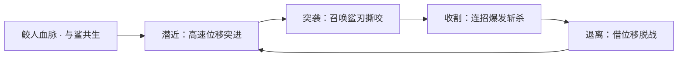

（说明：以上为基于背景设定的力量来历描述，非游戏数值或确切技能机制。）

### 重要事件 / 剧情参与

- **海岛倾覆**：故乡在海都权力斗争的余波中毁灭，是塑造澜复仇动机的根本事件。
- **与鲨同行的求生岁月**：在大海中独自存活、向鲨群习得猎杀之道，完成由渔村少年到"鲨之猎刃"的蜕变。
- **重返海都、追索宿仇**：循线索回到海都，卷入奥秘家族的纷争漩涡。
- **东海少年群像**：与 [敖隐](#敖隐)、[朵莉亚](#朵莉亚)、[海诺](#海诺) 等同代海洋英雄共同构成 [蓬莱·东海 / 海都](../factions/penglai-donghai.md) 的新生代叙事。

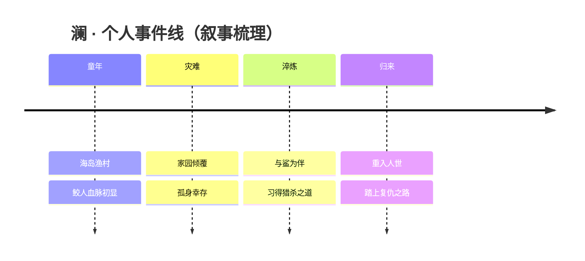

### 羁绊关系

| 对象 | 关系 | 说明 |
| --- | --- | --- |
| [朵莉亚](#朵莉亚) | 同海域 · 鲛人同源 | 同为带有鲛人元素的东海英雄；朵莉亚以歌谣治愈守护海洋，与以利齿复仇的澜形成"歌与刃"的对照（考据推测）。 |
| [敖隐](#敖隐) | 同代 · 同病相怜 | 二者皆为族群倾覆后的少年遗孤、于灾难中幸存重出，背景母题高度呼应（考据推测）。 |
| [海诺](#海诺) | 同海域少年 | 同处海都阴谋漩涡、被命运纷争所裹挟的少年群像之一（考据推测）。 |
| [米莱狄](#米莱狄) | 阵营 · 海都总督 | 米莱狄为塔之家族成员、海都现任总督，澜的复仇所牵涉的权力斗争正发生于其所统辖的海都之内。 |
| [宫本武藏](#宫本武藏) | 同阵营 · 东海武道圈 | 同归东海/海都叙事圈层的高机动近战角色，路数互为映照（考据推测）。 |
| [阿轲](jianghu-xiake.md#阿轲) | 刺客同道 | 跨阵营的同定位刺客，皆以信念/执念驱动的"刃"自喻（考据推测）。 |

### 经典台词

::: quote 澜 · 语音
"深海之下，没有谁能逃过鲨的猎杀。"（考据推测）
:::

::: quote 澜 · 语音
"潮水会带走一切，但仇恨不会。"（考据推测）
:::

::: quote 澜 · 语音
"跟上，别落在鲨的后面。"（考据推测）
:::

---

## 敖隐

射手

**渊蛟 · 背负龙族隐秘、于风雨中觉醒血脉的少年后裔**

| 档案项 | 内容 |
| --- | --- |
| 称号 | 渊蛟 |
| 定位 | 射手 |
| 所属 | [蓬莱·东海 / 海都](../factions/penglai-donghai.md) |
| 身份 | 消隐龙族（隐龙一脉）最后的血裔、四剑御者 |
| 别称 | 渊蛟、"最后的龙"、白发少年（觉醒后）（考据推测） |
| 关系 | [澜](#澜)、[朵莉亚](#朵莉亚)、[海诺](#海诺)、[庄周](#庄周) |
| 登场作品 | 英雄先导动画 / CG（2024 年 1 月公布上线）；世界观体验站英雄故事 |

### 背景故事

敖隐是一名背负龙族隐秘的少年。在王者大陆的远古纪元里，龙族曾是护佑世间生灵的存在——它们以自身横亘于天地灾劫之前，是人间得以延续的隐形屏障。然而护佑总要付出代价：在一场倾覆性的浩劫中，龙族为庇护苍生而接连陨落，曾经盘踞云海的庞大族群几近灭绝，只余下零星血脉飘零于世。

在族群倾覆的那一夜，仅存的龙族战士——也就是敖隐的爷爷——为了保全这最后一条血脉，倾尽了自己的生命之力。传说中，他正是在那一夜耗尽伟力、一夜白头。自此，老人带着年幼的敖隐隐姓埋名，藏身于人世的边缘，把"龙"的身份连同那段辉煌与悲怆一并掩埋。"隐"既是他的名字，也是这一脉的宿命：消隐于世，方能存续于世。

敖隐就在这样的遮蔽中长大。他并不完全知晓自己流淌着怎样的血，只在风雨大作的时节，隐约感到体内有什么在躁动、在回应天穹的雷霆。直到血脉真正觉醒的那一刻——他获得了**虚空御物**之能，可凭意念驭使悬于身侧的神剑，号令风雨雪火。觉醒并非全然的喜悦，它更像是一道迟来的传召，把少年从平静的隐居推向了对身世之谜的探寻：我是谁？我的族人去了哪里？为何"龙"之名要被如此小心地藏起？

命运的转折以最残酷的方式降临。庇护了他多年的爷爷，最终死在强敌手中。失去至亲的剧痛与悲愤，成了敖隐彻底接纳先祖之力的引信——他在崩溃的边缘没有沉沦，而是迎着力量的洪流挺身向前，接续起整个龙族遗留于世的伟力，于一场决死之战中击败了那名强敌。这一战不只是复仇的了结，更是一次身份的认领：他不再是那个被藏起来的孩子，而是自觉担起族名的最后一龙。

"作为遗留世间最后的龙，一人即是一族。"敖隐由此立下志向——他所立足之地，便是龙族立身之处；龙族之名，也将因他一人而重现于天地。他踏上漫游之路，足迹及于王者大陆的边远海疆。在以海洋文明著称的[蓬莱·东海 / 海都](../factions/penglai-donghai.md)，他与同样身负血脉宿命的鲛人少年、深海公主们交汇——那是另一群被纪元浪潮推着前行的"遗孤"。在这片蓝白色调、歌谣与奥秘交织的极西之地，渊蛟之名（取"渊"之深、"蛟"之将龙未龙）恰与他"尚在路上的龙"的处境暗合：他是潜行于深渊、终将破水而出的存在。（其与海都阵营的具体牵系属本设定集的世界观编排，官方背景未作硬性界定，余者为考据推测。）

### 性格与形象

敖隐性格沉静而坚韧，带着远超年龄的孤勇。长年隐居与丧亲之痛，让他不善张扬，却在内里燃着一股"不屈之心"——既是对身世真相的执拗追索，也是对重塑龙族辉煌这一近乎不可能之愿的笃定。他不因孤身一脉而自怜，反以"一人即一族"自任，把整个族群的重量背在少年的肩上。

外形上，他的核心意象凝聚于觉醒后的标志——传承自爷爷的**一夜白发**，那是龙族以生命为代价护佑血脉的具象化烙印。环绕其身的四柄神剑悬空旋舞，时而泛起烈火的赤、海波的青、长风的白、霜雪的寒，构成他最鲜明的视觉符号。整体气质介于"少年"与"古龙"之间：外是清隽不羁的漫游者，内是沉睡苏醒的渊中之蛟，象征着衰微族群于绝境中重新升腾的希望。

### 战斗风格与能力（设定向）

敖隐的力量根植于觉醒的龙族血脉与"虚空御物"之能——他无需以手持握，便能凭意念将神剑悬控于身周，进退、攻防皆由心驭。其招式体系围绕**四柄神剑**展开，分掌四时四象之力：**掌火、管雨、司风、控雪**。

- **火**：当剑上附着火之力时，敖隐之势灼如烈火，攻伐凌厉、势不可挡。
- **水（雨）**：当剑上附着水之力时，他唤四海之波润泽自身，以柔韧续航与自我调息见长。
- **风**：当剑上附着风之力时，他大步流星、身法飘忽，更能号令长风击退来敌。
- **雪**：霜雪之力则主迟滞与封锁，令敌势凝结受制。

由这一"四属神剑"机制，引申出他作为射手的"双形态"战斗风貌：御剑攻伐与属性切换之间的张力，使他不同于寻常的持弓远射手，而以独特机制著称——既能远程倾泻剑势，又能借属性流转改换攻防节奏。（以上为基于背景设定的力量来历描写，不涉及游戏内具体数值。）

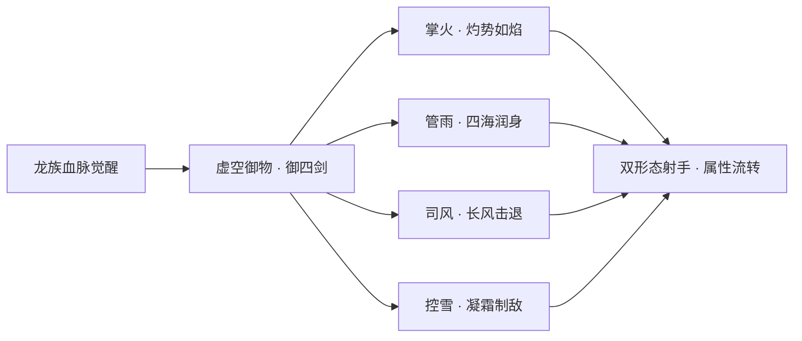

### 重要事件 / 剧情参与

- **族群倾覆之夜**：龙族为护佑生灵而陨落，爷爷耗尽生命力一夜白头，携幼年敖隐隐姓埋名。
- **血脉觉醒**：于风雨中感应先祖之力，获得"虚空御物"御剑之能，踏上探寻身世之路。
- **爷爷之死与决死反击**：至亲被强敌所杀，敖隐悲愤中彻底接纳先祖力量爆发，击败强敌，自此自认"最后的龙"。
- **重出于世 · 漫游海疆**：以"一人即一族"之志重现龙族之名，足迹延至[蓬莱·东海 / 海都](../factions/penglai-donghai.md)等远东海洋之地（本设定集编排）。
- **先导动画 / CG**：2024 年 1 月公布先导动画并上线，正式以"双形态射手"形象登场（考据：彼时官方宣传强调其独特御剑机制）。

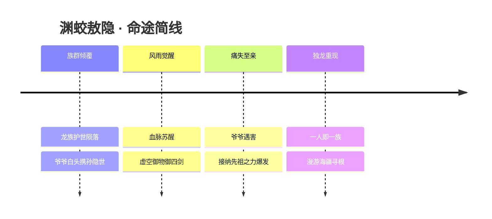

### 羁绊关系

| 对象 | 关系 | 说明 |
| --- | --- | --- |
| 爷爷（隐龙战士） | 至亲 · 守护者 | 龙族仅存的战士，耗尽生命力一夜白头以保全敖隐血脉；其死激发敖隐彻底觉醒。（人物未单独立传） |
| 龙族先祖 | 血脉 · 传承 | 敖隐接纳先祖之力而爆发，立志重现龙族之名，"一人即是一族"。 |
| [澜](#澜) | 同阵营 · 同辈 | 同为[蓬莱·东海 / 海都](../factions/penglai-donghai.md)身负血脉宿命的少年（鲛人血脉刺客），可视作命运相映的同辈（本设定编排）。 |
| [朵莉亚](#朵莉亚) | 同阵营 · 海洋之缘 | 深海歌姬、拥有神之血脉的鲛人公主，与敖隐同属海都叙事圈层（考据推测的世界观联系）。 |
| [海诺](#海诺) | 同阵营 · 海都同侪 | 海都阿尔卡纳命运家族族长，同为远东海洋文明中的关键人物（本设定编排）。 |
| [庄周](#庄周) | 同阵营 · 远东智者 | 归属同一海外·远东navGroup的道家智者，象征该阵营广纳异域人物的格局（关联弱，考据推测）。 |

### 经典台词

::: quote 渊蛟之声
"作为遗留世间最后的龙，一人，即是一族。"（考据推测，源自官方故事文案"一人即是一族"之意）

"我所立之地，便是龙族立身之处。"（考据推测）

"火、雨、风、雪——皆听我号令。"（考据推测，依四剑设定撰写）

"爷爷……这一次，换我来护着这条血脉。"（考据推测）
:::

---

## 海诺

法师战士

**命运家族族长 · 在海难中被「命运」选中、于远近形态间切换的阿尔卡纳继承者**

| 档案项 | 内容 |
| --- | --- |
| 称号 | 命运家族族长 |
| 定位 | 法师 / 战士 |
| 所属 | [蓬莱·东海 / 海都](../factions/penglai-donghai.md) |
| 身份 | 海都阿尔卡纳「命运家族」族长、海难获救的少年 |
| 别称 | 命运之子、塔罗少年（考据推测） |
| 关系 | [朵莉亚](#朵莉亚)（羁绊 / CP）、[米莱狄](#米莱狄)（海都总督·塔之家族）、[澜](#澜)、[敖隐](#敖隐) |
| 登场作品 | 英雄背景故事；致敬安徒生童话《海的女儿》 |

### 背景故事

海诺的故事始于一场倾覆的海难。在王者大陆极西、深海之畔的[蓬莱·东海 / 海都](../factions/penglai-donghai.md)海域，狂涛吞没了一艘航船，少年海诺随破碎的船板一起沉入冰冷的海水。在他即将被黑暗淹没、生命之线行将断绝的刹那，是一支来自深海的歌谣将他从死亡边缘托起——他被一位拥有神之血脉的鲛人公主[朵莉亚](#朵莉亚)所救。这一幕，正是这一组英雄背景对安徒生童话《海的女儿》的温柔致敬：人鱼救起溺水的少年，自此命运彼此缠绕。

海都并非寻常之地。它是极西海洋文明的核心都市，蓝白色调、异域学者之风弥漫其间。在更古远的纪元里，曾发生过诸神之战；战后，十一个反叛的奥秘（神职）家族夺取了奇迹之力，却因此招致诅咒。这些家族被统称为「阿尔卡纳」（Arcana，塔罗大牌之名）——它们各自承袭一项奥秘，彼此之间为权力倾轧不休。月之家族被派往海都，塔之家族最终胜出、夺得海都总督之位，由[米莱狄](#米莱狄)所代表的塔之家族执掌都市权柄（参见阵营设定）。而海诺，则与其中最特殊的一支——「命运家族」（The Arcana of Fortune / 命运之轮，考据推测对应塔罗「命运之轮」）——结下了不解之缘。

获救之后的海诺，被卷入了海都阿尔卡纳家族的漩涡。命运家族承袭的奥秘，正是对「命运」本身的窥探与拨弄；而失去了血脉传承的它，需要一位新的族长来续写家族的命数。被深海歌谣救回的少年，仿佛是命运亲手挑选的继承者：他通晓被海水冲刷过的生死之界，也背负着一段被「命运」标记的因缘。于是，曾经只是一个普通海难幸存者的海诺，戴上了命运家族族长的徽记，成为在奥秘家族阴谋与海洋文明传统之间行走的少年掌权者（部分家族继承细节为考据推测，以官方背景为准）。

海诺的动机，始终被两股力量牵引。一股是「命运」——作为族长，他必须直面家族被诅咒的奇迹之力，在阿尔卡纳之间错综的权力斗争里保全自身、守护海都；另一股则是「情」——他从未忘记那道在深海中救起自己的歌声。他与朵莉亚的羁绊，是这个充满阴谋的海洋世界里少有的、纯粹的温柔。少年与人鱼公主之间隔着人与鲛、陆与海、凡躯与神血的重重界限，正如《海的女儿》中那道无法逾越的鸿沟；而海诺所执掌的「命运」，似乎正是为了改写这一段被注定的悲剧而存在。

### 性格与形象

海诺保留着海难幸存者特有的坚韧与早慧。他年纪尚轻，却因被推上族长之位而过早地学会了在权谋中权衡、在危局中决断；与海都那些工于心计的家族老者相比，他身上仍残留着一份被深海歌谣唤回的赤诚与重情。他温柔，却不软弱；对命运既敬畏，又不甘屈从。

形象上，海诺以蓝白为主色，契合海都异域学者的整体气质。他的造型常带有塔罗与星象的象征意象——命运之轮、星辰、卡牌般的纹饰，暗示其「命运家族族长」的身份。最具辨识度的，是他能在**远近两种形态之间切换**的设计：这一外形上的双面性，恰好呼应了他「法师 / 战士」的双重定位，也象征着他游走于「掌控命运的旁观者」与「亲身入局的搏命者」之间的内在张力。

### 战斗风格与能力（设定向）

海诺的力量根源，是命运家族所承袭的「奥秘」——一份在诸神之战后被夺取、又被诅咒缠绕的奇迹之力。他不以蛮力取胜，而是借「命运」之名，将概率、星象与卡牌之力化作攻防的武器（机制设定，非游戏数值）。

他在战斗中的核心特征，是**远近形态的切换**：

- **远程·法师形态**：以奥秘之力凝聚成的远程法术进行消耗与压制，对应其作为命运家族族长「拨弄命数、隔空决断」的一面。
- **近程·战士形态**：切入近身后转为更具压迫力的搏杀姿态，对应其「亲身入局、以命相搏」的另一面。

两种形态的自由切换，让他既能在后排如法师般掌控战场节奏，也能在前排如战士般撕开缺口——这正是其「法师 / 战士」双定位在叙事上的来源（具体招式名称与符号化命名以官方文本为准；含特殊符号的术语在下文事件线中以引号标注）。

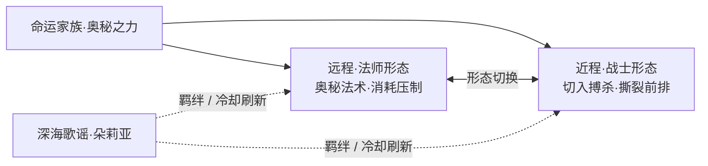

### 重要事件 / 剧情参与

- **海难获救**：随航船倾覆沉入海都海域，于命悬一线之际被鲛人公主朵莉亚以歌谣救起——海诺命运的起点，也是这组角色致敬《海的女儿》的叙事核心。
- **继承命运家族**：被「命运」选中，承袭海都阿尔卡纳十一家族之一的「命运家族」奥秘，登上族长之位，自此卷入奥秘家族间的权力斗争。
- **与朵莉亚的羁绊**：作为官方设定的 CP，二人在背景故事中互为牵绊；战斗设定上，朵莉亚可刷新队友技能冷却，与海诺的形态切换打法形成天然配合。
- **海都家族格局**：在塔之家族（[米莱狄](#米莱狄)·海都总督）执掌都市、各阿尔卡纳家族明争暗斗的背景下行动（具体官方剧情活动以游戏内文本为准，部分为考据推测）。

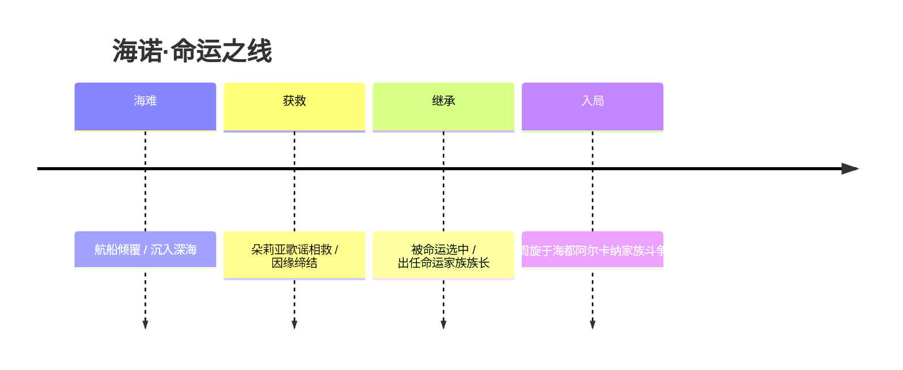

### 羁绊关系

| 对象 | 关系 | 说明 |
| --- | --- | --- |
| [朵莉亚](#朵莉亚) | 羁绊 / CP / 救命恩人 | 拥有神之血脉的鲛人公主，以深海歌谣救起溺水的海诺，二人因缘自此缠绕；致敬《海的女儿》。设定上她可刷新队友冷却，与海诺配合默契。 |
| [米莱狄](#米莱狄) | 同阵营 / 海都权力格局 | 塔之家族成员、海都总督，代表执掌都市的胜出家族；海诺所属的命运家族与之同处阿尔卡纳家族斗争的棋局之中。 |
| [澜](#澜) | 同阵营·海都 | 鲛人血脉的少年刺客，同属东海·海都海洋文明圈层。 |
| [敖隐](#敖隐) | 同阵营·东海 | 消隐龙族的少年后裔，同属蓬莱·东海阵营。 |

### 经典台词

::: quote 台词
「命运将你交到我手中，那我便不会再让它夺走你。」（考据推测）
:::

::: quote 台词
「歌谣救我于深海，我以命数还你一世安宁。」（考据推测）
:::

::: quote 台词
「命运之轮既已转动，谁也别想让它停下。」（考据推测）
:::

### 皮肤故事亮点

海诺的整体角色塑造与「命运家族 / 阿尔卡纳」的塔罗、星象意象高度绑定，蓝白色调与卡牌、命运之轮等符号贯穿其形象设计。他与朵莉亚作为官方 CP，常在以海洋、童话为主题的叙事与活动中成对呈现，延续《海的女儿》中少年与人鱼公主的浪漫母题（具体皮肤名称与剧情以官方公布为准，此处为考据推测）。

---

## 朵莉亚

辅助法师

**深海歌姬 · 以歌谣为引、治疗与控制兼备的鲛人公主**

| 档案 | 信息 |
| --- | --- |
| 称号 | 深海歌姬 |
| 定位 | 辅助 / 法师 |
| 所属 | [蓬莱·东海 / 海都](../factions/penglai-donghai.md) |
| 身份 | 东海鲛人一族的公主、拥有神之血脉的歌者 |
| 别称 | 深海歌姬、海之公主（考据推测） |
| 关系 | [海诺](#海诺)（命运羁绊 / CP）、[澜](#澜)（同源鲛人血脉）、[敖隐](#敖隐)（东海龙族 · 海洋同乡）、[米莱狄](#米莱狄)（海都·塔之家族总督）、[庄周](#庄周)（东海智者） |
| 登场作品 | 《王者荣耀》英雄；东海 / 海都世界观线（考据推测） |

### 背景故事

在王者大陆极西的尽头，陆地碎裂为礁、城市浮于潮汐之上，那里是被诸神之战的余波反复冲刷过的[海洋文明——海都与东海](../factions/penglai-donghai.md)。传说在更深的海沟之下，居住着以歌谣守护海洋宁静千年的鲛人一族。他们不持刀兵，却以声音为约：当鲛人之歌响起，惊涛会退潮，迷航的船会找回方向，沉入海底的亡魂也能被温柔地安抚。朵莉亚，便是这古老歌者血脉中最被寄予厚望的一位——东海鲛人的公主。

与族中寻常的鲛人不同，朵莉亚的体内流淌着**神之血脉**（考据推测）。在诸神之战的纪元里，奇迹之力曾如星雨般洒落人间与海域，留下了无数被神祇恩典或诅咒过的血统。鲛人一族世代以歌守海，而神血的觉醒让朵莉亚的歌声拥有了远超寻常的力量：她的吟唱不只是抚慰，更能让伤口愈合、让疲惫的同伴重新焕发气力，甚至能拨动命运本身的弦——让本应耗尽的力量再度回到掌心。族人既以她为荣，也隐隐为她担忧，因为承载神之血脉者，往往也被卷入凡间最汹涌的洪流。

朵莉亚的命运，与海面之上的世界紧紧缠绕。海都，这座极西的海洋都市，自诸神之战后便深陷于[奥秘家族（阿尔卡纳家族）](../factions/penglai-donghai.md)的权力漩涡之中——昔日反叛的神职家族夺取奇迹之力而遭诅咒，被流放、被分封、彼此倾轧。月之家族被派往海都，塔之家族最终胜出执掌总督之位，而散落各处的其余家族则在阴影里各怀心事。就在这样一片暗流涌动的海域，朵莉亚遇见了她生命中最重要的人——[海诺](#海诺)。

关于他们的相遇，最广为流传的版本带着古老童话的影子：海诺曾是一名在风暴中遭遇海难、命悬一线的少年，是朵莉亚循着溺水者的呼救潜入深渊，用自己的歌声与神血之力，将他从死亡的边界唤了回来。这段经历致敬了安徒生的《海的女儿》——一个海中的女子救起了濒死的人，从此心系陆地。只是在东海的故事里，结局并未走向童话式的牺牲与泡沫：被救起的海诺日后成为了海都**阿尔卡纳·命运家族的族长**，执掌着窥探与扭转命运的奥秘之力；而朵莉亚，则成为他生命中那道始终牵引着潮汐方向的光。深海歌姬与命运族长，一个以歌谣治愈、一个以命运博弈，二人成为东海故事线中被反复书写的一对羁绊（CP）。

然而身为公主，朵莉亚的歌声从来不只属于一个人。海洋的宁静正受到威胁——血族的暗影曾蔓延至东海武道圈、消隐的[龙族](#敖隐)经历过族群的倾覆、海岛与海岸线上仇恨的火种从未熄灭。当奥秘家族的阴谋越过海平面、当深海的古老平衡被贪婪之手撬动，朵莉亚不得不离开庇护她千年的海沟，浮出水面，以一介歌者之身介入这场关于权力、命运与海洋存亡的洪流。她选择站在守护者的一侧：不是为了王座，而是为了让那首守海千年的歌谣，能够继续被海浪传唱下去。

### 性格与形象

朵莉亚兼具公主的高贵与歌者的温柔。她并不张扬，却有一种近乎天真的执拗——一旦认定了要守护的人与事，便会以全部的歌声去回应。作为在深海被呵护着长大的公主，她对陆地世界保有好奇与善意；而神之血脉带来的天赋，又让她比同龄人更早懂得「力量意味着责任」的分量。

在形象上，朵莉亚是典型的**鲛人意象**：飘逸的长发如海藻般随波荡漾，肌肤泛着深海特有的珠光与蓝白冷色（呼应海都阵营「蓝白色调、海浪鲛人元素」的整体基调），身姿之下隐约可见鳞光与鳍影。她的周身常环绕着光晕般的水纹与气泡，仿佛连空气都被她的歌声谱成了音符。象征意象上，她是**海螺与歌声**——海螺贴耳便能听见海的回响，正如她的吟唱能将治愈与力量送达远方；同时她也是「海的女儿」式的浪漫投影：在风暴与命运之间，以柔克刚的那一缕温柔。

### 战斗风格与能力（设定向）

朵莉亚不以利刃伤敌，而以**歌谣为引、神血为源**。她的力量根植于鲛人一族世代相传的吟唱之术，再被体内的神之血脉放大——声音化作具象的水之韵律，既能编织成治愈的潮汐，也能凝结为束缚的浪涌。

- **治疗之歌**：以吟唱为媒介，让水的韵律包裹同伴，抚平伤痛、恢复气力。这是鲛人「以歌守海、安抚亡魂」传统最直接的体现。
- **控制之潮**：神血让她的歌声拥有干涉之力，能掀起束缚敌人的浪、降下减速与定身的余音，为队友创造进攻与脱身的窗口，兼具辅助与法师的控场能力。
- **命运的回响 · 冷却刷新**：朵莉亚最为标志性的能力，是能够**刷新队友的技能冷却**（设定上呼应其与命运家族[海诺](#海诺)的牵绊与「神之血脉」对时间与力量的拨动）。一曲既起，已经耗尽的招式得以重新蓄势——这让她成为团队节奏的指挥者，能让一次爆发变为两次，让濒死的局面被一首歌翻转。

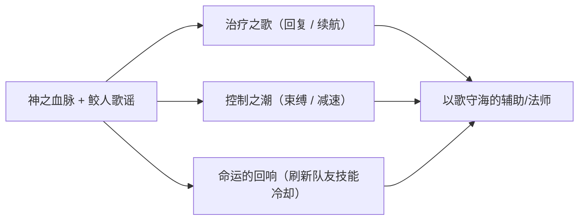

（注：以上为基于背景设定的能力描写，非游戏内具体数值；具体技能机制以游戏正式版本为准。）

### 重要事件 / 剧情参与

- **海难相救 · 与海诺的初遇**：以歌声将濒死的海诺自死亡边界唤回，致敬《海的女儿》，成为东海故事线最著名的羁绊起点。
- **浮出深海 · 介入海都纷争**：当奥秘家族的阴谋威胁到海洋的古老平衡，朵莉亚离开深海，以歌者之身卷入海都的权力洪流。
- **东海 / 海都世界观线**：作为拥有神之血脉的鲛人公主，与[米莱狄](#米莱狄)（塔之家族·总督）、[澜](#澜)、[敖隐](#敖隐)等东海角色共同织就极西海洋文明的群像（考据推测，具体剧情以官方公布为准）。

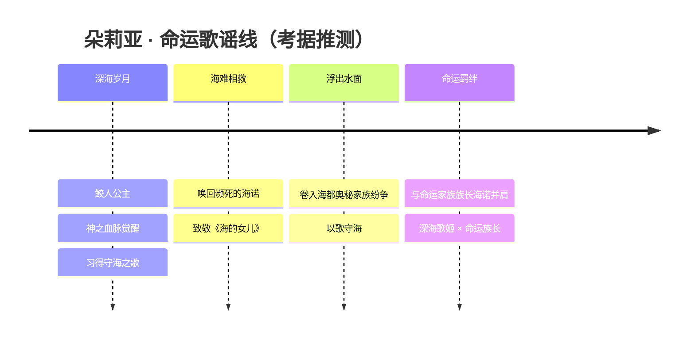

### 羁绊关系

| 对象 | 关系 | 说明 |
| --- | --- | --- |
| [海诺](#海诺) | 命运羁绊 / CP | 被朵莉亚以歌声从海难中救回的少年，日后成为海都阿尔卡纳·命运家族族长。深海歌姬与命运族长是东海故事线核心的一对羁绊，致敬《海的女儿》。 |
| [澜](#澜) | 同源血脉 | 同为拥有鲛人血脉的东海角色，背负海岛与复仇之命运（鲛人血脉的关联，考据推测）。 |
| [敖隐](#敖隐) | 海洋同乡 | 消隐龙族的少年后裔，与朵莉亚同属东海海域的古老族群，皆经历族群命运的起伏（考据推测）。 |
| [米莱狄](#米莱狄) | 海都同阵营 | 塔之家族成员、海都总督，是朵莉亚所处海都政局的执掌者之一。 |
| [庄周](#庄周) | 东海智者 | 同属蓬莱·东海阵营的辅助、逍遥道者，团队中同为守护与解控的存在。 |

### 经典台词

::: quote 深海歌姬之声（考据推测）
「听见海的歌声了吗？那是我对你的回应。」
:::

::: quote
「沉睡的力量，随这一曲，再度归来吧。」
:::

::: quote
「我曾把你从死亡里唤回——这一次，也绝不会松手。」（致敬《海的女儿》，考据推测）
:::

### 皮肤故事亮点

（考据推测）朵莉亚的形象与皮肤多围绕「鲛人 / 深海 / 歌姬」的核心意象展开，常以蓝白珠光的海洋色调、飘逸鳍羽与环绕水纹呈现「海的女儿」式的浪漫气质。具体皮肤名称与剧情以游戏官方公布为准。

---

## 宫本武藏

战士刺客

**二天一流 · 双刀斩血的游击剑圣，以一柄不败之名横渡东海风浪**

| 档案项 | 内容 |
| --- | --- |
| 称号 | 二天一流 |
| 定位 | 战士 / 刺客 |
| 所属 | [蓬莱·东海 / 海都](../factions/penglai-donghai.md)（扶桑武者，归东海武道圈层） |
| 身份 | 流浪剑客、武道大会冠军、斩血族者 |
| 别称 | 双刀剑圣、剑豪、"二天" |
| 关系 | [橘右京](liandong-snk.md#橘右京)（剑客之争 · 考据推测） · [不知火舞](fusang-xuezu.md#不知火舞)（同源扶桑 · 立场各异 · 考据推测） · [澜](#澜)（东海武道同侪 · 考据推测） |
| 登场作品 | 《王者荣耀》对战阵营英雄；扶桑武道题材皮肤系列 |

### 背景故事

宫本武藏并非生于王者大陆的中枢长安，也不是某一座学院里诵读经卷的门生。他来自更东更远的地方——扶桑列岛。那是一片被东海风浪反复淘洗的土地，山岚与海雾在清晨交织，刀光在道场与荒野之间流转。武藏自幼便握刀，却从未在哪一座固定的门派里长久停留。他是流浪者，是把整片山河当作道场的剑客，把每一次生死相搏都视作一次"求道"。

在《王者荣耀》的世界观里，扶桑这一隅与极西的海洋文明——[蓬莱·东海 / 海都](../factions/penglai-donghai.md)——经由海路与武道传统被归并入"海外 · 远东"的同一圈层。东海不只是地理上的边界，更是一道把不同来历的武者、鲛人、龙裔与奥秘家族牵连在一起的潮线。武藏正是踏着这条潮线而来：他斩过无数血族，名号在沿海的港市与岛屿间口耳相传，渐渐成了一个传说般的存在——一个独自背着双刀、走到哪里便把祸患斩到哪里的男人。

"二天一流"既是他的称号，也是他剑道的根本。所谓"二天"，意指他左右手各执一刀，长短双持、攻守一体——这正是历史上宫本武藏所创"二天一流"双刀剑术在游戏里的化用。在王者大陆的语境中，这套剑法被重新铸造成一种近乎残酷的高机动战法：他不靠堆叠的甲胄硬扛，而是以反复的突进、回旋与斩击，将敌人切割于电光石火之间。对武藏而言，剑不是杀戮的工具，而是一面照见自身的镜子——他斩出的每一刀，最终都指向"如何成为更强的自己"这个永无止境的命题。

武藏的动机，并不复杂，却异常坚定：变强，并在变强的路上不断寻找能逼出自己全部本领的对手。这种近乎偏执的求道之心，让他踏遍东海。当扶桑与海都一带因奇迹之力的余波、家族阴谋与潜伏的血族而暗流汹涌时，武藏的剑便有了用武之地。他不属于任何一座权力的高塔，也不臣服于任何家族的旗号——他只忠于自己的刀，以及刀所指向的"道"。也正因如此，他成了那种最难被收买、也最令祸乱忌惮的人：一个无所求、因而无所惧的剑客。

在武道大会上，武藏以一人之力问鼎冠军。那不是一场普通的比武，而是各路高手云集、以命相搏的角斗。武藏在其中以双刀连斩，几乎不给对手喘息的机会，最终立于擂台之巅。这一冠军之名，让"二天一流"四字真正响彻东海，也让他成为后来无数年轻武者仰望与挑战的标杆。

### 性格与形象

武藏是典型的"剑痴"。他寡言、孤高，对世俗的功名利禄毫无兴趣，唯独在面对强敌、面对一场酣畅淋漓的对决时，眼中才会燃起灼人的光。他的骄傲不是傲慢，而是一种对自身实力的清醒认知——他知道自己强，也知道唯有更强的对手才配得上他的全力。

外形上，武藏延续了扶桑武者的鲜明意象：束发或散发的浪客装束，腰间或背上一长一短的双刀，行走时带着随时拔刀的张力。他的象征意象集中在"双刀"与"风"——刀是他的根，风是他游击穿梭、来去如电的姿态。在视觉气质上，他与海都那套蓝白色调的异域学者风格形成对照：当庄周谈玄、米莱狄运机、朵莉亚吟唱海歌时，武藏更像潮线另一端那道凛冽的剑影，沉默、锋利、不容轻犯。

### 战斗风格与能力（设定向）

武藏的战斗哲学是"以快制胜、以斩破防"。他不与人比拼谁的盾更厚，而是用连绵不绝的位移与斩击，把对手拖入他所擅长的近身缠斗节奏。其招式来历，皆可上溯至"二天一流"的双刀之道：长刀开路、短刀补刃，攻守在双手之间无缝切换。

- **二天双刀**：左右手长短双刀，是他名号与剑术的本体。攻击时双刀连斩、回旋成圈，将突进与收割合为一体。
- **斩血之名**：长年斩杀血族所淬炼出的实战经验，使他的剑对潜伏在东海一带的邪祟格外致命——他斩的不只是人，更是那些不该存于世间的东西。
- **游击突进**：高机动是武藏的灵魂。他以反复的冲刺切入、再以斩击脱离，像潮水般来去，让对手始终摸不清他下一刀从何而来。

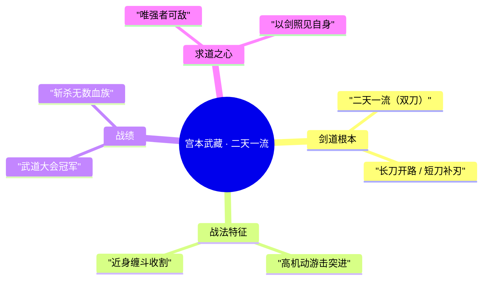

> 说明：以上为依据背景设定的力量与招式描述，不涉及具体游戏数值；招式名称多为对"二天一流"双刀剑术的叙事化转写。

### 重要事件 / 剧情参与

- **武道大会夺冠**：在群雄汇集、以命相搏的武道大会上以双刀连斩夺得冠军，"二天一流"之名自此响彻东海。
- **斩血族之役**：长年游历东海沿岸，斩杀无数潜伏的血族，以一己之剑守护港市与岛屿的安宁。
- **归入东海武道圈层**：作为扶桑武者，经海路与武道传统被纳入[蓬莱·东海 / 海都](../factions/penglai-donghai.md)的"海外 · 远东"叙事版图，与鲛人、龙裔、奥秘家族共处同一片潮线之下。

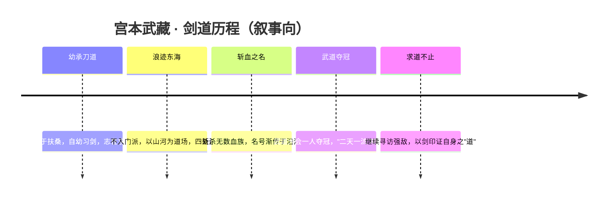

### 羁绊关系

| 对象 | 关系 | 说明 |
| --- | --- | --- |
| [橘右京](liandong-snk.md#橘右京) | 剑客之争（考据推测） | 同为以刀剑立身的孤高剑客，气质相近、立场各异，常被视为彼此的镜像式对手。 |
| [不知火舞](fusang-xuezu.md#不知火舞) | 同源扶桑 · 立场各异（考据推测） | 同属扶桑一脉的远东武者，源出同一片土地，却各行其道。 |
| [澜](#澜) | 东海武道同侪（考据推测） | 同被归入东海"海外 · 远东"圈层的近战好手，澜以鲨刃游走、武藏以双刀突进，皆是机动游击的代表。 |
| [敖隐](#敖隐) · [海诺](#海诺) · [朵莉亚](#朵莉亚) · [米莱狄](#米莱狄) · [庄周](#庄周) | 同阵营 · 海都群像 | 同属[蓬莱·东海 / 海都](../factions/penglai-donghai.md)的伙伴或邻人，构成海洋文明与远东武道交织的群像。 |

> 注：除阵营归属外，武藏与上述具体英雄的私人羁绊在官方设定中并无明确硬性交代，本表中标注"考据推测"者，系基于人物气质、出身与同圈层关系的合理推演，仅供叙事参考。

### 经典台词

::: quote 二天一流
"我的刀，只为更强的对手出鞘。"（考据推测）

"二天一流——左右双刀，斩尽眼前一切。"（考据推测）

"求道之路无止境，倒下的人不配谈剑。"（考据推测）
:::

### 皮肤故事亮点

- **扶桑武者题材皮肤系列**：武藏的皮肤多围绕"浪客剑豪"这一核心意象展开，强化其双刀、束发与凛冽刀气的视觉符号；不同皮肤在装束与配色上各有演绎，但万变不离"二天一流"的双刀根本与孤高求道的剑客气质。

> 说明：具体皮肤名称、剧情与上线版本以官方资料为准，此处仅就其共通的叙事亮点作概括（考据推测）。

::: tip 继续探索
返回 [蓬莱·东海 / 海都 阵营页](../factions/penglai-donghai.md) · 浏览 [全英雄图鉴](index.md) · 查看 [人物关系网](../relationships/index.md)
:::