# 三分之地·蜀国 · 英雄图鉴

> 阵营设定见 [三分之地·蜀国 阵营页](../factions/sanfen-shu.md)。本页收录该阵营 **9** 位英雄的深度小传。

!!! abstract "本页英雄名册"
    | 英雄 | 称号 | 定位 |
    | --- | --- | --- |
    | [刘备](#刘备) | 仁德义枭 | 战士 |
    | [关羽](#关羽) | 美髯公 | 战士 |
    | [赵云](#赵云) | 龙胆 | 战士/刺客 |
    | [马超](#马超) | 寒锋铁骑 | 战士/刺客 |
    | [张飞](#张飞) | 禁血狂兽 | 坦克/辅助 |
    | [诸葛亮](#诸葛亮) | 卧龙 | 法师 |
    | [黄忠](#黄忠) | 燃魂重炮 | 射手 |
    | [刘禅](#刘禅) | 无忧之主 | 坦克/辅助 |
    | [元歌](#元歌) | 无间傀儡 | 刺客 |

---

## 刘备

战士射击型

**仁德义枭 · 以仁心包裹枭雄之志、双枪连射的远近结合型战士**

| 档案项 | 内容 |
| --- | --- |
| 称号 | 仁德义枭 |
| 定位 | 战士（远近结合的射击型战士） |
| 所属 | [三分之地·蜀国](../factions/sanfen-shu.md) |
| 身份 | 蜀国之主、桃园结义的兄长、益城（蜀汉）势力的统领者 |
| 别称 | 玄德（考据推测，取自历史字号）、大耳贼（敌对方蔑称，考据推测） |
| 关系 | [关羽](#关羽)、[张飞](#张飞)（桃园结义兄弟）；[诸葛亮](#诸葛亮)（军师）；[赵云](#赵云)、[马超](#马超)、[黄忠](#黄忠)（麾下虎将）；[刘禅](#刘禅)（后主）；[孙尚香](sanfen-wu.md#孙尚香)（结发/联姻之妻） |
| 登场作品 | 《王者荣耀》本传（三分之地·蜀国阵营） |

### 背景故事

在「三分之地」这片被战火反复犁过的土地上，秩序早已碎裂成三块。曾经统辖一切的中枢权威黯淡之后，群雄并起，谁都想把破碎的版图重新拼回自己手中——魏、吴、蜀，三方势力以益城、江东与北境的疆界为界，彼此试探、彼此倾轧。刘备，便是其中蜀国一方的统领，世人称他「仁德义枭」。

「枭」与「仁」，本是两个互相撕扯的词。枭，意味着野心、隐忍、在乱世里活下去并向上爬的狠劲；仁，则意味着以民为念、以义待人、不肯踩着无辜者的尸骨登顶。刘备的传奇，恰恰生长在这两者的张力之间。他出身寒微，没有显赫家世可以倚仗，起家时手中只有一腔抱负与几位过命的兄弟。正因为尝过低处的苦，他比任何握惯权柄的人都更懂得：人心，才是乱世里最难夺、也最值得夺的东西。（考据推测：游戏沿用了历史上刘备「织席贩履」的寒门出身底色。）

他最为人称道的，是与[关羽](#关羽)、[张飞](#张飞)的「桃园结义」。在那片落英缤纷的桃林之下，三人对天起誓，不求同生、但求同死，结为异姓兄弟。这一誓约不是一时意气，而是贯穿刘备此后所有抉择的根：无论局势如何险恶，他始终把兄弟与追随者的性命放在自己的算计之前。蜀国之所以被描绘成「山清水秀、桃花绚烂的世外桃源」，侠肝义胆而又带着神秘气质，正源于这份以情义立国的气质——它不像魏国那样以权术与铁腕著称，也不像吴国那样以水军基业与门阀联姻立足，蜀国靠的是「人」：靠把一群英雄因「义」而聚拢在一面旗下。

为了让破碎的版图重新有秩序，刘备做了乱世枭雄都会做、却很少有人做得这样彻底的事——三顾茅庐，请出隐居的[诸葛亮](#诸葛亮)。卧龙出山，为他勾画出三分天下的方略，益城（蜀汉之都）由此真正成形。自此刘备身边谋有卧龙运筹帷幄，武有[关羽](#关羽)、[张飞](#张飞)、[赵云](#赵云)、[马超](#马超)、[黄忠](#黄忠)等一众猛将环卫——这便是蜀国「五虎」与「桃园」两大羁绊的源头，也是三分之地英雄数量最多的一方之所以能凝聚的核心。（考据推测：游戏中五虎将的具体编成沿用历史「五虎上将」之说。）

然而枭雄之路从无坦途。为牵制江东、巩固两家之盟，刘备与吴国结下了一段微妙的姻缘——他迎娶了江东的[孙尚香](sanfen-wu.md#孙尚香)。这桩婚事既是政治联姻，又掺进了真实的情意，成为三分格局里少有的、横跨敌我阵营的牵绊。基业立稳后，他将权柄与未竟之志一并托付给后主[刘禅](#刘禅)，让蜀国的故事得以在下一代延续。

刘备的动机始终清晰：他要的不是单纯的霸业，而是一个让追随者「不白死」的结局。在「枭」与「仁」之间反复权衡、在野心与情义之间走钢丝，正是这位仁德义枭留给三分之地最深的印记。

### 性格与形象

刘备的性格是一层「柔」包着一层「韧」。表面看，他温厚、克制、善于体察人心，待兄弟以诚、待百姓以仁，很少疾言厉色；但温和之下藏着极强的意志与判断——他能在最低谷时忍住不发作，也能在关键时刻为大局做出冷峻取舍。这种「外仁内枭」的反差，正是「仁德义枭」四字的精髓。

外形上，他被塑造成一位儒雅而不失锋芒的乱世主君：衣饰偏向沉稳的蜀地色调，气度从容，眉宇间带着久经忧患后的沉静。最具辨识度的是他手中的**双枪**——这是游戏对其形象的再创作，把传统三国叙事里以德服人的「仁君」，重塑成一位能亲自上阵、远近通吃的战士。双枪既是武器，也是象征：一支指向远处的格局与谋算，一支贴身护卫眼前的兄弟与江山。桃花，则是萦绕在他与蜀国身上的核心意象，呼应着桃园结义的起誓之地，也呼应着蜀国「侠义桃源」的整体基调。

### 战斗风格与能力（设定向）

作为「远近结合的射击型战士」，刘备在战阵中的姿态既不同于纯粹的近战猛将，也不同于躲在后排的射手——他游走于两者之间，亲临前线却又保有射击的射程优势，恰如他在政治上「枭」「仁」并行的处世方式。

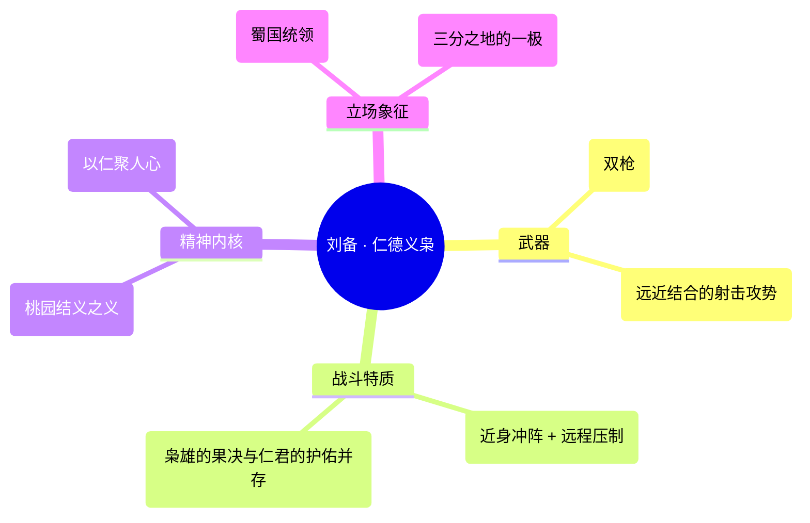

他的力量来历并非神授或秘术，而是乱世淬炼出来的「枭雄之能」：在无数次生死边缘活下来、把散兵游勇练成虎贲之师的经验，化作他临阵时的沉稳与决断。双枪的射击攻势让他能在拉开与贴近之间灵活切换——远则压制、近则贯穿，既能为兄弟开路，也能在退无可退时独自扛住攻势。（说明：以上均为基于背景设定与定位的描述，不涉及具体游戏数值。）

### 重要事件 / 剧情参与

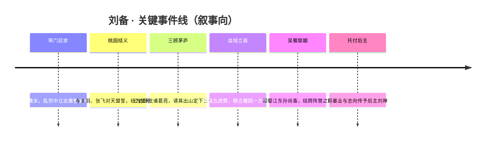

- **桃园结义**：与[关羽](#关羽)、[张飞](#张飞)结义，蜀国「义」之立国根基。
- **三顾茅庐 / 请出卧龙**：与[诸葛亮](#诸葛亮)君臣相得的开端。
- **凝聚五虎**：[关羽](#关羽)、[张飞](#张飞)、[赵云](#赵云)、[马超](#马超)、[黄忠](#黄忠)同列麾下。
- **吴蜀联姻**：与[孙尚香](sanfen-wu.md#孙尚香)结成横跨阵营的姻缘，并衍生出「520 天鹅之梦」等情侣主题皮肤。
- **传位后主**：将蜀国前途交付[刘禅](#刘禅)。

### 羁绊关系

| 对象 | 关系 | 说明 |
| --- | --- | --- |
| [关羽](#关羽) | 桃园结义兄弟 | 同在桃林立誓的异姓兄弟，蜀国「义」之核心。 |
| [张飞](#张飞) | 桃园结义兄弟 | 三结义之一，刘备麾下勇悍的肉盾型猛将。 |
| [诸葛亮](#诸葛亮) | 军师 / 君臣 | 三顾茅庐请出的卧龙，为蜀国定下三分方略。 |
| [赵云](#赵云) | 麾下虎将 | 常山赵子龙，五虎之一，高机动护卫型战将。 |
| [马超](#马超) | 麾下虎将 | 西凉锦马超，五虎之一，归附蜀国的高机动战刺。 |
| [黄忠](#黄忠) | 麾下虎将 | 蜀汉老将军，五虎之一，越战越勇的重炮射手。 |
| [刘禅](#刘禅) | 后主 / 继业者 | 蜀国后主，承接刘备的基业与未竟之志。 |
| [孙尚香](sanfen-wu.md#孙尚香) | 恋人（联姻） | 历史联姻沿用入游戏，育有「520 天鹅之梦」等 CP 皮肤（跨阵营）。 |

### 经典台词

!!! quote "仁德义枭 · 语录（部分为考据推测）"
    「天下英雄，谁能与我共图大业？」（考据推测）

    「兄弟同心，何惧乱世风雨。」（考据推测）

    「仁者无敌——这并非空话。」（考据推测）

### 皮肤故事亮点

- **520 天鹅之梦（与[孙尚香](sanfen-wu.md#孙尚香)的情侣主题皮肤）**：以浪漫的「天鹅之梦」为题，把刘备与孙尚香的吴蜀姻缘从政治联姻升华为一段跨阵营的爱情叙事，是蜀吴两方少见的温情交汇点。（具体剧情细节以官方设定为准，部分为考据推测。）

---

## 关羽

战士

**美髯公 · 骑赤兔、提青龙偃月刀，靠加速冲撞撕裂阵线的骑战战士**

| 档案项 | 内容 |
| --- | --- |
| 称号 | 美髯公 |
| 定位 | 战士（骑战 / 突进 / 边路战士） |
| 所属 | [三分之地·蜀国](../factions/sanfen-shu.md) |
| 身份 | 蜀汉名将、五虎上将之一，与刘备、张飞桃园结义的二弟 |
| 别称 | 关云长、武圣、髯公（考据推测，沿用三国通称） |
| 关系 | [刘备](#刘备)（义兄/主公）、[张飞](#张飞)（结义三弟）、[赵云](#赵云)、[马超](#马超)、[黄忠](#黄忠)（同列五虎上将）、[曹操](sanfen-wei.md#曹操)（昔日恩义旧主） |
| 登场作品 | 《王者荣耀》本体；三国主题剧情/赛季动画（考据推测） |

### 背景故事

在三分之地的纪元里，旧日的王朝倾颓，群雄并起，天下被切割成相互厮杀的版图。中原大地烽烟未熄，唯有益城一带还守着山清水秀、桃花绚烂的世外景致——那里是 [三分之地·蜀国](../factions/sanfen-shu.md) 的根基，一处既藏侠义又带神秘气息的人间桃源。关羽，便是从这片土地上走出的最锋锐的一柄刀。

关羽出身寒微，早年颠沛流离，因不平之事仗义出手而亡命天涯。漂泊之中，他遇见了胸怀仁德、立志匡扶乱世的 [刘备](#刘备)，又结识了脾性暴烈却赤诚似火的 [张飞](#张飞)。三人意气相投，在桃花盛开的园中焚香设誓——这便是蜀国羁绊体系里最为根本的「桃园结义」。誓言里没有同年同月同日生的约定，却有同生共死的承诺。自此，关羽以二弟的身份追随刘备，半生戎马，始终未曾背弃这份初心。这份「义」，既是他个人的立身之本，也是整个蜀国阵营「侠肝义胆」气质的源头。

在乱世征伐之中，关羽逐渐成长为令敌军闻风丧胆的猛将。他曾因战局所迫，一度寄身于强敌 [曹操](sanfen-wei.md#曹操) 麾下。曹操爱才如命，待他以厚禄高位、赠以名驹赤兔，百般笼络。然而关羽身在曹营，心却始终系于桃园之盟——一旦得知义兄下落，他便挂印封金，千里追寻而去。这段「身在曹营心在汉」的经历，被这片世界铭记为「义薄云天」最锋利的注脚，也在魏蜀两大阵营之间留下了一段恩义交错、亦敌亦友的复杂渊源。

回到刘备身边后，关羽成为蜀国开疆拓土的中流砥柱，名列「五虎上将」之首——与 [赵云](#赵云)、[马超](#马超)、[黄忠](#黄忠)、张飞同被尊为支撑益城基业的五根脊梁。他独当一面，镇守要冲，以一己之威慑服四方。在世人眼中，他早已超越了「将领」的身份，成为「忠义」二字的化身。岁月在他脸上刻下风霜，也养就了那一把垂胸长髯——人们敬称他为「美髯公」，这称号里既有对其威仪的赞叹，也有对其品格的认可。

然而忠义之人，命途往往悲壮。在这片纪元的叙事中，关羽的结局延续了那段广为流传的英雄末路：水淹七军、威震一时之后，却在腹背受敌的绝境里败走，最终殉于他誓死守护的疆土与道义。他没有死于沙场对决的痛快，而是倒在算计与背弃之中——这恰恰反衬出他一生从不算计、只认一个「义」字的纯粹。正因如此，关羽在三分之地不仅是一员武将，更逐渐被神化为一种精神图腾：忠诚、信义、不惧强权、不背初心。

### 性格与形象

关羽性格的底色是「傲」与「义」的交织。他傲上而不忍下——面对权贵与强敌，他从不低头；面对弱者与故旧，却又分外护持。他重然诺、轻生死，一旦认定的人与事，纵刀斧加身亦不更改。这种近乎执拗的忠义，使他既令人敬畏，也偶尔因孤高自负而埋下祸根，构成了一个有血有肉、并非完美无瑕的英雄形象。

外形上，关羽最鲜明的象征是那把及胸的长髯，「美髯公」之名由此而来——长髯在风中翻飞，是威严与岁月的双重见证。他常着戎装重甲，丹凤眼、卧蚕眉，面如重枣，目光沉静中藏锋。胯下赤兔马通体如火，与他一同冲锋时宛如一道赤色的战焰；手中青龙偃月刀寒光凛冽，刀身蜿蜒如龙。人、马、刀三者合一，构成了三分之地战场上最具压迫感的剪影之一。在象征意象上，他与「火红的赤兔」「龙形的偃月刀」「翻飞的长髯」绑定，整体散发着一种沉稳厚重却又一触即发的武者气场。

### 战斗风格与能力（设定向）

关羽是蜀国阵营中极具辨识度的「骑战战士」——他的战斗哲学不在于站桩缠斗，而在于「冲」。

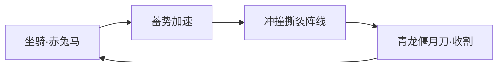

- **坐骑赤兔**：赤兔马是关羽力量体系的核心载体。它并非单纯的脚力，而是关羽冲锋节奏的来源——随着奔行不断蓄积速度，速度越快，冲撞所携带的势能与破坏力便越强。这一「以速度换威势」的设定，正呼应了「靠加速冲撞」的骑战定位。
- **冲撞破阵**：当赤兔加速到极致，关羽会化作一道赤色洪流撞入敌阵，将拦路者撞飞、击退，强行在密集阵线中犁出一条缺口。这是他作为战士「破局」的核心手段——为身后的蜀国战友撕开突破口。
- **青龙偃月刀**：这把传说中的重兵刃是关羽近身收割的武器。在冲撞撼开敌阵之后，偃月刀挥落，完成对落单或受创目标的处决。刀的「长」与马的「快」相辅相成，让他既能保持骑战的距离压制，又能在关键瞬间贴身斩杀。
- **武者之威**：除却武器与坐骑，关羽身上更有一股由忠义信念淬炼出的气势。在设定层面，他越是身陷重围、越是为守护而战，那份压迫感便越发逼人——这与「越战越显其威」的英雄气质一脉相承。

> 注：以上为基于背景与定位的设定向描述，不涉及具体游戏数值。

### 重要事件 / 剧情参与

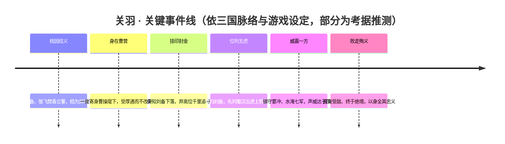

- **桃园结义**：蜀国阵营羁绊的起点，奠定关羽与刘备、张飞的兄弟关系。
- **千里寻兄**：关羽人格的高光时刻，「义」字的极致演绎，也牵动起与魏国 [曹操](sanfen-wei.md#曹操) 之间的恩义纠葛。
- **五虎上将聚首**：与赵云、马超、黄忠、张飞共同构成支撑益城的五虎羁绊群像。
- **赛季/节庆活动登场**（考据推测）：作为蜀国与三国主题的招牌英雄，关羽常作为主题皮肤、纪念活动与三国叙事内容的核心角色出现。

### 羁绊关系

| 对象 | 关系 | 说明 |
| --- | --- | --- |
| [刘备](#刘备) | 义兄 / 主公 | 桃园结义的大哥，蜀国统领；关羽半生追随，忠诚不渝。 |
| [张飞](#张飞) | 结义三弟 | 桃园三兄弟之一，与关羽生死与共、性情互补。 |
| [赵云](#赵云) | 同袍 / 五虎上将 | 同列蜀汉五虎，并肩守护益城基业。 |
| [马超](#马超) | 同袍 / 五虎上将 | 西凉锦马超，归蜀后同列五虎。 |
| [黄忠](#黄忠) | 同袍 / 五虎上将 | 蜀汉老将军，五虎之一，与关羽并称同列。 |
| [曹操](sanfen-wei.md#曹操) | 昔日旧主 / 亦敌亦友 | 魏国之主，曾厚待关羽、赠以赤兔；关羽报恩而不改其志，留下跨阵营的恩义纠葛。 |

> 注：本片段所列羁绊以蜀国五虎将群像与桃园结义为核心；阵营 relatedRelationships 中的师承、稷下、联姻等关系主要涉及刘备、诸葛亮、元歌等英雄，关羽不在其列。

### 经典台词

!!! quote "美髯公语录"
    「我，关羽，关云长！」（考据推测）

    「降汉不降曹。」——身在曹营、心向桃园（考据推测）

    「义之所在，虽千万人吾往矣。」（考据推测，化用其忠义形象）

    「赤兔嘶鸣，偃月出鞘——挡我者，退！」（考据推测，贴合冲撞骑战定位）

### 皮肤故事亮点

- **威武类皮肤**：关羽的多款皮肤延续其「武圣」气场，以赤、金、墨等沉重色调强化威严与岁月感，长髯与偃月刀始终是视觉核心（考据推测）。
- **主题联动 / 节庆皮肤**：作为蜀国与三国题材的代表英雄，关羽常获得高规格的主题或纪念皮肤，将「忠义」「骑战」的意象作进一步艺术化演绎（考据推测）。

> 具体皮肤名称与剧情细节以游戏内官方文案为准，此处仅作方向性概述。

---

## 赵云

战士刺客

**龙胆 · 一袭白袍、单枪救主，于乱军中往来如龙的少年将军。**

| 档案项 | 内容 |
| --- | --- |
| 称号 | 龙胆 |
| 定位 | 战士 / 刺客 |
| 所属 | [三分之地·蜀国](../factions/sanfen-shu.md) |
| 身份 | 常山真定人，蜀汉五虎上将之一，刘备麾下心腹猛将 |
| 别称 | 常山赵子龙、子龙、白袍小将、龙将（考据推测） |
| 关系 | [刘备](#刘备)、[关羽](#关羽)、[张飞](#张飞)、[马超](#马超)、[黄忠](#黄忠)、[诸葛亮](#诸葛亮)、[刘禅](#刘禅) |
| 登场作品 | 《王者荣耀》本体；相关动画／PV、五虎将主题宣传片（考据推测） |

### 背景故事

赵云，字子龙，常山真定人。在三分之地的叙事框架中，他被定格为「龙胆」——一柄出鞘即破阵、收锋则护身的白色长枪，是蜀国阵营里最具传奇色彩的少年将军。三分之地以益城为核心，是山清水秀、桃花绚烂的世外桃源式战场，「三国争霸 + 侠义桃源」是它的底色；而赵云正是这片土地上「侠」与「忠」两个字最纯粹的化身——他不是为权位而战的枭雄，也不是运筹帷幄的谋臣，而是一个把忠义二字背在枪上、用一身白袍去兑现承诺的人。

他出身常山，并非名门贵胄，凭一身武艺与一颗赤诚之心在乱世中立身。早年辗转于各路诸侯之间，他在寻找的并非最强的主公，而是真正以仁德待人、值得托付一生的明主。当他遇见以「仁德义枭」闻名的[刘备](#刘备)，那种「君以国士待我，我必以国士报之」的契合，便成了他后半生所有抉择的源头。自此，赵云的枪不再只为自己而舞，它属于一个人、属于一个理想——保护那些值得保护的人，护住那个尚在襁褓与风雨中的蜀汉。

赵云一生最为后世传颂的，是他在乱军万马之中「单骑救主」的壮举（考据推测，沿用三国经典桥段）。当大军溃败、保护队伍被冲散，幼主与主公的家眷陷于敌阵核心，赵云独自一人逆着溃逃的人潮向回杀去。他不是没有退路，而是选择了最难的那条路——把刘备之子托付在自己胸前的护甲之内，在重重包围中七进七出，长枪挑落数十名将校，白袍尽染血色，却始终护着怀中那一点尚未长成的火苗安然冲出。正是这一战，让「子龙一身都是胆」成了对他最高的评价，「龙胆」之称号亦由此凝成。它形容的不只是勇，更是一种近乎执拗的责任感：明知九死一生，却因怀中是该守护的人，便没有半步退缩的理由。

在三分之地的世界观里，蜀国并非孤立存在。它与魏（[曹操](sanfen-wei.md#曹操)所统）、吴（[孙策](sanfen-wu.md#孙策)、[周瑜](sanfen-wu.md#周瑜)所在的江东）三足鼎立，彼此征伐又彼此牵制。赵云身处其中，既要随[关羽](#关羽)、[张飞](#张飞)等结义兄弟征战沙场，也要在[诸葛亮](#诸葛亮)运筹的局中担当那把最锋利、也最可信赖的刀。他与[关羽](#关羽)、[张飞](#张飞)、[马超](#马超)、[黄忠](#黄忠)并列为蜀汉「五虎上将」，是蜀国军事羁绊的核心成员；而当幼主[刘禅](#刘禅)长成，赵云依然是那位老臣眼中「可以把背后交给他」的守护者。可以说，从主公到后主，从父辈到子辈，赵云用一整代人的时间，守住了同一个承诺。

他的故事，是三分之地里关于「忠诚」最不掺杂质的注脚——别人为利益结盟、为权谋反复，唯独赵云始终如一。乱世会让人变得复杂，而他选择把自己活得简单：认准一个人，认准一件事，然后用尽全力去做到底。

### 性格与形象

赵云的性格，可以用「外冷内热、忠勇沉静」来概括。他不像[张飞](#张飞)那般张扬暴烈，也不似[关羽](#关羽)那般威重自持，而是带着一种少年般的清亮与冷静——临阵不乱，遇险不慌，越是危急的时刻，他的眼神越是沉稳。他寡言，却言出必行；他谦逊，却在战场上从不示弱。对他而言，勇敢不是莽撞，而是「明知会怕，仍选择向前」的克制与决断。

外形上，赵云最鲜明的符号是那一袭**白袍**与手中的长枪——白色象征他不染尘俗的忠贞与少年意气，长枪则修长锐利、攻守兼备，如同他本人「能冲锋亦能护盾」的双重特质。他常被塑造为身姿矫健、面容俊朗的青年将军形象，行动间快如游龙，故而「龙」既是他枪势的写照，也是「龙胆」之名的象征意象：龙者，能屈能伸，可隐于渊、可腾于天，正应了他既能潜行突袭如刺客、又能正面破阵如战士的战场身份。

### 战斗风格与能力（设定向）

赵云在战场上的标志，是**极高的机动性**与**攻防一体的连招**——他既能像刺客一样切入后排、收割残局，又能像战士一样为自己披上护盾、硬抗扛线，这正对应了他「战士／刺客」的双定位。他手中那杆长枪轻灵而致命，配合白袍翻飞的身法，往往在敌人尚未反应时便已穿阵而过、回身再战。

他的力量并非来自神话血脉或外力加持，而是源于常年沙场磨砺出的纯粹武艺与那颗「一身都是胆」的心。位移、突进、护盾、再突进——这套以「来去如风」为核心的打法，是他「七进七出」救主经历在战斗设定上的延续：突入是为了救人，护盾是为了不倒，而每一次回身，都是因为身后还有要守护的目标。

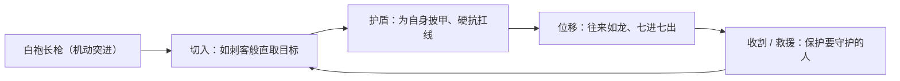

### 重要事件 / 剧情参与

- **追随刘备**：择仁德明主而事，成为[刘备](#刘备)麾下最受信赖的猛将之一，从此其枪只为护佑蜀汉而舞。
- **单骑救主 · 七进七出**（考据推测，沿用三国经典桥段）：于溃败乱军核心独自逆行，怀抱幼主七进七出、血染白袍而护其周全，「龙胆」之名由此而立。
- **五虎上将集结**：与[关羽](#关羽)、[张飞](#张飞)、[马超](#马超)、[黄忠](#黄忠)同列五虎，成为蜀国军事羁绊的核心阵容。
- **护卫后主**：自幼主[刘禅](#刘禅)成长，始终以老臣之姿担任守护者，将忠诚延续至蜀汉的下一代。
- **三国征伐**：在[诸葛亮](#诸葛亮)的谋略布局中担纲最锋利可信的执行者，参与对魏（[曹操](sanfen-wei.md#曹操)）、对吴的多次战事（考据推测）。

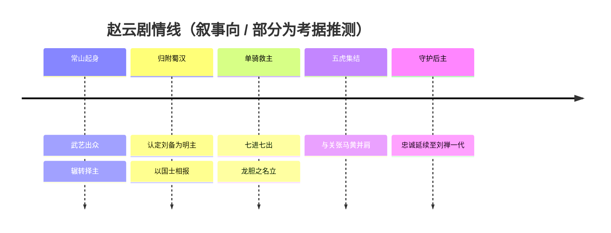

### 羁绊关系

| 对象 | 关系 | 说明 |
| --- | --- | --- |
| [刘备](#刘备) | 主从 / 知遇 | 蜀国统领、「仁德义枭」，赵云一生追随的明主，「以国士报之」的承诺之源。 |
| [关羽](#关羽) | 同袍 · 五虎上将 | 「美髯公」，蜀汉骑战名将，与赵云同列五虎、并肩征战。 |
| [张飞](#张飞) | 同袍 · 五虎上将 | 「禁血狂兽」，蜀汉猛将肉盾，五虎之一，与赵云军中相依。 |
| [马超](#马超) | 同袍 · 五虎上将 | 「寒锋铁骑」，西凉锦马超，同为高机动战刺、同列五虎。 |
| [黄忠](#黄忠) | 同袍 · 五虎上将 | 「燃魂重炮」，蜀汉老将军，五虎之一，老当益壮的远程火力。 |
| [诸葛亮](#诸葛亮) | 君臣 / 战阵配合 | 「卧龙」，蜀汉军师，赵云常为其谋略中最锋利可信的执行之刃。 |
| [刘禅](#刘禅) | 守护 / 老臣与后主 | 「无忧之主」，赵云曾舍命相救并长期守护的幼主，忠诚延续两代。 |

> 注：以上羁绊以蜀国阵营内部的五虎将与君臣关系为主线。蜀国阵营设定中另有[刘备](#刘备)与[孙尚香](sanfen-wu.md#孙尚香)的联姻、[刘禅](#刘禅)对[蔡文姬](sanfen-wei.md#蔡文姬)的跨阵营单恋，以及[诸葛亮](#诸葛亮)与稷下同窗（[元歌](#元歌)、[司马懿](sanfen-wei.md#司马懿)等）的师承羁绊，赵云本人不直接涉入，故不列入其个人羁绊表。

### 经典台词

!!! quote "赵云 · 语音（部分为考据推测）"
    「子龙一身都是胆。」（考据推测）

    「忠肝义胆，扫平天下！」（考据推测）

    「龙之逆鳞，触之即死。」（考据推测）

    「我，赵子龙，愿为主公赴汤蹈火。」（考据推测）

### 皮肤故事亮点

赵云拥有数量众多、风格跨度极大的皮肤序列，其中最具代表性的几款（皮肤具体设定细节为考据推测）：

- **引擎之心**：科幻机甲风格的代表作之一，把「白袍少年将军」重塑为驾驭未来战甲、与机械之心共鸣的战士，是赵云人气长盛的视觉名片。
- **未来纪元**：同属科技未来题材，将「龙」的意象与流光科技线条结合，呼应其往来如龙的高机动战斗风格。
- **嗜血之刃 / 忠义虎臣**等：分别强化其刺客式的凌厉与五虎上将的古典武将气度，从不同侧面诠释「龙胆」一名中「勇」与「忠」的两重含义。

（各皮肤的具体背景剧情请以游戏内官方文案为准，此处仅作风格性概述。）

---

## 马超

战士刺客

**寒锋铁骑 · 西凉锦马超——掷枪如雨、拾枪复战的高机动战刺。**

| 档案 | 内容 |
| --- | --- |
| 称号 | 寒锋铁骑 |
| 定位 | 战士 / 刺客 |
| 所属 | [三分之地·蜀国](../factions/sanfen-shu.md) |
| 身份 | 西凉边陲铁骑统领、蜀汉五虎上将之一 |
| 别称 | 锦马超、西凉马超（考据推测，沿用「锦马超」之名） |
| 关系 | [刘备](#刘备)（君主）、[关羽](#关羽)・[赵云](#赵云)・[张飞](#张飞)・[黄忠](#黄忠)（五虎同袍）、[司马懿](sanfen-wei.md#司马懿)（曾为其师，跨阵营）|
| 登场作品 | 《王者荣耀》对战英雄；多款主题皮肤与赛季活动 |

### 背景故事

马超出身于三分之地的西陲——那是一片被风沙、雪线与边墙反复磨砺的土地。与益城的桃花春水不同，西凉的天空常年被铁灰的云压低，地平线上是一望无际的草甸与碎石坡。在这里，人不靠言辞、靠马背与长枪立身。马超便是在这样的风口长大：少年时就能在疾驰的马上单手掷出长枪，命中数十步外的标靶，西陲诸部因此送他「锦马超」之名——「锦」既指他临阵时那一身夺目的银甲红缨，也指他出枪如锦缎抖落般凌厉而华美。

家族世代镇守边陲，是抵御外侮的第一道铁墙。马超自幼随父兄巡边，见惯了狼烟与离散，也因此把「守土」二字刻进了骨血。然而边将的命运从来与中原的权谋纠缠不清——一场牵动数方势力的变局，让马氏一族卷入风暴的中心，故园倾覆，亲族离散。从那以后，少年将军失去了可以归去的家，却没有失去那杆枪。他带着残存的铁骑，从西陲一路向南，把仇恨与不甘炼成更冷的锋刃。

值得一提的是，马超的武学与谋略并非全然来自边陲军伍。**[司马懿](sanfen-wei.md#司马懿)曾为其师**（见本阵营设定）——这位日后以「寂灭之心」名动天下的魏国谋士，曾在马超的某段成长岁月里给予过点拨或较量。这段亦师亦敌的渊源，让马超的战法在西凉的悍勇之外，多了一层算度与冷静：他懂得何时掷枪逼退、何时弃枪突进、又在何处把那杆离手的长枪重新攥回掌心。师徒二人后来分属蜀、魏，立场殊途，旧日的传授便成了战场上彼此最熟悉、也最忌惮的底牌。（关于这段师承的具体经过，游戏未给出完整正史，细节为考据推测。）

南下的马超，最终在仁德枭雄[刘备](#刘备)麾下找到了可以重新托付的旗帜。对一个失去家国的边将而言，刘备所许的不是封赏，而是一个「再造家园」的可能。马超归蜀，与[关羽](#关羽)、[赵云](#赵云)、[张飞](#张飞)、[黄忠](#黄忠)并列为蜀汉「五虎上将」——五人各擅其长，而马超是其中最具冲锋锐气的那一柄。他在阵前的位置，永远是马蹄踏碎敌阵、长枪洞穿缺口的最前线。自此，西陲少年的仇恨，化作了护卫新故园的铁骑长缨。

### 性格与形象

马超的性格如西凉的风——直、烈、冷。他寡言，话音落处往往已是枪锋抵喉；他重诺，认定的君主与同袍便以命相付。失去家国的伤痕让他比同龄人更早学会了隐忍，但那份隐忍之下，始终烧着一团不肯熄灭的、为故园复仇与守护的火。

外形上，他是「锦马超」之名最直观的注脚：银白战甲在西陲的阳光与中原的烽火里同样夺目，盔顶与肩背常缀红缨，奔驰时如一道流动的火线。最具辨识度的象征，是他手中——以及不断离手又归手的——那杆长枪：它既是近身格斗的兵刃，也是可以脱手掷出的「飞矛」。「掷枪」与「拾枪」之间那一瞬的空手，正是马超形象里最危险也最华彩的部分：哪怕没有枪在手，他依旧是战场上最不该被靠近的人。寒锋、铁骑、红缨、银甲——冷与烈的并置，构成了他全部的视觉气质。

### 战斗风格与能力（设定向）

马超的战斗哲学，可以浓缩为「枪在人在，枪去人进」八个字。他的核心绝技围绕一杆可掷可拾的长枪展开：

- **掷枪（飞矛）**：将长枪奋力掷出，枪锋如寒星破空，可远程刺穿、压制乃至贯穿成排的敌人。枪掷出后会插驻于命中之处，为后续连招留下「枢点」。
- **拾枪/借势突进**：当长枪离手插驻，马超并不退守，反而借空手的轻捷高速突进——奔向插驻的长枪，将其重新拔起，瞬间衔接下一轮掷击或近身刺杀。掷与拾的循环，让他能在远逼与近突之间无缝切换，正是「战士+刺客」双定位的来历。
- **西凉铁骑冲锋**：源自边陲骑战的本能，他的位移带着马蹄踏阵般的撞势，专为撕开阵线、直取后排而生。

这套以「掷—拾—再掷」为节奏的连招，既保留了西凉军伍的悍猛冲锋，又融入了据传得自[司马懿](sanfen-wei.md#司马懿)的算度——何时用枪封路、何时弃枪逼近，皆在算中。下图为其招式来历的设定向脉络（非游戏数值）：

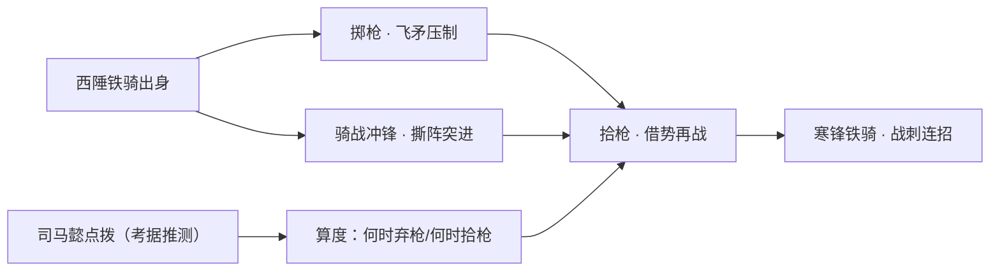

### 重要事件 / 剧情参与

- **西陲故园倾覆**：家族世镇的边墙在一场变局中崩塌，马超失家国，自此踏上南下之路（背景设定，细节为考据推测）。
- **亦师亦敌·司马懿**：与日后魏国谋士[司马懿](sanfen-wei.md#司马懿)结下师承之缘，传授成为他战法中「冷静算度」的来源；二人后分属蜀魏，旧谊化作战场上的彼此忌惮。
- **归附蜀汉·位列五虎**：投于[刘备](#刘备)麾下，与[关羽](#关羽)・[赵云](#赵云)・[张飞](#张飞)・[黄忠](#黄忠)同列「五虎上将」，成为蜀军最锐的冲锋之锋。
- **赛季与主题活动**：作为蜀国阵营的核心战刺，长期参与对战版本与多款主题皮肤的叙事呈现（具体联动/动画请以官方公布为准）。

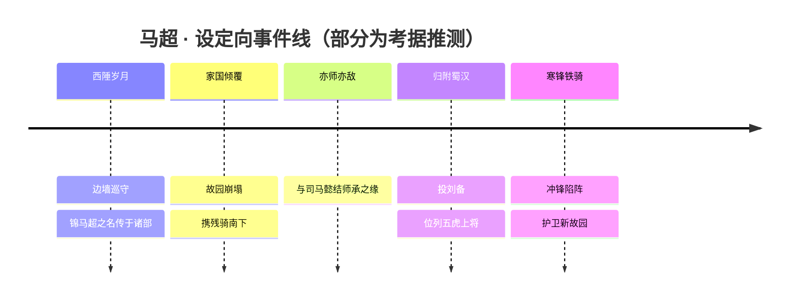

### 羁绊关系

| 对象 | 关系 | 说明 |
| --- | --- | --- |
| [刘备](#刘备) | 君臣 | 失国之将归于仁德枭雄麾下，于蜀汉重觅可托付的旗帜与「再造家园」之望。 |
| [关羽](#关羽) | 五虎同袍 | 同列蜀汉五虎上将，并肩冲阵的袍泽。 |
| [赵云](#赵云) | 五虎同袍 | 同为高机动战刺型五虎将，战法相映，常被并论。 |
| [张飞](#张飞) | 五虎同袍 | 张飞为前线肉盾辅助，与马超的冲锋锋线互为攻守。 |
| [黄忠](#黄忠) | 五虎同袍 | 老将重炮远射，与马超的近突掷枪形成远近呼应。 |
| [司马懿](sanfen-wei.md#司马懿) | 师徒（跨阵营，亦师亦敌） | 司马懿曾为马超之师；二人后分属蜀魏，旧日传授化作战场上最熟悉也最忌惮的底牌。 |

### 经典台词

!!! quote "马超 · 语音（部分为考据推测）"
    「寒锋所向，铁骑无前。」（考据推测）

    「枪在手，便无人能挡；枪离手，亦无人能近。」（考据推测）

    「故园已远，护我所守。」（考据推测）

### 皮肤故事亮点

马超的主题皮肤多以「西凉边陲」与「铁骑驰骋」为母题，在银甲红缨的本色之外，常以更冷峻的金属质感与风沙、雪原意象强化「寒锋」气质（具体皮肤故事请以官方公布为准，此处为风格归纳）。其皮肤设计普遍延续「掷枪—拾枪」的标志性动态，让那杆离手又归手的长枪成为视觉记忆点。

---

## 张飞

坦克辅助

**禁血狂兽 · 怒吼可裂阵、肉身能成盾的蜀汉猛将**

| 档案项 | 内容 |
| --- | --- |
| 称号 | 禁血狂兽 |
| 定位 | 坦克 / 辅助 |
| 所属 | [三分之地·蜀国](../factions/sanfen-shu.md) |
| 身份 | 蜀汉猛将、桃园结义三弟、五虎上将之一 |
| 别称 | 翼德、燕人张翼德、莽张飞（俗称，考据推测） |
| 关系 | [刘备](#刘备)（结义大哥）、[关羽](#关羽)（结义二哥）、[赵云](#赵云)、[马超](#马超)、[黄忠](#黄忠)（同列五虎）、[诸葛亮](#诸葛亮)（蜀汉军师） |
| 登场作品 | 《王者荣耀》峡谷对局；多款蜀国/五虎主题皮肤与活动 |

### 背景故事

张飞，字翼德，出身[三分之地·蜀国](../factions/sanfen-shu.md)。在以益城为核心、山清水秀而又侠气纵横的蜀地，他是名声最响、也最易被人误读的一员猛将——人们记住的往往是那一声能令山林震颤、敌阵自乱的怒吼，却很少有人愿意去看那声怒吼背后，究竟压着怎样一颗滚烫而沉默的心。

他与[刘备](#刘备)、[关羽](#关羽)结义于桃园，自此一生只认这两位兄长。三人之中，刘备怀仁德、立志收拾乱世人心，关羽守忠义、傲骨凛然如刀，而张飞，则把自己活成了那道挡在兄长与百姓身前的「墙」。他不善权谋，也不屑于权谋；在他朴素的信念里，乱世太大、道理太多，可有一件事再简单不过——只要他还站着，身后的人就不该流血。于是他把自己的血与命，一并押在了「禁血」二字上：禁住的，是身边人的血；放出的，是他自己的狂。

「禁血狂兽」这一称号，正是这种极端的具象化。传说他在战阵中能以怒意自激，血脉贲张、形貌如兽，越是濒临绝境、护身的人越多，他爆发出的力量就越是骇人。寻常武人靠技巧取胜，张飞却像是把肉身炼成了战场上的关隘——他不躲、不退，宁可让千百次的攻击都砸在自己身上，也要替同袍把那条退路、那道防线牢牢钉死。这份近乎自毁的护持，是他对「兄弟」与「家国」最笨拙、也最决绝的回答。

在蜀国「三国争霸 + 侠义桃源」的世界底色里，张飞代表的是侠气中最原始、最不加修饰的那一面：不讲道理，只讲心意；不算得失，只问值不值。当[诸葛亮](#诸葛亮)在帷幄之中以谋略撑起蜀汉的格局，当[刘备](#刘备)以仁德感召四方人心时，是张飞这样的人用血肉去兑现那些理想的重量——理想需要有人去信，更需要有人愿意为它去挡刀。他便是那个甘愿去挡的人。

也正因如此，张飞的「狂」从来不是失控，而是一种被深情逼出来的凶猛。脱离了战场，他贪杯、嗓门大、护短到不讲理；可一旦兄长有难、同袍当危，他眼里那点烟火气会瞬间烧成怒焰，化作令敌人胆寒的禁血狂兽。世人笑他莽，却很少有人懂：他的莽，是把所有的算计都让给了别人，只给自己留下了「冲在最前」这一种活法。

### 性格与形象

张飞的性格是一团烈火外裹着一层憨直：耿直、忠勇、爱憎分明，对兄长与同袍的护短几乎到了不讲道理的地步。他嗓门极大、脾气火爆，常被人当作只知逞勇的莽夫；但在这层粗豪之下，藏着一颗极重情义、宁可自苦也不愿连累旁人的心——他的「凶」永远朝向敌人，他的「软」永远留给身边的人。

外形上，他通常被塑造为虎背熊腰、髯须如戟、目光如电的雄壮武将形象，手中执长矛/丈八长矛类的兵器（考据推测，依其传统造型）。最具辨识度的象征，是其大招触发后近乎「兽化」的状态：肌肉贲张、气势暴涨，仿佛一头被激怒的巨兽，将「禁血狂兽」四字写在了战场之上。怒吼、巨盾、横亘不动的身躯，共同构成了他「以己为壁、护住众生」的核心意象。

### 战斗风格与能力（设定向）

作为坦克/辅助，张飞的战斗哲学不在杀，而在「扛」与「护」。他把自己练成了队伍的中枢防线——不是去追逐击杀，而是用厚重的血肉与坚韧的意志，为同袍撑起一片可以安心输出的空间。

- **护盾庇护**：他能为自身与友军凝聚护盾，将攻击拦截在血线之前，正应「禁血」之名——禁住的是同袍本该流的血。
- **怒吼与控场**：以震天怒吼扰乱、击飞或顿挫敌阵，为队友创造突进或撤退的窗口。
- **禁血变身（大招）**：积蓄怒意至极，形貌如兽、攻防俱增，化身真正的「狂兽」短时压制战局，是他从「肉盾」转为「破阵」的关键转折。

> 注：以上为基于背景与公开设定的叙事性描述，不涉及具体游戏数值。

### 重要事件 / 剧情参与

- **桃园结义**：与[刘备](#刘备)、[关羽](#关羽)义结金兰，奠定其一生「为兄长、为家国」的行动主轴，是蜀国「桃园结义」羁绊的核心成员之一。
- **位列五虎**：与[关羽](#关羽)、[赵云](#赵云)、[马超](#马超)、[黄忠](#黄忠)同列蜀汉五虎上将，构成蜀国「五虎将」羁绊群像。
- **峡谷护团**：在《王者荣耀》对局叙事中，长期作为蜀国阵营的前排中坚，以肉身与怒吼为队伍开团、护团、断后。

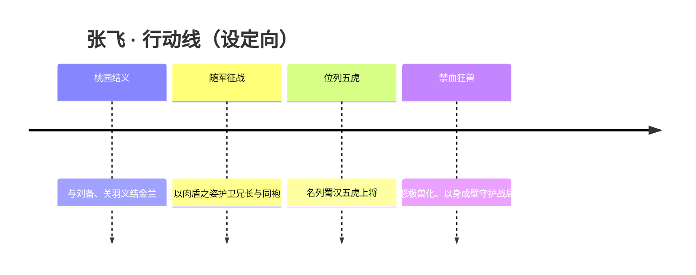

### 羁绊关系

| 对象 | 关系 | 说明 |
| --- | --- | --- |
| [刘备](#刘备) | 结义大哥 / 主君 | 桃园结义之首，张飞一生追随的兄长与信念所系。 |
| [关羽](#关羽) | 结义二哥 | 同生死、共患难的兄长，三人构成蜀国桃园结义羁绊核心。 |
| [赵云](#赵云) | 同列五虎 | 同为蜀汉五虎上将，并肩护国的同袍。 |
| [马超](#马超) | 同列五虎 | 西凉名将，同列五虎上将的战友。 |
| [黄忠](#黄忠) | 同列五虎 | 蜀汉老将军，五虎将之一，与张飞同守蜀地。 |
| [诸葛亮](#诸葛亮) | 主公帐下军师 | 运筹帷幄的蜀汉军师，以谋略与张飞之勇相辅相成。 |

### 经典台词

!!! quote "禁血狂兽"
    「俺张飞在此，谁敢上前！」（考据推测）

    「想动俺兄弟？先问问俺答不答应！」（考据推测）

    「往后退，这儿有俺顶着！」（考据推测）

---

## 诸葛亮

法师

**卧龙 · 运筹帷幄、洞察天机的法术爆发型谋士**

| 档案项 | 内容 |
| --- | --- |
| 称号 | 卧龙 |
| 定位 | 法师（法术爆发 / 兼具刺客式收割） |
| 所属 | [三分之地·蜀国](../factions/sanfen-shu.md) |
| 身份 | 蜀国军师、稷下学院出身的智者、天书碎片的追寻者 |
| 别称 | 卧龙先生、孔明（考据推测，沿用三国典故） |
| 关系 | 主公 [刘备](#刘备)；师弟 [元歌](#元歌)；挚友兼宿敌 [司马懿](sanfen-wei.md#司马懿)；稷下同窗 [周瑜](sanfen-wu.md#周瑜)；师承稷下三贤者 [老夫子](jixia.md#老夫子)、[庄周](penglai-donghai.md#庄周)、[墨子](mojia-jiguan.md#墨子) |
| 登场作品 | 《王者荣耀》本传；稷下学院系列剧情与"稷下F4"相关叙事 |

### 背景故事

在三分之地的西境，[蜀国](../factions/sanfen-shu.md)以益城为核心，山清水秀、桃花绚烂，是一处兼具世外桃源气韵与侠义豪情的土地。这片以仁德枭雄 [刘备](#刘备) 为旗帜聚拢人心的国度里，诸葛亮是那枚最静、却也最重的棋子——人们唤他"卧龙"，意为蛰伏的龙，未鸣则已，一鸣则搅动三分天下的风云。

诸葛亮的智识并非凭空而生。年少时，他曾远赴名动天下的稷下学院求学。稷下乃由"创院三贤者"——[老夫子](jixia.md#老夫子)、[庄周](penglai-donghai.md#庄周)、[墨子](mojia-jiguan.md#墨子)——有教无类、广纳门徒所立，是这个世界知识与思辨的圣地。需要说明的是，诸葛亮虽在稷下求学问道，其阵营归属始终属于蜀国；稷下于他，是淬炼心性与才学的熔炉，而非终身的旗帜。正是在那段求学岁月里，他与日后名满天下的几位俊杰相识，组成了稷下学院最负盛名的学生团体——后世口耳相传的"稷下F4"：诸葛亮、[周瑜](sanfen-wu.md#周瑜)、[元歌](#元歌)，以及 [司马懿](sanfen-wei.md#司马懿)。

稷下岁月中，最深刻地烙在诸葛亮命运上的，是与司马懿的相遇。两位青年因彼此横溢的才华而惺惺相惜，常并肩论道、共寻散落世间的"天书碎片"——那是承载着古老知识与力量、足以改写格局的禁忌之物。他们曾是最默契的同窗与挚友。然而命运的伏笔早已埋下：司马懿在追寻真相的路上，发现了某段被掩盖的往事真相，那真相与诸葛亮有关，却又沉重得让他不愿因此去恨这位挚友。司马懿最终选择悄然离开稷下。多年以后，当两人各自辅佐魏、蜀，立于对峙的两端，昔日的同窗之谊与今日的立场之争交织，使他们成为官方明确点出的"宿敌"——司马懿的登场宣传词，正是那句意味深长的"诸葛亮的宿敌来了"。挚友与宿敌，是诸葛亮一生都无法解开、也不愿斩断的羁绊。

而在稷下，诸葛亮也曾以一句鼓励，悄然改变了另一个人的一生。年幼的 [元歌](#元歌)（其原型为蜀国军师庞统，后于长安一带活动）因幼时受惊而失语，是个孤苦无依、被送入稷下的孤儿。是博学温厚的师兄诸葛亮，看出了这个沉默孩子眼中未曾熄灭的光，鼓励他以机关傀儡代替喉舌、与这个世界重新交流。自那以后，元歌专研傀儡之术，终成操控提线傀儡的"无间傀儡"。这段师兄弟之谊，是诸葛亮性格中至为温柔的一面的明证。

学成之后，诸葛亮归于蜀国，成为刘备帐下运筹帷幄的军师。他将稷下所学化为治国安邦、决胜千里的谋略，于桃源般的益城之中执掌大势，辅佐主公在三分天下的乱局里争一席之地。星罗棋布的算筹之间，他既要应对外敌的兵锋，又始终背负着稷下时代留下的命题——天书碎片的下落、与司马懿那道未尽的因缘。卧龙之名，便在这运筹与追寻之中，渐渐响彻三分之地。

### 性格与形象

诸葛亮的性格，是"静水流深"四字最贴切的注脚。他沉着、缜密、洞察入微，习惯将棋局算到数步之外，言行间总带着一份不动声色的从容；然而在这份冷静的智者外壳之下，他对师弟元歌的提携、对挚友司马懿欲恨不能的复杂情愫，又流露出极深的温情与重义。他是谋士，却不是冷酷的算计者——他守的是仁德之蜀，行的是经世之道。

形象上，诸葛亮承袭了"卧龙先生"的儒雅书卷气：羽扇纶巾式的文士装束、随身的算筹与卷轴，是他智慧与谋略的外化象征。"龙"的意象贯穿其符号体系——蛰伏待时、一动惊天，恰如他本人深藏不露而决断雷霆的行事风格。在战场上，他以法术为锋，举手投足间带着推演天机的笃定，仿佛胜负早已在落子之前写定。

### 战斗风格与能力（设定向）

作为蜀国的法师，诸葛亮的"武器"并非刀剑钢铁，而是凝结智识与谋略的法术之力。其战斗风格以**法术爆发**为核心，辅以谋士特有的精算与收割气质，被玩家视为兼具刺客式机动与处决能力的法师——这正与他"运筹帷幄、稷下出身的法术爆发法刺"的定位相呼应。

他的法力来历，可追溯至稷下学院的求学与对天书碎片的探寻：在那座知识圣地中习得的术法与对"天机"的洞察，被他化作战场上一次次精准的推演与打击。其招式讲究层层叠加、于关键一击中爆发——如同他布局谋略一般，前置的每一步看似平静，皆为最后那道决定性的法术伏笔。算筹与符箓般的法术轨迹是其力量的外显，落子无悔、算无遗策，是他贯彻于谋略与战斗的共同信条。

（说明：以上为基于背景设定的力量来历与风格描述，非游戏数值。）

### 重要事件 / 剧情参与

- **稷下求学与"稷下F4"**：青年时入稷下学院，师从创院三贤者，与周瑜、元歌、司马懿并称稷下学院最负盛名的学生团体。
- **共寻天书碎片**：与挚友司马懿在稷下时代携手探寻散落世间的天书碎片，结下深厚情谊，也埋下日后宿命的伏笔。
- **真相与离别**：司马懿发现尘封的真相，因不愿恨挚友而离开稷下，二人自此走向不同的立场。
- **启发元歌**：鼓励失语的孤儿师弟元歌以机关傀儡代喉舌，间接成就了"无间傀儡"的诞生。
- **归蜀辅主**：学成后归于蜀国，成为刘备帐下军师，于益城运筹三分天下之局。
- **宿敌对决**：与魏国的司马懿成为官方明确的"宿敌"，二人立于三分对峙的两端，是贯穿其叙事的核心戏剧张力。

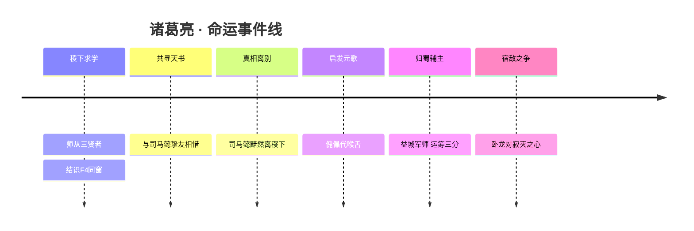

### 羁绊关系

| 对象 | 关系 | 说明 |
| --- | --- | --- |
| [司马懿](sanfen-wei.md#司马懿) | 挚友兼宿敌 | 青年同在稷下相识、因才华彼此欣赏共寻天书碎片；司马懿发现当年真相却不愿恨挚友遂离稷下。既是稷下同窗挚友，又是官方明确的宿敌（"诸葛亮的宿敌来了"）。 |
| [元歌](#元歌) | 师兄弟（稷下同窗） | 元歌幼年受惊失语、孤儿入稷下，被博学师兄诸葛亮鼓励以机关傀儡代喉舌与世界交流，从此专研傀儡。 |
| [周瑜](sanfen-wu.md#周瑜) | 同窗团体（稷下F4） | 与诸葛亮、元歌、司马懿同列稷下学院最富盛名的学生团体。 |
| [老夫子](jixia.md#老夫子) | 师承（创院三贤者→弟子） | 稷下三贤者之一，有教无类广收弟子；诸葛亮曾在稷下求学，阵营归属仍为蜀国。 |
| [庄周](penglai-donghai.md#庄周) | 师承（创院三贤者→弟子） | 稷下三贤者之一，诸葛亮的求学时代师长。 |
| [墨子](mojia-jiguan.md#墨子) | 师承（创院三贤者→弟子） | 稷下三贤者之一，诸葛亮的求学时代师长。 |
| [刘备](#刘备) | 君臣 | 蜀国仁德枭雄、诸葛亮辅佐的主公（考据推测，依蜀国阵营设定）。 |

### 经典台词

!!! quote "卧龙之言"
    "运筹帷幄之中，决胜千里之外。"（考据推测）

    "观今宜鉴古，无古不成今。"（考据推测）

    "知天，知地，胜乃可全。"（考据推测）

---

## 黄忠

射手

**燃魂重炮 · 操纵巨型重炮、越战越勇的蜀汉老将军**

| 档案 | 内容 |
| --- | --- |
| 称号 | 燃魂重炮 |
| 定位 | 射手 |
| 所属 | [三分之地·蜀国](../factions/sanfen-shu.md) |
| 身份 | 蜀汉宿将、阵前重炮操炮手（设定向）、五虎上将之一 |
| 别称 | 老将军、汉升（字汉升，史称黄汉升）（考据推测） |
| 关系 | [刘备](#刘备) · [关羽](#关羽) · [张飞](#张飞) · [赵云](#赵云) · [马超](#马超) |
| 登场作品 | 《王者荣耀》峡谷对战；属较早上线的射手英雄之一（考据推测） |

### 背景故事

黄忠是三分之地·蜀国阵营中最年长、却又最炽烈的一员战将。当益城的桃花连年绽放、仁德枭雄 [刘备](#刘备) 在山水之间立起"蜀"的旗帜时，许多人记住的是 [关羽](#关羽) 的青龙偃月、[张飞](#张飞) 的丈八长矛、[赵云](#赵云) 一身是胆的白袍。而黄忠，则是那个在所有人都以为他该退居幕后、安享暮年的时候，反而把一门巨大重炮扛上肩头、走向最前线的老人。

依《王者荣耀》的人物设定，黄忠并非以年轻气盛取胜，而是以"越战越勇、老当益壮"立身——这正是他与寻常射手最大的不同。岁月在他身上没有留下退缩，反而把每一道伤痕都淬炼成更稳的准星。他的故事内核，是对"廉颇老矣，尚能饭否"这一古老命题的回答：不是垂垂老矣的无奈，而是燃尽残魂也要再轰出一炮的倔强。这也正是其称号"燃魂重炮"的来由——以"燃魂"喻其将生命与意志一并填进炮膛的决绝，以"重炮"喻其手中那门远超常规弓弩的沉重杀器。

在蜀国的世界观脉络里，黄忠被纳入"五虎上将"的羁绊之中。与他并肩列于五虎的，是 [关羽](#关羽)、[张飞](#张飞)、[赵云](#赵云)、[马超](#马超)——五人共同支撑起益城的武力脊梁（关于"五虎"具体成员组合，游戏多依《三国演义》传统，史载并无严格"五虎将"建制，此处取演义与游戏通行说法）（考据推测）。在这群以勇武扬名的将领中间，黄忠以"年龄最长、火力最猛"的反差，成为蜀军阵列里独特的存在：他不是冲锋陷阵的尖刀，而是坐镇后方、一击定乾坤的火力支点。

从历史原型看，黄忠（约？—220年），字汉升，南阳人，本为荆州刘表部将，后归刘备。在定军山之战中阵斩曹魏名将夏侯渊，立下赫赫战功，是蜀汉立国进程中极具分量的一战。这段"以老将之身斩名将于阵前"的史实，正是游戏将其重塑为"越打越凶、关键一击改变战局"的射手的设定根基。《王者荣耀》在三国题材的"三分之地"框架下，对其做了重炮化、燃魂化的奇幻演绎——把历史上以弓马娴熟著称的黄忠，转化为一名手持巨型重炮、需要架设蓄力的远程炮手，使"老将军的最后一炮"在峡谷里获得了视觉与机制上的双重张力（重炮形象为游戏奇幻化改编，非史实）。

黄忠的动机始终朴素而坚定：他要证明，年岁从不是退场的理由。每一次架炮、每一次轰鸣，都是对自己、对蜀汉、对那群比他年轻却同样赤诚的同袍的交代。当益城的桃花再度落下，老将军依旧守在阵前，炮口微抬，等待那个能扭转战局的瞬间。

### 性格与形象

性格上，黄忠是典型的"老骥伏枥，志在千里"。他沉稳、坚毅，话不多却字字带分量；他有老兵特有的耐心——能为一炮静候良久；也有老兵特有的执拗——一旦认定要打，便绝不后退半步。面对后辈，他既是可靠的长者，又带着不服老的好胜：你说他老，他偏要用一炮告诉你什么叫姜还是老的辣。

外形与象征意象上，他被塑造为须发苍苍、身形依旧魁梧的老将：花白的须髯是岁月的勋章，紧绷的臂膀是不灭的战意。其核心象征物是那门远超常人尺寸的**巨型重炮**——沉、重、烈，恰如其人。"燃魂"二字则赋予他一层悲壮而炽热的意象：仿佛每一次开火，都是把一缕魂火点燃送出，越燃越旺、越战越强。整体形象在"苍老"与"炽烈"之间形成强烈反差，构成黄忠最鲜明的辨识度。

### 战斗风格与能力(设定向)

> 以下为依据角色背景与游戏设定的叙述，不涉及具体游戏数值。

黄忠的战斗风格围绕一门**巨型重炮**展开，核心关键词是"架设、蓄力、爆发、越战越勇"。不同于轻便机动的弓弩手，他更像一座可移动的火力堡垒：寻常游走时以炮代弓进行常规射击，而一旦架起重炮、进入"炮台"形态，他的射程与火力便陡然攀升，化身阵地战中令敌人不敢轻易压上的远程威慑（炮台/架设形态为其招式特色的概括性描述）。

- **重炮常射**：以重炮代替传统弓矢进行普通攻击，弹道沉重、单发威力可观，奠定其"重火力射手"的基调。
- **架炮蓄势（“炮台”形态）**：架设重炮进入固定攻击状态，以射程与持续火力换取机动性，是其"老当益壮、坐镇后方"风格的具象化——越是站定输出，越能发挥威力。
- **燃魂之击（终极一炮）**：将魂火填入炮膛，倾泻出一道贯穿战场的毁灭性炮击，呼应"燃魂"之名与历史上"阵斩名将"的高光意象，是其改变战局的关键手段（招式名为对其大招意象的概括，非官方原文）（考据推测）。

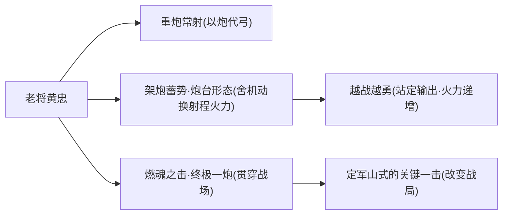

其武器与绝技的"来历"，可追溯至历史原型黄忠弓马娴熟、阵斩夏侯渊的战功——游戏将"老将一箭定乾坤"的传说，奇幻化为"老将一炮定乾坤"，让重炮成为他毕生战意的延伸。

### 重要事件 / 剧情参与

- **五虎上将羁绊**：作为蜀国"五虎将"叙事的一员，与 [关羽](#关羽)、[赵云](#赵云)、[马超](#马超) 等同列，是蜀汉武力象征体系的重要拼图。
- **历史原型高光·定军山阵斩夏侯渊**：其设定根基来自这一史实，被转译为"老将关键一击改变战局"的角色定位（史实背景）。
- **峡谷对战出场**：作为蜀国射手长期活跃于《王者荣耀》对战之中，是"重火力站桩射手"流派的代表性英雄之一（考据推测）。

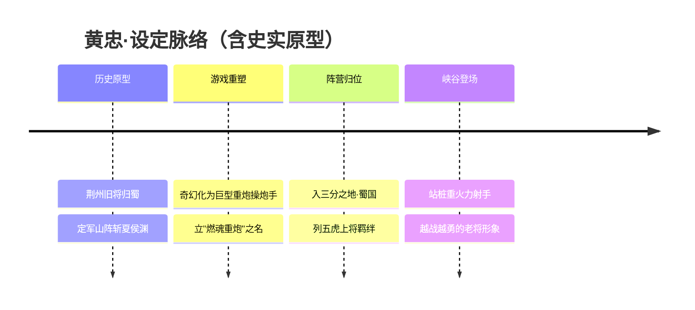

> 以上事件线综合史实原型与游戏设定整理，具体剧情活动若无官方明确出处，均按通行设定概述（考据推测）。

### 羁绊关系

| 对象 | 关系 | 说明 |
| --- | --- | --- |
| [刘备](#刘备) | 主公 / 同阵营 | 蜀国统领，黄忠归于其麾下，共扛"蜀"之旗。 |
| [关羽](#关羽) | 同袍 / 五虎上将 | 同列蜀汉名将，皆为蜀军武力象征。 |
| [张飞](#张飞) | 同袍 / 五虎上将 | 同列蜀汉五虎、同属蜀军前线战将，一肉盾一重炮，攻守呼应。 |
| [赵云](#赵云) | 同袍 / 五虎上将 | 一为高机动白袍战刺，一为站桩老将重炮，风格互补。 |
| [马超](#马超) | 同袍 / 五虎上将 | 西凉锦马超与南阳老黄忠，同列五虎，老少并肩。 |

> 注：本表覆盖蜀国阵营 relatedRelationships 中与黄忠直接相关的"同阵营 / 五虎将"羁绊；其余如桃园结义、联姻等关系主要系于 [刘备](#刘备)、[关羽](#关羽)、[张飞](#张飞) 等，详见各自条目。

### 经典台词

!!! quote "黄忠 · 阵前之声"
    “老当益壮，宁移白首之心。”（考据推测）

    “莫欺老兵手中炮——这一炮，足够了。”（考据推测）

    “年岁可以压弯脊背，却压不灭这身战意。”（考据推测）

> 以上台词为契合"燃魂重炮·老当益壮"人设的概括性还原，非逐字官方文案，已标注（考据推测）。

---

## 刘禅

坦克辅助

**无忧之主 · 驾着机关车招摇过市的蜀汉少主，团控加盾、守护友军的机关坦辅。**

| 档案项 | 内容 |
| --- | --- |
| 称号 | 无忧之主 |
| 定位 | 坦克 / 辅助 |
| 所属 | [三分之地·蜀国](../factions/sanfen-shu.md) |
| 身份 | 蜀国后主、刘备之子；机关器械的痴迷者与改造者 |
| 别称 | 阿斗、机关小王子（考据推测，源自皮肤宣传语气） |
| 关系 | [刘备](#刘备)（父）、[诸葛亮](#诸葛亮)（辅佐恩师）、[张飞](#张飞)（蜀汉长辈）、[蔡文姬](sanfen-wei.md#蔡文姬)（暗恋·皮肤CP） |
| 登场作品 | 《王者荣耀》对战英雄；多款节日/足球主题皮肤短片（考据推测） |

### 背景故事

刘禅是益城那座桃源式都城里最不像"主君"的主君。作为蜀国仁德枭雄 [刘备](#刘备) 之子、名正言顺的蜀汉后主，他本该端坐在那把象征三分之地一隅基业的座椅上，被群臣与五虎旧部簇拥着，学着如何在三国争霸的棋局里运筹一城之命。然而这位少主对权柄毫无兴趣，他真正魂牵梦萦的，是齿轮、是弹簧、是那些会咔哒作响、能喷火能弹射能轰鸣的机关器械。

在三分之地的世界里，蜀国以"侠肝义胆 + 世外桃源"为底色——山清水秀、桃花绚烂，既有桃园结义的热血，也有五虎将的赫赫威名。刘禅生在这样一个被父辈的仁德与功业层层包裹的环境中，却选择了一条与"复兴大业"截然相反的道路：他把本该用于治国理政的精力，全部投入到拆装、改造与发明上。别人眼里他是"扶不起的阿斗"，是辜负了父亲基业的纨绔少主；而在他自己看来，他只是找到了一种让自己"无忧"的活法——既然天下大势自有诸葛丞相与众将操心，那他便要在自己的小世界里，造出独一无二的快乐（考据推测，基于"无忧之主"称号与机关车设定的合理推演）。

支撑这份"无忧"的，是身后那群不离不弃的人。父亲 [刘备](#刘备) 以仁德立国，宁愿被讥讽溺爱也护着这个不成器的儿子；卧龙先生 [诸葛亮](#诸葛亮) 鞠躬尽瘁，替他撑起了整片江山的运转，使他得以心安理得地沉浸在发明之中。正因为有人替他承担了"忧"，刘禅才得以成为"无忧之主"——这个称号既是他天真烂漫的写照，也藏着一丝被宠溺、被庇护的甜蜜与无奈（考据推测）。

于是这位少主做了一件让所有人哭笑不得的事：他亲手为自己打造了一辆庞大而华丽的机关战车，把战场当成了自己最大的游乐场。当蜀国的旗帜在三分之地与魏、吴两强角力，当兄长辈的将士们在前线浴血，刘禅却驾着那辆喷着蒸汽、轰隆作响的机关车，笑嘻嘻地冲进战阵——用它撞开敌人，用它护住伙伴。他不懂太多兵法韬略，可他造的机关，却实实在在地为蜀国挡下过无数次冲锋。在"扶不起"的标签之下，这位少主用自己的方式，笨拙却真诚地守护着属于他的桃源与同伴。

而在他那颗贪玩的心里，还藏着一段连机关都遮不住的小心事——那便是对来自魏国的天籁琴师 [蔡文姬](sanfen-wei.md#蔡文姬) 的暗恋。隔着蜀魏对峙的阵营壁垒，这位少主把那份青涩的爱慕，悄悄织进了自己一桩桩看似无厘头的发明与冒险里。

### 性格与形象

刘禅的核心气质是"天真"与"无忧"。他乐天、贪玩、对权力毫无野心，却对机械有着近乎执拗的热爱与天赋。这份天真既让他显得幼稚、不堪大任，也让他保有了乱世中极为罕见的纯粹——他不算计、不阴沉，把战场都当成了可以尽情玩耍的舞台。

外形上，刘禅最鲜明的象征意象就是他那辆与本人体型严重不成比例的庞大机关车。坐在巨大器械里的少主，本身娇小、衣着华贵而略显富家公子哥的稚气，与那台喷火吐烟、笨重威猛的战车形成强烈反差萌。这种"小孩开大车"的视觉张力，正是他角色魅力的来源：看似胡闹，实则在用整副身家护着身后的人。机关车既是他逃避"忧"的玩具，也是他守护所爱的盾牌——它承载了刘禅性格里"贪玩"与"守护"这一对看似矛盾、实则统一的内核。

### 战斗风格与能力（设定向）

刘禅的全部战斗力，几乎都凝结在那辆由他亲手打造、不断改造升级的机关战车之上。他本人并非孔武有力的武者，而是一名以机械为爪牙的"驾驶者"与"工程师"——人不强，但车很猛（考据推测，依据其坦克/辅助定位与机关车设定推演）。

作为坦克与辅助的双重定位，刘禅的战斗逻辑围绕"突进—控制—护盾"展开：他驾着机关车横冲直撞，用沉重的车体撞散敌方阵型、制造范围控制，把混乱与晕眩抛进人群；与此同时，这台战车又能为身边的友军撑起防护，分担伤害、提供庇护。他不像兄长们那样冲锋陷阵取人首级，而是以一身铁壁与满场机关，替队友扛下最猛的攻势。

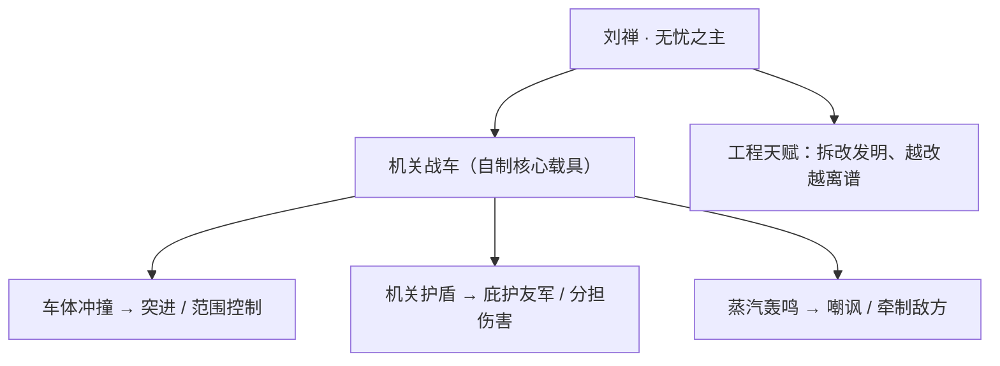

他的招式来历都与"机关"二字深度绑定：不是天赋神力，也非武学传承，而是一个少年用螺丝、齿轮和满腔玩心，一点点拼凑、试错、爆改出来的产物。这份"以巧补拙、以痴成器"的风格，让刘禅在五虎将林立的蜀国阵营里，走出了一条独属于自己的、带着烟火与笑声的守护之路。

### 重要事件 / 剧情参与

- **少主造车**：拒绝循规蹈矩地继承大业，转而沉迷机关，亲手打造出标志性的机关战车，奠定其"无忧之主"的人设基调。
- **驾车参战**：以机关车之力投身蜀国与魏、吴的三分争霸，在前线为同伴撑盾挡冲，证明"扶不起的阿斗"也有自己的守护方式。
- **暗恋蔡文姬**：跨越蜀魏阵营壁垒，对魏国琴师 [蔡文姬](sanfen-wei.md#蔡文姬) 怀有自始至终的暗恋之情，并衍生出以足球/球场为主题的情侣皮肤与共有台词（详见羁绊关系）。
- **节日与活动短片**：作为机关坦辅与"反差萌"代表，频繁出现在各类节日庆典、足球主题等官方活动与皮肤宣传中（考据推测）。

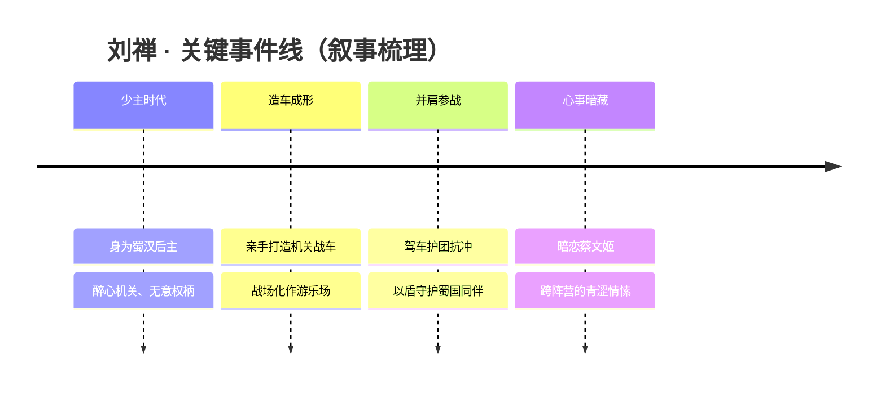

### 羁绊关系

| 对象 | 关系 | 说明 |
| --- | --- | --- |
| [蔡文姬](sanfen-wei.md#蔡文姬) | 单恋 + 皮肤CP（跨阵营） | 刘禅（蜀国）自始暗恋蔡文姬（魏国），二人有足球主题情侣皮肤与共有台词；属单恋 + 皮肤CP，且横跨蜀魏两大对峙阵营。 |
| [刘备](#刘备) | 父子 | 仁德枭雄刘备之子、蜀汉后主；父亲以仁德立国并庇护这个不务正业的儿子，使其得以"无忧"。 |
| [诸葛亮](#诸葛亮) | 辅佐 / 师长 | 卧龙先生鞠躬尽瘁替少主撑起江山运转，是刘禅得以安心沉迷机关的关键依靠（考据推测，基于蜀汉君臣设定）。 |
| [张飞](#张飞) | 蜀汉长辈 / 同阵营坦辅 | 同为蜀国坦克/辅助定位的猛将长辈，桃园旧部之一，是刘禅成长环境中的护持力量（考据推测）。 |

### 经典台词

!!! quote "无忧之主"
    "本王的机关车，可不是用来玩的——好吧，其实就是用来玩的。"（考据推测）

!!! quote "守护"
    "你们尽管往前冲，后面有本王的车挡着呢！"（考据推测）

!!! quote "藏在心底的话"
    "文姬……要是能听我说说我的机关，那该多好啊。"（考据推测，呼应其对蔡文姬的暗恋设定）

### 皮肤故事亮点

刘禅最具代表性的故事线之一，是与魏国琴师 [蔡文姬](sanfen-wei.md#蔡文姬) 的足球主题情侣皮肤系列。这组皮肤把这位少主对蔡文姬的暗恋，从战场搬到了绿茵球场——机关少主褪去战车，换上球衣，与隔着阵营壁垒的心上人在同一片草坪上奔跑追逐。皮肤还配有二人之间的共有台词，把那份青涩、跨越蜀魏的爱慕落到实处，也让"无忧之主"的天真形象多了一层羞涩而动人的底色（皮肤主题与CP设定见本阵营关系资料；具体短片情节为考据推测）。

---

## 元歌

刺客

**无间傀儡 · 以丝线操偶、傀儡即喉舌的提线杀手**

| 档案项 | 内容 |
| --- | --- |
| 称号 | 无间傀儡 |
| 定位 | 刺客 |
| 所属 | [三分之地·蜀国](../factions/sanfen-shu.md) |
| 身份 | 稷下学院出身的傀儡师；以丝线操控人偶代替言语与世界沟通的刺客（原型为蜀国军师庞统，多于长安一带活动）(考据推测) |
| 别称 | 提线者、傀儡师 |
| 关系 | 师兄 [诸葛亮](#诸葛亮)；稷下同窗 [司马懿](sanfen-wei.md#司马懿)、[周瑜](sanfen-wu.md#周瑜)；师承稷下三贤者 [老夫子](jixia.md#老夫子) / [庄周](penglai-donghai.md#庄周) / [墨子](mojia-jiguan.md#墨子) |
| 登场作品 | 《王者荣耀》本传（稷下学院相关剧情与同窗群像）(考据推测) |

### 背景故事

元歌的故事始于一段被夺走声音的童年。他自幼经历巨变，因受惊过度而失语——喉咙里再也吐不出一个完整的字。在一个以言辞、谋略与才华论高下的世界里，一个无法言语的孩子几乎注定被遗忘在角落。他孤身一人，像一只被剪断丝线的木偶，悬在无人问津的暗处。

命运的转机来自[稷下学院](../factions/jixia.md)。这座由创院三贤者[老夫子](jixia.md#老夫子)、[庄周](penglai-donghai.md#庄周)、[墨子](mojia-jiguan.md#墨子)主持、奉行「有教无类」的学府，向这个失语的孤儿敞开了大门。在这里，沉默不再是被驱逐的理由，而成了另一种被理解的可能。真正点亮他的，是他的师兄——博学而温厚的[诸葛亮](#诸葛亮)。师兄没有强迫他开口，而是递给他一种全新的语言：既然口不能言，那就让别的东西替你说话。在诸葛亮的鼓励与启发下，元歌开始钻研机关与傀儡之术，用丝线牵动木偶的肢体、用人偶的动作代替自己的喉舌，去触碰、去回应、去与这个曾将他拒之门外的世界重新对话。(考据推测)

从此，傀儡成了他的声音，丝线成了他的言语。他把全部心力倾注于提线之艺，从笨拙地操弄一具人偶，到能让木偶行走、舞动、乃至替他完成原本只有人才能做的事。那些被精心雕琢的傀儡，承载着一个不能说话之人想要表达的一切——它们替他笑、替他怒、替他向人致意，也替他在必要时出手。久而久之，外人只见提线翻飞、人偶翩然，却看不清那操线之人究竟身在何处。沉默与隐匿，反倒锤炼出他作为刺客最致命的天赋。

按设定考据，元歌的人物原型指向蜀国军师庞统，是与[诸葛亮](#诸葛亮)并称的智谋之士；在《王者荣耀》的世界里，他的活动轨迹多与长安一带相关联，又因稷下求学的经历而与那一代最负盛名的同窗们紧密交织。(考据推测) 他既属于以益城为核心、侠义与桃源交融的[三分之地·蜀国](../factions/sanfen-shu.md)，又始终保留着稷下学子的底色——一个用机关与丝线，把失语的命运改写成一门绝艺的人。

也正因如此，元歌的存在本身就带着一种耐人寻味的隐喻：谁是提线者，谁又是被操弄的傀儡？一个曾被命运牵着走、无从发声的孩子，最终成了掌控丝线、决定木偶去向的那只手。这份从「被操控」到「操控」的逆转，构成了「无间傀儡」这一称号最深处的回响。

### 性格与形象

元歌沉静、内敛，因长年失语而习惯以行动而非言辞表达自己。他不喧哗、不张扬，多数时候将真实的情绪藏在人偶之后——当傀儡欢笑或愤怒时，谁也分不清那是木偶的「表演」，还是操线者本人的心声。这种「人与偶难辨」的暧昧，正是他形象的核心张力。

在外形与象征意象上，元歌的关键符号是**丝线**与**傀儡**。纤细而坚韧的丝线既是束缚也是延伸，将他与人偶连成一体；木偶则是他的第二张面孔、第二副身体，是他与世界之间的中介。他常给人一种「主与偶身份可以互换」的错觉——究竟是人在牵线，还是线在牵人？这种提线木偶式的诡谲美感，让他在以热血侠义著称的蜀国群像里显得格外神秘而独特。

### 战斗风格与能力（设定向）

元歌的战斗艺术，本质上是他「以傀儡代喉舌」之术在杀伐层面的延伸。他不靠肉身正面厮杀，而是凭借**丝线操偶**——将一具人偶送上前去吸引、迷惑、扰乱对手，自己则隐于幕后伺机而动。(考据推测)

其招式来历可归结为「真假错位」四字：人偶在明，真身在暗。敌人往往把注意力倾注在那具上蹿下跳的傀儡上，却忽略了藏在丝线另一端、随时可能现身的操线者本人。当对手将傀儡误认作他、把攻势倾泻向一具木偶时，真正的元歌已绕至要害一击致命。这种「让你看见的，未必是真的我」的刺杀逻辑，使他成为典型的高机动、强迷惑性刺客，也最贴合「无间傀儡」之名——在真与假、人与偶之间，永远存有一道无从填补的「无间」。（以上为基于背景设定的描述，非游戏数值）

### 重要事件 / 剧情参与

- **失语入稷下**：受惊失语的孤儿元歌被奉行有教无类的稷下学院收留，命运由此转折。
- **师兄诸葛亮的启蒙**：博学的[诸葛亮](#诸葛亮)鼓励无法言语的元歌「以机关傀儡代喉舌」，元歌从此专研傀儡之术，找到与世界沟通的方式。
- **稷下 F4 同窗岁月**：元歌与[诸葛亮](#诸葛亮)、[周瑜](sanfen-wu.md#周瑜)、[司马懿](sanfen-wei.md#司马懿)同窗，构成稷下学院最负盛名的学生团体「稷下F4」。这段同窗情谊，也为日后诸葛亮与司马懿之间「挚友兼宿敌」的纠葛埋下伏笔。

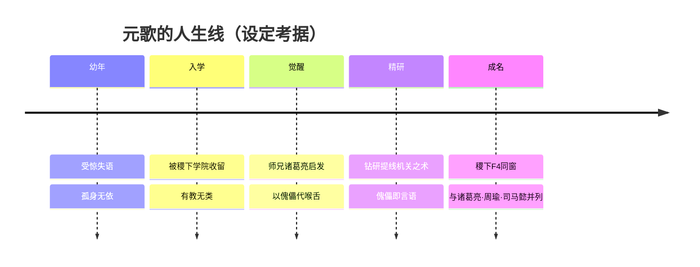

### 羁绊关系

| 对象 | 关系 | 说明 |
| --- | --- | --- |
| [诸葛亮](#诸葛亮) | 师兄 / 稷下同窗 | 元歌幼年失语、孤儿入稷下，正是博学的师兄诸葛亮鼓励他「以机关傀儡代喉舌」，启发他专研傀儡之术，与世界重新沟通。 |
| [司马懿](sanfen-wei.md#司马懿) | 稷下同窗（稷下F4） | 同为稷下学院最负盛名学生团体「稷下F4」成员之一。 |
| [周瑜](sanfen-wu.md#周瑜) | 稷下同窗（稷下F4） | 同列「稷下F4」，青年时同窗求学。 |
| [老夫子](jixia.md#老夫子) | 师承（创院三贤者） | 稷下三贤者之一，有教无类广收弟子，元歌为其门下学子。 |
| [庄周](penglai-donghai.md#庄周) | 师承（创院三贤者） | 稷下创院三贤者之一。 |
| [墨子](mojia-jiguan.md#墨子) | 师承（创院三贤者） | 稷下创院三贤者之一，机关之学亦与元歌的傀儡之术相通。 |

> 注：诸葛亮与司马懿之间「挚友兼宿敌」的关系，是元歌所处的稷下同窗群像中最重要的暗线，元歌作为「稷下F4」一员见证了这段交织。

### 经典台词

!!! quote "元歌台词（考据推测）"
    「丝线的另一端，是你看不见的我。」（考据推测）

    「人偶不会说谎——会说谎的，从来是操线的人。」（考据推测）

    「我不说话，是因为它们替我说了。」（考据推测）

!!! tip "继续探索"
    返回 [三分之地·蜀国 阵营页](../factions/sanfen-shu.md) · 浏览 [全英雄图鉴](index.md) · 查看 [人物关系网](../relationships/index.md)