# 三分之地·魏国 · 英雄图鉴

> 阵营设定见 [三分之地·魏国 阵营页](../factions/sanfen-wei.md)。本页收录该阵营 **6** 位英雄的深度小传。

::: info 本页英雄名册
| 英雄 | 称号 | 定位 | |
| --- | --- | --- | --- |
| [曹操](#曹操) | 魏武挥鞭 | 战士 | |
| [典韦](#典韦) | 恶来 | 战士 | |
| [夏侯惇](#夏侯惇) | 独眼龙 | 战士 | |
| [司马懿](#司马懿) | 寂灭之心 | 法师/刺客 | |
| [甄姬](#甄姬) | 洛神 | 法师 | |
| [蔡文姬](#蔡文姬) | 天籁弦音 | 辅助 | |
:::

---

## 曹操

战士

**魏武挥鞭 · 嗜血枭雄，靠护盾与突进收割战场的吸血型战士。**

| 档案项 | 内容 |
| --- | --- |
| 称号 | 魏武挥鞭 |
| 定位 | 战士（突进/续航型近战） |
| 所属 | [三分之地·魏国](../factions/sanfen-wei.md) |
| 身份 | 魏国君主、三分天下的枭雄、横槊赋诗的乱世霸主 |
| 别称 | 魏王 / 孟德 / 阿瞒（考据推测，源自史实表字与小字） |
| 关系 | [司马懿](#司马懿)、[典韦](#典韦)、[夏侯惇](#夏侯惇)、[甄姬](#甄姬)、[蔡文姬](#蔡文姬)、[诸葛亮](sanfen-shu.md#诸葛亮)、[周瑜](sanfen-wu.md#周瑜) |
| 登场作品 | 《王者荣耀》对战；皮肤主题短片与三分之地相关剧情 |

### 背景故事

曹操是[三分之地·魏国](../factions/sanfen-wei.md)的君主，也是这片以「魏都」为核心、民风彪悍尚武、富侵略野心之地的灵魂人物。魏地灰色的城墙、林立的石柱与横空的天桥，处处透着兵强马壮的肃杀；而把这股肃杀凝成一柄向外挥出之鞭的，正是曹操。「魏武挥鞭」之名，既取自其雄踞北方、挥师天下的霸业气象，也呼应了他横槊赋诗、以鞭指点江山的乱世枭雄形象（考据推测，化用「东临碣石，以观沧海」与「魏武挥鞭」的诗意意象）。

在三分之地的世界观里，天下并非自始就裂为三分。魏、蜀、吴的对峙，是旧秩序崩塌之后群雄逐鹿的结果，而曹操是这场逐鹿中走得最远、也最早把「霸业」二字写在旗帜上的人。他出身寻常，却以远超常人的胆识与权谋崛起：在别人还在观望时局时，他已经选择主动出手——挟持大势、广揽人才、整军经武，把一座座城邑纳入魏的版图。对他而言，乱世不是不幸，而是机遇；秩序的真空，恰恰是雄才施展的舞台。

曹操的过人之处，在于他比同代任何人都更清楚「人才即权力」。魏国麾下猛将如云、谋士如雨，并非偶然，而是他刻意经营的结果。他不拘一格，唯才是举——出身、过往、乃至曾经为敌，都不足以让他放弃一个真正有用的人。猛士[典韦](#典韦)以双戟为他舍命挡刀，独眼悍将[夏侯惇](#夏侯惇)为他冲锋陷阵不惜伤残，而年少阴鸷的谋士[司马懿](#司马懿)则在他的麾下藏起锋芒、静待时机。能让如此各异的强者同聚一面旗下，靠的不仅是权势，更是曹操那种「我能用你、也敢用你」的枭雄底气。

他亦有柔软的一面，却始终被霸业的逻辑所统摄。当名士蔡邕的遗孤[蔡文姬](#蔡文姬)流离失所，是曹操将她收养、护其周全，让乱世中濒临断绝的音律才情得以延续——这既是惜才，也是他对「文」的珍重。然而正是同一个曹操，会在权衡之后做出最冷酷的决断：人于他，从来兼具「值得珍惜的才」与「可供调度的棋子」两重身份，二者往往只在一念之间。

驱动曹操的，从来不是简单的善恶，而是一种近乎本能的「向前」——向更大的版图、更强的力量、更稳固的霸权前进。他嗜血，却非滥杀，那是一种把战场视为养分、越战越强的征服欲；他多疑，却非怯懦，那是一个深知「宁我负人」之人对世界的清醒戒备。在三分之地的纪元里，他既是把天下推向三分的推手之一，也是那个永不满足于「三分」、始终觊觎着一统的野心家。魏武挥鞭，鞭锋所向，从来都是更远的地方。

### 性格与形象

曹操的性格是「枭雄」二字最浓缩的写照：果决而多疑，狠辣而惜才，傲慢而务实。他能在败局中保持冷静、迅速止损，也能在胜势里压住贪心、稳扎稳打；他对忠诚极为渴求，却又对身边每一个人保持着审慎的提防。这种矛盾不是分裂，而是一个清醒到近乎冷酷的统治者，对乱世人心的精确计算。

外形上，曹操被塑造为一身玄黑与暗金交织的铠甲战袍，气度威严而带杀伐之气，举手投足皆有「上位者」的压迫感。其象征意象集中于「鞭」与「盾」——鞭，是挥师指点、号令三军的霸权象征，是「魏武挥鞭」之锋；而环绕其身的护盾，则象征他那「吸纳一切、以战养战」的生存哲学：越是浴血，他便越是坚不可摧。整体形象上，他既像一头嗜血而不失算计的猛兽，又像一位高居城阙、俯瞰天下的乱世之君。

### 战斗风格与能力（设定向）

作为战士，曹操的战斗风格围绕「突进—吸血—护盾」三位一体展开，是典型的越战越勇型近战枭雄（基于背景设定与定位描述，非游戏数值）。

- **武器与象征**：以「鞭」为核心意象，挥鞭如挥师，攻击中带有撕裂与突袭的节奏；其铠甲本身亦是力量的载体，象征魏国「以甲胄铸霸业」的尚武底色。
- **吸血续航**：曹操的战斗哲学是「以敌之血养己之锋」——在缠斗中不断从对手身上汲取生命，越是身处乱军，越能维持自身的战力与压迫，呼应其「嗜血枭雄」的设定。
- **护盾与突进**：他能在突进的瞬间为自己披上护盾，借此强行切入战场核心、贴脸收割，又能凭护盾扛住反扑全身而退。这种「带盾突进、带血归来」的循环，使他既是先手开团者，也是难以击杀的缠斗者。

> 说明：上图为基于「护盾+突进+吸血」战士设定整理的战斗循环示意，非对应具体技能数值。

### 重要事件 / 剧情参与

- **统领魏国**：作为[三分之地·魏国](../factions/sanfen-wei.md)的唯一君主与精神核心，曹操是该阵营所有叙事的中心，麾下聚集[典韦](#典韦)、[夏侯惇](#夏侯惇)、[司马懿](#司马懿)、[甄姬](#甄姬)、[蔡文姬](#蔡文姬)等英雄。
- **收养蔡文姬**：在乱世中收养名士蔡邕之女[蔡文姬](#蔡文姬)，护其周全、延续其音律才情，是其「惜才」一面的代表性事件。
- **三分天下的推手**：在三分之地的纪元背景中，作为魏、蜀、吴鼎立格局的关键塑造者之一，与[诸葛亮](sanfen-shu.md#诸葛亮)所辅佐的蜀、[周瑜](sanfen-wu.md#周瑜)所属的吴长期对峙。

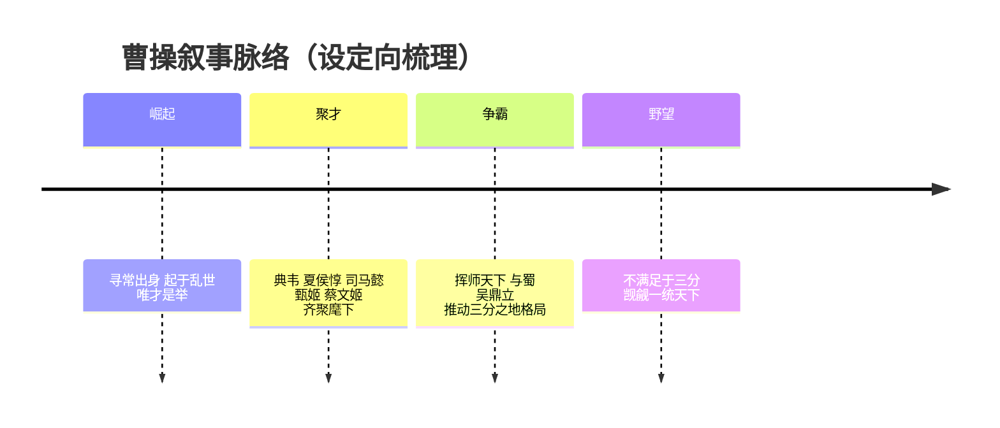

### 羁绊关系

| 对象 | 关系 | 说明 |
| --- | --- | --- |
| [司马懿](#司马懿) | 君臣 / 麾下谋士 | 阴鸷深沉的魏国谋士，藏锋于曹操麾下；其阵营归属为魏，虽曾在稷下求学，是[诸葛亮](sanfen-shu.md#诸葛亮)的宿敌兼挚友。 |
| [典韦](#典韦) | 君臣 / 贴身猛将 | 「恶来」典韦，持双戟的狂暴近身战士，为曹操舍命护卫的忠勇之将。 |
| [夏侯惇](#夏侯惇) | 君臣 / 宗族悍将 | 「独眼龙」夏侯惇，带控带突进的肉系悍将，为魏国冲锋陷阵的核心战力。 |
| [甄姬](#甄姬) | 同阵营 / 魏国成员 | 「洛神」甄姬，化身洛水之神的冰冷美人，同属魏国阵营。 |
| [蔡文姬](#蔡文姬) | 养父女 / 收养关系 | 蔡邕之女，被曹操收养并护其周全；文姬另与蜀国[刘禅](sanfen-shu.md#刘禅)存在跨阵营单恋+皮肤CP（考据推测，详见阵营关系）。 |
| [诸葛亮](sanfen-shu.md#诸葛亮) | 阵营宿敌（魏 vs 蜀） | 蜀国卧龙诸葛亮所辅佐之蜀，与曹操之魏长期对峙，是三分格局的核心矛盾之一。 |
| [周瑜](sanfen-wu.md#周瑜) | 阵营对手（魏 vs 吴） | 吴国名将周瑜所属之吴，与魏鼎足相争。 |

### 经典台词

::: quote 曹操语录
「宁可我负天下人，休教天下人负我。」（考据推测，化用其史实名言）

「魏武挥鞭，天下何人不识君？」（考据推测）

「乱世，正是英雄的舞台。」（考据推测）

「你的血，会让我更强。」（考据推测，呼应其吸血型战士设定）
:::

---

## 典韦

战士

**恶来 · 持双戟死战不退的魏国第一近卫，狂暴近身的输出型战士。**

| 档案项 | 内容 |
| --- | --- |
| 称号 | 恶来 |
| 定位 | 战士（近身爆发 / 突进型） |
| 所属 | [三分之地·魏国](../factions/sanfen-wei.md) |
| 身份 | 魏王曹操的贴身近卫统领、帐前第一猛将 |
| 别称 | 古之恶来、虎痴之友、双戟将（考据推测） |
| 关系 | [曹操](#曹操)（主君）、[夏侯惇](#夏侯惇)（同袍）、许褚（生死之交，未登场）、[吕布](modao-shadow-abyss.md#吕布)（昔日交锋之敌） |
| 登场作品 | 《王者荣耀》（早期上线英雄之一） |

### 背景故事

在三分之地连绵的战火里，魏国之所以能以一城之力压住四方，靠的从来不只是[曹操](#曹操)的权谋，更靠刀锋上不肯后退半步的人。典韦，便是那把立在魏王身前、永远朝着敌人的刀。

典韦出身草莽，少时便以膂力与悍勇闻名乡里。传说他能单臂托起将倾的旗杆于狂风之中而旗不倒——在那个旌旗即军心的年代，这一幕足以让一支溃散的队伍重新挺直脊梁。乱世给了他一身蛮力，也给了他一身仇怨；他曾为友复仇、提头穿市而众人不敢近，这般近乎莽撞的刚烈，反而成了他最初的名声。于是世人借上古勇士之名唤他「恶来」，意指他凶猛如远古传说里那位力能裂兕、生啖虎豹的力士——这个称号既是敬畏，也是忌惮（考据推测，承袭其历史原型「古之恶来」之喻）。

真正改变典韦命运的，是他遇见了[曹操](#曹操)。在三分之地的版图上，魏都是一座灰墙石柱、天桥纵横的尚武之城，民风彪悍、野心勃勃。曹操要的不是温顺的兵卒，而是能在自己身后竖起一堵墙的人——一堵刀砍不穿、马踏不破、宁折不弯的墙。典韦投于麾下后，曹操亲眼见他于阵中以双戟搅碎敌阵、又于败势中独自断后掩护中军，从此再不让他离开自己半步。典韦被擢为帐前近卫之首，统领最精锐的甲士，名号渐渐与「魏王身侧最后一道防线」画上等号。

典韦的双戟极重，寻常军士连舞动都艰难，他却能以之如使臂指。军中曾有「帐下壮士有典君，提一双戟八十斤」之说，言其器之沉、力之绝（考据推测，化用其历史原型典故）。他不擅言辞，不通谋略，甚至在满是权术机锋的魏国朝堂上显得格格不入；可一旦战鼓擂动，整座军营都知道——只要恶来还站着，魏王就死不了。

他的动机简单到近乎纯粹：守护。他不为封侯，不为青史留名，只为护住他认定要护的那个人、那面旗、那座城。正因如此，在三分之地无数权谋倾轧、阵营反复的纪元里，典韦反而成了一种罕见的稳定——他不会背叛，因为他从一开始，就只把自己交给了一件事。而这份近乎执拗的忠诚，也注定让他在魏国最危急的那些时刻，永远第一个挡在最前面。

### 性格与形象

典韦的性格如同他手中的双戟：沉、直、不留转圜。他寡言、暴烈、重义，认准的事九头牛拉不回；对敌人凶悍如恶兽，对主君与同袍却赤诚得近乎憨直。他不懂朝堂的弯弯绕绕，也从不试图去懂——在他眼里，世上的事简单地分为两类：要护的，和该杀的。

外形上，典韦魁梧如铁塔，肩背宽阔，肌肉虬结，常以魏国甲胄裹身，露出的臂膀布满旧伤——每一道都是替人挡下的勋章。他最标志性的形象是那一对沉重的双戟（短戟/手戟），握在手里时几乎与他融为一体。其象征意象正是「盾与刃的合一」：他既是攻向敌人的最锋利的刃，又是护在主君身前最厚重的盾。狂暴时双目赤红、嘶吼如雷，是战场上最直接的恐惧来源；安静时却像一座沉默的山，让身后所有人安心。

### 战斗风格与能力（设定向）

典韦的战斗风格脱胎于他的出身与器械——纯粹的近身蛮力，以及不计代价的死战。

- **双戟近战**：他以一对沉重的短戟为主兵，近身缠斗时戟影翻飞，撕裂阵列。其力之大，可生生砸开敌阵缺口，为身后的魏军开路。
- **狂暴爆发**：传说中典韦越战越勇，伤得越重、杀意越盛。设定上他能在血战中进入一种近乎癫狂的狂暴状态，攻速与力量陡增，化身收割近身之敌的绞肉机器。
- **死战不退**：作为近卫之首，他最擅长的从来不是逃，而是断后与死守。陷阵、护主、断后——这是他刻进骨子里的本能，也是他战斗逻辑的核心。

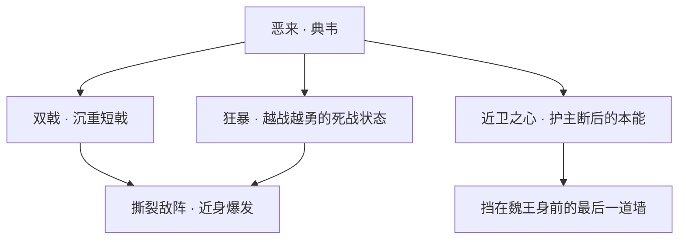

> 注：以上为基于背景设定的力量与招式来历描述，不对应任何游戏内具体数值。

### 重要事件 / 剧情参与

- **投奔曹操**：于乱世中归于[曹操](#曹操)麾下，凭一身悍勇获魏王赏识，擢为帐前近卫之首。
- **陷阵与断后**：在魏国对外征伐的数次恶战中，典韦屡屡担任陷阵开路或殿后死守的角色，成为魏军「攻不破亦退不乱」的关键。
- **舍身护主**（考据推测，承其历史原型的著名结局）：典韦最为人传颂的，是在主君遭遇险境时以血肉之躯死战到底、护其脱险的传说——「恶来死战」几乎成了魏国军中关于「忠勇」的最高注脚。

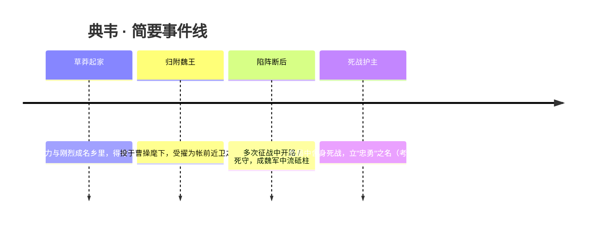

### 羁绊关系

| 对象 | 关系 | 说明 |
| --- | --- | --- |
| [曹操](#曹操) | 主君 / 近卫 | 典韦终生效忠的对象，魏王身侧最后一道防线；曹操视其为最可信的护持。 |
| [夏侯惇](#夏侯惇) | 同袍宿将 | 同属魏国阵前的悍将猛士，皆以勇武死战立身，互为肱股。 |
| 许褚 | 生死之交（未登场） | 历史与传说中与典韦并称的魏国虎卫，二人同为帐前近卫的象征，常被并提为"恶来虎痴"（考据推测，许褚暂未作为英雄登场）。 |
| [吕布](modao-shadow-abyss.md#吕布) | 昔日交锋之敌 | 史载典韦曾随军与吕布势力鏖战；在三分之地的语境里，魏国阵前猛将与"飞将"吕布分属敌对锋面（考据推测）。 |

### 经典台词

::: quote 恶来 · 典韦
"谁来与我大战三百回合？！"（考据推测）

"提着双戟的男人，从不知道什么叫后退。"（考据推测）

"主公身后，由我来守。"（考据推测）
:::

---

## 夏侯惇

战士

**独眼龙 · 以盲眼之躯立于阵前的魏国磐石悍将**

| 档案项 | 内容 |
| --- | --- |
| 称号 | 独眼龙 |
| 定位 | 战士（带控、带突进的肉系前排） |
| 所属 | [三分之地·魏国](../factions/sanfen-wei.md) |
| 身份 | 魏国宿将、曹操麾下元从大将、独目断刃的近卫统领 |
| 别称 | 独眼龙、盲夏侯（考据推测，沿用三国典故的民间俗称） |
| 关系 | [曹操](#曹操)（主公／挚交）、[典韦](#典韦)（同袍猛将）、[司马懿](#司马懿)（同朝幕僚）、[吕布](modao-shadow-abyss.md#吕布)（昔日强敌） |
| 登场作品 | 《王者荣耀》三国题材英雄序列（魏国阵营） |

### 背景故事

夏侯惇是[三分之地·魏国](../factions/sanfen-wei.md)最早追随[曹操](#曹操)起兵的元从老将之一。魏国地处武都，灰色的城墙、石柱与天桥层层叠压，民风彪悍尚武、城中处处弥漫着扩张与征伐的野心；而在这座以铁与血浇筑的都城里，夏侯惇几乎可被视作曹操军威的人格化象征——他不靠权谋、不擅辞令，只以一身伤痕与一柄长刀，把"忠"与"勇"两个字刻进了魏军的旗帜。

关于他最广为流传、也最为惨烈的一段经历，是那只失去的眼睛。在与昔日强敌[吕布](modao-shadow-abyss.md#吕布)势力的鏖战中，夏侯惇于乱军中被冷箭射中左目。传说他非但没有退避哀号，反而当众拔箭、连同被箭带出的眼珠一并吞下，口中只道一句"父精母血，不可弃也"（考据推测，沿用三国典故）。自此他成了独目的悍将，"独眼龙"之名也随之传遍三分之地。这只缺失的眼，不是他的软肋，而成了他最骇人的勋章——敌人望见那只蒙着布带或空洞的眼眶，往往未战先怯。

身为枭雄曹操最信任的旧部，夏侯惇的地位远不止"一名将领"那样简单。在魏国的争霸纪元里，曹操要东征西讨、要在三分天下的乱局中为魏国抢下最大的版图，而每当大军压境、最凶险的前阵需要有人钉死时，被推到最前的几乎总是夏侯惇。他既是冲锋陷阵的矛，也是护住中军、护住主公的盾。正因如此，魏军上下提起这位独眼宿将时，敬畏多过亲近——他像一块沉默的磐石，立在那里，便意味着这道防线不会塌。

夏侯惇的动机简单到近乎纯粹：他活着，是为了曹操能走得更远，为了魏国的旗帜能插得更深。在一个充满谋士算计、暗流汹涌的阵营里——身侧站着阴鸷深沉的[司马懿](#司马懿)、对面是机关算尽的群雄——夏侯惇这种"不问缘由、只问战否"的纯粹武人之心，反而显得罕见而珍贵。他不属于稷下学院那批天才学子的世界，不参与那些关于天书碎片与纪元真相的隐秘博弈；他的战场永远在最前线，他的答案永远写在刀锋上。

也正因为这份不掺杂质的忠勇，夏侯惇在魏国诸将中获得了一种近乎"定海"的分量：当典韦以狂暴近身搏杀、当曹操以护盾突进吸血、当甄姬司马懿在后方布控收割时，是夏侯惇先一步把战线推过去、把伤害扛下来。独眼之龙盘踞在阵前，魏国的尚武野心便有了最坚实的落点。

### 性格与形象

夏侯惇性烈如火、忠义如铁。他寡言、刚直，认准的事一条道走到黑，对主公的忠诚不容置疑，对怯战与背叛则毫无耐心。比起在朝堂上权衡利弊，他更习惯用最直接的方式解决问题——上阵，迎面，把挡路的一切碾过去。这种纯粹也让他成为魏国群像中难得的"暖色"：在一片枭雄的算计与谋士的阴影里，他的赤诚像一束不会熄灭的火。

外形上，他最鲜明的象征自然是那只缺失的左眼——以布带蒙覆，或留着触目惊心的空洞，构成了"独眼龙"这一称号最直观的注脚。他通常被塑造为身披魏军重甲、体格魁伟、伤痕遍布的壮年悍将，沉默而压迫感十足。失去的那只眼非但不让他显得残缺，反而强化了他"以血肉之躯硬扛命运"的悍勇意象。"龙"则取其威猛盘踞、镇守一方之意，与他在阵前如磐石般的定位互为呼应。

### 战斗风格与能力（设定向）

夏侯惇是典型的肉系前排战士——他的价值不在于斩将夺旗的爆发，而在于"先手开团、稳住战线、护住自己人"。这一战斗风格与他作为魏军前阵磐石的设定一脉相承。

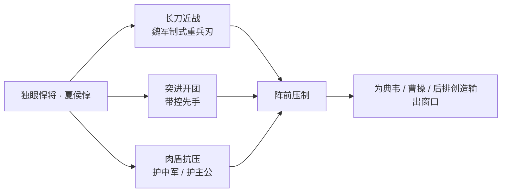

- **武器与战法**：以一柄魏军制式的长柄重刃为主战兵器，招式不求花哨，讲究大开大合、力压千钧。其力量来源并非奇术异能，而是常年阵前搏杀积累的悍勇与韧性——这是一种"用伤换胜、以命换地"的武人之道（考据推测）。
- **控制与突进**：作为"带控带突进"的战士，他擅长冲入敌阵后以强力一击迫使对手失衡，为身后的[典韦](#典韦)、[曹操](#曹操)乃至后排法师创造收割窗口。
- **抗压与续航**：肉系定位使他能长时间钉在最前线吸收伤害，是队伍开团与殿后的双重支点；那只缺失的眼所代表的"不退"意志，正是他续航与抗压风格的精神底色。

### 重要事件 / 剧情参与

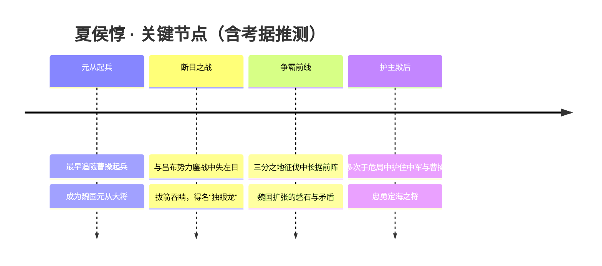

- 作为魏国元从老将，全程参与曹操在[三分之地](../factions/sanfen-wei.md)的争霸与扩张。
- "断目"一役是其最具标志性的剧情事件，奠定了"独眼龙"的称号与形象。
- 在魏国与[吕布](modao-shadow-abyss.md#吕布)势力、以及与蜀、吴诸雄的对抗中，长期承担开团、抗线、护主的关键角色（考据推测，具体战役以官方设定为准）。

### 羁绊关系

| 对象 | 关系 | 说明 |
| --- | --- | --- |
| [曹操](#曹操) | 主公／元从挚交 | 最早追随曹操起兵的旧部之一，是其最信任的前阵大将，忠诚不容置疑。 |
| [典韦](#典韦) | 同袍猛将 | 同为魏国近身搏杀型战士，前阵并肩；典韦狂暴输出，夏侯惇开团抗压，互为犄角。 |
| [司马懿](#司马懿) | 同朝幕僚 | 同属魏国阵营，一武一谋；夏侯惇之纯粹忠勇与司马懿之阴鸷深沉形成鲜明对照（考据推测）。 |
| [吕布](modao-shadow-abyss.md#吕布) | 昔日强敌 | 与吕布势力的鏖战是其失目之战的背景，"独眼龙"之名由此而来（考据推测）。 |

### 经典台词

::: quote 夏侯惇 · 阵前之语（部分为考据推测）
"父精母血，不可弃也！"（考据推测，化用三国"拔矢啖睛"典故）

"盲了一只眼，却看得更清楚——挡我者，死。"（考据推测）

"我这条命，是主公的；我这身伤，是魏国的。"（考据推测）

"前面的路，我来开。"（考据推测）
:::

---

## 司马懿

法师刺客

**寂灭之心 · 阴鸷深沉的魏国谋士，于无声处收割性命的法刺中单。**

| 档案项 | 内容 |
| --- | --- |
| 称号 | 寂灭之心 |
| 定位 | 法师 / 刺客 |
| 所属 | [三分之地·魏国](../factions/sanfen-wei.md) |
| 身份 | 魏国谋士、稷下学院出身的当世智者、曹操麾下重臣（考据推测） |
| 别称 | 仲达、"寂灭之心"、"诸葛亮的宿敌" |
| 关系 | [诸葛亮](sanfen-shu.md#诸葛亮)（挚友兼宿敌）、[曹操](#曹操)（主君）、[周瑜](sanfen-wu.md#周瑜) / [元歌](sanfen-shu.md#元歌)（稷下同窗·稷下F4）、[蔡文姬](#蔡文姬) / [甄姬](#甄姬)（同阵营魏臣） |
| 登场作品 | 王者荣耀（英雄上线宣传以"诸葛亮的宿敌"为引）、相关赛季 PV 与剧情活动 |

### 背景故事

司马懿出身于三分之地·魏国，是这个尚武而多权谋的阵营里最深不可测的一个人。当魏都的灰色石柱与天桥之间，曹操以铁血与护盾驱策着兵强马壮的大军向外扩张时，真正在帷幕之后推演着每一步棋局的，往往不是冲在最前的猛将，而是这位惯于沉默、惯于等待的谋士。他的称号"寂灭之心"，既道出他城府之深、心如止水，也暗示着他出手时那种近乎无声的、令对手在不知不觉间归于寂灭的杀伐之道。

年少时，司马懿曾负笈远行，进入当世学问汇聚之地——稷下学院求学。稷下由[三位贤者](../factions/jixia.md)主持，有教无类、广纳门徒，天下英才云集于此。需要厘清的是：稷下并非他的阵营归属，而只是他求学的所在；正如同样曾在稷下读书的[诸葛亮](sanfen-shu.md#诸葛亮)、[周瑜](sanfen-wu.md#周瑜)一样，他们各自的命运终将把他们带回蜀、吴、魏三方对峙的棋局之中（考据推测的世界观脉络）。在稷下的日子里，司马懿与诸葛亮、周瑜、[元歌](sanfen-shu.md#元歌)并称"稷下F4"，是这所学院里最负盛名、也最锋芒毕露的学生团体。

在那一群天才之中，最让司马懿心折、也最让他放在心上的，是诸葛亮。两人因才华彼此欣赏而相交，曾并肩走过求学的岁月，甚至一同追寻过传说中的"天书碎片"——那是当时年少的他们共同的执念与冒险。然而，正是在追寻真相的过程里，司马懿独自触及了当年某段不愿被言说的隐情。他比任何人都更早、也更冷静地看清了那个真相，却没有因此去恨自己的挚友。他选择了一种最像他的方式：不争辩、不揭破，只是悄然离开了稷下。这一次离开，是他从纯粹的"同窗"走向"宿敌"的分水岭——多年之后，当王者荣耀以"诸葛亮的宿敌来了"作为他登场的引子时，那句话所指向的，正是这段从挚友到对手的漫长因缘。

离开稷下之后，司马懿走入了魏国的权力中枢。在曹操这样雄猜而善用人的枭雄麾下，一个心思缜密、能忍人所不能忍的谋士，既是利器，也时时游走在危险的边缘。司马懿深谙此道：他懂得收敛锋芒，懂得在合适的时刻沉默，更懂得在所有人都以为局势已定的瞬间，给出致命的一击。他的"寂灭"，从来不是张扬的毁灭，而是一种把胜负、生死都算尽之后、不动声色的收割。

也正因如此，司马懿在三分之地的故事里始终带着一层灰冷而难以揣度的底色。他与诸葛亮分属魏、蜀两端，是天下棋盘上最旗鼓相当的一对智者——一个如皓月卧龙，光明磊落地辅佐着仁德之主；一个如长夜寂灭，藏于阴影之中算无遗策。他们越是了解彼此，越是知道这一局终须分出胜负；可在彼此心底，又始终残留着年少同窗时那份再也回不去的欣赏。挚友与宿敌，于司马懿而言，从来就是同一个人的两个名字。

### 性格与形象

司马懿的核心气质可以用四个字概括：阴鸷深沉。他极有耐心，善于隐忍，喜怒不形于色，把所有的情绪与算计都收纳进那颗"寂灭之心"里。他不像[曹操](#曹操)那样以气势压人，也不像魏国诸将那样靠勇力立身；他赢，是赢在"等"——等对手露出破绽，等局势倾向自己，然后一击致命。

在形象塑造上，他通常以暗色系的谋士装束示人，衣袂沉稳、神情冷峻，眉宇间常带着一丝洞悉一切的淡漠与不可亲近的距离感。与之相伴的象征意象多为"寂灭"——幽暗、流动的能量、如同从指间溢出的黑色术法，呼应他在战场上悄无声息却致命的收割风格（形象描述综合其立绘与定位，部分为考据推测）。

### 战斗风格与能力（设定向）

作为魏国阵营中少有的"法师/刺客"复合定位，司马懿的战斗哲学与他的性格高度统一：不正面缠斗，而以高机动的位移与爆发，绕过敌阵直取核心，在敌人反应过来之前完成收割。这也使他在游戏史上被许多玩家视作"最早的法刺收割型中单"代表之一。

- **寂灭之术**：他驱使一种幽暗而流动的能量进行战斗，将术法凝为可以远程释放的刃与印记，落点之处皆成杀场。其招式名号多与"寂灭""绝杀"相关，强调在短时间内叠加伤害、最终爆发收割（招式细节为设定向描述，非游戏数值）。
- **如影位移**：身为兼具刺客特性的法师，他能以连续的短距位移在战场上飘忽穿梭，规避正面冲突、切入敌方后排，体现其"于无声处出手"的杀伐之道。
- **算尽人心**：在设定层面，他真正的"武器"其实是缜密的心计与对局势的预判——战场上的爆发，不过是他在脑海中早已推演完毕的棋局落子。

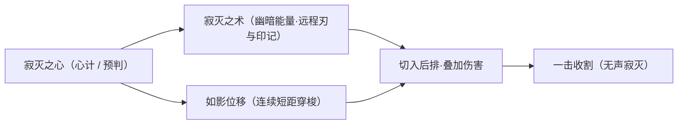

### 重要事件 / 剧情参与

- **稷下求学时期**：与诸葛亮、周瑜、元歌结为"稷下F4"，与诸葛亮一同追寻天书碎片，结下亦友亦敌的因缘。
- **离开稷下**：独自察觉当年隐情，因不愿恨挚友而悄然出走，成为其转向"宿敌"身份的关键转折。
- **效力魏国**：归入曹操麾下，成为三分之地·魏国权谋中枢的核心谋士（考据推测）。
- **英雄登场宣传**：官方以"诸葛亮的宿敌来了"为引推出该英雄，正式确立其与诸葛亮"挚友兼宿敌"的双重关系。

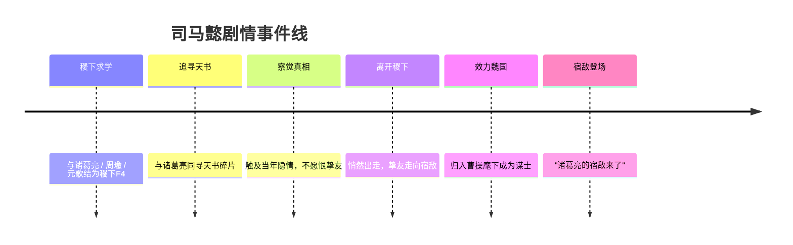

### 羁绊关系

| 对象 | 关系 | 说明 |
| --- | --- | --- |
| [诸葛亮](sanfen-shu.md#诸葛亮) | 挚友兼宿敌 | 青年时同在稷下相识、因才华彼此欣赏共寻天书碎片；司马懿发现当年真相却不愿恨挚友遂离开稷下。既是同窗挚友，又是官方明确的宿敌（"诸葛亮的宿敌来了"）。 |
| [周瑜](sanfen-wu.md#周瑜) | 稷下同窗（稷下F4） | 同为稷下学院最负盛名的学生团体成员，后归属吴国。 |
| [元歌](sanfen-shu.md#元歌) | 稷下同窗（稷下F4） | 稷下F4成员之一，后阵营归属为蜀。 |
| [老夫子](jixia.md#老夫子) | 师承（稷下三贤者→弟子） | 稷下三贤者有教无类广收弟子，司马懿曾在稷下求学，但其阵营归属仍为魏。 |
| [曹操](#曹操) | 主君 / 同阵营 | 魏国统领，司马懿效力的枭雄之主（考据推测）。 |
| [甄姬](#甄姬) | 同阵营魏臣 | 同属三分之地·魏国阵营。 |
| [蔡文姬](#蔡文姬) | 同阵营魏臣 | 同属三分之地·魏国阵营，蔡邕之女、被曹操收养。 |

### 经典台词

::: quote 司马懿 · 台词
"宿敌来了。"（考据推测，呼应其登场宣传"诸葛亮的宿敌来了"）

"我从不与人为敌，我只是……让他们安静下来。"（考据推测）

"棋局已定，落子之人，何须动怒。"（考据推测）

"寂灭，是给执着之人最后的安宁。"（考据推测）
:::

---

## 甄姬

法师

**洛神 · 化身洛水之神的冰冷美人，以控制与法球见长的远程法师。**

| 档案项 | 内容 |
| --- | --- |
| 称号 | 洛神 |
| 定位 | 法师（中单 / 控制法师） |
| 所属 | [三分之地·魏国](../factions/sanfen-wei.md) |
| 身份 | 魏宫贵妇、河洛之畔通灵者，被附会为洛水之神「宓妃」的化身 |
| 别称 | 洛神、甄宓（民间俗称，正史无名记载，作「(考据推测)」） |
| 关系 | [曹操](#曹操)（魏国之主 / 翁辈）、[蔡文姬](#蔡文姬)（同列魏宫的才女）、[司马懿](#司马懿)（同朝谋臣） |
| 登场作品 | 《王者荣耀》游戏本体；登场较早的初代法师之一 |

### 背景故事

甄姬的故事生长在 [三分之地·魏国](../factions/sanfen-wei.md) 的灰色城墙与河洛烟波之间。魏国是三国争霸纪元里以魏都为核心、民风彪悍尚武、由枭雄 [曹操](#曹操) 统领的强权阵营；当典韦、夏侯惇这样的猛将在沙场上以血与铁书写功业时，甄姬却以另一种方式被铭记——她不是执戟的武将，而是立于水畔、被传说选中的女子。

相传她生于河洛之滨，自幼临水而居，性情清冷如冰，容貌却艳绝当世。三国典籍中那位倾国倾城、最终入魏宫的女子（民间俗称「甄宓」，但正史并无确切名讳，此处作「(考据推测)」），在《王者荣耀》的世界观里被进一步神话化：她与洛水之间有着旁人无法理解的牵系。每当夜色漫过河面，水波会在她足下凝成冰，倒影里浮现的不再是凡人的面容，而是一位踏波而行、衣袂生烟的水神。世人据此唤她为「洛神」，把她与古老传说中那位居于洛水、名为「宓妃」的女神合而为一。

她的命运与魏国的兴衰紧紧缠绕。乱世之中，美貌既是恩赐也是诅咒——它让她被卷入权力与征伐的漩涡，被作为联姻、占有与炫耀的对象，从一座深宫辗转到另一座深宫。正史与演义里，她最终香消玉殒于宫闱倾轧；而在这个被重新书写的纪元中，传说给了她另一条出路：当尘世的爱与恨都化作冰冷的疏离，她索性褪去凡胎，把自己彻底交还给洛水，成为那位「凌波微步、罗袜生尘」的水神本身。她不再为某一座王城而活，而是以神祇的姿态俯瞰这片被野心与刀兵反复犁过的土地。

正因如此，甄姬在魏国诸将中显得格外疏离。她身披魏国之名，却不像 [曹操](#曹操) 那样渴求疆土，也不似 [司马懿](#司马懿) 那样在暗处经营权谋。她的「战斗」更像是一场冷眼旁观的回应——当有人闯入她的水域、惊扰她的宁静，洛水才会以漫天冰晶与法球作答。她的动机不是争霸，而是守护那份属于水神的、不容侵犯的孤高。

### 性格与形象

甄姬的核心气质是「冷」。这种冷既是美人的疏离，也是水神的超然：她说话不多，语调清淡，仿佛永远隔着一层薄冰看待世间的喧嚣。她不轻易动情，可一旦认定的东西被冒犯，那份冷便会化为决绝的杀意。

外形上，她以「洛神」的经典意象示人——一身水色或月白的华服，衣袂层叠如波纹荡漾，行走时仿佛踏在水面之上（呼应曹植《洛神赋》「凌波微步，罗袜生尘」的千古名句，此为其形象的灵感来源）。她常以一枚悬浮的法球相伴，那既是她的武器，也是她身份的象征——晶莹剔透，内里却涌动着能将敌人禁锢的寒意。整体象征意象集中于「水」与「冰」：流动而柔美，骤然凝结时又锋利刺骨，恰如她外柔内冷的双重性情。

### 战斗风格与能力（设定向）

甄姬是典型的远程控制法师，力量来源被设定为「与洛水相通的水神之力」。她不持刀剑，而是以凝聚水汽与寒意的**法球**作为攻伐之器；这枚法球可被她随心驱使，在敌阵中游走、爆裂，化作伤害与控制的源头。

她最具标志性的手段是「冰封」——以洛水之寒将踏入领域的敌人定在原地，使其动弹不得，再从容补上致命的法术。这种「先控后杀」的节奏，正是「以控制与法球见长」这一定位的来历：她不依赖近身缠斗，而是凭借对场地与时机的掌控，让对手在被冻结的瞬间陷入绝境。

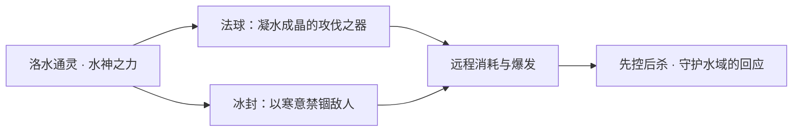

需要说明的是，以上为依据其「洛神」设定与法师定位所作的叙事化描述，并非游戏内技能数值或机制说明。

### 重要事件 / 剧情参与

- **化身洛神**：甄姬叙事的核心转折——由乱世美人蜕变为洛水之神，是其全部故事的题眼。
- **作为魏国初代法师登场**：在 [三分之地·魏国](../factions/sanfen-wei.md) 阵营中，她与谋臣 [司马懿](#司马懿)、才女 [蔡文姬](#蔡文姬) 共同构成魏国「文」的一面，与典韦、夏侯惇等「武将」形成对照。
- **皮肤主题叙事**：甄姬历年皮肤多围绕其本体气质延展（如冰雪、花神、洛神等主题），以视觉方式不断重述「水神/美人」的双重意象（具体皮肤背景作「(考据推测)」，详见下文）。

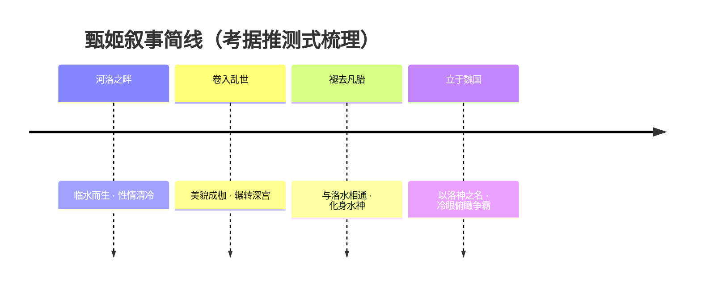

### 羁绊关系

| 对象 | 关系 | 说明 |
| --- | --- | --- |
| [曹操](#曹操) | 魏国之主 / 翁辈（考据推测） | 甄姬归属于曹操统领的魏国；按三国史事，她进入魏宫与曹氏一族关系密切，但游戏内未将其明确绑定为某一具体 CP，故以阵营从属与翁媳辈分关系记之。 |
| [司马懿](#司马懿) | 同朝谋臣 | 同属魏国阵营，一为深宫水神、一为暗处谋士，分别代表魏国「神秘」与「权谋」的两面。 |
| [蔡文姬](#蔡文姬) | 同列魏宫的才女 | 同为魏国中以才情/灵性见长的女性英雄，与甄姬共同丰富了魏国「文」的层次。 |
| [典韦](#典韦) · [夏侯惇](#夏侯惇) | 同阵营武将 | 与甄姬形成「武将—法师」的鲜明对照，沙场之力与水神之术同列魏旗之下。 |

> 备注：本阵营上下文 `relatedRelationships` 中的「稷下师承」「稷下 F4」「诸葛亮—司马懿宿敌」等羁绊主要围绕 [司马懿](#司马懿) 展开，与甄姬无直接关联；甄姬本人在所读设定中未被纳入这些团体，故不在此强行牵连。

### 经典台词

::: quote 甄姬 · 经典台词
「冰封你的心。」（考据推测）

「凌波微步，罗袜生尘。」——化用曹植《洛神赋》，呼应其洛神意象（考据推测）

「这洛水之畔，不容侵犯。」（考据推测）
:::

### 皮肤故事亮点

甄姬作为初代法师，拥有数量可观的皮肤序列。其皮肤美术大多紧扣她本体的两大母题——「水/冰」与「美人/神祇」：或以冰雪封冻的清冷示人，或以花神、洛神等主题强化其超凡脱俗的水畔气质。这些皮肤在视觉与配音上反复重述「凌波微步」的洛神想象，使「洛神」这一称号在不同造型间始终保持着辨识度。（各皮肤的具体剧情设定作「(考据推测)」，以官方皮肤介绍为准。）

---

## 蔡文姬

辅助

**天籁弦音 · 以音律驱散伤痛、为同袍续命的奶妈型辅助。**

| 档案项 | 内容 |
| --- | --- |
| 称号 | 天籁弦音 |
| 定位 | 辅助（治疗型奶妈） |
| 所属 | [三分之地·魏国](../factions/sanfen-wei.md) |
| 身份 | 名士蔡邕之女、魏国乐师；被 [曹操](#曹操) 收养庇护的义女 |
| 别称 | 文姬、小文姬（玩家昵称） |
| 关系 | [曹操](#曹操)（义父／恩人）、[甄姬](#甄姬)（魏国同僚）、[刘禅](sanfen-shu.md#刘禅)（跨阵营单恋者，皮肤CP） |
| 登场作品 | 三国题材魏国阵营英雄（考据推测，具体动画／剧情以官方为准） |

### 背景故事

蔡文姬出身于三分之地·魏国治下的书香门第，其父蔡邕乃天下闻名的大学者与乐律宗师——精于辞章、典籍与音律，藏书满室、桃李遍野。在这样的家庭里长大的文姬，自幼便浸润于琴声、书卷与墨香之中。她有着远超同龄人的音乐天赋：传说她年幼时隔墙听父亲抚琴，仅凭弦音断裂的声响便能听出第几根弦绷断，令蔡邕大为惊叹。也正是这份对声音近乎天授的敏感，奠定了她"天籁弦音"称号的根基。

然而生于乱世，纵有满腹才情也难逃飘零之苦。在魏国与蜀、吴鼎足而立、烽烟连年的三分之地，名门望族同样会在战火与权力倾轧中倾覆。文姬的人生因离乱而支离破碎——家道中落、骨肉分散，她一度沦落于颠沛流离之中，亲历过被掳掠、被裹挟、被迫远离故土的苦难（呼应史传中"文姬归汉"的母题，考据推测游戏对此做了背景化处理）。这段失去家园与至亲的经历，让她比任何人都更懂得"伤痛"二字的分量，也让她日后选择以治愈而非杀伐作为立身之道。

她命运的转折，来自枭雄 [曹操](#曹操) 的伸手相助。出于对故友蔡邕的敬重、也出于对其满门才学的珍视，曹操不惜代价将流落在外的文姬接回魏都，并收她为义女加以庇护。对文姬而言，曹操既是把她从无尽漂泊中拉回来的恩人，也是再造之父。她由此正式归属于 [三分之地·魏国](../factions/sanfen-wei.md)——那座灰墙石柱、天桥纵横、兵强马壮、民风彪悍尚武的城邦。在一群以铁血厮杀著称的魏国将士之间，她显得格外柔软：当 [典韦](#典韦) 的双戟、[夏侯惇](#夏侯惇) 的悍勇在前线开路、[司马懿](#司马懿) 的算计在暗处铺陈时，文姬抱着她的乐器站在队伍最后，用音律为受创的同袍续上一口气。

文姬的动机简单而坚定：她不愿再看到任何人重蹈自己骨肉离散的覆辙。亲历过失去，她比谁都明白守护的可贵。于是她把对父亲的怀念、对故土的眷恋、对乱世的悲悯，全部熔铸进音律里——她的琴声不只是娱情之乐，更是能拂去疲惫、抚平创口、把濒死之人从战场边缘拉回来的力量。她不持刀剑，却以歌声成为整支队伍最不可或缺的依靠。在魏国尚武的喧嚣中，她是那一缕温柔的反调，是把"杀伐之地"与"人间温情"连缀起来的弦音。

### 性格与形象

文姬性情温婉、心思纯善，带着读书人家女儿特有的灵秀与体贴。她对身边人怀有近乎本能的关怀，看到队友受伤会真心难过，看到同袍倒下会拼尽全力施救——这种近乎"妈妈"般的守护欲，正是玩家亲昵称她为"奶妈"的由来。她不喜争斗、厌恶杀戮，却又因经历过乱世而并不天真：她明白只有让大家活下去，温柔才有意义。

外形上，她常被塑造为身着柔色长裙、抱持乐器（琵琶／弦乐器为主要意象，考据推测）的少女形象，发饰清雅、举止从容，与魏国将领们的金属铠甲、血色战旗形成鲜明对照。环绕她周身的视觉符号是流动的音符、跳跃的光点与温暖的暖色光晕——治愈之光以乐音的形态弥散开来，落在同伴身上化作生机。她的整体气质介于"乱世孤女"的清冷与"守护者"的明亮之间，柔中带韧。

### 战斗风格与能力（设定向）

蔡文姬的力量根植于她对音律的天赋与造诣。她不依靠刀枪格斗，而是以"声音"为媒介，把抽象的旋律转化为可以治愈、驱散、护佑的实在之力——这是"天籁弦音"在叙事层面的核心：弦音即治愈，旋律即守护。

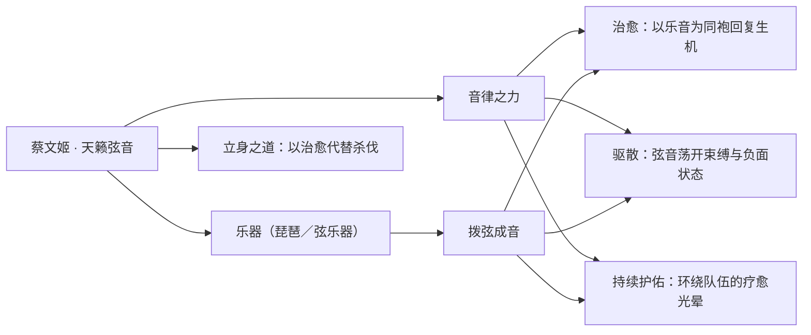

- **武器与媒介**：她的"武器"实为乐器（以弦乐／琵琶意象为主，考据推测），真正的杀手锏不是攻击力而是源源不断的治疗与续航能力。
- **招式来历**：所有能力的源头都是她自幼习得、又在乱世苦难中淬炼出的音律修为。她能凭弦音辨毫厘的天赋（"辨弦"传说），在设定上被引申为对队友状态的敏锐感知与精准救治。
- **战场角色**：作为团队的生命线，她让前排能更久地承受 [典韦](#典韦)、[夏侯惇](#夏侯惇) 的输出环境，让脆弱的法师如 [甄姬](#甄姬) 有底气贴近战场。她本身缺乏自保的爆发，需要队友的保护，是典型"以队友为铠甲、以乐音为长矛"的纯辅助。

### 重要事件 / 剧情参与

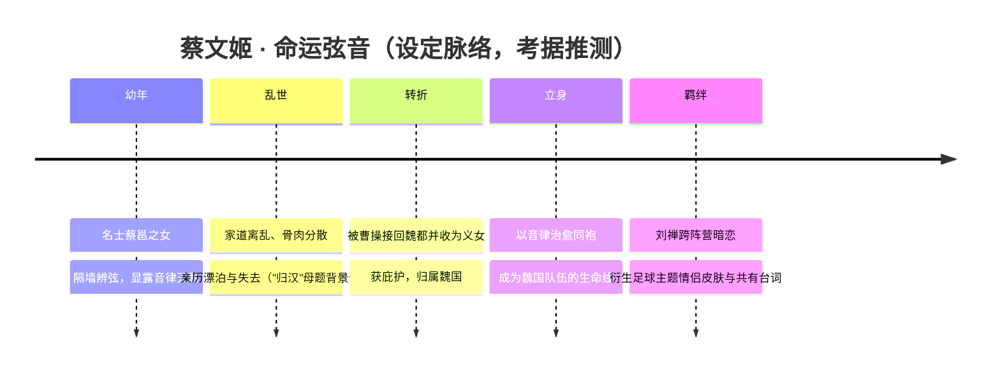

- 作为 [三分之地·魏国](../factions/sanfen-wei.md) 阵营成员，参与魏国与蜀、吴争霸的群像叙事。
- 与 [刘禅](sanfen-shu.md#刘禅) 之间衍生出跨阵营的情感线与联动皮肤剧情（见下文皮肤故事亮点）。
- 具体动画／活动／番外的明确名目以官方公布为准（考据推测）。

### 羁绊关系

| 对象 | 关系 | 说明 |
| --- | --- | --- |
| [曹操](#曹操) | 义父 / 恩人 | 曹操将流落乱世的文姬接回魏都、收为义女并加以庇护，是她归属魏国、得以安身立命的根本。 |
| [刘禅](sanfen-shu.md#刘禅) | 跨阵营单恋者 / 皮肤CP | 蜀国的刘禅自始暗恋魏国的蔡文姬，二人拥有足球主题情侣皮肤与共有台词，属"单恋＋皮肤CP（跨阵营）"。 |
| [甄姬](#甄姬) | 魏国同僚 | 同为曹魏阵营的女性角色，于灰墙战城中并肩，一治愈、一控制，互为照应（考据推测）。 |
| [典韦](#典韦) / [夏侯惇](#夏侯惇) | 魏国同袍 | 前线悍将冲锋陷阵，文姬居后以乐音续命，是她治愈力量最直接的受益者与守护对象。 |
| [司马懿](#司马懿) | 魏国同阵营 | 同属曹魏麾下的谋士与乐师，立场一致、风格迥异（考据推测）。 |

### 经典台词

::: quote 天籁弦音
"用心去倾听这世界的声音。"（考据推测）

"不要害怕，我会守护你。"（考据推测）

"音乐，是治愈伤痛最好的良药。"（考据推测）
:::

### 皮肤故事亮点

- **足球主题情侣皮肤（与刘禅）**：围绕 [刘禅](sanfen-shu.md#刘禅) 对蔡文姬的暗恋而生的联动设计，两人换上球场装束、配以共有台词，把"跨阵营单恋"的羞涩与可爱搬上绿茵场，是玩家津津乐道的官方"发糖"经典之一（具体皮肤名目与剧情细节以官方为准，考据推测）。

::: tip 继续探索
返回 [三分之地·魏国 阵营页](../factions/sanfen-wei.md) · 浏览 [全英雄图鉴](index.md) · 查看 [人物关系网](../relationships/index.md)
:::