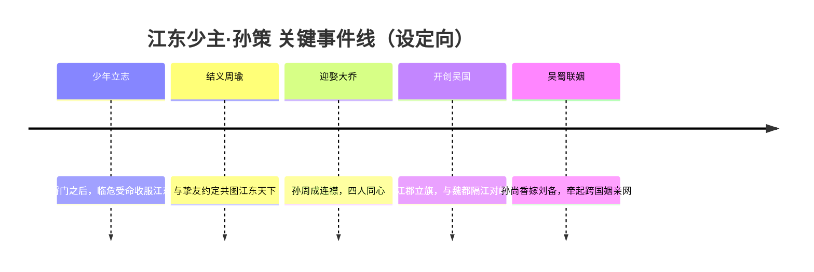
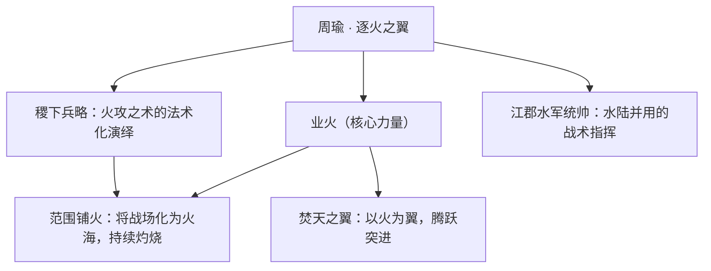
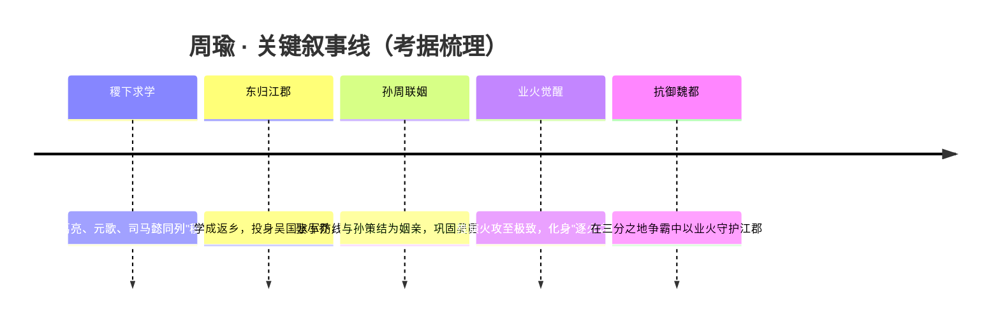
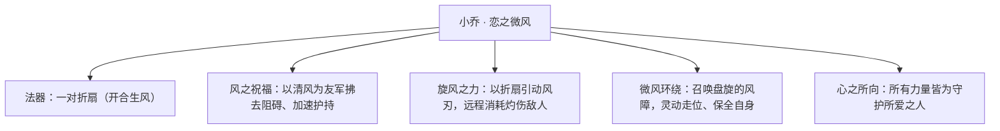
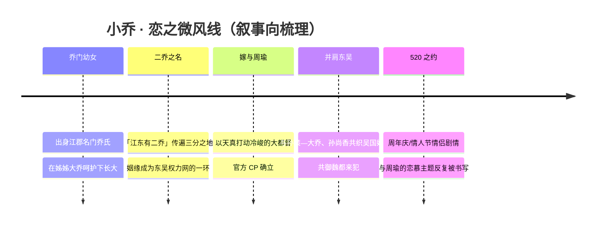
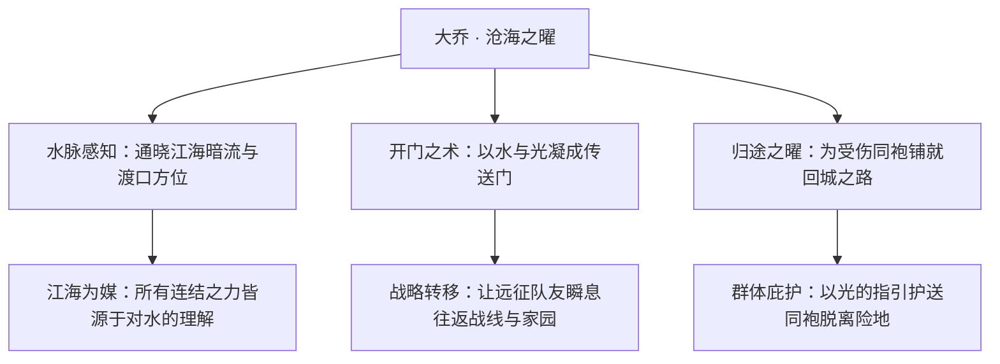
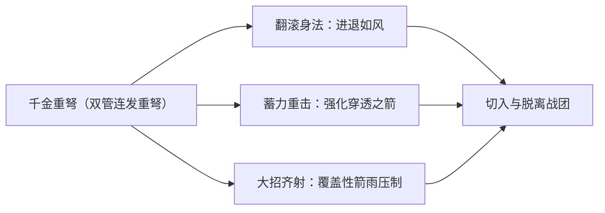
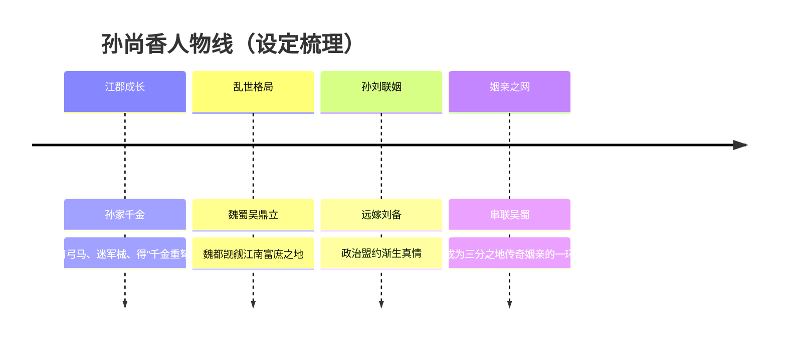

# 三分之地·吴国 · 英雄图鉴

> 阵营设定见 [三分之地·吴国 阵营页](../factions/sanfen-wu.md)。本页收录该阵营 **5** 位英雄的深度小传。

!!! abstract "本页英雄名册"
    | 英雄 | 称号 | 定位 | |
    | --- | --- | --- | --- |
    | [孙策](#孙策) | 江东少主 | 战士 | |
    | [周瑜](#周瑜) | 逐火之翼 | 法师 | |
    | [小乔](#小乔) | 恋之微风 | 法师 | |
    | [大乔](#大乔) | 沧海之曜 | 辅助 | |
    | [孙尚香](#孙尚香) | 千金重弩 | 射手 | |

---

## 孙策

战士

**江东少主 · 乘风破浪、率舟破阵的团控型战士，以一身霸气将江东豪杰拧成一股绳的少年雄主。**

| 档案项 | 内容 |
| --- | --- |
| 称号 | 江东少主 |
| 定位 | 战士（团控突进型） |
| 所属 | [三分之地·吴国](../factions/sanfen-wu.md) |
| 身份 | 吴侯 / 江东基业的开创者 / 孙氏宗主 |
| 别称 | 小霸王、江东猛虎之子（考据推测，源自史称「小霸王」之号） |
| 关系 | 妻：[大乔](#大乔)；妹：[孙尚香](#孙尚香)；挚友兼连襟：[周瑜](#周瑜)；连襟之妹：[小乔](#小乔)；妹婿（联姻）：[刘备](sanfen-shu.md#刘备) |
| 登场作品 | 《王者荣耀》对局英雄；多次出现于吴国主题剧情、520 情侣专题与水乡主题活动（考据推测，依据其情侣皮肤与阵营专题） |

### 背景故事

孙策是三分之地·吴国的开创者与少主。三分之地承接了上古纪元崩坏之后的「三国争霸」格局，魏、蜀、吴三方在山河破碎的废墟上各自割据、互相觊觎。吴国以江郡为核心——这是一片江南水乡，江河纵横、园林富庶，苏派的婉约与徽派的厚重在此交汇，水网把村镇连成一片繁华，却也正因富庶而被北方的魏都长久觊觎。孙策的故事，就是一个少年如何在这片水做的土地上，用最刚烈的方式立起一面属于江东的旗。

他出身将门，父辈早殁，留给他的不是安稳的基业，而是一群散落各地、桀骜难驯的旧部与一片人心未定的疆土。少年孙策没有退路：他几乎是以一己之锐气，把那些原本各自为政的江东豪杰一个一个收服、一座一座城池打下来。史称他「小霸王」，既是赞他用兵如项羽般势不可挡，也是说他年少而锋芒太盛。在《王者荣耀》的演绎里，这份「少」与「霸」被放大成了他最核心的气质——他不是坐在帐中运筹的老成之主，而是站在船头、第一个冲进敌阵的那个人。

孙策真正的转折，来自两个人。其一是他的挚友[周瑜](#周瑜)。两人年岁相仿、意气相投，一文一武，一个掌业火谋略、一个执长戈冲锋，少年时便结为兄弟，约定要共同打下一片江东的天下。这份知己之交，是孙策能把零散势力凝成「吴国」的根基。其二便是他后来迎娶的[大乔](#大乔)，而周瑜所娶的[小乔](#小乔)正是大乔的亲妹妹——孙周二人由此既是兄弟、又成连襟，两对璧人、四人同心，构成了吴国姻亲网最温柔也最坚固的内核。江南的水把柔情与豪情一并酿了进去：白天他是率舟破阵的少主，夜里桥头灯下，他也只是一个会为乔家小姐停下脚步的少年。

他的雄心从未止于偏安。江郡虽富，却始终笼罩在魏都的阴影之下；要守住这片基业，光有水乡的繁华不够，还要有敢于争锋天下的胆魄。孙策把妹妹[孙尚香](#孙尚香)当作掌上明珠般疼爱，却也在乱世的棋局里看清——吴国不能独善其身。后来孙尚香与蜀国的[刘备](sanfen-shu.md#刘备)联姻，吴蜀之间由此牵起一线，使「孙策—大乔/小乔—周瑜/刘备」的姻亲网横跨两国，成为三分格局中一股微妙而关键的力量。孙策的动机，归根结底简单而炽烈：让江东不再被人轻视，让追随他的人有家可归，让这片水做的疆土，配得上他亲手立起的那面旗。

少主之「少」，是他的软肋，也是他的锋刃。他的故事里始终带着一种「来日方长却又时不我待」的张力——年轻意味着无限可能，也意味着随时可能折戟于自己的锐气之中。正是这份未完成感，让江东少主孙策成为吴国最具悲剧色彩与英雄气概并存的旗手。（其结局走向，游戏未作明确硬性交代，此处不臆断，考据推测。）

### 性格与形象

孙策的性格可以用「外锋内暖」四个字概括。对敌、对乱世，他是锋芒毕露的——决断、好胜、敢为天下先，一旦认准方向便如离弦之箭，绝不回头；这股近乎莽撞的霸气，正是他能在群雄环伺中硬生生打出一片江东的底气。但对自己人——对周瑜、对大乔、对妹妹孙尚香，他又是极重情义、甚至有几分少年人的赤诚与笨拙。他把「兄弟」与「家」看得比天下更重，这让他区别于纯粹的野心家，更像一个为守护而战的守门人。

外形上，他被塑造成英气勃发的青年武将：身姿挺拔，眉目间带着不服输的锐气，常以临江、立于舟船之上的姿态出现，衣袂与江风一同翻飞。最具辨识度的象征，是他与「舟船」「江水」的绑定——他的战斗、他的登场，几乎都离不开一艘破浪而来的战船，船头劈开水面的画面，正是「乘风破浪」「率众突进」这一核心意象的视觉化。江南水乡的柔与少年雄主的刚，在他身上被有意地揉成一种反差美：他是水做的故乡里，最像火的那个人。

### 战斗风格与能力(设定向)

孙策的战斗设定紧扣「乘船突进、团控开团」这一核心——他不是单点收割的刺客，而是为团队撕开缺口、把敌人困在一处的战士。

- **战船破阵**：孙策最标志性的能力，是召唤一艘战船乘风破浪、向前冲撞。这艘船既是他的座驾，也是他的武器与护盾——破浪的船头能撞开敌阵、为身后的兄弟开路，呼应其史称「小霸王」般势不可挡的冲锋意象（设定向，非游戏数值）。
- **长戈临阵**：作为冲在最前的少主，他贴身以长兵格斗，招式刚猛直接，与其「敢为天下先」的性格一脉相承（武器形制为考据推测，依据其武将定位）。
- **团控收束**：他的力量长于「控住一群人」而非「秒掉一个人」——把分散的敌人卷入一处、再交给队友收割，这正是「团控型战士」的设定内核，也暗合他「把散乱的江东豪杰拧成一股绳」的人物母题。

### 重要事件 / 剧情参与

- **开创吴国基业**：以少年之身收服江东散乱势力，奠定吴国于江郡的立国根基（背景设定核心）。
- **孙周之交 → 双姝姻亲**：与周瑜结为生死兄弟，二人分娶大乔、小乔，结成连襟，铸就吴国姻亲网内核。
- **吴蜀联姻线**：妹妹孙尚香与蜀国刘备联姻，使吴蜀之间牵起一线，孙策由此被卷入三分天下的更大棋局。
- **520 情侣 / 水乡主题专题**：作为大乔的官方 CP，孙策频繁出现在情侣皮肤与江南水乡主题的活动叙事中（考据推测，依据其情侣皮肤与阵营专题设定）。

### 羁绊关系

| 对象 | 关系 | 说明 |
| --- | --- | --- |
| [大乔](#大乔) | 夫妻 | 历史夫妻，游戏沿用；二人为官方 CP，有 520 情侣皮肤，是孙策柔情一面的归宿。 |
| [周瑜](#周瑜) | 挚友 / 连襟 | 少年结义的生死之交，一文一武共图江东；周瑜娶小乔后，二人又成连襟，是吴国凝聚力的核心。 |
| [小乔](#小乔) | 连襟之妹 / 妻妹 | 大乔之妹、周瑜之妻；与孙策同属吴国姻亲网的核心四人。 |
| [孙尚香](#孙尚香) | 亲兄妹 | 史实兄妹，孙策视妹如宝；孙尚香后嫁刘备，由此延展出跨国姻亲网。 |
| [刘备](sanfen-shu.md#刘备) | 妹婿（联姻） | 蜀国之主，因迎娶孙尚香而与孙策结成姻亲，使吴蜀之间牵起一线（详见蜀国阵营页）。 |
| 孙权 | 兄弟（同宗） | 与孙策同为吴国领袖、孙氏宗亲（孙权暂未收录于本英雄目录，故不作链接，考据推测其为孙策之弟）。 |

### 经典台词

!!! quote "江东少主之声"
    「乘风破浪，扬帆起航！」（考据推测）

    「江东的儿郎，随我冲！」（考据推测）

    「为了大乔，我绝不能输。」（考据推测，呼应其与大乔的 CP 设定）

### 皮肤故事亮点

孙策最具代表性的故事性皮肤，是与[大乔](#大乔)成对推出的 **520 情侣主题皮肤**。这组皮肤把二人从战场拉回江南的桥头与花海，以「乘风破浪的少主」与「沧海之曜的爱人」相互映照，将孙策「外是率舟破阵的雄主、内是停在乔家小姐身边的少年」这一反差气质，浓缩在一组同框的情侣演绎之中，也成为吴国「以姻亲为内核」这一阵营母题最直观的展现。（具体皮肤命名与剧情细节以官方为准，考据推测。）

---

## 周瑜

法师

**逐火之翼 · 操控业火、以一城烈焰焚尽来犯之敌的吴国都督**

| 档案项 | 内容 |
| --- | --- |
| 称号 | 逐火之翼 |
| 定位 | 法师（范围灼烧 / 持续法术伤害） |
| 所属 | [三分之地·吴国](../factions/sanfen-wu.md) |
| 身份 | 吴国大都督、江郡水军统帅、稷下学院出身的兵法谋士 |
| 别称 | 周郎、公瑾、火神都督（考据推测） |
| 关系 | 妻：[小乔](#小乔)；主君兼姻亲：[孙策](#孙策)；连襟：[大乔](#大乔)；同窗：[诸葛亮](sanfen-shu.md#诸葛亮)、[元歌](sanfen-shu.md#元歌)、[司马懿](sanfen-wei.md#司马懿)（稷下F4） |
| 登场作品 | 《王者荣耀》本传；多次出现于三国主题剧情、姻亲CP活动与稷下学院相关叙事 |

### 背景故事

周瑜，字公瑾，是[三分之地·吴国](../factions/sanfen-wu.md)立于江郡之上的大都督。在这片苏派与徽派交织的江南水乡里，他既是统御万千舟船的兵家，也是手握「业火」之力的法师——以智者之心运筹帷幄，又以烈焰之翼焚尽来犯。

少年时的周瑜并非一开始就背负火焰。他与[诸葛亮](sanfen-shu.md#诸葛亮)、[元歌](sanfen-shu.md#元歌)、[司马懿](sanfen-wei.md#司马懿)同列稷下学院最负盛名的学生团体——后世称之为「稷下F4」。这四人各怀绝学、互为镜鉴：诸葛精于推演，元歌擅长傀儡机巧，司马深谋而隐忍，而周瑜则在兵略与火术之间寻得了自己的道。稷下三贤者有教无类，广纳门徒；周瑜虽在稷下求学，却始终以江东子弟自居，学成之后毅然东归，将一身所学尽数倾注于故乡的江河防线。需要厘清的是：纵然师承稷下，他的阵营归属从来是吴国，而非学院本身。

回到江郡，周瑜遇见了改变其命运的两个人。其一是少主[孙策](#孙策)——这位「江东少主」与他意气相投、并肩开拓基业，二人既是君臣，更是莫逆。其二，是他此生挚爱[小乔](#小乔)。彼时的周瑜，是一名以兵法自持、性情冷峻克制的都督；而灵动天真的小乔，却以一缕「恋之微风」融化了他周身的霜寒。她的天真打动了他的冷静，他的沉稳护住了她的烂漫——孙周两家由此结为姻亲：孙策娶[大乔](#大乔)，周瑜娶小乔，连同孙氏一门，织就了吴国坚不可摧的姻亲网络。

然而江南的富庶，注定要招来觊觎。魏都之兵屡屡南窥，三分之地的争霸格局让江郡始终处在风口浪尖。周瑜深知，单凭舟楫与水军，未必能挡住北来的滔天兵锋。于是他将兵家的火攻之术推向极致，化作可随身驱使的「业火」——那并非寻常火焰，而是一种由意志点燃、可铺成漫天烈焰长河的法术之力。当他振翅而起、以火为翼之时，整片江面都会化作焚敌的战场。「逐火之翼」之名，正是由此而来。

周瑜的动机从来清晰而坚定：守护江东、守护身后这一城烟雨与园林、守护那个为他带来春风的人。他算尽天时地利，只为在魏都的兵锋落下之前，先以一把烈火，断其归路。

### 性格与形象

周瑜的性格是「冷与热」的并存。表面上，他是克制内敛、思虑缜密的兵家——临阵不乱、运筹深远，言谈举止间带着江东士族特有的儒雅与傲骨；而内里，他的力量却是最炽烈的业火，仿佛冷静的外壳之下，始终燃着一团永不熄灭的火。这种反差，恰是他作为「逐火之翼」最动人的张力。

唯独面对[小乔](#小乔)时，他冷峻的眉宇才会松动。在妻子面前，那位运筹千军的都督会流露出难得的温柔——这也成为吴国姻亲叙事中最被津津乐道的一笔。

外形上，周瑜的核心象征意象是「翼」与「火」：背负的烈焰之翼、随身游走的业火、以及法师所特有的、由意志凝聚而成的火法之相。火既是他的武器，也是他守护与决绝的隐喻——为护江东，他甘愿化身焚天之焰。（关于具体服饰造型的细节，建议以官方立绘为准，此处不臆造。）

### 战斗风格与能力（设定向）

周瑜的战斗哲学，源自兵家「火攻」的极致演绎，又融入了稷下学院所授的法术之道。他不与敌人正面缠斗，而是以「业火」铺设战场、以范围灼烧持续吞噬来犯之众——这正是其法师定位中「范围灼烧」的设定来历。

- **业火**：周瑜力量的根源。不同于寻常火焰，业火由意志点燃，可在大片区域内铺展、滞留并持续灼烧，迫使敌军在烈焰长河中节节败退。
- **逐火之翼**：当他以火为翼振翅而起，便能在战场上自如腾跃、调度火势，将整片江面或地表化作焚敌之炉。
- **兵家火攻**：作为吴国大都督，周瑜的法术并非凭空而来，而是把战场上的「火攻」之道提炼、内化为可随身驱使的术法——这让他兼具法师的爆发与统帅的战略眼光。

（以上为基于背景设定的力量描述，不涉及游戏内具体数值与技能命名。）

### 重要事件 / 剧情参与

- **稷下学院 · 稷下F4**：与[诸葛亮](sanfen-shu.md#诸葛亮)、[元歌](sanfen-shu.md#元歌)、[司马懿](sanfen-wei.md#司马懿)同窗，构成学院最富盛名的学生团体；这一渊源也为日后三分之地的对峙埋下伏笔。
- **吴国姻亲叙事**：与[小乔](#小乔)的官方CP线，是吴国情感叙事的核心之一，常见于520等情侣/CP主题活动（考据推测：含官方情侣皮肤）。
- **三分之地争霸**：作为大都督，参与吴国对魏都[曹操](sanfen-wei.md#曹操)势力南侵的抵御，是江郡防线的中流砥柱。

### 羁绊关系

| 对象 | 关系 | 说明 |
| --- | --- | --- |
| [小乔](#小乔) | 夫妻 | 历史夫妻，游戏沿用；小乔以天真打动冷峻的周瑜，是官方CP，含情侣皮肤。 |
| [孙策](#孙策) | 主君 / 姻亲 | 江东少主，与周瑜意气相投、君臣相得；二人分娶大乔、小乔，结为连襟。 |
| [大乔](#大乔) | 连襟 / 嫂 | 孙策之妻、小乔之姐；通过孙周联姻成为周瑜的姻亲。 |
| [孙尚香](#孙尚香) | 姻亲（主君之妹） | 孙策之妹，吴国郡主；同属孙氏姻亲网，后嫁刘备牵连三分格局。 |
| [诸葛亮](sanfen-shu.md#诸葛亮) | 同窗（稷下F4） | 稷下学院同窗，后分属吴、蜀，立场对峙。 |
| [元歌](sanfen-shu.md#元歌) | 同窗（稷下F4） | 稷下学院同窗，"稷下F4"成员之一。 |
| [司马懿](sanfen-wei.md#司马懿) | 同窗（稷下F4） | 稷下学院同窗，后归属魏国，成为江郡的潜在威胁。 |

### 经典台词

!!! quote "周瑜 · 语音（考据推测，以游戏内实际语音为准）"
    "天命，由我执掌。"

    "一城烈火，足以焚尽来犯之敌。"

    "小乔，我会守护好我们的江东。"

---

## 小乔

法师

**恋之微风 · 以一缕清风承载少女心事的灵动远程法师**

| 档案项 | 内容 |
| --- | --- |
| 称号 | 恋之微风 |
| 定位 | 法师（远程·风系操控/消耗） |
| 所属 | [三分之地·吴国](../factions/sanfen-wu.md) |
| 身份 | 江郡名门「乔氏」幼女、东吴大都督周瑜之妻 |
| 别称 | 二乔（与姊合称）、风之少女 |
| 关系 | [周瑜](#周瑜)（夫）· [大乔](#大乔)（姊）· [孙策](#孙策)（姊夫）· [孙尚香](#孙尚香)（同辈姻亲） |
| 登场作品 | 《王者荣耀》三分之地·吴国阵营；周年庆/520 情人节系列活动与情侣皮肤剧情 |

### 背景故事

小乔出身于三分之地江郡的名门望族——乔氏。乔家世代居于江南水乡，宅院傍水而筑，苏派的轻盈与徽派的素雅在这里相融：白墙黛瓦倒映在静水之中，回廊与拱桥串起一座座私家园林，水巷里舟楫往来，是整片三分之地里最富庶、也最温柔的一方天地。然而这份富庶也让江郡成为众人觊觎的目标——北面的魏都一直对江南的财富与水路虎视眈眈，三分之地的天平在魏、蜀、吴之间反复倾斜。在这样的时代背景下，乔家的两位女儿——大乔与小乔——既是江南风物所孕育出的明珠，也不可避免地被卷入了诸侯纷争与姻亲联结的洪流之中。

作为乔家的幼女，小乔自幼受姊姊 [大乔](#大乔) 的呵护长大。姊姊沉静如海、温婉持重，妹妹则灵动如风、天真烂漫——这一「海」一「风」的对照，几乎贯穿了她们一生的命运。在世人眼中，「江东有二乔」是足以与江山相提并论的传说：得二乔者，仿佛便得了整片江南的春色。正因如此，乔家姊妹的婚事从一开始就承载着远超个人情爱的分量，她们的结合，连缀起了东吴最核心的姻亲网络。

小乔的命运与一个人紧紧相系——那便是东吴的大都督、操控业火的天才将领 [周瑜](#周瑜)。周瑜冷峻、自持、心怀家国大义，在战场上是令敌人胆寒的「逐火之翼」；可正是这样一位看似不近人情的统帅，却被小乔身上那股不掺一丝杂质的天真所打动。(考据推测：游戏官方将二人塑造为「以天真打动冷峻」的经典 CP，强调小乔的纯粹是融化周瑜铁石心肠的关键。) 在那个烽火连天、人人都在为权谋与生死盘算的纪元里，小乔代表的，是周瑜心底唯一不肯交付给战争的柔软角落。她不懂太多军国大事，也无意于江山权术，她所执着的，只是「想要和喜欢的人一直在一起」这样一件简单到近乎奢侈的事。

姊姊大乔嫁与了「江东少主」 [孙策](#孙策)，自己则嫁给了孙策最倚重的挚友周瑜——于是两对璧人，与孙氏一族的少主、郡主 [孙尚香](#孙尚香) 一道，在江郡的水光潋滟中织就了东吴最坚固的纽带。对小乔而言，这份姻亲网络既是她的归属，也是她始终牵挂的来由：每当魏都的阴影逼近江南，她最害怕的并非战火本身，而是战火会带走她所深爱的那些人。

也正是这份「怕失去」，让看似柔弱的小乔生出了不肯退缩的勇气。她不像姊姊那样能为大军开辟传送之门，也不像孙尚香那样手持重弩冲锋陷阵，但她以自己的方式守护着所爱之人——她将满腔的心意化作一缕缕看不见的清风，在战场上为夫君与亲族遮挡风雨。她的力量，是这片江南水乡的风所赋予的，而她出战的理由，从来都只为一个「情」字。

### 性格与形象

小乔性格天真烂漫、活泼娇俏，是那种会把心事都写在脸上的少女。她对感情毫无保留，爱起人来全心全意，甚至带着几分不顾一切的执拗——正是这份纯粹，构成了她最动人的魅力，也成了能够融化周瑜冷峻外壳的钥匙。她偶尔会因思念与不安而娇嗔、撒娇，却从不在真正需要挺身而出时退缩。

在外形上，小乔以「风」为核心意象。她常以轻盈飘逸的装束登场，裙裾与发带随风翻飞，仿佛随时会乘着一阵微风离地而起。她惯用的法器是一对小巧的折扇（考据推测：折扇为其经典武器造型），扇面开合之间带起阵阵清风，既是少女闺中雅物，也是她驱使风力的媒介。粉嫩的色调、轻巧的体态、灵动的舞步，让她在一众东吴将领中显得格外柔美而青春——她是水乡园林里最明媚的那一缕春风，也是恋慕之心最直白的化身。其称号「恋之微风」，正是对她形象与内核最精准的概括：微风轻柔却无处不在，恋慕纯真却足以撼动人心。

### 战斗风格与能力（设定向）

小乔的力量源自她对「风」的亲和——身处江南水乡，水汽氤氲、清风常拂，她仿佛天生便能与这片土地的风对话。她以一对折扇为媒，将无形的风凝聚、引导，化作可以伤敌、亦可护人的力量。

在战场上，小乔属于灵动的远程消耗型法师。她不以一击毙命见长，而是以连绵不绝的风系打击持续磨损敌人，同时凭借轻盈的身法在交锋中进退自如。(考据推测：以上为基于其「风系远程法师」定位与折扇形象的设定向描述，非游戏内具体技能数值。) 她的每一缕风都带着两重意味——朝向敌人时是凌厉的风刃，朝向亲族时则是温柔的护佑。这种「攻守皆出于情」的特质，让她的战斗风格与「逐火之翼」周瑜形成了鲜明而互补的对照：他以烈火焚尽阻碍，她以清风护其周全，一火一风，相辅相成。

### 重要事件 / 剧情参与

- 作为「三分之地·吴国」阵营的核心成员之一，参与东吴抵御魏都觊觎、守护江南水乡的整体叙事。
- 与夫君 [周瑜](#周瑜) 组成官方认证的情侣 CP，是游戏内 520 情人节、周年庆等情感主题活动中被反复演绎的经典组合（含情侣皮肤剧情，详见阵营 relatedRelationships）。
- 与姊姊 [大乔](#大乔)、姊夫 [孙策](#孙策)、姻亲 [孙尚香](#孙尚香) 一同构成东吴「孙—乔—周」的核心人物群像，是该阵营情感叙事的重要支点。

### 羁绊关系

| 对象 | 关系 | 说明 |
| --- | --- | --- |
| [周瑜](#周瑜) | 夫妻 | 史实夫妻，游戏沿用；小乔以天真烂漫打动冷峻自持的周瑜，二人为官方 CP，并有情侣皮肤剧情。 |
| [大乔](#大乔) | 亲姐妹 | 史实姐妹「二乔」，大乔为姊、小乔为妹；姊嫁孙策、妹嫁周瑜，一「海」一「风」相映成趣。 |
| [孙策](#孙策) | 姊夫（姻亲） | 「江东少主」，娶小乔之姊大乔；与周瑜为挚友，是东吴姻亲网的另一核心。 |
| [孙尚香](#孙尚香) | 同辈姻亲 | 孙策之妹、吴国郡主；经由孙—乔—周的联结，与二乔同处东吴亲族网络之中。 |

### 经典台词

!!! quote
    「想要和你，一直在一起。」(考据推测)

!!! quote
    「微风轻轻吹过，是我对你的思念。」(考据推测)

!!! quote
    「再凛冽的风，遇见你也会变得温柔。」(考据推测)

---

## 大乔

辅助

**沧海之曜 · 以传送门连结江海、为同袍铺就归途的战略辅助**

| 档案 | 信息 |
| --- | --- |
| 称号 | 沧海之曜 |
| 定位 | 辅助 |
| 所属 | [三分之地·吴国](../factions/sanfen-wu.md) |
| 身份 | 江东吴侯之妻、桥公长女、江郡水脉的守望者 |
| 别称 | 大桥 / 桥氏长女 / 江东主母（考据推测，「江东主母」为民间或称） |
| 关系 | [孙策](#孙策)（夫）· [小乔](#小乔)（妹）· [周瑜](#周瑜)（妹夫）· [孙尚香](#孙尚香)（小姑） |
| 登场作品 | 《王者荣耀》本传；520 系列情侣皮肤剧情 |

### 背景故事

在三分之地的版图上，[吴国](../factions/sanfen-wu.md)是一片被江河浸润的富庶之地——以江郡为核心，水网纵横，私家园林造景、苏徽合璧的飞檐黛瓦倒映在静水中。这片江南水乡的安稳，从来不只是依靠城墙与刀兵，更依靠那些懂得「水路」的人。大乔，便是这片水土所孕育的女子。

她是桥公的长女，与妹妹[小乔](#小乔)并称「江东二乔」，自幼生长在水边。世人记得的是二乔的姿容，是「铜雀春深锁二乔」那样被传唱的名字；但大乔自己更熟悉的，是潮起潮落的节律、是渡口船灯的明灭、是哪一条暗流通往何方港湾。当魏都的兵锋觊觎江南、三分之地的格局在烽烟里反复撕扯时，这份对「江与海」的亲近，悄然成了她最不寻常的力量。

她嫁与[孙策](#孙策)——这位被唤作「江东少主」、乘船突进、为吴国开疆的吴侯。这段姻缘并非乱世里冰冷的联结：孙策的锐气与征伐，需要一处可以归航的港；而大乔，恰是那个为远征者点亮归途的人。当夫君的战船一次次劈开浪头、深入险地，她所做的，不是在闺中等待，而是以自己对水脉的通晓，在战线与家园之间架起看不见的桥梁——让出征者能在最危急的时刻，借一道门、一道光，回到江东的怀抱。

「沧海之曜」之名，正源于此。曜，是光，是江海之上那一束指引方向的辉芒。在游戏所构筑的[世界观](../worldview/overview.md)里，三分之地的诸雄各以家国为念逐鹿江山，而大乔的动机始终朴素而坚定：她不为霸业的虚名而战，她守护的是「人能回家」这件事本身。她以水为媒、以光为引，为同袍开辟传送之门、为受伤的队友铺就回城之路——这是一种极其温柔、却又极具战略分量的守护。在以争霸为底色的纪元里，这样一位「连结者」的存在，让吴国的征伐多了一份「无论走多远，都有归途」的底气。(考据推测：游戏未对其早年经历给出长篇官方设定，本节叙事在尊重「桥公长女、孙策之妻、辅助定位、传送/回城机制」等既有要素基础上进行合理铺陈。)

### 性格与形象

大乔予人的第一印象，是「静」——如同她所亲近的静水深流。她不争先、不张扬，言语温婉，举止间有江南女子特有的沉静与体贴。但这份静，并非柔弱：在风浪与离别面前，她反而显出一种近乎执拗的笃定，仿佛只要她还在，归途便不会断。

她的形象常以水蓝、月白与流光为主色调，衣袂轻扬如被水汽托起，发间、衣上点缀着波纹、贝壳或星辉般的光点，整体气质如「沧海」二字——既有海的辽阔包容，又有曜的温柔指引。她身边常伴有由水与光凝成的「门」的意象：那是她能力的外化，也是她内心的写照——她始终为他人留着一扇门。相较于妹妹[小乔](#小乔)的灵动俏皮，大乔更显沉稳内敛，是「姐姐」一般的存在：温柔、可靠、把所有人都护在身后。

### 战斗风格与能力（设定向）

大乔的「武」，不在刀锋而在「路」。她不以伤害立身，而以「空间」与「连结」改变战局——这正是辅助定位的精髓，也与她通晓水脉、亲近江海的出身一脉相承。

- **门与曜**：她的核心力量是「开辟门户」与「指引归途」。前者将相隔的两处以水光之门相连，让同袍得以瞬息转移、奔赴或撤离；后者则如海上灯塔，为伤者照亮回到家园（回城）的方向。这两者皆非进攻性手段，却足以在乱世中决定「谁能活着回来」。
- **以柔承势**：面对[孙策](#孙策)这般锐意突进的战士、[孙尚香](#孙尚香)那样冲锋陷阵的射手，大乔扮演的是「后盾」与「枢纽」——他们负责劈开浪头，她负责确保浪头之后仍有归路。
- **力量之源**：她的能力与吴国「江南水乡」的地缘气质深度绑定——离开了对水与光的亲近，「门」便无从开启。(考据推测：以上为基于辅助定位与传送/回城类技能的设定化描述，非游戏数值。)

### 重要事件 / 剧情参与

- **江东二乔的并立**：与妹妹[小乔](#小乔)同为桥公之女，二人分别缔结了吴国最重要的两段姻缘（大乔—[孙策](#孙策)、小乔—[周瑜](#周瑜)），共同织就了孙、周、乔三家的姻亲网络。
- **吴国姻亲网的一环**：经由这段婚姻，大乔与小姑[孙尚香](#孙尚香)、妹夫[周瑜](#周瑜)同处一张紧密的关系网中，是[吴国](../factions/sanfen-wu.md)向心力的象征之一。
- **520 情侣皮肤剧情**：大乔与[孙策](#孙策)拥有官方推出的 520 情侣（CP）皮肤，剧情聚焦于乱世征伐背景下这对夫妻的相守与牵挂，是其叙事中最被传唱的篇章。

### 羁绊关系

| 对象 | 关系 | 说明 |
| --- | --- | --- |
| [孙策](#孙策) | 夫妻 | 江东少主与沧海之曜，历史夫妻、游戏沿用的官方 CP，拥有 520 情侣皮肤；他乘船突进开疆，她为其守望归途。 |
| [小乔](#小乔) | 亲姐妹 | 史实姐妹、「江东二乔」；大乔嫁孙策、小乔嫁周瑜，姐姐沉静、妹妹灵动，相映成趣。 |
| [周瑜](#周瑜) | 妹夫（姻亲） | 操控业火的「逐火之翼」，[小乔](#小乔)之夫；经由二乔之缘与大乔同列吴国姻亲网。 |
| [孙尚香](#孙尚香) | 小姑（姻亲） | 吴国郡主、[孙策](#孙策)之妹（后嫁刘备）；以兄长的婚姻为纽带，与大乔同属孙—乔—周的姻亲网络。 |

### 经典台词

!!! quote "大乔的低语"
    「无论你走得多远，我都会为你留一扇门。」(考据推测)

    「江海所至，皆是归途。」(考据推测)

    「孙郎，回来吧——这边的灯，一直亮着。」(考据推测)

### 皮肤故事亮点

- **520 情侣皮肤（与[孙策](#孙策)）**：作为吴国官方 CP，大乔与孙策的 520 系列皮肤将「乱世征伐」与「相守相候」并置——少主的锐气在外、主母的温柔在内，一道为对方而留的门，成了这对夫妻情感最贴切的注脚。(考据推测：具体皮肤剧情文案以官方为准，此处为基于 CP 设定的概述。)

---

## 孙尚香

射手

**千金重弩 · 手持双管重弩冲锋陷阵的娇蛮吴国郡主**

| 档案项 | 内容 |
| --- | --- |
| 称号 | 千金重弩 |
| 定位 | 射手 |
| 所属 | [三分之地·吴国](../factions/sanfen-wu.md) |
| 身份 | 吴国郡主、孙氏千金；江东孙策之妹 |
| 别称 | 弓腰姬、孙小妹（考据推测，沿用史传习称） |
| 关系 | [孙策](#孙策)（兄长）、[刘备](sanfen-shu.md#刘备)（夫君·联姻）、[大乔](#大乔)（嫂嫂）、[小乔](#小乔)、[周瑜](#周瑜) |
| 登场作品 | 《王者荣耀》本传；多款 520 / 情侣主题皮肤剧情 |

### 背景故事

孙尚香生于三分之地的吴国，江郡水乡为其故里。这片以江河富庶、私家园林造景闻名的土地，是苏派与徽派建筑交融的江南胜境——白墙黛瓦、曲桥流水、画舫笙歌。她正是在这样烟雨温润、却又暗藏争霸杀机的环境中长成的孙氏千金。

作为江东少主 [孙策](#孙策) 的胞妹、孙氏一门的掌上明珠，孙尚香自幼便不肯做寻常深闺中绣花描眉的贵女。江东孙家以武立业，从父辈到兄长无不是踏浪而行、以战定鼎的豪杰。耳濡目染之间，她对刀弓远比对琴瑟更有兴致。传说她的闺阁里不陈列脂粉妆奁，反而堆满了机括、弩机与各色军械图样；侍婢们也常被她带着习练弓马，整座郡主府都透着一股不让须眉的飒爽之气（考据推测，呼应史传"才捷刚猛，有诸兄之风，侍婢百余人皆亲执刀侍立"的记载）。

她最钟爱的，是一柄需双手合抱、寻常女子难以驾驭的**千金重弩**。这件兼具吴国造物巧思与江东尚武之风的重型连发弩，重逾常械、力道惊人，却被她如玩物般轻巧操持。"千金"二字一语双关：既指其身为孙氏千金之贵，也指这把弩沉若千钧、价比千金的分量。她抱着重弩在郡主府的演武场上一通驰射，箭如骤雨，靶心尽碎——这便是吴国人人皆知的"千金重弩"由来。

在三分之地魏、蜀、吴三方鼎立、彼此觊觎的乱世格局中，孙尚香的命运很快与更宏大的棋局缠绕在一起。魏都对江南富庶之地虎视眈眈，吴国为求自保与外援，需要稳固的盟约。于是，一桩牵动天下走势的**联姻**落在了她身上——她将远嫁三分之地·蜀国的 [刘备](sanfen-shu.md#刘备)。这场婚姻起初是政治算计的产物：以孙刘姻亲对抗北方强敌，是兄长与江东群僚精心谋划的一着棋。

然而这位骄纵活泼的郡主，并不甘心只做联姻棋盘上一枚被推来推去的棋子。她带着满府的兵甲侍婢与那柄从不离身的重弩出嫁，把闺房布置得如同军帐，让前来探望的夫君都心生几分敬畏。从政治交易的开端，到两人之间渐生的真切情意，孙尚香始终保有自己的锋芒——她可以为情远嫁，却绝不肯卸下手中的弩；她身在蜀营，却仍是那个心向江东、敢爱敢恨的孙家女儿。这段横跨吴、蜀两国的姻缘，也由此成为三分之地最为人津津乐道的传奇之一。

### 性格与形象

孙尚香的性子，可以用"娇蛮活泼、外柔内刚"八字概括。她是被孙家娇宠着长大的千金，带着几分天真烂漫的骄纵与不服管束的任性；可一旦握起重弩，眼神便会陡然变得专注而凌厉，露出江东豪门"诸兄之风"的果决与悍勇。她爱笑爱闹、心直口快，却也重情重义、敢作敢当——既能在闺阁中娇憨撒娇，也能在战阵上一往无前。

外形上，她常以一身利落的劲装登场，融合江南水乡的灵秀与武将的英气：束起的发、轻便的甲、随动作飞扬的衣袂，处处透着"能动手绝不空谈"的爽朗。她最鲜明的象征意象，自然是那柄与她身形几乎不成比例的**双管重弩**——纤巧少女抱着沉重军械的强烈反差，正是"千金重弩"这一称号最直观的画面，也是她"以柔克刚、以娇驭重"性格的具象化。

### 战斗风格与能力（设定向）

孙尚香的全部战斗风格，都围绕她那柄标志性的**千金重弩**展开。这是一件吴国能工巧匠为她量身打造的双管连发重弩，弩身沉重、储能惊人，常人甚至难以单手抬起，她却能抱着它如疾风般在战场上来回机动，边突进边倾泻箭雨。

其作战之道贵在"**进退如风**"。她不像寻常射手那般固守后排，而是凭借翻滚腾挪的身法不断切入与脱离战团——一记侧身翻滚（考据推测，对应其招牌的灵动闪避身法），既能拉开与敌的距离，又能借势调整射击角度，让重弩始终对准要害。蓄力满弓时，她能将重弩积攒的力道一次性灌注于一发**强化重击之箭**，箭矢呼啸而出、洞穿阻碍，是撕开敌阵的杀招。

战至紧要关头，她会唤出最为骇人的杀器——倾覆战局的**狂风骤雨**式齐射（考据推测，描述其大招的弹幕压制效果）。彼时双管重弩火力全开，箭如暴雨倾盆而下，将身前的敌人尽数笼罩在覆盖性的火力网中。这套"灵巧位移 + 重弩压制"的打法，让她既有娇蛮少女的飘逸，又有重型军械的毁伤，刚柔并济，正是江东尚武之风在一位郡主身上的极致体现。

### 重要事件 / 剧情参与

- **孙刘联姻**：在三分之地魏蜀吴三足鼎立的格局下，作为吴国郡主远嫁蜀国 [刘备](sanfen-shu.md#刘备)，以姻亲巩固孙刘联盟、共御北方强敌。这是其人物线最核心的剧情母题。
- **江东将门的传承**：身为 [孙策](#孙策) 之妹，她承袭孙家"以武立业"的家风，是吴国姻亲网（[孙策](#孙策)—[大乔](#大乔)/[小乔](#小乔)—[周瑜](#周瑜)—[刘备](sanfen-shu.md#刘备)）中由"亲兄妹—联姻"延展出的关键一环。
- **520 / 情侣主题剧情**：与刘备的多款 CP 主题皮肤（如天鹅之梦等系列）围绕这段联姻爱情展开叙事，是游戏内反复演绎的浪漫线索。

### 羁绊关系

| 对象 | 关系 | 说明 |
| --- | --- | --- |
| [孙策](#孙策) | 亲兄妹 | 史实兄妹，孙尚香后嫁刘备，由此延展出孙策—大乔/小乔—周瑜/刘备的姻亲网。 |
| [刘备](sanfen-shu.md#刘备) | 恋人（联姻） | 历史联姻，游戏沿用；有 520 天鹅之梦等 CP 皮肤。跨吴蜀两国的姻缘。 |
| [大乔](#大乔) | 嫂嫂（兄嫂） | 大乔为孙策之妻，与孙尚香为姑嫂之亲。 |
| [小乔](#小乔) | 姻亲 | 小乔为大乔之妹、周瑜之妻，同属吴国姻亲网。 |
| [周瑜](#周瑜) | 同阵营 / 姻亲 | 吴国都督、小乔之夫，与孙家共构江东势力。 |

### 经典台词

!!! quote "孙尚香 · 语音/设定台词（考据推测）"
    "看我的厉害！"

    "这把弩，可比绣花针好玩多了。"（考据推测）

    "谁说千金小姐就只能待在闺房里？"（考据推测）

    "嫁过去也好，省得在家里被管着——可这弩，我是说什么都要带上的。"（考据推测）

!!! tip "继续探索"
    返回 [三分之地·吴国 阵营页](../factions/sanfen-wu.md) · 浏览 [全英雄图鉴](index.md) · 查看 [人物关系网](../relationships/index.md)