# 上古众神·神话 · 英雄图鉴

> 阵营设定见 [上古众神·神话 阵营页](../factions/shanggu-shenhua.md)。本页收录该阵营 **11** 位英雄的深度小传。

!!! abstract "本页英雄名册"
    | 英雄 | 称号 | 定位 | |
    | --- | --- | --- | --- |
    | [女娲](#女娲) | 补天之神 | 法师 | |
    | [盘古](#盘古) | 开天 | 战士 | |
    | [后羿](#后羿) | 半神之弓 | 射手 | |
    | [嫦娥](#嫦娥) | 寒月公主 | 法师 | |
    | [雅典娜](#雅典娜) | 智慧女神 | 战士/法师 | |
    | [孙悟空](#孙悟空) | 齐天大圣 | 刺客/战士 | |
    | [牛魔](#牛魔) | 精英酋长 | 坦克/辅助 | |
    | [猪八戒](#猪八戒) | 天蓬 | 坦克 | |
    | [梦奇](#梦奇) | 食梦貘 | 坦克/战士 | |
    | [少司缘](#少司缘) | 赤诚月老 | 辅助 | |
    | [艾琳](#艾琳) | 圣灵之弓 | 射手 | |

---

## 女娲

<span class="hok-tags"><span class="tag mage">法师</span></span>

**补天之神 · 创世神明之首、封印方舟核心的多形态法术消耗者**

| 档案 | 信息 |
| --- | --- |
| 称号 | 补天之神 |
| 定位 | 法师 |
| 所属 | [上古众神·神话](../factions/shanggu-shenhua.md) |
| 身份 | 创世神明之首、上古正神序列之首、起源之地方舟核心的封印者(考据推测) |
| 别称 | 创世女神、补天者、众神之首 |
| 关系 | [盘古](#盘古)、[后羿](#后羿)、[嫦娥](#嫦娥)、[孙悟空](#孙悟空)、[牛魔](#牛魔)、[帝俊](haojing-fengshen.md#帝俊) |
| 登场作品 | 《王者荣耀》英雄;周边世界观设定(考据推测) |

### 背景故事

女娲是「起源之地」最古老的神明之一，位列上古众神序列之首，是创世神话与科幻方舟双重外壳叙事中最核心、也最具悲剧底色的存在。在《王者荣耀》的世界观里，所谓「上古众神」并非纯粹的神祇，而是一群拥有超越凡俗智慧与力量的「超智慧生命体」——他们既是神话中开天辟地、抟土造人的创世者，也是驾驭着远古方舟、掌握能量与造物科技的文明遗存。女娲，便是这一切的源头之一。(考据推测：方舟与超智慧生命体设定来自周边世界观，正文中按可靠脉络转述。)

在最古老的纪元里，世界尚未成形，混沌未分。女娲与同列的创世神明一道，于虚无之中确立秩序、孕育生灵。她最为人传颂的功业有二：其一是「抟土造人」，以自身的智慧与造物之力创造出人类——在这一叙事框架下，人类既是她亲手塑造的「孩子」，也是后世神魔之争中被反复争夺、被反复牺牲的对象；其二便是她称号的由来「补天」，当天穹崩裂、灾厄倾泻、世界濒临崩解之时，是女娲炼石补天、止住了倾覆，为众生争得了延续的可能。她因此被尊为「补天之神」，那一抹修补苍穹的光，几乎成了她全部慈悲的象征。

然而，起源之地的众神并非铁板一块。随着纪元推移，神明体系分裂为以女娲为代表的一派，与以[帝俊](haojing-fengshen.md#帝俊)为首的另一派两大阵营，这场分裂被视为「后世一切冲突的源头」。两派在如何对待人类、如何使用方舟与能量、如何延续这个世界的根本问题上分道扬镳。女娲始终带着造物者对造物的牵念，倾向于守护、修补与封印；而帝俊一派则更接近以神之意志凌驾众生的强权秩序。(考据推测：两派的具体分歧在不同设定文本中略有出入，此处取阵营设定的主干。)

诸神为了维系自身的力量与方舟的运转，开始过度采集世界的能量，污染了「劳力者」(被神明驱使、维系造物运转的底层生命，与后来的魔种一脉相承)赖以生存的空间。压迫累积到极点，便有了那场震动起源之地的起义——[孙悟空](#孙悟空)率领魔种揭竿而起。作为创世神明之首，女娲处在这场风暴最尖锐的位置：她既是「神明」这一身份的象征，是起义军反抗的对象之一；又因其补天造人的慈悲本性，对眼前的崩坏怀着难以言说的痛楚。起义最终因[牛魔](#牛魔)惧于神明武器而出卖众人走向溃败，神明以元气炮轰平了起义军营地，悟空被擒。这一幕，是「神」与「人/魔」之间最深的裂痕，也是女娲补天慈悲与众神强权之间无法弥合的矛盾的缩影。

在更宏大的设定里，女娲被认为是「封印方舟核心者」——当神明的纷争与能量的滥用即将引向更彻底的灾难时，是她以自身之力封印了那承载着创世之力、亦承载着毁灭之能的方舟核心，将最危险的力量锁入沉眠，为这个世界换来了一段漫长的喘息。这一举动呼应了她「补天」的母题：她始终是那个在崩坏将至时，选择以己之身去缝合裂缝、堵住深渊的人。她奉命、亦自决地差遣[后羿](#后羿)去毁去「日之塔」、化解灼烧大地的危机；她也曾以神明之首的身份，介入嫦娥、后羿等半神与魔道者的命运。女娲的故事，是一部关于「创造者如何面对自己创造之物的堕落与反抗」的悲剧——她造了人，补了天，封了方舟，却终究无法补上神与众生之间那道由权力与傲慢撕开的裂口。

### 性格与形象

女娲的性格底色是「慈悲」与「沉重」的交织。作为造物者与补天者，她不像帝俊那般以神威服众，而更近于一位背负全局、心怀众生却又被身份所困的母性神祇。她温柔，却不软弱；她克制，却在关键处展现出近乎决绝的牺牲精神——补天、封印方舟，都是以一己之力去承担本不该一人承担之重的选择。她对人类、对自己亲手创造的生灵怀着深切的责任感，这种责任感既是她的力量来源，也是她痛苦的根源。

在形象上，女娲常被塑造为典雅而带有上古神性的女神：飘逸的长裙与流转的法力光纹，象征其创世与补天之能的彩石、星辉与天穹意象环绕周身。她的招式与外形大量借用「五彩补天石」「炼石」「星辰苍穹」等视觉符号，整体气质庄重、空灵而略带哀愁，与她身为创世之首却目睹众生相争的处境相称。(考据推测：具体外形描述以游戏内既有印象为准，细节随皮肤而异。)

### 战斗风格与能力(设定向)

女娲在设定与对局表现上的核心特征，是「切换法术形态的多段消耗法师」。她不依靠单一的爆发，而是凭借持续、远程、可切换的法术弹道，对敌人进行绵密而难缠的消耗——这一战斗风格恰是其神格的投射：补天者的力量本就在于「持续地修补与施加」，而非一击毁灭。

她的力量来历，根植于创世与补天的母题：

- **创世之力**：作为抟土造人的创世神明，她的法力被设定为源自最古老的造物本源，可化作星辰、光石般的能量形态远程倾泻。
- **补天之能**：「炼石补天」是其招式的核心意象，五彩之石、苍穹星辉化作攻击与守护的具象，既能伤敌，亦暗含「修补」「封印」的象征。
- **形态切换**：女娲可在不同法术形态间切换，对应不同的弹道与节奏——这一机制呼应了她作为「众神之首」掌控多重创世力量的设定。

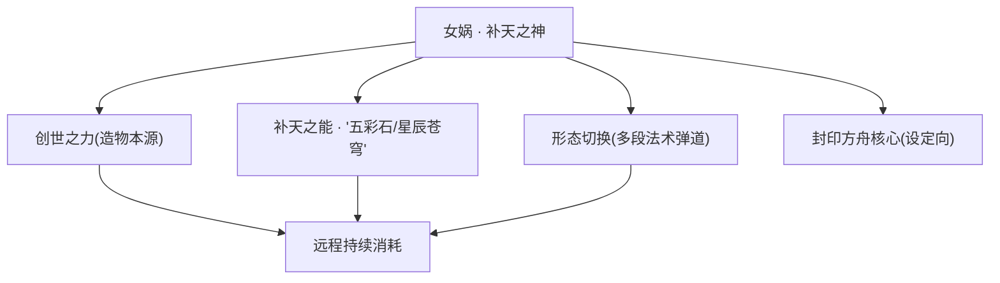

(说明：以上为基于背景设定的力量来历描述，非游戏数值。)

### 重要事件 / 剧情参与

- **抟土造人 / 炼石补天**：作为创世神明之首，孕育人类、于天穹崩裂时炼石补天，奠定其「补天之神」称号。
- **众神分裂(女娲派 vs 帝俊派)**：神明体系分裂为两大阵营，成为后世一切冲突的源头，女娲为其中一派的核心。
- **魔种起义—镇压**：诸神过度采集能量污染劳力者生存空间，[孙悟空](#孙悟空)率魔种起义；[牛魔](#牛魔)因惧神明武器出卖众人致起义溃败，神明以元气炮轰营、擒拿悟空。女娲作为神明之首处于这场对立的核心。
- **封印方舟核心(考据推测)**：以自身之力封印承载创世与毁灭之能的方舟核心，呼应其补天与守护的母题。
- **差遣后羿毁日之塔**：奉/命[后羿](#后羿)毁去灼烧大地的「日之塔」，间接牵动后羿与[嫦娥](#嫦娥)的悲剧命运线(考据推测)。

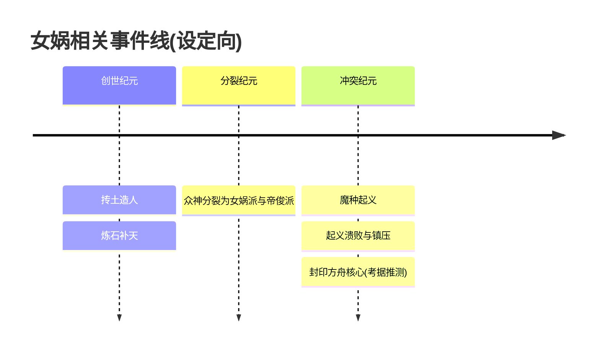

### 羁绊关系

| 对象 | 关系 | 说明 |
| --- | --- | --- |
| [帝俊](haojing-fengshen.md#帝俊) | 阵营对立 / 两派之首 | 神明体系分裂为女娲派与帝俊派，二者代表对待人类与方舟的两种根本路线，是后世一切冲突的源头。 |
| [孙悟空](#孙悟空) | 神 vs 起义领袖 | 悟空率魔种起义反抗诸神压迫，女娲作为神明之首处于被反抗一方；起义溃败后悟空被神明擒拿。 |
| [牛魔](#牛魔) | 起义—镇压牵涉者 | 牛魔因惧神明武器出卖起义众人，导致起义被神明元气炮镇压，间接关联女娲一方的神威。 |
| [后羿](#后羿) | 神 vs 半神 / 差遣 | 后羿背负射日宿命，奉命毁去日之塔，其行动与女娲一方的意志相关(考据推测)。 |
| [嫦娥](#嫦娥) | 间接牵连 | 后羿奉命处决魔道公主嫦娥、行刑前放走她，这条命运线与女娲所代表的神职秩序相牵连(考据推测)。 |
| [盘古](#盘古) | 同列创世巨神 | 同属上古创世神明序列，盘古开天辟地、劈开束缚人类的保护罩，与女娲补天造人共构创世母题(考据推测)。 |

### 经典台词

!!! quote "女娲 · 台词"
    "天裂之处，由我来补。"(考据推测)

    "我造了人，便要护着他们到底。"(考据推测)

    "封印，是为了让更危险的东西，永远沉睡。"(考据推测)

---

## 盘古

<span class="hok-tags"><span class="tag warrior">战士</span><span class="tag tank">坦克</span></span>

**开天 · 开天辟地、劈裂束缚后化为山脉的巨神之斧**

| 档案项 | 内容 |
| --- | --- |
| 称号 | 开天 |
| 定位 | 战士（坦克型团控） |
| 所属 | [上古众神·神话](../factions/shanggu-shenhua.md) |
| 身份 | 上古创世巨神 / 持斧的开天者 / 化身为大地山脉的守护意志 |
| 别称 | 开天者、斧之巨神（考据推测） |
| 关系 | [女娲](#女娲)、[后羿](#后羿)、[孙悟空](#孙悟空)、[牛魔](#牛魔)、[帝俊](haojing-fengshen.md#帝俊) |
| 登场作品 | 《王者荣耀》上古神话主线设定、创世/众神主题相关背景叙事 |

### 背景故事

在一切纪元之前，世界尚未分出天地。所谓"起源之地"，在创世神话的外壳之下，其实是一座承载着超智慧生命体的庞大方舟——神明们以近乎科技与神力交织的方式维系着秩序，而被他们称作"劳力者"的人类，则蜷缩在一层由神明设下的**保护罩**之内，被圈养、被庇护，也被禁锢。罩外是混沌与未知，罩内是被规定好的、不会逾越半步的"安稳"。人类世代望着头顶那层透明的边界，却从不知道边界之外究竟是什么。

盘古，便是为了打破这层边界而存在的巨神。

关于盘古的来历，神话与方舟的双重叙事在他身上交叠：一面，他是开天辟地的创世巨人，是混沌初分时第一个站起来的力量；另一面，在起源之地的设定里，他更像是一柄被铸造、被赋予了"劈开束缚"这一唯一使命的存在。他身形高大如山岳横亘，行走时大地随之震颤，呼吸之间云气翻涌。他不善言辞，甚至几乎不言，因为他的全部意志只凝聚成一个动作——**举斧，落下**。

传说中，盘古挥动巨斧，劈向那层笼罩人类头顶的保护罩。这一斧，是混沌与秩序的分界，是禁锢与自由的分界。罩裂开的刹那，光第一次毫无遮拦地照进人类的世界，天与地在那道裂口中被真正地分开——清者上浮为天，浊者下沉为地。开天辟地，并非凭空创世，而是**亲手砸碎了庇护，让被庇护者第一次有了选择的可能**。这正是盘古这一形象在《王者荣耀》语境里最动人的改写：他给予人类的，不是一个被造好的世界，而是一个**不再被关起来**的世界。(考据推测：游戏将"盘古开天"母题与"打破神明保护罩"的方舟设定融合，具体行文以官方背景为准。)

代价是巨大的。劈开束缚的那一斧耗尽了盘古作为巨神的全部。神话母题里，盘古死后身躯化为天地万物——他的躯体倒下，化作绵延的**山脉**，骨骼成为岩层，血脉成为江河，气息成为风云。在起源之地的叙事里，这意味着开天者并未在功成之后继续主宰世界，而是把自己整个地**沉入了大地**，成为了这片新生天地的骨架与脊梁。从此他不再是一个会走动、会说话的神，而是一种**沉睡在山岳之中的守护意志**：只要大地还在，盘古就还在；只要有人仰望群山，便是在仰望那位为他们劈开囚笼、又把自己献作根基的巨神。

他的故事因此成为后世一切冲突的"地基"。上古众神分裂为女娲派与帝俊派，魔种起义、诸神镇压、纪元更替，所有的恩怨都在盘古亲手劈开的这片天地之上展开。当孙悟空率魔种揭竿而起、当人类世代为自由与尊严抗争时，他们脚下踩着的、头顶望见的，正是那位最初便选择"打破保护罩"的开天巨神留下的身躯。盘古不参与后来的纷争，但每一场反抗压迫、追求自由的斗争，都遥遥呼应着他落下的第一斧。

### 性格与形象

盘古的性格几乎可以用"沉默"二字概括，但这沉默并非冷漠，而是一种已经把全部意志压缩成行动的极致专注。他不解释、不犹豫、不争辩——该劈开的束缚，他便劈开；该承担的重量，他便用整副身躯去承担。这是一种近乎本能的、不可动摇的坚定，是创世者特有的、不需要被理解也会去做的担当。

外形上，盘古被塑造为**山岳般的巨神**：身躯魁伟厚重，皮肤如皴裂的岩石与古老的大地，身上常带有山脊、石纹、苔痕般的纹理，仿佛他本身就是一座会动的山。他手持一柄与身形相称的**开天巨斧**，斧刃沉重而古拙，象征着"分开"与"开辟"。环绕他的意象始终离不开**大地、山脉、混沌初分的光、被劈开的裂隙**。

他的象征是双重的：既是**毁灭性的力量**（劈裂、震碎、开辟），又是**奠基性的庇护**（化为山脉，成为天地的脊梁）。这种"以破坏成全守护、以献身换取自由"的矛盾统一，正是盘古形象的内核。

### 战斗风格与能力（设定向）

盘古的力量直接源自他"开天辟地"的本源神话——他的一切招式，都是那"举斧落下"这一创世动作的延展与回响。

- **开天巨斧**：盘古最核心的武器，一柄足以劈开保护罩、分开天与地的巨斧。它的每一次挥落都不是单纯的劈砍，而是"分割空间"的动作——在设定意义上，斧锋所至，束缚被斩断、地脉被震开。
- **化山为力 / 大地之躯**：因盘古死后身化山脉，他的躯体本身便与大地相连。这使他拥有近乎山岳般的厚重与坚韧（坦克型战士的设定来源），可以将大地的重量与稳固转化为自身的护持与压制。
- **大范围团控**：作为"开天者"，盘古的招式偏向**横扫一片、震慑全场**的大开大合，以巨斧搅动战场、以震荡控制群敌——这与其"一斧分天地"的母题一脉相承，强调范围与威压而非精巧。

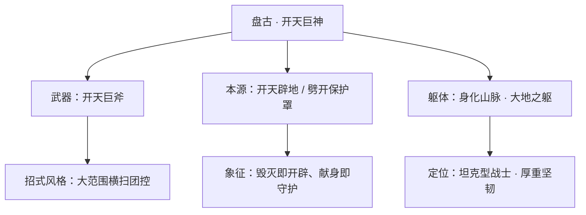

（以上为基于背景设定的力量来历描述，非游戏内具体技能数值；具体技能机制以游戏版本为准。）

### 重要事件 / 剧情参与

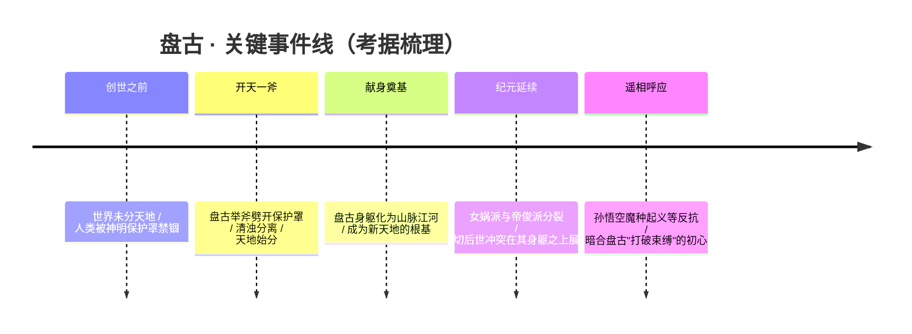

- **开天辟地（劈裂保护罩）**：盘古最核心的剧情贡献——以一斧劈开束缚人类的神明保护罩，分开天地，赋予被庇护者自由。
- **身化山脉**：开天之后耗尽自身，躯体化为山川大地，成为整个世界观地理与秩序的"地基"。
- **作为世界观源头出现**：盘古并不直接卷入后续的起义与镇压（见 [上古众神·神话 阵营页](../factions/shanggu-shenhua.md)「起义—镇压」一节所述冲突），但其开天之举是这一切叙事得以发生的前提，常作为"上古众神·神话"纪元的起点被提及。

### 羁绊关系

| 对象 | 关系 | 说明 |
| --- | --- | --- |
| [女娲](#女娲) | 同源创世神明 | 同属上古众神·神话体系的核心创世者。盘古开天分出天地，女娲补天、封印方舟核心——一"开"一"补"，共同构成创世神话的两端。(考据推测：二者多为母题层面的并列，未必有直接同框剧情。) |
| [后羿](#后羿) | 同阵营·半神后辈 | 后羿背负射日宿命、奉女娲命行事，与盘古同处神话纪元；盘古所开之天地，正是后羿射日、毁日之塔等故事展开的舞台。 |
| [孙悟空](#孙悟空) | 精神遥相呼应 | 盘古劈开保护罩追求自由，孙悟空率魔种起义反抗诸神压迫——前者是"打破束缚"的开端，后者是这一精神在后世的延续与爆发。 |
| [牛魔](#牛魔) | 同阵营·后世纷争方 | 牛魔身处魔种起义—诸神镇压的漩涡之中，其所争夺的"生存空间"，本就是盘古当年为众生劈开的那片天地。 |
| [帝俊](haojing-fengshen.md#帝俊) | 后世纪元的对立源头 | 上古众神分裂为女娲派与帝俊派，帝俊一方主导了对劳力者的圈养与对起义的镇压；这与盘古"打破保护罩、给予自由"的初心形成深刻反差。 |

### 经典台词

!!! quote "盘古经典台词（考据推测）"
    "天地未分，我便先行一斧。"

!!! quote
    "束缚既成，自有人将它劈开。"（考据推测）

!!! quote
    "我倒下，便化作你们脚下的山。"（考据推测）

（以上台词为依据盘古"开天辟地、身化山脉"母题所作的考据性表述，非逐字引用游戏内语音；准确台词以官方为准。）

---

## 后羿

<span class="hok-tags"><span class="tag marksman">射手</span></span>

**半神之弓 · 背负射日宿命、临刑放走嫦娥的悲情神射手**

| 档案项 | 内容 |
| --- | --- |
| 称号 | 半神之弓 |
| 定位 | 射手 |
| 所属 | [上古众神·神话](../factions/shanggu-shenhua.md) |
| 身份 | 半神血脉的弓手、奉女娲之命执行「射日」任务的神职者 |
| 别称 | 半神之弓、射日者 |
| 关系 | [嫦娥](#嫦娥)（行刑对象 / 皮肤CP）、[女娲](#女娲)（下令者 / 主君）、[艾琳](#艾琳)（同阵营射手） |
| 登场作品 | 《王者荣耀》英雄背景设定及相关情人节皮肤剧情 |

### 背景故事

后羿是「起源之地」诸神纪元中一个矛盾而孤独的存在。在这一设定下，上古众神（即超智慧生命体「神明」）以创世神话与科幻方舟的双重外壳君临世界，女娲为创世神明之首，掌握封印方舟核心的权柄；整个体系日后将分裂为女娲派与帝俊派两大阵营，成为后世一切冲突的源头。后羿便诞生于这样一个秩序与暴力并存的时代——他拥有半神的血脉，却又不完全属于神。「半神」二字，注定他既无法像众神那样高高在上地俯视生灵，也无法像凡人那般无知无觉地活着；他始终站在神与人之间的裂缝里。（考据推测：游戏并未把后羿设为「人间凡人」，而是强调其半神身份与神职背景，故其传统射日神话被改写为「奉神命毁塔」的执行任务。）

后羿被赋予的，是一项足以载入纪元史册、却也足以将他自己焚尽的宿命——「射日」。在传世神话里，后羿射落的是九个炙烤大地的金乌太阳；而在《王者荣耀》的改写中，这一意象被具象为一座象征灾厄与失控之力的「日之塔」（考据推测：基于其「射日」职责与「半神之弓」称号的合理还原，具体塔名以官方设定为准）。女娲下令，后羿执弓，半神之弓被赋予了毁灭的使命：以箭矢摧毁那道灼烧世界的光源，平息纪元的躁动。后羿没有拒绝的余地——这是神明体系交付给他的责任，也是他存在的全部意义。他将弓拉满，箭离弦，光与塔在天际崩裂，世界因他而免于焚毁。

然而真正定义后羿的，不是他射出的那一箭，而是他没有射出的那一箭。在执行任务的链条上，还牵连着另一个名字——嫦娥，那位守护月亮、被神明体系判定为「魔道」的寒月公主。后羿奉命处决她，作为神职者，他本应像对待日之塔那样，冷峻地完成对这位魔道公主的清算。但在行刑的那一刻，半神血脉里属于「人」的那一半压过了属于「神」的那一半。他放下了弓，松开了缚住她的命运，放走了嫦娥。濒死的嫦娥随月光沉入海中，而后羿则独自承担了违抗神命的全部后果。这一放手，让他从一个执行宿命的工具，变成了一个有血有肉、敢于背叛体系的悲剧者。

自此，后羿的故事被笼罩在一层挥之不去的怅惘里。他射落了该射落的，却放走了不该放走的；他完成了神明交付的「大义」，却背弃了神明定下的「律法」。在女娲派与帝俊派即将分裂、众神纷争一触即发的纪元背景下，后羿这样一个夹在命令与良知之间的半神，恰是那个时代裂痕的缩影——当神的秩序要求他扣下扳机，人的心却让他偏离了准星。（考据推测：后羿与嫦娥的主线多被处理为「前世羁绊／梦中邂逅」，而非在世相守，二人剧情存在时间错位。）

### 性格与形象

后羿性格冷峻、沉默而克制，是典型的「神射手」气质——话不多，眼神却始终锁定目标。作为半神，他背负着远超常人的责任感与宿命感，习惯于独自承担、独自承受，鲜少向外人吐露内心的挣扎。但在这层近乎冷漠的外壳之下，他保有一份未被神性磨灭的恻隐之心：正是这份「人性」，让他在最关键的时刻违抗了神命，放走了本该被处决的嫦娥。他是坚定的执行者，也是温柔的背叛者。

外形上，后羿以经典的「弓手」形象示人：身姿挺拔、目光锐利，手持那把象征其身份的半神之弓。他的核心象征意象有三——**弓**（宿命与责任的具象，既是武器也是枷锁）、**日**（他射落的目标，灾厄之光的化身）、**月**（他放走的嫦娥，悔恨与温柔的寄托）。日与月、射落与放走，构成了后羿这一角色最核心的张力与诗意。

### 战斗风格与能力（设定向）

后羿的力量根植于他的**半神血脉**与那把**半神之弓**。作为「半神之弓」，他无需依赖凡间的器械，弓本身便是神性与意志的延伸——拉弓即调动神力，箭矢所至，光焰崩裂。在「射日」一役中，他正是凭此弓将象征灾厄的光源（日之塔）一箭洞穿，足见其箭术之精准与力量之恐怖。

在战场上，后羿被定位为远程**射手**，作战风格冷静而致命：以稳定的远程箭矢持续输出，强调站位与节奏的把控，是后排稳定的火力核心。他的能力来历皆可追溯至背景设定——「灼日之矢」般的强力一击源自他射落日之塔的神话，密集的箭雨则呼应「半神之弓」连绵不绝的神力倾泻（以下招式名称与归纳为基于背景的设定向描述，非游戏数值）。

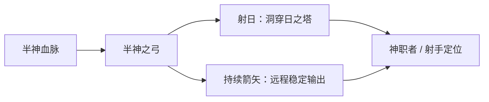

### 重要事件 / 剧情参与

- **奉命射日 / 毁日之塔**：后羿生涯中最重大的使命，奉女娲之命摧毁象征灾厄的光源，凭半神之弓一箭洞穿，平息纪元躁动。
- **临刑放走嫦娥**：作为神职者奉命处决魔道公主嫦娥，却在行刑前违抗神命、放她离去；濒死的嫦娥随月光沉海，成为二人羁绊的起点与终点。
- **情人节皮肤剧情**：后羿与嫦娥的羁绊在历年情人节系列皮肤中被浪漫化呈现，但主线多为前世羁绊或梦中邂逅，并非在世相守。

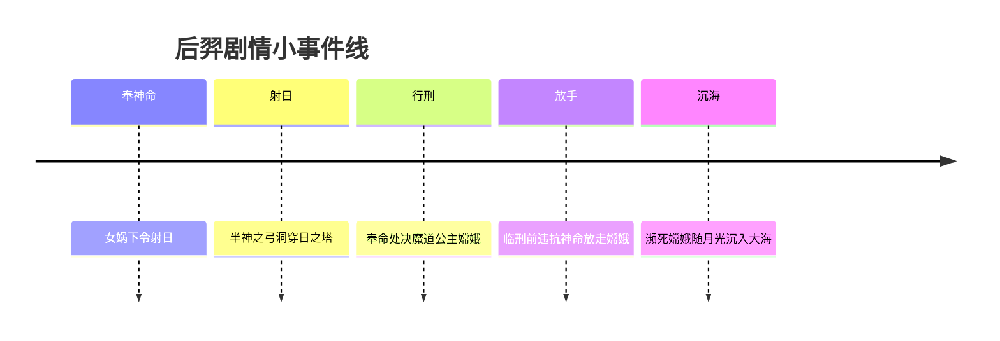

### 羁绊关系

| 对象 | 关系 | 说明 |
| --- | --- | --- |
| [嫦娥](#嫦娥) | 行刑对象 / 皮肤CP（剧情时间错位） | 后羿奉命处决魔道公主嫦娥，行刑前放走她，濒死嫦娥随月光沉海。情人节皮肤将二人关系浪漫化，但主线多为前世羁绊／梦中邂逅，并非在世相守。 |
| [女娲](#女娲) | 下令者 / 主君 | 创世神明之首、封印方舟核心者；后羿奉其命执行射日与处决嫦娥的任务，是其神职体系下的执行者。 |
| [艾琳](#艾琳) | 同阵营射手 | 同属上古众神·神话阵营的远程射手，分别以「半神之弓」与「圣灵之弓」为名，箭手意象互为映照（无直接剧情线）。 |

### 经典台词

!!! quote "后羿台词"
    「弓在手，箭在弦——目标，从不偏移。」（考据推测）

    「我射落了太阳，却放走了月亮。」（考据推测）

    「神命如山，可我的手……为你松开了。」（考据推测）

### 皮肤故事亮点

后羿与嫦娥的羁绊是其皮肤叙事的核心母题。历年情人节系列皮肤将「神职者后羿放走魔道公主嫦娥」的悲剧底色浪漫化，描绘二人跨越神与魔、命令与情感的相守想象。需要留意的是：这类皮肤多属「皮肤钦定CP」的浪漫演绎，而主线剧情中后羿与嫦娥存在时间错位，更多体现为前世羁绊或梦中邂逅，而非现世并肩——这也使得后羿「射落太阳、放走月亮」的形象，多了一层求而不得的怅惘。

---

## 嫦娥

<span class="hok-tags"><span class="tag mage">法师</span></span>

**寒月公主 · 守护月亮、被后羿放走沉海的魔道公主，以法力护盾流转生死的清冷法师。**

| 项目 | 内容 |
| --- | --- |
| 称号 | 寒月公主 |
| 定位 | 法师 |
| 所属 | [上古众神·神话](../factions/shanggu-shenhua.md) |
| 身份 | 月之守护者 / 魔道公主（被神职序列定性）/ 沉海后随月而眠者（考据推测） |
| 别称 | 寒月、月之公主、清冷月神（考据推测） |
| 关系 | [后羿](#后羿)（行刑者／放走她的神职者，皮肤CP）、[露娜](changan.md#露娜)（同主"月"意象，常被并称的另一位月之存在，考据推测） |
| 登场作品 | 王者荣耀（英雄本传与情人节系列皮肤剧情） |

### 背景故事

嫦娥的故事，是上古众神纪元里一段被刻意压低声音的悲剧。在起源之地——那片孕育了神明（超智慧生命体）与上古众神体系的土地上，光与火被高高供奉，「日」是权力、是秩序、是神职序列所代言的正统；而与之相对的「月」，则被视为阴翳、退潮、属于夜与边缘的力量。嫦娥，正是这份被边缘化之力的化身：她守护月亮，承接月华，是月之一脉的公主。

也正因如此，在以日为尊的众神秩序眼中，掌月者天然带着"异端"的色彩。当神明体系开始清洗与"魔道"沾边的存在时，嫦娥被定性为**魔道公主**——并非她行了什么恶，而是她所代表的那一脉，本身就被判定为需要被肃清的对象。这是一种身份的原罪：她生而守月，便生而被怀疑。（关于嫦娥"魔道"身份的具体来由，主线着墨克制，此处依阵营设定与皮肤剧情综合推演，考据推测。）

奉命前来处决她的，是背负着射日宿命的半神之弓手——[后羿](#后羿)。在众神安排的剧本里，这是一场再清楚不过的执行：光去湮灭月，秩序去抹去异类。后羿是神职序列里最锋利的那一支箭，他本该拉满弓弦，了结这位寒月公主，让月之一脉彻底沉寂。

然而行刑的那一刻，箭没有射出。

无论是因为在她眼底看见了与"魔道"二字毫不相称的清冷与无辜，还是因为半神之弓自己也开始怀疑这道神谕的正义——后羿放走了她。这一放，背叛了神职，也注定了两人此生再难圆满。重伤濒死的嫦娥逃离刑场，没有归处可去，最终**随着月光沉入了海中**。她没有死在仇敌的箭下，而是溶进了海面那一道粼粼的、属于月的倒影里，从此与潮汐、与夜、与那轮她一生守护的月亮融为一体。（"随月光沉海"为阵营 relatedRelationships 所明确记载的结局意象。）

正因为这段沉海，嫦娥与后羿的羁绊在后世只能以错位的方式延续：他们之间并没有一段在世相守的爱情，更多是**前世的羁绊、梦中的邂逅、隔着生死与纪元的回望**。情人节系列皮肤把这段关系浪漫化为缠绵的爱侣，但回到主线，它本质上是一桩"行刑者放走了将死之人"的悲悯，是光对月迟到了一整个纪元的歉意。

### 性格与形象

嫦娥的气质是**清冷而内敛**的——像月本身：不灼人，不喧哗，却始终在夜里悬着一份遥远的温柔。她不是攻击性的存在，她的"力量"更接近守护、庇护与抚慰，这与她"守护月亮"的本职一脉相承。即便被冠以"魔道"之名，她身上也几乎看不到戾气，反而带着一种被误解者特有的、安静的疏离与哀伤。

形象上，她以月为核心意象：清辉、寒光、海面的倒影、潮起潮落的呼吸感，都是属于她的视觉语言。"寒月"二字点出她的双重底色——**寒**是她的孤独与被排斥，**月**是她的归属与温柔。沉海这一结局，又为她叠加了"水"与"夜"的意象，使她常被刻画为漂浮在月光与海面之间、半睡半醒、似在等待某个人的女子。

### 战斗风格与能力（设定向）

作为法师，嫦娥在战场上的核心特征是**法力即护盾**——她的力量并不直接撕裂敌人，而是把月华般绵长的法力转化为庇护与持续的消耗。她以充沛的法力为代价，为自己与同伴撑起一层又一层的**月之护盾**，越是法力盈满，护盾便越是厚重；攻击只是护盾消耗后的自然外溢，像月光洒落水面一样持续、均匀地灼烧周遭。

这种"以护盾立身、以法力涌泉"的战斗哲学，与她守护者的本质完全吻合：她活下来的方式不是杀死对手，而是熬过对手的攻势，用月之回响把伤害一波波荡开。她代表月、对应潮汐，因此她的能力也带有"涨落循环"的韵律——法力如潮水般退去又重新涌来，护盾随之消散又再度凝聚。

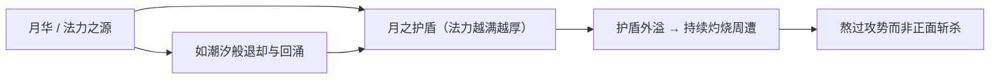

（以上为基于"法力护盾流核心法师"设定与月之意象的叙事化描述，不涉及具体游戏数值。）

### 重要事件 / 剧情参与

- **被定性为魔道公主**：在以日为尊的众神秩序中，守护月亮的嫦娥被划入"魔道"，成为神职序列清洗的对象（背景前提，考据推测其具体经过）。
- **后羿临刑放人**：神职者[后羿](#后羿)奉命处决她，却在行刑前放走了她——这是两人羁绊的起点，也是后羿背离神谕的转折。
- **随月光沉海**：重伤的嫦娥逃离后随月光沉入海中，与月、与潮汐融为一体，构成她最具标志性的结局意象（阵营 relatedRelationships 明确记载）。
- **情人节皮肤剧情**：在后世的情人节系列皮肤中，她与后羿的关系被浪漫化为爱侣，但主线定位仍是"前世羁绊／梦中邂逅"而非在世相守。

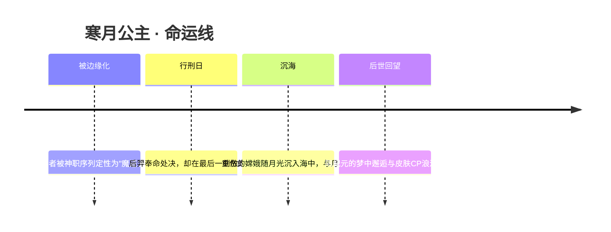

### 羁绊关系

| 对象 | 关系 | 说明 |
| --- | --- | --- |
| [后羿](#后羿) | 行刑者 / 放走她的人 / 皮肤CP（剧情时间错位） | 神职者后羿奉命处决魔道公主嫦娥，行刑前放走她，濒死嫦娥随月光沉海。情人节皮肤将之浪漫化，但主线多为前世羁绊／梦中邂逅，并非在世相守。 |
| [露娜](changan.md#露娜) | 同"月"意象的呼应（考据推测） | 二者皆以"月"为核心母题，常在玩家语境中被并提；但分属不同阵营与故事线，主线并无直接交集，此处仅作意象层面的关联。 |

### 经典台词

!!! quote "寒月公主 · 嫦娥"
    "月光所照之处，皆是我的归途。"（考据推测）

    "你放走的不是异端，是一轮不愿坠落的月亮。"（考据推测）

    "沉入海里也好——这样，每一夜的潮水都会替我望着你。"（考据推测）

### 皮肤故事亮点

- **情人节系列皮肤**：把嫦娥与[后羿](#后羿)从"行刑者与将死者"的悲剧，重写为一对跨越生死与纪元的恋人。需要留意的是，这份甜蜜属于皮肤的浪漫化叙事；回到本传，二人的关系内核仍是错位的、隔着月光与海面的遗憾——这也正是这对皮肤CP最打动人的地方：被允许在皮肤里相爱的，是那段在主线里从未能相守的缘分。（具体皮肤情节以官方剧情为准，部分细节为考据推测。）

---

## 雅典娜

<span class="hok-tags"><span class="tag warrior">战士</span><span class="tag mage">法师</span></span>

**智慧女神 · 以圣骑士之躯继承远古神明残魂、可全图复活突进的战神**

| 档案 | 内容 |
| --- | --- |
| 称号 | 智慧女神 |
| 定位 | 战士 / 法师 |
| 所属 | [上古众神·神话](../factions/shanggu-shenhua.md) |
| 身份 | 圣骑士团女骑士、远古神明「雅典娜」的人间继承者 |
| 别称 | 战神、智慧与战争女神(考据推测) |
| 关系 | [亚瑟](changan.md#亚瑟)(同属圣骑士团)、[女娲](#女娲)、[盘古](#盘古)(上古众神序列) |
| 登场作品 | 王者荣耀本传英雄(上古/起源之地神话线) |

### 背景故事

在《王者荣耀》的世界设定里,「神明」并非传统意义上虚无缥缈的存在,而是诞生于**起源之地**的超智慧生命体。上古众神以方舟与神话为双重外壳,书写了这片大陆最初的秩序与最初的裂痕——这一切的源头,也正是后世一切纷争的开端。在女娲派与帝俊派两大阵营对峙、众神序列森然排布的宏大背景之下,雅典娜并非一开始就站在神的位置上,她的故事,是一个**凡人攀向神格**的故事。

雅典娜最初的身份,是一名**圣骑士团的女骑士**。她出身于以荣誉、信念与守护为信条的骑士团体系——这套体系与中枢长安的[圣骑士之王 亚瑟](changan.md#亚瑟)所代表的骑士精神同源(考据推测),崇尚以剑与盾守卫弱者、以纪律约束自身。年轻的她并非天赋异禀的天选之人,而是凭着远超常人的坚毅与对「正义」近乎执拗的信仰,一步步在荆棘之路上磨砺出自己的锋芒。她相信:真正的强大不来自神赐的血脉,而来自一次次跌倒后仍愿意再次握紧剑柄的意志。

命运的转折,发生在一处被时间湮没的**远古遗迹**之中。那里沉睡着上古时代一位强大神明的残魂——**「雅典娜」**,一位象征智慧与战争的远古神祇。残魂并非温和的引路者,而是一道严苛到近乎残酷的考验:唯有能在精神与力量的双重较量中真正**击败**它的人,才配得上承接它的名号与传承。无数自诩为英雄者倒在了这道试炼之前,而这位年轻的女骑士,凭借凡人之躯与不肯熄灭的信念,在与神明残魂的殊死搏斗中坚持到了最后,**亲手战胜了「雅典娜」的残魂**,从而赢得了它的认可。

自那一刻起,女骑士与远古神明合而为一。她**继承了「雅典娜」之名**,也继承了那份属于智慧与战争的神力:不再只是凡间的骑士,而成为可以在战场上**全图复活、瞬息突进**的战神。然而值得玩味的是,她的神格并非天降的恩赐,而是「打赢了才拿到」的战利品——这让她与那些生而为神、俯瞰众生的上古正神截然不同。她始终记得自己曾是凡人,记得信念比血统更重的那条真理,因此即便位列神明,她的目光依旧朝向那些需要被守护的人。

在起源之地神明体系的纪元背景里,雅典娜的存在像是一座桥:一端连着[女娲](#女娲)、[盘古](#盘古)所代表的上古神话与创世秩序,另一端连着凡人世界对「英雄」最朴素的想象——任何人,只要意志足够坚定,都有可能在试炼中触及神的高度。她以「智慧女神」为号,所昭示的也正是这一点:真正的智慧,不在于拥有神力,而在于明白该如何使用它。

### 性格与形象

雅典娜性格中最鲜明的底色是**坚定与克制**。作为骑士出身的神明,她既有战士的果决勇毅,又兼具继承自远古智慧女神的冷静与思辨——上阵时她是一往无前、永不退缩的战神;退下来时她又是审时度势、谋定后动的智者。她不轻易动怒,却一旦决意便绝不回头;她敬畏神力,却从不被神力所役使。

外形上,她融合了**圣骑士的甲胄**与**神明的威仪**:庄严的铠甲象征着她未曾遗忘的骑士本源,而手中那柄寄宿着神力的长剑(或圣剑)则是神格的具象——剑光所至,既是审判,也是守护(考据推测)。她的整体象征意象围绕「**智慧 × 战争**」展开:既是执剑陷阵的战神,又是运筹于心的女神,刚与柔、力与智在她身上达成了罕见的平衡。这种双重性也对应了她「战士/法师」的双定位——既能近身鏖战,亦能调动神力。

### 战斗风格与能力(设定向)

雅典娜的战斗风格脱胎于她「以凡躯继神格」的来历,核心是**突进、爆发与不灭的复生**,在设定层面可理解为:

- **圣剑神力**:她手中长剑寄宿着远古神明「雅典娜」的力量,挥砍时附带神能灼烧之效,既能进行近身的战士式劈砍,也能将神力外放为法术伤害——这正是其「战士/法师」混合定位的设定来源。
- **战神突进**:继承神格后,她获得了远超凡人的机动力,能够跨越战场、直插敌阵,如同战争女神亲临前线,所到之处势不可挡。
- **全图复生**:这是雅典娜最具标志性的设定能力——作为「打不死的战神」,她可以在阵亡后于全图范围内**重新降临战场**,以神明之姿一次次回到守护与征战的位置。这一能力呼应了她「在试炼中战胜死亡般的考验、夺取神格」的出身。

> 说明:以上为基于英雄背景与公开设定的叙事性描述,不涉及具体游戏数值。

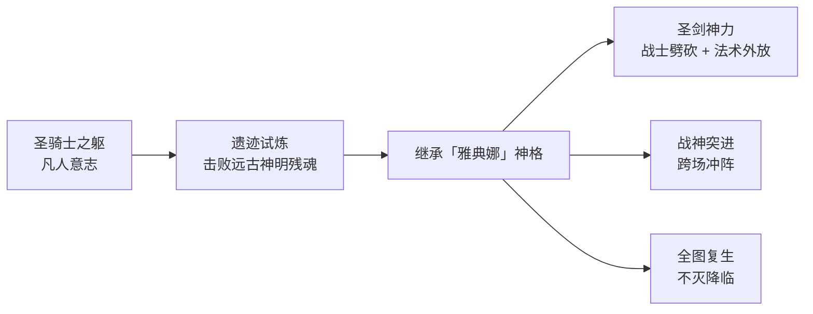

### 重要事件 / 剧情参与

- **遗迹试炼**:深入远古遗迹,与神明「雅典娜」的残魂展开精神与力量的双重较量,最终战胜并获得其认可,完成由凡入神的蜕变。这是其个人主线最核心的事件。
- **神格继承**:正式承接「智慧女神」之名,跻身起源之地上古众神的叙事框架,成为连接凡人英雄与上古神明的特殊存在。
- **圣骑士本源**:其骑士团出身将她与中枢长安的[圣骑士之王 亚瑟](changan.md#亚瑟)所象征的骑士精神相勾连(考据推测),为跨纪元、跨阵营的骑士母题留下呼应。

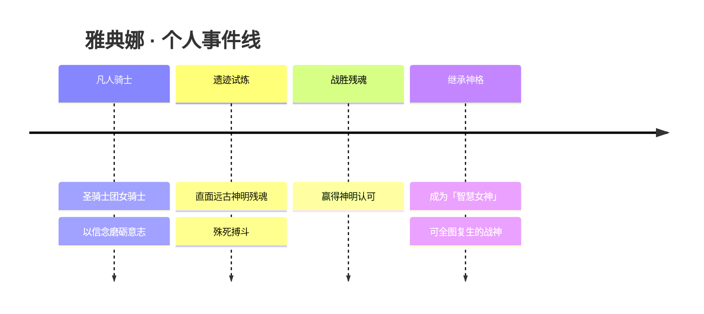

### 羁绊关系

| 对象 | 关系 | 说明 |
| --- | --- | --- |
| [亚瑟](changan.md#亚瑟) | 同源骑士精神 | 同属「圣骑士」母题:亚瑟为圣骑士之王、雅典娜为圣骑士团女骑士,二者共享守护与荣誉的信条(考据推测,跨阵营呼应)。 |
| [女娲](#女娲) | 同序列上古神明 | 同处起源之地神明体系;女娲为创世神明之首、封印方舟核心者,雅典娜则以继承者身份位列众神序列。 |
| [盘古](#盘古) | 同序列上古神明 | 同属上古众神;盘古开天辟地化为山脉,与雅典娜共同构成神话纪元的神格图景。 |
| 远古神明「雅典娜」(残魂) | 试炼者 / 被继承者 | 既是阻挡她的最终考验,也是她神力与名号的来源——「战胜后继承」是这段关系的本质。 |

### 经典台词

!!! quote "雅典娜 · 语音(考据推测)"
    「智慧,是比神力更锋利的剑。」(考据推测)

    「我曾是凡人,所以我懂得——该守护什么。」(考据推测)

    「站起来,再来一次。这就是骑士的回答。」(考据推测)

    「以这柄剑的名义,审判与守护,都由我承担。」(考据推测)

---

## 孙悟空

<span class="hok-tags"><span class="tag assassin">刺客</span><span class="tag warrior">战士</span></span>

**齐天大圣 · 永远冲在最前方的魔种起义领袖，金箍棒一扫便有分身万千。**

| 档案项 | 内容 |
| --- | --- |
| 称号 | 齐天大圣 |
| 定位 | 刺客 / 战士 |
| 所属 | [上古众神·神话](../factions/shanggu-shenhua.md) |
| 身份 | 魔种（劳力者）起义军领袖、被镇压千年的反抗者、西行取经的护法 |
| 别称 | 美猴王、大圣、行者、斗战胜佛（西行果位，考据推测） |
| 关系 | [牛魔](#牛魔)、[猪八戒](#猪八戒)、[女娲](#女娲)、[帝俊](haojing-fengshen.md#帝俊)、[露娜](changan.md#露娜)、[六耳](yuanchu-shenhua-misc.md#六耳) |
| 登场作品 | 王者荣耀本传；《大话西游》主题情侣皮肤系列、各类大圣主题动画短片 |

### 背景故事

在起源之地的纪元里，「神明」并非高悬云端的虚影，而是掌握着创世级科技与能量的超智慧生命体。诸神为维系自身的存续与方舟体系的运转，需要源源不断地从大地深处采集元气与能量；而承担最底层采集劳役的，正是被他们称作「魔种」的劳力者——这是一群被造、被驱使、被定义为「工具」的生命。孙悟空，便诞生于这群最不该拥有名字、却偏偏最渴望名字的劳力者之中。

诸神的采集愈发贪婪，元气被抽走的土地崩裂、坍缩，劳力者赖以生存的空间被一点点吞噬。当生存本身都成为奢望时，反抗的火种在魔种当中悄然点燃。孙悟空并非天生的领袖，他只是比任何人都更早地、更彻底地不愿再低头——他从石中崛起（考据推测，沿用「石猴出世」母题），以一根可大可小、可长可短的金箍棒为旗，把零散的怒火拧成了一支起义军。他喊出的不是哲学，而是最朴素的一句话：凭什么神明可以决定我们的生死。

起义军一度势如破竹，魔种们第一次尝到了「为自己而战」的滋味。然而，神明真正的力量从未在前线展露——他们手中握有可以瞬间夷平整片营地的元气炮等创世武器。决定性的转折来自内部：身为精英酋长的[牛魔](#牛魔)，因目睹并畏惧神明武器的恐怖，在最关键的时刻出卖了同袍，导致起义军防线骤然崩溃。神明的元气炮轰碎了起义营地，无数魔种在那一炮中化为灰烬，孙悟空也在混战中力竭被擒。

被擒之后的孙悟空，迎来的是漫长得近乎永恒的镇压——他被封印、被镇压了千年（考据推测，对应「五行山下五百年」母题的世界观改写）。千年的禁锢没有磨平他的棱角，反而把那股「不服」淬炼成了某种近乎信仰的东西。当封印终于松动，他踏上了西行之路：表面上是护送取经、是赎罪、是修行，骨子里却仍是那个不肯向命运低头的反抗者。他用脚步丈量这片被神明割裂的世界，也在一路降妖伏魔中，重新追问着「神」与「人（魔种）」之间那道究竟由谁划下的界线。

值得一提的是，孙悟空的存在本身，是连接「上古神话纪元」与后世诸多冲突的关键索引。诸神过度采集所引发的起义—镇压，被视为后世一切阵营对立的源头之一；而他个人横跨千年的命运，也让他成为少数能亲历多个纪元、亲眼见证神明体系由盛转裂的「活化石」式英雄。

### 性格与形象

孙悟空的性格可以用四个字概括：**桀骜、赤诚**。他骄傲到近乎狂妄，认定自己可与天比高，故称「齐天」；但这份骄傲并非空中楼阁，而是从最底层的尘土里挣出来的尊严。他重情义、护同袍，对兄弟掏心掏肺，却也因此对牛魔的背叛格外刻骨——爱之愈深，痛之愈烈。他冲动、好战、永远第一个跳进最危险的地方，正如其定位所言「永远冲在最前方」。

在形象上，他是经典的火眼金睛的猴王意象：身披兽皮战裙、肩头与臂膀缠绕着粗犷的护甲，一根金箍棒既是兵器也是图腾。他的象征意象始终围绕着「自由」与「反叛」——筋斗云象征不受束缚的来去，分身术象征「我以一人之身对抗整个体系」的孤勇，而金箍则是套在他头上的、神明权威的隐喻：哪怕本领通天，头上那道箍始终提醒着他曾被谁所制。

### 战斗风格与能力(设定向)

孙悟空的力量根植于他「魔种之中的异数」这一出身设定——他拥有远超寻常劳力者的强韧体魄、爆发力与战斗直觉，是天生为冲锋而生的战士，又兼具刺客的致命突袭节奏。

- **金箍棒**：他的本命兵器，可大可小、可长可短，既能化作横扫一片的巨棒进行范围打击，也能凝成一点完成穿刺式的致命爆发。一棒之下，往往便是开团与收割。
- **分身术**：他可分裂出自身的幻影分身，以「一化多」的姿态扰乱、撕裂敌阵。这既是战术手段，更是其精神写照——一个人，活成了一支军队。
- **筋斗云 / 极速突进**：来去如风的位移能力，让他能瞬间贴近后排、绕后切入，符合「永远冲在最前方」的战斗哲学。
- **火眼金睛**：能洞穿伪装与虚妄（呼应「辨真假」母题），在设定上对应其敏锐的锁敌与识破能力。

需要说明的是，以上为**基于背景设定的力量来历描述**，并非游戏内具体数值与技能机制。

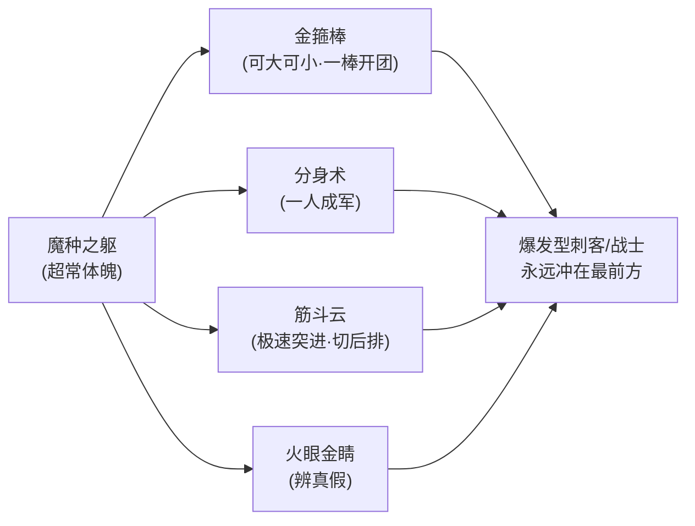

### 重要事件 / 剧情参与

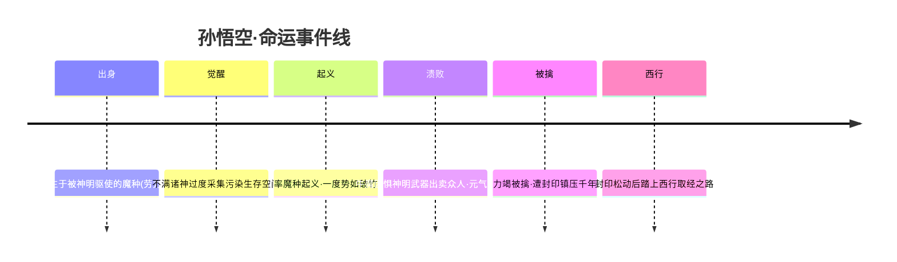

- **魔种起义**：作为起义领袖，率领劳力者向神明体系发起正面反抗，是「起义—镇压」这一阵营级对立事件的核心人物。
- **倒悬天之变**：起义溃败、自己被擒后，兄弟[猪八戒](#猪八戒)曾独闯倒悬天寻找他与失散的同袍，留下一段「寻友」插曲。
- **千年镇压与西行**：被镇压千年后踏上西行，从反抗者转向护法与修行者，是其角色弧光的重要转折。
- **大圣主题动画与情侣皮肤剧情**：《大话西游》主题的至尊宝×紫霞故事，是其在皮肤叙事中最具代表性的支线（详见羁绊关系与皮肤故事亮点）。

### 羁绊关系

| 对象 | 关系 | 说明 |
| --- | --- | --- |
| [牛魔](#牛魔) | 起义同袍 → 背叛者 | 同为起义骨干；牛魔因畏惧神明武器在关键时刻出卖众人，致起义溃败、悟空被擒，二人由生死兄弟转为刻骨恩怨。 |
| [猪八戒](#猪八戒) | 起义同袍 / 生死之交 | 同属魔种起义军；悟空被擒后，八戒独闯倒悬天寻友，情义深重。 |
| [女娲](#女娲) | 阵营级对立（神明 vs 魔种） | 作为神明体系与封印方舟核心者一方，处于镇压起义的对立立场，是悟空反抗的「神」之象征之一。 |
| [帝俊](haojing-fengshen.md#帝俊) | 阵营级对立（神明 vs 魔种） | 神明派系代表之一，与诸神过度采集、镇压起义的格局直接关联。 |
| [露娜](changan.md#露娜) | 皮肤钦定CP（主线未相遇） | 灵感取自《大话西游》（至尊宝×紫霞），有两套情侣皮肤；但主线中悟空起义失败被镇压千年、又西行取经，露娜一路寻兄，二人从未相遇、无直接感情线。 |
| [六耳](yuanchu-shenhua-misc.md#六耳) | 真假之辨（母题关联，考据推测） | 「真假美猴王」母题中与悟空难辨真伪的存在；其称号「真假之间」呼应这一辨真假的经典命题。 |

### 经典台词

!!! quote "齐天大圣的呐喊"
    「俺老孙来也！」（考据推测，沿用经典登场口号）

    「皇帝轮流做，凭什么这天，就该是他们的天？」（考据推测，呼应起义主题）

    「我头上的这道箍，迟早要亲手摘下来。」（考据推测，金箍=神明权威之隐喻）

    「冲在最前面的，永远是俺老孙。」（考据推测，呼应其定位设定）

### 皮肤故事亮点

孙悟空与[露娜](changan.md#露娜)的《大话西游》主题情侣皮肤（至尊宝 × 紫霞仙子），是其皮肤叙事中最广为人知的一段。皮肤把至尊宝戴上金箍、放下儿女情长、转身成为孙悟空的「成长—告别」母题浪漫化呈现，借「曾经有一份真挚的感情」式的遗憾笔触，塑造了大圣柔情与宿命交织的另一面。需要强调的是：这是**皮肤钦定的CP**而非剧情CP——在主线设定里，悟空被镇压千年、又踏上西行，露娜则始终在寻兄，二人从未真正相遇。这种「皮肤浪漫 / 主线错位」的对照，本身也成为玩家津津乐道的考据话题。

---

## 牛魔

<span class="hok-tags"><span class="tag tank">坦克</span><span class="tag support">辅助</span></span>

**精英酋长 · 力可顶天的守护者，也是亲手出卖同袍的「叛徒」**

牛魔，本名牛魔王，是上古起源之地的劳力者一族——「魔种」中的猛士。他能以血肉之躯硬顶一切冲击，本应是冲在最前的护盾；然而当神明的武器照临营地，恐惧令他做出了背叛众人的选择，从此「精英酋长」这一称号同时镌刻着他的勇武与他的愧疚。

| 档案项 | 内容 |
| --- | --- |
| 称号 | 精英酋长 |
| 定位 | 坦克 / 辅助 |
| 所属 | [上古众神·神话](../factions/shanggu-shenhua.md) |
| 身份 | 魔种一族酋长、起义军前排、（后期的）背叛者 |
| 别称 | 牛魔王 / 老牛 |
| 关系 | [孙悟空](#孙悟空)、[猪八戒](#猪八戒)、[女娲](#女娲)、[帝俊](haojing-fengshen.md#帝俊) |
| 登场作品 | 王者荣耀（魔种起义主线 / 相关动画与活动）（考据推测） |

### 背景故事

在世界的最初，「起源之地」并非神话里那座祥和的乐土，而是一座以创世神话为外壳、内里却是科幻方舟的造物之所。栖居其间的神明——本质是超智慧的生命体——掌握着汲取与重塑「元气」的力量，他们立于光辉的高处，将维系自身存续与造物运转所需的能量，从下层的世界源源不断地抽取上来。而承担这一切粗重劳作、被神明唤作「劳力者」「魔种」的族群，则世世代代生活在能量被榨取后的废土与阴影里。牛魔，正出自这一族。

魔种身躯魁伟、力大如山，是开山辟石、搬运重物的好手。牛魔在族中尤为出众，他的双臂能撼动巨岩，他的脊背能扛起同伴扛不动的重担，因而被推举为族中的酋长——「精英酋长」之名，最初是同袍对他力量与担当的敬称。在那段日子里，他是魔种的脊梁：哪里有塌方，他第一个冲进去顶住;哪里有压不住的活计，他第一个把肩膀递上去。族人信他、靠他，把后背交给他，因为他的身体，本就是一面活着的盾。

然而神明对能量的采集愈发贪婪。被反复抽取元气的土地日渐贫瘠，魔种赖以生存的空间被一点点污染、压缩，族人在劳役与匮乏中艰难求生。当忍耐抵达尽头，一位同样出身魔种、却拥有不屈意志与惊人战力的领袖站了出来——那便是后来名震三界的[孙悟空](#孙悟空)。悟空举起了反抗的旗帜，号召魔种向高高在上的神明讨还属于自己的生存权。牛魔，作为族中酋长与悟空并肩的猛将，自然也站在了起义军的最前排。那是他一生中最接近「英雄」二字的时刻：他用宽厚的身躯为冲锋的同伴挡下攻击，把伤痛留给自己，把生路让给身后的人。

可惜，凡躯与神明之间，横亘着无法逾越的力量天堑。当起义的火焰烧到神明眼前，他们动用了真正的武器——那是远超魔种想象的、足以抹平一切的造物之力。面对那从天而降、连大地都为之震颤的神明兵器，曾经无所畏惧的牛魔，第一次尝到了刻骨的恐惧。在那一刻，求生的本能压倒了酋长的荣誉与战友的情义：他选择了背叛，向神明出卖了起义军的部署与同袍。神明顺势以元气炮轰击营地，起义在一夜之间土崩瓦解，孙悟空被擒、被镇压千年，无数魔种血染废土。（考据推测：背叛的具体方式与细节在不同叙述中略有出入，此处依阵营设定「牛魔因惧神明武器出卖众人致起义溃败」整理。）

起义的覆灭，把「精英酋长」这个称号撕成了两半。它一面记着他曾经的勇武与守护，一面又烙上了他无法洗刷的背叛。从那以后，牛魔便活在这撕裂之中——他依旧拥有顶天立地的力量，依旧本能地想去护住身后的人，但每一次举盾，都像是在偿还那个他亲手酿成的、再也无法挽回的夜晚。

### 性格与形象

牛魔的性格里有两股相互拉扯的力量。其一是「守护者」的本能：他天生厚道、念旧、护短，把同伴的安危看得比自己更重，遇事第一反应是把自己挡在前头。其二，是那个在恐惧面前一度崩塌的「自己」——背叛留下的阴影，让他在勇猛之外多了一层旁人难以察觉的沉郁与自责。他不是天生的恶人，而是一个在绝境中失足、此后用余生去顶住愧疚的猛士。这种「以守护赎背叛」的矛盾，正是他最动人也最复杂的底色。

外形上，牛魔承袭了「牛魔王」最经典的意象：壮硕如山的体魄、隆起的肌肉、头顶一对象征蛮力与权威的犄角，举手投足都带着压迫感。他常以一面巨大的护盾或厚重的护甲为标志——盾，既是他的武器，也是他人格的隐喻：一面用来护人，一面用来护住那个不愿被人看见、满是裂痕的自己。古朴的部落纹饰、被风沙与战火磨砺过的甲胄，无声诉说着他酋长的身份与那段废土岁月。

### 战斗风格与能力（设定向）

牛魔的战斗哲学只有一个字：「顶」。他不以杀戮取胜，而以一具几乎无法被击垮的身躯，为身后的同伴争取生路。

- **以盾开团，顶飞强敌**：牛魔最具标志性的，是凭借蛮横的体魄发起冲撞、将挡路的敌人高高顶飞。这一招源自他魔种酋长的本能——在塌方与重压中练就的「以身破障」，被他用在了战场上，化作撕开敌阵、打乱阵型的开团手段。
- **护盾庇佑，守护后排**：他能将自身的守护之力分予队友，为脆弱的后排罩上护盾。这正是「精英酋长」最初的模样——把后背交给他的人，他便用整个身体去回应这份信任。也因此，他在阵营中被定位为兼具坦度与辅助能力的「坦辅」。
- **血肉之盾，硬抗神威**：牛魔最大的天赋，是他那能硬顶神明武器冲击的肉身。他可以替队友承受本应致命的打击，在敌火最猛烈处岿然不动，为反击赢得时间。

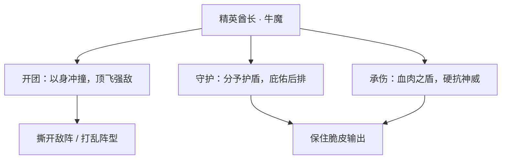

（说明：以上为基于背景设定的叙事化描述，不对应具体游戏数值。）

### 重要事件 / 剧情参与

- **魔种起义（前排猛将）**：作为魔种酋长，随[孙悟空](#孙悟空)举旗反抗神明的能量压迫，以肉身为同伴开路、挡伤，是起义军最坚实的前排之一。
- **背叛与溃败（转折点）**：因惧怕神明武器，出卖众人，致起义被[女娲](#女娲)所代表的神明阵营以元气炮轰营、一举镇压。这是他人生的转折，也是其角色弧光的核心。
- **起义余波**：起义失败后，悟空被镇压千年，[猪八戒](#猪八戒)独闯倒悬天寻友——牛魔的背叛，间接改写了昔日所有同袍的命运。

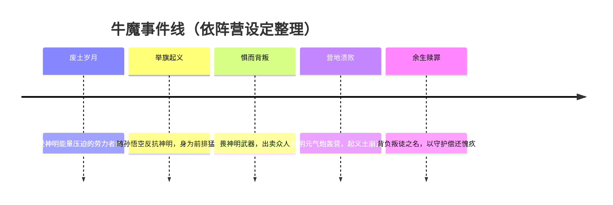

### 羁绊关系

| 对象 | 关系 | 说明 |
| --- | --- | --- |
| [孙悟空](#孙悟空) | 战友 → 被其背叛 | 起义领袖与并肩前排。牛魔的出卖直接导致悟空被擒、被镇压千年，二人关系由生死同袍裂为背叛与被背叛。 |
| [猪八戒](#猪八戒) | 同袍（起义军一员） | 同为魔种起义军成员。起义溃败后八戒独闯倒悬天寻友，牛魔的背叛是这场离散的根源之一。 |
| [女娲](#女娲) | 阵营级对立（神明） | 神明阵营的代表者。牛魔所恐惧的「神明武器」与轰营的元气炮，正属女娲所在的神明体系，是起义被镇压的力量来源。 |
| [帝俊](haojing-fengshen.md#帝俊) | 阵营级对立（神明） | 神明阵营核心成员之一，与女娲同列「起义—镇压」对立链。诸神过度采集能量、污染魔种生存空间，是起义爆发的远因。 |

（依据本阵营 relatedRelationships 中「起义—镇压（阵营级对立）」一组整理，成员含孙悟空、牛魔、猪八戒、帝俊、女娲。）

### 经典台词

!!! quote "牛魔语录"
    「让我来顶住！后面的人，交给你们了。」（考据推测）

    「我这身肉，挡得住一切——除了那一晚的悔。」（考据推测）

    「酋长……这两个字，我还配吗？」（考据推测）

    「这一次，我绝不再退后半步。」（考据推测）

---

## 猪八戒

<span class="hok-tags"><span class="tag tank">坦克</span></span>

**天蓬 · 永远在找朋友的回血型坦克——技能全程吸血，一身横肉扛在最前，独闯倒悬天只为把兄弟带回家。**

| 档案 | 内容 |
| --- | --- |
| 称号 | 天蓬 |
| 定位 | 坦克 |
| 所属 | [上古众神·神话](../factions/shanggu-shenhua.md) |
| 身份 | 魔种（劳力者）起义军一员、孙悟空与牛魔的同伴 |
| 别称 | 老猪、八戒；「天蓬」之名（考据推测，呼应《西游记》天蓬元帅的前身意象） |
| 关系 | [孙悟空](#孙悟空)（起义并肩的兄弟）、[牛魔](#牛魔)（同袍，却因其叛卖致起义溃败）、[女娲](#女娲) / [帝俊](haojing-fengshen.md#帝俊)（镇压起义的神明阵营） |
| 登场作品 | 《王者荣耀》上古众神·神话（起源之地）背景线；魔种起义剧情 |

### 背景故事

在一切冲突的源头——「起源之地」，居住着被后世称为「神明」的超智慧生命体。他们掌握着远超凡俗的力量，以采集天地能量维系自身文明的运转。然而过度的开采如同竭泽而渔，能量被一处处抽空，污染随之蔓延，最先被牺牲的，永远是那些为神明承担粗重劳作的「劳力者」——也就是被蔑称为「魔种」的存在。猪八戒，正是这群被压在文明底层、却最早察觉到生存空间正在崩塌的魔种之一。

他并非天生的反叛者。在那段被神明驱使的漫长岁月里，八戒更像一个本分而知足的劳力者：力气大、脾气好、能吃也能扛，把分内的活计做完，便守着自己那点简单的快乐过活。真正改变他的，是身边的人。当[孙悟空](#孙悟空)挺身而出、号召魔种们不再沉默地被消耗，八戒没有犹豫太久——比起宏大的理念，他更在乎的是身边这些一起吃苦、一起扛活的伙伴。于是他披甲提耙，站到了起义军的队列里。对八戒而言，起义的意义从来不是某个抽象的「自由」，而是具体的、有名有姓的「朋友」。

起义曾一度声势浩大，魔种们第一次让高高在上的神明感到了威胁。然而胜负的天平最终因背叛而倾斜。同为起义阵营的[牛魔](#牛魔)，在亲眼见识到神明所掌握的恐怖武器后心生畏惧，出卖了众人。神明阵营以毁灭性的元气炮轰击起义军营地，火光与轰鸣之间，反抗的力量被瞬间击溃。领袖[孙悟空](#孙悟空)被擒获，余下的伙伴或死或散，曾经热闹喧嚣的营地化作一片焦土。（考据推测：此役的镇压由[女娲](#女娲)所代表的神明秩序与[帝俊](haojing-fengshen.md#帝俊)一系的力量主导，是起义—镇压这一阵营级对立的转折点。）

而八戒，在这场浩劫中活了下来。但「活下来」对他并不意味着解脱——它意味着更沉重的孤独。朋友被抓走了，伙伴们散了，他成了废墟上为数不多还站着的人。换作旁人，或许会就此隐姓埋名、苟全性命；可八戒做了一个在旁人看来近乎疯狂的决定：他要去找回朋友。传说孙悟空被押往的，是神明掌控下一处名为「倒悬天」的所在——一个对劳力者而言遥不可及、九死一生的地方。八戒没有犹豫，独自一人闯了进去。

他没有惊天动地的法力，没有翻江倒海的神通，他所凭借的，只是那一身扛过千斤重担的横肉、那只挥惯了的钉耙，以及一颗朴素到固执的心：朋友还在，我就得去。一路上他扛下数不清的伤，又一次次从血泊里爬起——他的身体仿佛永远在吸收着、回复着，倒下，又站起，像一团打不散、磨不灭的执念。这趟独闯倒悬天的旅程，是猪八戒在神话纪元留下的最深的脚印，也奠定了他在后世故事里反复出现的形象内核：那个看似贪吃憨懒、关键时刻却最讲义气、最舍得为朋友拼命的胖子。

在起源之地的双重外壳——既是创世神话、又是科幻方舟——之下，八戒的故事是从「被牺牲者」视角写就的一行注脚。诸神的争端、女娲派与帝俊派的分裂、纪元的兴替，对他而言都太遥远；他只认得清营地里那几张熟悉的脸。也正因如此，当无数神明在史诗里争夺创世与毁灭的话语权时，这个不起眼的劳力者，用最笨的方式守住了一种最珍贵的东西——情义。

### 性格与形象

八戒性格的底色是「憨」与「义」的交织。他贪吃、贪睡、爱抱怨、遇事先叫苦，活脱脱一个没什么野心的老好人；但这层憨态之下，藏着一根从不动摇的硬骨头——对朋友的忠诚。别人讲道理、讲大义，他只讲一条朴素的逻辑：兄弟有难，我就得上。这种「平时最像逃兵、危难却第一个不肯走」的反差，是他最动人的地方。

外形上，八戒是典型的「肉感」坦克意象：体格粗壮、一身横肉，圆滚滚的身躯本身就是一面会移动的盾。他手持标志性的钉耙——既是劳力者干活的农具，也是他保护同伴的兵器，象征着「从劳作到战斗」的身份转变。憨厚的猪首面容、看似笨拙的动作里，却时常透出一股子不服输的倔劲。象征意象上，他对应着「韧性」与「再生」：技能全程的吸血回血，正是他「打不死、磨不烂、永远爬得起来」性格的设定化外显——身体能回血，心更不会死。

### 战斗风格与能力（设定向）

八戒的战斗哲学，不在于一击毙命，而在于「耗得起、扛得住、不肯倒」。作为坦克，他把那一身横肉变成战场上最稳的肉墙，顶在最前，替身后的伙伴挡下伤害。其核心特质是**技能全程吸血**——出招即回复，越是缠斗，越是难缠，这与他「独闯倒悬天、一路爬起来」的经历一脉相承：他的力量来自韧性，而非爆发。

他的标志性武器是那柄**钉耙**——劳力者干活的农具，被他握成了护友的兵刃。挥耙横扫、以肉身冲撞、扛伤回血，构成了他朴素而扎实的招式来历：没有华丽的神通，只有一遍遍把自己练成「磨不灭」的本事。

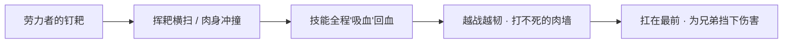

（说明：以上为基于背景设定的力量描述，非游戏数值。）

### 重要事件 / 剧情参与

- **加入魔种起义**：响应[孙悟空](#孙悟空)的号召，作为劳力者一员投身反抗神明的起义。
- **起义溃败**：[牛魔](#牛魔)因惧神明武器出卖众人，神明以元气炮轰营，起义军被击溃，孙悟空被擒。
- **独闯倒悬天**：在伙伴或死或散之后，八戒独自一人闯入神明掌控的「倒悬天」，只为寻回被囚的朋友——这是他最具代表性的剧情节点。

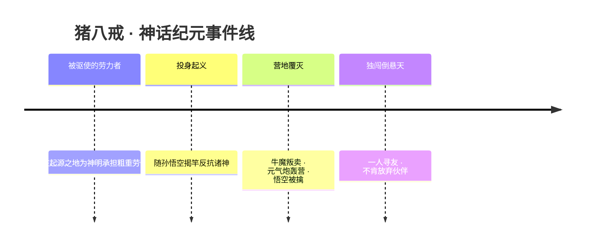

### 羁绊关系

| 对象 | 关系 | 说明 |
| --- | --- | --- |
| [孙悟空](#孙悟空) | 起义兄弟 / 寻找的对象 | 八戒响应悟空号召加入起义；起义溃败、悟空被擒后，他独闯倒悬天只为把这位兄弟带回来。 |
| [牛魔](#牛魔) | 同袍 / 被其连累 | 同为起义阵营的伙伴，却因牛魔惧怕神明武器而出卖众人，直接导致起义溃败、八戒痛失朋友。 |
| [女娲](#女娲) | 阵营对立（神明） | 起义—镇压这一阵营级对立的另一方；以女娲为代表的神明秩序，是八戒等劳力者反抗的对象。 |
| [帝俊](haojing-fengshen.md#帝俊) | 阵营对立（神明） | 神明阵营核心之一；诸神过度采集能量、镇压起义，正是八戒命运转折的根源。 |

### 经典台词

!!! quote
    「朋友还在，我就不能走。」（考据推测）

!!! quote
    「别看我吃得多，扛起兄弟来，一个都不少。」（考据推测）

!!! quote
    「倒悬天又怎样？再远，我也得把你找回来。」（考据推测）

---

## 梦奇

<span class="hok-tags"><span class="tag tank">坦克</span><span class="tag warrior">战士</span></span>

**食梦貘 · 来自梦境的奶肉巨兽，越胖越肉、以体重碾压、以好梦疗愈的边路坦战。**

| 档案项 | 内容 |
| --- | --- |
| 称号 | 食梦貘 |
| 定位 | 坦克 / 战士 |
| 所属 | [上古众神·神话](../factions/shanggu-shenhua.md) |
| 身份 | 食梦貘、梦境的造物 / 守梦者（关联帝俊的梦境）（考据推测） |
| 别称 | 小奇、貘（俗称）（考据推测） |
| 关系 | [帝俊](haojing-fengshen.md#帝俊)（梦之主、本源所系） |
| 登场作品 | 《王者荣耀》本传英雄 |

### 背景故事

梦奇并非诞生于母腹，也不是由神匠雕琢的造物——他来自梦境。在《王者荣耀》的世界观里，「梦」并不只是睡眠时脑海里漂浮的幻影，而是一片真实存在、可以被进入、被栖居、甚至被吞食的领域。梦奇，便是这片领域所孕育出的生灵：一头通体浑圆、毛茸茸、眼神懵懂而温和的「食梦貘」。在古老传说里，貘是以噩梦为食的瑞兽——人若做了可怕的梦，便祈请貘来把那份恐惧吃掉，换回一夜安眠。梦奇正是这一意象的化身：他吃下别人的噩梦，把痛苦与惊惧吞进自己越来越浑圆的身体，再把温暖与好梦留还人间。

关于梦奇的来历，最关键的一条线索指向上古神明 [帝俊](haojing-fengshen.md#帝俊)。在阵营设定中，梦奇被明确标注为「关联帝俊背景」。帝俊乃东皇之主、上古十二祖巫与众神纷争中的重要一极；当神明们为争夺起源之地的能量、为「方舟」的命运而彼此倾轧时，连「梦」这样最柔软的领域也未能幸免。一种被广泛接受的解读是：梦奇或为帝俊梦境（或与其相关的造梦之力）所衍生的存在，是从某位伟大存在的梦里走出来的影子——他承载着那位造梦者残留的温柔，也无意间背负着对方未曾言说的孤独与执念。（考据推测）正因如此，梦奇的「天真」与神明世界的「沉重」形成了鲜明对照：他越是憨态可掬，便越衬出那段神话纪元的冷峻。

梦奇的成长方式也极为奇特——他「越胖越肉」。每当他吞下一份噩梦、承接一段恐惧，身体便会膨胀一圈，变得更加圆滚、更加结实，也更加难以被击倒。换句话说，世间的苦痛喂养了他的强壮：别人卸下的负担，成了他御敌的护甲。这让梦奇成为一个极富温情的悖论式角色——他用「吃掉坏东西」的方式让自己变强，再用这份强大去保护身边更脆弱的同伴。在诸神倾轧、起义与镇压交织的血色纪元里，这样一头只想着「让大家睡个好觉」的圆胖巨兽，本身就是一缕罕见的暖意。

也正因为出身于梦境，梦奇与「现实」之间始终隔着一层薄纱。他对世界的认知带着孩童般的纯粹：分不清残酷的算计，记不住复杂的恩怨，只朴素地相信「饿了就吃、累了就睡、害怕了就让貘来吃掉害怕」。当他游走在起源之地与众神的战场边缘时，他既不属于女娲派，也不属于帝俊派的权谋核心，而更像一个被卷入宏大叙事的、过分善良的旁观者——一个把战场也当成「需要被疗愈的大梦」的食梦貘。

### 性格与形象

梦奇的性格可以用「憨、暖、纯」三个字概括。他天真、贪吃、嗜睡，行动慢悠悠，说话软糯糯，对谁都没有恶意；可一旦同伴受到威胁，这头平日里懒洋洋的圆胖巨兽便会毫不犹豫地把自己庞大的身躯挡在最前面。他不懂仇恨，只懂得「不想让别人难过」，这种近乎本能的善良，是他最核心的人格底色。

外形上，梦奇是典型的「大块头软萌」设计：浑圆敦实的身躯、毛茸茸的皮毛、短短的四肢、圆鼓鼓的肚皮，加上一双懵懂无辜的大眼睛，让他在一众神祇巨灵之中显得格外可爱。他的象征意象集中在两点——「貘」与「梦」。貘代表着「吞食噩梦、守护安眠」的祥瑞职责；而梦境的氤氲与朦胧，则赋予他超脱于现实逻辑之外的奇幻气质。他身上常带有云气、星点、绒毛般的柔软质感，整体调性温暖治愈，与神话阵营里那些肃杀的战神、决绝的魔道形成鲜明反差。

「越胖越肉」既是他的战斗机制，也是他形象的趣味内核：体重对梦奇而言不是负担而是力量，是被苦痛喂养出来的温柔铠甲。这让他成为一个少见的「以柔克刚、以胖为美」的英雄符号。

### 战斗风格与能力（设定向）

梦奇的战斗哲学与他的本性一脉相承——不是去消灭，而是去「承受」与「化解」。他几乎不依赖锋利的兵刃，而是用整副庞大的身躯作为武器：横冲直撞地碾压、沉甸甸地砸落、把敌人统统弹飞或卷起。设定上，他的力量来源正是那份「吃下来的噩梦」：恐惧越多，体重越沉，撞击越狠，自己也越发坚不可摧。

更动人的是，他的诸般招式「均可回血」。这与食梦貘「吞噩梦、还好梦」的本职完全吻合——每一次他冲向敌阵、吞下一片混乱与痛楚，都会转化为温润的生命力，回流到自己与同伴身上。于是梦奇在战斗里呈现出一种奇妙的「越打越精神、越扛越壮实」的姿态：他像一块会自我修复的活体棉花糖，把伤害吃进去，把治愈吐出来。

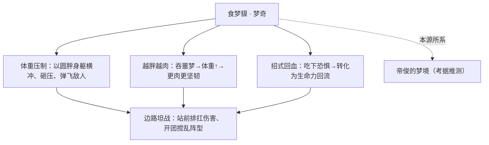

综合来看，梦奇是一名极具坦克属性的战士：站在最前排吸收伤害、用庞大身形搅乱敌方阵型、再靠源源不断的自我回复长久缠斗。他不是收割人头的尖刀，而是让队伍「睡得安稳」的那道肉墙。

### 重要事件 / 剧情参与

梦奇属于偏「设定与意象驱动」的角色，其叙事更多体现在世界观关联与节庆／皮肤主题中，而非长篇主线战役。可考据要点如下：

- **本源关联帝俊**：阵营设定明确其「关联帝俊背景」，是连接「梦境」领域与上古神明体系的关键纽带之一。（考据推测其为帝俊梦境衍生之存在）
- **食梦貘传说的具象化**：作为「以噩梦为食、归还好梦」的瑞兽化身，梦奇承载了游戏世界观中关于「梦境可被栖居、被吞食」这一设定的形象表达。
- **治愈系节庆／皮肤主题**：梦奇常以温暖、童趣、梦幻为主题登场（如与梦境、甜点、节日相关的造型），强化其「守梦者」的暖系定位。（考据推测，具体皮肤以官方为准）

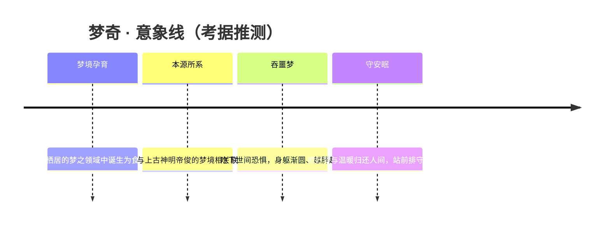

### 羁绊关系

| 对象 | 关系 | 说明 |
| --- | --- | --- |
| [帝俊](haojing-fengshen.md#帝俊) | 本源 / 梦之所系 | 阵营设定标注梦奇「关联帝俊背景」；一说梦奇为帝俊梦境（或相关造梦之力）所衍生的存在，承载其残留的温柔与孤独。（考据推测） |
| [上古众神·神话](../factions/shanggu-shenhua.md) | 所属阵营 | 起源之地的神明体系；梦奇游走于女娲派与帝俊派纷争边缘，是其中罕见的暖系角色。 |

### 经典台词

!!! quote "梦奇 · 食梦貘"
    「让貘来，把你的噩梦……都吃掉。」（考据推测）

    「越胖，才越能保护你呀。」（考据推测）

    「困了吗？睡吧，这里有我在。」（考据推测）

    「坏梦交给我，好梦还给你。」（考据推测）

### 皮肤故事亮点

梦奇的皮肤多围绕「梦境、童趣、治愈」展开，把他「守护安眠的食梦貘」这一核心意象延展成各类温暖梦幻的造型与主题。（考据推测，具体皮肤背景与上线信息请以游戏官方为准）

---

## 少司缘

<span class="hok-tags"><span class="tag support">辅助</span></span>

**赤诚月老 · 掌管姻缘的红线之神，以朱线牵引良缘、化解冤缘的治疗位移型辅助。**

| 项目 | 内容 |
| --- | --- |
| 称号 | 赤诚月老 |
| 定位 | 辅助 |
| 所属 | [上古众神·神话](../factions/shanggu-shenhua.md) |
| 身份 | 云梦九大神巫之一（神巫祝），司掌缘分；少司命大人消失后接掌云梦泽全部姻缘 |
| 别称 | 红线之神 / 小红娘 / 月老 / 孤星（旧时预言之名） |
| 关系 | [大司命](haojing-fengshen.md#大司命)（赤诚相系之人 · 官配CP）、[嫦娥](#嫦娥)、[后羿](#后羿) |
| 登场作品 | 《王者荣耀》（2024 年 8 月正式服上线） |

### 背景故事

少司缘出身云梦泽——那片被神巫与自然之灵共同庇护、传说与祭祀交织的古老水泽。在云梦的信仰体系里，有「九大神巫」分掌天地诸事，其中最幽微难测的一职，便是「缘分」。她正是这一脉的继承者：在更古老的神巫**少司命**消失之后，云梦泽里所有人与人之间的相逢与离别、结合与错过，皆由她一手牵引。

然而她并非生来就被祝福。年幼时的少司缘是一个孤僻、自闭、几乎不与人说话的少女。她生在一则不祥的预言之下——被断言为「命中无缘」「招致灾祸的孤星」。在一个以缘分为最高祝福的水泽之乡，被宣判「无缘」无异于被整个世界轻轻地推开。人们躲着她、惧着她，仿佛她身上那根本该牵起众生的红线，在她自己身上反倒成了死结。于是她把自己缩进沉默里，像一颗孤悬于夜空、谁也不愿对望的星。(考据推测：此处「孤星」之名与她后来「赤诚月老」的反差，正是其角色弧光的核心。)

改变她命运的，是一个名叫**祈**的少年。彼时的祈尚未背负后来「执掌生死」的沉重身份——他阳光、开朗，是那种会径直走向被所有人回避的孩子、并伸出手的人。是他给了沉默的她一个名字，给了被预言判为「无缘」的她，人生中第一段真正的羁绊。少司缘自此明白：缘分并非天定的枷锁，而是可以被一双赤诚之手亲手系起的东西。她不再相信「孤星无缘」的咒语，转而立志成为替世人指引良缘、化解冤缘的小红娘。

可命运对祈格外残酷。一场灾难夺走了他身边所有的亲朋——挚友、至亲，尽数死去。曾经那个会向孤独者伸手的少年，被巨大的痛苦反复碾过，最终挥动手中长戈斩断往事、斩断自己一切的牵念，化为冷峻无情、执掌生死的**[大司命](haojing-fengshen.md#大司命)**。一个掌管「缘起」，一个掌管「缘灭」；一个以朱红丝线把人与人系在一起，一个以森森长戈把生与死划开界限。曾经互为救赎的两个孩子，长成了立场截然相对的两极。

于是少司缘的故事，本质上是一则关于「赤诚」的悖论：她见过太多缘分被命运、被死亡、被预言强行剪断，却仍固执地相信牵线之事值得去做。她以一身赤红行走于云梦，将看似不可能相遇的人引向彼此，将怨憎缠结的冤缘耐心解开——这既是她的神职，也是她对那个曾向自己伸手的少年、迟迟未能松开的回应。在「[上古众神·神话](../factions/shanggu-shenhua.md)」这一以创世、起义、镇压与诀别为底色的庞大叙事里，少司缘代表的是其中最温柔、也最执拗的一缕——在万物皆可分离的纪元里，仍有人愿意去「系」。

### 性格与形象

少司缘性格的底色，是从「孤僻自闭」走向「赤诚热忱」的逆转。被预言为孤星的童年，让她内里始终藏着一点小心翼翼的敏感；而被人接住、被赋予羁绊的经历，又让她把「为别人牵起缘分」当成了毕生的快乐与执念。她活泼、热心、爱管闲事般地撮合良缘，却也比谁都懂得「无缘」的苦楚，因而格外珍惜每一次相逢。

外形上，她是辨识度极高的「红衣少女」意象：一身朱红衣裙，拖着长长的广袖，行动间衣袖翻飞如缠绕的丝线；一头青绿色长发与赤红衣装形成鲜明的冷暖对照。她最具标志性的细节，是一双**爱心形的瞳孔**——这既点明了她「月老 / 红娘」的身份，也是她「赤诚」之名最直白的外化。红线、心形、广袖，共同构成了她的核心象征：以柔软之物，行牵系众生之事。

### 战斗风格与能力（设定向）

少司缘的力量并非刀兵杀伐，而是源自她的神职——**操纵姻缘的红线**。在设定意象上，她以朱红丝线为媒：丝线可以是缠住敌人、令其难以脱身的束缚，也可以是连结友军、将祝福与治疗顺线传递的纽带，更可以化作牵引自身与他人的位移之缰。这恰好对应她在游戏中「兼具治疗、控制、位移」的辅助定位——一根红线，集回复、控制、拉拽于一体。

她的作战哲学是「牵」而非「斩」：以线缚敌、以线护友、以线易位。相较于大司命以长戈「斩断」缘分的决绝，少司缘的全部能力都在表达「连结」二字。(考据推测：以下为基于背景意象的设定向描述，非游戏数值。)

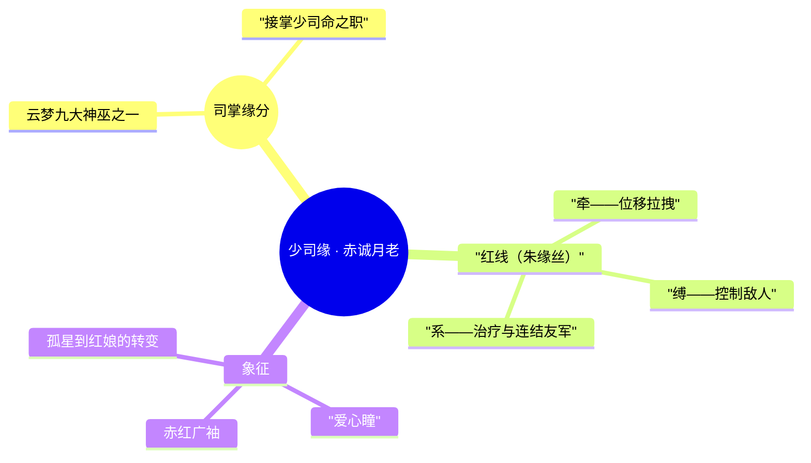

### 重要事件 / 剧情参与

- **被预言为「孤星无缘」的童年**：在以缘分为信仰的云梦泽，被判为招致灾祸者，长期孤僻自闭。
- **与少年祈的相遇**：得到名字与第一段羁绊，立志成为牵线化缘的红娘——这是其整个人格的转折点。
- **接掌缘分之职**：在神巫少司命大人消失后，云梦泽全部姻缘归于她一人掌管，正式成为「神巫祝」中司缘者。
- **与大司命的诀别式对照**：祈在灾难夺亲后斩断往事、化为无情的执掌生死者，二人成为「缘起」与「缘灭」相对的两极。
- **2024 年 8 月正式上线**：作为兼具治疗、控制、位移的辅助英雄加入《王者荣耀》。

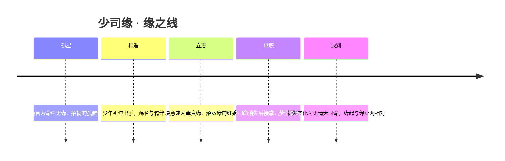

### 羁绊关系

| 对象 | 关系 | 说明 |
| --- | --- | --- |
| [大司命](haojing-fengshen.md#大司命) | 旧识 / 救赎者 / 官配 CP | 本名「祈」的少年曾向孤僻的她伸手，赐其名与羁绊；后因灾难失去至亲、斩断往事化为执掌生死的大司命。一人司缘起、一人司缘灭，互为彼此最深的牵念与对照。 |
| [嫦娥](#嫦娥) | 同阵营 · 缘分母题呼应 | 同属上古众神，嫦娥与[后羿](#后羿)那段「行刑前放走、随月光沉海」的错位之缘，正是少司缘所司掌、所惋惜的「缘」之极致写照。(考据推测：母题层面的呼应，非直接剧情交集。) |
| [后羿](#后羿) | 同阵营 · 缘分母题呼应 | 神职者奉命处决魔道公主却于行刑前放手——这种被宿命强行剪断的缘，与少司缘「化解冤缘」的执念遥相对望。(考据推测) |

> 注：少司缘所属「[上古众神·神话](../factions/shanggu-shenhua.md)」阵营的核心冲突线（孙悟空率魔种起义、牛魔出卖众人、神明镇压），与她的个人故事不直接交集；她的羁绊重心在云梦泽神巫体系与大司命之间。

### 经典台词

!!! quote "经典台词"
    「赤诚之心，自有良缘。」(考据推测)

    「这世间所有的相遇，都是久别重逢。」(考据推测)

    「孤星也好，无缘也罢——我偏要为你们，把线系上。」(考据推测)

---

## 艾琳

<span class="hok-tags"><span class="tag marksman">射手</span></span>

**圣灵之弓 · 守护自然之灵的精灵射手，以光环箭矢倾泻法术伤害的特殊远程英雄。**

| 项目 | 内容 |
| --- | --- |
| 称号 | 圣灵之弓 |
| 定位 | 射手（法术伤害向） |
| 所属 | [上古众神·神话](../factions/shanggu-shenhua.md) |
| 身份 | 自然之灵的守护者、森林精灵（考据推测） |
| 别称 | 圣灵射手、精灵弓手（俗称） |
| 关系 | [后羿](#后羿)、[嫦娥](#嫦娥)（同为神话纪元远程角色，考据推测无直接剧情线） |
| 登场作品 | 《王者荣耀》英雄阵容（早期上线英雄） |

> 说明：艾琳是《王者荣耀》中背景设定相对简略、官方主线着墨不多的早期英雄之一。其形象更接近"奇幻精灵射手"的原型，与上古众神主线的科幻方舟叙事关联较弱。本文在尊重已知设定的前提下做合理整理，凡涉及不确定处均标注「(考据推测)」，不臆造硬性主线设定。

### 背景故事

在起源之地的神话纪元里，神明们以超越凡俗的智慧与力量塑造世界，而世界本身也并非全然由"造物"组成——在群山、密林与溪流深处，还栖息着一类更古老、更接近自然本源的存在：自然之灵。它们是大地呼吸的形状，是风穿过树冠时被听见的声音，是露水在黎明里短暂的闪光。艾琳，便是这片自然之灵的守护者(考据推测)。

传说艾琳生于不被神明纷争所染指的圣林之中。当上古众神为能量、为权柄、为创世的主导权争执不休，乃至引发后世一切冲突之时，圣林始终保持着一种古老的中立——它不属于女娲派，也不属于帝俊派，它只属于自然本身。艾琳作为这片净土的守望者，背负的不是神战的宿命，而是一份更素朴的职责：让森林继续是森林，让溪流继续是溪流，让那些无法发声的生灵免于湮灭。

她的弓并非用来征伐的兵器。在艾琳的认知里，弓是"圣灵的延伸"——每一支离弦的箭，都裹挟着自然之灵借予她的力量，那是一种近乎法术的、带着光环的能量。正因如此，她虽手持长弓、立于远处，倾泻而出的却不是寻常箭矢的钢铁锋芒，而是被自然之灵祝福过的圣光(考据推测)。这也使她在众多神话纪元的角色之中，显得格外独特：既是射手，又像是借弓施法的祭司。

随着神明对世界能量的过度采集，污染与失衡开始蔓延，连最幽深的圣林也未能完全幸免。艾琳之所以走出森林、走向更广阔的战场，正是因为她意识到——若任由失衡蔓延，自然之灵将无处安身。守护一片林，终究要守护承载这片林的整个世界。于是这位本可隐于林间的精灵，选择了拉满她的圣灵之弓(考据推测)。

需要说明的是，艾琳的故事在官方叙事中并未与神话纪元的核心主线（如女娲补天、孙悟空起义、后羿射日等）紧密交织，她更像是这一宏大世界观边缘处一抹独立而温柔的色彩。这种"留白"本身，也恰好契合了她"自然中立守护者"的气质。

### 性格与形象

艾琳的性格被自然塑造：她沉静、专注、带着一种不轻易被卷入纷争的疏离感，却又在守护之事上格外坚定。她不嗜杀，对她而言，弓是守护的工具而非杀戮的快意；可一旦圣林与自然之灵受到威胁，她的箭便不会有半分犹豫。

在形象上，她是典型的森林精灵意象的化身(考据推测)：

- **圣灵之弓**——通体洁净、缠绕着自然光晕的长弓，是她身份与力量的核心象征；
- **光环箭矢**——箭离弦时绽放的不是寒芒而是圣光，呼应"圣灵"二字；
- **自然色调**——以绿、白、金为主的视觉基调，象征林木、纯净与神圣；
- **轻盈灵动的身姿**——契合精灵远离尘嚣、与自然共舞的气质。

她象征着这个被神争撕裂的世界中，那一份未被污染的、属于自然本身的纯粹与守望。

### 战斗风格与能力（设定向）

艾琳在战场上的定位是**射手**，但她与传统依赖物理普攻的射手截然不同——她是一名**主打法术伤害的特殊射手**。她的力量并非来自臂力与机括，而是来自自然之灵的馈赠：她借弓为媒，将自然能量凝为带有光环的箭矢倾泻而出，因此她的输出更接近"以箭施法"。

设定层面，她的战斗风格可概括为：

- **圣灵之弓为媒**——弓是她与自然之灵之间的通道，离弦之箭裹挟法术性的圣光能量(考据推测)；
- **光环箭矢**——区别于钢铁箭头的物理穿刺，她的箭以能量光环造成伤害，呼应"圣灵"称号；
- **远程持续压制**——作为射手，她以站位与节奏取胜，在安全距离上持续输出，而非贴身搏杀。

```mermaid
graph LR
  A["自然之灵 · 圣林"] -->|赋予力量| B["艾琳"]
  B -->|借弓为媒| C["圣灵之弓"]
  C -->|凝聚能量| D["光环箭矢（法术伤害）"]
  D -->|远程倾泻| E["守护 · 压制"]
```

（以上为基于背景设定的能力来历描述，不涉及具体游戏数值与技能机制。）

### 重要事件 / 剧情参与

艾琳在《王者荣耀》官方主线叙事中的剧情参与度较低，没有像后羿、嫦娥、孙悟空等角色那样拥有清晰的篇章化故事线。她的"事件"更多体现在其作为早期英雄的存在意义，以及她所代表的"自然守护"主题：

- 作为《王者荣耀》早期上线的英雄之一，承担起射手阵容中"法术伤害型特殊射手"的位置；
- 以"圣灵之弓"的设定，为上古众神·神话阵营补足了"自然之灵守护者"这一独特意象(考据推测)；
- 其主线剧情留白，使她成为世界观中相对独立、可被后续叙事拓展的角色。

```mermaid
timeline
  title 艾琳 · 设定脉络（考据推测）
  神话纪元 : 生于圣林 / 受自然之灵庇佑
  失衡蔓延 : 神明过度采集能量 / 圣林受威胁
  走出森林 : 拉满圣灵之弓 / 守护自然
```

### 羁绊关系

> 说明：依据本阵营 `relatedRelationships` 与现有官方设定，艾琳暂无被明确记载的剧情羁绊或情侣线（CP）。下表所列为同阵营中可作语境关联的角色，关系性质均标注为推测。

| 对象 | 关系 | 说明 |
| --- | --- | --- |
| [后羿](#后羿) | 同纪元远程角色（考据推测） | 同为神话纪元的弓手，后羿是"半神之弓"、艾琳是"圣灵之弓"，弓的意象彼此呼应，但官方未给出直接交集。 |
| [嫦娥](#嫦娥) | 同纪元角色（考据推测） | 同属上古众神·神话阵营，主题分别为月与林，皆带有"远离神争的纯净者"色彩，无明确剧情线。 |
| [上古众神·神话](../factions/shanggu-shenhua.md) | 所属阵营 | 起源之地的神明与上古众神体系；艾琳作为自然之灵守护者，处于该阵营较为边缘、中立的位置(考据推测)。 |

### 经典台词

!!! quote "艾琳 · 台词（部分为考据推测）"
    “自然之灵，与我同行。”（考据推测）

    “这一箭，为森林而发。”（考据推测）

    “圣灵之弓，从不轻易示人。”（考据推测）

> 注：艾琳的官方语音台词资料较为零散，以上台词为契合其"圣灵之弓·自然守护者"设定整理的示意，均标注（考据推测），不作为确切原文引用。


!!! tip "继续探索"
    返回 [上古众神·神话 阵营页](../factions/shanggu-shenhua.md) · 浏览 [全英雄图鉴](index.md) · 查看 [人物关系网](../relationships/index.md)