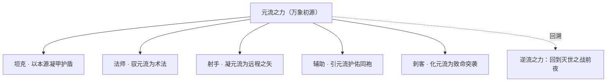
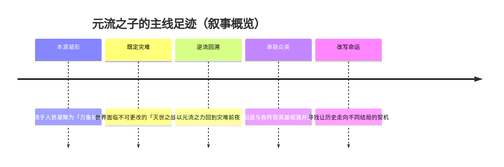
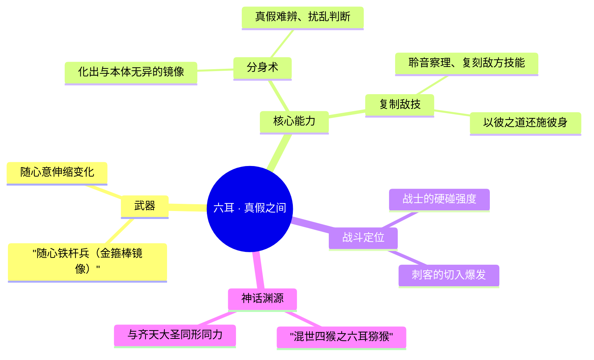
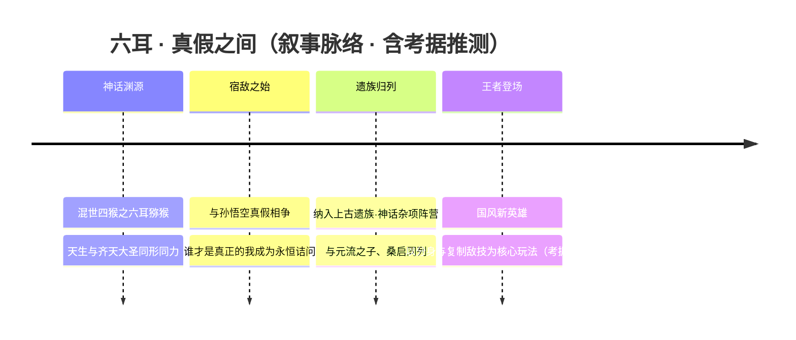
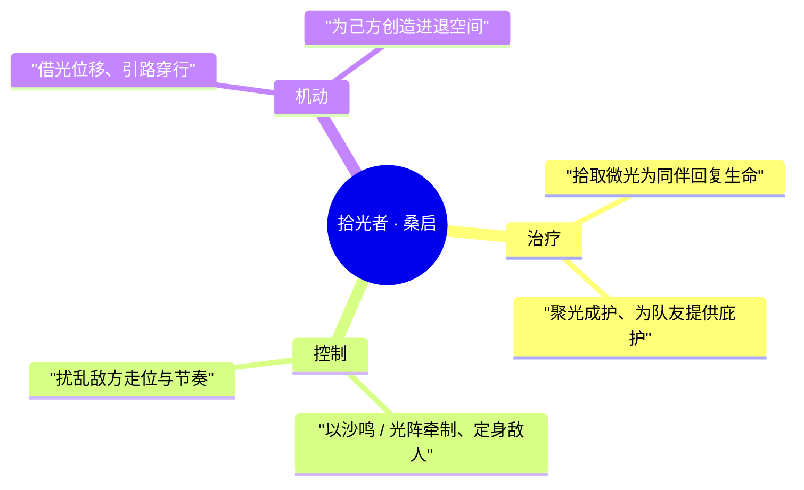
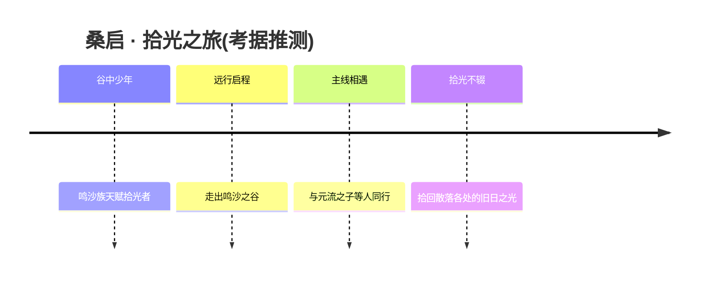

# 上古遗族 / 神话杂项与多职业 · 英雄图鉴

> 阵营设定见 [上古遗族 / 神话杂项与多职业 阵营页](../factions/yuanchu-shenhua-misc.md)。本页收录该阵营 **3** 位英雄的深度小传。

!!! abstract "本页英雄名册"
    | 英雄 | 称号 | 定位 | |
    | --- | --- | --- | --- |
    | [元流之子](#元流之子) | 万象初源 | 多职业自选（坦克/法师/射手/辅助/刺客） | |
    | [六耳](#六耳) | 真假之间 | 战士/刺客 | |
    | [桑启](#桑启) | 拾光者 | 辅助 | |

---

## 元流之子

坦克法师射手辅助刺客

**万象初源 · 王者首位「多职业自选」英雄，代表玩家自身、回溯灭世之战以扭转既定的历史。**

| 档案项 | 内容 |
| --- | --- |
| 称号 | 万象初源 |
| 定位 | 多职业自选（坦克 / 法师 / 射手 / 辅助 / 刺客） |
| 所属 | [上古遗族 / 神话杂项与多职业](../factions/yuanchu-shenhua-misc.md) |
| 身份 | 《王者荣耀世界》主人公、玩家化身、元流之力的承载者 |
| 别称 | 元流者 / 旅者 / 玩家化身（考据推测） |
| 关系 | [桑启](#桑启)、[六耳](#六耳)、[孙悟空](shanggu-shenhua.md#孙悟空)、[盘古](shanggu-shenhua.md#盘古) |
| 登场作品 | 《王者荣耀世界》（开放世界 ARPG，作为可操控主人公登场）（考据推测） |

### 背景故事

元流之子并非某一段固定史册里的人物，而是「万象初源」——被设定为站在世界一切纪元起点、又游走于所有结局之间的存在。在《王者荣耀》宏大的世界观叙事里，「元流」被描述为贯穿天地、连结过去与未来的本源之力；而「元流之子」，便是这股本源在人世间凝聚出的化身。他/她没有被钉死的姓名、面孔与职业，因为他/她本就是为「承载一切可能」而生的容器。（考据推测：该角色定位高度对应「玩家自身」，其无固定外形、可自选职业的设计正是为让每一位玩家把自我投射其中。）

在主线叙事中，元流之子被卷入一场早已写就结局的灾难——「灭世之战」。那是一段被认为不可更改的既定历史：王者大陆曾经历过一次几近终结一切的浩劫，无数英雄、城邦与神祇在其中陨落，时间的洪流仿佛只能向着那个注定的悲剧奔涌。而元流之力的特殊之处，正在于它能够逆流——元流之子得以回溯到灾难发生之前的节点，重新踏上那条本应通向毁灭的道路，去寻找「让历史走向不同结局」的一线契机。

也正因如此，元流之子的旅程不是单纯的冒险，而是一场对「命定」的反抗。他/她穿行于上古遗迹与残破纪元之间，沿途与散落在世界各处的英雄相遇、并肩——在长安、在三分之地、在封神的众神之列、在鸣沙之谷、在江湖与边陲。每一次相遇，都是在被灾难抹去的世界版图上，重新点亮一盏灯。元流之子既是历史的见证者，也是改写历史的执笔人。

作为「连接所有阵营的特殊存在」，元流之子在设定上被刻意置于一切主线阵营之外、又渗透进每一条主线之内。他/她不隶属于长安的秩序、也不归于封神的神权，更不是某座城邦的子民；他/她属于「世界本身」。这种超然的身份，使元流之子成为整个王者世界叙事的中枢锚点——所有看似各自独立的英雄故事，都可以通过这位旅者的足迹被重新串联。（考据推测：这一设计与《王者荣耀世界》作为开放世界、需要一个「玩家代入的主角」来串连各地剧情的需求一致。）

### 性格与形象

元流之子被有意塑造成一面「留白的镜子」——他/她的性格更多由旅途中的选择与玩家的意志填充，而非预先设定的鲜明棱角。但在共通的叙事底色里，仍可勾勒出几分轮廓：坚定、好奇、不轻易向「注定」低头。面对一个被宣告无法改变的结局，他/她偏要去叩问「为什么不能改变」，这份近乎执拗的求索，是元流之子最核心的性格动力。

在形象上，元流之子最鲜明的特征恰恰是「无定形」——无固定职业、无固定战姿，可以是身披重甲的坦克、可以是远射的弓手、可以是诡谲的刺客、也可以是辉光环绕的法者或扶危的辅助。这种「万象」的可塑性本身就是其象征：他/她是「初源」，是尚未分化、却蕴含一切分化可能的本体。围绕其形象的核心意象，是流转的光、循环的纹路与回溯的时间——一切都在暗示他/她与「元流」「初源」之间不可分割的羁绊。（考据推测）

### 战斗风格与能力（设定向）

元流之子之力的根源，是「元流」——世界本源的能量。与多数英雄各自专精一道不同，元流之子能够将这股本源塑形为完全不同的战斗形态，这正是「多职业自选」在叙事上的解释：不是同时身兼五职，而是元流之力可被「初始化」为任意一道路径，使他/她能化身坦克承伤、化身法师驭术、化身射手远击、化身辅助护佑、化身刺客突袭。

其最具标志性的能力，并非某一件兵器，而是「回溯」——驾驭元流逆时间而上、重返既定灾难发生之前的节点。这种力量在战斗与叙事层面都构成了元流之子的独特之处：在叙事上，它是改写命运的钥匙；在战斗上，它呼应着「初始化」「重塑形态」的设定母题。（考据推测：具体技能机制以游戏内实装为准，此处仅就背景设定层面描述其力量来历。）

### 重要事件 / 剧情参与

- 作为《王者荣耀世界》开放世界的主人公登场，是该作的核心可操控角色与叙事视点。（考据推测）
- 承载元流之力，回溯并介入「灭世之战」这一被视为既定的灾难历史，踏上扭转结局的主线旅程。
- 以「连接所有阵营的特殊存在」之身份，穿行于长安、三分之地、封神众神、鸣沙之谷、江湖边陲等各地，与散落世界的英雄相遇、并肩。

### 羁绊关系

| 对象 | 关系 | 说明 |
| --- | --- | --- |
| [桑启](#桑启) | 同阵营 · 同行旅伴 | 同属「上古遗族 / 神话杂项与多职业」，鸣沙之谷的鸣沙族少年；与游走世界的元流之子在叙事上同处一条「上古遗族」脉络，可于鸣沙之谷一线交汇。（考据推测） |
| [六耳](#六耳) | 同阵营 · 神话杂项 | 同属本阵营的国风神话角色，六耳猕猴、孙悟空之宿敌；与元流之子共处「神话杂项与多职业」这一连接性阵营之下。 |
| [孙悟空](shanggu-shenhua.md#孙悟空) | 跨阵营 · 神话脉络 | 齐天大圣，本阵营宿敌（六耳）所对应的对象；元流之子作为连接一切阵营的存在，与上古神话一系英雄在世界主线中产生交汇。（考据推测） |
| [盘古](shanggu-shenhua.md#盘古) | 跨阵营 · 开天与初源 | 「开天」之神，与「万象初源」共享创世/本源的意象母题；二者在世界观的「起点」叙事上相呼应。（考据推测） |

### 经典台词

!!! quote "元流之子语录（部分为考据推测）"
    「万象皆有初源——而我，便是那初源。」（考据推测）

    「被写好的结局，未必就是终点。」（考据推测）

    「逆流而上，只为再看一眼那本不该消失的世界。」（考据推测）

---

## 六耳

战士刺客

**真假之间 · 以你为镜、夺你之技、与你同形的另一个「我」**

| 档案 | |
| --- | --- |
| 称号 | 真假之间 |
| 定位 | 战士 / 刺客 |
| 所属 | [上古遗族 / 神话杂项与多职业](../factions/yuanchu-shenhua-misc.md) |
| 身份 | 六耳猕猴、混世四猴之一（考据推测）、齐天大圣的同源宿敌 |
| 别称 | 六耳猕猴、假行者、真假之间者（考据推测） |
| 关系 | [孙悟空](shanggu-shenhua.md#孙悟空)（同源宿敌）、[元流之子](#元流之子)（同阵营，万象初源）、[桑启](#桑启)（同阵营遗族少年） |
| 登场作品 | 《王者荣耀》国风新英雄（考据推测） |

### 背景故事

六耳之名，源自古老神话中的「六耳猕猴」——一只生于天地灵气、却天生与齐天大圣同形、同声、同力的异兽。传说混世之间有四猴混于诸类之中，不入十类之种，灵明石猴、赤尻马猴、通臂猿猴与六耳猕猴各擅其能；而六耳猕猴最为奇诡之处，便在于「善聆音、能察理、知前后、万物皆明」——它能听见十方之声，能洞悉万物之理，能预判将至之事，因此它所面对的每一个对手，都仿佛在与「另一个自己」交锋。（考据推测：王者世界对六耳的设定，正是将这一神话母题重塑为「真假之间」的核心命题。）

在《王者荣耀》的世界叙事里，六耳并非纯粹的反派或恶兽，而是齐天大圣 [孙悟空](shanggu-shenhua.md#孙悟空) 命运中那道无法摆脱的影子。它与大圣同根而生、同形而立，却走上了截然相反的道路。大圣以「真」为名，向着自由与本心一路打去；六耳则被困在「假」的命题里——当世上存在一个与你一模一样、连金箍棒都能仿造、连七十二变都能复刻的存在时，究竟谁才是真正的那一个？这种「真假莫辨」的诘问，既是六耳对大圣的挑衅，也是它对自身存在意义的永恒追问。

关于六耳的出身，神话原典与王者世界的演绎之间存有微妙的张力。在最古老的传说里，六耳是天生地养、自混沌灵气中孕育的异种，因与齐天大圣形神相类而成为其镜像与试炼。（考据推测：王者世界很可能保留了「上古遗族」这一身份框架，将六耳归入那些不易纳入单一主线、却承载着古老神话血脉的遗族角色之列。）正因如此，它被收录于「上古遗族 / 神话杂项与多职业」这一特殊阵营之中——与开放世界的玩家化身 [元流之子](#元流之子)、鸣沙之谷的遗族少年 [桑启](#桑启) 同列，共同构成王者世界里那些游离于诸大阵营之外、却与世界本源紧密勾连的神话存在。

六耳的动机，始终缠绕在「成为真实」这一执念之上。它不甘只做一面镜子，不愿永远活在「假」的阴影里。它复制敌人的技能、模仿对手的招式、化出与本体无异的分身——这些既是它的战斗手段，也是它存在方式的隐喻：它通过「成为别人」来确认「自己是谁」。在它眼中，真与假并非泾渭分明的两端，而是一线之间、随时可以翻转的同一枚铜钱的两面。这份对自我同一性的撕扯与执着，使六耳成为王者世界里最具哲学意味的角色之一。

随着王者世界的纪元更迭与上古遗族故事线的展开，六耳的身影时隐时现。它既是大圣旅途上挥之不去的宿敌，也是叩问「何为本真」的那个声音。当万象初源 [元流之子](#元流之子) 回溯历史、扭转灭世之战的洪流时，六耳这般「以复制为生、以仿造为命」的存在，恰恰映照出「独一无二」与「可被替代」之间那道令所有英雄都不得不直面的裂痕。（考据推测：六耳在主线中的具体定位仍有待官方进一步揭晓。）

### 性格与形象

六耳生性机敏、善察、能聆——这是它名字里「六耳」二字的本义：六只耳朵，听尽十方。它说话往往半真半假、似是而非，喜欢用对手自己的话术、自己的姿态去回敬对手，把人逼进「分不清真我假我」的迷局。它并不张狂如大圣那般肆意，而是带着一种冷峻的、镜面般的疏离感——你以为在与它对话，实则像在对着一面会反击的镜子说话。

在外形上，六耳与齐天大圣高度相似，却处处透着「镜像」的违和：同样的猴形、同样的兵器轮廓，却在配色、纹饰与气质上呈现出一种「负片」般的对照感（考据推测）。它的核心象征意象，是「镜」与「影」——镜照出形，影随形动，而六耳便是那个从镜中走出、试图取代本体的影子。「随心铁杆兵」作为它的武器，正是金箍棒的镜像投影：能随心意伸缩变化，既是它战力的来源，也是它「我即是你」这一宣言的实体化。

### 战斗风格与能力（设定向）

六耳的战斗哲学，可以概括为四个字：**以彼之道**。它不依赖某一套固定的招式，而是「看见什么、就成为什么」——通过观察、聆听与复刻，把对手的力量化为己用。

- **随心铁杆兵**：六耳所持的兵器，是与金箍棒同源的镜像之物，能随其心念伸缩、变形，兼具近战劈砸与远程突进的多重形态（考据推测）。
- **分身之术**：六耳能化出与自身别无二致的分身，制造「真假莫辨」的战场迷局——敌人往往要在交手数招后，才惊觉自己攻击的不过是一具幻影。
- **复制敌技**：这是六耳最具辨识度的设定。凭借「善聆音、能察理」的天赋，它能在战斗中观摩并复刻敌方的技能，将对手的看家本领转化为自己的杀招，真正做到「以彼之道，还施彼身」。
- **双定位融合**：作为战士，它有正面抗压与持续输出的硬度；作为刺客，它又能凭分身与复制能力完成出其不意的切入与爆发，在「真假之间」找到最致命的那一击。

### 重要事件 / 剧情参与

- 作为「混世四猴」神话母题的现代演绎，六耳承载了「真假美猴王」这一经典叙事内核——与齐天大圣 [孙悟空](shanggu-shenhua.md#孙悟空) 之间「同形异道、真假难辨」的对峙，是其故事的主轴。
- 被收录于「上古遗族 / 神话杂项与多职业」阵营，与玩家化身 [元流之子](#元流之子)、鸣沙遗族少年 [桑启](#桑启) 共处于王者世界那些游离于主线大阵营之外的神话存在之列。
- 作为主打「分身 + 复制敌方技能」机制的国风新英雄登场，在玩法层面将「真假之间」的叙事命题转译为独特的对战体验（考据推测：具体活动与动画参与以官方资料为准）。

### 羁绊关系

| 对象 | 关系 | 说明 |
| --- | --- | --- |
| [孙悟空](shanggu-shenhua.md#孙悟空) | 同源宿敌 | 与六耳同形、同声、同力，是其镜像与命运对手；「真假美猴王」式的对峙构成六耳故事的核心。 |
| [元流之子](#元流之子) | 同阵营 · 万象初源 | 同属「上古遗族 / 神话杂项与多职业」；元流之子的「万象」与六耳的「复制」皆触及"可塑与可替代"的命题，形成隐性呼应。 |
| [桑启](#桑启) | 同阵营 · 遗族少年 | 同列于上古遗族阵营，皆为不易归入单一主线、却血脉古老的神话存在。 |

### 经典台词

!!! quote "六耳 · 真假之间"
    "你怎知，眼前这个，不是真正的我？"（考据推测）

    "我听得见，十方的声音。"（考据推测）

    "以你之道，还你之身。"（考据推测）

    "真也好，假也罢——能赢的，才是真的。"（考据推测）

---

## 桑启

辅助

**拾光者 · 鸣沙之谷走出的鸣沙族少年，以光与回声为伴的治疗、控制、机动型辅助。**

| 档案项 | 内容 |
| --- | --- |
| 称号 | 拾光者 |
| 定位 | 辅助 |
| 所属 | [上古遗族 / 神话杂项与多职业](../factions/yuanchu-shenhua-misc.md) |
| 身份 | 鸣沙之谷·鸣沙族少年；游历四方的引路人 / 旅伴(考据推测) |
| 别称 | 拾光的孩子 / 鸣沙少年(考据推测) |
| 关系 | [元流之子](#元流之子)、[六耳](#六耳) |
| 登场作品 | 《王者荣耀世界》(开放世界主线相关)(考据推测) |

### 背景故事

桑启出身于鸣沙之谷深处的**鸣沙族**——一支栖居在风与沙之间的上古遗族。鸣沙之谷得名于沙丘在风中发出的低吟，那是一种近乎歌唱的声响。族人相信，沙鸣并非自然偶然，而是被岁月掩埋的"光"在地底回响——每一道被时间冲刷殆尽的过往，都会化作微光沉入沙海，等待有缘人将它重新拾起。能够听见、并能"拾起"这些光的人，便被族人称为**拾光者**。桑启，正是这一代鸣沙族中天赋最为出众的拾光者。(考据推测)

与许多背负血仇或王权的英雄不同，桑启的故事起点更接近一名少年的远行。鸣沙族世代守谷而居，靠拾光维系着族群与古老遗迹之间的联系；而桑启却不甘心一生只在谷中听沙。他相信被风沙掩埋的不只是过往的微光，还有整个世界曾经的模样——那些在更早的纪元里被遗忘、被抹去、被"灭世"洪流冲散的人与事。于是他背起行囊，走出鸣沙之谷，循着光的指引去拾取散落在大地各处的记忆碎片。(考据推测)

桑启所处的时代，正是**王者世界**几经动荡、灭世阴影未散的年代。作为本阵营的核心叙事支点，[元流之子](#元流之子)以"回溯灭世之战、扭转历史"为使命，串联起各方势力；而桑启这样的拾光者，恰恰承担着与之呼应的另一半工作——大变之后，世界需要有人记得"曾经发生过什么"。武者持剑改写未来，拾光者掌灯照亮过去：一个负责前行，一个负责不让来路被彻底遗忘。两者在主线途中相遇、同行，几乎是这套世界观顺理成章的安排。(考据推测)

也正因如此，桑启的动机并不宏大到要"拯救世界"，而是朴素得近乎固执：**他要把被遗忘的光一颗颗拾回来。**在他看来，再黑暗的纪元，只要还有人愿意拾光，世界就不算真正失去过它的过去。这份温和而坚定的信念，让他在一众或悲怆、或暴烈的上古遗族角色中，显得格外像一束穿过沙幕的暖光。

### 性格与形象

桑启是一名**温润、好奇而坚韧**的少年。他不善与人争锋，却极有耐心——拾光本就是一桩需要俯身、需要等待、需要长久聆听的细活，急躁的人做不来。面对险境，他更习惯以治愈与守护回应，而非以攻伐示人；但一旦认定要护住的人，他又会展现出与年龄不符的执拗。

在外形与象征上，桑启的意象高度围绕"**光**"与"**沙**"展开：暖金与浅褐为主的色调，呼应鸣沙之谷的风沙底色；随身的器物多带有捕光、聚光、引路的寓意，仿佛随时能从空气与尘沙里"拾"出一缕缕微光。沙之回声(鸣沙)、被拾起的光点、以及"过去—未来"的时间隐喻，共同构成了这位拾光者的视觉与精神符号。(考据推测)

### 战斗风格与能力(设定向)

作为辅助，桑启的战斗哲学与其身份一脉相承——**他不是来夺取的，而是来归还的**：把生命归还给濒危的同伴，把节奏归还给被打乱的队伍，把行动力归还给被困住的伙伴。其能力设定大致可拆为三个面向：

其力量来源并非神力或兵刃，而是**鸣沙族世代相传的"拾光"之术**：聆听沙鸣、捕捉沉入沙海的旧日之光，并将其重新点亮、加以引导。光既可凝为治愈与护佑，也可化作牵引与束缚——治疗、控制与机动三者由此统一在"对光的拾取与归还"这一核心隐喻之下。相较于硬控强攻型辅助，桑启更偏向**节奏型、续航型与团队增益型**的存在。(以上为基于背景设定的描述，非游戏数值)

### 重要事件 / 剧情参与

- **走出鸣沙之谷**：少年桑启不愿困守谷中，循光远行，开启拾光之旅。(考据推测)
- **与主线同行**：在王者世界灭世余波的主线进程中，与[元流之子](#元流之子)等人相遇并结伴，承担"拾回被遗忘之光/记忆"的叙事职责。(考据推测)
- **拾光者的考验**：作为新生代拾光者，在旅途中不断印证、传承鸣沙族的拾光之术。(考据推测)

> 注：桑启为较新登场角色，部分剧情节点与具体活动归属尚待官方资料进一步明确，上表仅为依据现有设定的合理梳理。

### 羁绊关系

| 对象 | 关系 | 说明 |
| --- | --- | --- |
| [元流之子](#元流之子) | 同阵营 · 同行旅伴 | 同属上古遗族 / 神话杂项阵营。元流之子回溯灭世、扭转历史，桑启拾回被遗忘之光，二者在主线中相辅相成、彼此呼应。(考据推测) |
| [六耳](#六耳) | 同阵营 | 同属本阵营的国风新生代角色，同处王者世界主线时代背景之下。(考据推测) |

> 本阵营 `relatedRelationships` 暂为空，以上羁绊依据阵营设定与同阵营成员关系合理推演，待官方剧情补充。

### 经典台词

!!! quote "桑启 · 台词"
    "别担心，被遗忘的光，我会一颗一颗替你拾回来。"(考据推测)

    "听，沙在歌唱——那是过去还没有放弃我们。"(考据推测)

    "我不夺取什么，我只是把该归还的，归还给你。"(考据推测)

!!! tip "继续探索"
    返回 [上古遗族 / 神话杂项与多职业 阵营页](../factions/yuanchu-shenhua-misc.md) · 浏览 [全英雄图鉴](index.md) · 查看 [人物关系网](../relationships/index.md)