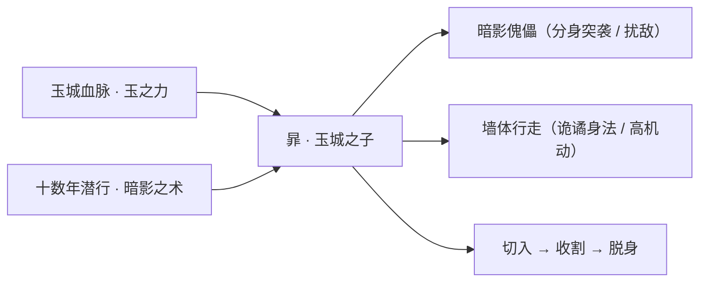
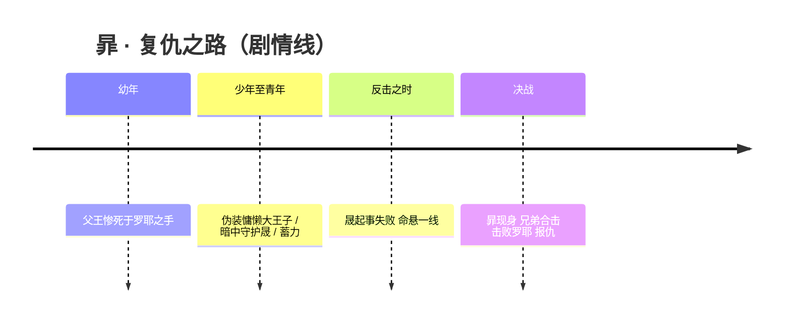
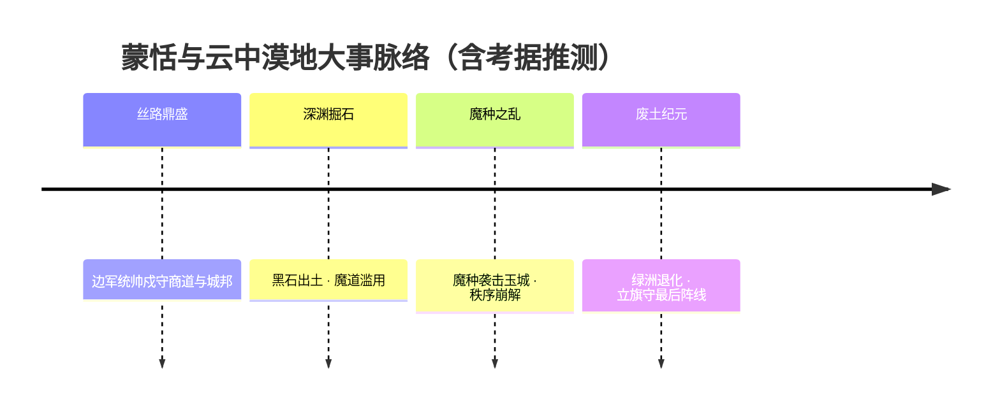
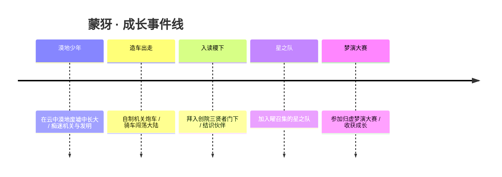
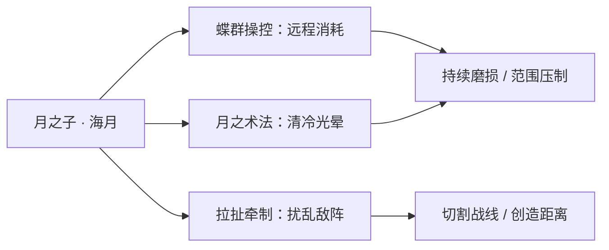
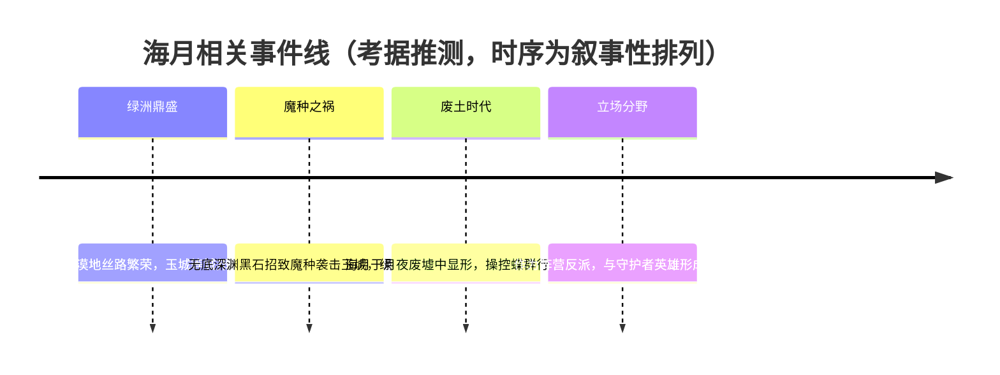
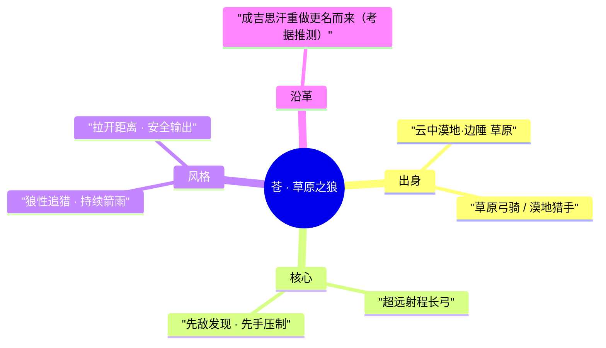
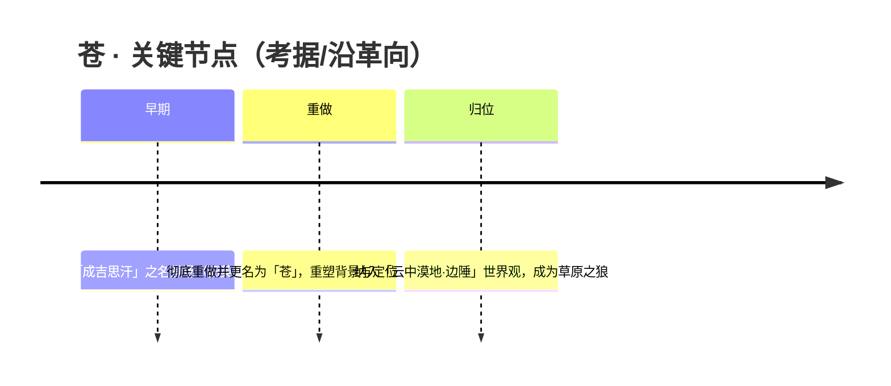

# 云中漠地·边陲 · 英雄图鉴

> 阵营设定见 [云中漠地·边陲 阵营页](../factions/yunzhong-modi.md)。本页收录该阵营 **5** 位英雄的深度小传。

!!! abstract "本页英雄名册"
    | 英雄 | 称号 | 定位 | |
    | --- | --- | --- | --- |
    | [暃](#暃) | 玉城之子 | 刺客/战士 | |
    | [蒙恬](#蒙恬) | 秩序统帅 | 战士 | |
    | [蒙犽](#蒙犽) | 烈炮小子 | 射手 | |
    | [海月](#海月) | 月之子 | 法师 | |
    | [苍](#苍) | 草原之狼 | 射手 | |

---

## 暃

刺客战士

**玉城之子 · 伪作慵懒的玉城大王子，以暗影与玉为刃，在墙垣间穿行复仇。**

| 项目 | 内容 |
| --- | --- |
| 称号 | 玉城之子 |
| 定位 | 刺客 / 战士 |
| 所属 | [云中漠地·边陲](../factions/yunzhong-modi.md) |
| 身份 | 玉城大王子、暗影傀儡操控者 |
| 别称 | 大王子、玩世不恭的逍遥公子（民间通称） |
| 关系 | 晟（玉城二王子，胞弟）、罗耶（杀父仇人，玉城大将军）；同阵营 [蒙恬](#蒙恬)、[蒙犽](#蒙犽)、[海月](#海月)、[苍](#苍) |
| 登场作品 | 英雄背景 CG《玉城之子》（2022 年初上线） |

### 背景故事

暃出身于[云中漠地·边陲](../factions/yunzhong-modi.md)的玉城——这座曾经的丝路绿洲明珠，是文明交汇、商旅云集的贸易重镇，玉石与黄金在城中流转，繁华一时无两。暃身为玉城大王子，本应继承这座城池的荣光，命运却在他年幼时被一柄阴险的刀斩断。

幼年的暃曾亲眼目睹父王在大将军罗耶的毒手下惨死。这一幕成了他生命里抹不去的暗影。罗耶以权谋与武力攫取玉城大权，让昔日的绿洲明珠陷入水深火热，城中百姓在威压下噤声，王室血脉则沦为待宰的猎物。年幼无力的暃明白，正面对抗只会让自己与年幼的弟弟晟一同葬送，于是他选择了一条最隐忍、也最孤独的路——伪装。

多年间，暃把自己活成了一个玩世不恭的逍遥公子。他常在高台之上慵懒地把玩玉石，看似不问世事、只爱自由，懒得去成为任何人期待的模样。一位友人曾为他题诗，在玉城被广为传颂，世人都道这位大王子风流散漫、不堪大任。然而这层惫懒的面具之下，是日夜不熄的复仇之火：他在暗处经营实力、积蓄力量，悄然守护着尚不知真相的弟弟晟，等待向罗耶清算血债的那一刻。

转机在弟弟挺身而出时到来。年轻气盛的二王子晟，不愿再忍受罗耶对玉城的盘剥，决意发起反击。然而少年的计划终究敌不过老练的权臣，晟的反抗失败、命悬一线。就在此时，一直藏于幕后的暃终于卸下伪装、迈步上前——兄弟二人并肩而立，合力击败了大将军罗耶。多年隐忍换来的，不只是杀父之仇得报，更是兄弟之间在生死关头重新确认的血脉羁绊。

暃的故事，是[云中漠地·边陲](../factions/yunzhong-modi.md)由盛转衰大背景下的一道缩影。这片土地曾孕育玉城、千窟城、金庭城等繁华城邦，却在魔道力量滥用、魔种侵蚀的纪元里逐步沦为废土。暃所背负的玉城没落之痛，与整个云中沙之盟的命运彼此呼应——一个王子的复仇，映照的是一座城、乃至一方文明的兴衰起落。（其复仇之后的去向与魔种纪元的关联，官方未作完整交代，此处留白）（考据推测）

### 性格与形象

暃最鲜明的特质，是“伪装”与“真我”之间的强烈张力。表面上，他是个慵懒散漫、玩世不恭的纨绔公子，把玩玉石、追逐自由，对世俗的期待嗤之以鼻；内里，他却是个城府极深、隐忍坚韧的复仇者，将丧父之痛与守护之责深埋心底十数年而不露分毫。这种“以浪荡为甲、以隐忍为刃”的反差，构成了他最迷人的角色底色。

外形上，暃延续了玉城与暗影双重意象。他通体以玉石的青碧与暗影的幽黑为主色调，身姿轻盈矫健，举手投足间带着贵族式的散漫与刺客般的锋利。玉，是他的出身、是玉城的象征，也是他战斗时凝聚的力量；影，则是他十数年伪装生涯的隐喻——藏于光下的暗、藏于笑容下的恨。可在墙体上行走的能力，更让他如同一道贴墙游走的影子，来去无踪，呼应着“暗中守护、伺机而动”的人物内核。

### 战斗风格与能力（设定向）

暃是一名以极高机动性著称的刺客/战士。其核心战斗特征有二：其一是操控**暗影傀儡**作战——他能召唤分身或傀儡协同突袭、扰乱敌人视线，真假难辨之间寻得致命战机；其二是**在墙体上行走**的诡谲身法，令他能挣脱常规地形的束缚，从意想不到的角度切入与脱身，宛如附墙而行的鬼影。

从设定渊源看，暃的力量与玉城血脉、玉石之力相系，刀刃与傀儡皆带玉色光华；而其“暗影”一面，则源自他多年潜行守护、暗处经营的生存方式——把整座城的阴影都化作了自己的武器。这种“玉为锋、影为踪”的组合，使他既能如战士般正面缠斗，又能如刺客般瞬间收割。

### 重要事件 / 剧情参与

- **目睹弑父**：幼年亲眼见证父王死于大将军罗耶之手，复仇的种子就此埋下。
- **伪装蛰伏**：以玩世不恭的逍遥公子形象示人，暗中守护弟弟晟、积蓄力量。
- **兄弟合击罗耶（CG《玉城之子》）**：在弟弟晟反抗失败、命悬一线时挺身而出，兄弟协力击败大将军罗耶，得报杀父之仇。

### 羁绊关系

| 对象 | 关系 | 说明 |
| --- | --- | --- |
| 晟 | 胞弟 | 玉城二王子。暃以慵懒为伪装，多年暗中守护这位不知真相的弟弟；弟弟反抗失败时，暃挺身相助，兄弟合力击败罗耶。（晟暂未作为对战英雄登场）（考据推测） |
| 罗耶 | 杀父仇人 | 玉城大将军，弑君篡权、使玉城陷入水深火热。暃复仇的最终目标，于 CG 中被兄弟二人合力击败。（剧情人物，非对战英雄） |
| [蒙恬](#蒙恬) | 同阵营 | 同属[云中漠地·边陲](../factions/yunzhong-modi.md)的英雄，大漠秩序的守军统帅。（两者直接剧情交集官方未明确）（考据推测） |
| [蒙犽](#蒙犽) | 同阵营 | 云中漠地的发明少年，同处大漠边陲背景。（直接交集待考）（考据推测） |
| [海月](#海月) | 同阵营 | 云中漠地的“月之子”，操控蝶群的法师反派。两者同属大漠边陲叙事谱系。（与暃的直接关系官方未明确）（考据推测） |
| [苍](#苍) | 同阵营 | 草原之狼，同属北疆边陲的远程射手。（直接交集待考）（考据推测） |

### 经典台词

!!! quote "暃 · 台词"
    “逍遥自在，从来都懒得成为谁认可的样子。”（考据推测）

    “影子最听话——因为它从不背叛主人。”（考据推测）

    “玉城的债，我记了很多年。”（考据推测）

### 皮肤故事亮点

- **玉城之子（初始/英雄背景皮肤）**：与同名 CG 共享叙事，集中呈现暃的多重身份——把玩玉石、玩世不恭的慵懒大王子，暗中守护弟弟的兄长，以及以玉为刃的复仇者。该皮肤是理解暃人物内核的核心入口：浪荡是甲，隐忍是刃，玉与影则是其力量与命运的双重象征。

---

## 蒙恬

战士

**秩序统帅 · 持矛立旗、号令边军的指挥型战士，远近结合、攻守一体。**

| 项目 | 内容 |
| --- | --- |
| 称号 | 秩序统帅 |
| 定位 | 战士（指挥型 / 半肉输出） |
| 所属 | [云中漠地·边陲](../factions/yunzhong-modi.md) |
| 身份 | 镇守长城以西的边军统帅、军团旗令的执掌者 |
| 别称 | 边陲铁壁、立旗者（考据推测） |
| 关系 | [蒙犽](#蒙犽)（族系/同宗少年，考据推测） · [暃](#暃)（同处云中漠地的旧地之人） · [苏烈](changcheng.md#苏烈)（长城防线的同道武将） |
| 登场作品 | 《王者荣耀》英雄列表 |

### 背景故事

蒙恬出身于大陆中西部高原的边陲之地——这片被后世称为「云中漠地」的疆域，在他所处的纪元里尚未完全坠入废土。彼时丝路绿洲仍是文明交汇的明珠，[玉城](../factions/yunzhong-modi.md)、千窟城、都护府、金庭城等城邦沿着商道铺展，胡商驼队往来如织，玉石、香料与异域典籍在城市间流转。然而越是繁华的通衢，越需要一道能挡住风沙与刀兵的脊梁。蒙恬便是这道脊梁上最坚硬的一节。

他是从军伍中一步步立功而起的将领，不靠门第，而靠在风沙里磨出来的判断与一次次率队回还的战绩。边陲不比中枢，这里没有连绵的城墙做依托，有的只是望不到尽头的戈壁、随时可能从地平线压来的骑队，以及散落在绿洲与关隘之间、各自为政的守备力量。蒙恬最为人称道的，不是个人的勇武，而是他把这些零散的力量「拢成一支军队」的本事——他所到之处，溃散的队伍会重新结阵，动摇的城防会重新立旗。「秩序统帅」之号，正是来自这种把混乱重新编织成纪律的能力。

蒙恬的命运与这片土地的兴衰紧紧缠在一起。云中漠地的衰败并非天灾，而是人祸与魔祸的合流：曾有人在无底深渊深处挖出黑石，魔道力量被滥用、魔种由此而入，最终酿成袭击玉城的浩劫，丝路绿洲一寸寸退化为黄沙吞没的废土。在这条由盛转衰的长链里，蒙恬所代表的，是「秩序」对「失序」最后、也是最顽强的一次抵抗——当贪欲掘开深渊、当力量挣脱缰绳、当城邦在魔种的爪牙下崩解，他依然把军旗插在该插的地方，告诉退却的人「这里还有阵线」。(关于蒙恬亲历玉城之变的具体细节，属考据推测，游戏未给出完整官方时间线。)

也正因如此，蒙恬的形象与同阵营那位背负玉城没落之痛的少年[暃](#暃)形成了一种隐隐的呼应：一个是亲历家园倾覆、独自在阴影里行走的孤子，一个是试图用纪律与旗令为这片土地撑起最后秩序的统帅。他们站在同一片正在沉没的绿洲之上，却以截然不同的方式回应着同一场灾难。蒙恬的故事，本质上是一则关于「边疆」的寓言——文明的边界从来不是地图上的一条线，而是有人愿意持矛立旗、替身后所有人挡住失序的那一刻。

### 性格与形象

蒙恬性格沉稳、克制，带着久经边塞之人特有的那种「不轻易动声色」的厚重。他话不多，但每一句都像军令一样落地有声；他不喜空谈忠勇，而把忠勇落实为「守住阵线、带回弟兄」的具体之事。在他身上，「秩序」不是冷酷的教条，而是一种近乎温度的责任——正因为见过失序之下生灵如何涂炭，他才把纪律看得比性命更重。

外形上，他以重甲长矛的边军武将形象示人，甲胄厚实、线条肃然，透着戍边将领的沧桑与威严。最具辨识度的象征意象，是他随身执掌的**军团旗**——一面可以「立」于战场之上的大旗。旗，在他这里既是号令的载体，也是精神的图腾：旗在，则阵在；阵在，则秩序在。长矛与军旗的组合，构成了蒙恬最核心的视觉语言：矛是进攻的锋芒，旗是防守与集结的中枢，二者合一，正对应他「远近结合、攻守一体」的统帅气质。

### 战斗风格与能力（设定向）

蒙恬的战斗风格围绕一个核心理念展开——**他不是孤身搏杀的猛将，而是把战场重新组织起来的指挥者**。这在设定上体现为「持矛召唤军团旗」的招式来历：

- **长矛（近战锋芒）**：作为边军统帅的标志兵器，长矛既可贴身突刺、击溃逼近之敌，也可在出招时把攻击范围向前延展，使他在中近距离都能压制对手。矛是他「攻」的一面。
- **军团旗（号令与阵地）**：蒙恬可在战场上「立旗」，将军旗作为阵地的锚点。旗所标定之处，便是他的指挥范围；他能围绕军旗组织远近结合的连续打击，使敌人在「进，则被矛锋所拒；退，则被旗令所及」的两难中受制。旗是他「守」与「控」的一面。
- **远近结合**：阵营设定明确将其概括为「远近结合」的指挥型战士。其招式来历皆服务于此——以矛掌近身、以旗号令并延展威胁范围，让他既能站在前排承担压力，又能对脱离接触的目标保持牵制，体现「攻守一体」的统帅风格。

需要说明的是，以上为基于背景设定与阵营描述的叙事化还原，不涉及具体游戏数值；个别招式的命名与连段细节如与官方表述有出入，以游戏内为准（考据推测）。

### 重要事件 / 剧情参与

蒙恬的剧情主要嵌在「云中漠地由盛转衰」这条大叙事线中。以下为基于阵营设定整理的脉络，部分环节为考据推测：

- **丝路绿洲的戍守期**：在云中漠地仍为贸易繁荣的绿洲明珠时，蒙恬作为边军统帅镇守商道与关隘，是「长城守卫军主要防御对象的来源地」一侧的秩序维护者。
- **黑石之祸与魔种之乱**：无底深渊挖出黑石、魔道力量被滥用，引发魔种袭击玉城。蒙恬所代表的秩序力量，正是在这一连串失序事件中被推上抵抗前线（其亲历细节属考据推测）。
- **绿洲退化为废土**：随着魔种侵蚀蔓延，城邦衰败、绿洲沦为沙漠废土。蒙恬「立旗守阵」的意象，在这一背景下被赋予了「秩序对抗失序」的悲壮底色。

### 羁绊关系

| 对象 | 关系 | 说明 |
| --- | --- | --- |
| [暃](#暃) | 同乡 / 命运呼应 | 同属云中漠地·边陲。暃背负玉城没落之痛、以暗影傀儡孤身行走；蒙恬则以纪律与军旗试图撑起秩序，二人是同一场灾难的两种回应（具体交集属考据推测）。 |
| [蒙犽](#蒙犽) | 同宗少年 / 同阵营 | 同属云中漠地·边陲，姓氏相通。蒙犽是骑机关炮车的发明少年、星之队成员；与蒙恬是否有族系血缘，官方未明确（考据推测）。 |
| [苍](#苍) | 同阵营武人 | 同处云中漠地·边陲的远程武者（草原之狼，超远射程弓骑），与蒙恬的近战指挥风格构成阵营内的远近互补。 |
| [海月](#海月) | 同阵营 / 立场对照 | 海月为云中漠地一线的反派法师，操控蝶群远程消耗；与代表「秩序」的蒙恬在立场上形成对照（关系细节为考据推测）。 |
| [苏烈](changcheng.md#苏烈) | 防线同道 | 长城守卫军以云中漠地为主要防御对象之一；苏烈为长城一侧的不屈铁壁，与边陲一侧立旗守阵的蒙恬，在「守护边界」这一主题上遥相呼应（考据推测）。 |

### 经典台词

!!! quote "旗在，阵在。"
    （考据推测）军旗不倒，阵线就不会崩——这是蒙恬戍边的信条。

!!! quote "秩序，从不会自己降临；它需要有人去守。"
    （考据推测）以「秩序统帅」之名，道出他对纪律与责任的理解。

!!! quote "退一步，是黄沙；那就不退。"
    （考据推测）边陲将领在绝境前的姿态。

---

## 蒙犽

射手

**烈炮小子 · 骑着机关炮车横冲直撞的云中漠地发明少年**

| 项目 | 内容 |
| --- | --- |
| 称号 | 烈炮小子 |
| 定位 | 射手 |
| 所属 | [云中漠地·边陲](../factions/yunzhong-modi.md) |
| 身份 | 云中漠地的少年发明家 / 机关炮车驾驶者 / 星之队成员 |
| 别称 | 烈炮小子、炮车少年（考据推测） |
| 关系 | [曜](changan.md#曜)、[孙膑](jixia.md#孙膑)、[西施](baiyue.md#西施)、[鲁班大师](mojia-jiguan.md#鲁班大师)（星之队）；[蒙恬](#蒙恬)、[暃](#暃)、[苍](#苍)、[海月](#海月)（同阵营） |
| 登场作品 | 庄周「归虚梦演大赛」相关剧情 / 星之队主题动画与皮肤剧情 |

### 背景故事

蒙犽来自长城以西、大陆中西部高原的广袤沙漠——[云中漠地·边陲](../factions/yunzhong-modi.md)。这里曾是丝绸之路上的绿洲明珠，玉城、千窟城、都护府、金庭城等城邦星罗棋布，商队驼铃不绝、文明在此交汇，是大陆上最繁荣的贸易枢纽之一。然而魔种入侵与魔道力量的滥用让这片乐土逐渐衰败：无底深渊中被挖出的黑石引来魔种围攻玉城，绿洲沦为风沙呼啸的废土，往昔的繁华只剩断壁残垣与被黄沙半掩的机关遗迹。

蒙犽便是在这样一片"由盛转衰"的土地上长大的少年。漠地虽已没落，却也是机关造物与发明技艺曾经极度发达之地——废墟里散落着前人留下的齿轮、管线、火药与铁皮残骸。对一个天生好动、脑子里装满奇思妙想的孩子来说，这简直是一座取之不尽的"宝库"。蒙犽从小就喜欢把捡来的零件拆了又装、装了又改，别的孩子怕沙暴、怕废墟里的机关陷阱，他却一头扎进去寻找能用的材料，立志要造出最威风、最响亮的"大家伙"。（考据推测：其姓"蒙"与漠地的[蒙恬](#蒙恬)同属边陲一系，但二人为各自独立的人物，并非直接亲缘关系。）

他最得意的杰作，是一辆由自己一手拼装、改造的机关炮车。这辆炮车既是座驾，也是武器，更是他闯荡天下的"伙伴"。蒙犽不喜欢守着废墟坐困愁城，他把对漠地往日辉煌的向往、对未知世界的好奇，统统化作了脚下隆隆作响的引擎和炮口喷薄而出的火光——他要骑着炮车，横冲直撞地走出这片沙漠，去看看长城以东的广阔天地。

这趟"出走"最终把他带到了稷下学院。作为有教无类、广收门徒的创院三贤者（[老夫子](jixia.md#老夫子)、[庄周](penglai-donghai.md#庄周)、[墨子](mojia-jiguan.md#墨子)一系）座下众弟子之一，蒙犽在稷下结识了一群志同道合的伙伴。也正是在这里，太阳之子[曜](changan.md#曜)以传奇剑仙李白为偶像，召集众人组建了"星之队"，报名参加由南华真仙庄周主办的"归虚梦演大赛"。蒙犽带着他的烈炮，成了这支少年队伍里火力最猛、最爱出风头的一员。对他而言，这不仅是一场比赛，更是一段在友谊、能量与自我认知中不断成长的旅程——一个来自废土的发明少年，终于在更大的舞台上，让自己的炮声被全世界听见。

### 性格与形象

蒙犽是典型的"热血少年"：精力旺盛、心直口快、对一切新奇事物都跃跃欲试，做事风风火火，正如他那辆从不肯安分停下的炮车。他乐观、要强，带着一股不服输的莽劲，越是困难越想往前冲；同时又有发明家特有的钻研劲头，对机关、火药、零件的痴迷近乎执拗。

外形上，他是一身风尘仆仆的漠地少年装束，常与那门比他个头还高的机关炮车形影不离。炮车冒着热气、零件咣当作响，与他张扬外放的性格相得益彰。其象征意象集中在"炮"与"火"上——轰鸣的引擎、喷涌的炮焰、横冲直撞的车轮，既是大漠废土上不肯熄灭的少年意气，也是"以一己之力搅动风云"的莽撞与勇气的化身。

### 战斗风格与能力（设定向）

蒙犽的战斗核心完全围绕他亲手打造的**机关炮车**展开（以下为背景设定描述，非游戏数值）：

- **机关炮车**：他的座驾兼主武器。蒙犽并不依靠传统弓弩，而是骑乘/操控炮车，以连续的火炮轰击作为输出手段，在战场上来去如风、火力凶猛。
- **烈炮轰击**：以炮口喷射的火焰与弹丸进行远程压制，越打越"上头"，气势如同滚雪球般层层叠加。
- **横冲直撞**：依托炮车的机动性突进、转向、调整射击方位，把"莽"与"灵活"结合在一起，是其"烈炮小子"称号的由来。

这些能力都源于云中漠地深厚的机关造物传统，以及他自幼在废墟中翻拣零件、反复试验所积累的发明技艺。可以说，他的力量不是天赋异禀，而是一个少年用胆量、热情与无数次"炸膛"换来的成果。

### 重要事件 / 剧情参与

- **走出云中漠地**：从衰败的大漠废土启程，骑炮车闯荡大陆，最终来到稷下学院求学。
- **拜入稷下门下**：作为创院三贤者广收的众弟子之一，在稷下结识曜、孙膑等伙伴。
- **加入「星之队」**：响应[曜](changan.md#曜)的召集，成为星之队火力担当。
- **归虚梦演大赛**：随星之队参加庄周主办的归虚梦演大赛，在比赛与冒险中收获友谊、能量与对自我的认知。

### 羁绊关系

| 对象 | 关系 | 说明 |
| --- | --- | --- |
| [曜](changan.md#曜) | 战友 / 队长 | 星之队的发起人，以李白为偶像召集众人参赛；蒙犽是队中火力担当。 |
| [孙膑](jixia.md#孙膑) | 战友 / 同窗 | 同为星之队成员，也同属稷下三贤者门下的弟子序列。 |
| [西施](baiyue.md#西施) | 战友 | 星之队成员之一，共同参加归虚梦演大赛。 |
| [鲁班大师](mojia-jiguan.md#鲁班大师) | 战友 / 机关同好 | 星之队成员，与蒙犽同样精于机关造物，志趣相投。 |
| [庄周](penglai-donghai.md#庄周) | 大赛主办 / 师长一系 | 归虚梦演大赛由南华真仙庄周主办；庄周亦属创院三贤者一脉。 |
| [蒙恬](#蒙恬) | 同阵营 / 大漠同乡 | 同为云中漠地·边陲英雄，分别代表漠地的"军阵"与"发明"两面。 |
| [暃](#暃) | 同阵营 | 同属云中漠地，暃背负玉城没落之痛，与漠地由盛转衰的命运相呼应。 |
| [苍](#苍) | 同阵营 / 射手同行 | 同为漠地射手，一为草原弓骑、一为机关炮车，路数迥异。 |
| [海月](#海月) | 同阵营 | 同属云中漠地阵营。 |

> 注：诸葛亮、司马懿、周瑜等虽曾在稷下求学，但其阵营归属仍为蜀/魏/吴，与蒙犽属于"同窗不同阵营"的关系。

### 经典台词

!!! quote "蒙犽 · 语录"
    "都让开！烈炮小子来咯——"（考据推测）

    "我的炮车，可不只是用来跑得快的！"（考据推测）

    "废墟里捡来的零件，一样能轰出最响的动静！"（考据推测）

### 皮肤故事亮点

- **星之队主题**：作为星之队的一员，蒙犽的相关主题皮肤延续了"少年、伙伴、追梦"的基调——炮车被装点得更具青春活力，呼应他与[曜](changan.md#曜)、[孙膑](jixia.md#孙膑)、[西施](baiyue.md#西施)、[鲁班大师](mojia-jiguan.md#鲁班大师)并肩参赛、共同成长的故事。（考据推测：具体皮肤命名与剧情细节以官方为准。）

---

## 海月

法师

**月之子 · 自废墟月光中走出的蝶群操控者，以远程消耗与拉扯撕裂战线的大漠法师**

| 档案 | 内容 |
| --- | --- |
| 称号 | 月之子 |
| 定位 | 法师 |
| 所属 | [云中漠地·边陲](../factions/yunzhong-modi.md) |
| 身份 | 沙漠废土上的术者 / 云中漠地反派阵营核心（考据推测） |
| 别称 | 蝶之主、月之子 |
| 关系 | [暃](#暃)、[蒙恬](#蒙恬)、[蒙犽](#蒙犽)、[苍](#苍) |
| 登场作品 | 《王者荣耀》英雄剧情、云中漠地世界观相关物料 |

### 背景故事

海月出身于[云中漠地·边陲](../factions/yunzhong-modi.md)——那片长城以西、横亘于大陆中西部高原的广袤沙漠。此地曾是丝绸之路上的绿洲明珠，玉城、千窟城、都护府、金庭城等城邦星罗棋布，商队络绎、文明交汇，是几个纪元里最为繁盛的贸易枢纽之一。然而魔种的入侵与魔道力量的滥用让这片土地一夜之间倾覆：无底深渊中被挖出的黑石招致魔种袭击玉城，绿洲枯竭、城邦倾颓，昔日的明珠沦为风沙吞噬的废土。海月，正是在这场漫长崩塌的余烬里成长起来的。

她被称作「月之子」，意味着她与笼罩这片荒漠的清冷月光有着难以割舍的纽带。当烈日退去、白昼的酷热被夜的寒意取代，沙海之上唯有月辉与漫天蝶群相伴——海月便是在这样的时刻显形，循着月光的指引穿行于断壁残垣之间。（考据推测：海月与「月」「蝶」「废墟」三重意象的绑定，源自其所属阵营由绿洲沦为废土的叙事底色，月光既是荒漠唯一的温柔，也是死寂的注脚。）

与同阵营那些背负故土之痛、誓要守护残存秩序的英雄不同，海月在阵营设定中被定位为**云中漠地的反派**。她并非单纯的恶徒，而更像是被废土的崩坏所塑造、又选择以自身方式回应这片土地命运的人——她操控蝶群、远程消耗、不断拉扯与撕裂对手的战线，其战斗方式本身就是一种「不让任何人轻易靠近」的疏离姿态。在魔种侵蚀、魔道横行的纪元背景下，这片土地上的力量往往游走于守护与堕落的灰色地带，海月所掌握的术法亦不例外。（考据推测：其「反派」定位与具体动机细节，官方留白较多，此处依据阵营设定基调推演，不作硬性断言。）

作为长城守卫军主要防御对象来源地的一员，云中漠地的兴衰始终与魔种、与长城防线的对峙紧密交织。海月行走于这片被遗忘的边陲，她的故事是整个阵营由盛转衰、由绿洲化为废墟这一宏大悲剧中的一道剪影。

### 性格与形象

海月给人的第一印象是**清冷、疏离而带着几分神秘**。如同她所栖身的月夜荒漠，她不轻易靠近他人，也不容他人轻易靠近——这种距离感既体现在她的性格中，也直接映射于她「远程消耗、持续拉扯」的战斗风格上。

外形上，她的整体意象围绕「月」与「蝶」展开：清辉色调的装束、随身环绕的蝶群、以及与月相呼应的术法光晕，共同构成了一个游离于废墟之上的幽美形象。蝴蝶在她身边既是装饰，也是武器与延伸——脆弱、美丽，却又能成群结队地蚕食目标。这种「美与侵蚀并存」的象征，恰与云中漠地「丝路明珠沦为魔种废土」的命运形成呼应：曾经的繁华之美，如今化作缓慢消磨一切的荒凉。（考据推测：以上形象解读综合其定位标签与阵营美学，具体造型细节以游戏内呈现为准。）

### 战斗风格与能力（设定向）

海月的力量核心在于**对蝶群的操控**，以及由月之意象衍生的法术。作为法师，她不依靠近身搏杀，而是以远程的方式持续消耗与牵制对手——召唤、聚散、引导蝶群，让它们如月夜下的细密尘埃般缠绕、撕咬目标，造成不间断的损耗。

她的招式风格强调「拉扯」：通过位移、牵引或区域控制不断扰乱敌方阵型，使对手难以贴近、难以集火，从而在持续的消磨中确立优势。这种打法与她疏离的性格、与荒漠中「不让人靠近」的生存法则高度一致。

（说明：以上为基于背景设定的力量来历描述，非游戏内技能数值；具体技能机制与命名以官方为准。）

### 重要事件 / 剧情参与

- **云中漠地的衰败纪元**：海月成长于玉城等城邦因魔种入侵与黑石之祸而倾颓的时代，是这片绿洲化为废土的见证者与参与者之一。
- **作为阵营反派登场**：在云中漠地·边陲的英雄群像中，海月被设定为反派一方的法师角色，与[暃](#暃)、[蒙恬](#蒙恬)等守护者形成立场上的对照。

（注：海月暂未见于稷下学院「师承」与「星之队」等本阵营核心羁绊事件中，其剧情参与以阵营世界观背景为主。）

### 羁绊关系

| 对象 | 关系 | 说明 |
| --- | --- | --- |
| [暃](#暃) | 同阵营 / 立场对照 | 同为云中漠地·边陲英雄；暃背负玉城没落之痛、立志守护，海月则被定位为阵营反派，二者形成守护与堕落的叙事对照。（考据推测） |
| [蒙恬](#蒙恬) | 同阵营 | 大秦边军指挥型战士，代表云中漠地的秩序与防御力量，与海月所处的废土立场相对。 |
| [蒙犽](#蒙犽) | 同阵营 | 云中漠地的发明少年、星之队成员，与海月同属边陲，但年龄、立场与气质迥异。 |
| [苍](#苍) | 同阵营 | 草原弓骑射手，同为云中漠地·边陲一员，共享大漠边陲的地域背景。 |

（说明：上述关系均依据阵营 relatedRelationships 与同阵营英雄设定整理；海月未出现在「稷下师承」与「星之队战友」两组核心羁绊名单中，故此处以地域同阵营关系为主，立场对照部分标注为考据推测。）

### 经典台词

!!! quote "海月 · 台词集（部分为考据推测）"
    「月光所及之处，皆是我的领地。」（考据推测）

    「蝶翼很轻，足以将你层层缠绕。」（考据推测）

    「废墟之上，唯有月色作伴。」（考据推测）

---

## 苍

射手

**草原之狼 · 驰骋大漠风沙、一箭可贯千里之外的草原弓骑射手**

| 档案项 | 内容 |
| --- | --- |
| 称号 | 草原之狼 |
| 定位 | 射手（远程持续输出 / 超远射程） |
| 所属 | [云中漠地·边陲](../factions/yunzhong-modi.md) |
| 身份 | 草原游骑、漠地猎手 |
| 别称 | 草原之狼；「苍狼」（考据推测，取草原民族「苍狼白鹿」图腾之意） |
| 关系 | 同阵营 [蒙犽](#蒙犽)、[蒙恬](#蒙恬)、[海月](#海月)、[暃](#暃)；同为弓系射手可参照 [百里守约](changcheng.md#百里守约)、[戈娅](changcheng.md#戈娅) |
| 前身 / 沿革 | 由初代英雄「成吉思汗」整体重做、重塑背景并更名而来（考据推测） |
| 登场作品 | 《王者荣耀》本传英雄（重做上线） |

### 背景故事

苍并非凭空诞生的全新角色，而是《王者荣耀》早期英雄「成吉思汗」经历彻底重做之后，被剥离掉真实历史人物绑定、重塑世界观背景并正式更名而来的射手（考据推测）。这一改动让他从「历史名将」的符号，转变为一个真正扎根于云中漠地世界观的虚构人物——一头在长城以西、漠地风沙中长大的草原之狼。

他的故乡，是 [云中漠地·边陲](../factions/yunzhong-modi.md) 那片曾经辉煌的土地。这里地处长城以西、大陆中西部高原的沙漠地带，曾是丝绸之路上的绿洲明珠，商队往来、文明交汇，孕育出玉城、千窟城、都护府、金庭城等繁华城邦。然而无底深渊中被挖出的黑石引来了魔种，魔道力量的滥用更让绿洲一步步退化为荒凉废土。苍所成长的草原与沙海，正是这场漫长衰败的见证之地（考据推测）。

在这片广袤而苍茫的土地上，苍以最古老的方式生存：骑马、张弓、追逐猎物的踪迹，把每一缕风、每一道沙丘的起伏都读进眼底。草原民族「逐水草而居」的迁徙本能，锻造出他超乎常人的远视与耐性——他能在猎物尚未察觉之前，于极远的距离上张弓搭箭，一发命中。这种「先敌发现、先敌出手」的本能，后来成为他作为射手最鲜明的标签：超远的射程，让他在还未踏入对手攻击范围时，箭矢便已离弦。

边陲之地民风彪悍，既要面对自然的酷烈，也要警惕魔种侵蚀的阴影与各方势力的纷争。在这样的环境里，苍学会了像狼一样思考：不轻易暴露自己，耐心潜行、寻找时机，而一旦锁定目标，便以连绵不绝的箭雨穷追猛打，绝不松口。他的动机朴素而坚定——守护脚下这片养育他的草原，不让它继续沉沦于风沙与魔患之中（考据推测）。

需要说明的是，作为重做更名而来的角色，苍的官方深度背景文本相对克制，许多设定更多是通过其技能机制（超远射程、草原弓骑）与定位反向勾勒出来的。本篇在尊重已知设定的前提下，对其成长环境与动机做了合乎世界观的叙述性补全，凡推断之处均已标注「(考据推测)」。

### 性格与形象

苍的性格如其称号——「草原之狼」：沉静、警觉、坚韧而独立。他不喜张扬，惯于隐于风沙之后冷静观察，把话语让给手中的弓。一旦认定目标，便如孤狼锁定猎物，耐心、专注、势在必得。这份「狼性」并非凶残，而是一种源自草原生存法则的执着与忠诚。

外形上，他是典型的草原弓骑形象（考据推测）：身披适于骑射的轻装劲服，肩背长弓与满壶箭矢，常以骏马为伴，行走于沙丘与残破绿洲之间。象征意象方面，「狼」代表他的本能、耐性与对故土的守护；「弓」代表他超远的视野与一击致命的精准；而漫漫风沙与苍茫草原，则共同构成他「苍」之一字的底色——既是天地的辽阔苍茫，也是历经磨难后的沧桑与坚毅。

### 战斗风格与能力（设定向）

苍的战斗哲学可以浓缩为一个字：**远**。作为草原弓骑出身的射手，他最核心的力量来自一张可以将箭矢射出极远距离的长弓——这让他能在对手尚未进入攻击范围时便先行打击，占据「先手」与「安全距离」的双重优势（基于其超远射程定位描述）。

- **草原长弓 · 超远射程**：苍的招牌能力是远超寻常射手的攻击距离。他像在草原上狙猎远方猎物一样，于战场边缘张弓，箭矢可贯穿很长的一段距离命中目标，使他成为擅长「拉开距离、消耗压制」的远程输出（基于定位描述，考据推测）。
- **狼之追猎 · 持续箭雨**：一旦锁定目标，他便以连绵箭矢穷追不舍，如孤狼咬定猎物不放，强调持续不断的远程压制与收割（考据推测）。
- **骑射本能 · 风沙之眼**：来自草原迁徙生活磨练出的洞察与预判，让他善于在混战中捕捉远处的破绽，先敌发现、先敌出手（考据推测）。

> 说明：以上为基于角色定位与世界观的「设定向」描述，非游戏内具体数值或技能名，具体技能机制请以游戏内为准。

### 重要事件 / 剧情参与

苍作为由旧英雄重做更名而来的角色，其登场本身便是一次重要的「世界观归位」事件——从真实历史人物的符号，转化为云中漠地体系下的虚构守护者（考据推测）。

- 由初代英雄「成吉思汗」整体重做、改名而来，并随之获得新的背景设定与定位归属（考据推测）。
- 作为 [云中漠地·边陲](../factions/yunzhong-modi.md) 阵营成员，其叙事与该阵营「丝路绿洲 → 魔种侵蚀的沙漠废土」的兴衰主题相呼应（考据推测）。
- 具体的剧情动画、活动登场情况，请以官方资料为准；本篇暂不臆造未确证的事件。

### 羁绊关系

| 对象 | 关系 | 说明 |
| --- | --- | --- |
| [蒙犽](#蒙犽) | 同阵营 / 草原同乡 | 同属云中漠地·边陲，蒙犽是漠地的发明少年（亦为星之队成员），与苍同为本阵营射手，可视为同乡战友（考据推测）。 |
| [蒙恬](#蒙恬) | 同阵营 / 边军 | 蒙恬为大秦边军指挥型战士，与苍同守边陲，立场相近（考据推测）。 |
| [海月](#海月) | 同阵营 / 立场对立 | 海月是云中漠地的大反派，与守护草原的苍在动机与立场上形成潜在对立（考据推测）。 |
| [暃](#暃) | 同阵营 / 共历兴衰 | 暃背负玉城没落之痛，与苍同为见证漠地由盛转衰的边陲之人（考据推测）。 |
| [百里守约](changcheng.md#百里守约) / [戈娅](changcheng.md#戈娅) | 同类（弓系射手 / 北疆边陲） | 同属「北疆 · 边陲」大区的远程射手，可作风格与定位的横向参照。 |

> 注：苍因背景文本较为克制，与其余英雄之间暂无官方明确剧情羁绊，上表关系多为基于同阵营设定的合理推断，已标注「(考据推测)」。

### 经典台词

!!! quote "草原之狼 · 苍"
    "风从草原来，箭往远方去。"（考据推测）

    "猎物未察觉之时，胜负已定。"（考据推测）

    "狼，从不松口。"（考据推测）

> 上述台词为依据角色形象与定位所作的考据性推测，并非逐字引用官方语音，具体以游戏内实际配音为准。

!!! tip "继续探索"
    返回 [云中漠地·边陲 阵营页](../factions/yunzhong-modi.md) · 浏览 [全英雄图鉴](index.md) · 查看 [人物关系网](../relationships/index.md)