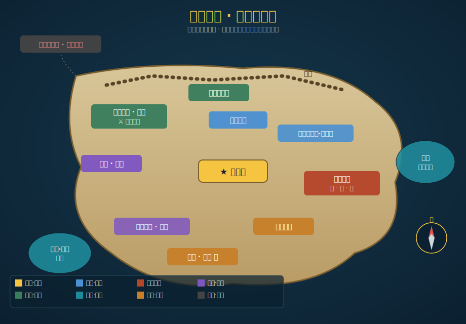
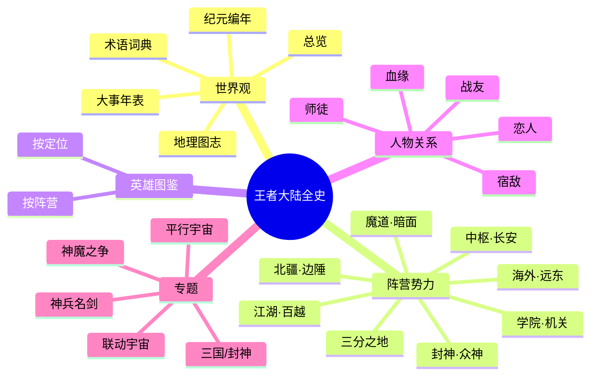

# 王者荣耀 · 王者大陆全史

世界观剧情 · 阵营势力 · 英雄故事 · 人物关系 —— 图文 · 表格 · 关系网，越详细越好

[开始阅读世界观 :material-arrow-right:](worldview/overview.md){ .md-button .md-button--primary }
[浏览全英雄图鉴 :material-account-group:](heroes/index.md){ .md-button }

!!! abstract "这是什么？"
    这是一部为《王者荣耀》玩家与世界观爱好者整理的**百科式全史**。它把散落在英雄背景故事、官方世界观短片、剧情活动与平行宇宙中的设定，系统地编织成一棵可检索、可点击、可深读的「**生命之树**」——从远未来的旧地球文明，到方舟降临、诸神之战，再到群雄逐鹿的英雄时代。

## 📊 一览

-   :material-earth:{ .lg .middle } **17 大阵营**

    ---

    从中枢长安到倒悬天之外，覆盖王者大陆的每一股势力。

    [:octicons-arrow-right-24: 阵营总览](factions/index.md)

-   :material-account-group:{ .lg .middle } **120+ 英雄**

    ---

    每位英雄都有详尽的背景故事、性格、能力与羁绊。

    [:octicons-arrow-right-24: 英雄图鉴](heroes/index.md)

-   :material-timeline-clock:{ .lg .middle } **8 大纪元**

    ---

    从起源时代到《王者荣耀世界》主线的完整编年。

    [:octicons-arrow-right-24: 纪元编年](worldview/eras.md)

-   :material-heart-multiple:{ .lg .middle } **38+ 组关系**

    ---

    恋人、血缘、师徒、宿敌、战友——一张大陆的羁绊之网。

    [:octicons-arrow-right-24: 人物关系](relationships/index.md)

## 🧭 新手路线

如果你是第一次了解王者世界，建议按下面的顺序阅读：

-   :material-numeric-1-circle:{ .lg .middle } **看懂底层设定**

    ---

    先读 [世界观总览](worldview/overview.md)，理解「科幻底子、神话皮相」的大框架。

-   :material-numeric-2-circle:{ .lg .middle } **理清来龙去脉**

    ---

    再读 [纪元编年](worldview/eras.md) 与 [大事年表](worldview/timeline.md)，把握时间线。

-   :material-numeric-3-circle:{ .lg .middle } **走进大陆**

    ---

    对照 [地理图志](worldview/map.md) 与 [阵营总览](factions/index.md)，认识各方势力。

-   :material-numeric-4-circle:{ .lg .middle } **深入人物**

    ---

    最后在 [英雄图鉴](heroes/index.md) 与 [人物关系](relationships/index.md) 中尽情遨游。

## 🗺️ 王者大陆

王者大陆以**长安城**为中枢，环列稷下学院、三分之地、镐京、长城、云中漠地、蓬莱东海等区域，主战场「**王者峡谷**」则坐落于上古能量最盛的云中高原。详见 [地理图志](worldview/map.md)。

## 📚 全部栏目

!!! tip "阅读提示"
    - 站内大量使用**表格、Mermaid 关系图、提示框与折叠面板**——点开折叠块（`???`）可看到更多考据细节。
    - 右上角可切换**深色/浅色模式**，顶栏可**全文搜索**，点击图片可**放大**。
    - 涉及不确定的二设/同人内容均标注「（考据推测）」；版权与来源见 [资料来源说明](about/sources.md)。

---

!!! quote ""
    “在王者的世界里，每一个名字都曾改写过历史。”
