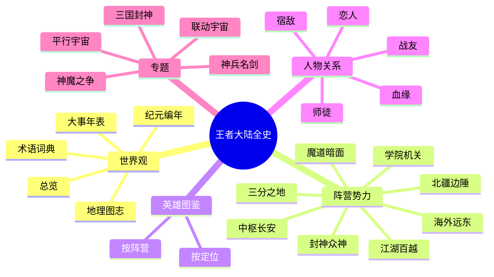

## 这是什么？

这是一部为《王者荣耀》玩家与世界观爱好者整理的 **百科式全史**。它把散落在英雄背景故事、官方世界观短片、剧情活动与平行宇宙中的设定，系统地编织成一棵可检索、可点击、可深读的「**生命之树**」——从远未来的旧地球文明，到方舟降临、诸神之战，再到群雄逐鹿的英雄时代。

## 🧭 新手阅读路线

<a class="hok-card" href="/worldview/overview">① 看懂底层设定理解「科幻底子、神话皮相」的大框架。</a>
<a class="hok-card" href="/worldview/eras">② 理清来龙去脉沿纪元编年与大事年表把握时间线。</a>
<a class="hok-card" href="/worldview/map">③ 走进大陆对照地理图志与阵营总览，认识各方势力。</a>
<a class="hok-card" href="/heroes/">④ 深入人物在英雄图鉴与人物关系中尽情遨游。</a>

## 🗺️ 王者大陆

王者大陆以 **长安城** 为中枢，环列稷下学院、三分之地、镐京、长城、云中漠地、蓬莱东海等区域，主战场「**王者峡谷**」坐落于上古能量最盛的云中高原。详见 [地理图志](/worldview/map)。

## 📚 全部栏目

::: tip 阅读提示
- 站内大量使用 **表格、Mermaid 关系图、提示框与折叠面板**——点开折叠块（`详情`）可看到更多考据细节。
- 右上角可切换 **深色/浅色模式**，顶栏可 **全文搜索**。
- 涉及不确定的二设/同人内容均标注「（考据推测）」；版权与来源见 [资料来源说明](/about/sources)。
:::

::: quote
“在王者的世界里，每一个名字都曾改写过历史。”
:::
