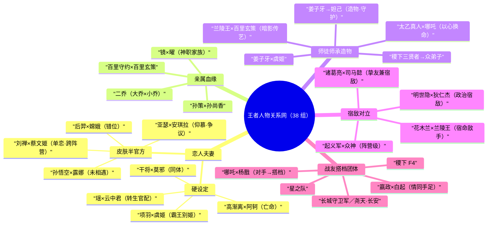

# 人物关系 · 总览

> 王者大陆的英雄从不孤立存在。一柄剑里封着两条相爱的命，一面镜中映着护持的兄妹，一座学院走出彼此欣赏又终成宿敌的同窗，一段长城下的对峙生出说不清道不明的情愫。本页是整张「人物关系网」的总入口——我们把散落在各英雄背景故事、皮肤剧情、官方关系图与微博考据中的 **38 组核心羁绊** 汇于一处，先看全局脉络，再按 **恋人 / 亲属 / 师徒 / 宿敌 / 战友** 五条主线分章细读。

::: info 本页数据口径
本页与各子页严格基于本仓库整理的关系数据（共 **38 条关系记录**），并参照英雄目录、阵营目录交叉链接。所引设定分为三个严谨度层级：**官方背景故事 / 官方关系图与微博认证（硬设定）**、**皮肤 CP 与活动认证（半官方）**、**玩家同人向（弱认证）**。每一条都会在对应子页标注其来源与严谨度，避免把皮肤浪漫化当作主线硬设定。不确定处一律以「(考据推测)」标注。
:::

---

## 一、全局关系网

下图选取 **十余组最具代表性** 的羁绊，用不同箭头与标签区分关系类型：实线粗箭头为 **恋人/夫妻**，虚线为 **亲属**，点线为 **师徒/师承**，双向粗箭头为 **宿敌/敌手**，普通实线为 **战友/搭档**。为控制规模，阵营级大群像（长城守卫军、尧天、起义军等）仅以代表节点示意，完整名单见下方各章。

```mermaid
graph TD
    GAN["干将"] ===|"同体夫妻"| MO["莫邪"]
    XIANGYU["项羽(西楚霸王)"] ===|"霸王别姬"| YUJI["虞姬(森之风灵)"]
    YAO["瑶(森之风灵)"] ===|"转生官配"| YUNZHONG["云中君"]
    GAO["高渐离"] ===|"亡命恋人"| AKE["阿轲(信念之刃)"]
    SUNCE["孙策"] ===|"夫妻"| DAQIAO["大乔"]
    ZHOUYU["周瑜"] ===|"夫妻"| XIAOQIAO["小乔"]
    LIUBEI["刘备"] ===|"联姻"| SHANGXIANG["孙尚香"]
    LVBU["吕布"] ===|"演义恋人"| DIAOCHAN["貂蝉"]

    DAQIAO -. "姐妹" .- XIAOQIAO
    SUNCE -. "兄妹" .- SHANGXIANG
    JING["镜(破镜之刃)"] -. "护持兄妹" .- YAOO["曜(太阳之子)"]
    SHOUYUE["百里守约"] -. "亲兄弟" .- XUANCE["百里玄策"]

    JIANGZIYA["姜子牙"] -.->|"师父"| YUJI
    JIANGZIYA -.->|"造物者"| DAJI["妲己(魅力之狐)"]
    TAIYI["太乙真人"] -.->|"师父/挚友"| NEZHA["哪吒"]
    LANLING["兰陵王"] -.->|"师父"| XUANCE

    ZHUGE["诸葛亮(卧龙)"] <==>|"挚友兼宿敌"| SIMA["司马懿"]
    LANLING <==>|"宿命敌手"| MULAN["花木兰"]
    MINGSHIYIN["明世隐"] <==>|"政治宿敌"| DIRENJIE["狄仁杰"]

    NEZHA ---|"生死搭档"| YANGJIAN["杨戬"]
    YINGZHENG["嬴政"] ---|"情同手足"| BAIQI["白起(人间兵器)"]
    LIBAI["李白(青莲剑仙)"] ---|"世交挚友"| HANXIN["韩信"]
    YAOO ---|"星之队"| SUNBIN["孙膑"]

    classDef lover fill:#ffe1ec,stroke:#d6336c,color:#7a1f3d;
    classDef kin fill:#e3f2ff,stroke:#1971c2,color:#0b3a66;
    classDef master fill:#fff4d6,stroke:#e8a13a,color:#6b4a06;
    classDef rival fill:#f3e0ff,stroke:#8e44ad,color:#4a1d63;
    classDef ally fill:#e3fcef,stroke:#2f9e44,color:#14532d;

    class GAN,MO,XIANGYU,YUJI,YAO,YUNZHONG,GAO,AKE,SUNCE,DAQIAO,ZHOUYU,XIAOQIAO,LIUBEI,SHANGXIANG,LVBU,DIAOCHAN lover;
    class JING,YAOO,SHOUYUE,XUANCE kin;
    class JIANGZIYA,DAJI,TAIYI,NEZHA,LANLING master;
    class ZHUGE,SIMA,MULAN,MINGSHIYIN,DIRENJIE rival;
    class YANGJIAN,YINGZHENG,BAIQI,LIBAI,HANXIN,SUNBIN ally;
```

::: tip 如何读这张图
同一个英雄可能在多种关系里反复出现——这正是王者关系网最迷人之处。例如 [虞姬](../heroes/haojing-fengshen.md#虞姬) 既是 [项羽](../heroes/haojing-fengshen.md#项羽) 的恋人，又是 [姜子牙](../heroes/haojing-fengshen.md#姜子牙) 的徒弟；[百里玄策](../heroes/changcheng.md#百里玄策) 既是 [百里守约](../heroes/changcheng.md#百里守约) 的亲弟弟，又是 [兰陵王](../heroes/modao-shadow-abyss.md#兰陵王) 的徒弟；[曜](../heroes/changan.md#曜) 既是 [镜](../heroes/changan.md#镜) 的弟弟，又是「星之队」的战友与稷下学子。完整交织请看各分章。
:::

---

## 二、关系类型统计

将 38 组关系按 **恋人 / 亲属 / 师徒 / 宿敌 / 战友** 五大主线归并（少数兼具多重属性者按其「最主要定位」归类，并在子页双向标注），数量与代表组合如下：

| 类型 | 数量 | 代表组合 | 严谨度概览 |
| :--- | :---: | :--- | :--- |
| **恋人 / 夫妻** | 13 | 干将×莫邪、项羽×虞姬、孙策×大乔、周瑜×小乔、瑶×云中君、高渐离×阿轲 | 含官方背景、官配、皮肤 CP、单恋等多档 |
| **亲属（兄弟/姐妹/家族）** | 4 | 百里守约×玄策、大乔×小乔、孙策×孙尚香、镜×曜 | 多为史实/官方原创硬设定 |
| **师徒 / 师承 / 造物** | 7 | 太乙×哪吒、姜子牙×虞姬、兰陵王×玄策、明世隐×弈星、稷下三贤者×众弟子 | 以官方背景故事为主 |
| **宿敌 / 对立** | 6 | 诸葛亮×司马懿、明世隐×狄仁杰、墨子×鲁班大师、孙悟空阵营×众神 | 含个人宿敌与阵营级对立 |
| **战友 / 搭档 / 团体** | 8 | 哪吒×杨戬、嬴政×白起、星之队、长城守卫军、尧天·长安、稷下 F4 | 含双人搭档与大型群像 |

::: info 归类说明
总数 38 条按主要属性归并为 13+4+7+6+8 = 38。但许多关系是 **复合型**：

- **项羽×虞姬** 既是恋人也是师徒交织（虞姬师承姜子牙），主归「恋人」，「师徒」线另收 [姜子牙×虞姬](mentor.md)。
- **诸葛亮×司马懿** 既是稷下同窗挚友（战友底色）又是官方明确宿敌，主归「宿敌」，并在 [战友页](squad.md) 的「稷下 F4」中再现。
- **花木兰×兰陵王** 官方更多以「宿命/敌手」定位、恋人色彩半官方，主归「宿敌」，恋人色彩另在 [恋人页](../relationships/lovers.md) 提示。

因此各子页之间存在 **有意的交叉引用**，请结合阅读。
:::

---

## 三、38 组关系全表

为做到「不漏一条」，下表把本仓库整理的 **全部 38 组关系** 一次列尽（含全局图未画出的次要羁绊），按五大主线排序。**严谨度** 列以四档标注：**硬**（官方背景故事 / 官方关系图 / 游戏机制认证）、**半**（皮肤 CP / CP 活动 / 微博认证）、**弱**（玩家同人向、官方未坐实）、**叙**（史实/演义沿用且游戏未深入展开）。详细逐条考据请进入对应子页。

| # | 主线 | 关系 | 类型（数据原文） | 严谨度 |
| :-: | :-- | :-- | :-- | :-: |
| 1 | 恋人 | [干将莫邪](../heroes/jixia.md#干将莫邪)（干将×莫邪） | 夫妻 / 同体 | 硬 |
| 2 | 恋人 | [项羽](../heroes/haojing-fengshen.md#项羽)×[虞姬](../heroes/haojing-fengshen.md#虞姬) | 恋人（官配＋师徒交织） | 硬 |
| 3 | 恋人 | [孙策](../heroes/sanfen-wu.md#孙策)×[大乔](../heroes/sanfen-wu.md#大乔) | 夫妻 | 硬／叙 |
| 4 | 恋人 | [周瑜](../heroes/sanfen-wu.md#周瑜)×[小乔](../heroes/sanfen-wu.md#小乔) | 夫妻 | 硬／叙 |
| 5 | 恋人 | [吕布](../heroes/modao-shadow-abyss.md#吕布)×[貂蝉](../heroes/changan.md#貂蝉) | 恋人（演义＋CP 活动） | 半／叙 |
| 6 | 恋人 | [刘备](../heroes/sanfen-shu.md#刘备)×[孙尚香](../heroes/sanfen-wu.md#孙尚香) | 恋人（联姻） | 叙 |
| 7 | 恋人 | [瑶](../heroes/baiyue.md#瑶)×[云中君](../heroes/baiyue.md#云中君) | 恋人（强官配·转生） | 硬 |
| 8 | 恋人 | [高渐离](../heroes/jixia.md#高渐离)×[阿轲](../heroes/jianghu-xiake.md#阿轲) | 恋人（官方背景） | 硬 |
| 9 | 恋人 | [廉颇](../heroes/haojing-fengshen.md#廉颇)×[钟无艳](../heroes/jixia.md#钟无艳) | 恋人（官配·低存在感） | 半 |
| 10 | 恋人 | [后羿](../heroes/shanggu-shenhua.md#后羿)×[嫦娥](../heroes/shanggu-shenhua.md#嫦娥) | 皮肤 CP（剧情时间错位） | 半 |
| 11 | 恋人 | [孙悟空](../heroes/shanggu-shenhua.md#孙悟空)×[露娜](../heroes/changan.md#露娜) | 皮肤 CP（主线未相遇） | 半 |
| 12 | 恋人 | [亚瑟](../heroes/changan.md#亚瑟)×[安琪拉](../heroes/jixia.md#安琪拉) | 皮肤 CP（仰慕向，存争议） | 半／弱 |
| 13 | 恋人 | [刘禅](../heroes/sanfen-shu.md#刘禅)×[蔡文姬](../heroes/sanfen-wei.md#蔡文姬) | 单恋＋皮肤 CP（跨阵营） | 半 |
| 14 | 亲属 | [百里守约](../heroes/changcheng.md#百里守约)×[百里玄策](../heroes/changcheng.md#百里玄策) | 亲兄弟 | 硬 |
| 15 | 亲属 | [大乔](../heroes/sanfen-wu.md#大乔)×[小乔](../heroes/sanfen-wu.md#小乔) | 亲姐妹 | 硬／叙 |
| 16 | 亲属 | [孙策](../heroes/sanfen-wu.md#孙策)×[孙尚香](../heroes/sanfen-wu.md#孙尚香) | 亲兄妹 | 硬／叙 |
| 17 | 亲属 | [镜](../heroes/changan.md#镜)×[曜](../heroes/changan.md#曜) | 姐弟／兄妹（神职家族） | 硬 |
| 18 | 师徒 | [太乙真人](../heroes/haojing-fengshen.md#太乙真人)×[哪吒](../heroes/haojing-fengshen.md#哪吒) | 师徒 | 硬 |
| 19 | 师徒 | [兰陵王](../heroes/modao-shadow-abyss.md#兰陵王)×[百里玄策](../heroes/changcheng.md#百里玄策) | 师徒 | 硬 |
| 20 | 师徒 | [姜子牙](../heroes/haojing-fengshen.md#姜子牙)×[虞姬](../heroes/haojing-fengshen.md#虞姬) | 师徒 | 硬 |
| 21 | 师徒 | [姜子牙](../heroes/haojing-fengshen.md#姜子牙)×[妲己](../heroes/haojing-fengshen.md#妲己) | 创造者／守护者 | 硬（注意版本演变） |
| 22 | 师徒 | 稷下三贤者（[老夫子](../heroes/jixia.md#老夫子)·[庄周](../heroes/penglai-donghai.md#庄周)·[墨子](../heroes/mojia-jiguan.md#墨子)）×众弟子 | 师承（创院三贤者→众弟子） | 硬 |
| 23 | 师徒 | [诸葛亮](../heroes/sanfen-shu.md#诸葛亮)×[元歌](../heroes/sanfen-shu.md#元歌) | 师兄弟（稷下同窗） | 硬 |
| 24 | 师徒 | 明世隐×[弈星](../heroes/jixia.md#弈星) | 导师—学生 | 硬 |
| 25 | 宿敌 | [诸葛亮](../heroes/sanfen-shu.md#诸葛亮)×[司马懿](../heroes/sanfen-wei.md#司马懿) | 挚友兼宿敌 | 硬 |
| 26 | 宿敌 | [花木兰](../heroes/changan.md#花木兰)×[兰陵王](../heroes/modao-shadow-abyss.md#兰陵王) | 宿命／敌手（恋人色彩半官方） | 硬（宿命）／半（恋人） |
| 27 | 宿敌 | 明世隐×[狄仁杰](../heroes/changan.md#狄仁杰) | 对立阵营／政治宿敌 | 硬 |
| 28 | 宿敌 | [狄仁杰](../heroes/changan.md#狄仁杰)×[李白](../heroes/changan.md#李白) | 追捕—逃亡 | 硬 |
| 29 | 宿敌 | [孙悟空](../heroes/shanggu-shenhua.md#孙悟空)起义×众神（[帝俊](../heroes/haojing-fengshen.md#帝俊)·[女娲](../heroes/shanggu-shenhua.md#女娲)） | 起义—镇压（阵营级对立） | 硬 |
| 30 | 宿敌 | [墨子](../heroes/mojia-jiguan.md#墨子)×[鲁班大师](../heroes/mojia-jiguan.md#鲁班大师) | 机关术对照／宿敌 | 弱（细节较少，考据推测） |
| 31 | 战友 | [嬴政](../heroes/changan.md#嬴政)×[白起](../heroes/jixia.md#白起) | 君臣／情同手足 | 硬 |
| 32 | 战友 | [哪吒](../heroes/haojing-fengshen.md#哪吒)×[杨戬](../heroes/haojing-fengshen.md#杨戬) | 生死战友／搭档 | 硬 |
| 33 | 战友 | [李白](../heroes/changan.md#李白)×[韩信](../heroes/jianghu-xiake.md#韩信) | 世交挚友（恋人定性未坐实） | 半（世交）／弱（CP） |
| 34 | 战友 | 星之队（[曜](../heroes/changan.md#曜)·[蒙犽](../heroes/yunzhong-modi.md#蒙犽)·[孙膑](../heroes/jixia.md#孙膑)·[西施](../heroes/baiyue.md#西施)·[鲁班大师](../heroes/mojia-jiguan.md#鲁班大师)） | 战友／搭档（星之队） | 硬 |
| 35 | 战友 | 稷下 F4（[诸葛亮](../heroes/sanfen-shu.md#诸葛亮)·[周瑜](../heroes/sanfen-wu.md#周瑜)·[元歌](../heroes/sanfen-shu.md#元歌)·[司马懿](../heroes/sanfen-wei.md#司马懿)） | 同窗团体（稷下 F4） | 硬 |
| 36 | 战友 | [长城守卫军](../factions/changcheng.md)群像（[苏烈](../heroes/changcheng.md#苏烈)·[李信](../heroes/changan.md#李信)·[铠](../heroes/changan.md#铠)等） | 同阵营战友（长城守卫军） | 硬 |
| 37 | 战友 | 尧天·长安（明世隐·[公孙离](../heroes/changan.md#公孙离)·[弈星](../heroes/jixia.md#弈星)·[杨玉环](../heroes/changan.md#杨玉环)·[裴擒虎](../heroes/baiyue.md#裴擒虎)） | 同阵营战友（尧天·长安） | 硬 |
| 38 | 战友 | 长安女帝势力（[武则天](../heroes/changan.md#武则天)·[上官婉儿](../heroes/changan.md#上官婉儿)·[狄仁杰](../heroes/changan.md#狄仁杰)·[李元芳](../heroes/changan.md#李元芳)） | 主仆／君臣式羁绊 | 硬 |

::: warning 关于「明世隐」无独立锚点
[尧天](../factions/changan.md) 首领 **明世隐** 在关系数据中多次出现，但暂未收录为独立英雄页节点，故上表对其只作文本表述、不挂链接，避免产生死链。其事迹可在 [宿敌页](rivalry.md) 与 [战友页](squad.md) 的尧天章节查阅。（考据推测：其阵营归属为长安·尧天）
:::

下面用一张 **思维导图** 把「五大主线 → 代表羁绊」的层级关系收束成一图，便于速记：

::: tip 「枢纽人物」——出现在最多关系里的英雄
有几位英雄是整张网的「枢纽节点」，跨多条主线反复登场，是串联剧情的关键：

| 枢纽英雄 | 涉及关系（择要） | 横跨主线 |
| :-- | :-- | :-- |
| [姜子牙](../heroes/haojing-fengshen.md#姜子牙) | 虞姬之师 · 妲己之造物者 | 师徒 ×2 |
| [虞姬](../heroes/haojing-fengshen.md#虞姬) | 项羽之恋人 · 姜子牙之徒 | 恋人 ＋ 师徒 |
| [百里玄策](../heroes/changcheng.md#百里玄策) | 守约之弟 · 兰陵王之徒 · 长城守卫军 | 亲属 ＋ 师徒 ＋ 战友 |
| [曜](../heroes/changan.md#曜) | 镜之弟 · 星之队队长 · 稷下学子 | 亲属 ＋ 战友 ＋ 师承 |
| [诸葛亮](../heroes/sanfen-shu.md#诸葛亮) | 司马懿之挚友兼宿敌 · 元歌之师兄 · 稷下 F4 | 宿敌 ＋ 师徒 ＋ 战友 |
| [兰陵王](../heroes/modao-shadow-abyss.md#兰陵王) | 玄策之师 · 花木兰之宿命敌手 | 师徒 ＋ 宿敌（兼暧昧恋人色彩） |
| [明世隐](../factions/changan.md) | 弈星之师 · 狄仁杰之政敌 · 尧天首领 | 师徒 ＋ 宿敌 ＋ 战友 |
| [狄仁杰](../heroes/changan.md#狄仁杰) | 李白之追捕者 · 明世隐之政敌 · 女帝近臣 | 宿敌 ×2 ＋ 战友 |
:::

---

## 四、分章导航

<a class="hok-card" href="../relationships/lovers">干将恋人 · 夫妻__ 从一柄剑里同体共生的  与莫邪，到「霸王别姬」的 ×，再到转生相守的 ×。官配、皮肤 CP、单恋与争议向一网打尽，并逐对标注严谨度。</a>
<a class="hok-card" href="../relationships/kinship">百里守约亲属 · 血缘家族__ 长城畔约定永不分离的 ×、史实姐妹「二乔」、孙氏兄妹串起的姻亲网，以及神职家族出身、相依为命的 ×。</a>
<a class="hok-card" href="mentor">太乙真人师徒 · 师承 · 造物__ 以心换命的 ×、暗影传艺的 ×、有教无类的稷下三贤者门庭，乃至  造形注魂的 。</a>
<a class="hok-card" href="rivalry">诸葛亮宿敌 · 对立阵营__ 相识于稷下、相杀于天下的 ×，长城下宿命交锋的 ×，以及起义军与众神的阵营级烽火。</a>
<a class="hok-card" href="squad">哪吒战友 · 搭档 · 团体__ 从对手到生死搭档的 ×、情同手足的 ×，以及「星之队」「稷下 F4」「长城守卫军」「尧天·长安」等团体群像。</a>

::: warning 关于严谨度：皮肤 CP / 半官方 / 同人向
王者荣耀的人物关系来源庞杂，**并非全部都是「主线硬设定」**，请务必区分：

- **皮肤 CP（半官方）**：如 [后羿](../heroes/shanggu-shenhua.md#后羿)×[嫦娥](../heroes/shanggu-shenhua.md#嫦娥)、[孙悟空](../heroes/shanggu-shenhua.md#孙悟空)×[露娜](../heroes/changan.md#露娜)、[亚瑟](../heroes/changan.md#亚瑟)×[安琪拉](../heroes/jixia.md#安琪拉)——情侣皮肤将其浪漫化，但 **主线中二人或时间错位、或从未相遇、或仅为仰慕**，不等于在世相守的官方爱情线。
- **存争议设定**：如「亚瑟剧情向 CP 究竟是安琪拉还是 [艾琳](../heroes/shanggu-shenhua.md#艾琳)」众说纷纭；[花木兰](../heroes/changan.md#花木兰)×[兰陵王](../heroes/modao-shadow-abyss.md#兰陵王) 官方曾辟谣情侣皮肤，恋人色彩属暧昧半官方。
- **同人向（弱认证）**：如 [李白](../heroes/changan.md#李白)×[韩信](../heroes/jianghu-xiake.md#韩信)（信白）在玩家中常被视作 CP，但官方定位更接近「世交挚友 / 相爱相杀」。
- **版本演变**：如 [姜子牙](../heroes/haojing-fengshen.md#姜子牙) 与 [妲己](../heroes/haojing-fengshen.md#妲己) 的「造物者」关系为 **现行世界观** 设定，与早期版本存在差异。

上述每一条都已在各子页明确标注来源与严谨度等级。本百科力求 **客观考据**，皮肤浪漫化与主线剧情分开陈述，绝不把同人向当作官方硬设定。
:::

---

## 五、阅读建议

::: info 推荐路线
- **想看甜的**：恋人页 → 战友页（搭档情谊）。
- **想看虐的**：恋人页（霸王别姬、后羿嫦娥的错位）→ 宿敌页（诸葛亮司马懿）。
- **想理清势力**：宿敌页（阵营级对立）→ 战友页（长城守卫军 / 尧天 / 起义军群像）→ 各 [阵营页](../factions/changan.md)。
- **想做考据**：本页统计表确认严谨度档位 → 进入对应子页看逐条标注 → 点链接回 [英雄页](../heroes/changan.md) 核对背景故事原文。
:::

> 当你顺着箭头一路点下去，会发现王者大陆没有一个孤岛——每一段爱、每一条血缘、每一次传承、每一场宿命与并肩，都在把这片大陆缝合成一张紧密相连的网。这，就是「人物关系」存在的意义。
