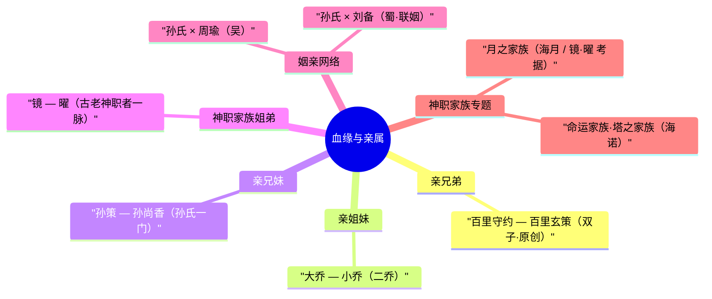
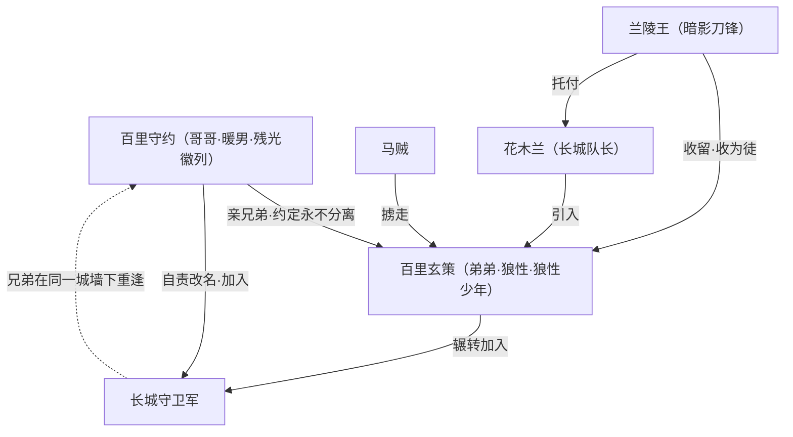
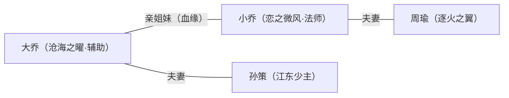
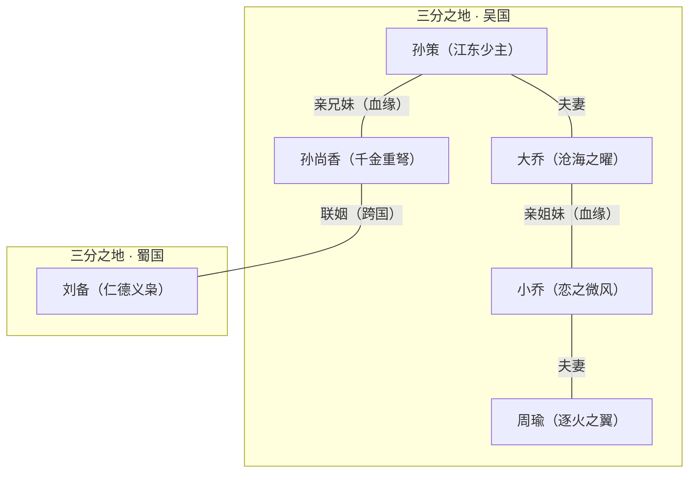
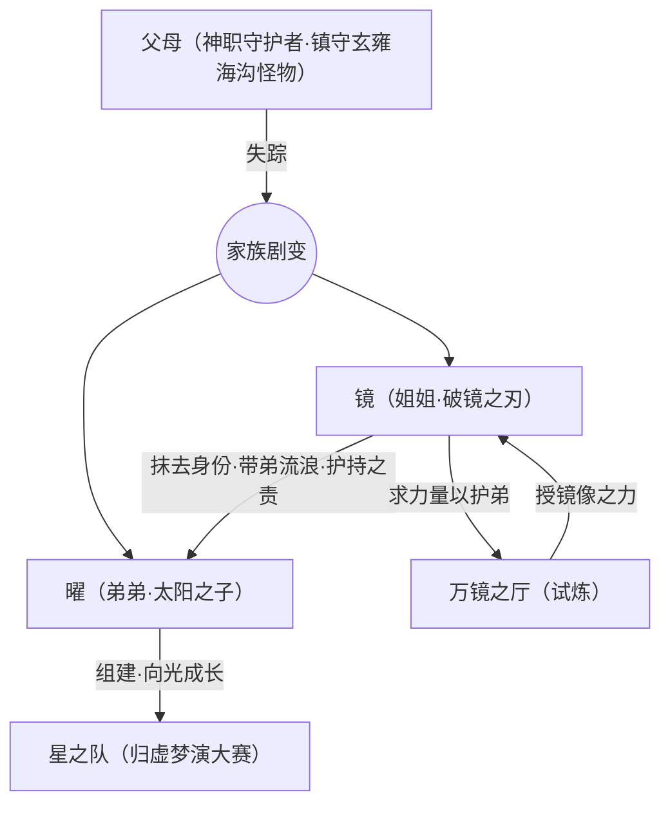
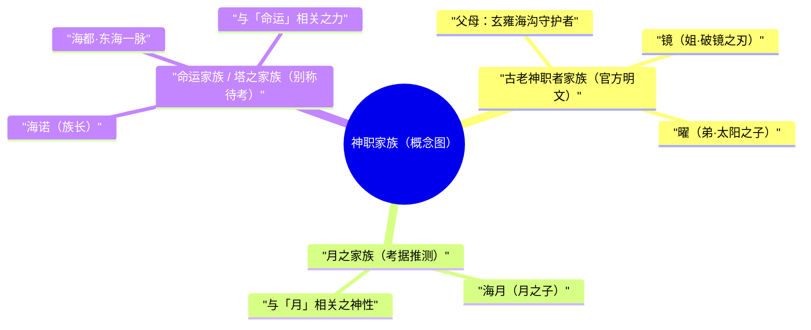

# 关系 · 血缘与亲属

::: info 本页定位
本页专门梳理《王者荣耀》世界观中以**血缘**与**亲属**为纽带的人物关系——亲兄弟、亲姐妹、兄妹、父母子女、家族世系等。与之相对的「恋人 / 夫妻 / CP」「师徒 / 同窗 / 战友」「宿敌 / 阵营对立」等关系，分别收录于本目录下的其他页面（见文末「延伸阅读」）。
本页所据一手资料为本仓库 `.build/relationships.json` 与英雄档案；对官方未明文坐实、由设定逻辑或皮肤剧情外推的部分，统一以「（考据推测）」标注。
:::

血缘是英雄宇宙里最古老、也最坚韧的一种羁绊。它不像恋情那样高调，不像师徒那样讲究传承谱系，却往往是一个英雄最初的「为何而战」。在峡谷的群像里，真正以**亲缘血脉**绑定的组合并不多——这恰恰让每一组显得格外醒目：长城脚下永不分离的双子兄弟、江东孙氏一门牵起的姻亲大网、出身古老神职家族的姐弟……它们共同构成了这个世界温柔而沉重的底色。

---

## 总览 · 血缘亲属一览表

下表汇总了官方背景或设定中**明确为血缘 / 亲属**关系的英雄组合（恋人、夫妻虽含「亲属」属性，但单列于 [恋人与 CP](../relationships/lovers.md)；本页只在「姻亲网络」中作为节点提及）。

| 关系类型 | 成员 | 所属阵营 | 设定来源 | 核心一句话 |
|---|---|---|---|---|
| 亲兄弟（双子 / 原创） | [百里守约](../heroes/changcheng.md#百里守约) · [百里玄策](../heroes/changcheng.md#百里玄策) | 长城守卫军 | 官方原创背景 | 约定永不分离，却被迫分离半生 |
| 亲姐妹 | [大乔](../heroes/sanfen-wu.md#大乔) · [小乔](../heroes/sanfen-wu.md#小乔) | 三分之地·吴国 | 史实沿用 | 二乔同嫁江东双璧 |
| 亲兄妹 | [孙策](../heroes/sanfen-wu.md#孙策) · [孙尚香](../heroes/sanfen-wu.md#孙尚香) | 三分之地·吴国 | 史实沿用 | 兄长守江东，妹妹远嫁蜀 |
| 姐弟 / 兄妹（神职家族） | [镜](../heroes/changan.md#镜) · [曜](../heroes/changan.md#曜) | 长安城（原家族出身古老神职者一脉） | 官方背景 | 失怙后相依，姐姐护持弟弟 |

::: info 为何「血缘组」如此稀少
在英雄宇宙的设定逻辑里，绝大多数英雄是**孤儿、流浪者或被收养者**——这是叙事刻意为之：失去血亲，才会去寻找新的羁绊（师徒、战友、阵营）。因此真正保留完整血缘线的，要么来自**史实人物**（孙氏一门、二乔），要么是**官方专门书写**的原创亲情（百里兄弟、镜与曜）。这也使得这四组关系，每一组都承担了相当重的情感分量。
:::

---

## 百里守约 · 百里玄策 ——「约定永不分离」的双子兄弟

百里守约 · 射手百里玄策 · 刺客

::: info 档案速览
| 项目 | 百里守约 | 百里玄策 |
|---|---|---|
| 称号 | 残光徽列 | 狼性少年 |
| 定位 | 射手（狙击） | 刺客（钩镰突进） |
| 阵营 | [长城守卫军](../factions/changcheng.md) | [长城守卫军](../factions/changcheng.md) |
| 关系 | **亲兄长** | **亲弟弟** |
| 设定来源 | 官方原创背景 | 官方原创背景 |
:::

### 背景

百里兄弟是英雄宇宙中**少有的纯原创亲情设定**，没有史实蓝本，完全由官方编写。二人**无父无母**，自幼相依，住在长城脚下的一座小镇里。哥哥百里守约性情沉稳温和，是典型的「暖男长兄」；弟弟百里玄策则调皮、桀骜、带着一股不服管教的狼性——但唯独把哥哥视为「例外」，是他锋芒之下唯一愿意低头的人。

兄弟二人曾立下一个孩子气却郑重的约定：**永不分离**。

### 羁绊与剧情

命运偏偏让这个约定落了空。某日，玄策被路过的**马贼掳走**，从此音讯全无。守约因为「没能守住与弟弟永不分离的约定」而陷入深深的自责——这份自责，最终化作了他的名字与人生：他**改名为「守约」**（守住约定之意），并加入[长城守卫军](../factions/changcheng.md)，把守望边境、对抗大漠魔种当作毕生事业，一边战斗，一边等待与弟弟重逢的那一天。

而被掳走的玄策，则在江湖另一端走上了截然不同的成长路径——他被[兰陵王](../heroes/modao-shadow-abyss.md#兰陵王)收留并收为徒弟，学得暗影潜行、钩镰与杀戮之术（详见 [师徒与同窗](../relationships/mentor.md)）；兰陵王后将他托付给[花木兰](../heroes/changan.md#花木兰)，玄策由此也进入了**长城守卫军**。

::: tip 重逢的伏笔
兄弟二人最终殊途同归——同属[长城守卫军](../factions/changcheng.md)。哥哥为「守约」而来，弟弟由师父托付而至，两条命运线在长城下重新交汇。这正是这一对兄弟最打动玩家之处：**分离半生，却仍在同一面城墙下并肩。**（重逢后的相处细节官方着墨不多，属玩家与考据者乐于补完的留白）
:::

::: quote 兄弟之声
百里守约：「我们约好的，永不分离。」
百里玄策：「哥哥说的，我才会听。」
（台词意译，体现「守约」之名与「视哥哥为例外」的性格设定）
:::

---

## 大乔 · 小乔 ——「江东二乔」的姐妹情

大乔 · 辅助小乔 · 法师

::: info 档案速览
| 项目 | 大乔 | 小乔 |
|---|---|---|
| 称号 | 沧海之曜 | 恋之微风 |
| 定位 | 辅助（位移传送） | 法师（爱心弹幕） |
| 阵营 | [三分之地·吴国](../factions/sanfen-wu.md) | [三分之地·吴国](../factions/sanfen-wu.md) |
| 配偶 | [孙策](../heroes/sanfen-wu.md#孙策)（夫） | [周瑜](../heroes/sanfen-wu.md#周瑜)（夫） |
| 关系 | **姐姐** | **妹妹** |
:::

### 背景

大乔、小乔即史称的「江东二乔」，《王者荣耀》直接沿用了这一史实姐妹设定。姐姐大乔嫁与**江东少主**[孙策](../heroes/sanfen-wu.md#孙策)，妹妹小乔嫁与**逐火之翼**[周瑜](../heroes/sanfen-wu.md#周瑜)——二人分别牵起了吴国最重要的两对夫妻，也因此成为整张「江东姻亲网」的枢纽。

### 羁绊与剧情

游戏在技能与定位上微妙地呼应了二人的性格与命运：

- **大乔**「沧海之曜」侧重**守护与召唤回城**，气质沉静温柔，正合一位以丈夫与家国为重、撑起后方的长姐。其皮肤、台词多见对孙策的思念之情（孙策早逝是史实，游戏中亦透出聚少离多的怅惘）。
- **小乔**「恋之微风」则一派天真烂漫、满屏爱心，正是她以纯真打动冷峻周瑜的写照（见 [恋人与 CP](../relationships/lovers.md)）。

姐妹二人虽各自成家，却同属[吴国](../factions/sanfen-wu.md)阵营，在峡谷叙事中是「自家人」。她们的姐妹情更多通过**共同的阵营归属与各自的情缘线**侧面体现，官方少有正面描写二人互动的独立剧情（属留白）。

::: info 技能里的「姐妹镜像」（考据推测）
大乔的回城传送与召唤、小乔的瞬移与爱心弹幕，常被玩家解读为对「一守一攻、一静一动」性格的呼应——长姐沉稳护持、幼妹明媚跳脱。这属于从机制与气质做的延伸解读，并非官方明文设定，故标注（考据推测）。
:::

::: quote 二乔之声
小乔：「姐姐说，要笑着面对呀。」
（意译，体现妹妹的烂漫与对姐姐的依赖）
:::

---

## 孙策 · 孙尚香 ——「孙氏一门」的兄妹

孙策 · 战士孙尚香 · 射手

::: info 档案速览
| 项目 | 孙策 | 孙尚香 |
|---|---|---|
| 称号 | 江东少主 | 千金重弩 |
| 定位 | 战士（航船冲撞） | 射手（翻滚重弩） |
| 阵营 | [三分之地·吴国](../factions/sanfen-wu.md) | [三分之地·吴国](../factions/sanfen-wu.md) |
| 配偶 | [大乔](../heroes/sanfen-wu.md#大乔)（妻） | [刘备](../heroes/sanfen-shu.md#刘备)（夫·联姻） |
| 关系 | **兄长** | **妹妹** |
:::

### 背景

孙策与孙尚香为史实兄妹，游戏沿用。孙策是「江东少主」，吴国基业的少壮当家；孙尚香则是一身英气、手持千金重弩的将门之女。

### 羁绊与剧情

孙氏兄妹的关键意义在于：**孙尚香的婚姻把吴、蜀两国连了起来**。她依「联姻」远嫁蜀国[刘备](../heroes/sanfen-shu.md#刘备)（详见 [恋人与 CP](../relationships/lovers.md)），由此让本属敌对的三分阵营之间，多了一道血脉与姻亲的牵绊——这是「三分之地」叙事里非常典型的「政治—情感」交织。

于是，以孙策为圆心，向外辐射出一整张**姻亲网络**：

- 孙策 —（夫妻）— 大乔
- 大乔 —（亲姐妹）— 小乔 —（夫妻）— 周瑜
- 孙策 —（亲兄妹）— 孙尚香 —（联姻）— 刘备（蜀）

::: info 兄妹与「跨国联姻」的张力
在三国题材里，孙尚香的远嫁向来是「以妹妹为筹码巩固吴蜀同盟」的经典桥段。游戏淡化了其中的权谋苦涩，更多保留「将门虎女」的飒爽，但兄长孙策与远嫁之妹之间那份「身处两国、各为其主」的隐性张力，仍是这对兄妹值得玩味的底色。（具体兄妹互动剧情官方着墨有限）
:::

---

## 江东姻亲网络 ——「孙氏一门」如何串起三分之地

把上述血缘组与对应的婚姻关系合并，便得到英雄宇宙中**最庞大、最致密的一张亲属网**。它以**江东孙氏**为核心，向内是姐妹与兄妹的血缘，向外是嫁娶联姻的纽带，甚至跨越了吴、蜀两国的阵营壁垒。

::: info 读图说明
- **粗红线（血缘）**：大乔—小乔（姐妹）、孙策—孙尚香（兄妹）——这两条是本页关注的纯血缘线。
- **蓝线（婚姻 / 联姻）**：孙策—大乔、小乔—周瑜、孙尚香—刘备——属姻亲，详见 [恋人与 CP](../relationships/lovers.md)。
- 整张网由「两条血缘 + 三段婚姻」编织而成，是峡谷里唯一**跨阵营的家族网**。
:::

---

## 镜 · 曜 ——古老神职者家族的姐弟

镜 · 刺客曜 · 战士/刺客

::: info 档案速览
| 项目 | 镜 | 曜 |
|---|---|---|
| 称号 | 破镜之刃 | 太阳之子 |
| 定位 | 刺客（镜像分身） | 战士 / 刺客（星辰之力） |
| 现属阵营 | [长安城](../factions/changan.md) | [长安城](../factions/changan.md) |
| 出身 | **古老神职者家族** | **古老神职者家族** |
| 关系 | **姐姐**（护持之责） | **弟弟** |
:::

### 背景

镜与曜出身于一个**古老的神职者家族**——这一脉世代肩负着镇守职责：他们的**父母**正是负责镇守**玄雍海沟**深处某种怪物的守护者。然而某日，父母在履行职责时**双双失踪**，这对姐弟一夜之间失去了双亲。

为了带着年幼的弟弟活下去、避开追索，**镜抹去了二人的身份**，带着曜一路流浪，最终来到了[稷下学院](../factions/jixia.md)所在的稷下之地。（注：二人现于英雄目录中归属[长安城](../factions/changan.md)阵营，早年则与稷下渊源颇深——曾在稷下学习钻研，见 [师徒与同窗](../relationships/mentor.md)。）

### 羁绊与剧情

失怙之后，**姐姐镜对弟弟曜负有「护持之责」**——这是二人关系的核心，也是镜一切行动的出发点。为了获得能够保护弟弟的力量，镜踏入了传说中的**「万镜之厅」**接受试炼，并从中获得了操纵镜像、分身的能力（这正是其「破镜之刃」技能组的来源）。

而弟弟曜，则走上了与姐姐不同的道路：他没有沉溺于失去双亲的阴影，而是**钻研星辰之力**，立志成为「太阳之子」。他以[李白](../heroes/changan.md#李白)为偶像，在稷下组建了「**星之队**」参加[庄周](../heroes/penglai-donghai.md#庄周)主持的「归虚梦演」大赛，结识了[蒙犽](../heroes/yunzhong-modi.md#蒙犽)、[孙膑](../heroes/jixia.md#孙膑)、[西施](../heroes/baiyue.md#西施)、[鲁班大师](../heroes/mojia-jiguan.md#鲁班大师)等伙伴（详见 [战友与团体](../relationships/squad.md)），在友谊与冒险中获得能量与自我认知。

可以说，这对姐弟是「**一人向暗、一人向光**」的镜像：

- **镜**——为护弟而入万镜之厅，走向镜像与暗影，是沉默担当的守护者；
- **曜**——以星辰与太阳为志，走向光明与伙伴，是被守护、也努力发光的少年。

::: quote 姐弟之声
镜：「我会保护你，无论用什么方式。」
曜：「我要成为像太阳一样的人——这样姐姐就不用一直站在阴影里了。」
（台词意译，呈现「姐护弟 / 弟想反过来照亮姐」的情感结构）
:::

---

## 专题 · 神职家族（月之家族 / 塔之家族等）

::: warning 概念辨析：什么是「神职家族」
《王者荣耀》世界观里存在一类特殊设定——**世代承担某种神圣职责（镇守、占卜、操纵某种本源之力）的血缘家族**。它们与普通「英雄之家」不同：身份往往与一种**神职 / 神力**绑定，并代代相传。本节集中说明这类家族；其中既有官方明确的，也有名称尚需考据的。**「月之家族」「塔之家族」等称谓，部分为玩家社群惯用 / 设定外推，凡不确定处均标注「（考据推测）」。**
:::

### 一、镜·曜所属的「古老神职者家族」

如上节所述，镜与曜出身于一个**镇守玄雍海沟怪物**的古老神职者一脉，父母为守护者。这是 `.build/relationships.json` 中**唯一以「神职家族」明文定性**的血缘组。该家族的家名、是否有特定称号，官方未明确给出（属留白 / 待考据）。

### 二、月之家族（海月 / 月之子）

[海月](../heroes/yunzhong-modi.md#海月) 称号即为「**月之子**」，归属[云中漠地·边陲](../factions/yunzhong-modi.md)。从其称号与「月之子」定位看，海月与一支与**月亮 / 月之力量**相关的家族或神职传承有关。

::: info 「月之家族」一说（考据推测）
- 「月之子」是海月的官方称号，说明其身世与「月」这一神性主题深度绑定（考据推测：可能出身或继承某「月之家族 / 月之神职」一脉）。
- 玩家社群有时会把多个与「月」相关的角色（如海月、以及与月相关的封神 / 神话角色）联想为同一谱系，但**官方并未将他们坐实为同一血缘家族**——此类联想应视为同好考据，而非硬设定。
- 因此本页将「月之家族」作为**主题性的神职家族概念**单列，提示读者：凡涉及具体成员归属，须以官方逐一确认为准。
:::

### 三、命运家族 / 塔之家族（海诺）

[海诺](../heroes/penglai-donghai.md#海诺) 的官方称号是「**命运家族族长**」，归属[蓬莱·东海 / 海都](../factions/penglai-donghai.md)。这是英雄目录中**唯一在称号里直接出现「家族」二字**的角色。

::: info 命运家族 · 关键信息
- **海诺 = 命运家族的「族长」**——这意味着「命运家族」是一个有明确首领、有组织结构的**家族 / 世家**，海诺处于其顶端。
- 该家族与海都 / 东海一带的势力相关，掌握与「命运」相关的力量或职责（考据推测：占卜、预言或操纵命运之力一类的神职属性）。
- 「**塔之家族**」为玩家社群对相关海都世家的另一种习惯称呼（考据推测 / 待官方确认）。鉴于海诺明确为「命运家族族长」，本页以**「命运家族」**为正式表述，「塔之家族」作为可能的别称并存收录。
:::

### 神职家族 · 对照表

| 家族（概念） | 代表英雄 | 神职 / 职责 | 确认程度 |
|---|---|---|---|
| 古老神职者家族 | [镜](../heroes/changan.md#镜) · [曜](../heroes/changan.md#曜)（父母为守护者） | 镇守玄雍海沟之怪物 | 官方明文（家名未公开） |
| 月之家族（概念） | [海月](../heroes/yunzhong-modi.md#海月)「月之子」 | 与「月」相关之神性 / 传承 | 称号确凿；「家族」归属（考据推测） |
| 命运家族（塔之家族·别称待考） | [海诺](../heroes/penglai-donghai.md#海诺)「命运家族族长」 | 与「命运」相关之力 / 世家统领 | 「命运家族」官方明确；别称（考据推测） |

::: tip 给考据者的提醒
神职家族是英雄宇宙里相对「年轻」且仍在扩充的设定区。腾讯在新英雄上线时常借「家族 / 神职」补完世界观，因此本节的部分推测**可能随官方更新而被坐实或修正**。引用时请保留「（考据推测）」标注，并以最新官方文案为准。
:::

---

## 结语 · 血脉是最初的羁绊

纵观全峡谷，真正以血缘绑定的组合屈指可数，但每一组都被写得格外用力：

<a class="hok-card" href="../heroes/changcheng#百里玄策">百里守约双子之约__ 与 ——一句「永不分离」，让哥哥背负终生、改名守约，让弟弟历尽江湖、终归城墙。</a>
<a class="hok-card" href="../heroes/sanfen-wu#小乔">大乔江东二乔__ 与 ——一沉静、一烂漫，分嫁双璧，撑起吴国的半壁柔情。</a>
<a class="hok-card" href="../heroes/sanfen-wu#孙尚香">孙策孙氏一门__ 与 ——兄守江东、妹嫁西蜀，以一桩联姻把三分之地连成一张亲属网。</a>
<a class="hok-card" href="../heroes/changan#曜">镜神职姐弟__ 与 ——失怙之后，一人入万镜之厅向暗，一人逐星辰之光向阳，互为镜像，彼此守望。</a>

无论是史实沿用还是官方原创，这些血缘羁绊都在提醒我们：在英雄们各自背负的宏大命运之前，他们最先拥有、也最难割舍的，往往是「家人」二字。

---

## 延伸阅读

- [关系 · 恋人与 CP](../relationships/lovers.md)——干莫、项虞、孙策大乔、周瑜小乔、刘备孙尚香、瑶与云中君等
- [关系 · 师徒与同窗](../relationships/mentor.md)——兰陵王与百里玄策、太乙与哪吒、姜子牙与虞姬、稷下三贤者门下等
- [关系 · 战友与团体](../relationships/squad.md)——长城守卫军、尧天、星之队、稷下 F4 等
- [关系 · 宿敌与对立](../relationships/rivalry.md)——诸葛亮与司马懿、起义与镇压、长安女帝势力等
- [人物关系 · 总览](../relationships/index.md)——全部关系类型的导航与交织索引
- 阵营页：[三分之地·吴国](../factions/sanfen-wu.md) · [长城守卫军](../factions/changcheng.md) · [长安城](../factions/changan.md) · [云中漠地·边陲](../factions/yunzhong-modi.md) · [蓬莱·东海 / 海都](../factions/penglai-donghai.md)
