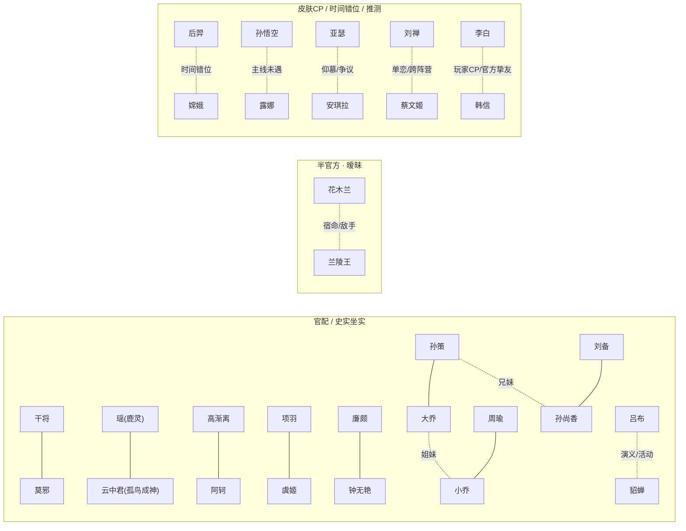

# 关系 · 恋人与CP

> 「峡谷里最长的射程不是箭，是惦念。」

在《王者荣耀》的世界观里，「爱」从来不是一条干净的直线。它可能是一对铸剑工匠把彼此熔进同一柄剑的同体之恋，可能是横亘三国姻亲网络的政治联姻，也可能只是一套 520 情侣皮肤、一句共有台词，被玩家与官方默契地「钦定」成了 CP。

正因如此，谈「恋人」必须先谈**严谨度**——这一对究竟是写进官方背景故事的「**官配**」，是史书/演义沿用的「**演义**」，是只在皮肤层面成立的「**皮肤CP**」，是官方暧昧默许的「**半官方**」，还是玩家热情浇灌出来的「**同人**」。本页将逐对拆解，严格区分这五个层级，既满足磕糖的浪漫，也对得起考据的良心。

::: info 本页收录范围
本页仅收录 **恋人 / 夫妻 / CP / 皮肤CP / 单恋** 五类关系。亲属（兄弟姐妹、兄妹）、师徒、君臣、战友、宿敌等关系不在此列，相关内容请移步其他关系页。亲缘网（如孙氏—二乔—刘备的姻亲网）在「孙策×大乔」与「刘备×孙尚香」小节中作为背景提及。
:::

---

## 严谨度图例

理解本页的第一把钥匙，是这张「严谨度光谱」。越靠左，官方坐实程度越高；越靠右，越依赖皮肤、活动或玩家共识。

| 标签 | 含义 | 判定依据 | 本页代表 |
| :--- | :--- | :--- | :--- |
| **官配** | 官方背景故事 / 游戏机制双重认证的恋人 | 英雄故事正文、被动羁绊、同框原画 | 干将×莫邪、瑶×云中君、高渐离×阿轲、项羽×虞姬 |
| **演义 / 史实** | 取材自历史或演义，游戏沿用其夫妻/恋人关系 | 史书、演义 + 游戏背景延续 | 孙策×大乔、周瑜×小乔、刘备×孙尚香、吕布×貂蝉 |
| **半官方** | 官方关系图/活动暗示恋人色彩，但未在正文坐实 | 关系图标注、活动文案，含官方辟谣记录 | 花木兰×兰陵王 |
| **皮肤CP** | 仅在情侣皮肤层面成立，主线未相守或时间错位 | 520/情人节 CP 皮肤、共有台词 | 后羿×嫦娥、孙悟空×露娜、亚瑟×安琪拉、刘禅×蔡文姬 |
| **同人 / 待坐实** | 玩家广泛认作 CP，官方定性更接近挚友 | 皮肤呼应 + 玩家共识，官方口径偏挚友 | 李白×韩信 |

::: warning 考据原则
皮肤是「商品」也是「彩蛋」，但**皮肤不等于主线**。情侣皮肤可以把两个时间线错位、从未相遇、甚至阵营敌对的英雄凑成一对，这属于厂商的浪漫许可，而非世界观硬设定。凡主线与皮肤矛盾者，本页一律以主线为准、并明确标注。
:::

---

## CP 总表

下表按严谨度从高到低排列。点击姓名可跳转该英雄主页。

| 组合 | 关系类型 | 严谨度 | 一句话 |
| :--- | :--- | :--- | :--- |
| [干将莫邪](../heroes/jixia.md#干将莫邪)（干将 × 莫邪） | 夫妻 / 同体 | 官配 | 双双以身祭剑，一人化剑、一人化魂，永不分离的同体之恋。 |
| [瑶](../heroes/baiyue.md#瑶) × [云中君](../heroes/baiyue.md#云中君) | 恋人 · 转生 | 官配（强） | 前世为鹿与孤鸟，殉情后转生重逢，鹿鸟羁绊写进被动。 |
| [高渐离](../heroes/jixia.md#高渐离) × [阿轲](../heroes/jianghu-xiake.md#阿轲) | 恋人 | 官配 | 灭门重伤被救，从此为彼此而战、亡命天涯。 |
| [项羽](../heroes/haojing-fengshen.md#项羽) × [虞姬](../heroes/haojing-fengshen.md#虞姬) | 恋人 · 官配 | 官配 + 情侣皮肤 | 反抗暴政中相爱，却因师兄幻术，虞姬之箭误对所爱。 |
| [廉颇](../heroes/haojing-fengshen.md#廉颇) × [钟无艳](../heroes/jixia.md#钟无艳) | 恋人 · 官配 | 官配（低存在感） | 同门师姐弟，战场初遇、稷下重逢，官博认证却鲜有人知。 |
| [孙策](../heroes/sanfen-wu.md#孙策) × [大乔](../heroes/sanfen-wu.md#大乔) | 夫妻 | 史实 + 情侣皮肤 | 江东少主与沧海之曜，史实夫妻，520 同框入海。 |
| [周瑜](../heroes/sanfen-wu.md#周瑜) × [小乔](../heroes/sanfen-wu.md#小乔) | 夫妻 | 史实 + 情侣皮肤 | 天真少女融化冷峻都督，恋之微风拂逐火之翼。 |
| [刘备](../heroes/sanfen-shu.md#刘备) × [孙尚香](../heroes/sanfen-wu.md#孙尚香) | 恋人 · 联姻 | 史实 + 情侣皮肤 | 政治联姻里长出真情，天鹅之梦跨越吴蜀。 |
| [吕布](../heroes/modao-shadow-abyss.md#吕布) × [貂蝉](../heroes/changan.md#貂蝉) | 恋人 · 演义 | 演义 + CP 活动 | 飞将台词常念绝世舞姬，天魔缭乱与爱与正义遥相呼应。 |
| [花木兰](../heroes/changan.md#花木兰) × [兰陵王](../heroes/modao-shadow-abyss.md#兰陵王) | 宿命 / 敌手 | 半官方 | 长城下长期交锋，敌手之间生出说不清的感情。 |
| [后羿](../heroes/shanggu-shenhua.md#后羿) × [嫦娥](../heroes/shanggu-shenhua.md#嫦娥) | 皮肤CP | 皮肤CP（时间错位） | 行刑者放走魔道公主，月光与海，前世与梦中的邂逅。 |
| [孙悟空](../heroes/shanggu-shenhua.md#孙悟空) × [露娜](../heroes/changan.md#露娜) | 皮肤CP | 皮肤CP（主线未遇） | 取材至尊宝×紫霞，两套情侣皮，主线却从未相遇。 |
| [亚瑟](../heroes/changan.md#亚瑟) × [安琪拉](../heroes/jixia.md#安琪拉) | 皮肤CP · 仰慕 | 皮肤CP（存争议） | 魔法少女对圣骑士之王的倾慕，CP 皮认证却口碑两极。 |
| [刘禅](../heroes/sanfen-shu.md#刘禅) × [蔡文姬](../heroes/sanfen-wei.md#蔡文姬) | 单恋 + 皮肤CP | 皮肤CP（跨阵营） | 蜀国小胖墩暗恋魏国小提琴手，足球场上的青涩心事。 |
| [李白](../heroes/changan.md#李白) × [韩信](../heroes/jianghu-xiake.md#韩信) | 世交挚友 | 同人 / 待坐实 | 狐族与龙族世代为友，凤求凰对白龙吟，CP 之名玩家所赐。 |

---

## CP 关系图

下图以「实线=官方坐实」「虚线=皮肤CP/半官方/推测」区分。请配合后文严谨度标注阅读。



::: info 如何读这张图
实线连接（OFFICIAL 框内除吕布貂蝉外）= 官方背景故事或史实坐实的恋人；点状虚线 = 严谨度递减的皮肤CP、半官方或玩家推测。底部两条灰色虚线展示孙氏姻亲网的交叉点（孙策—孙尚香兄妹、大乔—小乔姐妹），它们把吴蜀两国的几对 CP 串成一张大网。
:::

::: tip 峡谷里的『月老』· 少司缘
谈情说爱，峡谷里恰好有一位「专职」的神祇——[少司缘](../heroes/shanggu-shenhua.md#少司缘)（称号**「赤诚月老」**，[上古众神·神话](../factions/shanggu-shenhua.md)，辅助）。她的形象直接取材自中国民间「月下老人」牵红线、定姻缘的传说，技能机制也以「连线 / 牵引」为母题。虽然她并不与任何英雄构成恋人 CP，却是本页所有情缘在世界观层面最贴切的「见证者」与「象征」。若把本页诸对 CP 想象成一张红线交织的网，少司缘便是那位执线之人。（其与具体 CP 的剧情关联为考据推测，此处仅作主题呼应）
:::

---

# 官配 · 写进故事的恋人

这一组是世界观里最「硬」的恋人——他们的爱不依赖皮肤背书，而是直接写在英雄背景故事、技能被动或同框原画里。

## 干将莫邪

::: info 档案速览
| 项 | 内容 |
| :--- | :--- |
| 组合 | 干将 × 莫邪 |
| 关系 | 夫妻 / 同体英雄 |
| 严谨度 | **官配**（官方背景故事 + 同体英雄机制） |
| 阵营 | [稷下学院](../factions/jixia.md) |
:::

<span class="hok-tags"><span class="tag mage">法师</span></span>

**故事梗概。** 干将与莫邪本是一对青梅竹马、出身贫寒的铸剑工匠夫妇。他们倾尽一生只为铸出一柄真正的旷世神剑，而铸剑的最后一道工序，是「以身祭剑」——两人双双将自己的生命熔入炉火：干将化作了那柄锋利无俦的**剑身**，莫邪化作了寄宿其中的**剑魂**。从此世上再无干将与莫邪二人，只有一柄名为「干将莫邪」的剑、一个被一分为二却又合二为一的生命。

**情感线。** 他们的爱是峡谷里最极致的浪漫主义：**不是相守，而是相融**。许多 CP 求的是「执子之手」，干将莫邪求的却是把两条命拧成一根魂，从此再不分离。在游戏机制上，这种「一分为二、独一无二」被设计成一个英雄两种形态——你操控的从来不是「干将」或「莫邪」一个人，而是他们合体后的存在。这是「同体之恋」最直白的隐喻。

**出处依据。** 取材自中国古代著名的「干将莫邪」铸剑传说（最早见于《吴越春秋》《搜神记》等），原典中干将莫邪为铸剑献身的母题被游戏提炼为「以身祭剑、化剑化魂」。游戏内为**同体英雄**，背景故事正文明确二人为夫妻并双双殉于铸剑。需要特别说明的是：在《王者荣耀》中，「干将」与「莫邪」并非两个可分别选取的英雄，而是合并为**唯一一个英雄「干将莫邪」**（称号「一念神魔」，[稷下学院](../factions/jixia.md)，法师）。因此本页虽以「干将 × 莫邪」的 CP 笔法书写，链接实际都指向这同一个英雄词条——这本身就是「合二为一」最直观的机制注脚。

::: info 考据细节 · 莫邪投炉
据该英雄背景故事正文，铸剑炉火千锤百炼仍不肯凝合，神兵需以生命献祭方能「活」过来；最终是**莫邪纵身投入剑炉**、以血肉心跳魂魄作为最后的「剑引」，干将自此化为剑、莫邪化为附于剑上的执念与温度。这一「一念神魔」之号（一念之间，是神是魔、是守护是毁灭）亦与长安英雄 [李信](../heroes/changan.md#李信) 的同名称号呼应——二者立意相通但角色互不相干，请勿混淆。（考据提示）
:::

::: quote 经典台词
「一分为二的生命，独一无二的灵魂。」
:::

---

## 瑶 · 云中君

::: info 档案速览
| 项 | 内容 |
| :--- | :--- |
| 组合 | 瑶（阿瑶）× 云中君 |
| 关系 | 恋人 · 转生重逢 |
| 严谨度 | **官配（强）**——官方背景故事 + 游戏机制双重认证 |
| 阵营 | [百越 / 建木](../factions/baiyue.md) |
:::

**故事梗概。** 瑶与云中君的原型同出屈原《九歌》。在游戏的浪漫化叙事里，他们的**前世**是森林深处一只温顺的**鹿**与一只孤独的**鸟**——鹿与孤鸟相依相伴，是彼此在荒野里唯一的温暖。一场变故让二者殉情而亡，而这份情没有断绝：鹿转生为森林精灵**阿瑶**（鹿灵），孤鸟则化作守护神祇**云中君**，以「孤鸟成神」之身重新回到阿瑶身边，默默守护这个他爱了一世又一世的人。

**情感线。** 这是峡谷里被认证得最「重」的一对官配，因为他们的羁绊不止写在故事里，还**写进了游戏机制**：瑶可以化作小鹿附身在队友身上，而当瑶与云中君同场，二者拥有专属的**鹿鸟羁绊被动**与大量互动台词；官方更绘制了**同框原画**。一只惦念前世的鹿、一位甘愿成神守护的孤鸟——「转生重逢」是国产神话里最动人的母题之一，而瑶与云中君把它落到了实处。

**出处依据。** 原型出自《九歌·云中君》《九歌·山鬼》（瑶取材近于「山鬼」乘赤豹、相思而不得的意象，游戏改写为鹿灵）。前世今生、殉情转生的设定为游戏官方原创浪漫化；鹿鸟羁绊被动、互动台词、同框原画均为游戏内可验证内容。

::: quote 经典台词
「云中君，你会一直陪着阿瑶吗？」——「会，一直，一直。」
:::

---

## 高渐离 · 阿轲

::: info 档案速览
| 项 | 内容 |
| :--- | :--- |
| 组合 | 高渐离 × 阿轲 |
| 关系 | 恋人（亡命鸳鸯） |
| 严谨度 | **官配**——官方背景故事 |
| 阵营 | 高渐离属 [稷下学院](../factions/jixia.md)；阿轲属 [江湖侠客](../factions/jianghu-xiake.md) |
:::

**故事梗概。** 阿轲出身荆氏一族，灭门之祸后身负重伤、命悬一线，是乐神**高渐离**将她救下。一个是以乐为刃、看似洒脱实则深情的乐者，一个是背负血海深仇、信念如刃的女刺客——两个本该擦肩的人，在生死边缘绑在了一起。从此他们**为彼此而战、亡命天涯**，是峡谷里少有的「并肩对抗整个世界」的恋人。

**情感线。** 这对 CP 的浪漫在于「**救赎**」：阿轲的世界曾只剩复仇，高渐离用一支曲、一次出手，给了她「除了恨之外，还有人值得活下去」的理由。他们不是岁月静好的相守，而是带着伤、握着刀、互相托付后背的同路人。亡命之爱，比安稳之爱更见分量。

**出处依据。** 取材自荆轲刺秦的历史母题（高渐离击筑、荆轲赴秦），游戏将「荆轲」性别改写为女刺客阿轲，并原创二人因灭门—相救而结缘的感情线。属游戏官方背景故事，非史实恋人。

::: quote 经典台词
「我的剑，只为你出鞘。」
:::

---

## 项羽 · 虞姬

::: info 档案速览
| 项 | 内容 |
| :--- | :--- |
| 组合 | 项羽 × 虞姬 |
| 关系 | 恋人（官配，师徒线交织） |
| 严谨度 | **官配 + 情侣皮肤**（官方背景故事 + 「霸王别姬」皮肤） |
| 阵营 | [镐京·封神](../factions/haojing-fengshen.md) |
:::

**故事梗概。** 虞姬是 [姜子牙](../heroes/haojing-fengshen.md#姜子牙) 的弟子。在反抗阴阳家暴政的乱世里，她与**西楚霸王**项羽相爱——一个力能扛鼎、以盾墙护住所爱的霸王，一个箭术超群、风灵般的射手。然而最残酷的转折来自虞姬的**师兄**：师兄设下幻术圈套，让虞姬在迷障中错认了目标，**那一箭，竟误对了她最爱的项羽**。爱与背叛、信任与幻象，在这一箭里全部崩塌。

**情感线。** 「霸王别姬」是中国人最熟悉的悲剧爱情符号，游戏在沿用这一意象的同时，加入了**师徒—恋人交织**的新冲突：虞姬的痛不止于失去爱人，更在于「亲手」（即便是被骗）伤害了爱人。官方为二人推出官配情侣皮肤**「霸王别姬」**，让这段「英雄末路、美人决绝」的古典悲剧在峡谷里再度上演。

**出处依据。** 取材自楚汉相争「霸王别姬」典故（《史记·项羽本纪》四面楚歌、虞姬自刎）。游戏保留项羽虞姬的恋人关系，并原创虞姬为姜子牙弟子、师兄幻术误箭等情节。背景故事 + 「霸王别姬」情侣皮肤双重坐实。

::: quote 经典台词
「我的霸业，要你陪我一起看。」
:::

---

## 廉颇 · 钟无艳

::: info 档案速览
| 项 | 内容 |
| :--- | :--- |
| 组合 | 廉颇 × 钟无艳 |
| 关系 | 恋人 · 官配（同门） |
| 严谨度 | **官配（低存在感）**——官方微博认证 |
| 阵营 | 廉颇属 [镐京·封神](../factions/haojing-fengshen.md)；钟无艳属 [稷下学院](../factions/jixia.md) |
:::

**故事梗概。** 廉颇与钟无艳同为**老夫子**的弟子，是货真价实的同门师姐弟。两人初次照面竟是在**战场上互为对手**：廉颇征战途中遇到的第一个像样的对手，正是那位手执大锤、其貌不扬却武艺惊人的钟无艳。刀锤相向、棋逢敌手之后，他们又在**稷下**以盟友的身份重逢——从战场上的对手，到学院里并肩的同门，再到官方钦定的恋人。

**情感线。** 这是一对「**最被低估的官配**」。它的浪漫底色其实很硬核：不是郎才女貌的一见钟情，而是「能在战场上接住我全力一击的人」的惺惺相惜。可惜的是，廉颇与钟无艳在玩家中都属于冷门英雄，存在感双双偏低，导致这段被官方亲口认证的恋情常年被遗忘——堪称峡谷里「最名正言顺却最没人磕」的 CP。

**出处依据。** 廉颇取材自战国名将（负荆请罪、将相和），钟无艳取材自齐国丑女钟离春（无盐）。二人「同门 + 战场初遇 + 稷下重逢 + 恋人」的关系链为游戏原创，并经**官方微博认证为官配**。因双方冷门，相关原画/活动较少。

::: tip 考据小贴士
廉颇与钟无艳是检验「官配 ≠ 热度」的最佳样本：严谨度上它稳居官配第一梯队，但传播度甚至不及许多皮肤CP。判断 CP 严谨度时，**切勿以热度倒推官方口径**。
:::

---

# 演义 / 史实 · 沿用而来的恋人

这一组的关系底座是历史或演义中既有的夫妻/恋人，游戏予以沿用，并多配有 520 或情人节情侣皮肤。

## 孙策 · 大乔

::: info 档案速览
| 项 | 内容 |
| :--- | :--- |
| 组合 | 孙策 × 大乔 |
| 关系 | 夫妻 |
| 严谨度 | **史实 + 情侣皮肤**（史实夫妻 + 520 情侣皮） |
| 阵营 | [三分之地·吴国](../factions/sanfen-wu.md) |
:::

**故事梗概。** 孙策（江东少主）与大乔本就是历史上的夫妻，游戏沿用了这一关系。一个是开疆拓土、锐气逼人的少年霸主，一个是温婉聪慧、能驭海潮的辅助型佳人（「沧海之曜」）。官方为二人推出过 **520 情侣皮肤**，把史书里一句「策纳大乔」的简短记载，扩写成了峡谷里有来有回的甜。

**情感线 + 姻亲网。** 孙策的爱情不是孤立的——他同时站在峡谷最庞大的**姻亲网**中心：孙策的妹妹是 [孙尚香](../heroes/sanfen-wu.md#孙尚香)（后嫁 [刘备](../heroes/sanfen-shu.md#刘备)），大乔的妹妹是 [小乔](../heroes/sanfen-wu.md#小乔)（嫁 [周瑜](../heroes/sanfen-wu.md#周瑜)）。于是「孙策—大乔—小乔—周瑜—刘备—孙尚香」连成一片，三国三对 CP 借由孙、乔两家拧成一团，构成本页 CP 关系图底部的交叉网。

**出处依据。** 史实夫妻（《三国志》记孙策、周瑜分别纳大乔、小乔）。游戏沿用 + 520 情侣皮肤。

::: quote 经典台词
「江东的风浪，有我替你挡。」
:::

---

## 周瑜 · 小乔

::: info 档案速览
| 项 | 内容 |
| :--- | :--- |
| 组合 | 周瑜 × 小乔 |
| 关系 | 夫妻 |
| 严谨度 | **史实 + 情侣皮肤**（官方 CP + 情侣皮） |
| 阵营 | [三分之地·吴国](../factions/sanfen-wu.md) |
:::

**故事梗概。** 周瑜（逐火之翼）与小乔（恋之微风）是历史夫妻，游戏沿用并做了性格化处理：周瑜冷峻、自律、心有大志，而小乔天真烂漫、心思单纯——是**小乔的天真**一点点融化了这位都督的冰。一个掌火，一个御风；一个是燃烧的事业，一个是拂过的温柔，恰是「逐火之翼」与「恋之微风」名号的互文。

**情感线。** 这是经典的「冰山 × 暖阳」配置：冷峻者并非无情，只是把情绪锁得太深，而对的那个人能用最简单的真诚撬开它。游戏给二人配了情侣皮肤，并在台词、原画中多次让小乔成为周瑜唯一会卸下铠甲的人。

**出处依据。** 史实夫妻（与孙策大乔同源记载）。游戏定为官方 CP，配情侣皮肤；「小乔以天真打动冷峻周瑜」为游戏角色塑造。

::: quote 经典台词
「公瑾哥哥，小乔会一直在你身边哦。」
:::

---

## 刘备 · 孙尚香

::: info 档案速览
| 项 | 内容 |
| :--- | :--- |
| 组合 | 刘备 × 孙尚香 |
| 关系 | 恋人 · 联姻 |
| 严谨度 | **史实 + 情侣皮肤**（历史联姻 + 「天鹅之梦」等 CP 皮） |
| 阵营 | 刘备属 [三分之地·蜀国](../factions/sanfen-shu.md)；孙尚香属 [三分之地·吴国](../factions/sanfen-wu.md) |
:::

**故事梗概。** 刘备（仁德义枭）与孙尚香（千金重弩）的结合，源自历史上著名的**吴蜀政治联姻**——孙权将妹妹孙尚香嫁与刘备，本是权谋棋局的一步。游戏沿用了这桩联姻，并在浪漫化处理中让「政治婚姻」里长出了真感情：一个是隐忍仁厚、半生颠沛的枭雄，一个是带着千金重弩、巾帼不让须眉的将门虎女。

**情感线 + 跨阵营张力。** 这对 CP 的看点是「**身份的撕扯**」：孙尚香嫁入蜀营，却是吴国孙策的亲妹——她站在吴蜀之间，爱情与母国忠诚天然对立。官方为二人推出 **520「天鹅之梦」** 等 CP 皮肤，用唯美的童话外壳，包裹了一段「联姻起、真情续、立场难」的复杂关系。它也是孙氏姻亲网通往蜀国的关键一环。

**出处依据。** 历史联姻（《三国志》载孙权以妹妻刘备）。游戏沿用 + 「天鹅之梦」等 520 CP 皮肤。

::: quote 经典台词
「这一箭，为情，也为家国。」
:::

---

## 吕布 · 貂蝉

::: info 档案速览
| 项 | 内容 |
| :--- | :--- |
| 组合 | 吕布 × 貂蝉 |
| 关系 | 恋人（演义关联） |
| 严谨度 | **演义 + CP 活动**（皮肤呼应 + 官方 CP 活动） |
| 阵营 | 吕布属 [魔道·暗影·深渊](../factions/modao-shadow-abyss.md)；貂蝉属 [长安城](../factions/changan.md) |
:::

**故事梗概。** 吕布（飞将）与貂蝉（绝世舞姬）的关联，根植于《三国演义》中「连环计」的经典桥段——貂蝉周旋于董卓与吕布之间，吕布为貂蝉而反。游戏沿用了这层演义渊源：吕布的台词里**常常念着貂蝉的名字**，而二人的皮肤——吕布的「天魔缭乱」与貂蝉的「爱与正义」——在主题与美术上**遥相呼应**，被官方以 **CP 活动**形式串联。

**情感线。** 这是一对「**镜头之外的恋人**」：游戏没有给他们一条完整、并肩的主线，他们的羁绊更多藏在「吕布念貂蝉」的台词彩蛋、相互呼应的皮肤、以及节日 CP 活动里。换言之，它的严谨度落在「**演义共识 + 官方活动暗示**」这一层，比纯皮肤CP重，比写进背景故事的官配轻。

**出处依据。** 取材自《三国演义》连环计（正史中貂蝉为文学虚构）。游戏内通过吕布台词、皮肤呼应（天魔缭乱 / 爱与正义）及官方 CP 活动建立关联，未在英雄背景正文展开完整恋人主线。

::: quote 经典台词
「貂蝉，看我为你踏平这乱世。」
:::

---

# 半官方 · 暧昧不清的羁绊

## 花木兰 · 兰陵王

::: info 档案速览
| 项 | 内容 |
| :--- | :--- |
| 组合 | 花木兰 × 兰陵王（「双兰」） |
| 关系 | 宿命 / 敌手（恋人色彩） |
| 严谨度 | **半官方**——官方关系图标注「宿命」，恋人色彩暧昧；曾辟谣 CP 皮肤 |
| 阵营 | 花木兰属 [长安城](../factions/changan.md)；兰陵王属 [魔道·暗影·深渊](../factions/modao-shadow-abyss.md) |
:::

**故事梗概。** 在成为长城守卫军队长之前，花木兰常年驻守长城，而**兰陵王**则是屡屡潜入长城的敌对者。两人在长城之下长期、反复地交锋——刀来剑往、棋逢对手，**在无数次生死对决中，生出了某种不一样的感情**。这是一段从「兵戎相见」里长出来的羁绊：他们最了解彼此的招式，也最忌惮、最在意彼此的存在。

**情感线 · 为何只算「半官方」。** 「双兰」是玩家热度极高的 CP，但必须把话说清楚：**官方对二人的定位更偏向「宿命 / 敌手」，而非明确的恋人**。官方关系图将其标注为「宿命」，恋人色彩始终停留在暧昧、留白的层面。更关键的是，官方曾就「次元武士情侣皮肤」一事**辟谣**，否认这是钦定的情侣皮。因此「双兰」的严谨度只能落在「半官方」——有官方暗示的张力，但没有官方坐实的恋人名分。

**出处依据。** 取材自花木兰（《木兰辞》）与北齐兰陵王高长恭（《兰陵王入阵曲》）两个独立历史/文学原型，二人本无关联，其交锋为游戏原创。官方关系图标注「宿命」，恋人定性暧昧，并有对 CP 皮肤的辟谣记录。

::: warning 辟谣记录
针对「双兰情侣皮肤」的传闻，官方曾予以辟谣。请勿将「次元武士」等同主题皮肤当作官方钦定情侣皮的证据。本对的恋人色彩属**玩家解读 + 官方暧昧留白**，未升格为官配。
:::

::: quote 经典台词
「又是你。看来今晚，我们之中要少一个人。」
:::

---

# 皮肤CP · 浪漫的「钦定」

这一组的共同特征是：**情侣皮肤成立，主线却不成立**。它们或时间错位、或从未相遇、或仅是单方仰慕。磕糖请尽兴，但别把皮肤当主线。

## 后羿 · 嫦娥

::: info 档案速览
| 项 | 内容 |
| :--- | :--- |
| 组合 | 后羿 × 嫦娥 |
| 关系 | 皮肤CP（剧情时间错位） |
| 严谨度 | **皮肤CP**——情人节皮肤浪漫化，主线为前世羁绊 / 梦中邂逅 |
| 阵营 | [上古众神·神话](../factions/shanggu-shenhua.md) |
:::

**故事梗概。** 后羿（半神之弓）是奉神命行事的**神职者/行刑人**，他领到的命令，是**处决魔道公主嫦娥**。然而行刑之前，他终究下不去手，选择**放走了她**；濒死的嫦娥（寒月公主）则随着月光，沉入了海中。一道是执弓的半神，一道是坠海的寒月——他们的交集，是一次「行刑者放走死刑犯」的越界之举。

**情感线 · 为何是皮肤CP。** 后羿嫦娥在中国神话里是天经地义的夫妻（后羿射日、嫦娥奔月），游戏的**情人节皮肤**也顺势把二人浪漫化。但**游戏主线并未让他们在世相守**：他们的羁绊更多被处理成**前世的渊源**或**梦中的邂逅**，而非现世的并肩。也就是说，神话给了他们「夫妻」的名分，游戏皮肤给了他们「情人节」的甜，但游戏主线只给了他们「行刑—放走—坠海」这一段擦肩。严谨度因此落在皮肤CP。

**出处依据。** 取材自后羿射日、嫦娥奔月神话（夫妻关系源自神话原典）。游戏内为情人节皮肤浪漫化呈现，主线以前世羁绊 / 梦中邂逅为主，并非现世相守。

::: quote 经典台词
「这一箭，我射偏了——只为，让你活着。」
:::

---

## 孙悟空 · 露娜

::: info 档案速览
| 项 | 内容 |
| :--- | :--- |
| 组合 | 孙悟空 × 露娜 |
| 关系 | 皮肤CP（主线从未相遇） |
| 严谨度 | **皮肤CP**——灵感取自《大话西游》，两套情侣皮，但主线无感情线 |
| 阵营 | 孙悟空属 [上古众神·神话](../factions/shanggu-shenhua.md)；露娜属 [长安城](../factions/changan.md) |
:::

**故事梗概。** 这对 CP 的灵感直接来自电影《大话西游》中的**至尊宝 × 紫霞仙子**。借着这层文化母题，官方为孙悟空（齐天大圣）与露娜（哥特玫瑰）推出了**两套情侣皮肤**，把「曾经有一份真挚的感情」那种宿命般的遗憾移植进了峡谷。

**情感线 · 一个必须说清的真相。** 然而——**在《王者荣耀》主线里，孙悟空与露娜从未相遇，也没有任何直接的感情线**。孙悟空的主线是率魔种起义失败、被镇压千年、而后踏上西行取经之路；露娜的主线则是**一直在寻找她的哥哥**。两条线各走各的，从无交点。所以孙悟空×露娜是典型的「**皮肤钦定 CP**」：感情存在于皮肤与《大话西游》的互文里，而非游戏剧情里。

::: info 皮肤 ≠ 剧情的最佳反面教材
孙悟空×露娜是本页最清晰的「皮肤CP而非剧情CP」案例。两套情侣皮 + 经典电影母题足以让玩家磕糖，但主线两人**素未谋面**。引用时务必标注：此为皮肤/联想层面的 CP，世界观主线中二人无交集。
:::

::: quote 经典台词
「曾经有一段感情……可惜，我们走的从来不是同一条路。」
:::

---

## 亚瑟 · 安琪拉

::: info 档案速览
| 项 | 内容 |
| :--- | :--- |
| 组合 | 亚瑟 × 安琪拉 |
| 关系 | 皮肤CP（仰慕向） |
| 严谨度 | **皮肤CP（存争议）**——多套 CP 皮认证，但剧情近「仰慕者—被仰慕者」 |
| 阵营 | 亚瑟属 [长安城](../factions/changan.md)；安琪拉属 [稷下学院](../factions/jixia.md) |
:::

**故事梗概。** 安琪拉（魔法少女，体内寄宿着魔法师**梅林**）对亚瑟（圣骑士之王）怀有倾慕之情。官方为二人推出了**多套 CP 皮肤**，从皮肤层面给这段「魔法少女爱上骑士王」的关系盖了章。

**情感线 · 争议所在。** 但严谨度上必须打个问号：剧情里二人的关系更接近「**仰慕者 — 被仰慕者**」，是安琪拉一侧的单向倾慕，而非双向奔赴的恋人。更有一种说法认为，**亚瑟真正的剧情向 CP 是 [艾琳](../heroes/shanggu-shenhua.md#艾琳)**（圣灵之弓），而非安琪拉——此说在玩家间存在争议、尚无定论。因此亚瑟×安琪拉是「皮肤上是 CP、剧情上偏仰慕、且对象归属存疑」的复杂个案。

::: info 存在争议
亚瑟×安琪拉有多套官方 CP 皮肤背书，但剧情层面更接近「仰慕」而非「相恋」；同时存在「亚瑟剧情向 CP 为 [艾琳](../heroes/shanggu-shenhua.md#艾琳)」的说法。本对的恋人定性**未坐实、有争议**，引用时建议如实标注「皮肤CP / 仰慕向 / 存争议」。
:::

::: quote 经典台词
「亚瑟大人，安琪拉的魔法，可以保护你吗？」
:::

---

## 刘禅 · 蔡文姬

::: info 档案速览
| 项 | 内容 |
| :--- | :--- |
| 组合 | 刘禅 × 蔡文姬 |
| 关系 | 单恋 + 皮肤CP（跨阵营） |
| 严谨度 | **皮肤CP**——足球主题情侣皮 + 共有台词；属单向暗恋 |
| 阵营 | 刘禅属 [三分之地·蜀国](../factions/sanfen-shu.md)；蔡文姬属 [三分之地·魏国](../factions/sanfen-wei.md) |
:::

**故事梗概。** 刘禅（无忧之主）自始至终**暗恋着**蔡文姬（天籁弦音）。一个是蜀国的无忧小主，一个是魏国的天籁琴师——这段心事不仅是单向的暗恋，还**跨越了蜀魏两个阵营**。官方为二人做过**足球主题的情侣皮肤**，并安排了**共有台词**，让这份青涩的少年心事有了可爱的载体。

**情感线 · 单恋的可爱与无奈。** 它的浪漫不在「两情相悦」，而在「**笨拙的暗恋**」：刘禅顶着「扶不起的阿斗」这层文化滤镜，偏偏对文姬一片赤诚。这是一段「**单恋 + 皮肤CP + 跨阵营**」三重标签叠加的关系——感情是单向的，认证是皮肤级的，立场还是对立的。磕的是少年人那点不敢说出口的甜与酸。

::: info 单恋，且跨阵营
本对为**单向暗恋**（刘禅 → 蔡文姬），并非双向恋人；二人分属蜀、魏两个对立阵营。官方坐实层级为足球主题情侣皮肤 + 共有台词，属皮肤CP，请勿表述为「双向官配」。
:::

::: quote 经典台词
「文姬姐姐，这个球……我踢给你看！」
:::

---

# 同人 / 待坐实 · 玩家共识与官方口径之间

## 李白 · 韩信

::: info 档案速览
| 项 | 内容 |
| :--- | :--- |
| 组合 | 李白 × 韩信（「信白」） |
| 关系 | 世交挚友（恋人定性未坐实） |
| 严谨度 | **同人 / 待坐实**——皮肤剧情为世交挚友 / 相爱相杀，玩家普遍认作 CP |
| 阵营 | 李白属 [长安城](../factions/changan.md)；韩信属 [江湖侠客](../factions/jianghu-xiake.md) |
:::

**故事梗概。** 在皮肤剧情里，李白（青莲剑仙）属**狐族**、韩信（国士无双）属**龙族**，而狐、龙两族**世代为友**。受此渊源，二人**自幼相识、一同修行**，关系亲近到会**互相使用彼此的随身之物**——这层互文，恰好对应了李白的**「凤求凰」**与韩信的**「白龙吟」**两套传说皮肤（凤、龙呼应，名号与配色互相勾连）。

**情感线 · 为何归入「待坐实」。** 「信白」是峡谷里人气最高的男性 CP 之一，玩家普遍将其视作 CP。但严谨度上必须如实标注：**官方对二人的定性更接近「世交挚友 / 相爱相杀」，而非明确的恋人**。皮肤剧情给足了「世代为友、自幼相伴、互用对方之物」的羁绊暗示，却没有把它升格为官方坐实的恋人关系。因此「信白」是本页严谨度最「轻」的一对——它的 CP 之名，主要由**皮肤呼应 + 玩家共识**共同铸就。

::: info 玩家 CP，官方口径偏挚友
「信白」的恋人定性**未被官方坐实**。皮肤（凤求凰 / 白龙吟）与狐龙世交设定提供了丰富的解读空间，但官方明面口径更接近世交挚友 / 相爱相杀。引用时应标注「同人向 CP / 官方定性为挚友」。
:::

::: quote 经典台词
「韩信，这把剑，当年可是你输给我的。」
:::

---

## 结语 · 一张「严谨度尺」

读完全部 15 对，可以把它们排成一把从「硬」到「软」的尺：

```mermaid
mindmap
  root)"恋人与CP 严谨度"(
    "官配"
      "干将×莫邪(同体)"
      "瑶×云中君(转生+被动)"
      "高渐离×阿轲(背景)"
      "项羽×虞姬(背景+皮)"
      "廉颇×钟无艳(官博认证)"
    "史实/演义"
      "孙策×大乔"
      "周瑜×小乔"
      "刘备×孙尚香"
      "吕布×貂蝉(演义+活动)"
    "半官方"
      "花木兰×兰陵王(宿命/辟谣)"
    "皮肤CP"
      "后羿×嫦娥(时间错位)"
      "孙悟空×露娜(主线未遇)"
      "亚瑟×安琪拉(仰慕/争议)"
      "刘禅×蔡文姬(单恋/跨阵营)"
    "同人待坐实"
      "李白×韩信(挚友/玩家CP)"
```

::: tip 给磕糖者的一句考据忠告
在峡谷里，**爱可以很重**——重到把两条命熔进一柄剑（干将莫邪）、重到守护跨越生死与转世（瑶×云中君）；**也可以很轻**——轻到只是一套皮肤、一句台词、一段玩家心照不宣的默契（信白、双兰）。磕糖无罪，考据有据：磕的时候尽情甜，引用的时候记得标清它到底是「官配」「演义」「半官方」「皮肤CP」还是「同人」。这，就是这把「严谨度尺」存在的意义。
:::

> 相关阅读：英雄个人档案见 `../heroes/`；阵营全景见 `../factions/`；其余关系（亲属、师徒、宿敌、阵营战友）见本目录下相应关系页。
