# 关系 · 师徒与同窗

> 一灯传一灯，灯灯无尽；一师授一徒，徒徒成林。

在《王者荣耀》的世界中，血缘可以隔代、爱情可以错位，唯有「传道授业」的师承之线，把彼此原本毫无交集的英雄串成一张纵横交错的谱系。它既是知识与技艺的流转，也是世界观底层秩序的骨架——尤其是 [稷下学院](../factions/jixia.md) 这座「有教无类」的学府，几乎以一己之力孕育了三分之地的谋臣、机关城的巧匠、长安的星之子，乃至日后兵戈相向的宿敌。

本页专门梳理 **师徒 / 师承 / 同窗 / 导师—学生** 一类关系，与「[恋人与 CP](../relationships/lovers.md)」「[血缘与家族](../relationships/kinship.md)」「[战友与团体](../relationships/squad.md)」「[宿敌与对立](../relationships/rivalry.md)」分列。凡涉及战友、政治、宿敌等其他维度的羁绊，仅在与「传授—受教」直接相关时一并提及，其余切面给出对应关系页的交叉指引。

!!! info "本页收录口径"
    1. **明确的师父—弟子关系**：太乙真人→哪吒、兰陵王→百里玄策、姜子牙→虞姬、明世隐→弈星 等。
    2. **学院师承体系**：[稷下学院](../factions/jixia.md) 三贤者（老夫子 / 庄周 / 墨子）门下众弟子。
    3. **同窗 / 师兄弟 / 学生团体**：稷下F4、诸葛亮—元歌、诸葛亮—司马懿、星之队 等。
    4. **机关术对照式的「亦师亦敌」**：墨子—鲁班大师。
    一段关系可能同时具备「师徒」与「恋人」「宿敌」「战友」等多重属性（如项羽—虞姬经由姜子牙、诸葛亮—司马懿由同窗转宿敌），本页只取其「师承 / 同窗」切面详述，其余切面给出交叉指引。

---

## 一、总表：师承与同窗一览

下表汇总本页详写的所有「传授—受教」与「同窗」关系。**关系类型**栏标注其在世界观中的主属性与次属性；**根**栏指明该师承可上溯到的源头（三贤者 / 鬼谷子 / 个人师门）。

| # | 关系 | 类型 | 师 / 长 | 徒 / 学 | 师承之根 | 备注 |
|---|------|------|---------|---------|----------|------|
| 1 | 三贤者 → 众弟子 | 师承（学院） | 老夫子·[庄周](../heroes/penglai-donghai.md#庄周)·[墨子](../heroes/mojia-jiguan.md#墨子) | 诸葛亮 / 司马懿 / 周瑜 / 元歌 / 孙膑 / 钟无艳 / 廉颇 / 西施 / 曜 / 蒙犽 / 鲁班大师 / 镜 等 | 稷下三贤者 | 「有教无类」，覆盖最广 |
| 2 | 稷下F4 | 同窗团体 | —（同辈） | [诸葛亮](../heroes/sanfen-shu.md#诸葛亮) / [周瑜](../heroes/sanfen-wu.md#周瑜) / [元歌](../heroes/sanfen-shu.md#元歌) / [司马懿](../heroes/sanfen-wei.md#司马懿) | 稷下三贤者 | 学院最负盛名的学生团体 |
| 3 | 诸葛亮 — 元歌 | 师兄弟（同窗·提携） | [诸葛亮](../heroes/sanfen-shu.md#诸葛亮)（师兄） | [元歌](../heroes/sanfen-shu.md#元歌) | 稷下三贤者 | 师兄以傀儡之道点化失语少年 |
| 4 | 诸葛亮 — 司马懿 | 同窗挚友 → 宿敌 | —（同辈） | [诸葛亮](../heroes/sanfen-shu.md#诸葛亮) / [司马懿](../heroes/sanfen-wei.md#司马懿) | 稷下三贤者 | 由同窗转为官方钦定宿敌 |
| 5 | 星之队 | 学生战队（同窗·伙伴） | —（同辈，[李白](../heroes/changan.md#李白) 为精神偶像） | [曜](../heroes/changan.md#曜) / [蒙犽](../heroes/yunzhong-modi.md#蒙犽) / [孙膑](../heroes/jixia.md#孙膑) / [西施](../heroes/baiyue.md#西施) / [鲁班大师](../heroes/mojia-jiguan.md#鲁班大师) | 稷下（庄周办赛） | 为庄周「归虚梦演大赛」组建 |
| 6 | 廉颇 — 钟无艳 | 同门（同师·官配） | 老夫子（同师） | [廉颇](../heroes/haojing-fengshen.md#廉颇) / [钟无艳](../heroes/jixia.md#钟无艳) | 稷下·老夫子门 | 同为老夫子弟子，恋人切面见 [恋人页](../relationships/lovers.md) |
| 7 | 鬼谷子 门徒 | 师承（个人师门） | [鬼谷子](../heroes/jixia.md#鬼谷子) | （考据推测：纵横家传人，详见正文） | 鬼谷子 | 纵横术之祖，门徒散落各方 |
| 8 | 太乙真人 — 哪吒 | 师徒（兼唯一挚友） | [太乙真人](../heroes/haojing-fengshen.md#太乙真人) | [哪吒](../heroes/haojing-fengshen.md#哪吒) | 个人师门·封神 | 以心换心的炼金术师徒 |
| 9 | 兰陵王 — 百里玄策 | 师徒（暗影一脉） | [兰陵王](../heroes/modao-shadow-abyss.md#兰陵王) | [百里玄策](../heroes/changcheng.md#百里玄策) | 个人师门·魔道 | 授暗影潜行、钩镰与杀戮 |
| 10 | 姜子牙 — 虞姬 | 师徒（封神） | [姜子牙](../heroes/haojing-fengshen.md#姜子牙) | [虞姬](../heroes/haojing-fengshen.md#虞姬) | 个人师门·封神 | 弟子虞姬卷入师兄幻术 |
| 11 | 明世隐 — 弈星 | 导师—学生（尧天） | [明世隐](../factions/changan.md) | [弈星](../heroes/jixia.md#弈星) | 个人师门·尧天 | 既是首领，也是师父（官方数据） |
| 12 | 墨子 — 鲁班大师 | 机关术对照（亦师亦敌） | [墨子](../heroes/mojia-jiguan.md#墨子) ↔ 公输般（[鲁班大师](../heroes/mojia-jiguan.md#鲁班大师)） | 互为切磋 | 墨家 vs 鲁班工巧 | 攻防演练折服彼此 |

!!! warning "一个关键区分：『稷下学习』≠『稷下阵营』"
    [诸葛亮](../heroes/sanfen-shu.md#诸葛亮)、[司马懿](../heroes/sanfen-wei.md#司马懿)、[周瑜](../heroes/sanfen-wu.md#周瑜) 虽都曾在 [稷下学院](../factions/jixia.md) 求学，但他们的**阵营归属仍为蜀 / 魏 / 吴**（[三分之地](../factions/sanfen-shu.md)）。师承是「履历」，阵营是「立场」——学成下山后各为其主，正是稷下师承在世界观里最具张力的地方：同一片讲堂走出的人，后来在天下棋局上互为对手。

---

## 二、师承大树：以三贤者 / 鬼谷子为根

下图以 [稷下学院](../factions/jixia.md) 创院三贤者（老夫子 / 庄周 / 墨子）与纵横家 [鬼谷子](../heroes/jixia.md#鬼谷子) 为两大根系，向下展开本页涉及的主要传承。虚线表示「同窗 / 平辈」，实线表示「师 → 徒」。

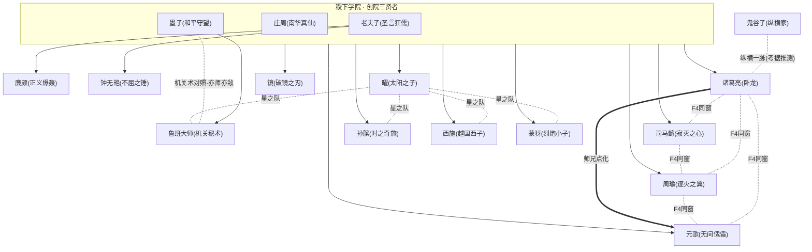

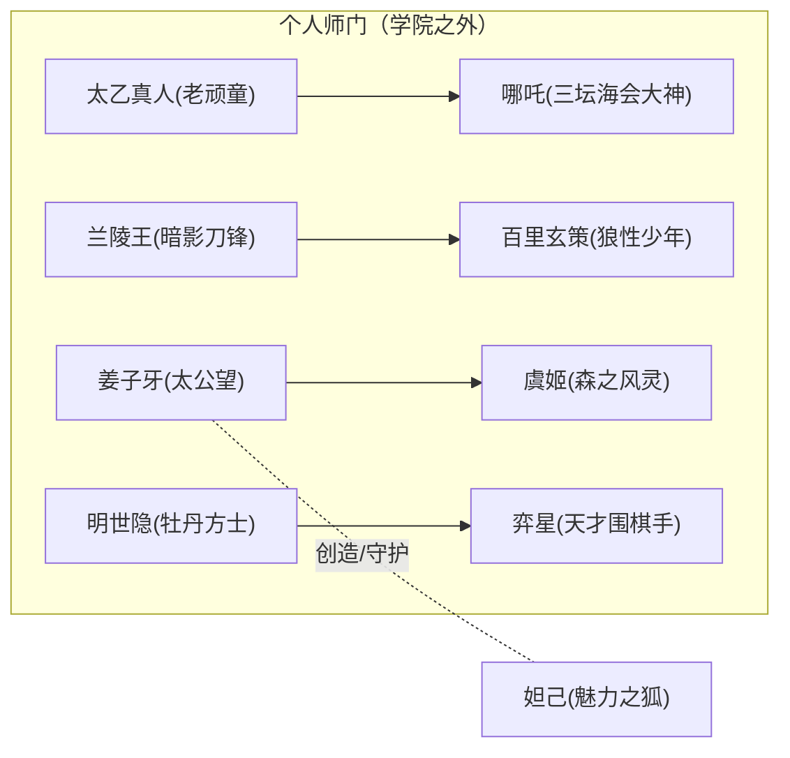

!!! note "为什么三贤者是『根』而非单一师父"
    稷下的传授并非「一对一拜师」的旧式师门，而更近于一所**学院通识教育**：老夫子主「言 / 礼 / 经义」，庄周主「道 / 心 / 梦」，墨子主「术 / 工 / 兼爱」。同一名学生（如诸葛亮）往往同时承三家之学，因此谱系图把三贤者画作一个共同的「根」，再向下分叉到各弟子。少数有明确个人师承的（如廉颇、钟无艳同出老夫子门），才单独连到具体贤者。

---

## 三、稷下学院：三贤者门下的「百家讲堂」

老夫子·战士庄周·辅助墨子·战士/法师

[稷下学院](../factions/jixia.md) 由三位创院贤者主持，奉行「有教无类」——不问出身、不论资质，肯学者皆可入门。这条原则像一台巨大的播种机，把人才撒向天下：日后效力 [蜀](../factions/sanfen-shu.md)、[魏](../factions/sanfen-wei.md)、[吴](../factions/sanfen-wu.md) 的谋臣，[墨家机关城](../factions/mojia-jiguan.md) 的巧匠，乃至 [长安](../factions/changan.md) 的星之子，许多都能在稷下的讲堂里找到少年时的座位。

!!! quote "稷下精神"
    「学无前后，达者为师。」——稷下「有教无类」之训（考据推测：综合阵营设定凝练）

### 3.1 三位创院贤者档案

| 贤者 | 称号 | 主授之学 | 当前阵营/去向 | 一句话定位 |
|------|------|----------|----------------|------------|
| [老夫子](../heroes/jixia.md#老夫子) | 圣言狂儒 | 言、礼、经义、儒道 | [稷下学院](../factions/jixia.md) | 以「圣言」束缚强敌的狂放大儒 |
| [庄周](../heroes/penglai-donghai.md#庄周) | 南华真仙 | 道、心、梦境、逍遥 | 后归 [蓬莱·东海](../factions/penglai-donghai.md)；仍办「归虚梦演大赛」 | 梦蝶逍遥、超然物外的道家真仙 |
| [墨子](../heroes/mojia-jiguan.md#墨子) | 和平守望 | 术、工、机关、兼爱非攻 | 与 [墨家机关城](../factions/mojia-jiguan.md) 一脉相连 | 主张「非攻」、以机关止战的守望者 |

!!! info "庄周的双重身份"
    [庄周](../heroes/penglai-donghai.md#庄周) 在英雄目录中归入 **[蓬莱·东海](../factions/penglai-donghai.md)**（海外·远东），却是稷下三贤者之一，并继续主办面向稷下学子的 **「归虚梦演大赛」**——正是这场大赛催生了 [曜](../heroes/changan.md#曜) 的「星之队」（见第六节）。这说明「贤者」的身份并不被地理阵营锁死：庄周可以人在东海，魂系稷下。

### 3.2 门下弟子全景

下表把官方关系数据中列入「三贤者门下」的弟子逐一展开，并标注其**最终阵营**与**师承切面**。可以直观看到「同一座学院，散作满天星」。

| 弟子 | 称号 | 最终阵营 | 师承 / 同窗切面 |
|------|------|----------|------------------|
| [诸葛亮](../heroes/sanfen-shu.md#诸葛亮) | 卧龙 | [蜀](../factions/sanfen-shu.md) | 稷下高材；F4之一；元歌之师兄；司马懿之挚友→宿敌 |
| [司马懿](../heroes/sanfen-wei.md#司马懿) | 寂灭之心 | [魏](../factions/sanfen-wei.md) | F4之一；与诸葛亮同窗共寻天书，后离院成宿敌 |
| [周瑜](../heroes/sanfen-wu.md#周瑜) | 逐火之翼 | [吴](../factions/sanfen-wu.md) | F4之一；后与 [小乔](../heroes/sanfen-wu.md#小乔) 结为夫妻 |
| [元歌](../heroes/sanfen-shu.md#元歌) | 无间傀儡 | [蜀](../factions/sanfen-shu.md) | F4之一；失语孤儿，受师兄诸葛亮点化专研傀儡 |
| [孙膑](../heroes/jixia.md#孙膑) | 时之奇旅 | [稷下](../factions/jixia.md) | 星之队成员；通晓机关与时之力 |
| [钟无艳](../heroes/jixia.md#钟无艳) | 不屈之锤 | [稷下](../factions/jixia.md) | 老夫子门下；与 [廉颇](../heroes/haojing-fengshen.md#廉颇) 同门兼官配 |
| [廉颇](../heroes/haojing-fengshen.md#廉颇) | 正义爆轰 | [封神·众神](../factions/haojing-fengshen.md) | 老夫子门下；与钟无艳官配，见 [恋人页](../relationships/lovers.md) |
| [西施](../heroes/baiyue.md#西施) | 越国西子 | [百越](../factions/baiyue.md) | 星之队成员 |
| [曜](../heroes/changan.md#曜) | 太阳之子 | [长安](../factions/changan.md) | 星之队队长；以李白为偶像 |
| [蒙犽](../heroes/yunzhong-modi.md#蒙犽) | 烈炮小子 | [云中漠地](../factions/yunzhong-modi.md) | 星之队成员 |
| [鲁班大师](../heroes/mojia-jiguan.md#鲁班大师) | 机关秘术 | [墨家机关城](../factions/mojia-jiguan.md) | 星之队成员；墨家机关一脉 |
| [镜](../heroes/changan.md#镜) | 破镜之刃 | [长安](../factions/changan.md) | 携弟 [曜](../heroes/changan.md#曜) 流浪至稷下，经「万镜之厅」试炼获力 |

??? note "镜与曜：以稷下为落脚点的姐弟（点击展开）"
    [镜](../heroes/changan.md#镜) 与 [曜](../heroes/changan.md#曜) 出身古老的神职者家族，父母为镇守「玄雍海沟」怪物的守护者，后双双失踪。镜抹去二人身份，带着弟弟曜流浪，最终来到 **稷下**：镜在此经「万镜之厅」试炼获得力量，曜则钻研星辰之力并组建星之队。对这对姐弟而言，稷下既是求学之地，也是失根之后的栖身所在。姐弟血缘细节见 [血缘与家族](../relationships/kinship.md)，此处仅取其「以稷下为师承落脚点」一面。
    （注：镜、曜在英雄目录中现归 [长安城](../factions/changan.md) 阵营，与稷下渊源属早年经历。）

??? note "嬴政与白起：另一对「结伴赴稷下」的同窗（点击展开）"
    除上述弟子外，玄雍少年君主 [嬴政](../heroes/changan.md#嬴政)（政）与挚友 [白起](../heroes/jixia.md#白起)（人间兵器）也曾**结伴求学于稷下**：嬴政为强国引才而往，途中二人遭血族袭击，白起为护嬴政而**面部受伤、感染血族之力**，这股力量后由 [庄周](../heroes/penglai-donghai.md#庄周) 以魔导之术封印。数十年的共生塑造了嬴政对他人之苦的共情。
    严格说，二人的官方关系定性是**「君臣 / 情同手足」**而非师徒，故本页仅取其「同往稷下、同窗求学」一面；其君臣与生死羁绊详见 [战友与团体](../relationships/squad.md) 与 [稷下学院](../factions/jixia.md) 阵营页。这也再次印证稷下「关系网枢纽」的地位——同一座学府里，既走出 F4、星之队，也走出玄雍崛起的君臣二人组。

### 3.3 一图看尽：稷下的「人才出口」

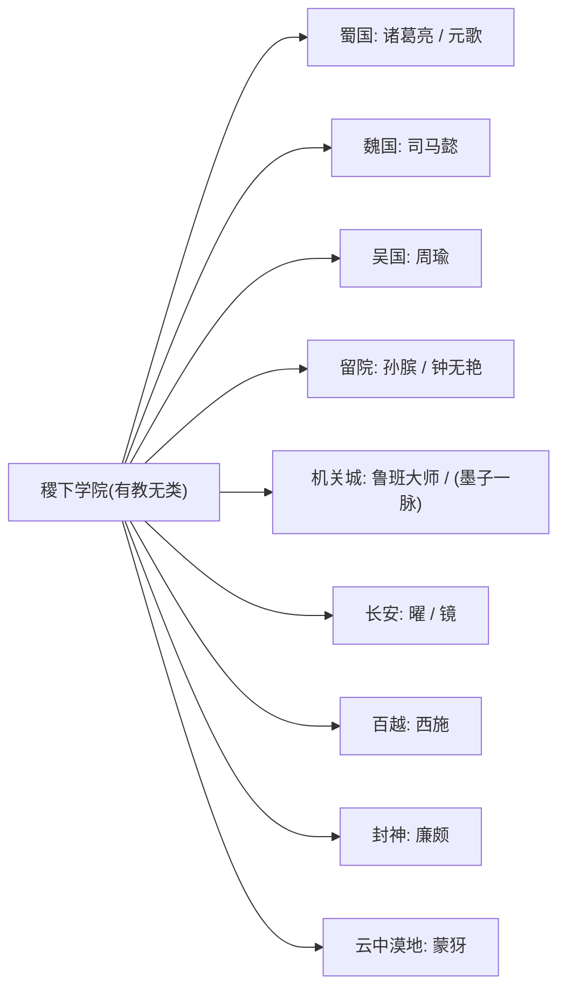

---

## 四、稷下F4：学院最负盛名的同窗团体

诸葛亮·法师司马懿·法师/刺客周瑜·法师元歌·刺客

「稷下F4」是 [稷下学院](../factions/jixia.md) 历史上最负盛名的**学生团体**——四位才华横溢的同窗，日后各自走向天下舞台的不同位置，是「同一片讲堂、四种命运」的最佳注脚。

| 成员 | 称号 | 在校形象（考据推测） | 学成去向 |
|------|------|----------------------|----------|
| [诸葛亮](../heroes/sanfen-shu.md#诸葛亮) | 卧龙 | 博学多才、温润师兄 | 出仕 [蜀国](../factions/sanfen-shu.md)，谋定天下 |
| [司马懿](../heroes/sanfen-wei.md#司马懿) | 寂灭之心 | 冷峻深沉、心怀秘密 | 远走 [魏国](../factions/sanfen-wei.md)，成卧龙宿敌 |
| [周瑜](../heroes/sanfen-wu.md#周瑜) | 逐火之翼 | 意气风发、风流儒将 | 归 [吴国](../factions/sanfen-wu.md)，娶小乔 |
| [元歌](../heroes/sanfen-shu.md#元歌) | 无间傀儡 | 沉默寡言、操纵傀儡 | 随蜀而行，以傀儡为语言 |

!!! quote "卧龙台词"
    「天下大势，了然于胸。」——[诸葛亮](../heroes/sanfen-shu.md#诸葛亮)

!!! tip "F4内部的『支线网络』"
    F4绝非铁板一块的友谊，其内部至少嵌着两条戏剧张力极强的支线——
    - **诸葛亮 ↔ 司马懿**：同窗挚友 → 官方钦定宿敌（见 4.2）。
    - **诸葛亮 → 元歌**：师兄对失语师弟的点化与提携（见 4.1）。
    其余两两关系（如周瑜与三人）多停留在同窗情谊层面，未有官方深描。

### 4.1 诸葛亮 — 元歌：以傀儡代喉舌的师兄弟

[元歌](../heroes/sanfen-shu.md#元歌) 幼年受惊而**失语**，作为孤儿进入 [稷下学院](../factions/jixia.md)。在他被沉默与孤独包裹之时，是博学的师兄 [诸葛亮](../heroes/sanfen-shu.md#诸葛亮) 鼓励他——既然口不能言，便以**机关傀儡**代替喉舌，与世界交流。自此元歌一头扎进傀儡之术，把「无间傀儡」练到出神入化。

这是一段典型的「同窗中的提携」：诸葛亮并非元歌名义上的师父，却以师兄之姿，为他指出了一条用「造物」替代「言语」的人生路径。可以说，元歌的整个技艺与人格，都生根于那一句师兄的鼓励。

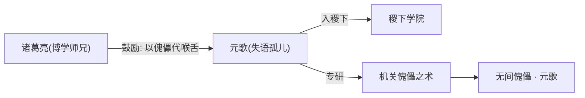

### 4.2 诸葛亮 — 司马懿：从同窗挚友到钦定宿敌

这是稷下师承谱系里最沉重的一条线。青年时期，[诸葛亮](../heroes/sanfen-shu.md#诸葛亮) 与 [司马懿](../heroes/sanfen-wei.md#司马懿) 同在稷下相识，**因才华而彼此欣赏**，曾携手共寻「天书碎片」。然而司马懿在追寻真相的途中，发现了当年的某段隐情——出于不愿憎恨挚友的复杂心境，他选择**离开稷下**。

此后二人各为其主：诸葛亮辅 [蜀](../factions/sanfen-shu.md)，司马懿仕 [魏](../factions/sanfen-wei.md)。官方在司马懿的英雄宣传中明确以「**诸葛亮的宿敌来了**」定调——昔日并肩寻书的同窗，成了棋盘两端最难缠的对手。

!!! quote "寂灭之心"
    「我本可以成为任何人……包括，你的敌人。」——[司马懿](../heroes/sanfen-wei.md#司马懿)（台词意译，考据推测）

!!! note "同窗→宿敌的双重定性"
    这段关系横跨「同窗」与「宿敌」两个维度：作为**师承切面**，它属于稷下F4内部的同窗情谊；作为**对抗切面**，它是官方钦定的宿敌。本页只取前者，后者请见 [宿敌与对立](../relationships/rivalry.md)。

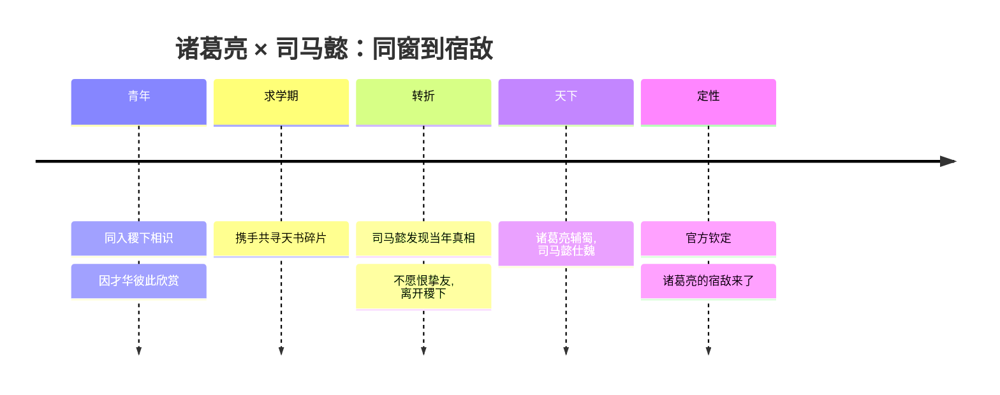

---

## 五、鬼谷子：纵横一脉之祖

鬼谷子·辅助

## 鬼谷子

[鬼谷子](../heroes/jixia.md#鬼谷子)，称号「纵横家」，归属 [稷下学院](../factions/jixia.md)（学院·机关）。在英雄设定中，他是**纵横之术**的代表人物——以言辞、谋略、合纵连横之道纵横捭阖，是「以智御势」的化身。

!!! info "为何把鬼谷子单列为一『根』"
    在官方关系数据中，**鬼谷子并未被直接列入「三贤者门下」名单**，因此本页将其作为与三贤者**并列的另一师承之根**处理：三贤者代表「学院式通识」，鬼谷子代表「纵横家的个人师门」传统。二者同处稷下学院的设定空间，却是两条不同的智慧脉络。

!!! warning "门徒名单：官方数据中并未直接给出"
    历史与诸子传说里，鬼谷子门下名家辈出（如苏秦、张仪、孙膑、庞涓等纵横、兵家弟子）。但**本仓库提供的关系数据并未把任何在世英雄明确标注为「鬼谷子门徒」**。因此：
    - 凡涉及具体「鬼谷子→某英雄」的师承，本页一律以 **「(考据推测)」** 标注，不作为硬设定。
    - 已收录英雄中，[孙膑](../heroes/jixia.md#孙膑)（时之奇旅，稷下）在传统典故里与鬼谷子渊源最深，可视为「纵横/兵家一脉」的呼应（考据推测），但官方数据仅将其列入三贤者门下与星之队，**未坐实其师从鬼谷子**。
    - [诸葛亮](../heroes/sanfen-shu.md#诸葛亮) 的「纵横捭阖」之才与鬼谷子的纵横术气质相通，谱系图中以虚线「纵横一脉(考据推测)」相连，仅为风格呼应，非官方师承。

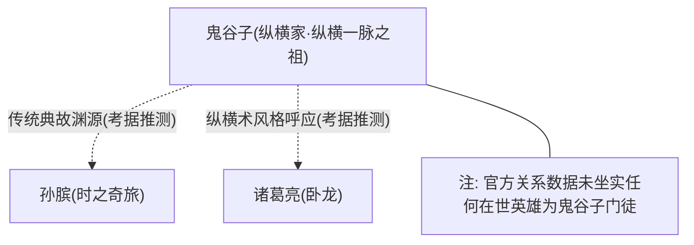

---

## 六、星之队：稷下学子的「梦演战队」

曜·战士/刺客蒙犽·射手孙膑·辅助/法师西施·法师鲁班大师·辅助

如果说稷下F4是「学霸天团」，那么 **星之队** 就是稷下的「青春热血社团」。它由 [曜](../heroes/changan.md#曜) 在稷下组建，目的是参加 [庄周](../heroes/penglai-donghai.md#庄周) 主办的 **「归虚梦演大赛」**。

| 成员 | 称号 | 阵营 | 在队角色（考据推测） |
|------|------|------|----------------------|
| [曜](../heroes/changan.md#曜) | 太阳之子 | [长安](../factions/changan.md) | 队长、发起人；以 [李白](../heroes/changan.md#李白) 为偶像 |
| [蒙犽](../heroes/yunzhong-modi.md#蒙犽) | 烈炮小子 | [云中漠地](../factions/yunzhong-modi.md) | 火力担当、活宝 |
| [孙膑](../heroes/jixia.md#孙膑) | 时之奇旅 | [稷下](../factions/jixia.md) | 智囊、机关与时之力 |
| [西施](../heroes/baiyue.md#西施) | 越国西子 | [百越](../factions/baiyue.md) | 控场、灵巧 |
| [鲁班大师](../heroes/mojia-jiguan.md#鲁班大师) | 机关秘术 | [墨家机关城](../factions/mojia-jiguan.md) | 机关支援、辅助 |

对曜而言，星之队不只是一支参赛队伍，更是他**寻找自我认知**的旅程——在与伙伴并肩的「梦演」之中，他收获了友谊、能量，也逐渐认清了自己究竟想成为怎样的人。这条线把「同窗」从单纯的「同学」升华为「共同成长的伙伴」。

!!! quote "太阳之子"
    「我的征途，是星辰大海！」——[曜](../heroes/changan.md#曜)

!!! tip "偶像也是一种『师』"
    曜以 [李白](../heroes/changan.md#李白)（青莲剑仙）为偶像。虽非正式师徒，但「以某人为楷模、循其足迹精进」本身就是一种隐性的「私淑」——在精神层面，李白之于曜，亦师亦灯塔。

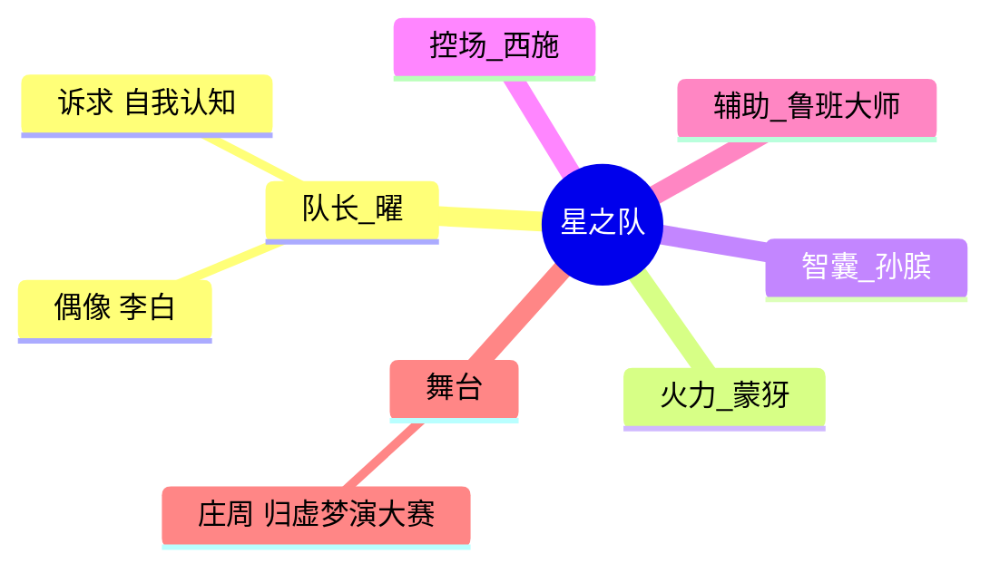

---

## 七、个人师门：学院之外的一对一传承

并非所有师承都发生在稷下的讲堂里。以下四组（外加封神一对特殊的「创造—守护」）属于**一对一的个人师门**，关系往往更私密、更刻骨。

### 7.1 太乙真人 — 哪吒：以心换心的炼金师徒

太乙真人·辅助/坦克哪吒·战士

## 太乙真人

## 哪吒

在 [镐京·封神](../factions/haojing-fengshen.md) 的体系中，[太乙真人](../heroes/haojing-fengshen.md#太乙真人)（老顽童）既是 [哪吒](../heroes/haojing-fengshen.md#哪吒)（三坛海会大神）的**师父**，也是他**唯一的朋友**。这段师徒情的浓度，远超一般的传道授业：

- 当哪吒濒死之际，太乙真人将**「奇迹钥匙」**换入他的心脏，把他从死亡线上拽了回来。
- 陈塘关覆灭之后，太乙真人以**自己的心脏**为代价，施展炼金术，使哪吒凭借**莲花**得以重生。

两度续命，一次以「钥匙」、一次以「心脏」——师父用生命的一部分，反复把徒弟从虚无中重新铸造出来。这已不是「教与学」，而是「以己之身，再造其生」。

!!! quote "老顽童"
    「师父我，可是很厉害的哦！」——[太乙真人](../heroes/haojing-fengshen.md#太乙真人)

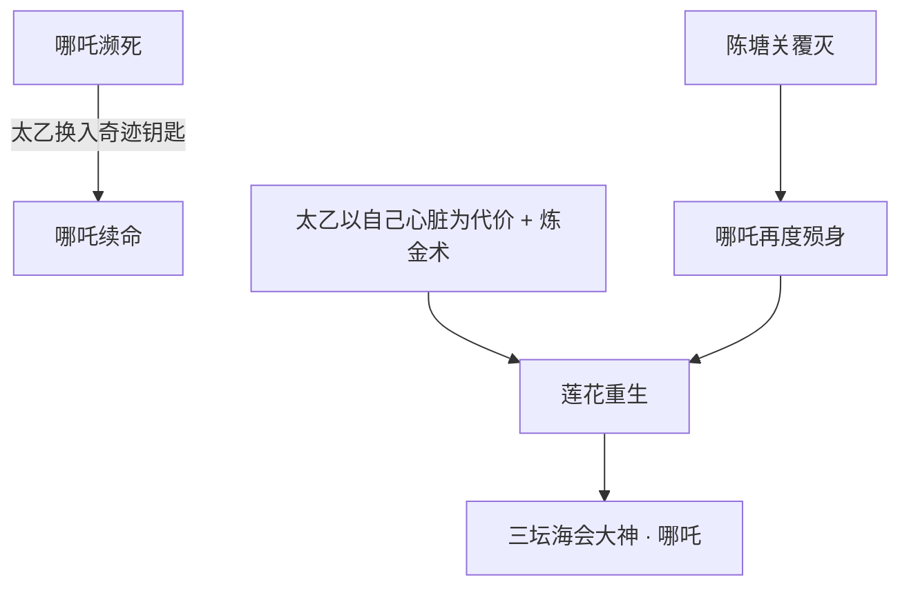

### 7.2 兰陵王 — 百里玄策：暗影一脉

兰陵王·刺客百里玄策·刺客

## 兰陵王

## 百里玄策

[百里玄策](../heroes/changcheng.md#百里玄策)（狼性少年）幼时被马贼掳走、与兄长 [百里守约](../heroes/changcheng.md#百里守约) 失散，几经辗转，被 [铠](../heroes/changan.md#铠) 所救，又被 [兰陵王](../heroes/modao-shadow-abyss.md#兰陵王)（暗影刀锋）**收留并收为徒弟**。兰陵王把一身本领倾囊相授：

- **暗影潜行**之术；
- **钩镰**的运用；
- 以及——**杀戮**的法则。

这正是玄策日后「狼性」的来源：他的身手、他的狠厉，都带着兰陵王这一脉「魔道·暗影」的烙印。后来，兰陵王将玄策**托付给 [花木兰](../heroes/changan.md#花木兰)**，玄策由此加入 [长城守卫军](../factions/changcheng.md)，从暗影刺客转向边境守卫——这是一场跨阵营的「师父放手」。

!!! note "师承的『阵营漂移』"
    玄策的师承（[兰陵王](../heroes/modao-shadow-abyss.md#兰陵王)，魔道·暗影）与最终阵营（[长城守卫军](../factions/changcheng.md)，北疆）分属对立的世界角落。这与稷下F4「学习地≠立场地」是同一种叙事母题：**师父给了技艺，命运给了立场。** 玄策与兄长 [百里守约](../heroes/changcheng.md#百里守约) 的兄弟羁绊见 [血缘与家族](../relationships/kinship.md)；他与引路人 [花木兰](../heroes/changan.md#花木兰) 及长城同袍的关系见 [战友与团体](../relationships/squad.md) 与 [长城守卫军](../factions/changcheng.md) 阵营页。

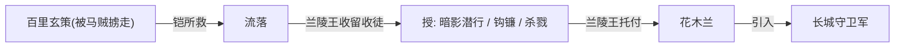

### 7.3 姜子牙 — 虞姬：封神门下的弟子

姜子牙·辅助/法师虞姬·射手

## 姜子牙

## 虞姬

[虞姬](../heroes/haojing-fengshen.md#虞姬)（森之风灵）是 [姜子牙](../heroes/haojing-fengshen.md#姜子牙)（太公望）的**弟子**，二者同属 [镐京·封神](../factions/haojing-fengshen.md) 体系。这段师徒关系本身记载简洁，但它牵动了世界观中一条极具悲剧色彩的恋人支线：

- 虞姬在反抗阴阳家暴政的过程中，与西楚霸王 [项羽](../heroes/haojing-fengshen.md#项羽) 相爱；
- 后来因**师兄**的幻术圈套，虞姬射出的箭**误中了项羽**——「霸王别姬」的悲剧，由此而生。

也就是说，虞姬的「师门」（姜子牙弟子、与师兄同出一门）正是其爱情悲剧的导火索之一。师徒之线与恋人之线在此交织。

!!! warning "交叉指引"
    [项羽](../heroes/haojing-fengshen.md#项羽)—[虞姬](../heroes/haojing-fengshen.md#虞姬) 的恋人切面（含「霸王别姬」官配皮肤）属 [恋人与 CP](../relationships/lovers.md) 页范畴，本页只取「虞姬为姜子牙弟子」「师兄设幻术圈套」这一师门切面。

### 7.4 姜子牙 — 妲己：创造者与守护者（非典型师承）

姜子牙·辅助/法师妲己·法师

## 妲己

在**现行世界观**中，[妲己](../heroes/haojing-fengshen.md#妲己)（魅力之狐）并非天生妖狐，而是 [姜子牙](../heroes/haojing-fengshen.md#姜子牙) **以机关术造形、以魔法注魂**而成的人偶，后被献予纣王。因此姜子牙之于妲己，是**创造者与守护者**——这是一种比「师徒」更根本的关系：不是「教她成为她」，而是「造出了她」。

!!! note "版本演变提示"
    妲己的设定经历过版本变化（早期更偏传统「狐妖祸国」，现行设定改为姜子牙的造物）。本条按**现行设定**收录，并提醒读者注意其演变。严格说这属于「创造—守护」而非「师徒」，列于此处是因为它与姜子牙的「育人 / 造物」师门气质相邻。

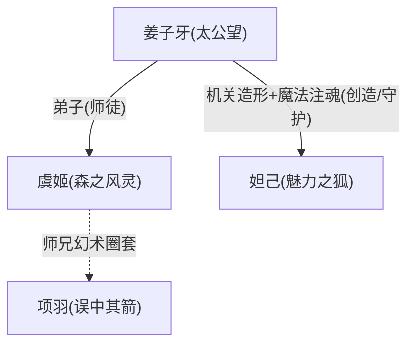

### 7.5 明世隐 — 弈星：尧天的导师与学生

明世隐·辅助弈星·法师

## 弈星

在 [长安](../factions/changan.md) 暗处活跃的神秘组织 **尧天** 中，牡丹方士 [明世隐](../factions/changan.md) 既是众人的**首领**，也是 [弈星](../heroes/jixia.md#弈星)（天才围棋手）的**导师 / 师父**。这是官方关系数据明确给出的「导师—学生」关系。

弈星本是棋艺天才，被 [公孙离](../heroes/changan.md#公孙离)「视如弟」、被明世隐收留。明世隐以导师之姿引领弈星——尧天以占卜、谋略活跃于长安暗处，弈星的「围棋即天下」之道，正是在这位师父的指点下走向成熟。

!!! info "尧天内部的师承—首领双重身份"
    明世隐对弈星「既是首领、又是师父」，这种「组织领袖兼个人导师」的双重身份，与太乙真人对哪吒「既是师父、又是唯一的朋友」异曲同工——在《王者荣耀》里，最深的师徒往往不止于「师徒」一种名分。尧天的整体阵营网络（以明世隐为核心，含 [公孙离](../heroes/changan.md#公孙离)、[杨玉环](../heroes/changan.md#杨玉环)、[裴擒虎](../heroes/baiyue.md#裴擒虎)）见 [长安城](../factions/changan.md) 阵营页与 [战友与团体 · 尧天](../relationships/squad.md) 一节；尧天与 [狄仁杰](../heroes/changan.md#狄仁杰) 一方的政治对峙见 [宿敌与对立](../relationships/rivalry.md)。

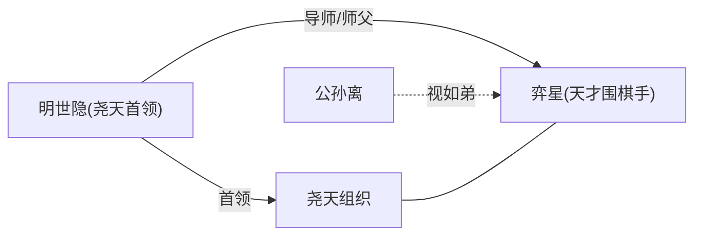

---

## 八、亦师亦敌：墨子 — 鲁班大师的机关术对照

墨子·战士/法师鲁班大师·辅助

## 墨子

## 鲁班大师

这是一组特殊的「师承式」关系——它不是单向的「师→徒」，而是两种顶尖工艺的**对照与互相折服**。[墨子](../heroes/mojia-jiguan.md#墨子)（和平守望）曾与名匠**公输般（即 [鲁班大师](../heroes/mojia-jiguan.md#鲁班大师)）**进行机关攻防演练：墨家的机关之术对阵鲁班的工巧之艺，演练之中彼此折服，构成了「**墨家机关 vs 鲁班工巧**」的经典对照。

| 维度 | 墨子（墨家） | 鲁班大师（公输般） |
|------|--------------|--------------------|
| 核心 | 机关 + 兼爱非攻 | 工巧 + 造物之奇 |
| 立场 | 以机关「止战」 | 以巧艺「造物」 |
| 演练结果 | 攻防之中互相折服 | 攻防之中互相折服 |
| 在谱系中 | 稷下三贤者之一、机关一脉之源 | 三贤者门下、星之队成员 |

!!! note "为何归入本页"
    严格说墨子与鲁班大师是「同侪 / 切磋」而非典型师徒，且官方记载较弱（细节有限）。但鲁班大师在三贤者门下名单中、墨子又是其师承之根，二者本就处在同一条「机关」脉络上；这场攻防演练，是「在切磋中传承技艺」的另一种师承样态，故收录于此。

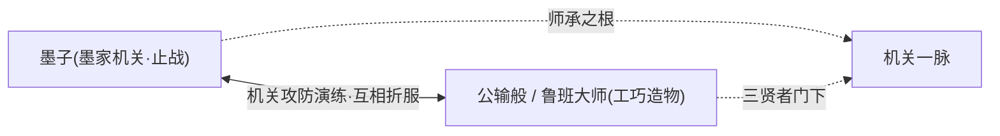

---

## 九、师承网络速览：一张「谁教了谁」的全景图

- :material-school: __学院式师承__

    ---

    三贤者（老夫子 / 庄周 / 墨子）门下，散作蜀魏吴与机关、长安、百越满天星。核心是 **稷下F4** 与 **星之队** 两大学生团体。

- :material-account-supervisor: __一对一师门__

    ---

    太乙真人→哪吒（以心换心）、兰陵王→百里玄策（暗影一脉）、姜子牙→虞姬（封神弟子）、明世隐→弈星（尧天导师）。

- :material-sword-cross: __师承的『漂移』__

    ---

    学习地往往不等于最终立场：诸葛亮 / 司马懿 / 周瑜 学于稷下却各仕蜀魏吴；玄策学于魔道却归长城。

- :material-help-circle: __考据存疑__

    ---

    鬼谷子作为「纵横一脉之祖」单列，但官方数据**未坐实任何在世英雄为其门徒**；相关连线均标 (考据推测)。

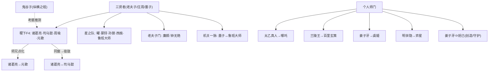

---

## 十、交叉指引

| 想了解 | 请前往 |
|--------|--------|
| 项羽—虞姬、周瑜—小乔、廉颇—钟无艳 等恋人切面 | [关系 · 恋人与 CP](../relationships/lovers.md) |
| 镜—曜、百里兄弟 等血缘切面 | [关系 · 血缘与家族](../relationships/kinship.md) |
| 诸葛亮—司马懿、墨子—鲁班 的宿敌/对立切面 | [关系 · 宿敌与对立](../relationships/rivalry.md) |
| 星之队、稷下 F4、尧天、长城等团体网络 | [关系 · 战友与团体](../relationships/squad.md) |
| 各类关系总览与导航 | [关系 · 总览](../relationships/index.md) |
| 稷下学院整体设定 | [稷下学院](../factions/jixia.md) |
| 墨家机关城与鲁班一脉 | [墨家机关城·天工坊](../factions/mojia-jiguan.md) |
| 长城守卫军（玄策、木兰、铠所在） | [长城守卫军](../factions/changcheng.md) |
| 尧天与长安暗局（明世隐、弈星、公孙离） | [长安城](../factions/changan.md) |
| 封神师徒（太乙—哪吒、姜子牙—虞姬/妲己） | [镐京·封神](../factions/haojing-fengshen.md) |

!!! quote "结语"
    「师者，所以传道、授业、解惑也。」在峡谷之中，这「传道」二字被演绎出无数形态：有人传的是机关傀儡（诸葛亮→元歌），有人传的是暗影杀戮（兰陵王→百里玄策），有人传的甚至是自己的心脏（太乙真人→哪吒）。当这些线交织成网，我们便看见——天下的对局，其实早在某座讲堂、某场演练、某次以心换心的瞬间，就埋下了伏笔。
