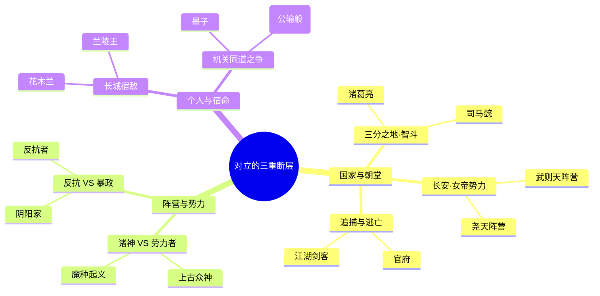
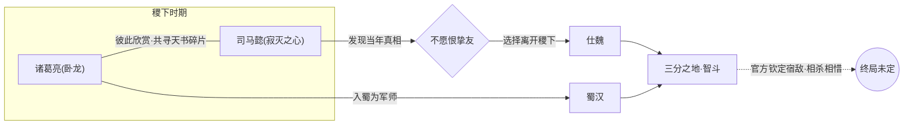
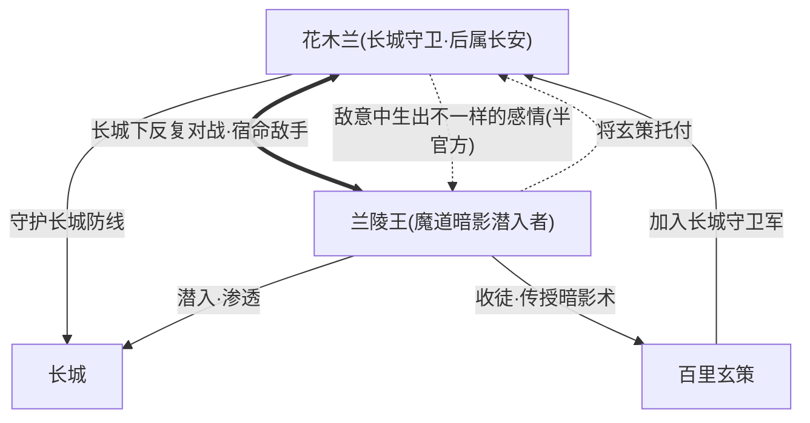
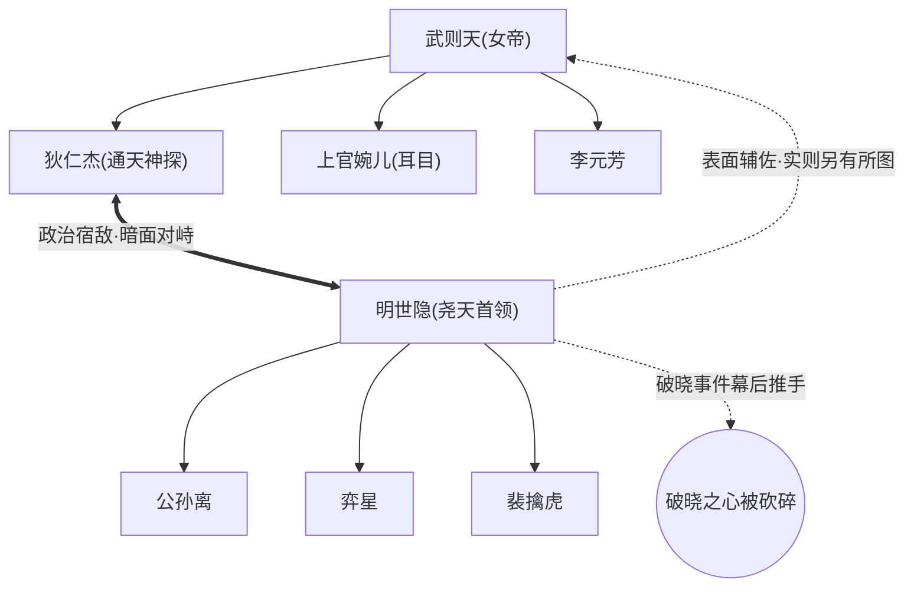
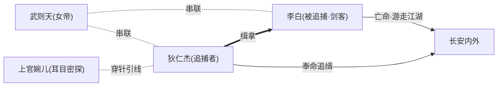
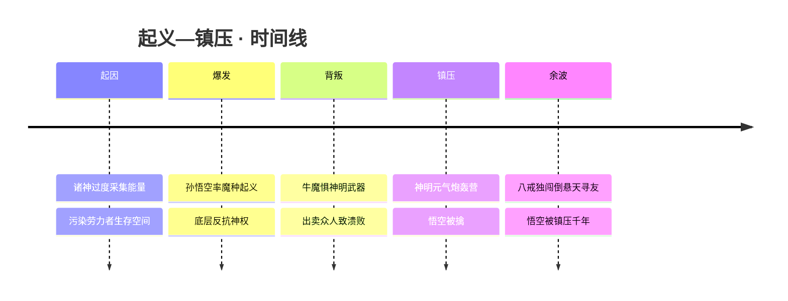
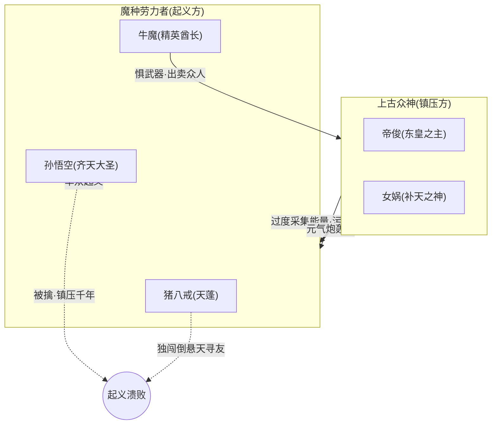
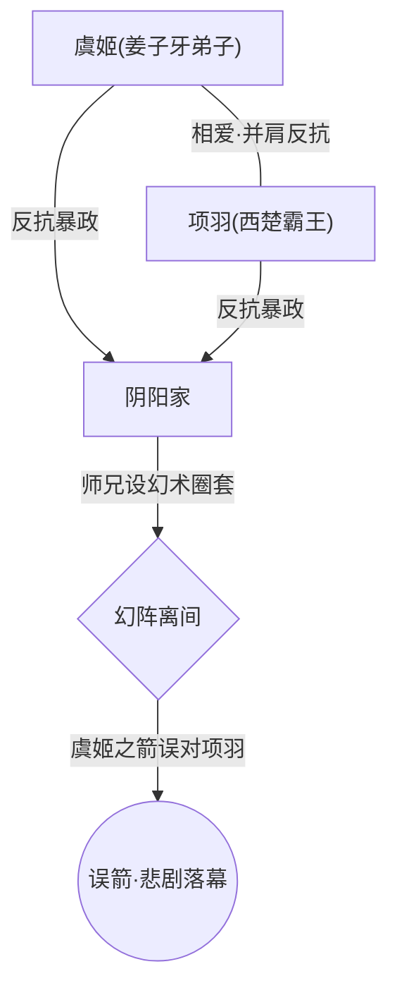
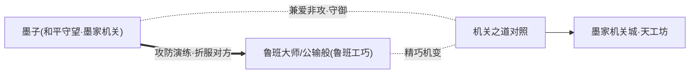
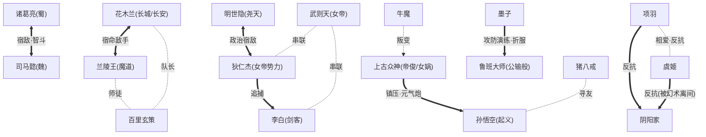

# 关系 · 宿敌与对立

> 有人因爱相守，便有人因恨、因道不同、因立场之异而刀剑相向。
> 本页专录《王者荣耀》世界观中**宿敌、敌手、政治对立、阵营级对立、追捕—逃亡、起义—镇压**六类关系。它们是这片大陆冲突的发动机：长安朝堂的暗流、稷下同窗的反目、长城脚下的夜战、倒悬天上诸神与劳力者的血火清算……每一组对立都是一段绵长的因果。
>
> 与本页互补的还有 [关系 · 恋人与情缘](lovers.md)、[关系 · 师徒与传承](mentor.md)、[关系 · 血亲与手足](kinship.md)、[关系 · 战友与团队](squad.md)。本页所有结论严格依据官方背景故事与游戏关系设定，玩家社区共识或推断之处均以「(考据推测)」标注。

---

## 总览 · 对立关系一览表

下表汇总本页详写的所有对立关系。「烈度」一栏为编者据剧情程度的主观分级，仅供阅读参考：★越多，敌对越深、越「不死不休」。

| 对立组合 | 关系类型 | 所属阵营（双方） | 烈度 | 现状 |
| --- | --- | --- | :---: | --- |
| [诸葛亮](../heroes/sanfen-shu.md#诸葛亮) ↔ [司马懿](../heroes/sanfen-wei.md#司马懿) | 挚友兼宿敌（智斗） | 蜀 / 魏 | ★★★★ | 持续对峙，相杀相惜 |
| [花木兰](../heroes/changan.md#花木兰) ↔ [兰陵王](../heroes/modao-shadow-abyss.md#兰陵王) | 宿命敌手（暧昧） | 长城·长安 / 魔道 | ★★★ | 长城夜战，纠葛未了 |
| [明世隐](../worldview/eras.md) ↔ [狄仁杰](../heroes/changan.md#狄仁杰) | 政治宿敌（暗面对峙） | 尧天 / 女帝势力 | ★★★★ | 长安城下暗潮汹涌 |
| [狄仁杰](../heroes/changan.md#狄仁杰) ↔ [李白](../heroes/changan.md#李白) | 追捕—逃亡 | 长安官府 / 江湖剑客 | ★★ | 猫鼠相逐，惺惺相惜 |
| [孙悟空](../heroes/shanggu-shenhua.md#孙悟空) 等 ↔ [帝俊](../heroes/haojing-fengshen.md#帝俊) · [女娲](../heroes/shanggu-shenhua.md#女娲) | 起义—镇压（阵营级） | 魔种劳力者 / 上古众神 | ★★★★★ | 起义溃败，余烬未熄 |
| [项羽](../heroes/haojing-fengshen.md#项羽) · [虞姬](../heroes/haojing-fengshen.md#虞姬) ↔ 阴阳家 | 反抗—暴政（被幻术离间） | 反抗者 / 阴阳家 | ★★★★ | 悲剧落幕，误箭成憾 |
| [墨子](../heroes/mojia-jiguan.md#墨子) ↔ [鲁班大师](../heroes/mojia-jiguan.md#鲁班大师)（公输般） | 机关术对照/竞技宿敌 | 墨家 / 鲁班工巧 | ★ | 攻防演练，亦敌亦友 |

::: info 什么算「对立」？
本页采纳的判定标准：双方在**立场、阵营、目标或生死**上存在结构性冲突，且这种冲突构成其角色叙事的主线之一。
因此——情侣间的「相爱相杀」（如 [李白](../heroes/changan.md#李白)×[韩信](../heroes/jianghu-xiake.md#韩信)）、纯粹历史阵营划分（蜀魏吴的普通同僚）不在此列；而像「挚友兼宿敌」这种**亦友亦敌**的复杂关系，因其敌对面被官方明确强调，故收入本页并着重剖析其双重性。
:::

::: details 六类对立的判定与边界（可折叠 · 进阶阅读）
为避免与姊妹页重复或冲突，本页对六类对立的收录边界做如下界定：

| 类型 | 核心特征 | 典型代表 | 与他页的边界 |
| --- | --- | --- | --- |
| **挚友兼宿敌** | 私谊深厚 + 立场必然对立 | 诸葛亮 ↔ 司马懿 | 其同窗情谊见 [师徒与传承](mentor.md)、[战友与团队](squad.md) |
| **宿命敌手** | 反复交锋中生情，立场不可调和 | 花木兰 ↔ 兰陵王 | 其恋人色彩解读见 [恋人与情缘](lovers.md) |
| **政治宿敌** | 暗面势力 vs 秩序维护者 | 明世隐 ↔ 狄仁杰 | 各自阵营见 [长安城](../factions/changan.md) |
| **追捕—逃亡** | 缉拿者 vs 逃亡者，动态平衡 | 狄仁杰 ↔ 李白 | 因女帝串联的关系网亦涉 [长安城](../factions/changan.md) |
| **起义—镇压** | 阶层 vs 神权，阵营级清算 | 魔种劳力者 ↔ 上古众神 | 阵营全貌见 [上古众神·神话](../factions/shanggu-shenhua.md) |
| **反抗—暴政** | 反抗者被幻术离间而自相残杀 | 项羽 · 虞姬 ↔ 阴阳家 | 其爱情完整叙述见 [恋人与情缘](lovers.md) |
:::

---

## 全局对立格局 · 思维导图

在进入逐组详解之前，先以一张思维导图鸟瞰大陆的几条主要「断层线」——它们大体可归为三个层级：**国家/朝堂之争**、**阵营/势力之争**、**个人/宿命之争**。

这些「断层线」并非孤立——它们交织在同一张大陆地图上。下面这张原创全图标出了各阵营的地理分布，可与上图的对立层级对照阅读：长安居中、长城北望、三分之地东出、镐京与倒悬天属神话语境的「上方」。

---

## 诸葛亮 ↔ 司马懿

诸葛亮 · 法师司马懿 · 法师司马懿 · 刺客

“[司马懿](../heroes/sanfen-wei.md#司马懿)，[诸葛亮](../heroes/sanfen-shu.md#诸葛亮)的宿敌来了。”——这句官方为司马懿造势的宣传语，几乎一锤定音地为二人钉上了「宿敌」的标签。然而越是细究他们的过往，越会发现：这是一对最不像敌人的敌人。

| 档案项 | 卧龙 · 诸葛亮 | 寂灭之心 · 司马懿 |
| --- | --- | --- |
| 称号 | 卧龙 | 寂灭之心 |
| 职业 | 法师 | 法师 / 刺客 |
| 现阵营 | [三分之地·蜀国](../factions/sanfen-shu.md) | [三分之地·魏国](../factions/sanfen-wei.md) |
| 求学之地 | [稷下学院](../factions/jixia.md) | [稷下学院](../factions/jixia.md) |
| 团体 | 稷下「F4」之一 | 稷下「F4」之一 |
| 关键物 | 天书碎片 | 天书碎片 / 当年真相 |

### 恩怨起因

诸葛亮与司马懿青年时同在[稷下学院](../factions/jixia.md)求学，是闻名学院的「稷下F4」（另两位为 [周瑜](../heroes/sanfen-wu.md#周瑜)、[元歌](../heroes/sanfen-shu.md#元歌)）成员。彼时二人**因才华彼此欣赏**，并肩同行，一同探寻散落世间的「天书碎片」——那是一段建立在惺惺相惜之上的同窗情谊，远谈不上仇怨。

转折点在于：**司马懿发现了当年的真相**。这桩真相的具体内容官方留白，但它足以撼动二人之间的全部根基。耐人寻味的是，司马懿即便知晓内情，**也不愿去恨这位挚友**——于是他选择了离开稷下，以「出走」代替「反目」。

::: info 「宿敌」二字的双重含义
司马懿的离开，与其说是决裂，不如说是一种克制的自我放逐。他不恨诸葛亮，却又注定要站在他的对面。这正是「挚友兼宿敌」的精髓：**敌对源于立场与命运，而非私人恩仇。** 这也使得二人的对峙，比寻常仇杀多了一层苍凉的底色。
:::

### 冲突经过

学成之后，二人各归其主——诸葛亮入[蜀](../factions/sanfen-shu.md)为「卧龙」军师，司马懿仕[魏](../factions/sanfen-wei.md)为权谋之臣。三分之地的天下棋局，由此成为这对昔日同窗智力交锋的主战场。一个以「卧龙」之名运筹帷幄、忠于仁德的理想；一个以「寂灭之心」之姿步步为营、深藏不可言说的图谋。

他们的对决不是兵刃相接的莽撞，而是**棋盘上的对弈、庙堂里的博弈**——每一步都建立在对彼此太过了解的基础上，因而每一次落子都格外沉重。

::: quote 台词回响
司马懿的诸多台词都笼罩着一层「寂灭」「算计」与「孤独」的气息，与诸葛亮「淡泊明志、宁静致远」式的从容形成鲜明对照。一冷一清、一谋一守，正是这对宿敌气质的写照。
:::

### 结局或悬念

官方并未为这段关系写下终局。它停留在一个最具张力的状态：**二人皆知对方底细，皆惜对方之才，却又不得不在天下棋局上分庭抗礼。** 「当年的真相」究竟为何、司马懿的图谋是否会反噬这段情谊、卧龙是否知晓挚友的离去缘由——这些都是留给后续剧情的巨大悬念。

---

## 花木兰 ↔ 兰陵王

花木兰 · 战士花木兰 · 刺客兰陵王 · 刺客

「双兰」是社区里热度极高的一对。官方的关系图为他们标注的定位是**「宿命」**——一段始于刀光剑影、在长城脚下反复交锋中生出微妙情愫的敌手关系。

| 档案项 | 传说之刃 · 花木兰 | 暗影刀锋 · 兰陵王 |
| --- | --- | --- |
| 称号 | 传说之刃 | 暗影刀锋 |
| 职业 | 战士 / 刺客 | 刺客 |
| 现阵营 | [长安城](../factions/changan.md)（曾驻守[长城守卫军](../factions/changcheng.md)防线） | [魔道·暗影·深渊](../factions/modao-shadow-abyss.md) |
| 招牌 | 双形态长剑 | 暗影潜行·钩镰 |
| 共同关联 | 接过 [百里玄策](../heroes/changcheng.md#百里玄策) 的队长 | [百里玄策](../heroes/changcheng.md#百里玄策) 之师 |

### 恩怨起因

在花木兰成为队长之前，她驻守长城一线。[兰陵王](../heroes/modao-shadow-abyss.md#兰陵王)作为来自[魔道·暗影·深渊](../factions/modao-shadow-abyss.md)的**潜入者**，屡次试图渗透长城防线。立场天然对立：一个是守护边境的卫者，一个是带着暗影使命而来的入侵者。于是「长城下对战」成了二人关系的起点——刀锋相向，是他们最初也最持久的语言。

### 冲突经过

据官方设定，花木兰**长期与潜入长城的兰陵王在长城下交锋**。这种交锋不是一次性的，而是反复、长久的——正是在这日复一日的生死相搏中，敌意之外渐渐生出了「不一样的感情」。这是一种典型的「敌手生情」：在最了解彼此剑路的人身上，反而读懂了对方的孤独。

值得一提的是，兰陵王还收留并教导了被 [铠](../heroes/changan.md#铠) 所救的 [百里玄策](../heroes/changcheng.md#百里玄策)，传授其暗影潜行、钩镰与杀戮之术，后又将玄策托付给花木兰——玄策由此进入长城守卫军。**这名少年成了连接这对宿敌的隐秘纽带**：一个是亲手栽培他的师父，一个是接过他的队长。（玄策的师徒线详见 [师徒与传承](mentor.md)，其与兄长 [百里守约](../heroes/changcheng.md#百里守约) 的手足线见 [血亲与手足](kinship.md)。）

::: warning 「恋人」之说：半官方，存暧昧
双兰的恋人色彩在玩家中流传甚广，但官方对此**态度审慎**：更多以「宿命 / 敌手」为正式定位，恋人意味暧昧而未坐实。官方甚至曾**辟谣**所谓「次元武士情侣皮肤」的传闻。因此，本页将其归入「宿命敌手」而非「恋人」，仅注明其情愫的存在。具体浪漫向解读见 [关系 · 恋人与情缘](lovers.md)。
:::

### 结局或悬念

二人的关系停留在「敌手—暧昧」的灰色地带：既未真正反目成仇，也未明确走到一起。立场的鸿沟（守卫者 vs 暗影潜入者）始终横亘其间，而那份在剑锋上萌生的感情则成了无解的悬念。**他们注定要在长城的月色下，一次次地以剑相认。**

---

## 明世隐 ↔ 狄仁杰

明世隐 · 辅助明世隐 · 法师狄仁杰 · 射手

长安城表面海晏河清，暗处却两股势力角力。一边是女帝 [武则天](../heroes/changan.md#武则天) 麾下的明面统治集团，一边是以牡丹方士 [明世隐](../worldview/eras.md) 为核心、活跃于暗处的「尧天」。而站在尧天对面、为女帝势力守护秩序的关键人物，正是通天神探 [狄仁杰](../heroes/changan.md#狄仁杰)。

::: info 考据 · 明世隐的页面归属
明世隐是可玩英雄，但在本百科的骨架中尚无独立英雄页；其身份以「尧天首领、长安暗处谋主」记述于 [纪元编年 · 破晓事件](../worldview/eras.md) 与 [阵营 · 长安城](../factions/changan.md)。故本页对明世隐的链接统一指向 [纪元编年](../worldview/eras.md)，与全站一致。(考据推测：其在游戏内的常见定位为辅助 / 法师「牡丹方士」。)
:::

| 档案项 | 牡丹方士 · 明世隐 | 通天神探 · 狄仁杰 |
| --- | --- | --- |
| 称号 | 牡丹方士（霓裳/占卜者形象） | 通天神探 |
| 职业 | 辅助 / 法师 | 射手 |
| 立场 | [尧天](../factions/changan.md) 首领 | 女帝势力 · 探案者 |
| 手段 | 占卜、谋略、暗中布局 | 推理、查案、追缉 |
| 核心矛盾 | 表面辅佐女帝，实则另有所图 | 维护盛世秩序，揭破暗谋 |

### 恩怨起因

「尧天」是一个**表里不一**的组织：它表面上辅佐女帝武则天维护长安盛世，实则**另有所图**。明世隐作为尧天的首领（同时也是 [弈星](../heroes/jixia.md#弈星) 的导师），借占卜与谋略在长安暗处编织自己的棋局。

而狄仁杰，作为洞察秋毫的「通天神探」，其职责恰恰是揭开一切隐藏在盛世之下的阴谋。当一个组织在暗中谋划、另一个人专门追查暗谋，二者的对峙便不可避免——这是一场**「隐藏者」与「揭露者」之间的结构性对立**。

### 冲突经过

尧天与狄仁杰为首的势力在长安城内**长期对峙**。这种对峙更多是谍影重重的暗战：明世隐以方士之能布下迷局，狄仁杰则以神探之眼层层抽丝。明面上的长安朝堂之下，是看不见硝烟的较量。

更深一层的暗线在于：明世隐被视为**[破晓事件](../worldview/eras.md)的幕后推手**——正是在他的谋划下，[花木兰](../heroes/changan.md#花木兰) 砍碎了「破晓之心」。这意味着狄仁杰所要揭破的，远不止一桩寻常阴谋，而是牵动整座长安乃至「方舟之秘」的惊天棋局。(考据推测：狄仁杰是否已查到破晓事件与明世隐的关联，官方尚未明示。)

::: info 长安「三方棋局」
长安城的权力结构可粗分为三方，互相牵制：

- **女帝势力**：[武则天](../heroes/changan.md#武则天) 为核心，[上官婉儿](../heroes/changan.md#上官婉儿)（耳目密探）、[狄仁杰](../heroes/changan.md#狄仁杰)、[李元芳](../heroes/changan.md#李元芳) 等为爪牙。
- **尧天**：[明世隐](../worldview/eras.md) 为首领，[公孙离](../heroes/changan.md#公孙离)、[弈星](../heroes/jixia.md#弈星)、[杨玉环](../heroes/changan.md#杨玉环)、[裴擒虎](../heroes/baiyue.md#裴擒虎) 等活跃于暗处。
- **江湖游离者**：如 [李白](../heroes/changan.md#李白)，被官府追缉，却又游走于各方之间。

明世隐↔狄仁杰的对立，正是前两方矛盾的人格化集中。（尧天群像见 [战友与团队 · 尧天](squad.md)；女帝势力的主仆羁绊见 [师徒与传承](mentor.md)。）
:::

### 结局或悬念

尧天「另有所图」的真正目的、它与女帝之间究竟是辅佐还是颠覆、狄仁杰能否识破并阻止——官方均留作悬念。这是一段**仍在进行中**的政治宿敌关系，长安的暗潮远未平息。

---

## 狄仁杰 ↔ 李白

狄仁杰 · 射手李白 · 刺客

如果说明世隐与狄仁杰的对立是「暗对暗」，那么狄仁杰与 [李白](../heroes/changan.md#李白) 的关系则是一场**台面上的「猫鼠游戏」**：一个是奉命缉拿的神探，一个是放浪形骸的剑仙逃客。

| 档案项 | 通天神探 · 狄仁杰 | 青莲剑仙 · 李白 |
| --- | --- | --- |
| 称号 | 通天神探 | 青莲剑仙 |
| 职业 | 射手 | 刺客 |
| 角色 | 追捕者（官府） | 被追捕者（江湖剑客） |
| 关联人物 | 武则天、上官婉儿 | 武则天、上官婉儿 |

### 恩怨起因

在长安城内，**李白是狄仁杰的追捕对象**。李白虽身怀绝世剑术、性情潇洒不羁，却因种种缘由（剑术高强、行事张扬、与朝堂之间的纠葛）成了官府眼中需要缉拿的人物。狄仁杰受命办案，李白则四处避走——「追捕—逃亡」的格局由此成形。

### 冲突经过

这段关系并非你死我活的死仇，而更像是一种**心照不宣的角力**。狄仁杰追，李白逃，二人之间隔着一张由女帝 [武则天](../heroes/changan.md#武则天) 串联起来的关系网——李白、狄仁杰、武则天、[上官婉儿](../heroes/changan.md#上官婉儿) 因女帝而彼此勾连。

::: info 因女帝而起的关系网
官方背景里，「李白—狄仁杰—武则天—上官婉儿」是因女帝串联在一起的一组人物。李白与朝堂的纠葛、狄仁杰的奉命行事、上官婉儿作为女帝耳目的穿针引线，使这场追逃不仅是个人恩怨，更牵动着长安朝堂的暗线。
:::

### 结局或悬念

「追捕—逃亡」的状态本身即是一种动态平衡：神探未必真想置剑仙于死地，剑仙也始终未被擒获。**这是一场可能永远不会有赢家的追逐**——它的悬念在于，当朝堂的真正图谋浮出水面时，这对追逃者会否反而站到同一阵线。(考据推测：二人「惺惺相惜」更多是社区基于人物气质的解读，官方仅明确「追捕对象」这一硬设定。)

---

## 起义—镇压 · 诸神 ↔ 魔种劳力者（阵营级对立）

孙悟空 · 刺客孙悟空 · 战士牛魔 · 坦克猪八戒 · 坦克帝俊 · 战士女娲 · 法师

这是本页烈度最高的一组对立——**不是个人恩怨，而是整个阶层与整个神权的血火清算**。它发生在「倒悬天」（神话语境下的神域）之上：高高在上的[上古众神](../factions/shanggu-shenhua.md)，与被驱使、被牺牲的「魔种」劳力者之间，爆发了一场注定悲壮的起义。

::: info 考据 · 镇压方的阵营归属
起义—镇压所涉的众神并不同属一个阵营页：[孙悟空](../heroes/shanggu-shenhua.md#孙悟空)、[牛魔](../heroes/shanggu-shenhua.md#牛魔)、[猪八戒](../heroes/shanggu-shenhua.md#猪八戒)、[女娲](../heroes/shanggu-shenhua.md#女娲) 归 [上古众神·神话](../factions/shanggu-shenhua.md)；而 [帝俊](../heroes/haojing-fengshen.md#帝俊)（东皇之主）在本百科归 [镐京·封神](../factions/haojing-fengshen.md)。二者在「封神 · 众神」这一大群组下交织，共同构成神权一侧。
:::

### 阵营对照表

| 阵营 | 代表英雄 | 立场与角色 |
| --- | --- | --- |
| **上古众神（镇压方）** | [帝俊](../heroes/haojing-fengshen.md#帝俊)（东皇之主）、[女娲](../heroes/shanggu-shenhua.md#女娲)（补天之神） | 过度采集能量、掌握神明武器、镇压起义 |
| **魔种劳力者（起义方）** | [孙悟空](../heroes/shanggu-shenhua.md#孙悟空)（齐天大圣）、[猪八戒](../heroes/shanggu-shenhua.md#猪八戒)（天蓬） | 率众反抗、争夺生存空间 |
| **叛徒/转折点** | [牛魔](../heroes/shanggu-shenhua.md#牛魔)（精英酋长） | 因惧神明武器而出卖众人，致起义溃败 |

### 恩怨起因

冲突的根源是**生存**：诸神为维持神域运转，**过度采集能量，污染了劳力者赖以生存的空间**。当生存被剥夺，反抗便成为唯一的出路。[孙悟空](../heroes/shanggu-shenhua.md#孙悟空) 挺身而出，率领魔种发动起义——这是一场被逼到绝境的底层抗争，对面则是掌握着天界秩序与毁灭性武器的众神。

::: quote 齐天大圣的反骨
孙悟空「齐天大圣」的形象，在此世界观里被赋予了鲜明的**反抗者**底色：他不是单纯的妖王，而是为同类争一口气、敢于直面神权的起义领袖。这与他后续「被镇压千年」「西行取经」的命运线一脉相承。
:::

### 冲突经过

起义一度声势浩大，却毁于**内部的背叛**：

1. **牛魔叛变** —— [牛魔](../heroes/shanggu-shenhua.md#牛魔) 因畏惧神明手中的武器，**出卖了众人**，直接导致起义阵营溃败。
2. **元气炮轰营** —— 神明以「元气炮」轰击起义军营地，以绝对的武力碾碎了反抗。
3. **大圣被擒** —— [孙悟空](../heroes/shanggu-shenhua.md#孙悟空) 在镇压中被擒。结合其广为人知的命运线，他将被**镇压千年**。
4. **八戒独行** —— [猪八戒](../heroes/shanggu-shenhua.md#猪八戒)（天蓬）在溃败后**独闯倒悬天，去寻找他的朋友**。

### 结局或悬念

起义**失败**了，但故事并未终结：

- **孙悟空** 被镇压千年，命运与日后的「西行取经」相连——一个反抗者被收编、被规训的漫长隐喻。
- **猪八戒** 的「独闯倒悬天寻友」是一条尚未走完的线，他的忠诚成了这场悲剧里少有的暖色。
- **牛魔** 背负叛徒之名，其后续是否赎罪、是否被同伴原谅，留作悬念。
- **诸神一方**（[帝俊](../heroes/haojing-fengshen.md#帝俊)、[女娲](../heroes/shanggu-shenhua.md#女娲) 等）以胜利者姿态维持了天界秩序，但「过度采集能量」的隐患并未消除——这埋下了未来再起波澜的种子。

::: warning 「镇压方」内部并非铁板一块
需要注意：女娲在更广的神话设定中常被塑造为「补天」「护生」的慈悲形象，其在起义事件中的「镇压」角色可能与其本性存在张力。(考据推测：诸神阵营内部对如何对待劳力者，未必意见一致，这为后续叙事留有空间。)
:::

---

## 项羽 · 虞姬 ↔ 阴阳家（反抗—暴政）

项羽 · 坦克项羽 · 战士虞姬 · 射手

这一组对立藏在一段凄美的爱情背后。[项羽](../heroes/haojing-fengshen.md#项羽) 与 [虞姬](../heroes/haojing-fengshen.md#虞姬) 的官配「霸王别姬」家喻户晓，但他们之所以走到一起，正是因为**共同反抗「阴阳家」的暴政**——而这段反抗，最终被阴阳家以最残忍的方式摧毁。

| 档案项 | 西楚霸王 · 项羽 | 森之风灵 · 虞姬 |
| --- | --- | --- |
| 称号 | 西楚霸王 | 森之风灵 |
| 职业 | 坦克 / 战士 | 射手 |
| 立场 | 反抗阴阳家暴政 | [姜子牙](../heroes/haojing-fengshen.md#姜子牙) 弟子 · 反抗者 |
| 对立方 | 阴阳家（及其师兄爪牙） | 阴阳家（被师兄幻术所害） |

::: info 考据 · 「阴阳家」与「森之风灵」
「阴阳家」是项羽、虞姬反抗的暴政势力，在本百科中尚无独立阵营页，故文中以普通文字呈现而不作跨页链接。另需注意：「森之风灵」这一称号在数据中同为 [瑶](../heroes/baiyue.md#瑶) 所用；本页所指为镐京·封神阵营的射手 [虞姬](../heroes/haojing-fengshen.md#虞姬)，请勿与百越的辅助 [瑶](../heroes/baiyue.md#瑶) 混淆。(考据推测：二者称号撞名，疑为数据登记的标题字段巧合或暂用值。)
:::

### 恩怨起因

[虞姬](../heroes/haojing-fengshen.md#虞姬) 是 [姜子牙](../heroes/haojing-fengshen.md#姜子牙) 的弟子。在**反抗阴阳家暴政**的斗争中，她与西楚霸王 [项羽](../heroes/haojing-fengshen.md#项羽) 相爱。爱情与反抗在此交织：他们既是恋人，也是并肩对抗暴政的战友。阴阳家，便是横亘在这对恋人与天下安宁之间的敌人。

### 冲突经过

悲剧的核心是一场**幻术圈套**：阴阳家的「师兄」设下幻阵，致使虞姬之箭在迷局中**误对项羽**。本应射向敌人的箭，因被离间的幻术而对准了最爱之人——这是阴阳家最阴毒的一击：不靠武力取胜，而以幻术让反抗者自相残杀。

::: quote 霸王别姬
官配皮肤「霸王别姬」将这段故事凝成一曲挽歌。垓下之围、四面楚歌的历史意象，在此被改写为「被暴政与幻术拆散的恋人」——刀锋指向的从来不是彼此，而是那个在暗处操弄一切的敌人。
:::

### 结局或悬念

「误箭」是这段关系无法挽回的悲剧顶点。阴阳家以离间之计达成了它的目的，而项羽与虞姬则以悲剧收场。这段对立的真正受害者，是被暴政与幻术玩弄于股掌的反抗者；而那位设局的「师兄」与其背后的阴阳家，则成了潜藏在封神叙事中的一抹阴影。（关于二人爱情的完整叙述，见 [关系 · 恋人与情缘](lovers.md)；虞姬与姜子牙的师徒线见 [关系 · 师徒与传承](mentor.md)。）

---

## 墨子 ↔ 鲁班大师（公输般）

墨子 · 战士墨子 · 法师鲁班大师 · 辅助

最后一组是「最温和的对立」：与其说是宿敌，不如说是**两种工巧之道的竞技性对照**。其原型来自先秦著名的「墨子止楚攻宋」典故——墨家机关之术与公输般（即鲁班）巧匠之术的攻防较量。

| 档案项 | 和平守望 · 墨子 | 机关秘术 · 鲁班大师（公输般） |
| --- | --- | --- |
| 称号 | 和平守望 | 机关秘术 |
| 职业 | 战士 / 法师 | 辅助 |
| 阵营 | [墨家机关城·天工坊](../factions/mojia-jiguan.md) | [墨家机关城·天工坊](../factions/mojia-jiguan.md) |
| 道统 | 墨家机关（兼爱·非攻·守御） | 鲁班工巧（精巧·机变） |

### 恩怨起因

[墨子](../heroes/mojia-jiguan.md#墨子) 与名匠**公输般**（即鲁班）同为顶尖的机关造物大家，分属两套工巧体系：墨家以「守御、非攻」立身，鲁班以「精巧、机变」见长。当两位巅峰工匠相遇，技艺上的比试便不可避免——这是一种**同道之间的竞技性对立**，而非立场上的死敌。

### 冲突经过

据设定，墨子曾**与公输般（鲁班）进行攻防演练**，并最终**折服对方**。这正是「墨子九距公输」典故的世界观化身：一方设攻城之械，一方设守城之策，反复推演，最终以智取胜。它构成了**「墨家机关 vs 鲁班工巧」的经典对照**。

::: tip 亦敌亦友的同道
与本页其他剑拔弩张的对立不同，墨子与鲁班的「对立」更接近高手过招后的彼此敬重。官方对这段关系的描写**细节较弱**，更多是借典故点出两套机关道统的对照意味。因此本页将其列为「竞技宿敌/对照」，烈度最低。
:::

### 结局或悬念

演练以墨子折服公输般告终，二人的「对立」也就此化作一段佳话。在 [墨家机关城·天工坊](../factions/mojia-jiguan.md) 的语境下，他们与 [鲁班七号](../heroes/mojia-jiguan.md#鲁班七号)、[沈梦溪](../heroes/mojia-jiguan.md#沈梦溪) 等共同构成了「机关一脉」的群像。这段对照，与其说是「宿敌」的终局，不如说是机关之道开枝散叶的起点。

---

## 对照速览 · 七组对立的「冲突底色」

不同的对立，其驱动力截然不同。下表把七组关系按「冲突根源—是否有私谊—是否有调和可能」三维排开，便于横向比较——可以看出，越往下越是「公仇」压过「私交」，调和的空间也越小。

| 对立组合 | 冲突根源 | 是否有私谊底色 | 是否有调和可能 |
| --- | --- | :---: | :---: |
| [墨子](../heroes/mojia-jiguan.md#墨子) ↔ [鲁班大师](../heroes/mojia-jiguan.md#鲁班大师) | 道统/技艺之争 | 有（同道相敬） | 已调和（折服成佳话） |
| [狄仁杰](../heroes/changan.md#狄仁杰) ↔ [李白](../heroes/changan.md#李白) | 职责/律法 | 半官方惺惺相惜 | 有（或可同盟） |
| [诸葛亮](../heroes/sanfen-shu.md#诸葛亮) ↔ [司马懿](../heroes/sanfen-wei.md#司马懿) | 立场/命运 | 深厚（挚友） | 难（已成定局） |
| [花木兰](../heroes/changan.md#花木兰) ↔ [兰陵王](../heroes/modao-shadow-abyss.md#兰陵王) | 阵营/使命 | 有（暧昧情愫） | 难（鸿沟横亘） |
| [明世隐](../worldview/eras.md) ↔ [狄仁杰](../heroes/changan.md#狄仁杰) | 暗谋 vs 秩序 | 无 | 难（结构性对立） |
| [项羽](../heroes/haojing-fengshen.md#项羽) · [虞姬](../heroes/haojing-fengshen.md#虞姬) ↔ 阴阳家 | 反抗 vs 暴政 | 无（被离间） | 无（已成悲剧） |
| 魔种劳力者 ↔ 上古众神 | 阶层 vs 神权 | 无 | 无（血火清算） |

::: info 一条贯穿全页的线索
把上表从上往下读，恰是一条从「君子之争」滑向「你死我活」的光谱：墨子与鲁班以技相敬，狄李之间猫鼠相逐却留余地，诸葛与司马以命相搏却惜才，双兰在剑锋上欲拒还迎，明狄之间已无私谊，项虞被暴政生生拆散，而诸神与劳力者之间则是整整一个阶层的血。**越是接近「公仇」，私人情谊的缓冲就越薄，悲剧也越浓。**
:::

---

## 附录 · 对立关系全景图

最后，以一张总图收束本页的所有对立关系。实线为直接敌对/冲突，虚线为间接关联或暧昧关系。

---

::: info 编者注 · 资料边界
本页所有「硬设定」（阵营归属、追捕关系、起义经过、宿敌定性等）均依据官方背景故事与游戏关系设定整理；凡涉及社区共识或人物气质推断之处，已以「(考据推测)」明确标注。《王者荣耀》世界观处于持续更新中，部分关系（如尧天的真实图谋、当年真相、起义后续）官方留有大量悬念，本页将随官方剧情推进而修订。
:::

**延伸阅读**：[关系 · 恋人与情缘](lovers.md) · [关系 · 师徒与传承](mentor.md) · [关系 · 血亲与手足](kinship.md) · [关系 · 战友与团队](squad.md) · [阵营 · 长安城](../factions/changan.md) · [阵营 · 上古众神·神话](../factions/shanggu-shenhua.md) · [阵营 · 镐京·封神](../factions/haojing-fengshen.md) · [阵营 · 魔道·暗影·深渊](../factions/modao-shadow-abyss.md) · [纪元编年 · 破晓事件](../worldview/eras.md)
