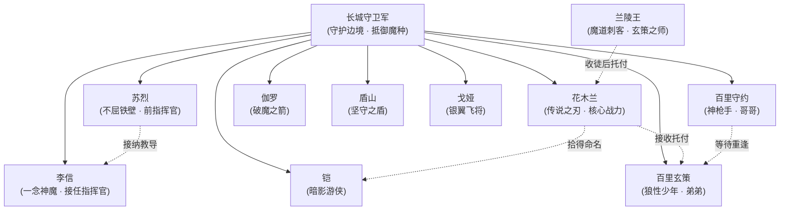
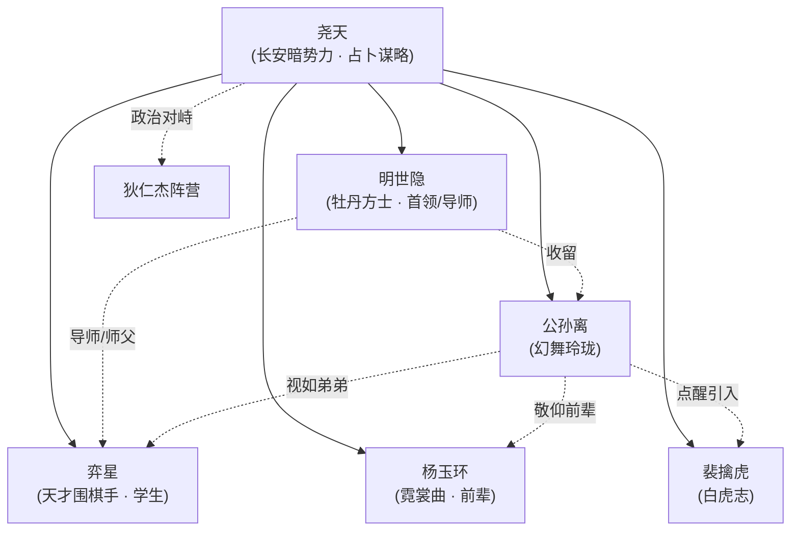
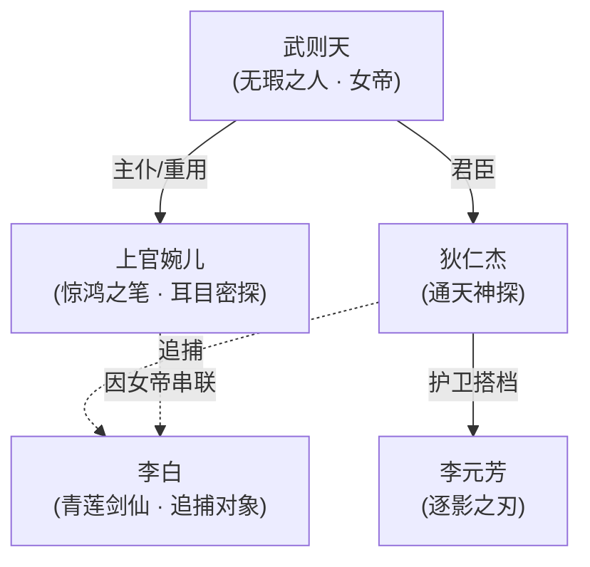
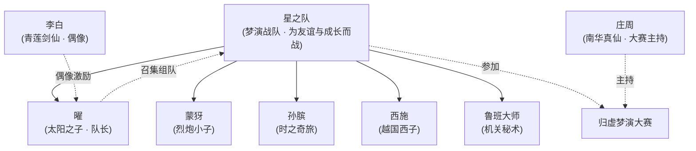
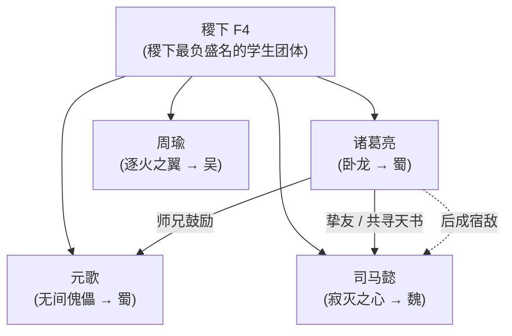
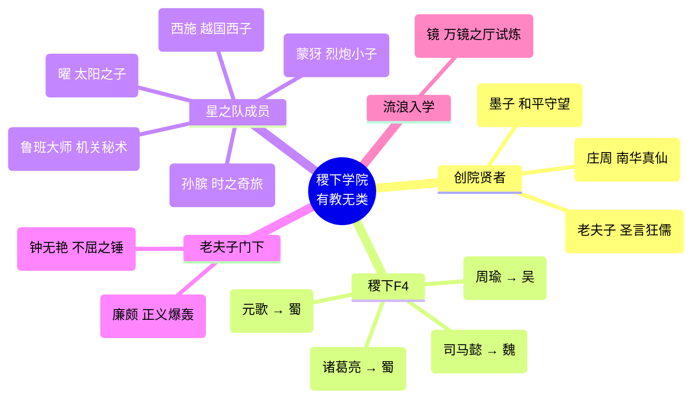
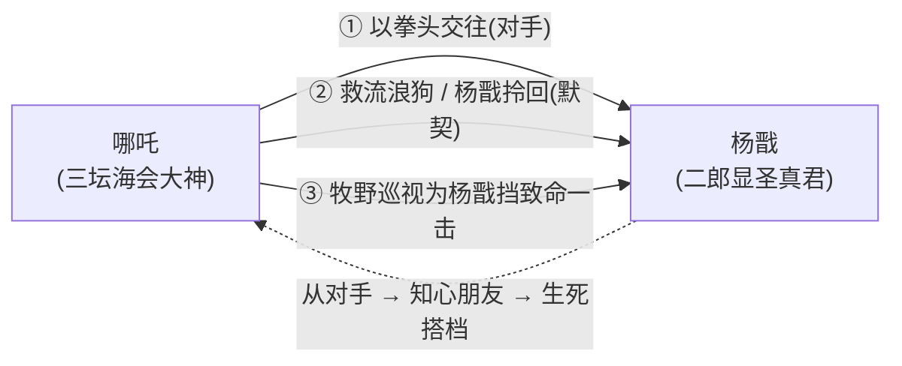
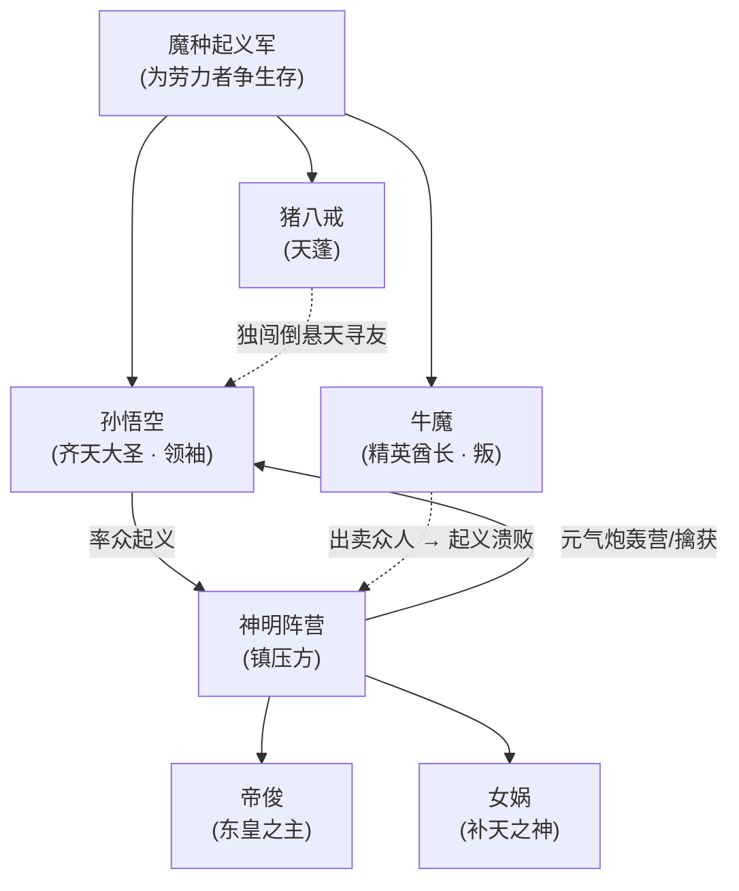
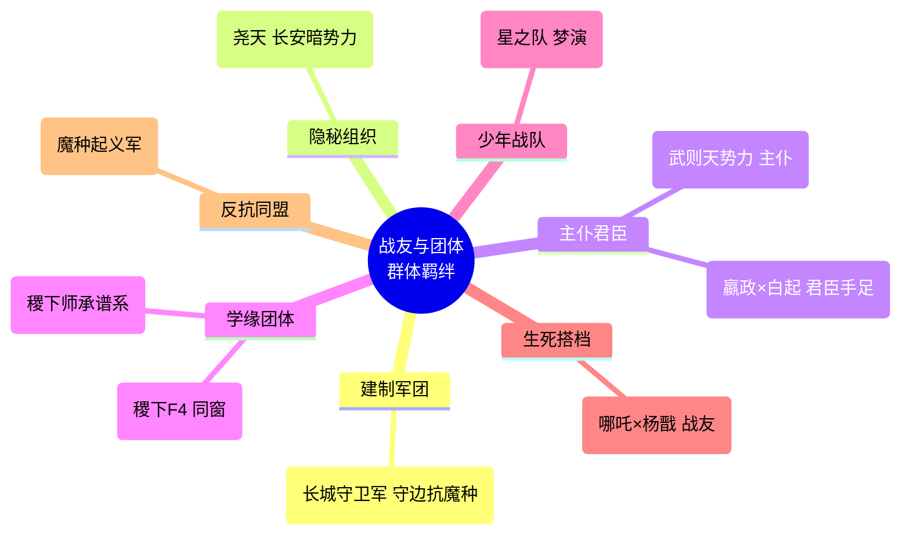

# 关系 · 战友与团体

> 一人之力终有尽时，唯有并肩者方能撑起一片天地。在峡谷的世界里，比血缘更牢、比恋情更烈的，往往是那一句「我来守住后方」。本页专门梳理《王者荣耀》世界观中以 **战友、搭档、团体、君臣、主仆** 为内核的群体羁绊——它们或以一面军旗凝聚，或以一座学院相系，或以一份共生的命运彼此缠绕。

!!! info "本页范围与定位"
    《王者荣耀》英雄之间的关系大致可分为四大谱系：**血亲**（兄弟姐妹）、**情感**（夫妻恋人）、**师承**（师徒同窗）与**群体/政治**（战友、团体、君臣、主仆）。本页聚焦最后一类中"多人协同、共担使命"的群体羁绊，逐一详写其成员名单、组织宗旨、代表事件与构成关系图。
    
    - 一对一的恋人/夫妻关系请见 ../relationships/lovers.md。
    - 一对一的兄弟姐妹血亲关系请见 ../relationships/kinship.md。
    - 一对一的师徒传承关系请见 ../relationships/mentor.md。
    - 本页与上述页面在"师承团体""君臣手足"等节点上有交叉，已就近标注互链。

!!! warning "考据声明"
    本页严格依据仓库内 `.build/relationships.json` 与官方公开背景故事撰写，并辅以对游戏内台词、皮肤剧情、官方关系图的可靠了解。凡属推断或社区共识、未经官方硬性坐实之处，均以 **（考据推测）** 标注。请勿将本页叙述当作官方唯一定本——《王者荣耀》世界观历经多次重置（如"破晓"版本前后），同一角色的设定可能存在版本差异。

---

## 总览 · 群体羁绊速查表

下表汇总本页详写的全部"战友 / 搭档 / 团体 / 君臣 / 主仆"类关系。点击成员名可跳转至对应英雄分节（位于各阵营页）。

| 团体 / 羁绊 | 关系类型 | 核心成员 | 所属阵营 | 一句话宗旨 |
| :--- | :--- | :--- | :--- | :--- |
| [长城守卫军](#长城守卫军) | 同阵营战友（建制军团） | 苏烈·李信·花木兰·铠·百里守约·百里玄策·裴擒虎·伽罗·盾山·戈娅 | 长城守卫军 | 守护边境长城，抵御大漠魔种 |
| [尧天·长安暗势力](#尧天长安暗势力) | 同阵营战友（隐秘组织） | 明世隐·公孙离·弈星·杨玉环·裴擒虎 | 长安城 | 借占卜谋略活跃长安暗处，另有所图 |
| [长安女帝势力](#长安女帝势力) | 主仆 / 君臣式羁绊 | 武则天·上官婉儿·狄仁杰·李元芳 | 长安城 | 女帝统御长安，耳目密探各司其职 |
| [星之队](#星之队) | 战友 / 搭档（少年战队） | 曜·蒙犽·孙膑·西施·鲁班大师 | 跨阵营（稷下牵头） | 为友谊与自我认知而战的梦演战队 |
| [稷下 F4](#稷下-f4) | 同窗团体（明星学生） | 诸葛亮·周瑜·元歌·司马懿 | 稷下学院（求学背景） | 稷下学院最负盛名的学生天团 |
| [稷下师承谱系](#稷下师承谱系) | 师承（三贤者 → 众弟子） | 老夫子·庄周·墨子 → 众弟子 | 稷下学院 | 有教无类，广收门徒，传道授业 |
| [嬴政与白起](#嬴政与白起君臣情同手足) | 君臣 / 情同手足 | 嬴政·白起 | 长安城 / 稷下 | 表为君臣，实为生死与共的兄弟 |
| [哪吒与杨戬](#哪吒与杨戬从对手到生死搭档) | 生死战友 / 搭档 | 哪吒·杨戬 | 镐京·封神 | 从拳头相向到为彼此挡刀的至交 |
| [魔种起义军](#魔种起义军) | 起义同盟（阶段性） | 孙悟空·牛魔·猪八戒 等 | 上古众神·神话 | 反抗诸神过度采能、为劳力者争生存 |

!!! tip "如何阅读本页"
    每个团体小节均包含四个固定模块：**① 成员名单（含链接与定位）→ ② 团体宗旨 → ③ 代表事件 → ④ Mermaid 构成图**。若你只想快速把握组织骨架，直接看每节末尾的关系图即可。

---

## 长城守卫军

<span class="hok-tags"><span class="tag tank">坦克</span><span class="tag warrior">战士</span><span class="tag assassin">刺客</span><span class="tag marksman">射手</span><span class="tag support">辅助</span></span>

长城守卫军是《王者荣耀》原创世界观中**建制最完整、军魂最鲜明**的群体羁绊——它不是临时结成的小队，而是一支驻守北疆、世代相承的常备军团。在这里，"战友"二字被写进了纪律、伤疤与一茬接一茬的指挥官交替之中。

!!! quote "军魂"
    "长城永不倒。" —— 长城守卫军的共同信念

### 成员名单

| 英雄 | 定位 | 在军中的身份 / 关键词 |
| :--- | :--- | :--- |
| [苏烈](../heroes/changcheng.md#苏烈) | <span class="hok-tags"><span class="tag tank">坦克</span></span> | 老一辈"不屈铁壁"，接纳并教导流落街头的李信 |
| [李信](../heroes/changan.md#李信) | <span class="hok-tags"><span class="tag warrior">战士</span></span> | 由苏烈引入军中，后接任**指挥官**；一念神魔（光/暗双形态） |
| [花木兰](../heroes/changan.md#花木兰) | <span class="hok-tags"><span class="tag warrior">战士</span><span class="tag assassin">刺客</span></span> | 传说之刃，担任队长前后皆为军中核心战力 |
| [铠](../heroes/changan.md#铠) | <span class="hok-tags"><span class="tag tank">坦克</span><span class="tag warrior">战士</span></span> | 自日落海漂流而来，被花木兰拾得、命名并引入长城 |
| [百里守约](../heroes/changcheng.md#百里守约) | <span class="hok-tags"><span class="tag marksman">射手</span></span> | 残光徽列，神枪手哥哥，加入长城等待弟弟重逢 |
| [百里玄策](../heroes/changcheng.md#百里玄策) | <span class="hok-tags"><span class="tag assassin">刺客</span></span> | 狼性少年，经兰陵王调教后由花木兰引入长城 |
| [裴擒虎](../heroes/baiyue.md#裴擒虎) | <span class="hok-tags"><span class="tag assassin">刺客</span></span> | 白虎志，曾与长城有交集（后转向尧天，见下文） |
| [伽罗](../heroes/changcheng.md#伽罗) | <span class="hok-tags"><span class="tag marksman">射手</span></span> | 破魔之箭，专司清剿魔种的远程精锐 |
| [盾山](../heroes/changcheng.md#盾山) | <span class="hok-tags"><span class="tag support">辅助</span><span class="tag tank">坦克</span></span> | 坚守之盾，以巨盾为全军筑起最后一道防线 |
| [戈娅](../heroes/changcheng.md#戈娅) | <span class="hok-tags"><span class="tag marksman">射手</span></span> | 银翼飞将，凭飞行机械翱翔于长城上空 |

!!! note "阵营归属小注"
    名单中**裴擒虎**的主阵营在仓库目录中归于 [百越 / 建木](../factions/baiyue.md)，其与长城守卫军更多是早期交集与流转；后被公孙离点醒而加入尧天（见 [尧天·长安暗势力](#尧天长安暗势力)）。本页保留其在战友名单中的位置，以呈现长城作为"人才中转站"的特质。

### 团体宗旨

长城守卫军的存在意义只有一句：**守护边境长城，抵御来自大漠的魔种入侵。** 长城是文明与荒蛮之间的界碑，城外是被魔种侵蚀的不毛之地，城内是需要被庇护的万家灯火。守卫军的纪律、信条与一代代指挥官的传承，都围绕这唯一使命运转。它不问出身——无论是流落街头的孤儿（李信）、漂流上岸的失忆者（铠），还是被马贼调教过的少年（玄策），只要愿意举起武器面向城外，长城就会接纳他。

### 代表事件

!!! example "代表事件 · 长城的接纳与传承"
    - **苏烈收李信**：老指挥官苏烈在街头接纳了无依无靠的李信，倾囊相授，视如己出。李信日后成长为新一代**指挥官**，完成了长城军魂的代际交接。这是长城"以老带新、薪火相传"军制的缩影。
    - **花木兰拾铠、命名入军**：铠自日落海漂流而来、记忆残缺，是花木兰将他拾起、为他命名"铠"，并带入长城守卫军。一个名字，便是一份归属。
    - **兰陵王托孤、玄策入城**：[兰陵王](../heroes/modao-shadow-abyss.md#兰陵王) 收留被铠所救的百里玄策为徒，传授暗影潜行、钩镰与杀戮之术，后将其托付给花木兰，玄策由此正式加入长城守卫军（详见师徒线 ../relationships/mentor.md）。
    - **双里重逢的执念**：哥哥百里守约改名、加入长城，正是为了在这道绵长的边境线上，等待被马贼掳走的弟弟玄策归来——长城既是军团，也是一对兄弟的约定之地。

!!! quote "台词印证"
    "我的弟弟，一定会回来的。" —— [百里守约](../heroes/changcheng.md#百里守约)（兄弟羁绊向台词，呼应其加入长城的初心）

### 团体构成图



---

## 尧天·长安暗势力

<span class="hok-tags"><span class="tag mage">法师</span><span class="tag marksman">射手</span><span class="tag support">辅助</span><span class="tag assassin">刺客</span></span>

如果说长城守卫军是阳光下的军旗，那么"尧天"便是长安城阴影里的另一面。它表面辅佐女帝、维护盛世，实则**另有所图**——这是一支由占卜、谋略与隐秘行动维系的非建制组织，其成员之间的羁绊更接近"同道中人"而非"同袍战友"。

### 成员名单

| 英雄 | 定位 | 在尧天中的身份 / 关键词 |
| :--- | :--- | :--- |
| [明世隐](../factions/changan.md)（牡丹方士） | <span class="hok-tags"><span class="tag support">辅助</span></span> | 组织**核心首领**，以占卜谋略运筹；同时是弈星的导师 |
| [公孙离](../heroes/changan.md#公孙离) | <span class="hok-tags"><span class="tag marksman">射手</span></span> | 幻舞玲珑，敬仰前辈杨玉环、视弈星如弟，被明世隐收留 |
| [弈星](../heroes/jixia.md#弈星) | <span class="hok-tags"><span class="tag mage">法师</span></span> | 天才围棋手，明世隐的**学生 / 师弟般的存在** |
| [杨玉环](../heroes/changan.md#杨玉环) | <span class="hok-tags"><span class="tag support">辅助</span><span class="tag mage">法师</span></span> | 霓裳曲，受公孙离敬仰的前辈 |
| [裴擒虎](../heroes/baiyue.md#裴擒虎) | <span class="hok-tags"><span class="tag assassin">刺客</span></span> | 白虎志，被公孙离点醒后加入尧天、探寻真相 |

!!! note "明世隐 / 弈星的阵营标注"
    在仓库英雄目录（`.build/hero-directory.json`）中，[弈星](../heroes/jixia.md#弈星) 明确列于"稷下学院"（`jixia`）目录下；而**明世隐目前并未收录于该英雄目录**——本页据其官方背景（牡丹方士、活跃于长安暗处）将其链接归入"长安城"（`changan`）语境（**考据推测**：其 facId 以 `changan` 暂定，待目录补全后再校）。这恰好反映了角色背景（求学 / 出身）与活跃舞台（长安暗处）之间的错位：本页以"尧天组织"这一**功能性团体**统摄二人，以呈现其真实的行动关系。（考据推测：尧天作为活跃于长安的隐秘势力，其成员的"阵营标签"与"组织归属"并不完全重合。）

### 团体宗旨

尧天以**牡丹方士明世隐**为核心，借占卜、谋略与情报活跃于长安城的阴影之中。其公开姿态是辅佐女帝 [武则天](../heroes/changan.md#武则天)、维护长安盛世；但其真实目的另有所图，因而与以 [狄仁杰](../heroes/changan.md#狄仁杰) 为首的势力形成对峙。这是一个以"看透命数、改写棋局"为信念的智性团体——他们相信盛世表象之下藏着必须有人去揭开的真相。

### 代表事件

!!! example "代表事件 · 长安暗流"
    - **明世隐收留公孙离**：失去依靠的公孙离被明世隐收入尧天，从此在长安暗处以一袭幻舞行走江湖；她敬仰前辈杨玉环，又把同门弈星当作需要照看的弟弟，构成尧天内部温情的一面。
    - **点醒裴擒虎**：公孙离点醒了徘徊的裴擒虎，使其加入尧天、共同探寻盛世背后的真相——这是尧天"以人引人、以真相聚人"的典型路径。
    - **尧天 vs 狄仁杰阵营对峙**：尧天与以狄仁杰为首的势力分属长安政治的两极，前者隐于暗、后者立于明，围绕女帝武则天的统治与"另有所图"的目标长期角力。（详见政治对立线 ../relationships/rivalry.md。）

### 团体构成图



---

## 长安女帝势力

<span class="hok-tags"><span class="tag mage">法师</span><span class="tag assassin">刺客</span><span class="tag marksman">射手</span></span>

围绕女帝 [武则天](../heroes/changan.md#武则天) 形成的，是一组典型的 **主仆 / 君臣式羁绊**——它不像长城那样靠"并肩作战"维系，而是靠**统治、效忠、耳目与刀锋**的等级结构运转。这是长安城权力金字塔最顶端的人际网络。

### 成员名单

| 英雄 | 定位 | 在女帝势力中的身份 |
| :--- | :--- | :--- |
| [武则天](../heroes/changan.md#武则天)（无瑕之人） | <span class="hok-tags"><span class="tag mage">法师</span></span> | 长安**统治者 / 女帝**，权力核心 |
| [上官婉儿](../heroes/changan.md#上官婉儿) | <span class="hok-tags"><span class="tag mage">法师</span><span class="tag assassin">刺客</span></span> | 女帝的**耳目密探**，代陛下书世间万象 |
| [狄仁杰](../heroes/changan.md#狄仁杰) | <span class="hok-tags"><span class="tag marksman">射手</span></span> | 通天神探，朝堂之上为女帝查案断狱 |
| [李元芳](../heroes/changan.md#李元芳) | <span class="hok-tags"><span class="tag marksman">射手</span></span> | 逐影之刃，狄仁杰的护卫与搭档 |

### 团体宗旨

这一势力的内核是 **女帝的意志如何贯彻到长安的每一个角落**。武则天统治长安，需要"耳目"洞察暗流，需要"神探"维持秩序，需要"刀锋"执行裁决。上官婉儿正是那双"耳目"——她**代陛下为耳目、书世间之万象**；狄仁杰与李元芳则在明面上维系长安的律法与治安。主仆之间既有效忠，也有彼此成就的羁绊。

### 代表事件

!!! example "代表事件 · 婉儿的沉浮"
    - **上官婉儿的奴婢—重臣之路**：婉儿因祖父牵连"太子谋反案"而沦为奴婢，身陷宫廷最底层；后凭一手惊艳书道（"惊鸿之笔"）才华获女帝重用，成为代陛下记录、洞察世间万象的耳目密探。这是"主仆羁绊"中最具戏剧张力的命运逆转——从待罪之身到女帝近侍。
    - **狄仁杰与李白的追捕—逃亡**：在长安城内，李白是狄仁杰的追捕对象；李白—狄仁杰—武则天—上官婉儿因女帝而被串联成一张关系网（追捕逃亡线详见 ../relationships/rivalry.md）。
    - **狄仁杰阵营 vs 尧天**：狄仁杰为首的势力与隐于暗处的尧天长期对峙，构成长安"明—暗"两条政治线（见上节）。

!!! quote "台词印证"
    "代陛下为耳目，书世间之万象。" —— [上官婉儿](../heroes/changan.md#上官婉儿)（身份定位台词）

### 团体构成图



---

## 星之队

<span class="hok-tags"><span class="tag warrior">战士</span><span class="tag assassin">刺客</span><span class="tag marksman">射手</span><span class="tag support">辅助</span><span class="tag mage">法师</span></span>

在一众或沉重、或悲壮的群体羁绊中，"星之队"是最明亮、最青春的一支。它不是军团，不是政治组织，而是一群少年为了一场比赛、一份偶像情结、最终为了**友谊与自我认知**而临时组建的梦演战队。

!!! quote "队魂"
    "我的偶像是青莲剑仙——总有一天，我也要像他那样发光。" —— [曜](../heroes/changan.md#曜)（以李白为偶像，星之队的起点）

### 成员名单

| 英雄 | 定位 | 在星之队中的角色 |
| :--- | :--- | :--- |
| [曜](../heroes/changan.md#曜)（太阳之子） | <span class="hok-tags"><span class="tag warrior">战士</span><span class="tag assassin">刺客</span></span> | **队长 / 发起人**，以李白为偶像组建战队 |
| [蒙犽](../heroes/yunzhong-modi.md#蒙犽) | <span class="hok-tags"><span class="tag marksman">射手</span></span> | 烈炮小子，火力担当 |
| [孙膑](../heroes/jixia.md#孙膑) | <span class="hok-tags"><span class="tag support">辅助</span><span class="tag mage">法师</span></span> | 时之奇旅，智囊与辅助 |
| [西施](../heroes/baiyue.md#西施) | <span class="hok-tags"><span class="tag mage">法师</span></span> | 越国西子，法术核心 |
| [鲁班大师](../heroes/mojia-jiguan.md#鲁班大师) | <span class="hok-tags"><span class="tag support">辅助</span></span> | 机关秘术，机关与后援担当 |

### 团体宗旨

星之队的宗旨写在它的诞生缘由里：**曜以青莲剑仙 [李白](../heroes/changan.md#李白) 为偶像**，渴望在 [庄周](../heroes/penglai-donghai.md#庄周) 主持的"归虚梦演大赛"中证明自己。他召集志同道合的伙伴组成"星之队"，在一场场梦演对决中，他们收获的远不止名次——而是**友谊、能量，以及对自我的认知**。这支队伍的核心精神，是"少年人在并肩追梦的过程中长大"。

### 代表事件

!!! example "代表事件 · 归虚梦演大赛"
    - **组队参赛**：曜为参加庄周举办的"归虚梦演大赛"，在稷下牵头组建星之队，集结蒙犽、孙膑、西施、鲁班大师等不同出身的伙伴。
    - **梦中成长**："归虚梦演"是一场在梦境/虚境中展开的大赛；星之队在其中并肩作战，最终所得并非奖杯，而是彼此之间的羁绊、内在的能量觉醒，以及对"我是谁、我为何而战"的回答。
    - **跨阵营的友谊**：星之队成员来自截然不同的阵营（长安的曜、云中漠地的蒙犽、稷下的孙膑、百越的西施、墨家机关的鲁班大师），却因一场比赛凝成一队——这正体现了"战友/搭档"超越阵营藩篱的特质。

!!! note "庄周与梦演大赛"
    "归虚梦演大赛"由 [庄周](../heroes/penglai-donghai.md#庄周)（南华真仙）主持。庄周以梦为舞台的设定，与其"梦蝶"哲学一脉相承，为星之队提供了一个既奇幻又安全的成长场域。（梦演大赛与"梦境/虚境"设定的更多背景可参见专题页 ../topics/parallel-worlds.md 与 ../topics/index.md。）

### 团体构成图



---

## 稷下 F4

<span class="hok-tags"><span class="tag mage">法师</span><span class="tag assassin">刺客</span></span>

"稷下 F4" 是 [稷下学院](../factions/jixia.md) 历史上**最负盛名的学生团体**——四位才华横溢的青年同窗，日后各自走向截然不同的命运，却共享着"稷下出身"这一抹底色。它是同窗团体的典范：起点相同，归途天各一方。

### 成员名单

| 英雄 | 定位 | 日后归属 / 关键词 |
| :--- | :--- | :--- |
| [诸葛亮](../heroes/sanfen-shu.md#诸葛亮)（卧龙） | <span class="hok-tags"><span class="tag mage">法师</span></span> | 后归**蜀国**；博学师兄，曾鼓励元歌 |
| [周瑜](../heroes/sanfen-wu.md#周瑜)（逐火之翼） | <span class="hok-tags"><span class="tag mage">法师</span></span> | 后归**吴国**；冷峻才俊 |
| [元歌](../heroes/sanfen-shu.md#元歌)（无间傀儡） | <span class="hok-tags"><span class="tag assassin">刺客</span></span> | 后归**蜀国**；幼年失语，专研机关傀儡 |
| [司马懿](../heroes/sanfen-wei.md#司马懿)（寂灭之心） | <span class="hok-tags"><span class="tag mage">法师</span><span class="tag assassin">刺客</span></span> | 后归**魏国**；诸葛亮的同窗挚友兼宿敌 |

!!! warning "求学背景 ≠ 阵营归属"
    稷下 F4 成员虽**曾在稷下求学**，但他们的**阵营归属仍为蜀 / 吴 / 魏**。`.build/relationships.json` 特别提示："注意区分曾在稷下学习与稷下阵营英雄——诸葛亮 / 司马懿 / 周瑜虽在稷下求学，其阵营归属仍为蜀 / 魏 / 吴。"链接已按此原则指向各自的三分之地阵营页。

### 团体宗旨

稷下 F4 本质上是一个**学缘共同体**——他们因稷下学院"有教无类"的学风而相聚，在求学岁月中切磋才华、结下情谊。然而稷下并不要求弟子终身效忠某一旗帜，毕业后四人各赴蜀、吴、魏，甚至从同窗变为宿敌。F4 的"宗旨"，与其说是一个共同目标，不如说是一段被各自命运反复回望的青春记忆。

### 代表事件

!!! example "代表事件 · 同窗情与宿敌劫"
    - **诸葛亮鼓励元歌**：元歌幼年受惊失语、孤身入稷下，是博学的师兄诸葛亮鼓励他"以机关傀儡代喉舌与世界交流"，元歌由此走上专研傀儡之路。这是 F4 内部最温暖的一段同窗情。
    - **诸葛亮与司马懿：从挚友到宿敌**：二人青年时同在稷下相识，因彼此才华相互欣赏，曾**共寻天书碎片**；后司马懿发现了当年的真相，却不愿因此憎恨挚友，遂黯然离开稷下。官方明确将二人定位为**宿敌**——司马懿登场宣传语即"诸葛亮的宿敌来了"。挚友与宿敌的双重身份，是 F4 最具悲剧色彩的注脚。
    - **天各一方**：四人毕业后分属蜀（诸葛亮、元歌）、吴（周瑜）、魏（司马懿），昔日同窗在三分天下的棋局上各为其主。

!!! quote "宿敌台词"
    "我从不与人为敌，除了……诸葛亮。" —— [司马懿](../heroes/sanfen-wei.md#司马懿)（宿敌定位向台词，意译）

### 团体构成图



---

## 稷下师承谱系

<span class="hok-tags"><span class="tag warrior">战士</span><span class="tag support">辅助</span><span class="tag tank">坦克</span><span class="tag mage">法师</span></span>

稷下 F4 只是稷下庞大门徒网络中最耀眼的一角。整个 [稷下学院](../factions/jixia.md) 以**三位创院贤者有教无类、广收弟子**为根基，构成了《王者荣耀》世界观中规模最大的**师承团体**。它既是"团体"，也是"君臣师徒"群像的总枢纽。

### 创院三贤者与门徒名单

!!! info "三贤者"
    据 `.build/relationships.json` 的"师承（创院三贤者→众弟子）"条目，稷下三贤者广收门徒。其中可考的核心贤者为 **[老夫子](../heroes/jixia.md#老夫子)（圣言狂儒）**，并与 **[庄周](../heroes/penglai-donghai.md#庄周)**、**[墨子](../heroes/mojia-jiguan.md#墨子)** 等大家共同奠定了稷下"有教无类"的学风。（考据推测：不同资料对"三贤者"具体所指略有出入，此处以老夫子为确证核心，庄周、墨子为关联大家。）

下表为 relationships.json 所列、与稷下师承谱系相关的弟子 / 门人（含曾在稷下求学者）：

| 弟子 | 定位 | 备注 |
| :--- | :--- | :--- |
| [庄周](../heroes/penglai-donghai.md#庄周) | <span class="hok-tags"><span class="tag support">辅助</span></span> | 既列为贤者级人物，亦与稷下渊源极深 |
| [墨子](../heroes/mojia-jiguan.md#墨子) | <span class="hok-tags"><span class="tag warrior">战士</span><span class="tag mage">法师</span></span> | 墨家机关一脉，与鲁班构成机关对照 |
| [诸葛亮](../heroes/sanfen-shu.md#诸葛亮) | <span class="hok-tags"><span class="tag mage">法师</span></span> | 求学稷下，阵营归蜀（F4 成员） |
| [司马懿](../heroes/sanfen-wei.md#司马懿) | <span class="hok-tags"><span class="tag mage">法师</span><span class="tag assassin">刺客</span></span> | 求学稷下，阵营归魏（F4 成员） |
| [周瑜](../heroes/sanfen-wu.md#周瑜) | <span class="hok-tags"><span class="tag mage">法师</span></span> | 求学稷下，阵营归吴（F4 成员） |
| [元歌](../heroes/sanfen-shu.md#元歌) | <span class="hok-tags"><span class="tag assassin">刺客</span></span> | 孤儿入稷下，受诸葛亮鼓励（F4 成员） |
| [孙膑](../heroes/jixia.md#孙膑) | <span class="hok-tags"><span class="tag support">辅助</span><span class="tag mage">法师</span></span> | 稷下门徒，星之队成员 |
| [钟无艳](../heroes/jixia.md#钟无艳) | <span class="hok-tags"><span class="tag warrior">战士</span><span class="tag tank">坦克</span></span> | 老夫子弟子，与廉颇同门（官配） |
| [廉颇](../heroes/haojing-fengshen.md#廉颇) | <span class="hok-tags"><span class="tag tank">坦克</span><span class="tag mage">法师</span></span> | 老夫子弟子，与钟无艳于稷下重逢 |
| [西施](../heroes/baiyue.md#西施) | <span class="hok-tags"><span class="tag mage">法师</span></span> | 稷下门徒，星之队成员 |
| [曜](../heroes/changan.md#曜) | <span class="hok-tags"><span class="tag warrior">战士</span><span class="tag assassin">刺客</span></span> | 钻研星辰之力，星之队队长 |
| [蒙犽](../heroes/yunzhong-modi.md#蒙犽) | <span class="hok-tags"><span class="tag marksman">射手</span></span> | 与稷下相关，星之队成员 |
| [鲁班大师](../heroes/mojia-jiguan.md#鲁班大师) | <span class="hok-tags"><span class="tag support">辅助</span></span> | 机关秘术，星之队成员 |
| [镜](../heroes/changan.md#镜) | <span class="hok-tags"><span class="tag assassin">刺客</span></span> | 携弟弟曜流浪至稷下，过万镜之厅试炼 |

### 团体宗旨

稷下学院的立院之本，是 **"有教无类，广纳天下学子，传道授业、追问真理"**。它不以出身论高下：孤儿（元歌）、流浪者（镜与曜）、各国才俊（F4）皆可入学。也正因如此，稷下成为整个世界观的"人才熔炉"——门徒们带着稷下的学识与情谊散入各方阵营，使稷下的影响力远远溢出学院的院墙。

### 代表事件

!!! example "代表事件 · 稷下群像"
    - **镜与曜的稷下落脚**：神职家族出身的姐姐 [镜](../heroes/changan.md#镜) 带着弟弟 [曜](../heroes/changan.md#曜) 抹去身份、流浪至稷下；镜经"**万镜之厅**"试炼获得力量，曜则在此钻研星辰之力——稷下成为这对姐弟的避风港与起点（姐弟血亲线详见 ../relationships/kinship.md）。
    - **廉颇与钟无艳的同门重逢**：二人皆为 [老夫子](../heroes/jixia.md#老夫子) 门下弟子；战场上廉颇的第一个对手便是手执大锤的钟无艳，后于稷下以盟友身份重逢，二人被官方微博认证为官配（因双方较冷门，存在感偏低）。
    - **元歌的"傀儡代言"**：诸葛亮对失语孤儿元歌的一句鼓励，改变了元歌的一生（见 [稷下 F4](#稷下-f4)）。
    - **诸葛亮 × 司马懿的天书往事**：同门挚友共寻天书碎片，终成宿敌（见 [稷下 F4](#稷下-f4)）。

### 团体构成图



---

## 嬴政与白起：君臣，情同手足

<span class="hok-tags"><span class="tag mage">法师</span><span class="tag tank">坦克</span></span>

并非所有"君臣"都是冰冷的上下级。[嬴政](../heroes/changan.md#嬴政) 与 [白起](../heroes/jixia.md#白起) 的关系，是本页**君臣类羁绊中最具温度的一对**——表面是玄雍之主与臣属，骨子里却是用数十年共生熬出来的兄弟情。

### 成员名单

| 英雄 | 定位 | 身份 |
| :--- | :--- | :--- |
| [嬴政](../heroes/changan.md#嬴政)（政） | <span class="hok-tags"><span class="tag mage">法师</span></span> | 玄雍之主 / 君 |
| [白起](../heroes/jixia.md#白起)（人间兵器） | <span class="hok-tags"><span class="tag tank">坦克</span></span> | 臣 / 护主之将 |

### 关系宗旨

二人的羁绊核心是 **"君臣之名下的生死共生"**。少年时，嬴政与白起同往稷下求学，途中遭遇血族袭击——**白起为护嬴政而面部受伤、感染血族之力**（此力后由 [庄周](../heroes/penglai-donghai.md#庄周) 封印）。这数十年的共生关系，不仅让白起背负着血族之力的诅咒为嬴政而战，也**塑造了嬴政对他人之苦的共情**。君护臣命，臣护君身，是为情同手足。

### 代表事件

!!! example "代表事件 · 求学路上的血族之劫"
    - **稷下求学途中遇袭**：少年嬴政与白起结伴前往稷下学院求学，途中遭血族伏击。
    - **白起以身挡灾**：白起为保护嬴政而身受重伤，面部因此毁损，并感染了血族之力，自此成为半人半"兵器"的存在。
    - **庄周封印**：白起体内的血族之力由南华真仙庄周施法封印，使其得以维持人形与神志。
    - **共情之源**：这段同生共死的经历，是嬴政日后能够体察"他人之苦"的情感根源——一位君主的悲悯，来自一位臣子用伤痕换来的羁绊。

!!! quote "台词印证"
    "我的伤，由我一人承担。" —— [白起](../heroes/jixia.md#白起)（护主与隐忍向台词，意译）

### 关系构成图

```mermaid
flowchart LR
    YZ["嬴政<br/>(政 · 玄雍之主/君)"]
    BQ["白起<br/>(人间兵器 · 臣)"]
    XZ["血族<br/>(袭击者)"]
    ZZ2["庄周<br/>(南华真仙)"]

    YZ == 同往稷下求学 == BQ
    XZ -. 途中袭击 .-> YZ
    BQ -- 以身护主/面部受伤 --> YZ
    XZ -- 感染血族之力 --> BQ
    ZZ2 -- 封印血族之力 --> BQ
    BQ -. 数十年共生 → 情同手足 .-> YZ
```

---

## 哪吒与杨戬：从对手到生死搭档

<span class="hok-tags"><span class="tag warrior">战士</span></span>

在镐京·封神的众神序列里，[哪吒](../heroes/haojing-fengshen.md#哪吒) 与 [杨戬](../heroes/haojing-fengshen.md#杨戬) 的关系是一段**"拳头打出来的友谊"**——他们既非兄弟、亦非师徒，而是从针锋相对的对手，一路打成了可以为彼此挡命的生死搭档。

### 成员名单

| 英雄 | 定位 | 关键词 |
| :--- | :--- | :--- |
| [哪吒](../heroes/haojing-fengshen.md#哪吒)（三坛海会大神） | <span class="hok-tags"><span class="tag warrior">战士</span></span> | 莲花重生，重情重义 |
| [杨戬](../heroes/haojing-fengshen.md#杨戬)（二郎显圣真君） | <span class="hok-tags"><span class="tag warrior">战士</span></span> | 三眼真君，外冷内热 |

### 关系宗旨

二人的羁绊核心是 **"在对抗中确认彼此、在生死间托付后背"**。他们最初以拳头交往、互不相让，却因一桩小事生出默契——哪吒救起一只流浪狗，杨戬默默把狗拎了回来。这份不言而喻的同频，让两个硬汉从对手渐成知心朋友，最终在战场上以命相托。

### 代表事件

!!! example "代表事件 · 牧野巡视的那一挡"
    - **以拳会友**：哪吒与杨戬起初是势均力敌的对手，靠一次次过招相互试探、彼此较劲。
    - **流浪狗的默契**：哪吒救下一只流浪狗，杨戬不声不响地把它拎了回来——一个救、一个护，两人的友谊就此破冰，从对手转为知心朋友。
    - **牧野挡刀**：在"牧野巡视"途中遭遇伏击，**哪吒为杨戬挡下了致命一击**。这一挡，把"对手"二字彻底改写成了"生死搭档"。

!!! note "关系定性"
    据 `.build/relationships.json`：二人"非兄弟 / 师徒，而是从对手到生死搭档"。请勿将其误读为血亲或传承关系——这是一段纯粹由战斗与信任铸成的战友情。

### 关系构成图



---

## 魔种起义军

<span class="hok-tags"><span class="tag assassin">刺客</span><span class="tag warrior">战士</span><span class="tag tank">坦克</span><span class="tag support">辅助</span></span>

最后一支群体，是一场**失败的反抗**留下的战友群像。在上古众神·神话的语境中，[孙悟空](../heroes/shanggu-shenhua.md#孙悟空) 率领的魔种起义军，是被压迫者向神明举起的拳头——尽管这支同盟因背叛而溃散，它所凝结的"为同类而战"的战友情，仍是世界观中最悲壮的一笔。

### 成员名单（起义—镇压两方）

| 阵营 | 英雄 | 定位 | 角色 |
| :--- | :--- | :--- | :--- |
| 起义方 | [孙悟空](../heroes/shanggu-shenhua.md#孙悟空)（齐天大圣） | <span class="hok-tags"><span class="tag assassin">刺客</span><span class="tag warrior">战士</span></span> | 起义**领袖**，率魔种反抗 |
| 起义方（叛） | [牛魔](../heroes/shanggu-shenhua.md#牛魔)（精英酋长） | <span class="hok-tags"><span class="tag tank">坦克</span><span class="tag support">辅助</span></span> | 因惧神明武器而**出卖众人**，致起义溃败 |
| 起义方 | [猪八戒](../heroes/shanggu-shenhua.md#猪八戒)（天蓬） | <span class="hok-tags"><span class="tag tank">坦克</span></span> | 起义溃败后**独闯倒悬天寻友** |
| 镇压方 | [帝俊](../heroes/haojing-fengshen.md#帝俊)（东皇之主） | <span class="hok-tags"><span class="tag warrior">战士</span></span> | 神明阵营，镇压起义 |
| 镇压方 | [女娲](../heroes/shanggu-shenhua.md#女娲)（补天之神） | <span class="hok-tags"><span class="tag mage">法师</span></span> | 神明阵营，参与镇压 |

### 团体宗旨

起义军的宗旨简单而决绝：**诸神过度采集能量、污染了劳力者的生存空间，孙悟空遂率魔种揭竿而起，为同类争一条活路。** 这是一场"被压迫者 vs 统治诸神"的阶级式抗争——起义军的战友情，建立在"同为被剥削者"的共同处境之上。

### 代表事件

!!! example "代表事件 · 起义的溃败与寻友"
    - **揭竿而起**：诸神过度采能、污染劳力者生存空间，孙悟空率魔种起义反抗。
    - **牛魔的背叛**：牛魔因惧怕神明的武器而出卖众人，直接导致起义溃败——这是起义军内部最沉痛的裂痕，"战友"中竟出了"叛徒"。
    - **元气炮轰营**：神明以元气炮轰击起义军营地，**孙悟空被擒**。
    - **八戒独闯倒悬天**：起义失败后，[猪八戒](../heroes/shanggu-shenhua.md#猪八戒) 没有放弃同伴，独自一人闯入"倒悬天"寻找被擒的友人——这份"虽败不弃"的战友情，是起义军群像中最动人的余烬。

!!! quote "台词印证"
    "俺老孙，偏要这天，再也遮不住俺的眼！" —— [孙悟空](../heroes/shanggu-shenhua.md#孙悟空)（反抗向台词，意译）

!!! note "延伸羁绊"
    孙悟空与 [露娜](../heroes/changan.md#露娜) 虽有皮肤 CP，但主线中悟空起义失败被镇压千年、后踏上西行取经之路，露娜则一直寻兄，二人**从未相遇**——属皮肤钦定 CP 而非剧情关系。情感线详见 ../relationships/lovers.md。

### 团体构成图



---

## 跨团体关系网总图

下图将本页所有群体羁绊收束为一张总览思维导图，呈现"战友 / 团体 / 君臣 / 主仆"四大谱系在峡谷世界中的整体分布。



---

## 编者按 · 关于"战友"的世界观意义

!!! quote "结语"
    《王者荣耀》的英雄分属十余个阵营，彼此攻伐不休。但本页梳理的这些羁绊提醒我们：真正让一个世界"活"起来的，不是阵营的对立，而是阵营**内部**那些把一群人焊在一起的东西——长城的一面军旗、稷下的一间学堂、女帝的一道密令、少年的一场比赛、君臣之间的一道伤疤、败军之中的一次寻找。战友、团体、君臣、主仆，本质上回答的都是同一个问题：**当一个人不再独自面对世界时，他会变成什么样？**

!!! info "相关页面导航"
    - 阵营详情：[长城守卫军](../factions/changcheng.md) · [稷下学院](../factions/jixia.md) · [长安城](../factions/changan.md) · [镐京·封神](../factions/haojing-fengshen.md) · [上古众神·神话](../factions/shanggu-shenhua.md)
    - 其他关系页：恋人 ../relationships/lovers.md · 血亲 ../relationships/kinship.md · 师徒 ../relationships/mentor.md · 宿敌与对立 ../relationships/rivalry.md · 关系总览 ../relationships/index.md
    - 世界观背景：../worldview/ 目录下各页

> 本页内容依据仓库 `.build/relationships.json` 与官方公开设定整理，标注「（考据推测）」处为编者推断，欢迎据官方最新资料校订。
