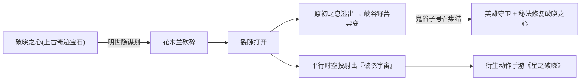
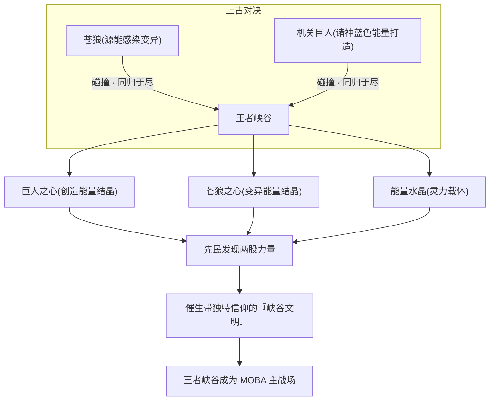
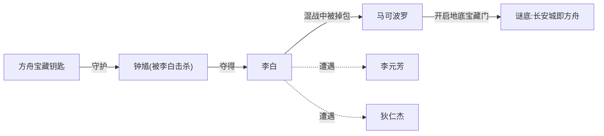
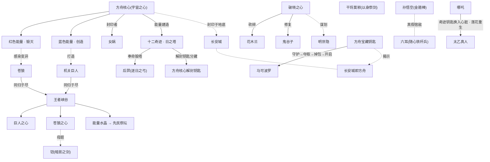

# 专题 · 神兵 · 名剑 · 信物

!!! quote "题记"
    「能量本无善恶，红与蓝，创造与毁灭，皆系于持之者的一念。」——本页所要盘点的，正是这「一念」所凝结的诸般器物。

在《王者荣耀》的世界观里，**器物**从来不只是冷冰冰的道具。一柄剑、一张弓、一颗心脏般跳动的能量结晶，往往是世界观最沉默、却最关键的叙事承载者——它们既是某段历史的物证，又是某个英雄命运的具象，更常常是**整个文明能量体系**的实体化身。

本页把散落在各阵营、各纪元的重要器物汇聚一处，分为四个层级来盘点：

- :material-earth: **创世级器物**

    决定整个世界存亡的本源造物：[方舟核心](../worldview/concepts.md)（宇宙之心）、破晓之心、十二奇迹与日之塔。它们是「神器」中的神器，红蓝两色能量的源头。

- :material-heart-pulse: **峡谷三遗物**

    上古能量造物对决后的残骸结晶：**巨人之心、苍狼之心、能量水晶**。它们让王者峡谷成为大陆灵力最盛之地，是 MOBA 主战场的世界观基石。

- :material-sword: **英雄标志神兵**

    与英雄血肉相连的名剑、名弓、名器：[后羿](../heroes/shanggu-shenhua.md#后羿)的逐日之弓、[干将莫邪](../heroes/jixia.md#干将莫邪)的以身祭剑、[铠](../heroes/changan.md#铠)的暗影之剑、[孙悟空](../heroes/shanggu-shenhua.md#孙悟空)的金箍棒……

- :material-ring: **信物 · 钥匙 · 契约**

    串联人物羁绊与剧情谜题的小物件：方舟解封钥匙、奇迹钥匙、随心铁杆兵、月老红线、彼此互赠的世交之物。

!!! warning "考据口径说明"
    《王者荣耀》的器物设定大量来自**英雄背景故事、皮肤剧情、动画 PV 与官方世界观体验站**，不同来源偶有出入，官方亦长期边填坑边修订。本页以世界观骨架资料为准绳，凡属社区整合、皮肤剧情或合理推断处均以「**（考据推测）**」或提示框标注，不与官方明确硬设定相抵触。机制名词（如装备「破晓」「贤者的庇护」）属对战系统，与世界观叙事是两套体系，本页只在必要处点到、不混为一谈。

---

## 一、器物总表

下表是本页的总索引。**性质**一栏标注器物在世界观中的层级；**持有者／关联人物**链接至英雄页或阵营页；**来历**与**作用**则一句话勾勒其本事。详述见后文各 `##` 小节。

| 名称 | 性质 | 持有者／关联人物 | 来历 | 作用 |
| --- | --- | --- | --- | --- |
| **方舟核心**（宇宙之心） | 创世神器 · 末日开关 | [女娲](../heroes/shanggu-shenhua.md#女娲)（封印者）／神明全体 | 超智慧生命体乘方舟降临时携带的能量总枢纽 | 内蕴红（毁灭）蓝（创造）两色原始能量，创生命、建奇迹；后被封印于[长安城](../factions/changan.md)地底 |
| **十二奇迹**（含日之塔） | 能量设施 · 封印谜题 | 神明建造／[后羿](../heroes/shanggu-shenhua.md#后羿)（毁日之塔） | 以方舟核心能量建造的十二座奇迹建筑 | 抽取地底源能供养文明；女娲将核心解封钥匙分藏其中 |
| **破晓之心** | 上古奇迹宝石 | [花木兰](../heroes/changan.md#花木兰)（砍碎者）／[鬼谷子](../heroes/jixia.md#鬼谷子)（修复者）／[明世隐](../factions/changan.md)（谋划者） | 上古遗留的奇迹宝石 | 被砍碎后裂隙打开、原初之息溢出，投射出「破晓宇宙」 |
| **巨人之心** | 峡谷遗物 · 创造能量结晶 | 王者峡谷／先民文明 | 诸神以蓝色能量打造的机关巨人之残骸 | 与苍狼之心、能量水晶共同使峡谷成为大陆能量最盛之地 |
| **苍狼之心** | 峡谷遗物 · 变异能量结晶 | 王者峡谷／[苍](../heroes/yunzhong-modi.md#苍)等狼裔（考据推测） | 受源能感染变异的苍狼之残骸 | 同上，是峡谷阴面（暗影／野性）能量的来源母题 |
| **能量水晶** | 峡谷遗物 · 灵力载体 | 王者峡谷／先民祭坛 | 苍狼与机关巨人同归于尽后散落的结晶 | 先民在其上修筑祭坛、催生峡谷文明，是水晶／泉水机制的世界观落点 |
| **逐日之弓** | 半神神兵 · 弓 | [后羿](../heroes/shanggu-shenhua.md#后羿) | 半神之弓手射日宿命的具象 | 奉女娲之命毁日之塔；称号「半神之弓」即由此而来 |
| **干将 · 莫邪**（双剑） | 以身祭剑之名剑 | [干将莫邪](../heroes/jixia.md#干将莫邪) | 铸剑师夫妇双双以身祭剑、一分为二 | 干将化剑、莫邪化魂，远程范围爆发；同体英雄 |
| **暗影之剑** | 龙域神兵 · 巨剑 | [铠](../heroes/changan.md#铠) | 自[日落海](../factions/changan.md)漂流而来者所持 | 可引动暗影之力化身狂暴龙域姿态 |
| **如意金箍棒** | 神兵 · 棍 | [孙悟空](../heroes/shanggu-shenhua.md#孙悟空) | 魔种起义领袖之武器 | 可大小如意、分身爆发，反抗神明的象征 |
| **随心铁杆兵** | 拟态兵器 | [六耳](../heroes/yuanchu-shenhua-misc.md#六耳) | 六耳猕猴所持、可随心变形之兵 | 配合分身与复制敌方技能作战 |
| **青龙偃月刀 · 赤兔** | 名将兵骑 | [关羽](../heroes/sanfen-shu.md#关羽) | 骑赤兔、提青龙偃月刀的骑战之将 | 加速冲撞，演义最经典的人马一体意象 |
| **方天画戟** | 名将兵器 | [吕布](../heroes/modao-shadow-abyss.md#吕布) | 「飞将」之标志兵器 | 随最大生命提升伤害、霸体肉战 |
| **千金重弩** | 名器 · 弩 | [孙尚香](../heroes/sanfen-wu.md#孙尚香) | 吴国郡主娇蛮活泼的标志武器 | 手持重弩冲锋、翻滚走位 |
| **戒尺 · 书卷** | 圣贤法器 | [老夫子](../heroes/jixia.md#老夫子) | 三贤者之首、大陆第一智慧长者所持 | 戒尺禁锢、书卷镇人，象征「圣言」之力 |
| **破碎魔镜** | 神职试炼之器 | [镜](../heroes/changan.md#镜) | 经[万镜阁](../factions/changan.md)（万镜之厅）试炼所获 | 操纵镜面碎片穿梭、破镜杀敌 |
| **武器逐** | 星辰兵器 | [曜](../heroes/changan.md#曜) | 太阳之子、神职家族之子所持 | 借星位机制位移连招 |
| **武器匣（五兵）** | 归山重铸兵 | [蚩奼](../heroes/baiyue.md#蚩奼) | 由祖先**殳、矛、戈、戟、弓**五兵能量核心重铸 | 器痴少女随战况切换五种形态 |
| **占星法器 · 牡丹** | 方士信物 | [明世隐](../factions/changan.md)／[弈星](../heroes/jixia.md#弈星) | 尧天首领的占星谋略象征（考据推测） | 借占卜谋略活跃长安暗处 |
| **奇迹钥匙** | 信物 · 钥匙 | [太乙真人](../heroes/haojing-fengshen.md#太乙真人)／[哪吒](../heroes/haojing-fengshen.md#哪吒) | 太乙换入濒死哪吒心脏之物 | 以炼金术使哪吒凭莲花重生的关键 |
| **方舟宝藏钥匙** | 信物 · 钥匙 | [钟馗](../heroes/changan.md#钟馗)（守护）／[李白](../heroes/changan.md#李白)／[马可波罗](../heroes/jianghu-xiake.md#马可波罗) | 开启长安地底宝藏（方舟）之门的钥匙 | 揭示「长安即方舟」的核心谜底 |
| **红线** | 姻缘信物 | [少司缘](../heroes/shanggu-shenhua.md#少司缘) | 掌管姻缘的红线之神所持 | 牵引、控制、治疗，是「缘分」的实体化 |

!!! info "如何使用本表"
    - **创世级**与**峡谷三遗物**关乎世界存亡与峡谷文明根基，是最「硬」的世界观器物，详见第二、三章。
    - **英雄标志神兵**多与英雄人格、阵营文化深度绑定，详见第四章。
    - **信物 · 钥匙**体量虽小，却往往是剧情谜题与人物羁绊的「枢纽」，详见第五章。
    - 凡未在 build 资料中明确命名、而依英雄定位／皮肤推断者，本页均以「（考据推测）」标注，例如苍狼之心与「狼裔」英雄的关联。

---

## 二、创世级器物：决定世界存亡的本源造物

这一层级的器物，是世界观「科幻 + 神话」双重外壳的承重墙。它们不属于任何单一英雄，而属于**整个文明的命运**。

### 2.1 方舟核心（宇宙之心 / Ark Core）

> **性质**：创世神器 · 末日开关　|　**关联**：[女娲](../heroes/shanggu-shenhua.md#女娲)（封印者）、神明全体、[长安城](../factions/changan.md)

方舟核心是**整个世界观能量体系的总枢纽**，蕴藏天地间生生不息的力量。它的来历可追溯到世界观最底层的史前史：遥远未来的旧地球文明因科技失控而毁灭，少数幸存者进化为超智慧生命体，携带人类基因与文明能量，乘**方舟**飞船穿越深空降临蔚蓝星球——王者大陆。这些降临者凭力量自封为神明，而支撑他们「神迹」的无限能源，正是方舟所携的核心。

方舟核心最核心的设定，是其内部孕育的**两股原始力量**：

- :material-fire: **红色能量 · 毁灭**

    与深渊、暗影、污染相互呼应的一极。是末日、堕落与战争的能量底色，也是后世「暗影」概念的源头母题。

- :material-water: **蓝色能量 · 创造**

    神明据以创造生命、建造奇迹、打造机关巨人的力量。是文明、秩序与生机的能量底色。

!!! note "红蓝双色：贯穿全宇宙的母题"
    红与蓝这组「毁灭／创造」对立色，是《王者荣耀》世界观最重要的视觉与叙事母题，一路延伸到平行宇宙：[琥珀纪元](parallel-worlds.md)中神秘物质**繁星琥珀**的红蓝配色（[马超](../heroes/sanfen-shu.md#马超)红、[伽罗](../heroes/changcheng.md#伽罗)蓝），便被认为是对方舟核心红蓝能量的遥相呼应。

方舟核心既是**创世神器**，也是**末日开关**——神明依其创世，也因争夺它的使用方式而走向自相残杀。在[诸神之战](gods-vs-demons.md)（封神之战）的尾声，[女娲](../heroes/shanggu-shenhua.md#女娲)以最后的力量将方舟核心**封印**，并将解封它的**钥匙分藏于十二奇迹之中**，随后沉睡。封印之地，正是后世由[墨子](../heroes/mojia-jiguan.md#墨子)亲手营造的[长安城](../factions/changan.md)地底——

!!! quote "长安城的真面目"
    「长安城本身，就是封印的方舟。」——这一在《永远的长安城》动画中揭晓的核心设定，使整个人类时代的政治与冒险，都笼罩在「脚下封着末日开关」的暗影之下。详见 [世界观 · 核心概念 · 方舟核心](../worldview/concepts.md#方舟核心宇宙之心) 与 [专题 · 诸神与魔种](gods-vs-demons.md)。

### 2.2 十二奇迹与日之塔

> **性质**：能量设施 · 封印谜题　|　**关联**：神明（建造者）、[后羿](../heroes/shanggu-shenhua.md#后羿)（毁塔者）、[女娲](../heroes/shanggu-shenhua.md#女娲)（藏钥匙者）

**十二奇迹**是神明以方舟核心能量建造的十二座奇迹建筑，是文明的能量与权力支柱。它们具有**双重身份**：

| 身份 | 含义 |
| --- | --- |
| **能量设施** | 抽取、转化与分配方舟核心能量，供养神明文明的运转 |
| **封印谜题** | 诸神之战后，女娲将方舟核心的解封钥匙**分藏其中**，使十二奇迹成为锁住末日开关的十二把锁 |

其中最具代表性者，便是**日之塔**。日之塔昼夜不息地抽取王者大陆地底的**源能（星球之血）**为新文明提供动力——但这种**竭泽而渔**式的能量开采，正是星球反噬、诸神之战与文明崩塌的祸根。

!!! warning "日之塔：一切悲剧的导火索"
    [女娲](../heroes/shanggu-shenhua.md#女娲)目睹星球因日之塔的过度开采而濒临反噬，主张限制超出星球承载力的发展，遂派[后羿](../heroes/shanggu-shenhua.md#后羿)关闭／摧毁受污染的日之塔；而以[帝俊](../heroes/haojing-fengshen.md#帝俊)为首的一派则主张「进步不应受任何束缚」。理念的彻底对立，最终引爆了[诸神之战](gods-vs-demons.md)。一座能量塔，成了神明文明的崩塌点。

!!! tip "考据延伸：奇迹谱系"
    十二奇迹中，**云蚕**（高居[稷下学院](../factions/jixia.md)通天塔之上、吐丝构建通天塔的奇迹）、**破晓之心**（上古奇迹宝石）等亦被纳入「奇迹」范畴。具体哪十二座、各自司掌何能，官方未给出完整清单，本页不作穷举。详见 [世界观 · 核心概念 · 十二奇迹](../worldview/concepts.md#十二奇迹) 与 [核心概念 · 日之塔](../worldview/concepts.md#日之塔)。

### 2.3 破晓之心

> **性质**：上古奇迹宝石　|　**关联**：[花木兰](../heroes/changan.md#花木兰)（砍碎者）、[鬼谷子](../heroes/jixia.md#鬼谷子)（修复者）、[明世隐](../factions/changan.md)（谋划者）

**破晓之心**是一枚上古奇迹宝石（亦见 [世界观 · 核心概念 · 破晓之心](../worldview/concepts.md#破晓之心)）。在[明世隐](../factions/changan.md)的谋划下，[花木兰](../heroes/changan.md#花木兰)将其**砍碎**——通往异界的裂隙就此打开，本源能量**原初之息**汹涌涌出，浸染王者峡谷，引发野兽异变。这一事件也是[王者峡谷由来](canyon.md)与[平行宇宙](parallel-worlds.md)两条线索的交汇点。

它的特殊之处，在于「砍碎的那一瞬间」所产生的连锁后果：

!!! info "破晓宇宙：器物催生的平行世界"
    破晓之心被砍碎的瞬间，原初之息使王者大陆在平行时空中投射出一个全新宇宙——**破晓宇宙**。这是「一件器物催生一个平行世界」的典型案例。[鬼谷子](../heroes/jixia.md#鬼谷子)随即号召[花木兰](../heroes/changan.md#花木兰)、[上官婉儿](../heroes/changan.md#上官婉儿)、[程咬金](../heroes/changan.md#程咬金)、[司空震](../heroes/changan.md#司空震)等英雄集结守卫，并以秘法修复破晓之心。详见 [专题 · 平行宇宙](parallel-worlds.md)。

---

## 三、峡谷三遗物：王者峡谷的能量基石

如果说方舟核心是世界观的「心脏」，那么**巨人之心、苍狼之心与能量水晶**就是 MOBA 主战场——**王者峡谷**——的「心脏」。三者同出一源：一场上古能量造物的对决。本章侧重「三遗物」作为**器物**的层面；峡谷地理、先民信仰与对战机制的完整展开，另见 [专题 · 王者峡谷由来](canyon.md) 与 [世界观 · 核心概念 · 苍狼与机关巨人](../worldview/concepts.md#苍狼与机关巨人)。

!!! quote "峡谷的由来"
    上古能量造物**苍狼**（受源能感染变异而肆虐）与诸神以蓝色创造能量打造、用以镇压苍狼的**机关巨人**，最终在王者峡谷碰撞、**同归于尽**。两者的残骸散落，孕育出巨人之心、苍狼之心与能量水晶，使峡谷成为大陆灵力最盛之地。

### 3.1 巨人之心

> **性质**：峡谷遗物 · 创造能量结晶

巨人之心，是诸神以**蓝色创造能量**打造的机关巨人的核心残骸。它承载着「创造／秩序／光明」一极的能量，是峡谷阳面力量的源头。在先民文明的信仰中，巨人之心代表着上古诸神的造物伟力。

!!! tip "考据推测：机制与叙事的呼应"
    游戏对战中长期存在名为「**巨人之心**」的肉装（提供大量生命值），与本设定的「机关巨人之心」在命名上同源同构。这是「世界观器物」与「对战装备」共用一名的典型——叙事上的能量结晶，落到机制里就成了一件装备。**（考据推测，机制与叙事属两套体系，不可硬性等同。）**

### 3.2 苍狼之心

> **性质**：峡谷遗物 · 变异能量结晶　|　**关联（推测）**：[苍](../heroes/yunzhong-modi.md#苍)、[百里玄策](../heroes/changcheng.md#百里玄策)等狼裔血脉

苍狼之心，是受**源能感染变异**而肆虐的上古能量造物——苍狼——的核心残骸。相对于巨人之心的「创造」，苍狼之心承载的是**野性、变异与暗面**的能量，与方舟核心红色（毁灭）能量、暗影、污染遥相呼应，是峡谷阴面力量的母题。

!!! note "「狼」的血脉网络（考据推测）"
    世界观中多名英雄与「狼」相关，使苍狼意象在英雄层面有所延展：[苍](../heroes/yunzhong-modi.md#苍)（草原之狼）、[百里玄策](../heroes/changcheng.md#百里玄策)（带狼基因的人魔混血少年）、乃至云中漠地的诸般狼患。这些「狼裔」是否直接承自苍狼之心，官方未明言，本页仅作母题层面的关联，**（考据推测）**。

### 3.3 能量水晶

> **性质**：峡谷遗物 · 灵力载体　|　**关联**：先民祭坛、峡谷文明

能量水晶，是苍狼与机关巨人同归于尽后散落、凝结的**灵力结晶**。它是三遗物中最「基础」也最「弥漫」的一种——正是密布峡谷的能量水晶，使整片峡谷浸润于上古能量之中，成为大陆能量最集中之地。

**先民**发现了这股力量，在能量水晶之上**修筑祭坛**，围绕其建立起带有独特信仰的**峡谷文明**，为英雄时代铺垫了舞台。这也正是 MOBA 主玩法中「水晶／泉水」机制的世界观落点——玩家所守护、所摧毁的那座「水晶」，在叙事上正是上古能量的结晶。

!!! example "三遗物速记"
    - **巨人之心** = 蓝色创造能量的残骸 → 阳面 · 秩序 · 造物伟力
    - **苍狼之心** = 变异源能的残骸 → 阴面 · 野性 · 暗影母题
    - **能量水晶** = 弥漫峡谷的灵力载体 → 文明根基 · 祭坛 · 「水晶」机制

---

## 四、英雄标志神兵：与血肉相连的名器

如果说前两章的器物属于「世界」，那么本章的神兵则属于「人」。它们或是英雄人格的延伸，或是其命运的烙印，离了持有者便失去意义。

### 4.1 逐日之弓 —— 后羿

> **持有者**：[后羿](../heroes/shanggu-shenhua.md#后羿)（半神之弓）射手

后羿背负**射日宿命**，是「半神之弓手」。他的弓——逐日之弓——与他的称号「**半神之弓**」融为一体：弓即是人，人即是弓。这把弓最重的一笔，不是射落天上的太阳，而是**奉[女娲](../heroes/shanggu-shenhua.md#女娲)之命摧毁[日之塔](#22-十二奇迹与日之塔)**，由此点燃了[诸神之战](gods-vs-demons.md)的引线。

!!! quote "弓与人的宿命"
    后羿在临刑前放走了魔道公主[嫦娥](../heroes/shanggu-shenhua.md#嫦娥)，濒死的嫦娥随月光沉海。一把承载「毁灭使命」的弓，最终也射出了一念之仁——这正是后羿这一角色的悲剧底色。情人节皮肤将「后羿×嫦娥」浪漫化，但主线中二人多为前世羁绊／梦中邂逅，并非在世相守。

### 4.2 干将 · 莫邪 —— 以身祭剑的双剑

> **持有者**：[干将莫邪](../heroes/jixia.md#干将莫邪)（一念神魔）法师

在所有器物中，干将与莫邪是最特殊的一对——因为**剑就是人，人就是剑**。

这对青梅竹马的贫寒铸剑工匠夫妇，为铸成无双之剑，双双以身祭剑：**干将化为剑、莫邪化为剑魂**，一分为二的生命、独一无二的魂灵。游戏将这一中国古典铸剑传说改造为「**同体英雄**」——你操控的是一把会飞出去爆发的剑（干将），而驾驭它的是一缕剑魂（莫邪）。

!!! quote "一念神魔"
    「我以身铸剑，你以魂驭之。」——干将莫邪是「器物即人物、人物即器物」这一命题最极致的演绎。他们的称号「**一念神魔**」与[李信](../heroes/changan.md#李信)相同，皆暗合方舟核心「一念之间，创造或毁灭」的母题。

??? note "考据：干将莫邪的铸剑传说原型"
    干将、莫邪本是中国古代著名的雌雄双剑及其铸剑师之名（典出《吴越春秋》《搜神记》），传说莫邪曾断发剪爪、乃至投身炉中以成剑。《王者荣耀》取其「以身祭剑」的核心意象，将「铸剑师」与「剑」合一为同体英雄，是对原典极具创意的再演绎。

### 4.3 暗影之剑 —— 铠

> **持有者**：[铠](../heroes/changan.md#铠)（暗影游侠）战士坦克

铠从[日落海](../factions/changan.md)漂流而来，被[花木兰](../heroes/changan.md#花木兰)拾得并命名。他手中的**暗影之剑**是一柄沉重的巨剑——平日深藏暗影之力，一旦引动便可使他**化身狂暴姿态**，成为龙域的守护者。这柄剑承载的「暗影」属性，与方舟核心红色（毁灭）能量、峡谷[苍狼之心](#32-苍狼之心)的暗面母题一脉相承。

### 4.4 如意金箍棒 —— 孙悟空

> **持有者**：[孙悟空](../heroes/shanggu-shenhua.md#孙悟空)（齐天大圣）刺客战士

金箍棒是**魔种起义**的图腾。作为起义领袖，孙悟空持金箍棒、可分身，「永远冲在最前方」。这件可大小如意的神兵，是被压迫者向神明举起的反抗之器——它的每一次挥动，都是对神明—神职者—人类—魔道—魔种这座森严金字塔的撞击。详见 [专题 · 诸神与魔种](gods-vs-demons.md)。

*上图：金箍棒所撞击的，正是这座由方舟核心「造人」并层层奴役所构筑的神权等级金字塔——越往下，权力与自由递减、受压迫者递增。*

!!! note "真假之争：随心铁杆兵"
    孙悟空的宿敌**[六耳](../heroes/yuanchu-shenhua-misc.md#六耳)**（六耳猕猴）持**随心铁杆兵**——一件可随心变形的拟态兵器，配合分身与「复制敌方技能」作战。一真一假、一棒一杆，构成了「真假美猴王」母题在器物层面的镜像。

### 4.5 名将兵器谱（三分之地 · 封神 · 魔道）

三国与封神题材的英雄，其兵器多直接承自史书与演义，是「文化记忆点」的实体化。下表汇总主要名将兵器：

| 兵器 | 持有者 | 阵营 | 意象 |
| --- | --- | --- | --- |
| **青龙偃月刀 + 赤兔马** | [关羽](../heroes/sanfen-shu.md#关羽) | [蜀国](../factions/sanfen-shu.md) | 骑赤兔、提青龙偃月刀加速冲撞，人马一体 |
| **方天画戟** | [吕布](../heroes/modao-shadow-abyss.md#吕布) | [魔道·暗影](../factions/modao-shadow-abyss.md) | 随最大生命提升伤害的霸体肉战，「飞将」标志 |
| **千金重弩** | [孙尚香](../heroes/sanfen-wu.md#孙尚香) | [吴国](../factions/sanfen-wu.md) | 郡主娇蛮活泼、手持重弩冲锋翻滚 |
| **双枪** | [刘备](../heroes/sanfen-shu.md#刘备) | [蜀国](../factions/sanfen-shu.md) | 远近结合的射击型枭雄 |
| **双戟** | [典韦](../heroes/sanfen-wei.md#典韦) | [魏国](../factions/sanfen-wei.md) | 「恶来」狂暴近身输出 |
| **巨型重炮** | [黄忠](../heroes/sanfen-shu.md#黄忠) | [蜀国](../factions/sanfen-shu.md) | 老当益壮、越战越勇的奇幻化重器 |
| **机关车** | [刘禅](../heroes/sanfen-shu.md#刘禅) | [蜀国](../factions/sanfen-shu.md) | 「无忧之主」操控的机关坦辅 |
| **戟（掷枪／拾枪）** | [马超](../heroes/sanfen-shu.md#马超) | [蜀国](../factions/sanfen-shu.md) | 西凉锦马超的掷枪—拾枪机制 |

!!! warning "演义化重构"
    黄忠的「巨型重炮」、刘禅的「机关车」属游戏对史实／演义的**奇幻化再演绎**，不应与正史混为一谈。详见 [专题 · 三分之地与三国演义](three-kingdoms.md)。

### 4.6 圣贤与异士的法器

并非所有「神兵」都是杀伐之器。学院与江湖中，许多器物是智慧、信仰或技艺的延伸：

- :material-ruler: **戒尺 · 书卷 —— [老夫子](../heroes/jixia.md#老夫子)**

    三贤者之首、大陆第一智慧长者所持。戒尺用以禁锢、书卷用以镇人，是「圣言狂儒」以学问立威的法器。

- :material-mirror: **破碎魔镜 —— [镜](../heroes/changan.md#镜)**

    出身古老神职家族，经[万镜阁](../factions/changan.md)（万镜之厅）试炼获力。她操纵破碎的魔镜碎片穿梭、破镜杀敌，镜即是其名、其力、其命。

- :material-star-four-points: **武器逐 —— [曜](../heroes/changan.md#曜)**

    太阳之子、[镜](../heroes/changan.md#镜)之弟，持武器「逐」、借星位机制位移连招，组建「星之队」探寻星辰之力。

- :material-anvil: **武器匣（五兵）—— [蚩奼](../heroes/baiyue.md#蚩奼)**

    [蚩尤](../factions/baiyue.md)后人、归山一族器痴少女，武器匣由祖先**殳、矛、戈、戟、弓**五兵的能量核心重铸，可随战况切换形态。

??? note "更多英雄器物（拾遗）"
    - **笔（以笔为剑）—— [上官婉儿](../heroes/changan.md#上官婉儿)**：盛唐才女以笔为剑、连招华丽，「书世间之万象」。
    - **油纸伞 —— [公孙离](../heroes/changan.md#公孙离)**：伞舞射手，身姿翩跹。
    - **左轮短枪 —— [狄仁杰](../heroes/changan.md#狄仁杰)**：大唐神探以短枪行使律法正义。
    - **双枪 · 圣枪 —— [马可波罗](../heroes/jianghu-xiake.md#马可波罗)**：异乡远游的圣枪游侠（其枪亦关联下文「方舟宝藏钥匙」事件）。
    - **魔导书（寄宿梅林）—— [安琪拉](../heroes/jixia.md#安琪拉)**：体内寄宿魔法师梅林、手持魔导书的火焰法术少女。
    - **音律为器 —— [高渐离](../heroes/jixia.md#高渐离)、[蔡文姬](../heroes/sanfen-wei.md#蔡文姬)、[杨玉环](../heroes/changan.md#杨玉环)**：以乐为兵或以乐疗伤。
    - **巨盾 —— [盾山](../heroes/changcheng.md#盾山)**：长城守卫军机关守护者，可格挡一切远程飞行物。
    - 上述器物均与英雄定位强绑定，详见各英雄页与所属 [阵营页](../factions/changan.md)。

---

## 五、信物 · 钥匙 · 契约：串联羁绊与谜题的小物件

最后这一类器物体量虽小，却常是**剧情的枢纽**——一把钥匙能掀开整个世界观的谜底，一根红线能定下一段姻缘，一件互赠之物能见证一生的羁绊。

### 5.1 钥匙：锁与谜底

世界观中有三类关键「钥匙」，分别锁着创世之秘、重生之命与方舟宝藏。

| 钥匙 | 锁着什么 | 关联人物 | 谜底 |
| --- | --- | --- | --- |
| **方舟核心解封钥匙** | 封印的[方舟核心](#21-方舟核心宇宙之心--ark-core) | [女娲](../heroes/shanggu-shenhua.md#女娲)（藏匿者） | 钥匙被**分藏于[十二奇迹](#22-十二奇迹与日之塔)**之中，是末日开关的多重锁 |
| **奇迹钥匙** | [哪吒](../heroes/haojing-fengshen.md#哪吒)的重生 | [太乙真人](../heroes/haojing-fengshen.md#太乙真人) | 太乙将奇迹钥匙换入濒死哪吒的心脏，再以自己心脏为代价、用炼金术使哪吒凭莲花重生 |
| **方舟宝藏钥匙** | 长安地底宝藏（即方舟） | [钟馗](../heroes/changan.md#钟馗)、[李白](../heroes/changan.md#李白)、[李元芳](../heroes/changan.md#李元芳)、[狄仁杰](../heroes/changan.md#狄仁杰)、[马可波罗](../heroes/jianghu-xiake.md#马可波罗) | 钥匙数度易手，最终由马可波罗开启宝藏之门，揭示「长安即方舟」 |

!!! quote "《永远的长安城》：一把钥匙掀开的谜底"
    [李白](../heroes/changan.md#李白)击杀守护者[钟馗](../heroes/changan.md#钟馗)夺得宝藏钥匙，遭遇[李元芳](../heroes/changan.md#李元芳)与[狄仁杰](../heroes/changan.md#狄仁杰)；混战中钥匙被[马可波罗](../heroes/jianghu-xiake.md#马可波罗)**掉包**，马可波罗开启长安地底宝藏大门——「**长安城即方舟、方舟能量即地底宝藏**」的核心设定，由这一把小小的钥匙正式揭开。详见 [世界观 · 时间线](../worldview/timeline.md)。

### 5.2 信物与契约：羁绊的实体

许多人物羁绊，都有一件「信物」作为锚点：

- :material-heart-circle: **红线 —— [少司缘](../heroes/shanggu-shenhua.md#少司缘)**

    掌管姻缘的「赤诚月老」，以红线牵引、控制与治疗。红线是「缘分」最直白的实体化——它既是辅助技能，也是世界观里「命运可被牵系」的隐喻。

- :material-account-switch: **世交互赠之物 —— [李白](../heroes/changan.md#李白) × [韩信](../heroes/jianghu-xiake.md#韩信)**

    李白属狐族、韩信属龙族，两族世代为友。二人自幼相识、一同修行、**互用彼此之物**（凤求凰／白龙吟皮肤呼应）。互赠之物，是「信白」世交羁绊的见证。

- :material-cards-playing: **彩戏机关 —— [空空儿](../heroes/jianghu-xiake.md#空空儿)**

    以非遗「彩戏」（戏法）为设计、能**夺取敌方装备**的偷装神辅。他的「器物」恰恰是「夺取他人器物」之术，别具一格。

- :material-puppet: **傀儡 —— [元歌](../heroes/sanfen-shu.md#元歌)**

    幼年失语入[稷下](../factions/jixia.md)，由师兄[诸葛亮](../heroes/sanfen-shu.md#诸葛亮)启发，以**机关傀儡代喉舌**与世界交流。傀儡于他，是器物，更是声音与人格的替身。

---

## 六、器物—人物总关联图

下图把本页提及的主要器物与其持有者／关联人物、以及它们所属的能量谱系串联起来，作为全页的总览。

!!! note "图例说明"
    - **实线**：直接的持有／建造／因果关系。
    - **虚线**：母题呼应、平行关联或推断关系。
    - 图中「红色能量打造机关巨人」一线为简化表达；严格据 build 资料，**机关巨人由诸神以蓝色创造能量打造、用以镇压受源能（红色／变异）感染的苍狼**，故图中以蓝线连机关巨人、红线连苍狼为准。

---

## 七、延伸阅读

- :material-earth: **[世界观 · 核心概念](../worldview/concepts.md)**

    方舟、方舟核心、源能、十二奇迹、苍狼／机关巨人、破晓之心等概念的总词典。

- :material-timeline-clock: **[世界观 · 时间线](../worldview/timeline.md)**

    从方舟降临、日之塔抽能、诸神之战封印核心，到《永远的长安城》揭秘方舟之钥的完整纪年。

- :material-sword-cross: **[专题 · 诸神与魔种](gods-vs-demons.md)**

    逐日之弓毁日之塔、金箍棒举起反抗、方舟核心被封印的「诸神之战」全景。

- :material-earth-box: **[专题 · 平行宇宙](parallel-worlds.md)**

    破晓之心催生的破晓宇宙，与琥珀纪元繁星琥珀对红蓝能量母题的呼应。

- :material-image-filter-hdr: **[专题 · 王者峡谷由来](canyon.md)**

    巨人之心、苍狼之心、能量水晶三遗物的完整成因，与峡谷文明、对战机制的世界观落点。

- :material-account-heart: **[关系网总览](../relationships/index.md)**

    干将×莫邪、后羿×嫦娥、信白世交、太乙×哪吒等以「信物」为锚点的羁绊全貌。

!!! tip "结语"
    在《王者荣耀》的世界里，器物从不只是装饰。一柄逐日之弓里，藏着一个神明文明的崩塌；一对干将莫邪中，凝着一对夫妇的生死；一颗深埋长安的方舟核心下，压着整个世界的存亡。读懂了这些器物，便读懂了这个世界最沉默的那部分历史。
