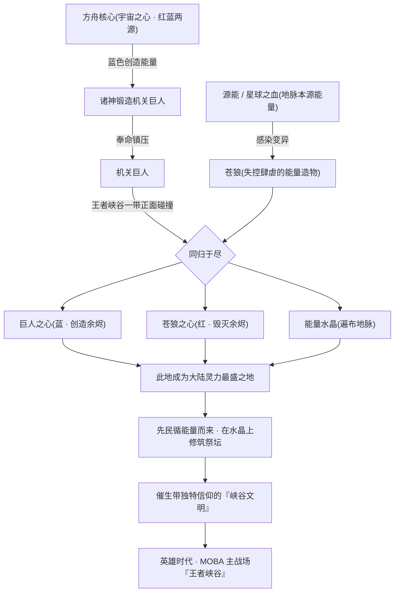
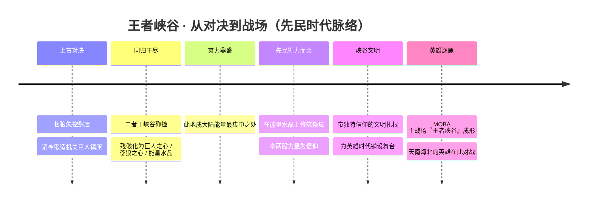
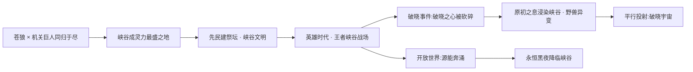

# 专题 · 王者峡谷的由来

> 「在大陆所有地方之中，唯有这一处，连泥土里都淌着上古的电流。」

每一位召唤师每天踏入的那片地图——红蓝双方、三路兵线、河道野区、主宰与暴君各踞一隅——并不是凭空画出的对战棋盘。在《王者荣耀》的世界观里，它有一个郑重其事的名字：**王者峡谷**，并且有一段属于自己的、足以解释「为什么是这里」的史前史。

本页要回答一个最朴素也最根本的问题：**作为 MOBA 主战场的「王者峡谷」，在世界观中究竟从何而来？** 答案要从一只失控的上古巨兽、一具诸神锻造的钢铁造物，以及它们同归于尽后留下的三颗「心」说起。

!!! info "本页的取材与边界"
    本页主要据 `.build/world.json` 的纪元（eras）「先民时代 / 峡谷文明」、宇宙观概念（cosmologyConcepts）「苍狼 / 机关巨人」「王者峡谷」「源能」「方舟核心」「暗影」「深渊」等字段写就，并与 [地理图志 · 王者峡谷专节](../worldview/map.md) 互为表里、彼此呼应。

    - 凡标注 **「(考据推测)」** 处，为编者据公开资料、游戏内机制惯例与红蓝能量母题所作的合理推断，并非官方钦定的硬设定；
    - 王者峡谷的对战机制（主宰、暴君、红蓝 buff、防御塔、水晶等）在世界观层面的精确对应，官方留白颇多，本页在「能量阴阳对照」一节中会明确区分**确证设定**与**机制映射推测**。

---

## 一、一句话由来：两强相争，遗骸成谷

如果只用一句话概括，王者峡谷的由来是这样一条因果链：

> **上古能量造物「苍狼」失控肆虐 → 诸神以蓝色创造能量锻造「机关巨人」镇压之 → 二者在此地碰撞、同归于尽 → 残骸孕育出巨人之心、苍狼之心与能量水晶 → 此地遂成全大陆灵力最盛之处 → 先民循能量而来，在水晶之上建祭坛、立信仰，催生「峡谷文明」 → 这片浸透上古之力的战场，便是后世英雄逐鹿的「王者峡谷」。**

下面逐环拆解这条链上的每一颗扣子。

!!! note "时间坐标：它发生在「先民时代」"
    这场对决与峡谷文明的诞生，被归入世界观纪元中的 **「先民时代 / 峡谷文明」**，时段定位为 **「英雄时代前夜」**——即介于诸神陨落的[神明时代](gods-vs-demons.md)与玩家最熟悉的[人类·逐鹿时代](../worldview/eras.md#人类时代--英雄逐鹿时代)之间的过渡地带。它为英雄时代铺好了舞台，本身却少有英雄登场，更像一段「地质纪录式」的前史。详见 [纪元与年表](../worldview/eras.md)。

    !!! warning "一处纪元定位的考据存疑"
        需要说明的是，「先民时代 / 峡谷文明」是本百科据 `world.json` 对官方「峡谷由来」叙事所作的**纪元化归纳**，其在主世界线时间轴上的**绝对先后**官方并未严格钉死。它被冠以「英雄时代前夜」之名，更多是**主题与功能上的定位**（为英雄时代准备舞台），而非可与「神战约三千年后」精确对齐的硬性纪年。(考据推测：苍狼与机关巨人的对决究竟早于、还是与神明时代部分重叠，官方留白，本页取「前夜」一说仅为叙事便利。)

---

## 二、对决双方：失控的红，与镇压的蓝

王者峡谷的诞生，本质上是**两股上古力量的对冲**。而这两股力量，恰好分属世界观最深层的能量母题——**红色（毁灭）与蓝色（创造）** 的两极。要读懂峡谷，先要认识这对宿敌。

### 2.1 苍狼：被「星球之血」喂养出的失控之兽

**苍狼**是王者大陆的**原生能量造物**，血脉中流淌着大地深处的本源之力。它的失控，源于一种贯穿整个世界观的能量——**[源能](../worldview/concepts.md#源能星球之血--原初之息)**（又称「星球之血」「原初之息」）。

源能是王者大陆地脉中蕴藏的本源能量，既是神明垂涎开采的对象（[日之塔](../worldview/concepts.md#日之塔)昼夜抽取地底源能即为此），也是诸多变异与觉醒的根源。苍狼正是因深受源能感染而**变异、膨胀、肆虐**，成为一头连诸神都为之忌惮的灾厄。

红 · 毁灭失控造物源能变异

!!! quote "草原之狼的回响"
    “苍狼指引方向，雄鹰追逐天空。”——[苍](../heroes/yunzhong-modi.md#苍)（草原之狼）

    在 [云中漠地·边陲](../factions/yunzhong-modi.md) 的英雄叙事里，「狼」始终是西部高原的精神图腾。这片高原正是王者峡谷所在地（参见 §五），上古「苍狼」与边陲狼性血脉之间是否同源，官方未明言。(考据推测：地理与意象的双重重叠，使二者在母题上遥相呼应。)

### 2.2 机关巨人：诸神用「蓝色创造能量」铸成的镇压者

面对失控的苍狼，**诸神**（即降临王者大陆、凭[方舟核心](../worldview/concepts.md#方舟核心宇宙之心)之力自封为神的超智慧生命体）祭出了他们最擅长的手段——**造物**。

他们取用方舟核心内蕴的 **[蓝色创造能量](../worldview/concepts.md#红色能量与蓝色能量)**，锻造出一具足以与苍狼抗衡的钢铁巨构：**机关巨人**。它是诸神文明「机关术 + 神性能源」的集大成之作，使命单纯而沉重——**镇压苍狼**。

蓝 · 创造诸神造物机关镇压

!!! tip "母题提示：这是「红蓝能量」的又一次具象"
    机关巨人（蓝 · 创造）与苍狼（红 · 毁灭）的对决，并非孤例，而是方舟核心 **红色毁灭能量 ↔ 蓝色创造能量** 这一终极母题在「先民时代」的一次具象化投影。

    同一抹红与蓝，在 [神魔之争](gods-vs-demons.md) 里是神明创世与末日的开关，在 [平行宇宙](parallel-worlds.md) 的琥珀纪元里化作「红蓝琥珀」配色，而在这里，则化为一兽一人（巨人）的生死相搏。读峡谷，亦是读这抹红蓝。

### 2.3 双方对照一览

| 维度 | 苍狼 | 机关巨人 |
|---|---|---|
| 本质 | 大陆原生能量造物 | 诸神锻造的机关造物 |
| 能量属性 | 红 · 毁灭（源能变异、失控） | 蓝 · 创造（方舟核心创造能量） |
| 来源 | 受[源能 / 星球之血](../worldview/concepts.md#源能星球之血--原初之息)感染变异 | 诸神取[蓝色创造能量](../worldview/concepts.md#红色能量与蓝色能量)铸造 |
| 使命 / 角色 | 肆虐大陆的灾厄 | 奉命镇压苍狼的守护造物 |
| 阵营立场 | 失控的自然之力 | 诸神意志的延伸 |
| 结局 | 同归于尽，残骸化心 | 同归于尽，残骸化心 |
| 遗产 | 苍狼之心、能量水晶 | 巨人之心、能量水晶 |

---

## 三、同归于尽：一场对决，三样遗产

两强相争，没有赢家。**苍狼与机关巨人最终在今日的王者峡谷一带正面碰撞，两败俱亡、同归于尽。**

这不是一场寻常的厮杀——双方都是承载着天地本源之力的造物，它们的躯壳崩解、能量倾泻，把脚下这片土地浇灌成了一座**天然的能量富矿**。残骸散落、滋养大地，孕育出三样足以改写一方水土命运的上古遗产：

-   :material-heart-pulse:{ .lg .middle } __巨人之心__

    ---

    机关巨人崩解后凝结的能量核心，承载着**蓝色创造能量**的余烬。是诸神造物之力的结晶。

    *(考据推测：在峡谷能量谱系中偏「创造 / 增益」一极。)*

-   :material-dog-side:{ .lg .middle } __苍狼之心__

    ---

    苍狼陨落后留下的能量核心，蕴藏着源能变异而来的**狂暴 / 毁灭**之力。是大陆原生野性的结晶。

    *(考据推测：偏「毁灭 / 爆发」一极，与巨人之心阴阳相对。)*

-   :material-diamond-stone:{ .lg .middle } __能量水晶__

    ---

    两股力量交融、沉淀于大地的结晶体，遍布峡谷地脉。它使整片土地长久浸润在上古能量之中，是「灵力最盛之地」的物质载体。

    *(后为先民立祭坛之基。)*

正是这三样遗产——尤其是遍地的**能量水晶**——让王者峡谷脱胎换骨：它从一处寻常高原，一跃成为 **「全大陆灵力最集中的地方」**。

!!! info "为何说它是「大陆灵力最盛之地」"
    据世界观设定，王者峡谷「浸润于苍狼与机关巨人遗迹的上古能量中而成为大陆能量最集中之地」。换言之，峡谷的「灵力最盛」并非天生地利，而是**两具上古造物以生命为代价、就地倾注的结果**——这片土地的丰饶，是用一场同归于尽换来的。

---

## 四、因果链：从对决到峡谷文明

将前三节串起，便是王者峡谷由来的完整因果链。两股上古之力如何一步步演化为后世的英雄战场，可由下图一览：

### 4.1 先民登场：循能量而来，在水晶上立祭坛

能量从不缺乏追随者。当苍狼与机关巨人的残骸把这片高原点亮成一座「灵力灯塔」，**先民**便循着这股力量而来。

他们发现了这两股遗留的上古之力，并选择以最虔诚的方式与之共处——在**能量水晶**之上**修筑祭坛**，把巨人之心与苍狼之心奉为信仰的对象。围绕这两股力量，一支带有**独特信仰**的文明在此扎根、生长，这便是 **「峡谷文明」**。

### 4.2 峡谷文明：为「英雄时代」铺好的舞台

峡谷文明的意义，不在于它孕育了多少英雄（它几乎没有专属英雄），而在于它**为整个英雄时代准备好了战场**。

这也回答了一个 MOBA 玩家常有的疑问：**为什么来自长安、稷下、三分之地、长城、海都、扶桑……天南海北、跨越纪元的英雄，会汇聚到同一片峡谷里对战？** 世界观给出的答案是——因为这里是**大陆灵力最盛之地**，是能量节点最密集、最值得争夺的「兵家必争的能量场」。英雄为力量而来，为信仰而战，峡谷遂成逐鹿之地。

!!! quote "峡谷开局 · 经典播报"
    “敌军即将到达战场，全军出击！”

---

## 五、它在哪里：大陆中西部高原

王者峡谷并非悬浮于设定之外的抽象棋盘，它在 [王者大陆地图](../worldview/map.md) 上有明确的方位坐标。

| 项目 | 设定 |
|---|---|
| 所在区域 | 大陆**中西部高原** |
| 交界地带 | **云中漠地** 与 **勇士之地** 的交界 |
| 邻近势力 | [云中漠地·边陲](../factions/yunzhong-modi.md)（西部沙之盟）、[长城守卫军](../factions/changcheng.md)（北疆边境） |
| 地理特征 | 浸润上古能量、能量节点密布的高原战场 |
| 世界观定位 | MOBA 主玩法的「世界观落点」 |

!!! note "地理上的耐人寻味"
    王者峡谷恰好坐落在 **云中漠地** 一侧——而云中漠地的英雄如 [苍](../heroes/yunzhong-modi.md#苍)（草原之狼）、[暃](../heroes/yunzhong-modi.md#暃)（玉城之子）皆与「狼」「暗影」意象深度绑定。上古「苍狼」在此地肆虐、又在此地陨落，与这片高原日后的「狼性」气质遥相呼应。(考据推测：地名「苍狼」与边陲「狼」图腾、英雄「苍」之名，构成一组跨纪元的母题回响，但官方未明确二者的血脉承继。)

完整方位关系与邻接区域，详见 [地理图志](../worldview/map.md)。

---

## 六、峡谷要素 · 能量阴阳对照表

王者峡谷既是能量遗迹，其内部的种种「要素」便天然带有**阴阳两面**——一面对应方舟核心的**蓝色创造（阳 · 增益 · 守护）**，一面对应**红色毁灭（阴 · 暗影 · 侵蚀）**。下表把峡谷中的主要意象按这条阴阳轴线作一对照。

!!! warning "阅读须知：确证设定 vs 机制映射推测"
    下表中，**苍狼 / 机关巨人 / 巨人之心 / 苍狼之心 / 能量水晶 / 暗影系**为 `world.json` 有明确依据的世界观要素；而 **主宰 / 暴君 / 红蓝 buff / 防御塔** 等具体对战机制与「阴阳能量面」的精确绑定，官方留白较多，标注 (推测) 者为编者据红蓝能量母题与机制惯例所作的映射，仅供品读，非官方硬设定。

| 峡谷要素 | 阳面 · 蓝（创造 / 守护 / 增益） | 阴面 · 红（毁灭 / 暗影 / 侵蚀） | 设定依据 |
|---|---|---|---|
| **机关巨人 / 巨人之心** | ●　诸神以**蓝色创造能量**铸造、镇压灾厄的守护造物 | — | 确证（world.json） |
| **苍狼 / 苍狼之心** | — | ●　受**源能感染变异**、失控肆虐的毁灭之兽 | 确证（world.json） |
| **能量水晶** | ●　两力交融的结晶，是「灵力最盛」与先民祭坛之基 | ○　亦是引来争夺与侵蚀的能量富矿 | 确证（载体）+ 推测（双面性） |
| **暗影主宰 / 暗影先锋 / 暗影之径** | — | ●　峡谷能量**阴面**的具象化，关联[暗影](../worldview/concepts.md#暗影shadow)、堕落与污染 | 确证（world.json「暗影」条目） |
| **主宰**（推测对应苍狼一脉的红色野性） | — | ◐　(推测) 偏毁灭 / 爆发的强大野怪，呼应苍狼之心母题 | 推测（机制映射） |
| **暴君**（推测对应巨人一脉的蓝色造物） | ◐　(推测) 偏创造 / 增益的强大野怪，呼应巨人之心母题 | — | 推测（机制映射） |
| **蓝 buff（蓝色能量节点）** | ◐　(推测) 蓝色创造能量节点，提供续航 / 法力增益 | — | 推测（机制映射） |
| **红 buff（红色能量节点）** | — | ◐　(推测) 红色能量节点，提供灼烧 / 攻击增益 | 推测（机制映射） |
| **防御塔 / 水晶基地** | ●　(推测) 先民「能量水晶 + 机关术」遗产的延续，守护一方的造物 | — | 推测（机制映射） |
| **深渊侵蚀 / 原初之息溢出** | — | ●　[深渊](../worldview/concepts.md#深渊abyss)与失控源能带来的污染与异变（见 §七） | 确证（world.json） |

图例：● 强对应 ｜ ◐ 推测对应 ｜ ○ 次要面 ｜ — 不适用

!!! tip "一条暗线：红蓝即阴阳"
    通读此表可见，王者峡谷的所有「要素」几乎都能归入红蓝二元——**蓝主创造、守护、增益；红主毁灭、暗影、侵蚀**。这正是 [方舟核心](../worldview/concepts.md#方舟核心宇宙之心) 红蓝能量母题在对战地图上的细密铺陈。下回开局，不妨留意这片峡谷里，哪些是「蓝」的恩赐，哪些是「红」的诱惑。

---

## 七、余波：峡谷从未真正平静

苍狼与机关巨人的同归于尽，给了王者峡谷「灵力最盛」的馈赠，也埋下了「能量易失控」的隐患。作为大陆能量最密集之处，峡谷在后世数次成为危机的**震中**。

### 7.1 破晓事件：裂隙打开，原初之息浸染峡谷

在 [尧天](../factions/changan.md) 首领 **明世隐**（[关系网 · 师徒谱](../relationships/mentor.md) 有载，暂无独立英雄页锚点）谋划下，[花木兰](../heroes/changan.md#花木兰)砍碎了上古奇迹宝石 **[破晓之心](../worldview/concepts.md#破晓之心)**，通往异界的裂隙就此打开，**原初之息**（即失控的源能）汹涌涌出、浸染王者峡谷，引发野兽异变。

[鬼谷子](../heroes/jixia.md#鬼谷子)号召英雄集结守卫峡谷、修复破晓之心。而砍碎的那一瞬，原初之息使王者大陆在平行时空投射出一个新宇宙——**破晓宇宙**（动作手游《星之破晓》取材于此）。这条线属于主线之外的平行叙事，详见 [平行宇宙专题](parallel-worlds.md)。

### 7.2 永恒黑夜：源能奔涌，黑夜降临峡谷

在开放世界《王者荣耀世界》的叙事中，**源能 / 原初之息的失控奔涌**带来「**永恒黑夜降临峡谷**」的全新危机。首位多职业自选英雄 [元流之子](../heroes/yuanchu-shenhua-misc.md#元流之子) 以玩家化身的身份介入这场危机，面对汹涌的原初之息与异变的世界。

!!! quote "破魔之箭的誓言"
    “魔种不会从这里通过。”——[伽罗](../heroes/changcheng.md#伽罗)（破魔之箭）

    伽罗的箭矢可破魔净化，在源能 / 暗影侵蚀峡谷的叙事里，这样的「净化者」正是与峡谷阴面对抗的力量代表。

---

## 八、与其他设定的接口

王者峡谷由来并非孤立的设定，它是数个核心概念的交汇点。读完本页，可顺着下列接口继续深挖：

-   :material-book-open-variant:{ .lg .middle } __核心概念词典__

    ---

    苍狼、机关巨人、王者峡谷、源能、方舟核心、红蓝能量、暗影、深渊——本页所有关键术语的权威定义。

    [:octicons-arrow-right-24: 核心概念与术语词典](../worldview/concepts.md)

-   :material-map:{ .lg .middle } __地理方位__

    ---

    王者峡谷在大陆上的精确坐标、邻接区域与一图读懂的方位关系。

    [:octicons-arrow-right-24: 王者大陆地理图志](../worldview/map.md)

-   :material-timeline-clock:{ .lg .middle } __所属纪元__

    ---

    「先民时代 / 峡谷文明」在世界观纪元链条中的位置，及其前后承接。

    [:octicons-arrow-right-24: 纪元与年表](../worldview/eras.md)

-   :material-fire:{ .lg .middle } __能量母题之源__

    ---

    红蓝能量、神明造物、源能失控的总根源——理解峡谷红蓝二元的上游。

    [:octicons-arrow-right-24: 专题 · 神魔之争](gods-vs-demons.md)

-   :material-call-split:{ .lg .middle } __峡谷的平行回响__

    ---

    破晓事件如何从峡谷投射出破晓宇宙，源能母题如何在琥珀纪元再度回响。

    [:octicons-arrow-right-24: 专题 · 平行宇宙](parallel-worlds.md)

---

## 延伸阅读

- [核心概念与术语词典 · 苍狼与机关巨人](../worldview/concepts.md#苍狼与机关巨人) — 对决双方的术语定义
- [核心概念与术语词典 · 王者峡谷](../worldview/concepts.md#王者峡谷) — 峡谷词条与定位
- [核心概念与术语词典 · 源能（星球之血 / 原初之息）](../worldview/concepts.md#源能星球之血--原初之息) — 苍狼变异与后世危机之源
- [核心概念与术语词典 · 红色能量与蓝色能量](../worldview/concepts.md#红色能量与蓝色能量) — 峡谷红蓝阴阳的母题
- [王者大陆地理图志 · 王者峡谷专节](../worldview/map.md) — 方位与机制映射
- [纪元与年表 · 先民时代 / 峡谷文明](../worldview/eras.md) — 时间坐标
- [专题 · 神魔之争](gods-vs-demons.md)｜[专题 · 平行宇宙](parallel-worlds.md)｜[专题总览](index.md)
- 相关英雄：[苍](../heroes/yunzhong-modi.md#苍)（草原之狼）｜[花木兰](../heroes/changan.md#花木兰)｜[鬼谷子](../heroes/jixia.md#鬼谷子)｜[伽罗](../heroes/changcheng.md#伽罗)｜[元流之子](../heroes/yuanchu-shenhua-misc.md#元流之子)
