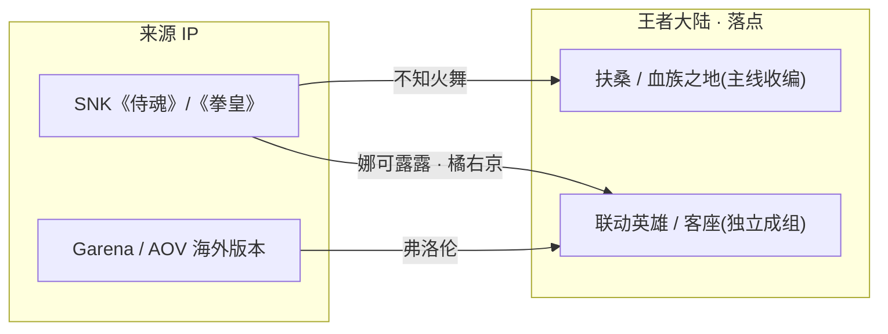
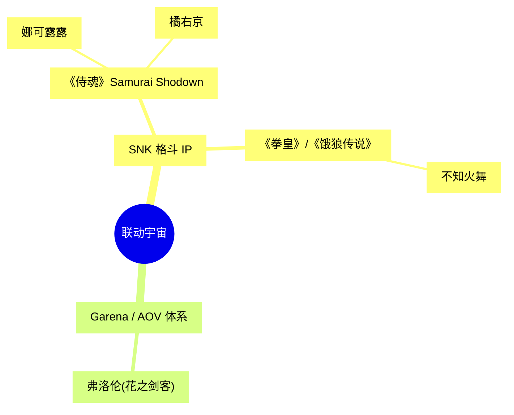
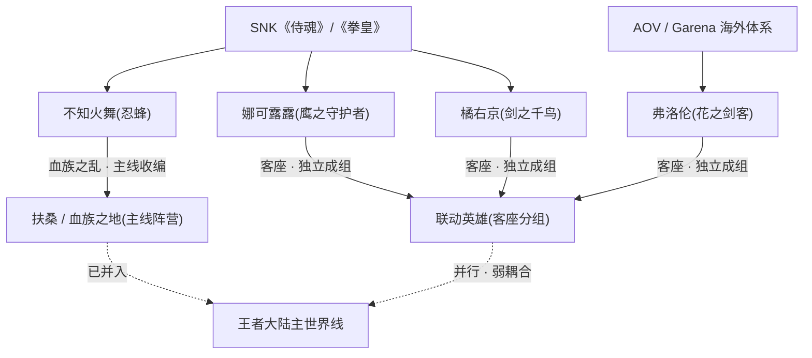
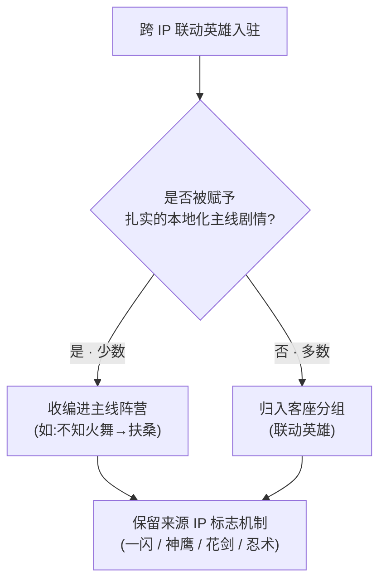

# 专题 · 联动宇宙

> 当神鹰的振翅声穿过京都的樱雨，当一柄西洋花剑划过东风海域的浪尖——这些来自「别处」的剑客，并非生于王者大陆的史册，却又确确实实地踏上了它的土地。本页梳理跨 IP 联动入驻《王者荣耀》的客座英雄，追问他们从何处而来、在王者大陆的何处落脚，以及这套「联动设定」与主世界线究竟是怎样的关系。

::: info 什么是「联动宇宙」
「联动宇宙」并非游戏内某一具体的地理区域，而是一个**编者层面的专题视角**，用以统一收纳所有「跨 IP 联动」（Crossover）而来的客座英雄。这些角色诞生于其他作品的世界观（如 SNK 的《侍魂》《拳皇》、Garena / AOV 等海外版本），随后通过联动企划进入王者大陆，并被赋予一段能与王者主线衔接（或并存）的本地化设定。
本页所述「联动」指**跨越作品 IP 的联动**，与游戏内王者英雄之间的「皮肤联动 / 主题活动」不是同一概念。
:::

::: info 本页的数据基准与标注约定
本页硬设定以仓库骨架数据为准——主要来自 [联动英雄](../factions/liandong-snk.md)（`liandong-snk`）与 [扶桑 / 血族之地](../factions/fusang-xuezu.md)（`fusang-xuezu`）两个阵营骨架，以及英雄目录。骨架中明确记载的：娜可露露、橘右京、弗洛伦三人归 `liandong-snk`；不知火舞归 `fusang-xuezu`。凡涉及来源 IP 背景、登场版本、招式渊源等无法由仓库数据直接证实的内容，统一以「考据背景 / 考据推测 / 考据呈现」标注，以区分官方设定与编者补充；台词均为依据角色意象的考据化呈现，**非逐字官方文本**。
:::

---

## 一、联动英雄总览

跨 IP 联动英雄在《王者荣耀》的世界观处理上，大致分为两类：

- **被收编进主线阵营者**：经由专门的本地化叙事，融入王者大陆的某个既有阵营。最典型的就是 [不知火舞](../heroes/fusang-xuezu.md#不知火舞)——她因「血族之乱」的故事线被纳入 [扶桑 / 血族之地](../factions/fusang-xuezu.md)，在世界观上已经是一名「东风海域的本土忍者」。
- **独立成组的客座英雄者**：没有明确主线阵营归属，单独归入 [联动英雄](../factions/liandong-snk.md)（亦称「客座英雄」）分组，世界观上保持「外来者」的客人身份。娜可露露、橘右京、弗洛伦即属此列。

### 联动英雄表

| 英雄 | 来源 IP | 称号 | 定位 | 在王者大陆的落点与设定 |
| :-- | :-- | :-- | :-- | :-- |
| [不知火舞](../heroes/fusang-xuezu.md#不知火舞) | SNK《拳皇》/《侍魂》 | 忍蜂 | 法师 / 刺客 | 归入 [扶桑 / 血族之地](../factions/fusang-xuezu.md)。不知火流唯一传人，于「血族之乱」中追剿血族，并查知祖父乃为血族所害——已被主线叙事正式收编 |
| [娜可露露](../heroes/liandong-snk.md#娜可露露) | SNK《侍魂》 | 鹰之守护者 | 刺客 | 独立成组的 [联动英雄](../factions/liandong-snk.md)。与神鹰并肩作战的女剑士，纯刺客打野收割定位 |
| [橘右京](../heroes/liandong-snk.md#橘右京) | SNK《侍魂》 | 剑之千鸟 | 刺客 / 战士 | 独立成组的 [联动英雄](../factions/liandong-snk.md)。患病的浪客剑客，一闪突进 + 居合机制，多走边路 / 打野 |
| [弗洛伦](../heroes/liandong-snk.md#弗洛伦) | AOV / Garena 联动 | 花之剑客 | 战士 | 独立成组的 [联动英雄](../factions/liandong-snk.md)。对抗路高机动西洋剑术战士，靠拾取花束刷新被动、获得多段位移 |

::: info 为何不知火舞「单飞」而娜可露露、橘右京「成组」
三者同出 SNK，命运却分了岔。**不知火舞**拥有一段与王者主线深度绑定的本地化剧情（血族之乱、祖父之仇），叙事上落点明确，因此被划入 [扶桑 / 血族之地](../factions/fusang-xuezu.md)；而**娜可露露**与**橘右京**虽同为 SNK 客人，却没有被赋予同等强度的主线归属，故归入独立的 [联动英雄](../factions/liandong-snk.md) 客座分组。这种「同源不同籍」的处理，正是联动设定与主世界线之间张力的缩影。
:::

### 一句话定位对照

| 英雄 | 关键机制母题 | 玩法定位（路线） | 来源原作里的身份底色 |
| :-- | :-- | :-- | :-- |
| 不知火舞 | 不知火流忍术 · 火焰扇 | 法师 / 刺客（中路 / 游走） | 忍者格斗家（《拳皇》/《饿狼传说》） |
| 娜可露露 | 神鹰协同 · 自然契约 | 刺客（打野收割） | 阿伊努女祭司 / 女剑士（《侍魂》） |
| 橘右京 | 「一闪」蓄势 · 居合斩 | 刺客 / 战士（边路 / 打野） | 病弱浪客剑豪（《侍魂》） |
| 弗洛伦 | 拾花刷新被动 · 多段位移 | 战士（对抗路高机动） | 西洋花剑贵公子（AOV / Garena） |

---

## 二、来源 IP 谱系

::: info SNK 与《王者荣耀》的联动渊源（考据背景）
SNK 是日本老牌格斗游戏厂商，《侍魂》（Samurai Shodown，又译《武士魂》）与《拳皇》（The King of Fighters, KOF）是其招牌系列。**不知火舞**原属《饿狼传说》/《拳皇》体系的忍者格斗家；**娜可露露**与**橘右京**则是《侍魂》初代起就登场的人气角色。三人由此被引入《王者荣耀》，是该游戏早期最具代表性的跨 IP 联动之一。具体登场版本与活动时间属于运营层面信息，本页不作硬性断言（考据推测）。
:::

::: info 弗洛伦与 AOV / Garena 的关系（考据背景）
弗洛伦（Florentino，「花之剑客」）来自 Garena 发行的海外版本《传说对决》（Arena of Valor, AOV）所属的英雄体系。AOV 与《王者荣耀》同源于天美工作室，但拥有部分独立的英雄阵容；弗洛伦即是经由这一海外体系「回流」进入国服世界观语境的角色。其「拾取花束刷新被动、获得连续多段位移」的机制设计，与西洋花剑（rapier）的优雅突刺意象高度契合（考据推测）。
:::

::: details 考据小词典：几个容易混淆的名词（可折叠）
- **SNK**：日本游戏公司，旗下街机 / 主机格斗系列众多；《侍魂》与《拳皇》皆出于此。
- **《侍魂》（Samurai Shodown）**：以「冷兵器 · 一击致命」为卖点的武士题材格斗系列，娜可露露、橘右京均为其初代登场角色。
- **《拳皇》（KOF）/《饿狼传说》**：以现代格斗家「组队对战」为主的系列；不知火舞为该体系标志性角色。
- **AOV（Arena of Valor）/《传说对决》**：天美面向海外发行的同源 MOBA，与国服《王者荣耀》共享部分技术与设计基底，但英雄名单存在差异；弗洛伦是其特色原创英雄之一（考据背景）。
- **「客座 / 联动」与「皮肤联动」的区别**：本页讨论的是把**整名外来英雄**引入对局的跨 IP 联动；它不同于仅给既有王者英雄换装的「皮肤 / 主题联动」。
:::

---

## 三、各英雄简介

<a class="hok-card" href="../heroes/liandong-snk#娜可露露">→ 娜可露露娜可露露 · 鹰之守护者__ 与神鹰并肩的女剑士，自然与森林的代言人。纯刺客打野，机动收割。</a>
<a class="hok-card" href="../heroes/liandong-snk#橘右京">→ 橘右京橘右京 · 剑之千鸟__ 患病的浪客，以「一闪」居合追逐生命尽头的极致一剑。边路 / 打野刺客战士。</a>
<a class="hok-card" href="../heroes/liandong-snk#弗洛伦">→ 弗洛伦弗洛伦 · 花之剑客__ 西洋花剑的贵公子，拾花为契、连绵突进的对抗路高机动战士。</a>
<a class="hok-card" href="../heroes/fusang-xuezu#不知火舞">→ 不知火舞不知火舞 · 忍蜂__ 不知火流唯一传人，已被「血族之乱」收编入扶桑的本土忍者。</a>

### 娜可露露

刺客

来源 IP：SNK《侍魂》。称号「鹰之守护者」。在 [联动英雄](../factions/liandong-snk.md) 分组中，娜可露露被定位为一名与神鹰（猎鹰玛玛哈哈）相伴而行的女剑士。她代表的是「人与自然的守护契约」这一母题——森林、飞鹰、刃光，构成她最鲜明的形象。在《侍魂》原作里，她是阿伊努民族出身、守护自然的女祭司型剑士（考据背景）。

在王者大陆的玩法落点上，她是一名**纯刺客打野收割者**：依靠灵巧的位移与神鹰的协同，在团战边缘游走、于残局完成切割。其设定并未被绑入任何王者主线阵营，因此世界观上她保持着「来访者」的身份——既不属扶桑，也不属任何中原势力，是一位踏入王者大陆的森林客人。若要在主世界线上为她寻一处「气质相邻」的坐标，她与崇尚自然、栖居建木古树的 [百越 / 建木](../factions/baiyue.md) 在母题上隐约呼应，但这仅是**意象层面**的呼应，骨架上她并不归属任何中原 / 海外主线阵营（考据推测）。

::: quote 娜可露露
「自然，会给出答案。」（联动角色台词意象，考据呈现）
:::

### 橘右京

刺客战士

来源 IP：SNK《侍魂》。称号「剑之千鸟」。橘右京是《侍魂》系列中极具悲剧色彩的角色——一名身患重病（咳血之症）的浪客剑客，明知大限将至，仍执着于追求剑道的极致。其「千鸟」之名，喻其剑势如群鸟掠空，迅疾而决绝。在原作设定中，他对一位思念之人怀抱执念，病躯与剑心相互撕扯，是「向死而生」美学的代表（考据背景）。

在王者大陆，他被收录为 [联动英雄](../factions/liandong-snk.md) 中的**一闪突进 + 居合机制**英雄：以蓄势的「一闪」拉开与对手的距离、再以居合斩骤然收割，多被安排在**边路或打野**。与娜可露露一样，橘右京没有被纳入王者主线阵营，是一位将生命尽头交付于剑的孤独客人。在「东瀛武士道」这一美学谱系上，他与同属远东武道圈、归 [扶桑 / 血族之地](../factions/fusang-xuezu.md) 的 [不知火舞](../heroes/fusang-xuezu.md#不知火舞) 气质相通，但二者阵营骨架不同、并无组织关联（考据推测）。

::: quote 橘右京
「一闪。」（居合斩意象，考据呈现）
:::

### 弗洛伦

战士

来源 IP：AOV / Garena 联动。称号「花之剑客」。弗洛伦（Florentino）是一位手持西洋花剑、气度优雅的贵公子型剑客。他的标志性机制——**靠拾取「花束」刷新被动，从而获得连续多段位移**——把「花」与「剑」两个意象编织在一起：剑光所至，落英缤纷。这一设计将「rapier（西洋细剑）」的轻盈突刺与「献花」的浪漫姿态结合，使他在对抗路上既华丽又难以捉摸（考据推测）。

在王者大陆，他被收录为 [联动英雄](../factions/liandong-snk.md) 中的**对抗路高机动西洋剑术战士**。凭借多段位移，他在边路的换血、追击与逃生中都极具威胁。作为源自海外版本体系的角色，弗洛伦在国服世界观语境下同样以「客座」身份存在，未与王者主线阵营硬性绑定；他也是四位联动英雄中**唯一非 SNK 血统**者，其「回流」路径（AOV → HOK 世界观语境）也使他成为本页谱系里最特殊的一支。

::: quote 弗洛伦
「优雅，是一种胜利的方式。」（花之剑客意象，考据呈现）
:::

### 不知火舞

法师刺客

来源 IP：SNK《拳皇》/《侍魂》。称号「忍蜂」。不知火舞是三位 SNK 客人中，唯一被王者主线**正式收编**的角色。她是「不知火流」忍术的唯一传人，在 [扶桑 / 血族之地](../factions/fusang-xuezu.md) 的叙事里，亲历了**血族之乱**：当血族王 [徐福](../factions/fusang-xuezu.md) 率领的血族（一支吸血、嗜杀、可感染他人的黑暗势力）席卷东风海域，她以忍者之身追剿血族，并在追查中得知——自己的祖父，正是死于血族之手。这桩血仇，把她从一名「外来客人」彻底锚定为「东风海域的本土忍者」。

正因为这条与主线深度咬合的剧情，本页将她的英雄分节链接指向其英雄页 [不知火舞](../heroes/fusang-xuezu.md#不知火舞)（所属阵营为 [扶桑 / 血族之地](../factions/fusang-xuezu.md)），而非客座分组——她已不是访客，而是这片土地血与火的当事人。国仇（守护扶桑）与家恨（为祖父复仇）在她的刀锋上熔铸为一，使她成为扶桑「武道之光」最人格化的象征，与代表「血族之暗」的徐福构成全阵营叙事的两极。

::: quote 不知火舞
「忍蜂之舞，不容轻视。」（不知火流意象，考据呈现）
:::

::: warning 定位说明
不知火舞在 [扶桑 / 血族之地](../factions/fusang-xuezu.md) 中的角色定位为「法师 / 刺客」，与原作格斗家形象有差异——这是王者大陆本地化设定的结果，属正常的跨 IP 改编，并非设定错误。
:::

---

## 四、落点关系图

下图直观呈现四位联动英雄从「来源 IP」到「王者大陆落点」的归属流向，以及他们与主世界线的远近关系。

| 英雄 | 与主世界线的关系 | 耦合强度 |
| :-- | :-- | :-- |
| 不知火舞 | 通过血族之乱故事线被收编进 [扶桑 / 血族之地](../factions/fusang-xuezu.md)，成为主线当事人 | 强（已并入） |
| 娜可露露 | 独立客座，无主线阵营归属 | 弱（并行） |
| 橘右京 | 独立客座，无主线阵营归属 | 弱（并行） |
| 弗洛伦 | 来自海外版本体系的客座，无主线阵营归属 | 弱（并行） |

::: tip 如何在地图上「定位」联动英雄
在 [王者大陆 · 地理图志](../worldview/map.md) 中，唯一拥有明确地理坐标的联动英雄是 [不知火舞](../heroes/fusang-xuezu.md#不知火舞)——她落脚于王者大陆最东端最大岛屿、东风海域的 [扶桑 / 血族之地](../factions/fusang-xuezu.md)。娜可露露、橘右京、弗洛伦三人则**没有地图坐标**：他们「来到」战场（峡谷对局），但不被钉在主世界线的版图上。
:::

---

## 五、联动设定与主世界线的关系

::: info 核心说明：联动 ≠ 改写主线
《王者荣耀》对跨 IP 联动英雄的世界观处理，遵循一条相对克制的原则——**让客人「落地」，但不让客人「改写」主线**。具体表现为三个层次：

1. **弱耦合并存（多数情形）**：娜可露露、橘右京、弗洛伦等客座英雄，被单独收纳进 [联动英雄](../factions/liandong-snk.md) 分组，与王者大陆的主线阵营**并行存在**。他们登场于战场，却不承担推动主线历史（长安、稷下、三分之地、封神等）的叙事职责。可以理解为：他们「来到了」王者大陆这片战场，但「没有写进」王者大陆的正史。

2. **本地化收编（少数情形）**：当某位联动英雄被赋予一段足够扎实、能与既有世界观衔接的本地化剧情时，便会被「收编」进主线阵营。[不知火舞](../heroes/fusang-xuezu.md#不知火舞) 借由「血族之乱 + 祖父血仇」融入 [扶桑 / 血族之地](../factions/fusang-xuezu.md)，即是范例。此时，她的「外来 IP」属性被淡化，「东风海域本土忍者」的身份被前景化。

3. **机制保真，叙事让步**：无论收编与否，联动英雄通常会**保留来源 IP 的标志性机制与人设母题**（橘右京的「一闪」居合、娜可露露的神鹰、弗洛伦的花剑多段位移、不知火舞的不知火流忍术），但其在王者大陆的「身世前因」则由本地化叙事重新书写或留白。
:::

::: tip 给考据者的提示
阅读联动英雄设定时，建议把两套坐标分开看：
一套是**来源 IP 坐标**（角色在《侍魂》《拳皇》或 AOV 原作中的故事），它解释了角色的「性格底色与招式来历」；
另一套是**王者大陆坐标**（角色在 HOK 世界观中的落点），它解释了角色「为何会出现在这片战场、与哪些阵营产生关系」。
两套坐标并不总是严丝合缝——这正是「联动宇宙」既迷人又需要谨慎对待的地方。凡本页未能据官方明确佐证的衔接细节，均以「考据推测」标注，以免与官方硬设定相抵触。
:::

::: info 与「平行宇宙」专题的边界（考据视角）
需要区分两类不同的「他处来客」：本页讨论的**跨 IP 联动**（来自《侍魂》《拳皇》/ AOV 等**其他作品**的外来角色），与 [平行宇宙](parallel-worlds.md) 专题讨论的**同一 IP 内的世界线分支**（破晓 / 琥珀等王者自家平行设定）是两回事。前者是「跨作品的客人」，后者是「同作品的另一个自己」。两者都涉及「主世界线之外」的概念，却分属不同的设定机制，不宜混为一谈（考据推测）。
:::

::: info 一句话总结
**不知火舞**已经把户口迁进了扶桑；**娜可露露、橘右京、弗洛伦**则更像持「访客签证」的剑客——他们站上了王者大陆的战场，却仍在各自来源 IP 的故事里保留着家。
:::

---

## 六、延伸阅读

<a class="hok-card" href="../factions/fusang-xuezu">→ 阵营页：扶桑 / 血族之地扶桑 / 血族之地__ 不知火舞的落脚之地。东风海域最大岛屿，京都与血族巢穴并立，武道与血族恐怖交织。</a>
<a class="hok-card" href="../factions/liandong-snk">→ 阵营页：联动英雄联动英雄（客座）__ 娜可露露、橘右京、弗洛伦所属的独立客座分组。</a>
<a class="hok-card" href="../worldview/map">→ 地理图志王者大陆 · 地理图志__ 在地图上看清扶桑 / 东风海域的位置，理解联动英雄的地理落点。</a>
<a class="hok-card" href="parallel-worlds">→ 专题：平行宇宙专题 · 平行宇宙__ 辨析「跨 IP 联动」与「同 IP 世界线分支」的区别——两类「他处来客」的不同机制。</a>

::: info 编者按
本页所依据的硬设定，来自仓库内 `liandong-snk.json`、`fusang-xuezu.json` 与英雄目录数据；涉及来源 IP 背景、登场版本、招式渊源等无法由仓库数据直接证实的内容，均以「考据背景」「考据推测」「考据呈现」明确标注，以区分官方设定与编者补充。台词均为依据角色意象的考据化呈现，非逐字官方文本。英雄链接统一指向其英雄页（`../heroes/<阵营 facId>.md#英雄中文名`），与全站其余页面的锚点约定保持一致。
:::