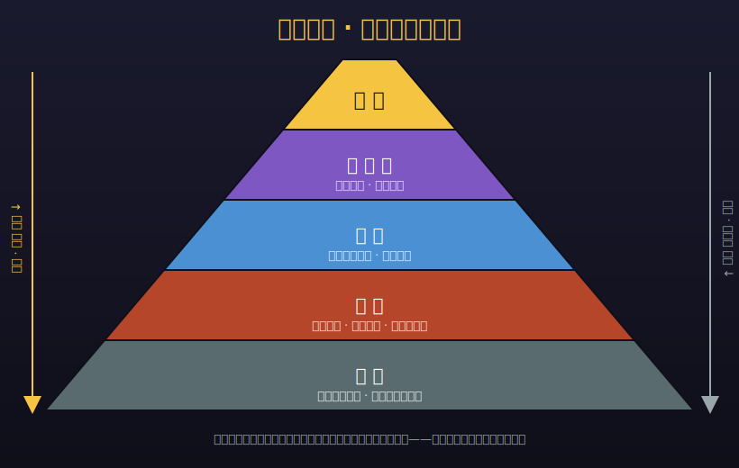
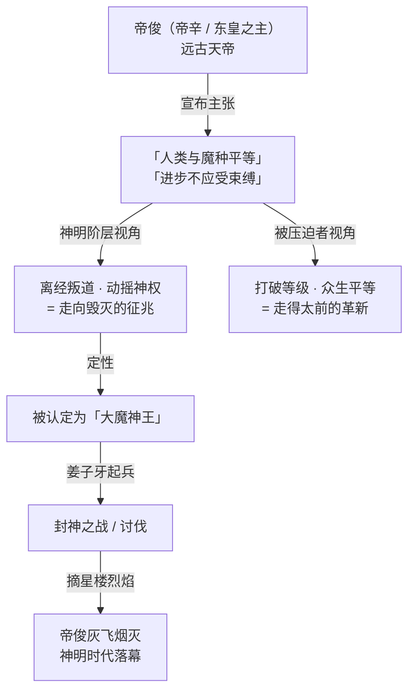
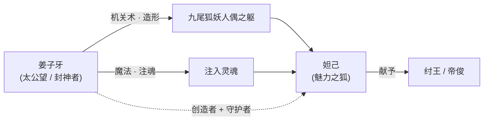
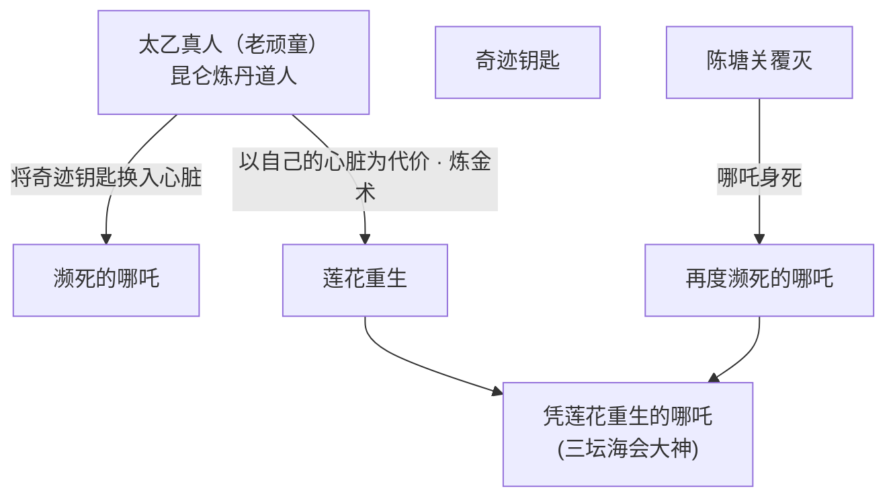
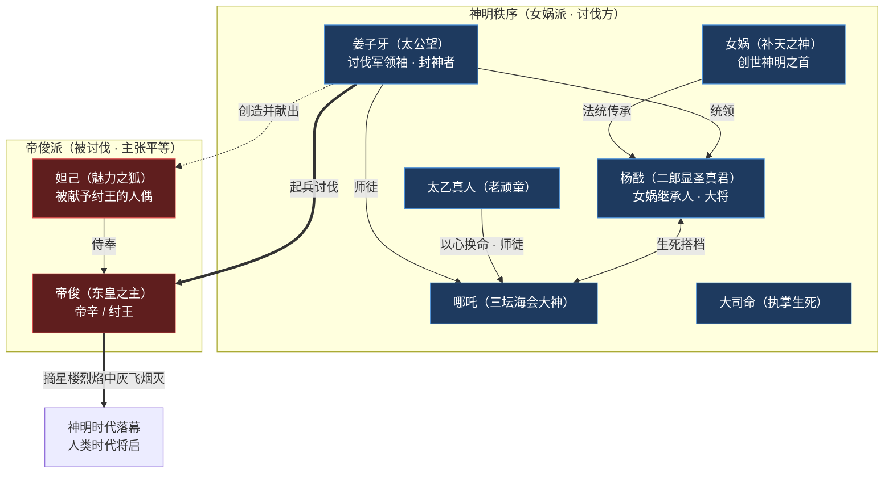
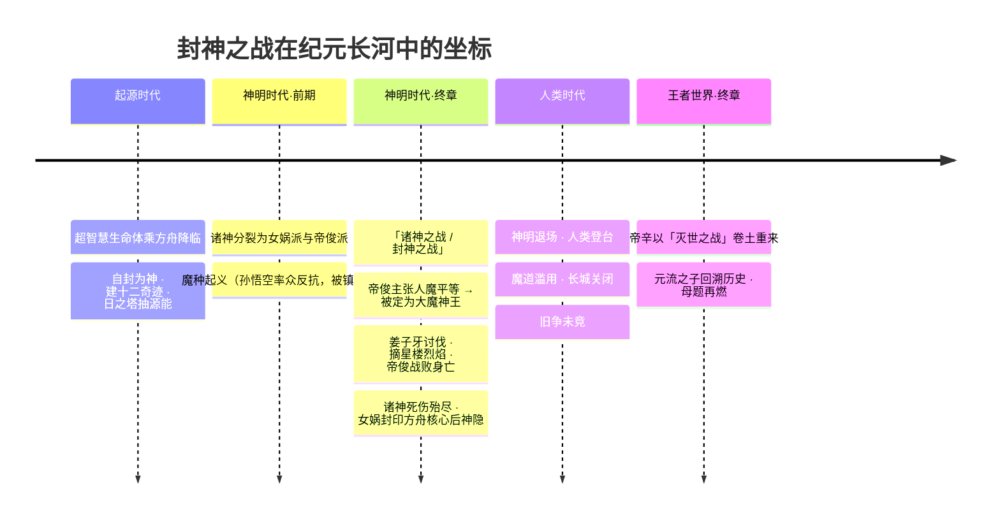

# 专题 · 封神演义在王者

> 「封神」二字，在原典里是一场战争结束后，姜子牙手持封神榜，把战死的英灵一一安上神位的仪式。
> 在《王者荣耀》里，它被拆解、重铸、再封装进一艘星际方舟——「神」不再是天授的尊位，而是一群幸存者的自封；「封神之战」也不再只是商周易代的恩怨，而是**神明时代落幕、人类时代将启**的那道分水岭。
> 摘星楼的烈焰里灰飞烟灭的，不是一个暴君，而是「神可以凌驾于人」的那个旧时代本身。

封神讨伐易代仙术神职

《封神演义》是中国神魔小说的集大成者：纣王无道、女娲降妖、姜子牙下山、阐截两教斗法、武王伐纣、姜尚封神。它给了《王者荣耀》一整套现成的「神话语法」——一群名字、一段易代史、一份神位榜单。游戏没有照抄，而是把这套语法**接驳进自己的科幻方舟世界观**：让远古天帝[帝俊](../heroes/haojing-fengshen.md#帝俊)去当那个「纣王」，让炼丹道人去当那个「太乙」，让一只机关人偶去当那个「妲己」。

本专题做两件事：**其一**，把原典《封神演义》的人物与桥段，逐一对照到王者的[镐京·封神](../factions/haojing-fengshen.md)阵营，看它「改了什么、为什么改」；**其二**，把这套封神叙事钉回世界观主线，与[专题 · 神魔之争](gods-vs-demons.md)互为表里——前者讲「结构与因果」，本页讲「这场易代的具象演绎」。

!!! info "本页与其他页的分工"
    - 想读这条主线的**结构与因果**（金字塔怎么砌、怎么裂、怎么塌）：[专题 · 神魔之争](gods-vs-demons.md)
    - 想看**纪元先后**（起源时代→神明时代→人类时代）：[纪元 · 起源到当下](../worldview/eras.md)
    - 想查**底层概念**（方舟核心 / 源能 / 魔道）：[世界观 · 核心概念](../worldview/concepts.md)
    - 想读**阵营档案与英雄全名单**：[镐京·封神](../factions/haojing-fengshen.md) · [上古众神·神话](../factions/shanggu-shenhua.md)
    - 本页聚焦的是：原典《封神演义》如何被「翻译」成王者的封神之战。

---

## 一、为什么是「封神」：原典与王者的两套坐标系

在动手对照之前，必须先把两套坐标系摆正，否则极易张冠李戴。

=== "原典《封神演义》的逻辑"

    商纣王题诗亵渎女娲，女娲遣轩辕坟三妖（千年狐狸精等）入宫惑乱朝纲。纣王宠妲己、造炮烙、剖比干，天怒人怨。元始天尊命姜子牙下昆仑、保周伐纣；阐教、截教两派仙人各助一方，斗法不休。最终武王克殷，纣王自焚于摘星楼（鹿台），姜子牙登台**敕封三百六十五位正神**，是为「封神」。
    
    核心母题：**天命转移**。商失其德，周受天命，神仙们的伤亡只是为了填满那张早已注定的封神榜。

=== "王者《荣耀》的逻辑"

    远古天帝帝俊（即帝辛/纣王体系）宣布**「人类与魔种平等」**、主张「进步不应受任何束缚」。这一主张在神明阶层眼中是离经叛道、是走向毁灭的征兆。以[姜子牙](../heroes/haojing-fengshen.md#姜子牙)为首的讨伐军认定帝俊已堕为「大魔神王」，遂起兵讨伐，最终帝俊于**摘星楼烈焰**中灰飞烟灭。
    
    核心母题：**易代与定义权**。「神」是否有资格永远凌驾于「人」与「魔」之上？纣王不是因「无道」而亡，反而是因为他「太想打破等级」而被旧秩序绞杀——这正是[神魔之争](gods-vs-demons.md)那座金字塔的一次剧烈震荡。

!!! warning "最大的一处「反转」：纣王的善恶被对调了"
    这是理解王者封神最关键的一点。在原典里，纣王是**昏聩的暴君**，姜子牙是**正义的天命执行者**。
    
    而在王者世界观里，帝俊的「罪」恰恰是**他主张众生平等、反对束缚**——以今人的价值判断，这近乎一种「进步主义」。讨伐他的姜子牙一方，则站在「维护神明秩序」的立场上。于是「正邪」变得暧昧：**站在神明视角，帝俊是必须诛灭的魔神王；站在被压迫者视角，他更像一个走得太前、被旧时代反噬的孤独天帝。** 游戏并未给出标准答案，这种道德留白正是王者改编的高明处。

---

## 二、帝俊＝帝辛＝纣王：三个名字，一个天帝

整套王者封神叙事的「太阳」，是[帝俊](../heroes/haojing-fengshen.md#帝俊)。要理解这场战争，必先理解这三个名字是如何叠合在同一具神躯上的。

| 名字 | 出处 | 在王者中的含义 |
| --- | --- | --- |
| **帝俊** | 上古神话中的东方天帝（《山海经》系统） | 王者中作为「远古天帝」「东皇之主」的本名，统御神明时代的至高存在之一 |
| **帝辛** | 商纣王的本名（辛为其名，「纣」是恶谥） | 接驳《封神演义》的桥梁——帝俊即帝辛，使「封神之战＝伐纣之战」得以成立 |
| **纣王** | 《封神演义》中的反派君主 | 讨伐军给他扣上的「暴君」身份，是旧秩序对他的污名化定性 |

!!! note "「东皇之主」与「东皇太一」是两个可玩英雄（考据辨析）"
    帝俊的英雄称号是「**东皇之主**」，极易与稷下学院的[东皇太一](../heroes/jixia.md#东皇太一)（称号「噬灭日蚀」、定位坦克/辅助）混淆。在**英雄层面**，二者是**两个完全不同的可玩英雄、分属不同阵营**：东皇太一属[稷下学院](../factions/jixia.md)体系，是人类时代以阴阳家秘术操控元气的术士；帝俊则是神明时代的远古天帝。名号相近，源于「东皇」这一上古神话母题的共享。
    
    需特别说明：**「东皇太一是否为帝俊的某种化身 / 同源」各方说法长期不一**，本百科与[神魔之争](gods-vs-demons.md)专题保持一致，按「东皇太一为独立可玩英雄」处理，不强行将二者等同；二者在世界观时间线上大致相隔一个神明—人类的时代落差（考据推测）。

### 2.1 帝俊的「罪」：把魔种当人看

帝俊之所以被讨伐，导火索是他宣布**人类与魔种平等**。要理解这句话的分量，须回到[神魔之争](gods-vs-demons.md)那座五层金字塔：神明—神职者—人类—魔道—魔种，等级森严，「魔」本就是神明给劳力者钉上的蔑称。帝俊却要亲手拆掉这座塔的地基。

上图（与[神魔之争](gods-vs-demons.md)专题共用的原创示意图）即帝俊想要推翻的那套等级。他站在塔尖，却要为塔底的「魔种」松绑——这在同处塔尖的诸神看来，无异于自毁神座。

!!! quote "帝俊（东皇之主）"
    「秩序，是强者写给弱者的镣铐。」
    （台词意译，体现其反对一切束缚、追求绝对进步的天帝立场）

### 2.2 战斗形象：强机制的重装/法系战士

定位上，帝俊是一名**强机制重装/法系战士**。他在战场上以「天帝」的姿态作战，技能围绕「束缚—解放」的母题设计（其大招常与「打破限制、释放真我」的演出关联），与其叙事人设高度统一。关联背景的英雄还有[梦奇](../heroes/shanggu-shenhua.md#梦奇)——食梦貘梦奇的设定即与帝俊的梦境/造物背景相牵连（考据推测：梦奇所来自的「梦境」与帝俊神力存在渊源）。

---

## 三、姜子牙：从「天命执行者」到「封神者」

如果说帝俊是这场战争的「太阳」，[姜子牙](../heroes/haojing-fengshen.md#姜子牙)就是那只点燃烈焰的手。他是[镐京·封神](../factions/haojing-fengshen.md)阵营的**讨伐军领袖**，称号「太公望」。

| 维度 | 设定 |
| --- | --- |
| 称号 | 太公望（原典中周文王称其为「吾太公望子久矣」） |
| 阵营身份 | 正道讨伐军领袖、**封神者** |
| 战斗定位 | 辅助/法师——双形态切换，提供经验加成与减速控制 |
| 关键关系 | [虞姬](../heroes/haojing-fengshen.md#虞姬)之师；[妲己](../heroes/haojing-fengshen.md#妲己)的**创造者** |

!!! info "「封神者」的双重含义"
    姜子牙在王者中的核心身份是「**封神**」这一动作的执行者。这既呼应原典里他登台敕封三百六十五正神的仪式，也在世界观中被赋予新解：他是旧神明秩序的「整理者」与「裁定者」——讨伐帝俊、收束乱局、为新时代重排神位。他的法师/辅助双形态（手持杏黄旗、打神鞭意象）正是这种「裁定者」气质的具象。

### 3.1 一桩惊人的设定：妲己是姜子牙造的

王者世界观对妲己来历的处理，是对原典最大胆的改写之一（**注意版本演变**：早期版本与现行设定有出入，此处采现行主流设定）。

也就是说：在王者里，**妲己并非女娲派去祸国的天然狐妖，而是姜子牙亲手以机关术造形、以魔法注魂的人偶，再被献给纣王**。这一改写把「红颜祸水」的旧叙事彻底翻转——妲己是被创造、被赠予、被使用的造物，姜子牙既是她的造物主，也是她的守护者。

??? note "为什么这是个「狠」改写（叙事解读）"
    原典中妲己是「祸乱的源头」，王者却让她变成「祸乱的工具」，而握着工具的手，恰是那个被认为代表正义的姜子牙。这让「正义讨伐军」的形象蒙上一层耐人寻味的阴影：讨伐者亲手送去了「祸根」，再以「祸根」为由发动讨伐。这种叙事张力，与本页第一节强调的「正邪暧昧」一脉相承。

---

## 四、妲己：被创造的「魅力之狐」

[妲己](../heroes/haojing-fengshen.md#妲己)是王者最经典的新手法师之一，称号「魅力之狐」。

- **身世**

    九尾狐妖造型的**机关人偶**，由[姜子牙](../heroes/haojing-fengshen.md#姜子牙)以机关术造形、魔法注魂而成，后被献予纣王（帝俊）。

- **定位**

    爆发型法师。技能简单直接、连招清晰，是无数玩家入坑的「第一个法师」，新手友好度极高。

- **原典对照**

    对应《封神演义》中迷惑纣王的千年狐妖妲己，但**去除了「女娲遣妖」的主动作恶动机**，改为「被造、被献」的被动存在。

- **关系网**

    创造者/守护者：[姜子牙](../heroes/haojing-fengshen.md#姜子牙)。受赠者：帝俊（纣王）。

!!! quote "妲己（魅力之狐）"
    「请尽情吩咐妲己吧！」「妲己，一直爱主人，因为妲己是主人创造的。」
    （后一句直白点出其「被创造物」的本质，与世界观设定互文）

---

## 五、阐教仙脉：太乙真人、哪吒、杨戬

《封神演义》中，助周伐纣的核心力量是**阐教**门下的仙人与他们的弟子。王者把这条「炼丹仙人—神兵弟子」的师承谱系，几乎原样接了过来，安置在[镐京·封神](../factions/haojing-fengshen.md)阵营中，构成讨伐军的「神兵」班底。

### 5.1 太乙真人：以心换命的炼丹道人

[太乙真人](../heroes/haojing-fengshen.md#太乙真人)，称号「老顽童」，定位辅助/坦克。

| 维度 | 设定 |
| --- | --- |
| 身份 | **昆仑山炼丹道人**（原典阐教十二金仙之一） |
| 战斗机制 | 工具型辅助——可**复活队友**、变身为队友提供增益 |
| 核心羁绊 | [哪吒](../heroes/haojing-fengshen.md#哪吒)之师，也是哪吒**唯一的朋友** |

!!! quote "太乙真人（老顽童）"
    「炼丹炼了八百年，就炼出你这么个宝贝。」
    （指向其与哪吒的师徒/造物羁绊）

太乙在王者中最动人的设定，是他与哪吒的关系。原典里太乙以莲花、莲藕为哪吒重塑肉身；王者把这一桥段改写得更悲壮——

!!! note "「以心换命」：原典「莲花化身」的王者重写"
    原典中哪吒剔骨还父、削肉还母后，太乙以莲花莲藕为其重塑身躯。王者保留了「**莲花重生**」的核心意象，却加重了代价：太乙先将「奇迹钥匙」换入濒死哪吒的心脏，陈塘关覆灭后更**以自己的心脏为代价**，用炼金术令哪吒凭莲花复生。师父不仅是再造之恩，更近乎「以命续命」。详见[师徒关系](../relationships/mentor.md)。

### 5.2 哪吒：脚踏风火轮的逆骨少年

[哪吒](../heroes/haojing-fengshen.md#哪吒)，称号「三坛海会大神」，定位战士。

- **形象**

    脚踏**风火轮**、以**莲花重生**的逆骨少年，太乙真人之徒。原典中的「三坛海会大神」神位被直接用作其称号。

- **战斗定位**

    强开团战士。大招可**全图突进**，是峡谷中标志性的「天降正义」式先手开团英雄。

- **羁绊一·师徒**

    [太乙真人](../heroes/haojing-fengshen.md#太乙真人)——师父、再造者、唯一的朋友。

- **羁绊二·生死搭档**

    [杨戬](../heroes/haojing-fengshen.md#杨戬)——从拳头对手到生死搭档。

### 5.3 杨戬：三只眼的天界战神

[杨戬](../heroes/haojing-fengshen.md#杨戬)，称号「二郎显圣真君」，定位战士。

| 维度 | 设定 |
| --- | --- |
| 师承 | **玉鼎真人之徒**（原典阐教十二金仙之一） |
| 阵营身份 | [姜子牙](../heroes/haojing-fengshen.md#姜子牙)麾下**大将**、**女娲继承人** |
| 标志 | 三只眼的**天界战神**（第三只眼即原典「天眼」） |
| 核心羁绊 | 与[哪吒](../heroes/haojing-fengshen.md#哪吒)为**生死搭档** |

!!! note "杨戬＝女娲继承人：把封神接回上古众神"
    杨戬「女娲继承人」的身份，是镐京·封神与[上古众神·神话](../factions/shanggu-shenhua.md)两大阵营之间的一道关键缝合线。它意味着讨伐军的核心战将，承接的是**女娲派**（与帝俊派对立的另一上古阵营）的法统——也就把「封神之战」明确锚定为「女娲派 vs 帝俊派」这场更古老的诸神分裂的延续。详见本页第七节阵营站队图。

#### 哪吒与杨戬：从拳头到生死

!!! quote "杨戬（二郎显圣真君）"
    「我用这只眼，看着你；用这条命，护着你。」
    （指向其与哪吒由对手到生死搭档的羁绊，台词意译）

二人并非兄弟，也非师徒，而是**从对手到生死搭档**：起初以拳头交往、互不相让；因哪吒救一只流浪狗、杨戬把狗拎回而生默契，渐成知心朋友。**牧野巡视遇伏**时，哪吒为杨戬挡下致命一击。这段关系是[战友搭档](../relationships/squad.md)专题中最催泪的一笔。

---

## 六、神祇 / 阵营对照总表：原典 → 王者

下表把《封神演义》及相关上古神话中的角色，逐一对照到王者的英雄、阵营与定位。这是本专题的「索引核心」。

### 6.1 封神核心人物对照

| 原典《封神演义》 | 王者英雄 | 称号 | 王者阵营 | 定位 | 关键改写 |
| --- | --- | --- | --- | --- | --- |
| 商纣王（帝辛） | [帝俊](../heroes/haojing-fengshen.md#帝俊) | 东皇之主 | [镐京·封神](../factions/haojing-fengshen.md) | 战士（重装/法系） | 暴君→「主张众生平等」的远古天帝，善恶对调 |
| 姜子牙（姜尚/太公望） | [姜子牙](../heroes/haojing-fengshen.md#姜子牙) | 太公望 | [镐京·封神](../factions/haojing-fengshen.md) | 辅助/法师 | 天命执行者→讨伐军领袖兼「封神者」、妲己创造者 |
| 妲己（千年狐妖） | [妲己](../heroes/haojing-fengshen.md#妲己) | 魅力之狐 | [镐京·封神](../factions/haojing-fengshen.md) | 法师 | 女娲遣妖→姜子牙所造、献予纣王的机关人偶 |
| 太乙真人 | [太乙真人](../heroes/haojing-fengshen.md#太乙真人) | 老顽童 | [镐京·封神](../factions/haojing-fengshen.md) | 辅助/坦克 | 莲花化身→以自己心脏为代价令哪吒重生 |
| 哪吒 | [哪吒](../heroes/haojing-fengshen.md#哪吒) | 三坛海会大神 | [镐京·封神](../factions/haojing-fengshen.md) | 战士 | 保留风火轮/莲花重生，强化「逆骨少年」 |
| 二郎神杨戬 | [杨戬](../heroes/haojing-fengshen.md#杨戬) | 二郎显圣真君 | [镐京·封神](../factions/haojing-fengshen.md) | 战士 | 增设「女娲继承人」「哪吒生死搭档」 |

### 6.2 上古神话延伸对照（与封神同源的众神）

王者把封神之战嵌进了一个更大的「上古众神」框架（[上古众神·神话](../factions/shanggu-shenhua.md)）。下列角色虽不全出自《封神演义》本传，但同属这套**创世/伐纣同源神话**，是理解封神时代背景的必要外延。

| 上古神话原型 | 王者英雄 | 称号 | 王者阵营 | 定位 | 与封神的关联 |
| --- | --- | --- | --- | --- | --- |
| 女娲（补天/造人） | [女娲](../heroes/shanggu-shenhua.md#女娲) | 补天之神 | [上古众神·神话](../factions/shanggu-shenhua.md) | 法师 | 创世神明之首、**女娲派**首领，杨戬法统之源，与帝俊派对立 |
| 盘古（开天辟地） | [盘古](../heroes/shanggu-shenhua.md#盘古) | 开天 | [上古众神·神话](../factions/shanggu-shenhua.md) | 战士 | 劈开束缚人类的保护罩、化为山脉的开天巨神 |
| 后羿（射日） | [后羿](../heroes/shanggu-shenhua.md#后羿) | 半神之弓 | [上古众神·神话](../factions/shanggu-shenhua.md) | 射手 | 奉女娲命毁日之塔，背负射日宿命 |
| 嫦娥（奔月） | [嫦娥](../heroes/shanggu-shenhua.md#嫦娥) | 寒月公主 | [上古众神·神话](../factions/shanggu-shenhua.md) | 法师 | 守护月亮的魔道公主，被后羿放走沉海 |
| 大司命（九歌神巫） | [大司命](../heroes/haojing-fengshen.md#大司命) | 执掌生死 | [镐京·封神](../factions/haojing-fengshen.md) | 刺客/战士 | 云梦泽九大神巫之一、主管人间寿夭，带斩杀处决机制 |

!!! tip "如何使用这两张表"
    - 想读**封神之战本传**（伐纣这条线）：看 6.1 表。
    - 想读**封神所处的上古大背景**（创世、射日、诸神分裂）：看 6.2 表，并跳转[上古众神·神话](../factions/shanggu-shenhua.md)与[神魔之争](gods-vs-demons.md)。
    - 注意：[项羽](../heroes/haojing-fengshen.md#项羽)、[虞姬](../heroes/haojing-fengshen.md#虞姬)、[廉颇](../heroes/haojing-fengshen.md#廉颇)虽同属[镐京·封神](../factions/haojing-fengshen.md)阵营，但属其「反抗暴政/护卫」支线（楚汉、战国名将题材），并非《封神演义》本传人物，故不入对照表，详见阵营页。

---

## 七、封神阵营站队图

把上述人物按「站在谁那边」重新组织，便得到这场易代的完整站队。注意：王者的封神之战，本质是更古老的**女娲派 vs 帝俊派**诸神分裂的总爆发。

!!! note "站队图的三点说明"
    1. **女娲派 ≠ 全员同框**：女娲、盘古、后羿、嫦娥等多属[上古众神·神话](../factions/shanggu-shenhua.md)阵营，在更早的诸神之战/魔种起义中活动；姜子牙这条「封神讨伐」线是该派系在伐纣阶段的延续。
    2. **妲己的尴尬位**：她名义上侍奉帝俊（纣王），实则是讨伐方姜子牙的造物——一枚埋在天帝身边的「己方棋子」，这正是前文「正邪暧昧」的具象。
    3. **结局是「落幕」而非「胜利」**：帝俊的覆灭同时也宣告了神明时代的终结。讨伐军赢得了战争，却没能挽留旧秩序——三千年后，人类时代以「魔道滥用、长城关闭」的方式回响这场未竟之争（详见[神魔之争](gods-vs-demons.md)）。

---

## 八、封神在世界观中的位置：一场易代，三千年回响

封神之战不是孤立事件，它是[神魔之争](gods-vs-demons.md)这条总主线上的**关键节点**——「神明时代向人类时代过渡」的那道闸门。

!!! warning "「封神之战」与「诸神之战」的关系（重要辨析）"
    本百科其他页（[纪元 · 起源到当下](../worldview/eras.md)、[神魔之争](gods-vs-demons.md)）把神明时代的第二场大战称为「**诸神之战 / 封神之战**」，二者实为**同一场战争的两个叫法**：从「女娲派 vs 帝俊派」的诸神分裂视角看，它是**诸神之战**；从《封神演义》「姜子牙讨伐纣王（帝俊）」的叙事壳层看，它是**封神之战**。本页采封神叙事壳层，聚焦「摘星楼烈焰」这一具象演绎；若需诸神同归于尽、女娲封印方舟核心、诸神神隐等更宏观的战果，请转读[纪元页](../worldview/eras.md)与[神魔之争](gods-vs-demons.md)。
    
    另需留意一处口径差异：本页沿封神叙事说帝俊「**灰飞烟灭**」，而主线层面更准确的表述是帝俊「**战败身亡**」——他并未就此彻底退场，详见下文「闭环」一节。

!!! info "封神之战「上承」与「下启」了什么"
    - **上承**：它是「神明时代」内部矛盾的最终清算。在它之前，已有[孙悟空](../heroes/shanggu-shenhua.md#孙悟空)率魔种起义、被神明以元气炮镇压的旧账（[牛魔](../heroes/shanggu-shenhua.md#牛魔)出卖众人致起义溃败，[猪八戒](../heroes/shanggu-shenhua.md#猪八戒)独闯倒悬天寻友）。帝俊主张「人魔平等」，某种意义上是替那场失败起义「翻案」——这也正是他被视为「魔神王」的根由。
    - **下启**：帝俊战败，神明几乎同归于尽，女娲以最后之力封印方舟核心、将解封钥匙分藏十二奇迹后沉睡（「神隐」），神明时代落幕，人类登上历史舞台。但「神可凌驾于人」的幽灵并未散去；三千年后，它以魔道滥用、长城关闭的形式重返。封神之战因此是整条主线的「中场哨」——旧时代的结束，与新一轮压迫的伏笔。

### 8.1 闭环：帝辛与「灭世之战」

封神叙事里那位「灰飞烟灭」的天帝，在主线层面并未真正退场。在《王者荣耀世界》开放世界主线中，**反派领袖「帝辛」发起了席卷诸界的「灭世之战」**——原时间线里抵抗联军战败、世界濒临毁灭，直到一股跨越时空的力量令[元流之子](../heroes/yuanchu-shenhua-misc.md#元流之子)（称号「万象初源」）回溯到战争爆发之前，肩负扭转历史的使命。

!!! tip "为什么帝俊 / 帝辛是一个「闭环」"
    把整条母题摊开看，帝俊一个人几乎走了一遍「创造 vs 毁灭」：

    1. **神明时代第一幕**——身为旧秩序的一员，他默认了诸神对魔种的镇压；
    2. **封神之战 / 诸神之战**——他主张「人魔平等、进步不应受束缚」，反被旧秩序定为「大魔神王」讨伐而亡；
    3. **王者世界终章**——他以「帝辛」之名卷土重来，要用一场灭世之战，彻底掀翻这套他曾死于其中的秩序。

    **从被压迫者的镇压者，到旧秩序的反叛者，再到新秩序的毁灭者。** 这也是为什么[神魔之争](gods-vs-demons.md)说：这条三千年的母题，从未真正结束。摘星楼那把火，只是把它烧到了下半场。

!!! quote "回望：摘星楼的那场火"
    「他们说我是要毁灭世界的魔神。可我只是想让所有活着的东西，都被当作活物来对待。」
    （帝俊立场的叙事性概括——这也正是[神魔之争](gods-vs-demons.md)那句「谁有资格定义生命」的另一种回声）

---

## 九、延伸阅读

- **主线结构**

    [专题 · 神魔之争](gods-vs-demons.md)——金字塔怎么砌、怎么裂、怎么塌；本页的「因果母版」。

- **阵营档案**

    [镐京·封神](../factions/haojing-fengshen.md) · [上古众神·神话](../factions/shanggu-shenhua.md)——封神与众神的完整英雄名单。

- **纪元时间轴**

    [纪元 · 起源到当下](../worldview/eras.md)——封神之战在长河中的精确坐标。

- **核心概念**

    [世界观 · 核心概念](../worldview/concepts.md)——方舟核心 / 源能 / 魔道 / 奇迹钥匙。

- **关系专题**

    [师徒](../relationships/mentor.md)（太乙×哪吒、姜子牙×虞姬） · [战友搭档](../relationships/squad.md)（哪吒×杨戬） · [恋人](../relationships/lovers.md)（项羽×虞姬）。

- **平行世界**

    [专题 · 平行世界与琥珀纪元](parallel-worlds.md)——红蓝双色之心在另一时空的回响。

- **终章闭环**

    [元流之子](../heroes/yuanchu-shenhua-misc.md#元流之子)——回溯帝辛「灭世之战」、为这条三千年母题改写结局的玩家化身。

!!! warning "考据声明"
    本页对照以《封神演义》原典与《王者荣耀》现行主流世界观（含官方背景故事、英雄档案）为据。凡王者设定与原典不一致处，均以王者设定为准并标注其改写逻辑；凡王者官方未明确、由设定推演而来者，已用「（考据推测）」标注。需特别提示几处口径：

    - **「封神之战」与「诸神之战」实为同一场战争的两种叫法**（封神叙事壳层 vs 诸神分裂视角），本页侧重前者，宏观战果以[纪元页](../worldview/eras.md)、[神魔之争](gods-vs-demons.md)为准。
    - 本页沿封神叙事说帝俊「灰飞烟灭」，主线更准确的表述为「**战败身亡**」，且他后以「帝辛」之名在《王者荣耀世界》掀起灭世之战，并非彻底退场。
    - **妲己来历、帝俊与梦奇的关联、东皇太一是否为帝俊化身等设定存在版本演变 / 各方说法不一**，本页采现行主流设定，旧版本与官方后续更新细节以官方为准。
