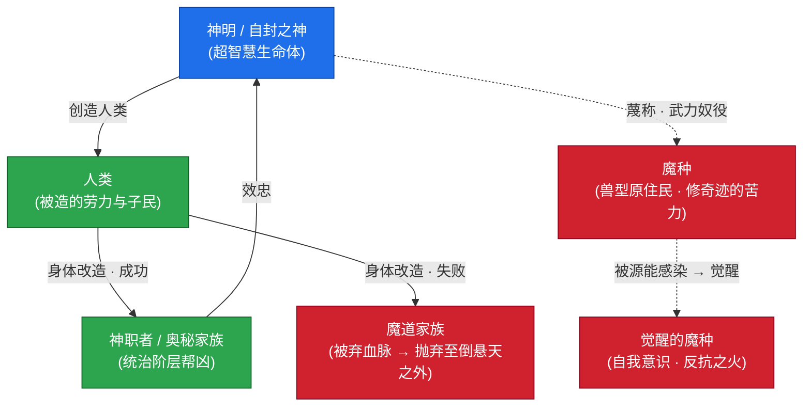
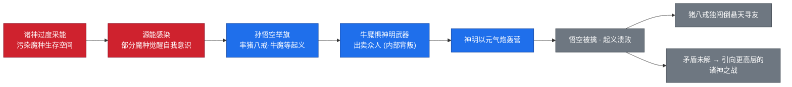
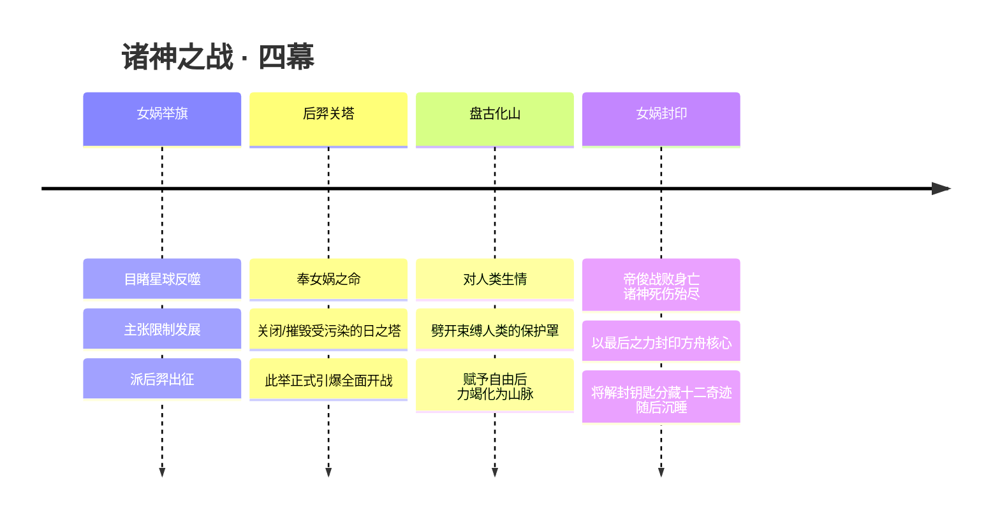
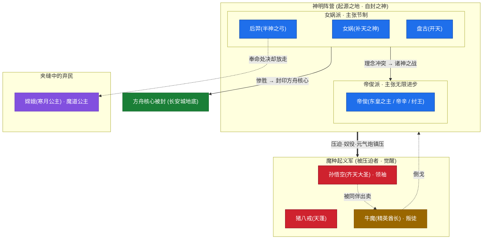
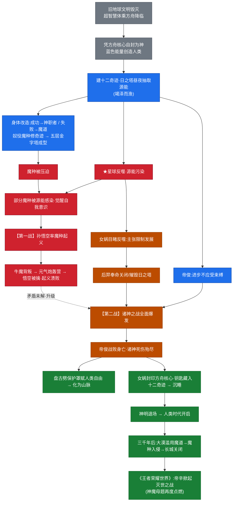
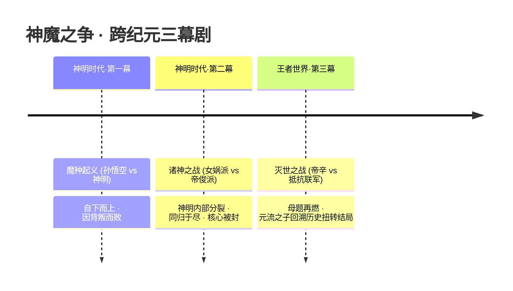

# 专题 · 神魔之争

> 「神」从来不是天生的，它是一群逃过末日的幸存者，给自己加冕的名号。
> 「魔」也从来不是邪恶的别称，它是被这群自封之神，按到金字塔最底层、用来蔑称劳力者的字眼。
> 当被叫作「魔」的那些族类第一次抬起头、第一次说出「我也是活物」时——神魔之争，便不再是神与魔的战争，而是**「谁有资格定义生命」**的战争。

<span class="hok-tags"><span class="tag tank">压迫</span><span class="tag warrior">觉醒</span><span class="tag assassin">反抗</span><span class="tag mage">创造 vs 毁灭</span></span>

这是贯穿《王者荣耀》世界观最底层、也最漫长的一条主线。它从[起源时代](../worldview/eras.md)的方舟降临开始埋种，在神明时代以两场大战（魔种起义、诸神之战）总爆发，又在三千年后的[人类时代](../worldview/eras.md)以魔道滥用、长城关闭的方式回响，最终在《王者荣耀世界》的**灭世之战**里被帝辛重新点燃。

本专题不按「住在哪座城」组织，而是顺着一个母题往下深读：**神明—神职者—人类—魔道—魔种**这座等级金字塔是如何砌成的，又是如何被一次次自下而上的反抗撼动的。读它，几乎就是读懂整个世界观的「第一因」。

::: info 本页与其他页的分工
- 想看**纪元时间轴**（先后顺序）：[纪元 · 起源到当下](../worldview/eras.md)
- 想看**底层概念**（方舟核心 / 源能 / 魔道）：[世界观 · 核心概念](../worldview/concepts.md)
- 想看**封神之战的具象演绎**（纣王 / 姜子牙 / 妲己）：[专题 · 封神演义在王者](fengshen.md)
- 本页聚焦的是这条主线的**结构与因果**：金字塔怎么来、怎么裂、怎么塌。
:::

---

## 一、母题：创造与毁灭，是同一颗心的两面

整条主线的「物理底色」，是一颗心——**方舟核心（宇宙之心 / Ark Core）**。

它是逃离毁灭母星的超智慧生命体随[方舟](../worldview/concepts.md)带来的能量总枢纽，内部同时孕育两股原始力量：

| 能量 | 颜色 | 性质 | 在主线里的角色 |
| --- | --- | --- | --- |
| 创造能量 | 蓝 | 生、造物、镇压、秩序 | 神明依它创造人类、建造十二奇迹、打造机关巨人 |
| 毁灭能量 | 红 | 灭、污染、变异、失控 | 星球反噬、苍狼变异、源能感染魔种、深渊与暗影之源 |

::: info 为什么说「创造 vs 毁灭」其实是「同一颗心」
红与蓝并非两件东西，而是**同一颗方舟核心的两面**。神明用蓝色能量「创造」了人类与奇迹，却为给奇迹供能而疯狂抽取地底源能，竭泽而渔，反而唤醒了红色的「毁灭」——星球之血开始反噬，源能污染了被奴役的魔种，使他们觉醒。

换言之：**正是「创造」的贪婪，孕育了「毁灭」的反抗。** 这是整条主线最核心的悖论，也是它能从起源一路延烧到灭世的根本张力。「神魔之争」表面是神打魔，骨子里是这颗红蓝双色之心，在借不同的人之手互相撕咬。
:::

这抹红与蓝是世界观的「主旋律」：它在[王者峡谷由来](canyon.md)里化作机关巨人的蓝色之力与苍狼失控的红；在[琥珀纪元](parallel-worlds.md)里以「红蓝琥珀」配色再度回响（[马超](../heroes/sanfen-shu.md#马超)红、[伽罗](../heroes/changcheng.md#伽罗)蓝）。读完本页，再去看那些「红蓝配色」的设定，会发现它们都在向这颗心致敬。

---

## 二、背景：一座用蔑称砌成的金字塔

### 2.1 自封之神，与他们的「无限能源」

降临王者大陆的，并不是天生神祇。他们是遥远未来旧地球文明毁灭后、少数进化为**超智慧生命体**的幸存者，携人类基因与文明火种乘方舟而来。落地之后，他们凭借科技与方舟核心之力，**自封为神**——[女娲](../heroes/shanggu-shenhua.md#女娲)、[帝俊](../heroes/haojing-fengshen.md#帝俊)、[盘古](../heroes/shanggu-shenhua.md#盘古)、[后羿](../heroes/shanggu-shenhua.md#后羿)，皆在此列。

为了支撑这套「神明文明」，诸神以方舟核心能量建起横贯大陆的**十二奇迹**，其代表便是日之塔——它昼夜不停地从星球地底抽取**源能（星球之血）**，是这套文明的「无限发电厂」。

::: warning 祸根，从第一天就埋下了
日之塔的抽取是**竭泽而渔**式的。星球的血被昼夜抽干，地脉失衡，星球反噬的隐患从奇迹落成的那一刻就开始累积。后来的一切灾难——魔种觉醒、诸神之战、文明崩塌——追根溯源，都指向这座塔。**辉煌之下，矛盾在日之塔里日复一日地发酵。**
:::

### 2.2 五层金字塔：身体改造决定一切

神明用蓝色能量从地里「造」出了人类；又从人类中挑选，进行**身体改造**。改造的成败，把一个本无贵贱的物种，硬生生切成了几个等级：


这座金字塔越往下，人口越多、受压迫越深；越往上，权力与自由越集中。下面的流程图，则进一步标出每一层是「怎么被切出来」的——同一批人类，因一刀手术的成败，分流向贵族与弃民两端：



| 等级 | 身份 | 由来 | 处境 | 关键词 |
| --- | --- | --- | --- | --- |
| 顶层 | **神明** | 旧地球幸存者，自封 | 掌方舟核心、定生死 | 创造者 · 统治者 |
| 第二层 | **神职者（奥秘家族 / Arcana）** | 人类身体改造**成功**者 | 力量强大、位居众人之上、为神明效力 | 帮凶 · 贵族 |
| 第三层 | **人类** | 神明以方舟核心所造 | 被改造的「原料」、奇迹的子民 | 被造者 |
| 第四层 | **魔道（魔道家族 / Demon Path）** | 身体改造**失败**者 | 被抛弃至[倒悬天](../worldview/concepts.md)之外，与魔种、凡人混居 | 弃民 · 因罪得力 |
| 底层 | **魔种** | 大陆原生的兽型族群（含苍狼血脉） | 被蔑称为「低贱魔种」、武力奴役去修奇迹 | 苦力 · 被压迫者 |

::: quote 一句话读懂这座金字塔
神职者与魔道家族，本是同一批走上手术台的人类。**一刀下去，活成贵族；一刀下去，沦为弃民。** 而魔种，从一开始就没被当作「人」。所谓「神魔」之别，不过是手术刀的运气与造物者的傲慢。
:::

### 2.3 「魔」这个字，是怎么来的

值得反复强调的是：**「魔种」并非自称，而是神明加诸的蔑称。** 他们是这片大陆真正的原住民。同样，「魔道」也并非天生邪恶——魔道是一门「由定义世界本源的知识与法则驱动、经媒介触发转化为力量」的神秘学问，是改造残留在血脉里的力量。它取代了旧地球的燃料，成为后世改造世界的动力源。

这正是这条主线最锋利的地方：**「神」与「魔」的边界，从头到尾都是由站在金字塔顶端的人单方面定义的。** 当后世的[魔道·暗影·深渊](../factions/modao-shadow-abyss.md)势力被视作「黑暗」，当大漠因滥用魔道而沦为废土时，别忘了——这股力量最初，只是「因罪而得力量的悲情血脉」。

---

## 三、第一次反抗：魔种起义（孙悟空起义）

矛盾的第一次总爆发，发生在**神明时代**的最底层。

诸神为给奇迹供能而过度采集源能，污染了魔种的生存空间；而部分魔种恰恰因为被星球之血/源能感染，**获得了力量、觉醒了自我意识**。压迫与觉醒在同一股能量里相遇，火星溅出——一个不肯再当苦力的魔种，站了出来。

### 3.1 领导者与起义军

他就是[孙悟空](../heroes/shanggu-shenhua.md#孙悟空)，齐天大圣，魔种起义的领袖。

::: quote 孙悟空
「俺老孙，最看不惯的就是『天命』二字。」——永远冲在最前方的那个，从不问敌人是谁，只问该不该打。
:::

<div class="hok-cards">
<a class="hok-card" href="../heroes/shanggu-shenhua#孙悟空"><span class="hok-card-title">孙悟空</span><span class="hok-card-desc">齐天大圣__ 起义领袖。持金箍棒、可分身的爆发型刺客战士。被源能唤醒、不认神明所定的等级，是「自下而上反抗」最纯粹的象征。</span></a>
<a class="hok-card" href="../heroes/shanggu-shenhua#牛魔"><span class="hok-card-title">背叛者</span><span class="hok-card-desc">精英酋长__ 牛魔王。起义军核心之一——也是。因惧怕神明的武器而出卖众人，亲手为起义掘了坟。守护型坦辅，技能是「护后排」，命运却是「卖战友」。</span></a>
<a class="hok-card" href="../heroes/shanggu-shenhua#猪八戒"><span class="hok-card-title">猪八戒</span><span class="hok-card-desc">天蓬__ 起义军一员。起义溃败后，独自闯入倒悬天之外寻找失散的战友。技能全程吸血的回血型坦克，背负的是「找回兄弟」的执念。</span></a>
</div>

### 3.2 因背叛而溃败

起义的失败，不是败于神明的强大，而是败于**内部的背叛**。



牛魔的出卖，让神明得以以**元气炮**直接轰击起义军大营。悟空被擒，第一次自下而上的反抗，就此被武力碾碎。

::: tip 背叛的弧光：技能即叙事
[牛魔](../heroes/shanggu-shenhua.md#牛魔)的机制是「开团顶飞、护盾保护后排」——一个天生该守护同伴的角色，却在最关键的时刻出卖了同伴。这种「守护者沦为背叛者」的反差，正是这场起义最令人唏嘘之处。它也预告了一个母题：**反抗者最大的敌人，往往不是神明，而是恐惧本身。**
:::

::: info 悟空的后续（跨纪元伏笔）
起义失败后，悟空被镇压千年；到了三千年后的[人类时代](../worldview/eras.md)，他又以「西行取经」的形象重新登场，成为玩家最熟悉的英雄之一。这条「起义—镇压—千年后归来」的长线，使孙悟空成为神魔主线里跨度最大的人物。（关于他与[露娜](../heroes/changan.md#露娜)的「皮肤CP」——主线中悟空被镇压、露娜一直寻兄，二人其实从未相遇，属皮肤钦定而非剧情线，详见[关系总览](../relationships/index.md)。）
:::

---

## 四、第二次反抗：诸神之战（封神之战）

魔种起义虽被镇压，但它所揭示的危机——**星球正在反噬**——却让神明内部裂成了两半。这一次，反抗不再来自底层，而来自神明阵营内部的**理念分裂**。这便是**诸神之战**，其具象叙事即以《封神演义》为原型的**封神之战**。

### 4.1 两条路线之争：该不该给「进步」装上刹车

```mermaid
mindmap
  root(("诸神之战<br/>理念之争"))
    女娲派
      主张
        星球承载力有限
        发展须有节制
        关闭受污染的日之塔
      手段
        派后羿摧毁日之塔
        最终封印方舟核心
      关键词
        节制·守护·封印
    帝俊派
      主张
        进步不应受任何束缚
        文明不该为星球停步
      立场
        视限制为倒退
        "宣告人类与魔种平等(招致反对)"
      关键词
        激进·扩张·无限
```

| 维度 | 女娲派 | 帝俊派 |
| --- | --- | --- |
| 核心主张 | 限制超出星球承载力的发展 | 进步不应受任何束缚 |
| 对日之塔 | 该关 / 该毁 | 该留 / 该用 |
| 对方舟核心 | 终须封印，留作末日开关 | 无限取用 |
| 领袖 | [女娲](../heroes/shanggu-shenhua.md#女娲) | [帝俊](../heroes/haojing-fengshen.md#帝俊)（即帝辛 / 纣王体系） |
| 结局 | 惨胜，以最后之力封印核心后沉睡 | 战败身亡 |

::: info 帝俊 = 帝辛 = 纣王（考据推测）
本世界观将上古天帝**帝俊**与封神反派**纣王 / 帝辛**视作同一神祇的不同名相（同体异名）。在[封神演义专题](fengshen.md)中，他以「纣王」之姿登场——因宣布「人类与魔种平等」而招致旧秩序的反对，被姜子牙讨伐军定性为「走向毁灭的大魔神王」，最终于摘星楼烈焰中灰飞烟灭。

需要留意的是：游戏中[东皇太一](../heroes/jixia.md#东皇太一)是否为帝俊化身，各方说法不一；本百科按「东皇太一为独立可玩英雄」处理。此处「帝俊=帝辛=纣王」为综合多方设定的整合性推测，官方表述长期有出入。
:::

### 4.2 战争的四个标志性瞬间

诸神之战是这条主线的**最高潮**，也是神明文明的「黄昏」。它由四个堪称「神话级」的瞬间构成：



#### 后羿 · 射向自己阵营的那一箭

[后羿](../heroes/shanggu-shenhua.md#后羿)，背负射日宿命的半神之弓手。是他奉女娲之命，亲手关闭/摧毁了那座支撑整个神明文明的日之塔——**而这一箭，等于向自己所属的神明体系开了第一枪**，正式引爆了诸神之战。

::: quote 后羿
「拉满这张弓，是为了不让任何人，再被太阳灼伤。」——射日者射的从来不是日，是那座吸干星球之血的塔。
:::

后羿的弧光还有更柔软的一面：他也曾是奉命处决魔道公主[嫦娥](../heroes/shanggu-shenhua.md#嫦娥)的「神职者」执行人，却在行刑前放走了她，任濒死的嫦娥随月光沉入大海。**一个被命令去毁灭的人，两次都选择了不毁灭。** 这正是「创造 vs 毁灭」母题在个体身上最动人的折射。

#### 盘古 · 为人类劈开牢笼，自己化作山脉

[盘古](../heroes/shanggu-shenhua.md#盘古)，开天辟地的巨神。在诸神之战中，他做出了一个神明本不该做的选择——**他对人类，动了情。**

人类本被一层「保护罩」束缚（也是控制），盘古一斧劈开它，把「自由」交还给了被造的人类，自己则力竭、化为横亘大陆的山脉。

::: quote 盘古
「我把天劈开，是要让你们看见——头顶的，不该是牢笼，而该是天空。」
:::

#### 女娲 · 把末日开关锁进城底

[女娲](../heroes/shanggu-shenhua.md#女娲)，创世神明之首。诸神之战以「惨胜」收场：帝俊战败身亡，诸神死伤殆尽，整个神明文明几乎同归于尽。女娲以**最后的力量**，做了三件影响后世数千年的事：

1. **封印方舟核心**——把这颗既能创世、又能毁世的「末日开关」锁了起来（封印地即后世**长安城**地底）。
2. **将解封钥匙分藏于十二奇迹之中**——使奇迹从「能量设施」变成了「封印谜题」，为后世一切围绕方舟之秘的争夺（如[李白](../heroes/changan.md#李白)夺宝、[马可波罗](../heroes/jianghu-xiake.md#马可波罗)开启地底宝藏门）埋下伏笔。
3. **沉睡**——神明，自此退场。

::: quote 女娲
「我补的不是天，是我们这些自封为神者，亲手捅出的窟窿。」
:::

---

## 五、全景图：阵营站队与事件因果

### 5.1 神魔之争 · 阵营 / 人物站队图

下面这张图把整条主线的「站队」一次性铺开：神明阵营如何因理念分裂为女娲派与帝俊派，魔种起义军如何自成一极，以及背叛者牛魔的特殊位置。



::: info 怎么读这张图
- **蓝色**＝神明阵营，内部已先裂成女娲派 / 帝俊派两块。
- **红色**＝魔种起义军，是「自下而上」的那一极。
- **金色**＝牛魔，他既属起义军、又倒向神明，是图中唯一「脚踏两边」的人。
- **紫色**＝嫦娥，象征被金字塔碾过、却被某个神明私下放过的「弃民个体」。
- 三条主要冲突线：神明 **压迫** 魔种、女娲派 **对战** 帝俊派、牛魔 **背叛** 起义军。
:::

### 5.2 神魔之争 · 完整事件因果链

把两场大战串成一条因果链，可以清楚看到：每一次「创造的贪婪」，都会催生一次「毁灭的反抗」，而每一次反抗的余烬，又成为下一次危机的火种。



---

## 六、余烬：神隐之后，神魔之争从未结束

诸神之战让神明几乎全部退场，但「神魔之争」这条主线，并没有随之落幕。它换了形态，继续在[人类时代](../worldview/eras.md)燃烧。

### 6.1 神职者的余孽：奥秘家族

诸神之战后，反叛的**11家奥秘 / 神职家族**夺取了奇迹之力，却因此遭到诅咒，演化为分布各地的贵族政治网络——如月之家族被派往[海都](../factions/penglai-donghai.md)、塔之家族最终胜出获总督之位。金字塔的「第二层」并未消失，只是从神明的帮凶，变成了人类世界的世袭门阀。([露娜](../heroes/changan.md#露娜)的月之家族、[镜](../heroes/changan.md#镜)与[曜](../heroes/changan.md#曜)的古老神职家族，皆是这层余孽的后裔。)

### 6.2 魔道的回响：滥用与反噬

「魔道」这门因罪而得的力量，在三千年后被再度滥用。大漠绿洲的统治者经不住魔道诱惑，滥用力量制造强大魔种，导致王庭沦陷、[云中漠地](../factions/yunzhong-modi.md)由丝路绿洲衰败为废土、长城关隘紧闭。于是有了[长城守卫军](../factions/changcheng.md)的组建——而它最动人之处，恰是对金字塔的反写：**这支军队出于帝国的包容，吸纳魔种混血、异乡人、屯田军后裔乃至女性等一切有才之人。**

<div class="hok-cards">
<a class="hok-card" href="../heroes/changcheng#伽罗"><span class="hok-card-title">伽罗</span><span class="hok-card-desc">破魔之箭__ 长城守卫军成员，射程最远的射手，箭矢可「破魔净化」。她是「以净化对抗污染」的具象——红色毁灭能量的解药。</span></a>
<a class="hok-card" href="../heroes/changcheng#百里玄策"><span class="hok-card-title">人魔混血</span><span class="hok-card-desc">狼性少年__ 带狼（苍狼血脉）基因的少年。金字塔最底层的「魔种」血脉，如今堂堂正正成为长城的守卫者——这本身就是对旧等级的反叛。</span></a>
<a class="hok-card" href="../heroes/changan#花木兰"><span class="hok-card-title">兰陵王</span><span class="hok-card-desc">暗影刀锋__ 潜行于中的全隐身刺客，归属。他与长城守将在长城下的宿命交锋，是「神魔边界」在个体层面的反复拉扯。</span></a>
</div>

### 6.3 一念神魔：当「神 / 魔」成为同一个人的两面

到了人类时代，「神魔之争」甚至内化进了**单个英雄的身体里**——最典型的是[李信](../heroes/changan.md#李信)。

::: quote 李信 · 一念神魔
「光与暗，神与魔，原来都装在同一具身体里。一念向光，是李信；一念向暗，也是李信。」
:::

[李信](../heroes/changan.md#李信)（长城守卫军前统帅）可在**光信**与**暗信**两种形态间切换：光为坦克型守护，暗为爆发刺杀。无独有偶，[干将莫邪](../heroes/jixia.md#干将莫邪)的称号也是「一念神魔」。当世界观发展到这一步，「神」与「魔」不再是两个阵营，而成了**同一个人心中的两种选择**——这正是这条主线从「外部战争」走向「内心抉择」的最终归宿。

### 6.4 终章伏笔：帝辛的灭世之战

而那位在诸神之战中战败身亡的帝俊 / 帝辛，并未真正退场。在《王者荣耀世界》开放世界主线里，**反派领袖帝辛发起了席卷诸界的灭世之战**——原时间线中抵抗联军战败、世界濒临毁灭，直到一股跨越时空的力量让[元流之子](../heroes/yuanchu-shenhua-misc.md#元流之子)回溯到战争爆发前，肩负扭转历史的使命。



::: tip 为什么帝辛是「闭环」
第一幕，神明镇压魔种；第二幕，帝俊主张「人魔平等」反被旧秩序讨伐而亡；第三幕，他以「帝辛」之名卷土重来，要用一场灭世之战，彻底掀翻这套他曾死于其中的秩序。**从被压迫者的镇压者，到旧秩序的反叛者，再到新秩序的毁灭者**——帝俊 / 帝辛一个人，几乎把「创造 vs 毁灭」的整条母题走了一遍。这也是为什么本专题说：神魔之争，从未真正结束。
:::

---

## 七、人物速查 · 谁站在哪一边

::: info 神魔之争 · 核心人物名册
下表汇总本专题涉及的主要人物及其在主线中的位置。点击英雄名可跳转其英雄页。
:::

| 人物 | 阵营 / 派系 | 在主线中的位置 | 一句话 |
| --- | --- | --- | --- |
| [女娲](../heroes/shanggu-shenhua.md#女娲) | 神明 · 女娲派 | 创世神明之首、封印者 | 补天补的是诸神捅的窟窿 |
| [盘古](../heroes/shanggu-shenhua.md#盘古) | 神明 · 女娲派 | 为人类劈开牢笼、化为山脉 | 让头顶是天空，不是牢笼 |
| [后羿](../heroes/shanggu-shenhua.md#后羿) | 神明 · 女娲派 | 关日之塔、引爆诸神之战、放走嫦娥 | 两次被命令毁灭，两次选择不毁灭 |
| [帝俊](../heroes/haojing-fengshen.md#帝俊) | 神明 · 帝俊派 | 主张无限进步的反派天帝（=帝辛/纣王） | 进步不应受任何束缚 |
| [孙悟空](../heroes/shanggu-shenhua.md#孙悟空) | 魔种起义军 | 起义领袖 | 最看不惯「天命」二字 |
| [猪八戒](../heroes/shanggu-shenhua.md#猪八戒) | 魔种起义军 | 起义军一员、独闯倒悬天寻友 | 起义败了，兄弟还得找回来 |
| [牛魔](../heroes/shanggu-shenhua.md#牛魔) | 魔种起义军 → 倒戈 | 背叛者，致起义溃败 | 守护型坦辅，却出卖了同伴 |
| [嫦娥](../heroes/shanggu-shenhua.md#嫦娥) | 魔道（弃民） | 魔道公主，被后羿放走沉海 | 被金字塔碾过、被一个神明私下放过 |
| [李信](../heroes/changan.md#李信) | 长城守卫军（人类时代） | 光 / 暗双形态，神魔内化为一念 | 一念神魔，皆是李信 |
| [伽罗](../heroes/changcheng.md#伽罗) | 长城守卫军（人类时代） | 破魔净化的射手 | 以净化对抗污染 |
| [百里玄策](../heroes/changcheng.md#百里玄策) | 长城守卫军（人类时代） | 人魔混血、堂正守边 | 最底层血脉，成了守卫者 |
| [兰陵王](../heroes/modao-shadow-abyss.md#兰陵王) | 魔道·暗影·深渊（人类时代） | 暗影刺客，与花木兰宿命交锋 | 神魔边界在个体上的拉扯 |
| [元流之子](../heroes/yuanchu-shenhua-misc.md#元流之子) | 王者世界主线 | 回溯灭世之战、扭转历史的玩家化身 | 给这条三千年母题一个新结局 |

---

## 八、延伸阅读

<div class="hok-cards">
<div class="hok-card"><span class="hok-card-title"></span><span class="hok-card-desc">相关纪元</span></div>
<a class="hok-card" href="../worldview/eras"><span class="hok-card-title">起源时代 / 上古文明 / 神明时代</span><span class="hok-card-desc">— 本专题事件的时间坐标</span></a>
<a class="hok-card" href="../worldview/eras"><span class="hok-card-title">人类时代 · 余烬延烧</span></a>
<a class="hok-card" href="../worldview/eras"><span class="hok-card-title">《王者荣耀世界》主线 · 灭世之战</span></a>
<a class="hok-card" href="../worldview/timeline"><span class="hok-card-title">完整时间轴</span></a>
<div class="hok-card"><span class="hok-card-title"></span><span class="hok-card-desc">相关人物</span></div>
<a class="hok-card" href="../heroes/haojing-fengshen#帝俊"><span class="hok-card-title">女娲</span><span class="hok-card-desc">神明：</span></a>
<a class="hok-card" href="../heroes/shanggu-shenhua#牛魔"><span class="hok-card-title">孙悟空</span><span class="hok-card-desc">起义军：</span></a>
<a class="hok-card" href="../heroes/modao-shadow-abyss#兰陵王"><span class="hok-card-title">李信</span><span class="hok-card-desc">余烬：</span></a>
<div class="hok-card"><span class="hok-card-title"></span><span class="hok-card-desc">相关专题</span></div>
<a class="hok-card" href="fengshen"><span class="hok-card-title">封神演义在王者</span><span class="hok-card-desc">— 诸神之战的「具象叙事」特写</span></a>
<a class="hok-card" href="parallel-worlds"><span class="hok-card-title">平行宇宙</span><span class="hok-card-desc">— 红蓝能量在琥珀纪元的回响</span></a>
<a class="hok-card" href="canyon"><span class="hok-card-title">王者峡谷由来</span><span class="hok-card-desc">— 苍狼之红 vs 机关巨人之蓝</span></a>
<a class="hok-card" href="artifacts"><span class="hok-card-title">神兵·名剑·信物</span><span class="hok-card-desc">— 金箍棒等器物背后的人</span></a>
<div class="hok-card"><span class="hok-card-title"></span><span class="hok-card-desc">相关阵营 / 概念</span></div>
<a class="hok-card" href="../factions/haojing-fengshen"><span class="hok-card-title">上古众神·神话</span></a>
<a class="hok-card" href="../factions/modao-shadow-abyss"><span class="hok-card-title">长城守卫军</span></a>
<a class="hok-card" href="../worldview/concepts"><span class="hok-card-title">世界观核心概念</span><span class="hok-card-desc">（方舟核心 / 源能 / 倒悬天）</span></a>
</div>

---

::: quote 结语 · 神与魔的边界，由谁定义
回望这条三千年的主线，会发现「神」与「魔」从来不是善与恶的标签，而是**权力的命名权**。是金字塔顶端的人，把自己叫作「神」，把脚下的原住民叫作「魔」。

于是孙悟空举旗，是「魔」在反抗「神」；后羿放箭关塔，是「神」在反抗「神」；盘古劈开牢笼，是「神」在成全「人」；而帝辛掀起灭世之战，又把这一切搅成一锅。当[元流之子](../heroes/yuanchu-shenhua-misc.md#元流之子)回溯到战争爆发之前，他要改写的，或许不只是一场战争的胜负，而是——**这一次，由谁来定义「神」与「魔」。**
:::