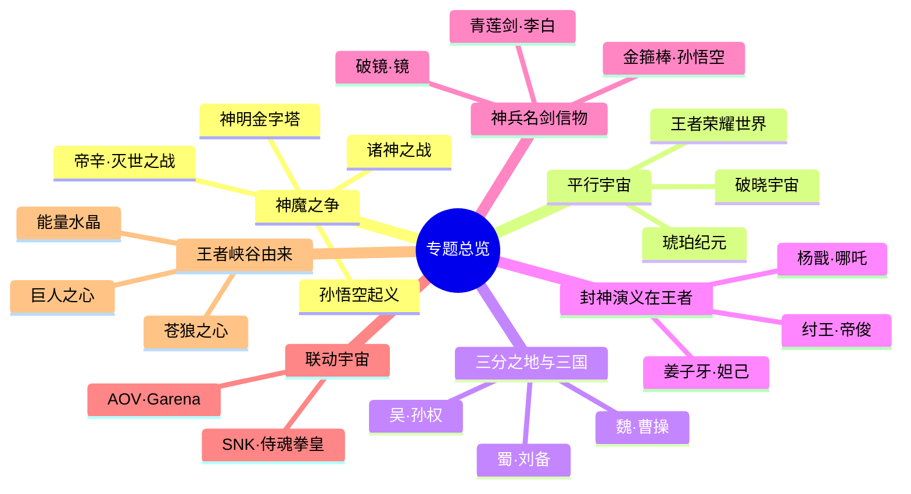
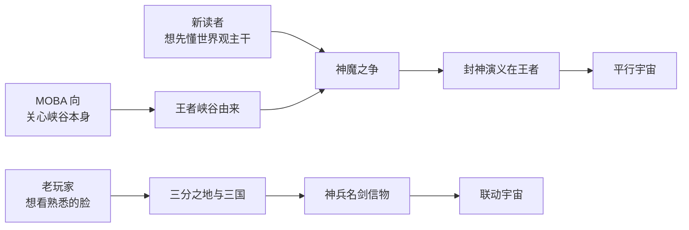

# 专题总览

> 把一条条散落在阵营、英雄、纪元里的暗线，重新编织成一束。

阵营页讲「谁与谁同处一城」，英雄页讲「这个人是谁」，纪元页讲「世界如何走到今天」。但《王者荣耀》世界观里真正动人的部分，往往是那些**横跨多个阵营、贯穿数个纪元的主题暗线**——红蓝两色能量从方舟核心一路流到琥珀纪元的双星，神与魔的对立从起源时代一直延烧到《王者荣耀世界》的灭世之战，一把[李白](../heroes/changan.md#李白)的青莲剑、一面[镜](../heroes/changan.md#镜)的破碎魔镜、一枚被[花木兰](../heroes/changan.md#花木兰)砍碎的破晓之心，串起了天南海北本不相识的人。

**专题，就是跨阵营、跨纪元的主题式深读。** 它不按「住在哪座城」组织，而按「围绕同一个母题」组织。本栏目精选七个最具张力的主题，每一个都像一条贯穿世界的经线，把零散的设定缝合成可以一口气读下去的故事。

::: info 专题 vs 其他栏目
- **纪元**（[纪元 · 起源到当下](../worldview/eras.md)）= 纵向的时间轴，回答「先发生什么、后发生什么」。
- **阵营**（[阵营总览](../factions/index.md)、[长安城](../factions/changan.md) 等）= 横向的空间块，回答「同一片土地上有谁」。
- **关系**（[关系总览](../relationships/index.md)）= 点对点的人物连线，回答「他和她是什么关系」。
- **专题**（本栏目）= 斜向的主题切片，**抽取一个母题，把跨越时空与阵营的所有相关人事物聚到一处重读**。同一个英雄、同一个纪元，可能同时出现在好几个专题里——这正是专题的价值：换一个角度，看见新的网。
:::

::: info 一张图看懂：专题是「斜切」
把世界观想象成一块多层蛋糕：**纪元**是从上到下的层（时间），**阵营**是从中切下的一块（空间），而**专题**是斜着插进去的一刀——它同时穿过好几层、好几块，把刀面上所有截到的人事物连成一片新的横截面。本页所有专题，都是这样一刀「斜切」的成果。
:::

<figure markdown>
  
  <figcaption>王者大陆地理总览：七大专题的母题暗线，正是在这张地图的各个角落之间来回穿行。（原创示意图，非官方地图）</figcaption>
</figure>

---

## 七大专题一览

<a class="hok-card" href="gods-vs-demons">进入专题神魔之争__ 神明—神职者—人类—魔道—魔种的森严金字塔，与一场场自下而上的反抗。从孙悟空的魔种起义到诸神之战，再到帝辛掀起的灭世之战，「神」与「魔」的边界究竟由谁定义。</a>
<a class="hok-card" href="parallel-worlds">进入专题平行宇宙__ 主世界线之外的几重镜像：花木兰一剑劈出的破晓宇宙、与刘慈欣共创的琥珀纪元、回溯历史的《王者荣耀世界》。一个世界，多种可能。</a>
<a class="hok-card" href="three-kingdoms">进入专题三分之地与三国__ 魏（魏都·曹操）、蜀（益城·刘备）、吴（江郡·孙权）三足鼎立的群雄逐鹿。桃园结义、五虎上将、江南姻亲网，王者版的三国如何既忠于演义又自成一格。</a>
<a class="hok-card" href="fengshen">进入专题封神演义在王者__ 《封神演义》如何被改写为诸神之战的「具象叙事」。纣王、姜子牙、妲己、杨戬、哪吒——神话原型与科幻方舟设定在镐京的烈焰中交汇。</a>
<a class="hok-card" href="artifacts">进入专题神兵 · 名剑 · 信物__ 青莲剑、暗影之剑、金箍棒、方天画戟、破镜……每一件神兵背后都站着一个人，每一枚信物都牵着一段命运。器物即叙事。</a>
<a class="hok-card" href="crossover">进入专题联动宇宙__ 跨 IP 的客座来访：SNK《侍魂》《拳皇》的不知火舞、娜可露露、橘右京，AOV/Garena 的弗洛伦。他们如何被接入（或半接入）王者大陆的世界观。</a>
<a class="hok-card" href="canyon">进入专题王者峡谷由来__ MOBA 主战场的世界观落点。苍狼与机关巨人同归于尽的残骸，孕育出巨人之心、苍狼之心与能量水晶，使峡谷成为大陆灵力最盛之地。</a>

---

## 速查表 · 专题导航

| 专题 | 文件 | 一句话 | 母题关键词 | 主要跨越 |
| --- | --- | --- | --- | --- |
| 神魔之争 | [gods-vs-demons.md](gods-vs-demons.md) | 神魔金字塔与一次次自下而上的反抗 | 压迫 · 觉醒 · 反抗 | 起源时代 → 灭世之战 |
| 平行宇宙 | [parallel-worlds.md](parallel-worlds.md) | 主线之外的破晓、琥珀与回溯三重镜像 | 镜像 · 分叉 · 熵减 | 破晓事件 · 琥珀纪元 · 开放世界 |
| 三分之地与三国 | [three-kingdoms.md](three-kingdoms.md) | 魏蜀吴三足鼎立的群雄逐鹿 | 割据 · 忠义 · 权谋 | 人类时代 · 魏/蜀/吴三阵营 |
| 封神演义在王者 | [fengshen.md](fengshen.md) | 封神神话作为诸神之战的具象叙事 | 封神 · 神职 · 魔道 | 神明时代 · 镐京·封神 |
| 神兵名剑信物 | [artifacts.md](artifacts.md) | 器物背后的人与命运 | 神兵 · 信物 · 传承 | 全阵营 · 全纪元 |
| 联动宇宙 | [crossover.md](crossover.md) | 跨 IP 客座英雄的入驻方式 | 客座 · 跨界 · 融入 | 扶桑/血族 · 联动英雄组 |
| 王者峡谷由来 | [canyon.md](canyon.md) | MOBA 主战场的世界观落点 | 能量 · 遗迹 · 先民文明 | 先民时代 · 峡谷文明 |

---

## 专题之间，并非互不相干

七个专题彼此勾连：神魔之争的源头（方舟核心红蓝能量）流向了平行宇宙（[琥珀纪元](parallel-worlds.md)的红蓝双星）；封神演义是神魔之争在神明时代的一段「特写」；三国的[诸葛亮](../heroes/sanfen-shu.md#诸葛亮)、[周瑜](../heroes/sanfen-wu.md#周瑜)、[司马懿](../heroes/sanfen-wei.md#司马懿)等英雄又曾求学于[稷下学院](../factions/jixia.md)、与封神/神话角色共享同一套底层设定。下面这张思维导图，是把七条经线放在一起看时浮现的网。

::: tip 母题主线：红与蓝
若要在七个专题里找一条贯穿到底的暗线，那就是**方舟核心内蕴的红色（毁灭）与蓝色（创造）两股能量**。它在「神魔之争」里是神明创世与末日的开关，在「王者峡谷由来」里化作机关巨人的蓝色创造之力与苍狼的失控之红，在「平行宇宙」的琥珀纪元里则以「红蓝琥珀」配色再度回响。读专题时不妨留意这抹红与蓝。
:::

---

## 推荐阅读顺序

不同的读者，可以从不同的专题切入：

::: details 三条路线的取舍说明（考据推测）
- **世界观主干路线**：神魔之争是世界观的「第一因」，封神演义是它在神明时代的具象化，平行宇宙则展示主线之外的分叉，三者连读最能建立框架。
- **英雄向路线**：三国与神兵信物从「人」与「物」切入，门槛最低、熟脸最多；联动宇宙作为收尾，呈现世界观的开放边界。
- **峡谷向路线**：从玩家每天对战的地图出发，再回溯到神魔之争的能量母题，是「由近及远」的读法。

以上为编者建议的阅读动线，并非官方钦定顺序，读者尽可随兴跳读。
:::

---

## 延伸去处

- 想看完整的时间纵轴：[纪元 · 起源到当下](../worldview/eras.md)
- 想看世界观总纲与导览：[世界观总览](../worldview/overview.md)
- 想查底层概念（方舟核心 / 源能 / 十二奇迹）：[核心概念辞典](../worldview/concepts.md)
- 想看大陆地理图志：[地理图志](../worldview/map.md)
- 想看事件年表：[纪元年表](../worldview/timeline.md)
- 想看人物关系网：[关系总览](../relationships/index.md)
- 想从「住在哪座城」入手：[阵营总览](../factions/index.md)

::: quote 李白
「白绫飘飞，恩仇似酒，一饮而尽。」——专题之间穿行，正如剑客行走江湖，看似零散，实则脉络分明。
:::