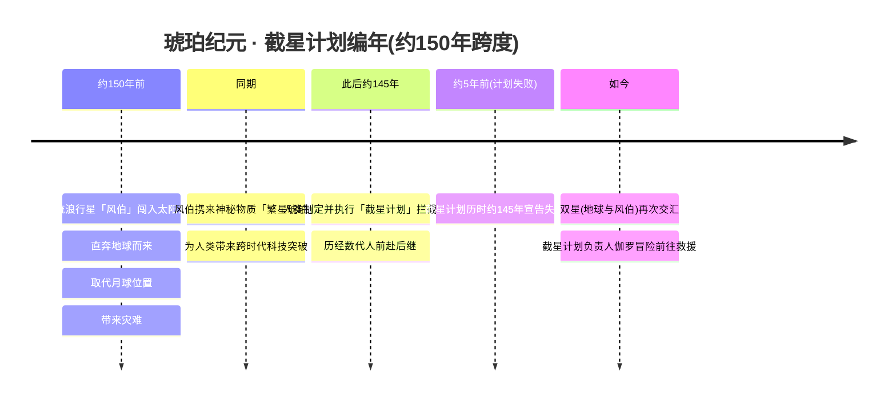
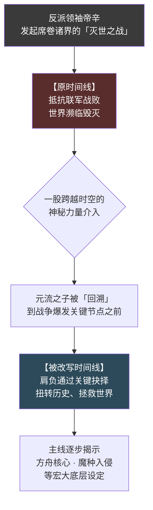
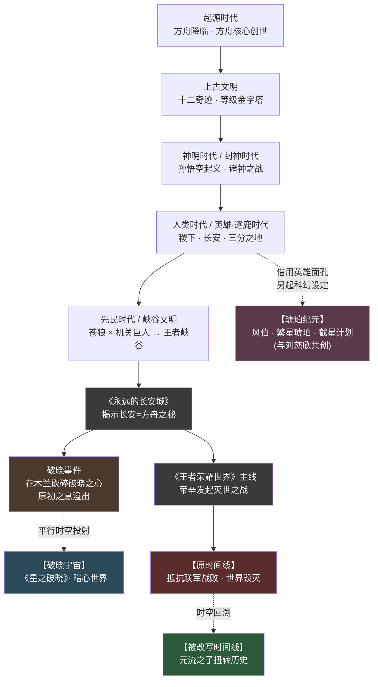

# 专题 · 平行宇宙(破晓 · 琥珀 · 王者世界)

> 一个世界，多种可能。同一片王者大陆，被一剑劈出裂隙、被一颗流浪行星撞出灾劫、被一股回溯之力倒拨时针——于是在主世界线之外，长出了三道镜像。

::: info 本页要回答的问题
《王者荣耀》的世界观并非一条孤零零的直线。在玩家最熟悉的「主世界线」（起源时代 → 神明时代 → 人类·逐鹿时代）之外，官方陆续推出了三条**平行 / 衍生世界线**：

1. **破晓宇宙**——动作手游《星之破晓》取材，由「破晓事件」在平行时空投射而成；
2. **琥珀纪元**——《王者荣耀》首个平行世界系列皮肤世界观，与科幻作家**刘慈欣**深度共创；
3. **《王者荣耀世界》开放世界主线**——以「元流之子」回溯灭世之战为核心的全新主线。

本页系统梳理这三条线的设定、关键人物与「与主世界线的关系」，并用对比表格与 Mermaid 分叉图把它们放在一起重读。本页大量内容据 `.build/world.json` 的纪元（eras）与宇宙观概念（cosmologyConcepts）字段写就；标注「(考据推测)」者为编者据公开资料与游戏惯例的合理推断，非官方硬设定。
:::

---

## 何谓「平行 / 衍生世界线」

在动笔三条线之前，先厘清一个底层问题：它们与主世界线，究竟是**同一棵树上的不同枝桠**，还是**彼此独立的几片森林**？

腾讯官方曾用一个意味深长的比喻概括整个 IP 的叙事结构——**生命之树**：把《王者荣耀》庞大的世界观比作一棵树，所有衍生故事都是这棵树上结出的「果实」。据此，三条平行 / 衍生线大致可分为两种「果实」：

<div class="hok-cards">
<div class="hok-card"><span class="hok-card-title">共享同一套底层设定</span><span class="hok-card-desc">「分叉型」平行线__ 与主世界线（方舟核心、源能、英雄阵营），只是在某个关键节点「岔开」，投射出一个镜像宇宙。 **代表：破晓宇宙**——它直接诞生于主线的「破晓事件」那一瞬。</span></div>
<div class="hok-card"><span class="hok-card-title">不与主线严格线性承接</span><span class="hok-card-desc">「独立型」平行宇宙__ 自成一套科幻设定，，更像「同一批英雄在另一个故事里重新登场」。 **代表：琥珀纪元**——熵增宇宙、流浪行星、截星计划，是一个完整自洽的科幻世界。</span></div>
</div>

而《王者荣耀世界》则是第三种特殊情形：它**自我标定为主线**（开放世界游戏主线），却又通过「时空回溯」机制内嵌了「原时间线 vs 被改写时间线」的双线结构，本身就是一个关于「平行可能性」的故事。

::: info 一条贯穿三线的暗色丝线：红与蓝
无论分叉还是独立，三条线都在不同程度上呼应着主世界线最底层的能量母题——[方舟核心](../worldview/concepts.md#方舟核心宇宙之心)内蕴的**红色（毁灭）能量**与**蓝色（创造）能量**。

- 破晓宇宙的导火索「[原初之息](../worldview/concepts.md#源能星球之血--原初之息)」，正是源能失控的奔涌；
- 琥珀纪元的代表皮肤刻意采用**红、蓝琥珀**配色（马超·红 / 伽罗·蓝），公认是对方舟核心红蓝双能的隔空致敬；
- 《王者荣耀世界》的灭世之战，核心冲突仍围绕方舟核心与魔种入侵展开。

读这三条线时，请始终留意这抹红与蓝——它是判断「平行」与「主线」血缘关系的试纸。
:::

---

## 一、破晓宇宙(《星之破晓》)

<span class="hok-tags"><span class="tag warrior">分叉型平行线</span><span class="tag assassin">破晓事件投射</span><span class="tag mage">动作格斗手游</span></span>

破晓宇宙是三条线中与主世界线**血缘最近**的一支：它不是另起炉灶，而是直接从主线时间轴上的一个事件——「**破晓事件**」——在平行时空里炸裂出来的镜像。

### 设定

故事的扳机，是一颗名为「**[破晓之心](../worldview/concepts.md#破晓之心)**」的上古奇迹宝石。

> 在 **[明世隐](../relationships/mentor.md)**（[长安城](../factions/changan.md)神秘组织尧天的首领）的谋划下，**[花木兰](../heroes/changan.md#花木兰)** 挥剑砍碎了破晓之心。宝石碎裂的刹那，一道通往异界的**裂隙**被打开，汹涌的[原初之息](../worldview/concepts.md#源能星球之血--原初之息)（即失控的源能 / 星球之血）喷涌而出，浸染整片 [王者峡谷](../worldview/map.md)，引发野兽异变。

砍碎的那一瞬间，原初之息的暴溢不仅在主世界线掀起危机，更在**平行时空**中把王者大陆「投射」出了一个全新的宇宙——这便是**破晓宇宙**。

危机当前，纵横家 **[鬼谷子](../heroes/jixia.md#鬼谷子)** 挺身号召英雄集结，一面守卫峡谷、一面设法以秘法**修复破晓之心**。据 `world.json` 的事件记载，应召而来的守卫者包括花木兰、**[上官婉儿](../heroes/changan.md#上官婉儿)**、**[程咬金](../heroes/changan.md#程咬金)**、**[司空震](../heroes/changan.md#司空震)** 等，新英雄亦在此节点陆续降临。

而衍生作品 **《星之破晓》**（动作格斗手游）正取材于这一宇宙。其最具辨识度的玩法母题是「**暗心世界**」：

::: info 暗心世界 · 直面内心的恐惧
在《星之破晓》的叙事里，英雄们会进入一个**由自身意识构成的「暗心世界」**，在那里与自己内心深处的恐惧、执念、阴影对峙。

这是一种把「外部战斗」内化为「精神试炼」的设计——峡谷的能量异变成了照见人心的镜子。每位英雄的暗心世界，都是其角色弧光的一次极端放大。（玩法叙事细节以游戏官方为准）
:::

### 关键人物(链接)

| 人物 | 在破晓宇宙中的角色 | 主线身份 |
| --- | --- | --- |
| [花木兰](../heroes/changan.md#花木兰) | 砍碎破晓之心、引爆裂隙的「执剑者」，亦是修复行动的核心成员 | [长安城](../factions/changan.md) · 长城小队队长 |
| [明世隐](../relationships/mentor.md) | 整起「破晓事件」的幕后谋划者 | [长安城](../factions/changan.md) · 尧天首领（牡丹方士） |
| [鬼谷子](../heroes/jixia.md#鬼谷子) | 号召英雄集结守卫、主持修复破晓之心 | [稷下学院](../factions/jixia.md) · 纵横家鼻祖 |
| [上官婉儿](../heroes/changan.md#上官婉儿) | 应召守卫峡谷的英雄之一 | [长安城](../factions/changan.md) · 惊鸿之笔 |
| [程咬金](../heroes/changan.md#程咬金) | 应召守卫峡谷的英雄之一 | [长安城](../factions/changan.md) · 热烈之斧 |
| [司空震](../heroes/changan.md#司空震) | 应召守卫峡谷的英雄之一 | [长安城](../factions/changan.md) · 雷霆之王 |

::: quote 花木兰
「破晓之心既已碎裂，便由我来收拾这残局。」——一剑劈碎奇迹的，与执剑修复奇迹的，是同一个人。（台词为契合剧情的示意，非游戏原文）
:::

### 与主世界线的关系

破晓宇宙是典型的「**分叉型**」平行线，可以用一句话概括其与主线的关系：

> **同源、同一瞬间分叉，互为镜像。**

- **同源**：它共享主世界线的全部底层设定——方舟核心、源能 / 原初之息、十二奇迹（破晓之心即上古奇迹之一）、英雄阵营。它不是「另一个故事」，而是「同一个世界的另一种投影」。
- **分叉点明确**：破晓宇宙的「创世时刻」就是主线「破晓事件」中破晓之心被砍碎的那一瞬——这是三条线里**分叉节点最清晰**的一支。
- **属主线之外的平行叙事**：尽管同源，`world.json` 明确将「破晓事件 / 破晓宇宙」归为「平行时空」纪元，定位为**主线之外的平行叙事**，与主干的起源 / 神明 / 人类三时代非严格线性承接。

::: details 考据补注：破晓事件的「双重身份」（考据推测）
破晓事件在世界观里身兼二职，容易让读者混淆：

1. 作为**主世界线的一个事件**：花木兰砍碎破晓之心、原初之息浸染峡谷、鬼谷子召集守卫——这一连串发生在主线时间轴上，与《永远的长安城》揭示方舟之秘等事件前后呼应。
2. 作为**平行宇宙的「创世奇点」**：同一瞬间的能量暴溢，在平行时空里「催生」了破晓宇宙。

换言之，破晓宇宙与主世界线像是同一颗宝石碎裂时溅出的两片光斑——它们来自同一击，却落向了不同的时空。这种「事件即分叉」的设定，是破晓宇宙最精巧之处。
:::

---

## 二、琥珀纪元(与刘慈欣共创)

<span class="hok-tags"><span class="tag marksman">独立型平行宇宙</span><span class="tag mage">硬科幻 · 熵减母题</span><span class="tag tank">首个平行世界皮肤系列</span></span>

如果说破晓宇宙是「从主线岔出去的一道光」，那么**琥珀纪元**就是一片**自成天地的科幻森林**——它是《王者荣耀》**首个平行世界系列皮肤世界观**，并且请来了《三体》作者、科幻作家**刘慈欣**深度共创。它的母题，从神话彻底切换到了硬科幻。

### 设定

琥珀纪元的内核，是一个极具刘慈欣个人印记的命题：

::: quote 琥珀纪元的母题
**在不可逆的熵增宇宙中，「文明」作为一种熵减过程，究竟意味着什么？**

宇宙的总趋势是走向无序与寂灭（熵增）；而文明，恰恰是逆流而上、在局部维持秩序与复杂度（熵减）的努力。琥珀纪元的故事，就是把这一抽象命题，落到一颗行星、一项计划、一群人的悲壮抵抗之上。
:::

具体故事线如下（据 `world.json` 时间线整理）：



几个核心设定值得拆解：

| 设定 | 说明 |
| --- | --- |
| **流浪行星「风伯」** | 约 150 年前闯入太阳系、直奔地球的流浪行星，取代了月球的位置，给地球带来灾难性影响。命名取自上古风神「风伯」，呼应其裹挟而来的天体级风暴意象。 |
| **繁星琥珀** | 风伯携来的**神秘物质**。它既是灾难的伴生物，又为人类带来**跨时代的科技突破**——是「危机」与「馈赠」的一体两面，也是整个纪元命名的由来。 |
| **截星计划** | 人类为拦截风伯、避免毁灭而制定并执行的宏大工程，历时约 145 年、横跨数代人，最终**宣告失败**。这正是「熵减文明在熵增宇宙前的悲壮」的具象。 |
| **红蓝琥珀配色** | 代表皮肤刻意采用红、蓝两色琥珀，公认呼应主世界线[方舟核心](../worldview/concepts.md#方舟核心宇宙之心)红（毁灭）蓝（创造）能量母题——这是琥珀纪元与主线之间一条隐秘的美学血脉。(考据推测：配色与方舟红蓝双能的关联为美学层面的隔空致敬，非官方明示的剧情设定) |

### 关键人物(链接)

琥珀纪元以**系列皮肤**承载，代表英雄皮肤对应三位主线英雄，按红、蓝、琥珀三色铺陈：

<div class="hok-cards">
<a class="hok-card" href="../factions/changan"><span class="hok-card-title">「琥珀」色代表皮肤</span><span class="hok-card-desc">琥珀__ 主世界线身份：「暗影游侠」，从日落海漂流而来、被花木兰拾得命名的龙域守护者。 在琥珀纪元中作为登场，是该系列的标志性形象之一。</span></a>
<a class="hok-card" href="../factions/sanfen-shu"><span class="hok-card-title">「红」色代表皮肤</span><span class="hok-card-desc">红__ 主世界线身份：「寒锋铁骑」，西凉锦马超、五虎上将。 在琥珀纪元中作为登场，红色呼应方舟核心的毁灭能量。</span></a>
<a class="hok-card" href="../factions/changcheng"><span class="hok-card-title">「蓝」色代表皮肤</span><span class="hok-card-desc">蓝__ 主世界线身份：「破魔之箭」，射程最远的射手，箭矢可破魔净化。 在琥珀纪元中是，且被赋予了纪元内的核心剧情身份——**截星计划负责人 / 首席科学家**。如今双星再次交汇，正是她冒险前往救援。</span></a>
</div>

::: quote 伽罗(琥珀纪元 · 截星计划)
「文明是宇宙里逆流而上的微光。哪怕计划失败了一百四十五年，下一次双星交汇时，仍有人愿意启程。」——这正是「熵减」一词最温柔的注脚。（台词为契合剧情的示意，非游戏原文）
:::

| 人物 | 琥珀纪元身份 | 配色 | 主线阵营 |
| --- | --- | --- | --- |
| [伽罗](../heroes/changcheng.md#伽罗) | 截星计划负责人 / 首席科学家，双星交汇时前往救援 | 蓝（创造） | [长城守卫军](../factions/changcheng.md) |
| [马超](../heroes/sanfen-shu.md#马超) | 红色代表皮肤 | 红（毁灭） | [三分之地·蜀国](../factions/sanfen-shu.md) |
| [铠](../heroes/changan.md#铠) | 琥珀色代表皮肤 | 琥珀 | [长安城](../factions/changan.md) |

### 与主世界线的关系

琥珀纪元是典型的「**独立型**」平行宇宙：

> **借用同一批英雄的面孔，讲一个自成体系的科幻故事；不与主线严格线性承接，仅以「红蓝能量」母题与主线遥相呼应。**

- **独立成宇宙**：风伯、繁星琥珀、截星计划构成一套完整自洽的硬科幻设定，与主线的方舟降临神话**并无直接因果链**。它是「另一个版本的这群人」，而非「这群人后来的故事」。
- **共创属性特殊**：作为与刘慈欣深度共创的世界观，它把《王者荣耀》英雄置入了典型的「大刘式」宇宙尺度命题（流浪行星、文明存续、熵的不可逆）中，是 IP 跨界叙事的标杆。
- **隐性母题关联**：唯一与主线明确呼应的，是「红蓝琥珀」配色对方舟核心红蓝能量的致敬——这是一条美学层面的、而非剧情层面的血脉。

::: details 考据补注：年数与「约5年前失败」的推算（考据推测）
`world.json` 给出两处时间锚点：风伯闯入「约 150 年前」、截星计划「历时约 145 年宣告失败」。据此，**计划失败距今约 5 年**（150 − 145 ≈ 5）为编者的算术推算，官方文案未必如此精确表述。「双星再次交汇、伽罗前往救援」发生在计划失败之后的「如今」，时间上自洽。具体年数请以官方皮肤故事为准。
:::

---

## 三、《王者荣耀世界》开放世界主线

<span class="hok-tags"><span class="tag tank">开放世界主线</span><span class="tag mage">时空回溯</span><span class="tag support">多职业自选主角</span></span>

第三条线，与前两条都不同：它**自我标定为「主线」**，是开放世界游戏 **《王者荣耀世界》**（2026 年 4 月公测）的故事主干。但因其核心机制是「**时空回溯**」，本身就内嵌了「原时间线 vs 被改写时间线」的平行结构，故同样收入本专题。

### 设定

故事的主人公，是《王者荣耀》**首位多职业自选英雄**——**[元流之子](../heroes/yuanchu-shenhua-misc.md#元流之子)**（万象初源）。

::: info 元流之子 · 玩家的化身
元流之子是开放世界的主人公，也是王者首位**多职业自选英雄**：可在坦克 / 法师 / 射手 / 辅助 / 刺客等职业间切换（法师与坦克形态于 2024.6 上线，射手形态另有上线时点）。玩家以其身份进入开放世界，代表「玩家自身」亲历这场宏大叙事。它是连接所有阵营的特殊存在——单列于「神话杂项 / 多职业」组，不重复计入各定位的英雄统计。
:::

主线的开端，是一场名为「**灭世之战**」的浩劫，以及一次绝望中的「**时空回溯**」：



几个核心设定：

| 设定 | 说明 |
| --- | --- |
| **帝辛 · 灭世之战** | 反派领袖**帝辛**（即帝俊 / 纣王体系，详见[封神演义在王者](fengshen.md)）发起的、席卷诸界的毁灭性战争。在「原时间线」中，抵抗联军战败、世界濒临毁灭。 |
| **时空回溯** | 一股跨越时空的神秘力量，使元流之子**回溯**到战争爆发的关键节点之前——这是整个主线「平行可能性」的来源：玩家将以关键抉择**改写一条原本注定毁灭的时间线**。 |
| **章节结构** | 主线含「序章—灭世之战」「稷下幕间—最高学堂」等章节，围绕方舟核心、魔种入侵等核心设定层层展开。 |
| **[通天塔](../worldview/concepts.md#通天塔)** | 主线核心建筑，位于[稷下学院](../factions/jixia.md)顶部，由稷下奇迹「[云蚕](../worldview/concepts.md#云蚕)」吐丝构建而成，融合东方幻想与徽派建筑；武道、魔道、机关三大学院环绕其而建，被赋予「时间灯塔」的隐喻。 |

::: tip 「时间灯塔」与回溯母题的互文
通天塔被赋予「时间灯塔」的象征意义，而主线机制恰是「时空回溯」——一座灯塔指引穿越时间的航船，一位主角在时间的两条岔路间抉择。建筑隐喻与玩法母题在此巧妙互文。（互文解读为考据推测，意象关联以官方为准）
:::

### 关键人物(链接)

| 人物 | 在《王者荣耀世界》中的角色 | 备注 |
| --- | --- | --- |
| [元流之子](../heroes/yuanchu-shenhua-misc.md#元流之子) | 开放世界主人公、玩家化身，回溯灭世之战、以抉择扭转历史 | 首位多职业自选英雄（万象初源）；归[上古遗族 / 神话杂项与多职业](../factions/yuanchu-shenhua-misc.md)组，不重复计入各定位统计 |
| [帝辛 / 帝俊](../heroes/haojing-fengshen.md#帝俊) | 灭世之战的反派领袖，浩劫的发起者 | 即「东皇之主」帝俊 / 纣王体系，见[封神](fengshen.md)专题 |

> 主线作为开放世界，登场英雄横跨全部阵营，上表仅列叙事支点人物。其余英雄随主线章节（如「稷下幕间—最高学堂」）陆续登场，可由[阵营总览](../factions/index.md)按地域查阅。

::: quote 元流之子
「这一次，结局由我来改写。」——一个被赋予「重来一次」之权的主角，承载着每个玩家「若能回到那一刻」的想象。（台词为契合剧情的示意，非游戏原文）
:::

### 与主世界线的关系

《王者荣耀世界》的定位最特殊——它**既是主线，又内含平行结构**：

> **它是开放世界游戏的主干叙事，自我标定为「主线」；但通过「时空回溯」机制，把「原时间线（战败毁灭）」与「被改写时间线（拯救世界）」并置，本身即是一则关于平行可能性的故事。**

- **承接主线底层设定**：它围绕方舟核心、魔种入侵等**主世界线核心设定**展开，反派帝辛即封神体系的帝俊 / 纣王——它是主线设定在开放世界载体上的延展与深化，而非另立门户。
- **内嵌「平行时间线」**：回溯机制制造了「原时间线 vs 被改写时间线」的对照。从这个意义上说，它把「平行宇宙」从「不同世界之间」收束到了「同一世界的不同时间走向之间」——是一种更内向、更具玩家代入感的平行。
- **与前两条线的区别**：破晓宇宙是「事件投射出的镜像宇宙」，琥珀纪元是「独立的科幻宇宙」，而《王者荣耀世界》是「主线自身的时间分叉」。三者由「最依附主线」到「最独立于主线」再到「就是主线」，恰好覆盖了「平行」概念的三种形态。

::: details 考据补注：帝辛 = 帝俊 = 纣王（考据推测）
`world.json` 在注释中说明：帝俊与纣王 / 帝辛的关系在不同资料间表述不一（同一神祇的不同名相 vs 不同角色），本世界观骨架统一按「帝俊 = 帝辛 = 纣王体系」处理，作为封神反派天帝。因此《王者荣耀世界》灭世之战的反派领袖「帝辛」，与镐京·封神体系的「[帝俊](../heroes/haojing-fengshen.md#帝俊)」、诸神之战中主张「进步不应受束缚」的反派天帝，应视为同一存在的不同名相。这也使开放世界主线与「神魔之争」「封神演义在王者」两大专题在反派源头上完全打通。
:::

---

## 三线对比总表

把三条线放在同一张表里横向对读，差异与共性一目了然：

| 名称 | 性质 | 核心设定 | 代表英雄 / 皮肤 | 相关作品 |
| --- | --- | --- | --- | --- |
| **破晓宇宙** | 分叉型平行线（主线「破晓事件」在平行时空投射而成；属主线之外的平行叙事） | 花木兰砍碎[破晓之心](../worldview/concepts.md#破晓之心)→裂隙打开、[原初之息](../worldview/concepts.md#源能星球之血--原初之息)溢出浸染峡谷→鬼谷子召集守卫并修复；英雄进入「暗心世界」直面内心恐惧 | [花木兰](../heroes/changan.md#花木兰)、[鬼谷子](../heroes/jixia.md#鬼谷子)、[上官婉儿](../heroes/changan.md#上官婉儿)、[程咬金](../heroes/changan.md#程咬金)、[司空震](../heroes/changan.md#司空震)（幕后：[明世隐](../relationships/mentor.md)） | 动作格斗手游《星之破晓》 |
| **琥珀纪元** | 独立型平行宇宙（首个平行世界系列皮肤；与刘慈欣共创；不与主线严格线性承接） | 熵增宇宙中文明作为熵减过程的意义；流浪行星「风伯」闯入太阳系、取代月球、带来灾难与神秘物质「繁星琥珀」；人类「截星计划」历时约145年失败；红蓝琥珀配色呼应方舟核心红蓝能量 | [伽罗](../heroes/changcheng.md#伽罗)（蓝 · 截星计划负责人 / 首席科学家）、[马超](../heroes/sanfen-shu.md#马超)（红）、[铠](../heroes/changan.md#铠)（琥珀） | 《王者荣耀》琥珀纪元系列皮肤（2023 起，与刘慈欣共创） |
| **《王者荣耀世界》主线** | 开放世界游戏主线（自我标定为主线，内含「时空回溯」平行时间线结构） | 反派帝辛发起灭世之战、原时间线抵抗联军战败；神秘力量使元流之子回溯到战前节点、以关键抉择扭转历史；围绕方舟核心、魔种入侵展开；核心建筑「[通天塔](../worldview/concepts.md#通天塔)」由[云蚕](../worldview/concepts.md#云蚕)吐丝构建、喻为时间灯塔 | [元流之子](../heroes/yuanchu-shenhua-misc.md#元流之子)（首位多职业自选英雄 / 玩家化身）、反派[帝辛 / 帝俊](../heroes/haojing-fengshen.md#帝俊) | 开放世界游戏《王者荣耀世界》（2026 年 4 月公测） |

::: info 三线「平行度」光谱
若以「与主世界线的依附程度」为轴，三条线恰好排成一道光谱：

- **最依附** → 破晓宇宙（同源同瞬分叉，几乎是主线的镜像投影）
- **居中** → 《王者荣耀世界》（承接主线设定，但自成主线、内嵌时间分叉）
- **最独立** → 琥珀纪元（独立科幻宇宙，仅以红蓝配色与主线遥相呼应）

它们共同诠释了「平行」一词在 IP 叙事中的三种形态：**事件投射的镜像、时间分岔的可能、面孔重用的异世**。
:::

---

## 主世界线与平行线分叉图

下图把主世界线（纵向的纪元主干）与三条平行 / 衍生线（横向岔出的分支）放在一起，直观展示「分叉」发生在何处：



::: info 看图要点
- **实线箭头**＝主世界线的纪元承接；**虚线箭头**＝从主线「岔出 / 投射 / 回溯」出的平行关系。
- 破晓宇宙由「破晓事件」这一**明确节点**虚线投射而出，分叉点最清晰。
- 琥珀纪元的虚线从「人类时代」附近引出，但标注为「借用英雄面孔、另起科幻设定」——它并非真正承接某一节点，而是**独立宇宙**，此处仅示意其「同批英雄、异世重生」的关系。（连线位置为示意，非严格因果）
- 《王者荣耀世界》的「原时间线 → 被改写时间线」虚线，是**同一世界内部**的时间分叉，与前两者「世界之间」的分叉性质不同。
:::

---

## 把三条线放回主线：一张思维导图

```mermaid
mindmap
  root(("平行宇宙<br/>三条线"))
    破晓宇宙
      "触发：破晓事件·砍碎破晓之心"
      "载体：《星之破晓》动作手游"
      "母题：暗心世界·直面内心恐惧"
      "性质：分叉型·同源镜像"
    琥珀纪元
      "触发：风伯闯入·繁星琥珀"
      "载体：系列皮肤(与刘慈欣共创)"
      "母题：熵增宇宙中文明的意义"
      "代表：伽罗蓝·马超红·铠琥珀"
      "性质：独立型·科幻平行"
    王者荣耀世界
      "触发：帝辛·灭世之战"
      "机制：时空回溯·改写时间线"
      "主角：元流之子·多职业自选"
      "建筑：通天塔·时间灯塔"
      "性质：开放世界主线·内嵌平行"
    共同母题
      "红蓝能量：方舟核心红(毁灭)蓝(创造)"
      "源能：原初之息·星球之血"
      "生命之树：IP叙事·衍生即果实"
```

---

## 延伸阅读

<div class="hok-cards">
<a class="hok-card" href="../worldview/eras"><span class="hok-card-title">纪元 · 起源到当下</span><span class="hok-card-desc">纪元 · 时间纵轴__ 把破晓事件、琥珀纪元、《王者荣耀世界》序章放回完整的纪元时间线中阅读。</span></a>
<a class="hok-card" href="../worldview/concepts"><span class="hok-card-title">世界观概念词条</span><span class="hok-card-desc">世界观底层概念__ 方舟核心、源能 / 原初之息、十二奇迹、破晓之心、云蚕、元流之子——本页反复引用的概念全在这里。</span></a>
<a class="hok-card" href="gods-vs-demons"><span class="hok-card-title">专题 · 神魔之争</span><span class="hok-card-desc">神魔之争__ 帝辛 / 帝俊为何掀起灭世之战？神与魔的边界由谁定义？平行线的反派源头在此。</span></a>
<a class="hok-card" href="fengshen"><span class="hok-card-title">专题 · 封神演义在王者</span><span class="hok-card-desc">封神演义在王者__ 帝辛 = 帝俊 = 纣王体系的来龙去脉，诸神之战的具象叙事。</span></a>
</div>

::: quote 鬼谷子
「世界从不止一种模样。你以为的尽头，不过是另一条线的开端。」——读罢三条平行线，再回望主世界线，或许你会觉得，那条「主线」也不过是无数可能里，被我们恰好选中的一条。（台词为契合主题的示意，非游戏原文）
:::